# 第 2 章。数据清理和高级机器学习

数据分析的总体目标是发掘可操作的见解，从而带来积极的业务成果。 就预测分析而言，其目的是通过根据先前的趋势和模式确定目标的最有可能的未来结果来做到这一点。

预测分析的好处不仅限于大型技术公司。 只要有正确的数据，任何企业都可以找到从机器学习中受益的方法。

世界各地的公司都在收集大量数据，并使用预测分析来降低成本和增加利润。 一些最流行的例子来自科技巨头谷歌，Facebook 和亚马逊，它们大规模利用了大数据。 例如，Google 和 Facebook 根据预测性算法向您提供个性化广告，这些算法会猜测您最有可能点击的内容。 同样，鉴于先前的购买，Amazon 推荐您最有可能购买的个性化产品。

现代的预测分析是通过机器学习来完成的，其中训练计算机模型以从数据中学习模式。 正如我们在上一课中简要看到的那样，诸如 scikit-learn 之类的软件可以与 Jupyter Notebooks 一起使用，以有效地构建和测试机器学习模型。 我们将继续看到，Jupyter Notebooks 是执行此类工作的理想环境，因为我们可以执行临时测试和分析，并轻松保存结果以供以后参考。

在本课程中，我们将通过在 Jupyter Notebook 中运行各种示例和活动来再次采用动手方法。 在上一课中我们看到了一些机器学习的示例，在这里，我们将采用一种慢得多，更周到的方法。 使用员工保留问题作为本课程的总体示例，我们将讨论如何进行预测分析，在准备用于建模的数据时应考虑哪些事项以及如何使用 Jupyter Notebooks 实现和比较各种模型。

在本课程中，您将：

*   计划机器学习分类策略
*   预处理数据以准备进行机器学习
*   火车分类模型
*   使用验证曲线调整模型参数
*   使用降维来增强模型性能

# 准备训练预测模型

在这里，我们将介绍训练预测模型所需的准备工作。 尽管在技术上不如训练模型本身那么迷人，但不应轻易采取这一步骤。 在继续构建和训练可靠模型的细节之前，确保您有一个良好的计划非常重要。 此外，一旦您确定了正确的计划，就需要准备一些技术步骤来准备用于建模的数据。

### 注意

我们必须小心，不要深入研究技术任务的杂草，以至于看不到目标。

技术任务包括需要编程技能的事物，例如，构建可视化效果，查询数据库以及验证预测模型。 花费数小时来尝试实现特定功能或使图看起来正确很容易。 这样做肯定对我们的编程技能有所帮助，但是对于当前项目，我们不要忘记问自己是否真的值得我们花时间。

另外，请记住，Jupyter Notebook 非常适合此步骤，因为我们可以使用它们来记录我们的计划，例如，通过编写有关数据的粗略注释或我们感兴趣的模型列表。 在开始训练模型之前，最好的做法是更进一步，并制定出结构合理的计划。 这不仅可以帮助您在构建和测试模型时保持步入正轨，而且还可以让其他人在看到您的工作时了解您在做什么。

在讨论了准备工作之后，我们还将介绍准备训练预测模型的另一步骤，即清理数据集。 这是 Jupyter 笔记本电脑非常适合的另一项，因为它们为执行数据集转换和跟踪确切更改提供了理想的测试平台。 清理原始数据所需的数据转换会很快变得复杂且令人费解。 因此，跟踪您的工作非常重要。 如第一课所述，Jupyter Notebooks 以外的工具只是不能提供有效执行此操作的很好的选择。

## 子主题 A：确定预测性分析计划

当制定用于进行预测建模的计划时，应首先考虑利益相关者的需求。 如果不能解决相关问题，那么完美的模型将毫无用处。 围绕业务需求规划策略可确保成功的模型将带来可操作的见解。

尽管原则上可以解决许多业务问题，但交付解决方案的能力将始终取决于必要数据的可用性。 因此，在可用数据源的上下文中考虑业务需求非常重要。 如果数据足够多，则影响不大，但是随着可用数据量变小，可以解决的问题范围也将减少。

这些想法可以形成用于确定预测分析计划的标准流程，如下所示：

1.  **查看可用数据**，以了解可实际解决的业务问题的范围。 在此阶段，考虑可以解决的确切问题可能为时过早。 确保您了解可用的数据字段以及它们适用的时间范围。
2.  **通过与主要利益相关者交谈确定业务需求**。 寻找一个问题，该解决方案将导致可行的业务决策。
3.  **通过考虑足够多样化和较大的特征空间的可用性来评估数据是否适合**。 另外，还要考虑数据的条件：对于某些变量或时间范围，是否存在大量缺少值的块？

应该重复步骤 2 和 3，直到制定出切实可行的计划。 至此，您已经对模型输入将是什么以及输出期望值有了一个很好的了解。

一旦我们确定了可以通过机器学习解决的问题以及和适当的数据源，我们应该回答以下问题，为该项目奠定框架。 这样做将帮助我们确定可以用来解决问题的机器学习模型的类型：

*   训练数据是否标有我们要预测的目标变量？

    如果答案是肯定的，那么我们将进行有监督的机器学习。 监督式学习具有许多现实世界的用例，而查找业务案例以对未标记的数据进行预测分析的情况要少得多。

    如果答案是否定的，则您正在使用未标记的数据，因此在进行无监督的机器学习。 无监督学习方法的一个示例是聚类分析，其中将标签分配给每个样本的最近聚类。

*   如果数据被标记，那么我们是否正在解决回归或分类问题？

    在回归问题中，目标变量是连续的，例如，以厘米为单位预测明天的降雨量。 在分类问题中，目标变量是离散的，我们正在预测类别标签。 分类问题最简单的类型是二进制，其中每个样本都分为两个类别之一。 例如，明天会下雨吗？

*   数据是什么样的？ 有多少不同的来源？

    考虑宽度和高度方面的数据大小，其中 width 表示列（功能）的数量，height 表示行的数量。 某些算法在处理大量特征方面比其他算法更有效。 通常，数据集越大，准确性越好。 但是，对于大型数据集，训练可能非常缓慢且占用大量内存。 始终可以通过对数据执行聚合或使用降维技术来减少这种情况。

    如果有不同的数据源，可以将它们合并为到单个表中吗？ 如果不是，那么我们可能要为每个模型训练模型，并为最终预测模型取整体平均值。 我们可能要执行此操作的示例是使用不同比例的各种时间序列数据集。 考虑一下我们有以下数据源：一张表，其中 AAPL 股票收盘价为每日时间范围，iPhone 销售数据为每月时间范围。

    我们可以通过将每月销售数据添加到每日时间比例表中的每个样本，或按月对每日数据进行分组来合并数据，但是最好建立两个模型，一个用于每个数据集，然后结合使用 最终预测模型中每个模型的结果。

## 子主题 B：用于机器学习的预处理数据

数据预处理对机器学习有巨大影响。 就像“吃什么就吃”的说法一样，模型的性能直接反映了所训练的数据。 许多模型取决于要转换的数据，因此连续特征值具有可比较的限制。 同样，分类特征应编码为数值。 尽管很重要，但是这些步骤相对简单，并且不需要很长时间。

### 注意

通常需要花费最长时间的预处理方面是清理凌乱的数据。 只需看一下这张饼图，它显示了来自特定调查的数据科学家大部分时间都在做什么：

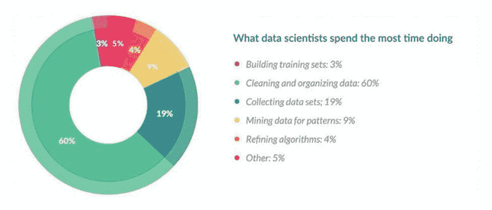

要考虑的另一项是许多数据科学家正在使用的数据集的大小。 随着数据集大小的增加，混乱数据的普及率也随之增加，同时清理难度也越来越大。

通常，简单地删除丢失的数据不是最佳选择，因为很难证明丢弃大多数字段具有值的样本。 这样做可能会丢失有价值的信息，从而可能损害最终模型的性能。

数据预处理中涉及的步骤可以分为以下几类：

*   **在公共字段上合并数据集**，以将所有数据合并到一个表中
*   **用于改善数据质量的特征工程**，例如，使用降维技术来构建新特征
*   **通过处理重复的行，不正确或缺失的值以及其他出现的问题来清理数据**
*   **通过标准化或标准化所需数据并将其分为训练和测试集来构建训练数据集**

让我们探索进行预处理的一些工具和方法。

### 探索数据预处理工具和方法

1.  通过执行`jupyter notebook`从项目目录启动`NotebookApp`。 导航到`Lesson-2`目录并打开`lesson-2-workbook.ipynb`文件。 找到顶部附近的程序包加载单元，然后运行它。

    我们将从展示 Pandas 和 scikit-learn 的一些基本工具开始。 然后，我们将更深入地研究重建缺失数据的方法。

2.  向下滚动至`Subtopic B: Preparing data for machine learning`，然后运行包含`pd.merge?`的单元格，以在笔记本中显示`merge`功能的文档字符串：

    

    如我们所见，该函数接受左右 DataFrame 进行合并。 您可以指定一个或多个列进行分组以及如何对其进行分组，即使用左，右，外部或内部值集。 让我们来看一个使用中的例子。

3.  退出帮助弹出窗口并运行包含以下示例 DataFrames 的单元格：

    ```py
    df_1 = pd.DataFrame({'product': ['red shirt', 'red shirt', 'red shirt', 'white dress'],\n",
                         'price': [49.33, 49.33, 32.49, 199.99]})\n",
    df_2 = pd.DataFrame({'product': ['red shirt', 'blue pants', 'white tuxedo', 'white dress'],\n",
                         'in_stock': [True, True, False, False]})
    ```

    在这里，我们将从头开始构建两个简单的 DataFrame。 可以看出，它们包含带有某些共享条目的`product`列。

    现在，我们将在`product`共享列上执行内部合并并打印结果。

4.  运行下一个单元格以执行内部合并：

    

    请注意，如何仅包括共享项**红色衬衫**和**白色连衣裙**。 为了包括两个表中的所有条目，我们可以做一个外部合并。 让我们现在开始。

5.  运行下一个单元格以执行外部合并：

    

    这将从每个表返回所有数据，其中缺失值已用`NaN`标记。

6.  运行下一个单元格以执行外部合并：

    

    这将从每个表返回所有数据，其中缺失值已用`NaN`标记。

由于是我们在书中第一次遇到`NaN`值，因此现在是讨论这些在 Python 中如何工作的好时机。

首先，您可以通过执行`a = float('nan')`来定义`NaN`变量。 但是，如果要测试是否相等，则不能简单地使用标准比较方法。 最好使用 NumPy 之类的库中的高级函数来执行此操作。 下面的代码对此进行了说明：


这些结果中的某些似乎违反直觉。 但是，此行为背后有逻辑，并且要更深入地了解标准比较返回`False`的基本原因，[请查看以下出色的 StackOverflow 线程](https://stackoverflow.com/questions/1565164/what-is-the-rationale-for-all-comparisons-returning-false-for-ieee754-nan-values)。

1.  您可能已经注意到，我们最近合并的表在前几行中有重复的数据。 让我们看看如何处理。

    运行包含`df.drop_duplicates()`的单元格以返回没有重复行的 DataFrame 版本：

    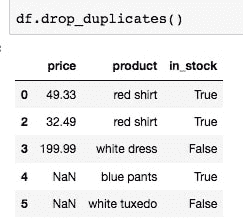

    这是删除重复行的最简单和“标准”的方式。 要将这些更改应用到`df`，我们可以设置`inplace=True`或执行类似`df = df.drop_duplicated()`的操作。 让我们看看另一种方法，该方法使用遮罩选择或删除重复的行。

2.  运行包含`df.duplicated()`的单元以打印`True/False`系列，标记重复的行：

    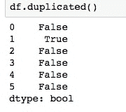

    我们可以将此结果的总和确定有多少行重复，也可以将其用作选择重复行的掩码。

3.  通过运行下面的两个单元来执行此操作：

    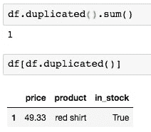

4.  我们可以使用简单的代字号（`~`）来计算掩码的相反值，以提取去重复的 DataFrame。 运行以下代码，并确信输出与`df.drop_duplicates()`中的输出相同：

    ```py
    df[~df.duplicated()]
    ```

    

5.  这也可以用于从完整 DataFrame 的子集中删除重复项。 例如，运行包含以下代码的单元格：

    ```py
    df[~df['product'].duplicated()]
    ```

    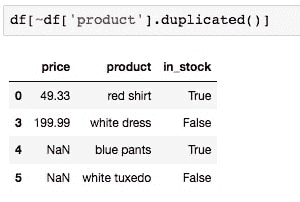

    在这里，我们正在做以下事情：

    *   为**产品**行创建遮罩（真假系列），其中重复项用`True`标记
    *   使用波浪号（`~`）与该掩码相反，以便将重复项标记为`False`，其他所有项均为`True`
    *   使用该掩码过滤掉`df`的`False`行，它们对应于重复的乘积

    不出所料，我们现在只剩下第一行**红色衬衫**行，因为已删除了重复的产品行。

    为了继续执行这些步骤，让我们将`df`替换为自身的重复数据删除版本。 这可以通过运行`drop_duplicates`并传递参数`inplace=True`来完成。

6.  通过运行包含以下代码的单元，对 DataFrame 进行重复数据删除并保存结果：

    ```py
    df.drop_duplicates(inplace=True)
    ```

    继续其他预处理方法，让我们忽略重复的行，并首先处理丢失的数据。 这是必需的，因为无法针对不完整的样本训练模型。 以**蓝色裤子**和**白色燕尾服**的缺失价格数据为例，让我们展示一些用于处理`NaN`值的选项。

7.  一种选择是删除行，如果您的`NaN`样本缺少大多数值，这可能是个好主意。 通过运行包含`df.dropna()`的单元格来做到这一点：

    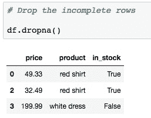

8.  如果某个功能缺少大多数值，则最好完全删除该列。 通过运行包含与以前相同方法的单元格来执行此操作，但是这次传递的`axis`参数指示列而不是行：

    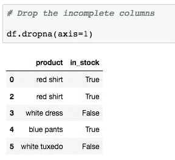

    通常，简单地降低`NaN`值通常不是最佳选择，因为丢失数据永远不会是一件好事，尤其是在仅丢失一小部分采样值的时。 Pandas提供了一种以多种不同方式填充`NaN`条目的方法，我们将在其中举例说明。

9.  运行包含`df.fillna?`的单元格以为 Pandas 的`NaN-fill`方法打印文档字符串：

    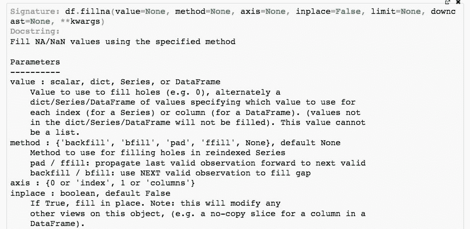

    注意`value`参数的选项； 例如，这可以是单个值或基于索引的字典/系列类型映射。 或者，我们可以将值保留为`None`并通过`fill`方法。 在本课中，我们将看到每个的示例。

10.  通过运行包含以下代码的单元格，用平均产品价格填写缺失的数据：

    ```py
    df.fillna(value=df.price.mean())
    ```

    

11.  现在，通过运行包含以下代码的单元格，使用`fillna`方法填充丢失的数据：

    ```py
    df.fillna(method='pad')
    ```

    

    请注意，**白色连衣裙**的价格是如何用来填补其下方缺失值的。

    总结本节，我们将准备简单表以训练机器学习算法。 不用担心，我们实际上不会尝试在如此小的数据集上训练任何模型！ 我们通过编码分类数据的类标签开始此过程。

12.  在对标签进行编码之前，请运行“建筑训练数据集”部分中的第一个单元格，以添加另一列代表平均产品评分的数据：

    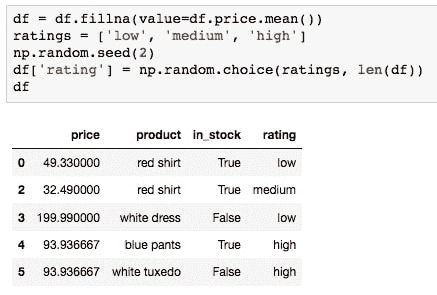

    假设我们要使用此表来训练预测模型，我们首先应该考虑将所有变量更改为数值类型。

13.  最简单的列是布尔列表：`in_stock`。 在将其用于训练预测模型之前，应将其更改为数值，例如`0`和`1`。 这可以通过许多方式来完成，例如，通过运行包含以下代码的单元格： 

    ```py
    df.in_stock = df.in_stock.map({False: 0, True: 1})
    ```

    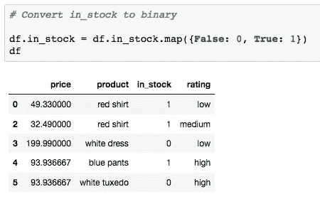

14.  编码功能的另一个选项是 scikit-learn 的`LabelEncoder`，可用于将类标签映射到更高级别的整数。 让我们通过运行包含以下代码的单元格进行测试：

    ```py
    from sklearn.preprocessing import LabelEncoder
    rating_encoder = LabelEncoder()
    _df = df.copy()
    _df.rating = rating_encoder.fit_transform(df.rating)
    _df
    ```

    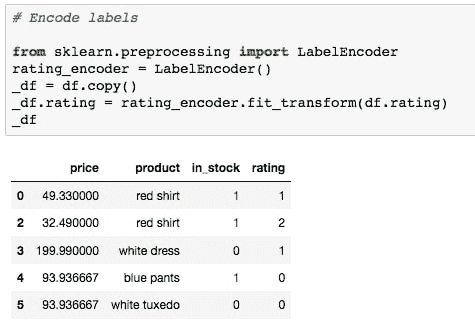

    在构建多项式模型时，这可能使我们想到在上一课中进行的预处理。 在这里，我们实例化一个标签编码器，然后使用`fit_transform`方法对其进行“训练”并“转换”我们的数据。 我们将结果应用于我们的 DataFrame `_df`的副本。

15.  然后，可以通过运行`rating_encoder.inverse_transform(df.rating)`，使用我们使用变量`rating_encoder`引用的类将这些特征转换回去：

    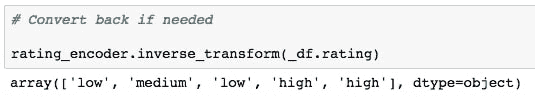

    您可能会在这里注意到一个问题。 我们正在使用所谓的“常规”功能，其中标签具有固有顺序。 在这种情况下，我们应该期望等级“ low”将被编码为 0，等级“ high”将被编码为 2。但是，这不是我们看到的结果。 为了实现正确的序号标签编码，我们应该再次使用 map 并自己构建字典。

16.  通过运行包含以下代码的单元格来正确编码顺序标签：

    ```py
    ordinal_map = {rating: index for index, rating in enumerate(['low', 'medium', 'high'])}
    print(ordinal_map)
    df.rating = df.rating.map(ordinal_map)
    ```

    

    我们首先创建映射字典。 这是使用字典理解和枚举完成的，但是从结果来看，我们发现可以很容易地手动定义。 然后，就像前面对`in_stock`列所做的那样，我们将字典映射应用于功能。 查看结果，我们发现评级现在比以前更有意义，其中`low`标记为`0`，`medium`标记为`1`，`high`标记为`2`。

    现在我们已经讨论了序数特征，让我们来谈谈另一种称为标称特征的类型。 这些是没有固有顺序的字段，在我们的案例中，我们看到`product`是一个完美的例子。

    大多数 scikit 学习模型都可以在这样的数据上进行训练，在这种数据中，我们使用字符串而不是整数编码的标签。 在这种情况下，必须在引擎盖下进行必要的转换。 但是，对于 scikit-learn 或其他机器学习和深度学习库中的所有模型而言，情况可能并非如此。 因此，优良作法是在预处理过程中自行编码。

17.  将类标签从字符串转换为数值的一种常用技术称为“单热编码”。 这会将不同的类拆分为单独的功能。 可以用`pd.get_dummies()`优雅地完成。 通过运行包含以下代码的单元格来执行此操作：

    ```py
    df = pd.get_dummies(df)
    ```

    最终的 DataFrame 如下所示：

    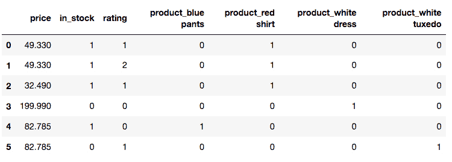

    在这里，我们看到了一次热编码的结果：`product`列已分为 4，每个唯一值一个。 在每一列中，我们找到`1`或`0`来代表该行是否包含特定值或乘积。

    继续前进并忽略任何数据缩放（通常应完成），最后一步是将数据分为训练集和测试集，以用于机器学习。 这可以使用 scikit-learn 的`train_test_split`完成。 假定其他功能值，我们假设我们将尝试预测某物品是否有库存。

18.  通过运行包含以下代码的单元，将数据分为训练集和测试集：

    ```py
    features = ['price', 'rating', 'product_blue pants',
                'product_red shirt', 'product_white dress',
                'product_white tuxedo']
    X = df[features].values
    target = 'in_stock'
    y = df[target].values
    from sklearn.model_selection import train_test_split
    X_train, X_test, y_train, y_test = \
        train_test_split(X, y, test_size=0.3)
    ```

    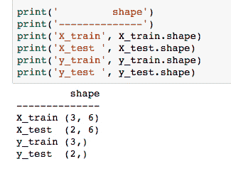

    在这里，我们正在选择数据的子集，并将其输入到`train_test_split`函数中。 此功能具有四个输出，这些输出被打包到功能（`X`）和目标（`y`）的训练和测试单元中。

    观察输出数据的形状，其中测试集大约有 30％的样本，训练集大约有 70％的样本。

    在准备用于训练预测模型的实际数据时，我们将在以后看到类似的代码块。

到此结束了有关在机器学习应用程序中使用的清洗数据的部分。 让我们花一点时间来说明我们的 Jupyter Notebook 在测试各种数据转换方法以及最终记录我们决定的管道方面的有效性。 通过在处理之前仅更改特定的代码单元，可以很容易地将应用于数据的更新版本。 另外，如果我们希望对处理进行任何更改，则可以在笔记本中轻松测试这些更改，并且可以更改特定的单元以适应更改。 实现此目的的最佳方法可能是将笔记本复制到新文件中，以便我们始终可以保留原始分析的副本以供参考。

继续进行一项活动，我们现在将本节中的概念应用于大型数据集，以准备用于训练预测模型。

## 活动 A：准备训练员工保留问题的预测模型

假设您被雇用为一家公司寻求自由职业，该公司希望找到有关其雇员离职原因的见解。 他们收集了一套他们认为在这方面将有所帮助的数据。 它包括有关员工满意度，评估，工作时间，部门和薪水的详细信息。

该公司通过向您发送一个名为 hr_data.csv 的文件并询问您认为可以做什么来帮助阻止员工离职，与您共享数据。

要将迄今学到的概念应用于现实生活中的问题。 我们尤其希望：

*   根据可用数据，确定使用预测分析提供有影响力的业务见解的计划。
*   准备用于机器学习模型的数据。

### 注意

从本活动的开始，并继续本课程的其余部分，我们将使用*人力资源分析*，它是一个 Kaggle 数据集。

我们在本书中使用的数据集与在线版本之间存在细微的差异。 我们的人力资源分析数据包含一些`NaN`值。 这些是从数据集的在线版本中手动删除的，目的是说明数据清理技术。 出于相同的目的，我们还添加了称为`is_smoker`的数据列。

1.  打开`lesson-2-workbook.ipynb`笔记本文件，滚动到`Activity A`部分。
2.  通过运行以下代码来检查表的标题：

    ```py
    %%bash
    head ../data/hr-analytics/hr_data.csv
    ```

    从输出来看，使自己确信它看起来是标准 CSV 格式。 对于 CSV 文件，我们应该能够简单地使用`pd.read_csv`加载数据。

3.  通过运行`df = pd.read_csv('../data/hr-analytics/hr_data.csv')`将数据加载到 Pandas 中。 使用制表符补全可帮助键入文件路径。
4.  通过打印`df.columns`检查列，并通过使用`df.head()`和`df.tail()`打印 DataFrame  `head`和`tail`来确保数据已按预期加载：

    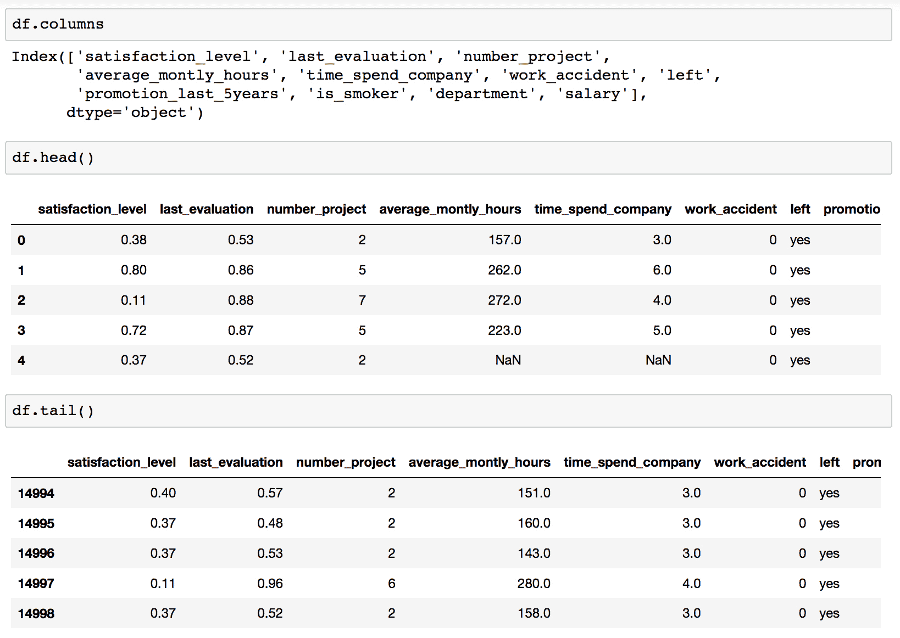

    我们可以看到它似乎已正确加载。 根据`tail`索引值，大约有 15,000 行； 确保我们没有错过任何机会。

5.  使用以下代码检查 CSV 文件中的行数（包括标题）：

    ```py
    with open('../data/hr-analytics/hr_data.csv') as f:
        print(len(f.read().splitlines()))
    ```

    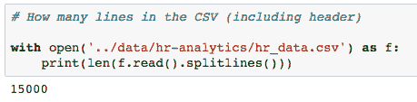

6.  将此结果与`len(df)`进行比较，以确保我们已加载所有数据：

    

现在已经正确加载了客户的数据，让我们考虑一下如何使用预测分析来找到有关其员工离职原因的见解。

让我们完成创建预测分析计划的第一步：

*   **查看可用数据**：我们已经通过查看列，数据类型和样本数量来完成此操作
*   **确定业务需求**：客户明确表达了他们的需求：减少离职员工的数量
*   **评估数据的适用性**：鉴于提供的数据，让我们尝试确定可以帮助满足客户需求的计划

回想一下，如前所述，有效的分析技术可以产生有影响力的业务决策。 考虑到这一点，如果我们能够预测员工离职的可能性，那么业务可以有选择地针对这些员工进行特殊待遇。 例如，可以提高他们的薪水或减少他们的项目数量。 此外，可以使用模型估算这些变化的影响！

为了评估该计划的有效性，让我们考虑一下我们的数据。 每行代表在公司工作或已离职的雇员，如名为**剩余**的列所标记。 因此，给定一组功能，我们可以训练一个模型来预测此目标。

评估目标变量。 通过运行以下代码来检查丢失条目的分布和数量：

```py
df.left.value_counts().plot('barh')
print(df.left.isnull().sum())
```


这是第二行代码的输出：


大约四分之三的样本是尚未离开的员工。 离开的小组构成了样本的其他四分之一。 这告诉我们我们正在处理一个不平衡的分类问题，这意味着我们在计算精度时必须采取特殊措施来考虑每个类别。 我们还看到没有目标变量丢失（没有`NaN`值）。

现在，我们将评估这些功能：

1.  通过执行`df.dtypes`打印每个数据类型。 观察我们如何结合使用连续和离散功能：

    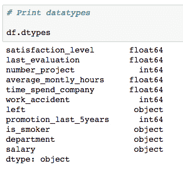

2.  通过运行以下代码来显示功能部件分发：

    ```py
    for f in df.columns:try:fig = plt.figure()…
    …
            print('-'*30)
    ```

### 注意

有关完整的代码，请参考`Lesson 2`文件夹中的`Lesson 2.txt`文件。

该代码段有些复杂，但是对于显示数据集中的连续特征和离散特征的概述非常有用。 本质上，它假定每个特征都是连续的，并尝试绘制其分布，如果该特征是离散的，则还原为简单地绘制值计数。

结果如下：


对于许多要素，我们看到可能值的分布范围很广，表明要素空间中的变化很大。 这令人鼓舞； 在的较小范围内强烈分组的特征可能对模型不是很有帮助。 `promotion_last_5years`就是这种情况，我们看到绝大多数样本为 0。

我们需要做的下一步是从数据集中删除所有`NaN`值。

1.  通过运行以下代码，检查每列中有多少个`NaN`值：

    ```py
    df.isnull().sum() / len(df) * 100
    ```

    

    我们可以看到`average_montly_hours`丢失了约 2.5％，`time_spend_company`丢失了 1％，`is_smoker`丢失了 98％！ 让我们使用已经学到的几种不同策略来处理这些策略。

2.  由于`is_smoker`指标中几乎没有任何信息，因此让我们删除此列。 通过运行以下命令来执行此操作：`del df['is_smoker']`。
3.  由于`time_spend_company`是一个整数字段，因此我们将使用中位数来填充此列中的`NaN`值。 可以使用以下代码完成此操作：

    ```py
    fill_value = df.time_spend_company.median()
    df.time_spend_company = df.time_spend_company.fillna(fill_value)
    ```

    最后要处理的列是`average_montly_hours`。 我们可以做类似的事情，并使用中位数或四舍五入的平均值作为整数填充值。 但是，让我们尝试利用其与另一个变量的关系。 这可以使我们更准确地填充丢失的数据。

4.  制作一个由`number_project`分段的`average_montly_hours`箱形图。 这可以通过运行以下代码来完成：

    ```py
    sns.boxplot(x='number_project', y='average_montly_hours', data=df)
    ```

    

    我们可以看到项目数量与`average_monthly_hours`之间的关系，这一结果不足为奇。 我们将通过不同地填充`average_montly_hours`的`NaN`值来利用这种关系，具体取决于该样本的项目数量。 具体来说，我们将使用每组的平均值。

5.  通过运行以下代码来计算每个组的平均值：

    ```py
    mean_per_project = df.groupby('number_project')\
                        .average_montly_hours.mean()
    mean_per_project = dict(mean_per_project)
    print(mean_per_project)
    ```

    

    然后，我们可以将其映射到`number_project`列，并将生成的系列对象作为参数传递给`fillna`。

6.  通过执行以下代码，将`average_montly_hours`中的`NaN`值填充：

    ```py
    fill_values = df.number_project.map(mean_per_project)
    df.average_montly_hours = df.average_montly_hours.fillna(fill_values)
    ```

7.  通过运行以下断言测试，确认`df`不再具有`NaN`值。 如果它没有引发错误，则说明您已成功从表中删除了`NaN`：

    ```py
    assert df.isnull().sum().sum() == 0
    ```

8.  最后，我们将字符串和布尔值字段转换为整数表示形式。 特别是，我们将手动将目标变量`left`从`yes`和`no`转换为`1`和`0`，并构建一键编码的特征。 通过运行以下代码来执行此操作：

    ```py
    df.left = df.left.map({'no': 0, 'yes': 1})
    df = pd.get_dummies(df)
    ```

9.  打印`df.columns`以显示字段：

    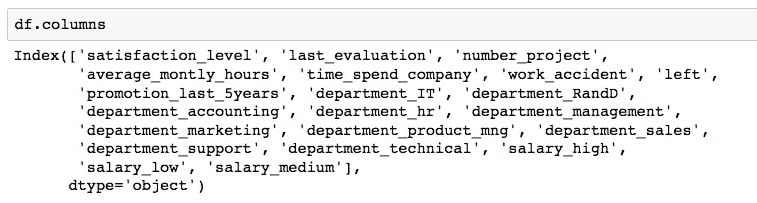

    我们可以看到`department`和`salary`被拆分成各种二进制特征。

    为机器学习准备数据的最后一步是缩放功能，但是由于各种原因（例如，某些模型不需要缩放），我们将在下一个活动中将其作为模型训练工作流的一部分进行。

10.  我们已经完成了数据预处理，并准备继续进行训练模型！ 让我们通过运行以下代码来保存预处理的数据：

    ```py
    df.to_csv('../data/hr-analytics/hr_data_processed.csv', index=False)
    ```

同样，我们在此处暂停，以注意 Jupyter Notebook 在执行此初始数据分析和清理时满足我们的需求的程度。 想象一下，例如，我们将这个项目保留了几个月的时间。 回到它之后，我们可能不记得刚离开它时到底发生了什么。 不过，回头看这个笔记本，我们将能够追溯我们的步骤，并迅速回忆起我们先前所学到的有关数据的知识。 此外，我们可以使用任何新数据更新数据源，然后重新运行笔记本以准备用于我们的机器学习算法的新数据集。 回想一下在这种情况下，最好先制作一个笔记本副本，以免丢失初始分析结果。

总而言之，我们已经学习并应用了准备训练机器学习模型的方法。 我们首先讨论了确定可通过预测分析解决的问题的步骤。 这包括：

*   查看可用数据
*   确定业务需求
*   评估数据的适用性

我们还讨论了如何识别监督与非监督以及回归与分类问题。

找出问题所在后，我们学习了使用 Jupyter Notebooks 构建和测试数据转换管道的技术。 这些技术包括用于填充缺失数据，转换分类特征以及构建训练/测试数据集的方法和最佳实践。

在本课程的其余部分中，我们将使用预处理后的数据来训练各种分类模型。 为了避免盲目地应用我们不了解的算法，我们首先介绍它们并概述它们的工作方式。 然后，我们使用 Jupyter 来训练和比较其预测能力。 在这里，我们有机会讨论机器学习中的更多高级主题，例如过度拟合，k 折交叉验证和验证曲线。

# 训练分类模型

正如我们在上一课中已经看到的那样，使用诸如 scikit-learn 之类的库和诸如 Jupyter 之类的平台，可以仅用几行代码来训练预测模型。 通过抽象化与优化模型参数有关的困难计算，可以做到这一点。 换句话说，我们处理一个黑盒，内部操作被隐藏。 这种简单性也带来了滥用算法的危险，例如在训练过程中过度拟合或无法正确测试看不见的数据。 我们将展示如何在训练分类模型时避免这些陷阱，并通过使用 k 折交叉验证和验证曲线来产生可信赖的结果。

## 子主题 A：分类算法简介

回想一下监督机器学习的两种类型：回归和分类。 在回归中，我们预测一个连续的目标变量。 例如，回顾第一课的线性和多项式模型。 在本课程中，我们将重点介绍另一种类型的监督式机器学习：分类。 在这里，目标是使用可用指标来预测样本的类别。

在最简单的情况下，只有两个可能的类，这意味着我们正在执行二进制分类。 本课中的示例问题就是这种情况，我们尝试预测员工是否离开。 如果我们有两个以上的类标签，则我们正在进行多类分类。

尽管在使用 scikit-learn 训练模型时，二进制分类和多类分类之间几乎没有区别，但是在“黑匣子”内部进行的操作却明显不同。 特别是，多类别分类模型通常使用“一休”方法。 对于具有三个类别标签的情况，其工作原理如下。 当模型与数据“拟合”时，将训练三个模型，并且每个模型都会预测样本是属于单个类别还是属于某个其他类别。 这可能使我们想到了以前对功能进行的一键编码。 当对样本进行预测时，将返回具有最高置信度的类别标签。

在本课程中，我们将训练三种类型的分类模型：支持向量机，随机森林和 k 最近邻分类器。 这些算法中的每一个都有很大的不同。 但是，正如我们将看到的，由于 scikit-learn，它们与训练和用于预测非常相似。 在切换到 Jupyter Notebook 并实现它们之前，我们将简要了解它们的工作原理。

SVM 试图找到最佳的超平面来划分类别。 这是通过最大化超平面和每个类别的最近样本（称为支持向量）之间的距离来完成的。

该线性方法还可用于使用内核技巧对非线性类进行建模。 此方法将特征映射到确定超平面的更高维空间中。 我们一直在谈论的这个超平面也称为决策面，我们将在训练模型时对其进行可视化。

k 最近邻分类算法可存储训练数据并根据特征空间中的 K 个最近样本进行预测。 具有三个特征，可以将其可视化为预测样本周围的球体。 但是，我们经常要处理三个以上的特征，因此绘制超球面以找到最接近的 K 个样本。

随机森林是决策树的集合，其中每个决策树都已在训练数据的不同子集上进行了训练。

决策树算法基于一系列决策对样本进行分类。 例如，第一个决定可能是“如果特征 x_1 小于或大于 0”。 然后，将在这种情况下拆分数据，并将其馈送到树的下降分支中。 决策树中的每个步骤都是基于最大程度地提高信息增益的特征拆分来决定的。

本质上，该术语描述了试图选择目标变量的最佳分割的数学。

训练随机森林包括为一组决策树创建引导数据集（即带替换的随机采样数据）数据集。 然后根据多数表决做出预测。 这些具有减少过度拟合和更好地泛化的好处。

### 注意

决策树可用于对连续和分类数据的混合进行建模，这使它们非常有用。 此外，正如我们将在本课程后面看到的那样，可以限制树的深度以减少过度拟合。 要详细了解决策树算法，[请查看以下流行的 StackOverflow 答案](https://stackoverflow.com/a/1859910/3511819)。

作者在那里展示了一个简单的示例，并讨论了诸如节点纯度，信息增益和熵之类的概念。

### 使用 scikit-learn 训练两特征分类模型

我们将继续解决第一个主题中介绍的员工保留问题。 我们先前准备了用于训练分类模型的数据集，在该数据集中我们预测了员工是否离开。 现在，我们将获取这些数据并将其用于训练分类模型：

1.  如果您尚未这样做，请启动`NotebookApp`并打开`lesson-2-workbook.ipynb`文件。 向下滚动到`Topic B: Training classification models`。 运行前几个单元格以设置默认图形尺寸，并将我们先前保存的处理后的数据加载到 CSV 文件中。

    对于此示例，我们将在两个连续的特征上训练分类模型：`satisfaction_level`和`last_evaluation`。

2.  通过使用以下代码运行单元格，绘制连续目标变量的双变量和单变量图：

    ```py
    sns.jointplot('satisfaction_level', 'last_evaluation',
                  data=df, kind='hex')
    ```

    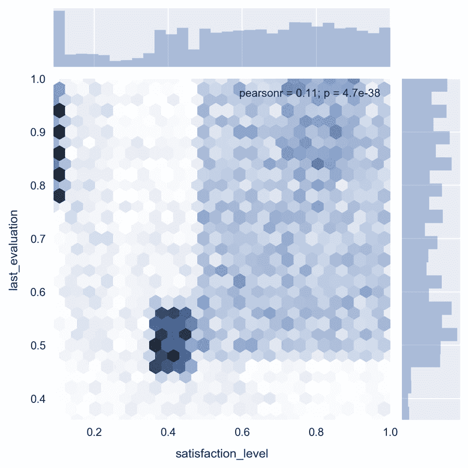

    如上图所示，数据中有一些非常不同的模式。

3.  通过运行包含以下代码的单元格，重新绘制双变量分布，对目标变量进行分段：

    ```py
    plot_args = dict(shade=True, shade_lowest=False)
    for i, c in zip((0, 1), ('Reds', 'Blues')):
        sns.kdeplot(df.loc[df.left==i, 'satisfaction_level'],
                    df.loc[df.left==i, 'last_evaluation'],
                    cmap=c, **plot_args)
    ```

    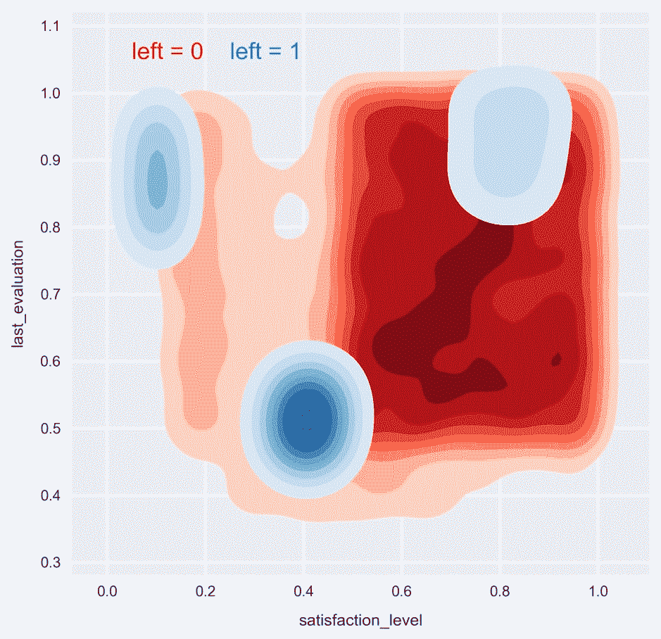

    现在，我们可以看到模式与目标变量之间的关系。 在本节的其余部分，我们将尝试利用这些模式来训练有效的分类模型。

4.  通过运行包含以下代码的单元，将数据分为训练集和测试集：

    ```py
    from sklearn.model_selection import train_test_splitfeatures = ['satisfaction_level', 'last_evaluation']X_train, X_test, y_train, y_test = train_test_split(df[features].values, df['left'].values,
        test_size=0.3, random_state=1)
    ```

    当对输入数据进行缩放以使所有特征都处于相同的顺序时，我们的前两个模型（支持向量机和 k 最近邻算法）最有效。 我们将使用 scikit-learn 的`StandardScaler`完成此操作。

5.  加载`StandardScaler`并创建一个新实例，如`scaler`变量所引用。 将洁牙机安装在训练集上并进行变换。 然后，变换测试集。 运行包含以下代码的单元格：

    ```py
    from sklearn.preprocessing import StandardScalerscaler = StandardScaler()
    X_train_std = scaler.fit_transform(X_train)
    X_test_std = scaler.transform(X_test)
    ```

    ### 注意

    在进行机器学习时，一个容易犯的错误是使缩放器“适合”整个数据集，而实际上它仅应“适合”训练数据。 例如，在拆分为训练集和测试集之前缩放数据是错误的。 我们不希望这样做，因为模型训练不应受到测试数据的任何影响。

6.  导入 scikit-learn 支持向量机类，并通过运行包含以下代码的单元格将模型拟合到训练数据上：

    ```py
    from sklearn.svm import SVCsvm = SVC(kernel='linear', C=1, random_state=1)
    svm.fit(X_train_std, y_train)
    ```

    然后，我们训练线性 SVM 分类模型。 `C`参数控制分类错误的代价，从而可以控制模型的方差和偏差。

7.  通过运行包含以下代码的单元格，对看不见的数据计算此模型的准确性：

    ```py
    from sklearn.metrics import accuracy_scorey_pred = svm.predict(X_test_std)acc = accuracy_score(y_test, y_pred)print('accuracy = {:.1f}%'.format(acc*100))
    >> accuracy = 75.9%
    ```

    我们预测测试样本的目标，然后使用 scikit-learn 的`accuracy_score`函数确定准确性。 结果看起来很有希望，达到〜75％！ 对于我们的第一个模型来说还不错。 但是请记住，目标是不平衡的。 让我们看看每个班级的预测有多准确。

8.  计算混淆矩阵，然后通过运行包含以下代码的单元格来确定每个类别中的准确性：

    ```py
    from sklearn.metrics import confusion_matrixcmat = confusion_matrix(y_test, y_pred)scores = cmat.diagonal() / cmat.sum(axis=1) * 100print('left = 0 : {:.2f}%'.format(scores[0]))print('left = 1 : {:.2f}%'.format(scores[1]))
    >> left = 0 : 100.00%
    >> left = 1 : 0.00%
    ```

    看起来该模型只是将每个样本分类为`0`，这显然根本没有帮助。 让我们使用等高线图显示要素空间中每个点的预测类。 这通常称为决策区域图。

9.  使用来自`mlxtend`库的有用函数来绘制决策区域。 运行包含以下代码的单元格：

    ```py
    from mlxtend.plotting import plot_decision_regionsN_samples = 200X, y = X_train_std[:N_samples], y_train[:N_samples]
    plot_decision_regions(X, y, clf=svm)
    ```

    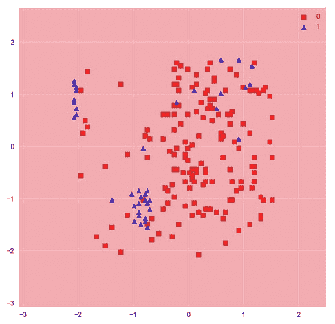

    该函数绘制决策区域以及通过作为参数传递的一组样本。 为了正确查看决策区域而没有太多样本遮挡我们的视线，我们仅将测试数据的 200 个样本子集传递给`plot_decision_regions`函数。 在这种情况下，当然没关系。 我们看到结果完全是红色的，表明要素空间中的每个点都将归为 0。

    线性模型不能很好地描述这些非线性模式，不足为奇。 回想一下，我们提到了使用 SVM 对非线性问题进行分类的内核技巧。 让我们看看这样做是否可以改善结果。

10.  通过运行包含 SVC 的单元，为 scikit-learn 的 SVM 打印文档字符串。 向下滚动并查看参数说明。 注意`kernel`选项，该选项实际上默认为`rbf`启用。 使用此`kernel`选项通过运行包含以下代码的单元来训练新的 SVM：

    ```py
    svm = SVC(kernel='rbf', C=1, random_state=1)
    svm.fit(X_train_std, y_train)
    ```

11.  为了更轻松地评估此模型以及将来的模型性能，我们定义一个名为`check_model_fit`的函数，该函数计算可用于比较模型的各种指标。 运行定义此功能的单元格。

    在此示例中已经看到了在此函数中完成的每个计算； 它仅计算精度并绘制决策区域。

12.  通过运行包含以下代码的单元，在训练数据上显示新训练的内核-SVM 结果：

    ```py
    check_model_fit(svm, X_test_std, y_test)
    ```

    

    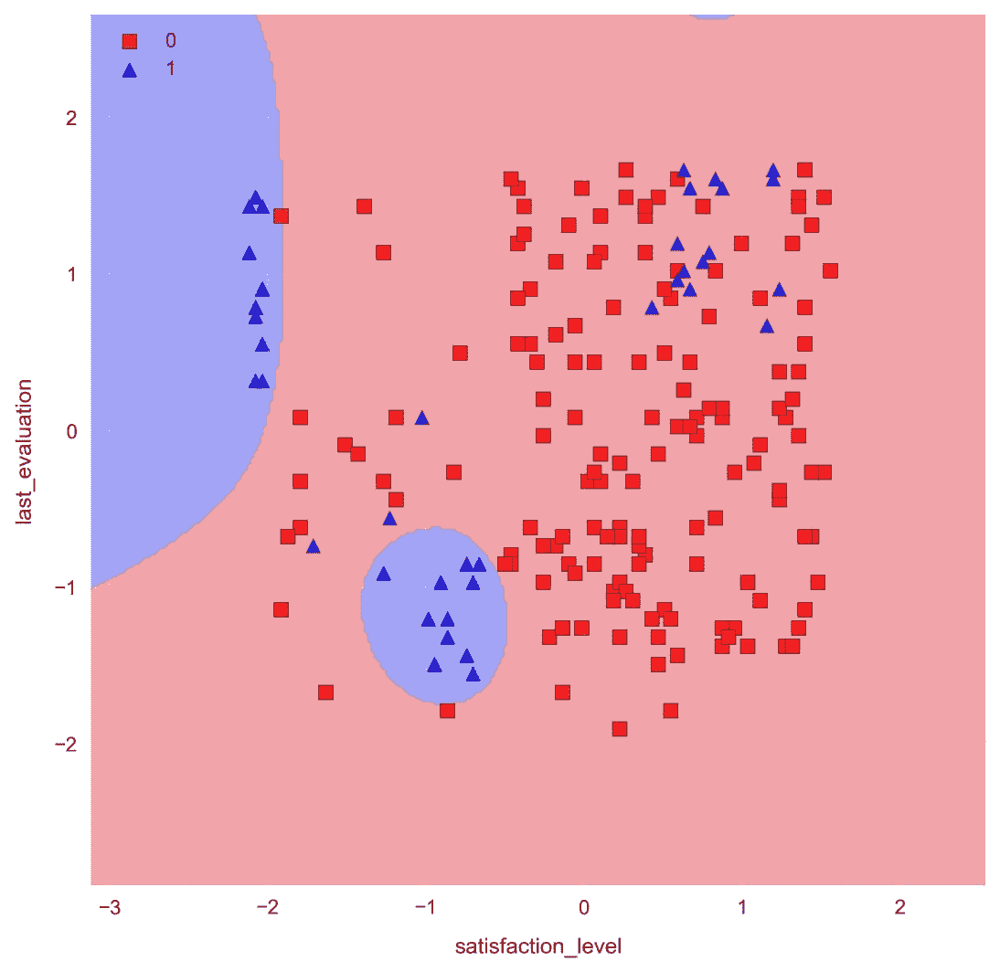

    结果要好得多。 现在，我们可以捕获数据中的某些非线性模式，并正确地对大多数离职员工进行分类。

### plot_decision_regions 函数

`plot_decision_regions`函数由`mlxtend`提供，Sebastian Raschka 开发了 Python 库。 值得一看一下源代码（当然是用 Python 编写的）以了解如何绘制这些图。 确实不是太复杂。

在 Jupyter Notebook 中，使用`from mlxtend.plotting import plot_decision_regions`导入该功能，然后使用`plot_decision_regions?`拉起帮助，然后滚动到底部以查看本地文件路径：

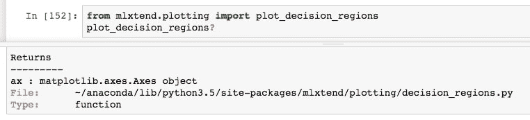

然后，打开文件并签出！ 例如，您可以在笔记本中运行`cat`：

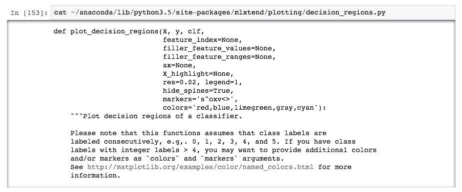

可以，但是不理想，因为该代码没有颜色标记。 最好将其复制（这样就可以避免意外更改原件）并使用您喜欢的文本编辑器将其打开。

当提请注意负责映射决策区域的代码时，我们会看到跨越特征空间的数组`X_predict`上的预测`Z`轮廓图。

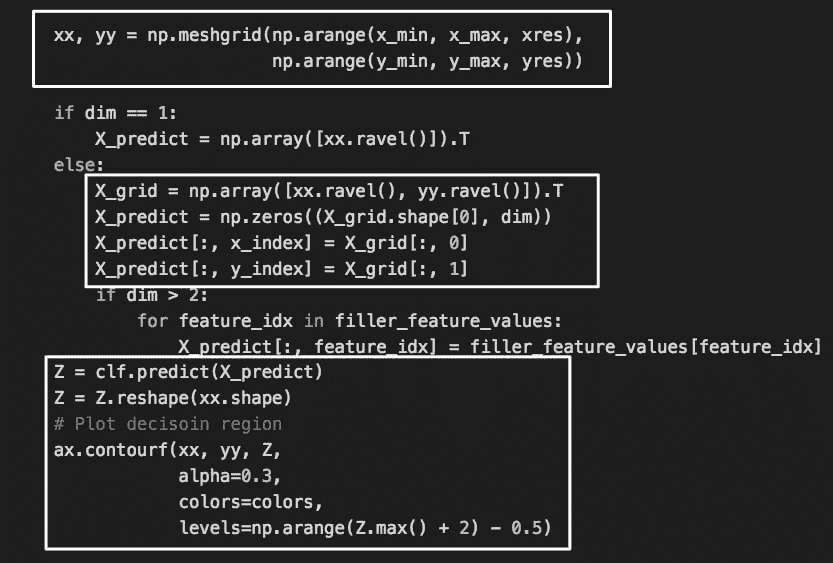

让我们继续下一个模型：k 最近邻居。

### 为模型训练 k 最近邻

1.  加载 scikit-learn KNN 分类模型并通过运行包含以下代码的单元格来打印文档字符串：

    ```py
    from sklearn.neighbors import KNeighborsClassifier
    KNeighborsClassifier?
    ```

    `n_neighbors`参数决定进行分类时要使用的样本数量。 如果权重参数设置为统一，则类别标签由多数表决决定。 权重的另一个有用选择是距离，距离越近的样本在投票中的权重越高。 像大多数模型参数一样，最佳选择取决于特定的数据集。

2.  用`n_neighbors = 3`训练 KNN 分类器，然后计算准确性和决策区域。 运行包含以下代码的单元格：

    ```py
    knn = KNeighborsClassifier(n_neighbors=3)
    knn.fit(X_train_std, y_train)
    check_model_fit(knn, X_test_std, y_test)
    ```

    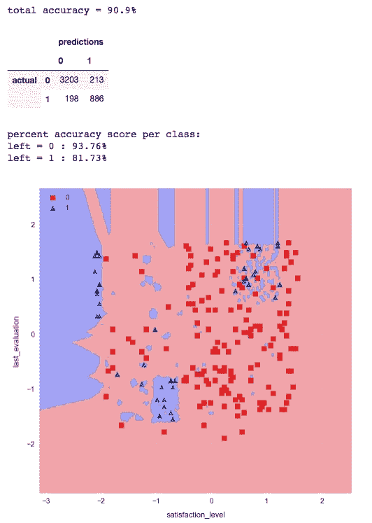

    

    特别是对于类别 1，我们看到了整体准确性的提高，并且有了显着提高。 但是，决策区域图将表明我们过度拟合了数据。 坚硬的，“不稳定的”决策边界和到处都是蓝色的小口袋可以证明这一点。 我们可以通过增加最近邻居的数量来软化决策边界并减少过度拟合。

3.  通过运行包含以下代码的单元，使用`n_neighbors = 25`训练 KNN 模型：

    ```py
    knn = KNeighborsClassifier(n_neighbors=25)knn.fit(X_train_std, y_train)
    check_model_fit(knn, X_test_std, y_test)
    ```

    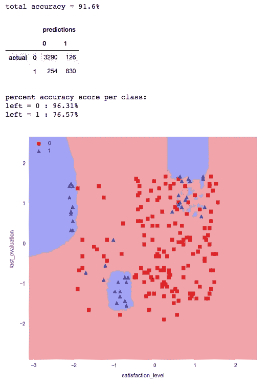

    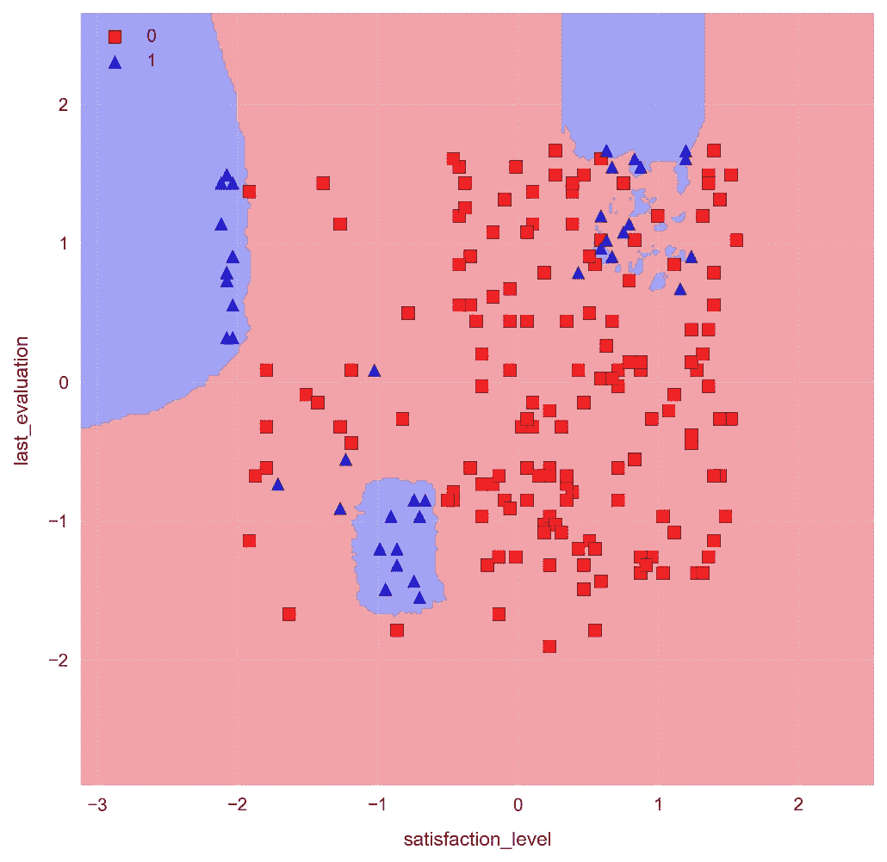

    如我们所见，决策边界的波动性大大降低，蓝色的口袋也大大减少了。 1 类的准确性略低，但是我们需要使用更全面的方法（例如 K 折交叉验证）来确定两个模型之间是否存在显着差异。

    请注意，增加`n_neighbors`对训练时间没有影响，因为该模型只是存储数据。 但是，预测时间将受到很大影响。

### 注意

在使用现实数据进行机器学习时，重要的是算法必须足够快地运行以达到其目的。 例如，用于预测的明天超过一天运行时间的脚本完全没有用！ 在处理大量数据时，还应考虑内存问题。

我们现在将训练一个随机森林。

### 训练随机森林

### 注意

观察在每个模型上进行训练和做出预测的相似之处，尽管每个内部都有很大差异。

1.  训练由 50 个决策树组成的随机森林分类模型，每个决策树的最大深度为 5。 运行包含以下代码的单元格：

    ```py
    from sklearn.ensemble import RandomForestClassifierforest = RandomForestClassifier(n_estimators=50, max_depth=5,random_state=1)
    forest.fit(X_train, y_train)
    check_model_fit(forest, X_test, y_test)
    ```

    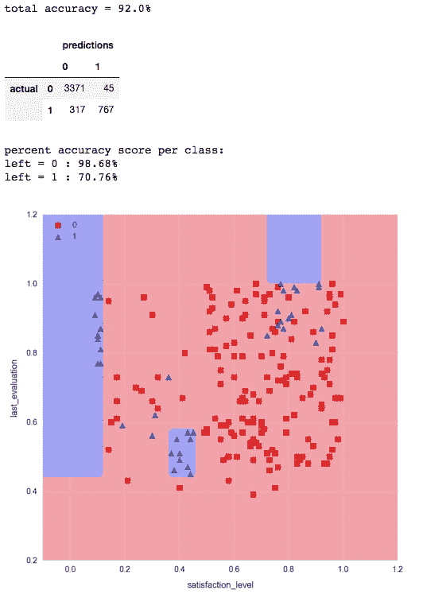

    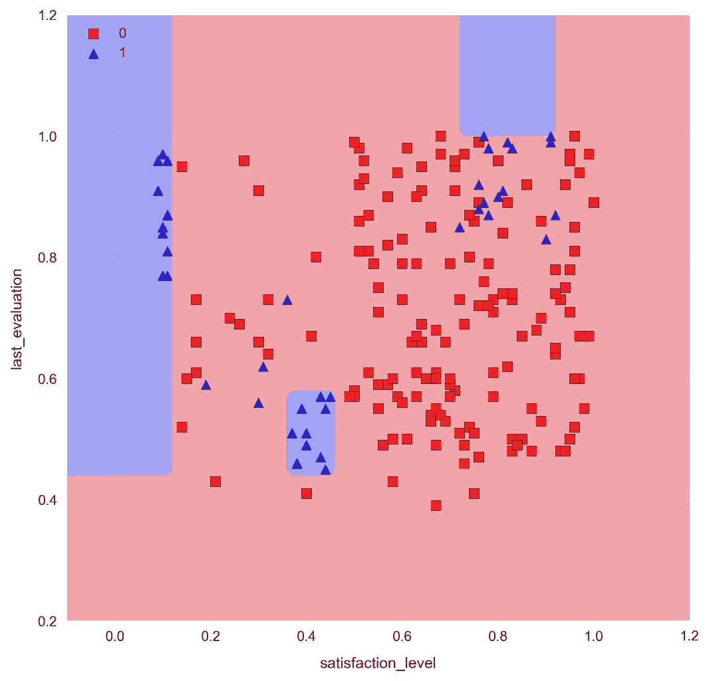

    注意决策树机器学习算法产生的独特的轴平行决策边界。

    我们可以访问用于构建随机森林的任何单个决策树。 这些树存储在模型的`estimators_attribute`中。 让我们绘制这些决策树之一，以了解正在发生的事情。 执行此需要 **graphviz** 依赖项，有时可能很难安装。

2.  通过运行包含以下代码的单元格，在 Jupyter Notebook 中绘制决策树之一：

    ```py
    from sklearn.tree import export_graphvizimport graphvizdot_data = export_graphviz(forest.estimators_[0],out_file=None, feature_names=features,  class_names=['no', 'yes'],  filled=True, rounded=True,  special_characters=True)graph = graphviz.Source(dot_data)
    graph
    ```

    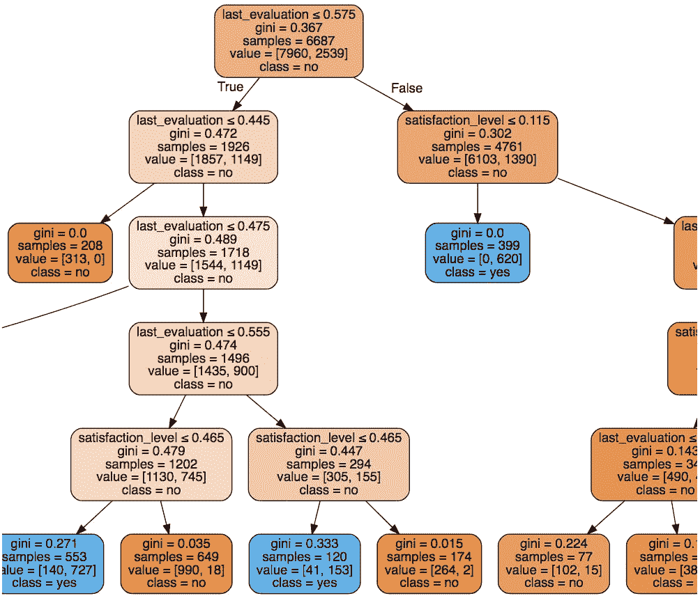

    我们可以看到，由于设置了`max_depth=5`，每个路径限制为五个节点。 橙色框代表**否**（尚未离开公司）的预测，蓝色框代表**是**（已离开公司）。 每个框的阴影（浅色，深色等）表示置信度，与`gini`值相关。

总而言之，我们已经完成了本节中的两个学习目标：

*   我们对支持向量机（SVM），k 最近邻分类器（kNN）和随机森林有了定性的了解
*   现在，我们可以使用 scikit-learn 和 Jupyter Notebook 训练各种模型，因此我们可以放心地建立和比较预测模型

特别是，我们使用了来自员工保留问题的预处理数据来训练分类模型，以预测员工是否已离开公司。 为了使事情简单并着重于算法，我们建立了模型来预测这一点，仅给出两个特征：满意度和最后评估值。 这个二维特征空间还使我们能够可视化决策边界并确定过度拟合的外观。

在以下部分中，我们将介绍机器学习中的两个重要主题：k 折交叉验证和验证曲线。

## 子主题 B：具有 k 折交叉验证和验证曲线的评估模型

到目前为止，我们已经在数据的子集上训练了模型，然后在看不见的部分（称为测试集）上评估了性能。 这是一个好习惯，因为训练数据的模型性能不能很好地表明其作为预测变量的有效性。 通过过度拟合模型来提高训练数据集的准确性非常容易，这可能会导致看不见的数据性能下降。

就是说，仅这样的数据分割训练模型还不够好。 数据中存在自然差异，这会导致准确性根据训练和测试分裂而有所不同（甚至略有不同）。 此外，仅使用一个训练/测试组来比较模型会导致对某些模型的偏见并导致过度拟合。

**K 折交叉验证**为提供了解决此问题的方法，并允许通过每次准确性计算中的误差估计来解决方差。 反过来，这自然会导致使用验证曲线来调整模型参数。 这些将精度绘制为超参数的函数，例如随机森林中使用的决策树数或最大深度。

### 注意

这是我们第一次使用术语超参数。 它引用初始化模型时定义的参数，例如 SVM 的`C`参数。 这与训练后的模型的参数（例如训练后的 SVM 的决策边界超平面的方程式）相反。

下图说明了该方法，其中我们看到了如何从数据集中选择 k 折：


k 折交叉验证算法如下：

1.  将数据拆分为大小近似相等的 k 个“折叠”。
2.  在不同的折叠组合上测试并训练`k`模型。 每个模型将包括`k-1`折叠训练数据，剩余的折叠用于测试。 在这种方法中，每个折叠最终仅被用作一次验证数据。
3.  通过取`k`值的平均值来计算模型精度。 还计算标准偏差以在值上提供误差线。

标准设置为`k = 10`，但如果使用大数据集，则应考虑使用`k`较小的值。

此验证方法可用于可靠地比较具有不同超参数（例如，SVM 的`C`参数或 KNN 分类器中最近邻居的数量）的模型性能。 它也适合比较完全不同的模型。

一旦确定了*最佳模型*，应在整个数据集上对其进行重新训练，然后再用于预测实际分类。

当使用 scikit-learn 实现此功能时，通常会使用略微改进的普通 K 折算法的变体来代替。 这被称为**分层 K 折**。 的改进之处在于，分层的 K 折交叉验证可在折叠中大致维持类标签种群。 可以想象，这减少了模型的整体方差，并降低了高度不平衡的模型引起偏差的可能性。

**验证曲线**是训练和验证指标作为某些模型参数的函数的图。 它们使我们能够进行良好的模型参数选择。 在本书中，我们将使用准确性得分作为这些图的度量。

### 注意

[可在此处找到绘图验证曲线的文档](http://scikit-learn.org/stable/auto_examples/model_selection/plot_validation_curve.html)。

考虑以下验证曲线，在该曲线中，准确度得分是根据伽玛 SVM 参数绘制的：


从图的左侧开始，我们可以看到两组数据在得分上都一致，这很好。 但是，与其他伽玛值相比，该分数也很低，因此我们说该模型不适合数据。 随着伽马的增加，我们可以看到一点，这两条线的误差线不再重叠。 从这一点开始，我们看到分类器过度拟合数据，因为与验证集相比，模型在训练集上的表现越来越好。 可以通过在两行误差线重叠的情况下寻找较高的验证分数来找到伽玛参数的最佳值。

请记住，某些参数的学习曲线仅在其他参数保持不变时才有效。 例如，如果在该图中训练 SVM，我们可以决定选择 10-4 数量级的伽玛。 但是，我们可能还想优化`C`参数。 如果`C`的值不同，则前面的图将不同，并且我们对 gamma 的选择可能不再是最佳的。

### 在带有 scikit-learn 的 Python 中使用 k 折交叉验证和验证曲线

1.  如果您尚未这样做，请启动`NotebookApp`并打开`lesson-2-workbook.ipynb`文件。 向下滚动至`Subtopic B: K-fold cross-validation and validation curves`。

    训练数据应该已经在笔记本的内存中，但是让我们重新加载它以提醒我们正在使用什么。

2.  加载数据并为训练/验证集选择`satisfaction_level`和`last_evaluation`功能。 这次我们将不使用火车测试拆分，因为我们将改用 k 折验证。 运行包含以下代码的单元格：

    ```py
    df = pd.read_csv('../data/hr-analytics/hr_data_processed.csv')
    features = ['satisfaction_level', 'last_evaluation']
    X = df[features].values
    y = df.left.values
    ```

3.  通过运行包含以下代码的单元来实例化随机森林模型：

    ```py
    clf = RandomForestClassifier(n_estimators=100, max_depth=5)
    ```

4.  为了使用分层的 K 折交叉验证来训练模型，我们将使用`model_selection.cross_val_score`函数。

    使用分层 k 折检验训练我们模型`clf`的 10 个变体。 请注意，默认情况下，scikit-learn 的`cross_val_score`会进行这种类型的验证。 运行包含以下代码的单元格：

    ```py
    from sklearn.model_selection import cross_val_score
    np.random.seed(1)
    scores = cross_val_score(
    		estimator=clf,
    		X=X,
    		y=y,
    		cv=10)
    print('accuracy = {:.3f} +/- {:.3f}'.format(scores.mean(), scores.
    std()))
    >> accuracy = 0.923 +/- 0.005
    ```

    注意我们如何使用`np.random.seed`设置随机数生成器的种子，因此确保了有关随机林中每个折叠和决策树的随机选择样本的可重复性。

5.  使用这种方法，我们将准确度计算为每折的平均值。 我们还可以通过打印分数来查看每折的个人准确性。 要查看这些内容，`print(scores)`： 

    ```py
    >> array([ 0.93404397,  0.91533333,  0.92266667,  0.91866667,  0.92133333,
               0.92866667,  0.91933333,  0.92      ,  0.92795197,  0.92128085])
    ```

    使用`cross_val_score`非常方便，但是并不能告诉我们每个类的精度。 我们可以使用`model_selection.StratifiedKFold`类手动完成此操作。 此类将折叠数作为初始化参数，然后使用 split 方法为数据构建随机采样的“掩码”。 掩码只是一个包含另一个数组中项目索引的数组，然后可以通过执行以下操作返回项目：`data[mask]`。

6.  定义一个自定义类，以计算 K 折交叉验证类的准确性。 运行包含以下代码的单元格：

    ```py
    from sklearn.model_selection import StratifiedKFold…
    …
            print('fold: {:d} accuracy: {:s}'.format(k+1, str(class_acc)))
        return class_accuracy
    ```

    ### 注意

    有关完整的代码，请参考`Lesson 2`文件夹中的`Lesson 2.txt`文件。

7.  然后，我们可以使用与步骤 4 非常相似的代码来计算类的准确性。 通过运行包含以下代码的单元格来执行此操作：

    ```py
    from sklearn.model_selection import cross_val_scorenp.random.seed(1)…
    …
    >> fold: 10 accuracy: [ 0.98861646  0.70588235]
    >> accuracy = [ 0.98722476  0.71715647] +/- [ 0.00330026  0.02326823]
    ```

    ### 注意

    有关完整的代码，请参考`Lesson 2`文件夹中的`Lesson 2.txt`文件。

    现在我们可以看到每折的班级准确性！ 很整洁吧？

8.  让我们继续展示如何使用`model_selection.validation_curve`来计算验证曲线。 此函数使用分层的 K 折交叉验证来训练给定参数各种值的模型。

    通过在`max_depth`值范围内训练随机森林，进行绘制验证曲线所需的计算。 运行包含以下代码的单元格：

    ```py
    clf = RandomForestClassifier(n_estimators=10)
    max_depths = np.arange(3, 16, 3)
    train_scores, test_scores = validation_curve(
    			estimator=clf,
    			X=X,
    			y=y,
    			param_name='max_depth',
    			param_range=max_depths,
    			cv=10);
    ```

    这将返回具有每个模型的交叉验证分数的数组，其中模型具有不同的最大深度。 为了使结果可视化，我们将利用 scikit-learn 文档中提供的功能。

9.  运行定义了`plot_validation_curve`的单元格。 然后，运行包含以下代码的单元格以绘制图：

    ```py
    plot_validation_curve(train_scores, test_scores,
                          max_depths, xlabel='max_depth')
    ```

    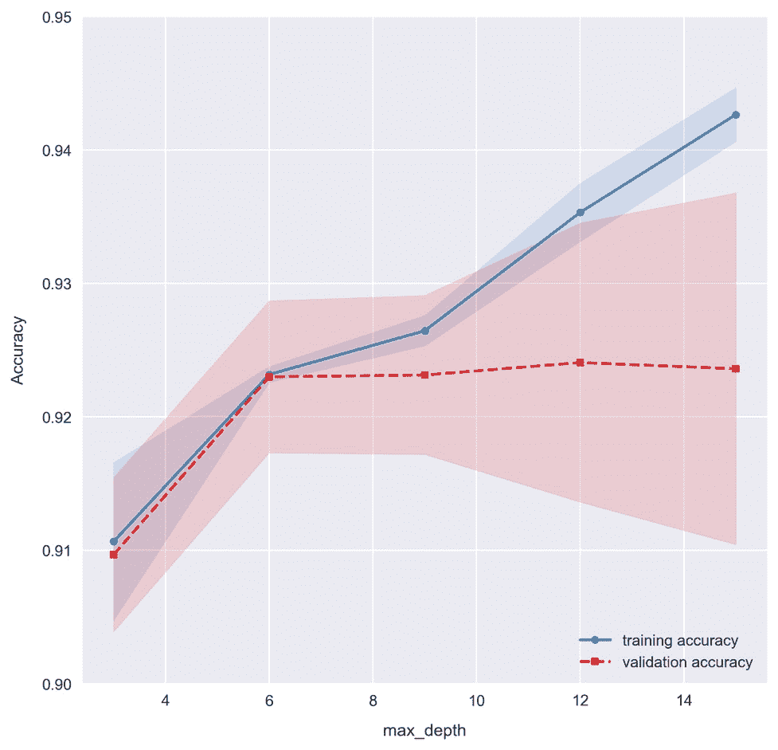

    回想一下如何为决策树设置最大深度来限制过拟合的数量？ 这反映在验证曲线中，在该曲线中，我们看到右侧的较大最大深度值发生过拟合。 `max_depth`的一个好值似乎是`6`，在这里我们看到了训练和验证的准确性。 当`max_depth`等于`3`时，由于训练和验证精度较低，我们看到模型不适合数据。

总而言之，我们已经学习并实现了两种重要的技术来构建可靠的预测模型。 第一种这样的技术是 K 折交叉验证，该技术用于将数据拆分为各种训练/测试批次并产生设定的准确性。 然后，从这个集合中，我们计算出平均准确度和标准偏差作为误差的度量。 这很重要，因此我们可以衡量模型的可变性，并可以产生可信赖的准确性。

我们还了解了另一种可以确保获得值得信赖的结果的技术：验证曲线。 这些使我们可以根据比较训练和验证准确性来可视化模型何时过度拟合。 通过在选定的超参数的范围内绘制曲线，我们可以确定其最佳值。

在本课程的最后部分，我们将到目前为止所学到的所有知识综合起来，以便为员工保留问题建立最终的预测模型。 与迄今为止训练的模型相比，我们力求通过将模型中数据集的所有特征包括在内来提高准确性。 我们将看到现在熟悉的主题，例如 k 折交叉验证和验证曲线，但是我们还将引入一些新的东西：降维技术。

## 子主题 C：降维技术

降维可以仅涉及从训练数据中删除不重要的特征，但是存在更多奇特的方法，例如**主成分分析**（**PCA**）和**线性判别分析**（**LDA**）。 这些技术允许进行数据压缩，其中可以将仅来自大量特征的最重要信息编码为几个特征。

在本子主题中，我们将重点介绍 PCA。 通过将投影到正交的“主成分”的新子空间中，该技术将其转换为数据，其中具有最高特征值的成分编码用于训练模型的最多信息。 然后，我们可以简单地选择一些主要成分来代替原始的高维数据集。 例如，PCA 可用于编码图像中每个像素的信息。 在这种情况下，原始特征空间的尺寸将等于图像中像素的数量。 然后，可以使用 PCA 来减少此高维空间，在该空间中，用于训练预测模型的大多数有用信息可能会减少到仅几个维。 这不仅可以节省训练和使用模型时的时间，还可以通过消除数据集中的噪声使它们表现更好。

就像我们已经看到的模型一样，没有必要对 PCA 进行详细的了解以利用这些好处。 但是，我们将进一步深入探讨 PCA 的技术细节，以便更好地对其进行概念化。 PCA 的关键见解是基于相关性识别特征之间的模式，因此 PCA 算法计算协方差矩阵，然后将其分解为特征向量和特征值。 然后，将向量用于将数据转换为新的子空间，从中可以选择固定数量的主分量。

在以下部分中，我们将看到一个示例，该示例说明了如何使用 PCA 来改善我们正在研究的员工保留问题的随机森林模型。 这是在整个特征空间上训练分类模型之后完成的，以了解降维如何影响我们的精度。

### 训练员工保留问题的预测模型

我们已经花费了大量的精力来计划机器学习策略，预处理数据以及为员工保留问题建立预测模型。 回想一下，我们的业务目标是帮助客户防止员工离职。 我们决定采取的策略是建立一个分类模型，该模型可以预测员工离职的可能性。 这样，公司可以评估当前员工离职的可能性，并采取措施防止这种情况的发生。

根据我们的策略，我们可以总结出如下的预测模型类型：

*   在标记的训练数据上进行有监督的学习
*   具有两个类别标签的分类问题（二进制）

尤其是，我们正在训练模型，以根据一系列连续和明确的特征来确定员工是否已离开公司。 在“活动 A”和“训练员工保留问题的预测模型”中准备了用于机器学习的数据之后，我们接着实现了 SVM，k 最近邻和随机 森林算法仅使用两个功能。 这些模型能够以超过 90％的总体准确性进行预测。 但是，在查看特定班级的准确性时，我们发现离职的员工（`class-label 1`）只能以 70-80％的准确度进行预测。 让我们看看可以通过利用全部功能空间将改进多少。

1.  在`lesson-2-workbook.ipynb`笔记本中，向下滚动到该部分的代码。 我们应该已经从上一节中加载了预处理的数据，但是如果需要，可以通过执行`df = pd.read_csv('../data/hr-analytics/hr_data_processed.csv')`再次完成。 然后，使用`print(df.columns)`打印 DataFrame 列。
2.  定义所有功能的列表，方法是将`df.columns`中的输出复制并粘贴到新列表中（确保删除目标变量`left`）。 然后，像之前一样定义`X`和`Y`。 如下所示：

    ```py
    features = ['satisfaction_level', 'last_evaluation', 'number_project','average_montly_hours', 'time_spend_company', 'work_accident',…
    …
    X = df[features].values
    y = df.left.values
    ```

    ### 注意

    有关完整的代码，请参考`Lesson 2`文件夹中的`Lesson 2.txt`文件。

    查看功能名称，回想一下每个功能的值。 向上滚动到我们在第一个活动中创建的直方图集，以帮助您慢走记忆。 前两个特征是连续的。 这些是我们在前两个练习中用于训练模型的内容。 之后，我们有一些离散的功能，例如`number_project`和`time_spend_company`，然后是一些二进制字段，例如`work_accident`和`promotion_last_5years`。 我们还具有一堆二进制功能，例如`department_IT`和`department_accounting`，它们是通过一键编码创建的。

    考虑到类似的功能，随机森林是一种非常有吸引力的模型。 一方面，它们与由连续数据和分类数据组成的功能集兼容，但这并不是特别的； 例如，也可以对 SVM 进行混合特征类型的训练（只要进行适当的预处理）。

    ### 注意

    如果您有兴趣在混合类型输入功能上训练 SVM 或 k 最近邻分类器，[则可以使用此 StackExchange 答案中的数据缩放处方](https://stats.stackexchange.com/questions/82923/mixing-continuous-and-binary-data-with-linear-svm/83086#83086)。

    一种简单的方法是如下预处理数据：

    *   标准化连续变量
    *   一键编码分类特征
    *   将二进制值从`0`和`1`移至`-1`和`1`
    *   然后，可以使用混合特征数据来训练各种分类模型

3.  我们需要为随机森林模型找出最佳参数。 让我们从使用验证曲线调整`max_depth`超参数开始。 通过运行以下代码来计算训练和验证的准确性：

    ```py
    %%time
    np.random.seed(1)
    clf = RandomForestClassifier(n_estimators=20)
    max_depths = [3, 4, 5, 6, 7,
    				9, 12, 15, 18, 21]
    train_scores, test_scores = validation_curve(
    		estimator=clf,
    		X=X,
    		y=y,
    		param_name='max_depth',
    		param_range=max_depths,
    		cv=5);

    ```

    我们正在测试 10 个具有 K 折交叉验证的模型。 通过设置`k = 5`，我们从得出每个模型的准确性的五个估计，我们从中提取平均值和标准偏差以绘制在验证曲线中。 我们总共训练了 50 个模型，由于`n_estimators`设置为 20，所以我们总共训练了 1,000 个决策树！ 大约需要 10 秒钟！

4.  使用上一个练习中的自定义`plot_validation_curve`函数绘制验证曲线。 运行以下代码：

    ```py
    plot_validation_curve(train_scores, test_scores,
                          max_depths, xlabel='max_depth');
    ```

    

    对于较小的最大深度，我们看到该模型无法拟合数据。 通过使决策树更深，并在数据中编码更复杂的模式，总精度会急剧增加。 随着最大深度的进一步增加和的准确性接近 100％，我们发现该模型过度拟合了数据，导致训练和验证的准确性不断提高。 基于此图，让我们为模型选择`6`的`max_depth`。

    我们确实应该对`n_estimators`做同样的事情，但是出于节省时间的精神，我们将跳过它。 欢迎您自己绘制。 您应该在训练和验证集之间找到适用于各种价值的协议。 通常，最好在“随机森林”中使用更多的决策树估计器，但这是以增加训练时间为代价的。 我们将使用 200 个估算器来训练我们的模型。

5.  使用`cross_val_class_score`（我们之前创建的按类进行 K 折交叉验证）来测试所选模型，即`max_depth = 6`和`n_estimators = 200`的随机森林：

    ```py
    np.random.seed(1)clf = RandomForestClassifier(n_estimators=200, max_depth=6)scores = cross_val_class_score(clf, X, y)print('accuracy = {} +/- {}'\.format(scores.mean(axis=0), scores.std(axis=0)))
    >> accuracy = [ 0.99553722  0.85577359] +/- [ 0.00172575  0.02614334]
    ```

    与以前只有两个连续功能的情况相比，现在使用完整功能集的准确性要高得多！

6.  通过运行以下代码，用箱图可视化精度：

    ```py
    fig = plt.figure(figsize=(5, 7))sns.boxplot(data=pd.DataFrame(scores, columns=[0, 1]),palette=sns.color_palette('Set1'))plt.xlabel('Left')
    plt.ylabel('Accuracy')
    ```

    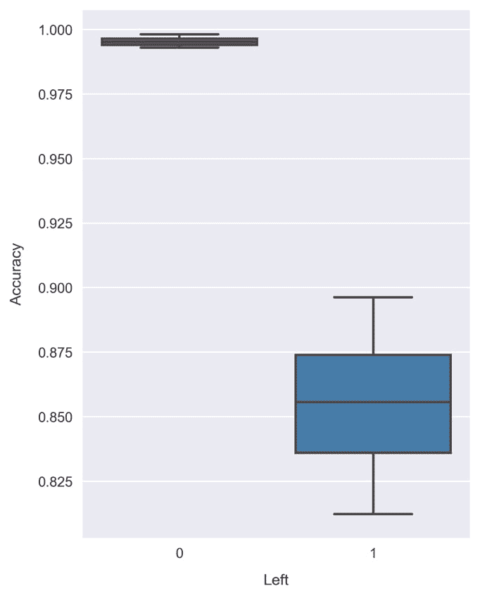

    随机森林可以提供要素性能的估计。

    ### 注意

    scikit-learn 中的特征重要性是根据节点杂质相对于每个特征的变化而计算的。 有关的详细说明，请查看以下 StackOverflow 线程，[以了解如何在随机森林分类器中确定功能的重要性](https://stackoverflow.com/questions/15810339/how-are-feature-importances-in-randomforestclassifier-determined)。

7.  通过运行以下代码，绘制存储在属性`feature_importances_`中的功能重要性：

    ```py
    pd.Series(clf.feature_importances_, name='Feature importance',index=df[features].columns)\.sort_values()\.plot.barh()
    plt.xlabel('Feature importance')
    ```

    

    从一键编码变量`department`和`salary`的有用贡献看来，我们并没有从中获得太多。 同样，`promotion_last_5years`和`work_accident`功能似乎不太有用。

    让我们使用主成分分析（PCA）将所有这些弱功能浓缩为几个主要成分。

8.  从 scikit-learn 导入`PCA`类并转换功能。 运行以下代码：

    ```py
    from sklearn.decomposition import PCApca_features = \…
    …
    pca = PCA(n_components=3)
    X_pca = pca.fit_transform(X_reduce)
    ```

    ### 注意

    有关完整的代码，请参考`Lesson 2`文件夹中的`Lesson 2.txt`文件。

9.  通过单独键入`X_pca`并执行单元格来查看它的字符串表示形式：

    ```py
    >> array([[-0.67733089,  0.75837169, -0.10493685],
    >>       [ 0.73616575,  0.77155888, -0.11046422],
    >>       [ 0.73616575,  0.77155888, -0.11046422],
    >>       ..., 
    >>       [-0.67157059, -0.3337546 ,  0.70975452],
    >>       [-0.67157059, -0.3337546 ,  0.70975452],
    >>       [-0.67157059, -0.3337546 ,  0.70975452]])
    ```

    由于我们要求获得前三个分量，因此我们得到了三个向量。

10.  使用以下代码将新功能添加到我们的 DataFrame 中：

    ```py
    df['first_principle_component'] = X_pca.T[0]df['second_principle_component'] = X_pca.T[1]
    df['third_principle_component'] = X_pca.T[2]
    ```

    选择我们的降维功能集来训练新的随机森林。 运行以下代码：

    ```py
    features = ['satisfaction_level', 'number_project', 'time_spend_
    company',
    			'average_montly_hours', 'last_evaluation',
    			'first_principle_component',
    			'second_principle_component',
    			'third_principle_component']
    X = df[features].values
    y = df.left.values
    ```

11.  通过 K 折交叉验证来评估新模型的准确性。 可以通过运行与以前相同的代码来完成此操作，其中`X`现在指向不同的功能。 代码如下：

    ```py
    np.random.seed(1)
    clf = RandomForestClassifier(n_estimators=200, max_depth=6)
    scores = cross_val_class_score(clf, X, y)
    print('accuracy = {} +/- {}'\
    		.format(scores.mean(axis=0), scores.std(axis=0)))
    >> accuracy = [ 0.99562463 0.90618594] +/- [ 0.00166047 0.01363927]
    ```

12.  使用箱形图以与以前相同的方式可视化结果。 代码如下：

    ```py
    fig = plt.figure(figsize=(5, 7))sns.boxplot(data=pd.DataFrame(scores, columns=[0, 1]),
                palette=sns.color_palette('Set1'))plt.xlabel('Left')
    plt.ylabel('Accuracy')
    ```

    

    将其与先前的结果进行比较，我们发现 1 级精度有所提高！ 现在，大多数验证集返回的准确性都超过 90％。 可以将 90.6％的平均精度与降低尺寸之前的的 85.6％的精度进行比较！

    让我们选择它作为我们的最终模型。 在生产中使用它之前，我们需要在整个样本空间上对其进行重新训练。

13.  通过运行以下代码来训练最终的预测模型：

    ```py
    np.random.seed(1)clf = RandomForestClassifier(n_estimators=200, max_depth=6)
    clf.fit(X, y)
    ```

14.  使用`externals.joblib.dump`将训练后的模型保存到二进制文件中。 运行以下代码：

    ```py
    from sklearn.externals import joblib
    joblib.dump(clf, 'random-forest-trained.pkl')
    ```

15.  例如，通过运行`!ls *.pkl`，检查它是否已保存到工作目录中。 然后，通过运行以下代码来测试我们是否可以从文件中加载模型：

    ```py
    clf = joblib.load('random-forest-trained.pkl')
    ```

    恭喜你！ 我们已经训练了最终的预测模型！ 现在，让我们看一个示例，说明如何使用它为客户提供业务见解。

    假设我们有一个特定的员工，我们将其称为 Sandra。 管理层注意到她正在非常努力地工作，并在最近的一项调查中报告了较低的工作满意度。 因此，他们想知道她辞职的可能性。

    为了简单起见，让我们以她的特征值作为训练集中的样本（但请假装这是看不见的数据）。

16.  通过运行以下代码列出 Sandra 的功能值：

    ```py
    sandra = df.iloc[573]X = sandra[features]X
    >> satisfaction_level              0.360000
    >> number_project                  2.000000
    >> time_spend_company              3.000000
    >> average_montly_hours          148.000000
    >> last_evaluation                 0.470000
    >> first_principle_component       0.742801
    >> second_principle_component     -0.514568
    >> third_principle_component      -0.677421
    ```

    下一步是询问模型认为她应该加入哪个小组。

17.  通过运行以下代码来预测 Sandra 的类标签：

    ```py
    clf.predict([X])
    >> array([1])
    ```

    模型将她归类为已经离开公司； 不是一个好兆头！ 我们可以更进一步，计算每个类标签的概率。

18.  使用`clf.predict_proba`来预测我们的模型预测 Sandra 退出的可能性。 运行以下代码：

    ```py
    clf.predict_proba([X])
    >> array([[ 0.06576239,  0.93423761]])
    ```

    我们看到该模型预测她辞职的准确率为 93％。

    由于这显然是管理层的一个危险信号，他们决定制定一个计划，将她的每月工作时间减少到`100`，并将公司的时间减少到`1`。

19.  使用 Sandra 的新计划指标来计算新概率。 运行以下代码：

    ```py
    X.average_montly_hours = 100X.time_spend_company = 1clf.predict_proba([X])
    >> array([[ 0.61070329,  0.38929671]])
    ```

    出色的！ 现在我们可以看到该模型返回她退出的可能性仅为 38％！ 相反，它现在预测她不会离开公司。

我们的模型允许管理层做出数据驱动的决策。 通过减少她在公司的工作时间这一特定数额，该模型告诉我们，她很可能将继续在公司任职！

# 摘要

在本课程中，我们看到了如何在 Jupyter Notebooks 中训练预测模型。

首先，我们讨论了如何计划机器学习策略。 我们考虑了如何设计可带来切实可行的业务见解的计划，并强调了使用数据来帮助制定切实可行的业务目标的重要性。 我们还解释了机器学习术语，例如监督学习，无监督学习，分类和回归。

接下来，我们讨论了使用 scikit-learn 和 pandas 预处理数据的方法。 这包括冗长的讨论以及机器学习中非常耗时的部分的示例：处理丢失的数据。

在课程的后半部分，我们针对二进制问题训练了预测分类模型，比较了如何为各种模型（例如 SVM，k 最近邻和随机森林）绘制决策边界。 然后，我们展示了如何使用验证曲线来进行良好的参数选择以及降维如何改善模型性能。 最后，在活动结束时，我们探索了如何在实践中使用最终模型来制定数据驱动型决策。