# 第 3 章 Web 爬网和交互式可视化

到目前为止，在本书中，我们一直专注于使用 Jupyter 构建可重现的数据分析管道和预测模型。 在本课中，我们将继续探讨这些主题，但是这里的主要重点是数据采集。 特别是，我们将向您展示如何使用 HTTP 请求从网络上获取数据。 这将涉及通过请求和解析 HTML 来抓取网页。 然后，我们将使用交互式可视化技术来总结本课程，以探索我们收集的数据。

在线可用的数据量巨大，并且相对容易获取。 它也在不断增长，并且变得越来越重要。 这种持续增长的部分原因是全球不断从报纸，杂志和电视转向在线内容的结果。 借助可随时随地在手机上使用自定义新闻源以及 Facebook，Reddit，Twitter 和 YouTube 等实时新闻来源，很难想象历史上其他替代方法的使用时间会更长。 令人惊讶的是，这仅占在线可用数据量越来越大的一部分。

随着这种向使用 HTTP 服务（博客，新闻网站，Netflix 等）消费内容的全球转变，使用数据驱动的分析有很多机会。 例如，Netflix 会查看用户观看的电影并预测他们会喜欢什么。 此预测用于确定出现的建议电影。 但是，在本课程中，我们不会像这样面对“面向业务”的数据，而是会看到客户端如何利用互联网作为数据库。 如此庞大的数据量从未如此轻松地获得过。 我们将使用网页抓取技术来收集数据，然后在 Jupyter 中使用交互式可视化工具对其进行探索。

交互式可视化是数据表示的一种可视形式，可以帮助用户使用图形或图表理解数据。 交互式可视化帮助开发人员或分析人员以简单的形式显示数据，非技术人员也可以理解。

# 课程目标

在本课程中，您将：

*   分析 HTTP 请求的工作方式
*   从网页抓取表格数据
*   建立和转换 Pandas `DataFrame`
*   创建交互式可视化

# 抓取网页数据

本着利用互联网作为数据库的精神，我们可以考虑通过抓取内容或与 Web API 接口从网页获取数据。 通常，抓取内容意味着使计算机读取旨在以人类可读格式显示的数据。 这与 Web API 有所不同，Web API 以机器可读格式（最常见的是 JSON）传递数据。

在本主题中，我们将集中在网页抓取上。 确切的执行过程将取决于页面和所需的内容。 但是，正如我们将看到的，只要我们对基本概念和工具有所了解，就很容易从 HTML 页面中抓取所需的任何内容。 在本主题中，我们将以维基百科为例，并从文章中获取表格内容。 然后，我们将应用相同的技术从完全独立的域中的页面中抓取数据。 但是首先，我们将花一些时间介绍 HTTP 请求。

## 子主题 A：HTTP 请求简介

超文本传输​​协议（简称 HTTP）是互联网数据通信的基础。 它定义了如何请求页面以及响应的外观。 例如，客户可以请求亚马逊的笔记本电脑页面出售，谷歌搜索本地餐馆或他们的 Facebook 订阅。 该请求连同 URL 一起将包含用户代理和 **请求标头**内容中的可用浏览 cookie。 用户代理告诉服务器客户端正在使用哪种浏览器和设备，通常用于提供最用户友好的网页响应版本。 也许他们最近已经登录到网页了； 此类信息将存储在 Cookie 中，该 Cookie 可用于自动登录用户。

借助 Web 浏览器，HTTP 请求和响应的这些详细信息已在后台处理。 对我们来说幸运的是，今天当使用高级语言（例如 Python）发出请求时，情况也是如此。 出于许多目的，可以很大程度上忽略请求标头的内容。 除非另有说明，否则在请求 URL 时会在 Python 中自动生成它们。 尽管如此，出于故障排除和理解我们的请求所产生的响应的目的，对 HTTP 有基本的了解还是很有用的。

HTTP 方法有很多类型，例如 GET，HEAD，POST 和 PUT。 前两个用于请求将数据从服务器发送到客户端，而后两个用于将数据发送到服务器。

下表中总结了这些 HTTP 方法：

| HTTP 方法 | 描述 |
| --- | --- |
| GET | 从指定的 URL 检索信息 |
| HEAD | 从指定 URL 的 HTTP 标头中检索元信息 |
| POST | 发送附加信息以附加到指定 URL 的资源 |
| PUT | 发送附加信息以替换指定 URL 上的资源 |

每次我们在浏览器中输入网页地址并按**输入**时，都会发送 GET 请求。 对于 Web 抓取，通常这是我们感兴趣的唯一 HTTP 方法，也是在本课程中将使用的唯一方法。

发送请求后，可以从服务器返回各种响应类型。 这些被标记为，具有 100 级到 500 级代码，其中代码的第一位数字表示响应类别。 这些可以描述如下：

*   **1xx**：信息响应，例如，服务器正在处理请求。 看到这种情况并不常见。
*   **2xx**：例如，页面已正确加载成功。
*   **3xx**：重定向，例如，请求的资源已移动，并且我们已重定向到新的 URL。
*   **4xx**：客户端错误，例如，请求的资源不存在。
*   **5xx**：服务器错误，例如，网站服务器接收的流量过多，无法满足请求。

为了进行网页抓取，我们通常只关心响应类，即响应代码的第一位。 但是，每个类中都存在响应的子类别，这些子类别提供了所发生事件的更多粒度。 例如，401 代码表示*未经授权*响应，而 404 代码表示*未找到页面*响应。 这种区别是值得注意的，因为 404 表示我们请求的页面不存在，而 401 则表示我们需要登录才能查看特定资源。

让我们看看如何在 Python 中完成 HTTP 请求，并使用 Jupyter笔记本探索其中一些主题。

## 子主题 B：在 Jupyter 笔记本中发出 HTTP 请求

既然我们已经讨论了 HTTP 请求如何工作以及应该期望哪种类型的响应，让我们看看如何在 Python 中完成此工作。 我们将使用一个名为 **Requests** 的库，该库恰好是 Python 上下载次数最多的外部库。 可以使用 Python 的内置工具，例如`urllib`来发出 HTTP 请求，但是请求要直观得多，事实上，在官方 Python 文档中，建议使用 urllib。

请求是用于进行简单和高级 Web 请求的绝佳选择。 它允许对标头，cookie 和授权进行各种自定义。 它跟踪重定向并提供用于返回特定页面内容（例如 JSON）的方法。 此外，还有一整套高级功能。 但是，它不允许呈现 JavaScript。

### 注意

通常，服务器会返回包含 JavaScript 代码段的 HTML，这些 HTML 代码段会在加载时自动在浏览器中运行。 使用“请求”使用 Python 请求内容时，此 JavaScript 代码是可见的，但不会运行。 因此，将丢失通过此操作将要更改或创建的任何元素。 通常，这并不影响获取所需信息的能力，但是在某些情况下，我们可能需要呈现 JavaScript 才能正确刮取页面。 为此，我们可以使用 Selenium 之类的库。 它具有与 Requests 库类似的 API，但提供了使用 Web 驱动程序呈现 JavaScript 的支持。

让我们深入研究以下部分，在 Jupyter笔记本中使用带有 Python 的 Requests 库。

### 在 Jupyter笔记本中使用 Python 处理 HTTP 请求

1.  通过执行`jupyter notebook`从项目目录启动`NotebookApp`。 导航到`lesson-3`目录并打开`lesson-3-workbook.ipynb`文件。 找到顶部附近的单元格，然后将其装入。

    我们将请求一个网页，然后检查响应对象。 有许多不同的库可用于发出请求，也有许多选择方法来精确地处理每个请求。 我们仅使用 Requests 库，因为它提供了出色的文档，高级功能和简单的 API。

2.  向下滚动至`Subtopic A: Introduction to HTTP requests`，然后运行该部分中的第一个单元格以导入请求库。 然后，通过运行包含以下代码的单元格来准备请求：

    ```py
    url = 'https://jupyter.org/'
    req = requests.Request('GET', url)
    req.headers['User-Agent'] = 'Mozilla/5.0'
    req = req.prepare()
    ```

    我们使用`Request`类来准备对`jupyter.org`主页的 GET 请求。 通过将用户代理指定为`Mozilla/5.0`，我们要求提供适合标准台式机浏览器的响应。 最后，我们准备请求。

3.  通过运行包含`req?`的单元格，为“准备的请求”`req`打印文档字符串：

    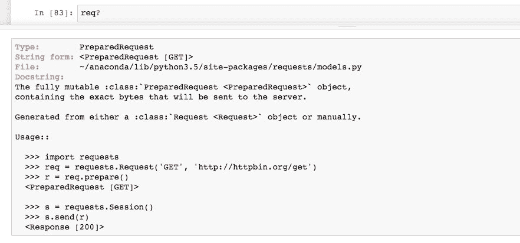

    查看其用法，我们看到如何使用会话发送请求。 这类似于打开 Web 浏览器（开始会话）然后请求 URL。

4.  通过运行以下代码，发出请求并将响应存储在名为`page`的变量中：

    ```py
    with requests.Session() as sess:
        page = sess.send(req)
    ```

    此代码返回 HTTP 响应，该变量由`page`引用。 通过使用`with`语句，我们初始化了一个范围限于缩进代码块的会话。 这意味着我们不必担心显式关闭会话，因为它是自动完成的。

5.  运行笔记本中的下两个单元格以调查响应。 `page`的字符串表示应指示 200 状态码响应。 这应该与`status_code`属性一致。
6.  将响应文本保存到`page_html`变量中，并使用`page_html[:1000]`看一下字符串的开头：

    

    如预期的那样，响应为 HTML。 我们可以在 BeautifulSoup 的帮助下更好地格式化此输出，该库将在本节后面的内容中广泛用于 HTML 解析。

7.  通过运行以下命令来打印格式化的 HTML 的标题：

    ```py
    from bs4 import BeautifulSoup
    print(BeautifulSoup(page_html, 'html.parser').prettify()[:1000])
    ```

    我们导入 BeautifulSoup，然后打印*漂亮的*输出，其中的换行根据 HTML 结构中的层次结构缩进。

8.  我们可以更进一步，使用 IPython 显示模块在 Jupyter 中实际显示 HTML。 通过运行以下代码来执行此操作：

    ```py
    from IPython.display import HTML
    HTML(page_html)
    ```

    

    鉴于没有运行 JavaScript 代码且未加载任何外部资源，在这里，我们将尽可能地看到呈现的 HTML。 例如，不会呈现在`jupyter.org`服务器上的图像，而是显示`alt`文本：**编程图标圆圈**，**jupyter 徽标**等，依此类推。

9.  让我们将其与实时网站进行比较，可以使用`IFrame`在 Jupyter 中打开它。 通过运行以下代码来执行此操作：

    ```py
    from IPython.display import IFrame
    IFrame(src=url, height=800, width=800)
    ```

    

    在这里，我们看到了完整的网站，包括 JavaScript 和外部资源。 实际上，我们甚至可以单击超链接并将这些页面加载到`IFrame`中，就像常规浏览会话一样。

10.  在使用`IFrame`后，最好关闭它。 这样可以防止它耗尽内存和处理能力。 可以通过从 Jupyter笔记本的“单元格”菜单中选择单元格并单击“当前输出 | 清除”来关闭它。

    回想一下我们如何使用准备好的请求和会话在 Python 中以字符串形式请求此内容。 通常，这是使用速记方法来完成的。 缺点是我们没有太多的请求标头自定义，但这通常很好。

11.  通过运行以下代码来向`http://www.python.org/`发出请求：

    ```py
    url = 'http://www.python.org/'page = requests.get(url)
    page
    <Response [200]>
    ```

    页面的字符串表示形式（如单元格下方所示）应指示 200 状态代码，指示成功响应。

12.  运行接下来的两个单元格。 在这里，我们打印页面的`url`和`history`属性。

    返回的 URL 不是我们输入的； 注意区别吗？ 我们从[输入 URL](http://www.python.org/) 重定向到[该页面的安全版本](https://www.python.org/)。 在协议的 URL 开头，附加的`s`表示差异。 任何重定向都存储在`history`属性中； 在这种情况下，我们在此处找到一个页面，其状态码为 301（永久重定向），与所请求的原始 URL 相对应。

现在，我们可以轻松地发出请求了，我们将注意力转向解析 HTML。 这可能是一门艺术，因为通常有多种处理方法，而最好的方法通常取决于所讨论的特定 HTML 的细节。

## 子主题 C：在 Jupyter笔记本中解析 HTML

从网页上抓取数据时，发出请求后，我们必须从响应内容中提取数据。 如果内容是 HTML，则最简单的方法是使用高级解析库（例如 BeautifulSoup）。 这并不是说它是的唯一方法； 原则上，可以使用正则表达式或 Python 字符串方法（例如`split`）来选择数据，但是采用这些选项中的任何一个都会浪费时间，并且很容易导致错误。 因此，通常对此并不满意，建议使用可信赖的解析工具。

为了了解如何从 HTML 中提取内容，了解 HTML 的基础很重要。 首先，HTML 代表**超文本标记语言**。 类似于 Markdown 或 XML（**可扩展标记语言**），它只是一种用于标记文本的语言。 在 HTML 中，显示文本包含在 HTML 元素的内容部分中，其中元素属性指定该元素在页面上的显示方式。

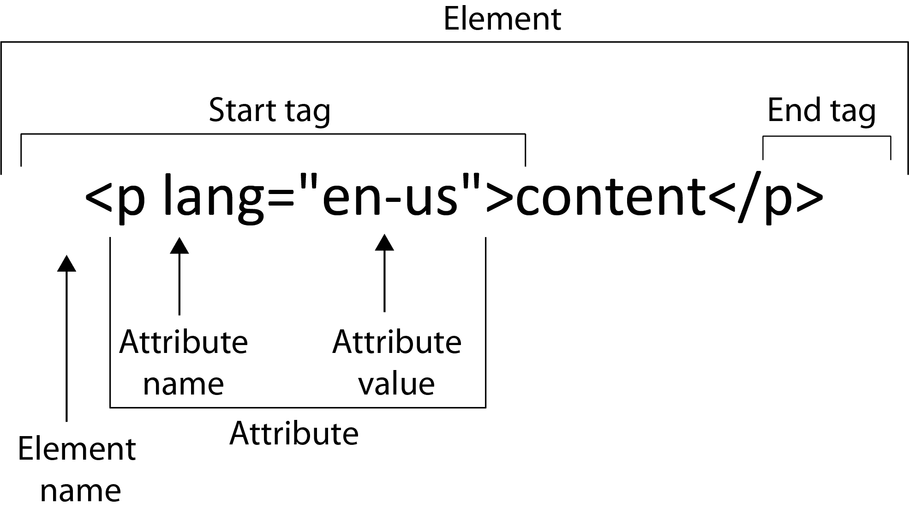

如上图所示，查看 HTML 元素的剖析，我们看到起始标签和结束标签之间包含的内容。 在此示例中，段落的标签为`<p>`； 其他常见的标签类型是`<div>`（文本块），`<table>`（数据表），`<h1>`（标题），``（图像）和`<a>`（超链接）。 标签具有属性，可以保存重要的元数据。 最常见的是，此元数据用于指定元素文本应如何在页面上显示。 这是 CSS 文件起作用的地方。 这些属性可以存储其他有用的信息，例如`<a>`标签中的`href`超链接（指定 URL 链接）或``标签中的`alt`替代标签，该标签指定在无法加载图像资源时显示的内容。

现在，让我们将注意力转移回 Jupyter 笔记本并解析一些 HTML！ 尽管在执行本节时没有必要，但在实际情况下，使用 Chrome 或 Firefox 中的开发人员工具来帮助识别感兴趣的 HTML 元素非常有帮助。 我们将在下一节中介绍如何使用 Chrome 进行操作。

### 在 Jupyter 笔记本中使用 Python 解析 HTML

1.  在`lesson-3-workbook.ipynb`文件中，滚动到`Subtopic B: Parsing HTML with Python`的顶部。

    在本节中，我们将抓取每个国家的中央银行利率，如维基百科报道的。 在深入研究代码之前，让我们首先打开包含此数据的网页。

2.  在网络浏览器中打开`https://en.wikipedia.org/wiki/List_of_countries_by_central_bank_interest_rates` URL。 如有可能，请使用 Chrome。在本节的后面，我们将向您展示如何使用 Chrome 的开发人员工具查看和搜索 HTML。

    在页面上，我们看到的内容很少，只有一大堆国家/地区和它们的利率。 这是我们要抓取的表。

3.  返回 Jupyter 笔记本并将 HTML 作为 BeautifulSoup 对象加载，以便可以对其进行解析。 通过运行以下代码来执行此操作：

    ```py
    from bs4 import BeautifulSoup
    soup = BeautifulSoup(page.content, 'html.parser')
    ```

    我们使用 Python 的默认`html.parser`作为解析器，但是如果需要，可以使用`lxml`之类的第三方解析器。

    通常，当使用类似 BeautifulSoup 这样的新对象时，最好通过执行`soup?`拉取文档字符串。 但是，在这种情况下，文档字符串不是特别有用。 探索 Python 对象的另一个工具是`pdir`，它列出了对象的所有属性和方法（可以与`pip install pdir2`一起安装）。 它基本上是 Python 内置`dir`函数的格式化版本。

4.  通过运行以下代码，显示 BeautifulSoup 对象的属性和方法。 无论是否安装了`pdir`外部库，它都将运行：

    ```py
    try:import pdirdir = pdir
    except:
        print('You can install pdir with:\npip install pdir2')
    dir(soup)
    ```

    在这里，我们看到可以在`soup`上调用的的方法和属性的列表。 最常用的函数可能是`find_all`，它返回与给定条件匹配的元素列表。

5.  使用以下代码获取页面的`h1`标题：

    ```py
    h1 = soup.find_all('h1')
    h1
    >> [<h1 class="firstHeading" id="firstHeading" lang="en">List of countries by central bank interest rates</h1>]
    ```

    通常，页面只有一个 H1 元素，因此很明显，我们在这里只找到一个。

6.  运行下几个单元格。 我们使用`h1 = h1[0]`将`h1`重新定义为第一个（也是唯一的）列表元素，然后使用`h1.attrs`打印出 HTML 元素属性：

    ```py
    >> {'class': ['firstHeading'], 'id': 'firstHeading', 'lang': 'en'}
    ```

    我们看到了该元素的类和 ID，CSS 代码都可以引用它们来定义该元素的样式。

7.  通过打印`h1.text`获得 HTML 元素内容（即可见文本）。
8.  通过运行以下代码来获取页面上的所有图像：

    ```py
    imgs = soup.find_all('img')
    len(imgs)
    >> 91
    ```

    页面上有很多图像。 其中大多数是针对国旗的。

9.  通过运行以下代码来打印每个图像的源：

    ```py
    [element.attrs['src'] for element in imgsif 'src' in element.attrs.keys()]
    ```

    

    我们使用列表理解来遍历元素，选择每个元素的`src`属性（只要该属性实际可用）。

    现在，让我们刮擦桌子。 我们将使用 Chrome 的开发人员工具来查找其中包含的元素。

10.  如果尚未完成，请在 Chrome 中打开我们正在查看的维基百科页面。 然后，在浏览器中，从**视图**菜单中选择**开发人员工具**。 侧栏将打开。 可从开发人员工具的**元素**标签中查看 HTML。
11.  选择工具侧栏左上方的小箭头。 这使我们可以将鼠标悬停在页面上，并在侧栏的“元素”部分中查看 HTML 元素的位置：

    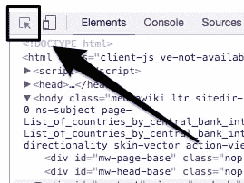

12.  将鼠标悬停在正文上以查看该表如何包含在具有`id = "bodyContent"`的`div`中：

    

13.  通过运行以下代码选择该`div`：

    ```py
    body_content = soup.find('div', {'id': 'bodyContent'})
    ```

    现在，我们可以在完整 HTML 的此子集中查找该表。 通常，表被组织为标题`<th>`，行`<tr>`和数据条目`<td>`。

14.  通过运行以下代码来获取表头：

    ```py
    table_headers = body_content.find_all('th')[:3]table_headers
    >>> [<th>Country or<br/>
         currency union</th>, <th>Central bank<br/>
         interest rate (%)</th>, <th>Date of last<br/>
         change</th>]
    ```

    在这里，我们看到三个标题。 每个内容中都有一个换行元素`<br/>`，这将使文本更难于清晰地解析。

15.  通过运行以下代码获取文本：

    ```py
    table_headers = [element.get_text().replace('\n', ' ')for element in table_headers]table_headers
     >> ['Country or currency union',
        'Central bank interest rate (%)',
        'Date of last change']
    ```

    在这里，我们使用`get_text`方法获取内容，然后运行`string.replace`方法以删除`<br/>`元素产生的换行符。

    为了获取数据，我们将首先执行一些测试，然后将所有数据刮到单个单元格中。

16.  通过运行以下代码，获取第二个`<tr>`（行）元素中每个单元格的数据：

    ```py
    row_number = 2d1, d2, d3 = body_content.find_all('tr')[row_number]\.find_all('td')
    ```

    我们找到所有行元素，挑选出第三个行元素，然后在其中找到三个数据元素。

    让我们看一下结果数据，看看如何解析每一行中的文本。

17.  运行接下来的两个单元格以打印`d1`及其`text`属性：

    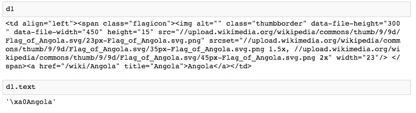

    我们在前面遇到了一些不良字符。 可以通过仅搜索`<a>`标签的文本来解决此。

18.  运行`d1.find('a').text`以返回该单元格正确的*清晰*数据。
19.  在接下来的两个单元格中运行，以打印`d2`及其文本。 此数据看起来足够干净，可以直接转换为浮点数。
20.  运行接下来的两个单元格以打印`d3`及其文本：

    

    与`d1`相似，我们看到最好只获取`span`元素的文本。

21.  通过运行以下代码来正确解析此表条目的日期：

    ```py
    d3.find_all('span')[1].text
    >> '30 June 2016'
    ```

22.  现在，我们准备通过遍历行元素`<th>`来执行完整的抓取。 运行以下代码：

    ```py
    data = []for i, row in enumerate(body_content.find_all('tr')):...
    ...
    >> Ignoring row 101 because len(data) != 3
    >> Ignoring row 102 because len(data) != 3
    ```

    ### 注意

    有关完整代码，请参考`Lesson 3`文件夹中的`Lesson 3.txt`文件。

    我们遍历所有行，而忽略任何包含比三个数据元素更多的的行。 这些行将不与我们感兴趣的表中的数据相对应。表中确实包含三个数据元素的行被假定为在表中，并且我们在测试过程中从中解析出了这些文本。

    文本解析是在`try`/`except`语句内完成的，该语句将捕获任何错误，并允许在不停止迭代的情况下跳过此行。 由于该语句而引起错误的任何行都应查看。 这些数据可以手动记录，也可以通过更改抓取循环并重新运行来解决。 在这种情况下，为了节省时间，我们将忽略所有错误。

23.  通过运行`print(data[:10]):`

    ```py
    >> [['Albania', 1.25, '4 May 2016'],
        ['Angola', 16.0, '30 June 2016'],
        ['Argentina', 26.25, '11 April 2017'],
        ['Armenia', 6.0, '14 February 2017'],
        ['Australia', 1.5, '2 August 2016'],
        ['Azerbaijan', 15.0, '9 September 2016'],
        ['Bahamas', 4.0, '22 December 2016'],
        ['Bahrain', 1.5, '14 June 2017'],
        ['Bangladesh', 6.75, '14 January 2016'],
        ['Belarus', 12.0, '28 June 2017']]
    ```

    打印抓取的数据列表的开头
24.  在本课程的稍后部分，我们将可视化此数据。 现在，通过运行以下代码将数据保存到 CSV 文件：

    ```py
    f_path = '../data/countries/interest-rates.csv'with open(f_path, 'w') as f:f.write('{};{};{}\n'.format(*table_headers))for d in data:f.write('{};{};{}\n'.format(*d))
    ```

请注意，我们使用分号来分隔字段。

## 活动 A：使用 Jupyter 笔记本进行网页爬取

我们将获得每个国家的人口。 然后，在下一个主题中，此将与一起可视化为上一节中提取的利率数据。

[我们在此活动中查看的页面可在此处找到](http://www.worldometers.info/world-population/population-by-country/)。

既然我们已经了解了 Web 抓取的基础知识，那么让我们将相同的技术应用于新的网页并抓取更多数据！

### 注意

自创建此文档以来，此页面可能已更改。 如果此 URL 不再指向国家/地区人口表，[请改用此维基百科页面](https://en.wikipedia.org/wiki/List_of_countries_by_population_(United_Nations))。

1.  对于此页面，可以使用以下代码段抓取数据：

    ```py
    data = []
    for i, row in enumerate(soup.find_all('tr')):
    	row_data = row.find_all('td')
    	try:
    		d1, d2, d3 = row_data[1], row_data[5], row_data[6]
    		d1 = d1.find('a').text
    		d2 = float(d2.text)
    		d3 = d3.find_all('span')[1].text.replace('+', '')
    		data.append([d1, d2, d3])
    except:
    		print('Ignoring row {}'.format(i))
    ```

2.  在`lesson-3-workbook.ipynb` Jupyter 笔记本中，滚动到`Activity A: Web scraping with Python`。
3.  设置`url`变量，并通过运行以下代码在笔记本中加载页面的`IFrame`：

    ```py
    url = 'http://www.worldometers.info/world-population/population-by-country/'
    IFrame(url, height=300, width=800)
    ```

    页面应在笔记本电脑中加载。 向下滚动，我们可以看到按人口标题显示的世界**国家及其人口**表。 我们将从此表中刮取前三列，以获取国家/地区，人口和年度人口变化。

4.  通过选择单元格并从 Jupyter 笔记本的**单元格**菜单中单击**当前输出 | 清空**，关闭`IFrame`。 
5.  通过运行以下代码来请求页面并将其作为`BeautifulSoup`对象加载：

    ```py
    page = requests.get(url)soup = BeautifulSoup(page.content, 'html.parser')
    ```

    我们将页面内容提供给`BeautifulSoup`构造函数。 回想一下，之前我们在这里使用了`page.text`。 不同之处在于`page.content`返回原始二进制响应内容，而`page.text`返回 UTF-8 解码的内容。 通常最好的做法是传递`bytes`对象并让`BeautifulSoup`对其进行解码，而不是使用`page.text`进行请求。

6.  通过运行以下代码，为页面打印`h1`：

    ```py
    soup.find_all('h1')
    >> [<h1>Countries in the world by population (2017)</h1>]
    ```

    与上一节一样，我们将通过搜索`<th>`，`<tr>`和`<td>`元素来刮除表格。

7.  通过运行以下代码来获取并打印表标题：

    ```py
    table_headers = soup.find_all('th')table_headers
    >> [<th>#</th>,
       <th>Country (or dependency)</th>,
       <th>Population<br/> (2017)</th>,
       <th>Yearly<br/> Change</th>,
       <th>Net<br/> Change</th>,
       <th>Density<br/> (P/Km²)</th>,
       <th>Land Area<br/> (Km²)</th>,
       <th>Migrants<br/> (net)</th>,
       <th>Fert.<br/> Rate</th>,
       <th>Med.<br/> Age</th>,
       <th>Urban<br/> Pop %</th>,
       <th>World<br/> Share</th>]
    ```

8.  我们只对前三列感兴趣。 选择这些并使用以下代码解析文本：

    ```py
    table_headers = table_headers[1:4]
    table_headers = [t.text.replace('\n', '') for t in table_headers]
    ```

    选择所需的表头子集后，我们将解析每个表头的文本内容并删除所有换行符。

    现在，我们将获取数据。 遵循与上一节相同的规定，我们将测试如何解析示例行的数据。

9.  通过运行以下代码来获取示例行的数据：

    ```py
    row_number = 2row_data = soup.find_all('tr')[row_number]\
                    .find_all('td')
    ```

10.  我们有几列数据？ 通过运行`print(len(row_data))`打印`row_data`的长度。
11.  通过运行`print(row_data[:4])`打印第一个元素：

    ```py
    >> [<td>2</td>,
       <td style="font-weight: bold; font-size:15px; text-align:left"><a href="/world-population/india-population/">India</a></td>,
       <td style="font-weight: bold;">1,339,180,127</td>,
       <td>1.13 %</td>]
    ```

    很明显，我们要选择列表索引 1、2 和 3。第一个数据值可以忽略，因为它只是索引。

12.  通过运行以下代码，选择我们感兴趣的数据元素：

    ```py
    d1, d2, d3 = row_data[1:4]
    ```

13.  查看`row_data`输出，我们可以找到如何正确解析数据的方法。 我们想在第一个数据元素中选择`<a>`元素的内容，然后简单地从其他元素中获取文本。 通过运行以下代码来测试这些假设：

    ```py
    print(d1.find('a').text)print(d2.text)print(d3.text)
    >> India
    >> 1,339,180,127
    >> 1.13 %
    ```

    出色的！ 这看起来运作良好。 现在，我们准备刮擦整个桌子。

14.  通过运行以下代码来抓取并解析表数据：

    ```py
    data = []for i, row in enumerate(soup.find_all('tr')):try:d1, d2, d3 = row.find_all('td')[1:4]d1 = d1.find('a').textd2 = d2.textd3 = d3.textdata.append([d1, d2, d3])except:print('Error parsing row {}'.format(i))
    >> Error parsing row 0
    ```

    这与之前非常相似，我们尝试解析文本，并在出现错误时跳过该行。

15.  通过运行`print(data[:10])`打印刮取数据的头部：

    ```py
    >> [['China', '1,409,517,397', '0.43 %'],
       ['India', '1,339,180,127', '1.13 %'],
       ['U.S.', '324,459,463', '0.71 %'],
       ['Indonesia', '263,991,379', '1.10 %'],
       ['Brazil', '209,288,278', '0.79 %'],
       ['Pakistan', '197,015,955', '1.97 %'],
       ['Nigeria', '190,886,311', '2.63 %'],
       ['Bangladesh', '164,669,751', '1.05 %'],
       ['Russia', '143,989,754', '0.02 %'],
       ['Mexico', '129,163,276', '1.27 %']]
    ```

    看来我们已经成功抓取了数据！ 请注意，尽管此网页完全不同，但与维基百科相比，此表的处理过程有多相似。 当然，并不总是将数据包含在表中，但是不管怎样，我们通常可以使用`find_all`作为主要的解析方法。

16.  最后，将数据保存到 CSV 文件中，以备后用。 通过运行以下代码来执行此操作：

    ```py
    f_path = '../data/countries/populations.csv'with open(f_path, 'w') as f:f.write('{};{};{}\n'.format(*table_headers))for d in data:
            f.write('{};{};{}\n'.format(*d))
    ```

总而言之，我们已经了解了 Jupyter 笔记本如何用于网络抓取。 我们通过学习 HTTP 方法和状态代码开始了本课程。 然后，我们使用 Requests 库使用 Python 实际执行 HTTP 请求，并了解了 BeautifulSoup 库如何用于解析 HTML 响应。

事实证明，我们的 Jupyter 笔记本是进行此类工作的好工具。 我们能够浏览 Web 请求的结果，并尝试各种 HTML 解析技术。 我们还能够呈现 HTML 甚至在笔记本中加载网页的实时版本！

在本课程的下一个主题中，我们转到一个全新的主题：交互式可视化。 我们将看到如何在笔记本中直接创建和显示交互式图表，以及如何使用这些图表来浏览我们刚刚收集的数据。

# 交互式可视化

可视化作为从数据集中提取信息的一种非常有用的方法。 例如，与查看表中的值相比，使用条形图很容易区分值分布。 当然，正如我们在本书前面所看到的，可以将它们用于研究数据集中的模式，否则这些模式将很难识别。 此外，它们可用于帮助向陌生方解释数据集。 例如，如果它们包含在博客文章中，它们可以提高读者的兴趣水平，并可以用来拆分文本块。

考虑交互式可视化时，其好处类似于静态可视化，但由于可以允许查看者方面的主动探索而有所增强。 它们不仅使观看者可以回答有关数据的问题，而且在浏览时还会想到新问题。 这可以使诸如博客阅读器或同事之类的单独团体受益，但也可以使创建者受益，因为它允许在不更改任何代码的情况下轻松地对数据进行临时的特别探索。

在本主题中，我们将讨论并演示如何使用 Bokeh 在 Jupyter 中构建交互式可视化。 但是，在此之前，我们将简要回顾 Pandas `DataFrame`，它们在使用 Python 进行数据可视化中起着重要作用。

## 子主题 A：构建用于存储和组织数据的数据框

正如在本书中一次又一次地看到的那样，Pandas是使用 Python 和 Jupyter笔记本进行数据科学不可或缺的一部分。`DataFrame`提供了一种组织和存储带标签数据的方法，但是更重要的是，Pandas 提供了节省时间的方法来转换`DataFrame`中的数据。 我们在本书中看到的示例包括删除重复项，将字典映射到列，在列上应用函数以及填写缺失值。

关于可视化，`DataFrame`提供了用于创建各种 Matplotlib 图的方法，包括`df.plot.barh()`，`df.plot.hist()`等。 交互式可视化库 Bokeh 以前依靠 Pandas `DataFrame`来获取*高级*图表。 它们的工作方式与 Seaborn 相似，就像我们在上一课前面所看到的那样，其中`DataFrame`与要绘制的特定列一起传递给了绘图函数。 但是，Bokeh 的最新版本已放弃对此行为的支持。 相反，现在可以使用与 Matplotlib 相同的方式创建图，在图中可以将数据存储在简单列表或 NumPy 数组中。 讨论的重点是，`DataFrame`并非完全必要，但对于在可视化之前组织和操作数据仍然非常有帮助。

### 建立和合并 Pandas `DataFrame`

让我们直接进行练习，在该练习中，我们将继续处理之前抓取的国家/地区数据。 回想一下，我们提取了每个国家的中央银行利率和人口，并将结果保存在 CSV 文件中。 我们将从这些文件中加载数据，然后将它们合并到一个`DataFrame`中，然后将其用作后续交互式可视化的数据源。

1.  在`lesson-3-workbook.ipynb` Jupyter 笔记本中，滚动到`Topic B`部分中的`Subtopic A: Building a DataFrame to store and organize data` 子部分。

    我们首先要从 CSV 文件中加载数据，以使其恢复为抓取后的状态。 与使用`pd.read_csv`函数相反，这将允许我们练习从 Python 对象构建`DataFrame`。

    ### 注意

    使用`pd.read_csv`时，将从字符串输入中推断出每一列的数据类型。 另一方面，当我们在此处使用`pd.DataFrame`时，则将数据类型作为输入变量的类型。

    正如我们将看到的，在我们的例子中，我们读取文件并且不费心地将变量转换为数字或日期时间，直到实例化`DataFrame`之后。

2.  通过运行以下代码，将 CSV 文件加载到列表中：

    ```py
    with open('../data/countries/interest-rates.csv', 'r') as f:
    	int_rates_col_names = next(f).split(',')
    	int_rates = [line.split(',') for line in f.read().splitlines()]
    with open('../data/countries/populations.csv', 'r') as f:
    	populations_col_names = next(f).split(',')
        populations = [line.split(',') for line in f.read().splitlines()]
    ```

3.  通过运行接下来的两个单元，检查结果列表的外观。 我们应该看到类似于以下的输出：

    ```py
    print(int_rates_col_names)int_rates[:5]
    >> ['Country or currency union', 'Central bank interest ...
    ...
        ['Indonesia', '263', '991', '379', '1.10 %'],
        ['Brazil', '209', '288', '278', '0.79 %']]
    ```

    ### 注意

    有关完整的代码，请参考`Lesson 3`文件夹中的`Lesson 3.txt`文件。

    现在，数据采用标准的 Python 列表结构，就像从上一部分中的网页抓取后一样。 现在，我们将创建两个`DataFrame`并将其合并，以便将所有数据组织在一个对象中。

4.  使用标准的`DataFrame`构造函数通过运行以下代码来创建两个`DataFrame`：

    ```py
    df_int_rates = pd.DataFrame(int_rates, columns=int_rates_col_names)
    df_populations = pd.DataFrame(populations, columns=populations_col_names)
    ```

    这不是我们第一次在本书中使用。 在这里，我们传递数据列表（如前所述）和相应的列名。 输入数据也可以是字典类型的，当每列包含在单独的列表中时，这将很有用。

    接下来，我们将清理每个`DataFrame`。 从利率一开始，让我们打印头和尾，并列出数据类型。

5.  显示整个`DataFrame`时，默认最大行数为 60（对于版本 0.18.1）。 通过运行以下代码，将其减少到 10 个：

    ```py
    pd.options.display.max_rows = 10
    ```

6.  通过运行以下代码来显示利率数据帧的开头和结尾：

    ```py
    df_int_rates
    ```

    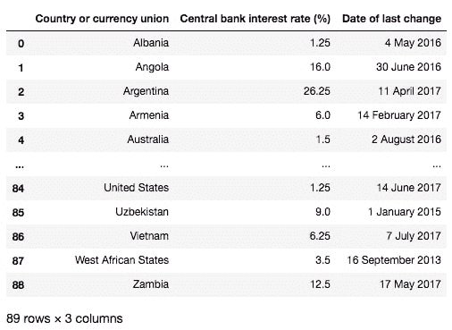

7.  通过运行以下命令打印数据类型：

    ```py
    df_int_rates.dtypes
    >> Country or currency union         object
    >> Central bank interest rate (%)    object
    >> Date of last change               object
    >> dtype: object
    ```

    Pandas 已将每一列分配为字符串数据类型，这很有意义，因为输入变量都是字符串。 我们将分别将它们更改为字符串，浮点型和日期时间。

8.  通过运行以下代码，转换为正确的数据类型：

    ```py
    df_int_rates['Central bank interest rate (%)'] = \df_int_rates['Central bank interest rate (%)']\.astype(float, copy=False)df_int_rates['Date of last change'] = \
            pd.to_datetime(df_int_rates['Date of last change'])
    ```

    我们使用`astype`将利率值转换为浮点数，将`copy=False`设置为节省内存。 由于日期值以这种易于阅读的格式给出，因此可以简单地使用`pd.to_datetime`进行转换。

9.  通过运行以下代码，检查每列的新数据类型：

    ```py
    df_int_rates.dtypes
    >> Country or currency union                 object
    >> Central bank interest rate (%)           float64
    >> Date of last change               datetime64[ns]
    >> dtype: object
    ```

    可以看出，现在所有内容都采用了正确的格式。

10.  让我们对另一个`DataFrame`应用相同的过程。 运行接下来的几个单元格以对`df_populations`重复前面的步骤：

    ```py
    df_populations
    ```

    

    然后，运行以下代码：

    ```py
    df_populations['Population (2017)'] = df_populations['Population (2017)']\.str.replace(',', '')\.astype(float, copy=False)df_populations['Yearly Change'] = df_populations['Yearly Change']\.str.rstrip('%')\
                                     .astype(float, copy=False)
    ```

    要将数字列转换为浮点数，在这种情况下，我们必须首先对字符串进行一些修改。 我们使用字符串方法从总体中去除了所有逗号，并从“年度更改”列中删除了百分号。

    现在，我们将在每行的国家/地区名称上合并数据框。 请记住，这些仍然是从网络上抓取的原始国家/地区名称，因此匹配字符串可能涉及一些工作。

11.  通过运行以下代码来合并`DataFrame`：

    ```py
    df_merge = pd.merge(df_populations,
    					df_int_rates,
    					left_on='Country (or dependency)',
    					right_on='Country or currency union',
    					how='outer'
    df_merge
    ```

    我们在左侧的`DataFrame`中传递人口数据，在右侧的`DataFrame`中传递利率，在`country`列上执行外部匹配。 这将导致`NaN`值，两者不重叠。

12.  为了节省时间，让我们看看人口最多的国家/地区，看看我们是否错过了匹配的国家/地区。 理想情况下，我们希望检查所有内容。 通过运行以下代码查看人口最多的国家：

    ```py
    df_merge.sort_values('Population (2017)', ascending=False)\.head(10)
    ```

    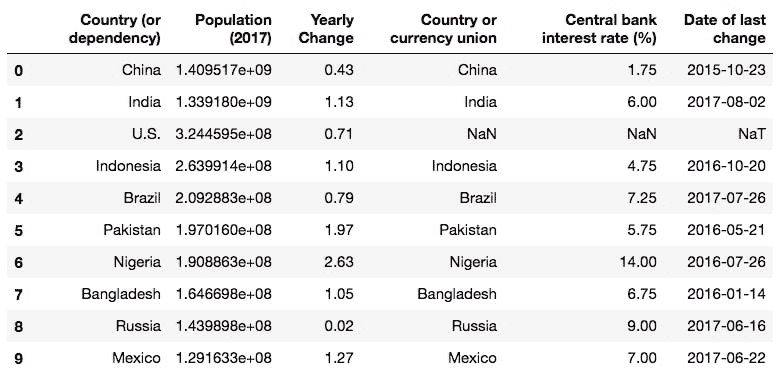

    看起来美国没有匹配。 这是因为它在利率数据中被列为*美国*。 让我们对此进行补救。

13.  通过运行以下代码，在人口表中修复美国的标签：

    ```py
    col = 'Country (or dependency)'
    df_populations.loc[df_populations[col] == 'U.S.'] = 'United States'
    ```

    我们使用`loc`方法重命名人口数据框所在的国家/地区，以定位该行。 现在，让我们正确合并`DataFrame`。

14.  重新合并国家/地区名称上的数据框，但这一次使用内部合并删除`NaN`值：

    ```py
    df_merge = pd.merge(df_populations,df_int_rates,left_on='Country (or dependency)',right_on='Country or currency union',
                        how='inner')
    ```

15.  在合并的`DataFrame`中，我们剩下两个相同的列。 通过运行以下代码来删除其中之一：

    ```py
    del df_merge['Country or currency union']
    ```

16.  通过运行以下代码来重命名列：

    ```py
    name_map = {'Country (or dependency)': 'Country','Population (2017)': 'Population','Central bank interest rate (%)': 'Interest rate'}df_merge = df_merge.rename(columns=name_map)
    ```

    我们剩下了以下合并和清除的`DataFrame`：

    

17.  现在我们已经将所有数据存储在一个组织良好的表中，我们可以将转到有趣的部分：对其进行可视化。 让我们将该表保存到 CSV 文件中以备后用，然后继续讨论如何使用 Bokeh 创建可视化。 将合并的数据写入 CSV 文件，以供以后使用，并使用以下代码：

    ```py
    df_merge.to_csv('../data/countries/merged.csv', index=False)
    ```

## 子主题 B：Bokeh 简介

Bokeh 是一个用于 Python 的交互式可视化库。 其目标是提供与 D3（流行的 JavaScript 交互式可视化库）相似的功能。 Bokeh 的功能与 D3 完全不同，鉴于 Python 和 JavaScript 之间的差异，这并不奇怪。 总体而言，它要简单得多，并且不允许进行与 D3 一样多的自定义。 但是，这样做很方便，因为它易于使用，并且仍然拥有我们在本节中将探讨的一系列出色功能。

让我们直接学习 Jupyter笔记本的快速练习，并通过示例介绍 Bokeh。

### 注意

网上有关于 Bokeh 的好的文档，但是其中很多已经过时了。 在 Google 中搜索`Bokeh bar plot`之类的内容仍会趋向于查找不再存在的旧模块的文档，例如，以前可通过`bokeh.charts`（0.12.0 版之前）使用的高级绘图工具。 这些是将 Pandas `DataFrame`作为输入的方式，与 Seaborn 绘图功能的方式几乎相同。 删除高级绘图工具模块已简化了 Bokeh，并将使将来的开发更加集中。 现在，绘图工具大致分为`bokeh.plotting`模块，如在下一个练习和后续活动中所见。

### 使用 Bokeh 进行交互式可视化介绍

我们将加载所需的 Bokeh 模块，并显示一些可以使用 Bokeh 进行的简单交互式绘图。 请注意，本书中的示例是使用 Bokeh 的 0.12.10 版设计的。

1.  在`lesson-3-workbook.ipynb` Jupyter 笔记本中，滚动到`Subtopic B: Introduction to Bokeh`。
2.  像 Scikit-learn 一样，Bokeh 模块通常是分段加载的（例如，与Pandas不同，一次加载整个库）。 通过运行以下代码导入一些基本的绘图模块：

    ```py
    from bokeh.plotting import figure, show, output_notebookoutput_notebook()
    ```

    我们需要运行`output_notebook()`以便在 Jupyter 笔记本中渲染交互式视觉效果。

3.  通过运行以下代码生成随机数据以进行绘图：

    ```py
    np.random.seed(30)data = pd.Series(np.random.randn(200),index=list(range(200)))\.cumsum()x = data.indexy = data.values
    ```

    使用大约为零分布的一组随机数字的累积和来生成随机数据。 例如，这种影响是一种类似于股票价格时间序列的趋势。

4.  通过运行以下代码在 Bokeh 中用线图绘制数据：

    ```py
    p = figure(title='Example plot', x_axis_label='x', y_axis_label='y')p.line(x, y, legend='Random trend')show(p)
    ```

    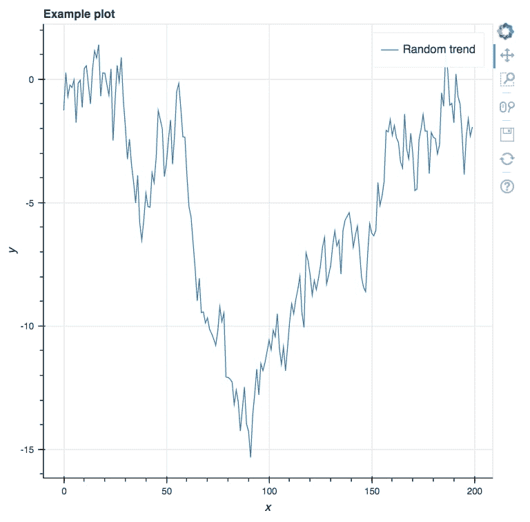

    我们实例化该图（由变量`p`引用），然后绘制一条线。 在 Jupyter 中运行此程序会产生，它是一个交互式图形，右侧带有各种选项。

    前三个选项（从 0.12.10 版本开始）是**平移**，**盒子缩放** 和**滚轮缩放**。 尝试这些，并尝试它们的工作方式。 使用重置选项可重新加载默认绘图限制。

5.  其他图可以用图的替代方法来创建。 通过运行以下代码来绘制散点图，其中我们将前面代码中的`line`替换为`circle`：

    ```py
    size = np.random.rand(200) * 5p = figure(title='Example plot', x_axis_label='x', y_axis_label='y')
    p.circle(x, y, radius=size, alpha=0.5, legend='Random dots')show(p)
    ```

    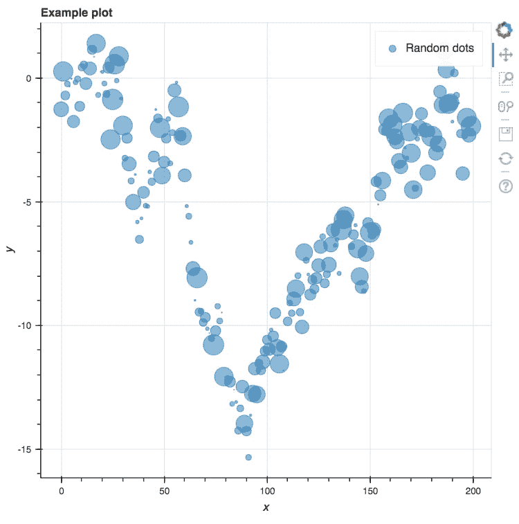

    在这里，我们使用一组随机的数字指定了每个圆圈的大小。

    交互式可视化的一个非常诱人的功能是工具提示。 这是一个悬停工具，允许用户通过将其悬停在某点上来获取有关该点的信息。

6.  为了添加此工具，我们将使用略有不同的方法来创建绘图。 这将要求我们导入几个新库。 运行以下代码：

    ```py
    p.circle(x, y, radius=size, alpha=0.5, legend='Random dots')show(p)
    ```

    这次，我们将创建一个数据源以传递到绘图方法。 它可以包含元数据，可以通过悬停工具将其包含在可视化中的。

7.  通过运行以下代码，创建随机标签并使用悬停工具绘制交互式可视化效果图：

    ```py
    source = ColumnDataSource(data=dict(
    	x=x,
    	y=y,
    ...
    ...
    source=source,
    		legend='Random dots')
    show(p)
    ```

    ### 注意

    有关完整的代码，请参考`Lesson 3`文件夹中的`Lesson 3.txt`文件。

    我们将在此处停止介绍性练习，但在以下活动中我们将继续创建和探索情节。

    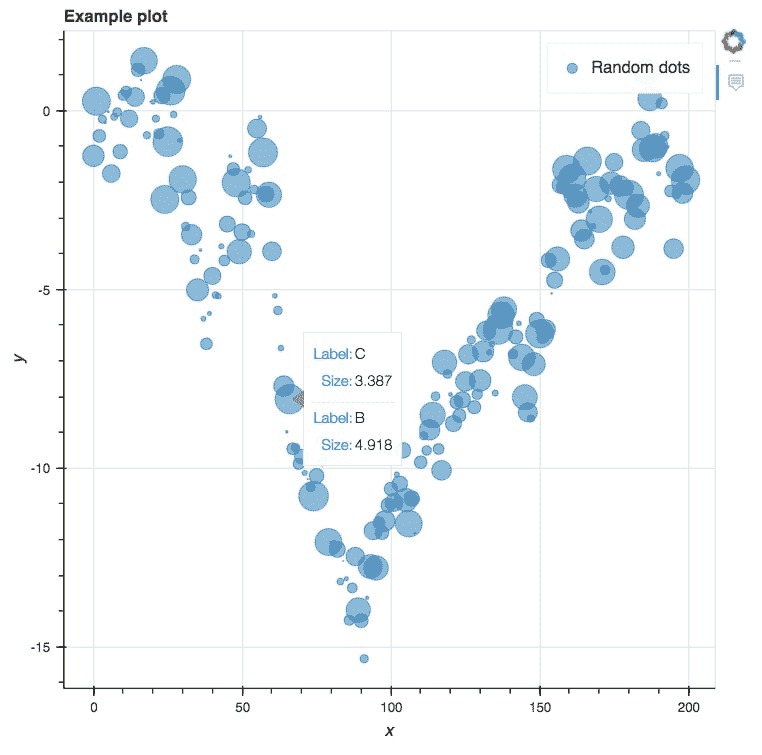

    通过将键/值对的字典传递给`ColumnDataSource`构造函数，为图定义数据源。 该来源包括`x`位置，`y`位置和每个点的大小，以及每个点的随机字母`A`，`B`或`C`。 这些随机字母被指定为悬停工具的标签，该标签还将显示每个点的大小。 然后将**悬停工具**添加到图形中，并通过特定的绘制方法从每个元素中检索数据，在这种情况下为圆形。

    结果是，我们现在可以将鼠标悬停在这些点上，并查看我们为**悬停工具**选择的数据！

    通过查看绘图右侧的工具栏，我们注意到通过显式包括**悬停工具**，其他已消失。 可以通过手动将它们添加到传递给`bokeh.plotting.figure`的工具对象列表中来包括这些对象。

8.  通过运行以下代码，将平移，缩放和重置工具添加到绘图中：

    ```py
    from bokeh.models import PanTool, BoxZoomTool, WheelZoomTool, ResetTool
    ...
    ...
    		legend='Random dots')
    show(p)
    ```

    除了`tools`变量外，该代码与先前显示的代码相同，该变量现在引用了我们从 Bokeh 库中导入的几个新工具。

## 活动 B：以交互式可视化方式探索数据

我们将在上一个练习的结尾处使用 Bokeh，在右边继续学习，除了代替使用在那里看到的随机生成的数据外，我们将使用在本课的第一部分中从网上抓取的数据。

要使用 Bokeh 创建我们抓取数据的交互式可视化。

1.  在`lesson-3-workbook.ipynb`文件中，滚动到`Activity B: Interactive visualizations with Bokeh`部分。
2.  通过运行以下代码来加载以前抓取，合并和清理的网页数据：

    ```py
    df = pd.read_csv('../data/countries/merged.csv')df['Date of last change'] = pd.to_datetime(df['Date of last change'])
    ```

3.  通过显示`DataFrame`来回顾数据的样子：

    

    在上一个练习中，我们对学习 Bokeh 的工作方式感兴趣，而现在，我们对这种数据的外观感兴趣。 为了探索该数据集，我们将使用交互式可视化。

4.  通过运行以下代码，绘制人口散点图作为利率的函数：

    ```py
    source = ColumnDataSource(data=dict(
    	x=df['Interest rate'],
    	y=df['Population'],
    	desc=df['Country'],
    ))
    hover = HoverTool(tooltips=[
    	('Country', '@desc'),
    	('Interest Rate (%)', '@x'),
    	('Population', '@y')
    ])
    tools = [hover, PanTool(), BoxZoomTool(), WheelZoomTool(), ResetTool()]
    p = figure(tools=tools,
    			x_axis_label='Interest Rate (%)',
    			y_axis_label='Population')
    p.circle('x', 'y', size=10, alpha=0.5, source=source)
    show(p)
    ```

    

    这与我们在上一个练习中介绍 Bokeh 时看到的最终示例非常相似。 我们为每个点设置了`x`和`y`坐标以及国家/地区名称的自定义数据源。 此国家/地区名称已通过传递给**悬停工具**，因此将鼠标悬停在点上时可以看到。 我们将此工具与以及其他一组有用的工具一起传递给图中。

5.  在数据中，我们看到了一些明显的异常高种群。 将鼠标悬停在上面可以查看它们是什么：

    

    我们看到他们属于印度和中国。 这些国家的利率相当平均。 让我们通过使用**盒子缩放**工具修改视图窗口大小来关注点的其余部分。

6.  选择**盒子缩放**工具并更改查看窗口，以更好地查看大多数数据：

    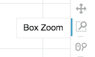

    

    探索这些要点，看看各个国家的利率如何比较。 利率最高的国家是哪些？

    

7.  一些人口较少的国家似乎具有负利率。 选择“车轮缩放”工具，然后使用它来放大该区域。 如果需要，请使用“平移”工具将图重新居中，以便查看负利率样本。 将鼠标悬停在其中一些上，查看它们对应的国家/地区：

    

    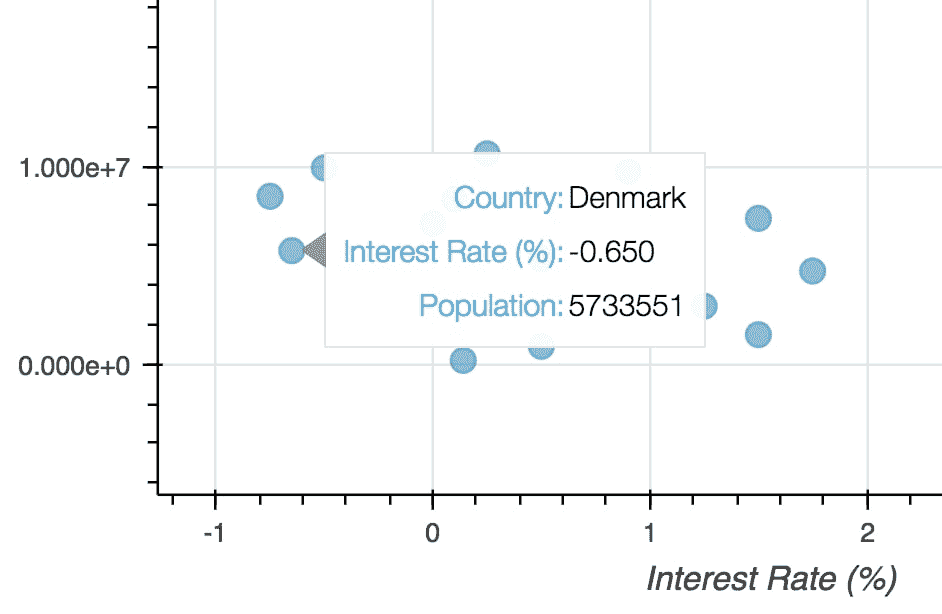

    让我们重新绘图，根据上一次利率更改的日期添加颜色。 这对于搜索上次更改日期与利率或人口规模之间的关系很有用。

8.  通过运行以下代码，将`'Year of last change'`列添加到`DataFrame`中：

    ```py
    def get_year(x):year = x.strftime('%Y')if year in ['2018', '2017', '2016']:return yearelse:        return 'Other'df['Year of last change'] = df['Date of last change'].apply(get_year)
    ```

    我们首先定义一个函数，根据上次更改的年份对样本进行分组，然后将该函数应用于**最近更改的日期**列。 接下来，我们需要将这些值映射到颜色以进行可视化。

9.  通过运行以下代码，创建地图以将上次更改日期分组为颜色类别：

    ```py
    year_to_color = {
    	'2018': 'black',
    	'2017': 'blue',
    	'2016': 'orange',
    	'Other':'red'
    }
    ```

    一旦映射到**上次更改的年份**列，它将根据可用的类别（2018、2017、2016 和其他）为颜色分配值。 这里的颜色是标准字符串，但也可以用十六进制代码表示。

10.  通过运行以下代码来创建彩色的可视化文件：

    ```py
    source = ColumnDataSource(data=dict(
    	x=df['Interest rate'],
    ...
    ...
    		fill_color='colors', line_color='black',
    		legend='label')
    show(p)
    ```

    ### 注意

    有关完整的代码，请参考`Lesson 3`文件夹中的`Lesson 3.txt`文件。

    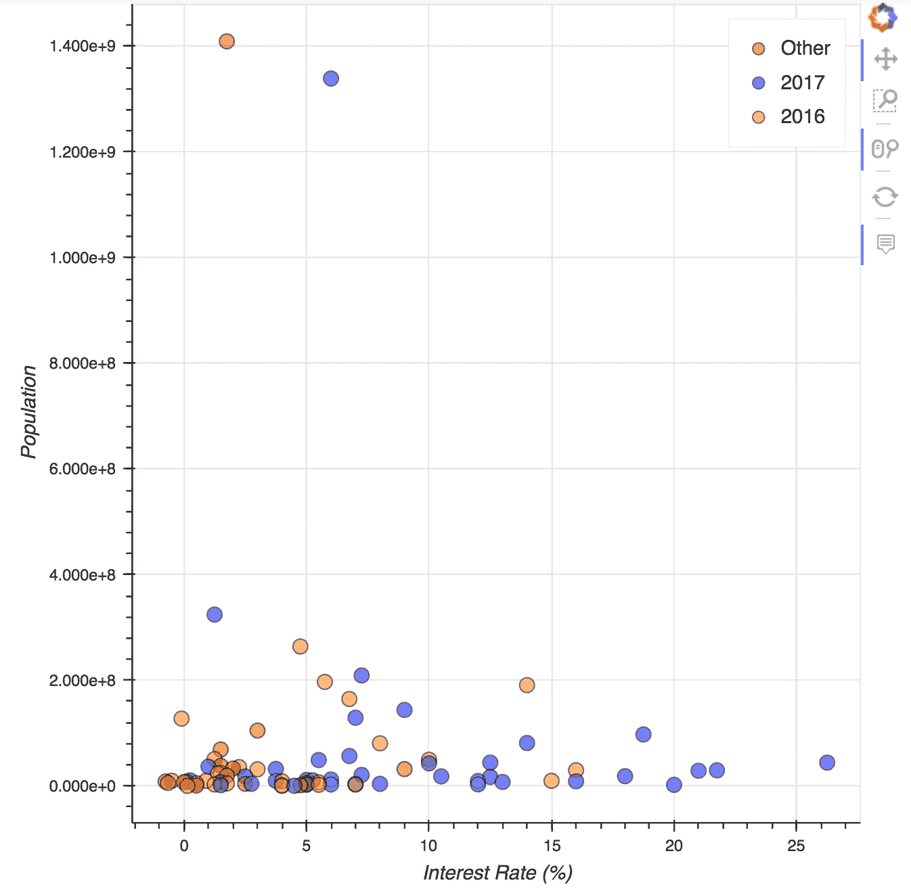

    这里有一些重要的技术细节。 首先，我们将每个点的颜色和标签添加到`ColumnDataSource`。 然后在通过设置`fill_color`和`legend`自变量绘制圆图时引用这些参数。

11.  寻找模式，放大人口较少的国家：

    

    我们可以看到黑点在图的右侧更加普遍。 这表明利率较高的国家近期更新的可能性更大。

    我们尚未查看的一个数据列是人口的逐年变化。 让我们将其与利率进行可视化比较，看看是否存在任何趋势。 我们还将通过根据国家/地区人口设置圆圈大小来增强绘图效果。

12.  通过运行以下代码，将利率绘制为人口年度变化的函数：

    ```py
    source = ColumnDataSource(data=dict(x=df['Yearly Change'],...
        ...p.circle('x', 'y', size=10, alpha=0.5, source=source,radius='radii')show(p)
    ```

    

    在这里，我们使用总体的平方根作为半径，确保也将结果按比例缩小到合适的大小以进行可视化。

    我们看到人口的逐年变化与利率之间存在很强的相关性。 当我们考虑人口数量时，主要通过观察较大的圆圈，这种相关性尤其强。 让我们在图中添加一条最合适的线来说明这种相关性。

    我们将使用 Scikit-learn 以国家人口（如上图所示）为权重来创建最合适的线。

13.  通过运行以下代码，确定最适合先前绘制关系的线：

    ```py
    from sklearn.linear_model import LinearRegression
    X = df['Yearly Change'].values.reshape(-1, 1)
    y = df['Interest rate'].values
    weights = np.sqrt(df['Population'])/1e5
    lm = LinearRegression()
    lm.fit(X, y, sample_weight=weights)
    lm_x = np.linspace(X.flatten().min(), X.flatten().max(), 50)
    lm_y = lm.predict(lm_x.reshape(-1, 1))
    ```

    本书前面的部分应该熟悉 Scikit-learn 代码。 如所承诺的那样，我们使用上图所示的转换后的总体作为权重。 然后，通过预测一系列`x`值的线性模型值来计算最佳拟合线。

    为了绘制线条，我们可以重用前面的代码，向 Bokeh 中的`line`模块添加一个额外的调用。 我们还必须为此行设置一个新的数据源。

14.  通过运行以下代码，重新绘制上图，添加一条最合适的线：

    ```py
    source = ColumnDataSource(data=dict(
    	x=df['Yearly Change'],
    	y=df['Interest rate'],
    ...
    ...
    p.line('x', 'y', line_width=2, line_color='red',
    		source=lm_source)
    show(p)
    ```

    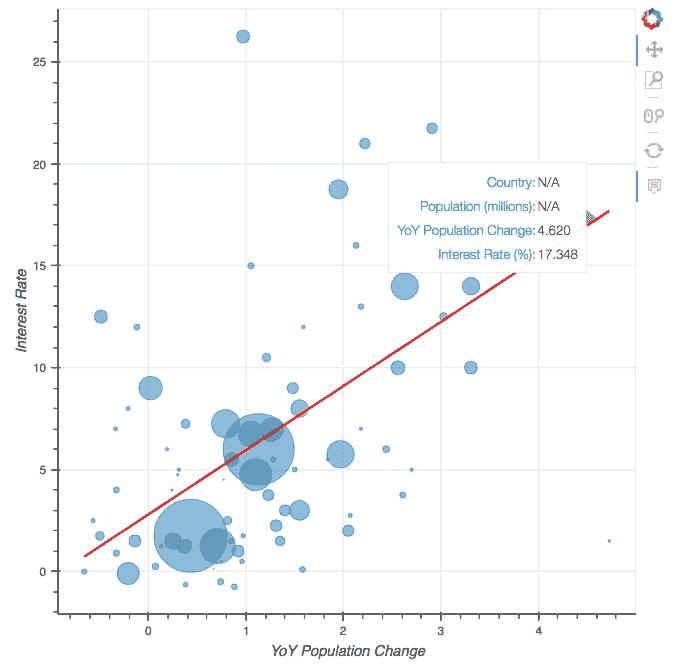

    对于线源`lm_source`，我们将`N/A`作为国家名称和人口，因为这些不是最适合的线的适用值。 通过将鼠标悬停在该行上可以看到，它们确实出现在工具提示中。

    这种可视化的交互性质为我们提供了一个独特的机会来探索此数据集中的异常值，例如，右下角的小点。

15.  使用缩放工具并将鼠标悬停在有趣的样本上，以探索图。 请注意以下几点：

    *   乌克兰的年利率变化不大，因此利率异常高：

        

    *   鉴于人口的逐年增加，巴林的利率异常低下：

        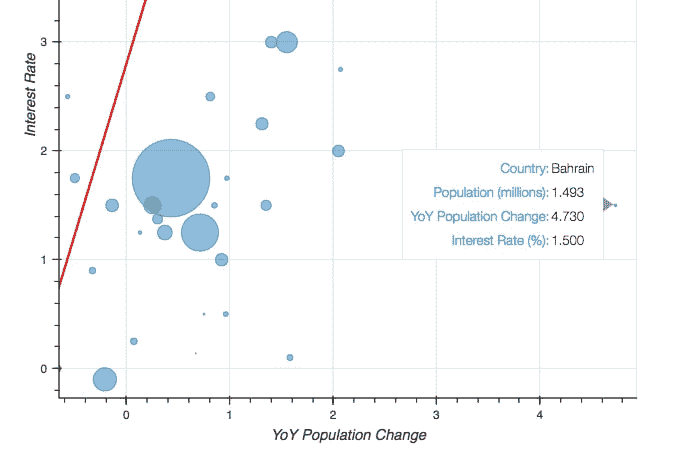

# 总结

在本课程中，我们抓取了网页表，然后使用交互式可视化工具来研究数据。

我们首先查看 HTTP 请求的工作方式，重点关注 GET 请求及其响应状态代码。 然后，我们进入 Jupyter 笔记本，并使用 Requests 库通过 Python 发出 HTTP 请求。 我们了解了如何使用 Jupyter 以及可与之交互的实际网页在笔记本中呈现 HTML。 发出请求后，我们看到了如何使用 BeautifulSoup 来解析 HTML 中的文本，并使用该库来刮擦表格数据。

抓取两个数据表后，我们将它们存储在 Pandas `DataFrame`中。 第一个表包含每个国家的中央银行利率，第二个表包含人口。 我们将它们组合到一个表中，然后用于创建交互式可视化。

最后，我们使用 Bokeh 在 Jupyter 中渲染交互式可视化效果。 我们看到了如何使用 Bokeh API 创建各种自定义图，并创建了具有特定交互功能（例如缩放，平移和悬停）的散点图。 在定制方面，我们明确显示了如何为每个数据样本设置点半径和颜色。 此外，当使用 Bokeh 探索被抓取的人口数据时，将工具提示悬停在各个点上时会显示国家名称和相关数据。

祝贺您使用 Jupyter笔记本完成了本数据科学入门课程！ 无论您在本书中使用 Jupyter 和 Python 的经验如何，您都已经学到了一些实用的数据科学实用知识！

在结束之前，让我们快速回顾一下本书中涉及的主题。

第一个课程是 Jupyter笔记本平台的简介，其中涵盖了所有基础知识。 我们了解了界面以及如何使用和安装魔术函数。 然后，我们介绍了将要使用的 Python 库，并对*波士顿房屋*数据集进行了探索性分析。

在第二课中，我们专注于与 Jupyter 一起进行机器学习。 我们首先讨论了制定预测分析计划的步骤，然后介绍了几种不同类型的模型，包括 SVM，KNN 分类器和随机森林。 在处理*员工保留*数据集时，我们应用了数据清理方法，然后训练了模型以预测员工是否离开。 我们还探讨了更高级的主题，例如过拟合，K 折交叉验证和验证曲线。

最后，在第三课中，我们简要地从数据分析转移到使用 Web 抓取的数据收集，并了解了如何在 Jupyter 中进行 HTTP 请求和解析 HTML 响应。 然后，我们通过使用交互式可视化来探索我们收集的数据来完成本书。

我们希望您喜欢通过 Jupyter笔记本完成所有这些工作，并希望将来可以在项目中继续使用它们！