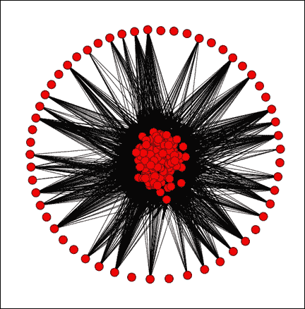
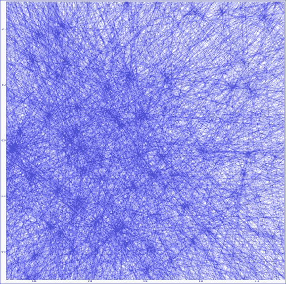
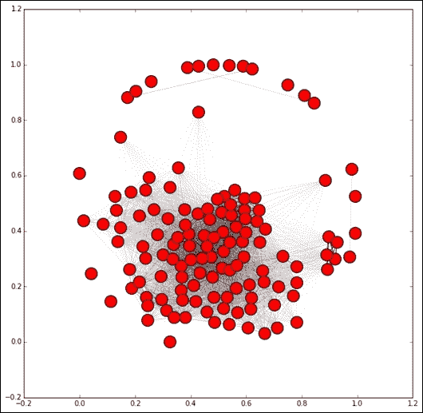
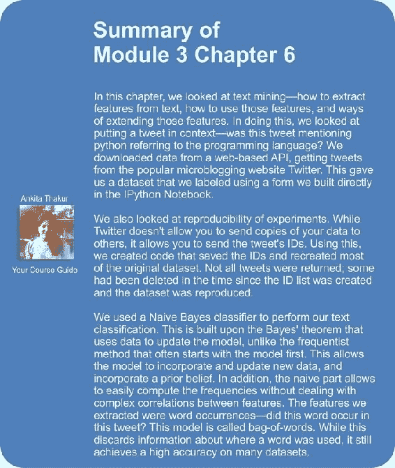
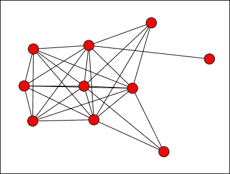

# 第 7 章。使用图挖掘发现要遵循的帐户

许多事物可以表示为图形。 在大数据，在线社交网络和物联网的今天，尤其如此。 尤其是，在线社交网络是一项大生意，Facebook 等网站拥有超过 5 亿活跃用户（其中​​50％每天登录）。 这些网站通常通过有针对性的广告获利。 但是，要使用户与网站互动，他们通常需要关注有趣的人或页面。

在本章中，我们将研究相似性的概念以及如何基于相似性创建图。 我们还将看到如何使用连接的组件将此图分成有意义的子图。 这个简单的算法引入了聚类分析的概念-根据相似度将数据集分为子集。 我们将在[第 10 章](31.html "Chapter 10. Clustering News Articles")，*聚类新闻文章*中更深入地研究聚类分析。

本章涵盖的主题包括：

*   从社交网络创建图
*   加载和保存内置分类器
*   NetworkX 软件包
*   将图转换为矩阵
*   距离和相似度
*   基于评分功能优化参数
*   损失函数和计分函数

# 加载数据集

在本章的中，我们的任务是基于共享连接向在线社交网络上的用户推荐。 我们的逻辑是，*如果两个用户有相同的朋友，则他们非常相似，值得彼此推荐*。

我们将使用上一章介绍的 API 从 Twitter 创建一个小的社交图。 我们正在寻找的数据是对类似主题感兴趣的用户的子集（再次是 Python 编程语言）以及所有朋友的列表（他们关注的人）。 使用此数据，我们将基于检查两个用户共有多少个朋友，他们的相似程度如何。

### 注意

除 Twitter 外，还有许多其他在线社交网络。 我们选择 Twitter 进行此实验的原因是，他们的 API 使得获取此类信息非常容易。 该信息也可以从其他站点获得，例如 Facebook，LinkedIn 和 Instagram。 但是，获取此信息更加困难。

要开始收集数据，请像上一章一样，设置一个新的 IPython Notebook 和一个`twitter`连接的实例。 您可以重用上一章中的应用程序信息，也可以创建一个新的信息：

```py
import twitter
consumer_key = "<Your Consumer Key Here>"
consumer_secret = "<Your Consumer Secret Here>"
access_token = "<Your Access Token Here>"
access_token_secret = "<Your Access Token Secret Here>"
authorization = twitter.OAuth(access_token, access_token_secret, consumer_key, consumer_secret)
t = twitter.Twitter(auth=authorization, retry=True)
```

另外，创建输出文件名：

```py
import os
data_folder = os.path.join(os.path.expanduser("~"), "Data", "twitter")
output_filename = os.path.join(data_folder, "python_tweets.json")
```

我们还需要`json`库来保存数据：

```py
import json
```

接下来，我们将需要一个用户列表。 和上一章一样，我们将搜索鸣叫，并寻找那些提及单词 *python* 的人。 首先，创建两个列表，用于存储推文的文本和相应的用户。 稍后我们将需要用户 ID，因此我们现在创建一个字典映射。 代码如下：

```py
original_users = []
tweets = []
user_ids = {}
```

我们将像上一章一样搜索 *python* 一词，并遍历搜索结果：

```py
search_results = t.search.tweets(q="python", count=100)['statuses']
for tweet in search_results:
```

我们只对推文感兴趣，对 Twitter 可以传递的其他消息不感兴趣。 因此，我们检查结果中是否有文字：

```py
    if 'text' in tweet:
```

如果是这样，我们将记录用户的屏幕名称，鸣叫文本以及屏幕名称到用户 ID 的映射。 代码如下：

```py
        original_users.append(tweet['user']['screen_name'])
        user_ids[tweet['user']['screen_name']] = tweet['user']['id']
        tweets.append(tweet['text'])
```

运行此代码将获得约 100 条推文，在某些情况下可能会少一些。 但是，并非所有这些都与编程语言有关。

## 使用现有模型进行分类

正如我们在上一章中所了解的那样，并非所有提及单词 *python* 的推文都将与编程语言相关。 为此，我们将使用上一章中使用的分类器来基于编程语言获取推文。 我们的分类器并不完美，但是与仅进行搜索相比，它会带来更好的专业化。

在这种情况下，我们只对发推特有关 Python（一种编程语言）的用户感兴趣。 我们将使用上一章中的分类器来确定哪些推文与编程语言相关。 从那里，我们将只选择那些在推特上发布有关编程语言的用户。

为此，我们首先需要保存模型。 打开我们在上一章中创建的 IPython Notebook，我们在其中构建了分类器。 如果您关闭了它，那么 IPython Notebook 将不会记住您所做的事情，因此您将需要再次运行这些单元。 为此，请在笔记本电脑的**单元格**菜单上单击，然后选择**全部运行**。

计算完所有单元格后，选择最终的空白单元格。 如果您的笔记本电脑末尾没有空白单元格，请选择最后一个单元格，选择**插入**菜单，然后选择**在**下面插入单元格。

我们将使用`joblib`库保存并加载模型。

### 注意

`scikit-learn`软件包中包含`joblib`。

首先，导入库并为我们的模型创建输出文件名（确保目录存在，否则将不会创建目录）。 我已经将该模型存储在 **Models** 目录中，但是您可以选择将它们存储在其他位置。 代码如下：

```py
from sklearn.externals import joblib
output_filename = os.path.join(os.path.expanduser("~"), "Models", "twitter", "python_context.pkl")
```

接下来，我们使用`joblib`中的`dump`函数，其功能类似于`json`库中的函数。 我们传递模型本身（如果忘记了，则简称为`model`），并传递输出文件名：

```py
joblib.dump(model, output_filename)
```

运行此代码会将模型保存到给定的文件名。 接下来，返回到在上一小节中创建的新 IPython Notebook 并加载此模型。

您将需要通过复制以下代码在此笔记本中再次设置模型的文件名：

```py
model_filename = os.path.join(os.path.expanduser("~"), "Models", "twitter", "python_context.pkl")
```

确保文件名是保存模型之前使用的文件名。 接下来，我们需要重新创建我们的`NLTKBOW`类，因为它是一个定制类，不能由`joblib`直接加载。 在后面的章节中，我们将解决此问题的一些更好方法。 现在，只需从上一章的代码中复制整个`NLTKBOW`类，包括其依赖项即可：

```py
from sklearn.base import TransformerMixin
from nltk import word_tokenize

class NLTKBOW(TransformerMixin):
    def fit(self, X, y=None):
        return self

    def transform(self, X):
        return [{word: True for word in word_tokenize(document)}
                 for document in X]
```

现在加载模型只需要调用`joblib`的`load`函数：

```py
from sklearn.externals import joblib
context_classifier = joblib.load(model_filename)
```

我们的`context_classifier`的工作原理与我们在[第 6 章](27.html "Chapter 6. Social Media Insight Using Naive Bayes")，*使用朴素贝叶斯*的社交媒体见解中看到的笔记本的`model`对象相同，它是`Pipeline`的一个实例， 具有与之前相同的三个步骤（`NLTKBOW`，`DictVectorizer`和`BernoulliNB`分类器）。

在此模型上调用`predict`函数可以预测我们的推文是否与编程语言相关。 代码如下：

```py
y_pred = context_classifier.predict(tweets)
```

如果（预测为）与编程语言相关的`ith`推文，则`y_pred`中的`ith`项将为 1，否则它将为 0。从这里，我们可以仅获得与之相关的推文。 他们的相关用户：

```py
relevant_tweets = [tweets[i] for i in range(len(tweets)) if y_pred[i] == 1]
relevant_users = [original_users[i] for i in range(len(tweets)) if y_pred[i] == 1]
```

使用我的数据，这涉及到 46 个相关用户。 比以前的 100 条推文/用户略低，但现在我们有了构建社交网络的基础。

## 从 Twitter 获取关注者信息

接下来，我们需要获得的*个朋友*每个用户。 朋友是用户关注的人。 用于此的 API 称为`friends/ids`，它有优点也有缺点。 好消息是，它在一个 API 调用中最多返回 5,000 个朋友 ID。 坏消息是，您每 15 分钟只能拨打 15 个电话，这意味着每位用户至少要花 1 分钟才能吸引所有关注者-如果他们的朋友数超过 5,000，则关注者会更多（发生的次数比您想象的要多） 。

但是，代码相对容易。 我们将其打包为一个函数，因为在接下来的两节中将使用此代码。 首先，我们将创建带有我们的 Twitter 连接和用户 ID 的功能签名。 该函数将返回该用户的所有关注者，因此我们还将创建一个列表来存储这些关注者。我们还将需要时间模块，因此也需要导入它。 我们将首先介绍函数的组成，但是接下来，我将为您完整介绍整个函数。 代码如下：

```py
import time
def get_friends(t, user_id):
    friends = []
```

尽管这可能令人惊讶，但许多 Twitter 用户拥有超过 5,000 个朋友。 因此，我们将需要使用 Twitter 的**分页**。 Twitter 通过使用游标管理多个*页面*数据。 当要求 Twitter 提供信息时，它会提供该信息以及*光标*，这是 Twitter 用户跟踪您的请求的整数。 如果没有更多信息，则此光标为 0；否则为 0。 否则，您可以使用提供的光标来获取下一页结果。 首先，将光标设置为-1，指示结果的开始：

```py
    cursor = -1
```

接下来，我们继续循环，而此游标不等于 0（因为当它是游标时，就没有更多数据可收集了）。 然后，我们请求用户的关注者并将其添加到我们的列表中。 我们在`try`块中执行此操作，因为我们可以处理可能发生的错误。 追随者的 ID 存储在`results`词典的`ids`键中。 获取该信息后，我们更新游标。 它将在循环的下一次迭代中使用。 最后，我们检查是否有超过 10,000 个朋友。 如果是这样，我们就跳出了循环。 代码如下：

```py
    while cursor != 0:
        try:
            results = t.friends.ids(user_id= user_id, cursor=cursor, count=5000)
            friends.extend([friend for friend in results['ids']])
            cursor = results['next_cursor']
            if len(friends) >= 10000:
                break
```

### 注意

值得在此处插入警告。 我们正在处理来自 Internet 的数据，这意味着奇怪的事情可能而且确实会定期发生。 我在开发此代码时遇到的一个问题是，一些用户有很多很多朋友。 为解决此问题，我们将在此处放置一个故障保护，如果我们达到 10,000 个以上的用户，则退出。 如果要收集完整的数据集，则可以删除这些行，但是请注意，它可能会长时间卡在特定用户上。

现在，我们处理可能发生的错误。 如果我们不小心达到了 API 限制，则会发生最有可能发生的错误（虽然我们有`sleep`来阻止它，但是，如果在`sleep`完成之前停止并运行代码，则可能会发生）。 在这种情况下，`results is None`和我们的代码将失败，并带有`TypeError`。 在这种情况下，我们等待 5 分钟，然后重试，希望我们到达下一个 15 分钟的窗口。 此时可能会出现另一种`TypeError`。 如果其中之一确实存在，我们将提出并需要单独处理。 代码如下：

```py
        except TypeError as e:
            if results is None:
                print("You probably reached your API limit, waiting for 5 minutes")
                sys.stdout.flush()
                time.sleep(5*60) # 5 minute wait
            else:
                raise e
```

可能发生的第二个错误发生在 Twitter 的末端，例如要求一个不存在的用户或其他一些基于数据的错误。 在这种情况下，请勿再尝试使用该用户，而只返回我们确实获得的所有关注者（在这种情况下，该关注者可能为 0）。 代码如下：

```py
        except twitter.TwitterHTTPError as e:
            break
```

现在，我们将处理我们的 API 限制。 Twitter 仅让我们每 15 分钟询问 15 次关注者信息，因此我们将等待 1 分钟后再继续。 我们在`finally`块中执行此操作，以便即使发生错误也可以发生：

```py
        finally:
            time.sleep(60)
```

通过返回我们收集的朋友来完成我们的功能：

```py
    return friends
```

完整功能如下：

```py
import time
def get_friends(t, user_id):
    friends = []
    cursor = -1
    while cursor != 0:
        try:
            results = t.friends.ids(user_id= user_id, cursor=cursor, count=5000)
            friends.extend([friend for friend in results['ids']])
            cursor = results['next_cursor']
            if len(friends) >= 10000:
                break
        except TypeError as e:
            if results is None:
                print("You probably reached your API limit, waiting for 5 minutes")
                sys.stdout.flush()
                time.sleep(5*60) # 5 minute wait
            else:
                raise e
        except twitter.TwitterHTTPError as e:
                break
               finally:
                   time.sleep(60)
    return friends
```

## 建立网络

现在我们将建立我们的网络。 从我们的原始用户开始，我们将获得他们的每个朋友并将其存储在字典中（从`user_id`字典中获得用户的 ID 后）：

```py
friends = {}
for screen_name in relevant_users:
    user_id = user_ids[screen_name]
    friends[user_id] = get_friends(t, user_id)
```

接下来，我们将删除没有任何朋友的所有用户。 对于这些用户，我们真的不能以这种方式提出建议。 相反，我们可能必须查看他们的内容或关注他们的人。 但是，我们将其排除在本章的范围之外，因此我们仅删除这些用户。 代码如下：

```py
friends = {user_id:friends[user_id] for user_id in friends
             if len(friends[user_id]) > 0}
```

现在，我们有 30 至 50 个用户，具体取决于您的初始搜索结果。 现在，我们将其数量增加到 150 个。以下代码将花费很长时间才能运行-鉴于 API 的限制，我们每分钟只能为用户获得一次好友。 简单的数学将告诉我们，150 个用户将花费 150 分钟，即 2.5 个小时。 考虑到我们将花费时间来获取这些数据，确保我们仅获得*个良好的*用户是值得的。

但是，什么才是好的用户呢？ 鉴于我们将寻求基于共享连接的建议，我们将基于共享连接搜索用户。 我们将从与我们现有用户之间有更好联系的那些用户开始，吸引现有用户的朋友。 为此，我们将统计用户在`friends`列表之一中的所有访问次数。 在考虑采样策略时，值得考虑应用程序的目标。 为此，获得大量相似用户可以使建议更加定期地适用。

为此，我们只需遍历我们拥有的所有`friends`列表，然后在每次出现朋友时计数。

```py
from collections import defaultdict
def count_friends(friends):
    friend_count = defaultdict(int)
    for friend_list in friends.values():
        for friend in friend_list:
            friend_count[friend] += 1
    return friend_count
```

计算我们当前的个朋友计数，然后我们可以从样本中获得最多个联系的人（即，现有列表中的大多数朋友）。 代码如下：

```py
friend_count
reverse=True) = count_friends(friends)
from operator import itemgetter
best_friends = sorted(friend_count.items(), key=itemgetter(1),
```

从这里开始，我们建立了一个循环，一直持续到拥有 150 个用户的朋友为止。 然后，我们遍历所有最好的朋友（这按照将他们作为朋友的人数的顺序进行），直到找到一个我们尚未认识其朋友的用户。 然后，我们得到该用户的朋友并更新`friends`计数。 最后，我们算出谁是我们名单中尚未联系最多的用户：

```py
while len(friends) < 150:
    for user_id, count in best_friends:
        if user_id not in friends:
            break       
        friends[user_id] = get_friends(t, user_id)
    for friend in friends[user_id]:
        friend_count[friend] += 1
    best_friends = sorted(friend_count.items(), 
      key=itemgetter(1), reverse=True)
```

然后，这些代码将循环播放并继续，直到达到 150 个用户为止。

### 注意

您可能希望将这些值设置得较低，例如 40 个或 50 个用户（甚至只是暂时跳过此代码位）。 然后，完成本章的代码并了解结果的工作方式。 之后，将该循环中的用户数重置为 150，使代码运行几个小时，然后返回并重新运行以后的代码。

考虑到收集数据可能要花费 2 个小时以上的时间，因此保存它是个好主意，以防万一我们必须关闭计算机。 使用`json`库，我们可以轻松地将好友字典保存到文件中：

```py
import json
friends_filename = os.path.join(data_folder, "python_friends.json")
with open(friends_filename, 'w') as outf:
    json.dump(friends, outf)
```

如果需要加载文件，请使用`json.load`函数：

```py
with open(friends_filename) as inf:
    friends = json.load(inf)
```

## 创建图表

现在，我们有一个用户及其朋友的列表，其中许多用户是从其他用户的朋友那里获取的。 这为我们提供了一个图表，其中一些用户是其他用户的朋友（尽管不一定相反）。

图是一组节点和边。 节点通常是对象，在这种情况下，它们是我们的用户。 该初始图中的边缘指示*用户 A 是用户 B* 的朋友。 我们将其称为有向图，因为节点的顺序很重要。 仅仅因为用户 A 是用户 B 的朋友，并不意味着用户 B 是用户 A 的朋友。我们可以使用 **NetworkX** 包来可视化该图。

### 注意

再次单击，即可使用`pip`安装 NetworkX：`pip3 install networkx`。

首先，我们使用 NetworkX 创建一个有向图。 按照惯例，在导入 NetworkX 时，我们使用缩写`nx`（尽管这不是必需的）。 代码如下：

```py
import networkx as nx
G = nx.DiGraph()
```

我们只会可视化关键用户，而不是所有朋友（因为有成千上万的用户，很难想象）。 我们得到了主要用户，然后将它们作为节点添加到我们的图形中。 代码如下：

```py
main_users = friends.keys()
G.add_nodes_from(main_users)
```

接下来，我们设置边缘。 如果第二个用户是第一个用户的朋友，则创建从一个用户到另一个用户的边缘。 为此，我们遍历所有朋友：

```py
for user_id in friends:
    for friend in friends[user_id]:
```

我们确保朋友是我们的主要用户之一（因为我们目前对其他用户不感兴趣），如果有，请添加优势。 代码如下：

```py
        if friend in main_users:
           G.add_edge(user_id, friend)
```

现在，我们可以使用 NetworkX 的`draw`函数（使用`matplotlib`）来可视化网络。 为了在笔记本中获取图像，我们使用`matplotlib`上的`inline`函数，然后调用`draw`函数。 代码如下：

```py
%matplotlib inline
nx.draw(G)
```

结果有点难以理解。 他们显示有些节点的连接很少，但许多节点的连接却很多：



通过使用`pyplot`处理图形的创建，我们可以使图稍微大一些。 为此，我们导入`pyplot`，创建一个大图形，然后调用 NetworkX 的`draw`函数（NetworkX 使用`pyplot`绘制其图形）：

```py
from matplotlib import pyplot as plt
plt.figure(3,figsize=(20,20))
nx.draw(G, alpha=0.1, edge_color='b')
```

结果对于此处的页面来说太大了，但是通过放大图形，现在可以看到图形的外观轮廓。 在我的图表中，有一个主要的用户组，它们彼此之间高度连接，而大多数其他用户根本没有多少连接。 在这里，我仅放大了网络的中心，并在前面的代码中将边缘颜色设置为蓝色，且`alpha`较低。

如您所见，它在中心位置连接非常好！



实际上是我们选择新用户的方法的一个属性-我们选择那些在图中已经很好地联系在一起的用户，因此他们很可能会使这个组更大。 对于社交网络，通常，用户具有的连接数遵循幂定律。 一小部分用户拥有许多连接，而其他用户只有少数。 通常将图形的形状描述为具有*长尾巴*。 我们的数据集不遵循这种模式，因为我们是通过结交已有用户的朋友来收集数据的。

## 创建相似图

通过共享的朋友推荐本章中的任务。 如前所述，我们的逻辑是，*如果两个用户有相同的朋友，则他们是非常相似的*。 我们可以在此基础上向另一个推荐一个用户。

因此，我们将采用我们现有的图（具有与友谊有关的边缘）并创建一个新图。 节点仍然是用户，但是边缘将成为加权边缘。 加权边仅是具有`weight`属性的边。 逻辑是，较高的权重表示两个节点之间的相似性高于较低的权重。 这是取决于上下文的。 如果权重代表距离，则权重越低表示相似度越高。

对于我们的应用程序，权重将是通过该边缘连接的两个用户的相似性（基于他们共享的朋友数）。 此图还具有不定向的特性。 这是由于我们进行了相似度计算，其中用户 A 与用户 B 的相似度与用户 B 与用户 A 的相似度相同。

这样有很多方法可以计算两个列表之间的相似度。 例如，我们可以计算两者共有的朋友数。 但是，对于有更多朋友的人来说，此指标总是更高。 取而代之的是，我们可以将归一化，以除以两者拥有的不同好友总数。 这称为 **Jaccard 相似度**。

Jaccard 相似度始终在 0 和 1 之间，表示两者的百分比重叠。 正如我们在[第 2 章](23.html "Chapter 2. Classifying with scikit-learn Estimators")和*中使用 scikit-learn Estimators* 进行分类一样，规范化是数据挖掘练习的重要组成部分，通常是一件好事（除非您有特定的原因而不是 到）。

为了计算此 Jaccard 相似度，我们将两组跟随者的交集除以两者的并集。 这些是`set`操作，我们有`lists`，因此我们需要首先将`friends`列表转换为集合。 代码如下：

```py
friends = {user: set(friends[user]) for user in friends}
```

然后，我们创建一个函数来计算两组`friends`列表的相似度。 代码如下：

```py
def compute_similarity(friends1, friends2):
return len(friends1 & friends2) / len(friends1 | friends2)
```

从这里，我们可以创建用户之间相似度的加权图。 在本章的其余部分中，我们将大量使用它，因此我们将创建一个函数来执行此操作。 让我们看一下 threshold 参数：

```py
def create_graph(followers, threshold=0):
    G = nx.Graph()
```

我们遍历所有用户组合，而忽略了将用户与其自身进行比较的实例：

```py
    for user1 in friends.keys():
        for user2 in friends.keys():
            if user1 == user2:
                continue
```

我们计算两个用户之间边缘的权重：

```py
            weight = compute_similarity(friends[user1], friends[user2])
```

接下来，我们仅在超过特定阈值时添加边缘。 这样可以阻止我们添加不需要的边缘，例如权重为 0 的边缘。默认情况下，我们的阈值为 0，因此现在将包括所有边缘。 但是，我们将在本章后面使用此参数。 代码如下：

```py
            if weight >= threshold:
```

如果权重高于阈值，则将两个用户添加到图中（如果两个用户已经在图中，则不会将它们添加为重复项）：

```py
                G.add_node(user1)
                G.add_node(user2)
```

然后，我们在它们之间添加边，将权重设置为计算出的相似度：

```py
                G.add_edge(user1, user2, weight=weight)
```

循环完成后，我们将获得一个完整的图形，并从函数中将其返回：

```py
    return G
```

现在，我们可以通过调用此函数来创建图形。 我们从没有阈值开始，这意味着将创建所有链接。 代码如下：

```py
G = create_graph(friends)
```

结果是一个非常紧密相连的图-所有节点都具有边，尽管其中许多结点的权重为 0。通过绘制线宽相对于边权重的图，我们将看到边的权重 -粗线表示较高的权重。

由于节点数，将数字增大以更清楚地了解连接是有意义的：

```py
plt.figure(figsize=(10,10))
```

我们将使用权重绘制边缘，因此我们需要先绘制节点。 NetworkX 根据某些条件使用布局来确定将节点和边放置在何​​处。 网络可视化是一个非常困难的问题，尤其是随着节点数量的增长。 存在多种用于可视化网络的技术，但是它们的工作程度在很大程度上取决于您的数据集，个人喜好和可视化的目标。 我发现`spring_layout`效果很好，但是其他选项，例如`circular_layout`（如果没有其他效果，这是一个很好的默认设置），`random_layout`，`shell_layout`和`spectral_layout`。

### 注意

请访问 [http://networkx.lanl.gov/reference/drawing.html](http://networkx.lanl.gov/reference/drawing.html) 了解有关 NetworkX 中布局的更多详细信息。 尽管`draw_graphviz`选项增加了一些复杂性，但其效果很好，值得进行更好的可视化研究。 在实际使用中非常值得考虑。

让我们使用`spring_layout`进行可视化：

```py
pos = nx.spring_layout(G)
```

使用我们的`pos`布局，然后可以定位节点：

```py
nx.draw_networkx_nodes(G, pos)
```

接下来，我们绘制边缘。 为了获得权重，我们遍历图形的边缘（以特定顺序）并收集权重：

```py
edgewidth = [ d['weight'] for (u,v,d) in G.edges(data=True)]
```

然后，我们绘制边缘：

```py
nx.draw_networkx_edges(G, pos, width=edgewidth)
```

结果将取决于您的数据，但通常会显示一个图形，其中有大量节点牢固连接，而有几个节点与网络其余部分的连接不良。



与上一张图相比，此图的不同之处在于，边基于我们的相似性度量标准而不是根据一个人是否是另一个的朋友来确定节点之间的相似性（尽管两者之间存在相似性！ ）。 现在，我们可以开始从该图中提取信息以提出建议。


# 应用

现在，我们将创建一个仅包含一条 tweet 的管道，并仅基于该 tweet 的内容确定其是否相关。

为了执行单词提取，我们将使用 NLTK，这是​​一个包含大量用于对自然语言进行分析的工具的库。 我们还将在以后的章节中使用 NLTK。

### 注意

要在计算机上获取 NLTK，请使用`pip`安装软件包：`pip3 install nltk`

如果不起作用，请参见 [www.nltk.org/install.html](http://www.nltk.org/install.html) 上的 NLTK 安装说明。

我们将创建一个管道以提取单词特征并使用朴素贝叶斯对推文进行分类。 我们的管道具有以下步骤：

1.  使用 NLTK 的`word_tokenize`函数将原始文本文档转换为计数字典。
2.  使用`scikit-learn`中的`DictVectorizer`转换器将这些词典转换为向量矩阵。 这对于使 Naive Bayes 分类器能够读取第一步中提取的特征值是必需的。
3.  如前几章所述，训练朴素贝叶斯分类器。
4.  我们将需要创建另一个名为`ch6_classify_twitter`的笔记本（本章的最后一个！）来执行分类。


## 提取字数

我们将使用 NLTK 提取我们的字数统计。 我们仍然想在管道中使用它，但是 NLTK 不符合我们的转换器接口。 因此，我们将需要创建一个基本的转换器来执行此操作，以获得`fit`和`transform`方法，从而使我们能够在管道中使用它。

首先，将设置为`transformer`类。 我们不需要在该类中放入任何内容，因为此转换器仅提取文档中的单词。 因此，我们的 fit 是一个空函数，除了它返回`self`（对于变压器对象而言是必需的）。

我们的转换要复杂一些。 我们想从每个文档中提取每个单词并记录`True`（如果已发现）。 我们仅在此处使用二进制功能-如果在文档中使用`True`，否则使用`False`。 如果我们想使用频率，就可以像过去几章一样设置计数字典。

让我们看一下代码：

```py
from sklearn.base import TransformerMixin
class NLTKBOW(TransformerMixin):
    def fit(self, X, y=None):
        return self
    def transform(self, X):
        return [{word: True for word in word_tokenize(document)}
                 for document in X]
```

结果是字典列表，其中第一个字典是第一条推文中的单词列表，依此类推。 每个词典都有一个单词作为关键字，值`true`表示已发现此单词。 词典中未包含的任何单词都将被视为未出现在推文中。 明确指出单词的出现是`False`也可以，但是会占用不必要的空间来存储。

## 将字典转换为矩阵

此步骤将根据上一步构建的字典转换为可与分类器一起使用的矩阵。 通过`DictVectorizer`变压器，此步骤变得非常简单。

`DictVectorizer`类仅获取字典列表并将其转换为矩阵。 此矩阵中的特征是每个词典中的键，并且值对应于每个样本中这些特征的出现。 字典很容易用代码创建，但是许多数据算法实现更喜欢矩阵。 这使`DictVectorizer`成为非常有用的类。

在我们的数据集中，每个字典都将单词作为关键字，并且仅在单词实际出现在推文中时才会出现。 因此，如果单词出现在推文中，我们的矩阵会将每个单词作为特征，并在单元格中使用`True`的值。

要使用`DictVectorizer`，只需使用以下命令将其导入：

```py
from sklearn.feature_extraction import DictVectorizer
```

## 训练朴素贝叶斯分类器

最后，我们需要设置一个分类器，本章将使用朴素贝叶斯。 由于我们的数据集仅包含二进制特征，因此我们使用专为二进制特征设计的`BernoulliNB`分类器。 作为分类器，它非常易于使用。 与`DictVectorizer`一样，我们只需将其导入并将其添加到管道中即可：

```py
from sklearn.naive_bayes import BernoulliNB
```

## 全部放在一起

现在到了将所有这些片段放在一起的时刻。 在我们的 IPython Notebook 中，像以前一样设置文件名并加载数据集和类。 设置推文本身（而不是 ID！）和我们分配给它们的标签的文件名。 代码如下：

```py
import os
input_filename = os.path.join(os.path.expanduser("~"), "Data", "twitter", "python_tweets.json")
labels_filename = os.path.join(os.path.expanduser("~"), "Data", "twitter", "python_classes.json")
```

自己加载推文。 我们只对 tweet 的内容感兴趣，因此我们提取`text`值并仅存储该值。 代码如下：

```py
tweets = []
with open(input_filename) as inf:
    for line in inf:
        if len(line.strip()) == 0:
            continue
        tweets.append(json.loads(line)['text'])
```

加载每个推文的标签：

```py
with open(classes_filename) as inf:
    labels = json.load(inf)
```

现在，创建一个管道，将以前的组件放在一起。 我们的管道包括三个部分：

*   我们创建的`NLTKBOW`变压器
*   `DictVectorizer`变压器
*   `BernoulliNB`分类器

代码如下：

```py
from sklearn.pipeline import Pipeline
pipeline = Pipeline([('bag-of-words', NLTKBOW()),
                     ('vectorizer', DictVectorizer()),
                     ('naive-bayes', BernoulliNB())
                     ])
```

我们现在可以几乎运行我们的管道，就像我们之前做过很多次一样，我们将使用`cross_val_score`来完成。 在*之前，我们将引入比以前使用的精度指标更好的评估指标。 正如我们将看到的，当每个类别中的样本数量不同时，对数据集使用准确性是不够的。*

## 使用 F1 评分进行评估

当选择评估指标时，考虑该评估指标无用的情况总是很重要的。 在许多情况下，准确性是一个很好的评估指标，因为它易于理解且易于计算。 但是，它很容易伪造。 换句话说，在许多情况下，由于实用性差，您可以创建具有高精度的算法。

虽然我们的推文数据集（通常，您的结果可能有所不同）包含大约 50％的与编程相关的信息和 50％的非编程相关信息，但许多数据集并不像**平衡**那样。

作为示例，电子邮件垃圾邮件筛选器可能希望看到超过 80％的传入电子邮件都是垃圾邮件。 仅将所有内容标记为垃圾邮件的垃圾邮件*过滤器*完全没有用； 但是，它将获得 80％的精度！

为了解决这个问题，我们可以使用其他评估指标。 最常用的一种称为 *f1 分数*（也称为 f 分数，f 度量或该术语的许多其他变体之一）。

f1 分数是基于*每类*定义的，基于两个概念：*精度*和*调用*。 *精度*是预测为属于特定类别的实际上来自该类别的所有样本的百分比。 *召回*是数据集中属于某个类别并实际标记为属于该类别的样本的百分比。

在我们的应用程序中，我们可以计算两个类的值（相关和不相关）。 但是，我们对垃圾邮件确实很感兴趣。 因此，我们的精度计算成为一个问题：*在所有被预测为相关的推文中，实际相关的百分比是多少？* 同样，召回也成为一个问题：*在数据集中所有相关推文中，有多少被预测为相关？*

在中计算精度和查全率后，f1 分数是精度和查全率的谐波均值：


要在`scikit-learn`方法中使用 f1-score，只需将评分参数设置为 *f1* 。 默认情况下，此将返回带有标签 1 的类的 f1 分数。在我们的数据集上运行代码，我们只需使用以下代码行：

```py
scores = cross_val_score(pipeline, tweets, labels, scoring='f1')
```

然后，我们打印出平均分数：

```py
import numpy as np
print("Score: {:.3f}".format(np.mean(scores)))
```

结果为 0.798，这意味着我们可以准确地确定使用 Python 的推文是否有 80％的时间与编程语言相关。 这使用的数据集中只有 200 条推文。 返回并收集更多数据，您会发现结果有所增加！

### 注意

通常，更多数据意味着更好的准确性，但不能保证！

## 从模型中获得有用的功能

您可能会问的问题是*，用于确定推文是否相关的最佳功能是什么？* 根据朴素贝叶斯的说法，我们可以从朴素贝叶斯模型中提取这些信息，并找出哪些功能最适合个人。

首先，我们适合一个新模型。 尽管`cross_val_score`为我们提供了经过交叉验证的测试数据的不同折分，但它并不容易为我们提供经过训练的模型。 为此，我们只需将推文与流水线配合，以创建新模型。 代码如下：

```py
model = pipeline.fit(tweets, labels)
```

### 注意

请注意，我们此处并没有真正评估模型，因此我们不需要在训练/测试拆分方面格外小心。 但是，在将这些功能付诸实践之前，应该对单独的测试拆分进行评估。 为了清楚起见，我们在这里跳过该内容。

管道使您可以通过`named_steps`属性和步骤名称访问各个步骤（在创建管道对象本身时，我们自己定义了这些名称）。 例如，我们可以获得朴素贝叶斯模型：

```py
nb = model.named_steps['naive-bayes']
```

从这个模型中，我们可以提取每个单词的概率。 这些作为对数概率存储，即 *log（P（A | f））*，其中 *f* 是给定特征。

之所以将它们存储为对数概率，是因为实际值非常低。 例如，第一个值是-3.486，它与低于 0.03％的概率相关。 对数概率用于涉及这样的小概率的计算中，因为它们会阻止下溢错误，在这种情况下，很小的值会四舍五入为零。 假定所有概率都相乘，那么单个值 0 将导致整个答案始终为 0！ 无论如何，值之间的关系仍然相同。 值越高，该功能越有用。

通过对对数概率数组进行排序，我们可以获得最有用的功能。 我们想要降序，因此我们只需要先取反值即可。 代码如下：

```py
top_features = np.argsort(-feature_probabilities[1])[:50]
```

前面的代码只会给我们提供索引，而不是实际的特征值。 这不是很有用，因此我们将要素的索引映射到实际值。 关键是管道的`DictVectorizer`步骤，它为我们创建了矩阵。 幸运的是，它还记录了映射，使我们能够查找与不同列相关的要素名称。 我们可以从管道的那一部分中提取特征：

```py
dv = model.named_steps['vectorizer']
```

在这里，我们可以通过在`DictVectorizer`的`feature_names_`属性中查找顶级功能部件的名称来打印它们。 在新单元格中输入以下行，然后运行以打印出一些主要功能：

```py
for i, feature_index in enumerate(top_features):
    print(i, dv.feature_names_[feature_index], np.exp(feature_probabilities[1][feature_index]))
```

前几个功能包括`:`，`http`，`#`和`@`。 根据我们收集的数据，这很可能是噪音（尽管在编程之外，冒号的使用并不常见）。 收集更多数据对于解决这些问题至关重要。 通过列表，我们可以看到许多更明显的编程功能：

```py
7 for 0.188679245283
11 with 0.141509433962
28 installing 0.0660377358491
29 Top 0.0660377358491
34 Developer 0.0566037735849
35 library 0.0566037735849
36 ] 0.0566037735849
37 [ 0.0566037735849
41 version 0.0471698113208
43 error 0.0471698113208
```

还有在工作环境中也提到 Python，因此可能是指编程语言（尽管自由蛇处理程序也可能使用类似的术语，但它们在 Twitter 上并不常见）：

```py
22 jobs 0.0660377358491
30 looking 0.0566037735849
31 Job 0.0566037735849
34 Developer 0.0566037735849
38 Freelancer 0.0471698113208
40 projects 0.0471698113208
47 We're 0.0471698113208
```

最后一个通常采用以下格式：*我们正在寻找该职位的候选人*。

浏览这些功能会给我们带来很多好处。 我们可以训练人们认识这些推文，寻找共同点（可以深入了解某个主题），甚至摆脱毫无意义的功能。 例如，单词 *RT* 在此列表中显得很高。 但是，这是推特上常见的 Twitter 短语（即在其他人的推文上转发）。 专家可以决定从列表中删除该单词，从而使分类器因数据集较小而较不容易受到噪声的影响。





# 查找子图

从我们的相似度函数中，我们可以简单地为每个用户对结果进行排名，并以最相似的用户作为推荐来返回-就像我们对产品推荐一样。 相反，我们可能想要查找彼此相似的用户集群。 我们可以建议这些用户成立一个小组，针对该细分受众群创建广告，甚至只是使用这些集群自己进行推荐。

查找相似用户的这些集群是一项称为集群分析的任务。 这是一项艰巨的任务，具有分类任务通常没有的复杂性。 例如，评估分类结果相对容易-我们将结果与基本事实进行比较（来自我们的训练集），然后查看正确的百分比。 但是，对于聚类分析，通常没有基本事实。 基于一些先入为主的概念，我们通常会评估集群*是否有意义*，这取决于集群的外观。 聚类分析的另一个复杂之处在于，无法针对预期的学习结果训练模型-它必须基于聚类的数学模型使用一些近似值，而不是用户希望从分析中获得的结果。

## 连接的组件

最简单的聚类方法之一是在图中找到**连接的组件**。 连接的组件是图中通过边连接的一组节点。 并非所有节点都需要彼此连接才能成为连接的组件。 但是，要使两个节点位于同一连接的组件中，就需要一种从该连接的组件中的一个节点移动到另一个节点的方法。

### 注意

连接的组件在计算时不考虑边缘权重； 他们只检查边缘的存在。 因此，后面的代码将删除重量较轻的任何边缘。

NetworkX 具有用于计算连接的组件的功能，可以在图形上调用它。 首先，我们使用`create_graph`函数创建一个新图形，但是这次我们将的阈值设置为 0.1，以仅获得权重至少为 0.1 的那些边。

```py
G = create_graph(friends, 0.1)
```

然后，我们使用 NetworkX 在图中找到连接的组件：

```py
sub_graphs = nx.connected_component_subgraphs(G)
```

为了使了解图的大小，我们可以遍历各组并打印出一些基本信息：

```py
for i, sub_graph in enumerate(sub_graphs):
    n_nodes = len(sub_graph.nodes())
    print("Subgraph {0} has {1} nodes".format(i, n_nodes))
```

结果将告诉您每个连接的组件有多大。 我的结果有一个大子图，其中包含 62 个用户，而很多小子中，则有 12 个或更少的用户。

我们可以更改阈值以更改连接的组件。 这是因为较高的阈值具有较少的连接节点的边缘，因此将具有较小的连接组件，并且连接的组件更多。 我们可以通过以更高的阈值运行前面的代码来看到这一点：

```py
G = create_graph(friends, 0.25)
sub_graphs = nx.connected_component_subgraphs(G)
for i, sub_graph in enumerate(sub_graphs):
    n_nodes = len(sub_graph.nodes())
    print("Subgraph {0} has {1} nodes".format(i, n_nodes))
```

前面的代码为我们提供了更小的节点和更多的节点。 我最大的群集至少分为三个部分，并且这些群集中的任何一个都没有超过 10 个用户。 下图显示了一个示例集群，并且还显示了该集群内的连接。 请注意，由于它是一个连接的组件，因此从该组件中的节点到图形中的其他节点之间没有任何边（至少将阈值设置为 0.25）：



我们也可以用绘制整个集合的图形，以不同的颜色显示每个连接的组件。 由于这些连接的组件未相互连接，因此将它们绘制在单个图形上实际上没有任何意义。 这是因为节点和组件的位置是任意的，并且可能使可视化混乱。 相反，我们可以将它们分别绘制在单独的子图上。

在新单元格中，获取连接的组件以及连接的组件的数量：

```py
sub_graphs = nx.connected_component_subgraphs(G)
n_subgraphs = nx.number_connected_components(G)
```

### 注意

`sub_graphs`是一个生成器，而不是已连接组件的列表。 因此，请使用`nx.number_connected_components`找出有多少个已连接的组件。 不要使用`len`，因为 NetworkX 存储此信息的方式不起作用。 这就是为什么我们需要在此处重新计算连接的组件的原因。

创建一个新的图形，并为提供足够的空间来显示我们所有连接的组件。 因此，我们允许图形随着连接的组件数的增加而增大：

```py
fig = plt.figure(figsize=(20, (n_subgraphs * 3)))
```

接下来，遍历每个连接的组件并为每个组件添加一个子图。 `add_subplot`的参数是我们感兴趣的子图的行数，列数和子图的索引。我的可视化使用三列，但是您可以尝试其他值而不是三列（记住要更改 两个值）：

```py
for i, sub_graph in enumerate(sub_graphs):
    ax = fig.add_subplot(int(n_subgraphs / 3), 3, i)
```

默认情况下，`pyplot`显示带有轴标签的图，在这种情况下是没有意义的。 因此，我们关闭标签：

```py
    ax.get_xaxis().set_visible(False)
    ax.get_yaxis().set_visible(False)
```

然后，我们绘制节点和边（使用`ax`参数绘制到正确的子图）。 为此，我们还需要首先设置一个布局：

```py
    pos = nx.spring_layout(G)
    nx.draw_networkx_nodes(G, pos, sub_graph.nodes(), ax=ax, node_size=500)
    nx.draw_networkx_edges(G, pos, sub_graph.edges(), ax=ax)
```

结果直观地显示了每个连接的组件，使我们对每个组件中的节点数量以及它们之间的连接方式有了一定的了解。


## 优化标准

我们用于查找这些连接组件的算法依赖于阈值参数，该阈值参数指示是否将边缘添加到图形中。 反过来，这直接决定了我们发现多少个相连的组件以及它们的大小。 从这里开始，我们可能想要确定使用*最佳*阈值的一些概念。 这是一个非常主观的问题，没有明确的答案。 这是任何集群分析任务的主要问题。

但是，我们可以确定我们认为好的解决方案应该是什么样的，并根据该想法定义一个指标。 通常，我们通常需要以下解决方案：

*   同一簇（连接的组件）中的样本彼此之间高度相似
**   不同簇中的样本彼此之间*与*高度不同*

 *`Silhouette Coefficient`是量化这些点的度量。 给定一个样本，我们将轮廓系数定义如下：


其中 *a* 是**集群内距离**或到样本集群中与其他样本的平均距离， *b* 是集群间距离 或*下一个*簇中与其他样本的平均距离。

为了计算总体轮廓系数，我们取每个样本的轮廓平均值。 提供接近最大 1 的轮廓系数的聚类，其聚类具有彼此相似的样本，并且这些聚类非常分散。 接近 0 的值表示聚类全部重叠，并且聚类之间几乎没有区别。 接近最小值-1 的值表示样本可能位于错误的群集中，也就是说，在其他群集中效果最好。

使用此度量，我们希望找到一种解决方案（即阈值），该解决方案通过更改阈值参数来最大化轮廓系数。 为此，我们创建一个将阈值作为参数并计算轮廓系数的函数。

然后，将其传递到 SciPy 的`optimize`模块中，该模块包含`minimize`函数，该函数用于通过更改参数之一来查找函数的最小值。 尽管我们对最大化轮廓系数感兴趣，但是 SciPy 没有最大化功能。 取而代之的是，我们最小化 Silhouette 的逆（基本上是同一件事）。

scikit-learn 库具有用于计算轮廓系数`sklearn.metrics.silhouette_score`的功能； 但是，它不能解决 SciPy `minimize`函数所需的函数格式。 最小化函数要求变量参数为第一个（在我们的示例中为阈值），而任何参数都在其后。 在我们的例子中，我们需要将`friends`字典作为参数传递，以计算图形。 代码如下：

```py
def compute_silhouette(threshold, friends):
```

然后，我们使用 threshold 参数创建图，并检查它是否至少包含一些节点：

```py
    G = create_graph(friends, threshold=threshold)
    if len(G.nodes()) < 2:
```

除非至少有两个节点（以便完全计算距离），否则不定义轮廓系数。 在这种情况下，我们将问题范围定义为无效。 有几种方法可以解决此问题，但最简单的方法是返回非常差的分数。 在我们的示例中，轮廓系数可以采用的最小值是-1，我们将返回-99 表示无效问题。 任何有效的解决方案都将获得更高的分数。 代码如下：

```py
        return -99 
```

然后，我们提取连接的组件：

```py
    sub_graphs = nx.connected_component_subgraphs(G)
```

仅当我们具有至少两个连接的组件（以计算群集间距离）并且这些连接的组件中的至少一个具有两个成员（以计算群集内距离）时，才定义 Silhouette。 我们对这些情况进行测试，如果不合适，则返回无效的问题分数。 代码如下：

```py
    if not (2 <= nx.number_connected_components() < len(G.nodes()) - 1):
        return -99
```

接下来，我们需要获取指示每个样本放置在哪个连接组件上的标签。我们在所有连接的组件上进行迭代，并在字典中注明哪个用户属于哪个连接的组件。 代码如下：

```py
label_dict = {}
for i, sub_graph in enumerate(sub_graphs):
    for node in sub_graph.nodes():
        label_dict[node] = i
```

然后，我们遍历图中的节点以按顺序获取每个节点的标签。 我们需要执行此两步过程，因为节点在图中没有明确排序，但是只要不对图进行任何更改，它们就可以维持其顺序。 这意味着在更改图表之前，我们可以在图表上调用`.nodes()`以获得相同的顺序。 代码如下：

```py
labels = np.array([label_dict[node] for node in G.nodes()])
```

接下来，轮廓系数函数采用*距离矩阵*，而不是*图*。 解决这个问题是另外两个步骤。 首先，NetworkX 提供了一个方便的函数`to_scipy_sparse_matrix`，该函数以可以使用的矩阵格式返回图形：

```py
X = nx.to_scipy_sparse_matrix(G).todense()
```

在撰写本文时，scikit-learn 中的 Silhouette Coefficient 实现不支持稀疏矩阵。 因此，我们需要调用`todense()`函数。 通常，这是个坏主意-通常使用稀疏矩阵，因为数据通常不应采用密集格式。 在这种情况下，会很好，因为我们的数据集相对较小； 但是，不要对较大的数据集尝试这样做。

### 注意

为了评估稀疏数据集，我建议您研究 V 度量或调整后的相互信息。 这些都是在 scikit-learn 中实现的，但是它们具有非常不同的参数来执行评估。

但是，这些值基于我们的权重，这是相似的，而不是距离。 对于距离，值越高表示差异越大。 我们可以从最大可能值中减去该值，从而将相似度转换为距离，这对于我们的权重为 1：

```py
    X = 1 - X
```

现在我们有了距离矩阵和标签，因此我们有了计算轮廓系数所需的所有信息。 我们将度量传递为`precomputed`； 否则，矩阵 X 将被视为特征矩阵，而不是距离矩阵（默认情况下，在 scikit-learn 中几乎所有地方都使用特征矩阵）。 代码如下：

```py
    return silhouette_score(X, labels, metric='precomputed')
```

### 注意

我们在这里发生两种形式的反转。 首先是采用相似度的逆函数来计算距离函数。 这是必需的，因为轮廓系数仅接受距离。 第二个是轮廓系数得分的倒数，因此我们可以使用 SciPy 的`optimize`模块最小化。

但是，我们有一个小问题。 此函数返回轮廓系数，该系数是一个得分，其中较高的值被认为更好。 Scipy 的`optimize`模块仅定义了`minimize`函数，该函数在分数较低的`loss`函数上起作用。 我们可以通过反转值来解决此问题，该值采用`score`函数并返回`loss`函数。

```py
def inverted_silhouette(threshold, friends):
    return -compute_silhouette(threshold, friends)
```

该功能从原始功能创建了一个新功能。 调用新函数时，所有相同的参数和关键字都传递到原始函数上，并返回返回值，但在返回之前取反该返回值。

现在我们可以进行实际的优化了。 我们在定义的反向`compute_silhouette`函数上调用`minimize`函数：

```py
result = minimize(inverted_silhouette, 0.1, args=(friends,))
```

参数如下：

*   `invert(compute_silhouette)`：这是我们要最小化的功能（记住，我们将其反转以使其变为损失功能）
*   `0.1`：这是在某个阈值处的初始猜测，该阈值将使功能最小化
*   `options={'maxiter':10}`：这表明仅要执行 10 次迭代（增加迭代次数可能会得到更好的结果，但运行时间会更长）
*   `method='nelder-mead'`：用于选择 Nelder-Mead 优化路由（SciPy 支持很多不同的选项）
*   `args=(friends,)`：这会将`friends`词典传递给正在最小化的函数

### 注意

此功能将需要一段时间才能运行。 我们的图形创建功能不是那么快，计算轮廓系数的功能也不是那么快。 减小`maxiter`值将导致执行的迭代次数减少，但是我们冒着找到次优解决方案的风险。

运行此函数，我得到的阈值为 0.135，该阈值返回 10 个组件。 最小化函数返回的分数为-0.192。 但是，我们必须记住，我们否定了这个价值。 这意味着我们的分数实际上是 0.192。 值是正数，表示群集比没有群集的分离程度更高（这是一件好事）。 我们可以运行其他模型，并检查其结果是否更好，这意味着群集可以更好地分离。

我们可以使用结果来推荐用户-如果一个用户在连接的组件中，那么我们可以推荐该组件中的其他用户。 在此建议之前，我们使用了“杰卡德相似性”来找到用户之间的良好连接，使用了连接的组件将它们分成多个集群，并使用了优化技术来找到此设置中的最佳模型。

但是，可能根本没有连接大量用户，因此我们将使用其他算法为他们找到集群。


*