# 第 2 章。训练机器学习分类算法

在本章中，我们将使用第一种以算法描述的机器学习算法进行分类，即*感知器*和*自适应线性神经元*。 我们将首先在 Python 中逐步实现感知器，然后对其进行训练，以对 Iris 数据集中的不同花卉种类进行分类。 这将帮助我们理解用于分类的机器学习算法的概念，以及如何在 Python 中有效地实现它们。 然后，在[第 3 章](37.html "Chapter 3. A Tour of Machine Learning Classifiers Using scikit-learn")和*中使用 scikit-learn 机器学习库，讨论使用自适应线性神经元进行优化的基础将为使用更强大的分类器奠定基础。 学习*。

我们将在本章中介绍的主题如下：

*   建立机器学习算法的直觉
*   使用 pandas，NumPy 和 matplotlib 读取，处理和可视化数据
*   在 Python 中实现线性分类算法

# 人工神经元–简要了解机器学习的早期历史

在更详细地讨论感知器和相关算法之前，让我们简要介绍一下机器学习的早期知识。 为了理解生物大脑如何设计 HT，Warren McCullock 和 Walter Pitts 发表了第一个简化的脑细胞概念，即所谓的 *McCullock-Pitts（MCP）神经元*。 1943 年（WS McCulloch 和 W. Pitts。*神经活动中固有的思想的逻辑演算*。数学生物物理学通报，5（4）：115–133，1943 年）。 神经元是大脑中相互连接的神经细胞，参与处理和化学和电信号的传输，如下图所示：


McCullock 和 Pitts 将这种神经细胞描述为具有二进制输出的简单逻辑门。 多个信号到达树突，然后整合到细胞体中，如果累积的信号超过某个阈值，则会生成输出信号，该信号将被轴突传递。

仅仅几年后，弗兰克·罗森布拉特（Frank Rosenblatt）就发布了基于 MCP 神经元模型的感知器学习规则的第一个概念（F. Rosenblatt，*感知器，感知和识别自动机*，康奈尔航空实验室，1957 年）。 Rosenblatt 运用他的感知器规则，提出了一种算法，该算法将自动学习最佳权重系数，然后将其与输入特征相乘，从而确定神经元是否触发。 在监督学习和分类的情况下，可以使用这种算法来预测样本是否属于一个类别或另一个类别。

更正式地讲，我们可以将此问题作为二进制分类任务提出，为简单起见，我们将两个类称为`1`（正类）和`-1`（负类）。 然后，我们可以定义*激活函数* 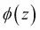，该函数采用某些输入值和相应的权重矢量的线性组合，其中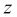是所谓的净输入（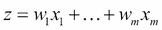）：


现在，如果特定样本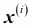的激活（即的输出）大于定义的阈值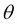，则我们将预测 1 类和-1 类，否则。 在感知器算法中，激活函数是简单的*单位阶跃函数*，有时也称为 *Heaviside 阶跃函数*：

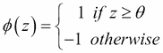

为简单起见，我们可以将阈值带到方程式的左侧，并将权重零定义为和，以便我们以更紧凑的形式写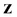 ]和。

### 注意

在以下各节中，我们将经常使用线性代数的基本符号。 例如，我们将使用*矢量点积*来缩写和中值的乘积之和，而上标 **T** 代表*转置*，该操作可将列向量转换为行向量，反之亦然：


例如：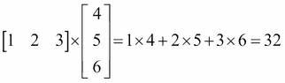。

此外，转置操作还可以应用于矩阵以在其对角线上反射它，例如：

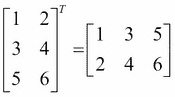

在本书中，我们将仅使用线性代数的基本概念。 但是，如果需要快速复习，请查看 Zico Kolter 出色的《线性代数复习和参考》，该书可从[免费获得，网址为：http：//www.cs.cmu.edu/~zkolter/course/linalg/ linalg_notes.pdf](http://www.cs.cmu.edu/~zkolter/course/linalg/linalg_notes.pdf) 。

下图说明了如何通过感知器的激活函数将净输入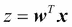压缩为二进制输出（-1 或 1）（左子图），以及如何将其用于区分两个线性可分离的类 （右图）：


MCP 神经元和 Rosenblatt 的*阈值*感知器模型背后的整个想法是使用还原论方法来模拟大脑中单个神经元的工作方式：*触发*或不触发。 因此，Rosenblatt 的初始感知器规则非常简单，可以通过以下步骤进行总结：

1.  将权重初始化为 0 或较小的随机数。
2.  对于每个训练样本执行以下步骤：

    1.  计算输出值。
    2.  更新权重。

这里，输出值是由我们前面定义的单位步长函数预测的类别标签，权重向量中每个权重的同时更新可以更正式地写为：


用于更新权重的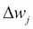值由感知器学习规则计算得出：

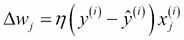

其中是学习率（介于 0.0 和 1.0 之间的常数），是第个训练样本的真实类别标签，而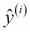是预测的类别标签。 重要的是要注意，权重向量中的所有权重都同时更新，这意味着在更新所有权重之前，我们不会重新计算。 具体来说，对于 2D 数据集，我们将编写以下更新：


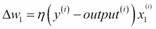

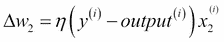

在用 Python 实现感知器规则之前，让我们进行一个简单的思想实验，以说明该学习规则实际上有多么简单。 在感知器正确预测类标签的两种情况下，权重保持不变：


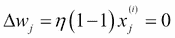

但是，在预测错误的情况下，将权重分别推向正目标类或负目标类的方向：


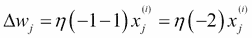

为了更好地了解乘法因子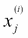，让我们来看另一个简单的示例，其中：

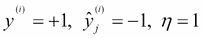

假设，我们将该样本错误分类为-1。 在这种情况下，我们将相应的权重增加 1，这样，下次遇到该样本时，激活会更强，因此更有可能超过单位阶跃函数对样本进行分类的阈值 +1：


权重更新与的值成比例。 例如，如果我们有另一个样本被错误地分类为-1，我们将更大程度地推动决策边界，以在下一次正确分类该样本：

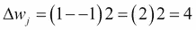

重要的是，请注意，只有当两类线性可分离并且学习速率足够小时，才能保证感知器的收敛。 如果两个类别不能由线性决策边界分开，我们可以设置训练数据集的最大通过次数（*历元*）和/或可容忍的错误分类数量的阈值-感知器 否则永远不会停止更新权重：

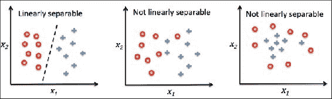

### 提示

**下载示例代码**

该课程所有四个部分的代码文件都可以在 [https://github.com/PacktPublishing/Data-Science-With-Python](https://github.com/PacktPublishing/Data-Science-With-Python) 上找到。

现在，在进入下一部分的实现之前，让我们在一个简单的图中总结一下我们刚刚学到的东西，该图说明了感知器的一般概念：


前面的图说明了感知器如何接收样本的输入并将其与权重组合以计算净输入。 然后，将净输入传递到激活函数（此处为单位阶跃函数），该函数生成二进制输出-1 或+1（样本的预测类别标签）。 在学习阶段，此输出用于计算预测误差并更新权重。

# 在 Python 中实现感知器学习算法

在的上一节中，我们了解了 Rosenblatt 的感知器规则如何工作； 现在让我们继续在 Python 中实现它，并将其应用于在[第 1 章](35.html "Chapter 1. Giving Computers the Ability to Learn from Data")和*中赋予计算机从数据中学习能力的虹膜数据集*。 我们将采用面向对象的方法将感知器接口定义为 Python `Class`，这使我们可以初始化可以通过`fit`方法从数据中学习的新感知器对象，并通过单独的`predict`方法进行预测 。 按照惯例，我们在对象初始化时未创建的属性上添加下划线，而是通过调用对象的其他方法（例如`self.w_`）来创建。

### 注意

如果您还不熟悉，但还不熟悉 Python 的科学库或需要复习，请参阅以下资源：

**NumPy** ： [http://wiki.scipy.org/Tentative_NumPy_Tutorial](http://wiki.scipy.org/Tentative_NumPy_Tutorial)

**熊猫**： [http://pandas.pydata.org/pandas-docs/stable/tutorials.html](http://pandas.pydata.org/pandas-docs/stable/tutorials.html)

**Matplotlib** ： [http://matplotlib.org/users/beginner.html](http://matplotlib.org/users/beginner.html)

另外，为了更好地和遵循代码示例，我建议您从 Packt 网站下载 IPython 笔记本。 有关 IPython 笔记本的一般介绍，请访问 [https://ipython.org/ipython-doc/3/notebook/index.html](https://ipython.org/ipython-doc/3/notebook/index.html) 。

```py
import numpy as np    
class Perceptron(object):
    """Perceptron classifier.

    Parameters
    ------------
    eta : float
        Learning rate (between 0.0 and 1.0)
    n_iter : int
        Passes over the training dataset.

    Attributes
    -----------
    w_ : 1d-array
        Weights after fitting.
    errors_ : list
        Number of misclassifications in every epoch.

    """
    def __init__(self, eta=0.01, n_iter=10):
        self.eta = eta
        self.n_iter = n_iter

    def fit(self, X, y):
        """Fit training data.

        Parameters
        ----------
        X : {array-like}, shape = [n_samples, n_features]
            Training vectors, where n_samples 
            is the number of samples and
            n_features is the number of features.
        y : array-like, shape = [n_samples]
            Target values.

        Returns
        -------
        self : object

        """
        self.w_ = np.zeros(1 + X.shape[1])
        self.errors_ = []

        for _ in range(self.n_iter):
            errors = 0
            for xi, target in zip(X, y):
                update = self.eta * (target - self.predict(xi))
                self.w_[1:] += update * xi
                self.w_[0] += update
                errors += int(update != 0.0)
            self.errors_.append(errors)
        return self

    def net_input(self, X):
        """Calculate net input"""
        return np.dot(X, self.w_[1:]) + self.w_[0]

    def predict(self, X):
        """Return class label after unit step"""
        return np.where(self.net_input(X) >= 0.0, 1, -1)
```

使用此感知器实现，我们现在可以以给定的学习率`eta`和`n_iter`来初始化新的`Perceptron`对象，该学习率是历元数（经过训练集）。 通过`fit`方法，我们将`self.w_`中的权重初始化为零向量，其中代表数据集中的维数（特征）数，其中我们为零权重添加 1（即 ， 门槛）。

### 注意

一维数组的 NumPy 索引与使用方括号（`[]`）表示法的 Python 列表相似。 对于二维数组，第一个索引器引用行号，第二个索引器引用列号。 例如，我们将使用`X[2, 3]`选择 2D 数组`X`的第三行和第四列。

权重初始化后，`fit`方法循环遍历训练集中的所有单个样本，并根据我们在上一节中讨论的感知器学习规则更新权重。 类别标签是通过`predict`方法预测的，在`fit`方法中也称为预测重量更新的类别标签，但在我们使用`predict`预测新数据的类别标签后， 拟合了我们的模型。 此外，我们还在列表`self.errors_`中的每个时期收集了错误分类的数量，以便稍后我们可以分析感知器在训练过程中的表现。 `net_input`方法中使用的`np.dot`函数仅计算向量点积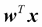。

### 注意

代替使用 NumPy 通过`a.dot(b)`或`np.dot(a, b)`计算两个数组 a 和 b 之间的向量点积，我们还可以通过`sum([i*j for i,j in zip(a, b)]`在纯 Python 中执行计算。 但是，与传统的 Python for 循环结构相比，使用 NumPy 的优势在于其算术运算是矢量化的。 **矢量化** 表示元素算术运算自动应用于数组中的所有元素。 通过将算术运算表示为数组上的指令序列，而不是一次对每个元素执行一组运算，我们可以更好地利用具有**单指令，多数据**的现代 CPU 体系结构 （ **SIMD** ）支持。 此外，NumPy 使用高度优化的线性代数库，例如**基本线性代数子程序**（ **BLAS** ）和**线性代数程序包**（ **LAPACK** ） 用 C 或 Fortran 编写的代码。 最后，NumPy 还允许我们使用线性代数的基础，例如矢量和矩阵点积，以更紧凑和直观的方式编写代码。

## 在虹膜数据集上训练感知器模型

为了测试我们的感知器实现，我们将从 Iris 数据集中加载两个花类 *Setosa* 和 *Versicolor* 。 尽管感知器规则不限于二维，但出于可视化目的，我们仅考虑两个特征*萼片长度*和*花瓣长度*。 同样，出于实际原因，我们只选择了两种花类 *Setosa* 和 *Versicolor* 。 但是，感知器算法可以扩展到多类分类，例如，通过*一对全*技术。

### 注意

**一对全**（ **OvA** ），或有时也称为**一对一静态**（ **OvR** ） 是用于将的二进制分类器扩展到多类问题的技术。 使用 OvA，我们可以为每个类别训练一个分类器，其中将特定类别视为阳性类别，而将所有其他类别的样本视为阴性类别。 如果要对新数据样本进行分类，则将使用分类器，其中是类别标签的数量，然后将具有最高置信度的类别标签分配给特定样本。 对于感知器，我们将使用 OvA 选择与最大绝对净输入值关联的类别标签。

首先，我们将使用*大熊猫*库将[IRIS 数据集]直接从 *UCI 机器学习存储库*加载到`DataFrame`对象中，并通过[ `tail`方法来检查数据是否正确加载：

```py
>>> import pandas as pd
>>> df = pd.read_csv('https://archive.ics.uci.edu/ml/'
...   'machine-learning-databases/iris/iris.data', header=None)
>>> df.tail()

```

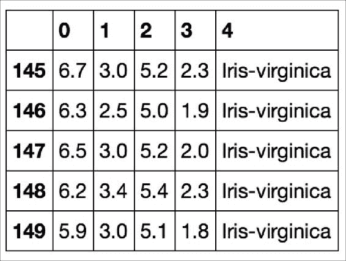

接下来，我们分别提取对应于 50 朵*鸢尾花*和 50 朵*鸢尾花*花的前 100 个类别标签，并将类别标签转换为两个整数类别标签[ 我们分配给向量`y`的 HTG0]（ *Versicolor* ）和`-1`（ *Setosa* ），其中熊猫`DataFrame`的值方法产生相应的 NumPy 表示形式。 同样，我们提取这 100 个训练样本的第一特征列（*萼片长度*）和第三特征列（*花瓣长度*），并将它们分配给特征矩阵`X`， 我们可以通过二维散点图进行可视化：

```py
>>> import matplotlib.pyplot as plt
>>> import numpy as np

>>> y = df.iloc[0:100, 4].values
>>> y = np.where(y == 'Iris-setosa', -1, 1)
>>> X = df.iloc[0:100, [0, 2]].values
>>> plt.scatter(X[:50, 0], X[:50, 1],
...             color='red', marker='o', label='setosa')
>>> plt.scatter(X[50:100, 0], X[50:100, 1],
...             color='blue', marker='x', label='versicolor')
>>> plt.xlabel('sepal length')
>>> plt.ylabel('petal length')
>>> plt.legend(loc='upper left')
>>> plt.show()

```

执行前面的代码示例之后，我们现在应该看到以下散点图：


现在是时候在刚刚提取的 Iris 数据子集上训练感知器算法了。 此外，我们将为每个时期绘制`misclassification error`，以检查算法是否收敛，并找到将两个鸢尾花类分开的决策边界：

```py
>>> ppn = Perceptron(eta=0.1, n_iter=10)
>>> ppn.fit(X, y)
>>> plt.plot(range(1, len(ppn.errors_) + 1), ppn.errors_, 
...         marker='o')
>>> plt.xlabel('Epochs')
>>> plt.ylabel('Number of misclassifications')
>>> plt.show()

```

执行完前面的代码后，我们应该看到错误分类错误与时期数的关系图，如下所示：

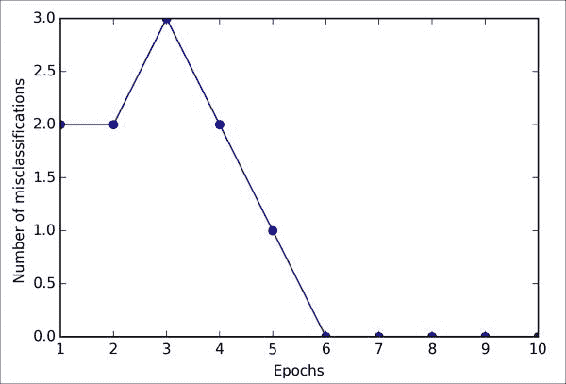

如上图所示，我们的感知器在第六个时期之后已经收敛，现在应该能够对训练样本进行完美分类。 让我们实现一个小的便利函数，以可视化 2D 数据集的决策边界：

```py
from matplotlib.colors import ListedColormap

def plot_decision_regions(X, y, classifier, resolution=0.02):

 # setup marker generator and color map
 markers = ('s', 'x', 'o', '^', 'v')
 colors = ('red', 'blue', 'lightgreen', 'gray', 'cyan')
 cmap = ListedColormap(colors[:len(np.unique(y))])

 # plot the decision surface
 x1_min, x1_max = X[:, 0].min() - 1, X[:, 0].max() + 1
 x2_min, x2_max = X[:, 1].min() - 1, X[:, 1].max() + 1
 xx1, xx2 = np.meshgrid(np.arange(x1_min, x1_max, resolution),
 np.arange(x2_min, x2_max, resolution))
 Z = classifier.predict(np.array([xx1.ravel(), xx2.ravel()]).T)
 Z = Z.reshape(xx1.shape)
 plt.contourf(xx1, xx2, Z, alpha=0.4, cmap=cmap)
 plt.xlim(xx1.min(), xx1.max())
 plt.ylim(xx2.min(), xx2.max())

 # plot class samples
 for idx, cl in enumerate(np.unique(y)):
 plt.scatter(x=X[y == cl, 0], y=X[y == cl, 1],
 alpha=0.8, c=cmap(idx),
 marker=markers[idx], label=cl)

```

首先，我们定义多个`colors`和`markers`，然后通过`ListedColormap`从颜色列表中创建一个颜色图。 然后，我们确定两个特征的最小值和最大值，并使用这些特征向量通过 NumPy `meshgrid`函数创建一对网格阵列`xx1`和`xx2`。 由于我们在两个特征维度上训练了感知器分类器，因此我们需要展平栅格阵列并创建一个矩阵，该矩阵具有与 Iris 训练子集相同的列数，以便我们可以使用`predict`方法来预测类标签[ `Z`的相应网格点。 在将预测的类别标签`Z`重塑为具有与`xx1`和`xx2`相同尺寸的网格后，我们现在可以通过 matplotlib 的`contourf`函数绘制等高线图，该函数将不同的决策区域映射到每种预测的不同颜色 网格数组中的类：

```py
>>> plot_decision_regions(X, y, classifier=ppn)
>>> plt.xlabel('sepal length [cm]')
>>> plt.ylabel('petal length [cm]')
>>> plt.legend(loc='upper left')
>>> plt.show()

```

执行完前面的代码示例后，我们现在应该看到决策区域的图，如下图所示：

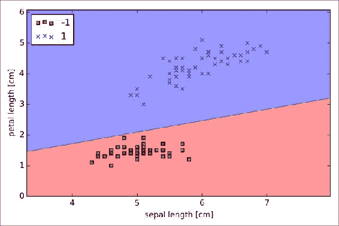

正如我们在中看到的那样，感知器学习了一个决策边界，该边界能够完美地对虹膜训练子集中的所有花朵样本进行分类。

### 注意

尽管感知器对两个鸢尾花类别进行了完美分类，但是收敛是感知器最大的问题之一。 弗兰克·罗森布拉特（Frank Rosenblatt）在数学上证明，如果可以通过线性超平面将这两类分开，则感知器学习规则会收敛。 但是，如果无法通过这样的线性决策边界将类完美地分开，则权重将永远不会停止更新，除非我们设置最大时期数。


# 自适应线性神经元与学习的收敛

在本节中，我们将看一下另一种类型的单层神经网络：**自适应线性神经网络**（ **Adaline** ）。 伯纳德·威德罗（Bernard Widrow）和他的博士生特德·霍夫（Tedd Hoff）在弗兰克·罗森布拉特（Frank Rosenblatt）的感知器算法发布仅几年后，就发布了 Adaline ，可以认为是对后者的改进（B. Widrow 等人，自适应*“ Adaline 使用化学“介导剂”的神经元*。编号技术报告 1553-2。StanfordElectron。Labs。Stanford，CA，1960 年 10 月）。 Adaline 算法特别有趣，因为它说明了定义和最小化成本函数的关键概念，这将为理解更高级的机器学习分类算法（例如逻辑回归和支持向量机以及我们所使用的回归模型）奠定基础 将在以后的章节中讨论。

Adaline 规则（也称为 *Widrow-Hoff 规则*）和 Rosenblatt 感知器之间的主要区别是权重是根据线性激活函数而不是像 感知器。 在 Adaline 中，此线性激活函数只是网络输入的身份函数，因此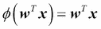。

使用线性激活函数来学习权重时，类似于我们之前看到的单位步长函数的*量化器*可以用于预测类别标签，如下所示 数字：

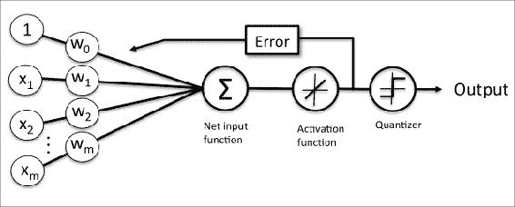

如果将上图与之前看到的感知器算法的图示进行比较，则不同之处在于我们知道使用线性激活函数的连续值输出来计算模型误差并更新权重，而不是二进制类 标签。

## 通过梯度下降最小化成本函数

监督机器学习算法的关键要素之一是定义一个*目标函数*，该目标函数将在学习过程中进行优化。 这个目标函数通常是我们要最小化的*成本函数*。 对于 Adaline，我们可以定义成本函数，以将权重定义为计算结果和真实类别标签之间的**平方误差总和**（ **SSE** ）。 。

为方便起见，仅添加了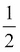一词； 如下面的段落所示，它将使推导梯度变得更加容易。 与单位步长函数相比，此连续线性激活函数的主要优点是成本函数变得可微。 此成本函数的另一个不错的特性是它是凸的。 因此，我们可以使用称为*梯度下降*的简单但功能强大的优化算法来找到权重，以最小化我们的成本函数来对 Iris 数据集中的样本进行分类。

如下图所示，我们可以将梯度下降的原理描述为*爬下山*直到达到局部或全局最低成本。 在每次迭代中，我们都从梯度上走了一步，其中步长由学习率的值以及梯度的斜率确定：

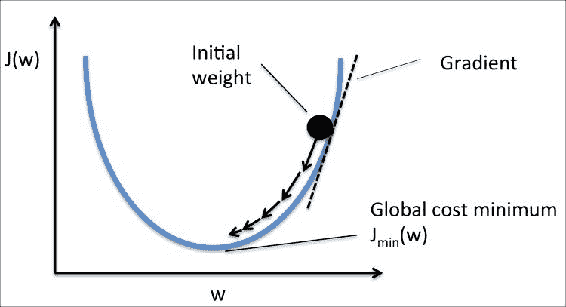

现在，通过使用梯度下降，我们可以通过远离成本函数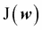的梯度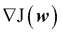来更新权重：

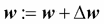

这里，权重变化定义为负梯度乘以学习率：


要计算成本函数的梯度，我们需要针对每个权重和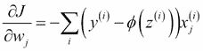计算成本函数的偏导数，以便将权重的更新写为。

由于我们同时更新所有权重，因此我们的 Adaline 学习规则变为。

### 注意

对于那些熟悉微积分的人，可以通过以下方法获得相对于 *j* th 权重的 SSE 成本函数的偏导数：


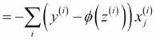

尽管 Adaline 学习规则看起来与感知器规则相同，但是 * = * 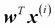的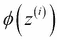是实数，而不是整数类标签。 此外，权重更新是基于训练集中的所有样本计算的（而不是在每个样本之后递增地更新权重），这就是为什么此方法也称为“批量”梯度下降的原因。

## 在 Python 中实现自适应线性神经元

由于的感知器规则和 Adaline 非常相似，因此我们将采用我们先前定义的感知器实现，并更改`fit`方法，以便通过梯度下降最小化成本函数来更新权重：

```py
class AdalineGD(object):
    """ADAptive LInear NEuron classifier.

    Parameters
    ------------
    eta : float
        Learning rate (between 0.0 and 1.0)
    n_iter : int
        Passes over the training dataset.

    Attributes
    -----------
    w_ : 1d-array
        Weights after fitting.
    errors_ : list
        Number of misclassifications in every epoch.

    """
    def __init__(self, eta=0.01, n_iter=50):
        self.eta = eta
        self.n_iter = n_iter

    def fit(self, X, y):
        """ Fit training data.

        Parameters
        ----------
        X : {array-like}, shape = [n_samples, n_features]
            Training vectors, 
            where n_samples is the number of samples and
            n_features is the number of features.
        y : array-like, shape = [n_samples]
            Target values.

        Returns
        -------
        self : object

        """
        self.w_ = np.zeros(1 + X.shape[1])
        self.cost_ = []

        for i in range(self.n_iter):
            output = self.net_input(X)
            errors = (y - output)
            self.w_[1:] += self.eta * X.T.dot(errors)
            self.w_[0] += self.eta * errors.sum()
            cost = (errors**2).sum() / 2.0
            self.cost_.append(cost)
        return self

    def net_input(self, X):
        """Calculate net input"""
        return np.dot(X, self.w_[1:]) + self.w_[0]

    def activation(self, X):
        """Compute linear activation"""
        return self.net_input(X)

    def predict(self, X):
        """Return class label after unit step"""
        return np.where(self.activation(X) >= 0.0, 1, -1)
```

而不是像在感知器中那样在评估每个单独的训练样本之后更新权重，我们基于整个训练数据集通过零重量的`self.eta * errors.sum()`和权重 1 至的`self.eta * X.T.dot(errors)`计算梯度。 `X.T.dot(errors)`是我们的特征矩阵与误差向量之间的*矩阵向量乘法*。 与先前的感知器实现类似，我们在列表`self.cost_`中收集成本值，以检查算法在训练后是否收敛。

### 注意

执行矩阵向量乘法类似于计算向量点积，其中矩阵中的每一行都被视为单行向量。 此矢量化方法表示更紧凑的符号，并使用 NumPy 进行更有效的计算。 例如：

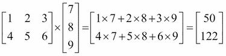

在实践中，通常需要进行一些实验才能找到良好的学习率，以实现最佳收敛。 因此，让我们选择两种不同的学习率和作为起点，并绘制成本函数与时期数的关系图，以了解 Adaline 实施从培训数据中学习得如何。

### 注意

学习率以及时期数`n_iter`是感知器和 Adaline 学习算法的所谓*超参数*。 在[第 4 章](04.html "Chapter 4. When Objects Are Alike")和*建立良好的训练集-数据预处理*中，我们将介绍不同的技术来自动查找产生分类模型最佳性能的不同超参数的值。

现在，让我们针对两种不同学习率的时间数绘制成本：

```py
>>> fig, ax = plt.subplots(nrows=1, ncols=2, figsize=(8, 4))
>>> ada1 = AdalineGD(n_iter=10, eta=0.01).fit(X, y)
>>> ax[0].plot(range(1, len(ada1.cost_) + 1),
...            np.log10(ada1.cost_), marker='o')
>>> ax[0].set_xlabel('Epochs')
>>> ax[0].set_ylabel('log(Sum-squared-error)')
>>> ax[0].set_title('Adaline - Learning rate 0.01')
>>> ada2 = AdalineGD(n_iter=10, eta=0.0001).fit(X, y)
>>> ax[1].plot(range(1, len(ada2.cost_) + 1),
...            ada2.cost_, marker='o')
>>> ax[1].set_xlabel('Epochs')
>>> ax[1].set_ylabel('Sum-squared-error')
>>> ax[1].set_title('Adaline - Learning rate 0.0001')
>>> plt.show()

```

正如我们在中看到的，接下来生成的成本函数图所示，我们遇到了两种不同类型的问题。 左图显示了如果我们选择一个太大的学习率会发生什么—而不是最小化成本函数，在每个时期误差都会变得更大，因为我们*超过了*全局最小值：

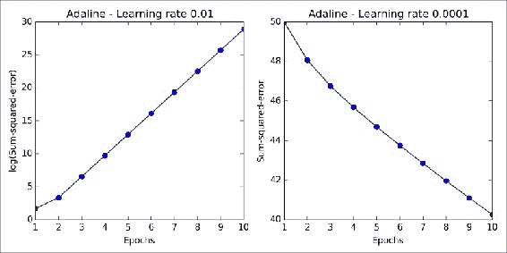

尽管我们看到正确的绘图可以看到成本降低了，但是所选的学习速率很小，以至于算法需要大量的时间才能收敛。 下图说明了如何更改特定权重参数的值以最小化成本函数（左子图）。 右侧的子图说明了如果我们选择的学习率太大而超出全局最小值，则会发生什么情况：

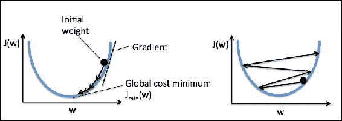

我们将在本书中遇到的许多机器学习算法都需要某种特征缩放以实现最佳性能，我们将在[第 3 章](37.html "Chapter 3. A Tour of Machine Learning Classifiers Using scikit-learn")和*机器学习分类器导论中对此进行详细讨论。 使用 Scikit 学习*。 梯度下降是受益于特征缩放的众多算法之一。 在这里，我们将使用称为*标准化*的特征缩放方法，该方法使我们的数据具有标准正态分布的属性。 每个特征的均值以 0 为中心，特征列的标准偏差为 1。例如，要标准化第个特征，我们只需要从每个训练样本中减去样本均值并除以 通过其标准偏差：

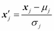

此处，是由所有训练样本的第个特征值组成的向量。

使用 NumPy 方法`mean`和`std`可以轻松实现标准化：

```py
>>> X_std = np.copy(X)
>>> X_std[:,0] = (X[:,0] - X[:,0].mean()) / X[:,0].std()
>>> X_std[:,1] = (X[:,1] - X[:,1].mean()) / X[:,1].std()

```

标准化之后，我们将再次训练 Adaline，并看到它现在以学习率收敛：

```py
>>> ada = AdalineGD(n_iter=15, eta=0.01)
>>> ada.fit(X_std, y)
>>> plot_decision_regions(X_std, y, classifier=ada)
>>> plt.title('Adaline - Gradient Descent')
>>> plt.xlabel('sepal length [standardized]')
>>> plt.ylabel('petal length [standardized]')
>>> plt.legend(loc='upper left')
>>> plt.show()
>>> plt.plot(range(1, len(ada.cost_) + 1), ada.cost_, marker='o')
>>> plt.xlabel('Epochs')
>>> plt.ylabel('Sum-squared-error')
>>> plt.show()

```

执行完前面的代码后，我们应该看到决策区域图以及下降成本图，如下图所示：

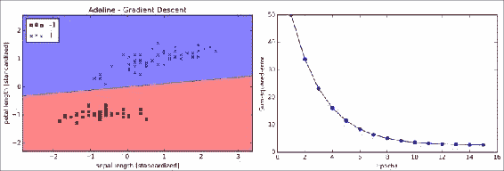

正如我们在前面的图中所看到的，Adaline 现在在使用学习率训练了标准化特征之后收敛。 但是，请注意，即使所有样本均已正确分类，SSE 仍为非零。

## 大规模机器学习和随机梯度下降

在上一节中，我们学习了如何通过从整个训练集中计算出的梯度的相反方向上走一步来最小化成本函数。 这就是为什么这种方法有时也称为*批次*梯度下降的原因。 现在想象一下，我们有一个非常庞大的数据集，其中包含数百万个数据点，这在许多机器学习应用程序中并不罕见。 在这种情况下，运行批次梯度下降在计算上可能会非常昂贵，因为每次我们向全局最小值迈出一步时，我们都需要重新评估整个训练数据集。

批量梯度下降算法的一种流行替代方法是*随机梯度下降*，有时也称为*迭代*或*在线*梯度下降。 代替基于所有样本的累积误差之和来更新权重：


我们为每个训练样本逐步更新权重：


尽管可以将随机梯度下降视为梯度下降的近似值，但由于更频繁的权重更新，它通常更快地达到收敛。 由于每个梯度是基于单个训练示例计算的，因此误差表面的噪声比梯度下降的噪声大，这还具有以下优点：随机梯度下降可以更容易地逃脱浅层局部最小值。 为了通过随机梯度下降获得准确的结果，将数据随机显示是很重要的，这就是为什么我们要为每个时期改组训练集以防止周期。

### 注意

在随机梯度下降实现中，固定学习率通常由随时间降低的自适应学习率代替，例如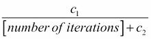，其中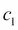和是常数。 请注意，随机梯度下降未达到全局最小值，而是一个非常接近全局最小值的区域。 通过使用自适应学习率，我们可以进一步退火到更好的全局最小值

随机梯度下降的另一个优点是我们可以将其用于*在线学习*。 在在线学习中，随着新训练数据的到来，我们的模型将得到即时训练。 如果我们要积累大量数据（例如，典型 Web 应用程序中的客户数据），这将特别有用。 如果存在存储空间问题，则通过在线学习，系统可以立即适应变化，并且在更新模型后可以丢弃训练数据。

### 注意

批量梯度下降与随机梯度下降之间的折衷是所谓的*微型批量学习*。 迷你批量学习可以理解为将批量梯度下降应用于训练数据的较小子集，例如一次 50 个样本。 相对于批次梯度下降的优势在于，由于更频繁的重量更新，通过小批量可以更快地达到收敛。 此外，小批量学习允许我们通过向量化运算来替换**随机梯度下降**（ **SGD** ）中训练样本的 for 循环，这可以进一步提高我们的计算效率 学习算法。

由于我们已经使用梯度下降实现了 Adaline 学习规则，因此我们仅需进行一些调整即可修改学习算法，以通过随机梯度下降来更新权重。 在`fit`方法中，我们现在将在每个训练样本之后更新权重。 此外，我们将实现在线学习的附加`partial_fit`方法，该方法不会重新初始化权重。 为了检查训练后算法是否收敛，我们将成本计算为每个时期训练样本的平均成本。 此外，我们将在每个时期之前向`shuffle`训练数据添加一个选项，以避免在优化成本函数时出现周期； 通过`random_state`参数，我们可以指定随机种子的一致性：

```py
from numpy.random import seed

class AdalineSGD(object):
    """ADAptive LInear NEuron classifier.

    Parameters
    ------------
    eta : float
        Learning rate (between 0.0 and 1.0)
    n_iter : int
        Passes over the training dataset.

    Attributes
    -----------
    w_ : 1d-array
        Weights after fitting.
    errors_ : list
        Number of misclassifications in every epoch.
    shuffle : bool (default: True)
        Shuffles training data every epoch 
        if True to prevent cycles.
    random_state : int (default: None)
        Set random state for shuffling 
        and initializing the weights.

    """
    def __init__(self, eta=0.01, n_iter=10, 
               shuffle=True, random_state=None):
        self.eta = eta
        self.n_iter = n_iter
        self.w_initialized = False
        self.shuffle = shuffle
        if random_state:
            seed(random_state)

    def fit(self, X, y):
        """ Fit training data.

        Parameters
        ----------
        X : {array-like}, shape = [n_samples, n_features]
            Training vectors, where n_samples 
            is the number of samples and
            n_features is the number of features.
        y : array-like, shape = [n_samples]
            Target values.

        Returns
        -------
        self : object

         """
        self._initialize_weights(X.shape[1])
        self.cost_ = []
        for i in range(self.n_iter):
            if self.shuffle:
                X, y = self._shuffle(X, y)
            cost = []
            for xi, target in zip(X, y):
                cost.append(self._update_weights(xi, target))
            avg_cost = sum(cost)/len(y)
            self.cost_.append(avg_cost)
        return self

    def partial_fit(self, X, y):
        """Fit training data without reinitializing the weights"""
        if not self.w_initialized:
            self._initialize_weights(X.shape[1])
        if y.ravel().shape[0] > 1:
            for xi, target in zip(X, y):
                self._update_weights(xi, target)
        else:
            self._update_weights(X, y)
        return self

    def _shuffle(self, X, y):
        """Shuffle training data"""
        r = np.random.permutation(len(y))
        return X[r], y[r]

    def _initialize_weights(self, m):
        """Initialize weights to zeros"""
        self.w_ = np.zeros(1 + m)
        self.w_initialized = True

    def _update_weights(self, xi, target):
        """Apply Adaline learning rule to update the weights"""
        output = self.net_input(xi)
        error = (target - output)
        self.w_[1:] += self.eta * xi.dot(error)
        self.w_[0] += self.eta * error
        cost = 0.5 * error**2
        return cost

    def net_input(self, X):
        """Calculate net input"""
        return np.dot(X, self.w_[1:]) + self.w_[0]

    def activation(self, X):
        """Compute linear activation"""
        return self.net_input(X)

    def predict(self, X):
        """Return class label after unit step"""
        return np.where(self.activation(X) >= 0.0, 1, -1)
```

我们现在在`AdalineSGD`分类器中使用的`_shuffle`方法的工作方式如下：通过`numpy.random`中的`permutation`函数，我们生成一个随机数的唯一数字，范围为 0 至 100.这些数字然后可以用作索引，以改组我们的特征矩阵和类标签向量。

然后，我们可以使用 fit 方法来训练`AdalineSGD`分类器，并使用我们的`plot_decision_regions`绘制训练结果：

```py
>>> ada = AdalineSGD(n_iter=15, eta=0.01, random_state=1)
>>> ada.fit(X_std, y)
>>> plot_decision_regions(X_std, y, classifier=ada)
>>> plt.title('Adaline - Stochastic Gradient Descent')
>>> plt.xlabel('sepal length [standardized]')
>>> plt.ylabel('petal length [standardized]')
>>> plt.legend(loc='upper left')
>>> plt.show()
>>> plt.plot(range(1, len(ada.cost_) + 1), ada.cost_, marker='o')
>>> plt.xlabel('Epochs')
>>> plt.ylabel('Average Cost')
>>> plt.show()
```

下图显示了我们通过执行前面的代码示例获得的的两个图：


如我们所见，的平均成本下降得很快，而且 15 个纪元后的最终决策边界看起来与 Adaline 的批次梯度下降相似。 如果要更新模型（例如，在具有流数据的在线学习场景中），我们可以简单地对单个样本（例如`ada.partial_fit(X_std[0, :], y[0])`）调用`partial_fit`方法。


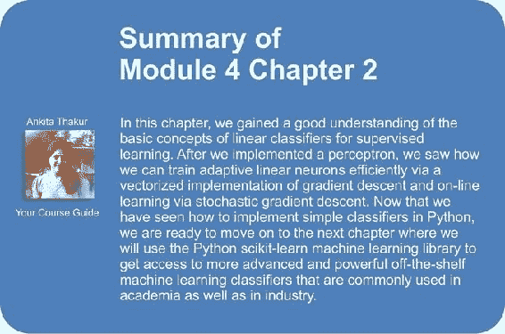

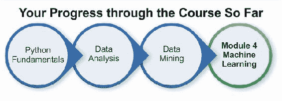