# 一、入门

由于将有与此书相关联的代码以及您需要获取的样本数据，所以让我首先向您展示如何获取该代码，然后我们将继续。 我们需要先进行一些设置。 首先，让我们获取本书所需的代码和数据，以便您可以随意学习并实际使用一些代码。 最简单的方法是转到“入门”。

在本章中，我们将首先在可运行的 Python 环境中安装并做好准备：

*   安装 Enthought Canopy
*   安装 Python 库
*   如何使用 IPython/Jupyter 笔记本
*   如何使用，阅读和运行本书的代码文件
*   然后，我们将深入研究速成课程，以了解 Python 代码：
*   Python 基础-第 1 部分
*   了解 Python 代码
*   导入模块
*   试验列表
*   元组
*   Python 基础-第 2 部分
*   运行 Python 脚本

一旦我们在本章中建立了环境并熟悉 Python，您将拥有使用 Python 进入数据科学的惊人旅程所需的一切。

# 安装 Enthought Canopy

让我们深入研究并获取安装所需的内容，以便在您的桌面上使用数据科学实际开发 Python 代码。 我将指导您安装名为 Enthought Canopy 的包，该包同时包含开发环境和您需要预安装的所有 Python 包。 它使生活变得非常轻松，但是，如果您已经了解 Python，那么您的 PC 上可能已经有一个现有的 Python 环境，并且如果您想继续使用它，也许可以。

最重要的是，您的 Python 环境具有 Python 3.5 或更高版本，它支持 Jupyter 笔记本（因为这是我们将在本课程中使用的语言），并且您已在本书中安装了所需的关键包。 环境。 我将通过几个简单的步骤来确切说明如何实现完整安装-这将非常容易。

让我们首先概述那些关键包，其中大部分 Canopy 都会自动为我们安装。 Canopy 将为我们安装 Python 3.5，以及我们需要的其他一些包，包括：`scikit_learn`，`xlrd`和`statsmodels`。 我们需要手动使用`pip`命令来安装名为`pydot2plus`的包。 就是这样-Canopy 非常容易！

完成以下安装步骤后，我们将具备启动和运行所需的一切，因此，我们将打开一个小示例文件并进行一些实际的数据科学处理。 现在，让您开始快速入门所需的一切：

1.  您需要做的第一件事是开发环境，称为 IDE，用于 Python 代码。 我们将在本书中使用的是 Enthought Canopy。 这是一个科学的计算环境，可以很好地与这本书一起使用：


2.  要安装 Canopy，只需转到[这个页面](http://www.enthought.com)，然后单击下载：Canopy：


3.  对于 Canopy Express 版，Enthought Canopy 是免费的-这是您想要的本书。 然后，您必须选择操作系统和架构。 对我来说，这是 Windows 64 位，但您需要单击适用于您的操作系统并带有 Python 3.5 选项的相应“下载”按钮：


4.  在此步骤中，我们不必向他们提供任何个人信息。 有一个非常标准的 Windows 安装程序，因此只需下载即可：


5.  下载完成后，我们继续打开 Canopy 安装程序，然后运行它！ 您可能需要先阅读许可证，然后再由您自己决定，然后等待安装完成。
6.  在安装过程结束时，单击“完成”按钮后，让其自动启动 Canopy。 您会看到 Canopy 然后自己建立了 Python 环境，这很棒，但这需要一两分钟。
7.  安装程序完成设置 Python 环境后，您应该会看到类似下面的屏幕。 它说欢迎来到 Canopy 和一堆友好的大按钮：


8.  美丽的是，您本书所需的几乎所有东西都预装了 Enthought Canopy，这就是为什么我建议使用它的原因！
9.  我们只需要设置最后一件事，因此继续并单击 Canopy Welcome 屏幕上的“编辑器”按钮。 然后，您会看到出现“编辑器”屏幕，如果您在底部的窗口中单击，我希望您输入：

```py
!pip install pydotplus 

```

10.  这是在 Canopy Editor 窗口底部键入上面的行时在屏幕上显示的样子； 当然不要忘记按 Return 键：


11.  按下“返回”按钮后，将安装一个额外的模块，在我们稍后讨论决策树和呈现决策树时，我们将在本书的稍后部分中使用该模块。
12.  一旦完成`pydotplus`的安装，它应该会回来并说它已成功安装，瞧，您现在就拥有开始所需的一切！ 至此，安装已完成-但让我们再采取一些步骤，以确认我们的安装运行良好。

# 进行安装测试

1.  现在，让您的安装进行测试运行。 首先要做的是实际上完全关闭 Canopy 窗口！ 这是因为我们实际上不会在此 Canopy 编辑器中进行编辑和使用代码。 取而代之的是，我们将使用称为 IPython 笔记本的东西，现在也称为 Jupyter 笔记本。
2.  让我告诉你它是如何工作的。 如果您现在在操作系统中打开一个窗口，以查看下载的随附书文件，如本书序言中所述。 您应该为本书下载的`.ipynb`代码文件集看起来像这样：

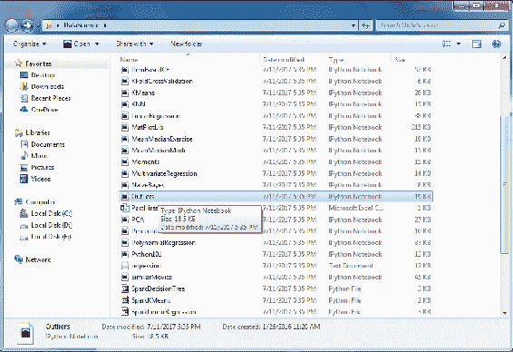

现在，转到列表中的 Outliers 文件，即`Outliers.ipynb`文件，双击它，应该发生的事情是，它将首先启动 Canopy，然后启动您的 Web 浏览器！ 这是因为 IPython/Jupyter 笔记本实际上位于您的 Web 浏览器中。 一开始可能会有一点停顿，并且第一次可能会有些混乱，但是您很快就会习惯这个想法。

您很快就会看到 Canopy，对于我来说，我的默认网络浏览器是 Chrome。 由于我们双击`Outliers.ipynb`文件，您应该看到以下 Jupyter 笔记本页面：

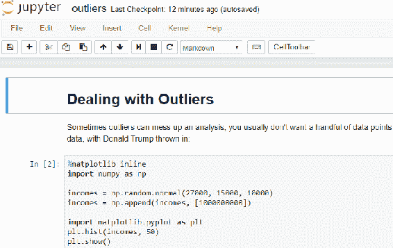

如果您看到此屏幕，则表示安装过程中一切正常，并且已准备好完成本书其余部分的旅程！

# 如果您偶尔遇到打开 IPNYB 文件的问题

偶尔，我注意到双击`.ipynb`文件时可能会出错。 不要惊慌！ 有时，Canopy 可能会有点片状，您可能会看到一个屏幕在寻找某些密码或令牌，或者您偶尔会看到一个屏幕，表明它根本无法连接。

如果这两种情况中的任何一种发生在您身上，请不要惊慌，它们只是随机的怪癖，有时事情只是无法按正确的顺序启动，或者它们无法在您的 PC 上及时启动。 没关系。

您所要做的就是返回并再次尝试打开该文件。 有时需要两到三次尝试才能真正正确地加载它，但是如果您多次尝试，它最终会弹出，那么就像我们之前看到的处理异常值的 Jupyter 笔记本屏幕一样，您应该这样做。

# 使用和理解 IPython（Jupyter）笔记本

恭喜您安装成功！ 现在让我们使用 Jupyter 笔记本（也称为 IPython Notebook）进行探索。 如今，更现代的名称是 Jupyter 笔记本，但是很多人仍将其称为 IPython 笔记本，因此，我认为这些名称对于工作中的开发人员而言可以互换。 我也确实找到了名称“IPython 笔记本”，它可以帮助我记住笔记本文件的文件名后缀，即`.ipynb`，因为您在本书中会对此非常了解！

好的，现在让我们再次从上而下-我们对 IPython/Jupyter 笔记本的首次探索。 如果您尚未这样做，请导航到`DataScience`文件夹，我们在其中下载了本书的所有材料。 对我来说，这是`E:DataScience`，如果您在前面的安装部分中没有这样做，请双击并打开`Outliers.ipynb`文件。

现在，当我们双击此 IPython `.ipynb`文件时，将首先触发 Canopy，如果尚未触发，则将其触发。 启动网络浏览器。 这是完整的`Outliers`笔记本电脑网页在浏览器中的显示方式：

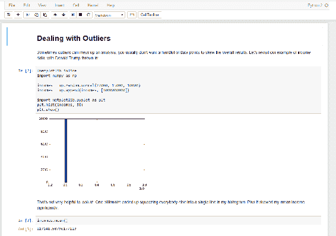

正如您在此处看到的那样，笔记本的结构方式使我可以在实际代码本身中散布有关您在此处看到的内容的注释和提示，并且可以在 Web 浏览器中实际运行此代码！ 因此，对于我来说，这是一种非常方便的格式，可以为您提供一些参考，您可以在以后的生活中使用它来提醒自己，我们将要讨论这些算法的工作原理，并实际对其进行实验和自己玩转它们。

IPython/Jupyter 笔记本文件的工作方式是，它们实际上是从您的浏览器内部运行的，就像网页一样，但是它们受到您安装的 Python 引擎的支持。 因此，您应该看到的屏幕类似于上一个屏幕快照中显示的屏幕。

在浏览器中向下滚动笔记本时，您会注意到有代码块。 它们很容易发现，因为它们包含我们的实际代码。 请在离群值笔记本中的顶部附近找到此代码的代码框：

```py
%matplotlib inline 
import numpy as np 

incomes = np.random.normal(27000, 15000, 10000) 
incomes = np.append(incomes, [1000000000]) 

import matplotlib.pyplot as plt 
plt.hist(incomes, 50) 
plt.show() 

```

在这里，让我们快速看一下这段代码。 我们正在此代码中设置一些收入分配。 我们正在模拟人群中的收入分配，并且为了说明离群值可能对该分布产生的影响，我们正在模拟唐纳德·特朗普进入混合状态并弄乱收入分配的均值。 顺便说一句，我不是在发表政治声明，这一切都是在特朗普成为政治家之前完成的。 所以您知道，在那里完全公开。

我们可以通过单击笔记本中的任何代码块来选择它。 因此，如果现在单击包含上面刚刚查看的代码的代码块，则可以单击顶部的运行按钮来运行它。 在屏幕顶部的此处是您会找到“运行”按钮的区域：


在选择了代码块的情况下点击“运行”按钮，将导致重新生成该图：

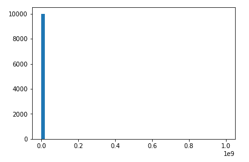

同样，我们可以在更下方单击下一个代码块，您将发现具有以下单行代码的代码块：

```py
incomes.mean() 

```

如果选择包含此行的代码块，然后单击“运行”按钮以运行代码，您将在其下方看到输出，由于该异常值的影响，该输出最终是一个非常大的值，如下所示：

```py
127148.50796177129

```

让我们继续前进，找点乐子。 在下一个代码块中，您将看到以下代码，该代码试图检测唐纳德·特朗普之类的离群值并将其从数据集中删除：

```py
def reject_outliers(data): 
    u = np.median(data) 
    s = np.std(data) 
    filtered = [e for e in data if (u - 2 * s < e < u + 2 * s)] 
    return filtered 

filtered = reject_outliers(incomes) 
plt.hist(filtered, 50) 
plt.show() 

```

因此，在笔记本中选择相应的代码块，然后再次按运行按钮。 执行此操作时，您将看到以下图形：

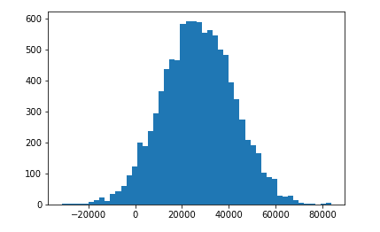

现在，我们看到了一个更好的直方图，代表了更典型的美国人-既然我们已经排除了使事情变得混乱的异常值。

因此，在这一点上，您已经具备了开始本课程所需的一切。 我们拥有您需要的所有数据，所有脚本以及 Python 和 Python 笔记本的开发环境。 所以，让我们摇滚。 接下来，我们将对 Python 本身进行一些速成课程，即使您熟悉 Python，它也可能是一个不错的小知识，因此您可能无论如何都要看它。 让我们深入学习 Python。

# Python 基础-第 1 部分

如果您已经了解 Python，则可以跳过以下两节。 但是，如果您需要复习，或者以前从未使用过 Python，则需要进行这些学习。 关于 Python 脚本语言，您需要了解一些古怪的知识，因此让我们深入研究，直接进入池中，通过编写一些实际代码来学习一些 Python。

就像我之前说过的那样，在本书的要求中，您应该具有某种编程背景才能在本书中取得成功。 您已经使用某种语言进行了编码，即使它是脚本语言，JavaScript，我也不在乎它是 C++，Java 还是其他东西，但是如果您是 Python 的新手，这里我会给您一些速成课程。 我将继续深入探讨本节中的一些示例。

关于 Python 的一些怪癖与您可能已经看到的其他语言有些不同； 因此，我只想了解 Python 与您可能使用过的其他脚本语言的不同之处，而做到这一点的最佳方法是查看一些真实的示例。 让我们深入研究一些 Python 代码：


如果打开该类的`DataScience`文件夹（已在上一节的前面部分中下载），则应该找到`Python101.ipynb`文件； 继续并双击它。 如果您正确安装了所有组件，它应该会在 Canopy 中打开，并且看起来应该类似于以下屏幕截图：


新版本的 Canopy 将在您的 Web 浏览器中打开代码，而不是在 Canopy 编辑器中打开代码！ 没关系！

关于 Python 的一件很酷的事情是，有几种方法可以使用 Python 运行代码。 您可以像使用普通编程语言一样将其作为脚本运行。 您还可以编写称为 *IPython 笔记本*的东西，这就是我们在这里使用的东西。 因此，在这种格式下，您实际上具有类似于 Web 浏览器的视图，在其中实际上可以在 HTML 标记内容中为自己写一些符号和注释，还可以嵌入实际使用 Python 解释器运行的实际代码。

# 了解 Python 代码

我想为您提供一些 Python 代码的第一个示例就在这里。 以下代码块代表了一些实际的 Python 代码，我们实际上可以在整个笔记本页面的该视图中直接运行这些代码，但让我们现在放大并查看该代码：


让我们看看发生了什么。 我们有一个数字列表和一个 Python 列表，有点像其他语言的数组。 由以下方括号指定：


我们具有一个包含数字 1 到 6 的列表的数据结构，然后要遍历该列表中的每个数字，我们将说`for number in listOfNumbers:`，这是用于遍历一列东西和一个冒号的 Python 语法。

制表符和空格在 Python 中具有真正的含义，因此您不能只是按照自己的方式设置格式。 您必须注意它们。

我想说明的是，在其他语言中，通常会有某种形式的方括号或大括号表示我在`for`循环，`if`块或某种内部代码块，但在 Python 中，所有这些都用空格指定。 `Tab`对于告诉 Python 哪个代码块实际上很重要：

```py
for number in listOfNumbers: 
    print number, 
    if (number % 2 == 0): 
        print ("is even")
    else: 
        print ("is odd") 

print ("Hooray! We're all done.")

```

您会注意到，在此`for`块中，在整个块中有一个制表符，并且对于每个`number in listOfNumbers`，我们将执行由一个*制表符*停止符制表的所有代码。 我们将打印该数字，并且逗号仅表示我们此后将不执行新行。 我们将紧随其后打印其他内容，然后将其称为`even`。 否则，我们将其称为`odd`，完成后，我们将打印出`All done`：


您可以在代码下方看到输出。 我之前已经运行过输出，因为我实际上已经将其保存在笔记本中，但是如果您想自己实际运行它，则可以在该块中单击并单击“播放”按钮，然后我们将实际执行并再次执行 。 只是为了使自己确信它确实在做某件事，让我们将`print`语句更改为其他内容，例如`Hooray! We're all done. Let's party!`。如果我现在运行此命令，可以肯定地看到那里的消息已更改：

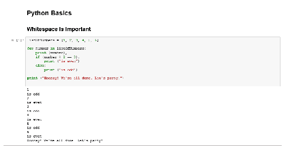

同样，我想说的是空格很重要。 您将使用缩进或制表符指定一起运行的代码块，例如`for`循环或`if then`语句，因此请记住这一点。 另外，也要注意结肠。 您会注意到，其中许多子句以冒号开头。

# 导入模块

像任何语言一样，Python 本身在功能上也相当有限。 使用 Python 进行机器学习，数据挖掘和数据科学的真正力量是可用于此目的的所有外部库的力量。 这些库之一称为`NumPy`或数字 Python，例如，在这里我们可以`import` `Numpy`包，该包作为`np`包含在 Canopy 中。

这意味着我将`NumPy`包称为`np`，我可以将其命名为任何内容。 我可以称其为`Fred`或`Tim`，但最好坚持使用确实有意义的东西。 现在，我正在调用`NumPy`包`np`，我可以使用`np`来引用它：

```py
import numpy as np

```

在此示例中，我将调用`NumPy`包的一部分提供的`random`函数，并调用其正态函数使用这些参数实际生成随机数的正态分布并打印出来。 由于它是随机的，因此每次我应该得到不同的结果：

```py
import numpy as np
A = np.random.normal(25.0, 5.0, 10)
print (A)

```

输出应如下所示：

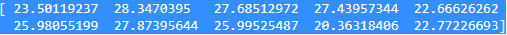

果然，我得到了不同的结果。 太酷了。

# 数据结构

让我们继续进行数据结构。 如果您需要暂停一下，让事物沉入一点，或者您想多玩一点，那就随便吧。 学习这些东西的最好方法是潜入并进行实际试验，因此，我绝对鼓励这样做，这就是为什么我为您提供 IPython/Jupyter 笔记本的原因，因此您实际上可以走进去，弄乱代码，做不同的事情。

例如，这里我们有一个围绕`25.0`的分布，但是让我们围绕它`55.0`：

```py
import numpy as np
A = np.random.normal(55.0, 5.0, 10)
print (A)

```

嘿，我所有的数字都改变了，现在已经接近 55，那又如何呢？


好了，让我们在这里稍微谈谈数据结构。 正如我们在第一个示例中看到的那样，您可以有一个列表，其语法如下所示。

# 尝试列表

```py
x = [1, 2, 3, 4, 5, 6]
print (len(x))

```

您可以说，例如，调用列表`x`并将其分配给数字`1`至`6`，这些方括号表示我们正在使用 Python 列表，而这些是不可变对象，我可以根据需要实际添加和重新安排内容。 有一个用于确定列表长度的内置函数，称为`len`，如果我键入`len(x)`，那我会得到数字`6`，因为列表中有 6 个数字。

只是要确保，然后再次理解这实际上是在这里运行真实代码，让我们在其中添加另一个数字，例如`4545`。 如果运行此命令，则会得到`7`，因为该列表中现在有 7 个数字：

```py
x = [1, 2, 3, 4, 5, 6, 4545]
print (len(x))

```

前面的代码示例的输出如下：

```py
7

```

回到那里的原始示例。 现在，您还可以切片列表。 如果要获取列表的子集，可以使用一种非常简单的语法：

```py
x[3:]

```

上面的代码示例的输出如下：

```py
[1, 2, 3]

```

# 冒号之前

例如，如果要获取列表的前三个元素（元素编号 3 之前的所有内容），我们可以说`:3`以获取前三个元素`1`，`2`和`3`，以及如果您考虑一下发生了什么，就象大多数语言一样，就索引而言，我们从 0 开始计数。因此元素 0 为`1`，元素 1 为`2`，元素 2 为`3`。 既然我们说我们要在元素 3 之前拥有所有东西，那就是我们得到的。

因此，请记住，永远不要忘记，在大多数语言中，您是从 0 开始而不是从 1 开始计数。

现在，这可能会使事情变得混乱，但是在这种情况下，确实是直观的。 您可以认为冒号意味着我想要一切，我想要前三个特征，并且我可以再次将其更改为四个，以表明我们实际上在这里做点真正的事情：

```py
x[:4]

```

上面的代码示例的输出如下：

```py
[1, 2, 3, 4]

```

# 冒号之后

现在，如果将冒号放在`3`的另一侧，则表示我想要`3`之后的所有内容，因此`3`之后也需要。 如果我说`x[3:]`，那是第三个元素，即 0、1、2、3 及其后的所有内容。 在该示例中，这将返回 4、5 和 6，好吗？

```py
x[3:]

```

输出如下：

```py
[4, 5, 6]

```

您可能想要保留此 IPython/Jupyter 笔记本文件。 这是一个很好的参考，因为有时切片操作符是否包含该元素，或者是否包含或不包含该元素，可能会造成混淆。 因此，最好的方法是在这里玩转并提醒自己。

# 负值语法

您可以做的另一件事是使用以下负值语法：

```py
x[-2:]

```

输出如下：

```py
[5, 6]

```

通过说`x[-2:]`，这意味着我想要列表中的最后两个元素。 这意味着从末尾倒数两个，这将给我`5`和`6`，因为那是我列表中的最后两件事。

# 将列表添加到列表

您也可以更改列表。 假设我要向列表添加一个列表。 我可以使用`extend`函数，如以下代码块所示：

```py
x.extend([7,8])
x

```

上面代码的输出如下：

```py
[1, 2, 3, 4, 5, 6, 7, 8]

```

我有`1`，`2`，`3`，`4`，`5`和`6`清单。 如果要扩展它，可以说我在这里有一个新列表`[7, 8]`，该括号表示这是它本身的新列表。 您可能知道，这可能是一个隐式列表，该列表在此内联，也可以由另一个变量引用。 您可以看到，一旦执行此操作，我得到的新列表实际上将`7`和`8`列表附加在其末尾。 因此，通过用另一个列表扩展该列表，我有了一个新列表。

# `append`函数

如果您只想在该列表中添加其他内容，则可以使用`append`函数。 所以我只想在末尾贴上数字`9`，我们就可以了：

```py
x.append(9)
x

```

上面代码的输出如下：

```py
[1, 2, 3, 4, 5, 6, 7, 8, 9]

```

# 复杂的数据结构

您还可以使用带有列表的复杂数据结构。 因此，您不必仅在其中输入数字。 您实际上可以在其中放入字符串。 您可以在其中输入数字。 您可以在其中放入其他列表。 没关系 Python 是一种弱类型的语言，因此您几乎可以将所需的任何类型的数据放在任何地方，通常这样做是可以的：

```py
y = [10, 11, 12]
listOfLists = [x, y]
listOfLists

```

在前面的示例中，我有第二个列表，其中包含`10`，`11`和`12`，这些列表我称为`y`。 我将创建一个包含两个列表的新列表。 那真是令人震惊吗？ 我们的`listofLists`列表将包含`x`列表和`y`列表，这是完全正确的事情。 您可以在此处看到我们有一个括号，指示`listofLists`列表，在其中，我们还有另一组括号，指示该列表中的每个单独的列表：

```py
[[ 1, 2, 3, 4, 5, 6, 7, 8, 9 ], [10, 11, 12]]

```

因此，有时诸如此类的事情会派上用场。

# 提领单个元素

如果要提领列表的单个元素，可以使用如下方括号：

```py
y[1]

```

上面代码的输出如下：

```py
11

```

因此`y[1]`将返回元素`1`。 请记住，`y`中包含`10`，`11`和`12`-请观察前面的示例，我们从 0 开始计数，因此元素 1 实际上将是列表中的第二个元素，在这种情况下即数字`11`，好吗？

# 排序函数

最后，让我们拥有一个可以使用的内置排序函数：

```py
z = [3, 2, 1]
z.sort()
z

```

因此，如果我从列表`z`（即`3,` `2`和`1`）开始，则可以在该列表上调用 sort，现在`z`将按顺序进行排序。 上面代码的输出如下：

```py
[1, 2, 3]

```

# 反向排序

```py
z.sort(reverse=True)
z

```

上面代码的输出如下：

```py
[3, 2, 1]

```

如果需要进行反向排序，则可以只说`reverse=True`作为属性，作为`sort`函数中的参数，然后将其放回`3`，`2`和`1`。

如果您需要一点点沉浸，请随时返回并阅读更多内容。

# 元组

元组就像列表一样，只是它们是不可变的，因此您实际上无法对其进行扩展，追加或排序。 它们就是它们，它们的行为类似于列表，除了您无法更改它们之外，并且您指出它们是不可变的并且是元组，而不是列表，使用括号而不是方括号。 因此，您可以看到它们的工作方式几乎相同：

```py
#Tuples are just immutable lists. Use () instead of []
x = (1, 2, 3)
len(x)

```

先前代码的输出如下：

```py
3

```

我们可以说`x= (1, 2, 3)`。 我仍然可以使用`length - len`来表示该元组中包含三个元素，即使您不熟悉`tuple`术语，`tuple`实际上也可以包含任意数量的元素 。 即使听起来像是拉丁文中的数字三，也不代表您有三样东西。 通常，它只有两件事。 实际上，它们可以有任意多个。

# 提领元素

我们还可以提领一个元组的元素，因此元素编号 2 再次成为第三个元素，因为我们从 0 开始计数，这将在以下屏幕快照中返回数字`6`：

```py
y = (4, 5, 6)
y[2]

```

上面代码的输出如下：

```py
6

```

# 元组列表

我们也可以像使用列表一样使用元组作为列表的元素。

```py
listOfTuples = [x, y]
listOfTuples

```

上面代码的输出如下：

```py
[(1, 2, 3), (4, 5, 6)]

```

我们可以创建一个包含两个元组的新列表。 因此，在前面的示例中，我们有`(1, 2, 3)`的`x`元组和`(4, 5, 6)`的`y`元组； 然后我们列出这两个元组的列表，然后返回此结构，其中我们用方括号表示一个列表，该列表包含用括号表示的两个元组。在进行数据科学，或进行任何类型的数据管理或处理时，通常使用元组来为读入的输入数据分配变量。在下面的示例中，我想带您逐步了解一下发生的情况：

```py
(age, income) = "32,120000".split(',')
print (age)
print (income)

```

上面代码的输出如下：

```py
32
120000

```

假设我们输入了一行输入数据，它是一个逗号分隔的值文件，其中包含年龄（例如`32`），以收入逗号分隔的年龄（例如`120000`），用于弥补年龄。 我所能做的就是在每行输入时，我可以调用`split`函数将其实际上分成一对用逗号定界的值，然后将结果元组从`split`中分离出来并将其分配给两个变量-`age`和`income`-同时定义了年龄，收入和说我想将其设置为等于`split`函数产生的元组。

因此，这基本上是您一次将多个字段分配给多个变量的常见缩写。 如果运行该命令，您会发现`age`变量实际上最终分配给了`32`，`income`分配给了`120,000`，因为那里有一些小技巧。 在执行此类操作时，您一定要小心，因为如果在结果元组中没有预期的字段数或预期的元素数，或少于您期望在此处看到的东西，那么如果尝试分配更多的字段，则会出现异常。

# 字典

最后，我们将在 Python 中看到的最后一个数据结构是字典，您可以将其视为其他语言的映射或哈希表。 这是一种基本拥有某种迷你数据库，某种内置于 Python 的键/值数据存储的方式。 假设我想建立一本有关《星际迷航》船及其船长的小词典：


我可以设置一个`captains = {}`，其中大括号表示一个空字典。 现在，我可以使用这种语法在字典中分配条目，因此我可以说`Enterprise`的`captains`是`Kirk`，`Enterprise D`的是`Picard`，`Deep Space Nine`的是`Sisko`，对于`Voyager`为`Janeway`。 现在，基本上，有了这个查询表，它将船名与他们的船长相关联，例如，我可以说`print captains["Voyager"]`，然后返回`Janeway`。

一个非常有用的工具，基本上可以进行某种形式的查找。 假设您在数据集中具有某种标识符，该标识符映射到一些易于理解的名称。 在打印出来时，您可能会使用字典来实际进行查找。

如果您尝试查找不存在的内容，我们还可以看到会发生什么。 好吧，我们可以在字典上使用`get`函数来安全地返回条目。 因此，在这种情况下，`Enterprise`确实在我的词典中有一个条目，它只给我返回了`Kirk`，但是如果我在词典中调用`NX-01`船，我就没有定义它的船长，因此它会返回空。 在此示例中，使用`None`值比抛出异常更好，但是您确实需要意识到这是可能的：

```py
print (captains.get("NX-01"))

```

上面代码的输出如下：

```py
None

```

队长是乔纳森·阿切尔（Jonathan Archer），但你知道，我现在有点讨厌。

# 遍历条目

```py
for ship in captains:
     print (ship + ": " + captains[ship])

```

上面代码的输出如下：


让我们看一个迭代字典中条目的小例子。 如果我想遍历字典中的每艘船并打印出`captains`，则可以在`captains`中键入`ship`，这将遍历字典中的每个键。 然后，我可以打印出每艘船的船长的查找值，这就是我到达那里的输出。

你有它。 这基本上是您在 Python 中会遇到的主要数据结构。 还有其他一些东西，例如集合，但是在本书中我们不会真正使用它们，所以我认为这足以使您入门。 在下一节中，让我们深入研究 Python 的细微差别。

# Python 基础-第 2 部分

除了“Python 基础知识-第 1 部分”之外，让我们现在尝试详细了解更多 Python 概念。

# Python 中的函数

让我们谈谈 Python 中的函数。 与其他语言一样，您可以使用一些函数，使您可以使用不同的参数反复地重复一组操作。 在 Python 中，执行此操作的语法如下：

```py
def SquareIt(x):
    return x * x
print (SquareIt(2))

```

上面代码的输出如下：

```py
4

```

您可以使用`def`关键字声明一个函数。 只是说这是一个函数，我们将其称为`SquareIt`，然后在括号内跟随参数列表。 这个特定的函数仅采用一个我们称为`x`的参数。 同样，请记住，空格在 Python 中很重要。 不会有任何花括号或任何包含此函数的东西。 它由空格严格定义。 因此，我们有一个冒号，表示该函数声明行已结束，但是事实是，它被一个或多个选项卡制表，从而告诉解释器我们实际上位于`SquareIt`函数之内。

因此`def SquareIt(x):`选项卡返回`x * x`，这将返回此函数中`x`的平方。 我们可以继续尝试一下。 `print squareIt(2)`是我们调用该函数的方式。 看起来就像是使用其他任何语言一样。 这应该返回数字`4`； 我们运行代码，实际上确实如此。 惊人的！ 这很简单，函数就这么简单。 显然，如果需要，我可以有多个参数，甚至可以根据需要设置多个参数。

现在，您可以使用 Python 中的函数完成一些奇怪的事情，这很酷。 您可以做的一件事就是像传参数一样传递函数。 让我们仔细看一下这个例子：

```py
#You can pass functions around as parameters
def DoSomething(f, x):
    return f(x)
print (DoSomething(SquareIt, 3))

```

前面代码的输出如下：

```py
9

```

现在，我有一个名为`DoSomething`，`def DoSomething`的函数，它将带有两个参数，一个我称为`f`，另一个我称为`x`，如果发生，我实际上可以将这些参数之一传递到函数中。 因此，请仔细考虑一下。 多看一点这个例子。 在这里，`DoSomething(f,x):`将返回`x`的`f`； 它基本上会调用带有 x 作为参数的 f 函数，并且在 Python 中没有强类型，因此我们只需要确保传递给第一个参数的实际上是一个可以正常工作的函数 。

例如，我们说 print `DoSomething`，对于第一个参数，我们传入`SquareIt`（实际上是另一个函数）和数字`3`。 这应该做的就是说对`SquareIt`函数和`3`参数进行操作，这将返回`(SquareIt, 3)`，而我上次检查的`3`平方是`9`，当然实际上可以。

对于您来说，这可能是一个新概念，将函数作为参数传递给周围，因此，如果您需要在此停留一分钟，请稍等片刻，然后尝试使用它，请随时这样做。 再次，我鼓励您停下来并按照自己的步调前进。

# Lambda 函数-函数式编程

Lambda 函数的概念是另外一种类似于 Python 的事情，在其他语言中可能看不到，这就是**函数式编程**。 这个想法是您可以在函数中包含一个简单函数。 举个例子，这最有意义：

```py
#Lambda functions let you inline simple functions
print (DoSomething(lambda x: x * x * x, 3))

```

上面代码的输出如下：

```py
27

```

我们将打印`DoSomething`，并记住我们的第一个参数是一个函数，因此，除了传递命名函数外，我还可以使用`lambda`关键字内联声明此函数。 Lambda 基本上意味着我正在定义一个仅存在的未命名函数。 它是暂时的，它采用参数`x`。 在这里的语法中，`lambda`表示我正在定义某种内联函数，然后定义其参数列表。 它只有一个参数`x`和冒号，其后是该函数实际执行的操作。 我将使用`x`参数，并将其自身乘以三倍，以基本获得参数的立方。

在此示例中，`DoSomething`将作为第一个参数传入此 Lambda 函数，该函数将计算`x`和`3`参数的立方。 那么，这实际上是在做什么呢？ 该`lambda`函数本身就是一个函数，该函数在上一示例中传递到`DoSomething`中的`f`中，此处的`x`将是`3`。 这将返回`x`的`f`，最终将对值`3`执行我们的 Lambda 函数。 这样`3`进入我们的`x`参数，然后我们的 Lambda 函数将其转换为`3`乘以`3`乘以`3`，当然也就是`27`。

现在，当我们开始进行 MapReduce 和 Spark 之类的工作时，就会遇到很多问题。 因此，如果以后要处理 Hadoop 的各种技术，这是一个非常重要的概念。 再次，我鼓励您花些时间让它沉入其中，并根据需要了解发生了什么。

# 了解布尔表达式

布尔表达式语法有点怪异或不寻常，至少在 Python 中如此：

```py
print (1 == 3)

```

上面代码的输出如下：

```py
False

```

像往常一样，我们有一个双等于符号可以测试两个值之间的相等性。 所以`1`等于`3`，不，不等于`False`。 值`False`是由 F 指定的特殊值。请记住，当您要进行测试时，正在执行布尔运算时，相关的关键字是带有 T 的`True`和带有 F 的`False`。 与我使用过的其他语言略有不同，因此请记住这一点。

```py
print (True or False)

```

上面代码的输出如下：

```py
True

```

好吧，`True`或`False`是`True`，因为其中一个是`True`，请运行它，然后它返回`True`。

# `if`语句

```py
print (1 is 3)

```

先前代码的输出如下：

```py
False

```

我们可以做的另一件事是使用`is`，它等同于相同的事物。 它是 Python 式的平等表示，因此`1 == 3`与`1 is 3`是同一回事，但这被认为是使用 Python 的方式。 因此，`1 is 3`返回为`False`，因为`1`不是`3`。

# `if-else`循环

```py
if 1 is 3:
    print "How did that happen?"
elif 1 > 3:
    print ("Yikes")
else:
    print ("All is well with the world")

```

上面代码的输出如下：

```py
All is well with the world

```

我们也可以在此处执行`if-else`和`else-if`块。 让我们在这里做一些更复杂的事情。 如果`1 is 3`，我将打印`How did that happen?`，但是`1`当然不是`3`，所以我们将退回到`else-if`块，否则，如果`1`不是`3`，我们测试是否`1 > 3`。 嗯，这也不是正确的，但是如果确实如此，我们将打印`Yikes`，最后我们将进入将打印`All is well with the world`的所有`else`子句。

实际上，`1`既不是`3`，也不是`1`大于`3`，并且肯定是`All is well with the world`。 因此，您知道其他语言具有非常相似的语法，但这是 Python 的特性以及如何执行`if-else`或`else-if`块。 因此，请再次随身携带此笔记本。 以后可能是一个很好的参考。

# `for`循环

我想在 Python 基础知识中涉及的最后一个概念是循环，我们已经看到了几个示例，但让我们再做一个：

```py
for x in range(10):
 print (x),

```

先前代码的输出如下：

```py
0 1 2 3 4 5 6 7 8 9

```

例如，我们可以使用此范围运算符自动定义范围内的数字列表。 因此，如果我们说`range(10)`中的`for x`，则`range 10`将产生一个`0`到`9`的列表，并通过对该列表中的`x`说，我们将遍历该列表中的每个单独条目，然后打印出来。 同样，`print`语句后的逗号表示不要给我换行，请继续。 因此，此输出最终是该列表的所有元素彼此相邻打印。

为了做一些更复杂的事情，我们将做类似的事情，但是这次我们将展示`continue`和`break`的工作方式。 与其他语言一样，您实际上可以选择跳过循环迭代的其余处理，或者实际上过早地停止循环迭代：

```py
for x in range(10):
    if (x is 1):
 continue
 if (x > 5):
    break
 print (x),

```

上面代码的输出如下：

```py
0 2 3 4 5

```

在此示例中，我们将遍历 0 到 9 的值，如果我们打到数字 1，我​​们将继续进行操作，然后将其打印出来。 我们基本上将跳过数字 1，如果数字大于`5`，我们将中断循环并完全停止处理。 我们期望的输出是我们将打印出`0`到`5`的数字，除非它是`1`，在这种情况下，我们将跳过数字`1`，并且可以肯定的是，它就是这样做的。

# `while`循环

另一种语法是`while`循环。 在大多数语言中，这都是一种标准的循环语法：

```py
x = 0
while (x < 10):
    print (x),
    x += 1

```

先前代码的输出如下：

```py
0 1 2 3 4 5 6 7 8 9

```

我们也可以说，以`x = 0`和`while (x < 10):`开头，将其打印出来，然后以`1`递增`x`。 这将一遍又一遍，递增`x`直到它小于 10，这时我们跳出`while`循环，然后完成。 因此，它的功能与此处的第一个示例相同，只是风格不同。 它使用`while`循环打印出`0`到`9`的数字。 那里只是一些例子，没有什么太复杂的。 同样，如果您之前做过任何形式的编程或脚本编写，这都应该非常简单。

现在要真正让它陷入，我已经在整章中说过，进入那里，弄脏你的手，然后玩。 所以我会让你这样做。

# 探索活动

这是一项活动，对您来说是一个挑战：

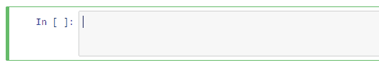

这是一个不错的小代码块，您可以在其中开始编写自己的 Python 代码，运行它并对其进行操作，所以请这样做。 您面临的挑战是编写一些代码来创建整数列表，循环遍历该列表的每个元素，到目前为止，这非常容易，并且仅打印出偶数。

现在这应该不太困难。 本笔记本中有一些可以做所有这些事情的例子。 您要做的就是将其放在一起并使其运行。 因此，重点不是给您带来困难的东西。 我只是希望您在编写自己的 Python 代码并实际运行并看到它可以运行时获得一定的信心，所以请这样做。 我绝对鼓励您在这里进行互动。 因此，祝您好运，欢迎使用 Python。

所以，那显然是您的 Python 崩溃过程，那里只是一些非常基本的东西。 当我们在本书中遍历越来越多的示例时，由于您有更多的示例要看，这将变得越来越有意义，但是如果此时您确实感到有些害怕，那么也许您是编程或脚本编写的新手，在继续之前进行 Python 修订可能是一个好主意，但是如果您对到目前为止所看到的一切感到满意，请继续进行下去，我们将继续。

# 运行 Python 脚本

在整本书中，我们将使用到目前为止一直在使用的 IPython/Jupyter 笔记本格式（`.ipynb`文件），对于这样的书，这是一种很好的格式，因为它可以让我放一些小块代码，然后在其中放一些文字和说明操作的内容，然后您就可以尝试实际操作。

当然，从这个角度来看，这很棒，但是在现实世界中，您可能不会使用 IPython/Jupyter 笔记本在生产中实际运行 Python 脚本，所以让我简要地简要介绍一下运行 Python 代码的其他方法，以及其他交互方式。 因此，这是一个非常灵活的系统。 让我们来看看。

# 不仅仅是 IPython/Jupyter 笔记本的更多选择

我想确保您知道有多种方法可以运行 Python 代码。 现在，在整本书中，我们将使用 IPython/Jupyter 笔记本格式，但在现实世界中，您将不会像笔记本一样运行代码。 您将以独立的 Python 脚本运行它。 因此，我只想确保您知道该怎么做并查看其工作原理。


因此，让我们回到本书中的第一个示例，只是为了说明空白的重要性。 我们可以从笔记本格式中选择并复制该代码，然后将其粘贴到新文件中。

这可以通过单击最左侧的“新建”按钮来完成。 因此，让我们制作一个新文件并将其粘贴并保存该文件，并将其命名为`test.py`，其中`py`是我们提供给 Python 脚本的常用扩展名。 现在，我可以用几种不同的方式运行它。

# 在命令提示符下运行 Python 脚本

我实际上可以在命令提示符下运行脚本。 如果我转到“工具”，则可以转到“Canopy 命令提示符”，这将打开一个命令窗口，其中已包含用于运行 Python 的所有必要环境变量。 我只需要输入`python test.py`并运行脚本，结果就会出现：

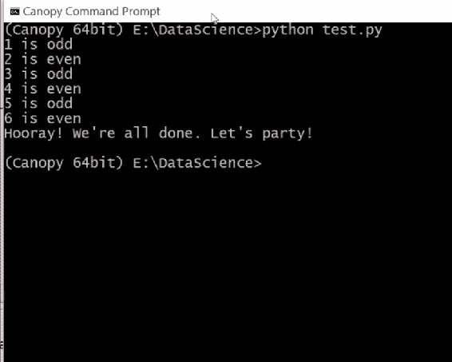

因此，在现实世界中，您可能会做类似的事情。 可能在 Crontab 上或类似的东西上，谁知道呢？ 但是在生产环境中运行真实的脚本就这么简单。 现在，您可以关闭命令提示符。

# 使用 Canopy IDE

回过头来，我还可以在 IDE 中运行脚本。 因此，在 Canopy 中，我可以转到“运行”菜单。 我可以去运行| 运行文件，或单击小播放图标，这也会执行我的脚本，并在输出窗口的底部看到结果，如以下屏幕快照所示：


因此，这是另一种方法，最后，您还可以在底部交互式显示的交互式提示中运行脚本。 实际上，我可以一次只键入一个 Python 命令，然后让它们执行并停留在该环境中：


例如，我可以说`stuff`，将其命名为`list`，并具有`1`，`2`，`3`，`4`，现在我可以说`len(stuff)`，那将给我`4`：

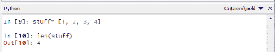

我可以说`for x in stuff:print x`，我们得到的输出为`1 2 3 4`：

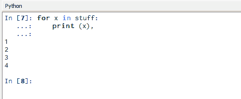

因此，当您在底部的交互式提示中单击并一次执行一件事情时，就可以看到某种化妆脚本。 在此示例中，`stuff`是我们创建的变量，一个保留在内存中的列表，有点像该环境中其他语言中的全局变量。

现在，如果我确实想重置此环境，如果我想摆脱`stuff`并重新开始，那么执行此操作的方式是转到此处的“运行”菜单，然后可以说“重新启动内核”，这将会带给你一个空白面板：


所以现在我有了一个干净的新 Python 环境，在这种情况下，我叫它什么？ 类型`stuff`和`stuff`尚不存在，因为我有一个新的环境，但是我可以添加其他名称，例如`[4, 5, 6]`； 运行它，就可以了：

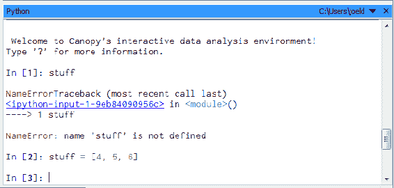

这样便有了运行 Python 代码的三种方式：IPython/Jupyter 笔记本，我们将在整本书中使用它，只是因为它是一个很好的学习工具，您还可以将脚本作为独立的脚本文件运行，也可以在交互式命令提示符中执行 Python 代码。

因此，您拥有了它，并且这里有三种不同的方式来运行 Python 代码以及在生产中进行实验和运行。 所以记住这一点。 在本书的其余部分中，我们将一直使用笔记本电脑，但是，到时候，您还有其他选择。

# 总结

在本章中，我们从构建书中最重要的垫脚石-安装有思想的檐篷开始了旅程。 然后，我们转向安装其他库并安装不同类型的包。 我们还借助各种 Python 代码掌握了 Python 的一些基础知识。 我们介绍了诸如模块，列表和元组之类的基本概念，并最终通过更好地了解 Python 中的函数和循环知识，进一步了解了 Python 基础知识。 最后，我们从运行一些简单的 Python 脚本开始。

在下一章中，我们将继续理解统计和概率的概念。