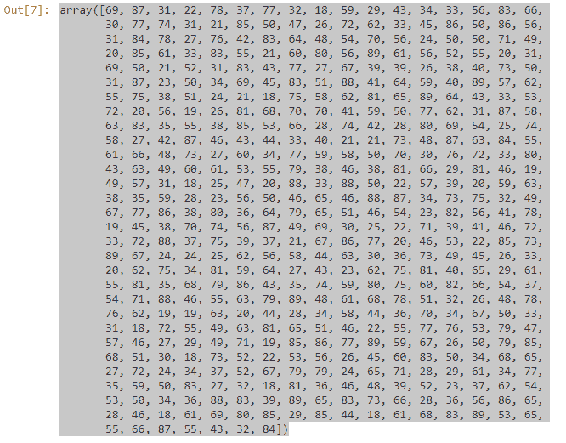
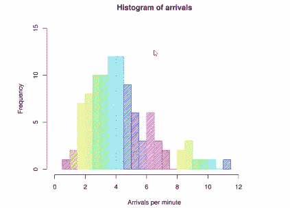
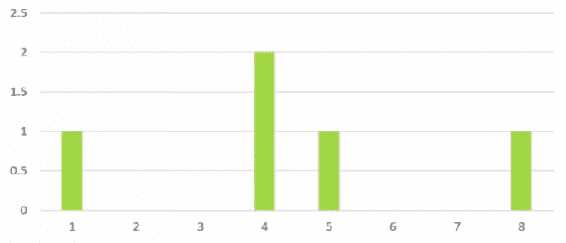
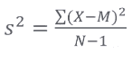
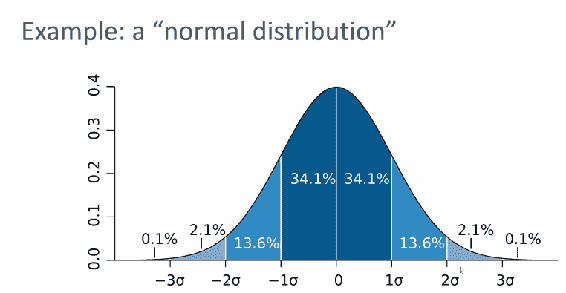
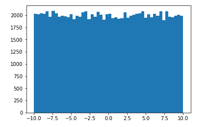
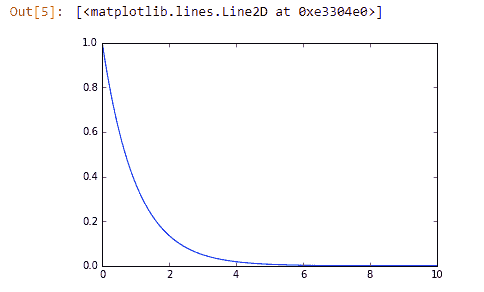
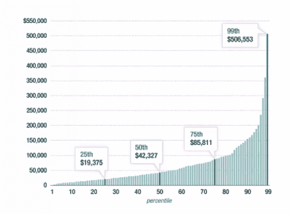
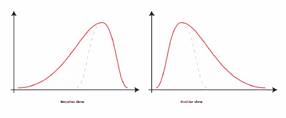

# 二、统计和概率回顾和 Python 实践

在本章中，我们将介绍一些统计和概率的概念，这可能会让您有些耳目一新。 如果您想成为数据科学家，这些概念很重要。 我们将看到一些示例以更好地理解这些概念。 我们还将研究如何使用实际的 Python 代码实现这些示例。

本章将涵盖以下主题：

*   您可能会遇到的数据类型以及如何相应地处理它们
*   均值，中位数，众数，标准差和方差的统计概念
*   概率密度函数和概率质量函数
*   数据分布的类型以及如何绘制它们
*   了解百分位数和矩

# 资料类型

好吧，如果您想成为数据科学家，我们需要讨论您可能会遇到的数据类型，如何对它们进行分类以及如何以不同的方式对待它们。 让我们深入了解您可能会遇到的各种数据类型：


这看起来很基础，但是我们必须从简单的内容开始，然后逐步发展到更复杂的数据挖掘和机器学习方面。 了解您要处理的数据类型非常重要，因为不同的技术可能会根据您要处理的数据类型而产生不同的细微差别。 因此，如果您愿意的话，有几种类型的数据，而我们将主要关注三种特定类型的数据。 他们是：

*   数值数据
*   分类数据
*   序数数据

同样，您可能会使用不同的技术来处理不同类型的数据，因此在分析数据时，您始终需要记住要处理的数据类型。

# 数值数据

让我们从数值数据开始。 它可能是最常见的数据类型。 基本上，它表示您可以测量的一些可量化的事物。 例如，人员高度，页面加载时间，股票价格等。 事物各不相同，您可以衡量的事物，具有广泛可能性的事物。 现在基本上有两种数值数据，所以如果可以的话，可以说是一种风味。

# 离散数据

有离散数据，该数据是基于整数的，例如可以是某种事件的计数。 例如，一个客户一年内进行了几次购买。 好吧，那只能是离散值。 他们买了一件事，或者他们买了两件事，或者他们买了三件事。 他们买不了 2.25 东西或三分之三或四分之三的东西。 这是一个离散值，具有整数限制。

# 连续数据

数值数据的另一种类型是连续数据，这种东西具有无限范围的可能性，您可以在其中进行细分。 因此，例如，回到人的身高，人的身高是无限的。 您可能身高 5 英尺高 10.37625 英寸，或者花很多时间在网站上进行诸如结帐之类的操作，所花时间为 10.7625 秒，或者一天中有多少降雨。 再次，那里有无限的精度。 这就是连续数据的一个例子。

回顾一下，数字数据可以用数字进行定量测量，它既可以是离散的（如事件计数一样基于整数），也可以是连续的（可以为数据提供无限范围的精度）。

# 分类数据

我们将要讨论的第二种数据类型是分类数据，这是没有内在数值含义的数据。

大多数时候，您不能真正将一个类别直接与另一个类别进行比较。 诸如性别，是/否问题，种族，居住状态，产品类别，政党等内容； 您可以将数字分配给这些类别，并且经常会分配，但是这些数字没有内在的含义。


因此，例如，我可以说德克萨斯州的面积大于佛罗里达州的面积，但我不能仅说德克萨斯州大于佛罗里达州，它们只是类别。 它们没有真正的数值可量化的含义，这只是我们对不同事物进行分类的方式。

再一次，我可能会对每种状态进行某种数值分配。 我的意思是，我可以说佛罗里达州是 3 号州，德克萨斯州是 4 号州，但是 3 号和 4 号州之间没有真正的关系，对，这只是更简洁地表示这些类别的简写。 同样，分类数据没有任何内在的数值含义； 这只是您选择根据类别拆分一组数据的一种方式。

# 序数数据

关于数据类型，您通常会听到的最后一个类别是序数数据，它是数字数据和分类数据的混合。 一个常见的例子是电影或音乐的星级，或者您拥有什么。


在这种情况下，我们得到的分类数据可能是 1 到 5 颗星，其中 1 颗代表劣而 5 颗代表优，但它们确实具有数学意义。 我们确实知道 5 表示它比 1 更好，因此在这种情况下，我们拥有不同类别之间具有数值关系的数据。 因此，就质量而言，我可以说 1 星小于 5 星，可以说 2 星小于 3 星，可以说 4 星大于 2 星。 现在，您还可以将实际的恒星数量视为离散的数值数据。 因此，在这些类别之间绝对是一条很好的界限，在许多情况下，您实际上可以将它们互换使用。

因此，您有三种不同的类型。 有数字，分类和有序数据。 让我们看看它是否沉入其中。不要担心，我不会让您参与工作或其他任何事情。

**快速测验**：对于这些示例中的每个，数据是数字的，分类的还是有序的？

1.  让我们从您的油箱中有多少气体开始。 你怎么认为？ 好吧，正确的答案是数字。 这是一个连续的数值，因为您的储罐中可能存在无限范围的气体。 是的，我的意思是，您可以容纳多少气体可能有一个上限，但是您拥有多少气体的可能值的数量没有尽头。 它可能是储罐的四分之三，可能是储罐的六分之一，可能是储罐的`1 / pi`，我的意思是谁知道，对吗？

2.  如果您以 1 到 4 的等级阅读您的整体健康状况，那这些选择对应于差，中，好和优秀类别，那又如何呢？ 你怎么认为？ 这是序数数据的一个很好的例子。 这非常类似于我们的电影收视率数据，并且再次取决于您的建模方式，您可能也可以将其视为离散的数值数据，但从技术上讲，我们将其称为序数数据。
3.  那你同学的种族呢？ 这是分类数据的一个很明显的例子。 您无法真正将紫色人与绿色人进行比较，对，他们只是紫色和绿色，但是您可能需要研究它们并了解其他维度之间的区别。
4.  几岁的同学年龄如何？ 那里有一个技巧问题； 如果我说它必须是整数年，例如 40、50 或 55 年，那么那将是离散的数值数据，但是如果我具有更高的精度（例如 40 年 3 个月和 2.67 天），那将是连续的数值数据，但是无论哪种方式，它都是数值数据类型。
5.  最后，花钱在商店里。 同样，这可能是连续数值数据的一个示例。 同样，这仅是重要的，因为您可能将不同的技术应用于不同类型的数据。

例如，在某些概念中，我们可能对分类数据执行一种类型的实现，而对数值数据进行另一种类型的实现。

因此，您只需了解通常会发现的不同类型的数据，并且在本书中我们将重点介绍这些数据。 它们都是非常简单的概念：您拥有数字，分类和有序数据，并且数字数据可以是连续或离散的。 根据要处理的数据类型，可以对数据应用不同的技术，我们将在整本书中介绍这一点。 让我们继续。

# 均值，中位数和众数

让我们来复习一下统计 101。这就像是小学学习的东西，但是再次学习它，看看如何使用这些不同的技术是很不错的：均值，中位数和众数。 我敢肯定您之前听过这些术语，但是很高兴看到它们的用法有所不同，所以让我们深入研究。

既然我们已经开始真正地研究一些实际的统计数据，那么这应该是对大多数人的回顾，快速复习。 让我们看一些实际数据，并弄清楚如何测量这些东西。

# 均值

您可能知道，平均值只是平均值的另一个名称。 要计算数据集的平均值，您要做的就是将所有值相加并除以您拥有的值数。

```py
Sum of samples/Number of samples
```

让我们以这个示例为例，它计算出我附近每所房屋的平均孩子数。

假设我在附近的家中挨家挨户问每个人，家里有多少个孩子。 （顺便说一句，它是离散数值数据的一个很好的例子；还记得上一节吗？）假设我四处走走，发现第一间房子里没有孩子，第二间房子里有两个孩子， 第三户有三个孩子，依此类推。 我收集了这个离散的数字数据的小数据集，然后找出平均值，我要做的就是将它们加在一起，然后除以我去过的房屋数量。

我这条街上每所房子的孩子人数：

```py
0, 2, 3, 2, 1, 0, 0, 2, 0
```

平均值为`(0 + 2 + 3 + 2 + 1 + 0 + 0 + 2 + 0) / 9 = 1.11`

得出的结果是 0 加 2 加 3 加所有其余的这些数字除以我看过的房屋总数，即 9，而样本中每座房屋的平均孩子数为 1.11。 所以，意思是。

# 中位数

中位数有些不同。 计算数据集中位数的方式是对所有值进行排序（按升序或降序），然后取一个中间值。

因此，举例来说，让我们使用附近社区的相同儿童数据集

```py
0, 2, 3, 2, 1, 0, 0, 2, 0
```

我将对其进行数字排序，然后可以将数据中间的 slap dab 取为 1。

```py
0, 0, 0, 0, 1, 2, 2, 2, 3
```

同样，我要做的就是获取数据，对其进行数字排序，然后获取中心点。

如果您有偶数个数据点，则中位数实际上可能落在两个数据点之间。 目前尚不清楚哪一个实际上是中间的。 在这种情况下，您要做的就是取两个确实落在中间的平均值，然后将该数字视为中位数。

# 离群因素

现在，在前面的每个家庭中孩子数量的示例中，中位数和均值非常接近，因为离群值并不多。 我们有 0、1、2 或 3 个孩子，但我们没有一个古怪的家庭有 100 个孩子。 那确实会使均值产生偏差，但可能不会使中位数变化太大。 这就是为什么中位数通常是非常有用的东西，而且经常被忽略。

中位数比均值更不容易受到离群值的影响。

人们有时会误导统计人员。 我将尽可能在本书中始终指出这一点。

例如，您可以谈论美国的平均家庭收入，而从我去年查到的数据来看，去年的实际数字是 72,000 美元左右，但这并不能真正提供典型美国人的准确情况。 制造。 这是因为，如果您查看收入中位数，则要低得多，为 51,939 美元。 这是为什么？ 好吧，因为收入不平等。 美国有一些非常有钱的人，在许多国家中也是如此。 美国甚至不是最坏的，但您知道那些亿万富翁，生活在华尔街，硅谷或其他超级富豪地区的那些超级富豪，他们的意思是平均的。 但是它们很少，以至于它们并没有真正影响中位数。

这是一个很好的例子，在这个例子中，中位数比平均数更能说明典型数字或数据点的故事。 每当有人谈论均值时，您都必须考虑数据分布是什么样的。 是否有异常值可能会歪曲那个意思？ 如果答案可能是肯定的，那么您还应该要求中位数，因为通常，中位数比均值或平均值提供的洞察力更大。

# 众数

最后，我们将讨论众数。 在实践中，这种情况并不会经常出现，但是如果不谈论众数，就无法谈论均值和中位数。 所有众数均值是数据集中最常见的值。

让我们回到我的例子中，每个房子里有多少孩子。

```py
0, 2, 3, 2, 1, 0, 0, 2, 0
```

每个值有多少个：

```py
0: 4, 1: 1, 2: 3, 3: 1
```

众数为 0

如果我只看一下最常出现的数字，它的值为 0，因此该数据的众数为 0。在该邻里给定房屋中，最常见的孩子数是没有孩子，这意味着 。

现在，这实际上是连续数据与离散数据的一个很好的例子，因为这仅适用于离散数据。 如果我有连续的数据范围，那么除非我以某种方式将其量化为离散值，否则我无法真正谈论出现的最常见值。 因此，我们已经在这里遇到了一个示例，其中数据类型很重要。

众数通常仅与离散数值数据相关，而与连续数据无关。

许多现实世界中的数据往往是连续的，所以也许这就是为什么我对众数知之甚少的原因，但是为了完整起见，我们在这里看到它。

简而言之，您便拥有了：均值，中位数和众数。 您可以做一些最基本的统计工作，但是我希望您在中位数和均值之间进行选择的重要性方面有所收获。 他们可以讲述截然不同的故事，但是人们倾向于将它们等同起来，因此请确保您是一名负责任的数据科学家，并以能够传达您想要表达的含义的方式来代表数据。 如果要显示一个典型值，由于离群值，通常选择中值比使用平均值更好，因此请记住这一点。 让我们继续。

# 在 Python 中使用均值，中位数和众数

让我们开始用 Python 进行一些实际的编码，看看如何在 IPython 笔记本文件中使用 Python 计算均值，中位数和众数。

因此，如果您想继续，请从本节的数据文件中打开`MeanMedianMode.ipynb`文件，我绝对鼓励您这样做。 如果您需要返回上一节中有关从何处下载这些资料的信息，请执行此操作，因为本节将需要这些文件。 让我们潜入吧！

# 使用 NumPy 包计算平均值

我们要做的是创建一些虚假的收入数据，回到上一节中的示例。 在本例中，我们将创建一些假数据，在这些数据中，典型的美国人每年的收入约为 27,000 美元，我们要说的是正态分布且标准差为 15,000。 所有数字都完全组成了，如果您还不知道正态分布和标准差的含义，请不要担心。 我将在本章的稍后部分介绍，但是我只想让您知道这些不同参数在本例中代表什么。 稍后将有意义。

在我们的 Python 笔记本中，请记住将 NumPy 包导入 Python，这使得计算均值，中位数和众数变得非常容易。 我们将使用`import numpy as np`指令，这意味着我们可以从现在开始使用`np`作为调用`numpy`的简写。

然后，我们将使用`np.random.normal`函数创建一个称为`incomes`的数字列表。

```py
import numpy as np 

incomes = np.random.normal(27000, 15000, 10000) 
np.mean(incomes) 

```

`np.random.normal`函数的三个参数表示我希望数据以`27000`为中心，标准差为`15000`，并且我希望 python 在此列表中建立`10000`数据点。

完成此操作后，我只需在数据列表`incomes`上调用`np.mean`，即可计算出这些数据点的平均值或均值。 就这么简单。

让我们继续运行它。 确保选择了该代码块，然后可以单击“播放”按钮以实际执行该代码块，并且由于这些收入数字包含随机成分，因此每次运行该代码块时，我都会得到略有不同的结果，但是它应始终非常接近`27000`。

```py
Out[1]: 27173.098561362742

```

好的，这就是使用 Python 计算均值的全部内容，仅使用 NumPy（`np.mean`）即可使其变得非常简单。 您不必编写一堆代码或实际上将所有内容加起来就可以算出您拥有多少项并进行除法。 NumPy 的意思是，这一切都为您做。

# 使用 Matplotlib 可视化数据

让我们可视化这些数据，使其更具意义。 因此，还有一个名为`matplotlib`的包，以后我们将再次讨论更多，但这是一个包，可以让我在 IPython 笔记本中制作漂亮的图形，因此这是一种可视化您的数据的简单方法，看看发生了什么。

在此示例中，我们使用`matplotlib`创建我们的收入数据的直方图，该直方图分为`50`个不同的存储桶。 因此，基本上，我们要获取连续数据并将其离散化，然后可以在`matplotlib.pyplot`上调用`show`来实际显示该直方图。 请参考以下代码：

```py
%matplotlib inline 
import matplotlib.pyplot as plt 
plt.hist(incomes, 50) 
plt.show() 

```

继续，选择代码块并点击播放。 它实际上将为我们创建一个新图，如下所示：


如果您不熟悉直方图或需要复习，可以用以下方法来解释：将数据离散化后的每个存储桶都在显示该数据的频率。

因此，举例来说，对于每个给定的值范围，我们看到在该邻域中大约有`600`个数据点。 有很多人都在 27,000 大关附近，但是当您走到`80,000`之类的离群值时，并没有很多人，而且显然还有一些穷人甚至在`-40,000`时负债累累，但又一次，它们非常罕见且不太可能，因为我们定义了正态分布，这就是正态概率曲线的样子。 再次，我们将在以后更详细地讨论这一点，但是如果您还不知道，那么我只是想让您想到这个想法。

# 使用 NumPy 包计算中位数

好了，因此计算中位数与计算均值一样简单。 就像我们有 NumPy `mean`一样，我们也有 NumPy `median`函数。

我们可以只使用`incomes`上的`median`函数，这是我们的数据列表，这将为我们提供中位数。 在这种情况下，总计 26,911 美元，与平均值 26988 美元相差无几。 同样，初始数据是随机的，因此您的值将略有不同。

```py
np.median(incomes) 

```

以下是上述代码的输出：

```py
Out[4]: 26911.948365056276 

```

我们不希望看到很多异常值，因为这是一个很好的正态分布。 当您没有很多奇怪的异常值时，中值和均值将是可比的。

# 分析异常值的影响

为了证明一点，让我们添加一个异常值。 我们带唐纳德·特朗普； 我认为他有资格成为离群值。 让我们继续添加他的收入。因此，我将使用`np.append`手动将其添加到数据中，并假设将 10 亿美元（显然不是唐纳德·特朗普的实际收入）添加到收入数据中。

```py
incomes = np.append(incomes, [1000000000]) 

```

我们将要看到的是，这个离群值并没有真正改变很多中位数，您知道，这仍然是大约 26,911 美元，因为我们实际上并没有改变中间点的位置， 该值，如以下示例所示：

```py
np.median(incomes) 

```

这将输出以下内容：

```py
Out[5]: 26911.948365056276 

```

这给出了一个新的输出：

```py
np.mean(incomes) 

```

以下是上述代码的输出：

```py
Out[5]:127160.38252311043 

```

啊哈，就在那里！ 这是一个很好的例子，尽管人们倾向于用平凡的语言将中位数和平均数等同起来，但是它们可能截然不同，并讲述了一个非常不同的故事。 因此，一个离群值导致此数据集中的平均收入每年超过 127160 美元，但更准确的图片对于该数据集中的典型数字来说，每年的收入接近 27,000 美元。 我们的均值只有一个较大的异常值。

这个故事的寓意是：如果您怀疑其中可能包含离群值，那么请任何谈论均值或均值的人都参与进来，而收入分配肯定就是这种情况。

# 使用 SciPy 包计算众数

最后，让我们看看众数。 我们将只生成一堆随机整数，准确地说是其中的 500 个，范围在`18`和`90`之间。 我们将为人们创造一堆假年龄。

```py
ages = np.random.randint(18, high=90, size=500) 
ages 

```

您的输出将是随机的，但应类似于以下屏幕截图：



现在，SciPy（类似于 NumPy）是一堆类似方便的统计函数，因此我们可以使用以下语法从 SciPy 导入`stats`。 它与我们之前看到的有点不同。

```py
from scipy import stats 
stats.mode(ages) 

```

该代码意味着，从`scipy`包导入`stats`，而我仅将该包称为`stats`，意味着我不需要像以前使用 NumPy 时那样的别名， 只是做事的方式不同。 两种方式都可以。 然后，我在`ages`上使用了`stats.mode`函数，这是我们随机年龄的列表。 当我们执行上面的代码时，我们得到以下输出：

```py
Out[11]: ModeResult(mode=array([39]), count=array([12])) 

```

因此，在这种情况下，实际众数是`39`，它是该数组中最常见的值。 实际上发生了`12`次。

现在，如果我实际创建一个新的发行版，我将期望得到一个完全不同的答案，因为这些数据实际上是完全随机的，这些数字是多少。 让我们再次执行上述代码块以创建新的发行版。

```py
ages = np.random.randint(18, high=90, size=500) 
ages 

```

```py
from scipy import stats 
stats.mode(ages) 

```

随机化方程的输出如下：


确保选择了该代码块，然后可以单击“播放”按钮以实际执行它。

在这种情况下，众数最终为`29`次，发生了`14`次。

```py
Out[11]: ModeResult(mode=array([29]), count=array([14])) 

```

因此，这是一个非常简单的概念。 您可以再玩几次，只是为了好玩。 这有点像旋转轮盘赌。 我们将再次创建一个新的发行版。

简而言之，您将拥有平均值，中位数和众数。 使用 SciPy 和 NumPy 包非常简单。

# 一些练习

在本节中，我将给您一些任务。 如果打开`MeanMedianExercise.ipynb`文件，则可以玩一些东西。 我希望您卷起袖子，然后尝试这样做。

在文件中，我们有一些随机的电子商务数据。 该数据代表的是每笔交易的总支出，同样，就像我们之前的示例一样，它只是数据的正态分布。 我们可以运行它，而您的作业是继续使用 NumPy 包查找该数据的均值和中位数。 您几乎可以想象到的最简单的任务。 您需要的所有技术都在我们先前使用的`MeanMedianMode.ipynb`文件中。

这里的重点并不是要挑战您，而只是让您实际编写一些 Python 代码并说服自己您实际上可以得到结果并使此处发生某些事情。 因此，继续进行下去。 如果您想更多地使用它，请随时在此处试用数据分布，看看您可以对数字产生什么影响。 尝试添加一些离群值，就像我们对收入数据所做的那样。 这是学习这些东西的方式：掌握基础知识，然后学习高级知识。 有它，有乐趣。

准备就绪后，让我们继续下一个概念，即标准差和方差。

# 标准差和方差

让我们谈谈标准差和方差。 您可能已经听说过这些概念和术语，但是让我们更深入地了解它们的真正含义以及如何计算它们。 这是对数据分布范围的一种度量，这将在几分钟后变得更有意义。

标准差和方差是数据分发的两个基本量，您将在本书中反复看到。 因此，如果需要复习，让我们看看它们是什么。

# 方差

让我们看一个直方图，因为方差和标准差都与数据的散布，数据集的分布形状有关。 看看下面的直方图：



假设我们有一些关于飞机到达机场的频率的数据，例如，该直方图表明我们每分钟有大约 4 班飞机到达，并且在我们查看该数据的 12 天左右发生。 但是，我们也有这些异常值。 我们有一个非常慢的一天，每分钟只有一次到达，而我们只有一个非常快的一天，每分钟接近 12 个到达。 因此，读取直方图的方法是查找给定值的存储桶，它告诉您该值在数据中出现的频率，直方图的形状可以告诉您很多有关给定集合的数据的概率分布。

从这些数据中我们知道，我们的机场很可能每分钟有 4 个左右的进港旅客，但几乎不可能有 1 或 12 个进港旅客，我们还可以专门讨论一下两者之间所有数字的机率。 因此，每分钟不仅有 12 个到达的可能性，每分钟 9 个到达的可能性也很小，而且一旦我们开始达到 8 个左右，事情就会开始加速。 直方图可以提供很多信息。

方差度量数据的*分布*的程度。

# 测量方差

我们通常将方差称为`σ²`，您会立即找出原因，但现在，仅知道方差是均值平方差的平均值。

1.  要计算数据集的方差，首先要弄清楚它的平均值。 假设我有一些数据可以代表任何东西。 假设在一个小时内排队的最大人数。 在第一个小时，我观察到有一个人在排队，然后依次是 4、5、4、8。
2.  计算方差的第一步只是找到该数据的平均值或平均值。 我将它们全部相加，将总和除以数据点的数量，得出 4.4，这是排队的平均人数`(1 + 4 + 5 + 4 + 8) / 5 = 4.4`。
3.  现在，下一步是找到每个数据点均值的差异。 我知道平均值是 4.4。 所以对于我的第一个数据点，我有 1，所以`1 - 4.4 = -3.4`，下一个数据点是 4，所以`4 - 4.4 = -0.4`， 等等等等。 好的，因此我得到了这些正数和负数，它们代表每个数据点（`-3.4, -0.4, 0.6, -0.4, 3.6`）与平均值的方差。
4.  现在，我需要一个代表整个数据集方差的数字。 因此，我接下来要做的就是找到这些差异的平方。 我只是要仔细研究均值中的每一个原始差异，然后将它们平方。 这有两个不同的原因：

让我们看一下发生了什么，所以`(-3.4)²`是正 11.56，而`(-0.4)²`最终是一个小得多的数字，即 0.16，因为这更接近 4.4 的平均值。 同样，`0.6²`接近平均值，仅为 0.36。 但是当我们达到正离群值时，`3.6²`最终为 12.96。 这样就得出：`11.56, 0.16, 0.36, 0.16, 12.96`。

为了找到实际的方差值，我们只取所有那些平方差的平均值。 因此，我们将所有这些平方的方差相加，将总和除以 5（即我们拥有的值的数量），最后得出方差 5.04。


好的，这就是所有差异。

# 标准差

现在，通常，我们谈论标准差多于方差，事实证明标准差只是方差的平方根。 就这么简单。

因此，如果我的差异为`5.04`，则标准差为`2.24`。 现在您知道为什么我们说方差`= σ²`。 这是因为`σ`本身代表标准差。 因此，如果我取`σ²`的平方根，则得到`σ`。 在此示例中最终为 2.24。


# 使用标准差识别离群值

这是我们在前面的示例中查看的用于计算方差的实际数据的直方图。



现在我们看到`4`在我们的数据集中出现了两次，然后我们有一个`1`，一个`5`和一个`8`。

通常使用标准差作为思考如何识别数据集中异常值的方法。 如果我说我在 4.4 平均值的一个标准差内，则认为这是正态分布中的典型值。 但是，您可以在上图中看到`1`和`8`实际上不在该范围内。 因此，如果我采用 4.4 的正负 2.24，我们最终会在`7`和`2`周围，而`1`和`8`都落在标准差的范围。 因此，我们可以从数学上说 1 和 8 是离群值。 我们不必猜测和盯着它。 现在仍然需要根据数据点与平均值有多少标准差来判断离群值。

通常，您可以通过与平均值之间的标准差（或有时为多少个`σ`）来谈论一个数据点有多少离群值。

因此，您会看到在现实世界中使用的标准差。

# 总体方差与样本方差

标准差和方差有一点细微差别，那就是您在谈论总体与样本方差时。 如果您要使用一整套数据，一整套观察结果，那么您将按照我告诉您的那样做。 您只需从均值中取所有平方方差的平均值即可，这就是您的方差。

但是，如果要采样数据，也就是说，如果只是为了简化计算而获取数据的子集，则必须做一些不同的事情。 除了将样本数除以 1 之外，不除以样本数。让我们来看一个示例。

我们将使用刚为排队的人研究的样本数据。 我们将方差的总和除以 5，即得到的数据点数为 5.04。

```py
σ² = (11.56 + 0.16 + 0.36 + 0.16 + 12.96) / 5 = 5.04
```

如果我们看一下由`S²`表示的样本方差，它是由方差平方和除以 4 得出的，即`n-1`。 这给我们提供了 6.3 的样本方差。

```py
S² = (11.56 + 0.16 + 0.36 + 0.16 + 12.96) / 4 = 6.3
```

同样，如果这是我们从较大的数据集中获取的某种样本，那么您将要这样做。 如果它是完整的数据集，请除以实际数字。 好的，这就是我们计算总体和样本方差的方式，但是其背后的实际逻辑是什么？

# 数学解释

至于为什么总体和样本方差之间存在差异，它涉及关于您可能不想考虑太多的概率的真正怪异的东西，并且它需要一些花哨的数学符号，在本书中我尽量避免使用符号，因为我认为概念更重要，但这已经足够基本了，您将一遍又一遍地看到它。

如我们所见，总体方差通常指定为 `σ²`，其中`σ`为标准差，我们可以说这是每个数据点`X`的总和减去平均值，`μ`，平方，即每个样本在`N`（数据点的数量）上平方的方差，我们可以用以下公式表示：


*   `X`表示每个数据点
*   `µ`表示平均值
*   `N`表示数据点数

样本方差类似地指定为`S²`，其等式如下：



*   `X`表示每个数据点
*   `M`表示平均值
*   `N-1`表示数据点数减去 1

这里的所有都是它的。

# 分析直方图上的标准差和方差

让我们在这里编写一些代码，并使用一些标准差和方差。 因此，如果您拉起`StdDevVariance.ipynb`文件 IPython 笔记本，然后在这里跟随我。 请这样做，因为最后有一项活动我想让您尝试。 我们将在此处执行的操作与前面的示例一样，因此从以下代码开始：

```py
%matplotlib inline 
import numpy as np 
import matplotlib.pyplot as plt 
incomes = np.random.normal(100.0, 20.0, 10000) 
plt.hist(incomes, 50) 
plt.show() 

```

我们使用`matplotlib`绘制一些正态分布的随机数据的直方图，并将其称为`incomes`。 我们说它将以`100`为中心（希望这是一个小时费率或某值，而不是每年，或一些怪异的面额），其标准差为`20`和`10,000`数据点。

让我们继续执行上面的代码块并将其绘制，如下图所示，生成它：


我们有 10,000 个以 100 个为中心的数据点。正态分布和 20 个标准差（衡量此数据的传播程度）可以看到，最常见的情况是在 100 个左右，并且随着我们的发展越来越远 ，事情变得越来越不可能了。 我们指定的标准差点 20 在 80 左右，在 120 左右。您可以在直方图中看到这是事物开始急剧下降的点，因此我们可以说超出标准差边界的事物是不寻常的。

# 使用 Python 计算标准差和方差

现在，NumPy 还使计算标准差和方差变得异常容易。 如果要计算我们生成的该数据集的实际标准差，只需在数据集本身上调用`std`函数。 因此，当 NumPy 创建列表时，它不仅仅是一个普通的 Python 列表，实际上还附加了一些其他内容，因此您可以在其上调用函数，例如`std`作为标准差。 让我们现在开始：

```py
incomes.std() 

```

这给了我们类似下面的输出（请记住，我们使用了随机数据，因此您的数字将与我的数字不完全相同）：

```py
20.024538249134373 

```

执行该操作时，我们得到的数字接近 20，因为这是我们创建随机数据时指定的数字。 我们希望标准差为 20。可以肯定的是 20.02，非常接近。

差异只是调用`var`的问题。

```py
incomes.var() 

```

这给了我以下内容：

```py
400.98213209104557 

```

结果接近 400，即 20 <sup class="calibre33">2</sup> 。 是的，所以这个世界很有意义！ 标准差只是方差的平方根，或者您可以说方差是标准差的平方。 果然，那行得通，所以世界按其应有的方式行事。

# 自己尝试

我想让您潜入这里并真正玩转它，使其真实，因此在生成正常数据时尝试不同的参数。 记住，这是对数据分布形状的度量，因此，如果我更改该中心点会怎样？ 有关系吗？ 它实际上会影响形状吗？ 您为什么不尝试一下并找出答案？

尝试弄乱我们指定的实际标准差，以了解对图形形状的影响。 也许尝试使用 30 的标准差，就可以知道它实际如何影响事物。 让我们将其变得更加生动，例如 50。只要玩一下 50。您将看到图形开始变得有点胖。 尝试不同的值，只需要了解这些值的运作方式即可。 这是真正直观地了解标准差和方差的唯一方法。 来看看一些不同的例子，看看它的效果。

这就是实践中的标准差和方差。 您在那里接触了其中的一些东西，我希望您能花一点时间来熟悉它。 这些是非常重要的概念，我们将在整本书中谈论很多标准差，而且毫无疑问，在您从事数据科学的整个职业中，因此请确保掌握这一点。 让我们继续。

# 概率密度函数和概率质量函数

因此，对于本书中的某些示例，我们已经看到了一些正态分布函数的示例。 那是概率密度函数的一个例子，那里还有其他类型的概率密度函数。 因此，让我们深入了解它的真正含义以及它们的其他示例。

# 概率密度函数和概率质量函数

我们已经为本书中所见的一些代码看到了一些正态分布函数的示例。 那是概率密度函数的一个例子，那里还有其他类型的概率密度函数。 让我们深入研究一下，这实际上意味着什么，以及它们的其他一些示例。

# 概率密度函数

让我们谈谈概率密度函数，我们已经在书中使用了其中之一。 我们只是没有这样称呼。 让我们形式化一些我们已经谈论过的东西。 例如，我们已经看到几次正态分布，这就是概率密度函数的一个例子。 下图是正态分布曲线的示例



从概念上来说，尝试将此图视为出现给定值的概率很容易，但是当您谈论连续数据时，这有点误导。 因为在连续数据分布中有无限多个实际可能的数据点。 可能为 0 或 0.001 或 0.00001，因此发生非常特定的值的实际概率非常非常小，并且无限小。 概率密度函数实际上告诉了给定范围的值出现的概率。 因此，这就是您必须考虑的方式。

因此，例如，在上图中所示的正态分布中，在平均值（`0`）和一个与平均值的标准差（`1σ`）之间，存在`34.1%`值落在该范围内的机会。 您可以根据需要加强或扩展它，找出实际值，但这是考虑概率密度函数的方法。 对于给定的值范围，它为您提供了一种方法来找出该范围出现的可能性。

*   您可以在图表中看到，在接近一个平均值（`-1σ`和`1σ`）的情况下，接近平均值（`0`）， 很可能降落在那里。 我的意思是，如果您将 34.1 和 34.1 相加，等于 68.2%，您的落地概率就在平均值的一个标准差之内。
*   但是，当您获得两个到三个标准差（`-3σ`至`-2σ`和`2σ`至`3σ`）时， 下降到略高于 4%（准确地说是 4.2%）。
*   当您超出三个标准差（`-3σ`和`3σ`）时，我们的误差就远远小于 1%。

因此，图形只是可视化和讨论给定数据点发生概率的一种方式。 同样，概率分布函数为您提供数据点落入给定值的某个给定范围内的概率，而正态函数只是概率密度函数的一个示例。 我们稍后再看。

# 概率质量函数

现在，当您处理离散数据时，关于无限数量的可能值的细微差别就消失了，我们称之为不同的东西。 因此，这是一个概率质量函数。 如果要处理离散数据，则可以讨论概率质量函数。 这是一个图形，可以帮助可视化此图形：


例如，您可以在图中所示的黑色曲线上绘制连续数据的正态概率密度函数，但是如果我们像对直方图那样将其量化为离散数据集，则可以说数字 3 设置次数，实际上您可以说数字 3 发生的可能性略高于 30%。 因此，概率质量函数是我们可视化离散数据出现概率的方式，它看起来很像直方图，因为它基本上是直方图。

术语差异：概率密度函数是一条实线，描述了连续数据发生一系列值的概率。 概率质量函数是在数据集中出现的给定离散值的概率。

# 数据分布类型

让我们来看一些一般的概率分布函数和数据分布的真实示例，并在数据分布以及如何可视化它们并在 Python 中使用它们的过程上多花些头。

继续并从书籍材料中打开`Distributions.ipynb`，如果愿意，您可以在这里与我一起关注。

# 均匀分布

让我们从一个非常简单的示例开始：均匀分布。 均匀分布仅表示在给定范围内出现值的概率恒定为常数。

```py
import numpy as np 
Import matplotlib.pyplot as plt 

values = np.random.uniform(-10.0, 10.0, 100000) 
plt.hist(values, 50) 
plt.show() 

```

因此，我们可以使用 NumPy `random.uniform`函数创建均匀分布。 前面的代码说，我想要一个均匀分布的随机值集，范围在`-10`和`10`之间，而我想要其中的`100000`。 然后，如果我创建这些值的直方图，则可以看到如下所示。



在数据中出现给定值或值范围的可能性几乎相等。 因此，与正态分布不同，在正态分布中，我们看到了均值附近的值集中，而均匀分布在您定义的范围内的任何给定值上具有相等的概率。

那么，这种概率分布函数是什么样的呢？ 好吧，我希望基本上不会在`-10`的范围内或超出`10`的范围内。 但是，当我介于`-10`和`10`之间时，我会看到一条平线，因为这些值范围中的任何一个出现的可能性都是恒定的。 因此，在均匀分布中，您会在概率分布函数上看到一条平线，因为基本上存在恒定的概率。 每个值，每个值范围都有与其他任何值一样出现的机会。

# 正态分布或高斯分布

现在，我们已经在本书中看到了正态分布函数（也称为高斯分布）。 您实际上可以使用 Python 可视化它们。 `scipy.stats.norm`包函数中有一个称为`pdf`（概率密度函数）的函数。

因此，让我们看下面的示例：

```py
from scipy.stats import norm 
import matplotlib.pyplot as plt 

x = np.arange(-3, 3, 0.001) 
plt.plot(x, norm.pdf(x)) 

```

在前面的示例中，我们正在创建一个 x 值列表，以使用`arange`函数绘制介于-3 和 3 之间的值，并在它们之间以 0.001 为增量。 因此，这些是图形上的 x 值，我们将使用这些值绘制`x`轴。`y`轴将成为正态函数`norm.pdf`，即在这些 x 值上正态分布的概率密度函数。 我们最终得到以下输出：


具有正态分布的 pdf 函数看起来就像在上一节中一样，即，对于我们提供的给定数字，正态分布，其中 0 表示平均值，数字`-3`，`-2`，`-1`，`1`，`2`和`3`是标准差。

现在，我们将生成具有正态分布的随机数。 我们已经做过几次了； 考虑一下这。 请参考以下代码块：

```py
import numpy as np 
import matplotlib.pyplot as plt 

mu = 5.0 
sigma = 2.0 
values = np.random.normal(mu, sigma, 10000) 
plt.hist(values, 50) 
plt.show() 

```

在上面的代码中，我们使用 NumPy 包的`random.normal`函数，并且第一个参数`mu`表示要围绕数据居中的平均值。 `sigma`是该数据的标准差，基本上是它的传播。 然后，我们使用正态概率分布函数（此处为`10000`）指定所需的数据点数。 因此，这是使用概率分布函数（在本例中为正态分布函数）生成一组随机数据的方法。 然后，我们可以使用分解为`50`存储桶的直方图来进行绘制并显示出来。 以下输出是我们最终得到的结果：


它看起来或多或少看起来像是正态分布，但是由于存在随机元素，因此它并不是完美的曲线。 我们在谈论概率； 事情有些不尽如人意。

# 指数概率分布或幂律

您经常看到的另一个分布函数是指数概率分布函数，该函数以指数方式下降。

当您谈论指数下降时，您会期望看到一条曲线，很有可能会发生某件事，接近零，但是随着距离的增加，曲线会很快消失。 自然界中有很多事物以这种方式表现。

要在 Python 中做到这一点，就像我们在`scipy.stats`中有针对`norm.pdf`的函数一样，我们也有`expon.pdf`或指数概率分布函数在 Python 中做到这一点，我们可以对指数分布使用为正态分布所做的相同语法，如以下代码块所示：

```py
from scipy.stats import expon 
import matplotlib.pyplot as plt 

x = np.arange(0, 10, 0.001) 
plt.plot(x, expon.pdf(x)) 

```

同样，在上面的代码中，我们仅使用 NumPy `arange`函数创建 x 值，以在`0`和`10`之间创建一堆值，步长为`0.001`。 然后，我们将这些 x 值绘制在 y 轴上，并将其定义为函数`expon.pdf(x)`。 输出看起来像指数下降。 如以下屏幕截图所示：



# 二项式概率质量函数

我们还可以可视化概率质量函数。 这称为二项式概率质量函数。 同样，我们将使用与以前相同的语法，如以下代码所示：

```py
from scipy.stats import expon 
import matplotlib.pyplot as plt 

x = np.arange(0, 10, 0.001) 
plt.plot(x, expon.pdf(x)) 

```

因此，我们只使用`binom`而不是`expon`或`norm`。 提醒：概率质量函数处理离散数据。 一直以来，我们一直都在，这就是您的想法。

回到我们的代码，我们在`0`和`10`之间以`0.01`的间隔创建一些离散的`x`值，我们说我想使用该数据绘制一个二项式概率质量函数。 使用`binom.pmf`函数，我实际上可以使用两个形状参数`n`和`p`指定该数据的形状。 在这种情况下，它们分别是`10`和`0.5`。 输出如下图所示：


如果您要尝试不同的值以查看其影响，那么这是一种直观了解这些形状参数如何在概率质量函数上工作的好方法。

# 泊松概率质量函数

最后，您可能会听到的另一个分布函数是泊松概率质量函数，它具有非常特殊的应用。 它看起来很像正态分布，但是有些不同。

这里的想法是，如果您掌握了给定时间段内发生的平均事件数的某些信息，则此概率质量函数可以为您提供一种方法，以预测在给定的将来一天获得另一个值的几率。

例如，假设我有一个网站，平均每天有 500 位访问者。 我可以使用泊松概率质量函数来估计在特定日期看到其他值的概率。 例如，以我平均每天 500 位访问者为例，一天中看到 550 位访问者的几率是多少？ 这就是泊松概率质量函数可以为您提供以下代码：

```py
from scipy.stats import poisson 
import matplotlib.pyplot as plt 

mu = 500 
x = np.arange(400, 600, 0.5) 
plt.plot(x, poisson.pmf(x, mu)) 

```

在此代码示例中，我说的是平均亩地 500 亩。 我将设置一些 x 值，以`0.5`的间距在`400`和`600`之间查看。 我将使用`poisson.pmf`函数进行绘制。 假设正态分布，我可以使用该图查询获得不是`500`的任何特定值的几率：


事实证明，在给定的一天看到`550`位访客的几率约为`0.002`或 0.2% 的概率。 很有意思。

好了，这些是您在现实世界中可能会遇到的一些常见数据分布。

请记住，我们对连续数据使用了概率分布函数，但是当处理离散数据时，我们使用了概率质量函数。

这就是概率密度函数和概率质量函数。 基本上，是一种可视化和测量数据集中给定值范围的实际机会的方法。 非常重要的信息，也是一件非常重要的事情。 我们将反复使用该概念。 好吧，让我们继续前进。

# 百分位数和矩

接下来，我们将讨论百分位数和矩。 您一直在新闻中听到有关百分位数的消息。 收入最高的 1% 的人：这是百分位数的一个例子。 我们将对此进行解释，并提供一些示例。 然后，我们将讨论矩，这是一个非常花哨的数学概念，但事实证明，从概念上理解它非常简单。 让我们深入探讨百分位和矩，这是统计学中的几个非常基本的概念，但是同样，我们正在努力研究艰巨的事物，因此在本次回顾中，请耐心等待。

# 百分位数

让我们看看百分位数的含义。 基本上，如果您要对数据集中的所有数据进行排序，则给定的百分位数就是该数据百分比小于您所处的点。

您看到的谈论很多的常见示例是收入分配。 当我们谈论第 99 个百分位或一个百分位数时，请想象您要拿走该国每个人（在本例中为美国）的所有收入，然后按收入排序。 第 99 个百分位数将是该国其他地区 99% 的收入低于该水平的收入水平。 这是一种很容易理解的方法。

在数据集中，百分位是`x%`的值小于该点的值的点。

下图是收入分配的示例：



上图显示了收入分配数据的示例。 例如，在第 99 个百分点，我们可以说代表美国人口的数据点的 99% 每年收入不到 506,553 美元，而百分之一的收入更高。 相反，如果您是单中心用户，那么每年的收入就超过 506,553 美元。 恭喜你！ 但是，如果您是比较典型的中位数人，则第 50 个百分位数定义了一半的人的收入低于您而一半的人的收入高于您的水平，这就是中位数的定义。 第 50 个百分位数与中位数相同，根据该数据集，该百分位数为$ 42,327。 因此，如果您在美国的年收入为$ 42,327，那么您的收入就是该国的中位数。

您可以在上图中看到收入分配问题。 事情往往集中在图表的高端，这是该国目前的一个非常大的政治问题。 我们将看到发生了什么，但这超出了本书的范围。 简而言之，这就是百分位。

# 四分位数

在谈论分配中的四分位数时，也使用百分位。 让我们看一下正态分布以更好地理解这一点。

以下示例说明了正态分布中的百分位数：


查看上图中的正态分布，我们可以讨论四分位数。 中间的四分位数 1（Q1）和四分位数 3（Q3）只是包含 50% 数据的点，因此 25% 位于中位数的左侧，而 25% 位于中位数的右侧。

在此示例中，中位数接近平均值。 例如，当我们谈论一个分布时，**四分位数范围**（**IQR**）是分布中间的区域，其中包含 50% 的值。

图像的最上部分是所谓的盒须图的示例。 暂时不要担心盒子边缘的东西。 这有点令人困惑，我们稍后再讨论。 即使它们被称为四分位数 1（Q1）和四分位数 3（Q1），它们并不能真正代表 25% 的数据，但是还没有挂断。 重点关注中间的四分位数代表数据分布的 25%。

# 用 Python 计算百分位数

让我们看一些使用 Python 的百分位数的例子，并亲身体验一下，并在概念上多一点。 如果您想继续，请继续打开`Percentiles.ipynb`文件，我再次鼓励您这样做，因为我希望您稍后再进行操作。

首先，我们生成一些随机分布的正态数据或正态分布的随机数据，请参考以下代码块：

```py
%matplotlib inline 
import numpy as np 
import matplotlib.pyplot as plt 

vals = np.random.normal(0, 0.5, 10000) 

plt.hist(vals, 50) 
plt.show() 

```

在此示例中，我们要做的是生成一些以零为中心的数据，即均值为零，标准差为`0.5`，我将使用该数据作为`10000`数据点的分布。 然后，我们将绘制一个直方图，看看我们得出了什么。


生成的直方图看起来非常像正态分布，但是由于存在随机分量，因此在此示例中，我们在-2 的偏差附近有一个离群值。 事物的平均含义是稍微倾斜，那里的随机变化使事物变得有趣。

NumPy 提供了一个非常方便的百分位数函数，它将为您计算此分布的百分位数值。 因此，我们使用`np.random.normal`创建了`vals`数据列表，我可以使用以下代码调用`np.percentile`函数以找出第 50 个百分位值：

```py
np.percentile(vals, 50) 

```

以下是上述代码的输出：

```py
0.0053397035195310248

```

输出结果为 0.005。 因此请记住，第 50 个百分位数只是中位数的另一个名称，结果表明该数据的中位数非常接近于零。 您可以在图中看到我们向右倾斜了一点，这并不奇怪。

我想计算第 90 个百分位数，这为我提供了 90% 的数据小于该值的点。 我们可以使用以下代码轻松地做到这一点：

```py
np.percentile(vals, 90) 

```

这是该代码的输出：

```py
Out[4]: 0.64099069837340827 

```

该数据的第 90 个百分位数为 0.64，因此它在此处，并且基本上，在那一点上，不到 90% 的数据小于该值。 我可以相信。 10% 的数据大于 0.64，90% 的数据小于 0.65。

让我们计算第 20 个百分位值，这将为我提供一个点，在该点上 20% 的值小于我得出的数字。 同样，我们只需要对代码进行非常简单的修改：

```py
np.percentile(vals, 20) 

```

这给出以下输出：

```py
Out[5]:-0.41810340026619164 

```

第 20 个百分位数大致为 -0.4，我再次相信这一点。 也就是说，20% 的数据位于-0.4 的左侧，相反，80% 的数据更大。

如果您想了解这些断点在数据集中的位置，则百分位函数是一种简单的计算方法。 如果这是代表收入分配的数据集，我们可以调用`np.percentile(vals, 99)`并找出第 99 个百分位数。 您可以弄清楚人们一直在谈论的那些一心一意的人到底是谁，如果您是其中之一。

好吧，现在弄脏你的手。 我希望您能处理这些数据。 这是一个 IPython 笔记本，出于某种原因，例如，您可以将其弄乱并与代码弄混，尝试使用不同的标准差值，查看其对数据形状的影响以及这些百分位数最终位于何处。 尝试使用较小的数据集大小，并在事物中添加更多随机变化。 只是对它感到满意，对其进行操作，然后发现您实际上可以做到这一点并编写一些有效的真实代码。

# 矩

接下来，让我们谈一谈。 力矩是一个花哨的数学短语，但是您实际上不需要数学学位即可理解。 直观上，它比听起来简单得多。

这是统计学和数据科学领域的人们喜欢使用夸张的术语来使自己听起来真的很聪明的例子之一，但是这些概念实际上非常容易掌握，这就是您将在此反复听到的主题。 书。

基本上，矩是真正衡量数据分布，概率密度函数或任何事物形状的方法。 在数学上，我们有一些非常特别的符号来定义它们：


如果您确实知道微积分，那么它实际上并不是那么复杂的概念。 我们将每个值之间的差值从某个值提高到`n`次幂，其中`n`是矩数，并在整个函数中积分（从负无穷大到无穷大）。 但是从直观上讲，它比微积分要容易得多。

矩可以定义为概率密度函数形状的定量度量。

准备好？ 开始了！

1.  第一矩只是您要查看的数据的平均值。 而已。 第一刻是平均值。 就这么简单。
2.  第二矩是变化。 而已。 数据集的第二个矩与方差值相同。 这些东西自然地不属于数学范畴，似乎有些令人毛骨悚然，但请考虑一下。 方差实际上是基于均值差异的平方，因此想出一种数学方法来表示方差与均值相关并不是很大。 就这么简单。

3.  现在，当我们进入第三和第四矩时，事情会变得有些棘手，但它们仍然是易于理解的概念。 第三矩称为偏斜，基本上可以衡量分布的偏斜程度。

    

*   您可以在上面的两个示例中看到，如果我在左侧有一个较长的尾巴，那么那现在是负偏斜，而如果我在右边有一个较长的尾巴，那就是正偏斜。 虚线表示没有偏斜的正态分布形状。 虚线在左侧出现，然后在该示例中以负偏斜结束，或者在另一侧以正偏斜结束。 好的，这就是所有的偏差。 它基本上是在一侧或另一侧伸出尾巴，并且可以衡量分布的偏斜程度或偏斜程度。

4.  第四矩称为峰度。 哇，真是个好话！ 真正的意思是，尾巴有多厚，峰有多尖。 同样，它是对数据分布形状的一种度量。 这是一个例子：


*   您可以看到较高的峰值具有较高的峰度值。 最上面的曲线的峰度高于最下面的曲线。 这是一个非常细微的差异，但是仍然存在差异。 它基本上可以衡量数据的峰值。

让我们回顾一下所有情况：第一矩是均值，第二矩是方差，第三矩是偏斜，第四矩是峰度。 我们已经知道均值和方差是什么。 偏斜是数据的偏斜程度，可能是尾巴之一伸出的程度。 峰度是如何达到高峰，如何将数据分布压缩在一起。

# 用 Python 计算矩

让我们在 Python 中玩转并实际计算这些矩，然后看看如何做到这一点。 要解决这个问题，请继续打开`Moments.ipynb`，您可以在这里与我一起关注。

让我们再次创建随机数据的相同正态分布。 同样，我们将使其以零为中心，具有 0.5 个标准差和 10,000 个数据点，并将其绘制出来：

```py
import numpy as np 
import matplotlib.pyplot as plt 

vals = np.random.normal(0, 0.5, 10000) 

plt.hist(vals, 50) 
plt.show() 

```

再一次，我们得到一个随机生成的数据集，该数据集具有零附近的正态分布。


现在，我们找到均值和方差。 我们之前已经做过； NumPy 只是为您提供了`mean`和`var`函数来进行计算。 因此，我们只需调用`np.mean`即可找到第一刻，这只是平均值的一个奇特词，如以下代码所示：

```py
np.mean(vals)

```

在我们的示例中，将提供以下输出：

```py
Out [2]:-0.0012769999428169742

```

输出结果非常接近零，就像我们期望以零为中心的正态分布数据一样。 因此，到目前为止，世界是有意义的。

现在我们找到第二个矩，这只是方差的另一个名字。 我们可以使用下面的代码来做到这一点，就像我们之前看到的那样：

```py
np.var(vals)

```

提供以下输出：

```py
Out[3]:0.25221246428323563

```

该输出结果约为 0.25，并且再次进行了良好的健全性检查。 请记住，标准差是方差的平方根。 如果您取 0.25 的平方根，则得出 0.5，这是我们在创建此数据时指定的标准差，因此再次进行检验。

第三矩是歪斜的，为此，我们将需要使用 SciPy 包而不是 NumPy。 但是，这再次内置于任何科学计算包中，例如 Enthought Canopy 或 Anaconda。 一旦有了 SciPy，函数调用就和前面的两个一样简单：

```py
import scipy.stats as sp
sp.skew(vals)

```

这将显示以下输出：

```py
Out[4]: 0.020055795996111746

```

我们只需要在`vals`列表中调用`sp.skew`，就可以得到偏斜值。 由于此中心位于零附近，因此应该几乎为零偏斜。 事实证明，在随机变化的情况下，它确实会稍微偏斜，并且实际上与我们在图中看到的形状吻合。 看来我们确实有点消极了。

第四个矩是峰度，它描述了尾巴的形状。 同样，对于应该为`zero.SciPy`的正态分布，我们可以进行另一个简单的函数调用

```py
sp.kurtosis(vals)

```

这是输出：

```py
Out [5]:0.059954502386585506

```

确实，它确实为零。 峰度以两种链接的方式显示了我们的数据分布：尾巴的形状或峰的尖锐程度如果我只是将尾巴压扁，它会推高该峰以使其更尖，或者同样地，如果将其分布降低，您可以想象这有点分散了东西，使尾巴更胖，峰值更矮了。 这就是峰度的含义，在此示例中，峰度几乎为零，因为它只是一个普通的正态分布。

如果您想使用它，请继续，然后再次尝试修改发行版。 使它以除 0 以外的内容为中心，并查看该值是否实际发生任何变化。 应该是？ 嗯，这确实不应该，因为这些都是分布形状的度量，也并没有真正说明分布的确切位置。 这是形状的度量。 那就是矩的全部。 继续尝试一下，尝试不同的中心值，尝试不同的标准差值，看看它对这些值有什么影响，并且它根本不会改变。 当然，您期望诸如均值之类的东西会发生变化，因为您正在更改均值，但方差，偏斜也许不会。 玩耍，找出答案。

那里有百分位数和矩。 百分位数是一个非常简单的概念。 片刻听起来很难，但实际上很容易理解如何做，在 Python 中也很容易。 现在，您已经可以使用它了。 现在该继续前进了。

# 总结

在本章中，我们看到了您可能会遇到的数据类型（数字，分类和有序数据），以及如何对它们进行分类以及如何根据要处理的数据类型来区别对待它们。 我们还介绍了均值，中位数和众数的统计概念，并且还看到了在中位数和均值之间进行选择的重要性，并且由于离群值的原因，中位数通常比均值更好。

接下来，我们分析了如何在 IPython 笔记本文件中使用 Python 计算均值，中位数和众数。 我们了解了标准差和深度方差的概念以及如何在 Python 中进行计算。 我们看到它们是对数据分布范围的衡量。 我们还看到了一种使用概率密度函数和概率质量函数可视化和测量给定值范围在数据集中出现的实际机会的方法。

我们通常研究了数据分布的类型（均匀分布，正态分布或高斯分布，指数概率分布，二项式概率质量函数，泊松概率质量函数）以及如何使用 Python 对其进行可视化。 我们分析了百分位数和矩的概念，并了解了如何使用 Python 计算它们。

在下一章中，我们将更广泛地使用`matplotlib`库，并深入探讨协方差和相关性的更高级主题。