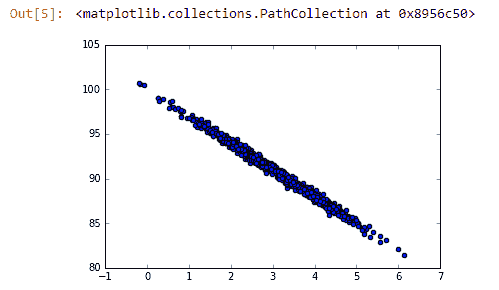
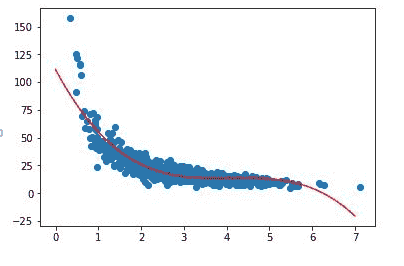
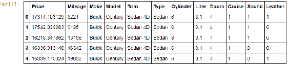
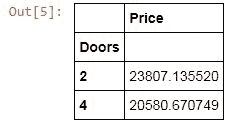

# 四、预测模型

在本章中，我们将研究什么是预测建模，以及预测建模如何使用统计数据来预测现有数据的结果。 我们将介绍真实的示例，以更好地理解这些概念。 我们将了解回归分析的含义，并详细分析其某些形式。 我们还将看一个为我们预测汽车价格的示例。

这些是我们将在本章中介绍的主题：

*   线性回归以及如何在 Python 中实现
*   多项式回归，其应用和实例
*   多元回归以及如何在 Python 中实现
*   我们将构建一个使用 Python 预测汽车价格的示例
*   高阶模型的概念以及有关它们的一些知识

# 线性回归

让我们谈谈回归分析，这是数据科学和统计学中非常流行的主题。 这是关于尝试将曲线或某种函数拟合到一组观察值，然后使用该函数来预测尚未看到的新值的全部方法。 这就是线性回归的全部！

因此，线性回归使一条直线适合一组观测值。 例如，假设我有一堆人，我测量过，这些人的两个特征是他们的体重和身高：


我在`x`轴上显示了重量，在`y`轴上显示了高度，我可以绘制所有这些数据点，例如人们的体重与身高， 我可以说：“嗯，这看起来像是线性关系，不是吗？也许我可以在其中拟合一条直线，然后用它来预测新值”，这就是线性回归的作用。 在本例中，我的斜率为 0.6，`y`截距为 130.2，它们定义了一条直线（直线的等式为`y = mx + b`， 其中，`m`是斜率，`b`是`y`截距）。 给定一个斜率和一个`y`截距，该截距适合我所拥有的最佳数据，我可以使用该线来预测新值。

您可以看到，我观察到的重量仅上升到重 100 公斤的人。 如果有人重 120 公斤怎么办？ 好吧，我可以根据之前的数据，使用那条线找出身高 120 公斤的人的身高在哪里。

我不知道为什么他们称其为回归。 回归意味着您正在向后做某事。 我想您可以想到这一点，因为您正在创建一条线以根据您过去的观察来预测新值，时间倒退，但这似乎有点困难。 老实说，这只是一个令人困惑的术语，并且是一种我们用非常花哨的术语来掩盖我们对非常简单的概念所做的一种方式。 全部就是将一条直线拟合到一组数据点。

# 普通最小二乘法

线性回归如何工作？ 在内部，它使用一种称为普通最小二乘法的技术。 也称为 OLS。 您可能还会看到这个术语。 它的工作方式是尝试使每个点和线之间的平方误差最小化，其中误差只是每个点和线之间的距离。

因此，我们对这些误差的所有平方求和，这听起来很像我们计算方差时的样子，只是除了相对于均值而不是相对于所定义的直线而言。 我们可以测量那条线上的数据点的方差，并且通过最小化方差，我们可以找到最合适的线：


现在，您将不再需要真正地自己动手做，但是如果您出于某些原因必须这样做，或者您只是对幕后发生的事情感到好奇，我现在将为您描述整体算法，以及如何实际计算斜率和`y`-如果需要一天的时间，则很难拦截自己。 其实并不那么复杂。

还记得直线的斜率截距方程吗？ 它是`y = mx + c`。 斜率刚好是两个变量之间的相关性乘以`Y`中的标准差除以`X`中的标准差。 标准差只是自然而然地渗入到数学中似乎有些奇怪，但是请记住，相关性也已纳入标准差，因此不必重新引入该术语也就不足为奇了。

然后可以将截距计算为`Y`的平均值减去斜率乘以`X`的平均值。 再说一次，尽管实际上并不是那么困难，Python 会为您完成所有工作，但要点是，这些并不是要运行的复杂事情。 实际上，它们可以非常有效地完成。

请记住，最小二乘最小化了从每个点到线的平方误差之和。 关于线性回归的另一种思考方式是，您定义一条线，该线代表该处观察线的最大可能性。 也就是说，对于给定的`x`值，`y`值的最大概率。

人们有时将线性回归最大似然估计称为“线性回归最大似然估计”，这只是人们在一个非常简单的名称上冠以幻想的例子，因此，如果您听到有人谈论最大似然估计，那么他们实际上就是在谈论回归。 他们只是想听起来很聪明。 但是现在您也知道该术语，因此您听起来也很聪明。

# 梯度下降技术

进行线性回归的方法不止一种。 我们已经将普通最小二乘法讨论为将一条线拟合到一组数据的一种简单方法，但是还有其他一些技术，梯度下降是其中之一，并且在三维数据中效果最好。 因此，它尝试为您遵循数据的轮廓。 这非常花哨，并且显然在计算上要贵一些，但是如果您要将 Python 与普通最小二乘法进行比较，Python 确实使您可以轻松地进行尝试。

在处理 3D 数据时，使用梯度下降技术可能很有意义。

通常，尽管最小二乘是进行线性回归的完美选择，并且始终是合法的事情，但是如果遇到梯度下降，您将知道这只是线性回归的另一种方法， 通常在高维数据中看到。

# 确定系数或 R 平方

那么我怎么知道我的回归有多好呢？ 我的行适合我的数据的程度如何？ 这就是 R 平方的出现，并且 R 平方也称为确定系数。 同样，有人试图听起来很聪明，可能会这样称呼它，但通常将其称为 R 平方。

这是模型捕获的 Y 总变化的一部分。 那么，您的生产线如何顺应这种变化？ 我们在行的两边是否都得到等量的方差？ 这就是 R 平方的度量。

# 计算 R 平方

要实际计算该值，请取 1 减去平方误差的总和乘以均值的平方变化的总和：


因此，计算并不是很困难，但是 Python 再次会为您提供可以为您计算的函数，因此您不必自己真正进行数学运算。

# 解释 R 平方

对于 R 平方，您将获得一个介于 0 到 1 之间的值。现在 0 表示您的拟合度很糟糕。 它不会捕获数据中的任何差异。 尽管 1 是一个完美的拟合，但数据中的所有方差都被该行捕获，并且在这种情况下，您在行两侧看到的所有方差都应该相同。 所以 0 是不好的，而 1 是好的。 这就是您真正需要知道的。 介于两者之间的事物。 较低的 R 平方值表示拟合度较差，较高的 R 平方值表示拟合度较高。

正如您将在接下来的部分中看到的，进行回归的方法不止一种。 线性回归就是其中之一。 这是一种非常简单的技术，但是也有其他技术，您可以使用 R 平方作为定量度量，以衡量给定回归对一组数据点的良好程度，然后使用它来选择最适合您的数据的模型。

# 使用 Python 计算线性回归和 R 平方

现在让我们玩线性回归，并实际计算一些线性回归和 R 平方。 我们可以从这里创建一些 Python 代码开始，该代码会生成实际上线性相关的*随机*数据。

在此示例中，我将伪造一些有关页面渲染速度和人们购买量的数据，就像前面的示例一样。 我们将在网站加载所需的时间与人们在该网站上花费的金额之间建立线性关系：

```py
%matplotlib inline
import numpy as np
from pylab import *
pageSpeeds = np.random.normal(3.0, 1.0, 1000)
purchaseAmount = 100 - (pageSpeeds + np.random.normal(0, 0.1,
1000)) * 3
scatter(pageSpeeds, purchaseAmount) 

```

我在这里所做的只是随机地进行，页面速度的正态分布以 3 秒为中心，标准差为 1 秒。 我已将购买金额设为该金额的线性函数。 因此，我将其设为 100 减去页面速度，再加上周围的一些正常随机分布乘以 3。如果我们对此进行分散，我们可以看到数据最终看起来像这样：



您可以通过观察看到肯定存在线性关系，这是因为我们确实在源数据中对实际的线性关系进行了硬编码。

现在让我们看看是否可以梳理一下，并使用普通的最小二乘方找到最佳拟合线。 我们讨论了如何进行普通最小二乘法和线性回归，但是您不必自己做任何数学运算，因为 SciPy 包具有可导入的`stats`包：

```py
from scipy import stats

slope, intercept, r_value, p_value, std_err =     
stats.linregress(pageSpeeds, purchaseAmount) 

```

您可以从`scipy`导入`stats`，然后只需在两个特征上调用`stats.linregress()`。 因此，我们有一个页面速度列表（`pageSpeeds`）和一个相应的购买金额列表（`purchaseAmount`）。 `linregress()`函数将带给我们很多东西，包括坡度，截距，这是我定义最佳拟合线所需要的。 它还为我们提供了`r_value`，从中我们可以得到 R 平方来衡量该拟合的质量，以及几件事我们将在以后进行讨论。 现在，我们只需要斜率，截距和`r_value`，所以让我们继续运行它们。 我们将从找到最合适的线性回归开始：

```py
r_value ** 2

```

这是您的输出应如下所示：


现在，我们返回的线的 R 平方值为 0.99，几乎是 1.0。 这意味着我们非常适合，这并不奇怪，因为我们确保这些数据之间存在真实的线性关系。 即使那条线周围有一些变化，我们的线也能捕捉到该变化。 我们在行的两边都有大致相同的方差量，这是一件好事。 它告诉我们，我们确实具有线性关系，并且我们的模型非常适合我们拥有的数据。

让我们画一条线：

```py
import matplotlib.pyplot as plt
def predict(x):
return slope * x + intercept
fitLine = predict(pageSpeeds)
plt.scatter(pageSpeeds, purchaseAmount)
plt.plot(pageSpeeds, fitLine, c='r')
plt.show()

```

以下是上述代码的输出：


这段代码将创建一个函数，以在数据旁边绘制最佳拟合线。 这里还有更多的 Matplotlib 魔术。 我们将创建一个`fitLine`列表，并使用编写的`predict()`函数获取`pageSpeeds`（即`x`-轴），并从那开始创建 Y 函数。 因此，我们将不使用支出金额的观察值，而只是使用`slope`乘以`x`加上从上述`linregress()`调用中获得的`intercept`来找到预测值。 本质上，在这里，我们将像以前一样做一个散点图，以显示原始数据点，即观察值。

然后，我们还将使用通过返回的线方程式创建的`fitLine`在同一`pyplot`实例上调用`plot`，并将它们一起显示。 当我们这样做时，它看起来如下图：


您可以看到我们的产品线实际上非常适合我们的数据！ 它正好位于中间，您需要预测新值的就是此预测函数。 给定以前看不见的新页面速度，我们可以仅使用斜率乘以页面速度加截距来预测花费的金额。 这就是全部，我认为那太好了！

# 线性回归活动

现在该弄脏你的手了。 尝试增加测试数据中的随机变化，看看是否有影响。 请记住，R 平方是对拟合的度量，我们要捕获多少方差，因此方差的数量也是如此……您为什么不看看它是否真的有所作为。

那是线性回归，这是一个非常简单的概念。 我们要做的只是将一条直线拟合到一组观测值，然后我们可以使用该直线对新值进行预测。 这里的所有都是它的。 但是为什么要限制自己呢？ 我们还可以执行其他类型的回归操作，这些操作更为复杂。 接下来，我们将探讨这些。

# 多项式回归

我们已经讨论了线性回归，其中我们将一条直线拟合到一组观测值。 多项式回归是我们的下一个主题，它使用高阶多项式来拟合您的数据。 因此，有时您的数据可能并不适合直线。 这就是多项式回归的地方。

多项式回归是回归的更一般情况。 那么，为什么将自己限制在一条直线上呢？ 也许您的数据实际上没有线性关系，或者可能有某种曲线，对吗？ 这种情况经常发生。

并非所有关系都是线性的，但是线性回归只是我们可以做的一整类回归的一个例子。 如果您还记得我们最终得到的线性回归线的形式为`y = mx + b`，则可以从普通最小二乘法或其他方法的线性回归分析中获得`m`和`b`的值。 现在，这只是一阶或一阶多项式。 阶数或次数是您看到的`x`的幂。 这就是一阶多项式。

现在，如果需要，我们还可以使用二阶多项式，看起来像`y = ax ^ 2 + bx + c`。 如果我们使用二阶多项式进行回归，则将获得`a`，`b`和`c`的值。 或者我们可以做一个`ax ^ 3 + bx ^ 2 + cx + d`形式的三阶多项式。 阶数越高，可以表示的曲线越复杂。 因此，将`x`混合在一起的能力越强，可以获得的形状和关系就越复杂。

但是，获得更多学位并不总是更好。 通常，您的数据中存在某种自然关系，实际上并没有那么复杂，如果您发现自己在拟合数据时投入了很大的精力，那您可能就过拟合了！

当心过拟合！

*   不要使用过多的阶数
*   首先可视化您的数据以查看曲线的真正复杂程度
*   可视化拟合并检查您的曲线是否偏离了正常值
*   高 R 平方仅表示您的曲线非常适合您的训练数据； 它可能是也可能不是很好的预测指标

如果您拥有到处都是的数据并且变化很大，那么您可能会发疯并创建一条线，就像向上和向下一样尝试尽可能地拟合该数据，但实际上并不能代表数据的内在联系。 它在预测新值方面做得不好。

因此，始终仅从可视化数据开始，然后考虑曲线真正需要多么复杂。 现在，您可以使用 R 平方来衡量您的拟合度，但是请记住，这只是在测量该曲线与您的训练数据的拟合度，即您用来实际基于其进行预测的数据。 它不能衡量您准确预测未来的能力。

稍后，我们将讨论称为**训练/测试**的一些防止过拟合的技术，但是现在您只需要仔细研究一下，以确保您不会过拟合并得到一个比您需要的阶数更高的函数。 当我们探索一个示例时，这将更有意义，所以让我们继续。

# 使用 NumPy 实现多项式回归

幸运的是，NumPy 具有`polyfit`函数，可以超级轻松地玩此游戏并尝试不同的结果，所以让我们来看一下。 是时候玩多项式回归了。 顺便说一句，我确实认为这很有趣。 看到所有中学数学实际上都已投入实际应用，真是太酷了。 继续打开`PolynomialRegression.ipynb`，让我们玩得开心。

让我们在页面速度和购买量伪造数据之间创建一个新的关系，这次我们将创建一个更复杂的非线性关系。 我们将采用页面速度，并使其具有购买速度的页面速度除法功能：

```py
%matplotlib inline
from pylab import *
np.random.seed(2)
pageSpeeds = np.random.normal(3.0, 1.0, 1000)
purchaseAmount = np.random.normal(50.0, 10.0, 1000) / pageSpeeds
scatter(pageSpeeds, purchaseAmount)

```

如果我们做一个散点图，我们将得到以下结果：


顺便说一句，如果您想知道`np.random.seed`行的作用，它将创建一个随机种子值，这意味着当我们执行后续的随机操作时，它们将是确定性的。 通过这样做，我们可以确保每次运行这段代码时，都得到相同的精确结果。 稍后这将很重要，因为我建议您回来并实际尝试对该数据进行不同的拟合以比较您获得的拟合。 因此，以相同的初始点集开始很重要。

您会发现这并不是真正的线性关系。 我们可以尝试在其上拟合一条线，这样对于很多数据来说都可以，可能在图形的右侧向下，而在左侧则不然。 我们确实有更多的指数曲线。

现在，恰好 NumPy 具有`polyfit()`函数，该函数可让您将所需的任意多项式拟合到该数据。 因此，例如，我们可以说`x`-轴是我们拥有的页面速度（`pageSpeeds`）的数组，而我们的`y`-轴是我们的购买金额（`purchaseAmount`）的数组。 然后，我们可以仅调用`np.polyfit(x, y, 4)`，这意味着我们希望对该数据进行四次多项式拟合。

```py
x = np.array(pageSpeeds)
y = np.array(purchaseAmount)
p4 = np.poly1d(np.polyfit(x, y, 4))

```

让我们继续运行它。 它运行很快，我们可以对其进行绘制。 因此，我们将在此处创建一个小图，以绘制原始点与预测点的散布图。

```py
import matplotlib.pyplot as plt

xp = np.linspace(0, 7, 100)
plt.scatter(x, y)
plt.plot(xp, p4(xp), c='r')
plt.show()

```

输出如下图所示：


在这一点上，看起来很合适。 但是，您想问自己：“我是否过拟合？我的曲线看起来是否真的超出了容纳异常值的范围？” 我发现那并不是真的。 我真的没有看到很多疯狂的事情发生。

如果我有一个非常高阶的多项式，它可能会在顶部向上捕捉以捕获那个离群值，然后向下扫描以捕捉在那里的离群值，并在我们有很多密度的地方变得更稳定，然后它可能会遍历整个地方，以尝试适应最后的最后一组离群值。 如果您看到这样的废话，就知道多项式中的阶数过多，阶数过多，您应该将其降低，因为尽管它适合您所观察到的数据，但对预测您尚未看到的数据没有用。

想象一下，我有一条曲线突然向上弯曲，然后再次向下弯曲以适应异常值。 我对介于两者之间的内容的预测将不准确。 曲线确实应该在中间。 在本书的后面，我们将讨论检测这种过拟合的主要方法，但是现在，请观察它并知道我们以后会更深入。

# 计算 R 平方误差

现在我们可以测量 R 平方误差了。 通过取`sklearn.metrics`中具有的`r2_score()`函数中的`y`和预测值（`p4(x)`），我们可以计算出该值。

```py
from sklearn.metrics import r2_score
r2 = r2_score(y, p4(x))

print r2

```

输出如下：


我们的代码仅用一行代码即可将一组观察值与一组预测值进行比较，并为您计算 R 平方！ 为此，我们的 R 平方为 0.829，还不错。 记住，零是坏的，一是好。 0.82 非常接近一个，不是完美的，而且从直觉上讲，这是有道理的。 您可以看到我们的行在数据的中间部分非常好，但是在最左边的位置不太好，在最右边的位置不太好。 因此，0.82 听起来不错。

# 多项式回归的活动

我建议您开始研究这些东西。 尝试多项式的不同阶数。 返回到我们运行`polyfit()`函数的位置，然后尝试除 4 之外的其他值。您可以使用 1，然后返回线性回归，也可以尝试使用诸如 8 之类的非常高的数值，也许您会开始看到过拟合。 所以看看有什么效果。 您将要更改它。 例如，让我们转到三次多项式。

```py
x = np.array(pageSpeeds)
y = np.array(purchaseAmount)

p4 = np.poly1d(np.polyfit(x, y, 3))  

```

只需不断点击运行即可完成每个步骤，您可以看到它的效果是...



我们的三次多项式绝对不如第四次多项式拟合。 如果您实际测量 R 平方误差，则从数量上看，它实际上会变得更糟。 但是如果我过高，您可能会开始觉得过拟合。 因此，您可以从中获得一些乐趣，尝试不同的值，并了解多项式的不同阶数对回归的影响。 去弄脏你的手，尝试学习一些东西。

这就是多项式回归。 同样，您需要确保对问题的重视程度不超过所需。 仅使用正确的量来查找看起来像对数据的直观拟合。 太多会导致过拟合，而太多会导致拟合不佳...因此，您现在可以同时使用眼球和 R 平方度量，以找出适合数据的度数。 让我们继续。

# 多元回归和预测汽车价格

如果我们试图基于其他多个属性来预测某个值，那么会发生什么呢？ 可以说，人的身高不仅取决于他们的体重，还取决于他们的遗传或其他一些可能会影响其体重的因素。 嗯，这就是多元分析的用处。您实际上可以构建一次考虑多个因素的回归模型。 使用 Python 实际上非常容易。

让我们谈谈多元回归，它有点复杂。 多元回归的想法是这样的：如果有多个因素影响您要预测的事物怎么办？

在前面的示例中，我们研究了线性回归。 例如，我们谈到了根据体重来预测人们的身高。 我们认为重量是影响身高的唯一因素，但也许还有其他因素。 我们还研究了页面速度对购买金额的影响。 也许影响购买量的不仅仅是页面速度，我们还想找到这些不同因素如何结合在一起来影响该值。 这就是多元回归的地方。

我们现在来看的示例如下。 假设您正在尝试预测汽车的销售价格。 它可能基于该车的许多不同特征，例如车身样式，品牌，行驶里程； 谁知道，甚至关于轮胎的质量。 在预测汽车价格时，其中一些特征将比其他特征更重要，但您希望同时考虑所有这些特征。

因此，我们此处的前进方向仍将是使用最小二乘法来将模型拟合到您的观察结果集。 所不同的是，对于您拥有的每个不同特征，我们都会有很多系数。

因此，例如，我们最终得到的价格模型可能是 alpha 的线性关系，一些常数（类似于您的 y 截距），一些里程系数，一些年龄系数以及一些它有多少扇门的系数：


一旦通过最小二乘法分析得出了这些系数，我们就可以使用该信息找出这些特征对我的模型有多重要。 因此，如果最终得出的门数之类的系数很小，则意味着门数并不那么重要，也许我应该将其从模型中完全删除以使其更简单。

在本书中，我确实应该经常说这句话。 您总是想做数据科学中最简单的事情。 不要使事情复杂化，因为通常最简单的模型才是最好的。 如果您找到的只是适当数量的复杂性，而没有更多，那通常就是正确的模型。 无论如何，这些系数实际上为您提供了一种方法，“嘿，其中某些事情比其他事情更重要。也许我可以放弃其中的一些因素。”

现在我们仍然可以使用 R 平方通过多元回归来衡量拟合的质量。 它以相同的方式工作，尽管在进行多元回归时您需要假设的一件事是因素本身并不相互依赖...而且并非总是如此。 因此，有时您需要在脑后留些小警告。 例如，在这个模型中，我们将假设汽车的行驶里程和寿命无关。 但实际上，它们可能紧密相关！ 这是该技术的局限性，可能根本无法捕获效果。

# 使用 Python 的多元回归

幸运的是，有一个`statsmodel`包可用于 Python，使进行多元回归非常容易。 让我们来看看它是如何工作的。 让我们使用 Python 进行一些多元回归。 我们将在这里使用一些有关凯利蓝皮书中汽车价值的真实数据。

```py
import pandas as pd
df = pd.read_excel('http://cdn.sundog-soft.com/Udemy/DataScience/cars.xls')

```

我们将在此处引入一个名为`pandas`的新包，它使我们能够非常轻松地处理表格数据。 它使我们能够读入数据表，并对它们进行重新排列，修改，切分并以不同的方式切成小方块。 我们将大量使用。

我们将`pandas`导入为`pd`，并且`pd`具有`read_Excel()`函数，我们可以使用该函数继续通过 HTTP 从 Web 读取 Microsoft Excel 电子表格。 因此，那里的 Pandas 功能相当强大。

我已经开始在自己的域上为您托管该文件，如果我们运行该文件，它将把它加载到我们称为`df`的`DataFrame`对象中。 现在，我可以在此`DataFrame`上调用`head()`以显示它的前几行：

```py
df.head()

```

以下是上述代码的输出：



实际的数据集要大得多。 这只是前几个示例。 因此，这是里程，品牌，型号，内饰，类型，门，巡航，声音和皮革的真实数据。

好的，现在我们将使用`pandas`将其拆分为我们关注的功能。 我们将创建一个模型，该模型试图仅根据里程数，模型和门的数量来预测价格，而仅此而已。

```py
import statsmodels.api as sm

df['Model_ord'] = pd.Categorical(df.Model).codes
X = df[['Mileage', 'Model_ord', 'Doors']]
y = df[['Price']]

X1 = sm.add_constant(X)
est = sm.OLS(y, X1).fit()

est.summary() 

```

现在，我遇到的问题是该模型是文本，例如 Century for Buick，并且您还记得，当我进行这种分析时，所有内容都必须是数字。 在代码中，我使用`pandas`中的`Categorical() function`实际将它在`DataFrame`中看到的一组模型名称转换为一组数字； 即一组代码。 我要说的是，此模型在 x 轴上的输入是里程（`Mileage`），模型转换为序数（`Model_ord`）和门数（`Doors`）。 我要在 y 轴上预测的是价格（`Price`）。

代码的后两行仅创建一个我称为`est`的模型，该模型使用普通的最小二乘 OLS，并使用我提供的列`Mileage`，`Model_ord`和`Doors`来拟合该模型 。 然后，我可以使用摘要调用来打印出模型的外观：


您可以在此处看到 R 平方非常低。 模型的确不是很好，但是我们可以洞悉各种误差是什么，有趣的是，最低标准误差与行驶里程有关。

现在，我之前已经说过，系数是一种确定哪些项目重要的方法，尽管输入数据已标准化，但这是正确的。 也就是说，如果一切都在 0 到 1 的范围内。如果不是，则这些系数可以补偿所看到的数据的规模。 在这种情况下，如果您不处理规范化数据，则查看标准错误会更有用。 在这种情况下，我们可以看到里程数实际上是该特定模型的最大因素。 我们能早点弄清楚吗？ 好吧，我们可以做一点切片和切块，以找出门的数量实际上根本不会影响价格。 让我们运行以下几行：

```py
y.groupby(df.Doors).mean()

```

那里有一些`pandas`语法。 只需一行代码即可在 Python 中完成，这非常酷！ 这将打印出一个新的`DataFrame`，其中显示了给定门数的平均价格：



我可以看到，平均而言，两门车的售价实际上要高于四门车的售价。 如果有的话，门的数量与价格之间存在负相关，这有点令人惊讶。 不过，这是一个很小的数据集，因此我们当然无法从中读到很多含义。

# 多元回归活动

作为一项活动，请在所需的地方弄乱伪造的输入数据。 您可以下载数据并与电子表格混淆。 从本地硬盘驱动器而不是 HTTP 读取它，并查看可以有哪些区别。 也许您可以构造具有不同行为并具有适合它的更好模型的数据集。 也许您可以对特征进行更明智的选择，以基于模型。 因此，请随意解决，让我们继续。

在那里，您将拥有：多元分析及其运行示例。 与我们探讨的多元分析概念同样重要的是我们在该 Python 笔记本中所做的一些工作。 因此，您可能想回到那里，仔细研究正在发生的事情。

我们介绍了 Pandas 以及使用 Pandas 和`DataFrame`对象的方法。 Pandas 是一个非常强大的工具。 我们将在以后的部分中更多地使用它，但是请确保您开始注意到这些事情，因为这些将成为 Python 技能中管理大量数据和组织数据的重要技术。

# 多层次模型

现在谈论多层次模型是有意义的。 这绝对是一个高级主题，在这里我将不做很多详细介绍。 我现在的目标是向您介绍多级模型的概念，并让您了解一些挑战以及将它们组合在一起时如何考虑它们。 而已。

多级模型的概念是，某些影响会在层次结构的各个级别上发生。 例如，您的健康状况。 您的健康状况可能取决于单个细胞的健康状况，而这些细胞可能取决于其内部器官的健康状况，而器官的健康状况可能取决于您整体的健康状况。 您的健康状况可能部分取决于家庭的健康状况以及家庭所提供的环境。 而您家庭的健康状况又可能取决于您所居住城市的某些因素，那里有多少犯罪，那里有多少压力，那里有多少污染。 甚至除此之外，它还可能取决于我们所生活的整个世界的因素。也许仅仅是世界医疗技术的状态才是因素，对吧？

另一个例子：您的财富。 你赚多少钱？ 好吧，这是您个人辛勤工作的一个因素，但这也是您父母所做的工作的一个因素，他们有多少钱可以投资到您的教育和成长环境中，你的祖父母又如何？ 他们能够创造什么样的环境以及他们能为您的父母提供什么样的教育，这反过来又影响了他们可用于您自己的教育和养育的资源。

这些都是多级模型的示例，其中存在一个层次结构，这些层次结构在越来越大的范围内相互影响。 现在，多层次模型的挑战是试图弄清楚：“那么，如何对这些相互依赖性进行建模？如何对所有这些不同的影响进行建模，以及它们如何相互影响？”

这里的挑战是要确定每个级别中实际上影响您要预测的事物的因素。 例如，如果我要预测 SAT 总成绩，我知道这部分取决于参加考试的孩子，但是对孩子重要的是什么？ 好吧，这可能是遗传因素，可能是它们的个体健康，所拥有的个体大脑大小。 您可以想到影响个人的许多因素，这些因素可能会影响他们的 SAT 分数。 然后再上一层，看看他们的家庭环境，看看他们的家庭。 他们的家庭有什么可能影响他们的 SAT 成绩？ 他们能提供多少教育？ 父母是否真的可以在 SAT 主题上辅导孩子？ 这些都是第二级上可能很重要的因素。 那他们的邻居呢？ 社区的犯罪率可能很重要。 他们为青少年提供的设施，使他们远离街道，诸如此类。

关键是您希望继续关注这些较高的层次，但是要在每个层次上确定影响您要预测的事物的因素。 我可以不断提高他们学校教师的素质，学区的经费以及州一级的教育政策。 您会看到在不同级别上存在着各种因素，所有这些因素都在您试图预测的事情中起作用，其中某些因素可能存在于多个级别上。 例如，犯罪率存在于地方和州一级。 在进行多级建模时，您需要弄清楚它们之间如何相互作用。

可以想象，这变得非常困难，并且很快变得非常复杂。 这确实超出了本书或数据科学入门书籍的范围。 这是很难的东西。 有很多关于它的厚书，您可以做一本关于它的非常高级的主题的完整书。

那么，为什么我什至提到多层次模型呢？ 这是因为在某些情况下，我已经在职务说明中看到了它，这是他们希望您在一些情况下了解的事情。 我从来没有在实践中使用过它，但是我认为从获得数据科学职业的角度来看，重要的是至少要熟悉该概念，并且知道它的含义，以及在创建多层次模型中所涉及的一些挑战。 希望我已经为您提供了这些概念。 这样，我们可以继续进行下一部分。

那里有多层模型的概念。 这是一个非常高级的主题，但是至少您需要了解概念是什么，并且概念本身非常简单。 当您尝试做出预测时，您只是在不同层次，不同层次上查看效果。 因此，也许会有不同层次的效果相互影响，而这些不同层次的因素也可能相互关联。 多级建模试图考虑所有这些不同的层次结构和因素，以及它们之间如何相互作用。 放心，这就是您现在需要知道的全部。

# 总结

在本章中，我们讨论了回归分析，它试图将曲线拟合到一组训练数据，然后使用它来预测新值。 我们看到了它的不同形式。 我们研究了线性回归的概念及其在 Python 中的实现。

我们了解了什么是多项式回归，即使用更高阶的多项式为多维数据创建更好的复杂曲线。 我们还看到了它在 Python 中的实现。

然后，我们讨论了多元回归，它稍微复杂一些。 我们看到了当有多个因素影响我们预测的数据时如何使用它。 我们看了一个有趣的示例，该示例使用 Python 和一个非常强大的工具 Pandas 预测了汽车的价格。

最后，我们研究了多层次模型的概念。 我们了解了一些挑战，以及将它们放在一起时的思考方式。 在下一章中，我们将学习一些使用 Python 的机器学习技术。