# 第 2 章推理​​统计

在了解推理统计信息之前，让我们看一下描述性统计信息是关于什么的。

**描述性统计信息**是提供给数据分析的术语，它以有意义的方式汇总数据，从而从中得出模式。 这是描述数据的一种简单方法，但是它无助于我们就所做出的假设得出结论。 假设您已经收集了生活在香港的 1,000 个人的身高。 他们的平均身高是描述性统计数字，但他们的平均身高并不表示这是整个香港的平均身高。 在这里，推论统计将帮助我们确定整个香港的平均身高，这将在本章中详细介绍。

推论统计是关于用有限的数据集描述更大范围的分析并从中得出结论的全部内容。

在本章中，我们将介绍以下主题：

*   不同种类的分布
*   可用于检验假设的不同统计检验
*   如何根据给定的数据推断样本的总体
*   假设检验期间可能发生的各种错误
*   定义总体均值所在的置信区间
*   p 值的重要性及其如何用于解释结果

# 各种发行形式

有多种概率分布，每种分布都显示了随机实验中不同结果的概率。 在本节中，我们将探讨各种概率分布。

## 正态分布

正态分布是统计中最常见且使用最广泛的分布。 在数学家 Karl Friedrich Gauss 之后，它也被称为“钟形曲线”和“高斯曲线”。 正态分布通常在自然界中发生。 让我们以前面看到的高度示例为例。 如果您拥有香港城市中特定性别的所有人的身高数据，并绘制了条形图，其中每个条形图代表该特定身高的人数，则所获得的曲线将看起来与 下图。 图中的数字是相对于平均值的标准偏差数，即零。 在本章中，这一概念将变得更加清晰。

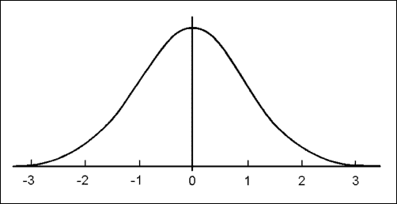

另外，如果您拿着沙漏并观察沙漏倒转时沙子堆积的方式，则沙漏会形成正态分布。 这是一个很好的例子，显示了自然中正态分布的存在方式。


请看下图：它显示了三个具有正态分布的曲线。 曲线 **A** 的标准偏差为 1，曲线 **C** 的标准偏差为 2，曲线 **B** 的标准偏差为 3，这意味着 曲线 **B** 的值分布最大，而曲线 **A** 的值分布最小。 另一种看待它的方法是，如果曲线 **B** 代表一个国家的高度，那么这个国家的许多人具有高度的不同，而曲线**的国家** 发行版的身高彼此相似。


### 来自二项式分布的正态分布

让我们拿一个硬币并将其翻转。 出现头或尾的概率为 50％。 如果您使用同一枚硬币并将其翻转六次，则可以使用以下公式计算获得三倍正面的概率：

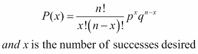

在上式中， *n* 是硬币被抛掷的次数， *p* 是成功的概率， *q* 为（ *1– p* ），这是失败的可能性。

Python 的 SciPy 软件包提供了有用的功能来执行统计计算。 您可以从[这个页面](http://www.scipy.org/)安装。 以下命令有助于绘制二项式分布：

```py
>>> from scipy.stats import binom
>>> import matplotlib.pyplot as plt

>>> fig, ax = plt.subplots(1, 1)
>>> x = [0, 1, 2, 3, 4, 5, 6]
>>> n, p = 6, 0.5
>>> rv = binom(n, p)
>>> ax.vlines(x, 0, rv.pmf(x), colors='k', linestyles='-', lw=1,
 label='Probablity')

>>> ax.legend(loc='best', frameon=False)
>>> plt.show()

```

SciPy 软件包中的`binom`函数有助于生成二项式分布以及与之相关的必要统计信息。 如果您观察到上述命令，则其中的某些部分来自 matplotlib，我们现在将使用它们来绘制二项分布。 稍后的章节将详细介绍 matplotlib 库。 `plt.subplots`功能有助于在屏幕上生成多个图。 `binom`功能接受尝试的次数和成功的可能性。 `ax.vlines`函数用于绘制垂直线，其中的`rv.pmf`帮助计算各种`x`值时的概率。 `ax.legend`功能为图形添加了图例，最后`plt.show`显示了图形。 结果如下：

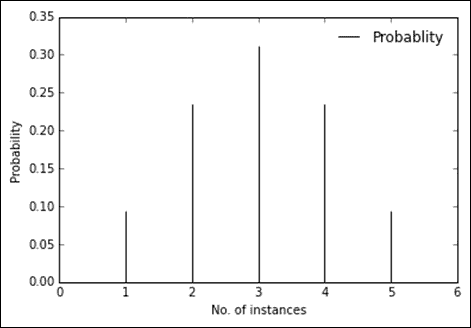

从图中可以看到，如果硬币被抛掷六次，则获得三个正面的概率最大，而获得一个正面或五个正面的概率最小。

现在，让我们增加尝试次数并查看分布：

```py
>>> fig, ax = plt.subplots(1, 1)
>>> x = range(101)
>>> n, p = 100, 0.5
>>> rv = binom(n, p)
>>> ax.vlines(x, 0, rv.pmf(x), colors='k', linestyles='-', lw=1,
 label='Probablity')

>>> ax.legend(loc='best', frameon=False)
>>> plt.show()

```

在这里，我们尝试将硬币翻转 100 次并查看分布：


当成功概率更改为`0.4`时，您将看到：

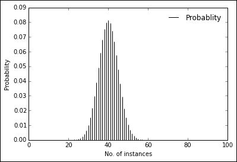

当概率为`0.6`时，您会看到以下：


当您以`0.5`概率将硬币翻转 1000 次时：


如您所见，二项式分布已开始类似于正态分布。

## 泊松分布

泊松分布是间隔中独立间隔出现的概率分布。 二项式分布用于确定二进制出现的概率，而泊松分布用于基于计数的分布。 如果 lambda 是每个时间间隔内事件的平均发生率，则在给定的时间间隔内发生 *k* 的可能性由以下公式给出：


在此， *e* 是欧拉数， *k* 是要确定概率的出现次数，λ是平均出现次数。

让我们通过一个例子来理解这一点。 一小时内通过桥梁的汽车数量为 20。一小时内有 23 辆汽车通过桥梁的概率是多少？

为此，我们将使用 SciPy 的泊松函数：

```py
>>> from scipy.stats import poisson
>>> rv = poisson(20)
>>> rv.pmf(23)

0.066881473662401172

```

使用泊松函数，我们定义了平均值，即 20 辆汽车。 `rv.pmf`函数给出 23 辆车通过桥的可能性，大约为 6％。

## 伯努利发行

您可以执行具有两个可能结果的实验​​：成功或失败。 成功的概率为 *p* ，失败的概率为 *1-p* 。 在成功的情况下取`1`值，在失败的情况下取`0`值的随机变量称为伯努利分布。 概率分布函数可以写成：


也可以这样写：


分布函数可以这样写：

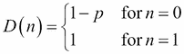

下图显示了伯努利分布：


在选举中投票是伯努利分配的一个很好的例子。

可以使用 SciPy 包的`bernoulli.rvs()`函数生成 Bernoulli 分布。 以下函数生成概率为 0.7 的伯努利分布：

```py
>>> from scipy import stats
>>> stats.bernoulli.rvs(0.7, size=100)
array([1, 1, 1, 1, 1, 0, 0, 1, 1, 0, 1, 1, 1, 0, 1, 1, 1, 1, 1, 1, 1, 1, 0,
 1, 1, 1, 0, 1, 1, 0, 1, 0, 0, 1, 0, 0, 1, 0, 1, 0, 1, 1, 1, 1, 1, 0,
 1, 1, 1, 1, 1, 0, 0, 1, 1, 1, 0, 1, 0, 1, 0, 0, 0, 0, 0, 1, 0, 0, 0,
 1, 1, 1, 0, 1, 0, 1, 1, 1, 1, 1, 1, 0, 0, 1, 1, 1, 0, 0, 0, 1, 1, 1,
 1, 0, 1, 1, 1, 0, 1, 1])])

```

如果前面的输出是候选人的票数，则候选人拥有 70％的票数。

# Z 得分

用简单的术语表示，z 分数是一个得分，表示相对于平均值的标准偏差的分布值。 让我们看一下计算 z 得分的以下公式：


在此， *X* 是分布中的值， *µ* 是分布的平均值，*σ*是分布的标准偏差

让我们尝试从学校教室的角度来理解这个概念。

一间教室有 60 名学生，他们刚刚获得数学考试成绩。 我们使用以下命令以正态分布模拟这 60 名学生的分数：

```py
>>> classscore
>>> classscore = np.random.normal(50, 10, 60).round()

[ 56\.  52\.  60\.  65\.  39\.  49\.  41\.  51\.  48\.  52\.  47\.  41\.  60\.  54\.  41.
 46\.  37\.  50\.  50\.  55\.  47\.  53\.  38\.  42\.  42\.  57\.  40\.  45\.  35\.  39.
 67\.  56\.  35\.  45\.  47\.  52\.  48\.  53\.  53\.  50\.  61\.  60\.  57\.  53\.  56.
 68\.  43\.  35\.  45\.  42\.  33\.  43\.  49\.  54\.  45\.  54\.  48\.  55\.  56\.  30.]

```

NumPy 程序包具有一个具有正态函数的随机模块，其中 50 是分布的平均值，10 是分布的标准偏差，60 是要生成的值的数量。 您可以使用以下命令绘制正态分布：

```py
>>> plt.hist(classscore, 30, normed=True) #Number of breaks is 30
>>> plt.show()

```

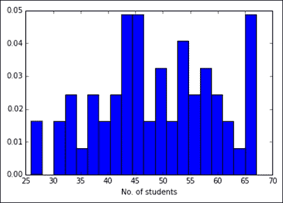

可以使用以下功能将每个学生的分数转换为 z 分数：

```py
>>> stats.zscore(classscore)

[ 0.86008868  0.38555699  1.33462036  1.92778497 -1.15667098  0.02965823
 -0.91940514  0.26692407 -0.08897469  0.38555699 -0.20760761 -0.91940514
 1.33462036  0.62282284 -0.91940514 -0.32624053 -1.39393683  0.14829115
 0.14829115  0.74145576 -0.20760761  0.50418992 -1.2753039  -0.80077222
 -0.80077222  0.9787216  -1.03803806 -0.44487345 -1.63120267 -1.15667098
 2.16505081  0.86008868 -1.63120267 -0.44487345 -0.20760761  0.38555699
 -0.08897469  0.50418992  0.50418992  0.14829115  1.45325329  1.33462036
 0.9787216   0.50418992  0.86008868  2.28368373 -0.6821393  -1.63120267
 -0.44487345 -0.80077222 -1.86846851 -0.6821393   0.02965823  0.62282284
 -0.44487345  0.62282284 -0.08897469  0.74145576  0.86008868 -2.22436727]

```

因此，分数为 60（满分 100）的学生的 z 得分为 1.334。 为了更了解 z 得分，我们将使用标准的普通表。

该表有助于确定得分的可能性。

我们想知道得分高于 60 的概率是多少。


标准正态表可以帮助我们确定出现分数的可能性，但是我们不必执行繁琐的任务来查看表并找到概率来寻找值。 `cdf`函数使此任务变得简单，该函数是累积分布函数：

```py
>>> prob = 1 - stats.norm.cdf(1.334)
>>> prob

0.091101928265359899

```

`cdf`函数给出了将值提高到`1.334`的 z 分数的可能性，而减一则将给我们获得 z 分数（在其之上）的概率。 换句话说，0.09 是获得高于 60 的分数的概率。

我们再问一个问题：“有多少学生进入了班级前 20％？”

在这里，我们必须向后进行操作，以确定高于该水平的所有学生都位于班级前 20％的分数：

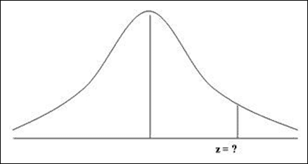

现在，要获得得分最高的 20％的 z 分数，我们可以在 SciPy 中使用`ppf`函数：

```py
>>> stats.norm.ppf(0.80)

0.8416212335729143

```

用于确定前 20％标记是否位于 0.84 的先前输出的 z 得分如下：

```py
>>> (0.84 * classscore.std()) + classscore.mean()

55.942594176524267

```

我们将 z 分数与标准偏差相乘，然后将结果与分布的平均值相加。 这有助于将 z 分数转换为分布中的值。 `55.83`分数表示分数超过该分数的学生位于分布的前 20％。

z 分数是统计学中必不可少的概念，已被广泛使用。 现在您可以理解，它基本上用于标准化任何分布，以便可以对其进行比较或从中推论得出。

# 一个 p 值

p 值是当假设被证明是正确的时，否定原假设的概率。 零假设是一种陈述，说两种度量之间没有区别。 如果假设每天学习 4 个小时的人的得分超过 100 分，则得分超过 90 分。这里的无效假设是，上课的小时数与得分得分之间没有关系。

如果 p 值等于或小于显着性水平（*α*），则原假设是不一致的，需要将其拒绝。


让我们以一个示例为例，来了解一下的概念：**零假设**是学生在数学上获得 68 分的普遍现象。

让我们将显着性水平定义为 5％。 如果 p 值小于 5％，则原假设被拒绝，在数学中得分 68 分并不常见。

让我们获得 68 分的 z 分数：

```py
>>> zscore = ( 68 - classscore.mean() ) / classscore.std()
>>> zscore
2.283

```

现在，让我们获得价值：

```py
>>> prob = 1 - stats.norm.cdf(zscore)
>>> prob
0.032835182628040638

```

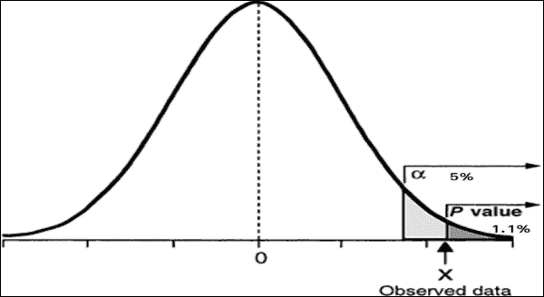

因此，您可以看到 p 值为 3.2％，低于显着性水平。 这意味着无效的假设可以被拒绝，并且可以说在数学上获得 68 分并不常见。

# 一尾和二尾测试

上一节中的示例是一个单尾检验的实例，其中零假设基于正态分布的一个方向被拒绝或接受。

在双尾检验中，原假设的两个尾部都用于检验假设。


在双尾检验中，当使用 5％的显着性水平时，则在两个方向上均等分布，即，在一个方向上为 2.5％，在另一个方向上为 2.5％。

让我们通过一个例子来理解这一点。 国家一级的数学考试平均成绩为 60 分，标准差为 3 分。

一个类别的平均分数是 53。零假设是该类别的平均分数类似于全国的平均值。 让我们首先通过得出 z 得分 60 来检验这个假设：

```py
>>> zscore = ( 53 - 60 ) / 3.0
>>> zscore
-2.3333333333333335

```

p 值为：

```py
>>> prob = stats.norm.cdf(zscore)
>>> prob

0.0098153286286453336

```

因此，p 值为 0.98％。 原假设将被拒绝，并且在钟形曲线的任一方向上，p 值均应小于 2.5％。 由于 p 值小于 2.5％，因此我们可以拒绝原假设，并明确声明该类别的平均成绩与全国平均水平显着不同。

# 类型 1 和类型 2 错误

类型 1 错误是一种错误类型，当空假设实际上为真时，它被拒绝。 这种错误也称为第一类错误，等同于误报。


让我们通过一个例子来理解这个概念。 正在开发一种新药，需要对其是否有效抵抗疾病进行测试。 零假设是它在对抗疾病方面无效。

显着性水平保持在 5％，以便可以在 95％的时间自信地接受原假设。 但是，在 5％的情况下，尽管必须接受该假设，但我们仍会接受该假设的拒绝，这意味着即使该药物无效，也被认为是有效的。

通过控制显着性水平（即 alpha）来控制类型 1 错误。 Alpha 是发生 1 类错误的最高概率。 Alpha 值越低，Type 1 错误就越小。

类型 2 错误是类型的错误，当我们不拒绝错误的原假设时发生。 此错误也称为第二种错误，等效于假阴性。

当药物被认为无效但实际上有效时，这种错误会在药物场景中发生。

这些错误可以一次控制一次。 如果其中一个错误降低，则另一个错误增加。 这取决于用例和分析试图解决的问题陈述，并且取决于它，应减少适当的错误。 在这种药物情况下，通常应降低 1 型错误，因为最好是放出确信有效的药物。

# 置信区间

置信度间隔是一种填充参数的间隔统计信息。 置信区间有助于确定可定义总体平均值的区间。


让我们尝试通过一个例子来理解这个概念。 让我们以肯尼亚每个男人的身高为标准，并以 95％的置信区间确定全国范围内肯尼亚男人的平均身高。

让我们以 50 个人为例，其身高以厘米为单位：

```py
>>> height_data = np.array([ 186.0, 180.0, 195.0, 189.0, 191.0, 177.0, 161.0, 177.0, 192.0, 182.0, 185.0, 192.0,
 173.0, 172.0, 191.0, 184.0, 193.0, 182.0, 190.0, 185.0, 181.0, 188.0, 179.0, 188.0,
 170.0, 179.0, 180.0, 189.0, 188.0, 185.0, 170.0, 197.0, 187.0, 182.0, 173.0, 179.0,
 184.0, 177.0, 190.0, 174.0, 203.0, 206.0, 173.0, 169.0, 178.0, 201.0, 198.0, 166.0,
 171.0, 180.0])

```

绘制分布，它具有正态分布：

```py
>>> plt.hist(height_data, 30, normed=True)
>>> plt.show()

```

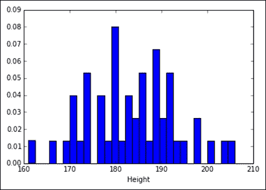

分布的平均值如下：

```py
>>> height_data.mean()

183.24000000000001

```

因此，一个人的平均身高为 183.4 厘米。

为了确定置信区间，我们现在将定义平均值的标准误差。

平均值的标准误是样本平均值与总体平均值的偏差。 使用以下公式定义它：


在此， *s* 是样品的标准偏差， *n* 是样品的元素数。

可以使用 SciPy 包的`sem()`函数来计算：

```py
>>> stats.sem(height_data)

1.3787187190005252

```

因此，平均值的标准误为 1.38 厘米。 置信区间的上下限可以使​​用以下公式确定：

*上限/下限=平均值（高度）+ /-sigma * SEmean（x）*

对于下限：

*183.24 +（1.96 * 1.38）= 185.94*

对于上限：

*183.24-（1.96 * 1.38）= 180.53*

1.96 标准偏差覆盖正态分布中 95％的面积。

我们可以自信地说，人口平均值在 180.53 厘米至 185.94 厘米之间。

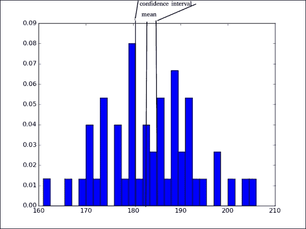

假设我们抽取了 50 个人的样本，记录了他们的身高，然后重复此过程 30 次。 然后，我们可以绘制每个样本的平均值并观察分布。


模拟上图的命令如下：

```py
>>> average_height = []
>>> for i in xrange(30):
>>>    sample50 = np.random.normal(183, 10, 50).round()
>>>    average_height.append(sample50.mean())

>>> plt.hist(average_height, 20, normed=True)
>>> plt.show()

```

您可以观察到，当我们模拟 50 个样本人的平均身高（取 30 倍）时，平均值在 180 至 187 cm 之间。

让我们看看当我们对 1000 名男性进行采样并重复 30 次时会发生什么：

```py
>>> average_height = []
>>> for i in xrange(30):
>>>    sample1000 = np.random.normal(183, 10, 1000).round()
>>>    average_height.append(sample1000.mean())

>>> plt.hist(average_height, 10, normed=True)
>>> plt.show()

```


如您所见，高度从 182.4 厘米到 183.4 厘米不等。 这是什么意思？

这意味着随着样本量的增加，平均值的标准误差减小，这也意味着置信区间变窄，并且我们可以确定地确定总体平均值所依据的区间。

# 相关

在统计中，相关性定义两个随机变量之间的相似性。 最常用的相关是皮尔森相关，它的定义如下：


前面的公式将皮尔逊相关性定义为 *X* 和 *Y* 之间的协方差，除以 *X* 和 *Y* 的标准偏差。 ，或者也可以将其定义为随机变量相对于均值的差值之和的期望均值除以 X 和 Y 的标准偏差。让我们以一个示例来理解。 让我们看一下各种汽车的行驶里程和马力，看看两者之间是否有关系。 这可以使用 SciPy 包中的`pearsonr`函数来实现：

```py
>>> mpg = [21.0, 21.0, 22.8, 21.4, 18.7, 18.1, 14.3, 24.4, 22.8, 19.2, 17.8, 16.4, 17.3, 15.2, 10.4, 10.4, 14.7, 32.4, 30.4,
 33.9, 21.5, 15.5, 15.2, 13.3, 19.2, 27.3, 26.0, 30.4, 15.8, 19.7, 15.0, 21.4]
>>> hp = [110, 110, 93, 110, 175, 105, 245, 62, 95, 123, 123, 180, 180, 180, 205, 215, 230, 66, 52, 65, 97, 150, 150, 245,
 175, 66, 91, 113, 264, 175, 335, 109]

>>> stats.pearsonr(mpg,hp)

(-0.77616837182658638, 1.7878352541210661e-07)

```

输出的第一个值给出马力和里程之间的相关性，第二个值给出 p 值。

因此，第一个值告诉我们它是高度负相关的，而 p 值告诉我们它们之间存在显着的相关性：

```py
>>> plt.scatter(mpg, hp)
>>> plt.show()

```


从图中可以看出，随着 mpg 的增加，马力降低。

让我们看一下另一个名为 Spearman 相关性的相关性。 Spearman 相关性适用于值的排名顺序，因此提供了两个分布之间的单调关系。 对于顺序数据（具有顺序的数据，例如电影评分或班级成绩）很有用，并且不受异常值的影响。

让我们获得每加仑英里数与马力之间的 Spearman 相关性。 这可以使用 SciPy 包中的`spearmanr()`函数来实现：

```py
>>> stats.spearmanr(mpg,hp)

(-0.89466464574996252, 5.085969430924539e-12)

```

我们可以看到 Spearman 相关性是-0.89，p 值很重要。

让我们做一个实验，在该实验中我们在数据中引入一些离群值，并观察 Pearson 和 Spearman 相关性如何受到影响：

```py
>>> mpg = [21.0, 21.0, 22.8, 21.4, 18.7, 18.1, 14.3, 24.4, 22.8, 19.2, 17.8, 16.4, 17.3, 15.2, 10.4, 10.4, 14.7, 32.4, 30.4,
 33.9, 21.5, 15.5, 15.2, 13.3, 19.2, 27.3, 26.0, 30.4, 15.8, 19.7, 15.0, 21.4, 120, 3]
>>> hp = [110, 110, 93, 110, 175, 105, 245, 62, 95, 123, 123, 180, 180, 180, 205, 215, 230, 66, 52, 65, 97, 150, 150, 245,
 175, 66, 91, 113, 264, 175, 335, 109, 30, 600]

>>> plt.scatter(mpg, hp)
>>> plt.show()

```

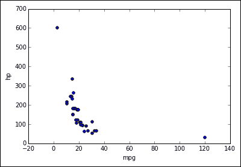

从图中可以清楚地看出异常值。 让我们看看相关性如何同时受到皮尔森和斯皮尔曼相关性的影响

以下命令显示了 Pearson 相关性：

```py
>>> stats.pearsonr(mpg, hp)
>>> (-0.47415304891435484, 0.0046122167947348462)

```

这是 Spearman 相关性：

```py
>>> stats.spearmanr(mpg, hp)
>>> (-0.91222184337265655, 6.0551681657984803e-14)

```

我们可以清楚地看到皮尔逊相关性受到异常值的严重影响，这些异常值的相关性从 0.89 到 0.47。

Spearman 相关性没有受到太大影响，因为它基于顺序而不是数据中的实际值。

# Z 测试与 T 测试

在验证无效假设之前，我们已经做过一些 Z 检验。


T 分布类似于 Z 分布，它以零为中心并且具有基本的钟形形状，但是其中心比 Z 分布更短且更平坦。

T 分布的标准偏差通常成比例地大于 Z，因此您会在每侧看到较粗的尾巴。

当样本较小时，通常使用 t 分布来分析总体。

Z 检验用于比较样本的总体平均值或样本大小大于 30 的两个分布的总体平均值。Z 检验的一个示例是比较不同种族的男性身高。

T 检验用于将总体平均值与样本进行比较，或在样本量小于 30 的两个分布中比较的总体平均值，并且不知道总体的标准偏差。

让我们在两个经过数学测试且每个班级有 10 名学生的课程上进行 T 检验：

```py
>>> class1_score = np.array([45.0, 40.0, 49.0, 52.0, 54.0, 64.0, 36.0, 41.0, 42.0, 34.0])

>>> class2_score = np.array([75.0, 85.0, 53.0, 70.0, 72.0, 93.0, 61.0, 65.0, 65.0, 72.0])

```

要执行 T 检验，我们可以使用 SciPy 软件包中的`ttest_ind()`函数：

```py
>>> stats.ttest_ind(class1_score,class2_score)

(array(-5.458195056848407), 3.4820722850153292e-05)

```

输出中的第一个值是计算出的 t 统计量，而第二个值是 p 值，p 值表明这两个分布不相同。

# F 分布

F 分布也称为 Snedecor 的 F 分布或 Fisher-Snedecor 分布。

f 统计量由以下公式给出：


*s* <sub>`1`</sub> 是 *n* <sub>`1`[</sub> 大小 *s* <sub>`2`</sub> 是样本 2 的标准偏差，其中大小 *n* <sub>`2`</sub> *σ* <sub>`1`</sub> 是样本*1σ* <sub>`2`的总体标准差 ]</sub> 是样本 12 的总体标准偏差。

**f** 统计信息的所有可能值的分布称为 F 分布。 下图中的`d1`和`d2`表示自由度：


# 卡方分布

卡方统计量由以下公式定义：


在此， *n* 是样本的大小， *s* 是样本的标准偏差，*σ*是总体的标准偏差。

如果我们反复采样并定义卡方统计量，则可以形成卡方分布，该分布由以下概率密度函数定义：


这里， *Y* <sub>`0`</sub> 是取决于自由度数的常数， *X* <sub>*2 [*</sub> 是卡方统计量， *v = n-1* 是自由度数， *e* 是等于自然对数底数的常数 系统。

*Y* <sub>`0`</sub> 的定义使得卡方曲线下的面积等于 1。


## 卡尺适合度

卡方检验可用于检验观察到的数据是否与预期数据有显着差异。 让我们以骰子为例。 掷骰子 36 次，每个面朝上的概率为 1/6。 因此，预期分布如下：

<colgroup><col style="text-align: left"> <col style="text-align: left"></colgroup> 
| 

预期频率

 | 

结果

 |
| --- | --- |
| 6 | 1 |
| 6 | 2 |
| 6 | 3 |
| 6 | 4 |
| 6 | 5 |
| 6 | 6 |

```py
>>> expected = np.array([6,6,6,6,6,6])

```

观察到的分布如下：

<colgroup><col style="text-align: left"> <col style="text-align: left"></colgroup> 
| 

观测频率

 | 

结果

 |
| --- | --- |
| 7 | 1 |
| 5 | 2 |
| 3 | 3 |
| 9 | 4 |
| 6 | 5 |
| 6 | 6 |

```py
>>> observed = observed = np.array([7, 5, 3, 9, 6, 6])

```

卡方检验中的零假设是观察值类似于预期值。

可以使用 SciPy 软件包中的`chisquare`函数执行卡方：

```py
>>> stats.chisquare(observed,expected)
(3.333333333333333, 0.64874235866759344)

```

第一个值是卡方值，第二个值是 p 值，非常高。 这意味着零假设是有效的，并且观测值类似于预期值。

# 独立性的卡方检验

独立性的卡方检验是一种统计检验，用于确定两个类别变量是否彼此独立。

让我们以下面的示例为例，根据阅读者的性别来看一本书是否有偏好：

<colgroup><col style="text-align: left"> <col style="text-align: left"> <col style="text-align: left"> <col style="text-align: left"> <col style="text-align: left"></colgroup> 
| 

味道

 |
| --- |
| 

全部的

 | 

传

 | 

悬念

 | 

浪漫

 | 

性别

 |
| --- | --- | --- | --- | --- |
| 280 | 60 | 120 | 100 | Men |
| 640 | 90 | 200 | 350 | Women |
| 920 | 150 | 320 | 450 |   |

卡方独立性检验可以使用 SciPy 软件包中的`chi2_contingency`函数执行：

```py
>>> men_women = np.array([[100, 120, 60],[350, 200, 90]])
>>> stats.chi2_contingency(men_women)
(28.362103174603167, 6.9382117170577439e-07, 2, array([[ 136.95652174,   97.39130435,   45.65217391],
 [ 313.04347826,  222.60869565,  104.34782609]]))

```

第一个值是卡方值：

第二个值是 p 值，该值非常小，表示人们的性别与他们所读书的体裁之间存在关联。 第三个值是自由度。 第四个值是一个数组，是期望的频率。

# 方差分析

**方差分析**（**ANOVA**）是一种统计方法，用于测试两种或多种方法之间的差异。

该测试基本上比较组之间的均值，并确定这些均值之间是否存在显着差异：

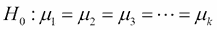

方差分析是一项测试，可以告诉您哪个组彼此显着不同。 让我们来看看来自三个不同国家的男人的身高，看看他们的身高是否与其他国家显着不同：

```py
>>> country1 = np.array([ 176.,  179.,  180.,  188.,  187.,  184.,  171.,  201.,  172.,
 181.,  192.,  187.,  178.,  178.,  180.,  199.,  185.,  176.,
 207.,  177.,  160.,  174.,  176.,  192.,  189.,  187.,  183.,
 180.,  181.,  200.,  190.,  187.,  175.,  179.,  181.,  183.,
 171.,  181.,  190.,  186.,  185.,  188.,  201.,  192.,  188.,
 181.,  172.,  191.,  201.,  170.,  170.,  192.,  185.,  167.,
 178.,  179.,  167.,  183.,  200.,  185.])

>>> country2 = np.array([ 177.,  165.,  175.,  172.,  179.,  192.,  169.,  185.,  187.,
 167.,  162.,  165.,  188.,  194.,  187.,  175.,  163.,  178.,
 197.,  172.,  175.,  185.,  176.,  171.,  172.,  186.,  168.,
 178.,  191.,  192.,  175.,  189.,  178.,  181.,  170.,  182.,
 166.,  189.,  196.,  192.,  189.,  171.,  185.,  198.,  181.,
 167.,  184.,  179.,  178.,  193.,  179.,  177.,  181.,  174.,
 171.,  184.,  156.,  180.,  181.,  187.])

>>> country3 = np.array([ 191.,  190.,  191.,  185.,  190.,  184.,  173.,  175.,  200.,
 190.,  191.,  184.,  167.,  194.,  195.,  174.,  171.,  191.,
 174.,  177.,  182.,  184.,  176.,  180.,  181.,  186.,  179.,
 176.,  186.,  176.,  184.,  194.,  179.,  171.,  174.,  174.,
 182.,  198.,  180.,  178.,  200.,  200.,  174.,  202.,  176.,
 180.,  163.,  159.,  194.,  192.,  163.,  194.,  183.,  190.,
 186.,  178.,  182.,  174.,  178.,  182.])

```

要执行单向方差分析，我们可以使用 SciPy 包的`f_oneway()`函数：

```py
>>> stats.f_oneway(country1,country2,country3)
(2.9852039682631375, 0.053079678812747652)

```

输出的第一个值给出 F 值，第二个值给出 p 值。 由于 p 值略微大于 5％，因此我们可以看出三个国家的身高平均值没有显着差异。

# 摘要

在本章中，您学习了各种概率分布。 您还了解了如何使用 z 分数，p 值，类型 1 和类型 2 错误。 您了解了 Z 检验和 T 检验以及卡方分布，并了解了如何将其用于检验假设。

在下一章中，您将学习数据挖掘及其执行方法。