# 第 4 章。通过高级可视化感知数据

可视化是数据科学不可或缺的一部分。 它有助于传达无法通过查看原始数据看到的模式或关系。 与文字行相比，人们更容易记住图片并重新收集图片。 数据也是如此。

在本章中，我们将讨论以下主题：

*   控制图的属性
*   结合多个地块
*   样式化地块
*   创建各种高级可视化

# 控制图表的线属性

可以设置行的许多属性，例如颜色，破折号和其他一些属性。 基本上有三种方法可以做到这一点。 让我们以一个简单的折线图为例：

```py
>>> plt.plot([1,2,3,4], [1,4,9,16])
>>> plt.show()

```

执行上述代码后，我们将获得以下输出：


## 使用关键字参数

我们可以在 plot 函数中使用参数来设置线的属性：

```py
>>> import numpy as np
>>> import pandas as pd
>>> import matplotlib.pyplot as plt
>>> import pandas.tools.rplot as rplot

>>> plt.plot([1, 2, 3, 4], [1, 4, 9, 16], linewidth=4.0)  # increasing # the line width
>>> plt.show()

```

执行上述代码后，我们将获得以下输出：

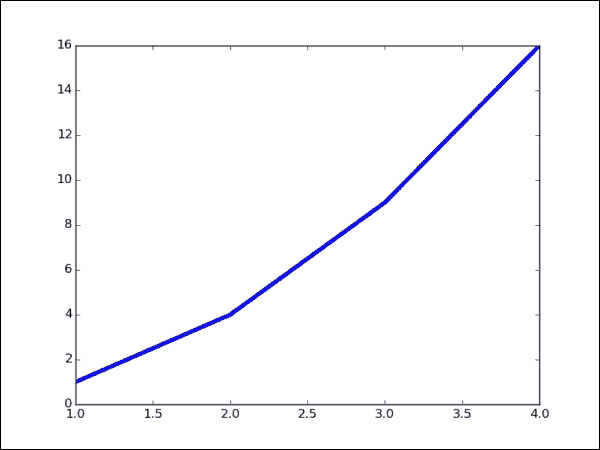

## 使用 setter 方法

绘图函数返回线对象的列表，例如`line1, line2 = plot(x1,y1,x2,y2)`。 使用线对象的 line setter 方法，我们可以定义需要设置的属性：

```py
>>> line, = plt.plot([1, 2, 3, 4], [1, 4, 9, 16])
>>> line.set_linestyle('--') # Setting dashed lines
>>> plt.show()

```

执行上述代码后，我们将获得以下输出：


您可以在[这个页面](http://matplotlib.org/api/lines_api.html)上查看可接受的线条样式。

## 使用 setp（）命令

`setp()`命令可以用作来设置行的多个属性：

```py
>>> line, = plt.plot([1, 2, 3, 4], [1, 4, 9, 16])
>>> plt.setp(line, color='r', linewidth=2.0)  # setting the color # and width of the line
>>> plt.show()

```

执行上述代码后，我们将获得以下输出：

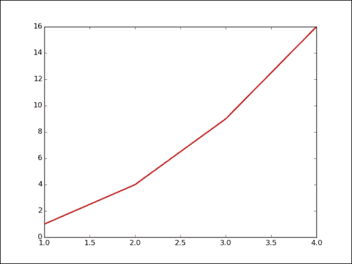

# 创建多个图

Matplotlib 的一个非常有用的功能是，它使得绘制多个图很容易，可以将它们相互比较：

```py
>>> p1 = np.arange(0.0, 30.0, 0.1)

>>> plt.subplot(211)
>>> plt.plot(p1, np.sin(p1)/p1, 'b--')

>>> plt.subplot(212)
>>> plt.plot(p1, np.cos(p1), 'r--')
>>> plt.show()

```

在前面的代码中，我们使用子图函数来绘制需要比较的多个图。 值为`211`的子图表示将有两行，一列和一个图形：


# 播放文字

可以通过使用简单的 Matplotlib 函数将文本添加到图表中。 您只需使用`text()`命令将其添加到图表中：

```py
>>> # Playing with text
>>> n = np.random.random_sample((5,))

>>> plt.bar(np.arange(len(n)), n)
>>> plt.xlabel('Indices')
>>> plt.ylabel('Value')
>>> plt.text(1, .7, r'$\mu=' + str(np.round(np.mean(n), 2)) + ' $')

>>> plt.show()

```

在前面的代码中，`text()`命令用于在绘图中添加文本：

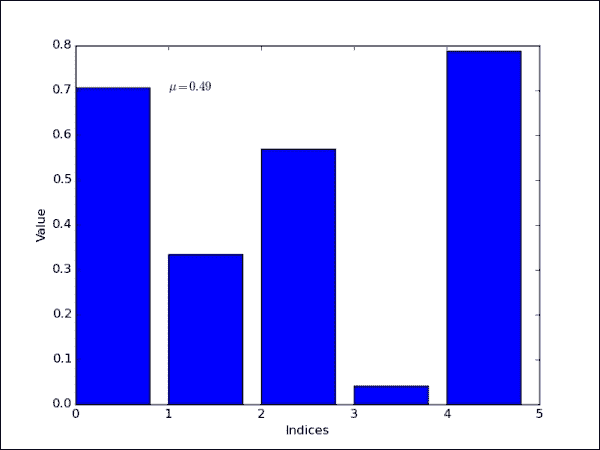

第一个参数取`x`轴值，第二个参数取`y`轴值。 第三个参数是需要添加到绘图中的文本。 乳胶表达式已用于在图中绘制`mu`平均值。

可以使用注释命令来注释图表的某个部分。 带注释的命令将获取文本，需要指向的绘图部分的位置以及文本的位置：

```py
>>> ax = plt.subplot(111)
>>> t = np.arange(0.0, 5.0, 0.01)
>>> s = np.cos(2*np.pi*t)
>>> line, = plt.plot(t, s, lw=2)
>>> plt.annotate('local max', xy=(2, 1), xytext=(3, 1.5),
 arrowprops=dict(facecolor='black', shrink=0.05),
 )
>>> plt.ylim(-2,2)
>>> plt.show()

```

执行上述代码后，我们将获得以下输出：

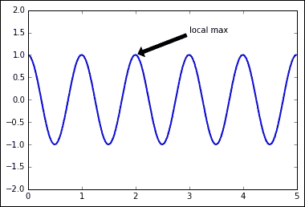

# 设置情节样式

Matplotlib 库中的样式包使更改绘图图的样式更加容易。 更改为著名的 R 语言`ggplot`样式或使用 [Nate Silver 的网站](http://fivethirtyeight.com/)来更改`fivethirtyeight`样式都非常容易。 以下示例显示了具有`ggplot`样式的简单折线图的绘制：

```py
>>> plt.style.use('ggplot')
>>> plt.plot([1, 2, 3, 4], [1, 4, 9, 16])
>>> plt.show()

```

执行上述代码后，我们将获得以下输出：


在前面的代码中，`plt.style.use()`用于设置绘图的样式。 这是一个全局集合，因此在执行之后，所有后续图将具有相同的样式。

以下代码给出了流行的`fivethirtyeight`样式，这是 Nate Silver 在**数据新闻学**上的网站，在这里他的团队通过应用数据科学来撰写有关各种主题的文章：

```py
>>> plt.style.use('fivethirtyeight')
>>> plt.plot([1, 2, 3, 4], [1, 4, 9, 16])
>>> plt.show()

```

执行上述代码后，我们将获得以下输出：

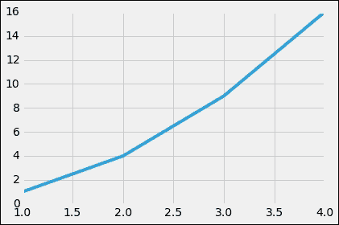

有时，您只希望特定的代码块具有特定的样式，而代码中的其余图则具有默认样式。 可以使用`plt.style.context`函数来实现，并且可以在其中指定样式。 一旦执行了以下代码，就将使用给定样式绘制其中指定的图：

```py
>>> with plt.style.context(('dark_background')):
 plt.plot([1, 2, 3, 4], [1, 4, 9, 16])
>>> plt.show()

```

执行上述代码后，我们将获得以下输出：


# 箱形图

箱形图是很好的图，可以理解数据的传播，中位数和离群值：

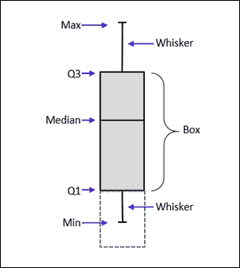

上图的各个部分解释如下：

*   `Q3`：这是数据的第 75 个百分位值。 也称为上铰链。
*   `Q1`：这是数据的第 25 个百分位值。 也称为下铰链。
*   `Box`：这也称为步骤。 这是上铰链和下铰链之间的区别。
*   `Median`：这是数据的中点。
*   `Max`：这是上部的内部围栏。 它是`Q3`之上的步长的 1.5 倍。
*   `Min`：这是下部内围栏。 是`Q1`以下步长的 1.5 倍。

大于`Max`或小于`Min`的任何值称为离群值，也称为传单。

以下代码将创建一些数据，并使用`boxplot`函数创建箱形图：

```py
>>> ## Creating some data
>>> np.random.seed(10)
>>> box_data_1 = np.random.normal(100, 10, 200)
>>> box_data_2 = np.random.normal(80, 30, 200)
>>> box_data_3 = np.random.normal(90, 20, 200)

>>> ## Combining the different data in a list
>>> data_to_plot = [box_data_1, box_data_2, box_data_3]

>>> # Create the boxplot
>>> bp = plt.boxplot(data_to_plot)

```

执行上述代码后，我们将获得以下输出：


`boxplot`函数中的`bp`变量是 Python 字典，具有键值，例如盒，晶须，传单，上限和中位数。 键中的值表示箱形图的不同组件及其属性。 可以访问和适当地更改属性，以根据自己的喜好设置箱形图的样式。 以下代码为您提供了示例，说明如何设置箱形图样式：

```py
>>> ## add patch_artist=True option to ax.boxplot() 
>>> ## to get fill color
>>> bp = plt.boxplot(data_to_plot, patch_artist=True)

>>> ## change outline color, fill color and linewidth of the boxes
>>> for box in bp['boxes']:
 # change outline color
 box.set( color='#7570b3', linewidth=2)
 # change fill color
 box.set( facecolor = '#1b9e77' )

>>> ## change color and linewidth of the whiskers
>>> for whisker in bp['whiskers']:
 whisker.set(color='#7570b3', linewidth=2)

>>> ## change color and linewidth of the caps
>>> for cap in bp['caps']:
 cap.set(color='#7570b3', linewidth=2)

>>> ## change color and linewidth of the medians
>>> for median in bp['medians']:
 median.set(color='#b2df8a', linewidth=2)

>>> ## change the style of fliers and their fill
>>> for flier in bp['fliers']:
 flier.set(marker='o', color='#e7298a', alpha=0.5)

```

在前面的代码中，我们采用框线图的键值，并根据颜色，线宽和面色设置其属性。 同样，我们对其他成分（如晶须，盖帽，中位数和传单）执行相同的任务。


# 热图

热图是图形表示，其中矩阵的各个值表示为颜色。 热图在可视化矩阵两个维度之间的值集中时非常有用。 这有助于找到模式并提供深度的视角。

让我们从开始创建两个维度之间的基本热图。 我们将创建一个 10 x 6 的随机值矩阵，并将其可视化为热图：

```py
>>> # Generate Data
>>> data = np.random.rand(10,6)
>>> rows = list('ZYXWVUTSRQ')  #Ylabel
>>> columns = list('ABCDEF')  #Xlabel

>>> #Basic Heat Map plot
>>> plt.pcolor(data)
>>> plt.show()

```

执行上述代码后，我们将获得以下输出：


在前面的代码中，我们使用`pcolor()`函数创建热图颜色。 现在，我们将标签添加到热图：

```py
>>> # Add Row/Column Labels
>>> plt.pcolor(data)
>>> plt.xticks(np.arange(0,6)+0.5,columns)
>>> plt.yticks(np.arange(0,10)+0.5,rows)
>>> plt.show()

```

执行上述代码后，我们将获得以下输出：


现在，我们将调整热图的颜色，使其在视觉上更具代表性。 这将帮助我们理解数据：

```py
>>> # Change color map
>>> plt.pcolor(data,cmap=plt.cm.Reds,edgecolors='k')
>>> plt.xticks(np.arange(0,6)+0.5,columns)
>>> plt.yticks(np.arange(0,10)+0.5,rows)
>>> plt.show()

```

执行上述代码后，我们将获得以下输出：


在某些实例中，可能需要在热图上绘制大量的值。 这可以通过首先对值进行装箱，然后使用以下代码对其进行绘制来完成：

```py
>>> # Generate some test data
>>> x = np.random.randn(8873)
>>> y = np.random.randn(8873)

>>> heatmap, xedges, yedges = np.histogram2d(x, y, bins=50)
>>> extent = [xedges[0], xedges[-1], yedges[0], yedges[-1]]

>>> plt.imshow(heatmap, extent=extent)
>>> plt.show()

```

执行上述代码后，我们将获得以下输出：


在前面的代码中，`histogram2d`函数有助于对 2D 值进行装箱。 发布之后，我们将值输入到热图以获取前面的图。 由于我们使用了`randn()`，因此生成的值是随机正态分布的数字，这意味着数字的集中度将更接近均值。 这可以在前面的图中看到，该图显示中心为红色，外部区域为蓝色。

# 带有直方图的散点图

我们可以将简单散点图与每个轴的直方图结合起来。 这些图可以帮助我们查看每个轴的值的分布。

让我们为两个轴生成一些随机分布的数据：

```py
>>> from matplotlib.ticker import NullFormatter
>>> # the random data
>>> x = np.random.randn(1000)
>>> y = np.random.randn(1000)

```

创建一个`NullFormatter`对象，该对象将用于消除直方图的`x`和`y`标签：

```py
>>> nullfmt   = NullFormatter()         # no labels

```

以下代码定义了散点图和直方图的大小，高度和宽度：

```py
>>> # definitions for the axes
>>> left, width = 0.1, 0.65
>>> bottom, height = 0.1, 0.65
>>> bottom_h = left_h = left+width+0.02

>>> rect_scatter = [left, bottom, width, height]
>>> rect_histx = [left, bottom_h, width, 0.2]
>>> rect_histy = [left_h, bottom, 0.2, height]

```

定义大小和高度后，将绘制散点图以及两个直方图的轴：

```py
>>> # start with a rectangular Figure
>>> plt.figure(1, figsize=(8,8))

>>> axScatter = plt.axes(rect_scatter)
>>> axHistx = plt.axes(rect_histx)
>>> axHisty = plt.axes(rect_histy)

```

通过使用`set_major_formatter`方法消除直方图的`x`和`y`轴标签，并通过为其分配`NullFormatter`对象，可以绘制散点图：

```py
>>> # no labels
>>> axHistx.xaxis.set_major_formatter(nullfmt)
>>> axHisty.yaxis.set_major_formatter(nullfmt)

>>> # the scatter plot:
>>> axScatter.scatter(x, y)

```

`x`和`y`轴的极限使用以下代码计算，其中`x`和`y`值的最大值 。 然后将最大值除以 bin，然后将其加一个，然后再与 bin 值相乘。 这样做是为了使`max`值前面有一些空间：

```py
>>> # now determine nice limits by hand:
>>> binwidth = 0.25
>>> xymax = np.max( [np.max(np.fabs(x)), np.max(np.fabs(y))] )
>>> lim = ( int(xymax/binwidth) + 1) * binwidth

```

然后将计算出的极限值分配给`axScatter`对象的`set_xlim`方法：

```py
>>> axScatter.set_xlim( (-lim, lim) )
>>> axScatter.set_ylim( (-lim, lim) )

```

`bins`变量创建一个间隔值列表，这些值将与直方图一起用于：

```py
>>> bins = np.arange(-lim, lim + binwidth, binwidth)

```

绘制直方图，并使用方向参数设置水平的直方图：

```py
>>> axHistx.hist(x, bins=bins)
>>> axHisty.hist(y, bins=bins, orientation='horizontal')

```

获取散点图的极限值，然后将其分配给直方图的极限方法：

```py
>>> axHistx.set_xlim( axScatter.get_xlim() )
>>> axHisty.set_ylim( axScatter.get_ylim() )

>>> plt.show()

```

执行上述代码后，我们将获得以下输出：


# 散点图矩阵

散点图矩阵可以形成一个变量集合，其中每个变量将相互绘制。 以下代码生成一个`DataFrame``df`，它由四个具有正态分布的随机值的列组成，其列名从`a`到`d`命名：

```py
>>> df = pd.DataFrame(np.random.randn(1000, 4), columns=['a', 'b', 'c', 'd'])

>>> spm = pd.tools.plotting.scatter_matrix(df, alpha=0.2, figsize=(6, 6), diagonal='hist')

```

执行上述代码后，我们将获得以下输出：

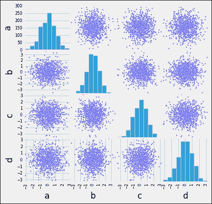

`scatter_matrix()`功能有助于绘制上图。 它接受数据帧对象和定义用于自定义绘图的必需参数。 您可能已经观察到对角线图被定义为直方图，这意味着在绘图矩阵中变量与其自身相对的部分中，绘制了直方图。

除了直方图，我们还可以使用对角线的核密度估计：

```py
>>> spm = pd.tools.plotting.scatter_matrix(df, alpha=0.2, figsize=(6, 6), diagonal='kde')

```

执行上述代码后，我们将获得以下输出：

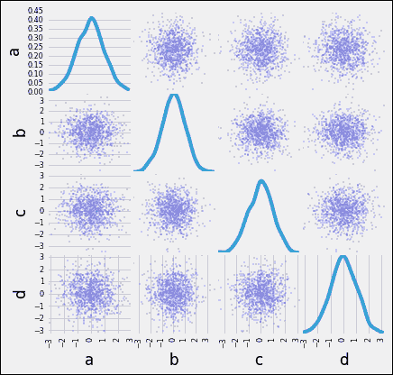

内核密度估计是估计随机变量的概率密度函数的非参数方法。 从根本上讲，它有助于理解数据是否正态分布以及数据偏斜的方向。

# 面积图

区域图对于很有用，可用于比较整个范围内不同因子的值。 面积图可以自然堆叠，其中不同因子的区域彼此堆叠在之上。 以下代码给出了堆积面积图的示例：

```py
>>> df = pd.DataFrame(np.random.rand(10, 4), columns=['p', 'q', 'r', 's'])

>>> df.plot(kind='area');

```

执行上述代码后，我们将获得以下输出：

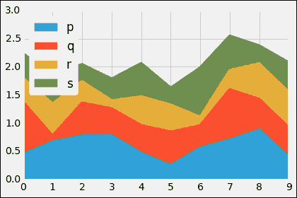

要删除面积图的堆栈，可以使用以下代码：

```py
>>> df.plot(kind='area', stacked=False);

```

执行上述代码后，我们将获得以下输出：


# 气泡图

气泡图本质上是具有其他维度的散点图。 附加尺寸有助于设置气泡的大小，这意味着气泡的大小越大，表示气泡的值越大。 这种图表有助于分析三维数据。

以下代码创建了一个包含三个变量的样本数据，然后将该数据馈送到`plot()`方法，其中将其种类称为散点，s 是气泡的大小：

```py
>>> plt.style.use('ggplot')
>>> df = pd.DataFrame(np.random.rand(50, 3), columns=['a', 'b', 'c'])
>>> df.plot(kind='scatter', x='a', y='b', s=df['c']*400);

```

执行上述代码后，我们将获得以下输出：

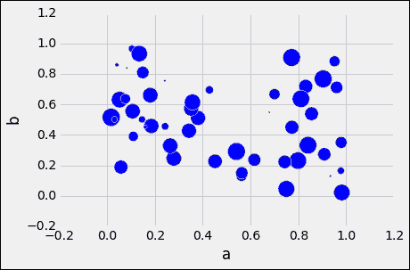

# 六边形图

可以使用`DataFrame.plot()`功能和`kind = 'hexbin'`创建六边形图。 如果您的散点图过于密集而无法解释，则这种图非常有用。 它有助于对图表的空间区域和颜色强度进行装箱，可以将六边形解释为更集中在该区域的点。

以下代码有助于绘制六边形箱图，并且代码的结构类似于前面讨论的图：

```py
>>> df = pd.DataFrame(np.random.randn(1000, 2), columns=['a', 'b'])

>>> df['b'] = df['b'] + np.arange(1000)

>>> df.plot(kind='hexbin', x='a', y='b', gridsize=25)

```

执行上述代码后，我们将获得以下输出：

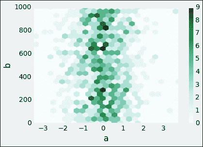

# 格子图

网格图是网格中具有一致比例尺的较小图表的布局。 每个较小的图表代表一个类别，称为条件。 每个较小的图表上显示的数据是该类别中项目的条件。

网格图对于查找复杂数据中的结构和模式非常有用。 网格布局看起来类似于花园的格子，因此名称为“格子”。

以下代码有助于绘制格子图，其中针对性别和吸烟者/不吸烟者的每种组合：

```py
>>> tips_data = pd.read_csv('Data/tips.csv')
>>> plt.figure()
>>> plot = rplot.RPlot(tips_data, x='total_bill', y='tip')
>>> plot.add(rplot.TrellisGrid(['sex', 'smoker']))
>>> plot.add(rplot.GeomHistogram())
>>> plot.render(plt.gcf())

```

执行上述代码后，我们将获得以下输出：


在前面的代码中，`rplot.RPlot`带有`tips_data`对象。 同样，定义了`x`和`y`轴值。 此后，根据吸烟者和性别定义网格网格。 最后，我们使用`GeomHistogram()`绘制直方图。

要将网格图更改为内核密度估计，我们可以使用以下代码：

```py
>>> plt.figure()
>>> plot = rplot.RPlot(tips_data, x='total_bill', y='tip')
>>> plot.add(rplot.TrellisGrid(['sex', 'smoker']))
>>> plot.add(rplot.GeomDensity())
>>> plot.render(plt.gcf())

```

执行上述代码后，我们将获得以下输出：


我们也可以在上绘制散点图，上面带有多边形拟合线：

```py
>>> plt.figure()
>>> plot = rplot.RPlot(tips_data, x='total_bill', y='tip')
>>> plot.add(rplot.TrellisGrid(['sex', 'smoker']))
>>> plot.add(rplot.GeomScatter())
>>> plot.add(rplot.GeomPolyFit(degree=2))
>>> plot.render(plt.gcf())

```

执行上述代码后，我们将获得以下输出：

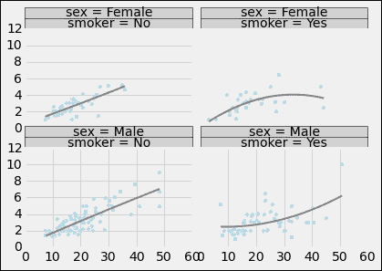

该代码与上一个示例类似。 唯一的区别是`GeomScatter()`和`GeomPolyFit`用于获得绘图上的拟合线。

通过使用以下代码，可以将散点图与 2D 内核密度图组合：

```py
>>> plt.figure()
>>> plot = rplot.RPlot(tips_data, x='total_bill', y='tip')
>>> plot.add(rplot.TrellisGrid(['sex', 'smoker']))
>>> plot.add(rplot.GeomScatter())
>>> plot.add(rplot.GeomDensity2D())
>>> plot.render(plt.gcf())

```

执行上述代码后，我们将获得以下输出：

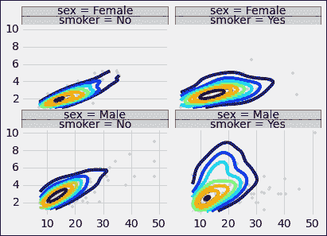

# 表面的 3D 图

现在，我们将绘制为 3D 图，其中`Sin`函数是相对于两个轴的平方值之和绘制的：

```py
>>> from mpl_toolkits.mplot3d import Axes3D
>>> fig = plt.figure()
>>> ax = Axes3D(fig)
>>> X = np.arange(-4, 4, 0.25)
>>> Y = np.arange(-4, 4, 0.25)
>>> X, Y = np.meshgrid(X, Y)
>>> R = np.sqrt(X**2 + Y**2)
>>> Z = np.sin(R)
>>> ax.plot_surface(X, Y, Z, rstride=1, cstride=1, cmap='hot')

```

执行上述代码后，我们将获得以下输出：


在前面的代码中，我们定义了`x`和`y`轴，其值介于-4 到 4 之间。我们创建了一个带有`meshgrid()`的坐标矩阵，然后将这些值平方`x`和`y`的总和，最后将它们总结。 然后将其输入到`plot_surface`功能。 简单来说，`rstride`和`cstride`参数有助于确定表面细胞的大小。

让我们使用`view_int`调整视图。 以下是`0`度仰角和`0`度角的视图：

```py
>>> fig = plt.figure()
>>> ax = Axes3D(fig)
>>> ax.view_init(elev=0., azim=0)
>>> ax.plot_surface(X, Y, Z, rstride=1, cstride=1, cmap='hot')

```

执行上述代码后，我们将获得以下输出：

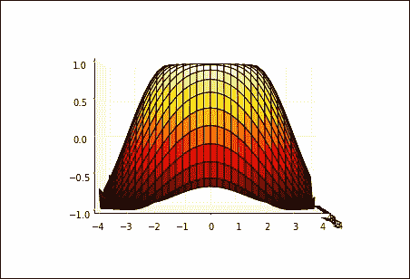

以下是在`50`度高程处的视图：

```py
>>> fig = plt.figure()
>>> ax = Axes3D(fig)
>>> ax.view_init(elev=50., azim=0)
>>> ax.plot_surface(X, Y, Z, rstride=1, cstride=1, cmap='hot')

```

执行上述代码后，我们将获得以下输出：


以下是`50`度高程和`30`度角的视图：

```py
>>> fig = plt.figure()
>>> ax = Axes3D(fig)
>>> ax.view_init(elev=50., azim=30)
>>> ax.plot_surface(X, Y, Z, rstride=1, cstride=1, cmap='hot')

```

执行上述代码后，我们将获得以下输出：

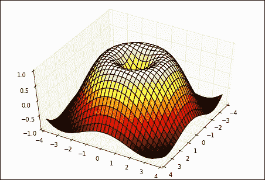

# 摘要

在本章中，您学习了如何使用图表的各种属性。 您还学习了如何组合多个图表并设置其样式。 通过本章您已经获得了许多高级可视化知识。

在下一章中，我们将了解什么是机器学习，并探讨一些机器学习技术。