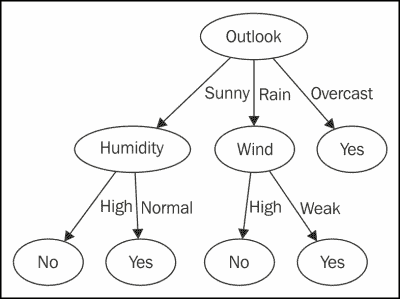
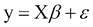
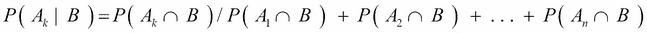
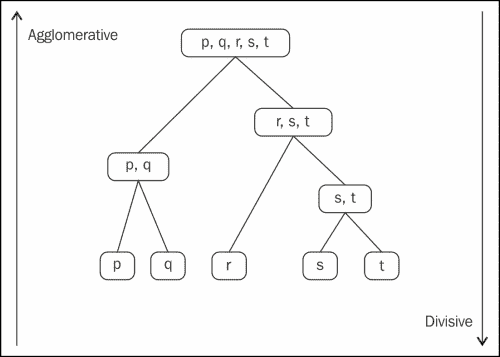

# 第 5 章。发现机器学习

机器学习是一种教导使用数据的程序来生成算法的技术，而不是从头开始对算法进行显式编程。

这是计算机科学领域，源于对人工智能的研究。 它与统计和数学优化紧密相关，后者为该领域提供了方法，理论和应用领域。 机器学习用于各种计算任务，在这些任务中，无法显式地编程基于规则的算法。 示例应用包括： 电子邮件垃圾邮件过滤器，搜索引擎，语言翻译和计算机视觉。 机器学习有时会与数据挖掘相混淆，尽管它主要侧重于探索性数据分析。

以下是本章以后将使用的一些术语：

*   **功能**：此涉及有助于定义结果的独特特征
*   **样本**：样本是要处理的项目。 它可以是文档，图像，音频或 CSV 文件
*   **特征向量**：此表示代表某些对象的数字特征，例如 n 维向量
*   **特征提取**：此是指特征向量的处理，其中数据从高维空间转换为低维空间
*   **训练集**：此是指发现潜在的预测关系的一组数据
*   **测试集**：此指的是一组测试谓词的数据

# 不同类型的机器学习

根据学习目标的性质或学习系统可用的反馈，机器学习主要分为三种类型：

1.  **监督学习**：为计算机提供一组给定的输入及其各自的输出。 该程序的目标是从输入中学习以重现输出。
2.  **无监督学习**：无监督学习的情况下没有目标变量。 计算机可以自行查找数据中的模式。
3.  **强化学习**：程序必须以动态的方式与其环境进行交互，例如驾驶汽车。

## 监督学习

如先前所述，监督学习算法研究训练数据并生成一个函数，该函数可用于预测新实例。

从上图可以看到，有训练数据，机器学习模型将从中学习。

让我们假设训练数据是一组代表不同新闻文章的文本。 这些新闻文章可以与体育新闻，国际新闻，国家新闻以及其他各种新闻类别相关。 这些类别将充当我们的标签。 从该训练数据中，我们将得出特征向量，其中每个单词可以是一个向量，或者某些向量可以从文本中得出。 例如，单词“ Football”的实例数可以是矢量，或者单词“总理”的实例数也可以是矢量。

这些特征向量和标签被馈送到机器学习算法，该算法从数据中学习。 训练完模型后，将其用于新数据，然后再次提取特征，然后将其输入到模型中，从而生成目标数据。

以下是监督式机器学习算法的一些示例，将在本章中进行介绍，其中一些示例将在以下章节中进行详细说明：

1.  决策树
2.  线性回归
3.  逻辑回归
4.  朴素贝叶斯分类器

## 无监督学习

如先前所述，无监督学习试图在未标记的数据中找到隐藏的结构。 如下图所示，该算法没有输入标签：

让我们以将用作训练和输入数据集的图像为例。 图像包含人，马和昆虫的面孔。 从这些图像中提取特征，这将有助于识别图像所属的组。 然后将这些特征输入到无监督的机器学习算法中。 该算法将在数据中找到模式，并帮助将这些图像存储到相应的组中。

然后，该相同算法可用于新图像，并有助于将图像存储到所需的存储桶中。

这是本章将介绍的无监督机器学习算法的一些示例，在以下各章中将详细介绍其中一些：

1.  k 均值聚类
2.  层次聚类

## 强化学习

在强化学习中，要输入的数据作为对机器学习模型必须响应和反应的环境的模型的激励。 反馈的提供不同于监督学习的教学过程，而是环境中的惩罚和奖励。

主体采取的行动导致其从结果中学习，而不是被明确地教导，并且其选择的行动基于其过去的经验以及其做出的新鲜选择，这基本上意味着其正在从审判和学习中学习 错误。 代理以数字奖励的形式接收增强信号，该信号对成功进行编码，并且代理试图教自己采取会随着时间的推移增加累积奖励的行动。

强化学习在机器人技术中大量使用，而在数据科学中则很少使用。 以下是强化学习下的算法：

1.  时差学习
2.  Q 学习

# 决策树

一个简单的预测模型将项目的结果映射到输入数据。 这是一种流行的预测建模技术，在行业中普遍使用：

决策树模型基本上有两种类型：

*   **分类树**：这些树是指采用有限值的因变量。 在这些树结构中，分支表示导致类标签的要素规则，而叶子则表示结果的类标签。
*   **回归树**：当因变量采用连续值时，它们称为回归树。

让我们举个例子。 以下数据根据天气，湿度和风力的总体情况表示您是否应该打网球：

<colgroup><col style="text-align: left"> <col style="text-align: left"> <col style="text-align: left"> <col style="text-align: left"></colgroup> 
| 

玩

 | 

风

 | 

湿度

 | 

外表

 |
| --- | --- | --- | --- |
| `No` | `Low` | `High` | `Sunny` |
| `No` | `High` | `Normal` | `Rain` |
| `Yes` | `Low` | `High` | `Overcast` |
| `Yes` | `Weak` | `Normal` | `Rain` |
| `Yes` | `Low` | `Normal` | `Sunny` |
| `Yes` | `Low` | `Normal` | `Overcast` |
| `Yes` | `High` | `Normal` | `Sunny` |

如果获取此数据，则将`Play`用作目标变量，将其余变量用作自变量，则将获得一个决策树模型，该模型将具有以下结构作为规则。

因此，当有新数据输入时，它将遍历此树以得出该结论，这将是结果：

决策树是最简单的预测模型，这里有一些优点：

1.  交流和可视化决策树很容易。
2.  可能会找到奇怪的图案。 假设您正在尝试寻找两党在一次选举中的投票方式，并且您拥有有关教育程度，收入，性别和年龄的数据。 您可能会观察到一种模式，即受过高等教育的人收入很低，并且投票支持特定政党。
3.  决策树对数据的假设最少。

以下是决策树的缺点：

1.  分类错误率高，而训练集比班级数少。
2.  当数据和因变量的数量增加时，计算将呈指数增长。
3.  需要用于特定构造算法的离散数据。

# 线性回归

线性回归是建模中的方法，可帮助建模标量因变量 *Y* 与自变量 *X* 之间的标量线性关系，后者可以是一个或多个 价值：

让我们尝试通过一个例子来理解这一点。 下表显示了班级中学生的身高和体重清单：

<colgroup><col style="text-align: left"> <col style="text-align: left"></colgroup> 
| 

身高（英寸）

 | 

重量（磅）

 |
| --- | --- |
| 50 | 125 |
| 58 | 135 |
| 63 | 145 |
| 68 | 144 |
| 70 | 170 |
| 79 | 165 |
| 84 | 171 |
| 75 | 166 |
| 65 | 160 |

如果我们通过一个简单的线性回归函数（将在下一章中进行介绍）运行，则权重为因变量 *y* ，而自变量 *x* 是高度，我们得到以下方程式：

*y = 1.405405405 x + 57.87687688*

如果您将前面的方程式绘制为以`57.88`作为截距的直线，并且该线的斜率在 *y* 轴和`Height`的散点图顶部为`1.4`在 *x* 轴上，则获得以下图：

在此示例中，回归算法尝试创建前面的方程，该方程在预测学生的体重时具有最小的误差。 这是一个简单的线性回归的例子。 在第 6 章和*用线性回归*执行预测中，我们将进一步讨论具有多个变量的线性回归的概念。

# Logistic 回归

Logistic 回归是另一种监督学习技术，它基本上是一种概率分类模型。 它主要用于预测二进制预测变量，例如客户是否流失或信用卡交易是否欺诈。

逻辑回归使用物流。 逻辑函数是非常有用的函数，可以采用从负无穷大到正无穷大的任何值，并输出从`0`到`1`的值。 因此，它可以解释为概率。 以下是基于因变量`x`生成从`0`到`1`的预测值的逻辑函数：

此处， *x* 将是自变量， *F（x）*将是因变量。

如果尝试绘制从负无穷大到正无穷大的逻辑函数，则将得到以下 *S* 形图：

逻辑回归可以应用于以下情况：

1.  在零售商店中为购买已推出的新产品的客户得出倾向得分。
2.  变压器无法使用与其关联的传感器数据的可能性。
3.  用户根据其行为点击在网站上显示的广告的可能性。

逻辑回归具有更多的应用程序，下面的章节将通过示例更详细地讨论 Logistic 回归。

# 朴素的贝叶斯分类器

朴素的贝叶斯分类器是基于贝叶斯定理的简单概率分类器。 所做的假设是，要素之间存在很强的相互依赖性，因此将其称为天真。 以下是贝叶斯定理：

在上式中， *A* 和 *B* 是事件， *P（A）*和 *P（B）*是[ *A* 和 *B* 相互依赖。 *P（A | B）*是 *A* 的概率，假设 *B* 是`True`，这是一个条件概率。 假设 *A* 为`True`，则 *P（B | A）*是 *B* 的概率。 朴素的贝叶斯公式如下：

让我们尝试通过下面的示例解决这个方程，以理解朴素的贝叶斯公式：

明天，Stacy 会在奥斯汀的户外仪式上与她订婚。 在过去的几年中，奥斯汀一年只有六个雨天。 不幸的是，天气预报员明天已经预报了降雨。 在 80％的时间里，天气预报员准确地预测了降雨。 但是，他在不下雨时有 20％的时间错误地预测了天气。 确定在 Stacy 订婚那天下雨的概率。 以下是一些事件，基于这些事件可以计算出概率：

*   *AI* ：此事件表明 Stacy 的参与正在下雨
*   *A2* ：此事件表明在 Stacy 的订婚中不下雨
*   *B* ：此事件表明天气预报员预测会下雨

以下是基于上述事件的概率：

*   *P（AI）= 6/365 = 0.016438* ：这意味着每年下雨六天
*   *P（AII）= 359/365 = 0.98356* ：这意味着一年中不会下雨 359 天
*   *P（B | AI）= 0.8* ：这意味着在 80％的时间里，天气预报员下雨了
*   *P（B | AII）= 0.2* ：这意味着 20％的时间不会像天气预报员所预测的那样下雨

以下公式可帮助我们计算朴素贝叶斯概率：

*P（AI | B）= P（AI）P（B | AI）/（P（AI）P（B | AI）+ P（AII）P（B | AII））*

*P（AI | B）=（0.0164 * 0.8）/（0.0164 * 0.8 + 0.9834 * 0.2）*

*P（AI | B）= 0.065*

因此，前面的计算表明，即使气象员预测会下雨，根据贝叶斯定理，实际上也只有 6.5％的机会会下雨

朴素的贝叶斯在电子邮件过滤中大量使用。 它采用电子邮件中每个单词的实例，并计算电子邮件是否为垃圾邮件的概率。 朴素的贝叶斯模型从以前的电子邮件历史中学习，并将邮件标记为垃圾邮件，这有助于得出有关电子邮件是否为垃圾邮件的结论。

# k 均值聚类

k 均值聚类是一种无监督的学习技术，有助于将 *n* 观测值的数据划分为相似观测值的 *K* 桶。

之所以称其为聚类算法，是因为它通过计算特征的均值来进行操作，这些均值是指我们对事物进行聚类的因变量，例如根据平均交易量和每季度购买的平均产品数量对客户进行细分 一年 然后，该平均值成为群集的中心。 *K* 数是指簇数，即，通过计算均值 *K* 数，从而导致周围数据的*聚类*组成的技术 这些 k 均值*。*

我们如何选择这个 K？ 如果我们对所要寻找的东西有所了解，或者期望或想要多少个集群，那么在启动引擎并让算法进行计算之前，将 *K* 设置为该数字。

如果我们不知道有多少，那么我们的探索将花费更长的时间并涉及一些反复试验，例如，当我们尝试 *K = 3* ，`4`和`5`，直到我们看到集群在我们的领域对我们有意义。

*|| x* *i* *-v* *j* *||* 是 *xi* 与 *vj* ， *c* *i* 在*中的欧几里德距离。 在* *第* 个群集中，数据点的数量， *c* 是群集中心的数量。

k 均值聚类广泛用于计算机视觉，市场细分，天文学，地统计学和农业。

k 均值聚类将在后面的章节中更详细地介绍，并带有实际示例。

# 分层聚类

层次聚类是一种无监督的学习技术，其中聚类的层次是根据观察结果构建的。

此群集将数据按群集树或树状图的各个级别进行分组。 它不是单个集群集，而是多个级别的层次结构，其中特定级别的集群作为下一个级别的集群连接在一起。 这使您可以决定最合适的群集级别。

层次集群本质上有两种类型：

*   **聚集层次聚类**：这是一种自下而上的方法，其中每个观察都在其自己的聚类中开始，并且在两个其他聚类沿向上进入一个层次时开始
*   **分裂式层次聚类**：这是一种自上而下的方法，其中观察值在单个聚类中以开头，然后沿着层次结构分成两部分

下图显示了**聚集**和**分裂**层次聚类：

分层群集将在后面的章节中更详细地说明。

# 摘要

在本章中，您了解了机器学习的含义及其不同类型。 还向您介绍了常用的机器学习算法。

在下一章中，您将学习如何创建线性回归模型。