# 第 6 章。使用线性回归执行预测

线性回归分析是所有统计技术中使用最广泛的：它是研究变量之间的线性，加性关系。 它在各个行业中广泛用于创建模型，这将对业务有所帮助。 例如，在零售行业中，有多种因素影响产品的销售。 这些因素可能是价格，促销或季节性因素，仅举几例。 线性回归模型有助于理解这些因素中的每一项对产品销售的影响以及计算基准销售，这是在没有外部因素的情况下该产品的销售数量，例如 价格，促销等。

在上一章中，向您介绍了线性回归以及一个简单的线性回归示例。 在本章中，您将学习如何创建以下内容：

*   一个简单的线性回归模型
*   多元线性回归模型

# 简单线性回归

一个简单的线性回归具有一个变量，可以使用以下公式将其描述为：

```py
y = A + Bx
```

这里，`y`是因变量，`x`是自变量，`A`是截距（其中`x`等于 零），`B`是系数

我们将使用的数据集包含一个男性样本的身高（cm）和体重（kg）。

以下代码提取数据并创建一个简单的散点图，以便了解体重与身高的分布情况：

```py
>>> import numpy as np
>>> import pandas as pd
>>> from scipy import stats
>>> import matplotlib.pyplot as plt
>>> sl_data = pd.read_csv('Data/Mens_height_weight.csv')
>>> fig, ax = plt.subplots(1, 1) 
>>> ax.scatter(sl_data['Height'],sl_data['Weight'])
>>> ax.set_xlabel('Height')
>>> ax.set_ylabel('Weight')
>>> plt.show()

```

以下是以上代码的输出：

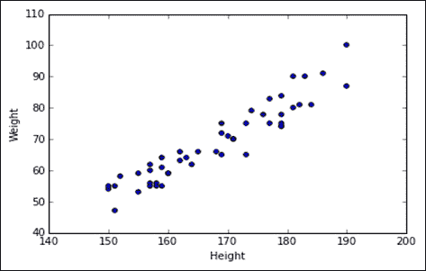

从图中可以看出，在个人的体重和身高之间存在线性关系。

让我们看一下变量如何相互关联，如下所示：

```py
>>> sl_data.corr()

```

前面的代码有助于生成以下相关矩阵：

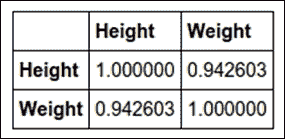

我们可以清楚地看到，基于 0 的 Pearson 相关值系数，身高和体重之间存在明显的相关性。94\. Pearson 相关性的范围是-1 到+1，因此当数字更大时 正值表示，如果两个变量一起增加或减小，则它们之间的关系要强得多。 如果相关值为负，则两个变量之间的关系很强，但方向相反。

让我们生成一个线性回归模型，权重为因变量，x 为自变量：

```py
>>># Create linear regression object
>>> lm = linear_model.LinearRegression()

>>># Train the model using the training sets
>>> lm.fit(sl_data.Height[:,np.newaxis], sl_data.Weight)

>>> print 'Intercept is ' + str(lm.intercept_) + '\n'
Intercept is -99.2772096063
>>> print 'Coefficient value of the height is ' + str(lm.coef_) + '\n'
Coefficient value of the height is [ 1.00092142]

>>> print pd.DataFrame(zip(sl_data.columns,lm.coef_), columns = ['features', 'estimatedCoefficients'])

```

这是前面代码的输出：

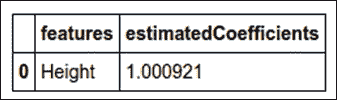

在前面的代码中，我们使用`linear_model.LinearRegression()`创建线性回归对象 lm。 然后，我们使用`lm`的`fit()`方法定义因变量和自变量，在我们的示例中，`weight`是因变量，`height`是自变量。

要获取截距值，请使用`lm.intercept_`，并要获取系数，请使用`lm.coef`。

代码的最后一行有助于创建自变量及其对应系数的`DataFrame`。 当我们详细探讨多元回归时，这将很有用。

现在，我们将再次使用趋势线绘制散点图：

```py
>>> fig, ax = plt.subplots(1, 1) 
>>> ax.scatter(sl_data.Height,sl_data.Weight)
>>> ax.plot(sl_data.Height,lm.predict(sl_data.Height[:, np.newaxis]), 
 color = 'red')
>>> ax.set_xlabel('Height')
>>> ax.set_ylabel('Weight')
>>> plt.show()

```

这是前面代码的输出：

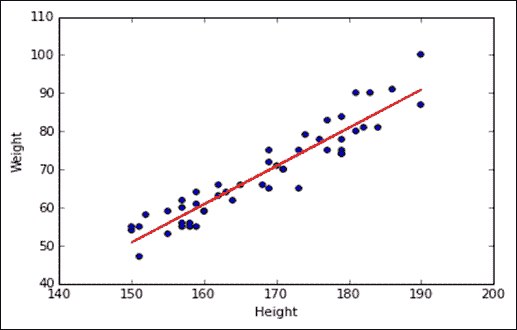

# 多元回归

当多个以上的自变量用于预测因变量时，会发生多元线性回归：


其中，`Y`是因变量，`a`是截距，`b1`和`b2`是系数，`x1`和`x2`是自变量

另外，请注意，平方因变量仍使其线性，但如果系数为平方，则为非线性。

为了建立多元线性回归模型，我们将利用 NBA 的篮球数据来预测每场比赛的平均得分

以下是数据的列描述：

*   `height`：这是指以英尺为单位的高度
*   `weight`：指磅的重量
*   `success_field_goals`：这是指成功完成射门得分的百分比（尝试的 100 个目标中的百分比）
*   `success_free_throws`：这是指成功罚球的百分比（尝试的 100 个罚球中的百分比）
*   `avg_points_scored`：这是指每局平均得分

以下代码提取了这些数据，然后我们使用`DataFrame`的`descibe()`方法来获取每个字段的单变量指标：

```py
>>> b_data = pd.read_csv('Data/basketball.csv')
>>> b_data.describe()

```

这是前面代码的输出：

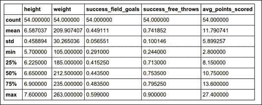

从上表，我们可以了解数据。 可以观察到以下几点：

1.  篮球运动员的平均身高约为 6.5 英尺。
2.  最短的球员是 5.7 英尺。
3.  最高的球员是 7.7 英尺（沙奎尔·奥尼尔站在 7.1 英尺）。
4.  体重最轻的球员只有 105 磅，这是相当晦涩的。
5.  最重的球员是 263 磅。
6.  球员的最佳投篮命中率是 60%。
7.  球员最差的投篮命中率是 29%。
8.  一名球员的平均投篮命中率为 45%，但是从较小的标准偏差中，我们可以看到大多数球员的投篮命中率在 40% 至 50% 之间。
9.  在罚球中，有一位球员错过了 3/4 的时间。
10.  最佳罚球手的成功率达到 90%。
11.  大多数球员的罚球成功率约为 70% 至 80%。
12.  玩家每场比赛最高得分是 27。
13.  得分最低是 3。
14.  玩家平均得分为 12 分。

让我们看一下变量之间的相关性：

```py
>>> b_data.corr()

```

以下是上述代码的输出：


从前面的表中，我们可以看到以下内容：

1.  身高和体重之间存在高度相关性。
2.  成功的射门得分之间在身高和体重方面呈弱正相关。
3.  得分的平均分似乎与`success_field_goals`具有最大的相关性，但它们并不高度相关。

让我们看一下每个独立变量相对于因变量的分布：

```py
>>> fig, ax = plt.subplots(1, 1) 
>>> ax.scatter(b_data.height, b_data.avg_points_scored)
>>> ax.set_xlabel('height')
>>> ax.set_ylabel('Average points scored per game')
>>> plt.show()

```

这是前面代码的输出：

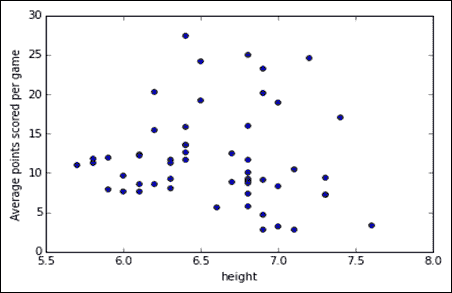

在前面的散点图中，我们可以看到得分的平均点和高度之间没有清晰的模式。 该分布看起来非常随机。

让我们看一下平均得分和权重之间的分布：

```py
>>> fig, ax = plt.subplots(1, 1) 
>>> ax.scatter(b_data.weight, b_data.avg_points_scored)
>>> ax.set_xlabel('weight')
>>> ax.set_ylabel('Average points scored per game')
>>> plt.show()

```

这是前面代码的输出：


我们可以看到 105 磅似乎是一个离群值，并且平均得分也相对较低。 我们还可以看到几乎是 240 磅的球员在得分方面有最大的变化，因此可以假设高矮的球员得分更高，而矮矮的球员得分更高 得分较低。

现在，让我们看看成功的射门得分和平均得分之间的分布：

```py
>>> fig, ax = plt.subplots(1, 1) 
>>> ax.scatter(b_data.success_field_goals, b_data.avg_points_scored)
>>> ax.set_xlabel('success_field_goals')
>>> ax.set_ylabel('Average points scored per game')
>>> plt.show()

```

这是前面代码的输出：

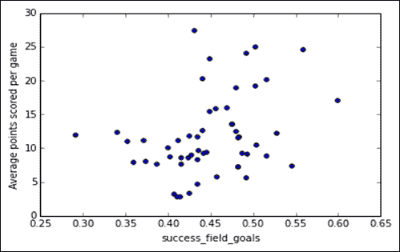

`success_field_goals`变量与得分的平均点有一些线性关系，但是分布仍然相当分散。

最后，让我们看：罚球成功率和每场比赛平均得分之间的分布：

```py
>>> fig, ax = plt.subplots(1, 1)
>>> ax.scatter(b_data.success_free_throws, b_data.avg_points_scored)
>>> x.set_xlabel('success_free_throws')
>>> ax.set_ylabel('Average points scored per game')
>>> plt.show()

```

这是前面代码的输出：

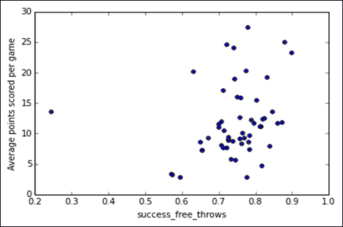

我们可以看到的一名球员的的罚球相当糟糕，但与其他球员相比，平均得分似乎接近平均水平，这意味着他在半场得分或 他会尝试很多得分。 这里的整体分布也很分散。

从前面的相关性和分布分析，我们可以看出，得分的平均值和自变量之间没有明确的模式。 可以预料，将使用现有数据构建的模型不会非常准确。

# 训练和测试模型

让我们将和数据分为训练集和测试集：

```py
>>> from sklearn import linear_model,cross_validation, 
 feature_selection,preprocessing
>>> import statsmodels.formula.api as sm
>>> from statsmodels.tools.eval_measures import mse
>>> from statsmodels.tools.tools import add_constant
>>> from sklearn.metrics import mean_squared_error

>>> X = b_data.values.copy() 
>>> X_train, X_valid, y_train, y_valid = 
 cross_validation.train_test_split( X[:, :-1], X[:, -1], 
 train_size=0.80)

```

我们首先使用`b_data`的`values.copy()`将数据帧转换为数组结构。 然后，我们使用 SciKit 中`cross_validation`的`train_test_split`功能将数据分为 80% 的数据训练和测试集。

我们将学习如何使用以下程序包构建线性回归模型：

*   statsmodels 模块
*   SciKit 软件包

甚至Pandas都提供了**普通最小二乘**（**OLS**）回归，您可以在完成本章之后进行尝试。 普通最小二乘法是一种估算未知系数和回归方程截距的方法。 我们将从 statsmodels 包开始。 **统计模型**是一个 Python 模块，允许用户浏览数据，估计统计模型和执行统计测试。 描述性统计信息，统计检验，绘图函数和结果统计信息的广泛列表适用于不同类型的数据和每个估计量：

```py
>>> result = sm.OLS( y_train, add_constant(X_train) ).fit()
>>> result.summary()

```

OLS 函数有助于创建具有因变量和自变量的线性回归对象。 `fit()`方法有助于拟合模型。 请注意，有一个`add_constant()`函数，用于在创建模型时计算截距。 默认情况下，`OLS()`函数不会计算截距，因此必须在`add_constant`函数的帮助下明确提及。 下图显示了我们之前训练的回归模型的摘要，其中显示了与模型相关的各种指标：

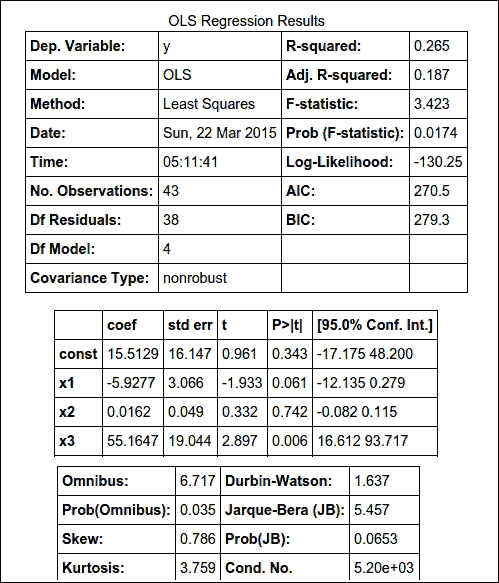

前面的摘要提供了有关该模型的大量信息。 要查找的主要参数是`r`平方值，它告诉您模型捕获了因变量的多少方差。 它的范围从`0`到`1`，并且`p`值告诉我们该模型是否有效。

从前面的输出中，我们可以看到`R-square`的值为`0.265`，这不是很好。 我们可以看到模型显示`x3`为最高有效变量，即`success_field_goals`变量。 根据经验，任何小于 0.05 的`p`值都可以认为是有意义的。

让我们仅使用成功的目标变量来重新创建模型，并查看该模型如何执行：

```py
>>> result_alternate = sm.OLS( y_train, 
 add_constant(X_train[:,2]) ).fit()
>>> result_alternate.summary()

```

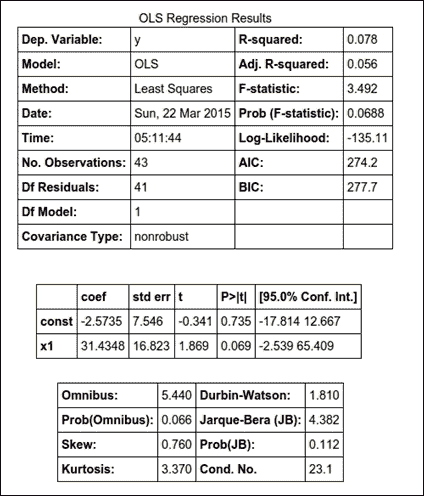

我们可以看到变量变小了，并且 R 平方值真的变低了。 可以使用变量的不同组合多次迭代前面的模型，直到获得最佳模型。

让我们将两个模型应用于测试数据，并查看实际值和预测值之间的均方误差。 给出最小均方误差的模型是一个好的模型：

```py
>>> ypred = result.predict(add_constant(X_valid))
>>> print mse(ypred,y_valid)

35.208

```

在以下代码中，我们使用回归模型对象的预测函数来预测给定的测试数据集：

```py
>>> ypred_alternate = result_alternate.predict(add_constant(X_valid[:, 2]))
>>> print mse(ypred_alternate,y_valid)

26.3

```

我们可以看到，第二个模型的均方误差低于第一个模型。

让我们同时绘制两个模型的预测图和实际图：

```py
>>> fig, ax = plt.subplots(1, 1) 
>>> ax.scatter(y_valid, ypred)
>>> ax.set_xlabel('Actual')
>>> ax.set_ylabel('Predicted')
>>> plt.show()

```

这是前面代码的输出：


现在，让我们绘制替代模型的散布图：

```py
>>> fig, ax = plt.subplots(1, 1) 
>>> ax.scatter(y_valid, ypred_alternate)
>>> ax.set_xlabel('Actual')
>>> ax.set_ylabel('Predicted')
>>> plt.show()

```

这是前面代码的输出：


显然表明我们的模型不够好，因为预测是相当随机的。

为了建立一个高度准确的模型，我们需要更多的变量，这些变量会影响平均得分。

前面的模型是使用 statsmodels 包构建的。 现在，我们将使用 SciKit 构建模型。

以下代码创建一个线性回归对象，然后将其与因变量和独立变量配合使用：

```py
# Create linear regression object
>>> lm = linear_model.LinearRegression()

# Train the model using the training sets
>>> lm.fit(X_train, y_train)

>>> print 'Intercept is %f' % lm.intercept_) 
Intercept is 15.5129271596

>>> pd.DataFrame(zip(b_data.columns,lm.coef_), columns = ['features', 'estimatedCoefficients'])

```

这是前面代码的输出：

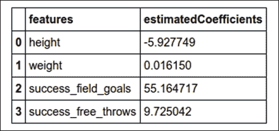

系数和截距类似于使用 statsmodels 软件包构建的模型。

为了计算 SciKit 中的 R 平方，使用了 SciKit 包的交叉验证模块：

```py
>>> cross_validation.cross_val_score(lm, X_train, y_train, scoring='r2')
array([-0.3043391 , -0.42402161,  0.26890649])

```

交叉验证会进行多次，默认情况下为`3`，因此您可以在前面的输出中看到三个值。 最高的值是相关性，您可以看到它与我们使用 statsmodels 构建的值相似。

让我们看看如何计算均方误差：

```py
>>> ypred = lm.predict(X_valid)
>>> mean_squared_error(ypred,y_valid)
35.208

```

我们在这里使用了 SciKit 软件包的`mean_squared_error`功能。

最后，实际图与预测图将与 statsmodels 的第一个模型图相同：

```py
>>> fig, ax = plt.subplots(1, 1) 
>>> ax.scatter(y_valid, ypred)
>>> ax.set_xlabel('Actual')
>>> ax.set_ylabel('Predicted')
>>> plt.show()

```

这是前面代码的输出：

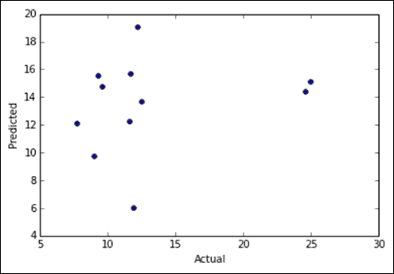

# 摘要

在本章中，我们学习了如何创建简单的线性回归模型，然后再进行多元回归，其中对数据进行了初步检查分析以了解数据。 然后，我们使用 statsmodels 和 SciKit 包创建了回归模型。

在下一章中，我们将学习如何对使用 Logistic 回归进行的事件进行概率评分。