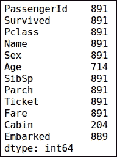
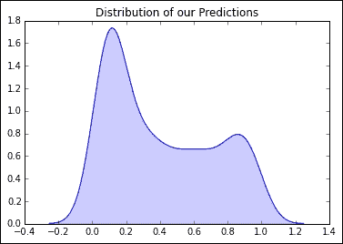
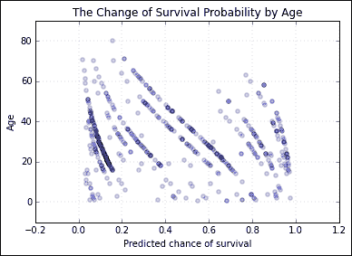
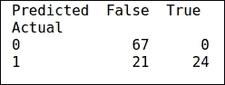
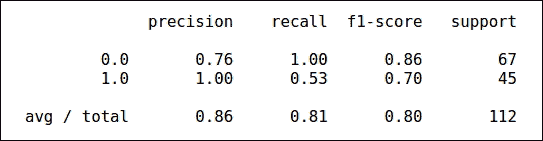
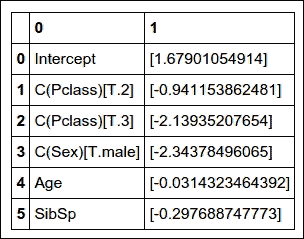
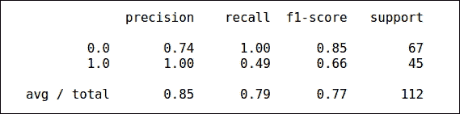
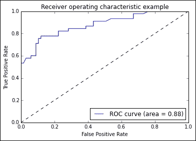

# 第 7 章。估计事件的可能性

逻辑回归是一种回归分析，可帮助您根据某些给定参数估算事件发生的可能性。 它用作具有二进制结果的分类技术。 使用逻辑函数，根据解释性变量（预测变量）对描述单个试验可能结果的概率进行建模。

在第 5 章“发现机器学习”中，已经向您介绍了 *Logisitc 回归*。 在本章中，您将学习：

*   使用 statsmodels 建立逻辑回归模型
*   使用 SciKit 建立逻辑回归模型
*   评估和测试模型

# 逻辑回归

我们将使用泰坦尼克数据集，该数据集在第 3 章“在干草堆中查找针”中使用，以帮助我们建立逻辑回归模型。 由于我们已经探索了数据，因此我们将不进行任何探索性数据分析，因为我们已经有了该数据的上下文。

这是泰坦尼克号数据集的字段描述的回顾：

*   `Survival`：这是指乘客的生存（`0`：否，`1`：是）
*   `Pclass`：这指的是乘客等级（`1`：一等，`2`：二等，`3`：三等）
*   `Name`：这是指乘客的姓名
*   `Sex`：这是指乘客的性别
*   `Age`：这是指乘客的年龄
*   `Sibsp`：指船上兄弟姐妹/配偶的数量
*   `Parch`：这是指船上父母/子女的数量
*   `Ticket`：这是票证编号
*   `Fare`：这是指旅客票价
*   `Cabin`：这是指客舱
*   `Embarked`：此是指登船港口（`C`：瑟堡，`Q`：皇后镇，`S`：南安普敦）

## 数据准备

让我们从读取数据开始：

```py
>>> df = pd.read_csv('Data/titanic data.csv')

```

让我们通过照顾那些缺少很多值的列来稍微清理一下数据：

```py
>>> df.count(0)

```



我们可以看到`Ticket`和`Cabin`列不会为模型构建过程增加太多价值，因为`Ticket`列基本上是每位乘客的唯一标识符，而`Cabin`列基本上是空的。 另外，我们将删除缺少值的行。

我们将从`DataFrame`中删除以下两列：

```py
>>> # Applying axis as 1 to remove the  columns with the following labels
>>> df = df.drop(['Ticket','Cabin','Name'], axis=1)
>>> # Remove missing values
>>> df = df.dropna()

```

## 创建训练和测试集

在前面的代码中，我们删除了`Ticket`，`Cabin`和`Name`列，然后删除了缺少的值。

我们将使用名为 Patsy 的 Python 软件包，该软件包有助于描述统计模型。 它有助于定义与 R 相似的因变量和自变量公式。在`~`左侧定义的变量是因变量，在其右侧定义的变量是自变量。 `C()`中包含的变量被视为分类变量。

现在，我们将根据数据创建训练和测试集：

```py
>>> formula = 'Survived ~ C(Pclass) + C(Sex) + Age + SibSp  + C(Embarked) +  Parch' 

>>> # create a results dictionary to hold our regression results for easy >>> # analysis later
>>> df_train = df.iloc[ 0: 600, : ]
>>> df_test = df.iloc[ 600: , : ]

>>> #Splitting the data into dependent and independent variables
>>> y_train,x_train = dmatrices(formula, data=df_train, return_type='dataframe')
>>> y_test,x_test = dmatrices(formula, data=df_test, return_type='dataframe')

```

在前面的代码中，我们在公式变量中定义方程，其中`survived`是因变量，其右边的是自变量。 之后，我们将前`600`行作为训练集，并将`df``DataFrame`中的其余行作为测试集。

最后，我们使用 Patsy 包的`dmatrices`，该包接受公式并输入一个`DataFrame`来创建一个`DataFrame`。 准备将其输入到 statsmodels 和 SciKit 的建模功能中。

## 建立模型

我们将使用 statsmodels 包来构建模型：

```py
>>> # instantiate our model
>>> model = sm.Logit(y_train,x_train)
>>> res = model.fit()
>>> res.summary()

```

这是前面代码的输出：


我们可以看到，最大似然估计已用于预测系数。 伪 R 平方类似于线性回归的 R 平方，用于测量它的优度。 如果我们得到`0.33`的值，则认为`0.2`和`0.4`之间的伪 R 平方值是好的。

从前面的表中，我们可以看到乘船的港口和父母/子女的数量是重要的预测因子，因为它们的 p 值高于`0.05`。

我们将通过使用预测变量来重建模型，例如类别，年龄，性别和同胞数目：

```py
>>> formula = 'Survived ~ C(Pclass) + C(Sex) + Age + SibSp ' 

>>> y_train,x_train = dmatrices(formula, data=df_train, return_type='dataframe')
>>> y_test,x_test = dmatrices(formula, data=df_test, return_type='dataframe')

>>> # instantiate our model
>>> model = sm.Logit(y_train,x_train)
>>> res = model.fit()
>>> res.summary()

```


我们可以看到，所有预测变量在前面的模型中都很重要。

## 模型评估

现在，让我们用以下代码查看训练数据上预测的分布：

```py
>>> kde_res = KDEUnivariate(res.predict())
>>> kde_res.fit()
>>> plt.plot(kde_res.support,kde_res.density)
>>> plt.fill_between(kde_res.support,kde_res.density, alpha=0.2)
>>> plt.title("Distribution of our Predictions")

```

在前面的代码中，我们使用核密度估计来找到预测值的概率密度。 这有助于我们了解预测概率的哪些区域更密集。



从前面的图中可以看出，在`0`和`1`的概率附近密度较高，这是一个好兆头，表明该模型能够根据给定的数据预测某些模式。 这也表明密度是最高的，接近 0，这意味着很多人无法生存。 这证明了我们在第 3 章，“在干草堆中寻找针”中执行的分析。

让我们看看基于男性的预测分布：

```py
>>> plt.scatter(res.predict(),x_train['C(Sex)[T.male]'] , alpha=0.2)
>>> plt.grid(b=True, which='major', axis='x')
>>> plt.xlabel("Predicted chance of survival")
>>> plt.ylabel("Male Gender")
>>> plt.title("The Change of Survival Probability by Gender being Male")

```

在前面的代码中，我们在预测的生存概率和标志之间创建了一个散点图，该标志指示乘客是男性。


我们可以看到，模型预测表明，如果乘客是男性，那么与女性相比，生存机会要低。 我们的分析在第 3 章，“在干草堆中寻找针”中也显示了这一点，其中发现女性的成活率更高。

现在，让我们看一下基于下层乘客的预测分布：

```py
>>> plt.scatter(res.predict(),x_train['C(Pclass)[T.3]'] , alpha=0.2)
>>> plt.xlabel("Predicted chance of survival")
>>> plt.ylabel("Class Bool") # Boolean class to show if its 3rd class
>>> plt.grid(b=True, which='major', axis='x')
>>> plt.title("The Change of Survival Probability by Lower 
 Class which is 3rd class")

```


我们可以看到，与其他类别的乘客相比，较低类别的乘客的生存概率较低，因为的概率更多地集中于 0。

让我们来看看关于乘客年龄的概率分布：

```py
>>> plt.scatter(res.predict(),x_train.Age , alpha=0.2)
>>> plt.grid(True, linewidth=0.15)
>>> plt.title("The Change of Survival Probability by Age")
>>> plt.xlabel("Predicted chance of survival")
>>> plt.ylabel("Age")

```



如果您观察前面的图，可以看到随着乘客年龄的增加，概率朝图表的左侧倾斜，这表明老年人的存活率较低。

让我们看一下关于同胞/配偶数的概率分布：

```py
>>> plt.scatter(res.predict(),x_train.SibSp , alpha=0.2)
>>> plt.grid(True, linewidth=0.15)
>>> plt.title("The Change of Survival Probability by Number of 
 siblings/spouses")
>>> plt.xlabel("Predicted chance of survival")
>>> ylabel("No. of Siblings/Spouses")

```


从前面的图表中，我们可以看到的唯一模式是，有四到五个兄弟姐妹/配偶的乘客的存活率较低。 对于其余的乘客，或多或少是随机分布的。

## 根据测试数据评估模型

让我们使用测试数据上的模型通过进行预测，并通过保持`0.7`的阈值来通过精度和召回率显示模型的性能：

```py
>>> y_pred = res.predict(x_test)
>>> y_pred_flag = y_pred > 0.7
>>> print pd.crosstab(y_test.Survived
 ,y_pred_flag
 ,rownames = ['Actual']
 ,colnames = ['Predicted'])

>>> print '\n \n'

>>> print classification_report(y_test,y_pred_flag)

```

在前面的代码中，我们在测试数据上获得预测的概率，然后根据`0.7`的阈值为事件分配`True`或`False`。 我们使用 Pandas 的交叉表功能，该功能有助于显示两个变量之间的频率分布。 我们将使用它来获取实际值和预测值之间的交叉表，然后我们将使用 SciKit 的`classification_report`函数来获取精度和调用值：



下图显示了测试数据的精度和召回率：



我们可以看到所有非幸存者均已正确预测，但该模型能够基于 0.7 阈值正确预测仅一半幸存者。 请注意，精度和召回率值将随所使用的阈值而变化。

让我们了解精确度和召回率的含义。

*   **精度**：精度告诉您，在 0 类或 1 类的所有预测中，有多少个已正确预测。 因此，在上述情况下，非幸存者的预测的 76% 是正确的，而幸存者的预测的 100% 是正确的。
*   **召回**：召回告诉您，在实际实例中，有多少个已正确预测。 因此，在上述情况下，所有未幸存的人都可以 100% 的准确度正确预测，但是在所有幸存的人中，只有 53% 的人被正确预测了。

让我们绘制**受试者工作特性**（**ROC**）曲线，其解释如下：

```py
>>> # Compute ROC curve and area the curve
>>> fpr, tpr, thresholds = roc_curve(y_test, y_pred)
>>> roc_auc = auc(fpr, tpr)
>>> print "Area under the ROC curve : %f" % roc_auc

Area under the ROC curve : 0.879934

```

曲线下面的面积是`0.87`，这是一个很好的值。 在前面的代码中，我们使用`roc_curve`函数分别获得错误率和正确率，其定义如下：

假阳性率是`FP / (FP + TN)`，也称为辐射；真阳性率是`TPR = TP / P = TP / (TP + FN)`，也称为灵敏度。

以下是我们的一些观察结果：

*   `False Positive`（`FP`）：这是一个肯定的预测，实际上是错误的。 因此，在前面的交叉表中，`0`为假正例
*   `True Positive`（`TP`）：这是一个肯定的预测，实际上是正确的。 因此，在前面的交叉表中，`24`为真正例
*   `True Negative`（`TN`）：这是一个负面预测，实际上是正确的。 因此，在上述交叉表中，`67`为真负例
*   `False Negative`（`FN`）：这是一个否定预测，实际上是错误的。 因此，在前面的交叉表中，`21`为假负例

因此，误报率告诉我们，在所有未幸存的人中，有百分之几被预测为幸存。 真实阳性率告诉我们，在所有幸存的人中，有百分之多少被预测为幸存了。 理想情况下，假阳性率应低，真阳性率应高。

通过将 TPR 和 FPR 设置为不同的阈值，然后将它们相互绘制，可以创建`roc_curve`功能。

`roc_curve`函数在不同的阈值下给出假阳性率和真阳性率，这将用于绘制 ROC 曲线：

```py
>>> # Plot ROC curve
>>> plt.clf()
>>> plt.plot(fpr, tpr, label='ROC curve (area = %0.2f)' % roc_auc)
>>> plt.plot([0, 1], [0, 1], 'k--')
>>> plt.xlim([0.0, 1.0])
>>> plt.ylim([0.0, 1.0])
>>> plt.xlabel('False Positive Rate')
>>> plt.ylabel('True Positive Rate')
>>> plt.title('Receiver operating characteristic example')
>>> plt.legend(loc="lower right")
>>> plt.show()

```


精度由 ROC 曲线下的面积衡量。 面积 1 代表完美测试； `0.5`区域表示该模型与随机猜测一样好。 对诊断测试的准确性进行分类的大致指南是传统的学术评分系统，如下所示：

| 范围 | 类别 |
| --- | --- |
| 0.90-1 | 优秀（A） |
| 0.80-0.90 | 良好（B） |
| 0.70-0.80 | 一般（C） |
| 0.60-0.70 | 差（D） |
| 0.50-0.60 | 失败（F） |

上图中的虚线的 AUC 为`0.50`，不好。 我们的模型为我们提供了`0.88`的 AUC，这确实很好，并且是图中的蓝线。

## 使用 SciKit 建立和评估模型

让我们使用 SciKit 构建先前显示的相同模型：

```py
>>> # instantiate a logistic regression model, and fit with X and y
>>> model = LogisticRegression()
>>> model = model.fit(x_train, y_train.Survived)

```

在前面的代码中，我们创建`LogisticRegression`方法的对象，然后使用我们的训练数据拟合模型：

```py
>>> # examine the coefficients
>>> pd.DataFrame(zip(x_train.columns, np.transpose(model.coef_)))

```



第一列包含我们的因变量名称，第二列包含系数值。 我们可以看到，我们的预测变量的系数与使用 statsmodels 软件包构建的模型相似但不相同。

让我们看看我们的精确度和召回率是如何表现的：

```py
>>> y_pred = model.predict_proba(x_test)
>>> y_pred_flag = y_pred[:,1] > 0.7

>>> print pd.crosstab(y_test.Survived
 ,y_pred_flag
 ,rownames = ['Actual']
 ,colnames = ['Predicted'])

>>> print '\n \n'

>>> print classification_report(y_test,y_pred_flag)

```


以下显示了测试数据的精度和召回率：



我们可以看到与我们创建的先前模型相比，性能略有不同。 有两种肯定的预测已转变为否定的预测。

让我们计算曲线下的 ROC 和面积：

```py
>>> # Compute ROC curve and area the curve
>>> fpr, tpr, thresholds = roc_curve(y_test, y_pred[:,1])
>>> roc_auc = auc(fpr, tpr)
>>> print "Area under the ROC curve : %f" % roc_auc
Area under the ROC curve :0.878275

```

它几乎相同，但略小于先前模型的 AUC。

让我们绘制 ROC 曲线，该曲线几乎与以前的模型相同：

```py
>>> # Plot ROC curve
>>> plt.clf()
>>> plt.plot(fpr, tpr, label='ROC curve (area = %0.2f)' % roc_auc)
>>> plt.plot([0, 1], [0, 1], 'k--')
>>> plt.xlim([0.0, 1.0])
>>> plt.ylim([0.0, 1.0])
>>> plt.xlabel('False Positive Rate')
>>> plt.ylabel('True Positive Rate')
>>> plt.title('Receiver operating characteristic example')
>>> plt.legend(loc="lower right")
>>> plt.show()

```



# 总结

在本章中，您学习了逻辑回归的目的。 您学习了如何使用 statsmodels 和 SciKit 构建逻辑回归模型，然后如何评估模型并查看其是否为好模型。

在下一章中，您将学习如何生成建议，例如您在[这个页面](http://www.amazon.com/)上看到的建议，根据您的购买历史将向您推荐新商品。 也可以根据您当前正在浏览的产品向您显示类似的项目。