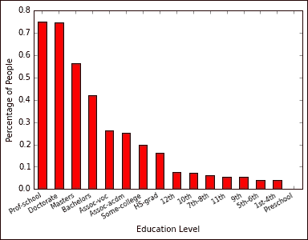
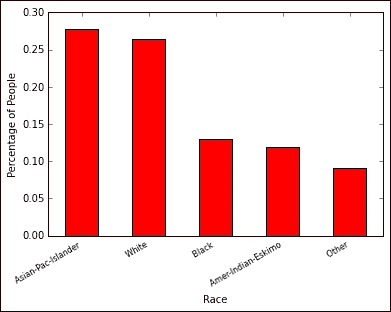
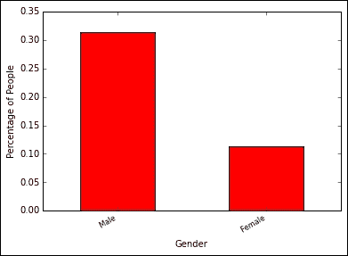
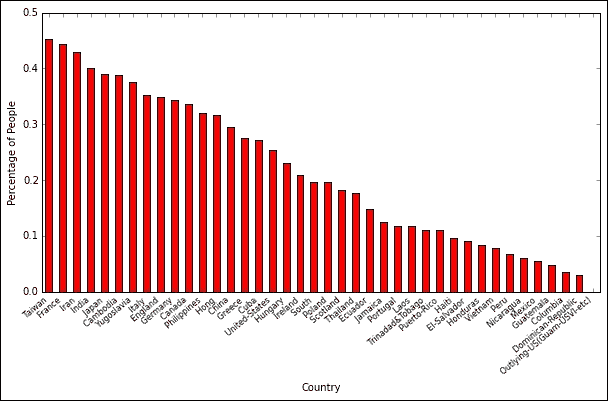
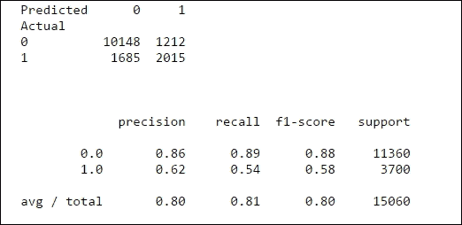
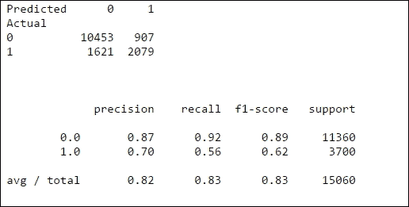

# 第 9 章。使用集成模型推边界

集成建模是一个过程，其中生成两个或多个模型，然后将其结果合并。 在本章中，我们将介绍一个随机森林，这是一种非参数建模技术，其中在训练期间创建了多个决策树，然后将这些决策树的结果取平均值，以提供所需的输出。 之所以称为**随机森林**，是因为在训练期间会根据随机选择的要素创建许多决策树。

一个比喻是试图猜测一个玻璃罐中的卵石数量。 有些人试图猜测罐子里的卵石数量。 单独地，每个人在猜测玻璃罐中的卵石数量时都会犯错，但是当您对他们的每个猜测进行平均时，所得到的平均猜测将非常接近罐中卵石的实际数量。

在本章中，您将学习如何：

*   处理有关美国收入的人口普查数据并浏览该数据
*   做出决策树以预测某人的收入是否超过 5 万美元
*   制作随机森林模型并获得改进的数据性能

# 人口普查收入数据集

下表是由加州大学尔湾分校创建的收入普查数据集：

<colgroup><col style="text-align: left"> <col style="text-align: left"></colgroup> 
| 

列

 | 

描述

 |
| --- | --- |
| `age` | 这是指一个人的年龄 |
| `work class` | 这是指一个人从事的工作类型 |
| `education` | 这是指一个人的教育水平 |
| `marital_status` | 这是指一个人是否已婚 |
| `occupation` | 这是指一个人从事的工作类型 |
| `relationship` | 这是指人际关系的类型 |
| `race` | 这是指一个人的种族 |
| `gender` | 这是指一个人的性别 |
| `hours_per_week` | 这是指每周的平均工作时间 |
| `native_country` | 这是指原籍国 |
| `greater_than_50k` | 这是指一个标志，该标志指示一个人是否一年收入超过50K 刀|

让我们加载以下数据：

```py
>>> data = pd.read_csv('./Data/census.csv')

```

让我们检查数据的填充率：

```py
>>> data.count(0)/data.shape[0] * 100
age                 100.000000
workclass            94.361179
education           100.000000
education_num       100.000000
marital_status      100.000000
occupation           94.339681
relationship        100.000000
race                100.000000
gender              100.000000
capital_gain        100.000000
capital_loss        100.000000
hours_per_week      100.000000
native_country       98.209459
greater_than_50k    100.000000
dtype: float64

```

我们可以看到这些列具有良好的填充率。 我们将删除具有空值的行，并删除`education_num`列，因为它包含相同的信息，例如教育程度及其唯一代码：

```py
>>> data = data.dropna(how='any')
>>> del data['education_num']

```

## 探索人口普查数据

在构建模型之前，让我们探索人口普查数据并了解数据的模式。

### 假设 1：年龄较大的人收入更高

我们将创建一个直方图，说明收入超过 50K 刀的人：

```py
>>> hist_above_50 = plt.hist(data[data.greater_than_50k == 1].age.values, 10, facecolor='green', alpha=0.5)
>>> plt.title('Age distribution of Above 50K earners')
>>> plt.xlabel('Age')
>>> plt.ylabel('Frequency')

```

这是前面代码的直方图：


现在，我们将使用以下代码绘制年收入低于 5 万美元的人的年龄直方图：

```py
>>> hist_below_50 = plt.hist(data[data.greater_than_50k == 0].age.values, 10, facecolor='green', alpha=0.5)
>>> plt.title('Age distribution of below 50K earners')
>>> plt.xlabel('Age')
>>> plt.ylabel('Frequency)

```


我们可以看到，收入超过 50K 刀的人的年龄大多在 30 年代末至 50 年代中期，而收入低于 50K 刀的人则主要在 20 至 30 岁之间。

### 假设 2：基于工人阶级的收入偏见

让我们看看，在不同的工人阶级群体中，收入超过 50K 刀的人的分布是什么。 我们将使用以下代码查看每个组中收入超过 5 万美元的收入者的百分比：

```py
>>> dist_data = pd.concat([data[data.greater_than_50k == 1].groupby('workclass').workclass.count()
 , data[data.greater_than_50k == 0].groupby('workclass').workclass.count()], axis=1)
>>> dist_data.columns = ['wk_class_gt50','wk_class_lt50']
>>> dist_data_final = dist_data.wk_class_gt50 / (dist_data.wk_class_lt50 + dist_data.wk_class_gt50 )
>>> dist_data_final.sort(ascending=False)
>>> ax = dist_data_final.plot(kind = 'bar', color = 'r', y='Percentage')
>>> ax.set_xticklabels(dist_data_final.index, rotation=30, fontsize=8, ha='right')
>>> ax.set_xlabel('Working Class')
>>> ax.set_ylabel('Percentage of People')

```


我们看到，自营职业并拥有公司的人所获得的最大份额收入超过 50K 刀。 就收入而言，第二富裕人群是联邦政府雇员。

### 假设 3：受过更多教育的人收入更高

教育是的重要领域。 它应与个人的收入水平有关：

```py
>>> dist_data = pd.concat([data[data.greater_than_50k == 1].groupby('education').education.count()
 , data[data.greater_than_50k == 0].groupby('education').education.count()], axis=1)

>>> dist_data.columns = ['education_gt50','education_lt50']

>>> dist_data_final = dist_data.education_gt50 / (dist_data.education_gt50 + dist_data.education_lt50)

>>> dist_data_final.sort(ascending = False)
>>> ax = dist_data_final.plot(kind = 'bar', color = 'r')
>>> ax.set_xticklabels(dist_data_final.index, rotation=30, fontsize=8, ha='right')
>>> ax.set_xlabel('Education Level')
>>> ax.set_ylabel('Percentage of People')

```



我们可以看到，受过教育的人越多，其小组中收入超过 5 万美元的人数就越多。

### 假设 4：已婚人士的收入往往更高

让我们看看如何根据婚姻状况进行分配：

```py
>>> dist_data = pd.concat([data[data.greater_than_50k == 1].groupby('marital_status').marital_status.count()
 , data[data.greater_than_50k == 0].groupby('marital_status').marital_status.count()], axis=1)
>>> dist_data.columns = ['marital_status_gt50','marital_status_lt50']

>>> dist_data_final = dist_data.marital_status_gt50 / (dist_data.marital_status_gt50+dist_data.marital_status_lt50)

>>> dist_data_final.sort(ascending = False)

>>> ax = dist_data_final.plot(kind = 'bar', color = 'r')
>>> ax.set_xticklabels(dist_data_final.index, rotation=30, fontsize=8, ha='right')
>>> ax.set_xlabel('Marital Status')
>>> ax.set_ylabel('Percentage of People')

```


我们可以看到，已婚的收入比单身的收入要高。

### 假设 5：基于种族的收入存在偏差

让我们看看的获利能力是基于人的种族的：

```py
>>> dist_data = pd.concat([data[data.greater_than_50k == 1].groupby('race').race.count()
 , data[data.greater_than_50k == 0].groupby('race').race.count()], axis=1)

>>> dist_data.columns = ['race_gt50','race_lt50']

>>> dist_data_final = dist_data.race_gt50 / (dist_data.race_gt50 + dist_data.race_lt50 )

>>> dist_data_final.sort(ascending = False)

>>> ax = dist_data_final.plot(kind = 'bar', color = 'r')

>>> ax.set_xticklabels(dist_data_final.index, rotation=30, fontsize=8, ha='right')
>>> ax.set_xlabel('Race')
>>> ax.set_ylabel('Percentage of People')

```



亚太地区人和白人的收入能力最高。

### 假设 6：基于职业的收入存在偏差

让我们看看的赚钱能力是基于一个人的职业而定的：

```py
>>> dist_data = pd.concat([data[data.greater_than_50k == 1].groupby('occupation').occupation.count()
 , data[data.greater_than_50k == 0].groupby('occupation').occupation.count()], axis=1)

>>> dist_data.columns = ['occupation_gt50','occupation_lt50']

>>> dist_data_final = dist_data.occupation_gt50 / (dist_data.occupation_gt50 + dist_data.occupation_lt50 )

>>> dist_data_final.sort(ascending = False)

>>> ax = dist_data_final.plot(kind = 'bar', color = 'r')

>>> ax.set_xticklabels(dist_data_final.index, rotation=30, fontsize=8, ha='right')
>>> ax.set_xlabel('Occupation')
>>> ax.set_ylabel('Percentage of People')

```


我们可以看到担任专业或管理职位的人收入更高。

### 假设 7：男人的收入更高

让我们看看的收入能力如何基于性别：

```py
>>> dist_data = pd.concat([data[data.greater_than_50k == 1].groupby('gender').gender.count()
 , data[data.greater_than_50k == 0].groupby('gender').gender.count()], axis=1)
>>> dist_data.columns = ['gender_gt50','gender_lt50']

>>> dist_data_final = dist_data.gender_gt50 / (dist_data.gender_gt50 + dist_data.gender_lt50)

>>> dist_data_final.sort(ascending = False)

>>> ax = dist_data_final.plot(kind = 'bar', color = 'r')

>>> ax.set_xticklabels(dist_data_final.index, rotation=30, fontsize=8, ha='right')
>>> ax.set_xlabel('Gender')
>>> ax.set_ylabel('Percentage of People')

```



看到男性拥有比女性更高的收入能力也就不足为奇了。 将来某个时候以相等的水平看到两个柱线会很好。

### 假设 8：钟表时间越长的人收入越高

让我们看看根据每周工作时间得出的收入超过50K 刀的人群分布：

```py
>>> hist_above_50 = plt.hist(data[data.greater_than_50k == 1].hours_per_week.values, 10, facecolor='green', alpha=0.5)
>>> plt.title('Hours per week distribution of Above 50K earners')

```


现在，让我们看看根据他们每周的工作时间得出的低于50K 刀的收入者的分布：

```py
>>> hist_below_50 = plt.hist(data[data.greater_than_50k == 0].hours_per_week.values, 10, facecolor='green', alpha=0.5)
>>> plt.title('Hours per week distribution of Below 50K earners')

```


我们可以看到，收入超过50K 刀的人每周平均工作 40 小时，但是可以看出，收入超过50K 刀的人有更多的工作时间， 40 小时

### 假设 9：基于原籍国的收入存在偏差

让我们看看收入能力如何基于一个人的原籍国：

```py
>>> plt.figure(figsize=(10,5))
>>> dist_data = pd.concat([data[data.greater_than_50k == 1].groupby('native_country').native_country.count()
 , data[data.greater_than_50k == 0].groupby('native_country').native_country.count()], axis=1)

>>> dist_data.columns = ['native_country_gt50','native_country_lt50']

>>> dist_data_final = dist_data.native_country_gt50 / (dist_data.native_country_gt50 + dist_data.native_country_lt50 )

>>> dist_data_final.sort(ascending = False)

>>> ax = dist_data_final.plot(kind = 'bar', color = 'r')

>>> ax.set_xticklabels(dist_data_final.index, rotation=40, fontsize=8, ha='right')
>>> ax.set_xlabel(Country)
>>> ax.set_ylabel('Percentage of People')

```



我们可以看到台湾人，法国人，伊朗人和印度人是各县中收入最高的人。

# 决策树

为了了解基于决策树的模型，让我们尝试想象 Google 希望招募人员从事软件开发工作。 根据他们已有的员工和先前拒绝的员工，我们可以确定申请人是否来自常春藤大学，以及**平均绩点**（**GPA**）是多少。

决策树会将申请人分为常春藤联盟和非常春藤联盟。 然后将常春藤盟军分为高 GPA 和低 GPA，这样高 GPA 的人很可能被高标签，而 GPA 低的人则可能被招募。

GPA 高且属于非常春藤盟校的申请人与 GPA 低且属于非常春藤盟校的申请人相比，被招募的机会略高。

前面的解释是决策树的简单含义。

让我们根据我们的数据创建一个决策树，以预测一个人的收入超过 5 万美元的可能性是：

```py
>>> data_test = pd.read_csv('./Data/census_test.csv')
>>> data_test = data_test.dropna(how='any')
>>> formula = 'greater_than_50k ~  age + workclass + education + marital_status + occupation + race + gender + hours_per_week + native_country '
>>> y_train,x_train = dmatrices(formula, data=data, return_type='dataframe')
>>> y_test,x_test = dmatrices(formula, data=data_test, return_type='dataframe')
>>> clf = tree.DecisionTreeClassifier()
>>> clf = clf.fit(x_train, y_train)

```

让我们看看模型如何执行：

```py
>>> from sklearn.metrics import classification_report
>>> y_pred = clf.predict(x_test)
>>> print pd.crosstab(y_test.greater_than_50k
 ,y_pred
 ,rownames = ['Actual']
 ,colnames = ['Predicted'])
>>> print '\n \n'
>>> print classification_report(y_test.greater_than_50k,y_pred)

```


我们可以看到，收入不超过50K 刀的人们可以得到很好的预测，其准确度为 85%，召回率为 87%。 收入超过50K 刀的人只能以 56% 的准确度和 52% 的召回率来预测

请注意，公式中给出的因变量的顺序将略微更改这些值。 您可以尝试查看更改变量的顺序是否会提高其精度/调用率。

# 随机森林

我们已经学习了如何创建决策树，但是，有时在变量很多且数据集很大的情况下，决策树模型无法很好地发挥作用。 这就是诸如随机森林之类的整体模型得以拯救的地方。

随机森林基本上在数据集上创建许多决策树，然后对结果求平均。 如果您看到歌唱比赛（例如《美国偶像》）或体育比赛（例如，奥运会），则有多个评委。 拥有多名法官的原因是为了消除偏见并给出公正的结果，而这正是随机森林试图实现的目标。

如果数据稍有变化，决策树可能会发生巨大变化，并且很容易使数据过度拟合。

让我们尝试创建一个随机森林模型，并查看其精度/召回率与刚创建的决策树的比较：

```py
>>> import sklearn.ensemble as sk
>>> clf = sk.RandomForestClassifier(n_estimators=100)
>>> clf = clf.fit(x_train, y_train.greater_than_50k)

```

构建模型后，让我们在测试数据上对模型进行交叉验证：

```py
>>> y_pred = clf.predict(x_test)
>>> print pd.crosstab(y_test.greater_than_50k
 ,y_pred
 ,rownames = ['Actual']
 ,colnames = ['Predicted'])
>>> print '\n \n'
>>> print classification_report(y_test.greater_than_50k,y_pred)

```



我们可以看到，我们提高了收入和收入不超过50K 刀的人的准确性和召回率。

让我们尝试通过使用`min_samples_split`参数并将其设置为`5`来对进行微调，以使模型获得更好的性能。 此参数告诉我们创建拆分所需的最小样本数为`5`：

```py
>>> clf = sk.RandomForestClassifier(n_estimators=100, oob_score=True,min_samples_split=5)
>>> clf = clf.fit(x_train, y_train.greater_than_50k)
>>> y_pred = clf.predict(x_test)
>>> print pd.crosstab(y_test.greater_than_50k
 ,y_pred
 ,rownames = ['Actual']
 ,colnames = ['Predicted'])
>>> print '\n \n'
>>> print classification_report(y_test.greater_than_50k,y_pred)

```


我们将召回率提高了 0% 至 90%，1% 至 56% 和 1% 至 65% 的精度。

我们将使用`min_leaf`参数将最小叶数增加到`2`，从而进一步调整模型。 此参数的含义表示要创建的最小节点数为`2`：

```py
>>> clf = sk.RandomForestClassifier(n_estimators=100, oob_score=True,min_samples_split=5, min_samples_leaf= 2)
>>> clf = clf.fit(x_train, y_train.greater_than_50k)

>>> y_pred = clf.predict(x_test)

>>> print pd.crosstab(y_test.greater_than_50k
 ,y_pred
 ,rownames = ['Actual']
 ,colnames = ['Predicted'])

>>> print '\n \n'

>>> print classification_report(y_test.greater_than_50k,y_pred)

```



我们进一步将召回率从 0% 提高到了 92%，并将查准率提高了 1% 至 70%。 这个模型表现不错。

让我们看看有助于预测的变量的重要性。 我们将使用`clf`对象的特征重要性属性，并使用它来绘制重要特征，例如按重要性排序的因变量：

```py
>>> model_ranks = pd.Series(clf.feature_importances_, index=x_train.columns, name='Importance').sort(ascending=False, inplace=False)
>>> model_ranks.index.name = 'Features'
>>> top_features = model_ranks.iloc[:31].sort(ascending=True, inplace=False)
>>> plt.figure(figsize=(15,7))
>>> ax = top_features.plot(kind='barh')
>>> _ = ax.set_title("Variable Ranking")
>>> _ = ax.set_xlabel('Performance')
>>> _ = ax.set_yticklabels(top_features.index, fontsize=8)

```


我们可以看到，那些与平民配偶结婚的人可以很好地表明特定人群的收入是否超过 5 万美元。 接下来是人的年龄，最后是一个人每周工作的小时数。 此外，未婚人士是预测收入低于50K 刀的人群的良好指标。

# 摘要

在本章中，我们探索了普查数据中的模式，然后了解了如何构建决策树，并且还基于给定的数据建立了决策树模型。 然后，您在随机森林的帮助下学习了集成模型的概念，并通过使用随机森林模型提高了预测的性能。

在下一章中，您将学习聚类，基本上是将彼此相似的元素分组在一起。 我们将为此使用 K 均值聚类。