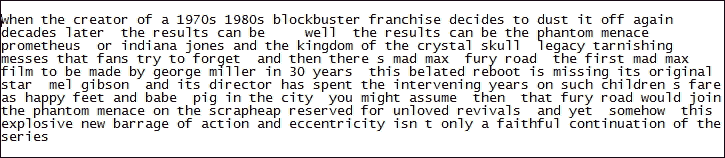
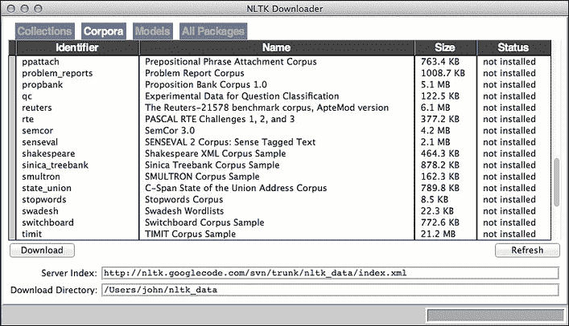
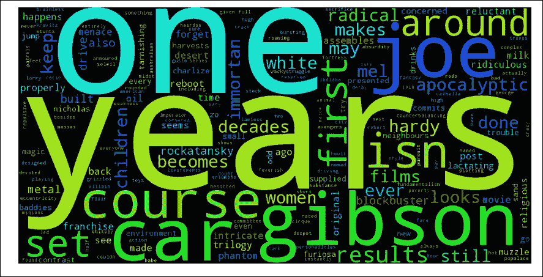
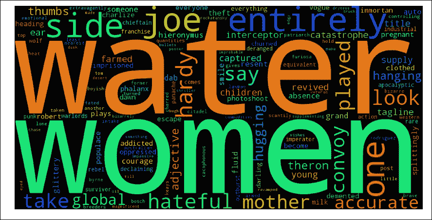
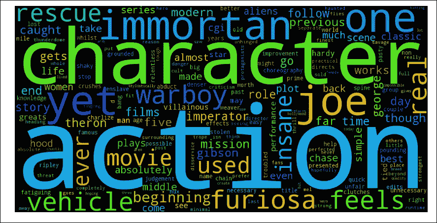
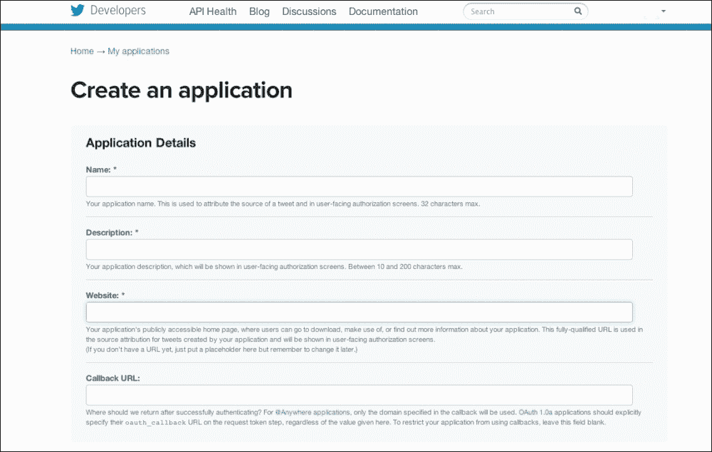
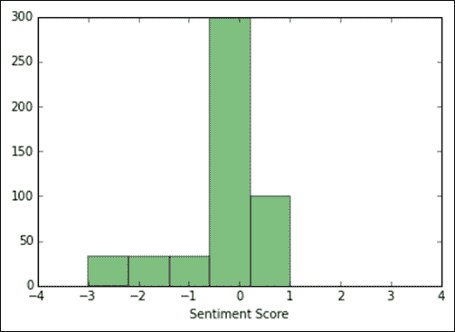

# 第 11 章。通过文本挖掘分析非结构化数据

那里有很多非结构化数据，例如新闻文章，客户反馈，Twitter 推文等，其中包含信息并需要进行分析。 文本挖掘是一种数据挖掘技术，可帮助我们对这种非结构化数据进行分析。

在本章中，我们将学习以下内容：

*   预处理数据
*   从数据绘制词云
*   单词和句子分词
*   标记词性
*   词干提取和词形还原
*   应用斯坦福命名实体识别器

# 预处理数据

我们将通过 BBC，《福布斯》，《卫报》和《电影飞行员》的在线门户网站使用《疯狂的麦克斯：狂暴之路》的评论。

我们将在本章中广泛使用 Python 的**自然语言工具包**（**NLTK**）包进行文本挖掘。 您可以在[这个页面](http://www.nltk.org/install.html)上的说明帮助下进行安装。

我们将对数据执行以下操作：

*   删除标点符号
*   删除数字
*   将文本转换为小写
*   删除英语中最常见的单词，称为停用词，例如`be`，`the`，`on`等。

让我们首先加载数据开始：

```py
>>> data = {}

>>> #data['bbc'] =

>>> data['bbc'] = open('./Data/madmax_review/bbc.txt','r').read()

>>> data['forbes'] = open('./Data/madmax_review/forbes.txt','r').read()

>>> data['guardian'] = open('./Data/madmax_review/guardian.txt','r').read()

>>> data['moviepilot'] = open('./Data/madmax_review/moviepilot.txt','r').read()

>>> # We'll convert the text to lower case

>>> #Conversion to lower case
>>> for k in data.keys():
>>>    data[k] = data[k].lower()

>>> print data['bbc'][:800]

```


现在，我们将在分析每个单词的出现频率时从文本中删除标点：

```py
>>> #Removing punctuation
>>> for k in data.keys():
 data[k] = re.sub(r'[-./?!,":;()\']',' ',data[k]) 

>>> print data['bbc'][:800]

```



我们将从文本中删除数字：

```py
>>> #Removing number
>>> for k in data.keys():
 data[k] = re.sub('[-|0-9]',' ',data[k])

>>> print data['bbc'][:800]

```


我们需要下载并安装`nltk`的`stopwords`软件包，可以使用以下命令来完成：

```py
>>> import nltk
>>> nltk.download_gui()

```

您将获得以下 GUI，可以从中安装停用词：



发布此信息后，我们将删除常见停用词，例如`ours`，`yours`，`that`，`this`等：

```py
>>> #Removing stopwords
>>> for k in data.keys():
 data[k] = data[k].split()

>>> stopwords_list = stopwords.words('english')
>>> stopwords_list = stopwords_list + ['mad','max','film','fury','miller','road']

>>> for k in data.keys():
 data[k] = [ w for w in data[k] if not w in stopwords_list ]

>>> print data['bbc'][:80]

['creator', 'blockbuster', 'franchise', 'decides', 'dust', 'decades', 'later', 'results', 'well', 'results', 'phantom', 'menace', 'prometheus', 'indiana', 'jones', 'kingdom', 'crystal', 'skull', 'legacy', 'tarnishing', 'messes', 'fans', 'try', 'forget', 'first', 'made', 'george', 'years', 'belated', 'reboot', 'missing', 'original', 'star', 'mel', 'gibson', 'director', 'spent', 'intervening', 'years', 'children', 'fare', 'happy', 'feet', 'babe', 'pig', 'city', 'might', 'assume', 'would', 'join', 'phantom', 'menace', 'scrapheap', 'reserved', 'unloved', 'revivals', 'yet', 'somehow', 'explosive', 'new', 'barrage', 'action', 'eccentricity', 'isn', 'faithful', 'continuation', 'series', 'also', 'exhilarating', 'high', 'point', 'made', 'trilogy', 'three', 'decades', 'ago', 'seems', 'revving', 'benefit', 'uninitiated']

```

# 创建`wordcloud`

`worldcloud`是单词的拼贴，而大小较大的单词的出现频率很高。

如果使用 Ubuntu，则可以使用以下命令下载`wordcloud`：

```py
$ pip install git+git://github.com/amueller/word_cloud.git

```

您可以通过参考[这个页面](https://github.com/amueller/word_cloud)遵循说明进行操作。

让我们使用以下代码为 BBC 绘制`wordcloud`：

```py
>>> wordcloud = WordCloud(width = 1000, height = 500).generate(' '.join(data['bbc']))

>>> plt.figure(figsize=(15,8))

>>> plt.imshow(wordcloud)

>>> plt.axis("off")

>>> plt.show()

```



从前面的`wordcloud`中，我们可以发现，提到了 80 年代的 Mad Max 和当前的 Mad Max 之间的持续时间长。 本文讨论了梅尔·吉布森（Mel Gibson），汽车和小人 Immortan Joe，因为它们是最常出现的关键字。 还强调了*一个*关键字给出的电影的不同方面。

现在，通过使用以下代码，让我们看看对于 Forbes 而言，`wordcloud`的样子：

```py
>>> wordcloud = WordCloud(width = 1000, height = 500).generate(' '.join(data['forbes']))
>>> plt.figure(figsize=(15,8))
>>> plt.imshow(wordcloud)
>>> plt.axis("off")
>>> plt.show()

```


福布斯更多地谈论女性角色。

这是《卫报》的字云，如下所示：

```py
>>> wordcloud = WordCloud(width = 1000, height = 500).generate(' '.join(data['guardian']))

>>> plt.figure(figsize=(15,8))

>>> plt.imshow(wordcloud)

>>> plt.axis("off")

>>> plt.show()

```



监护人强调妇女和水。 如果您看过电影，那么您会了解到 Guardian 强调女性角色及其荒地中缺水的情况。

最后，这是 moviepilot 的词云的样子：

```py
>>> wordcloud = WordCloud(width = 1000, height = 500).generate(' '.join(data['moviepilot']))

>>> plt.figure(figsize=(15,8))

>>> plt.imshow(wordcloud)

>>> plt.axis("off")

>>> plt.show()

```



[这个页面](http://moviepilot.com/)强调了电影中所显示的 Immortan Joe 的角色，一般角色以及的战争男孩。

# 单词和句子分词

我们之前已经处理过单词分词，但是我们可以使用 NLTK 以及句子分词来执行此操作，这非常棘手，因为英语中有用于缩写和其他目的的句点符号。 幸运的是，句子标记器是`nltk`的`tokenize.punkt`模块中`PunktSentenceTokenizer`的实例，该模块有助于标记句子。

让我们看一下使用以下代码的单词分词：

```py
>>> #Loading the forbes data
>>> data = open('./Data/madmax_review/forbes.txt','r').read()

>>> word_data = nltk.word_tokenize(data)
>>> word_data[:15]
['Pundits',
 'and',
 'critics',
 'like',
 'to',
 'blame',
 'the',
 'twin',
 'successes',
 'of',
 'Jaws',
 'and',
 'Star',
 'Wars',
 'for']

```

现在，让我们执行《福布斯》文章的句子分词：

```py
>>> sent_tokenize(data)[:5]

['Pundits and critics like to blame the twin successes of Jaws and Star Wars for turning Hollywood into something of a blockbuster factory.', "We can debate the merits of said accusation, but for me it comes down to one simple factor: If every would-be blockbuster, or even most would-be blockbusters were as good as Jaws and/or Star Wars, I imagine most of us wouldn't be complaining nearly as much.", "That brings us to George Miller's Mad Max: Fury Road.", "It is a revamp/reboot/sequel for a 30-year old franchise, directed by the original helmer who hasn't been culturally relevant in decades, featuring a new and somewhat flavor-of-the-month actor, and seemingly only existing because of the fact that the property is vaguely known and thus has a token amount of built-in awareness.", "If  you think that sounds like the kind of thing I complain about rather regularly, you'd be correct."]

```

您可以看到在执行句子分词之后，每个句子都是列表的元素。

# 词性标记

词性标记部分是文本分析的重要任务之一。 它有助于根据句子的上下文或单词在句子中扮演的角色来标记每个单词。

让我们看看如何使用`nltk`执行词性标记：

```py
>>> pos_word_data = nltk.pos_tag(word_data)

>>> pos_word_data[ : 10]

[('Pundits', 'NNS'),
 ('and', 'CC'),
 ('critics', 'NNS'),
 ('like', 'IN'),
 ('to', 'TO'),
 ('blame', 'VB'),
 ('the', 'DT'),
 ('twin', 'NN'),
 ('successes', 'NNS'),
 ('of', 'IN')]

```

您可以看到诸如`NNS`，`CC`，`IN`，`TO`，`DT`和`NN`之类的标签。 让我们看看使用此代码的含义：

```py
>>> nltk.help.upenn_tagset('NNS')

NNS: noun, common, plural undergraduates scotches bric-a-brac products bodyguards facets coasts divestitures storehouses designs clubs fragrances averages subjectivists apprehensions muses factory-jobs

>>> nltk.help.upenn_tagset('NN')

NN: noun, common, singular or mass common-carrier cabbage knuckle-duster Casino afghan shed thermostat investment slide humour falloff slick wind hyena override subhumanity machinist

>>> nltk.help.upenn_tagset('IN')

IN: preposition or conjunction, subordinating astride among uppon whether out inside pro despite on by throughout below within for towards near behind atop around if like until below next into if beside

>>> nltk.help.upenn_tagset('TO')

TO: "to" as preposition or infinitive marker
 to

>>> nltk.help.upenn_tagset('DT')

DT: determiner all an another any both del each either every half la many much nary neither no some such that the them these this those

>>> nltk.help.upenn_tagset('CC')

CC: conjunction, coordinating & 'n and both but either et for less minus neither nor or plus so therefore times v. versus vs. whether yet

```

您可以在[这个页面](https://www.ling.upenn.edu/courses/Fall_2003/ling001/penn_treebank_pos.html)上获取有关以上代码中使用的标签的更多信息。

您可以看到前面的代码在中使用的单词已被正确标记。 这种标记可以帮助我们在数据上创建试探法，然后从中提取信息。 例如，我们可以取出文章中的所有名词并分析文章的主题。

# 词干提取和词形还原

文本文档可以包含不同形式的单词，例如播放，播放和播放。 它们是相似的，并且具有共同的根源。

词干提取和词形还原是用于找到这些共同根的技术。 找到根源将有助于我们计算，玩耍，玩耍和玩耍，就像所有单词都在谈论玩耍一样。

词干更多是到达词根的粗略形式。 因此，在前面的示例中，播放将减少为播放。 合法化将上下文词（例如，坏和坏）带入到常见的坏词根中。

## 词干提取

词干是将单词还原为词根形式的过程。 词根形式本身不是单词，但可以通过在单词后添加正确的后缀来形成单词。

如果您取鱼，钓鱼和捕鱼，它们都可以阻止捕鱼。 同样，学习，学习和学习也可以被限制为学习，这不是英语的一部分。

有各种类型的词干算法，例如 Porter，Lancaster，Snowball 等。

波特是最常用的词干。 它也是最温和的词干之一，并且在算法方面占用大量计算资源。

Snowball 算法被认为是对 Porter 的改进。 实际上，波特本人也承认 Snowball 算法比他的算法更好。

Lancaster 是一种更具攻击性的词干算法。 读者可以理解 Porter 和 Snowball 的词根提取功能，但 Lancaster 不能理解，因为这会使单词更加晦涩难懂。 Lancaster 被认为是这三种算法中最快的算法，它可以与大量单词配合使用，但是如果您正在寻找更具特色的东西，那么 Lancaster 不适合您。

让我们使用以下代码尝试波特提取算法：

```py
>>> from nltk.stem.porter import PorterStemmer

>>> porter_stemmer = PorterStemmer()

>>> for w in word_data[:20]:
 print "Actual: %s  Stem: %s"  % (w,porter_stemmer.stem(w))

Actual: Pundits  Stem: Pundit
Actual: and  Stem: and
Actual: critics  Stem: critic
Actual: like  Stem: like
Actual: to  Stem: to
Actual: blame  Stem: blame
Actual: the  Stem: the
Actual: twin  Stem: twin
Actual: successes  Stem: success
Actual: of  Stem: of
Actual: Jaws  Stem: Jaw
Actual: and  Stem: and
Actual: Star  Stem: Star
Actual: Wars  Stem: War
Actual: for  Stem: for
Actual: turning  Stem: turn
Actual: Hollywood  Stem: Hollywood
Actual: into  Stem: into
Actual: something  Stem: someth
Actual: of  Stem: of

```

让我们使用以下代码试用 Lancaster 算法：

```py
>>> from nltk.stem.lancaster import LancasterStemmer

>>> lancaster_stemmer = LancasterStemmer()

>>> for w in word_data[:20]:
 print "Actual: %s  Stem: %s"  % (w,lancaster_stemmer.stem(w))

Actual: Pundits  Stem: pundit
Actual: and  Stem: and
Actual: critics  Stem: crit
Actual: like  Stem: lik
Actual: to  Stem: to
Actual: blame  Stem: blam
Actual: the  Stem: the
Actual: twin  Stem: twin
Actual: successes  Stem: success
Actual: of  Stem: of
Actual: Jaws  Stem: jaw
Actual: and  Stem: and
Actual: Star  Stem: star
Actual: Wars  Stem: war
Actual: for  Stem: for
Actual: turning  Stem: turn
Actual: Hollywood  Stem: hollywood
Actual: into  Stem: into
Actual: something  Stem: someth
Actual: of  Stem: of

```

现在，让我们使用以下代码尝试 Snowball 算法：

```py
>>> from nltk.stem.snowball import SnowballStemmer

>>> snowball_stemmer = SnowballStemmer("english")

>>> for w in word_data[:20]:
 print "Actual: %s  Stem: %s"  % (w,snowball_stemmer.stem(w))

Actual: Pundits  Stem: pundit
Actual: and  Stem: and
Actual: critics  Stem: critic
Actual: like  Stem: like
Actual: to  Stem: to
Actual: blame  Stem: blame
Actual: the  Stem: the
Actual: twin  Stem: twin
Actual: successes  Stem: success
Actual: of  Stem: of
Actual: Jaws  Stem: jaw
Actual: and  Stem: and
Actual: Star  Stem: star
Actual: Wars  Stem: war
Actual: for  Stem: for
Actual: turning  Stem: turn
Actual: Hollywood  Stem: hollywood
Actual: into  Stem: into
Actual: something  Stem: someth
Actual: of  Stem: of

```

## 词形还原

词形还原与词干相似，但与词干不同，它引入了词的上下文。

基于词形化的算法会将火车与单词机车匹配，但词干算法将无法做到这一点。 词形还原算法利用字典来链接单词。

`WordNet`是普林斯顿的英语词汇数据库，我们将使用其词素化技术：

```py
Actual: Pundits  Lemma: Pundits
Actual: and  Lemma: and
Actual: critics  Lemma: critic
Actual: like  Lemma: like
Actual: to  Lemma: to
Actual: blame  Lemma: blame
Actual: the  Lemma: the
Actual: twin  Lemma: twin
Actual: successes  Lemma: success
Actual: of  Lemma: of
Actual: Jaws  Lemma: Jaws
Actual: and  Lemma: and
Actual: Star  Lemma: Star
Actual: Wars  Lemma: Wars
Actual: for  Lemma: for
Actual: turning  Lemma: turning
Actual: Hollywood  Lemma: Hollywood
Actual: into  Lemma: into
Actual: something  Lemma: something
Actual: of  Lemma: of
Actual: a  Lemma: a
Actual: blockbuster  Lemma: blockbuster
Actual: factory  Lemma: factory
Actual: .  Lemma: .
Actual: We  Lemma: We
Actual: can  Lemma: can
Actual: debate  Lemma: debate
Actual: the  Lemma: the
Actual: merits  Lemma: merit
Actual: of  Lemma: of

```

# 斯坦福命名实体识别器

命名实体识别器是，用于将句子的元素分类为类别的任务，例如人，组织，位置等。 斯坦福命名实体识别器是其中最流行的一种，可以在[这个页面](http://nlp.stanford.edu/)中找到。

可以在[这个页面](http://nlp.stanford.edu/software/stanford-ner-2014-06-16.zip)上下载以斯坦福命名的实体识别器。

以下代码显示了运行中的斯坦福命名实体识别器：

```py
>>> from nltk.tag.stanford import NERTagger.

>>> st = NERTagger('./lib/stanford-ner/classifiers/english.all.3class.distsim.crf.ser.gz', './lib/stanford-ner/stanford-ner.jar')

>>> st.tag('''Barrack Obama is the president of the United States of America . His father is from Kenya and Mother from United States of America. 
 He has two daughters with his wife. He has strong opposition in Congress due to Republicans'''.split()) 

[[(u'Barrack', u'PERSON'),
 (u'Obama', u'PERSON'),
 (u'is', u'O'),
 (u'the', u'O'),
 (u'president', u'O'),
 (u'of', u'O'),
 (u'the', u'O'),
 (u'United', u'LOCATION'),
 (u'States', u'LOCATION'),
 (u'of', u'LOCATION'),
 (u'America', u'LOCATION'),
 (u'.', u'O')],
 [(u'His', u'O'),
 (u'father', u'O'),
 (u'is', u'O'),
 (u'from', u'O'),
 (u'Kenya', u'LOCATION'),
 (u'and', u'O'),
 (u'Mother', u'O'),
 (u'from', u'O'),
 (u'United', u'LOCATION'),
 (u'States', u'LOCATION'),
 (u'of', u'O'),
 (u'America.', u'O'),
 (u'He', u'O'),
 (u'has', u'O'),
 (u'two', u'O'),
 (u'daughters', u'O'),
 (u'with', u'O'),
 (u'his', u'O'),
 (u'wife.', u'O'),
 (u'He', u'O'),
 (u'has', u'O'),
 (u'strong', u'O'),
 (u'opposition', u'O'),
 (u'in', u'O'),
 (u'Congress', u'ORGANIZATION'),
 (u'due', u'O'),
 (u'to', u'O'),
 (u'Republicans', u'O')]]

```

您可以看到斯坦福命名实体标记器在标记`PERSON`，`LOCATION`和`ORGANIZATION`方面做得很好。

# 使用 Twitter 对世界领导人执行情感分析

在开始分析推文之前，我们需要安装 Python 的`Twython`软件包，该软件包有助于与 Twitter API 进行交互以从 Twitter 获取推文。 可以从[这个页面](https://github.com/ryanmcgrath/twython)下载。

另外，您需要从[这个页面](https://apps.twitter.com/app/new)获取使用者密钥和使用者秘密密钥。



获得有关应用的详细信息后，您将获得使用者密钥和使用者秘密密钥：


之后，转到密钥和访问令牌选项卡以生成您的访问令牌：


拥有所需的键后，我们会将详细信息添加到以下代码中：

```py
#Please provide your keys here

TWITTER_APP_KEY = 'XXXXXXXXXXXXXXXXXXXXX' 
TWITTER_APP_KEY_SECRET = 'XXXXXXXXXXXXXXXXXXXXX' 
TWITTER_ACCESS_TOKEN = 'XXXXXXXXXXXXXXXXXXXXX' TWITTER_ACCESS_TOKEN_SECRET = 'XXXXXXXXXXXXXXXXXXXXX' 

t = Twython(app_key=TWITTER_APP_KEY, 
 app_secret=TWITTER_APP_KEY_SECRET, 
 oauth_token=TWITTER_ACCESS_TOKEN, 
 oauth_token_secret=TWITTER_ACCESS_TOKEN_SECRET)

def get_tweets(twython_object, query, n):
 count = 0
 result_generator = twython_object.cursor(twython_object.search, q = query)
 result_set = []
 for r in result_generator:
 result_set.append(r['text'])
 count += 1
 if count == n: break

 return result_set

```

现在，我们可以访问这些推文并获取它们。

我们将分析来自奥巴马，普京，莫迪，习近平和戴维·卡梅伦的推文的情感。 以下是我们将要进行分析的一些假设：

1.  这些推文是英文的。
2.  我们将上限设置为最多 500 条推文。

您可以从以下 JSON 文件加载推文：

```py
>>> with open('./Data/politician_tweets.json', 'w') as fp:
>>> tweets=json.load(fp)

```

您可以获取这些政客的最新推文：

```py
>>> tweets = {}
>>> max_tweets = 500
>>> tweets['obama'] = [re.sub(r'[-.#/?!,":;()\']',' ',tweet.lower()) for tweet in get_tweets(t,'#obama', max_tweets )]

>>> tweets['putin'] = [re.sub(r'[-.#/?!,":;()\']',' ',tweet.lower()) for tweet in get_tweets(t,'#putin', max_tweets )]

>>> tweets['modi'] = [re.sub(r'[-.#/?!,":;()\']',' ',tweet.lower()) for tweet in get_tweets(t,'#modi', max_tweets )]

>>> tweets['xijinping'] = [re.sub(r'[-.#/?!,":;()\']',' ',tweet.lower()) for tweet in get_tweets(t,'#xijinping', max_tweets )]
>>> tweets['davidcameron'] = [re.sub(r'[-.#/?!,":;()\']',' ',tweet.lower()) for tweet in get_tweets(t,'#davidcameron', max_tweets )]

```

现在，让我们定义一个函数来对推文的情感进行评分。 我们在[这个页面](http://www.cs.uic.edu/~liub/FBS/sentiment-analysis.html)上提供了来自胡和刘的词典中的正反列表。

这将用于比较推文并给他们打分。 每个匹配的肯定词将被赋予`+1`分，而每个匹配的否定分数将被赋予`-1`分：

```py
>>> positive_words = open('./Data/positive-words.txt').read().split('\n')
>>> negative_words = open('./Data/negative-words.txt').read().split('\n')

>>> def sentiment_score(text, pos_list, neg_list):
 positive_score = 0
 negative_score = 0

 for w in text.split(' '):
 if w in pos_list: positive_score+=1
 if w in neg_list: negative_score+=1

 return positive_score - negative_score

```

现在，让我们对列表中每个推文的情感进行评分：

```py
>>> tweets_sentiment = {}

>>> tweets_sentiment['obama'] = [ sentiment_score(tweet,positive_words,negative_words) for tweet in  tweets['obama'] ]

>>> tweets_sentiment['putin'] = [ sentiment_score(tweet,positive_words,negative_words) for tweet in tweets['putin'] ]

>>> tweets_sentiment['modi'] = [ sentiment_score(tweet,positive_words,negative_words) for tweet in tweets['modi'] ]

>>> tweets_sentiment['xijinping'] = [ sentiment_score(tweet,positive_words,negative_words) for tweet in tweets['xijinping'] ]

>>> tweets_sentiment['davidcameron'] = [ sentiment_score(tweet,positive_words,negative_words) for tweet in tweets['davidcameron'] ]

```

我们已经定义了`dict`，并称为`tweets_sentiment`，在其中我们为政客们打了每一条推文。

现在，由于我们拥有每个政客的情感评分，因此我们现在将分析每个政客的情感。

让我们看看人们对奥巴马的看法：

```py
>>> obama = plt.hist(tweets_sentiment['obama'], 5, facecolor='green', alpha=0.5)
>>> plt.xlabel('Sentiment Score')
>>> _=plt.xlim([-4,4])

```

执行上述代码后，我们将获得以下输出：



我们大多看到有关奥巴马的中立推文。

让我们看看普京的推文：

```py
>>> putin = plt.hist(tweets_sentiment['putin'], 5, facecolor='green', alpha=0.5)
>>> plt.xlabel('Sentiment Score')
>>> _=plt.xlim([-4,4])

```

执行上述代码后，我们将获得以下输出：


大多数推文是中性的，带有轻微的负面影响。

让我们看看 Modi 的推文：

```py
>>> modi = plt.hist(tweets_sentiment['modi'], 5, facecolor='green', alpha=0.5)
>>> plt.xlabel('Sentiment Score')
>>> _=plt.xlim([-4,4])

```

执行上述代码后，我们将获得以下输出：


对于 Modi，大多数推文都是中性的，带有轻微的积极性。

让我们看一下习近平的推文：

```py
>>> xijinping = plt.hist(tweets_sentiment['xijinping'], 5, facecolor='green', alpha=0.5)
>>> plt.xlabel('Sentiment Score')
>>> _=plt.xlim([-4,4])

```

执行上述代码后，我们将获得以下输出：


因此，习近平的推文大多是负面的：

```py
>>> davidcameron = plt.hist(tweets_sentiment['davidcameron'], 5, facecolor='green', alpha=0.5)
>>> plt.xlabel('Sentiment Score')
>>> _=plt.xlim([-4,4])

```

执行上述代码后，我们将获得以下输出：


David Cameron 的推文在本质上更趋向积极。

# 总结

在本章中，您学习了如何清除非结构化文本数据，然后从这些数据中绘制了一个词云。 您学习了如何使用 NLTK 标记单词和句子。 您学习了如何执行部分词性标记以及词干和词根化的概念。 向您介绍了命名实体识别，并学习了如何使用 Stanford NER 应用它。 最后，您学习了如何使用 Twitter API 来获取推文，然后对其进行情感分析。

在下一章中，您将学习如何在大数据世界中使用 Python。