# 自回归模型

在上一章中，介绍了基于指数平滑的预测技术，该技术基于以下假设：时间序列由确定性和随机项组成。 随机成分为零，并考虑了用于预测的观察数。 这假设随机噪声实际上是随机的，并且遵循独立的相同分布。 但是，这种假设经常会被违反，平滑化不足以对过程进行建模并建立预测模型。

在这些情况下，自回归模型会非常有用，因为这些模型会利用先前的滞后值通过利用观测值之间固有的序列相关性立即进行调整。 本章介绍使用自回归模型的预测概念。 自回归模型包括自回归项或移动平均项。 根据使用的组件，可以在时间序列预测中使用多种方法，例如**移动平均值**（**MA**），**自回归移动平均值**（**ARMA**）和**自回归综合移动平均值**（**ARIMA**）。 本章中的 MA 与[第 2 章](2.html)，*了解时间序列数据*中讨论的移动平均平滑不同。 MA，或更合适的是阶数为`q`的 MA（`q`）是基于误差滞后回归的自回归移动平均模型。

本章重点介绍自动回归模型，并将涵盖以下主题：

*   移动平均线（MA）
*   自回归（AR）
*   自回归移动平均线（ARMA）
*   自回归综合移动平均线（ARIMA）
*   概括
*   介绍

时间序列中的自动回归模型的概念是指通过对先前值进行回归而开发的模型。 例如，*x <sub class="calibre26">t</sub>* 是在时间`t`时的响应，模型的开发如下：

```
*x<sub class="calibre29">t</sub> = ∅ x<sub class="calibre29">t-1</sub> + Є*
```

前面的方程式是 AR（1）模型的简单示例。 这里，**]** 是模型系数，**Є**是误差。 此外，类似于回归模型，对于自回归模型以及考虑平稳性或同调误差，误差正态性假设仍然存在。 下一个小节介绍了移动平均模型，它是模型与上一个先前值的历史偏差的线性依赖关系。

# 自回归模型

对时间序列数据进行回归的另一种非常著名的方法是对其滞后项进行回归。 这种类型的模型称为**自回归模型**（**AR 模型**）。 AR 模型非常适合捕获趋势，因为可以根据先前的时间值预测下一个时间值。 因此，AR 模型在下一个预测值是上一个时间段的函数的情况下非常有用，例如由于良好的公司增长而导致的平均股票价格上涨； 我们预计随着时间的推移会保留这种影响，价格作为趋势成分随时间的变化将继续增加。

自回归模型定义为 AR（`p`），其中`p`是指 AR 组件的顺序。

一阶 AR 模型由 AR（1）表示：

```
*x<sub class="calibre29">t</sub> = ø∈<sub class="calibre29">t-1</sub> + ∈<sub class="calibre29">t</sub>*
```

二阶 AR 模型由 AR（2）表示：

```
*x<sub class="calibre29">t</sub> = ø<sub class="calibre29">1</sub>∈<sub class="calibre29">t-1</sub> + ø<sub class="calibre29">2</sub>∈<sub class="calibre29">t-2</sub> + ∈<sub class="calibre29">t</sub>*
```

`p`<sup class="calibre23">第</sup>阶 AR 模型由 AR（`p`）表示：

```
*x<sub class="calibre29">t</sub> = ø<sub class="calibre29">1</sub>∈<sub class="calibre29">t-1</sub> + ø<sub class="calibre29">2</sub>∈<sub class="calibre29">t-2</sub> + <sub class="calibre29">...</sub> + ø<sub class="calibre29">p</sub>∈<sub class="calibre29">t-p</sub> + ∈<sub class="calibre29">t</sub>*
```

此处，*ø*是模型系数，∈ <sub class="calibre26">t</sub> 〜N（0，σ <sup class="calibre23">2</sup> ）是时间误差`t`，并且`p`是 AR 模型的顺序。 让我们利用一种类似于移动平均模型的设置来理解 AR 组件的建模含义。 可以使用 *statsmodels.tsa* 模块中的`arma_generate_sample`函数生成 AR（1）数据集：

```
import statsmodels.tsa.api as smtsa 
# Number of samples 
n = 600 
# Generate AR(1) dataset 
ar = np.r_[1, -0.6] 
ma = np.r_[1, 0] 
ar1_data = smtsa.arma_generate_sample(ar=ar, ma=ma, nsample=n)  
plotds(ar1_data) 
```

前面的脚本为 AR（1）场景生成了一个数据集，其中为先前的滞后定义的序列相关性为 0.6。 MA 分量设置为零，以从时间序列信号中消除任何移动平均效果。 生成的时间序列信号以及生成的信号的自相关和部分自相关如图 4.1 所示：


图 4.1：AR（1）时间序列信号及其 ACF 和 PACF 图

图 4.7 中的模型关系可以表示为 *x <sub class="calibre26">t</sub> =ø <sub class="calibre26">1</sub> x <sub class="calibre26">t-1</sub> +∈ <sub class="calibre26">t</sub> [* 作为数据使用小于 1 的 *AR* 分量进行模拟； 因此，随着*ø*和`t`之间的这种关系，自相关将随着时间的推移而降低：

```
*x<sub class="calibre29">t</sub> = ø<sub class="calibre29">1</sub>x<sub class="calibre29">t-1</sub> + ∈<sub class="calibre29">t =</sub> ø<sub class="calibre29">1</sub>(ø<sub class="calibre29">1</sub>x<sub class="calibre29">t-1</sub> + ∈<sub class="calibre29">t-1</sub>) + ∈<sub class="calibre29">t</sub>= ø<sub class="calibre29">1</sub><sup class="calibre28">2</sup>x<sub class="calibre29">t-2</sub> + ø<sub class="calibre29">1</sub>∈<sub class="calibre29">t-1</sub> + ∈<sub class="calibre29">t</sub>*
```

因此，ACF 图呈指数下降，而当 PACF 在计算相关性时消除了滞后效应时，仅捕获了有效项。 Φ值会影响信号平稳性。 例如，如果在 AR（1）中将Φ从 0.6 增加到 0.95，则模型趋于不稳定，如下图所示：

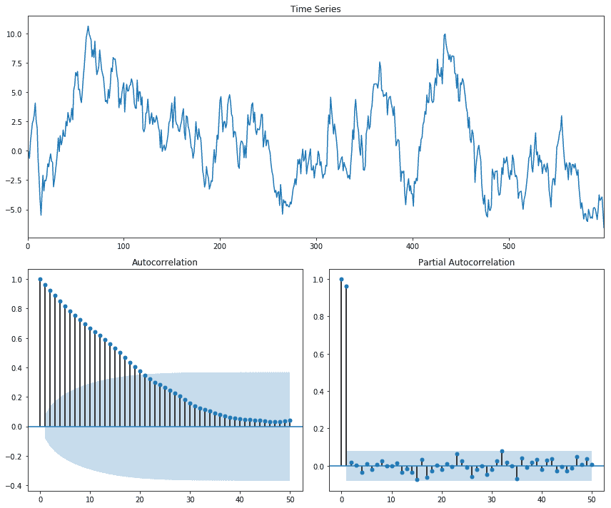

图 4.2：具有 0.95 的高自相关的 AR（1）时间序列信号

在情形Φ> 1 中，模型变得不稳定。 此处显示一个Φ> 1 的非平稳过程的示例：


图 4.3：大于 1 的 AR（1）时间序列信号导致非平稳信号

图 4.9 是在Φ= 1.01 的情况下产生的。 类似地，可以生成更高阶的 AR 模型以验证对 PACF 组件的影响。 使用以下脚本生成具有 AR（2）和 AR（3）组件的数据集：

```
# Generate AR(2) dataset 
ar = np.r_[1, 0.6, 0.7] 
ma = np.r_[1, 0] 
ar2_data = smtsa.arma_generate_sample(ar=ar, ma=ma, nsample=n)  
plotds(ar2_data) 

# Generate AR(3) dataset 
ar = np.r_[1, 0.6, 0.7, 0.5] 
ma = np.r_[1, 0] 
ar3_data = smtsa.arma_generate_sample(ar=ar, ma=ma, nsample=n)  
plotds(ar3_data) 

```

图 4.4 和 4.5 显示了时间序列信号及其 AR（2）和 AR（3）时间序列信号的 ACF 和 PACF 图：

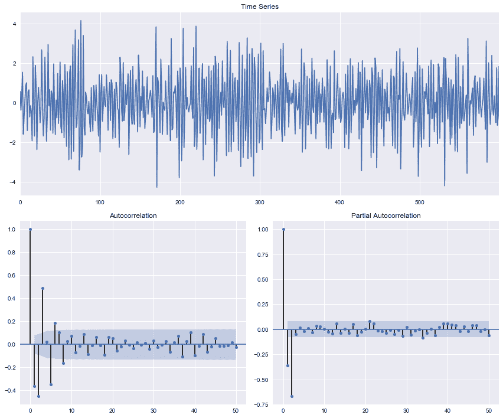

图 4.4：AR（2）时间序列及其 ACF 和 PACF


图 4.5：AR（3）时间序列及其 ACF 和 PACF

从不同的数据源可以看出，PACF 正在捕获 AR 分量，`q`是有效值。可以使用`statsmodels.tsa.api`模块中的`ARMA.fit`类评估 AR1 的模型 在 Python 中；

```
# Build AR(1) model 
ar1model = smtsa.ARMA(ar1_data.tolist(), order=(1, 0)) 
ar1=ar1model.fit(maxlag=30, method='mle', trend='nc') 
ar1.summary() 
```

前面的脚本在时间序列数据集上拟合了 AR（1）模型，其结果报告如下：


图 4.6：AR（1）模型输出

使用 0.6 的滞后序列相关性对 AR（1）进行仿真，拟合值的评估值为 0.58，这与实际关系非常接近。 同样，将 AR（3）模型拟合到 AR 生成的数据集上，其实际生成的滞后关系分别为 0.6、0.7 和 0.5，以下是拟合值的结果：


图 4.7：AR（3）模型输出

拟合的 AR 模型显示出 0.58、0.67 和 0.44 的关系，这与实际关系非常接近。 AR 和 MA 均可用于校正序列依赖性，但通常，使用 AR 模型可校正正自相关，而使用 MA 模型可校正负相关。

# 移动平均模型

移动平均模型使用残差之间的依赖关系来预测下一个时间段的值。 该模型可帮助您调整任何不可预测的事件，例如导致股市崩溃，导致股价下跌的灾难性事件，这些事件会随着时间的流逝而发生，并被记录为移动平均过程。

MA（1）表示的一阶移动平均值如下：

```
*x<sub class="calibre29">t</sub> = α - θ<sub class="calibre29">1</sub>Є<sub class="calibre29">t-1</sub> + Є<sub class="calibre29">t</sub>*
```

MA（2）表示的二阶移动平均值如下：

```
*x<sub class="calibre29">t</sub> = α - θ<sub class="calibre29">1</sub>Є<sub class="calibre29">t-1</sub> - θ<sub class="calibre29">2</sub>Є<sub class="calibre29">t-2</sub>+ Є<sub class="calibre29">t</sub>*
```

用 MA（`q`）表示的`q`<sup class="calibre23">th</sup> 阶移动平均值如下：

```
*x<sub class="calibre29">t</sub> = α - θ<sub class="calibre29">1</sub>Є<sub class="calibre29">t-1</sub> - θ<sub class="calibre29">2</sub>Є<sub class="calibre29">t-2</sub> - ... - θ<sub class="calibre29">q</sub>Є<sub class="calibre29">t-q</sub>+ Є<sub class="calibre29">t</sub>*
```

此处，*Є <sub class="calibre26">t</sub>* 是时间`t`时的相同独立分布的误差，并且遵循正态分布 N（0，σ *<sup class="calibre23">2</sup> <sub class="calibre26">Є</sub>* ），均值为零，并且σ *<sup class="calibre23">2</sup> <sub class="calibre26">Є</sub>* 方差。 *Є <sub class="calibre26">t</sub>* 分量表示时间误差`t`，α和*Є*标记分别表示平均截距和误差系数。 具有`q`<sup class="calibre23">阶</sup>阶的移动平均时间序列模型表示为 MA（`q`）。 前述关系不会更改 MA（`q`）的期望值，其定义如下：

```
*E(x<sub class="calibre29">t</sub>) = E(α - θ<sub class="calibre29">1</sub>Є<sub class="calibre29">t-1</sub> - θ<sub class="calibre29">2</sub>Є<sub class="calibre29">t-2</sub> - ... - θ<sub class="calibre29">q</sub>Є<sub class="calibre29">t-q</sub>+ Є<sub class="calibre29">t</sub>) = α*
```

但是，方差增加，定义如下：

```
*var(x<sub class="calibre29">t</sub>) = var(α - θ<sub class="calibre29">1</sub>Є<sub class="calibre29">t-1</sub> - θ<sub class="calibre29">2</sub>Є<sub class="calibre29">t-2</sub> - ... - θ<sub class="calibre29">q</sub>Є<sub class="calibre29">t-q</sub>+ Є<sub class="calibre29">t</sub>) = α*
```

```
*var(x<sub class="calibre29">t</sub>) = σ<sup class="calibre28">2</sup> (1 + θ<sub class="calibre29">1<sup class="calibre78">2</sup></sub> + θ<sub class="calibre29">2<sup class="calibre78">2</sup></sub>+ ... θ<sub class="calibre29">q<sup class="calibre78">2</sup></sub>)*
```

为了说明移动平均时间序列模型，让我们使用以下代码片段生成信号：

```
import statsmodels.tsa.api as smtsa 
# Number of samples 
n = 600 
# Generate MA(1) dataset 
ar = np.r_[1, -0] 
ma = np.r_[1, 0.7] 
ma1_data = smtsa.arma_generate_sample(ar=ar, ma=ma, nsample=n)  
```

在前面的代码段中，`n`表示使用*或*定义自回归分量的要生成的样本数，*ma* 解释了该时间的移动平均值分量 串联信号。 *ar* 组件的详细信息将在[第 4 章](4.html)和*自回归模型*的自回归部分中介绍。 当前，我们将 *ar* 对时间序列信号的影响保持为零。 上面的代码片段将生成一个时间序列数据集，该数据集具有 MA（1）依赖关系，且误差之间具有 0.7 序列相关性，并且可以表示如下：

```
*x<sub class="calibre29">t</sub> = 0.7Є<sub class="calibre29">t-1 +</sub> Є<sub class="calibre29">t</sub>*
```

前面的脚本将生成以下信号：


图 4.8：MA（1）数据集示例

为了评估时间序列信号是由 MA 分量还是 AR 分量组成，使用了自相关（ACF）和部分自相关（PACF）。 ACF 代表：

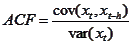

上式中的分子是时间`t`和 *t-h* 的时间序列信号之间的协方差，其中`h`是时间序列信号中的滞后。 除了通过消除间隔之间已经说明的变化来计算相关性外，PACF 的计算方式也与 ACF 类似。 这也被定义为条件相关。 一阶 ACF 与一阶 PACF 相似。 在二阶（滞后）PACF 中，条件概率开始发挥重要作用：


同样，三阶 PACF 可以表示如下：


前面的关系可以进一步扩展到高阶滞后。 让我们看一下先前生成的时间序列的 ACF 和 PACF 函数：


图 4.9：MA（1）数据集的 ACF 和 PACF

先前数据集上的 ACF 显示 1 滞后依赖性。 由于使用 *x <sub class="calibre26">t</sub> =θ∈ <sub class="calibre26">t-1</sub> +∈ <sub class="calibre26">t</sub>* 来捕获 MA 关系，因此与滞后项无关， ACF 倾向于捕获 MA 系列的适当顺序`q`。 从图 4.2 中可以看出，ACF 在定义的顺序后不会变为零，而是减小到一个很小的值。 置信区间使用关系`±2/√n`进行测试，其中`N`和`1/√n`代表标准偏差的近似值，在独立条件下正确。

使用以下脚本，以`q`的高阶来查看 ACF 和 PACF 的 MA 组件的影响：

```
# Generate MA(2) dataset 
ar = np.r_[1, -0] 
ma = np.r_[1, 0.6, 0.7] 
ma2_data = smtsa.arma_generate_sample(ar=ar, ma=ma, nsample=n)  
plotds(ma2_data) 

# Generate MA(3) dataset 
ar = np.r_[1, -0] 
ma = np.r_[1, 0.6, 0.7, 0.5] 
ma3_data = smtsa.arma_generate_sample(ar=ar, ma=ma, nsample=n)  
plotds(ma3_data) 
```

前面的脚本将生成顺序为 MA（2）和 MA（3）的移动平均时间序列信号，而对 AR 分量没有影响。 使用上述脚本生成的时间序列信号的 ACF 和 PACF 图如下所示：


图 4.10：MA（2）数据集的示例


图 4.11：MA（3）数据集示例

通常，ACF 很好地定义了错误序列相关性，因此可用于检测 MA（`q`）； 但是，随着阶数的增加以及其他时间序列成分（如季节性，趋势或平稳性）的出现，这使解释变得更加困难。 MA（`q`）假定过程是平稳的，并且误差是白噪声，以确保无偏估计。 例如，在前面的 MA（2）和 MA（3）中，数据中的季节性成分使解释变得更加困难。 前面的图是使用以下函数生成的：

```
from statsmodels.graphics.tsaplots import plot_acf, plot_pacf 
from matplotlib import pyplot as plt 
def plotds(xt, nlag=30, fig_size=(12, 10)): 
    if not isinstance(xt, pd.Series): 
         xt = pd.Series(xt) 
    fig_plt = plt.figure(figsize=fig_size) 
    layout = (2, 2) 

    # Assign axes 
    ax_xt = plt.subplot2grid(layout, (0, 0), colspan=2) 
    ax_acf= plt.subplot2grid(layout, (1, 0)) 
    ax_pacf = plt.subplot2grid(layout, (1, 1)) 

    # Plot graphs 
    xt.plot(ax=ax_xt) 
    ax_xt.set_title('Time Series') 
    plot_acf(xt, lags=50, ax=ax_acf) 
    plot_pacf(xt, lags=50, ax=ax_pacf) 
    plt.tight_layout() 
    return None 
```

可以使用`statsmodel.tsa`模块中的 ARMA 功能来构建 MA（q）模型。 符合 MA（1）模型的示例脚本如下：

```
# Build MA(1) model 
ma1 = smtsa.ARMA(ma1_data.tolist(), order=(0, 1)).fit( 
    maxlag=30, method='mle', trend='nc') 
ma1.summary() 
```

由于 AR 的阶数保持为零，因此`smtsa.ARMA`建立了一个 MA（1）。 `smtsa.ARMA`返回的模型摘要如下所示：

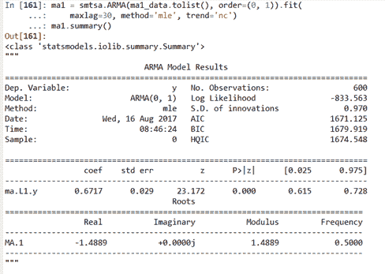

图 4.12：MA（1）模型的输出

如您所见，该模型已捕获残差之间的`0.67`相关性，这非常接近`0.7`的模拟值。 同样，我们为 MA（3）数据集运行模型，结果如图 4.13 所示：


图 4.13：MA（3）模型在模拟数据集上的输出

# 使用 ARMA 构建数据集

前两节描述了自回归模型 AR（`p`），该模型根据自己的滞后项进行回归，移动平均模型 MA（`q`）建立了误差项的函数。 过去的。 AR（`p`）模型倾向于捕获均值回复效应，而 MA（`q`）模型倾向于捕获错误的冲击效应，这不是正常事件或不可预测事件。 因此，ARMA 模型将 AR 和 MA 组件的功能结合在一起。 一个 ARMA（`p`，`q`）时间序列预测模型合并了`p`<sup class="calibre23">th</sup> 阶 AR 和 *q <sup class="calibre23">th</sup>* 分别为 MA 模型。

ARMA（1，1）模型表示如下：
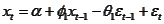

ARMA（1，2）模型表示如下：
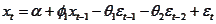

ARMA（`p`，`q`）模型表示如下：


在此，Φ和θ表示 AR 和 MA 系数。 α和ε <sub class="calibre26">t</sub> 捕获时间 *t 的截距和误差。* 随着`p`和`q`的增加，形式变得非常复杂； 因此，滞后算子用于 ARMA 模型的简洁表示。 假设`L`代表滞后算子，并且根据移动的单位，我们将其应用`k`次。 这些运算符也称为后移运算符。


...

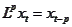

使用滞后算子，我们可以如下重写一阶自回归模型：


类似地，运动阶一阶方程可写为：


可以将上述方程式扩展到高阶 AR 和 MA 模型：


可以将前面的两个结合起来形成如下所示的 ARMA：


前面的表示还用于研究冲激响应函数。 脉冲响应功能捕获了 *x <sub class="calibre26">t</sub>* 在时间`l`（其中 *l < t）受到电击时对响应的影响。* 在某些外部变化的情况下，脉冲响应也可以被视为对动态系统响应的影响。

让我们通过使用更新的`ar`和`ma`组件更新以前使用的脚本来生成 ARMA（1,1）数据集。 为了简单起见，我们还将样本数量限制为 600：

```
# Number of samples 
n = 600 
# Generate AR(1) dataset 
ar = np.r_[1, 0.6] 
ma = np.r_[1, 0.3] 
ar1ma1_data = smtsa.arma_generate_sample(ar=ar, ma=ma, nsample=n)  
plotds(ar1ma1_data ) 
```

信号，ACF 和 PACF 图如下所示：


图 4.14：带 ACF 和 PACF 的 ARMA（1,1）信号

通常，销售流程遵循 ARMA（1,1）模型，因为及时销售`t`是先前发生的及时销售的函数 *t-1*，在 AR 中发挥作用 成分。 ARMA（1,1）的 MA 组件是由公司发起的基于时间的活动引起的，例如，优惠券的分发将导致平均效果在流程中移动，因为销售会暂时增加，并且可以捕捉到销售效果的变化 由移动平均线组成。 在图 4.14 中，ACF 和 PACF 都显示了正弦曲线，在初始滞后时具有很强的相关性。 因此，`p`和`q`参数都存在。 有多种情况可以选择`p`和`q`； 可用于确定 ARMA 组件顺序的一些经验法则如下：

*   自相关呈指数下降，并且 PACF 在滞后 1 处具有显着相关，然后使用`p`参数
*   自相关形成正弦波，并且 PACF 在滞后 1 和滞后 2 处具有显着相关，然后对 p 使用二阶值
*   自相关具有显着的自相关，而 PACF 具有指数衰减，然后存在移动平均，需要设置`q`参数
*   自相关显示出显着的串行相关性，而 PACF 显示出正弦波模式，然后设置移动平均值`q`参数

在 ARMA（1,1）时间序列数据中，由于 ACF 和 PACF 都显示了正弦波模式，`p`和`q`这两个参数都影响时间序列信号。 对于 ARMA（1,1）时间序列信号，可以使用脉冲响应曲线来计算滞后的影响，如下图所示：


图 4.15：ARMA（1,1）数据集的冲激响应曲线

图 4.15 显示，在五个滞后之后，对响应的影响非常小。 为了从数据评估 *AR* 和 *MA* 值，使用了`statsmodels.tsa.api`模块的`ARMA.fit`函数，如以下脚本所示：

```
# Build AR(1) model 
ar1ma1 = smtsa.ARMA(ar1ma1_data.tolist(), order=(1, 1)).fit( 
    maxlag=30, method='mle', trend='nc') 
ar1ma1.summary() 
```

图 4.16 显示了上述脚本的输出：


图 4.16：ARMA（1,1）的脉冲响应曲线

模型结果显示 AR 系数值`0.58`和 MA 值`0.29`，分别接近 AR 和 MA 组件用来生成时间序列信号的值`0.6`和`0.3`。 同样，碱性信息标准（AIC）是用于评估模型性能的另一个指标，目的是使 AIC 最小化。 要为`p`和`q`订单设置数据驱动的评估，可以将 AIC 用作标准。 此处显示了 ARMA（1,1）数据集上 AIC 最小化的图示：

```
# Optimize ARMA parameters
aicVal=[] 
for ari in range(1, 3): 
    for maj in range(1,3): 
        arma_obj = smtsa.ARMA(ar1ma1_data.tolist(), order=(ari, maj)).fit(maxlag=30, method='mle', trend='nc') 
        aicVal.append([ari, maj, arma_obj.aic]) 
```

使用`p`和`q`作为模型输入，并以 AIC 作为模型输出标准来汇总上述脚本的输出：


表 4.17​​：ARMA 模型的不同`p`和`q`值的 AIC 值

表 4.17​​显示 ARMA（1,1）是具有最小 AIC 值的最佳模型； 但是，ARMA（1,1）和 ARMA（2,2）之间的差异并不高，因为 ARMA（1,1）是**自由度（DOF）[H​​TG1]较小的较简单模型； 因此，ARMA（1,1）将比其他复杂模型更受青睐。**

让我们说明一个使用实时序列数据的 ARMA 模型。 选择用于说明的数据集是 1962 年至 1965 年的 IBM 股票价格数据。第一步是将所需的模块和数据集加载到 Python 环境中：

```
# Load modules 
from __future__ import print_function 
import os 
import pandas as pd 
import numpy as np 
from matplotlib import pyplot as plt 

# Load Dataset 
ibm_df = pd.read_csv('datasets/ibm-common-stock-closing-prices.csv') 
ibm_df.head() 

#Rename the second column 
ibm_df.rename(columns={'IBM common stock closing prices': 'Close_Price'}, inplace=True) 
ibm_df.head() 
```

前面的脚本利用熊猫来加载数据集。 列名使用 pandas DataFrame 支持的`rename`函数重命名。 IBM 股票收盘价数据集如下所示：


图 4.18：IBM 股票数据集

IBM 图显示了一段时间内数据的显着趋势。 该过程的下一步是查看数据集的自相关图。 可以使用以下脚本获得 ACF 和 PACF 图：

```
from statsmodels.graphics.tsaplots import plot_acf, plot_pacf 
ibm_df['residual']=ibm_df['Close_Price']-ibm_df['Close_Price'].mean() 
ibm_df=ibm_df.dropna() 
plot_acf(ibm_df.residual, lags=50) 
plot_pacf(ibm_df.residual, lags=50) 
```

前面的脚本生成的 ACF 和 PACF 图如图 4.16 所示：


图 4.19：来自 IBM 股票数据集的残差的 ACF 和 PACF

ACF 呈线性衰减，显示出很强的序列相关性； 然而，部分自相关仅显示了一步依赖性。 同样，如图所示，自相关为正，应使用具有一阶相关的 AR 分量进行校正。 信号的 QQ 图可帮助您评估正态性假设。 IBM 股票数据集的 QQ 图如图 4.20 所示：


图 4.20：残差的 QQ 图

图 4.21 中的残差图显示了该数据集接近钟形曲线，且拐角案例不遵循正态分布，如图 4.18 所示，为直方图：


图 4.21：IBM 股票收盘价的直方图

为了获得 ARMA 的最佳`p`和`q`阶数，使用以下脚本以 AIC 最小化为搜索标准来执行网格搜索：

```
# Optimize ARMA parameters 
aicVal=[] 
for ari in range(1, 3): 
    for maj in range(0,3): 
        arma_obj = smtsa.ARMA(ibm_df.Close_Price.tolist(), order=(ari, maj)).fit(maxlag=30, method='mle', trend='nc') 
        aicVal.append([ari, maj, arma_obj.aic]) 

```

`ARMA.fit`函数用于使用最大似然准则将 ARMA 预测模型与已定义的`p`和`q`模型拟合。 模型的结果保存在 *aicVal* 列表中，如图 4.22 所示：


图 4.22：不同等级 ARMA 模型的 AIC 得分

AIC 建议将 ARMA（1,1）模型作为具有最小 AIC 值的最佳模型。 使用以下脚本将 ARMA（1,1）模型重新设置为最佳模型：

```
# Building optimized model using minimum AIC 
arma_obj_fin = smtsa.ARMA(ibm_df.Close_Price.tolist(), order=(1, 1)).fit(maxlag=30, method='mle', trend='nc') 
ibm_df['ARMA']=arma_obj_fin.predict() 
```

AIC 分数推荐 ARMA（1,0）的模型，AIC 分数为 6702.7。 使用 ARMA（1,0）的实际值与拟合值如下：


图 4.23 实际值与预测值

上图显示了 ARMA（1,0）模型的良好拟合，可以预测股票收盘价：

```
# Plot the curves 
f, axarr = plt.subplots(1, sharex=True) 
f.set_size_inches(5.5, 5.5) 
ibm_df['Close_Price'].iloc[1:].plot(color='b', linestyle = '-', ax=axarr) 
ibm_df['ARMA'].iloc[1:].plot(color='r', linestyle = '--', ax=axarr) 
axarr.set_title('ARMA(1,0)') 
plt.xlabel('Index') 
plt.ylabel('Closing price') Plot the curves 
f, axarr = plt.subplots(1, sharex=True) 
f.set_size_inches(5.5, 5.5) 
ibm_df['Close_Price'].iloc[1:].plot(color='b', linestyle = '-', ax=axarr) 
ibm_df['ARMA'].iloc[1:].plot(color='r', linestyle = '--', ax=axarr) 
axarr.set_title('ARMA(1,1)') 
plt.xlabel('Index') 
plt.ylabel('Closing price') 
```

这些模型的主要限制之一是它们忽略了使信号不稳定的波动性因素。 正在考虑的 AR 建模过程是平稳的，即误差项为 IID 且遵循正态分布*εt〜N（0，σ <sup class="calibre23">2</sup> <sub class="calibre26">ε</sub>）*和 |Φ| < 1\. |Φ| < 1 条件使时间序列成为有限的时间序列，因为与以前的观测值相比，时间序列中更新的观测值的影响会更高。 不满足这些假设的序列属于非平稳序列。 此处显示了一个非平稳过程的示例：

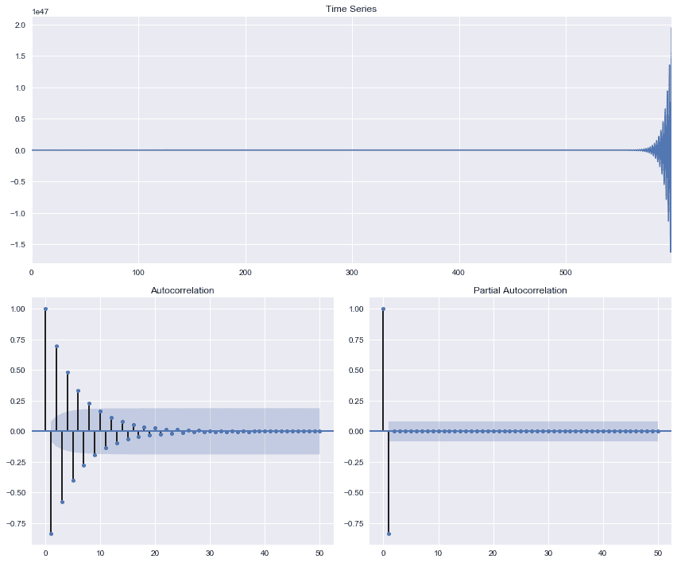

图 4.24：AR（1）非平稳过程

从前面的图中可以看出，过程的方差在数据集的末尾处不断增加，并且在 ACF 中观察到了强烈的趋势。 下一节讨论的 ARIMA 考虑了对于预测而言非平稳的情况。

# 有马

ARIMA 也称为 Box-Jenkins 模型，它是 ARMA 模型的概括，它包括集成组件。 当数据具有非平稳性时，集成的组件很有用，而 ARIMA 的集成部分有助于减少非平稳性。 ARIMA 对时间序列应用一次或多次差分，以消除非平稳性影响。 ARIMA（ *p，d，q* ）表示 AR，MA 和差分分量的顺序。 ARMA 模型和 ARIMA 模型之间的主要区别是`d`组件，该组件更新了构建预测模型的序列。`d`组件旨在使信号去趋势化以使其稳定，并且 ARMA 模型可以应用于去趋势化的数据集。 对于`d`的不同值，串联响应变化如下：

对于`d`= 0：`x`<sub class="calibre26">t</sub> =`x`<sub class="calibre26">t</sub>

对于`d`= 1：`x`<sub class="calibre26">t</sub> =`x`<sub class="calibre26">t</sub> -`x`<sub class="calibre26">t-1</sub>

对于`d`= 2：`x`<sub class="calibre26">t</sub> =（[`x`<sub class="calibre26">t</sub> -`x`<sub class="calibre26">t-1</sub> ）-（`x`<sub class="calibre26">t-1</sub> -`x`<sub class="calibre26">t-2</sub> ）=`x`<sub class="calibre26">t</sub> -2`x`<sub class="calibre26">t-1</sub> -`x`<sub class="calibre26">t-2</sub>

从前面的行可以看出，第二个差异不是两个周期之前，而是第一个差异的差异，即`d`= 1。 假设`x_hat[t]`代表不同的响应，因此 ARIMA 预测可以写成以下形式：

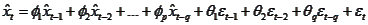

根据`p`，`d`和`q`的顺序，模型的行为会有所不同。 例如，ARIMA（1,0，0）是一阶 AR 模型。 同样，ARIMA（0,0,1）是一阶 MA 模型。

让我们以 ARIMA（0,1,0）为例说明 ARIMA 建模的不同组成部分。 ARIMA（0,1,0）代表随机游走模型。 随机游走模型仅取决于最后一个时间实例，可以表示如下：

```
*x<sub class="calibre29">t</sub> = x<sub class="calibre29">t-1</sub> + ε<sub class="calibre29">t</sub>*
```

前面的随机游走方程式也可以用滞后算子表示，如下所示：

```
*(1-L)x<sub class="calibre29">t</sub> = ε<sub class="calibre29">t</sub>*
```

在此，*εt〜N（0，σ <sup class="calibre23">2</sup> ）*是误差分量，并且遵循正态分布。 在前面的随机游动模型中添加一个常数会导致模型中的漂移，该漂移在本质上也是随机的，如以下等式所示：

```
*(1-L)x<sub class="calibre29">t</sub> = α + ε<sub class="calibre29">t</sub>*
```

在此，α是将对时间序列信号产生漂移效果的漂移算子。 让我们用 2016 年的道琼斯指数时间序列数据集（DJIA）来说明 ARIMA 建模。DJIA 数据集及其基本 ACF 和 PACF 图如图 4.25 所示：

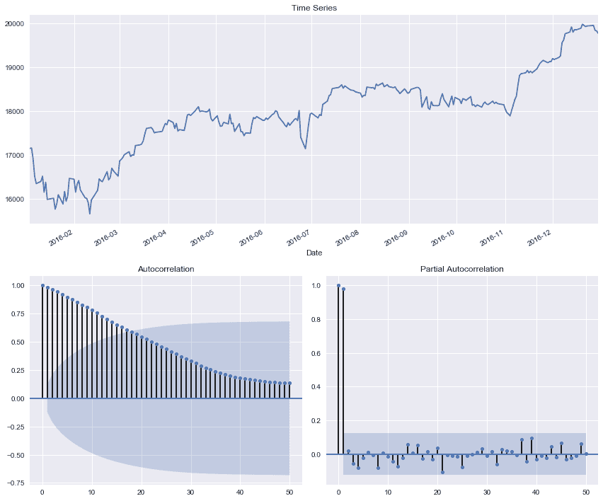

图 4.25：DJIA 数据集及其 ACF 和 PACF

数据集清楚地显示出具有增加趋势的非平稳信号。 ACF 还显示出指数衰减，而 PACF 在滞后 2 中具有很强的相关性。还可以通过评估不同时间段内的均值和方差来检查非平稳性。 均值和方差的差异验证了非平稳性的假设。 例如，我们将 DJIA 数据集从 2016 年 1 月至 6 月和 2016 年 7 月至 12 月分成两个学期，并按以下方式评估均值和方差：

```
mean1, mean2 =djia_df.iloc[:125].Close.mean(), djia_df.iloc[125:].Close.mean() 
var1, var2 = djia_df.iloc[:125].Close.var(), djia_df.iloc[125:].Close.var() 
print('mean1=%f, mean2=%f' % (mean1, mean2)) 
print('variance1=%f, variance2=%f' % (var1, var2)) 

# Output 
mean1=17226.579164, mean2=18616.603593 
variance1=487045.734003, variance2=325183.639530 

```

两个学期的评估均值和方差显示均值和方差值存在显着差异，因此表明数据是不稳定的。 评估非平稳性的另一种方法是使用统计测试，例如增强 Dickey-Fuller（ADF）测试。 ADF 是一个单位根测试，用于评估时间序列组件中趋势的强度。 ADF 使用高阶 AR 模型来优化信息标准。 假设有一个 AR（3）模型：


可以使用差分滞后项来重写前面的方程式：


让我们将前面的等式简化如下：


可以使用滞后运算符重写前面的公式：


假设 L = 1 是前面多项式的解，则 ADF 求解前面的方程，可以表示如下：


如果 L = 1，则前面的等式可以简化为：

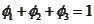

对于单位根，滞后差可以重写为：


使用 Schwartz 贝叶斯信息准则或最小化 **Akaike 信息准则**（**AIC**），可以使用上述方程式来确定 AR 滞后分量。 在存在强自相关性的情况下，原始序列需要有所区别。 ADF 的 NULL 假设提出 *H <sub class="calibre26">0</sub> ：ρ= 0*，而对另类假设 *H <sub class="calibre26">0</sub> ：ρ< 0*。 换句话说，零假设是单位根的存在或非平稳性，而替代假设则表明数据的平稳性。

让我们为 DJIA 数据集运行 ADF 测试：

```
# ADF Test 
from statsmodels.tsa.stattools import adfuller 
adf_result= adfuller(djia_df.Close.tolist()) 
print('ADF Statistic: %f' % adf_result[0]) 
print('p-value: %f' % adf_result[1]) 
```

ADF 的输出如下所示：


图 4.26：ADF 测试的输出

理想情况下，ADF 统计信息的负值较大时将代表平稳信号。 对于给定的数据集，由于 *p 值*很高，我们不能拒绝 NULL 假设，使其成为非平稳信号。 大多数软件包可确保在执行模型之前满足平稳性。 可视化 DJIA 数据集正态性的 *qqplot* 如图 4.27 所示：

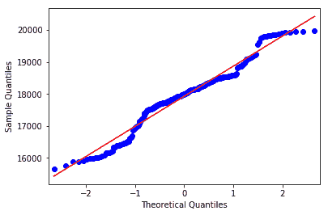

图 4.27：DJIA 数据集的 *qqplot*

图 4.27 显示了 DJIA 数据集中的显着非正态性。 大多数用 Python 编写的核心程序包都会检查数据集中的平稳性。 如果不满足平稳性要求，则会引发错误。 让我们尝试在当前数据集上强制拟合 ARMA（1,1）模型：

```
# Force fit ARMA(1,1) model on non-stationary signal 
arma_obj = smtsa.ARMA(djia_df['Close'].tolist(), order=(1, 1)).fit(maxlag=30, method='mle', trend='nc') 
```

先前的力拟合将引发以下错误：


图 4.28：ARMA 模型安装在非平稳信号上时的输出

差异将有助于使信号稳定：

```
#Let us plot the original time series and first-differences 
first_order_diff = djia_df['Close'].diff(1) 
fig, ax = plt.subplots(2, sharex=True) 
fig.set_size_inches(5.5, 5.5) 
djia_df['Close'].plot(ax=ax[0], color='b') 
ax[0].set_title('Close values of DJIA during Jan 2016-Dec 2016') 
first_order_diff.plot(ax=ax[1], color='r') 
ax[1].set_title('First-order differences of DJIA during Jan 2016-Dec 2016') 

```

图 4.29 显示了上述脚本的输出：


图 4.29：一阶微分后的时间序列信号

图 4.30 显示了`d`= 1 的积分信号的 ACF 和 PACF 图：


图 4.30：DJIA 数据集的一阶差分 ACF 和 PACF 图

ADF 的残差统计值为-17.13，*p-val* 接近零，从而表明该模型是平稳的。 但是，ACF 和 PACF 都没有显示出移动平均成分呈现随机游走行为的趋势。 另外，另一种运行方式是使用 AIC 作为标准进行优化：

```
# Optimize ARMA parameters 
aicVal=[] 
for d in range(1,3): 
    for ari in range(0, 3): 
        for maj in range(0,3): 
            try: 
                arima_obj = ARIMA(djia_df['Close'].tolist(), order=(ari,d,maj)) 
                arima_obj_fit=arima_obj.fit() 
                aicVal.append([ari, d, maj, arima_obj_fit.aic]) 
            except ValueError: 
                pass 

```

前面的代码以不同的值生成以下 AIC：


图 4.31：不同 ARIMA 模型的 AIC 值

由于模型之间的 AIC 非常接近，因此建议使用主题专家来选择正确的模型。 让我们选择 ARIMA（0,2,1）进行模型拟合和评估。 ARIMA（0,2,1）应用二阶微分和一阶移动平均分量来确定观测值之间的关系。 设置模型参数，如以下脚本所示：

```
# Evaluating fit using optimal parameter 
arima_obj = ARIMA(djia_df['Close'].tolist(), order=(0,2,1)) 
arima_obj_fit = arima_obj.fit(disp=0) 
arima_obj_fit.summary() 

# Evaluate prediction 
pred=np.append([0,0],arima_obj_fit.fittedvalues.tolist()) 
djia_df['ARIMA']=pred 
diffval=np.append([0,0], arima_obj_fit.resid+arima_obj_fit.fittedvalues) 
djia_df['diffval']=diffval 
```

使用以下脚本获得与实际值和预测值的比较并将其可视化：

```
# Plot the curves 
f, axarr = plt.subplots(1, sharex=True) 
f.set_size_inches(5.5, 5.5) 
djia_df['diffval'].iloc[2:].plot(color='b', linestyle = '-', ax=axarr) 
djia_df['ARIMA'].iloc[2:].plot(color='r', linestyle = '--', ax=axarr) 
axarr.set_title('ARIMA(0,2,1)') 
plt.xlabel('Index') 
plt.ylabel('Closing price')  
```


图 4.32：ARIMA（0,2,1）模型的预测输出

> 

图 4.33：使用 ARIMA（0,2,1）模型的 MA 的系数

关于模型是否最优构建的另一个关键检查是白噪声，例如可以使用 *qqplot* 观察到错误的行为，如图 4.34 所示：


图 4.34：ARIMA（0,2,1）模型的残差的 QQ 正态图

带有 ARIMA（0,2,1）模型的 QQ 正态图显示了显着的正态拟合，如图 4.27 所示。 错误正态性也可以使用 Shapiro-wilk 检验进行评估。

ARIMA 模型的进一步扩展包括以大写字母表示的 AR，I 和 MA 的季节性成分。 季节性 ARIMA 表示为 ARIMA（`p`，`d`，`q`）（P，D，Q） *<sub class="calibre26">m</sub> [*，其中 P，D 和 Q 分别代表自回归，积分和移动平均值的季节部分。 季节性 ARIMA 模型中的`m`表示每个季节的周期数。 在存在季节性的情况下，可能需要执行额外的季节性差异和季节性调整步骤，以确保信号稳定。 例如，如果您查看图 4.30 中显示的 DJIA 差异 ACF 和 PACF 图，则自相关在 42 索引处变得略显重要，这意味着可能存在季节性。 季节性差异出现在第一个差异上，可以使用以下代码行看到：

```
# Seasonality (based on first difference ACF shows significance at 42 lag) 
x=djia_df['Close']-djia_df['Close'].shift(42) 
x.plot() 
```

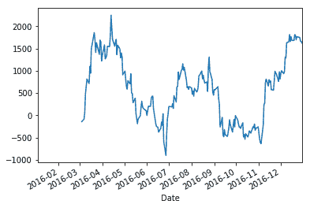

图 4.35：DJIA 数据集中的季节性

可以使用 *statmodel.SARIMAX* 模型支持的季节性 ARIMA 来校正先前的季节性。 为 DJIA 数据集建立季节性 ARIMA 模型的脚本如下：

```
# Seasonality (based on first difference ACF shows significance at 42 lag) 
x=djia_df['Close']-djia_df['Close'].shift(42) 
mod = sm.tsa.statespace.SARIMAX(djia_df['Close'], trend='n', order=(0,2,1), seasonal_order=(1,1,1,42)) 
sarimax= mod.fit() 
sarimax.summary() 
```

以下是上述脚本的结果：


图 4.36：SARIMAX 模型的输出

该模型在 AIC 方面显示出显着改进，并且可以针对 SARIMAX 模型中涉及的不同组件进行进一步优化。

# 置信区间

预测中的常见问题之一是，估计的置信区间是多少？ 预测模型中的置信度由预测函数中的 *alpha* 参数定义。 *alpha* 值 0.05 表示具有 95％置信度的估计，这可以解释为该模型返回的估计具有 5％的概率不落在定义的分布范围内。 置信区间的评估如下：


在此，*Z <sub class="calibre26">α</sub>* 是基于 alpha 定义的临界值。 对于 *alpha* 值 0.05，临界值为 1.96。 可以使用`arima_obj_fit`对象的*预测*函数，获得使用 ARIMA（0,2,1）模型建模的 DJIA 数据集的 alpha 值为 0.05 的置信区间：

```
# Forecasting and CI 
f, err, ci=arima_obj_fit.forecast(40) 
plt.plot(f) 
plt.plot(ci) 
plt.xlabel('Forecasting Index') 
plt.ylabel('Forecasted value') 
```

使用上述脚本获得的预测估计值和置信区间如图 4.37 所示：


图 4.37：95％置信度的预测和置信区间

# 概括

在本章中，我们介绍了自回归模型，例如 MA 模型，以利用误差关系捕获序列相关性。 在类似的直线上，涵盖了 AR 模型，该模型使用滞后作为相关观测值来建立预测。 AR 模型非常适合捕获趋势信息。 还说明了基于 ARMA 的方法，该方法集成了 AR 和 MA 模型以捕获任何基于时间的趋势和灾难性事件，从而导致许多错误，而这些错误将需要时间进行纠正，例如经济崩溃。 所有这些模型都假设是平稳的。 在不存在平稳性的情况下，提出了基于差异的模型（例如 ARIMA），该模型在时间序列数据集中执行差异处理以删除任何与趋势相关的成分。 通过使用 Python 的 *tsa* 模块的示例说明了预测方法。

本章重点介绍使用统计方法进行预测。 下一章将统计方法扩展到机器学习方法，以专门针对深度学习模型进行预测。