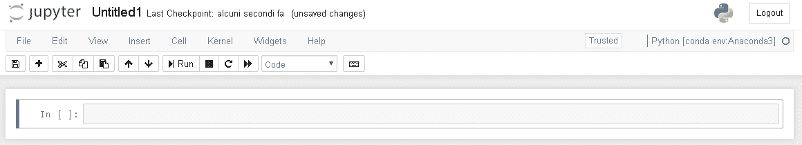
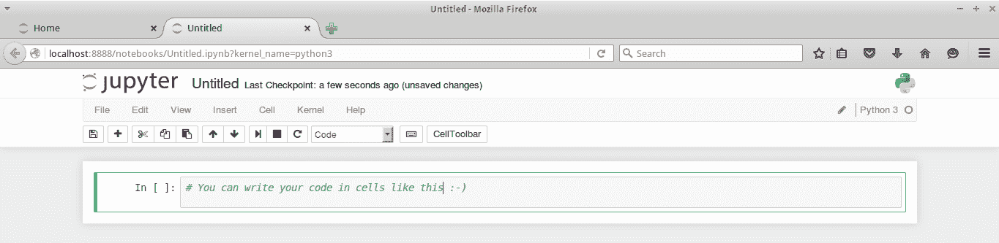
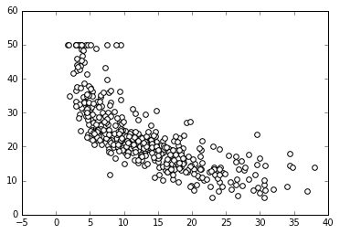
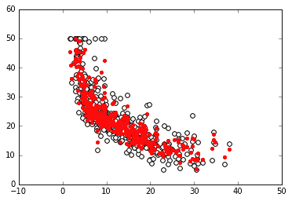
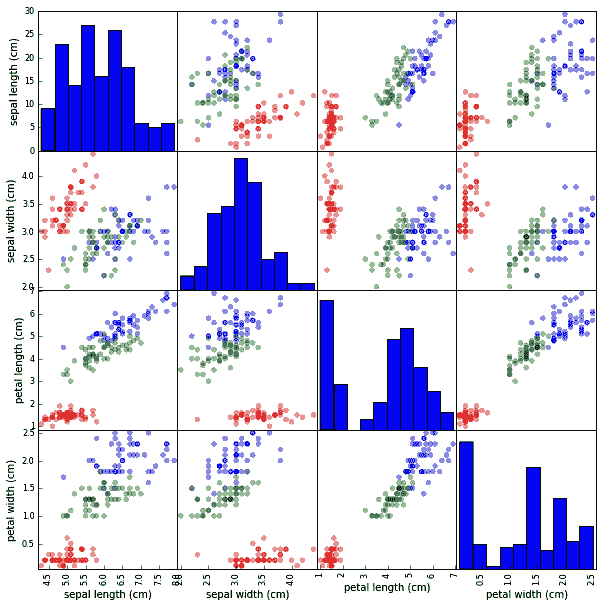

# 第一步

无论您是数据科学的急切学习者还是有充分基础的数据科学从业人员，都可以利用 Python 的基本介绍来进行数据科学。 如果您已经至少有一些基本的编码，使用 Python 或其他特定于数据分析的语言（例如 MATLAB 或 R）编写通用计算机程序的经验，则可以充分利用它。

本书将直接研究 Python 的数据科学，为您提供一条直接且快速的途径，以使用 Python 及其强大的数据分析和机器学习包解决各种数据科学问题。 本书提供的代码示例不要求您精通 Python。 但是，他们将假设您至少了解 Python 脚本编写的基础知识，包括列表和字典等数据结构以及类对象的工作原理。 如果您对这些主题没有信心或对 Python 语言了解甚少，那么在阅读本书之前，建议您阅读在线教程。 您可以选择一些不错的在线教程，例如 Code Academy 课程在[这个页面](https://www.codecademy.com/learn/learn-python)上提供的教程，[该课程由 Google 的 Python 类提供](http://developers.google.com/edu/python/)甚至是 Jake Vanderplas 撰写的[《Python 旋风之旅》](https://github.com/jakevdp/WhirlwindTourOfPython)。 所有课程都是免费的，并且在几个小时的学习中，它们应该为您提供所有基础知识，以确保您充分享受这本书。 为了提供上述两个免费课程的集成，我们还准备了自己的教程，可以在本书的附录中找到该教程。

无论如何，不​​要被我们的开始要求吓倒； 对数据科学应用掌握足够的 Python 并不像您想象的那么艰巨。 只是我们必须假定读者有一些基础知识，因为我们的目的是直接进行数据科学，而不必过多地解释将要使用的 Python 语言的一般方面。

那你准备好了吗？ 让我们开始吧！

在这一简短的介绍性章节中，我们将介绍基础知识，以全面展开，并涉及以下主题：

*   如何设置 Python 数据科学工具箱
*   使用 Jupyter
*   我们将在本书中学习的数据概述

# 数据科学和 Python 简介

数据科学是一个相对较新的知识领域，尽管计算机科学界已经对它的核心组件进行了多年的研究。 它的组件包括线性代数，统计建模，可视化，计算语言学，图形分析，机器学习，商业智能以及数据存储和检索。

数据科学是一个新领域，您必须考虑到当前，它的前沿仍然有些模糊和动态。 由于数据科学是由各种学科构成的，所以请记住，根据数据科学家的能力和专业领域的不同，它们的个人资料也会有所不同（例如，您可以阅读 Harlan D Harris 在[这个页面](http://radar.oreilly.com/2013/06/theres-more-than-one-kind-of-data-scientist.html)上发表的《数据科学家》的说明性文章，或深入讨论有关 A 型或 B 型数据科学家以及其他有趣的分类法的信息，请访问[这个页面](https://stats.stackexchange.com/questions/195034/what-is-a-data-scientist)）。

在这种情况下，作为数据科学家，您可以学习并有效使用的最佳交易工具是什么？ 我们相信最好的工具是 Python，并且我们打算为您提供快速入门所需的所有基本信息。

此外，R 和 MATLAB 等其他编程语言为数据科学家提供了专用工具，以解决数据科学中的统计分析和矩阵处理中的特定问题。 但是，只有 Python 才能以可扩展且有效的方式真正利用所有关键技术来完善您的数据科学家技能。 这种多用途语言适用于开发和生产。 无论您的背景或经验如何，它都能处理从小到大的数据问题，并且易于学习和掌握。

Python 创建于 1991 年，是一种通用的，解释性的和面向对象的语言，Python 逐渐稳定地征服了科学界，并成长为成熟的用于数据处理和分析的专用包生态系统。 它使您能够进行无数且快速的实验，轻松进行理论开发，并迅速部署科学应用。

目前，使其成为必不可少的数据科学工具的 Python 核心特征如下：

*   它提供了一个大型，成熟的包系统，用于数据分析和机器学习。 它保证您将获得数据分析过程中可能需要的全部信息，有时甚至更多。
*   Python 可以轻松地集成不同的工具，并为不同的语言，数据策略和学习算法提供了真正的统一基础，可以轻松地将它们组合在一起，并且可以具体地帮助数据科学家构建强大的解决方案。 有些包允许您调用其他语言（Java，C，Fortran，R 或 Julia）的代码，将一些计算外包给它们并提高脚本性能。
*   它非常通用。 无论您的编程背景或风格是什么（面向对象，过程甚至函数式），您都将喜欢使用 Python 进行编程。
*   它是跨平台的； 您的解决方案将在 Windows，Linux 和 macOS 系统上完美流畅地运行。 您不必太担心可移植性。
*   尽管可以解释，但是与其他主流数据分析语言（例如 R 和 MATLAB）相比，它无疑是快速的（尽管它不能与 C，Java 和新出现的 Julia 语言相提并论）。 此外，还有静态编译器，例如 *Cython* 或即时编译器，例如 *PyPy*，它们可以将 Python 代码转换为 C 以获得更高的性能。
*   由于其最小的内存占用和出色的内存管理，它可以处理大型内存数据。 内存垃圾回收器通常会在您使用各种迭代和重复的数据处理方式来加载，转换，切块，切片，保存或丢弃数据时节省一天的时间。
*   学习和使用非常简单。 掌握了基础知识之后，没有比立即开始编码更好的方法来学习更多。
*   此外，使用 Python 的数据科学家的数量也在不断增长：社区每天都在发布新的包和改进，使 Python 生态系统成为数据科学中越来越多产和丰富的语言。

# 安装 Python

首先，让我们继续介绍所需的所有设置，以创建一个可以正常运行的数据科学环境，以测试示例并尝试我们将为您提供的代码。

**Python** 是一种开源的，面向对象的，跨平台的编程语言。 与它的一些直接竞争对手（例如 C++ 或 Java）相比，Python 非常简洁。 它使您可以在很短的时间内构建可运行的软件原型，但不仅如此，它已成为数据科学家工具箱中使用最多的语言。 它也是一种通用语言，并且由于解决各种问题和必要性的各种可用包而非常灵活。

# Python 2 还是 Python 3？

Python 有两个主要分支：2.7.x 和 3.x。 在本书的第三版修订时，Python 基金会（ [www.python.org/](http://www.python.org/) ）正在提供 Python 版本 2.7.15（发布日期为 2018 年 1 月 5 日）和 3.6 的下载。 .5（发布日期 2018 年 1 月 3 日）。 尽管最新的 Python 3 版本，但*较旧的* Python 2 在 2017 年仍在科学（采用 20%）和商业（采用 30%）领域中使用，[如 JetBrains 的调查所详细描述的那样](https://www.jetbrains.com/research/python-developers-survey-2017/)。 如果您仍在使用 Python 2，那么情况很快就会变得很麻烦，因为在短短的一年时间内，Python 2 将被淘汰并且维护将停止（ [pythonclock.org/](https://pythonclock.org/) 将为您提供倒计时， 但是要获得对此的正式声明，只需阅读[这个页面](https://www.python.org/dev/peps/pep-0373/)，[实际上只有少数几个库在两者版本之间仍然不兼容](http://py3readiness.org/)并没有足够的理由继续使用旧版本。

除了所有这些原因之外，Python 3 和 2 之间没有立即的向后兼容性。实际上，如果尝试使用 Python 3 解释器运行一些为 Python 2 开发的代码，则可能无法正常工作。 最新版本进行了重大更改，这影响了以前的兼容性。 一些数据科学家已经将大部分工作建立在 Python 2 及其包上，因此他们不愿意切换到新版本。

在本书的第三版中，我们将继续针对广大的数据科学家，数据分析师和开发人员，这些人在 Python 2 中没有如此强大的遗产。因此，我们将继续使用 Python 3，并且我们建议使用最新版本的 Python 3.6 等版本。 毕竟，Python 3 是 Python 的现在和未来。 它是 Python 基金会将进一步开发和改进的唯一版本，并且它将是许多操作系统上未来的默认版本。

无论如何，如果您当前正在使用版本 2，并且希望继续使用它，则仍然可以使用本书及其所有示例。 实际上，在大多数情况下，在代码本身带有以下导入之前，我们的代码将仅在 Python 2 上运行：

```py
from __future__ import (absolute_import, division, 
                        print_function, unicode_literals) 
from builtins import * 
from future import standard_library 
standard_library.install_aliases() 
```

`from __future__ import`命令应始终出现在脚本的开头，否则您可能会遇到 Python 报告错误的情况。

如 [Python-future 网站](http://python-future.org/)中所述，这些导入将帮助将几种仅 Python 3 的构造转换为与 Python 3 和 Python 2 兼容的形式（无论如何） ，即使没有上述导入，大多数 Python 3 代码也只能在 Python 2 上运行）。

为了成功运行上行命令，如果将来的包在您的系统上尚不可用，则应使用以下命令来安装它（版本> = 0.15.2），该命令将从外壳程序执行：

```py
$> pip install -U future
```

如果您想进一步了解 Python 2 和 Python 3 之间的差异，[建议阅读 Python 基金会本身提供的 Wiki 页面](http://wiki.python.org/moin/Python2orPython3)。

# 分步安装

从未使用过 Python（可能未在计算机上轻松安装该语言）的新手数据科学家需要首先从[项目的主要网站](https://www.python.org/downloads/)下载安装程序，然后将其安装在其本地计算机上。

本节提供对可以在计算机上安装的内容的完全控制。 当您必须设置单台计算机来处理数据科学中的不同任务时，这非常有用。 无论如何，请注意逐步安装确实需要花费时间和精力。 相反，安装现成的科学发行版将减轻安装过程的负担，并且它可能会节省您的时间，有时甚至是麻烦，尽管它会放置大量包，但它可能非常适合第一次开始和学习。 不会一次全部在您的计算机上使用。 因此，如果要立即开始简单的安装过程，只需跳过此部分，然后继续进行下一节“科学发行版”。

这是一种多平台编程语言，您将找到在 Windows 或类 Unix 操作系统上运行的计算机的安装程序。

请记住，大多数 Linux 发行版的某些最新版本（例如 CentOS，Fedora，Red Hat Enterprise 和 Ubuntu）都在存储库中打包了 Python 2。 在这种情况下，并且在您的计算机上已经有 Python 版本的情况下（因为我们的示例在 Python 3 上运行），您首先必须检查您确切在运行哪个版本。 要进行此类检查，只需按照以下说明进行操作：

1.  打开 python shell，在终端中键入`python`，或单击在系统上找到的任何 Python 图标。
2.  然后，在启动 Python 之后，要测试安装，请在 Python 交互式 Shell 或 REPL 中运行以下代码：

```py
>>> import sys >>> print (sys.version_info)
```

3.  如果您可以看到您的 Python 版本具有`major=2`属性，则表明您正在运行 Python 2 实例。 否则，如果该属性的值为 3，或者`print`语句向您报告诸如 v3.xx（例如 v3.5.1）之类的内容，则说明您运行的 Python 版本正确，因此您可以继续前进 。

为了澄清我们刚才提到的操作，当在终端命令行中给出命令时，我们在命令前添加`$>`。 否则，如果用于 Python REPL，则在其前面加上`>>>`。

# 安装必要的包

除非您采用特定的预制发行版，否则 Python 不会捆绑您所需的一切。 因此，要安装所需的包，可以使用`pip`或`easy_install`。 这两个工具都在命令行中运行，使安装，升级和删除 Python 包的过程变得轻而易举。 要检查本地计算机上已经安装了哪些工具，请运行以下命令：

```py
$> pip
```

要安装`pip`，请按照[这个页面](https://pip.pypa.io/en/latest/installing/)中给出的说明进行操作。

或者，您也可以运行以下命令：

```py
$> easy_install
```

如果这两个命令均以错误结尾，则需要安装其中任何一个。 我们建议您使用`pip`，因为它被认为是`easy_install`的改进。 而且，`easy_install`将来会被删除，并且`pip`具有重要的优势。 最好使用`pip`安装所有组件，因为以下原因：

*   它是 Python 3 的首选包管理器。从 Python 2.7.9 和 Python 3.4 开始，它默认包含在 Python 二进制安装程序中。
*   它提供了卸载功能
*   如果由于某种原因安装包失败，它将回滚并让您的系统保持畅通

尽管在 Windows 上使用`pip`的优势，仍然可以使用`easy_install`，因为`pip`并不总是安装预编译的二进制包。 有时，它将尝试直接从 C 源代码构建包的扩展，因此需要正确配置的编译器（在 Windows 上这并非易事）。 这取决于包是在鸡蛋上运行（并且`pip`无法直接使用其二进制文件，但是需要根据其源代码进行构建）还是在轮子上运行（在这种情况下，`pip`可以安装二进制文件（如果可用），[如此处所述](http://pythonwheels.com/)）。 相反，`easy_install`将始终从鸡蛋和车轮上安装可用的二进制文件。 因此，如果您在安装包时遇到了意外的困难，`easy_install`可以节省您的一天（无论如何，都需要付出一定的代价，就像我们在列表中提到的那样）。

默认情况下，最新版本的 Python 应该已经安装了`pip`。 因此，您可能已经在系统上安装了它。 如果不是，最安全的方法是从[这个页面](https://bootstrap.pypa.io/get-pip.py)下载`get-pi.py`脚本，然后使用以下命令运行它：

```py
$> python get-pip.py
```

该脚本还将从[这个页面](https://pypi.org/project/setuptools/)安装安装工具，该工具也包含`easy_install`。

现在您已经准备好安装所需的包，以运行本书中提供的示例。 要安装`< package-name >`通用包，您只需运行以下命令：

```py
$> pip install < package-name >
```

或者，您可以运行以下命令：

```py
$> easy_install < package-name >
```

请注意，在某些系统中，`pip`可能会被命名为`pip3`，`easy_install`会被命名为`easy_install-3`，以强调一个事实，即两者都在 Python 3 的包上运行。如果不确定，请检查 Python 的版本`pip`正在使用：

```py
$> pip -V
```

对于`easy_install`，命令略有不同：

```py
$> easy_install --version
```

此后，将下载并安装`<pk>`包及其所有依赖项。 如果不确定是否已安装库，只需尝试在其中导入模块即可。 如果 Python 解释器引发`ImportError`错误，则可以得出结论，该包尚未安装。

这是在安装 NumPy 库后发生的情况：

```py
>>> import numpy
```

如果未安装，则会发生以下情况：

```py
>>> import numpy

    Traceback (most recent call last):
    File "<stdin>", line 1, in <module>
    ImportError: No module named numpy
```

在后一种情况下，您需要首先通过`pip`或`easy_install`安装它。

注意不要将包与模块混淆。 使用`pip`安装包。 在 Python 中，您导入一个模块。 有时，包和模块具有相同的名称，但是在许多情况下，它们不匹配。 例如，Sklearn 模块包含在名为 Scikit-learn 的包中。

最后，要搜索和浏览可用于 Python 的 Python 包，请查看 [pypi.org](https://pypi.org/)。

# 包的升级

很多时候，您会发现自己不得不升级包，因为依赖项需要新版本，或者它具有您要使用的其他功能。 首先，通过浏览`__version__`属性来检查已安装的库的版本，如以下示例`numpy`所示：

```py
>>> import numpy >>> numpy.__version__ # 2 underscores before and after
    '1.11.0'
```

现在，如果要将其更新为较新的版本（例如`1.12.1`版本），则可以从命令行运行以下命令：

```py
$> pip install -U numpy==1.12.1
```

或者，您可以使用以下命令：

```py
$> easy_install --upgrade numpy==1.12.1
```

最后，如果您有兴趣将其升级到最新的可用版本，只需运行以下命令：

```py
$> pip install -U numpy
```

您也可以运行以下命令：

```py
$> easy_install --upgrade numpy
```

# 科学发行版

到目前为止，您已经了解到，创建工作环境对于数据科学家而言是一项耗时的操作。 首先，您需要安装 Python，然后可以一个接一个地安装所有需要的库（有时，安装过程可能不如您先前希望的那样顺利）。

如果您想节省时间和精力，并确保可以使用完整的 Python 环境，则可以下载，安装和使用科学的 Python 发行版。 除 Python 外，它们还包括各种预装的包，有时甚至还具有其他工具和 IDE。 其中一些在数据科学家中是非常著名的，在下面的部分中，您将找到每个包的一些关键功能。

我们建议您首先立即下载并安装科学发行版，例如 Anaconda（这是最完整的发行版），然后在练习本书中的示例之后，决定是否完全卸载发行版并单独设置 Python。 可以仅随附项目所需的包。

# Anaconda

[**Anaconda**](https://www.anaconda.com/download/) 是 Continuum Analytics 提供的 Python 发行版，包含近 200 个包，其中包括 NumPy，SciPy，pandas，Jupyter ，Matplotlib，Scikit-learn 和 NLTK。 它是一个跨平台发行版（Windows，Linux 和 macOS），可以安装在具有其他现有 Python 发行版和版本的计算机上。 它的基本版本是免费的。 相反，包含高级功能的加载项将单独收费。 Anaconda 引入了二进制包管理器`conda`，作为管理包安装的命令行工具。

如网站上所述，Anaconda 的目标是为大型处理，预测分析和科学计算提供企业级 Python 分发。

# 利用 Conda 安装包

如果您决定安装 Anaconda 发行版，则可以利用我们前面提到的`conda`二进制安装程序。 `conda`是一个开源包管理系统，因此，可以与 Anaconda 发行版分开安装。 与`pip`的核心区别在于`conda`可用于在`conda`环境（即已安装`conda`并将其用于其中的环境）中安装任何包（不仅仅是 Python 的包）。 提供包）。 正如 Jack VanderPlas 在其著名博客文章中所描述的那样，使用`conda`优于`pip`有很多优势： [jakevdp.github.io/blog/2016/08/25/conda-myths-and- 误解](https://jakevdp.github.io/blog/2016/08/25/conda-myths-and-misconceptions/)。

您可以立即测试`conda`在系统上是否可用。 打开一个外壳并数字以下内容：

```py
$> conda -V
```

如果`conda`可用，则会显示您的版本； 否则，将报告错误。 如果`conda`不可用，则可以通过转到[这个页面](http://conda.pydata.org/miniconda.html)并安装适合您计算机的 Miniconda 软件，将其快速安装到系统上。 **Miniconda** 是仅包含`conda`及其依赖项的最小安装。

Conda 可以帮助您管理两项任务：安装包和创建虚拟环境。 在本段中，我们将探讨`conda`如何帮助您轻松安装数据科学项目中可能需要的大多数包。

开始之前，请检查手边是否有最新版本的`conda`：

```py
$> conda update conda
```

现在，您可以安装所需的任何包。 要安装`<package-name>`通用包，您只需运行以下命令：

```py
$> conda install <package-name>
```

您还可以通过指出来安装包的特定版本：

```py
$> conda install <package-name>=1.11.0
```

同样，您可以通过列出所有包的名称来一次安装多个包：

```py
$> conda install <package-name-1> <package-name-2> 
```

如果您只需要更新以前安装的包，则可以继续使用`conda`：

```py
$> conda update <package-name>
```

您只需使用`--all`参数即可更新所有可用的包：

```py
$> conda update --all
```

最后，`conda`也可以为您卸载包：

```py
$> conda remove <package-name>
```

如果您想进一步了解`conda`，可以在[这个页面](http://conda.pydata.org/docs/index.html)阅读其文档。 总而言之，它的主要优点是处理二进制文件甚至比`easy_install`更好（通过始终在 Windows 上提供成功的安装，而无需从源代码编译包），但没有问题和局限性。 使用`conda`，包易于安装（安装始终成功），更新甚至卸载。 另一方面，`conda`无法直接从`git`服务器安装（因此它无法访问许多正在开发中的包的最新版本），并且它无法像`pip`本身那样涵盖 PyPI 上的所有可用包。

# Enthought Canopy

[**Enthought Canopy**](https://www.enthought.com/products/canopy/) 是 Enthought Inc.的 Python 发行版本。它包含 200 多个预装的包，例如 NumPy， SciPy，Matplotlib，Jupyter 和 Pandas。 此分发针对工程师，数据科学家，定量和数据分析师以及企业。 它的基本版本是免费的（称为 Canopy Express），但是如果您需要高级功能，则必须购买一个前端版本。 它是一个多平台发行版，其命令行安装工具为`canopy_cli`。

# WinPython

[**WinPython**](http://winpython.github.io/) 是由社区维护的免费开源 Python 发行版。 它是为科学家设计的，包括许多包，例如 NumPy，SciPy，Matplotlib 和 Jupyter。 它还包括 Spyder 作为 IDE。 它是免费和便携式的。 您可以将 WinPython 放入任何目录，甚至可以放入 USB 闪存驱动器，同时在系统上维护它的多个副本和版本。 它仅适用于 Microsoft Windows，其命令行工具为 **WinPython 包管理器**（**WPPM**）。

# 虚拟环境

无论您是选择安装独立的 Python 还是使用科学发行版，您都可能已经注意到您实际上已在系统上绑定到已安装的 Python 版本。 对于 Windows 用户，唯一的例外是使用 WinPython 发行版，因为它是可移植的安装，您可以根据需要进行任意多个安装。

摆脱这种限制的一个简单解决方案是使用`virtualenv`，它是用于创建隔离的 Python 环境的工具。 这意味着，通过使用不同的 Python 环境，您可以轻松实现以下目标：

*   在您的 Python 环境中测试任何新的包安装或进行实验，而不必担心会以无法修复的方式破坏任何东西。 在这种情况下，您需要一个充当沙箱的 Python 版本。
*   拥有多个 Python 版本（Python 2 和 Python 3），与已安装包的不同版本配合使用。 这可以帮助您处理出于不同目的的不同版本的 Python（例如，我们将在 Windows OS 上提供的某些包仅在使用 Python 3.4（不是最新版本）时才有效。
*   轻松获取 Python 环境的可复制快照，并使数据科学原型在任何其他计算机或生产环境中均能顺利运行。 在这种情况下，您主要关心的是工作环境的不变性和可复制性。

您可以在[这个页面](http://virtualenv.readthedocs.io/en/stable/)中找到有关`virtualenv`的文档，尽管我们将为您提供立即开始使用它的所有指导。 为了利用`virtualenv`，您首先必须在系统上安装它：

```py
$> pip install virtualenv
```

安装完成后，您可以开始构建虚拟环境。 在继续之前，您必须做出一些决定：

*   如果您的系统上安装了更多版本的 Python，则必须决定选择哪个版本。 否则，`virtualenv`将采用在您的系统上安装`virtualenv`时使用的 Python 版本。 为了设置不同的 Python 版本，您必须在参数`-p`后面加上所需的 Python 版本，或者插入要使用的 Python 可执行文件的路径（例如，使用`-p python2.7`或只是指向 Python 可执行文件，例如`-p c:Anaconda2python.exe`）。

*   使用`virtualenv`，当需要安装某些包时，它将从头开始安装，即使它已在系统级别可用（在您从中创建虚拟环境的 python 目录中）。 此默认行为很有意义，因为它允许您创建一个完全分离的空环境。 为了节省磁盘空间并限制所有包的安装时间，您可以改为使用参数`--system-site-packages`来决定利用系统上已经可用的包。
*   您可能希望以后可以跨 Python 安装甚至在不同的机器之间在虚拟环境中移动。 因此，您可能想通过使用参数`--relocatable`来使所有环境脚本相对于其放置的路径实现功能。

在确定要使用的 Python 版本之后，链接到现有的全局包，以及是否可重定位虚拟环境，要启动，只需从外壳启动命令即可。 声明要分配给新环境的名称：

```py
$> virtualenv clone
```

`virtualenv`将使用您提供的名称在实际启动命令的路径中创建一个新目录。 要开始使用它，您只需输入目录和数字`activate`：

```py
$> cd clone $> activate
```

此时，您可以开始在单独的 Python 环境中工作，安装包并使用代码。

如果需要一次安装多个包，则可能需要`pip freeze`的某些特殊功能，该特殊功能将列出您已在系统上安装的所有包（及其版本）。 您可以使用以下命令在文本文件中记录整个列表：

```py
$> pip freeze > requirements.txt
```

将列表保存在文本文件中后，只需将其放入虚拟环境中，并使用一个命令即可轻松安装所有包：

```py
$> pip install -r requirements.txt
```

将按照列表中的顺序安装每个包（包以不区分大小写的排序顺序列出）。 如果某个包需要列表中后面列出的其他包，则没什么大不了的，因为`pip`会自动管理此类情况。 因此，如果您的包需要 NumPy 且尚未安装 NumPy，则`pip`将首先安装它。

完成安装包并使用环境进行脚本和实验后，为了返回系统默认值，只需发出以下命令：

```py
$> deactivate
```

如果要完全删除虚拟环境，请在停用并退出环境目录后，只需执行递归删除操作即可摆脱环境目录本身。 例如，在 Windows 上，您只需执行以下操作：

```py
$> rd /s /q clone
```

在 Linux 和 macOS 上，命令如下：

```py
$> rm -r -f clone
```

如果要广泛使用虚拟环境，则应考虑使用`virtualenvwrapper`，它是`virtualenv`的一组包装，以帮助您轻松管理多个虚拟环境。 可以在[这个页面](https://bitbucket.org/dhellmann/virtualenvwrapper)中找到。 如果您在 Unix 系统（Linux 或 macOS）上运行，我们必须引用的另一个解决方案是`pyenv`，可以在[这个页面](https://bitbucket.org/dhellmann/virtualenvwrapper)中找到它。 它使您可以设置主要的 Python 版本，允许安装多个版本，并创建虚拟环境。 它的特点是它不依赖于 Python 进行安装，并且可以在用户级别完美运行（不需要`sudo`命令）。

# Conda 管理环境

如果您已经安装了 Anaconda 发行版，或者通过使用 Miniconda 安装来尝试了`conda`，则还可以利用`conda`命令来运行虚拟环境，以代替`virtualenv`。 让我们看看如何在实践中使用`conda`。 我们可以检查可用的环境如下：

```py
>$ conda info -e
```

该命令将基于`conda`向您报告可以在系统上使用哪些环境。 最有可能的情况是，您的唯一环境是`root`，它指向 Anaconda `distribution`文件夹。

例如，我们可以基于 Python 版本 3.6 创建一个环境，其中安装了所有必需的 Anaconda 打包的库。 例如，在为数据科学项目安装一组特定的包时，这是有道理的。 为了创建这样的环境，只需执行以下操作：

```py
$> conda create -n python36 python=3.6 anaconda
```

前面的命令要求使用特定的 Python 版本 3.6，并要求安装 Anaconda 发行版上所有可用的包（参数`anaconda`）。 它使用参数`-n`将环境命名为`python36`。 考虑到 Anaconda 安装中的大量包，完整的安装应该花费一些时间。 完成所有安装后，您可以激活环境：

```py
$> activate python36
```

如果在激活时需要将其他包安装到您的环境中，则只需使用以下命令：

```py
$> conda install -n python36 <package-name1> <package-name2>
```

也就是说，使所需包的列表遵循您的环境名称。 当然，您也可以像在`virtualenv`环境中那样使用`pip`安装。

您也可以使用文件来代替自己列出所有包。 您可以使用 list 参数在环境中创建列表，并将输出通过管道传递到文件：

```py
$> conda list -e > requirements.txt
```

然后，在目标环境中，可以使用以下命令安装整个列表：

```py
$> conda install --file requirements.txt
```

您甚至可以根据需求列表创建环境：

```py
$> conda create -n python36 python=3.6 --file requirements.txt
```

最后，在使用环境后，关闭会话，您只需使用以下命令：

```py
$> deactivate
```

与`virtualenv`相反，有一个专门的参数可以从您的系统中完全删除环境：

```py
$> conda remove -n python36 --all
```

# 基本包一览

前面我们提到过，Python 的两个最相关的特征是它与其他语言集成的能力和成熟的包系统，而 PyPI（Python 包索引： [pypi.org](https://pypi.org/) ）很好地体现了这一点。 大多数 Python 开源包的存储库，这些包不断维护和更新。

我们现在要介绍的包具有很强的分析能力，它们将构成一个完整的数据科学工具箱。 所有包均由经过广泛测试和高度优化的功能组成，以提高内存使用率和性能，并准备成功执行任何脚本操作。 下一节提供了有关如何安装它们的演练。

部分受到 R 和 MATLAB 环境中存在的类似工具的启发，我们将探索一些选定的 Python 命令如何使您能够有效地处理数据，然后在无需编写过多代码或重新发明轮子的情况下进行探索，转换，实验和学习。

# NumPy

**NumPy** 是 Travis Oliphant 的创作，是 Python 语言的真正分析主力。 它为用户提供了多维数组，以及为这些数组进行大量数学运算的大量函数。 数组是沿多个维度排列的数据块，它们实现数学向量和矩阵。 数组具有最佳的内存分配特征，不仅对存储数据有用，而且对快速矩阵运算（向量化）也很有用，当您希望解决临时数据科学问题时，数组必不可少：

*   [**网站**](http://www.numpy.org/)
*   **打印时的版本**：1.12.1
*   **建议的安装命令**：`pip install numpy`

作为 Python 社区广泛采用的约定，在导入 NumPy 时，建议将其别名为`np`：

```py
import numpy as np
```

在本书的整个过程中，我们都会这样做。

# SciPy

SciPy 由 Travis Oliphant，Pearu Peterson 和 Eric Jones 共同发起的原始项目完善了 NumPy 的功能，该功能为线性代数，稀疏矩阵，信号和图像处理，优化，快速傅立叶变换等提供了更多科学算法：

*   [**网站**](http://www.scipy.org/)
*   **打印时的版本**：1.1.0
*   **建议的安装命令**：``pip install scipy``

# Pandas

Pandas 包处理 NumPy 和 SciPy 无法执行的所有操作。 借助其特定的数据结构，即`DataFrame`和 Series，Pandas 允许您处理不同类型（NumPy 的数组无法执行的操作）和时间序列的复杂数据表。 由于 Wes McKinney 的创造，您将能够轻松，平稳地从各种来源加载数据。 然后，您可以切片，切块，处理丢失的元素，添加，重命名，聚合，重塑形状，最后随意可视化数据：

*   [**网站**](http://pandas.pydata.org/)
*   **打印时的版本**：0.23.1
*   **建议的安装命令**：`pip install pandas`

按照惯例，Pandas 包是作为`pd`导入的：

```py
import pandas as pd
```

# Pandas 分析

这是一个 GitHub 项目，可以轻松地从 Pandas `DataFrame`创建报告。 该包将在交互式 HTML 报告中提供以下措施，该报告用于评估数据科学项目中的手头数据：

*   **基本知识**，例如类型，唯一值和缺失值
*   **分位数统计信息**，例如最小值，Q1，中位数，Q3，最大值，范围和四分位数范围
*   **描述性统计数据**，例如均值，众数，标准差，总和，中位数绝对偏差，变异系数，峰度和偏度
*   **最频繁的值**
*   **直方图**
*   **相关性**突出显示高度相关的变量，以及 Spearman 和 Pearson 矩阵

这是有关此包的所有信息：

*   [**网站**](https://github.com/pandas-profiling/pandas-profiling)
*   **打印时的版本**：1.4.1
*   **建议的安装命令**：`pip install pandas-profiling`

# Scikit-learn

作为 **SciKits**（**SciPy 工具包**）的一部分开始，Scikit-learn 是 Python 数据科学运算的核心。 它提供了数据预处理，有监督和无监督学习，模型选择，验证和误差度量方面可能需要的所有功能。 希望我们在本书中详细讨论这个包。 Scikit-learn 于 2007 年由 David Cournapeau 发起，是一个 Google Summer of Code 项目。 自 2013 年以来，它已由 **INRIA**（**国家信息和自动化研究所**，即法国计算机科学与自动化研究所）的研究人员接管：

*   [**网站**](http://scikit-learn.org/stable)
*   **打印时的版本**：0.19.1
*   **建议的安装命令**：`pip install Scikit-learn`

请注意，导入的模块名为`sklearn`。

# Jupyter

科学方法要求以可重复的方式对不同的假设进行快速实验。 Jupyter 最初命名为 IPython，并且仅限于使用 Python 语言，它是由 Fernando Perez 创建的，旨在满足对具有图形化集成的交互式 Python 命令 shell（基于 shell，Web 浏览器和应用界面）的需求。 ，可自定义的命令，丰富的历史记录（以 JSON 格式）和计算并行性以提高性能。 Jupyter 是本书中我们最喜欢的选择。 它用于清楚有效地说明脚本和数据的操作及其结果：

*   [**网站**](http://jupyter.org/)
*   **打印时的版本**：4.4.0（`ipykernel = 4.8.2`）
*   **建议的安装命令**：``pip install jupyter``

# JupyterLab

**JupyterLab** 是 Jupyter 项目的下一个用户界面，该项目目前处于测试阶段。 它是为交互式和可重复计算而设计的环境，它将以更灵活和强大的用户界面提供所有常用的笔记本，终端，文本编辑器，文件浏览器，丰富的输出等。 JupyterLab 达到 1.0 版后，JupyterLab 最终将取代经典的 Jupyter 笔记本。 因此，我们打算现在介绍此包，以使您了解它及其功能：

*   [**网站**](https://github.com/jupyterlab/jupyterlab)
*   **打印时的版本**：0.32.0
*   **建议的安装命令**：`pip install jupyterlab`

# Matplotlib

Matplotlib 最初由 John Hunter 开发，是一个库，其中包含从数组创建质量图并以交互方式可视化所需的所有构造块。

您可以在 PyLab 模块中找到所有类似 MATLAB 的绘图框架：

*   [**网站**](http://matplotlib.org/)
*   **打印时的版本**：2.2.2
*   **建议的安装命令**：`pip install matplotlib`

您可以使用以下命令简单地导入实现可视化所需的内容：

```py
import matplotlib.pyplot as plt
```

# Seaborn

由于这个原因，使用 Matplotlib 制作漂亮的图形确实非常耗时，[Michael Waskom](http://www.cns.nyu.edu/~mwaskom/) 开发了 Seaborn，这是一种基于 Matplotlib 的包的高级可视化工具，并与 Pandas 数据结构（例如 Series 和`DataFrame`）集成在一起，能够产生信息丰富且美观的统计可视化。

*   [**网站**](http://seaborn.pydata.org/)
*   **打印时的版本**：0.9.0
*   **建议的安装命令**：`pip install seaborn`

您可以使用以下命令简单地导入实现可视化所需的内容：

```py
import seaborn as sns
```

# `statsmodels`

`statsmodels`以前是 SciKits 的一部分，被认为是 SciPy 统计功能的补充。 它具有广义线性模型，离散选择模型，时间序列分析，一系列描述性统计以及参数和非参数测试：

*   [**网站**](http://statsmodels.sourceforge.net/)
*   **打印时的版本**：0.9.0
*   **建议的安装命令**：`pip install statsmodels`

# BeautifulSoup

**BeautifulSoup** 是 Leonard Richardson 的作品，是一种从 HTML 和 XML 文件中提取数据的出色工具，这些文件是从互联网检索的。 即使在*标签的汤*（因此得名）的情况下，它的效果也非常好，这些汤是畸形，矛盾和不正确标签的集合。 选择解析器（Python 标准库中包含的 HTML 解析器可以正常工作）之后，借助 BeautifulSoup，您可以浏览页面中的对象并提取文本，表格和其他可能有用的信息：

*   [**网站**](http://www.crummy.com/software/BeautifulSoup)
*   **打印时的版本**：4.6.0
*   **建议的安装命令**：`pip install beautifulsoup4`

请注意，导入的模块名为`bs4`。

# NetworkX

**NetworkX** 由美国洛斯阿拉莫斯国家实验室开发，是专门用于创建，处理，分析和图形表示真实网络数据的包（它可以轻松地使用由一百万个节点组成的图形进行操作， 边缘）。 除了用于图形的专用数据结构和精细的可视化方法（2D 和 3D）之外，它还为用户提供了许多标准的图形度量和算法，例如最短路径，中心，组件，社区，聚类和 PageRank。 我们将在第 6 章，“社交网络分析”中主要使用此包：

*   [**网站**](http://networkx.github.io/)
*   **打印时的版本**：2.1
*   **建议的安装命令**：`pip install networkx`

按照惯例，NetworkX 被导入为`nx`：

```py
import networkx as nx  
```

# NLTK

**自然语言工具包**（**NLTK**）提供对语料库和词汇资源的访问，以及用于**自然语言处理**（**NLP**），从分词器到词性标记器，从树模型到命名实体识别。 最初，史蒂芬·伯德（Steven Bird）和爱德华·洛珀（Edward Loper）创建了该包，将其作为宾夕法尼亚大学课程的 NLP 教学基础设施。 现在，它是一个了不起的工具，可用于原型和构建 NLP 系统：

*   [**网站**](http://www.nltk.org/)
*   **打印时的版本**：3.3
*   **建议的安装命令**：`pip install nltk`

# Gensim

**Gensim** 由 RadimŘehůřek 编程，是一个开源包，适用于借助并行可分配的在线算法分析大型文本集。 在高级功能中，它实现**潜在语义分析**（**LSA**），通过**潜在 Dirichlet 分配**（**LDA**）进行主题建模。 word2vec，一种强大的算法，可将文本转换为向量特征，可用于有监督和无监督的机器学习：

*   [**网站**](http://radimrehurek.com/gensim/)
*   **打印时的版本**：3.4.0
*   **建议的安装命令**：`pip install gensim`

# PyPy

**PyPy** 不是包； 它是 Python 3.5.3 的替代实现，它支持大多数常用的 Python 标准包（不幸的是，当前尚未完全支持 NumPy）。 优点是，它可以提高速度和内存处理能力。 因此，对于大数据量的重型操作非常有用，它应该成为大数据处理策略的一部分：

*   [**网站**](http://pypy.org/)
*   **打印时的版本**：6.0
*   [**下载页面**](http://pypy.org/download.html)

# XGBoost

**XGBoost** 是可伸缩，可移植且分布式的梯度提升库（树型集成机器学习算法）。 它最初是由华盛顿大学的 Chen Tianqi 创建的，并由 Bing Xu 的 Python 包装程序和 Tong He 的 R 接口进行了完善（您可以直接从其主要创建者的[这个页面](http://homes.cs.washington.edu/~tqchen/2016/03/10/story-and-lessons-behind-the-evolution-of-xgboost.html)上阅读 XGBoost 背后的故事。 XGBoost 适用于 Python，R，Java，Scala，Julia 和 C++，并且可以在 Hadoop 和 Spark 集群中的单台机器上使用（利用多线程）：

*   [**网站**](https://xgboost.readthedocs.io/en/latest/)
*   **打印时的版本**：0.80
*   [**下载页面**](https://github.com/dmlc/xgboost)

可以在[这个页面](https://xgboost.readthedocs.io/en/latest/build.html#)上找到在系统上安装 XGBoost 的详细说明。

在 Linux 和 macOS 上安装 XGBoost 的过程非常简单，但是对于 Windows 用户而言却有点棘手，尽管最近发布的针对 Python 的预构建二进制轮子使该过程对每个人来说都是小菜一碟。 您只需要在外壳上键入以下内容：

```py
$> pip install xgboost
```

如果由于需要最新的错误修复或 GPU 支持而从头开始安装 XGBoost，则需要首先从 C++（对于 Linux/macOS 为`libxgboost.so`，对于 Windows 为`xgboost.dll`）构建共享库。 包裹。 在 Linux/macOS 系统上，您只需要通过`make`命令来构建可执行文件，但是在 Windows 上则要棘手一些。

通常，请参考[这个页面](https://xgboost.readthedocs.io/en/latest/build.html#)，其中提供了有关从头开始构建的最新说明。 为了快速参考，在这里，我们将提供特定的安装步骤以使 XGBoost 在 Windows 上运行：

1.  首先，下载并安装 [Windows 版 Git](https://git-for-windows.github.io/)。
2.  然后，您的系统上需要一个 MINGW 编译器。 您可以根据系统的特性从[这个页面](http://www.mingw.org/)或[这个页面](http://tdm-gcc.tdragon.net/)下载。

3.  在命令行中，执行以下操作：

```py
$> git clone --recursive https://github.com/dmlc/xgboost $> cd xgboost $> git submodule init $> git submodule update
```

4.  然后，始终从命令行将 64 字节系统的配置复制为默认配置：

```py
$> copy make\mingw64.mk config.mk
```

5.  另外，您只需复制普通的 32 字节版本：

```py
$> copy make\mingw.mk config.mk
```

6.  复制配置文件后，您可以运行编译器，将其设置为使用四个线程以加快编译过程：

```py
$> mingw32-make -j4
```

7.  在 MinGW 中，`make`命令带有名称`mingw32-make`。 如果您使用其他编译器，则先前的命令可能不起作用。 如果是这样，您可以尝试以下操作：

```py
$> make -j4
```

8.  最后，如果编译器顺利完成工作，则可以使用以下命令在 Python 中安装包：

```py
$> cd python-package $> python setup.py install
```

按照上述所有说明操作后，如果尝试在 Python 中导入 XGBoost 且未加载 XGBoost 并导致错误，则很可能是 Python 无法找到 MinGW 的 g++ 运行时库。
您只需要在计算机上查找 MinGW 二进制文件的位置（在我们的示例中，它在`C:\mingw-w64\mingw64\bin`中；只需修改以下代码并放入您的代码），然后在导入 XGBoost 之前放置以下代码段：
`import os`
`mingw_path = 'C:\mingw-w64\mingw64\bin'`
`os.environ['PATH']=mingw_path + ';' + os.environ['PATH']`
`import xgboost as xgb`

# LightGBM

**LightGBM** 是由 Microsoft 开发的一种梯度提升框架，它以与其他 GBM 不同的方式使用基于树的学习算法，从而有利于探索更有前途的叶子（叶面），而不是逐层开发 。

In graph terminology, LightGBM is pursuing a depth-first search strategy than a breadth-first search one.

它被设计为分布式的（支持并行和 GPU 学习），并且其独特的方法确实以较低的内存使用量实现了更快的训练速度（从而允许处理更大范围的数据）：

*   [**网站**](https://github.com/Microsoft/LightGBM)
*   **打印时的版本**：2.1.0

XGBoost 的安装需要比常规 Python 包更多的操作。 如果您在 Windows 系统上运行，请打开外壳并发出以下命令：

```py
$> git clone --recursive https://github.com/Microsoft/LightGBM
$> cd LightGBM
$> mkdir build
$> cd build $> cmake -G "MinGW Makefiles" ..
$> mingw32-make.exe -j4 
```

您可能需要先在系统上安装 [CMake](https://cmake.org)，并且如果报告`sh.exe was found in your PATH`错误，可能还需要运行`cmake -G "MinGW Makefiles" ..`。

如果要在 Linux 系统上运行，则只需在 shell 上输入数字：

```py
$> git clone --recursive https://github.com/Microsoft/LightGBM
$> cd LightGBM
$> mkdir build
$> cd build $> cmake ..
$> make -j4 
```

编译完包后，无论您使用的是 Windows 还是 Linux，都可以在 Python 命令行上将其导入：

```py
import lightgbm as lgbm
```

您也可以使用 MPI 构建用于并行计算架构，HDFS 或 GPU 版本的包。 您可以在[这个页面](https://github.com/Microsoft/LightGBM/blob/master/docs/Installation-Guide.rst)中找到所有详细说明。

# CatBoost

由 Yandex 研究人员和工程师开发的 **CatBoost**（代表**类别增强**）是一种基于决策树的梯度提升算法，该算法在处理类别特征方面进行了优化，无需太多预处理（非 -表示质量的数字特征，例如颜色，品牌或类型。 由于在大多数数据库中，大多数特征都是分类的，因此 CatBoost 确实可以提高预测结果：

*   [**网站**](https://catboost.yandex)
*   **打印时的版本**：0.8.1.1
*   **建议的安装命令**：`pip install catboost`
*   [**下载页面**](https://github.com/catboost/catboost)

CatBoost 需要`msgpack`，可以使用`pip install msgpack`命令轻松安装。

# TensorFlow

TensorFlow 最初由 Google Brain 团队开发，可在 Google 内部使用，然后发布给更大的公众。 2015 年 11 月 9 日，它以 Apache 2.0 开源许可的形式分发，此后，它已成为用于高性能数值计算（主要用于深度学习）的最广泛的开源软件库。 它能够跨各种平台（具有多个 CPU，GPU 和 TPU 的系统）进行计算，从台式机到服务器集群再到移动设备和边缘设备都可以进行计算。

在本书中，我们将 TensorFlow 用作 Keras 的后端，也就是说，我们不会直接使用它，但是我们需要在系统上运行它：

*   [**网站**](https://tensorflow.org/)
*   **打印时的版本**：1.8.0

在 CPU 系统上安装 TensorFlow 非常简单：只需使用`pip install tensorflow`。 但是，如果您的系统上装有 NVIDIA GPU（您实际上需要具有 CUDA Compute Capability 3.0 或更高版本的 GPU 卡），则要求会不断提高，因此您首先必须安装以下设备：

*   CUDA 工具包 9.0
*   与 CUDA Toolkit 9.0 关联的 NVIDIA 驱动程序
*   cuDNN v7.0

对于每个操作，您需要根据您的系统完成各个步骤，如 NVIDIA 网站所述。 您可以在[这个页面](https://www.tensorflow.org/install/)上找到取决于系统（Ubuntu，Windows 或 macOS）的所有安装说明。

完成所有必要步骤后，`pip install tensorflow-gpu`将安装针对 GPU 计算优化的 TensorFlow 包。

# Keras

**Keras** 是使用 Python 编写的极简和高度模块化的神经网络库，能够在 TensorFlow（由 Google 发布的用于数值计算的源软件库）以及 Microsoft Cognitive Toolkit（以前称为 CNTK），Theano 或 MXNet。 它的主要开发者和维护者是 FrançoisChollet，他是 Google 的机器学习研究人员：

*   [**网站**](https://keras.io/)
*   **打印时的版本**：2.2.0
*   **建议的安装命令**：`pip install keras`

或者，您可以使用以下命令来安装最新的可用版本（建议使用此包，因为该包正在持续开发中）：

```py
$> pip install git+git://github.com/fchollet/keras.git
```

# 介绍 Jupyter

该项目最初称为 IPython，由 Fernando Perez 于 2001 年作为一个免费项目启动。 通过他的工作，作者打算解决 Python 栈中的不足问题，并向公众提供用于数据调查的用户编程接口，该接口可以轻松地在数据发现和软件过程中结合科学方法（主要是实验和交互式发现） 发展。

科学的方法意味着可以以可重复的方式对不同的假设进行快速实验（数据科学中的数据探索和分析也是如此），当使用此界面时，在您的代码编写过程中，您将能够更自然地实现探索性，迭代性，反复试验和错误研究策略。

最近（在 2015 年春季期间），IPython 项目的很大一部分移到了一个名为 Jupyter 的新项目中。 这个新项目将原始 IPython 接口的潜在可用性扩展到了广泛的编程语言，例如：

*   [R](https://github.com/IRkernel/IRkernel)
*   [Julia](http://github.com/JuliaLang/IJulia.jl)
*   [Scala](https://github.com/mattpap/IScala)

有关 Jupyter 可用内核的更完整列表，请访问[这个页面](https://github.com/ipython/ipython/wiki/IPython-kernels-for-other-languages)。

例如，一旦安装了 Jupyter 及其 IPython 内核，就可以轻松添加另一个有用的内核，例如 R 内核，以便通过同一接口访问 R 语言。 您所要做的就是安装 R，运行 R 界面，然后输入以下命令：

```py
install.packages(c('pbdZMQ', 'devtools')) devtools::install_github('IRkernel/repr') devtools::install_github('IRkernel/IRdisplay') devtools::install_github('IRkernel/IRkernel') IRkernel::installspec()
```

这些命令将在您的 R 上安装 devtools 库，然后从 GitHub 中提取并安装所有必需的库（运行其他命令时您需要连接到互联网），最后在 R 安装中以及在 R 上注册 R 内核。 Jupyter。 之后，每次调用 Jupyter 笔记本时，您都可以选择运行 Python 或 R 内核，从而可以对所有数据科学项目使用相同的格式和方法。

您不能为不同的内核混合使用相同的笔记本命令。 每个笔记本仅指一个内核，即最初创建时使用的那个内核。

得益于强大的内核思想，程序可以运行由前端接口传达的用户代码，并向接口本身提供有关执行代码结果的反馈，因此无论您使用哪种语言，都可以将相同的接口和交互式编程风格用于开发。

在这种情况下，IPython 是零内核，最初的内核是零，但仍然存在，但不再打算用于引用整个项目。

因此，Jupyter 可以简单地描述为用于可通过控制台或基于 Web 的笔记本操作的交互式任务的工具，该工具提供了特殊的命令，可帮助开发人员更好地理解和构建当前正在编写的代码。

与 IDE（与编写脚本，事后运行并最终评估其结果的思想相反）相反，Jupyter 允许您以块，命名单元的形式编写代码，依次运行每个单元，并单独评估每个结果，检查文本和图形输出。 除了图形集成，它还提供可定制的命令，丰富的历史记录（JSON 格式）和计算并行性，可为您提供进一步的帮助，从而在处理大量数值计算时提高了性能。

这种方法对于涉及基于数据的代码开发的任务也特别富有成果，因为它自动完成了经常被忽视的文档编制工作，并说明了数据分析的完成方式，前提和假设以及中间结果和最终结果。 如果您的工作之一是同时介绍您的工作并说服项目的内部或外部利益相关者，那么 Jupyter 确实可以毫不费力地为您讲故事。

您可以轻松地组合代码，注释，公式，图表，交互式绘图以及诸如图像和视频之类的富媒体，使每个 Jupyter 笔记本成为一个完整的科学素描板，可以一起找到所有实验及其结果。

Jupyter 可在您喜欢的浏览器（例如，可能是 Explorer，Firefox 或 Chrome）上运行，并且在启动时会显示一个单元格，等待编写代码。单元格中包含的每个代码块都可以运行， 结果报告在单元格后面的空白处。 可以在笔记本（内联图）或单独的窗口中表示图。 在我们的示例中，我们决定内联绘制图表。

此外，可以使用 [Markdown 语言](http://daringfireball.net/projects/markdown/)（一种非常简单且易于掌握的标记语言）轻松书写笔记。 可以使用 [MathJax](https://www.mathjax.org/) 处理数学公式，以在 HTML/markdown 中呈现任何 LaTeX 脚本。

有几种方法可以在单元格中插入 LaTeX 代码。 最简单的方法是简单地使用 Markdown 语法，将方程式用单美元符号`$`表示为内联 LaTeX 公式，或用双美元符号`$$`表示为单行中央方程式。 请记住，要获得正确的输出，应将单元格设置为 Markdown。 这是一个例子：

在 Markdown 中：

```py
This is a $LaTeX$ inline equation: $x = Ax+b$

And this is a one-liner: $$x = Ax + b$$ 
```

这将产生以下输出：


如果您正在寻找更复杂的内容，例如，跨越多条直线的公式，表格，应对齐的一系列方程式，或者只是使用特殊的 LaTeX 函数，那么最好使用 Jupyter 笔记本提供的`%%latex`魔术命令。 在这种情况下，单元格必须处于代码模式，并且包含魔术命令作为第一行。 以下几行必须定义一个可以由 LaTeX 解释器编译的完整 LaTeX 环境。

以下是一些示例，向您展示您可以做什么：

```py
In:%%latex 
   [ 
    |u(t)| =  
     begin{cases}  
      u(t) & text{if } t geq 0 \ 
      -u(t)       & text{otherwise } 
     end{cases} 
   ] 
```

这是第一个示例的输出：


```py
In:%%latex 
   begin{align} 
   f(x) &= (a+b)^2 \ 
        &= a^2 + (a+b) + (a+b) + b^2 \ 
        &= a^2 + 2cdot (a+b) + b^2 
   end{align}  
```

运行第二个示例时的新输出为：


                                                                                       

请记住，通过使用`%%latex`魔术命令，整个单元必须符合 LaTeX 语法。 因此，如果您只需要在文本中编写一些简单的方程式，我们强烈建议您使用 Markdown 方法（[由 John Gruber 在 Aaron Swartz 的帮助下为 Web 作家开发的文本到 HTML 转换工具](https://daringfireball.net/projects/markdown/)）。

能够将技术公式集成到 markdown 中对于涉及基于数据的代码开发的任务特别有用，因为它可以自动完成通常被忽略的文档编制工作，并说明如何管理数据分析及其前提，假设，中间和中间数据。 最终结果。 如果您的工作之一是同时介绍您的工作并说服项目中的内部或外部利益相关者，那么 Jupyter 确实可以毫不费力地为您讲故事。

在[网页](https://github.com/ipython/ipython/wiki/A-gallery-of-interesting-IPython-Notebooks)上，有很多示例，您可能会发现其中的一些启发性工作，就像我们所做的那样。 实际上，我们不得不承认，保持清洁，最新的 Jupyter 笔记本可以节省与管理者和利益相关者见面时突然出现的不计其数的时间，这需要我们草率地介绍工作的状态。

简而言之，Jupyter 允许您执行以下操作：

*   查看分析的每个步骤的中间（调试）结果
*   仅运行代码的某些部分（或单元格）
*   以 JSON 格式存储中间结果，并能够对其执行版本控制
*   展示您的作品（这是文本，代码和图像的组合），通过 [Jupyter Notebook Viewer 服务](http://nbviewer.jupyter.org/)进行共享，并轻松将其导出到 HTML，PDF 甚至幻灯片

在下一节中，我们将更详细地讨论 Jupyter 的安装，并显示其在数据科学任务中的用法示例。

# 快速安装和首次测试使用

Jupyter 是本书中我们最喜欢的选择。 它用于使用脚本和数据及其结果来清晰有效地说明和叙述操作。

尽管我们强烈建议您使用 Jupyter，但是如果您使用的是 REPL 或 IDE，则可以使用相同的说明并期望获得相同的结果（打印格式和返回结果的扩展名除外）。

如果您的系统上未安装 Jupyter，则可以使用以下命令立即进行设置：

```py
$> pip install jupyter
```

您可以在[这个页面](http://jupyter.readthedocs.io/en/latest/install.html)上找到有关 Jupyter 安装（涵盖不同的操作系统）的完整说明。

安装后，您可以通过从命令行调用 Jupyter 来立即开始使用 Jupyter：

```py
$> jupyter notebook 
```

在浏览器中打开 Jupyter 实例后，单击“新建”按钮。 在“笔记本”部分中，选择“Python 3”（该部分中可能存在其他内核，具体取决于您安装的内核）。

此时，您的新空白笔记本将如下图所示：



此时，您可以开始在第一个单元格中输入命令。 例如，您可以开始尝试在光标闪烁的单元格中键入以下内容：

```py
In: print ("This is a test") 
```

写入单元格后，只需按一下单元格选项卡下面的**播放**按钮（或作为键盘热键，您可以同时按 shift 键和输入按钮）即可运行它并获取输出。 然后，将出现另一个单元格供您输入。 在单元格中书写时，如果按菜单栏上的加号按钮，将获得一个新的单元格，并且可以使用菜单上的箭头从一个单元格移动到另一个单元格。

其他大多数功能都非常直观，我们邀请您尝试一下。 为了了解 Jupyter 的工作原理，您可以使用快速入门指南，例如[这个页面](http://jupyter-notebook-beginner-guide.readthedocs.io/en/latest/)，或购买专门的书籍 Jupyter 功能。

有关运行 IPython 内核时所有 Jupyter 功能的完整论述，请参阅以下 Packt Publishing 书籍：

*   Cyrille Rossant 撰写的《IPython 交互式计算和可视化秘籍》，Packt Publishing，2014 年 9 月 25 日

*   《学习用于交互式计算和数据可视化的 IPython》，Cyrille Rossant，Packt Publishing，2013 年 4 月 25 日

出于说明目的，只需考虑每个 Jupyter 指令块都有一个编号的输入语句和一个输出语句。 因此，至少在输出并非微不足道的情况下，您会发现本书的代码分为两个模块。 否则，仅期望输入部分：

```py
In: <the code you have to enter> Out: <the output you should get>
```

通常，您只需要在单元格中的`In:`之后键入代码并运行即可。 然后，您可以将您的输出与我们可以使用`Out:`提供的输出进行比较，然后将我们在测试代码时在计算机上实际获得的输出进行比较。

如果您正在使用`conda`或`env`环境，则可能会在 Jupyter 界面中找不到新的环境。 如果发生这种情况，只需从命令行发出`conda install ipykernel`并重新启动 Jupyter 笔记本。 您的内核应出现在**新建**按钮下的笔记本选项中。

# Jupyter 魔术命令

作为用于交互任务的特殊工具，Jupyter 提供了特殊命令，可帮助您更好地理解当前正在编写的代码。

例如，一些命令如下：

*   `* <object>? and <object>??`：这会打印`<object>`的详细说明（`??`更详细）
*   `%<function>`：使用特殊的`<magic function>`

让我们通过一个示例来演示这些命令的用法。 我们首先使用`jupyter`命令启动交互式控制台，该命令用于从命令行运行 Jupyter，如下所示：

```py
$> jupyter console
   Jupyter Console 4.1.1 In [1]: obj1 = range(10)
```

然后，在第一行代码（由 Jupyter 标记为`[1]`）中，我们创建 10 个数字（从 0 到 9）的列表，并将输出分配给名为`obj1`的对象：

```py
In [2]: obj1?
        Type:        range
        String form: range(0, 10)
        Length:      10
        Docstring:
        range(stop) -> range object
        range(start, stop[, step]) -> range object 
        Return an object that produces a sequence of integers from  
        start (inclusive)
        to stop (exclusive) by step.  range(i, j) produces i, i+1, i+2, 
        ..., j-1.
        start defaults to 0, and stop is omitted!  range(4) produces 0, 
        1, 2, 3.
        These are exactly the valid indices for a list of 4 elements.              
 When step is given, it specifies the increment (or decrement). In [3]: %timeit x=100
        The slowest run took 184.61 times longer than the fastest. 
        This could mean that an intermediate result is being cached.
        10000000 loops, best of 3: 24.6 ns per loop In [4]: %quickref
```

在下一行代码`[2]`中，我们使用 Jupyter 命令`?`检查`obj1`对象。 Jupyter 对对象进行内省，打印其详细信息（`obj`是可以生成值`[1, 2, 3..., 9]`和元素的范围对象），最后在范围对象上打印一些常规文档。 对于复杂的对象，使用`??`而不是`?`可以提供更详细的输出。

在`[3]`行中，我们将`timeit`魔术函数与 Python 分配一起使用（`x=100`）。 `timeit`函数多次运行该指令并存储执行该指令所需的计算时间。 最后，它显示运行 Python 函数所需的平均时间。

通过运行`quickref`助手函数，我们通过所有可能的特殊 Jupyter 函数的列表来完成概述，如`[4]`行所示。

您必须已经注意到，每次使用 Jupyter 时，如果必须在`stdout`上打印某些内容，就会有一个输入单元格，或者有一个可选的输出单元格。 每个输入都有编号，因此可以在 Jupyter 环境本身中引用它。 就我们的目的而言，我们无需在本书的代码中提供此类参考。 因此，我们将只报告输入和输出而没有它们的编号。 但是，我们将使用通用的`In:`和`Out:`表示法来指出输入和输出单元格。 只需将`In:`之后的命令复制到您自己的 Jupyter 单元中，并期待将在以下`Out:`上报告的输出。

因此，基本符号如下：

*   `In:`命令
*   `Out:`输出（无论在何处存在并在本书中进行报告都很有用）

否则，如果我们希望您直接在 Python 控制台上操作，我们将使用以下形式：

```py
>>> command
```

必要时，命令行输入和输出将编写如下：

```py
$> command
```

此外，要在 Jupyter 控制台中运行`bash`命令，请在其前面加上`!`（感叹号）：

```py
In: !ls
    Applications    Google Drive    Public          Desktop          
    Develop
    Pictures        env             temp
    ... 
In: !pwd
    /Users/mycomputer
```

# 直接从 Jupyter 笔记本安装包

Jupyter 魔术命令在完成不同任务方面确实非常有效，但是有时您可能会发现在 Jupyter 会话期间很难安装新包（并且由于您使用的基于`conda`或`env`的不同环境，这种情况经常发生）。 正如 Jake VanderPlas 在他的博客文章中解释的那样，[《从 Jupyter 笔记本电脑安装 Python 包》](https://jakevdp.github.io/blog/2017/12/05/installing-python-packages-from-jupyter/)，事实上，Jupyter 内核与您启动时使用的外壳不同，也就是说，当您发出魔术命令（例如`!pip install numpy`或`!conda install --yes numpy`）时，您可能会升级错误的环境 。

除非您使用笔记本计算机外壳上活动的默认 Python 内核，否则您实际上不会成功，因为 Jupyter 笔记本指向的内核与`pip`和`conda`在外壳层操作的内核不同。

在 Jupyter 笔记本下使用`pip`安装 NumPy 的正确方法是创建一个像这样的单元：

```py
In: import sys
 !"{sys.executable}" -m pip install numpy
```

相反，如果要使用`conda`，则必须创建以下单元格：

```py
In: import sys
 !conda install --yes --prefix "{sys.prefix}" numpy
```

只需将`numpy`替换为您想要安装并运行的任何包，即可保证安装成功。

# 检查新的 JupyterLab 环境

如果您想使用 JupyterLab 并想成为使用该接口的先驱，该接口将在短时间内成为标准，则可以从发出`$> jupyter notebook`切换为`$> jupyter lab`。 JupyterLab 将在您的浏览器上的`http://localhost:8888`地址上自动启动：


您会受到由启动器组成的用户界面的欢迎，在该界面中您可以找到许多表示为图标的启动选项（在原始界面中为菜单项），以及一系列选项卡，这些选项卡可直接访问 Google 云端硬盘上的磁盘文件 ，显示正在运行的内核和笔记本，以及配置笔记本和格式化其中的信息的命令。

基本上，它是一个高级且灵活的界面，如果您访问远程服务器上的所有此类资源，则该界面特别有用，它使您可以在同一工作台上一目了然。

# Jupyter 笔记本如何帮助数据科学家

Jupyter 笔记本的主要目标是讲故事。 讲故事对于数据科学至关重要，因为您必须具备执行以下操作的能力：

*   查看正在开发的算法每一步的中间（调试）结果
*   仅运行代码的某些部分（或单元格）
*   存储中间结果并能够对其进行版本控制
*   展示您的作品（这是文本，代码和图像的组合）

Jupyter 来了； 它实际上执行了所有上述操作：

1.  要启动 Jupyter 笔记本，请运行以下命令：

```py
    $> jupyter notebook
```

2.  一个由 Jupyter 服务器实例支持的 Web 浏览器窗口将在您的桌面上弹出。 这是主窗口的样子：


3.  然后，单击“新建笔记本”。 如以下屏幕截图所示，将打开一个新窗口。 内核就绪后，您就可以开始使用笔记本了。 Python 图标下方右上角的小圆圈表示内核的状态：如果已填充，则表明内核正在工作； 如果它是空的（如屏幕快照中的那个），则意味着内核处于空闲状态，即可以运行任何代码：



这是您用来撰写故事的网络应用。 它与 Python IDE 非常相似，底部（您可以在其中编写代码）由单元格组成。

单元格可以是一段文本（最终使用一种标记语言格式化）或一段代码。 在第二种情况下，您可以运行代码，并且所有最终输出（标准输出）都将放置在单元格下面。 以下是一个非常简单的示例：

```py
In: import random
    a = random.randint(0, 100)
    a Out: 16 In: a*2 Out: 32
```

在以`In:`表示的第一个单元格中，我们导入随机模块，将`0`和`100`之间的随机值分配给变量`a`，然后打印该值。 运行此单元格时，输出表示为`Out:`，是随机数。 然后，在下一个单元格中，我们将只打印变量`a`的值的两倍。

如您所见，它是调试和确定哪个参数最适合给定操作的好工具。 现在，如果我们在第一个单元格中运行代码会怎样？ 因为`a`不同，第二个单元的输出会被修改吗？ 实际上，不，不会。 每个单元都是独立且自治的。 实际上，在第一个单元格中运行代码后，我们最终得到以下不一致状态：

```py
In: import random
    a = random.randint(0, 100)
    a Out: 56 In: a*2 Out: 32
```

请注意，括号中的数字已更改（从 1 到 3），因为它是笔记本启动时执行的第三个命令（及其输出）。 由于每个单元都是自治的，因此通过查看这些数字，您可以了解它们的执行顺序。

Jupyter 是一种简单，灵活且功能强大的工具。 但是，如前面的示例所示，必须注意，当更新稍后将在笔记本中使用的变量时，请记住按照更新后的代码运行所有单元格，以使状态保持一致。

保存 Jupyter 笔记本时，生成的`.ipynb`文件为 JSON 格式，其中包含所有单元格及其内容以及输出。 这使事情变得更容易，因为您无需运行代码即可查看笔记本（实际上，您也不需要安装 Python 及其工具集）。 这非常方便，尤其是当输出中包含图片且代码中包含一些非常耗时的例程时。 使用 Jupyter 笔记本的不利之处在于，其文件格式为 JSON 结构，因此人们无法轻易读取。 实际上，它包含图像，代码，文本等。

现在，让我们讨论一个与数据科学相关的示例（不用担心完全理解它）：

```py
In: %matplotlib inline
    import matplotlib.pyplot as plt
    from sklearn import datasets
    from sklearn.feature_selection import SelectKBest, f_regression
    from sklearn.linear_model import LinearRegression
    from sklearn.svm import SVR
    from sklearn.ensemble import RandomForestRegressor
```

在以下单元格中，导入了一些 Python 模块：

```py
In: boston_dataset = datasets.load_boston()
    X_full = boston_dataset.data
    Y = boston_dataset.target
    print (X_full.shape)
    print (Y.shape) Out:(506, 13)
    (506,)
```

然后，在`cell [2]`中加载数据集，并显示其形状的指示。 数据集包含在波士顿郊区出售的`506`房屋价值，以及按列排列的各自数据。 数据的每一列代表一个特征。 特征是观察的特征。 机器学习使用特征来建立可以将其转化为预测的模型。 如果您来自统计学背景，则可以添加可以用作变量的特征（值随观察值而变化）。

要查看数据集的完整说明，请使用`print boston_dataset.DESCR`。

加载观测值及其特征之后，为了演示 Jupyter 如何有效地支持数据科学解决方案的开发，我们将对数据集进行一些转换和分析。 我们将使用诸如`SelectKBest`之类的类和诸如`.getsupport()`或`.fit()`之类的方法。 不用担心这些现在还不清楚。 本书稍后将对它们进行全面的介绍。 尝试运行以下代码：

```py
In: selector = SelectKBest(f_regression, k=1)
    selector.fit(X_full, Y)
    X = X_full[:, selector.get_support()]
    print (X.shape) Out:(506, 1)
```

对于`In:`，我们选择`SelectKBest`类的一项特征（最具区别性的一项），该特征通过使用`.fit()`方法适合数据。 因此，我们借助通过对所有行和所选特征建立索引进行选择的操作将数据集简化为向量，可以通过`.get_support()`方法检索该索引。

由于目标值是向量，因此，我们可以尝试查看输入（特征）和输出（房屋价值）之间是否存在线性关系。 当两个变量之间存在线性关系时，输出将以相同的比例量和方向不断对输入的变化做出反应：

```py
In: def plot_scatter(X,Y,R=None):
        plt.scatter(X, Y, s=32, marker='o', facecolors='white')
        if R is not None:
                plt.scatter(X, R, color='red', linewidth=0.5)
    plt.show() In: plot_scatter(X,Y)
```

以下是执行上述命令后获得的输出：



在我们的示例中，随着`X`增加，`Y`减少。 但是，这不会以恒定的速率发生，因为变化率会一直升高到一定的`X`值，然后降低并变为恒定。 这是非线性的条件，我们可以使用回归模型将其进一步可视化。 该模型假设`X`和`Y`之间的关系是线性的，形式为`y = a + bX`。 根据特定标准估计其`a`和`b`参数。

在第四个单元格中，我们分散了此问题的输入和输出值：

```py
In: regressor = LinearRegression(normalize=True).fit(X, Y)
    plot_scatter(X, Y, regressor.predict(X))
```

以下是执行上述代码后获得的输出：


在下一个单元格中，我们创建一个回归器（具有特征归一化的简单线性回归），训练回归器，最后绘制输入和输出之间的最佳线性关系（即回归器的线性模型）。 显然，线性模型不是很好的近似值。 在这一点上，我们有两种可能的方法。 我们可以转换变量以使其线性关系，或者可以使用非线性模型。 **支持向量机**（**SVM**）是一类可以轻松解决非线性问题的模型。 同样，**随机森林**是用于自动解决类似问题的另一种模型。 让我们看看它们在 Jupyter 中的作用：

```py
In: regressor = SVR().fit(X, Y)
    plot_scatter(X, Y, regressor.predict(X))
```

以下是执行上述代码后获得的输出：


现在我们继续使用更复杂的算法，即随机森林回归器：

```py
In: regressor = RandomForestRegressor().fit(X, Y)    plot_scatter(X, Y, regressor.predict(X))
```

以下是执行上述代码后获得的输出：



最后，在最后两个单元格中，我们将重复相同的过程。 这次，我们将使用两种非线性方法：SVM 和基于随机森林的回归器。

该演示代码解决了非线性问题。 此时，通过简单地修改脚本所在的单元格来更改所选特征，回归变量以及用于训练模型的特征数非常容易。 一切都可以交互进行，根据我们看到的结果，我们可以决定应该保留或更改什么以及下一步要做什么。

# Jupyter 的替代品

如果您不喜欢使用 Jupyter，实际上有一些替代方法可以帮助您测试本书中的代码。 如果您有使用 R 的经验，[RStudio](http://www.rstudio.com/) 布局可能会更吸引您。 在这种情况下，为决策 API 提供数据科学解决方案的公司 Yhat 免费提供了其针对 Python 的数据科学 IDE，名为 [Rodeo](http://www.yhat.com/products/rodeo)。 Rodeo 通过在后台使用 Jupyter 的 IPython 内核进行工作，但是鉴于其不同的用户界面，它是一个有趣的选择。

使用 Rodeo 的主要优点如下：

*   在四个 Windows 中排列的视频布局：编辑器，控制台，绘图和环境
*   编辑器和控制台的自动完成
*   绘图始终在特定窗口中的应用内部可见
*   您可以在环境窗口中轻松检查工作变量

可以使用安装程序轻松安装 Rodeo。 您可以从其网站下载它，也可以在命令行中简单地使用以下内容：

```py
$> pip install rodeo
```

安装后，您可以使用以下命令立即运行 Rodeo IDE：

```py
$> rodeo .
```

相反，如果您有 MathWorks 的 MATLAB 经验，就会发现使用 [Spyder](http://pythonhosted.org/spyder/) 更容易，这是主要的 Scientific Python 中都可以找到的科学 IDE。 发行版（在 Anaconda，WinPython 和 PythonXY 中存在-我们在本书中建议的所有发行版）。 如果不使用发行版，则要安装 Spyder，必须遵循[这个页面](http://pythonhosted.org/spyder/installation.html)上的说明。 Spyder 允许进行高级编辑，交互式编辑，调试和自省功能，并且您的脚本可以在 Jupyter 控制台或类似 Shell 的环境中运行。

# 本书中使用的数据集和代码

在我们逐步理解本书中介绍的概念时，为了促进读者的理解，学习和记忆过程，我们将在各种解释性数据集上说明实用且有效的数据科学 Python 应用。 读者将始终能够根据我们将在本书中使用的数据立即复制，修改和试验建议的说明和脚本。

至于您将在本书中找到的代码，我们将把讨论限制在最基本的命令上，以便从使用 Python 的数据科学之旅的开始就激发您，从而通过利用 Python 的关键功能来事半功倍。 我们事先提供的包。

鉴于我们之前的介绍，我们将展示要在 Jupyter 控制台或笔记本上交互运行的代码。

所有提供的代码将在笔记本中提供，该笔记本可在 Packt 网站上找到（“前言”中指出）。 至于数据，我们将提供不同的数据集示例。

# Scikit-learn 玩具数据集

Scikit-learn 玩具数据集模块嵌入在 Scikit-learn 包中。 这样的数据集可以通过`import`命令轻松地直接加载到 Python 中，并且不需要从任何外部互联网资源库中下载任何内容。 这种数据集的一些示例是鸢尾花，波士顿和数字数据集，以列举无数出版物和书籍中提到的主要数据集，以及一些用于分类和回归的其他经典数据集。

除了特征和目标变量外，它们还构造在类似于字典的对象中，它们提供了数据本身的完整描述和上下文信息。

例如，要加载鸢尾花数据集，请输入以下命令：

```py
In: from sklearn import datasets
    iris = datasets.load_iris()
```

加载数据集后，我们可以浏览数据描述并了解特征和目标的存储方式。 所有 Scikit-learn 数据集都提供以下方法：

*   `.DESCR`：这提供了数据集的一般描述
*   `.data`：包含所有特征
*   `.feature_names`：此报告特征的名称
*   `.target`：包含目标值，以值或编号的类别表示
*   `.target_names`：这将报告目标中的类的名称
*   `.shape`：这是一种可以同时应用于`.data`和`.target`的方法； 它报告存在的观测值的数量（第一个值）和特征（第二个值，如果存在）

现在，让我们尝试实现它们（没有输出报告，但是`print`命令将为您提供大量信息）：

```py
In: print (iris.DESCR)
    print (iris.data)
    print (iris.data.shape)
    print (iris.feature_names)
    print (iris.target)
    print (iris.target.shape)
    print (iris.target_names)
```

您应该了解有关数据集的其他信息-存在多少示例和变量，以及它们的名称是什么。 注意，鸢尾花对象中包含的主要数据结构是两个数组，数据和目标：

```py
In: print (type(iris.data)) Out: <class 'numpy.ndarray'>
```

`Iris.data`提供名为`sepal length`，`sepal width`，`petal length`和`petal width`的变量的数值，它们以矩阵形式`(150, 4)`排列，其中 150 是观察数，4 是特征数量。 变量的顺序是`iris.feature_names`中显示的顺序。

`Iris.target`是整数的向量，其中每个数字代表一个不同的类（请参阅`target_names`的内容；每个类名称都与其索引号和*山鸢尾*相关，它是列表中的零元素，在目标向量中表示为`0`。

`Iris flower`数据集由现代统计分析之父之一的罗纳德·费舍尔（Ronald Fisher）于 1936 年首次使用，目的是通过一小部分可通过经验验证的示例（150 个数据点的每个代表鸢尾花）展示线性判别分析的功能。 这些示例被安排在树木平衡的物种类别中（每个类别由三分之一的示例组成），并提供了四个度量描述变量，这些变量在组合时能够分离类别。

使用这种数据集的优势在于，从监督学习到图形表示，可以很容易地出于不同目的加载，处理和探索。 无论其规格如何，在任何计算机上进行建模活动几乎都不会花费时间。 而且，类与显式变量的作用之间的关系是众所周知的。 因此，任务是艰巨的，但不是很艰巨。

例如，让我们观察一下当您希望通过使用散点图矩阵组合四个可用变量中的至少两个时，如何轻松地分离类。

散点图矩阵以矩阵格式排列，其列和行是数据集变量。 矩阵的元素包含单个散点图，其`x`值由矩阵的行变量确定，`y`值由列变量确定。 矩阵的对角元素可以同时在其行和列中包含分布直方图或变量的其他单变量表示形式。

Pandas 库提供了一种现成的功能，可快速构建散点图矩阵并开始探索数据集中定量变量之间的关系和分布：

```py
In: import pandas as pd
    import numpy as np
    colors = list()
    palette = {0: "red", 1: "green", 2: "blue"} In: for c in np.nditer(iris.target): colors.append(palette[int(c)])
        # using the palette dictionary, we convert
        # each numeric class into a color string
    dataframe = pd.DataFrame(iris.data,  columns=iris.feature_names) In: sc = pd.scatter_matrix(dataframe, alpha=0.3, figsize=(10, 10), 
    diagonal='hist', color=colors, marker='o', grid=True)
```

以下是执行上述代码后获得的输出：



我们鼓励您在处理其他复杂的真实数据之前，对该数据集和类似数据集进行大量试验，因为专注于可访问的，非平凡的数据问题的优势在于，它可以帮助您快速建立数据科学基础 。

无论如何，尽管它们对于您的学习活动有用且有趣，但是玩具数据集将开始限制您可以实现的各种不同实验的种类。 尽管提供了见解，但为了取得进展，您将需要访问复杂而现实的数据科学主题。 因此，我们将不得不求助于一些外部数据。

# MLdata.org 和其他开源数据的公共存储库

我们将提供的第二种示例数据集可以直接从机器学习数据集存储库或 **LIBSVM** 数据网站下载。 与以前的数据集相反，在这种情况下，您将需要访问互联网。

首先，`mldata.org`是机器学习数据集的公共存储库，由柏林工业大学托管，并由**模式分析，统计建模和计算学习**（**PASCAL**）支持。 网络由欧盟资助。 您可以从该存储库免费下载任何数据集并进行试验。

例如，如果您需要下载美国地质调查局报告的自 1972 年以来与地震有关的所有数据，为了分析数据以寻找预测模式，您可以在[这个页面](http://mldata.org/repository/data/viewslug/global-earthquakes/)（在这里，您会找到有关数据的详细说明）。

注意，包含数据集的目录为`global-earthquakes`； 您可以使用以下命令直接获取数据：

```py
In: from sklearn.datasets import fetch_mldata
    earthquakes = fetch_mldata('global-earthquakes')
    print (earthquakes.data)
    print (earthquakes.data.shape) Out: (59209L, 4L)
```

与 Scikit-learn 包装玩具数据集一样，获得的对象是一个类似于字典的复杂结构，其中您的预测变量为`earthquakes.data`，而您要预测的目标为`earthquakes.target`。 这是真实的数据，在这种情况下，您将有很多示例，只有几个可用变量。

# LIBSVM 数据示例

[LIBSVM 数据](http://www.csie.ntu.edu.tw/~cjlin/libsvmtools/datasets/)是一个页面，可从许多其他集合中收集数据。 它由 LIBSVM 的作者之一 Chih-Jen LiN 维护，LIBSVM 是一种用于预测的支持向量机学习算法（`Chih-Chung Chang and Chih-Jen Lin, LIBSVM: a library for support vector machines. ACM Transactions on Intelligent Systems and Technology, 2:27:1--27:27, 2011`）。 这提供了以 LIBSVM 格式存储的不同回归，二进制和多标签分类数据集。 如果您想尝试使用支持向量机的算法，该存储库将非常有趣，并且再次免费供您下载和使用数据。

如果要加载数据集，请首先转到网页，您可以在该网页上可视化浏览器上的数据。 在我们的示例中，请访问[这个页面](http://www.csie.ntu.edu.tw/~cjlin/libsvmtools/datasets/binary/a1a)并记下地址（`a1a`是数据集 （最初来自 UC Irvine 机器学习存储库，另一个开源数据存储库）。 然后，您可以使用该地址执行直接下载：

```py
In: import urllib2
    url = 
    'http://www.csie.ntu.edu.tw/~cjlin/libsvmtools/datasets/binary/a1a'
    a2a = urllib2.urlopen(url) In: from sklearn.datasets import load_svmlight_file
    X_train, y_train = load_svmlight_file(a2a)
    print (X_train.shape, y_train.shape)    

Out: (1605, 119) (1605,)
```

作为回报，您将获得两个单独的对象：一组稀疏矩阵格式的训练示例和一组响应。

# 直接从 CSV 或文本文件加载数据

有时，您可能必须使用 Web 浏览器或`wget`命令（在 Linux 系统上）直接从其存储库下载数据集。

如果您已经将数据下载并解压缩（如果需要）到工作目录中，则 NumPy 和 Pandas 库及其各自的`loadtxt`和`read_csv`函数提供了加载数据并开始工作的最简单方法。

例如，如果您打算分析波士顿的住房数据并使用[这个页面](http://mldata.org/repository/data/viewslug/regression-datasets-housing)中提供的版本，则必须首先在您本地目录中下载`regression-datasets-housing.csv`文件。

[您可以使用以下链接直接下载数据集](http://mldata.org/repository/data/download/csv/regression-datasets-housing)。

由于数据集中的变量都是数字变量（13 个连续和一个二进制），因此加载和开始使用它的最快方法是尝试使用`loadtxt` NumPy 函数并将所有数据直接加载到数组中。

即使在现实的数据集中，您也经常会发现混合类型的变量，可以通过`pandas.read_table`或`pandas.read_csv`解决。 然后可以通过`values`方法提取数据； 如果您的数据已经是数字，`loadtxt`可以节省大量内存。 实际上，`loadtxt`命令不需要任何内存中的复制：

```py
In: housing = np.loadtxt('regression-datasets-housing.csv', 
    delimiter=',')
    print (type(housing)) Out: <class 'numpy.ndarray'> In: print (housing.shape) Out: (506, 14)
```

默认情况下，`loadtxt`函数期望将制表符作为文件上的值之间的分隔符。 如果分隔符是冒号（`,`）或分号（`;`），则必须使用参数定界符使其明确：

```py
>>>  import numpy as np >>> type(np.loadtxt)
    <type 'function'> >>> help(np.loadtxt)
```

可以在`numpy.lib.npyio`模块中找到`loadtxt`函数的帮助。

另一个重要的默认参数是`dtype`，它设置为`float`。

这意味着`loadtxt`将强制所有加载的数据转换为浮点数。

如果需要确定其他类型（例如`int`），则必须事先声明它。

例如，如果要将数字数据转换为`int`，请使用以下代码：

```py
In: housing_int =housing.astype(int)
```

打印`housing`和`housing_int`数组的行的前三个元素可以帮助您了解不同之处：

```py
In:  print (housing[0,:3], 'n', housing_int[0,:3]) Out: [  6.32000000e-03   1.80000000e+01   2.31000000e+00]
     [ 0 18  2]
```

通常，尽管在我们的示例中情况并非总是如此，但文本标题第一行中的文件数据特征包含变量的名称。 在这种情况下，被跳过的参数将指出`loadtxt`文件中的行，从该行开始读取数据。 作为`0`行的标头（在 Python 中，计数始终从 0 开始），`skip=1`参数将节省一天的时间，并允许您避免错误并无法加载数据。

如果要下载位于[这个页面](http://mldata.org/repository/data/viewslug/datasets-uci-iris/)的鸢尾花数据集，情况将略有不同。 实际上，此数据集提供了定性目标变量`class`，它是表达鸢尾花种类的字符串。 具体来说，它是具有四个级别的类别变量。

因此，如果要使用`loadtxt`函数，则将出现值错误，因为数组必须具有相同类型的所有元素。 变量类是一个字符串，而其他变量则由浮点值组成。

由于`DataFrame`数据结构可以轻松处理由不同类型的变量组成的矩阵形式（每列行）的数据集，因此 Pandas 库为这种情况和许多类似情况提供了解决方案。

首先，只需下载`datasets-uci-iris.csv`文件并将其保存在本地目录中。

可以从[这个页面](http://archive.ics.uci.edu/ml/machine-learning-databases/iris/)下载数据集。 该档案库是 UC Irvine 机器学习存储库，目前存储着 440 个数据集，作为对机器学习社区的服务。 除了该鸢尾花数据集之外，您还可以自由下载并尝试使用存储库中存在的任何其他数据集。

此时，使用 Pandas 的`read_csv`非常简单：

```py
In: iris_filename = 'datasets-uci-iris.csv'
    iris = pd.read_csv(iris_filename, sep=',', decimal='.',
    header=None, names= ['sepal_length', 'sepal_width', \
    'petal_length', 'petal_width', 'target'])
    print (type(iris)) Out: <class 'pandas.core.frame.DataFrame'>
```

为了不使本书中印刷的代码片段过于繁琐，我们经常对其进行包装并使其格式正确。 必要时，为了安全地中断代码并将其包装到新行，我们使用反斜杠符号`\`，如前面的代码示例中所示。 当您自己渲染本书的代码时，您可以忽略反斜杠符号并继续在同一行上编写所有指令，或者可以对反斜杠进行数字化后再开始一行，并继续执行代码指令。 请注意，输入反斜杠然后在同一行上继续执行指令将导致执行错误。

除了文件名之外，您还可以指定分隔符（`sep`），小数点的表示方式（十进制），是否有标头（在这种情况下为`header=None`；通常，如果您有标头，则`header=0`），以及该变量的名称（您可以使用列表；否则，Pandas 将提供一些自动命名）。

另外，我们定义的名称使用单个单词（而不是空格，而是使用下划线）。 因此，我们以后可以像调用方法一样直接调用它们来直接提取单个变量。 例如，`iris.sepal_length`将提取萼片长度数据。

此时，如果您需要将 Pandas `DataFrame`转换为几个包含数据和目标值的 NumPy 数组，则可以通过以下命令轻松完成：

```py
In: iris_data = iris.values[:,:4]
    iris_target, iris_target_labels = pd.factorize(iris.target)
    print (iris_data.shape, iris_target.shape) Out: (150, 4) (150,)
```

# Scikit-learn 样本生成器

作为最后的学习资源，Scikit-learn 包还提供了快速创建用于回归，二进制和多标签分类，聚类分析和降维的综合数据集的可能性。

重复合成数据的主要优点在于在您的 Python 控制台的工作内存中的瞬时创建。 因此，可以创建更大的数据示例，而不必进行从互联网进行长时间的下载会话（并且可以在磁盘上节省很多内容）。

例如，您可能需要处理涉及一百万个数据点的分类问题：

```py
In: from sklearn import datasets
    X,y = datasets.make_classification(n_samples=10**6, 
    n_features=10, random_state=101)
    print (X.shape,  y.shape) Out: (1000000, 10) (1000000,)
```

在仅导入数据集模块之后，我们使用`make_classification`命令要求提供一百万个示例（`n_samples`参数）和 10 个有用的特征（`n_features`）。 `random_state`应该是`101`，因此我们确信可以在不同的时间和不同的机器上复制相同的数据集。

例如，您可以键入以下命令：

```py
In: datasets.make_classification(1, n_features=4, random_state=101)
```

这将始终为您提供以下输出：

```py
Out: (array([[-3.31994186, -2.39469384, -2.35882002,  1.40145585]]), 
      array([0]))
```

不论计算机和具体情况如何，`random_state`都可以确保确定性的结果，使您的实验可以完美地复制。

使用特定的整数定义`random_state`参数（在本例中为`101`，但是它可能是您喜欢或认为有用的任何数字），可以轻松复制你的计算机上的相同的数据集，以及它的配置方式，到不同的操作系统和不同的机器上。

顺便说一下，花了太长时间吗？

在 2.20 GHz 的 i3-2330M CPU 上，需要执行以下操作：

```py
In: %timeit X,y = datasets.make_classification(n_samples=10**6, 
    n_features=10, random_state=101) Out: 1 loops, best of 3: 1.17 s per loop
```

如果看起来您的计算机似乎并不需要花费太长时间，并且如果您已经准备好了，到目前为止已经完成了所有的设置和测试，那么我们可以开始我们的数据科学之旅。

# 总结

在本介绍性章节中，我们安装了本书中将使用的所有内容，从 Python 包到示例。 它们既可以直接安装也可以通过科学分发安装。 我们还介绍了 Jupyter 笔记本，并在教程中演示了如何访问运行的数据。

在下一章“数据整理”中，我们将概述数据科学管道，并探索所有关键工具来处理和准备数据，然后再应用任何学习算法并设置假设实验时间表。