# 数据整理

我们只是将数据付诸行动！ 在本章中，您将学习如何处理数据。 数据处理是什么意思？

术语**整理**（Munging）是大约半个世纪前由麻省理工学院（**MIT**）的学生创造的技术术语。 整理的意思是按照一系列明确规定的和可逆的步骤将原始数据更改为完全不同的（希望是更有用的）原始数据。 根深蒂固于黑客文化中，在数据科学流水线中通常使用其他几乎同义的术语（例如数据争用或数据准备）来描述整理。

在这种前提下，本章将讨论以下主题：

*   数据科学过程（这样您就可以知道发生了什么以及下一步是什么）
*   从文件上传数据
*   选择您需要的数据
*   清理任何丢失或错误的数据
*   添加，插入和删除数据
*   分组和转换数据以获得新的有意义的信息
*   管理获取数据集矩阵或数组以馈入数据科学管道

# 数据科学过程

尽管每个数据科学项目都是不同的，但是出于说明目的，我们可以将理想的数据科学项目划分为一系列简化和简化的阶段。

该过程从获取数据开始（一个阶段，称为数据摄取）。 数据摄取意味着一系列可能的选择，从简单地上传数据到从 RDBMS 或 NoSQL 存储库组装数据，或者从综合生成数据到从 Web API 或 HTML 页面抓取数据。

特别是在面对新挑战时，上传数据可以证明自己是数据科学家工作的关键部分。 您的数据可以来自多种来源：数据库，CSV 或 Excel 文件，原始 HTML，图像，录音，API（如果您对 API 的含义一无所知，[则可以在此处阅读有关使用 Python 的 API 的很好的教程](https://www.dataquest.io/blog/python-api-tutorial/)）提供 **JavaScript 对象表示法**（**JSON**）文件，依此类推。 鉴于存在多种选择，我们将通过提供基本工具来简要介绍这一方面，方法是使用硬盘上存在的文本文件或将 Web 或**关系数据库管理系统**（**RDBMS**）中的表格。

成功上传数据后，进入数据整理阶段。 尽管现在已经可以在内存中使用，但您的数据肯定会以不适合任何分析和实验的形式出现。 现实世界中的数据非常复杂，混乱，有时甚至是错误或丢失。 但是，由于有了一系列基本的 Python 数据结构和命令，您将解决所有有问题的数据，并将其输入到项目的下一个阶段，并适当地转换为一个典型的数据集，该数据集的行和列的变量均具有观察值。 数据集是任何统计和机器学习分析的基本要求，您可能会听到它被提及为平面文件（当它是将数据库中多个关系表连接在一起的结果时）或数据矩阵（当列和行为 未标记，并且其中包含的值只是数字）。

尽管与其他刺激性阶段（例如应用算法或机器学习）相比，数据回馈的回报不高，但是数据处理为您可能想获得的每个复杂而复杂的增值分析奠定了基础。 项目的成功很大程度上取决于它。

完全定义了要使用的数据集后，一个新的阶段打开了。 这时，您将开始观察数据。 然后，您将在一个循环中继续发展和检验您的假设。 例如，您将以图形方式浏览变量。 借助描述性统计信息，您将了解如何通过将领域知识付诸实践来创建新变量。 您将处理冗余和意外信息（首先是异常值），并选择最有意义的变量和有效参数，以通过多种机器学习算法进行测试。

此阶段被构造为管道，其中根据一系列步骤处理您的数据。 之后，最终创建了一个模型，但是您可能意识到必须重申并从数据整理或数据管道中的某处重新开始，提供更正或尝试不同的实验，直到获得有意义的结果。

根据我们在该领域的经验，我们可以向您保证，无论您的计划在开始分析数据时有多么有希望，最终，您的解决方案都将与任何最初设想的想法有很大不同。 与实验结果相抵触，您将获得规则，包括数据处理，优化，模型以及在达到令人满意的项目效果之前必须经过的总迭代次数。 这就是为什么如果您想成为一名成功的数据科学家，仅提供理论上合理的解决方案根本是不够的。 必须能够在最快的时间内快速建立大量可能的解决方案的原型，以便确定哪一条是最佳途径。 我们的目的是通过在数据科学过程中使用本书提供的代码段帮助您最大程度地加速。

项目的结果由错误或优化措施（为了表示业务目标而精心选择）表示。 除了错误度量之外，您的成就还可以通过可解释的见解来传达，该见解必须以口头或视觉方式描述给数据科学项目的发起者或其他数据科学家。 在这一点上，使用表格，图表和图表适当地可视化结果和见解确实是必不可少的。

也可以使用首字母缩写词 **OSEMN**（**获取**，**清理**，**探索**，**建模**，**解释**），由 Hilary Mason 和 Chris Wiggins 在博客 [*dataists*](http://www.dataists.com/2010/09/a-taxonomy-of-data-science/)，描述了数据科学分类法。 OSEMN 也很令人难忘，因为它与`possum`和`awesome`押韵：


我们永远不会厌倦于说明一切都是从整理数据开始的，并且整理可能很容易需要数据项目中多达 80% 的工作。 由于即使是最长的旅程也只有一步之遥，所以让我们立即进入本章，学习成功的调整阶段的基础！

# Pandas数据加载和预处理

在上一章中，我们讨论了在哪里找到有用的数据集，并检查了 Python 包的基本导入命令。 在本节中，将工具箱准备好，您将学习如何使用 pandas 和 NumPy 在结构上加载，操纵，处理和抛光数据。

# 快速简便的数据加载

让我们从 CSV 文件和Pandas开始。 pandas 库提供了最可访问且最完整的功能，可以从文件（或 URL）中加载表格数据。 默认情况下，它将以专用的Pandas数据结构存储数据，为每一行建立索引，通过自定义分隔符分隔变量，为每一列推断正确的数据类型，转换数据（如有必要），以及解析日期，缺失值和 错误的值。

我们将首先导入 pandas 包并阅读我们的`Iris`数据集：

```py
In: import pandas as pd
    iris_filename = 'datasets-uci-iris.csv'
    iris = pd.read_csv(iris_filename, sep=',', decimal='.', header=None,
                       names= ['sepal_length', 'sepal_width', 
                               'petal_length', 'petal_width',
 'target'])
```

您可以指定文件名，用作分隔符的字符（`sep`），用于十进制占位符的字符（`decimal`），是否有头文件（`header`）和变量名（ 使用`names`和列表）。 `sep=','`和`decimal='.'`参数的设置为默认值，并且在功能上是多余的。 对于欧式 CSV，必须指出两者，因为在许多欧洲国家/地区，分隔符和小数位占位符与默认值不同。

如果无法在线获取数据集，则可以按照以下步骤从互联网下载数据集：

```py
In: import urllib
    url = "http://aima.cs.berkeley.edu/data/iris.csv"
    set1 = urllib.request.Request(url)
    iris_p = urllib.request.urlopen(set1)
    iris_other = pd.read_csv(iris_p, sep=',', decimal='.',
    header=None, names= ['sepal_length', 'sepal_width',
                         'petal_length', 'petal_width', 
                         'target'])
    iris_other.head()
```

生成的名为`iris`的对象是Pandas DataFrame。 它不仅仅是一个简单的 Python 列表或字典，而且在以下各节中，我们将探讨其某些功能。 要了解其内容，可以使用以下命令打印第一（或最后）行：

```py
In: iris.head()
```

DataFrame 的头部将打印在输出中：


```py
In: iris.tail()
```

如果不带参数调用该函数，则将打印五行。 如果要返回不同的行数，只需使用要查看的行数作为参数来调用该函数，如下所示：

```py
In: iris.head(2)  
```

前面的命令将仅打印前两行。 现在，要获取列的名称，只需使用以下方法：

```py
In: iris.columns Out: Index(['sepal_length', 'sepal_width', 
            'petal_length', 'petal_width',  
            'target'], dtype='object')
```

生成的对象是一个非常有趣的对象。 它看起来像一个列表，但实际上是一个Pandas索引。 正如对象名称所建议的那样，它索引列的名称。 例如，要提取目标列，只需执行以下操作：

```py
In: y = iris['target']
    y Out: 0     Iris-setosa
     1     Iris-setosa
     2     Iris-setosa
     3     Iris-setosa
     ...
     149    Iris-virginica
     Name: target, dtype: object
```

对象`y`的类型是Pandas系列。 现在，将其视为带有轴标签的一维数组，我们稍后将对其进行深入研究。 现在，我们刚刚了解到，Pandas`Index`类的作用类似于表中各列的字典索引。 请注意，您还可以获得按其索引引用它们的列的列表，如下所示：

```py
In: X = iris[['sepal_length', 'sepal_width']]
    X Out: [150 rows x 2 columns]
```

以下是`X`数据集的四行：


这是四个尾巴：

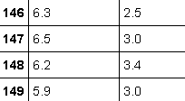

在这种情况下，结果是一个Pandas DataFrame。 使用相同功能时，结果为何如此不同？ 在第一种情况下，我们要求提供一列。 因此，输出为一维向量（即Pandas系列）。 在第二个示例中，我们询问了多列，并获得了类似矩阵的结果（并且我们知道矩阵被映射为 pandas DataFrames）。 新手阅读者只需查看输出标题即可发现差异。 如果列被标记，则说明您正在处理 pandas DataFrame。 另一方面，如果结果是向量，并且不显示标题，则为Pandas系列。

到目前为止，我们已经从数据科学过程中学到了一些常见步骤； 加载数据集后，通常会分离特征和目标标签。

在分类问题中，目标标签是指示与每组要素关联的类的序数或文本字符串。

然后，以下步骤要求您了解问题的严重程度，因此，您需要了解数据集的大小。 通常，对于每个观察，我们计算一条线，对于每个要素，计算一列。

要获取数据集的维度，只需在 pandas DataFrame 或系列上使用属性形状，如以下示例所示：

```py
In: print (X.shape) Out: (150, 2) In:  print (y.shape) Out: (150,)
```

生成的对象是一个元组，其中包含每个维度中矩阵/数组的大小。 另外，请注意，Pandas系列遵循相同的格式（即只有一个元素的元组）。

# 处理有问题的数据

现在，您应该对流程的基础更加自信，并准备好面对问题更大的数据集，因为现实中通常会出现混乱的数据。 因此，让我们看看如果 CSV 文件包含标头以及一些缺少的值和日期会发生什么。 例如，为了使我们的示例更现实，让我们想象一下旅行社的情况：

1.  根据三个热门目的地的温度，他们记录用户是选择第一个，第二个还是第三个目的地：

```py
Date,Temperature_city_1,Temperature_city_2,Temperature_city_3,Which_destination 20140910,80,32,40,1 20140911,100,50,36,2 20140912,102,55,46,1 20140912,60,20,35,3 20140914,60,,32,3 20140914,,57,42,2
```

2.  在这种情况下，所有数字都是整数，并且标头位于文件中。 在我们第一次尝试加载该数据集时，我们可以提供以下命令：

```py
In: import pandas as pd In: fake_dataset = pd.read_csv('a_loading_example_1.csv', sep=',')
    fake_dataset
```

打印`fake_dataset`的第一行：

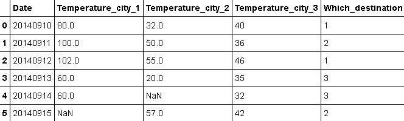

从第一个数据行中选取它们后，Pandas 会自动为它们提供实际名称。 我们首先发现一个问题：所有数据，甚至日期，都被解析为整数（或者在其他情况下，解析为字符串）。 如果日期格式不是很奇怪，则可以尝试使用自动检测例程，该例程指定包含日期数据的列。 在以下示例中，当使用以下参数时，它可以很好地工作：

```py
In: fake_dataset = pd.read_csv('a_loading_example_1.csv', 
                               parse_dates=[0])
    fake_dataset
```

这是`fake_dataset`，其日期列现在已由`read_csv`正确解释：

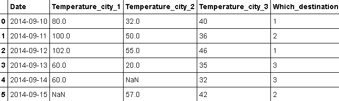

现在，为了摆脱`NaN`指示的缺失值，请用更有意义的数字（例如 50 华氏度）替换它们。 我们可以通过以下方式执行命令：

```py
In: fake_dataset.fillna(50)
```

在这一点上，您将注意到不再缺少变量：


之后，所有丢失的数据都消失了，并已由常量`50.0`代替。 处理丢失的数据也可能需要不同的方法。 作为先前命令的替代方法，可以用负常数值替换值，以标记它们与其他值不同的事实（并由学习算法来猜测）：

```py
In: fake_dataset.fillna(-1)  
```

请注意，此方法仅填充数据视图中的缺失值（也就是说，它不会修改原始 DataFrame）。 为了实际更改它们，请使用`inplace=True argument`命令。

`NaN`值也可以用列的平均值或中值代替，以最大程度地减少猜测误差：

```py
In: fake_dataset.fillna(fake_dataset.mean(axis=0))  
```

`.mean`方法计算指定轴的平均值。

请注意，`axis= 0`表示对跨越行的均值的计算； 结果获得的均值是从逐列计算得出的。 相反，`axis=1`跨列，因此获得了逐行结果。 对于其他要求使用 axis 参数的其他方法（在 pandas 和 NumPy 中），其工作方式相同。

`.median`方法类似于`.mean`，但是它计算中值，如果分布太偏斜（例如，当 有很多极限值）。

处理实际数据集时，另一个可能的问题是加载包含错误或错误行的数据集时。 在这种情况下，`read_csv`方法的默认行为是停止并引发异常。 一种可能的解决方法是忽略导致错误的行，这在错误的示例不是多数的情况下是可行的。 在许多情况下，这种选择仅具有训练机器学习算法而没有错误观察的含义。 举个例子，假设您有一个格式错误的数据集，并且您只想加载所有好的行而忽略格式错误的行。

现在，这是您的`a_loading_example_2.csv`文件：

```py
Val1,Val2,Val3 0,0,0 1,1,1 2,2,2,2 3,3,3 
```

这是您可以使用`error_bad_lines`选项执行的操作：

```py
In: bad_dataset = pd.read_csv('a_loading_example_2.csv',
                              error_bad_lines=False) 
 bad_dataset Out: Skipping line 4: expected 3 fields, saw 4
```

结果输出的第四行被跳过，因为它具有四个值而不是三个值：

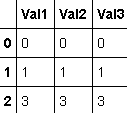

# 处理大型数据集

如果要加载的数据集太大而无法容纳在内存中，则可以使用批量机器学习算法来处理它，该算法一次只能处理部分数据。 如果您只需要数据样本（假设您要查看数据），则使用批量方法也很有意义。 多亏了 Python，您实际上可以分块加载数据。 此操作也称为数据流，因为数据集作为连续流式流入 DataFrame 或某些其他数据结构。 与以前的所有情况相反，该数据集已在独立步骤中完全加载到内存中。

对于Pandas，有两种方法可以分块和加载文件。 第一种方法是将数据集以相同大小的块加载； 每个块都是数据集的一部分，包含所有列和有限数量的行，最多不超过您在函数调用中实际设置的数量（`chunksize`参数）。 请注意，在这种情况下，`read_csv`函数的输出不是 pandas DataFrame，而是类似迭代器的对象。 实际上，要将结果存储在内存中，您需要迭代该对象：

```py
In: import pandas as pd 
    iris_chunks = pd.read_csv(iris_filename, header=None, 
                              names=['C1', 'C2', 'C3', 'C4', 'C5'], 
                              chunksize=10) 
    for chunk in iris_chunks: 
        print ('Shape:', chunk.shape) 
        print (chunk,'n') Out: Shape: (10, 5)   
        C1   C2   C3   C4            C5
     0  5.1  3.5  1.4  0.2  Iris-setosa
     1  4.9  3.0  1.4  0.2  Iris-setosa
     2  4.7  3.2  1.3  0.2  Iris-setosa
     3  4.6  3.1  1.5  0.2  Iris-setosa
     4  5.0  3.6  1.4  0.2  Iris-setosa
     5  5.4  3.9  1.7  0.4  Iris-setosa
     6  4.6  3.4  1.4  0.3  Iris-setosa
     7  5.0  3.4  1.5  0.2  Iris-setosa
     8  4.4  2.9  1.4  0.2  Iris-setosa
     9  4.9  3.1  1.5  0.1  Iris-setosa
     ...
```

还将有其他 14 个类似的作品，每个都是`Shape: 10, 5`。 加载大数据集的另一种方法是专门要求它的迭代器。 在这种情况下，您可以动态确定每个Pandas DataFrame 的长度（即要获得多少行）：

```py
In:  iris_iterator = pd.read_csv(iris_filename, header=None,
                                 names=['C1', 'C2', 'C3', 'C4', 'C5'], 
                                 iterator=True)  

In:  print (iris_iterator.get_chunk(10).shape) Out: (10, 5) In:  print (iris_iterator.get_chunk(20).shape) Out: (20, 5) In:  piece = iris_iterator.get_chunk(2)
     piece
```

输出仅代表原始数据集的一部分：

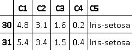

在此示例中，我们首先定义了迭代器。 接下来，我们检索了一条包含 10 行的数据。 然后，我们又获得了 20 行，最后得到了最后打印的两行。

除Pandas外，您还可以使用 CSV 软件包，该软件包提供了两个功能来迭代文件中的小块数据：`reader`和`DictReader`函数。 让我们通过导入 CSV 包来说明这些功能：

```py
In:import csv  
```

`reader`将数据从磁盘输入到 Python 列表。 `DictReader`而是将数据转换为字典。 这两个函数都是通过遍历正在读取的文件的行来工作的。 `reader`完全返回其读取的内容，除去返回回车，并通过分隔符（默认为逗号，但可以修改）分成列表。 `DictReader`会将列表的数据映射到字典中，其关键字将由第一行（如果存在标题）或`fieldnames`参数（使用报告列名的字符串列表）定义。

以本机方式读取列表不是限制。 例如，使用快速的 Python 实现（例如 PyPy）来加速代码会更容易。 此外，我们始终可以将列表转换为 NumPy `ndarrays`（我们即将介绍的数据结构）。 通过将数据读取为 JSON 样式的字典，将很容易获得 DataFrame。

这是一个使用 CSV 软件包中的此类功能的简单示例。

让我们假设从[这个页面](http://mldata.org/)下载的`datasets-uci-iris.csv`文件是一个巨大的文件，我们无法将其完全加载到内存中（实际上，我们只是假装这是 这种情况是因为我们记得我们在本章的开头看到了该文件；它仅由 150 个示例组成，并且 CSV 缺少标题行）。

因此，我们唯一的选择是将其加载到块中。 首先，让我们进行一个实验：

```py
In: with open(iris_filename, 'rt') as data_stream:
      # 'rt' mode
      for n, row in enumerate(csv.DictReader(data_stream,
           fieldnames = ['sepal_length', 'sepal_width',
                         'petal_length', 'petal_width', 
                         'target'],
           dialect='excel')):
              if n== 0:
                  print (n, row)
              else:
    break Out: 0 OrderedDict([('sepal_length', '5.1'), ('sepal_width', '3.5'),     
     ('petal_length', '1.4'), ('petal_width', '0.2'), ('target', 'Iris-
     setosa')]) 
```

前面的代码完成什么工作？ 首先，它打开一个到文件的读取二进制连接，该文件别名为`data_stream`。 使用`with`命令可确保完全执行前面缩进中的命令后关闭文件。

然后，迭代（`for...in`）并枚举`csv.DictReader`调用，该调用包装来自`data_stream`的数据流。 由于文件中没有标题行，因此`fieldnames`提供了有关字段名称的信息。 `dialect`仅指定我们正在调用标准的逗号分隔 CSV（稍后将提供一些有关如何修改此参数的提示）。

在迭代内部，如果正在读取的行是第一行，则将其打印出来。 否则，通过`break`命令停止循环。 `print`命令为我们提供行号`0`和一个字典。 因此，您只需调用带有变量名称的键，即可调用该行的所有数据。

同样，我们可以使`csv.reader`命令使用相同的代码，如下所示：

```py
In: with open(iris_filename, 'rt') as data_stream:
    for n, row in enumerate(csv.reader(data_stream,
        dialect='excel')):
            if n==0:
                print (row)
            else:
    break Out: ['5.1', '3.5', '1.4', '0.2', 'Iris-setosa']  
```

在这里，代码更加简单，输出也更加简单，提供了一个包含序列中行值的列表。

至此，基于第二段代码，我们可以创建一个可从 for 循环迭代中调用的生成器。 这将从函数的批量参数定义的大小的块中的文件中即时获取数据：

```py
In: def batch_read(filename, batch=5):
      # open the data stream
      with open(filename, 'rt') as data_stream:
        # reset the batch
        batch_output = list()
        # iterate over the file
        for n, row in enumerate(csv.reader(data_stream, dialect='excel')):
            # if the batch is of the right size
            if n > 0 and n % batch == 0:
                # yield back the batch as an ndarray
                yield(np.array(batch_output))
                # reset the batch and restart
                batch_output = list()
            # otherwise add the row to the batch
            batch_output.append(row)
        # when the loop is over, yield what's left               
        yield(np.array(batch_output))
```

与上一个示例类似，由于`enumerate`函数包装的`csv.reader`函数与提取的数据列表以及示例编号（从零开始）一起提供，因此可以提取数据。 根据示例编号，批量列表将附加到数据列表中，或者使用生成的`yield`函数返回到主程序。 重复此过程，直到整个文件被读取并批量返回为止：

```py
In: import numpy as np
    for batch_input in batch_read(iris_filename, batch=3):
        print (batch_input)
    break Out: [['5.1' '3.5' '1.4' '0.2' 'Iris-setosa']
      ['4.9' '3.0' '1.4' '0.2' 'Iris-setosa']
      ['4.7' '3.2' '1.3' '0.2' 'Iris-setosa']]
```

这样的功能可以为随机梯度下降学习提供基本功能，如第 4 章，“机器学习”中所述，我们将回到这段代码并进行扩展 通过引入一些更高级的示例，此示例。

# 访问其他数据格式

到目前为止，我们仅处理 CSV 文件。 为了加载 MS Excel，HDFS，SQL，JSON，HTML 和 Stata 数据集，pandas 包提供了类似的功能（和功能）。 由于这些格式中的大多数格式在数据科学中并未常规使用，因此大多数人只能了解如何加载和处理每种格式，您可以参考[Pandas网站上的可用文档](http://pandas.pydata.org/pandas-docs/version/0.16/io.html)。 在这里，我们将仅演示如何有效地使用磁盘空间以快速有效的方式存储和检索机器学习算法信息的要点。 在这种情况下，您可以利用 [SQLite 数据库](https://www.sqlite.org/index.html)来访问特定的信息子集并将其转换为 pandas DataFrame。 如果您不需要对数据进行特定的选择或过滤，但是唯一的问题是从 CSV 文件读取数据非常耗时，并且每次都需要很多工作（例如，设置正确的变量类型和 名称），则可以使用 [HDF5 数据结构](https://support.hdfgroup.org/HDF5/whatishdf5.html)来加快保存和加载数据的速度。

在第一个示例中，我们将使用 SQLite 和 SQL 语言存储一些数据并检索其过滤后的版本。 与其他数据库相比，SQLite 具有许多优点：它是独立的（所有数据都将存储在一个文件中），无服务器（Python 将提供存储，操作和访问数据的接口）且速度很快。 导入`sqlite3`程序包（它是 Python 堆栈的一部分，因此无论如何都不需要安装）后，您定义了两个查询：一个删除同名的先前数据表，另一个创建一个新表 能够保留日期，城市，温度和目的地数据（并且您使用整数，浮点数和 varchar 类型，它们对应于`int`，`float`和`str`）。

打开数据库（此时已创建，如果尚未在磁盘上创建的数据库）之后，执行两个查询，然后提交更改（通过提交，[实际上是在一个批量中开始执行所有先前的数据库命令](https://www.sqlite.org/atomiccommit.html)）：

```py
In: import sqlite3
 drop_query = "DROP TABLE IF EXISTS temp_data;" create_query = "CREATE TABLE temp_data \ (date INTEGER, city VARCHAR(80), \ temperature REAL, destination INTEGER);" connection = sqlite3.connect("example.db") connection.execute(drop_query) connection.execute(create_query) connection.commit()
```

此时，数据库及其所有数据表均已在磁盘上创建。

在上一个示例中，您在磁盘上创建了一个数据库。 您还可以通过将连接输出更改为`':memory:'`在内存中创建它，如代码段`connection = sqlite3.connect(':memory:') you can use ':memory:' to create an in-memory database`中所示。

为了将数据插入数据库表，最好的方法是创建一个包含要存储的数据行的值的元组列表。 然后，插入查询将负责记录每个数据行。 请注意，这次我们对多个命令（每行分别插入到表中）使用了`executemany`方法，而不是前一个命令`execute`：

```py
In: data = [(20140910, "Rome",   80.0, 0),
 (20140910, "Berlin", 50.0, 0), (20140910, "Wien",   32.0, 1), (20140911, "Paris",  65.0, 0)] insert_query = "INSERT INTO temp_data VALUES(?, ?, ?, ?)" connection.executemany(insert_query, data) connection.commit()
```

在这一点上，我们仅需通过选择查询就可以根据特定条件确定要获取内存的数据，然后使用`read_sql_query`命令对其进行检索：

```py
In: selection_query = "SELECT date, city, temperature, destination \
 FROM temp_data WHERE Date=20140910" retrieved = pd.read_sql_query(selection_query, connection)
```

现在，您需要的所有数据（以 Pandas DataFrame 格式）都包含在`retrieved`变量中。 您需要做的就是关闭与数据库的连接：

```py
In: connection.close()
```

在以下示例中，我们将面对大型 CSV 文件的情况，该文件需要很长时间才能加载和解析其列变量。 在这种情况下，我们将使用 HDF5 数据格式，该格式适合于快速存储和检索 DataFrame。

**HDF5** 是一种文件格式，最初是由**国家超级计算应用中心**（**NCSA**）开发的，用于存储和访问大量科学数据。 1990 年代 NASA 的要求，以便对地球观测系统和其他太空观测系统产生的数据具有便携式文件格式。 HDF5 安排为分层数据存储，可保存同构类型或组的多维数组，这些数组是数组和其他组的容器。 作为文件系统，它非常适合 DataFrame 结构，并且通过自动数据压缩，对于大文件，这样的文件系统可以使数据加载比简单地读取 CSV 文件快得多。

使用 pandas 软件包可以使用 HDF5 格式存储系列和 DataFrame 数据结构。 您可能会发现它对于存储二进制数据（例如预处理的图像或视频文件）也非常有用。 当您需要从磁盘访问大量文件时，由于文件分散在文件系统中，因此将数据存入内存可能会遇到一些延迟。 将所有文件存储到单个 HDF5 文件中将仅解决问题。 您可以在[这个页面](https://www.h5py.org/)，尤其是[上阅读如何使用`h5py`包，这是一个 Python 包，它提供了以 NumPy 数组形式存储和检索数据的接口。 ] http://docs.h5py.org/en/stable/](http://docs.h5py.org/en/stable/) ，其主要文档网站。 您也可以通过发出`conda install h5py`或`pip install h5py`命令来安装`h5py`。

我们将从使用`HDFStore`命令初始化 HDF5 文件`example.h5`开始，该命令允许对数据文件进行低级操作。 实例化文件后，您可以像使用 Python 字典一样开始使用它。 在以下代码段中，将`Iris`数据集存储在字典键`iris`下。 之后，您只需关闭 HDF5 文件：

```py
In: storage = pd.HDFStore('example.h5')
 storage['iris'] = iris storage.close()
```

当需要检索存储在 HDF5 文件中的数据时，可以使用`HDFStore`命令重新打开该文件。 首先，检查可用键（就像在字典中一样）：

```py
In: storage = pd.HDFStore('example.h5')
 storage.keys() Out: ['/iris']
```

然后，通过使用相应的键调用所需的值来分配所需的值：

```py
In: fast_iris_upload = storage['iris']
 type(fast_iris_upload) Out: pandas.core.frame.DataFrame
```

数据将立即加载，并且先前的 DataFrame 现在可在变量`fast_iris_upload`下进行进一步处理。

# 将数据放在一起

最后，可以通过合并系列或其他类似列表的数据来创建 pandas DataFrames。 请注意，标量将转换为列表，如下所示：

```py
In: import pandas as pd
    my_own_dataset = pd.DataFrame({'Col1': range(5), 
                                   'Col2': [1.0]*5, 
                                   'Col3': 1.0, 
                                   'Col4': 'Hello World!'})
    my_own_dataset
```

这是`my_own_dataset`的输出：

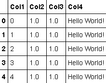

可以很容易地说，对于要堆叠在一起的每个列，您都可以提供它们的名称（作为字典键）和值（作为该键的字典值）。 如前面的示例所示，`Col2`和`Col3`以两种不同的方式创建，但是它们提供了相同的结果值列。 这样，您可以创建一个Pandas数据框，其中包含具有非常简单功能的多种数据类型。

在此过程中，请确保不要混合使用不同大小的列表； 否则，将引发异常，如下所示：

```py
In: my_wrong_own_dataset = pd.DataFrame({'Col1': range(5), 
                          'Col2': 'string', 'Col3': range(2)}) Out: ...
     ValueError: arrays must all be same length 
```

为了组装整个现有的 DataFrame，您必须使用基于串联的其他方法。 pandas 软件包提供了`concat`命令，该命令通过在轴`0`（默认选项）上工作时堆叠行或在轴`1`上串联时堆叠列来对Pandas数据结构（`Series`和 DataFrames）进行操作：

```py
In: col5 = pd.Series([4, 3, 2, 1, 0])
 col6 = pd.Series([0, 0, 1, 1, 1]) a_new_dataset = pd.concat([col5, col6], axis=1,
                              ignore_index = True, keys=['Col5', 'Col6']) my_new_dataset = pd.concat([my_own_dataset, a_new_dataset], axis=1) my_new_dataset
```

结果数据集是`col5`和`col6`系列的串联：


在前面的示例中，我们基于两个`Series`创建了一个新的 DataFrame `a_new_dataset`。 不管它们的索引如何，我们都将它们堆叠在一起，因为我们使用了`ignore_index`参数，该参数设置为`True`。 如果对索引进行匹配对您的项目很重要，则不要使用`ignore_index`参数（其默认值为`False`），您将基于两个索引的并集或仅基于两个索引而获得一个新的 DataFrame 结果匹配的索引元素。

通过在参数`join='inner'`中添加等效于 SQL 内部联接的参数`join='inner'`，可以在`pd.concat`中基于公共列联接两个不同的数据集（有关连接的主题，将在以下示例中处理） 。

根据索引进行匹配有时可能不足以满足您的需求。 有时，您可能需要在特定列或一系列列上匹配不同的`Series`或 DataFrame。 在这种情况下，您需要`merge`方法，该方法可以在每个 DataFrame 中运行。

为了查看`merge`方法的作用，我们将创建一个参考表，其中包含一些要基于`Col5`进行匹配的值：

```py
In: key = pd.Series([1, 2, 4])
 value = pd.Series(['alpha', 'beta', 'gamma']) reference_table = pd.concat([key, value], axis=1,                                ignore_index = True,
 keys=['Col5', 'Col7']) reference_table
```

这是`key`和`value`到一个 DataFrame 之间的串联：

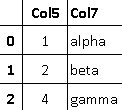

通过将`how`参数设置为`left`来操作合并，从而实现 SQL 左外部联接。 除`left`以外，此参数的其他可能设置如下：

*   `right`：等效于 SQL 右外部联接
*   `outer`：等效于 SQL 完全外部联接
*   `inner`：等效于 SQL 内部联接（如前所述）

```py
In: my_new_dataset.merge(reference_table,
 on='Col5', how='left')
```

产生的 DataFrame 是左外部联接：

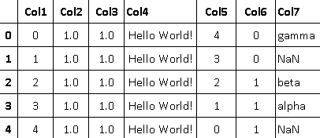

回到我们的初始`my_own_dataset`，为了检查每一列中存在的数据类型，您可以检查`dtypes`属性的输出：

```py
In: my_own_dataset.dtypes Out:  Col1      int64
      Col2    float64
      Col3    float64
      Col4     object
      dtype: object  
```

如果您希望检查数据是分类的，整数的还是浮点的，则在此示例中看到的最后一个方法非常方便，并且它的精度也很高。 实际上，有时可以通过将浮点数舍入为整数并将双精度浮点数转换为单精度浮点数或仅使用一种类型的数据来提高处理速度。 在下面的示例中，让我们看看如何转换类型。 该示例也可以看作是有关如何重新分配列数据的广泛示例：

```py
In:  my_own_dataset['Col1'] = my_own_dataset['Col1'].astype(float)
     my_own_dataset.dtypes Out: Col1    float64
     Col2    float64
     Col3    float64
     Col4     object
     dtype: object  
```

您还可以使用`info()`获得有关 DataFrame 结构和数据类型的信息，如本示例所示：`my_own_dataset.info()`。

# 数据预处理

现在，我们能够导入数据集，甚至是有问题的大型数据集。 现在，我们需要学习基本的预处理程序，以便使其在下一步的数据科学步骤中可行。

首先，如果您需要将功能应用于行的有限部分，则可以创建**掩码**。 掩码是一系列布尔值（即`True`或`False`），它们告诉您是否选择了该行。

例如，假设我们要选择`Iris`数据集的`sepal length`大于`6`的所有行。 我们可以简单地执行以下操作：

```py
In: mask_feature = iris['sepal_length'] > 6.0 In: mask_feature

Out:   0     False
       1     False
     ...
     146     True
     147     True
     148     True
     149    False
```

在前面的简单示例中，我们可以立即看到哪些观测值是`True`，哪些不是（`False`），哪些符合选择查询。

现在，让我们检查一下如何在另一个示例中使用选择蒙版。 我们想用`New label`标签代替`Iris-virginica`目标标签。 我们可以使用以下两行代码来做到这一点：

```py
In: mask_target = iris['target'] == 'Iris-virginica'
    iris.loc[mask_target, 'target'] = 'New label'  
```

您会看到`Iris-virginica`的所有出现现在都被`New label`代替了。 以下代码说明了`loc()`方法。 只需将其视为借助行列索引访问矩阵数据的一种方法即可。

要在目标列中查看标签的新列表，我们可以使用`unique()`方法。 如果要首先评估数据集，此方法非常方便：

```py
In: iris['target'].unique() Out: array(['Iris-setosa', 'Iris-versicolor', 'New label'], 
            dtype=object)
```

如果要查看有关每个功能的一些统计信息，可以将每列相应地分组； 最终，您也可以使用口罩。 pandas 方法`groupby`将产生与 SQL 语句中的`GROUP BY`子句类似的结果。 下一个要应用的方法应该是一个或多个列上的聚合方法。 例如，`mean()` pandas 聚合方法是`AVG()` SQL 函数的对应方法，用于计算组中值的平均值。 Pandas聚合方法`var()`计算方差； `sum()`求和； `count()`组中的行数； 等等。 请注意，结果仍然是 pandas DataFrame，因此可以将多个操作链接在一起。

对变量的许多常见操作，例如`mean`或`sum`都是 DataFrame 方法，可以按列（使用参数`axis=0`，即`iris.sum(axis=0)`或按行（使用`axis=1`）：

*   `count`：非空（NaN）值的计数
*   `median`：返回中位数； 即第 50 个百分位
*   `min`：最低值
*   `max`：最高值
*   `mode`：模式，是最频繁出现的值
*   `var`：方差，用于测量值的离散度
*   `std`：标准偏差，是方差的平方根
*   `mad`：平均绝对偏差，这是一种测量对异常值稳健的值的离散度的方法
*   `skew`：偏度的度量，指示分布对称性
*   `kurt`：峰度的量度，指示分布形状

下一步，我们可以尝试使用`groupby`的几个示例。 通过按目标（即标签）对观察结果进行分组，我们可以检查每组特征的平均值和方差之间的差异：

```py
In: grouped_targets_mean = iris.groupby(['target']).mean()
    grouped_targets_mean
```

输出是已分组的`Iris`数据集，分组函数是平均值：

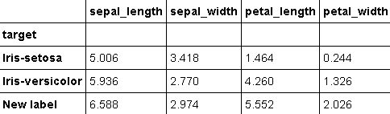

```py
In: grouped_targets_var = iris.groupby(['target']).var()
    grouped_targets_var
```

现在，分组功能就是方差：


由于您可能需要对每个变量进行多个统计，因此您可以直接使用`agg`方法，并针对每个变量应用特定的功能，而不是通过串联将多个聚合的数据集放在一起。 您可以通过字典定义变量，字典中的键是变量标签，值是要应用的函数的列表–由字符串（例如`'mean'`，`'std'`，`'min'`，`'max'`，`'sum'`和`'prod'`）或通过当场声明的预定义函数甚至是 lambda 函数：

```py
In: funcs = {'sepal_length': ['mean','std'],
 'sepal_width' : ['max', 'min'], 'petal_length': ['mean','std'], 'petal_width' : ['max', 'min']} grouped_targets_f = iris.groupby(['target']).agg(funcs) grouped_targets_f
```

现在，每列都有不同的分组功能：

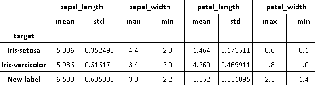

以后，如果需要使用函数对观察结果进行排序，则可以使用`.sort_index()`方法，如下所示：

```py
In: iris.sort_index(by='sepal_length').head()
```

作为输出，您将获得数据集的顶部行：


最后，如果您的数据集包含一个时间序列（例如，对于数字目标），并且您需要对其应用`rolling`操作（对于嘈杂的数据点），则只需执行以下操作：

```py
In: smooth_time_series = pd.rolling_mean(time_series, 5)  
```

可以针对这些值的滚动平均值执行此操作。 或者，您可以给出以下命令：

```py
In: median_time_series = pd.rolling_median(time_series, 5) 
```

相反，可以执行此操作以获得值的滚动中值。 在这两种情况下，窗口的大小均为 5。

更一般而言，`apply()` pandas 方法能够以编程方式执行任何按行或按列的操作。 `apply()`应该直接在 DataFrame 上调用； 第一个参数是按行或按列应用的函数； 第二个参数是对其应用轴。 请注意，该函数可以是内置的，库提供的，lambda 或任何其他用户定义的函数。

作为此强大方法的示例，让我们尝试计算每行中有多少个非零元素。 使用`apply`方法，这很简单：

```py
In: iris.apply(np.count_nonzero, axis=1).head() Out:   0    5
       1    5
       2    5
       3    5
       4    5
       dtype: int64
```

类似地，要按功能（即按列）计算非零元素，只需更改第二个参数并将其设置为`0`即可：

```py
In: iris.apply(np.count_nonzero, axis=0) Out:  sepal_length    150
      sepal_width     150
      petal_length    150
      petal_width     150
      target          150
      dtype: int64  
```

最后，要在元素方面进行操作，应在 DataFrame 上使用`applymap()`方法。 在这种情况下，应仅提供一个参数：要应用的函数。

例如，假设您对每个单元格的字符串表示形式的长度感兴趣。 要获得该值，您应该首先将每个单元格转换为字符串值，然后计算长度。 使用`applymap`，此操作非常简单：

```py
In: iris.applymap(lambda x:len(str(x))).head()
```

转换后的 DataFrame 的前几行是：


在对数据应用转换时，实际上不需要将相同的函数应用于每一列。 使用 pandas `apply`方法，您实际上可以通过修改相同的变量或另外创建新的变量将转换应用于单个变量或多个变量：

```py
In: def square(x):
 return x**2 original_variables = ['sepal_length', 'sepal_width',                          'petal_length', 'petal_width']
 squared_iris = iris[original_variables].apply(square)
```

这种方法的一个弱点是，转换可能要花费很长时间，因为Pandas库没有利用最新 CPU 模型的多处理功能。

由于使用 Jupyter 时 Windows 中存在多处理问题，因此以下示例只能在 Linux 机器上运行，或者如果转换为脚本后只能在 Windows 机器上运行，[正如以下 Stack Overflow 答案所建议的那样](https://stackoverflow.com/questions/37103243/multiprocessing-pool-in-jupyter-notebook-works-on-linux-but-not-windows)。

为了缩短此类计算延迟，您可以通过创建`parallel_apply`函数来利用多处理程序包。 这样的函数将一个 DataFrame，一个函数以及该函数的参数作为输入，并创建一个工作池（许多 Python 复制内存中，理想情况下每个线程都在系统的不同 CPU 上运行） 并行执行所需的转换：

```py
In: import multiprocessing

 def apply_df(args): df, func, kwargs = args return df.apply(func, **kwargs) def parallel_apply(df, func, **kwargs): workers = kwargs.pop('workers') pool = multiprocessing.Pool(processes=workers) df_split = np.array_split(df, workers) results = pool.map(apply_df, [(ds, func, kwargs) for ds in df_split]) pool.close() return pd.concat(list(results))
```

使用此功能时，重要的是指定正确的工作线程数（取决于您的系统）和进行计算的轴（由于您按列进行操作，因此`axis=1`是您将要使用的常规参数配置） ）：

```py
In: squared_iris = parallel_apply(iris[['sepal_length', 'sepal_width', 
                                        'petal_length', 'petal_width']], 
                                        func=square, 
                                        axis=1, 
                                        workers=4)
    squared_iris
```

`Iris`数据集很小，在这种情况下，执行所需要的时间可能比仅应用命令还要长，但是在较大的数据集上，差异可能会非常明显，尤其是如果您可以依靠大量的数据 工人。

提示，在 Intel i5 CPU 上，您可以设置`workers=4`以获得最佳结果，而在 Intel i7 上，您可以设置`workers=8`。

# 数据选择

我们将关注的关于Pandas的最后一个主题是数据选择。 让我们从一个例子开始。 我们可能遇到数据集包含索引列的情况。 我们如何正确地将其与Pandas一起进口？ 然后，我们可以积极利用它来简化我们的工作吗？

我们将使用一个非常简单的数据集，其中包含一个索引列（这只是一个计数器而不是功能）。 为了使示例更加通用，让我们从 100 开始索引。因此，行号`0`的索引为`100`：

```py
n,val1,val2,val3 100,10,10,C 101,10,20,C 102,10,30,B 103,10,40,B 104,10,50,A  
```

尝试以经典方式加载文件时，您会发现自己遇到了`n`作为功能（或列）的情况。 几乎没有任何错误，但是不应将索引误用作功能。 因此，最好将其分开。 如果恰巧在模型的学习阶段使用了它，则可能会发生*泄漏*的情况，这是机器学习中错误的主要来源之一。

实际上，如果索引是随机数，则不会损害模型的功效。 但是，如果索引包含渐进，时间或什至是信息性元素（例如，某些数值范围可用于正面结果，而其他数值范围用于负面结果），则可以将其合并到模型的泄漏信息中。 当对新数据使用模型时，这将无法复制：

```py
In: import pandas as pd In: dataset = pd.read_csv('a_selection_example_1.csv')
    dataset
```

这是`read`数据集：

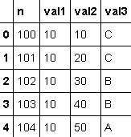

因此，在加载这样的数据集时，我们可能要指定`n`为索引列。 由于索引`n`是第一列，因此我们可以给出以下命令：

```py
In: dataset = pd.read_csv('a_selection_example_1.csv', index_col=0)
    dataset
```

`read_csv`函数现在使用第一列作为索引：


在这里，数据集已加载且索引正确。 现在，要访问单元格的值，我们可以做一些事情。 让我们一一列出：

1.  首先，您可以简单地指定感兴趣的列和行（通过使用其索引）。
2.  要提取第五行的`val3`（索引为`n = 104`），可以给出以下命令：

```py
In: dataset['val3'][104] Out: 'A'
```

3.  请仔细应用此操作，因为它不是矩阵，因此您可能会想先输入行然后输入列。 请记住，它实际上是一个Pandas DataFrame，`[]`运算符首先在列上工作，然后在结果Pandas`Series`的元素上工作。
4.  要具有与前述访问数据的方法类似的功能，可以使用`.loc()`方法，该方法基于标签。 也就是说，它通过索引和列标签起作用：

```py
In: dataset.loc[104, 'val3'] Out: 'A'  
```

在这种情况下，您应该首先指定索引，然后再指定感兴趣的列。

请注意，有时，DataFrame 中的索引可以用数字表示。 在这种情况下，很容易将其与位置索引混淆，但是数字索引不一定是有序的或连续的。

5.  最后，指定位置（位置索引，如在矩阵中）的完全优化函数为`iloc()`。 使用它，您必须使用行号和列号指定单元格：

```py
In: dataset.iloc[4, 2] Out: 'A'  
```

6.  子矩阵的检索是非常直观的操作。 您只需要指定索引列表而不是标量即可：

```py
In: dataset[['val3', 'val2']][0:2]  
```

7.  此命令等效于此：

```py
In: dataset.loc[range(100, 102), ['val3', 'val2']]  
```

8.  它也等效于以下内容：

```py
In: dataset.iloc[range(2), [2,1]]
```

在所有情况下，所得的 DataFrame 如下：

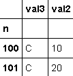

在 pandas DataFrame 中还有另一种索引方法：`ix`方法通过结合基于标签的索引和位置索引来工作：`dataset.ix[104, 'val3']`。 请注意，`ix`必须猜测您指的是什么。 因此，如果您不想混用标签和位置索引，则绝对首选`loc`和`iloc`，以便创建更安全有效的方法。 `ix`将在即将发布的Pandas版本中弃用。

# 处理分类和文本数据

通常，您会发现自己要处理两种主要的数据：分类数据和数值数据。 温度，金额，使用天数或门牌号之类的数字数据可以由浮点数（例如 1.0，-2.3、99.99 等）或整数（例如-3， 9、0、1，依此类推）。 数据可以假定的每个值与其他值都具有直接关系，因为它们具有可比性。 换句话说，您可以说值为 2.0 的要素要比假定值为 1.0 的要素更大（实际上是两倍）。 这种类型的数据定义非常明确且易于理解，具有等于，大于和小于等二进制运算符。

您在职业中可能会看到的另一种数据类型是分类数据。 类别基准表示无法测量的属性，并采用一组有限或无限值（通常称为级别）中的值。 例如，天气是一种分类特征，因为它采用离散集[`sunny`，`cloudy`，`snowy`，`rainy`和`foggy`]中的值。 其他示例包括包含 URL，IP，设备品牌，您放入电子商务购物车中的项目，设备 ID 等的功能。 在此数据上，您无法定义等于，大于和小于二元运算符，因此无法对它们进行排名。

分类和数值的加号是布尔值。 实际上，它们可以看作是分类的（特征的存在/不存在），或者另一方面，可以认为特征具有展览（已显示，未显示）的概率。 由于许多机器学习算法不允许将输入分类，因此布尔特征通常用于将分类特征编码为数值。

让我们继续以天气为例。 如果要映射包含当前天气并采用集合[`sunny`，`cloudy`，`snowy`，`rainy`和`foggy`]中的值并将其编码为二进制特征的要素，则应 创建五个`True` / `False`功能，每个级别的分类功能。 现在，地图很简单：

```py
Categorical_feature = sunny   binary_features = [1, 0, 0, 0, 0] Categorical_feature = cloudy  binary_features = [0, 1, 0, 0, 0] Categorical_feature = snowy   binary_features = [0, 0, 1, 0, 0] Categorical_feature = rainy   binary_features = [0, 0, 0, 1, 0] Categorical_feature = foggy   binary_features = [0, 0, 0, 0, 1]  
```

只有一个二元特征揭示了分类特征的存在。 其他保持`0`。 这称为二进制编码或一种热编码。 通过执行此简单步骤，我们从分类世界转移到了数字世界。 此操作的代价是它在内存和计算方面的复杂性； 现在，我们有五个功能，而不是单个功能。 通常，我们将创建`N`个特征，而不是具有`N`个可能水平的单个分类特征，每个特征都有两个数值（1/0）。 该操作称为伪编码。

pandas 软件包可帮助我们完成此操作，只需一个命令即可简化映射：

```py
In: import pandas as pd
    categorical_feature = pd.Series(['sunny', 'cloudy', 
                                     'snowy', 'rainy', 'foggy'])
    mapping = pd.get_dummies(categorical_feature)
    mapping
```

这是`mapping`数据集：

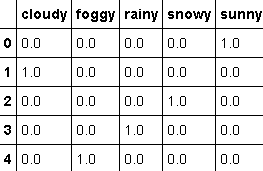

输出是一个 DataFrame，其中包含作为列标签的分类级别以及沿列的各个二进制特征。 要将分类值映射到数字值列表，只需使用 pandas 的功能：

```py
In: mapping['sunny'] Out: 0    1.0
     1    0.0
     2    0.0
     3    0.0
     4    0.0
     Name: sunny, dtype: float64 In: mapping['cloudy'] Out: 0    0.0
     1    1.0
     2    0.0
     3    0.0
     4    0.0
     Name: cloudy, dtype: float64
```

如本例所示，`sunny`被映射到布尔值`[1, 0, 0, 0, 0]`，`cloudy`至`[0, 1, 0, 0, 0]`等的列表中。

可以使用另一个工具包 Scikit-learn 完成相同的操作。 由于必须首先将文本转换为分类索引，所以它以某种方式更加复杂，但是结果是相同的。 让我们再次看一下前面的示例：

```py
In: from sklearn.preprocessing import OneHotEncoder
    from sklearn.preprocessing import LabelEncoder
    le = LabelEncoder()
    ohe = OneHotEncoder()
    levels = ['sunny', 'cloudy', 'snowy', 'rainy', 'foggy']
    fit_levs = le.fit_transform(levels)
    ohe.fit([[fit_levs[0]], [fit_levs[1]], [fit_levs[2]], 
             [fit_levs[3]], [fit_levs[4]]])
    print (ohe.transform([le.transform(['sunny'])]).toarray())
    print (ohe.transform([le.transform(['cloudy'])]).toarray()) Out: [[ 0\.  0\.  0\.  0\.  1.]]
     [[ 1\.  0\.  0\.  0\.  0.]]      
```

基本上，`LabelEncoder`将文本映射到 0 到 N 的整数（请注意，在这种情况下，它仍然是类别变量，因为对其进行排名没有意义）。 现在，这五个值映射到五个二进制变量。

# 特殊类型的数据-文本

让我们介绍另一种类型的数据。 文本数据是机器学习算法的常用输入，因为它包含了我们语言中数据的自然表示形式。 它是如此丰富，它也包含了我们所寻找的答案。 处理文本时，最常见的方法是使用词袋方法。 根据这种方法，每个单词都成为一个特征，文本成为一个向量，其中包含体内所有特征（即单词）的非零元素。 给定一个文本数据集，特征数量是多少？ 很简单。 只需提取其中的所有唯一单词并将其枚举即可。 对于使用所有英语单词的非常丰富的文本，该数字在 100 万范围内。 如果您不打算对其进行进一步处理（删除任何第三人称，缩写，缩略语和首字母缩写词），则可能会发现自己处理的不止这些，但这是非常罕见的情况。 用简单而简单的方法（这是本书的目标），我们让 Python 尽力而为。

本节中使用的数据集是文本的； 它是著名的 *20newsgroup* （有关此信息，请访问[这个页面](http://qwone.com/~jason/20Newsgroups/)）。 它是大约 20,000 个文档的集合，这些文档属于新闻组的 20 个主题。 它是处理文本分类和聚类时最常用（如果不是最常用）的数据集之一。 要导入它，我们将使用其受限子集，其中包含所有科学主题（医学和太空）：

```py
In: from sklearn.datasets import fetch_20newsgroups
    categories = ['sci.med', 'sci.space']
    twenty_sci_news = fetch_20newsgroups(categories=categories)  
```

首次运行此命令时，它将自动下载数据集并将其放置在`$HOME/scikit_learn_data/20news_home/`默认目录中。 您可以通过询问文件的位置，文件的内容和标签（即，文档发布所在的讨论主题）来查询数据集对象。 它们分别位于对象的`.filenames`，`.data`和`.target`属性中：

```py
In: print(twenty_sci_news.data[0]) Out: From: flb@flb.optiplan.fi ("F.Baube[tm]")
     Subject: Vandalizing the sky
     X-Added: Forwarded by Space Digest
     Organization: [via International Space University]
     Original-Sender: isu@VACATION.VENARI.CS.CMU.EDU
     Distribution: sci
     Lines: 12
     From: "Phil G. Fraering" <pgf@srl03.cacs.usl.edu>
     [...] In: twenty_sci_news.filenames Out: array([ 
         '/Users/datascientist/scikit_learn_data/20news_home/20news-bydate-
         train/sci.space/61116',
         '/Users/datascientist/scikit_learn_data/20news_home/20news-
         bydate-train/sci.med/58122',
         '/Users/datascientist/scikit_learn_data/20news_home/20news-
         bydate-train/sci.med/58903',
         ...,
         '/Users/datascientist/scikit_learn_data/20news_home/20news-
         bydate-train/sci.space/60774',
         [...] In: print (twenty_sci_news.target[0])
    print (twenty_sci_news.target_names[twenty_sci_news.target[0]]) Out: 1
     sci.space
```

目标是分类的，但它表示为整数（`sci.med`的`0`和`sci.space`的`1`）。 如果要阅读，请对照`twenty_sci_news.target`数组的索引进行检查。

处理文本的最简单方法是将数据集的主体转换为一系列单词。 这意味着，对于每个文档，将计算特定单词在正文中出现的次数。

例如，让我们制作一个小的，易于处理的数据集：

*   `Document_1`：我们热爱数据科学
*   `Document_2`：数据科学很难

在包含`Document_1`和`Document_2`的整个数据集中，只有六个不同的词：`we`，`love`，`data`，`science`，`is`和`hard`。 给定此数组，我们可以将每个文档与特征向量关联：

```py
In: Feature_Document_1 = [1 1 1 1 0 0]
    Feature_Document_2 = [0 0 1 1 1 1]  
```

请注意，我们将丢弃单词的位置，仅保留单词在文档中出现的次数。 就这样。

在`20newsletter`数据库中，使用 Python，这可以通过简单的方式完成：

```py
In: from sklearn.feature_extraction.text import CountVectorizer
    count_vect = CountVectorizer()
    word_count = count_vect.fit_transform(twenty_sci_news.data)
    word_count.shape Out: (1187, 25638)  
```

首先，我们实例化一个`CountVectorizer`对象。 然后，我们调用该方法对每个文档中的术语进行计数，并为每个文档生成特征向量（`fit_transform`）。 然后，我们查询矩阵大小。 请注意，输出矩阵是稀疏的，因为每个文档只有很少的单词选择是很常见的（因为每行中非零元素的数量非常少，并且存储所有冗余零都没有意义）。 无论如何，输出形状为`(1187, 25638)`。 第一个值是数据集中的观测数量（文档数量），而第二个值是要素数量（数据集中唯一单词的数量）。

`CountVectorizer`转换后，每个文档都与其特征向量相关联。 让我们看一下第一个文档：

```py
In: print (word_count[0]) Out: (0, 10827)  2
     (0, 10501)  2
     (0, 17170)  1
     (0, 10341)  1
     (0, 4762)  2
     (0, 23381)  2
     (0, 22345)  1
     (0, 24461)  1
     (0, 23137)  7
     [...]  
```

您会注意到输出是一个稀疏向量，其中仅存储非零元素。 要检查与单词的直接对应关系，请尝试以下代码：

```py
In: word_list = count_vect.get_feature_names()
    for n in word_count[0].indices:
         print ('Word "%s" appears %i times' % (word_list[n], 
                                                word_count[0, n]))

Out: Word: from appears 2 times
     Word: flb appears 2 times
     Word: optiplan appears 1 times
     Word: fi appears 1 times
     Word: baube appears 2 times
     Word: tm appears 2 times
     Word: subject appears 1 times
     Word: vandalizing appears 1 times
     Word: the appears 7 times
     [...]
```

到目前为止，一切都非常简单，不是吗？ 让我们前进到另一个增加复杂性和有效性的任务。 数词固然好，但我们可以管理更多； 我们可以计算他们的频率。 您可以跨大小不同的数据集进行比较。 它给出了一个单词是停止词（即一个很常见的词，例如 a，an，the 或 is）还是一个稀有的，唯一的单词的想法。 通常，这些术语是最重要的，因为它们能够根据这些单词来表征实例和功能，这在学习过程中是非常有区别的。 要检索每个文档中每个单词的出现频率，请尝试以下代码：

```py
In: from sklearn.feature_extraction.text import TfidfVectorizer
    tf_vect = TfidfVectorizer(use_idf=False, norm='l1')
    word_freq = tf_vect.fit_transform(twenty_sci_news.data)
    word_list = tf_vect.get_feature_names()
    for n in word_freq[0].indices:
   print ('Word "%s" has frequency %0.3f' % (word_list[n],  
                                                   word_freq[0, n])) Out: Word "from" has frequency 0.022
     Word "flb" has frequency 0.022
     Word "optiplan" has frequency 0.011
     Word "fi" has frequency 0.011
     Word "baube" has frequency 0.022
     Word "tm" has frequency 0.022
     Word "subject" has frequency 0.011
     Word "vandalizing" has frequency 0.011
     Word "the" has frequency 0.077 
     [...]
```

频率的总和为 1（或由于近似值而接近 1）。 发生这种情况是因为我们选择了`l1`规范。 在这种特定情况下，单词`frequency`是概率分布函数。 有时，增加稀有词与常见词之间的差异会很好。 在这种情况下，可以使用`l2`范数归一化特征向量。

向量化文本数据的一种更有效的方法是使用`tf-idf`。 简而言之，您可以将构成文档的单词的术语频率乘以单词本身的逆文档频率（即，它出现在文档中的数量或对数缩放转换中）。 这对于突出显示有效描述每个文档的单词非常有用，这些单词是数据集中强大的区分元素：

```py
In: from sklearn.feature_extraction.text import TfidfVectorizer
    tfidf_vect = TfidfVectorizer() # Default: use_idf=True
    word_tfidf = tfidf_vect.fit_transform(twenty_sci_news.data)
    word_list = tfidf_vect.get_feature_names()
    for n in word_tfidf[0].indices:
    print ('Word "%s" has tf-idf %0.3f' % (word_list[n], 
                                               word_tfidf[0, n])) Out: Word "fred" has tf-idf 0.089
     Word "twilight" has tf-idf 0.139
     Word "evening" has tf-idf 0.113
     Word "in" has tf-idf 0.024
     Word "presence" has tf-idf 0.119
     Word "its" has tf-idf 0.061
     Word "blare" has tf-idf 0.150
     Word "freely" has tf-idf 0.119
     Word "may" has tf-idf 0.054
     Word "god" has tf-idf 0.119
     Word "blessed" has tf-idf 0.150
     Word "is" has tf-idf 0.026
     Word "profiting" has tf-idf 0.150
     [...]
```

在此示例中，第一个文档的四个最具特征性的单词是`caste`，`baube`，`flb`和`tm`（它们具有最高的`tf-idf`分数）。 这意味着它们在文档中的任期频率很高，而在其余文档中却很少见。

到目前为止，我们已经为每个单词生成了一个功能。 一起说几句话怎么办？ 当您考虑使用双字母组而不是单字组时，这正是发生的情况。 对于双字（或一般为 n-grams），一个单词及其相邻单词的存在与否很重要（即靠近它的单词及其位置）。 当然，您可以混合使用 gram 字母和 n gram 字母，并为每个文档创建一个丰富的特征向量。 在下面的简单示例中，让我们测试 n-gram 的工作方式：

```py
In: text_1 = 'we love data science'
    text_2 = 'data science is hard'
    documents = [text_1, text_2]
    documents Out: ['we love data science', 'data science is hard'] In: # That is what we say above, the default one
    count_vect_1_grams = CountVectorizer(ngram_range=(1, 1),
    stop_words=[], min_df=1)
    word_count = count_vect_1_grams.fit_transform(documents)
    word_list = count_vect_1_grams.get_feature_names()
    print ("Word list = ", word_list)
    print ("text_1 is described with", [word_list[n] + "(" +
    str(word_count[0, n]) + ")" for n in word_count[0].indices]) Out: Word list =  ['data', 'hard', 'is', 'love', 'science', 'we']
     text_1 is described with ['we(1)', 'love(1)', 'data(1)', 'science(1)'] In: # Now a bi-gram count vectorizer
    count_vect_1_grams = CountVectorizer(ngram_range=(2, 2))
    word_count = count_vect_1_grams.fit_transform(documents)
    word_list = count_vect_1_grams.get_feature_names()
    print ("Word list = ", word_list)
    print ("text_1 is described with", [word_list[n] + "(" +
    str(word_count[0, n]) + ")" for n in word_count[0].indices]) Out: Word list =  ['data science', 'is hard', 'love data', 
     'science is', 'we love']
     text_1 is described with ['we love(1)', 'love data(1)', 
     'data science(1)'] In: # Now a uni- and bi-gram count vectorizer
    count_vect_1_grams = CountVectorizer(ngram_range=(1, 2))
    word_count = count_vect_1_grams.fit_transform(documents)
    word_list = count_vect_1_grams.get_feature_names()
    print ("Word list = ", word_list)
    print ("text_1 is described with", [word_list[n] + "(" +
    str(word_count[0, n]) + ")" for n in word_count[0].indices]) Out: Word list =  ['data', 'data science', 'hard', 'is', 'is hard', 'love',   
     'love data', 'science', 'science is', 'we', 'we love']
     text_1 is described with ['we(1)', 'love(1)', 'data(1)', 'science(1)', 
     'we love(1)', 'love data(1)', 'data science(1)']
```

前面的示例非常直观地结合了我们先前介绍的第一种和第二种方法。 在这种情况下，我们使用了`CountVectorizer`，但是这种方法在`TfidfVectorizer`中非常常见。 请注意，使用 n-gram 时，特征数量呈指数爆炸式增长。

如果功能太多（词典可能太丰富，n-gram 可能太多，或者计算机可能很有限），则可以使用一种技巧来降低问题的复杂性（但是您应该首先评估 权衡性能/权衡复杂性）。 通常会使用散列技巧，其中会散列多个单词（或 n-gram），并且它们的散列会发生冲突（这会产生一堆单词）。 存储桶是语义上不相关的单词集，但具有冲突的哈希。 使用`HashingVectorizer()`，如以下示例所示，您可以决定所需的单词存储桶数。 当然，结果矩阵反映了您的设置：

```py
In: from sklearn.feature_extraction.text import HashingVectorizer
    hash_vect = HashingVectorizer(n_features=1000)
    word_hashed = hash_vect.fit_transform(twenty_sci_news.data)
    word_hashed.shape Out: (1187, 1000)
```

请注意，您不能反转哈希过程（因为它是摘要操作）。 因此，在完成此转换之后，您将必须按原样处理散列特征。 散列具有许多优点：允许将一袋单词快速转换为特征向量（在这种情况下，散列桶是我们的特征），可以轻松地在特征之间容纳从未见过的单词，并通过使用不相关的单词来避免过度拟合 在同一要素中碰撞在一起。

# 用美丽的汤刮网

在上一节中，鉴于已经有了数据集，我们讨论了如何对文本数据进行操作。 如果我们需要抓取网络并手动下载该怎么办？ 这个过程的发生频率超出您的预期，这是数据科学中非常受欢迎的话题。 例如：

*   金融机构会在网上刮擦以提取有关其投资组合中公司的最新详细信息。 报纸，社交网络，博客，论坛和公司网站是这些分析的理想目标。
*   广告和媒体公司会分析网络上许多元素的人气和流行度，以了解人们的反应。
*   专门研究洞察力分析和建议的公司会在网上刮擦以了解模式并为用户行为建模。
*   比较网站使用 Web 来比较价格，产品和服务，从而为用户提供有关当前情况的更新的摘要表。

不幸的是，了解网站是非常艰苦的工作，因为每个网站都是由不同的人来构建和维护的，它们具有不同的基础结构，位置，语言和结构。 它们之间唯一的共同方面是由标准公开语言表示，大多数时候，它是**超文本标记语言**（**HTML**）。

这就是为什么到目前为止，大多数 Web 爬虫都只能以通用方式理解和浏览 HTML 页面的原因。 最常用的 Web 解析器之一被称为 BeautifulSoup。 它是用 Python 编写的，是开源的，非常稳定且易于使用。 而且，它能够检测 HTML 页面中的错误和格式错误的代码段（始终记住，网页通常是人为产品，容易出错）。

对《美丽汤》的完整描述将需要整本书。 在这里，我们只会看到一些。 首先，BeautifulSoup 不是爬虫。 为了下载网页，我们可以（例如）使用`urllib`库：

1.  让我们在 Wikipedia 上下载 William Shakespeare 页面背后的代码：

```py
In: import urllib.request
 url = 'https://en.wikipedia.org/wiki/William_Shakespeare' request = urllib.request.Request(url) response = urllib.request.urlopen(request)
```

2.  现在是时候指示 BeautifulSoup 读取资源并使用 HTML 解析器对其进行解析了：

```py
In: from bs4 import BeautifulSoup
 soup = BeautifulSoup(response, 'html.parser')
```

3.  现在，`soup`已准备就绪并且可以查询。 要提取标题，我们可以简单地要求 title 属性：

```py
In: soup.title Out: <title>William Shakespeare - Wikipedia, 
     the free encyclopedia</title>
```

如您所见，将返回整个标题标签，从而可以更深入地研究嵌套的 HTML 结构。 如果我们想知道与威廉·莎士比亚的维基百科页面相关的类别怎么办？ 只需反复下载和解析相邻页面，创建条目图可能非常有用。 我们应该首先手动分析 HTML 页面本身，以找出包含我们所寻找信息的最佳 HTML 标签是什么。 请记住这里的*没有免费午餐*定理：没有自动发现功能，此外，如果 Wikipedia 修改其格式，事情可能会改变。

经过手动分析，我们发现类别位于名为`'mw-normal-catlinks'`的 div 中； 除了第一个链接，其他所有都可以。 现在，该进行编程了。 让我们将观察到的内容放入一些代码中，为每个类别打印链接页面的标题及其相对链接：

```py
In: section = soup.find_all(id='mw-normal-catlinks')[0] 
    for catlink in section.find_all("a")[1:]: 
        print(catlink.get("title"), "->", catlink.get("href")) Out: Category:William Shakespeare -> /wiki/Category:William_Shakespeare 
     Category:1564 births -> /wiki/Category:1564_births 
     Category:1616 deaths -> /wiki/Category:1616_deaths 
     Category:16th-century English male actors -> /wiki/Category:16th-    
     century_English_male_actors 
     Category:English male stage actors -> /wiki/Category:    
     English_male_stage_actors 
     Category:16th-century English writers -> /wiki/Category:16th-
 century_English_writers
```

我们已经使用`find_all`方法两次来查找带有参数中包含文本的所有 HTML 标签。 在第一种情况下，我们专门在寻找 ID。 在第二种情况下，我们正在寻找所有的`"a"`标签。

然后，根据给定的输出，并使用与新 URL 相同的代码，可以递归下载 Wikipedia 类别页面，此时到达祖先类别。

关于抓取的最后一点：永远不要总是禁止这种做法，在这种情况下，请记住调低下载速率（高速率时，网站的服务器可能会认为您正在进行小规模的 DoS 攻击， 最终可能会将其列入黑名单/禁止您的 IP 地址）。 有关更多信息，您可以阅读网站的条款和条件，或直接联系管理员。

# 使用 NumPy 进行数据处理

引入了基本的 pandas 命令后，您可以在数据科学流水线的这一点上完全，小批量甚至单个数据行上载和预处理数据到内存中，您必须对其进行处理以准备合适的数据 监督和非监督学习程序的数据矩阵。

作为最佳实践，我们建议您在数据仍然是异构的（数字和符号值的混合）工作阶段和将其转换为数据数字表的另一个阶段之间划分任务。 数据表或矩阵排列在代表示例的行中，而列则包含示例的特征观察值（即变量）。

根据我们的建议，您必须在两个用于科学分析的关键 Python 软件包 pandas 和 NumPy 之间进行纠缠，并在它们的两个关键数据结构 DataFrame 和`ndarray`之间进行权衡。 这意味着您的数据科学管道将更加高效，快捷。

由于我们要馈入下一个机器学习阶段的目标数据结构是由`NumPy ndarray`对象表示的矩阵，因此让我们从要获得的结果开始，即如何生成`ndarray`对象。

# NumPy 的 n 维数组

Python 提供了本机数据结构，例如列表和字典，您应尽量使用它们。 例如，列表可以顺序存储异构对象（例如，您可以将数字，文本，图像和声音保存在同一列表中）。 另一方面，由于基于查询表（哈希表），词典可以重新调用内容。 内容可以是任何 Python 对象，并且通常是另一个字典的列表。 因此，词典使您可以访问复杂的多维数据结构。

无论如何，列表和字典都有其自身的局限性，例如：

*   内存和速度存在问题。 它们并未真正针对使用近乎连续的内存块进行优化，并且在尝试应用高度优化的算法或多处理器计算时，这可能会成为问题，因为内存处理可能会成为瓶颈。
*   它们非常适合存储数据，但不适用于对其进行操作。 因此，无论您想对数据做什么，都必须先定义自定义函数，然后在列表或字典元素上进行迭代或映射。
*   在处理大量数据时，迭代通常可能证明不是最佳选择。

NumPy 提供了具有以下属性的`ndarray`对象类（n 维数组）：

*   它是内存最佳的（除了其他方面，还配置为以性能最佳的内存块布局将数据传输到 C 或 Fortran 例程）
*   它允许进行快速的线性代数计算（向量化）和逐元素运算（广播），而无需使用带有 for 循环的迭代
*   诸如 SciPy 或 Scikit-learn 之类的关键库期望数组作为其功能正常运行的输入

所有这些都有一些限制。 实际上，`ndarray`对象具有以下缺点：

*   它们通常只存储单个特定数据类型的元素，您可以预先定义（但是可以定义复杂数据和异构数据类型，尽管出于分析目的可能很难处理）。
*   初始化之后，它们的大小是固定的。 如果要更改其形状，则必须重新创建它们。

# NumPy ndarray 对象的基础

在 Python 中，数组是特定类型的内存连续数据块，其标头包含索引方案和数据类型描述符。

多亏了索引方案，数组可以表示多维数据结构，其中每个元素都以`n`整数的元组索引，其中`n`是维数。 因此，如果您的数组是一维的（即顺序数据的向量），则索引将从零开始（如 Python 列表中所示）。

如果是二维的，则必须使用两个整数作为索引（`x`，`y`类型的坐标元组）； 如果存在三个维度，则使用的整数数将为三个（元组`x`，`y`，`z`），依此类推。

在每个索引位置，数组将包含指定数据类型的数据。 数组可以存储许多数值数据类型，以及字符串和其他 Python 对象。 也可以创建自定义数据类型，从而处理不同类型的数据序列，尽管我们建议不要这样做，并且建议您在这种情况下使用 pandas DataFrame。 Pandas数据结构确实对于数据科学家所必需的任何异构数据类型的密集使用都具有更大的灵活性。 因此，在本书中，我们将仅考虑特定的已定义类型的 NumPy 数组，并留给Pandas处理异质性。

由于应该从一开始就定义数组的类型（及其以字节为单位的存储空间），因此数组创建过程将保留确切的存储空间以容纳所有数据。 因此，数组元素的访问，修改和计算都非常快，尽管这也因此意味着该数组是固定的，不能更改其结构。

Python 列表数据结构实际上更麻烦，更慢，它是将列表结构链接到包含数据本身的分散内存位置的指针的集合。 取而代之，如下图所示，NumPy `ndarray`由仅一个指针组成，该指针寻址单个存储位置，在该位置上依次存储数据。 当您访问`NumPy` `ndarray`中的数据时，实际上，与使用列表相比，您将需要较少的操作和对不同内存部分的访问，因此在处理大量数据时要提高效率和速度。 缺点是，无法更改连接到 NumPy 数组的数据。 在插入或删除数据时必须重新创建它：

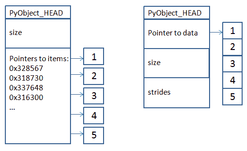

无论 NumPy 数组的尺寸如何，数据始终将按连续的值序列（连续的内存块）进行排列。 正是对数组大小和步幅（告诉我们必须在内存中跳过多少字节才能沿着某个轴移至下一个位置）的跨度知识，才能轻松正确地表示和操作数组。

为了快速实现内存优化，为了存储多维数组，严格地有两种方法称为**行优先**和**列优先**。 由于 **RAM**（**随机存取存储器**）被安排在存储单元的线性存储中（存储单元作为一条线的点是连续的– RAM 中没有像数组这样的东西 ），您必须将阵列展平为向量并将其存储在内存中。 展平时，您可以在 NumPy 软件包中逐行（主要顺序）执行 C/C++ 的典型操作，或者逐列（主要顺序执行）的 Fortran 或 R.Python 的典型操作。 在实现中，使用主要行排序（也称为 C 连续，而主要列排序也称为 Fortran 连续），这意味着在逐行应用的计算操作中，它比逐列工作更快。 无论如何，在创建 NumPy 数组时，您可以根据对行或列进行更多操作的期望来确定数据结构的顺序。 导入软件包`import numpy as np`后，给定数组`a = [[1,2,3],[4,5,6],[7,8,9]]`，您可以按行优先顺序`c = np.array(a, order='C')`或按列优先顺序`f = np.array(a, order='F')`重新定义它

相反，代表多个维度的数据结构列表只能将自己变成嵌套列表，从而增加访问数据时的开销和内存碎片。

到目前为止，您所阅读的所有内容听起来都像是计算机科学家在胡言乱语。 毕竟，所有数据科学家关心的是使 Python 进行有用且快速的操作。 确实是这样，但是从句法的角度快速执行某些操作有时并不能自动等同于从执行本身的角度快速执行操作。 如果您掌握了 NumPy 和 pandas 的内部结构，则可以真正提高代码速度，并在更短的时间内实现更多的项目。 我们拥有使用 NumPy 和 pandas 在语法上正确的数据处理代码的经验，这些代码通过正确的重构将其执行时间减少了一半或更多。

就我们的目的而言，了解在访问或转换数组时，我们可能只是在查看它或在复制它，这也是非常重要的。 当我们*查看*数组时，我们实际上调用了一个过程，该过程使我们可以将其结构中存在的数据转换为其他数据，但是采购数组不变。 根据前面的示例，在查看时，我们只是在更改`ndarray`的 size 属性； 数据保持不变。 因此，除非我们将它们固定到新的数组中，否则在查看数组时经历的任何数据转换都只是短暂的。

相反，当我们*复制*一个数组时，我们实际上是在创建一个具有不同结构的新数组（因此占用了新的内存）。 我们不仅改变相对于数组大小的参数，还需要改变数组的大小。 我们还将保留另一个连续的内存块并将数据复制到那里。

所有的Pandas DataFrame 实际上都是由一维 NumPy 数组构成的。 因此，当您按列进行操作时，它们会继承`ndarrays`的速度和内存效率（因为每个列都是 NumPy 数组）。 当按行操作时，DataFrames 效率较低，因为您要依次访问不同的列。 也就是说，不同的 NumPy 数组。 出于相同的原因，通过 NumPy 数组使用整数作为位置来工作，因此通过位置索引而不是通过Pandas索引来寻址Pandas DataFrame 的各个部分更加快捷。 使用 pandas 索引（也可以是文本索引，而不仅仅是数字索引）实际上需要将索引转换为 DataFrame 才能在数据上正确运行的相应位置。

# 创建 NumPy 数组

创建 NumPy 数组有多种方法。 以下是创建它们的一些方法：

*   通过将现有数据结构转换为数组
*   通过从头开始创建数组并使用默认值或计算值填充它
*   通过将一些数据从磁盘上传到阵列

如果要转换现有的数据结构，则最好使用结构化列表或 pandas DataFrame。

# 从列表到一维数组

处理数据时，最常见的情况之一就是将列表转换为数组。

在进行这种转换时，考虑列表中包含的对象很重要，因为这将确定结果数组的维数和`dtype`。

让我们从仅包含整数的列表的第一个示例开始：

```py
In: import numpy as np In: # Transform a list into a uni-dimensional array
    list_of_ints = [1,2,3]
    Array_1 = np.array(list_of_ints) In: Array_1 Out: array([1, 2, 3]) 
```

请记住，您可以像使用标准 Python 列表一样访问一维数组（索引从零开始）：

```py
In: Array_1[1] # let's output the second value Out: 2  
```

我们可以要求提供有关对象类型及其元素类型的更多信息（有效产生的类型取决于您的系统是 32 位还是 64 位）：

```py
In: type(Array_1) Out: numpy.ndarray In: Array_1.dtype Out: dtype('int64')  
```

默认值`dtype`取决于您所运行的系统。

我们简单的整数列表将变成一维数组。 也就是一个 32 位整数的向量（范围从-231 到 231-1，这是我们用于示例的平台上的默认整数）。

# 控制内存大小

如果值的范围如此有限，您可能会认为使用`int64`数据类型会浪费内存。

实际上，意识到数据密集型情况，您可以计算`Array_1`对象占用了多少内存空间：

```py
In: import numpy as np
    Array_1.nbytes Out: 24  
```

请注意，在 32 位平台上（或在 64 位平台上使用 32 位 Python 版本时），结果为 12。

为了节省内存，您可以事先指定最适合您的数组的类型：

```py
In: Array_1 = np.array(list_of_ints, dtype= 'int8')  
```

现在，您的简单数组仅占据了先前存储空间的四分之一。 这似乎是一个明显且过于简单的示例，但是当处理数百万行和列时，为分析定义最佳数据类型确实可以节省一天的时间，使您可以将所有内容很好地放入内存中。

供您参考，下面的表格列出了数据科学应用程序中最常见的数据类型及其单个元素的内存使用情况：

| **类型** | **字节大小** | **说明** |
| --- | --- | --- |
| `bool` | 1 | 布尔值（`True`或`False`）存储为字节 |
| `int` | 4 | 默认整数类型（通常为`int32`或`int64`） |
| `int8` | 1 | 字节（-128 至 127） |
| `int16` | 2 | 整数（-32768 至 32767） |
| `int32` | 4 | 整数（`-2 ** 31`至`2 ** 31-1`） |
| `int64` | 8 | 整数（`-2 ** 63`至`2 ** 63-1`） |
| `uint8` | 1 | 无符号整数（0 到 255） |
| `uint16` | 2 | 无符号整数（0 到 65535） |
| `uint32` | 4 | 无符号整数（0 到`2 ** 32-1`） |
| `uint64` | 8 | 无符号整数（0 到`2 ** 64-1`） |
| `float_` | 8 | `float64`的简写 |
| `float16` | 2 | 半精度浮点数（指数 5 位，尾数 10 位） |
| `float32` | 4 | 单精度浮点数（指数 8 位，尾数 23 位） |
| `float64` | 8 | 双精度浮点数（指数 11 位，尾数 52 位） |

还有其他一些数字类型，例如复数，这种数字类型不太常见，但您的应用程序可能需要（例如，在频谱图中）。 您可以在[这个页面](http://docs.scipy.org/doc/numpy/user/basics.types.html)上的 NumPy 用户指南中获得完整的构想。

如果数组具有要更改的类型，则可以通过强制转换新的指定类型来轻松创建新数组：

```py
In: Array_1b = Array_1.astype('float32')
    Array_1b Out: array([ 1.,  2.,  3.], dtype=float32)  
```

如果您的数组占用内存，请注意`.astype`方法将复制该数组，因此它总是创建一个新的数组。

# 异构列表

如果列表由异构元素组成，例如整数，浮点数和字符串怎么办？ 这变得更加棘手。 一个简单的例子可以为您描述这种情况：

```py
In: import numpy as np
    complex_list = [1,2,3] + [1.,2.,3.] + ['a','b','c']   
    # at first the input list is just ints
    Array_2 = np.array(complex_list[:3]) 
    print ('complex_list[:3]', Array_2.dtype)
 # then it is ints and floats    Array_2 = np.array(complex_list[:6])  
 print ('complex_list[:6]', Array_2.dtype) # finally we add strings print
    Array_2 = np.array(complex_list)  
    ('complex_list[:] ',Array_2.dtype) 

Out: complex_list[:3] int64 
 complex_list[:6] float64 
 complex_list[:] <U32
```

如我们的输出所示，浮点类型似乎胜过`int`类型，而字符串（`<U32`表示大小为 32 或更小的 Unicode 字符串）将取代其他所有内容。

使用列表创建数组时，您可以混合使用不同的元素，并且检查结果的最 Pythonic 方法是质疑生成的数组的`dtype`。

请注意，如果不确定数组的内容，则必须进行检查。 否则，您可能会发现无法对结果数组进行操作，并且以后可能会发生错误（不支持的操作数类型）：

```py
In: # Check if a NumPy array is of the desired numeric type
    print (isinstance(Array_2[0],np.number)) Out: False
```

在我们的数据处理过程中，无意中发现了一个字符串类型的数组作为输出，这意味着我们忘记了在前面的步骤中将所有变量都转换为数字变量。 例如，当所有数据都存储在 pandas DataFrame 中时。 在上一节中，“处理类别和文本数据”，我们提供了一些简单明了的方式来处理这种情况。**

在此之前，让我们完成对如何从列表对象派生数组的概述。 如前所述，列表中对象的类型也影响数组的维数。

# 从列表到多维数组

如果将包含数字或文本对象的列表渲染为一维数组（例如，可以表示系数向量），则列表列表转换为二维数组，并且列表列表变为三维 一：

```py
In: import numpy as np
    # Transform a list into a bidimensional array
    a_list_of_lists = [[1,2,3],[4,5,6],[7,8,9]]
    Array_2D = np.array(a_list_of_lists )
    Array_2D Out: array([[1, 2, 3],
            [4, 5, 6],
            [7, 8, 9]])
```

如前所述，您可以在列表中用索引调出单个值，尽管这里您将有两个索引-一个用于行维（也称为轴 0），一个用于列维（轴 1）：

```py
In: Array_2D[1, 1] Out: 5
```

二维数组通常是数据科学问题中的常态，尽管当一个维表示时间时可以找到三维数组，例如：

```py
In: # Transform a list into a multi-dimensional array
    a_list_of_lists_of_lists = [[[1,2],[3,4],[5,6]],
                                [[7,8],[9,10],[11,12]]]
    Array_3D = np.array(a_list_of_lists_of_lists)
    Array_3D    

Out: array([[[ 1,  2],
 [ 3,  4], [ 5,  6]], [[ 7,  8], [ 9, 10], [11, 12]]])
```

要访问三维数组的单个元素，只需指出三个索引：

```py
In: Array_3D[0,2,0] # Accessing the 5th element Out: 5  
```

可以用类似于创建列表的方法从元组中创建数组。 另外，借助`.items()`方法，字典可以转换为二维数组，该方法返回字典的键值对列表的副本：

```py
In: np.array({1:2,3:4,5:6}.items())

Out: array([[1, 2],
            [3, 4],
            [5, 6]])  
```

# 调整数组大小

之前，我们提到了如何更改数组元素的类型。 现在，我们将停一会儿，以研究最常见的指令来修改现有数组的形状。

让我们从使用`.reshape`方法的示例开始，该方法接受`n`-元组，其中包含新尺寸的大小作为参数：

```py
In: import numpy as np
    # Restructuring a NumPy array shape
    original_array = np.array([1, 2, 3, 4, 5, 6, 7, 8])
    Array_a = original_array.reshape(4,2)
    Array_b = original_array.reshape(4,2).copy()
    Array_c = original_array.reshape(2,2,2)
    # Attention because reshape creates just views, not copies
    original_array[0] = -1
```

我们原始的数组是一个整数，从 1 到 8 的一维向量。这是我们在代码中执行的内容：

1.  我们将`Array_a`分配给大小为 4 x 2 的重塑`original_array`
2.  我们对`Array_b`进行了相同的操作，尽管我们追加了`.copy()`方法，该方法会将数组复制到新数组中
3.  最后，我们将`Array_c`分配给尺寸为 2 x 2 x 2 的三个维度的变形数组
4.  完成分配后，`original_array`的第一个元素的值从`1`更改为`-1`

现在，如果我们检查数组的内容，我们将注意到`Array_a`和`Array_c`尽管具有所需的形状，但它们以`-1`为第一个元素来表征。 那是因为它们动态地镜像了他们在视图中所见的原始数组：

```py
In: Array_a Out: array([[-1, 2],
             [3, 4],
             [5, 6],
 [7, 8]]) In: Array_c Out: array([[[-1,  2],
              [3,  4]],
             [[5,  6],
              [7,  8]]])
```

只有`Array_b`数组在突变原始数组之前已被复制，其第一个元素的值为`1`：

```py
In: Array_b Out: array([[1, 2],
 [3, 4], [5, 6], [7, 8]])
```

如果有必要更改原始数组的形状，则首选`resize`方法：

```py
In: original_array.resize(4,2) 
    original_array Out: array([[-1,  2],
 [ 3,  4], [ 5,  6], [ 7,  8]])
```

通过分配表示预期尺寸的大小的值的元组，对`.shape`值进行操作，可以获得相同的结果：

```py
In: original_array.shape = (4,2)  
```

相反，如果您的数组是二维的，并且您需要与列交换行，即要转置数组，则`.T`或`.transpose()`方法将帮助您获得这种转换（ 视图，例如`.reshape`）：

```py
In: original_array Out: array([[-1,  2],
 [ 3,  4], [ 5,  6], [ 7,  8]])
```

# 从 NumPy 函数派生的数组

如果您需要一个具有特定数字序列（零，一，序数和特定统计分布）的向量或矩阵，则 NumPy 函数可为您提供多种选择。

首先，如果使用`arange`函数，则创建一个序数（整数）的 NumPy 数组很简单，该函数会在给定的时间间隔（通常从零开始）中返回整数值，并调整其结果的形状：

```py
In: import numpy as np In: ordinal_values = np.arange(9).reshape(3,3)
    ordinal_values Out: array([[0, 1, 2],
            [3, 4, 5],
            [6, 7, 8]])
```

如果必须按值顺序反转数组，请使用以下命令：

```py
In: np.arange(9)[::-1]

Out: array([8, 7, 6, 5, 4, 3, 2, 1, 0])  
```

如果整数只是随机的（无序且可能重复），请提供以下命令：

```py
In: np.random.randint(low=1,high=10,size=(3,3)).reshape(3,3)  
```

其他有用的数组由零和一组成，或为单位矩阵：

```py
In: np.zeros((3,3)) In: np.ones((3,3)) In: np.eye(3)  
```

如果将数组用于网格搜索以搜索最佳参数，则间隔或对数增长中的分数值应被证明是最有用的：

```py
In: fractions = np.linspace(start=0, stop=1, num=10)
 growth = np.logspace(start=0, stop=1, num=10, base=10.0)  
```

取而代之的是，统计分布，例如正态分布或均匀分布，对于系数的向量或矩阵的初始化可能是方便的。

在这里可以看到 3 x 3 的标准化标准值矩阵（平均值= 0，标准= 1）：

```py
In: std_gaussian = np.random.normal(size=(3,3))
```

如果需要指定其他均值和标准差，则只需输入以下命令：

```py
In: gaussian = np.random.normal(loc=1.0, scale= 3.0, size=(3,3))  
```

`loc`参数代表平均值，`scale`实际上是标准偏差。

用于初始化向量的统计分布的另一个常见选择当然是均匀分布：

```py
In: rand = np.random.uniform(low=0.0, high=1.0, size=(3,3))  
```

# 直接从文件获取数组

NumPy 数组也可以直接从文件中存在的数据创建。

让我们使用上一章中的示例：

```py
In: import numpy as np
    housing = np.loadtxt('regression-datasets-housing.csv',
                         delimiter=',', dtype=float)
```

给定`filename`，`delimiter`和`dtype`的 NumPy `loadtxt`会将数据上传到数组，除非`dtype`错误； 例如，有一个`string`变量，所需的数组类型是`float`，如以下示例所示：

```py
In: np.loadtxt('datasets-uci-iris.csv',delimiter=',',dtype=float) Out: ValueError: could not convert string to float: Iris-setosa  
```

在这种情况下，可行的解决方案可能是知道字符串是哪一列（或任何其他非数字格式），并借助`loadtxt`的`converters`参数准备一个转换函数以将其转换为数字， 允许您将特定的转换函数应用于数组的特定列，例如以下示例：

```py
In: def from_txt_to_iris_class(x):
 if x==b'Iris-setosa': return 0 elif x==b'Iris-versicolor': return 1 elif x== b'Iris-virginica': return 2 else: return np.nan 

 np.loadtxt('datasets-uci-iris.csv', delimiter=',',               converters= {4: from_txt_to_iris_class})
```

# 从Pandas中提取数据

与Pandas互动非常容易。 实际上，通过在 NumPy 上构建Pandas，可以轻松地从 DataFrame 对象中提取数组，并将它们本身转换为 DataFrames。

首先，让我们将一些数据上传到 DataFrame 中。 我们在上一章从 ML 存储库中下载的`BostonHouse`示例是合适的：

```py
In: import pandas as pd
    import numpy as np
    housing_filename = 'regression-datasets-housing.csv'
    housing = pd.read_csv(housing_filename, header=None)
```

如“异构列表”部分中所演示的，此时`.values`方法将提取一个类型数组，该数组容纳 DataFrame 中存在的所有不同类型：

```py
In: housing_array = housing.values
    housing_array.dtype Out: dtype('float64')  
```

在这种情况下，所选类型为`float64`，因为浮点类型优先于`int`类型：

```py
In: housing.dtypes Out:  0     float64
      1       int64
      2     float64
      3       int64
      4     float64
      5     float64
      6     float64
      7     float64
      8       int64
      9       int64
      10      int64
      11    float64
      12    float64
      13    float64
      dtype: object
```

在使用 DataFrame 上的`.dtypes`方法提取 NumPy 数组之前询问 DataFrame 对象使用的类型，可以使您预期所得数组的`dtype`。 因此，它允许您在继续操作之前决定是要转换还是更改 DataFrame 对象中的变量类型（请参考本章“处理类别和文本数据”）。

# NumPy 快速运算和计算

当需要通过数学运算来操纵数组时，您只需要针对数字常数（标量）或形状相同的数组在数组上应用该运算：

```py
In: import numpy as np
 a =  np.arange(5).reshape(1,5) a += 1 a*a Out: array([[ 1,  4,  9, 16, 25]])  
```

结果，该操作将按元素进行； 也就是说，数组的每个元素都可以通过标量值或另一个数组的相应元素来操作。

当对不同维数的数组进行操作时，如果其中一个维数为 1，则仍然可以进行元素操作，而不必重新构建数据。实际上，在这种情况下，大小为 1 的维数会一直扩展到 匹配相应数组的尺寸。 这种转换称为广播。

例如：

```py
In: a = np.arange(5).reshape(1,5) + 1
    b = np.arange(5).reshape(5,1) + 1
    a * b Out: array([[ 1,  2,  3,  4,  5],
            [ 2,  4,  6,  8, 10],
            [ 3,  6,  9, 12, 15],
            [ 4,  8, 12, 16, 20],
            [ 5, 10, 15, 20, 25]])
```

上面的代码等效于以下代码：

```py
In: a2 = np.array([1,2,3,4,5] * 5).reshape(5,5)
    b2 = a2.T
    a2 * b2
```

但是，它不需要扩展原始数组的内存即可获得成对乘法。

此外，存在大量可以对数组进行元素方式操作的 NumPy 函数：`abs()`，`sign()`，`round()`，`floor()`，`sqrt()`，`log()`和`exp()`。

可以由 NumPy 函数进行操作的其他常用操作是`sum()`和`prod()`，它们根据指定的轴提供数组行或列的求和和乘积：

```py
In: print (a2) Out: [[1 2 3 4 5]
 [1 2 3 4 5] [1 2 3 4 5] [1 2 3 4 5] [1 2 3 4 5]] In: np.sum(a2, axis=0) Out: array([ 5, 10, 15, 20, 25]) In: np.sum(a2, axis=1) Out: array([15, 15, 15, 15, 15])
```

在对数据进行操作时，请记住，与简单的 Python 列表相比，数组上的操作和 NumPy 函数非常快。 让我们尝试一些实验。 首先，让我们尝试在处理常量之和时将列表理解与数组进行比较：

```py
In: %timeit -n 1 -r 3 [i+1.0 for i in range(10**6)]
    %timeit -n 1 -r 3 np.arange(10**6)+1.0 Out: 1 loops, best of 3: 158 ms per loop
     1 loops, best of 3: 6.64 ms per loop  
```

在 Jupyter 上，`%time`使您可以轻松地对操作进行基准测试。 然后，`-n 1`参数仅要求基准测试仅执行一个循环的代码段； `-r 3`要求您重试循环执行 3 次（在这种情况下，仅执行一次循环），并报告从此类重复中记录的最佳性能。

计算机上的结果可能会有所不同，具体取决于您的配置和操作系统。 无论如何，标准 Python 操作和 NumPy 操作之间的差异将仍然很大。 尽管在处理小型数据集时并不明显，但这种差异确实会影响您在处理较大数据时或在同一分析管道上循环进行参数或变量选择时的分析。

当应用复杂的操作（例如求平方根）时，也会发生这种情况：

```py
In: import math
    %timeit -n 1 -r 3 [math.sqrt(i) for i in range(10**6)] Out: 1 loops, best of 3: 222 ms per loop In: %timeit -n 1 -r 3 np.sqrt(np.arange(10**6)) Out: 1 loops, best of 3: 6.9 ms per loop  
```

有时，您可能需要将自定义函数应用于数组。 `apply_along_axis`函数可让您使用自定义函数并将其应用于数组的轴上：

```py
In: def cube_power_square_root(x):
 return np.sqrt(np.power(x, 3)) np.apply_along_axis(cube_power_square_root,axis=0, arr=a2) Out: array([[ 1.,  2.82842712,  5.19615242,  8., 11.18033989],
 [ 1.,  2.82842712,  5.19615242,  8., 11.18033989], [ 1.,  2.82842712,  5.19615242,  8., 11.18033989], [ 1.,  2.82842712,  5.19615242,  8., 11.18033989], [ 1.,  2.82842712,  5.19615242,  8., 11.18033989]])
```

# 矩阵运算

除了使用`np.dot()`函数进行逐元素计算外，您还可以基于矩阵计算将乘法应用于二维数组，例如向量矩阵和矩阵矩阵乘法：

```py
In: import numpy as np M = np.arange(5*5, dtype=float).reshape(5,5) M
 Out: array([[  0.,   1.,   2.,   3.,   4.], [  5.,   6.,   7.,   8.,   9.], [ 10.,  11.,  12.,  13.,  14.], [ 15.,  16.,  17.,  18.,  19.], [ 20.,  21.,  22.,  23.,  24.]])
```

例如，我们将创建一个 5 x 5 的二维数组，其中包含从 0 到 24 的序数：

1.  我们将定义一个系数向量和一个将向量及其反面堆叠的数组列：

```py
In: coefs = np.array([1., 0.5, 0.5, 0.5, 0.5])
    coefs_matrix = np.column_stack((coefs,coefs[::-1]))
    print (coefs_matrix) Out: [[ 1\.   0.5]
 [ 0.5  0.5] [ 0.5  0.5] [ 0.5  0.5] [ 0.5  1\. ]]
```

2.  现在，我们可以使用`np.dot`函数将数组与向量相乘：

```py
In: np.dot(M,coefs) Out: array([  5.,  20.,  35.,  50.,  65.])  
```

3.  或向量通过数组：

```py
In: np.dot(coefs,M) Out: array([ 25.,  28.,  31.,  34.,  37.])  
```

4.  或由堆叠系数向量组成的数组（这是一个 5 x 2 矩阵）：

```py
In: np.dot(M,coefs_matrix) Out: array([[  5.,   7.],
 [ 20.,  22.], [ 35.,  37.], [ 50.,  52.], [ 65.,  67.]])
```

NumPy 还提供了一个对象类矩阵，它实际上是`ndarray`的子类，继承了其所有属性和方法。 默认情况下，NumPy 矩阵仅是二维的（因为数组实际上是多维的）。 当相乘时，它们应用矩阵乘积，而不是按元素的乘积（提高幂时也会发生这种情况），并且它们具有一些特殊的矩阵方法（共轭转置使用`.H`，逆使用`.I`）。

除了以类似于 MATLAB 的方式进行操作带来的便利之外，它们没有提供任何其他优势。 您可能会有脚本混乱的风险，因为您必须为矩阵对象和数组处理不同的产品表示法。

从 Python 3.5 开始，Python 中引入了一个新的运算符@（at）运算符，专门用于矩阵乘法（更改适用于 Python 中的所有软件包，而不仅仅是 NumPy）。 引入此新运算符会带来很多好处。
首先，不会再有`*`运算符用于矩阵乘法的情况了。 `*`运算符将仅用于按元素的操作（在具有相同维的两个矩阵（或向量）的情况下，您将操作应用于两个矩阵中具有相同位置的元素之间的运算）。
然后，表示公式的代码将具有更高的可读性，因此变得更易于阅读和解释。 您将不再需要一起评估运算符（`+ - / *`）和方法（`.`），只需评估运算符（`+ - / * @`）。
您可以了解有关此介绍的更多信息（这只是形式上的-使用`.dot`方法可与@运算符一起使用之前可以应用的所有内容），并通过阅读 **Python** 查看一些应用示例。 [Python 基金会网站上的**增强提案**（**PEP465**）](https://www.python.org/dev/peps/pep-0465/)。

# 使用 NumPy 数组进行切片和索引

索引使我们可以通过指出要可视化的列和行的切片或索引来查看`ndarray`：

1.  让我们定义一个工作数组：

```py
In: import numpy as np
    M = np.arange(10*10, dtype=int).reshape(10,10)
```

2.  我们的数组是一个 10 x 10 的二维数组。 我们首先可以将其切成一个维度。 单一维度的符号与 Python 列表中的符号相同：

```py
[start_index_included:end_index_exclude:steps]
```

3.  假设我们要提取 2 到 8 的偶数行：

```py
In: M[2:9:2,:]   

Out: array([[20, 21, 22, 23, 24, 25, 26, 27, 28, 29],
            [40, 41, 42, 43, 44, 45, 46, 47, 48, 49],
            [60, 61, 62, 63, 64, 65, 66, 67, 68, 69],
            [80, 81, 82, 83, 84, 85, 86, 87, 88, 89]])  
```

4.  在对行进行切片之后，我们可以通过仅从索引`5`中获取列来进一步对列进行切片：

```py
In: M[2:9:2,5:]    

Out: array([[25, 26, 27, 28, 29],
 [45, 46, 47, 48, 49], [65, 66, 67, 68, 69], [85, 86, 87, 88, 89]])
```

5.  如列表中所示，可以使用负索引值以从头开始计数。 此外，参数的负数（例如步长）会颠倒输出数组的顺序，如以下示例所示，其中计数从列索引`5`开始但以相反的顺序进行，并朝索引`0`进行：

```py
In: M[2:9:2,5::-1] 

Out: array([[25, 24, 23, 22, 21, 20],
 [45, 44, 43, 42, 41, 40], [65, 64, 63, 62, 61, 60], [85, 84, 83, 82, 81, 80]])
```

6.  我们还可以创建布尔索引，指出要选择的行和列。 因此，我们可以使用`row_index`和`col_index`变量来复制前面的示例：

```py
In: row_index = (M[:,0]>=20) & (M[:,0]<=80) 
 col_index = M[0,:]>=5   
 M[row_index,:][:,col_index]    
Out: array([[25, 26, 27, 28, 29],
 [35, 36, 37, 38, 39], [45, 46, 47, 48, 49], [55, 56, 57, 58, 59], [65, 66, 67, 68, 69], [75, 76, 77, 78, 79], 
            [85, 86, 87, 88, 89]])
```

尽管我们可以使用整数索引将通常的索引应用于其他维度，但我们无法在同一方括号中的列和行上在上下文上使用布尔索引。 因此，我们必须首先对行进行布尔选择，然后重新打开方括号，然后对第一个选择第二个选择，这次重点关注列。

7.  如果需要全局选择数组中的元素，则还可以使用布尔值的掩码，如下所示：

```py
In: mask = (M>=20) & (M<=90) & ((M / 10.) % 1 >= 0.5)
    M[mask]  Out: array([25, 26, 27, 28, 29, 35, 36, 37, 38, 39, 45, 46, 47, 48, 49, 
            55, 56, 57, 58, 59, 65, 66, 67, 68, 69, 75, 76, 77, 78, 79, 
            85, 86, 87, 88, 89])  
```

如果您需要对由掩码选择的阵列分区进行操作（例如`M[mask]=0`），则此方法特别有用。

指出需要从数组中选择哪些元素的另一种方法是通过提供由整数组成的行或列​​索引。 可以通过将数组上的布尔条件转换为索引的`np.where()`函数来定义此类索引，也可以通过简单地提供整数索引序列来定义此类索引，其中整数可以按特定顺序排列，甚至可以重复。 这种方法称为**花式索引**：

```py
In: row_index = [1,1,2,7]
    col_index = [0,2,4,8]  
```

定义行和列的索引后，您必须根据上下文应用它们以选择其坐标由两个索引的值元组给定的元素：

```py
In: M[row_index,col_index] Out: array([10, 12, 24, 78])  
```

这样，选择将报告以下几点：（`1,0`），（`1,2`），（`2,4`）和（`7,8`）。 否则，如前所述，您只需要先选择行，然后再选择由方括号分隔的列：

```py
In: M[row_index,:][:,col_index] Out: array([[10, 12, 14, 18],
            [10, 12, 14, 18],
            [20, 22, 24, 28],
            [70, 72, 74, 78]])
```

最后，请记住切片和索引只是数据视图。 如果需要从此类视图创建新数据，则必须在切片上使用`.copy`方法并将其分配给另一个变量。 否则，对原始数组的任何修改都会反映在您的切片上，反之亦然。 复制方法如下所示：

```py
In: N = M[2:9:2,5:].copy()  
```

# 堆叠 NumPy 数组

当使用二维数据数组进行操作时，NumPy 函数可以轻松快速地执行一些常用操作，例如添加数据和变量。

最常见的此类操作是在数组中添加更多案例：

1.  让我们从创建一个数组开始：

```py
In: import numpy as np
    dataset = np.arange(10*5).reshape(10,5)  
```

2.  现在，让我们添加一行和一排要彼此串联的行：

```py
In: single_line = np.arange(1*5).reshape(1,5)
    a_few_lines = np.arange(3*5).reshape(3,5)  
```

3.  我们可以首先尝试添加一行：

```py
In: np.vstack((dataset,single_line))  
```

4.  您所要做的就是提供一个元组，其中包含前一个垂直数组和后一个垂直数组。 在我们的示例中，如果要添加更多行，则相同的命令可以工作：

```py
In: np.vstack((dataset,a_few_lines))  
```

5.  或者，如果您想多次添加同一行，则该元组可以表示新串联数组的顺序结构：

```py
In: np.vstack((dataset,single_line,single_line))
```

另一种常见情况是，您必须向现有数组添加新变量。 在这种情况下，您必须使用`hstack`（`h`代表**水平**），而不是刚刚显示的`vstack`命令（其中`v`为**垂直**）。

1.  假设您必须向原始数组中添加单位值的`bias`：

```py
In: bias = np.ones(10).reshape(10,1)
    np.hstack((dataset,bias))  
```

2.  无需更改`bias`的形状（因此，它可以是与数组行相同长度的任何数据序列），您可以使用`column_stack()`函数将其作为序列添加，该函数可获得相同的结果，但数量较少 有关数据重塑的问题：

```py
In: bias = np.ones(10)
    np.column_stack((dataset,bias))  
```

在二维科学数组中添加行和列基本上是在数据科学项目中有效处理数据所需要做的全部工作。 现在，让我们看一些针对稍微不同的数据问题的更具体的功能。

首先，尽管二维数组是常态，但您也可以对三维数据结构进行操作。 因此，类似于`hstack()`和`vstack()`但在第三轴上运行的`dstack()`将非常方便：

```py
In: np.dstack((dataset*1,dataset*2,dataset*3))  
```

在此示例中，第三维向原始 2D 数组提供了被乘数，表示变化的渐进速率（时间或变化维度）。

另一个有问题的变化可能是在您的数组中的特定位置插入一行，或更常见的是插入一列。 您可能还记得，数组是连续的内存块。 插入实际上需要重新创建一个新数组，以拆分原始数组。 NumPy `insert`命令可以帮助您快速而轻松地进行操作：

```py
In: np.insert(dataset, 3, bias, axis=1)  
```

您只需要定义要插入的数组（`dataset`），位置（索引`3`），要插入的序列（在本例中为数组`bias`）以及沿其插入的轴 您想要操作插入（轴`1`是垂直轴）。

自然地，您可以通过确保要插入的数组与操作插入的尺寸对齐来插入整个数组（而不仅仅是向量），例如偏移。 在此示例中，为了将相同的数组插入自身，我们必须将其作为插入的元素进行转置：

```py
In: np.insert(dataset, 3, dataset.T, axis=1)  
```

您还可以在不同的轴上进行插入（在以下情况下，轴`0`是水平轴，但也可以在可能具有的数组的任何维上进行操作）：

```py
In: np.insert(dataset, 3, np.ones(5), axis=0)  
```

所做的是将原始数组沿所选轴在指定位置拆分。 然后，将拆分数据与要插入的新数据连接在一起。

# 使用稀疏数组

稀疏矩阵是其值大多为零的矩阵。 当处理某些类型的数据问题（例如**自然语言处理**（**NLP**），数据计数事件（例如客户购买），分类数据转换为二进制变量（ 一种称为“单热编码”的技术，我们将在下一章中对其进行讨论），如果图像中有很多黑色像素，甚至是图像。

使用正确的工具来处理稀疏矩阵，因为它们代表了大多数机器学习算法的内存和计算难题。
首先，稀疏矩阵很大（如果作为普通矩阵处理，它们将无法容纳到内存中），并且它们大多数包含零值，但包含几个单元格。 针对稀疏矩阵进行了优化的数据结构使我们能够高效地存储矩阵，其中大多数值为零的元素都不会占用任何内存空间。 相反，在任何 NumPy 数组中（相反，我们将其称为密集数组），任何零值都会占用一些内存空间，因为数组会跟踪所有值。

另外，稀疏矩阵很大，需要大量计算才能进行处理，但是，它们的大多数值并未用于任何预测。 与在密集矩阵上运行的标准算法相比，可以利用稀疏矩阵数据结构的算法所执行的计算时间要少得多。

在 Python 中，SciPy 的稀疏模块提供了能够解决稀疏问题的不同稀疏数据结构。 更具体地说，它提供了七种不同的稀疏矩阵：

*   `csc_matrix`：压缩的稀疏列格式
*   `csr_matrix`：压缩的稀疏行格式
*   `bsr_matrix`：块稀疏行格式
*   `lil_matrix`：列表格式
*   `dok_matrix`：密钥字典格式
*   `coo_matrix`：COOrdinate 格式（也称为 IJV，三联格式）
*   `dia_matrix`：对角格式

每种矩阵都具有不同的方式来存储稀疏信息，这是一种特殊的方式，可以影响矩阵在不同情况下的性能。 我们将说明每种稀疏矩阵类型，并查看哪些操作快速有效，哪些操作根本不执行。 例如，文档指出`dok_matrix`，`lil_matrix`或`coo_matrix`是从头开始构建稀疏矩阵的最佳方法。 我们将从`coo_matrix`开始讨论这个问题。

You can find all of SciPy's documentation about sparse matrices at [https://docs.scipy.org/doc/scipy/reference/sparse.html](https://docs.scipy.org/doc/scipy/reference/sparse.html).

让我们开始创建一个稀疏矩阵：

1.  为了创建稀疏矩阵，您可以从 NumPy 数组生成它（仅通过将数组传递给 SciPy 的稀疏矩阵格式之一），或通过向 COO 提供包含行索引，列索引和数据值的三个向量 矩阵分别为：

```py
In: row_idx = np.array([0, 1, 3, 3, 4])
 col_idx = np.array([1, 2, 2, 4, 2]) values  = np.array([1, 1, 2, 1, 2], dtype=float) sparse_coo = sparse.coo_matrix((values, (row_idx, col_idx))) sparse_coo  Out: <5x5 sparse matrix of type '<class 'numpy.float64'>' with 5 stored elements in COOrdinate format> 
```

2.  调用 COO 矩阵将告诉您形状以及它包含多少个非零元素。 零元素的数量相对于矩阵的大小将为您提供稀疏度度量，可以通过以下方式计算稀疏度：

```py
In: sparsity = 1.0 - (sparse_coo.count_nonzero() /
    np.prod(sparse_coo.shape))
 print(sparsity) 

Out: 0.8
```

稀疏度为`0.8`； 也就是说，矩阵的 80% 实际上是空的。

您也可以使用 matplotlib 中的`spy`命令以图形方式研究稀疏性。 在下面的示例中，我们将创建一个随机的稀疏矩阵，并以图形形式轻松表示它，以提供一个关于矩阵中有效可用数据的概念：

```py
In: import matplotlib.pyplot as plt
 %matplotlib inline 
 large_sparse = sparse.random(10 ** 3, 10 ** 3, density=0.001, format='coo') plt.spy(large_sparse, marker=',') plt.show()
```

生成的图形将为您提供矩阵中空白区域的概念：

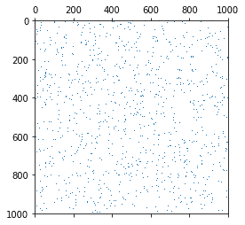

如果需要，您始终可以使用`to_dense`：`sparse_coo.to_dense()`方法将稀疏矩阵转换为密集矩阵。

您可以尝试通过打印来确定 COO 矩阵的构成：

```py
In: print(sparse_coo) Out: (0, 1)    1.0
 (1, 2)    1.0 (3, 2)    2.0 (3, 4)    1.0 (4, 2)    2.0
```

从输出表示中，我们可以得出一个稀疏坐标格式矩阵的工作原理是将打印值存储在三个单独的存储数组中：一个用于`x`坐标，一个用于`y`坐标，以及 一个值。 这意味着在插入信息时，COO 矩阵的确非常快（每个新元素是每个存储阵列中的新行），但是处理起来缓慢，因为它无法立即找出行或列中的值以进行扫描 数组。

对于键字典（DOK）和列表的列表（LIL）也是如此。 第一个使用坐标字典操作（因此它可以快速检索单个元素），第二个使用两个列表，两个列表被排列来代表行，包含该行中的非零坐标以及其他值（很容易 通过添加更多行进行扩展）。
COO 矩阵的另一个优点是，它们可以立即转换为专门用于在行或列级别有效工作的其他类型的矩阵：CSR 和 CSC 矩阵。

**压缩的稀疏行**（**CSR**）和**压缩的稀疏列**（**CSC**）是创建稀疏矩阵后最常用的格式 他们。 他们使用的索引系统更支持对 CSR 的行和对 CSC 的列进行计算。 但是，这使得编辑的计算量很大（因此，创建它们后更改它们并不方便）。

CSR 和 CSC 的性能实际上取决于所使用的算法及其优化参数的方式。 您必须实际对算法进行试验，以找出效果最佳的算法。

最后，对角线格式矩阵是专用于对角线矩阵和块稀疏行格式矩阵的稀疏数据结构。 除了基于整个数据块的数据存储方式外，这些特性在本质上类似于 CSR 矩阵。

# 概括

在本章中，我们讨论了 pandas 和 NumPy 如何为您提供所有工具来加载和有效地修剪数据。

我们从Pandas及其数据结构，DataFrames 和系列开始，然后进行到最终的 NumPy 二维数组，该数组具有适合于后续实验和机器学习的数据结构。 在此过程中，我们涉及到诸如向量和矩阵的操纵，分类数据编码，文本数据处理，修复丢失的数据和错误，切片和切块，合并和堆叠等主题。

Pandas和 NumPy 肯定比我们在此介绍的基本构建块以及所示的命令和过程提供更多的功能。 现在，您可以获取任何可用的原始数据，并应用数据科学项目所需的所有清理和整形转换。

在下一章中，我们将进行数据操作。 我们已经对机器学习过程正常运行所需的所有基本数据处理操作进行了简要概述。 在下一章中，我们将讨论可能改善甚至提高结果的所有操作。