# 可视化，见解和结果

在探索了机器学习之后，但并不是因为这个主题比其他主题没有那么重要，所以我们将说明如何使用 Python 创建可视化来丰富您的数据科学项目。 可视化在帮助您交流从数据和学习过程中获得的结果和见解方面发挥着重要作用。

在本章中，您将学习如何执行以下操作：

*   使用`matplotlib`程序包中的基本`pyplot`功能
*   利用 Pandas `DataFrame`进行**探索性数据分析**（**EDA**）
*   与 Seaborn 一起创建漂亮的交互式图表
*   可视化我们在第 3 章，“数据管道”和第 4 章，“机器学习”中讨论的
    的机器学习和优化过程
*   了解并以视觉方式传达变量的重要性及其与目标结果的关系
*   设置使用 HTTP 接受并提供预测作为服务的预测服务器

# 介绍 Matplotlib 的基础知识

**可视化**是数据科学的基本方面，它使数据科学家可以更好，更有效地将其发现传达给他们所从事的组织，数据专家和非专家。 提供信息交流和精心制作引人入胜的可视化效果背后的原理的基本知识超出了本书的范围，但是如果您想提高自己的技能，我们可以建议合适的资源。

对于基本的可视化规则，您可以访问[这个页面](https://lifehacker.com/5909501/how-to-choose-the-best-chart-for-your-data)。 我们还推荐 Edward Tufte 教授有关分析设计和可视化的书。

取而代之的是，我们可以提供一系列快速，重要的基本食谱，使您可以开始使用 Python 进行可视化，并且可以在需要创建特定图形图表时随时参考。 将所有代码片段都视为可视化构建块； 您只需使用我们将为您提供的大量参数，就可以为它们安排不同的配置和功能。

`matplotlib`是用于绘制图形的 Python 软件包。 它是由约翰·亨特（John Hunter）创建的，旨在解决 Python 与具有图形功能（例如 MATLAB 或 gnuplot）的外部软件之间缺乏集成的问题。 `matplotlib`在很大程度上受到 MATLAB 的操作方式和功能的影响，其语法非常相似。 特别是，与 MATLAB 完全兼容的`matplotlib.pyplot`模块将成为我们介绍所有必要的图形工具以表示数据和分析的基本介绍的核心。 MATLAB 确实是数据分析和科学界可视化的标准，因为它在探索性分析方面具有公认的功能，这主要是因为它具有平滑且易于使用的绘图功能。

每个`pyplot`命令都会对最初实例化的图形进行更改。 设置图形后，所有其他命令都将在该图形上运行。 因此，很容易逐步改进和丰富您的图形表示。 为了使您能够利用代码并能够根据需要进行个性化设置，以下所有示例均与注释的构建块一起提供，以便您以后可以起草基本表示形式，然后在本章中查找特定的参数。 在示例中，以按计划改进图表。

使用`pyplot.figure()`命令，您可以初始化新的可视化效果，尽管它足以调用绘图命令来自动启动它。 相反，通过使用`pyplot.show()`，您可以关闭正在使用的图形，然后可以打开并使用新图形。

在开始一些可视化示例之前，让我们导入必要的包以运行所有示例：

```py
In: import numpy as np
    import matplotlib.pyplot as plt
    import matplotlib as mpl  
```

这样，我们始终可以将 MATLAB 风格的模块`pyplot`称为`plt`，并在`mpl`的帮助下访问完整的`matplotlib`功能集。

如果您正在使用 Jupyter 笔记本（或 Jupyter Lab），则可以使用以下行魔术：`%matplotlib`内联。 在笔记本的单元格中写入命令并运行命令后，您可以直接在笔记本本身上绘制绘图，而不必在单独的窗口中显示图形（默认情况下，`matplotlib`的 GUI 后端是`TkAgg`后端）。 如果您更喜欢 [Qt](https://www.qt.io/) 等通常随 Python 科学发行版一起分发的后端，则只需运行以下行魔术：`%matplotlib` Qt。

# 尝试曲线图

我们的第一个问题将要求您使用`pyplot`绘制函数。 绘制函数非常简单； 您只需要获取一系列`x`坐标，然后使用要绘制的函数将它们映射到`y`轴即可。 由于映射结果存储在两个向量中，因此`plot`函数将处理曲线表示。 如果映射的点足够多（50 个点是一个好的采样数），则表示的精度将更高：

```py
In: import numpy as np
    import matplotlib.pyplot as plt
    x = np.linspace(0, 5, 50)
    y_cos = np.cos(x)
    y_sin = np.sin(x)   
```

使用 NumPy `linspace()`函数，我们将创建一系列 50 个等距的数字，范围从 0 到 5。我们可以使用它们将`y`映射到余弦和正弦函数：

```py
In: plt.figure() # initialize a figure
    plt.plot(x,y_cos) # plot series of coordinates as a line
    plt.plot(x,y_sin)
    plt.xlabel('x') # adds label to x axis
    plt.ylabel('y') # adds label to y axis
    plt.title('title') # adds a title
    plt.show() # close a figure  
```

这是您的第一个情节：

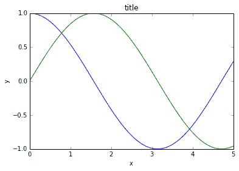

`pyplot.plot`命令可以在一个序列中绘制更多曲线，每个曲线根据内部颜色模式使用不同的颜色，可以通过阐述喜欢的颜色序列进行自定义。 为此，您必须操作包含`matplotlib`使用的颜色序列的列表：

```py
In: list(mpl.rcParams['axes.prop_cycle']) 

Out: [{'color': '#1f77b4'},
      {'color': '#ff7f0e'},
      {'color': '#2ca02c'},
      {'color': '#d62728'},
      {'color': '#9467bd'},
      {'color': '#8c564b'},
      {'color': '#e377c2'},
      {'color': '#7f7f7f'},
      {'color': '#bcbd22'},
      {'color': '#17becf'}]
```

`#1f77b4`, `#ff7f0e`, `#2ca02c`, 以及所有其他颜色均为以十六进制形式表示的颜色。 为了弄清楚它们的外观，[您可以使用 **colorhexa** 网站，为您提供有关它们的有用信息](https://www.colorhexa.com/)。

可以通过使用`cycler`函数并向其提供一串字符串名称来完成该黑客操作，这些字符串名称涉及您要依次使用的颜色：

```py
In: mpl.rcParams['axes.prop_cycle'] = mpl.cycler('color', 
 ['blue', 'red', 'green'])
```

此外，`plot`命令（如果未提供任何其他信息）将假定您要绘制一条线。 因此，它将链接曲线中所有提供的点。 如果添加新参数，例如`'.'` –即`plt.plot(x,y_cos,'.')` –，则表示您想绘制一系列分离的点（直线的字符串为`'-'`，但是我们将很快显示另一个示例 ）。

这样，如果您按照先前的建议自定义了`rcParams['axes.prop_cycle']`，则下一个图形将首先具有蓝色曲线，然后第二个图形将具有红色曲线，第三个图形将具有绿色曲线。 然后，色彩循环将重新开始。 我们将这个决定留给您。 本章中的所有示例都将遵循标准的颜色顺序，但是您可以随意尝试使用更好的颜色设置。

请注意，您还可以设置图形标题，并用标题`pyplot`中的`xlabel`和`ylabel`标记轴。

# 使用面板更清晰的表示

我们的第二个示例将向您演示如何创建多个图形面板并在每个图形面板上绘制表示形式。 我们还将尝试通过使用不同的颜色，大小和样式来个性化绘制的曲线。 这是示例：

```py
In: import matplotlib.pyplot as plt
    # defines 1 row 2 column panel, activates figure 1
    plt.subplot(1,2,1) 
    plt.plot(x,y_cos,'r--')
    # adds a title
    plt.title('cos')
    # defines 1 row 2 column panel, activates figure 2
    plt.subplot(1,2,2) 
    plt.plot(x,y_sin,'b-')
    plt.title('sin') 
    plt.show()
```

该图在两个不同的图形面板上显示余弦和正弦曲线：


`subplot`命令接受`subplot(nrows, ncols, plot_number)`参数形式。 因此，在实例化时，它会基于`nrows`和`ncols`参数以及`plot_number`区域（从左侧的`1`区域开始）的地块数量为表示保留一定的空间。

您还可以将`plot`命令坐标与另一个字符串参数一起使用，这对于定义颜色和所表示曲线的类型很有用。 字符串通过组合您可以在以下链接上找到的代码来工作：

*   [`matplotlib.lines.Line2D.set_linestyle`](https://matplotlib.org/api/lines_api.html#matplotlib.lines.Line2D.set_linestyle)：将显示不同的线型。
*   [颜色 API](https://matplotlib.org/api/colors_api.html)：提供基本内置颜色的完整概述。 该页面还指出，您可以将`color`参数与 HTML 名称或十六进制字符串一起用于颜色，也可以通过使用 RGB 元组来定义所需的颜色，其中元组的每个值都在`[0,1]`。 例如，有效参数为`color = (0.1,0.9,0.9)`，它将创建由 10% 红色，90% 绿色和 90% 蓝色构成的颜色。
*   [标记 API](https://matplotlib.org/api/markers_api.html)：列出您可以为点采用的所有可能的标记样式。

# 为数据关系绘制散点图

散点图将两个变量绘制为平面上的点，它们可以帮助您找出两个变量之间的关系。 如果要表示组和集群，它们也非常有效。 在我们的示例中，我们将创建三个数据集群，并在散点图中以不同的形状和颜色表示它们：

```py
In: from sklearn.datasets import make_blobs
    import matplotlib.pyplot as plt
    D = make_blobs(n_samples=100, n_features=2, 
                   centers=3, random_state=7)
    groups = D[1]
    coordinates = D[0]  
```

由于必须绘制三个不同的组，因此必须使用三个不同的`plot`命令。 每个命令指定不同的颜色和形状（`'ys'`，`'m*'`，`'rD'`字符串，其中第一个字母是颜色，第二个字母是标记）。 另请注意，每个绘图实例均由`label`参数标记，该参数用于为稍后在图例中报告的组分配名称：

```py
In: plt.plot(coordinates[groups==0,0], 
             coordinates[groups==0,1], 
             'ys', label='group 0') # yellow square
    plt.plot(coordinates[groups==1,0], 
             coordinates[groups==1,1], 
             'm*', label='group 1') # magenta stars
    plt.plot(coordinates[groups==2,0], 
             coordinates[groups==2,1], 
             'rD', label='group 2') # red diamonds
    plt.ylim(-2,10) # redefines the limits of y axis
    plt.yticks([10,6,2,-2]) # redefines y axis ticks
    plt.xticks([-15,-5,5,-15]) # redefines x axis ticks
    plt.grid() # adds a grid
    plt.annotate('Squares', (-12,2.5)) # prints text at coordinates
    plt.annotate('Stars', (0,6))
    plt.annotate('Diamonds', (10,3))
    plt.legend(loc='lower left', numpoints= 1) 
    # places a legend of labelled items
    plt.show()
```

结果图将是三个组的散点图，并附有它们各自的标签：

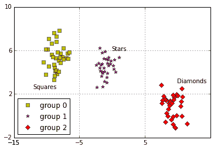

我们还添加了一个图例（`pyplot.legend`），固定了两个轴（`pyplot.xlim`和`pyplot ylim`）的限制，并精确地说明了必须放在它们上的刻度线（`plt.xticks`和`plt.yticks`） 通过指定值列表。 因此，网格（`pyplot.grid`）将图精确地划分为 9 个象限，使您可以更好地了解组的位置。 最后，我们打印了一些文本，指出了组名（`pyplot.annotate`）。

# 直方图

直方图可以有效地表示变量的分布。 在这里，我们将可视化两个正态分布，均以单位标准差为特征，一个均值为`0`，另一个均值为`3.0`：

```py
In: import numpy as np
    import matplotlib.pyplot as plt
    x = np.random.normal(loc=0.0, scale=1.0, size=500)
    z = np.random.normal(loc=3.0, scale=1.0, size=500)
    plt.hist(np.column_stack((x,z)), 
             bins=20, 
             histtype='bar', 
             color = ['c','b'], 
             stacked=True)
    plt.grid()
    plt.show()
```

如果存在分类问题，则联合分布可以对数据提供不同的见解：


有几种方法可以个性化此类图并获得有关分析分布的进一步见解。 首先，通过更改箱子的数量，您将更改分布的离散方式（离散是将连续函数或一系列值转换为可减少的，[可数的一组数字的过程](http://en.wikipedia.org/wiki/Discretization)）。 通常，10 到 20 个箱子可以很好地理解分布，尽管它实际上取决于数据集的大小以及分布。 例如，Freedman-Diaconis 规则规定，直方图中要有效地可视化数据的最佳箱子数量取决于箱子的宽度，可以使用**四分位间距**（**IQR**）和观察次数：


在计算了`h`（箱宽）后，通过将最大值和最小值之间的差除以`h`来计算箱数：

```py
bins = (max-min) / h
```

通过将参数从`histtype='bar'`更改为`histtype='step'`，我们还可以将可视化类型从条形更改为阶梯形。 通过将`stacked`布尔参数更改为`False`，曲线将不会重叠到重叠部分中的唯一条形中，但是您会清楚地看到每个单独的条形。

# 条形图

条形图对于比较不同类别的数量很有用。 它们可以水平或垂直排列以呈现平均估计和误差带。 它们可用于显示预测变量的各种统计数据以及它们与目标变量的关系。

在我们的示例中，我们将给出鸢尾花数据集的四个变量的平均值和标准差：

```py
In: from sklearn.datasets import load_iris 
 import numpy as np 
 import matplotlib.pyplot as plt 
 iris = load_iris() 
 average = np.mean(iris.data, axis=0) 
 std = np.std(iris.data, axis=0) 
 range_ = range(np.shape(iris.data)[1]) 
```

在我们的表示中，我们将准备两个子图：一个带有水平条（`plt.barh`），另一个带有垂直条（`plt.bar`）。 标准误差由误差条表示，根据图形方向，我们可以将`xerr`参数用于水平条并将`yerr`参数用于垂直条：

```py
In: plt.subplot(1,2,1) # defines 1 row, 2 columns panel, activates figure 1
    plt.title('Horizontal bars')
    plt.barh(range_,average, color="r", 
             xerr=std, alpha=0.4, align="center")
    plt.yticks(range_, iris.feature_names)
    plt.subplot(1,2,2) # defines 1 row 2 column panel, activates figure 2
    plt.title('Vertical bars')
    plt.bar(range_,average, color="b", yerr=std, alpha=0.4, align="center")
    plt.xticks(range_, range_)
    plt.show()
```

现在，水平和垂直条都在同一图中：


重要的是注意使用`plt.xticks`命令（纵坐标轴使用`plt.yticks`）。 第一个参数告知命令必须在轴上放置的刻度数，第二个参数说明必须放置在刻度上的标签。

注意的另一个有趣参数是`alpha`，它已用于设置条的透明度级别。 `alpha`参数是一个从 0.0（完全透明）到 1.0 的浮点数，它使颜色以不同的不透明度级别显示。

# 图像可视化

我们使用`matplotlib`探索的最后一个可视化与图像有关。 在处理图像数据时，求助于`plt.imgshow`很有用。 让我们以 Olivetti 数据集为例，该数据集是一个由 40 个人组成的开源图像集，这些人在不同时间提供了 10 张自己的图像（并且使用不同的表达式，这使得测试面部识别算法更具挑战性）。 来自该数据集的图像作为像素强度的特征向量提供。 因此，重要的是对向量进行整形，以使其类似于像素矩阵。 将插值设置为`'nearest'`有助于平滑图像：

```py
In: from sklearn.datasets import fetch_olivetti_faces
    import numpy as np
    import matplotlib.pyplot as plt
    dataset = fetch_olivetti_faces(shuffle=True, random_state=5)
    photo = 1
    for k in range(6):
        plt.subplot(2, 3, k+1)
        plt.imshow(dataset.data[k].reshape(64, 64), 
                   cmap=plt.cm.gray, 
                   interpolation='nearest')
        plt.title('subject '+str(dataset.target[k]))
        plt.axis('off')
    plt.show()
```

将绘制完整的图像面板：


我们还可以可视化手写数字或字母。 在我们的示例中，我们将绘制 Scikit-learn 手写数字数据集中的前九个数字，并设置两个轴的范围（通过使用`extent`参数并提供最小值和最大值的列表）以将像素对齐网格：

```py
In: from sklearn.datasets import load_digits
    digits = load_digits()
    for number in range(1,10):
        fig = plt.subplot(3, 3, number)
        fig.imshow(digits.images[number], 
                   cmap='binary',
                   interpolation='none', 
                   extent=[0,8,0,8])
        fig.set_xticks(np.arange(0, 9, 1))
        fig.set_yticks(np.arange(0, 9, 1))
        fig.grid()
    plt.show()
```

通过仅打印一张图像可以获得单个编号的简单特写：


```py
In: plt.imshow(digits.images[0],
               cmap='binary',
               interpolation='none', 
               extent=[0,8,0,8]) # Extent defines the images max and min 
# of the horizontal and vertical values plt.grid() 
```

生成的图像清楚地突出显示像素如何构成图像及其灰度级：


# 精选的Pandas图形实例

使用适当设置的超参数，许多机器学习算法可以最佳地学习如何根据目标结果映射数据。 但是，通过解决数据中隐藏和细微的问题，可以进一步提高其预测性能。 这不仅仅是检测任何丢失或异常情况的问题。 有时，这取决于数据中是否存在任何组或异常分布（例如，多峰分布）。 明确起草的数据图可以阐明变量之间的关系，并且可以导致创建新的更好的特征，从而以更高的准确性预测目标变量。

刚刚描述的实践称为**探索性数据分析**（**EDA**），并且可以通过以下方式相应地获得有效的结果：

*   它应该很快，可以让您探索和发展新的想法，进行测试，然后以新的探索和新想法重新开始
*   它应基于图形表示，以便更好地整体描述数据，无论其维数多高

`pandas``DataFrame`提供了许多 EDA 工具，可以帮助您进行探索。 但是，首先必须将数据转换为`DataFrame`：

```py
In: import pandas as pd
    print ('Your pandas version is: %s' % pd.__version__)

 from sklearn.datasets import load_iris    iris = load_iris()
    iris_df = pd.DataFrame(iris.data, columns=iris.feature_names)
    groups = list(iris.target)
    iris_df['groups'] = pd.Series([iris.target_names[k] for k in groups]) Out: Your pandas version is: 0.23.1  
```

请检查您的Pandas版本。 我们在`pandas`的 0.23.1 版本下测试了该书中的代码，它在以后的版本中也应适用。

以下段落中介绍的所有示例都将使用`iris_df DataFrame`。

`pandas`软件包实际上依赖于 Matplotlib 函数进行可视化。 它只是为其他复杂的绘图指令提供了一个方便的包装器。 这在速度和简便性方面具有优势，这是任何 EDA 过程的核心价值。 相反，如果您的目的是通过使用精美的可视化效果最好地传达发现，您可能会注意到自定义Pandas图形输出并不是那么容易。 因此，当最重要的是要创建特定的图形输出时，最好使用 Matplotlib 指令从头开始直接工作。

# 使用箱线图和直方图

分发应该始终是数据中要检查的第一个方面。 盒子图可以起草分布图中的关键数据，并帮助您发现异常值。 只需在`DataFrame`上使用`boxplot`方法即可获得快速概述：

```py
In: boxplots = iris_df.boxplot(return_type='axes')
```

这是数据集的所有数字变量的箱形图：


如果您的数据中已经有分组（来自类别变量，或从无监督学习中得出），只需指出变量，您需要在箱线图中表示数据，并指定您需要按分组将其分开（使用[ `by`参数，然后是分组变量的字符串名称）：

```py
In: boxplots = iris_df.boxplot(column='sepal length (cm)', 
                               by='groups', 
                               return_type='axes')
```

运行代码后，将按组获取箱线图：


通过这种方式，您可以快速知道变量是否是组差异的良好区分符。 无论如何，箱形图无法以直方图和密度图的形式为您提供完整的分布图。 例如，通过使用直方图和密度图，您可以确定是否存在分布峰或谷：

```py
In: densityplot = iris_df.plot(kind='density')
```

该代码显示数据集所有数字变量的分布：

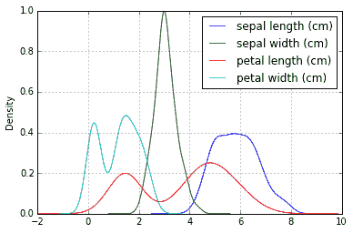

```py
In: single_distribution = iris_df['petal width (cm)'].plot(kind='hist',
                                                           alpha=0.5)
```

这是由直方图表示的结果分布：

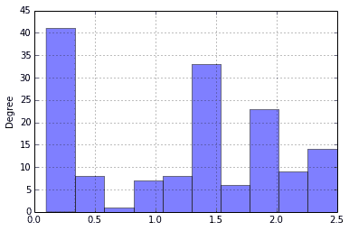

您可以使用`plot`方法获得直方图和密度图。 该方法使您可以表示整个数据集，特定的变量组（您只需要提供字符串名称列表并进行一些华丽的索引编制），甚至单个变量即可。

# 绘制散点图

散点图可用于有效地了解变量是否处于非线性关系中，并且您可以对变量的最佳转换方式有所了解，以实现线性化。 如果您使用基于线性组合的算法，例如线性或逻辑回归，那么弄清楚如何使它们的关系更线性地呈现将有助于您获得更好的预测能力：

```py
In: colors_palette = {0: 'red', 1: 'yellow', 2:'blue'}
    colors = [colors_palette[c] for c in groups]
    simple_scatterplot = iris_df.plot(kind='scatter', x=0, y=1, c=colors)
```

运行代码后，将出现一个精美绘制的散点图：

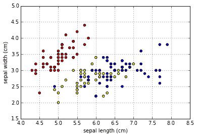

散点图可以变成六边形合并图。 此外，它们还可以帮助您有效地可视化点密度，这些点自然会更多地聚集在一起，从而揭示隐藏在数据中的簇。 为了获得这样的结果，可以使用数据集中最初存在的一些变量，或者使用 PCA 或其他降维算法获得的尺寸：

```py
In: hexbin = iris_df.plot(kind='hexbin', x=0, y=1, gridsize=10)
```

这是生成的`hexbin`图：

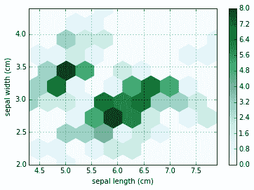

`gridsize`参数指示图表将在一个网格中汇总多少个数据点。 较大的网格将创建大型网格单元，而较小的网格将创建小型网格单元。

散点图是双变量的。 因此，每个变量组合都需要一个图。 如果变量的数量不是很多（否则，可视化将变得混乱），一种快速的解决方案是使用`pandas`命令自动绘制散点图矩阵（使用核密度估计`'kde'`依次在图表的对角线上绘制每个要素的分布）：

```py
In: from pandas.plotting import scatter_matrix
    colors_palette = {0: "red", 1: "green", 2: "blue"}
    colors = [colors_palette[c] for c in groups]
    matrix_of_scatterplots = scatter_matrix(iris_df, 
                                            alpha=0.2, 
                                            figsize=(6, 6),
                                            color=colors, 
                                            diagonal='kde')
```

运行之前的代码后，您将获得完整的图形矩阵（对角线上的密度）：


一些参数可以控制散点图矩阵的各个方面。 `alpha`参数控制透明度的量，`figsize`提供以英寸为单位的矩阵的宽度和高度。 最后，`color`接受一个列表，该列表指示图中每个点的颜色，从而允许描绘数据中的不同组。 另外，通过在`diagonal`参数上选择`'kde'`或`'hist'`，您可以选择在散布矩阵对角线上代表每个变量的密度曲线或直方图。

# 通过平行坐标发现图案

散点图矩阵可以通知您有关要素的联合分布。 它可以帮助您找到数据中的组并验证它们是否可区分。 平行坐标是另一种绘图，有助于为您提供有关数据中存在的最多区分组变量的提示。

通过将所有观测值相对于所有可能的变量绘制为平行线（在横坐标上任意对齐），平行坐标将帮助您发现是否有观测流分组为您的类，并了解最能区分这些流的变量（ 最有用的预测变量）。 自然地，为了使图表有意义，图中的要素应具有与鸢尾花数据集相同的比例尺（否则将其标准化）：

```py
In: from pandas.tools.plotting import parallel_coordinates
    pll = parallel_coordinates(iris_df,'groups') 
```

前面的代码将输出平行坐标：


`parallel_coordinates`是一个Pandas函数，为了正常工作，仅需要数据`DataFrame`和包含要测试其可分离性的组的变量的字符串名称作为参数。 因此，您应该在数据集中使用组变量。 但是，使用`DataFrame.drop('variable name', axis=1, inplace=True)`方法完成探索后，不要忘记将其删除。

# 总结 Matplotlib 的命令

正如我们在上一段中所看到的那样，Pandas可以将可视化的数据浏览速度提高，因为它可以打包成单个命令，而使用 Matplotlib 则需要完整的代码片段。 其背后的想法是，除非需要定制和配置特殊的可视化效果，否则使用包装器可以使您更快地创建标准图形。

除Pandas外，其他软件包还将来自 Matplotlib 的低级指令组装为更用户友好的命令，以用于特定的表示形式和用法：

*   Seaborn 是一个软件包，它通过为您提供一组统计图来扩展趋势图和区分组的功能，从而扩展了您的可视化功能
*   `ggplot`是流行的 R 库[`ggplot2`](https://ggplot2.tidyverse.org/)的端口，它基于 Leland Wilkinson 的书《图形语法》中提出的可视化语法。 R 库是不断开发的，它提供了很多功能； [Python 移植](http://ggplot.yhathq.com/)具有[基础知识](http://ggplot.yhathq.com/docs/index.html)，[并且其完整的开发工作仍在进行中](https://github.com/yhat/ggpy)。
*   [MPLD3](http://mpld3.github.io/) 利用 JavaScript 库进行图形处理 D3.js，以便轻松地将任何 Matplotlib 输出转换为 HTML 代码，可以使用浏览器和工具（如 Jupyter 笔记本； 或在互联网网站中。
*   [Bokeh](https://bokeh.pydata.org/en/latest/) 是一个交互式可视化程序包，它利用 JavaScript 和浏览器呈现的输出。 它是 D3.js 的理想替代品，因为您只需要 Python 即可利用 JavaScript 的功能以交互方式快速表示数据。

在接下来的页面中，我们将介绍 Seaborn，并提供一些构建块以利用它们在您的数据科学项目中的可视化效果。

# 介绍 Seaborn

Seaborn 由 Michael Waskom 创建并托管在 [PyData 网站](http://seaborn.pydata.org/)上，是一个将底层 Matplotlib 与整个 pyData 堆栈包装在一起的库，允许集成图表和来自 NumPy 和 Pandas 的数据结构，以及 SciPy 和 StatModels 的统计例程。 借助内置主题以及专为揭示数据模式而设计的调色板，所有这些工作都特别注重美学。

如果您当前尚未在系统上安装 Seaborn（例如，Anaconda 发行版默认提供它），则可以通过`pip`和`conda`轻松获得它（提醒您`conda`版本可能落后于直接从 PyPI（Python 包索引）获取的`pip`版本）。

```py
$> pip install seaborn 
$> conda install seaborn
```

在这些示例中，我们使用了 Seaborn 软件包的 0.9 版。

您可以通过以下方式上传软件包并将 Seaborn 样式设置为默认的 Matplotlib 样式：

```py
In: import seaborn as sns 
    sns.set() 
```

这足以将您所有基于 Matplotlib 的表示形式转换为更具视觉吸引力的图表：

```py
In: x = np.linspace(0, 5, 50) 
    y_cos = np.cos(x) 
    y_sin = np.sin(x) 
    plt.figure() 
    plt.plot(x,y_cos) 
    plt.plot(x,y_sin) 
    plt.xlabel('x') 
    plt.ylabel('y') 
    plt.title('sin/cos functions') 
    plt.show()
```

结果如下：

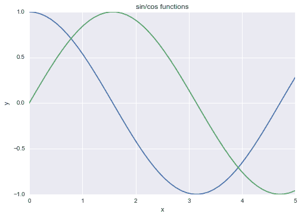

您可以从任何以前看到的图表中获得有趣的结果，甚至可以使用Pandas中的图形方法生成的图表（毕竟，Pandas还依赖于 Matplotlib 来创建其探索性图表）。

Seaborn 中有五个预设主题：

*   `darkgrid`
*   `whitegrid`
*   `dark`
*   `white`
*   `ticks`

默认值为`darkgrid`。 您可以通过使用`set_style`命令和首选主题的名称，然后运行`plot`命令轻松地尝试每个命令：

```py
In: sns.set_style('whitegrid')
```

您所要做的只是确定哪个主题可以帮助您更好地传达图表上的信息。 您可以将样式限制为包含该样式的单个表示形式：

```py
In: with sns.axes_style('whitegrid'):
 # Your plot commands here pass
```

其他时髦的变化可能涉及到刺，这是图表的边界。 使用`despine`命令，您可以轻松删除上下边框：

```py
In: sns.despine()
```

此外，您可以使用`left=True`参数删除左边框，使用`offset`参数偏移轴，并对其进行修剪（使用`trim=True`）。 否则，仅凭 Matplotlib 命令就无法访问所有这些操作。

Seaborn 允许您使用的另一个有用控件是图表的比例。 某个特定的图表比例（涉及不同的线条粗细，字体大小等）称为上下文，可用的上下文是自说明纸，笔记本，谈话和海报，这是可能的选择。 例如，如果您的图表必须显示在 MS PowerPoint 演示文稿上，则只需在创建图形之前运行以下命令：

```py
In: sns.set_context("talk")
```

让我们在最初的 sin/cos 图表上看到一些此类时尚效果的示例：

```py
In: sns.set_context("talk")
 with sns.axes_style('whitegrid'): plt.figure() plt.plot(x,y_cos) plt.plot(x,y_sin) plt.show() sns.set()
```

该代码将绘制以下图表：


同样，选择正确的颜色周期或设置可能有助于图形表示效果。 为此，Seaborn 提供了`color_palette()`命令，该命令不仅会告诉当前调色板的 RBG 值（如果不带参数运行）； 它还将接受 Seaborn 提供的任何调色板的名称或任何 Matplotlib 颜色图。 它甚至接受您以任何 Matplotlib 格式提供的自定义颜色列表（RGB 元组，十六进制颜色代码或 HTML 颜色名称），以便创建自己的调色板：

```py
In: current_palette = sns.color_palette()
 print (current_palette) sns.palplot(current_palette)
```

运行代码后，您将在值和颜色上可视化当前调色板：

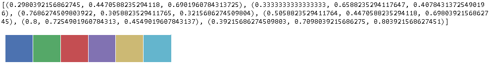

如上所述，有一些调色板可用。 首先，所有 Seaborn 调色板如下：

*   `deep`
*   `muted`
*   `bright`
*   `pastel`
*   `dark`
*   `colorblind`

您还必须添加`hls`，`husl`和所有 Matplotlib 颜色图，可以通过在名称后添加`_r`来反转它们，或者通过添加`_d`使其更暗。

[Matplotlib 颜色图的名称和示例都可以在以下网页上找到](http://matplotlib.org/examples/color/colormaps_reference.html)。

`hls`颜色空间是 RGB 值刻度的自动转换，由于颜色的强度不同（例如，黄色和绿色被感知为较亮，而蓝色被视为为较暗），因此它可能对您的表示形式有效或无效。 。

作为`hsl`的替代，您可以使用`husl`调色板，它对人眼更友好，如[这个页面](http://www.hsluv.org/)所述。

最后，您可以使用 Color Brewer 工具创建个性化的调色板，[该工具可以在网上找到](http://www.personal.psu.edu/cab38/ColorBrewer/ColorBrewer_intro.html)或在 Jupyter笔记本中的应用程序中是所需的。 在笔记本单元中，使用`choose_colorbrewer_palette`命令将显示一个交互式工具。 为了使一切正常工作，必须将`data_type`作为参数指定，这是一个字符串，该字符串说明与要表示的数据相关的调色板的性质：

*   **顺序**：如果要表示连续性
*   **发散**：用于表示反差
*   **定性**：当您只想区分不同的类别时

让我们看看如何创建自定义顺序调色板并使用它：

```py
In: your_palette = sns.choose_colorbrewer_palette('sequential')
```

完整的仪表板将出现：

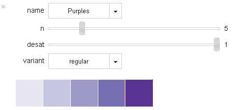

设置颜色后，`your_palette`将变成 RGB 值列表：

```py
In: print(your_palette) Out:[(0.91109573770971852, 0.90574395025477683, 0.94832756940056306),   
     (0.7764706015586853, 0.77908498048782349, 0.88235294818878174),   
     (0.61776242186041452, 0.60213766261643054, 0.78345253116944269), 
     (0.47320263584454858, 0.43267974257469177, 0.69934642314910889), 
     (0.35681661753093497, 0.20525952297098493, 0.58569783322951374)]
```

选择完毕后，您只需调用`sns.set_palette(your_palette)`，并获得绘制所有图表时使用的颜色即可。

如果您只需要对具有某些特定颜色的图表进行操作，则可以使用`with`语句并在其下嵌套图表摘要即可，就像我们之前针对主题所看到的那样。 相反，如果您确实需要设置某个调色板，请使用`set_palette`。

调色板由六种颜色组成，可帮助您区分至少六个趋势或类别。 如果您需要进一步区分，只需使用`hls`调色板进行操作，并指出需要循环的颜色数量：

```py
In: new_palette=sns.color_palette('hls', 10)
 sns.palplot(new_palette)
```

这是生成的调色板：


最后，关闭主题和颜色部分，因为 Seaborn 是使用 Matplotlib 提供的功能的另一种更智能的方式，因此提醒您，可以使用来自 Matplotlib 本身的任何基本命令来进一步修改结果图表。 或者，它们可以通过 MPLD3 或 Bokeh 之类的包进一步转换为 JavaScript。

# 增强您的 EDA 功能

Seaborn 不仅使您的图表更加美观，而且在其方面也易于控制。 它还为您提供了用于 EDA 的新工具，可帮助您发现变量之间的分布和关系。

在继续之前，让我们重新加载程序包，并以 Pandas `DataFrame`格式准备好 Iris 和波士顿数据集：

```py
In: import seaborn as sns 
    sns.set()  

    from sklearn.datasets import load_iris 
    iris = load_iris() 
    X_iris, y_iris = iris.data, iris.target 
    features_iris = [a[:-5].replace(' ','_') for a in iris.feature_names] 
    target_labels = {j: flower \
                        for j, flower in enumerate(iris.target_names)} 
    df_iris = pd.DataFrame(X_iris, columns=features_iris) 
    df_iris['target'] = [target_labels[y] for y in y_iris]  

    from sklearn.datasets import load_boston 
    boston = load_boston() 
    X_boston, y_boston = boston.data, boston.target 
    features_boston = np.array(['V'+'_'.join([str(b), a]) 
                                for a,b in zip(boston.feature_names, 
                                range(len(boston.feature_names)))]) 
    df_boston = pd.DataFrame(X_boston, columns=features_boston) 
    df_boston['target'] = y_boston 
    df_boston['target_level'] = pd.qcut(y_boston,3) 
```

至于虹膜数据集，目标变量已转换为虹膜种类的描述性文本。 对于波士顿数据集，连续目标变量（自有住房的中位数）已分为三个相等的部分，分别代表较低，中位数和较高的价格（使用 Pandas 函数`qcut`）。

Seaborn 首先可以找出离散值或分类变量与数字变量之间的关系，从而帮助您进行数据探索。 这可以通过`catplot`功能实现：

```py
In: with sns.axes_style('ticks'): 
        sns.catplot(data=df_boston, x='V8_RAD', y='target', kind='point')
```

您会发现探索类似的图很有见地，因为它们明确了目标水平及其变化：


在我们的示例中，在波士顿数据集中，对离散值的径向公路的可及性指标与目标进行了比较，以检查其关系的功能形式以及每个级别的相关方差。

而是在数字变量之间进行比较； Seaborn 提供了增强的散点图，并结合了回归拟合曲线趋势，当关系不是线性的时，可以提示您进行可能的数据转换：

```py
In: with sns.axes_style("whitegrid"): 
        sns.regplot(data=df_boston, x='V12_LSTAT', y="target", order=3)
```

装配线将立即显示：

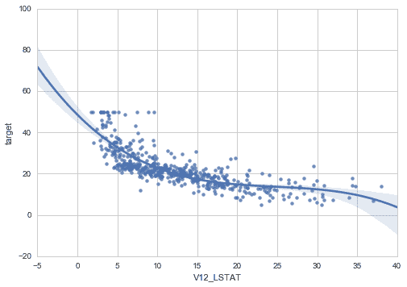

Seaborn 中的`regplot`可以可视化任何顺序的回归图（我们显示了二次多项式拟合）。 在可用的回归图中，如果检查的特征之一是二元的，则可以使用标准线性回归，稳健回归甚至逻辑回归。

在也需要考虑分布的地方，`jointplot`将在散点图的侧面提供其他图：

```py
In: with sns.axes_style("whitegrid"): 
        sns.jointplot("V4_NOX", "V7_DIS", 
                      data=df_boston, kind='reg', 
                      order=3)
```

`jointplot`产生以下图表：

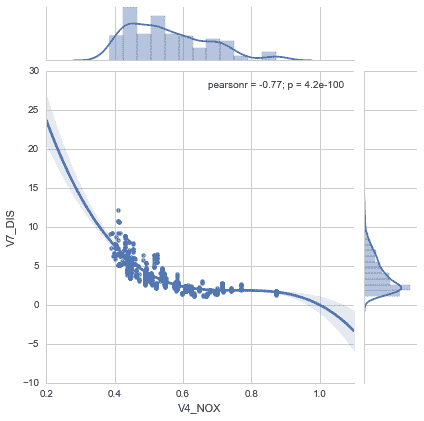

通过作用于`kind`参数来表示双变量关系的理想选择，`jointplot`也可以表示简单的散点图或密度（种类= `scatter`或种类= `kde`）。

当目的是要发现区分类别的内容时，`FacetGrid`可以以可比的方式排列不同的图，并帮助您了解哪里存在差异。 例如，我们可以检查虹膜种类的散点图，以确定它们是否占据了特征状态的不同部分：

```py
In: with sns.axes_style("darkgrid"): 
        chart = sns.FacetGrid(df_iris, col="target_level")   
        chart.map(plt.scatter, "sepal_length", "petal_length") 
```

该代码将很好地打印一个面板，该面板代表基于组的比较：


可以使用分布（`sns.distplot`）或回归斜率（`sns.regplot`）进行类似的比较：

```py
In: with sns.axes_style("darkgrid"):
 chart = sns.FacetGrid(df_iris, col="target") chart.map(sns.distplot, "sepal_length") 
```

第一个比较基于分布：


随后的比较基于拟合线性回归线：

```py
In: with sns.axes_style("darkgrid"):
 chart = sns.FacetGrid(df_boston, col="target_level")chart.map(sns.regplot, "V4_NOX", "V7_DIS") 
```

这是基于回归的比较：


至于评估跨班级的数据分布，Seaborn 提供了另一种工具，即[小提琴图](https://medium.com/@bioturing/5-reasons-you-should-use-a-violin-graph-31a9cdf2d0c6)。 小提琴图只是一个箱形图，其框是根据密度估计来成形的，因此可以直观地传达信息：

```py
In: with sns.axes_style("whitegrid"):     
        ax = sns.violinplot(x="target", y="sepal_length", 
                            data=df_iris, palette="pastel") 
        sns.despine(offset=10, trim=True) 
```

先前代码生成的小提琴图可以为数据集提供有趣的见解：

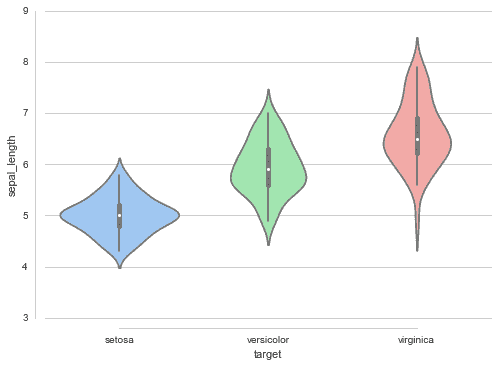

最后，Seaborn 通过使用`pairplot`命令提供了一种更好的方法来创建散点图矩阵，并允许您定义组颜色（参数色相）以及如何填充对角线行。 通过使用`diag_kind`参数，它可以是直方图（`'hist'`）或核密度估计（`'kde'`）：

```py
In: with sns.axes_style("whitegrid"): 
        chart = sns.pairplot(data=df_iris, hue="target", diag_kind="hist") 
```

先前的代码将为数据集输出完整的散点图矩阵：

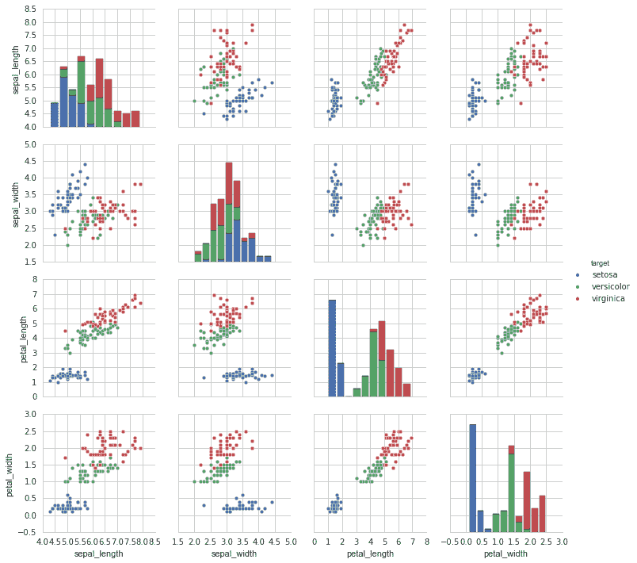

# 高级数据学习表示

一些有用的表示可以从数据科学过程中得出。 也就是说，表示不是直接从数据中完成，而是通过使用机器学习过程来实现的，机器学习过程向我们介绍了算法的运行方式，并为我们提供了每个预测变量在获得的预测中的作用的更精确概述。 特别地，学习曲线可以提供快速诊断以改善模型。 这可以帮助您确定是需要更多观察还是需要丰富变量。

# 学习曲线

学习曲线是有用的诊断图形，它描述了机器学习算法（您的假设）相对于可用观察量的行为。 这样做的目的是比较使用不同样本内大小的交叉验证（通常为十倍）时训练性能（样本内案例的错误或准确性）如何表现。

就训练错误而言，您应该期望它在开始时会很高，然后再减少。 但是，根据假设的偏差和方差级别，您会注意到不同的行为：

*   高偏差假说倾向于从平均错误性能开始，在暴露于更复杂的数据时迅速降低，然后再保持相同的性能水平，无论您进一步添加多少种情况。
*   低偏的学习者在很多情况下倾向于更好地概括，但是他们近似复杂数据结构的能力有限，因此其性能有限。
*   高方差的假设往往会开始提高错误性能，然后随着您添加更多案例而逐渐降低。 由于它具有记录样本内特性的高容量，因此趋于缓慢降低。

至于交叉验证，我们可以注意到两种行为：

*   高偏见的假设往往始于低绩效，但增长很快，直到达到与训练几乎相同的绩效。 然后，它停止增长。
*   高方差的假设往往始于非常低的性能。 然后，随着更多案例的推广，它稳步但缓慢地改善了。 它几乎不读取样本中的演奏，并且它们之间始终存在差距。

能够估计您的机器学习解决方案表现为高偏差还是高方差假设，将立即帮助您决定如何改善数据科学项目。 尽管有了`learning_curve`类，但 Scikit-learn 使得计算可视化图形所需的所有统计信息更为简单，尽管正确地可视化它们还需要一些进一步的计算和命令：

```py
In: import numpy as np
    from sklearn.learning_curve import learning_curve, validation_curve
    from sklearn.datasets import load_digits
    from sklearn.linear_model import SGDClassifier

    digits = load_digits()
    X, y = digits.data, digits.target
    hypothesis = SGDClassifier(loss='log', shuffle=True, 
                               n_iter=5, penalty='l2', 
                               alpha=0.0001, random_state=3)
    train_size, train_scores, test_scores = learning_curve(hypothesis, X, 
                              y, train_sizes=np.linspace(0.1,1.0,5), cv=10, 
                               scoring='accuracy',                  
                               exploit_incremental_learning=False,
                               n_jobs=-1)
    mean_train  = np.mean(train_scores,axis=1)
    upper_train = np.clip(mean_train + np.std(train_scores,axis=1),0,1)
    lower_train = np.clip(mean_train - np.std(train_scores,axis=1),0,1)
    mean_test = np.mean(test_scores,axis=1)
    upper_test = np.clip(mean_test + np.std(test_scores,axis=1),0,1)
    lower_test = np.clip(mean_test - np.std(test_scores,axis=1),0,1)
    plt.plot(train_size,mean_train,'ro-', label='Training')
    plt.fill_between(train_size, upper_train, 
                     lower_train, alpha=0.1, color='r')
    plt.plot(train_size,mean_test,'bo-', label='Cross-validation')
    plt.fill_between(train_size, upper_test, lower_test, 
                     alpha=0.1, color='b')
    plt.grid()
    plt.xlabel('sample size') # adds label to x axis
    plt.ylabel('accuracy') # adds label to y axis
    plt.legend(loc='lower right', numpoints= 1)
    plt.show() 
```

根据不同的样本量，您很快就会获得学习曲线图：

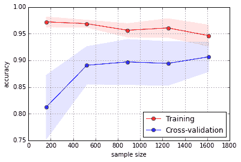

`learning_curve`类需要以下内容作为输入：

*   一系列存储在列表中的训练量
*   指示要使用的折数以及错误度量
*   您要测试的机器学习算法（参数估计器）
*   预测变量（参数`X`）和目标结果（参数`y`）

结果，该类将产生三个数组。 第一个包含有效训练量，第二个显示在每次交叉验证迭代中获得的训练分数，最后一个显示交叉验证分数。

通过对训练和交叉验证应用均值和标准差，可以在曲线图中显示曲线趋势及其变化。 您还可以提供有关录制的演奏稳定性的信息。

# 验证曲线

由于学习曲线适用于不同的样本大小，因此验证曲线会根据超参数可以采用的值来估计训练和交叉验证性能。 与在学习曲线中一样，可以应用类似的注意事项，尽管这种特殊的可视化将使您对参数的优化行为有更深入的了解，并在视觉上向您建议应将搜索重点放在超参数空间的一部分：

```py
In: from sklearn.learning_curve import validation_curve
    testing_range = np.logspace(-5,2,8)
    hypothesis = SGDClassifier(loss='log', shuffle=True, 
                               n_iter=5, penalty='l2', 
                               alpha=0.0001, random_state=3)
    train_scores, test_scores = validation_curve(hypothesis, X, y, 
                                 param_name='alpha', 
                                 param_range=testing_range, 
                                 cv=10, scoring='accuracy', n_jobs=-1)
    mean_train  = np.mean(train_scores,axis=1)
    upper_train = np.clip(mean_train + np.std(train_scores,axis=1),0,1)
    lower_train = np.clip(mean_train - np.std(train_scores,axis=1),0,1)
    mean_test = np.mean(test_scores,axis=1)
    upper_test = np.clip(mean_test + np.std(test_scores,axis=1),0,1)
    lower_test = np.clip(mean_test - np.std(test_scores,axis=1),0,1)
    plt.semilogx(testing_range,mean_train,'ro-', label='Training')
    plt.fill_between(testing_range, upper_train, lower_train, 
                     alpha=0.1, color='r')
    plt.fill_between(testing_range, upper_train, lower_train, 
                     alpha=0.1, color='r')
    plt.semilogx(testing_range,mean_test,'bo-', label='Cross-validation')
    plt.fill_between(testing_range, upper_test, lower_test, 
                     alpha=0.1, color='b')
    plt.grid()
    plt.xlabel('alpha parameter') # adds label to x axis
    plt.ylabel('accuracy') # adds label to y axis
    plt.ylim(0.8,1.0)
    plt.legend(loc='lower left', numpoints= 1)
    plt.show() 
```

经过一些计算，您将获得参数验证曲线的表示形式：

 

`validation_curve`类的语法类似于先前看到的`learning_curve`的语法，但对于`param_name`和`param_range`参数，应分别为它们提供超参数和必须测试的范围。 至于结果，训练和测试结果以数组形式返回。

# 随机森林功能的重要性

正如在第 3 章，“数据管道”的结论中所讨论的那样，选择正确的变量可以通过减少噪声，估计方差和过多计算负担来改善学习过程 。 集成方法（例如，随机森林）可以为您提供与数据集中其他变量一起使用时变量所扮演角色的不同视图。

在这里，我们向您展示如何提取随机森林和极端树模型的重要性。 重要性的计算方式最初由 Breiman，Friedman 等人在《分类和回归树》一书中描述。 1984 年。这是一个真正的经典，为分类树奠定了坚实的基础。 在本书中，重要性用*基尼重要性*或*平均减少不纯度*来描述，这是由于在整个集成树上平均一个特定变量而导致的节点杂质的总减少量。 换句话说，平均减少不纯度是在该变量上分割的节点的总错误减少乘以路由到每个节点的样本数。 值得注意的是，根据这种重要性计算方法，减少错误不仅取决于误差度量-基尼或熵用于分类，而 MSE 用于回归，而且树顶的拆分也被认为更重要，因为它们涉及处理更多问题。 例子。

在几个步骤中，我们将学习如何获取此类信息并将其投影到清晰的可视化文件中：

```py
In: from sklearn.datasets import load_boston
    boston = load_boston()
    X, y = boston.data, boston.target
    feature_names = np.array([' '.join([str(b), a]) for a,b in 
                              zip(boston.feature_names,range(
                              len(boston.feature_names)))])
    from sklearn.ensemble import RandomForestRegressor
    RF = RandomForestRegressor(n_estimators=100, 
                               random_state=101).fit(X, y)
    importance = np.mean([tree.feature_importances_ for tree in 
                          RF.estimators_],axis=0)
    std = np.std([tree.feature_importances_ for tree in 
                  RF.estimators_],axis=0)
    indices = np.argsort(importance)
    range_ = range(len(importance))
    plt.figure()
    plt.title("Random Forest importance")
    plt.barh(range_,importance[indices],
             color="r", xerr=std[indices], alpha=0.4, align="center")
    plt.yticks(range(len(importance)), feature_names[indices])
    plt.ylim([-1, len(importance)])
    plt.xlim([0.0, 0.65])
    plt.show() 

```

该代码将产生以下图表，突出显示该模型的重要功能：

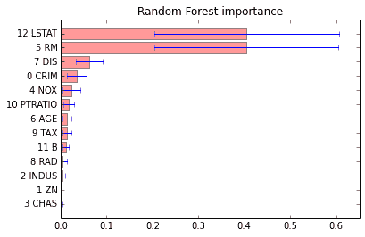

对于每个估计量（在我们的示例中，我们有 100 个模型），该算法估计得分以对每个变量的重要性进行排名。 随机森林模型由决策树组成，决策树可以由许多分支组成，因为该算法试图获得非常小的终叶。 如果在随意排列其原始值之后，排列后的模型的结果预测与原始模型的预测相比在准确性方面有很大差异，则认为该变量之一很重要。

重要性向量在估计器的数量上平均，并且估计的标准偏差通过列表理解（重要性和`std`的赋值）进行计算。 现在，根据重要性得分（向量索引）进行排序，结果将投影到带有标准偏差提供的误差线的条形图上。

在我们的 LSTAT 分析中，该区域中处于较低地位的人口百分比和 RM（即每个住宅的平均房间数）被指出是我们随机森林模型中最具决定性的变量。

# 梯度助推树部分依赖图

对功能重要性的估计是一条信息，可以帮助您根据最佳选择来确定要使用的功能。 有时，您可能需要更好地理解为什么变量对预测特定结果很重要。 通过控制分析中涉及的所有其他变量的效果，梯度增强树为您提供了变量与预测结果之间关系的清晰观点。 与使用非常有效的 EDA 可能获得的信息相比，此类信息可以为您提供更多因果关系动态的见解：

```py
In: from sklearn.ensemble.partial_dependence import 
    plot_partial_dependence
    from sklearn.ensemble import GradientBoostingRegressor
    GBM = GradientBoostingRegressor(n_estimators=100, 
                                    random_state=101).fit(X, y)
    features = [5,12,(5,12)]
    fig, axis = plot_partial_dependence(GBM, X, features, 
                                        feature_names=feature_names)   
```

作为输出，您将获得三个图，它们构成了 RM 和 LSTAT 功能的局部图：

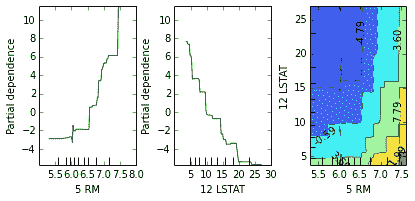

在您提供分析计划后，`plot_partial_dependence`类将自动为您提供可视化效果。 您需要提供要单独绘制的特征的索引列表，以及要在热图上绘制的那些索引的元组（特征是轴，并且热值对应于结果） 。

在前面的示例中，平均房间数和较低身份人口的百分比均已表示，因此显示了预期的行为。 有趣的是，热图解释了它们如何共同为结果的价值做出贡献，它揭示了它们没有以任何特定的方式相互作用（这是一次爬坡）。 但是，还显示出 LSTAT 大于 5 时，它是所得房屋价值的有力分隔符。

# 使用机器学习即服务创建预测服务器

很多时候，在您作为数据科学家的职业生涯中，您会发现自己需要与当前正在研究的代码分离的预测变量。 例如，如下：

*   您正在为手机开发应用程序，并且想要节省内存
*   您正在使用非 Python 编程语言（Java，Scala，C，C++ 等）进行编码，并且需要调用在 Python 中开发的预测变量
*   您正在处理大数据，并且模型在存储数据的同一远程位置进行了训练

在所有这些情况下，最好通过 HTTP 进行服务即预测的服务，或者一般来说，将任何**机器学习即服务**（**ML-AAS**）。

Bottle 是一个 Python 网络框架，是 HTTP 上微型应用程序的起点。 这是一个非常简单的 Python 库，提供了创建 Web 应用程序所需的基本对象和功能。 而且，它可以与 Python 中可用的所有其他库配对。 在进入即服务预测之前，让我们看看如何使用 Bottle 构建基本的`Hello World`程序。 请注意，以下清单作为脚本用于 Python REPL，而不用于 Jupyter 笔记本：

```py
# File: bottle1.py from bottle import route, run, template port = 9099 @route('/personal/<name>') def homepage(name):
 return template('Hi <b>{{name}}</b>!', name=name)  print("Try going to http://localhost:{}/personal/Tom".format(port)) print("Try going to http://localhost:{}/personal/Carl".format(port))  run(host='localhost', port=port)
```

在执行代码之前，让我们逐行分析代码：

1.  我们开始从 Bottle 模块中导入所需的功能和类。
2.  然后，我们指定 HTTP 服务器将侦听的端口。
3.  在示例中，我们选择端口`9099`； 您可以随意将其更改为另一个，但是首先请检查是否有其他服务正在使用它（请记住 HTTP 位于 TCP 之上）。
4.  下一步是 API 端点的定义。 当对指定为参数的路径执行 HTTP 调用时，`route`装饰器将应用其后定义的功能。 请注意，在路径中，它表示`name`，这是即将到来的函数的参数。 这意味着`name`是呼叫的参数； 您可以在 HTTP 调用中选择所需的任何字符串，然后您的选择将作为参数名称传递给函数。
5.  然后，在功能主页中，返回了带有 HTML 代码的模板。 以一种更简单的方式，将其视为`template`函数，该函数将创建您将从浏览器中看到的页面。

**模板**，是一个示例，它只是一个普通的HTML页面，但它可能更复杂（它实际上可以是一个模板页面，其中需要填充一些空白）。 模板的完整描述超出了本节的范围，因为我们仅将框架用于简单的纯输出。 如果您需要其他信息，请浏览Bottle帮助页面。

6.  最后，在`print`功能之后，有核心`run`功能。 这是一个阻止功能，它将在作为参数提供的主机和端口上设置 Web 服务器。 当您运行清单中的代码时，一旦执行了该功能，就可以打开浏览器并将其指向`http://localhost:9099/personal/Carl`，您将找到以下文本：`Hi Carl!`

当然，将 HTTP 调用中的名称从`Carl`更改为`Tom`或任何其他名称将导致不同的页面，其中包含调用中指定的名称。

请注意，在此虚拟示例中，我们仅定义了`/personal/<name>`路由。 除非代码中定义，否则任何其他调用都将导致`Error 404`。

要关闭它，我们需要在命令行中按`Ctrl + C`（记住`run`功能正在阻止）。

现在让我们创建一个更加面向数据科学的服务； 我们将创建一个 HTML 页面，该页面的表单要求隔垫的长度和宽度以及花瓣的长度和宽度，以对虹膜样本进行分类。 在此示例中，我们将使用虹膜数据集来训练 Scikit-learn 分类器。 然后，对于每个预测，我们只需在分类器上调用`predict`函数，将预测发送回去：

```py
# File: bottle2.py  from sklearn.datasets import load_iris from sklearn.linear_model import LogisticRegression from bottle import run, request, get, post import numpy as np  port = 9099  @get('/predict') def predict():
 return ''' <form action="/prediction" method="post"> Sepal length [cm]: <input name="sl" type="text" /><br/> Sepal width [cm]: <input name="sw" type="text" /><br/> Petal length [cm]: <input name="pl" type="text" /><br/> Petal width [cm]: <input name="pw" type="text" /><br/> <input value="Predict" type="submit" /> </form> '''  @post('/prediction') def do_prediction():
 try: sample = [float(request.POST.get('sl')), float(request.POST.get('sw')), float(request.POST.get('pl')), float(request.POST.get('pw'))] pred = classifier.predict(np.matrix(sample))[0] return "<p>The predictor says it's a <b>{}</b></p>"\
               .format(iris['target_names'][pred]) except: return "<p>Error, values should be all numbers</p>"  iris = load_iris() classifier = LogisticRegression() classifier.fit(iris.data, iris.target) 
 print("Try going to http://localhost:{}/predict".format(port)) run(host='localhost', port=port)  # Try insert the following values: # [ 5.1, 3.5, 1.4, 0.2] -> setosa # [ 7.0  3.2, 4.7, 1.4] -> versicolor # [ 6.3, 3.3, 6.0, 2.5] -> virginica
```

导入后，在这里我们使用`get`装饰器，指定仅对 HTTP GET 调用有效的路由。 装饰器以及后面的函数没有参数，因为所有功能都应插入`predict`函数中定义的 HTML 表单中。 表单提交后，将使用 HTTP `POST`传递到`/prediction`页面。

现在，我们需要为此调用创建一个路由，这就是我们在`do_prediction`函数中所做的。 它的装饰器是`/prediction`页面上的`post`（即与`get`相反;它仅定义`POST`路由）。 数据被解析并转换为`double`（默认参数为字符串），然后将特征向量馈送到`classifier`全局变量中以获得预测。 这是使用简单模板返回的。 对象请求包含传递给服务的所有参数，包括我们 *POST* 到路由的整个变量。 最后，似乎我们只需要定义全局变量分类器-即在虹膜数据集上训练的分类器-最后，我们可以调用`run`函数。

对于此虚拟示例，我们将逻辑回归器用作分类器，并在完整的鸢尾花数据集上进行训练，而所有参数均保留为默认值。 在实际情况下，这里您将尽可能优化分类器。

运行此代码后，如果一切正常，则可以将浏览器指向`http://localhost:9099/predict`，您会看到以下表格：


单击**预测**按钮后插入值（`5.1`，`3.5`，`1.4`和`0.2`），应将您重定向到`http://localhost:9099/prediction`，其中应显示`The predictor says it's a setosa`字符串。 另外，请注意，如果您在表单中插入无效的条目（例如，将其保留为空或插入字符串而不是数字），则会显示一个 HTML 页面，指出存在错误。

我们已经完成了本节的一半，并且已经看到了用 Bottle 创建 HTTP 端点是多么容易和快捷。 现在，让我们尝试创建一个可以在任何程序中调用的预测即服务。 我们将以`get`调用的形式提交特征向量，并且返回的预测将为 JSON 格式。 这是此解决方案的代码：

```py
# File: bottle3.py  from sklearn.datasets import load_iris from sklearn.linear_model import LogisticRegression from bottle import run, request, get, response import numpy as np import json  port = 9099  @get('/prediction') def do_prediction():
 pred = {} try: sample = [float(request.GET.get('sl')), float(request.GET.get('sw')), float(request.GET.get('pl')), float(request.GET.get('pw'))] pred['predicted_label'] =             iris['target_names'] [classifier.predict(np.matrix(sample))[0]]
 pred['status'] = "OK" except: pred['status'] = "ERROR" response.content_type = 'application/json' return json.dumps(pred)  iris = load_iris() classifier = LogisticRegression() classifier.fit(iris.data, iris.target)  print("Try going to http://localhost:{}/prediction\
       sl=5.1&sw=3.5&pl=1.4&pw=0.2".format(port)) print("Try going to http://localhost:{}/prediction\
       sl=A&sw=B&pl=C&pw=D".format(port)) run(host='localhost', port=port)
```

该解决方案非常简单明了。 不过，让我们逐步分析它。 功能的入口点由`/prediction`路径上的`get`装饰器定义。 在此，我们将访问`GET`值以提取预测（请注意，如果您的分类器需要许多功能，则最好在此处使用`POST`调用）。 与前面的示例完全相同，生成了预测； 最后，将该值与`status`键的`OK`值一起插入 Python 字典中。 如果此函数引发异常，将不会进行预测，但`status`键中将出现`ERROR`字符串。 然后，将输出应用程序格式设置为 JSON，然后将 Python 字典序列化为 JSON 字符串。

当它运行时，我们可以访问 URL `localhost:9099/prediction`，后跟特征值，然后我们将预测作为 JSON 取回。 请注意，由于它是 JSON，因此不需要浏览器来解释返回的 HTTP 响应。 因此，我们可以从不同的应用程序（`wget`，浏览器或`curl`）或任何编程语言（包括 Python 本身）调用终结点。 要使其正常运行，请启动它并将您的浏览器指向（或以任何方式请求 URL）`http://localhost:9099/prediction?sl=5.1&sw=3.5&pl=1.4&pw=0.2`。 您将取回有效的 JSON：`{"predicted_label": "setosa", "status": "OK"}`。 另外，如果参数解析出错，您将得到以下 JSON：`{"status": "ERROR"}`。 这是您的第一个 ML-AAS！

尽管简单快捷，但是 Bottle 还有许多其他功能需要探索。 但是，它不如其他框架完整。 如果您的应用程序需要一些非凡的功能，请查看 Flask 或 Django 模块。

# 概括

本章通过提供数据，机器学习过程和结果的基本和高级图形表示的示例，概述了基本数据科学。 我们探索了来自 Matplotlib 的`pylab`模块，该模块可让您最轻松，最快地访问该软件包的图形功能。 我们将Pandas用于 EDA，并测试了 Scikit-learn 提供的图形实用程序。 所有示例都像构建块一样，并且都易于定制，以便为您提供快速的可视化模板。

在下一章中，将向您介绍**图**，它们是与预测变量/目标平坦矩阵的有趣偏差。 现在，它们已成为数据科学中的热门话题。 期望深入研究非常复杂和复杂的网络。