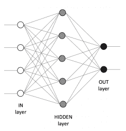
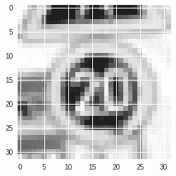
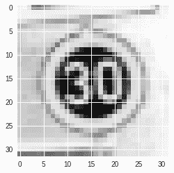
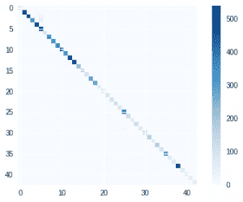
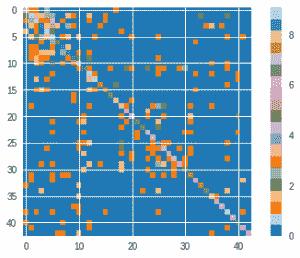
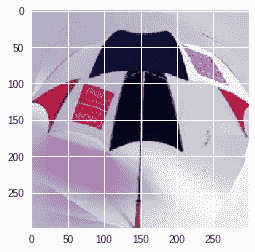

# 七、超越基础的深度学习

在本章中，我们将介绍深度模型，并且将显示三个如何构建深度模型的示例。 更具体地说，在本章中，您将学习以下内容：

*   深度学习的基础
*   如何优化深度网络
*   速度/复杂性/准确率问题
*   如何将 CNN 用于图像分类
*   如何将预训练的网络用于分类和迁移学习
*   如何将 LSTM 用于序列操作

我们将使用 [Keras 包](https://keras.io/)，这是用于深度学习的高级 API，它将使用于深度学习的神经网络更加容易和易于理解，因为其特点是类似于乐高的方法（这里的积木是神经网络的组成元素）。

# 接近深度学习

**深度学习**是使用神经网络的经典机器学习方法的扩展：我们可以堆叠数百层，而不是构建几层网络（所谓的*浅层网络*） 创建一个精巧但功能更强大的学习器。 深度学习是当今最流行的**人工智能**（**AI**）方法之一，因为它非常有效并且有助于解决模式识别中的许多问题，例如对象或序列识别。 使用标准的机器学习工具似乎牢不可破。

神经网络的思想来自人类的中枢神经系统，其中将能够处理简单信息的多个节点（或*神经元*）连接在一起以创建能够处理复杂信息的网络。 实际上，神经网络之所以这么称呼是因为它们可以自动和自适应地学习模型的权重，并且在足够复杂的网络架构下，它们能够近似任何非线性函数。 在深度学习中，节点通常称为单元或神经元。

让我们看看如何构建深度架构及其组成部分。 我们将从一个由三层组成的分类问题的小型深度架构开始，如下图所示：



该网络具有以下特征：

*   它分为三层。 左边的一层称为输入层，右边的一层称为输出层，中间的一层称为隐藏层。 通常，在神经网络中，总是有一个输入层和一个输出层，以及零个或多个隐藏层（当隐藏层为零时，整个神经架构将有效地转化为逻辑回归系统）。
*   输入层由五个单元组成，这意味着每个观察向量由五个数值特征组成（即观察矩阵有五列）。 请注意，特征必须是数字并且在值的有限范围内（为实现更好的数值收敛，理想情况下范围为 0 到 +1，但 -1 到 +1 也可以）。 因此，必须对分类特征进行预处理才能使其成为数值。
*   输出层由三个单元组成，这意味着我们要在三个输出类之间进行区分（即执行三类分类）。 在发生回归问题的情况下，这一层应该只有一个单元。
*   隐藏层由八个单元组成。 请注意，对于在深层结构中应显示多少个隐藏层以及每个应具有多少个单元没有任何规则。 这些参数留给科学家使用，通常，它们需要进行一些优化和微调才能发挥最佳表现。
*   每个连接都有一个与之关联的权重。 在学习算法中对此进行了优化。

输入层的每个单元都连接到下一层的所有单元。 在同一层中的单元之间既没有连接，在彼此之间的距离大于 1 的两个层中的单元之间也没有连接。

在该示例中，信息流从输入到输出（最终通过隐藏层）传递； 在文献中，此网络称为*前馈神经网络*。

它如何产生最终预测？ 让我们逐步了解它的工作方式：

1.  从隐藏层的顶部单元开始，它在第一层的输出向量（即输入观察向量）与第一层和第一层的第一单元之间的连接权重向量之间执行点积。 隐藏层。
2.  然后使用该单元的激活函数转换该值。
3.  对隐藏层中的所有单元重复此操作。
4.  最后，我们可以以相同的方式计算隐藏层和输出层之间的前馈传播值，从而产生网络的输出。

这个过程看起来非常简单，它由多个令人尴尬的并行任务组成。 解释的最后一个缺失点是激活函数：它是什么，为什么需要它？ 激活函数有助于使二元决策更加可分离（它使决策边界成为非线性，从而有助于更好地分离示例），并且它是每个单元的属性（或属性）； 理想情况下，每个单元应该具有不同的激活函数，尽管通常将它们按层分组。

典型的激活函数是 Sigmoid，双曲正切和`softmax`（用于分类问题）函数，尽管目前最流行的函数是**整流线性单元**（或 **ReLU**），其输出是 0 和输入之间的最大值（其中输入是上一层输出和连接权重之间的点积）。

激活函数（单元数量和隐藏层数量）是深层网络的参数，科学家应该对其进行优化以获得更好的表现。

训练具有多个层次的神经网络是一项艰巨的操作，因为要调整的参数非常多（有时数百万）：权重。 向连接分配权重的最常见方法是使用类似的方法来梯度下降，这种方法称为反向传播，因为它会将误差从输出层传播回输入层，并根据误差的梯度成比例地更新每个权重。 指向网络。 最初，权重是随机分配的，但是经过几步，它们应该收敛到最佳值。

这是对深度学习和神经网络的简短介绍; 如果您发现该主题很有趣，并且希望对其进行深入研究，我们建议您从 Packt 观看以下视频系列，在其中可以找到更好的解释和一些不错的技巧来掌握学习过程：

*   [使用 Python 进行深度学习视频](https://www.packtpub.com/big-data-and-business-intelligence/deep-learning-python-video)
*   [使用 TensorFlow 进行深度学习视频](https://www.packtpub.com/big-data-and-business-intelligence/deep-learning-tensorflow-video)

现在让我们看一些实用的东西：如何用神经网络解决分类问题。 在此示例中，我们将使用 Keras。 第一个是用于低级原语的 Python 库，通常用于深度学习，并能够利用最新的 GPU 和数值加速来有效处理多维数组。 Keras 是用于神经网络的高级，快速且模块化的 Python 库，能够在不同的数值计算框架之上运行，例如 TensorFlow，Microsoft Cognitive Tool（以前称为 CNTK）或 Theano。

# 使用 CNN 的图像分类

现在让我们将深度神经网络应用于图像分类问题。 在这里，我们将尝试根据其图像预测交通标志。 对于此任务，我们将使用 **CNN**（**卷积神经网络**），该技术能够利用图像中附近像素之间的空间相关性，这是目前在解决此类问题时的深度学习水平。

[数据集可在此处找到](http://benchmark.ini.rub.de/?section=gtsrb&subsection=dataset)。 我们要感谢团队免费发布了数据集，并参考了涉及该数据集的出版物：

```py
J. Stallkamp, M. Schlipsing, J. Salmen, and C. Igel. The German Traffic Sign Recognition Benchmark: A multi-class classification competition. In Proceedings of the IEEE International Joint Conference on Neural Networks, pages 1453–1460. 2011.
```

首先，下载数据集，然后将其解压缩。 数据集的文件名为`GTSRB_Final_Training_Images.zip`，解压缩后会发现一个名为`GTSRB`的新目录，其中包含与 Jupyter 笔记本相同目录中的所有图像。

下一步是导入 Keras 并检查后端是否配置正确。 在本章中，我们将使用 TensorFlow 后端，并且所有代码都在该后端上进行了测试。

后端选择是可逆的。 如果要从 TensorFlow 切换到另一个后端，[请遵循此处的指南](https://keras.io/backend)。 无论使用哪种后端，使用 Keras 编写的脚本都可以成功运行（尽管在计算时间和最小化错误方面的表现可能有所不同）。

要检查您的后端，请运行以下代码，并检查操作是否成功执行，并且结果输出与此处报告的结果匹配。

```py
In: import keras

Out: Using TensorFlow backend.
```

现在是时候开始处理了，因此我们必须为任务定义一些静态参数。 其中有两种，主要是：我们要识别的不同信号的数量（即类别的数量）和图片的大小。 类别数量是 43; 也就是说，我们可以识别 43 种不同的交通标志。

第二个参数，图像大小，很重要，因为输入图像可以具有不同的大小和形状。 我们需要将它们调整为标准尺寸，以便对它们运行深层网络。 我们选择`32x32`像素作为标准像素：它足够小以识别信号，并且同时不需要太多内存（也就是说，每个灰度图像仅使用 1,024 字节或 1 KB）。 增加大小意味着增加保存数据集所需的内存，再加上深网的输入层和计算所需的时间。 在文献中，对于只有一个项目的图像，`32x32`是相当标准的选择。 因此，就我们而言，我们有充分的理由来决定该大小。

```py
In: N_CLASSES = 43
 RESIZED_IMAGE = (32, 32)
```

在这一点上，我们必须读取图像并调整其大小，以创建观察矩阵和标签数组。 为此，我们执行以下步骤：

1.  导入处理所需的模块。 最重要的是 Scikit-learn（即 Sklearn），其中包含处理图像的功能。
2.  我们一个接一个地读取图像。 标签包含在路径中。 例如，图像`GTSRB/Final_Training/Images/00000/00003_00024.ppm`的标签为`00000`，即`0`； 并且图像`GTSRB/Final_Training/Images/00025/00038_00005.ppm`带有标签`00025`，即`25`。 标签存储为标记编码的数组，该数组是一个 43 单元长的数组，只有一个值为`1`的数组（所有其他均为`0`）。
3.  图像以 **PPM**（**可移植像素图**）格式存储，这是一种将像素存储在图像中的无损方式。 Scikit 图像或只是 [skimage](https://scikit-image.org/) 可以使用函数`imread`读取该格式。 如果您的系统上尚未安装 Scikit 映像，只需在 shell 中键入以下内容：`conda install scikit-image`或`pip install -U scikit-image`。 返回的对象是 3D NumPy 数组。
4.  然后将包含图像像素表示的 3D NumPy 数组（具有三个通道-红色，蓝色和绿色）转换为灰度。 在这里，我们首先转换为 LAB 颜色空间（请参见[这个页面](https://hidefcolor.com/blog/color-management/what-is-lab-color-space)-该颜色空间比线性颜色更具感知性） 其他，这意味着颜色值的相同变化量应产生相同视觉重要性的影响），然后保留第一个通道（包含亮度）。 再次，此操作很容易使用 Skimage 完成。 结果，我们有一个包含图像像素的一维 NumPy 数组。
5.  最终，再次使用 Skimage 函数将图像调整为`32x32`像素格式。

6.  最后，将所有图像压缩到一个 4 维矩阵中：第一维用于索引数据集中的图像； 第二个和第三个分别代表图像的高度和宽度； 最后一个维度是渠道。 因此，拥有 39,208 张图像，并且所有`32x32`像素均为灰度，因此观察矩阵的形状为`39,208, 32, 32, 1`。
7.  标签被压缩成二维矩阵。 第一维是图像的索引，第二维是类。 由于具有相同数量的图像和 43 种可能的类别，因此将对矩阵进行整形`39,208, 43`。

下面显示了翻译成代码的所有七个步骤：

```py
In: import matplotlib.pyplot as plt
 import glob
 from skimage.color import rgb2lab
 from skimage.transform import resize
 from collections import namedtuple
 import numpy as np
 np.random.seed(101)
 %matplotlib inline

 Dataset = namedtuple('Dataset', ['X', 'y'])

 def to_tf_format(imgs):
 return np.stack([img[:, :, np.newaxis] for img in imgs], 
 axis=0).astype(np.float32)

 def read_dataset_ppm(rootpath, n_labels, resize_to):
 images = []
 labels = []
 for c in range(n_labels):
 full_path = rootpath + '/' + format(c, '05d') + '/'
 for img_name in glob.glob(full_path + "*.ppm"):
 img = plt.imread(img_name).astype(np.float32)
 img = rgb2lab(img / 255.0)[:,:,0]
 if resize_to:
 img = resize(img, resize_to, mode='reflect', 
 anti_aliasing=True)
 label = np.zeros((n_labels, ), dtype=np.float32)
 label[c] = 1.0
 images.append(img.astype(np.float32))
 labels.append(label)

 return Dataset(X = to_tf_format(images).astype(np.float32),
 y = np.matrix(labels).astype(np.float32))

 dataset = read_dataset_ppm('GTSRB/Final_Training/Images', N_CLASSES, 
 RESIZED_IMAGE)
 print(dataset.X.shape)
 print(dataset.y.shape)

Out: (39209, 32, 32, 1) 
     (39209, 43)
```

数据集由近 40,000 张图像组成； 在更改颜色和调整大小之后，让我们看看它们的第一个样子：

```py
In: plt.imshow(dataset.X[0, :, :, :].reshape(RESIZED_IMAGE))
 print("Label:", dataset.y[0, :])

Out: Label: [[1\. 0\. 0\. 0\. 0\. 0\. 0\. 0\. 0\. 0\. 0\. 0\. 0\. 0\. 0\. 0\. 0\. 0\. 0\. 0\. 
              0\. 0\. 0\. 0\. 0\. 0\. 0\. 0\. 0\. 0\. 0\. 0\. 0\. 0\. 0\. 0\. 0\. 0\. 0\. 0\. 
              0\. 0\. 0.]]
```

以下是绘制的样本图像：



即使图像的清晰度很低（`32x32`像素），我们也可以立即识别出代表哪个符号。 到目前为止，整形操作似乎使图像甚至对人类都无法理解。 再次注意，标签是一个 43 维向量。 由于此图像属于第一类（即类`00000`），因此仅标签的第一元素不为`null`。

不同类别的另一个元素如下所示。 这是数据集中的图像编号 1,000，其类别为`2`（实际上，这是一个不同的符号）：



现在让我们将数据集分为训练和测试。 我们使用 Scikit-learn 随机分离并随机排列图像。 在此单元格中，我们选择数据集的 25% 作为测试集； 也就是说，几乎有 10,000 张图像，剩下的 29K+ 张图像用于训练深层网络：

```py
In: from sklearn.model_selection import train_test_split
 idx_train, idx_test = train_test_split(range(dataset.X.shape[0]), 
 test_size=0.25, 
                                           random_state=101)
 X_train = dataset.X[idx_train, :, :, :]
 X_test = dataset.X[idx_test, :, :, :]
 y_train = dataset.y[idx_train, :]
 y_test = dataset.y[idx_test, :]

 print(X_train.shape)
 print(y_train.shape)
 print(X_test.shape)
 print(y_test.shape)

Out: (29406, 32, 32, 1) 
     (29406, 43)
     (9803, 32, 32, 1)
     (9803, 43)
```

这是创建卷积深度网络的时刻。 我们从一个简单易懂的神经网络开始。 然后，我们将转到更复杂但更准确的地方。

用 Keras 创建深层网络非常容易：您必须依次定义所有层。 Keras 对象需要按名为`Sequential`的序列定义层。 在这里，我们将创建一个包含三层的深层网络：

1.  输入层定义为卷积 2D 层​​（实际上是图像和内核之间的卷积运算），包含 32 个`3x3`像素形状的过滤器，并带有 ReLU 类型的激活层。
2.  平滑前一个输出层； 也就是说，将展开方形观察以创建一维数组。
3.  激活`softmax`的密集输出层，由 43 个单元组成，每个单元一个。

然后编译模型，最后将其拟合到训练数据。 在此操作期间，我们选择了以下内容：

*   **优化器**：SGD，最简单的一种
*   **批量大小**：每批 32 张图像
*   **周期数**：10

这是将生成我们刚刚描述的模型的代码：

```py
In: from keras.models import Sequential
 from keras.layers.core import Dense, Flatten
 from keras.layers.convolutional import Conv2D
 from keras.optimizers import SGD
 from keras import backend as K
 K.set_image_data_format('channels_last')

 def cnn_model_1():
 model = Sequential()
 model.add(Conv2D(32, (3, 3), 
 padding='same',
 input_shape=(RESIZED_IMAGE[0], RESIZED_IMAGE[1], 1),
 activation='relu'))
 model.add(Flatten())
 model.add(Dense(N_CLASSES, activation='softmax'))
 return model 
    cnn = cnn_model_1()
 cnn.compile(loss='categorical_crossentropy',
 optimizer=SGD(lr=0.001, decay=1e-6),
 metrics=['accuracy'])
 cnn.fit(X_train, y_train,
 batch_size=32,
 epochs=10,
 validation_data=(X_test, y_test))

Out: Train on 29406 samples, validate on 9803 samples
 Epoch 1/10
 29406/29406 [==============================] - 11s 368us/step - 
 loss: 2.7496 - acc: 0.5947 - val_loss: 0.6643 - val_acc: 0.8533 
 Epoch 2/10
 29406/29406 [==============================] - 10s 343us/step - 
 loss: 0.4838 - acc: 0.8937 - val_loss: 0.4456 - val_acc: 0.9001
 [...]
 Epoch 9/10
 29406/29406 [==============================] - 10s 337us/step - 
 loss: 0.0739 - acc: 0.9876 - val_loss: 0.2306 - val_acc: 0.9553
 Epoch 10/10
 29406/29406 [==============================] - 10s 343us/step - 
 loss: 0.0617 - acc: 0.9897 - val_loss: 0.2208 - val_acc: 0.9574
```

训练集的最终准确率接近 99%，而测试集则接近 96%。 我们有点过拟合，但让我们在测试集中查看该模型的混淆矩阵和分类报告。 我们还将打印混淆矩阵的`log2`，以更好地识别错误分类。

为此，我们首先需要预测标签，然后应用`argmax`运算符选择最可能的类别：

```py
In: from sklearn.metrics import classification_report, confusion_matrix

 def test_and_plot(model, X, y):
 y_pred = cnn.predict(X)
 y_pred_softmax = np.argmax(y_pred, axis=1).astype(np.int32)
 y_test_softmax = np.argmax(y, axis=1).astype(np.int32).A1
 print(classification_report(y_test_softmax, y_pred_softmax))
 cm = confusion_matrix(y_test_softmax, y_pred_softmax)
 plt.imshow(cm, interpolation='nearest', cmap=plt.cm.Blues)
 plt.colorbar()
 plt.tight_layout()
 plt.show()
         # And the log2 version, to emphasize the misclassifications
 plt.imshow(np.log2(cm + 1), interpolation='nearest', 
 cmap=plt.get_cmap("tab20"))
 plt.colorbar()
 plt.tight_layout()
 plt.show()

test_and_plot(cnn, X_test, y_test)

Out:
 precision    recall  f1-score   support
 0       0.87      0.90      0.88        67
 1       0.97      0.94      0.95       539
 2       0.93      0.94      0.94       558
 [........]
 40       0.93      0.96      0.95        85
 41       0.92      0.94      0.93        47
 42       1.00      0.91      0.95        53
     avg / total       0.96      0.96      0.96      9803
```

以下是诊断图，可为您提供有关模型表现的证据：



这是混淆矩阵的`log2`版本：



分类似乎已经很好了。 我们可以做得更好，避免过拟合吗？ 是的，这是我们可以使用的：

*   **丢弃层**：这等效于正则化，并且可以防止过拟合。 基本上，在训练的每个步骤中，都会停用一部分单元，因此该层的输出不会过分依赖其中的一些单元。
*   **批量规范化层**：通过减去批次平均值并将其除以标准差，此 z 标准化层。 这对于更新数据很有用，并且在每个步骤都会放大/衰减信号。
*   **最大池化**：这是一个非线性变换，用于通过对内核下的每个区域应用最大过滤器来对输入进行下采样。 用于选择最大特征，该特征在同一类中的位置可能略有不同。

除此之外，总是有改变深层网络和训练属性的空间。 也就是说，优化程序（及其参数），批量大小和周期数。 在下一个单元格中，这里是具有以下几层的改进的深层网络：

1.  卷积层，具有 32 个`3x3`过滤器和 ReLU 激活
2.  `BatchNormalization`层
3.  另一个卷积层，然后是`BatchNormalization`层
4.  丢弃层，被丢弃的可能性为 0.4
5.  展开层
6.  512 单元密集层，具有 ReLU 激活
7.  `BatchNormalization`层
8.  丢弃层，被丢弃的可能性为 0.5
9.  输出层； 如上例所示，这是一个具有 43 个单元的`softmax`密集层

那将如何在我们的数据集上执行？

```py
In: from keras.layers.core import Dropout
 from keras.layers.pooling import MaxPooling2D
 from keras.optimizers import Adam
 from keras.layers import BatchNormalization

 def cnn_model_2():
 model = Sequential()
 model.add(Conv2D(32, (3, 3), padding='same',
 input_shape=(RESIZED_IMAGE[0], RESIZED_IMAGE[1], 1),
 activation='relu'))
 model.add(BatchNormalization())
 model.add(Conv2D(32, (3, 3), 
 padding='same', 
 input_shape=(RESIZED_IMAGE[0], RESIZED_IMAGE[1], 1),
 activation='relu'))
 model.add(BatchNormalization())
 model.add(MaxPooling2D(pool_size=(2, 2)))
 model.add(Dropout(0.4))
 model.add(Flatten())
 model.add(Dense(512, activation='relu'))
 model.add(BatchNormalization())
 model.add(Dropout(0.5))
 model.add(Dense(N_CLASSES, activation='softmax'))
 return model

 cnn = cnn_model_2()
 cnn.compile(loss='categorical_crossentropy',
 optimizer=Adam(lr=0.001, decay=1e-6), metrics=['accuracy'])
 cnn.fit(X_train, y_train,
 batch_size=32,
 epochs=10,
 validation_data=(X_test, y_test))

Out: Train on 29406 samples, validate on 9803 samples
 Epoch 1/10
 29406/29406 [==============================] - 24s 832us/step - 
 loss: 0.7069 - acc: 0.8145 - val_loss: 0.1611 - val_acc: 0.9584
 Epoch 2/10
 29406/29406 [==============================] - 23s 771us/step - 
 loss: 0.1784 - acc: 0.9484 - val_loss: 0.1065 - val_acc: 0.9714
 [...]
 Epoch 10/10
 29406/29406 [==============================] - 23s 770us/step - 
 loss: 0.0370 - acc: 0.9878 - val_loss: 0.0332 - val_acc: 0.9920

 <keras.callbacks.History at 0x7fd7ac0f17b8>
```

训练集的准确率与测试集的准确率相似，均为约 99%； 也就是说，每 100 张图像中有 99 张用正确的标签分类！ 该网络更长，需要更多的内存和计算能力，但不太容易过拟合并且表现更好。

现在，让我们看一下分类报告和混淆矩阵（完整版本和`log2`版本）：

```py
In: test_and_plot(cnn, X_test, y_test)

Out: 
 precision    recall  f1-score   support
 0       1.00      0.97      0.98        67
 1       1.00      0.98      0.99       539
 2       0.99      1.00      0.99       558
 [..........]
 38       1.00      1.00      1.00       540
 39       1.00      1.00      1.00        60
 40       1.00      1.00      1.00        85
 41       0.98      0.96      0.97        47
 42       1.00      1.00      1.00        53
 avg / total       0.99      0.99      0.99      9803
```

这是结果的视觉表示：


显然，错误分类的数量已大大减少。 现在，让我们尝试通过更改参数来做更好的事情。

# 使用预训练的模型

如您在前面的示例中所见，增加网络的复杂性会增加时间和训练所需的内存。 有时，我们必须接受我们没有足够强大的机器来尝试所有组合的机器。 在那种情况下我们该怎么办？ 基本上，我们可以做两件事：

*   简化网络； 也就是说，通过删除参数和变量
*   使用预训练的网络，该网络已经由功能足够强大的人进行过训练

在这两种情况下，我们都将在次优条件下工作，因为深度网络不会像我们曾经使用的那样强大。 更具体地说，在第一种情况下，网络的精度不是很高，因为我们的参数较少。 在第二种情况下，我们必须应对其他人的决策和训练。 尽管这不是一件容易的事，但预训练的模型也可以根据您的数据集进行微调。 在这种情况下，网络将不会随机初始化参数。 尽管这很有趣，但是此操作不在本书的讨论范围之内。

在本节中，我们将快速展示如何使用预训练的模型，这是一种常见的处理方法。 请记住，预训练模型可以在多种情况下使用：

*   特征增强，以将特征（在这种情况下为预测标签）以及观察向量添加到模型中
*   迁移学习，以将更多特征（来自一层或模型层的系数）以及观察向量添加到模型中
*   预测；也就是说，计算标签

现在让我们看看如何使用预训练的网络来实现我们的目的。

在 Keras 中，[可以从此处获得各种预训练的模型](https://keras.io/applications)。

首先下载一些图像进行测试。 在以下示例中，我们将使用 Caltech 提供的数据集，[该数据集可在此处使用](http://www.vision.caltech.edu/Image_Datasets/Caltech101/)。

我们要感谢数据集的作者，并建议阅读他们的论文：`L. Fei-Fei, R. Fergus and P. Perona. One-Shot learning of object categories. IEEE Trans. Pattern Recognition and Machine Intelligence`。

它包含 101 个类别的几张图像，并以`tar.gz`格式显示。

现在，用一个新的笔记本，导入我们将要使用的模块。 在此示例中，我们将使用 InceptionV3 预训练网络，该网络能够很好地识别图像中的对象。 它是由 Google 开发的，其输出可与人眼媲美。

1.  首先，我们导入建立网络，预处理输入并提取预测所需的特征：

```py
In: from keras.applications.inception_v3 import InceptionV3
    from keras.applications.inception_v3 import preprocess_input
 from keras.applications.inception_v3 import decode_predictions
 from keras.preprocessing import image
 import numpy as np
 import matplotlib.pyplot as plt
 %matplotlib inline

Out: Using TensorFlow backend.
```

2.  现在，让我们加载庞大的网络及其系数：

```py
In: model = InceptionV3(weights='imagenet')
```

很简单，不是吗？

3.  下一步（也是最后一步）是创建一个函数进行预测。 在这种情况下，我们将预测前三个标签：

```py
In: def predict_top_3(model, img_path):
 img = image.load_img(img_path, target_size=(299, 299))
 plt.imshow(img)
 x = image.img_to_array(img)
 x = np.expand_dims(x, axis=0)
 x = preprocess_input(x)
 preds = model.predict(x)
 print('Predicted:', decode_predictions(preds, top=3)[0])
```

基本上，此函数会加载图像并将其调整为`299x299`像素（这是预训练网络 InceptionV3 的默认输入大小），并将图像转换为模型的正确格式。 之后，它会预测图像的所有标签并选择（并打印）前三个。

让我们通过使用预训练的模型并根据概率来询问前三个预测，看看它如何与示例图像配合使用：

```py
In: predict_top_3(model, "101_ObjectCategories/umbrella/image_0001.jpg")
```

我们要预测的图像以及前三个预测的结果输出如下：



```py
Out: Predicted: [('n04507155', 'umbrella', 0.88384396), 
                 ('n04254680', 'soccer_ball', 0.07257448), 
                 ('n03888257', 'parachute', 0.012849103)]
```

我们确认这是一个很好的结果； 第一个标签（得分为 88%）是一把雨伞，其次是足球和降落伞。 现在让我们测试一个肯定更困难的图像，该图像的标签未包含在 InceptionV3 训练集中：

```py
In: predict_top_3(model, "101_ObjectCategories/bonsai/image_0001.jpg")
```

这是图像及其最重要的三个结果：


```py
Out: Predicted: [('n02704792', 'amphibian', 0.20315942), 
                 ('n04389033', 'tank', 0.07383019), 
                 ('n04252077', 'snowmobile', 0.055828683)]
```

正如预期的那样，由于它不在其预定义的类别之内，因此网络无法识别第一个预测标签中的盆景。

实际上，可以通过所谓的**迁移学习技术**来训练预训练的模型甚至识别全新的类别。 这项技术不在本书的讨论范围之内，[但是您可以从 Keras 的博客中的示例中了解它](https://blog.keras.io/building-powerful-image-classification-models-using-very-little-data.html)。

最后，让我们看看如何从中间层提取特征，如下所示：

1.  第一步，让我们验证标签名称：

```py
In: print([l.name for l in model.layers])

Out: ['input_1', 'conv2d_1', 'batch_normalization_1', 
      ..........
 'activation_94', 'mixed10', 'avg_pool', 'predictions']
```

2.  我们可以选择任何一层； 我们将继续进行`softmax`预测之前的预测。 让我们创建一个对象`Model`，其输出为`avg_pool`层：

```py
In: from keras.models import Model
 feat_model = Model(inputs=model.input, 
 outputs=model.get_layer('avg_pool').output) 
 def extract_features(feat_model, img_path):
 img = image.load_img(img_path, target_size=(299, 299))
 x = image.img_to_array(img)
 x = np.expand_dims(x, axis=0)
 x = preprocess_input(x)
 return feat_model.predict(x)
```

3.  最后，要提取图片的特征，让我们用图像调用上一个函数：

```py
In: f = extract_features(feat_model, 
                    "101_ObjectCategories/bonsai/image_0001.jpg")
 print(f.shape)
 print(f)

Out: (1, 2048)
 [[0.12340261 0.0833823 0.7935947 ... 0.50869745 0.34015656]]
```

如您所见，`avg_pool`层包含`2048`单元，该函数的输出正好是 2,048D 数组。 现在，您可以将此数组连接到您选择的任何其他特征数组。

# 处理时间序列

本章的最后一个示例是关于时间序列的。 更具体地说，我们将看到如何处理文本，这是一个可变长度的单词序列。

一些数据科学算法使用“词袋”方法处理文本。 也就是说，他们不在乎单词的位置以及它们在文本中的放置方式，他们只是在乎它们的存在与否（以及频率）。 取而代之的是，专门设计一类特殊的深度网络来对顺序很重要的序列进行操作。

一些示例如下：

*   **根据历史数据预测未来股价**：在这种情况下，输入是数字序列，而输出是数字

*   **预测市场是上升还是下降**：在这种情况下，给定一系列数字，我们要预测一个类别（上升或下降）

*   **将英语文本翻译为法语**：在这种情况下，输入序列将转换为另一个序列

*   **聊天机器人**：在这种情况下，输入和输出都是序列（使用相同语言）

对于此示例，让我们做些简单的事情。 我们将尝试检测电影评论的情感。 在此特定示例中，输入数据是单词序列（和顺序计数！），输出是二进制标签（即情感为*正*或为*负*）。

让我们开始导入数据集。 幸运的是，Keras 已经包含了该数据集，并且已经进行了预索引。 也就是说，每个评论不是由单词组成，而是由字典索引组成。 另外，可以只选择最重要的单词，并使用此代码选择包含最重要的`25000`单词的字典：

```py
In: from keras.datasets import imdb
 ((data_train, y_train), 
     (data_test, y_test)) = imdb.load_data(num_words=25000)
```

让我们看看`data`和`shape`里面是什么：

```py
In: print(data_train.shape)
 print(data_train[0])
 print(len(data_train[0]))

Out: (25000,) 
     [1, 14, 22, 16, 43, 530, .......... 19, 178, 32]
     218
```

首先，有`25000`条评论； 即观察。 其次，每条评论由 1 到 24,999 之间的数字序列组成； 1 表示序列的开始，而最后一个数字表示不在词典中的单词。 请注意，每个评论的大小都不同； 例如，第一个是`218`个字的长度。

现在是时候将所有序列修剪或填充到特定大小。 使用 Keras，这很容易做到，并且为了填充，添加了整数`0`：

```py
In: from keras.preprocessing.sequence import pad_sequences
 X_train = pad_sequences(data_train, maxlen=100) X_test = pad_sequences(data_test, maxlen=100)
```

现在，我们的训练矩阵为矩形。 修剪/填充操作之后的第一个元素变为：

```py
In: print(X_train[0])
 print(X_train[0].shape) Out: [1415, .......... 19, 178, 32]
     (100,)
```

对于此观察，仅保留最后的`100`字。 总体而言，现在，所有观测值均具有`100`维。 现在，让我们创建一个时间深度模型来预测评论情感。

这里提出的模型分为三层：

1.  嵌入层。 原始词典设置为 25,000 个单词，组成嵌入的单元数（即层的输出）为 256。
2.  LSTM 层。 **LSTM** 代表**长短期记忆**，它是最强大的序列深度模型之一。 得益于其深厚的架构，它能够从序列中相距较远的单词中提取信息（因此得名）。 在此示例中，像元数设置为`256`（作为上一层输出尺寸），其中`0.4`的缺失用于正则化。
3.  具有 Sigmoid 活化的密集层。 这就是我们需要的二分类器。

这是执行此操作的代码：

```py
In: from keras.models import Sequential
 from keras.layers import LSTM, Dense
 from keras.layers.embeddings import Embedding
 from keras.optimizers import Adam
 model = Sequential()
 model.add(Embedding(25000, 256, input_length=100))
 model.add(LSTM(256, dropout=0.4, recurrent_dropout=0.4))
 model.add(Dense(1, activation='sigmoid'))
 model.compile(loss='binary_crossentropy',
 optimizer=Adam(),
 metrics=['accuracy'])

 model.fit(X_train, y_train,
 batch_size=64,
 epochs=10,
 validation_data=(X_test, y_test))
 Out: Train on 25000 samples, validate on 25000 samples
 Epoch 1/10
 25000/25000 [==============================] - 139s 6ms/step - 
 loss:0.4923 - acc:0.7632 - val_loss:0.4246 - val_acc:0.8144
 Epoch 2/10
 25000/25000 [==============================] - 139s 6ms/step - 
 loss:0.3531 - acc:0.8525 - val_loss:0.4104 - val_acc: 0.8235
 Epoch 3/10
 25000/25000 [==============================] - 138s 6ms/step - 
 loss:0.2564 - acc:0.9000 - val_loss:0.3964 - val_acc: 0.8404
 ...
 Epoch 10/10
 25000/25000 [==============================] - 138s 6ms/step - 
 loss:0.0377 - acc:0.9878 - val_loss:0.8090 - val_acc:0.8230
```

这就是 25K 审查测试数据集的准确率。 这是可以接受的结果，因为我们通过这样一个简单的模型实现了 80% 以上的正确分类。 如果您想对其进行改进，可以尝试使架构更复杂，但是请始终记住，通过增加网络的复杂性，训练和预测结果所需的时间，以及内存占用量会增加。

# 总结

在本章中，我们了解了深度网络的基本知识和一些高级模型。 我们介绍了神经网络的工作原理以及浅层网络和深度学习之间的区别。 然后，我们学习了如何构建能够对交通标志图像进行分类的 CNN 深度网络。 我们还使用预训练的网络预测了图像的类别。 使用评论中发现的文字来检测电影评论的情感也是学习的一部分。

深度学习模型确实非常强大，但是要付出很多处理自由度和许多系数来训练的代价，这需要手头有大量数据。

在下一章中，我们将看到当数据量太大而无法由单台计算机处理和处理时，Spark 将如何提供帮助。