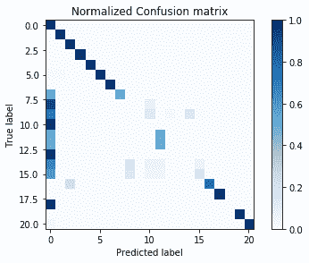

# 大数据火花

世界上存储的数据量正以准指数的方式增长。 如今，对于数据科学家而言，每天必须处理几 TB 的数据已不再是不寻常的请求，并且要使事情变得更加复杂，这意味着必须处理来自许多不同的异构系统的数据。 此外，尽管您需要处理的数据量很大，但您的业务期望是在短时间内不断生成模型，因为您只是在处理玩具数据集。

在围绕数据科学要点的旅程的总结中，我们不能忽略数据科学中如此关键的必要性。 因此，我们将向您介绍一种处理大量数据，通过多台计算机进行扩展以获取数据，对其进行处理以及构建有效的机器学习算法的新方法。 在我们进行必要的介绍之后，处理大量数据并产生有效的机器学习模型就不会了。

在本章中，您将：

*   了解分布式框架，解释 Hadoop，MapReduce 和 Spark 技术
*   从 PySpark（Spark 的 Python API 接口）开始
*   试验弹性分布式数据集，这是一种处理大数据的新方法
*   在 Spark 中的分布式系统中定义和共享变量
*   使用 Spark 中的 DataFrames 处理数据
*   在 Spark 中应用机器学习算法

在本章的最后，只要有适当的计算机集群，您将可以面对任何数据科学问题，而无论手头的数据规模如何。

# 从一台独立的机器到一堆节点

处理大数据不仅仅是大小问题； 这实际上是一个多方面的现象。 实际上，根据 **3V 模型**（体积，速度和变化），可以使用三个（正交）标准对在大数据上运行的系统进行分类：

*   要考虑的第一个标准是系统处理数据所达到的**速度**。 尽管几年前，速度还是用来表示系统处理批处理的速度，但如今，速度表示系统是否可以提供流数据的实时输出。
*   第二个标准是**体积**； 也就是说，可以处理多少信息。 它可以用行数或特征数来表示，也可以仅用字节数表示。 在流数据中，卷指示到达系统的数据的吞吐量。
*   最后一个标准是**品种**； 即数据源的类型。 几年前，这种类型受到结构化数据集的限制，但如今，数据可以结构化（表，图像等），半结构化（JSON，XML 等）和非结构化（网页， 社交数据，等等）。 通常，大数据系统会尝试处理尽可能多的相关源并将各种源混合在一起。

除了这些标准，最近几年还出现了许多其他 V，它们试图解释大数据的其他特征。 其中一些如下：

*   **准确性**：提供数据中包含的异常，偏差和噪声的指示； 最终表明其准确性
*   **波动率**：指示可以将数据用于提取有意义的信息的时间
*   **有效性**：数据的正确性
*   **值**：根据数据指示投资回报率

近年来，所有 V 都急剧增加。 现在，许多公司发现他们保留的数据具有可被货币化的巨大价值，并且他们希望从中提取信息。 技术挑战已经转向具有足够的存储和处理能力，以便能够快速，大规模并使用不同的输入数据流来提取有意义的见解。

当前的计算机，甚至是最新，最昂贵的计算机，其磁盘，内存和 CPU 的数量也有限。 每天处理太字节（PB）的信息并及时生成模型似乎非常困难。 此外，需要复制同时包含数据和处理软件的独立服务器。 否则，它可能成为系统的单点故障。

因此，大数据世界已经转移到了集群：它们由可变数量的*并不十分昂贵的*节点组成，并且位于高速 Internet 连接上。 通常，有些集群专用于存储数据（大硬盘，少 CPU 和少量内存），而另一些专用于处理数据（功能强大的 CPU，中等到大量内存，以及 小硬盘）。 此外，如果正确设置了群集，则可以确保可靠性（没有单点故障）和高可用性。

# 理解为什么我们需要分布式框架

建立集群的最简单方法是将某些节点用作存储节点，而另一些节点用作处理节点。 这种配置似乎非常易于使用，因为我们不需要复杂的框架来处理这种情况。 实际上，许多小型集群正是以这种方式构建的：几个服务器处理数据（加上副本），另一个服务器处理数据。 尽管这可能是一个不错的解决方案，但是由于许多原因，它并不常用：

*   它仅适用于令人尴尬的并行算法。 如果算法要求在处理服务器之间共享一个公共的内存区域，则无法使用此方法。
*   如果一个或多个存储节点死亡，则不能保证数据是一致的。 （考虑一种情况，其中节点及其副本同时死亡，或者节点在尚未复制的写操作之后死亡。）
*   如果处理节点死亡，我们将无法跟踪其正在执行的进程，从而很难在另一个节点上恢复处理。
*   如果网络出现故障，则在恢复正常后很难预测这种情况。

崩溃事件（甚至不止一个）很可能发生，这是一个事实，要求必须事先考虑这种情况并进行适当处理，以确保对数据进行操作的连续性。 此外，当使用便宜的硬件或更大的群集时，几乎可以肯定至少有一个节点将发生故障。 到目前为止，绝大多数集群框架都使用名为 *Divide et Impera* 的方法（拆分和征服）：

*   有用于数据节点的*专用*模块和用于数据处理节点（也称为工作器）的其他一些专用模块。
*   数据跨数据节点复制，一个节点为主节点，确保写入和读取操作均成功。
*   处理步骤在工作节点之间划分。 它们不共享任何状态（除非存储在数据节点中），并且它们的主设备确保所有任务都正确且正确地执行。

# Hadoop 生态系统

**Apache Hadoop** 是用于群集上的分布式存储和分布式处理的非常流行的软件框架。 它的优势在于价格（免费），灵活性（它是开源的，尽管它是用 Java 编写的，但可以被其他编程语言使用），可伸缩性（它可以处理由数千个节点组成的集群）和鲁棒性。 （它的灵感来自 Google 的已发表论文，并且自 2011 年以来一直存在），使其成为处理和处理大数据的事实上的标准。 此外，Apache 基金会的许多其他项目都扩展了其功能。

# Hadoop 架构

从逻辑上讲，Hadoop 由两部分组成：分布式存储（HDFS）和分布式处理（YARN 和 MapReduce）。 尽管代码非常复杂，但整体架构相当容易理解。 客户端可以通过两个专用模块访问存储和处理。 然后，他们负责在所有工作节点之间分配作业，如下图所示：


所有 Hadoop 模块均作为服务（或实例）运行； 也就是说，物理或虚拟节点可以运行其中的许多节点。 通常，对于小型集群，所有节点都运行分布式计算和处理服务。 对于大型集群，最好将两个功能分开并专门化节点。

我们将详细看到两层提供的功能。

# Hadoop 分布式文件系统

**Hadoop 分布式文件系统（HDFS）**是容错的分布式文件系统，旨在在低成本硬件上运行，并且能够处理非常大的数据集（数百 PB 到 EB 级） ）。 尽管 HDFS 需要快速的网络连接来跨节点传输数据，但是延迟不能像传统文件系统中那样低（它可能在几秒钟的时间内）。 因此，HDFS 被设计用于批处理和高吞吐量。 每个 HDFS 节点都包含文件系统数据的一部分； 在其他实例中也将复制相同的数据，这可确保高吞吐量访问和容错。

HDFS 的体系结构是主从结构。 如果主服务器（称为 **NameNode** ）发生故障，则表明有一个辅助节点/备份节点可以控制。 所有其他实例都是从属（ **DataNodes** ）； 如果其中一个发生故障，这并不是问题，因为 HDFS 就是在设计时考虑到这一点的，因此不会丢失任何数据（进行冗余复制），并且可以将操作迅速重新分配给尚存的节点。 **数据节点**包含数据块：HDFS 中保存的每个文件被分解成块（或块），每个文件通常为 64 MB，然后在一组 **DataNodes** 中进行分发和复制。 **NameNode** 仅存储分布式文件系统中文件的元数据； 它不存储任何实际数据，而只是存储有关如何访问其管理的多个 **DataNodes** 中文件的正确指示。

请求读取文件的客户端必须首先联系 **NameNode** ，它将返回一个表，其中包含块及其位置的有序列表（如 **DataNodes** 中所示）。 此时，客户端应分别与 **DataNodes** 联系，下载所有块并重建文件（通过将块附加在一起）。

要写入文件，客户端应首先联系 **NameNode** ，后者将首先决定如何处理请求，然后更新其记录并使用 **DataNodes** 的有序列表回复客户端 ]写入文件每个块的位置。 客户端现在将根据 **NameNode** 答复中的报告，将块联系并上传到 **DataNodes** 。 命名空间查询（例如，列出目录内容，创建文件夹等）由 **NameNode** 通过访问其元数据信息完全处理。

此外， **NameNode** 还负责正确处理 **DataNode** 故障（如果未接收到心跳数据包，则标记为死），并将其数据复制到其他节点。

尽管这些操作很长且难以实现，但是由于许多库和 HDFS Shell，它们对用户完全透明。 在 HDFS 上进行操作的方式与当前在文件系统上进行的操作非常相似，这是 Hadoop 的一大优势：隐藏复杂性并让用户简单地使用它。

# MapReduce

**MapReduce** 是在 Hadoop 的最早版本中实现的编程模型。 这是一个非常简单的模型，旨在并行处理分布式群集上的大型数据集。 MapReduce 的核心由两个可编程功能组成：一个执行过滤的映射器和一个执行聚合的 reducer，以及一个将对象从映射器移动到正确的 reducer 的 shuffler。 Google 于 2004 年在 MapReduce（ [https://ai.google/research/pubs/pub62](https://ai.google/research/pubs/pub62) ）[和](https://ai.google/research/pubs/pub62)上获得了专利，专利发表了几个月。

具体来说，这是 MapReduce 用于 Hadoop 实现的步骤：

*   **数据分块器**：从文件系统读取数据并将其拆分为块。 块是输入数据集的一部分，通常是固定大小的块（例如，从 **DataNode** 读取的 HDFS 块）或另一个更合适的拆分。 例如，如果我们要计算文本文件中的字符，单词和行数，则很好的拆分可以是一行文本。
*   **映射器**：从每个块中生成一系列键值对。 每个映射器实例将相同的映射函数应用于不同的数据块。 继续前面的示例，对于每一行，在此步骤中生成了三个键值对-一个键值对包含该行中的字符数（键可以简单地是*字符*字符串），其中一个包含数字 个单词（在这种情况下，密钥必须不同，所以假设*个单词*），其中一个包含行数，该行数始终为 1（在这种情况下，密钥可以是*行）* ）。
*   **混洗器**：从可用键的数量和可用的化简器的数量，混洗器将具有相同键的所有键-值对分配给同一异化器。 通常，此操作是计算键的哈希值，将其除以精简器的数量，然后使用余数来指出特定的精简器。 这应确保每个异径管有足够数量的钥匙。 该功能不是用户可编程的，而是由 MapReduce 框架提供的。
*   **简化器**：每个简化器都接收一组特定键的所有键值对，并且可以产生零个或多个聚合结果。 在该示例中，所有与*单词*键相关的值都到达简化器； 它的工作只是总结所有价值。 其他键也一样，这将产生三个最终值：字符数，单词数和行数。 请注意，这些结果可能在不同的减速器上。
*   **输出编写器**：减速器的输出写在文件系统（或 HDFS）上。 在默认的 Hadoop 配置中，每个 reducer 都会写入一个文件（`part-r-00000`是第一个 reducer 的输出，`part-r-00001`是第二个 reducer 的输出，依此类推）。 要在文件上显示完整的结果列表，应将所有结果串联起来。

在视觉上，可以简单地传达和理解此操作，如下所示：


映射步骤之后，每个映射器实例还可以运行一个可选步骤，即合并器。 基本上可以预期，如果可能的话，在映射器上执行减少步骤，通常用于减少要重新整理的信息量，从而加快了处理速度。 在前面的示例中，如果一个映射程序处理输入文件的多行，则在（可选）组合器步骤中，它可以预聚合结果，并输出较少数量的键值对。 例如，如果映射器在每个块中处理 100 行文本，那么当可以将信息汇总为三时，为什么输出 300 个键值对（字符数为 100，单词为 100，行为 100）？ 这实际上是合并器的目标。

在 Hadoop 提供的 MapReduce 实施中，随机分配操作被分配，从而优化了通信成本，并且每个节点可以运行多个 mapper 和 reducer，从而充分利用了节点上可用的硬件资源。 此外，Hadoop 基础架构还提供了冗余和容错功能，因为同一任务可以分配给多个工作人员。

# 介绍 Apache Spark

**Apache Spark** 是 Hadoop 的演进，并在最近几年变得非常流行。 与 Hadoop 及其以 Java 和批处理为重点的设计相比，Spark 能够以快速简便的方式生成迭代算法。 此外，它具有用于多种编程语言的非常丰富的 API 套件，并且本身支持许多不同类型的数据处理（机器学习，流传输，图形分析，SQL 等）。

Apache Spark 是一个集群框架，旨在用于大数据的快速通用处理。 速度的提高之一来自以下事实：与 Hadoop，MapReduce 和 HDFS 一样，每项工作之后的数据都保留在内存中，而不是存储在文件系统中（除非您愿意这样做）。 由于内存提供的延迟和带宽比物理磁盘更具性能，因此这种事情使迭代作业（例如群集 K-means 算法）越来越快。 因此，运行 Spark 的集群需要为每个节点配备大量 RAM。

尽管 Spark 是在 Scala（类似于 Java 一样在 JVM 上运行）中开发的，但它具有适用于多种编程语言的 API，包括 Java，Scala，Python 和 R。在本书中，我们将重点介绍 Python。

Spark 可以两种不同的方式运行：

*   **独立模式**：它在本地计算机上运行。 在这种情况下，最大并行化是本地计算机的内核数，并且可用内存量与本地计算机完全相同。
*   **群集模式**：它使用群集管理器（例如 YARN）在多个节点的群集上运行。 在这种情况下，最大并行化是组成集群的所有节点上的核心数，而内存量是每个节点的内存量之和。

# PySpark

为了使用 Spark 功能（或包含 Spark 的 Python API 的 PySpark），我们需要实例化一个名为`SparkContext`的特殊对象。 它告诉 Spark 如何访问集群，并包含一些特定于应用程序的参数。 在虚拟机提供的 Jupyter 笔记本中，此变量已可用，并称为`sc`（启动 IPython Notebook 时的默认选项）。 让我们在下一部分中查看它包含的内容。

# 从 PySpark 开始

Spark 使用的数据模型名为**弹性分布式数据集**（ **RDD** ），它是可以并行处理的元素的分布式集合。 可以从现有集合（例如 Python 列表）或从外部数据集创建 RDD，这些数据以文件形式存储在本地计算机，HDFS 或其他来源上。

# 设置本地 Spark 实例

从头开始完整安装 Apache Spark 并非易事。 通常，这是在通常可以在云上访问的计算机群集上完成的，并且将其委派给技术专家（即数据工程师）。 这可能是一个限制，因为您可能无法访问测试本章将学到的内容的环境。

但是，为了测试本章的内容，实际上您不需要进行太复杂的安装。 通过使用 Docker（ [https://www.docker.com/](https://www.docker.com/) ），您可以在自己计算机上的 Linux 服务器上访问 Spark 的安装以及 Jupyter 笔记本和 PySpark。 不论是 Linux，macOS 还是基于 Windows 的计算机都没有关系。

实际上，这主要是因为 Docker。 Docker 允许操作系统级别的虚拟化，也称为**容器化**。 容器化意味着允许一台计算机运行多个隔离的文件系统实例，其中每个实例彼此之间只是简单地分开（尽管共享相同的硬件资源），就好像它们是单台计算机本身一样。 基本上，在 Docker 中运行的任何软件都包装在一个完整，稳定且预先定义的文件系统中，该文件系统完全独立于运行 Docker 的文件系统。 使用 Docker 容器意味着您的代码将按预期（如本章所述）完美运行。 命令执行的一致性是 Docker 是将解决方案投入生产的最佳方法的主要原因：您只需要将使用的容器移到服务器中，并创建一个 API 即可访问您的解决方案（我们之前在[这个页面](5.html)，*可视化，见解和结果*，我们在其中介绍了 Bottle 包装。

这是您需要采取的步骤：

1.  首先，首先安装适合您系统的 Docker 软件。 您可以在这里找到所需的全部信息，具体取决于您所使用的操作系统：

| 视窗 | [https://docs.docker.com/docker-for-windows/](https://docs.docker.com/docker-for-windows/) |
| 的 Linux | [https://docs.docker.com/engine/getstarted/](https://docs.docker.com/engine/getstarted/) |
| 苹果系统 | [https://docs.docker.com/docker-for-mac/](https://docs.docker.com/docker-for-mac/) |

安装非常简单，但是在从中下载软件的同一页面上，您可以找到可能需要的任何其他信息。

2.  完成安装后，我们可以使用可在[这个页面](https://github.com/jupyter/docker-stacks/tree/master/pyspark-notebook)找到的 Docker 映像。 它包含完整的 Spark 安装，可通过 Jupyter 笔记本访问，以及 Miniconda 安装以及最新版本的 Python 2 和 3。您可以在此处找到有关映像内容的更多信息： [http：// jupyter-docker -stacks.readthedocs.io/en/latest/using/selecting.html#jupyter-pyspark-notebook](http://jupyter-docker-stacks.readthedocs.io/en/latest/using/selecting.html#jupyter-pyspark-notebook) 。
3.  此时，只需打开 Docker 接口即可； 在那里，将出现一个带有鲸鱼的 ASCII 文字和 IP 地址的外壳。 只要记下 IP 地址（在我们的例子中是`192.168.99.100`）。 现在，在 shell 中运行以下命令：

```py
$> docker run -d -p 8888:8888 --name spark jupyter/pyspark-notebook start-notebook.sh –NotebookApp.token=''
```

4.  如果您更喜欢安全性而不是易用性，只需键入以下内容：

```py
$> docker run -d -p 8888:8888 --name spark jupyter/pyspark-notebook start-notebook.sh –NotebookApp.token='mypassword'
```

用您选择的密码替换`mypassword`占位符。 请注意，Jupyter 笔记本电脑在启动时会要求输入该密码。

5.  运行上述命令后，Docker 将开始下载`pyspark-notebook image`（可能需要一段时间）； 为它分配名称`spark`，将 Docker 映像上的`8888`端口复制到您计算机上的`8888`端口，然后执行`start-notebook.sh`脚本，并将笔记本密码设置为空（这样您就可以立即 仅使用前面提到的 IP 地址和`8888`端口访问 Jupyter。

此时，您需要做的唯一另一件事就是在浏览器中输入以下内容：

```py
http://192.168.99.100:8888/
```

也就是说，在您的浏览器中输入 Docker 启动时给您的 IP 地址，冒号，然后是`8888`（即端口号）。 Jupyter 应该立即出现。

6.  作为一个简单的测试，您可以立即打开一个新的笔记本并进行以下测试：

```py
In: import pyspark
 sc = pyspark.SparkContext('local[*]')

 # do something to prove it works
 rdd = sc.parallelize(range(1000))
 rdd.takeSample(False, 5)
```

7.  同样重要的是要注意，您有停止 Docker 机器的命令以及什至会破坏它的命令。 这个 shell 命令将停止它：

```py
$> docker stop spark
```

为了在停止容器后销毁该容器，请使用以下命令（顺便说一下，您将丢失容器中的所有工作）：

```py
$> docker rm spark
```

如果您的容器尚未被销毁，则要使其在停止后再次运行，只需使用以下 shell 命令：

```py
$> docker start spark
```

此外，您需要知道，在 Docker 机器上，您在`/home/jovyan`目录上进行操作，并且可以直接从 Docker shell 获取其内容列表：

```py
$> docker exec -t -i spark ls /home/jovyan
```

您还可以执行任何其他 Linux bash 命令。

值得注意的是，您还可以在容器之间来回复制数据（否则，您的工作将只保存在机器的操作系统中）。 假设您必须将 Windows 桌面目录中的文件（`file.txt`）复制到 Docker 计算机：

```py
$> docker cp c:/Users/Luca/Desktop/spark_stuff/file.txt spark:/home/jovyan/file.txt
```

同样，相反的情况也是可能的：

```py
$> docker cp spark:/home/jovyan/test.ipynb c:/Users/Luca/Desktop/spark_stuff/test.ipynb
```

这就是全部。 仅需几个步骤，您就可以在本地运行的 Spark 环境中运行所有实验（显然，它仅使用一个节点，并且仅限于单个 CPU 的功能）。

# 试验弹性分布式数据集

现在，让我们创建一个包含 0 到 9 之间的整数的弹性分布式数据集。为此，我们可以使用`SparkContext`对象提供的`parallelize`方法：

```py
In: numbers = range(10)
 numbers_rdd = sc.parallelize(numbers)
 numbers_rdd

Out: PythonRDD[2672] at RDD at PythonRDD.scala:49
```

如您所见，您不能简单地打印 RDD 内容，因为它会分为多个分区（并分布在群集中）。 分区的默认数量是 CPU 数量的两倍（因此，在提供的 VM 中为四个），但是可以使用`parallelize`方法的第二个参数手动设置。

要打印出 RDD 中包含的数据，应调用`collect`方法。 请注意，此操作在群集上运行时会收集节点上的所有数据。 因此，该节点需要有足够的内存来包含所有内容：

```py
In: numbers_rdd.collect()

Out: [0, 1, 2, 3, 4, 5, 6, 7, 8, 9]
```

要仅获得部分预览，请使用`take`方法，指示您希望看到多少个元素。 请注意，由于它是分布式数据集，因此不能保证元素的插入顺序与插入时的顺序相同：

```py
In: numbers_rdd.take(3)

Out: [0, 1, 2]
```

要读取文本文件，我们可以使用`SparkContext`提供的`textFile`方法。
它允许读取 HDFS 文件和本地文件，并在换行符上拆分文本； 因此，RDD 的第一个元素是文本文件的第一行（使用第一种方法）。 请注意，如果您使用的是本地路径，则组成集群的所有节点都应通过相同的路径访问相同的文件。 为此，我们首先下载威廉·莎士比亚的完整剧集：

```py
In: import urllib.request
 url = "http://www.gutenberg.org/files/100/100-0.txt"
 urllib.request.urlretrieve(url, "shakespeare_all.txt")

In: sc.textFile("file:////home//jovyan//shakespeare_all.txt").take(6)

Out: ['',
'Project Gutenberg’s The Complete Works of William Shakespeare, by William',
'Shakespeare', '',
'This eBook is for the use of anyone anywhere in the United States and',
'most other parts of the world at no cost and with almost no restrictions']
```

要将 RDD 的内容保存到磁盘上，可以使用 RDD 提供的`saveAsTextFile`方法：

```py
In: numbers_rdd.saveAsTextFile("file:////home//jovyan//numbers_1_10.txt")
```

RDD 仅支持两种类型的操作：

*   转换，将数据集转换为另一数据集。 转换的输入和输出都是 RDD。 因此，可以将多个转换链接在一起，从而达到一种编程的功能风格。 而且，转换是懒惰的。 也就是说，他们不会立即计算出结果。
*   动作从 RDD 返回值，例如元素的总和和计数，或者仅收集所有元素。 动作是执行（惰性）转换链的触发器，因为需要输出。

典型的 Spark 程序是一系列转换，最后是一个动作。 默认情况下，RDD 上的所有转换都是在您每次执行操作时执行的（即，不保存每个转换器之后的中间状态）。 但是，只要您想`cache`转换后的元素的值，就可以使用`persist`方法（在 RDD 上）覆盖此行为。 `persist`方法允许内存和磁盘持久性。

在下面的示例中，我们将对 RDD 中包含的所有值求平方，然后对其求和； 该算法可以通过一个映射器（正方形元素），然后是一个约简器（对数组求和）来执行。 根据 Spark 的说法，`map`方法是一种转换器，因为它只是逐个元素地转换数据。 reduce 是一个动作，因为它可以从所有元素中共同创造出价值。

让我们逐步解决此问题，以了解可以进行操作的多种方式。 首先，我们将使用一个函数来转换（映射）所有数据：首先定义一个函数，该函数返回输入参数的平方，然后将该函数传递给 RDD 中的`map`方法， 最后，我们收集 RDD 中的元素：

```py
In: def sq(x):
 return x**2 numbers_rdd.map(sq).collect()

Out: [0, 1, 4, 9, 16, 25, 36, 49, 64, 81]
```

尽管输出正确，但是`sq`功能占用大量空间； 借助 Python 的`lambda`表达式，我们可以更简洁地重写转换：

```py
In: numbers_rdd.map(lambda x: x**2).collect()

Out: [0, 1, 4, 9, 16, 25, 36, 49, 64, 81]
```

您还记得为什么我们需要调用`collect`来打印转换后的 RDD 中的值吗？ 这是因为`map`方法不会付诸实践，而只会被懒惰地评估。 另一方面，`reduce`方法是一个动作； 因此，将`reduce`步骤添加到先前的 RDD 应该会输出一个值。 至于`map`，`reduce`将应具有两个自变量（左值和右值）的函数作为自变量，并应返回一个值。 在这种情况下，它可以是用`def`定义的`verbose`函数或`lambda`函数：

```py
In: numbers_rdd.map(lambda x: x**2).reduce(lambda a,b: a+b)

Out: 285
```

为了使其更简单，我们可以使用`sum`动作来代替 reducer：

```py
In: numbers_rdd.map(lambda x: x**2).sum()

Out: 285
```

现在让我们前进一个步骤，并介绍键值对。 尽管 RDD 可以包含任何类型的对象（到目前为止，我们已经看到了整数和文本行），但是当元素是由两个元素组成的元组时，可以进行一些操作：键和值。

举个例子，让我们将 RDD 中的数字分组为偶数和偶数，然后分别计算两组的总和。 对于 MapReduce 模型，最好将每个数字与一个键（奇数或偶数）映射，然后对于每个键，使用求和运算来减少。

我们可以从`map`操作开始：首先创建一个标记数字的函数，如果参数编号为偶数，则输出`even`，否则输出`odd`。 然后，我们将创建一个键值映射，为每个数字创建一个键值对，其中键是标记，值是数字本身：

```py
In: def tag(x):
 return "even" if x%2==0 else "odd"

 numbers_rdd.map(lambda x: (tag(x), x)).collect()

Out: [('even', 0),
      ('odd', 1),
      ('even', 2),
      ('odd', 3),
      ('even', 4),
      ('odd', 5),
      ('even', 6),
      ('odd', 7),
      ('even', 8),
      ('odd', 9)]
```

为了分别减少每个键，我们现在可以使用`reduceByKey`方法（这不是 Spark 动作）。 作为参数，我们应该传递需要应用于每个键的所有值的函数。 在这种情况下，我们将总结所有这些。 最后，我们应该调用`collect`方法来打印结果：

```py
In: numbers_rdd.map(lambda x: (tag(x), x) ) \
 .reduceByKey(lambda a,b: a+b).collect()

Out: [('even', 20), ('odd', 25)]
```

现在，让我们列出 Spark 中可用的一些最重要的方法。 它不是详尽的指南，仅包括最常用的指南。

我们从转变开始； 它们可以应用于 RDD，并产生 RDD：

*   `map(function)`：这将返回通过将每个元素
    传递给函数而形成的 RDD。
*   `flatMap(function)`：这将返回一个 RDD，该 RDD 是通过将
    的输出对输入 RDD 的每个元素进行平坦化而形成的。 当
    输入上的每个值都可以映射到 0 个或更多输出元素时使用。
    例如，要计算每个单词在文本中出现的次数，
    我们应该将每个单词映射到一个键-值对（该单词将是键，而 1
    是值） ，以这种方式为
    文本的每个输入行生成多个键值元素。
*   `filter(function)`：这将返回由所有值组成的数据集，其中
    函数返回 true。
*   `sample(withReplacement, fraction, seed)`：这将引导 RDD，
    允许您创建采样的 RDD（有或没有替换），其
    长度是输入长度的一小部分。
*   `distinct()`：这将返回包含输入
    RDD 的不同元素的 RDD。
*   `coalesce(numPartitions)`：这减少了
    RDD 中的分区数。
*   `repartition(numPartitions)`：更改
    RDD 中的分区数。 这种方法总是通过网络混洗所有数据。
*   `groupByKey()`：这将创建一个 RDD，其中对于每个键，其值是在输入数据集中具有该键的
    值序列。
*   `reduceByKey(function)`：这将通过键汇总输入的 RDD，然后，
    将`reduce`功能应用于每个组的值。
*   `sortByKey(ascending)`：按
    升序或降序对 RDD 中的元素进行排序。
*   `union(otherRDD)`：这会将两个 RDD 合并在一起。
*   `intersection(otherRDD)`：这将返回一个仅由同时出现在输入和参数 RDD 中的
    值组成的 RDD。
*   `join(otherRDD)`：这将返回一个数据集，在该数据集中，将键值输入
    （在键上）连接到参数 RDD。

与 SQL 中的`join`函数类似，这些方法也可用：`cartesian`，`leftOuterJoin`，`rightOuterJoin`和`fullOuterJoin`。

现在，让我们概述一下 PySpark 中最受欢迎的动作是什么。 请注意，动作通过链中的所有转换器触发 RDD 的处理：

*   `reduce(function)`：聚合 RDD 的元素并产生
    输出值
*   `count()`：这将返回 RDD 中元素的计数
*   `countByKey()`：这将返回一个 Python 字典，其中每个键都是
    ，与带有该键的 RDD 中的元素数相关联
*   `collect()`：这将本地返回转换后的 RDD 中的所有元素
*   `first()`：这将返回 RDD 的第一个值
*   `take(N)`：这将返回 RDD 中的前 N 个值
*   `takeSample(withReplacement, N, seed)`：这将返回 RDD 中包含或不具有替换的 N 个元素的引导程序，最终使用提供的随机种子作为参数
*   `takeOrdered(N, ordering)`：按值排序（升序或降序）后，它返回 RDD
    中的前 N 个元素
*   `saveAsTextFile(path)`：这会将 RDD 作为一组文本文件保存在
    指定的目录中

还有一些既不是转换器也不是动作的方法：

*   `cache()`：这将缓存 RDD 的元素； 因此，将来基于相同 RDD 的
    计算可以将其重新用作起点
*   `persist(storage)`：与`cache`相同，但是您可以指定
    在何处存储 RDD 的元素（内存，磁盘或两者）。
*   `unpersist()`：撤消`persist`或`cache`操作

现在，让我们尝试使用 RDD 的示例，以计算一些文本统计信息并从大文本中提取最受欢迎的单词（莎士比亚的戏剧）。 使用 Spark 时，用于计算文本统计信息的算法应如下所示：

1.  在 RDD 上读取输入文件并对其进行并行化。 可以使用`SparkContext`提供的`textFile`方法完成此操作。
2.  对于输入文件的每一行，将返回三个键值对：一对包含字符数，一个包含单词数，最后一个包含行数。 在 Spark 中，这是`flatMap`操作，因为每条输入线都会生成三个输出。

3.  对于每个键，我们总结所有值。 这可以通过`reduceByKey`方法完成。
4.  最后，收集结果。 在这种情况下，我们可以使用`collectAsMap`方法，该方法在 RDD 中收集键值对并返回 Python 字典。 注意这是一个动作； 因此，将执行 RDD 链并返回结果：

```py
In: def emit_feats(line):
 return [("chars", len(line)), \
 ("words", len(line.split())), \
 ("lines", 1)] print((sc.textFile("file:////home//jovyan//shakespeare_all.txt")
 .flatMap(emit_feats)
 .reduceByKey(lambda a,b: a+b)
 .collectAsMap()))

Out: {'chars': 5535014, 'words': 959893, 'lines': 149689}
```

要确定文本中最受欢迎的单词，请按照下列步骤操作：

1.  使用`textFile`方法在 RDD 上读取并并行化输入文件。
2.  对于每一行，提取所有单词。 对于此操作，我们可以使用`flatMap`方法和正则表达式。
3.  现在，文本中的每个单词（即 RDD 的每个元素）都映射到一个键值对：键是小写单词，值始终是`1`。 这是一个地图操作。
4.  通过`reduceByKey`调用，我们计算每个单词（键）在文本（RDD）中出现的次数。 输出是键值对，其中键是一个单词，值是单词在文本中出现的次数。
5.  我们翻转键和值并创建一个新的 RDD。 这是一个地图操作。
6.  我们将 RDD 降序排列，然后提取（获取）第一个元素。 这是一项操作，可以通过`takeOrdered`方法执行一次操作。

我们实际上可以进一步改进该解决方案，将第二步和第三步合并在一起（`flatMap`-为每个单词分配一个键-值对，其中键是小写单词，值是出现的次数），并且 第五步和第六步（将 RDD 中的第一个元素按值排序，即该对中的第二个元素）：

```py
In: import re
 WORD_RE = re.compile(r"[\w']+")
 print((sc.textFile("file:////home//jovyan//shakespeare_all.txt")
 .flatMap(lambda line: [(word.lower(), 1) for word in 
 WORD_RE.findall(line)])
 .reduceByKey(lambda a,b: a+b)
 .takeOrdered(1, key = lambda x: -x[1])))

Out: [('the', 29998)]
```

# 跨集群节点共享变量

当我们在分布式环境中工作时，有时需要跨节点共享信息，以便所有节点都可以使用一致的变量进行操作。 Spark 通过提供两种变量来处理这种情况：只读和只写变量。 通过不再确保共享变量是可读写的，它也降低了一致性要求，从而使管理这种情况的辛苦工作落在了开发人员的肩膀上。 通常，由于 Spark 确实具有灵活性和自适应性，因此可以很快找到解决方案。

# 只读广播变量

广播变量是驱动程序节点共享的变量； 也就是说，该节点在我们的配置中运行 IPython Notebook，并且所有节点都在集群中。 这是一个只读变量，因为该变量由一个节点广播，并且如果另一个节点对其进行更改，则永远不会回读。

现在，让我们在一个简单的示例中查看其工作方式：我们希望对仅包含性别信息作为字符串的数据集进行一次热编码。 虚拟数据集仅包含一个特征，该特征可以是男性`M`，女性`F`或未知`U`（如果信息丢失）。 具体来说，我们希望所有节点都使用定义的“一键编码”，如以下词典中列出：

```py
In: one_hot_encoding = {"M": (1, 0, 0), "F": (0, 1, 0),
 "U": (0, 0, 1)}
```

在我们的解决方案中，我们首先在映射函数内部广播 Python 字典（调用`SparkContext`提供的`broadcast`方法，sc）； 使用其 value 属性，我们现在可以访问它。 完成此操作后，我们有了一个通用的`map`函数，该函数可以在任何一个热门地图字典上运行：

```py
In: bcast_map = sc.broadcast(one_hot_encoding)
 def bcast_map_ohe(x, shared_ohe):
 return shared_ohe[x]

 (sc.parallelize(["M", "F", "U", "F", "M", "U"])
 .map(lambda x: bcast_map_ohe(x, bcast_map.value))
 .collect())
```

广播变量保存在组成集群的所有节点的内存中； 因此，它们永远不会共享大量数据，这些数据会填满它们并使后续处理变得不可能。

要删除广播变量，请在广播变量上使用`unpersist`方法。 此操作将释放所有节点上该变量的内存：

```py
In: bcast_map.unpersist()
```

# 只写累加器变量

Spark 集群中可以共享的其他变量是累加器。 累加器是只写变量，可以将它们加在一起，通常用于实现总和或计数器。 只有运行 IPython Notebook 的驱动程序节点可以读取其值； 其他所有节点都无法读取。 让我们通过一个示例看一下它是如何工作的：我们要处理一个文本文件，并了解在处理文本文件时有多少行是空的。 当然，我们可以通过两次扫描数据集（使用两个 Spark 作业）来做到这一点，第一个计数空行，第二个进行实际处理，但是这种解决方案不是很有效。 之后，您将执行处理文本文件并计算其行数所需的所有步骤。

所需步骤如下：

1.  首先，我们从网上下载要处理的文本文件，由古腾堡计划提供的*亚瑟·柯南·道尔爵士的《福尔摩斯历险记》* ：

```py
In: import urllib.request
 url = "http://gutenberg.pglaf.org/1/6/6/1661/1661.txt"
 urllib.request.urlretrieve(url, "sherlock.tx")
```

2.  然后，我们实例化一个累加器变量（初始值为`0`），并在处理输入文件的每一行（带有映射）时为发现的每一个空行添加`1`。 同时，我们可以在每一行上进行一些处理； 例如，在下面的代码中，我们只为每一行返回`1`，就以此方式对文件中的所有行进行计数。

3.  在处理的最后，我们将获得两条信息：第一条是行数，来自对变换后的 RDD 的`count()`操作的结果，第二条是值中包含的空行数 累加器的属性。 请记住，在扫描数据集一次之后，这两个选项均可用：

```py
In: accum = sc.accumulator(0)
 def split_line(line):
 if len(line) == 0:
 accum.add(1)
 return 1

 filename = 'file:////home//jovyan//sherlock.txt'
 tot_lines = (
 sc.textFile(filename)
 .map(split_line)
 .count())

 empty_lines = accum.value
 print("In the file there are %d lines" % tot_lines)
 print("And %d lines are empty" % empty_lines)

Out: In the file there are 13053 lines
 And 2666 lines are empty
```

# 广播变量和累加器变量一起-示例

尽管广播和累加器变量很简单，并且变量非常有限（一个变量是只读变量，另一个变量是只写变量），但是可以将它们有效地用于创建非常复杂的操作。 例如，让我们尝试在分布式环境中的`iris`数据集上应用不同的机器学习算法。 我们将通过以下方式构建 Spark 作业：

*   读取数据集并将其广播到所有节点（因为它足够小以适合内存）。
*   每个节点将在数据集上使用不同的分类器，并在整个数据集上返回分类器名称及其准确性得分。 请注意，在此简单示例中，为了使事情变得简单，我们将不进行任何预处理，训练/测试拆分或超参数优化。
*   如果分类器引发异常，则错误的字符串表示形式以及分类器名称应存储在累加器中。
*   最终输出应包含执行分类任务且没有错误的分类器列表及其准确性得分。

第一步，我们加载`iris`数据集并将其广播到集群中的所有节点：

```py
In: from sklearn.datasets import load_iris
 bcast_dataset = sc.broadcast(load_iris())
```

现在，让我们继续通过创建自定义累加器进行编码。 它将包含一个元组列表，用于存储分类器名称和它作为字符串遇到的异常。 定制累加器是使用`AccumulatorParam`类派生的，并且应至少包含两个方法：`zero`（在初始化时调用）和`addInPlace`（在累加器上调用 add 方法时调用）。

以下代码显示了执行此操作的最简单方法，然后将其初始化为空列表。 请记住，加法运算有点棘手：我们需要合并两个元素（一个元组和一个列表），但是我们不知道哪个元素是列表，哪个是元组； 因此，我们首先确保两个元素都是列表，然后我们可以通过简单的方式（使用 plus 运算符）将它们连接起来：

```py
In: from pyspark import AccumulatorParam
 class ErrorAccumulator(AccumulatorParam):
 def zero(self, initialList):
 return initialList
 def addInPlace(self, v1, v2):
 if not isinstance(v1, list):
 v1 = [v1]
 if not isinstance(v2, list):
 v2 = [v2]
 return v1 + v2

 errAccum = sc.accumulator([], ErrorAccumulator())
```

现在，让我们定义映射功能：每个节点都应在广播`iris`数据集上训练，测试和评估分类器。 作为参数，该函数将接收分类器对象，并应返回一个元组，该元组包含分类器名称及其准确性分数（包含在列表中）。

如果这样做引发异常，则将分类器名称和以字符串引用的异常添加到累加器中，并返回一个空列表：

```py
In: def apply_classifier(clf, dataset):
 clf_name = clf.__class__.name
        X = dataset.value.data
 y = dataset.value.target
 try:
 from sklearn.metrics import accuracy_score
 clf.fit(X, y)
 y_pred = clf.predict(X)
 acc = accuracy_score(y, y_pred)
 return [(clf_name, acc)]
 except Exception as e:
 errAccum.add((clf_name, str(e)))
 return []
```

最后，我们到达了工作的核心。 现在，我们从 scikit-learn 实例化一些对象（为了测试累加器，其中一些不是分类器）。 我们将它们转换为 RDD，并应用在上一个单元格中创建的`map`函数。 由于返回值是一个列表，因此我们可以使用`flatMap`来仅收集未陷入异常的映射器的输出：

```py
In: from sklearn.linear_model import SGDClassifier
 from sklearn.dummy import DummyClassifier
 from sklearn.decomposition import PCA
 from sklearn.manifold import MDS

 classifiers = [DummyClassifier('most_frequent'),
 SGDClassifier(),
 PCA(),
 MDS()]

 (sc.parallelize(classifiers)
 .flatMap(lambda x: apply_classifier(x, bcast_dataset))
 .collect())

Out: [('DummyClassifier', 0.33333333333333331), 
 ('SGDClassifier', 0.85333333333333339)]
```

如预期的那样，输出中仅包含*实数*分类器。 让我们看看哪些分类器产生了错误。 毫不奇怪，这里我们从前面的输出中发现了两个缺失的：

```py
In: print("The errors are:", errAccum.value)

Out: The errors are: [('PCA', "'PCA' object has no attribute 'predict'"), 
 ('MDS', "'MDS' object has no attribute 'predict'")]
```

最后，让我们清理广播数据集：

```py
In: bcast_dataset.unpersist()
```

请记住，在此示例中，我们使用了一个可以广播的小型数据集。 在实际的大数据问题中，您需要从 HDFS 加载数据集并广播 HDFS 路径。

# Spark 中的数据预处理

到目前为止，我们已经看到了如何从本地文件系统和 HDFS 加载文本数据。 文本文件可以包含非结构化数据（例如文本文档）或结构化数据（例如 CSV 文件）。 至于半结构化数据，就像包含 JSON 对象的文件一样，Spark 具有特殊的例程，可以将文件转换为 DataFrame，类似于 R 和 Python 包 pandas 中的 DataFrame。 DataFrame 与 RDBMS 表非常相似，其中设置了模式。

# CSV 文件和 Spark DataFrames

我们首先向您展示如何读取 CSV 文件并将其转换为 Spark DataFrames。 只需按照以下示例中的步骤操作：

1.  为了导入兼容 CSV 的文件，我们首先需要通过从本地`SparkContext`创建一个`SQLContext`对象来创建一个 SQL 上下文：

```py
In: from pyspark.sql import SQLContext
 sqlContext = SQLContext(sc)
```

2.  对于我们的示例，我们创建了一个简单的 CSV 文件，该文件是一个具有六行三列的表，其中缺少某些属性（例如`user_id=0`用户的性别属性）：

```py
In: data = """balance,gender,user_id
 10.0,,0
 1.0,M,1
 -0.5,F,2
 0.0,F,3
 5.0,,4
 3.0,M,5
 """
 with open("users.csv", "w") as output:
 output.write(data)
```

3.  使用`sqlContext`提供的`read.format`方法，我们已经使表格式正确，并且在变量中具有所有正确的列名称。 输出变量类型是 Spark DataFrame。 要在一个漂亮的格式化表中显示该变量，请使用其`show`方法：

```py
In: df = sqlContext.read.format('com.databricks.spark.csv')\
 .options(header='true', inferschema='true').load('users.csv')
 df.show()

Out: +-------+------+-------+ 
     |balance|gender|user_id| 
     +-------+------+-------+ 
     |   10.0|  null|      0| 
     |    1.0|     M|      1| 
     |   -0.5|     F|      2| 
     |    0.0|     F|      3| 
     |    5.0|  null|      4| 
     |    3.0|     M|      5| 
     +-------+------+-------+
```

4.  此外，我们可以使用`printSchema`方法研究 DataFrame 的架构。 我们认识到，在读取 CSV 文件时，数据会推断出每种列的类型（在前面的示例中，`user_id`列包含长整数，gender 列由字符串组成，并且余额是双浮点数） ：

```py
In: df.printSchema()

Out: root
 |-- balance: double (nullable = true) |-- gender: string (nullable = true) |-- user_id: long (nullable = true)
```

5.  就像 RDBMS 中的表格一样，我们可以对 DataFrame 中的数据进行切片和切块，选择列，并按属性过滤数据。 在此示例中，我们要打印不丢失`gender`且余额严格大于`0`的用户的`balance`，`gender`和`user_id`。 为此，我们可以使用`filter`和`select`方法：

```py
In: (df.filter(df['gender'] != 'null')
 .filter(df['balance'] > 0)
 .select(['balance', 'gender', 'user_id'])
 .show())

Out: +-------+------+-------+
     |balance|gender|user_id|
     +-------+------+-------+
     |    1.0|     M|      1|
     |    3.0|     M|      5|
     +-------+------+-------+
```

6.  我们还可以使用类似 SQL 的语言重写前面的作业中的每一项。 实际上，`filter`和`select`方法可以接受 SQL 格式的字符串：

```py
In: (df.filter('gender is not null')
 .filter('balance > 0').select("*").show())
```

7.  我们还可以仅使用一次对`filter`方法的调用：

```py
In: df.filter('gender is not null and balance > 0').show()
```

# 处理丢失的数据

数据预处理的一个常见问题是如何处理丢失的数据。 Spark DataFrames 与 pandas DataFrames 类似，提供了您可以对它们执行的多种操作。 例如，获得仅包含完整行的数据集的最简单选择是丢​​弃包含缺失信息的行。 为此，在 Spark DataFrame 中，我们首先必须访问 DataFrame 的`na`属性，然后调用`drop`方法。 结果表将仅包含完整的行：

```py
In: df.na.drop().show() 
Out: +-------+------+-------+
     |balance|gender|user_id|
     +-------+------+-------+
     |    1.0|     M|      1|
     |   -0.5|     F|      2|
     |    0.0|     F|      3|
     |    3.0|     M|      5|
     +-------+------+-------+
```

如果这样的操作删除了太多的行，我们总是可以决定应该考虑哪些列来删除该行（作为`drop`方法的扩展子集）：

```py
In: df.na.drop(subset=["gender"]).show()
```

另外，如果要为每列设置默认值而不是删除行数据，则可以使用`fill`方法，传递由列名组成的字典（作为字典键）和默认值以替换丢失的数据 在该列中（作为字典中键的值）。

例如，如果要确保将变量平衡（缺少的地方）设置为`0`并将变量性别（缺少的地方）设置为`U`，则只需执行以下操作：

```py
In: df.na.fill({'gender': "U", 'balance': 0.0}).show()

Out: +-------+------+-------+
     |balance|gender|user_id|
     +-------+------+-------+
     |   10.0|     U|      0|
     |    1.0|     M|      1|
     |   -0.5|     F|      2|
     |    0.0|     F|      3|
     |    5.0|     U|      4|
     |    3.0|     M|      5|
     +-------+------+-------+
```

# 在内存中分组和创建表

要将函数应用于一组行（与 SQL `GROUP BY`完全相同），可以使用两种类似的方法。 在以下示例中，我们要计算每个性别的平均余额：

```py
In:(df.na.fill({'gender': "U", 'balance': 0.0})
 .groupBy("gender").avg('balance').show())

Out: +------+------------+ 
     |gender|avg(balance)| 
     +------+------------+ 
     |     F|       -0.25| 
     |     M|         2.0| 
     |     U|         7.5|
     +------+------------+
```

到目前为止，我们已经使用了 DataFrames，但是，如您所见，DataFrame 方法和 SQL 命令之间的距离很小。 实际上，使用 Spark 可以将 DataFrame 注册为 SQL 表，以充分享受 SQL 的强大功能。 该表将保存在内存中，并以类似于 RDD 的方式进行分发。 要注册该表，我们需要提供一个名称，该名称将在以后的 SQL 命令中使用。 在这种情况下，我们决定将其命名为`users`：

```py
In: df.registerTempTable("users")
```

通过调用 Spark SQL 上下文提供的 SQL 方法，我们可以运行任何与 SQL 兼容的表：

```py
In: sqlContext.sql("""
 SELECT gender, AVG(balance)
 FROM users
 WHERE gender IS NOT NULL
 GROUP BY gender""").show()

Out: +------+------------+
     |gender|avg(balance)|
     +------+------------+
     |     F|       -0.25|
     |     M|         2.0|
     +------+------------+
```

毫不奇怪，命令输出的表（以及`users`表本身）是 Spark `DataFrame`类型的：

```py
In: type(sqlContext.table("users")) 
Out: pyspark.sql.dataframe.DataFrame
```

DataFrame，表和 RDD 紧密相连，并且可以在 DataFrame 上使用 RDD 方法。 请记住，DataFrame 的每一行都是 RDD 的元素。 让我们详细了解一下，首先收集整个表：

```py
In: sqlContext.table("users").collect()

Out: [Row(balance=10.0, gender=None, user_id=0), 
      Row(balance=1.0, gender='M', user_id=1), 
      Row(balance=-0.5, gender='F', user_id=2), 
      Row(balance=0.0, gender='F', user_id=3), 
      Row(balance=5.0, gender=None, user_id=4), 
      Row(balance=3.0, gender='M', user_id=5)]

In: a_row = sqlContext.sql("SELECT * FROM users").first()
 print(a_row)

Out: Row(balance=10.0, gender=None, user_id=0)
```

输出是`Row`对象的列表（它们看起来像 Python 的`namedtuple`）。 让我们深入研究。 `Row`包含多个属性，可以将它们作为属性或字典键来访问； 也就是说，要从第一行获取`balance`，我们可以选择以下两种方式：

```py
In: print(a_row['balance'])
 print(a_row.balance)

Out: 10.0
 10.0
```

另外，可以使用`Row`的`asDict`方法将`Row`收集为 Python 字典。 结果包含属性名称作为键和属性值（作为字典值）：

```py
In: a_row.asDict() 
Out: {'balance': 10.0, 'gender': None, 'user_id': 0}
```

# 将预处理的 DataFrame 或 RDD 写入磁盘

要将 DataFrame 或 RDD 写入磁盘，我们可以使用`write`方法。 我们可以选择多种格式； 在这种情况下，我们会将其另存为 CSV 文件在本地计算机上：

```py
In: (df.na.drop().write
 .save("file:////home//jovyan//complete_users.csv", format='csv'))
```

检查本地文件系统上的输出后，我们立即发现与我们期望的有所不同：此操作将创建多个文件（`part-r-…`）。 它们每个都包含一些序列化为 JSON 对象的行，将它们合并在一起将创建全面的输出。 随着 Spark 可以处理大型分布式文件，为此调整了`write`操作，并且每个节点都写入了完整 RDD 的一部分：

```py
In: !ls -als ./complete_users.json 
Out: total 20
     4 drwxr-sr-x  2 jovyan users 4096 Jul 21 19:48 .
     4 drwsrwsr-x 20 jovyan users 4096 Jul 21 19:48 ..
     4 -rw-r--r--  1 jovyan users   33 Jul 21 19:48 
     part-00000-bc9077c5-67de-46b2-9ab7-c1da67ffcadd-c000.csv
     4 -rw-r--r--  1 jovyan users   12 Jul 21 19:48 
     .part-00000-bc9077c5-67de46b2-9ab7-c1da67ffcadd-c000.csv.crc
     0 -rw-r--r--  1 jovyan users    0 Jul 21 19:48 _SUCCESS
     4 -rw-r--r--  1 jovyan users    8 Jul 21 19:48 ._SUCCESS.crc
```

为了读回它，我们不必创建一个独立的文件-在读取操作中即使多个都可以。 还可以在 SQL 查询的`FROM`子句中读取 CSV 文件。 现在让我们尝试在不创建中间 DataFrame 的情况下打印刚刚写入磁盘的 CSV：

```py
In: sqlContext.sql("""SELECT * FROM 
 csv.`file:////home//jovyan//complete_users.csv`""").show()

Out: +----+---+---+
     | _c0|_c1|_c2|
     +----+---+---+
     | 1.0|  M|  1|
     |-0.5|  F|  2|
     | 0.0|  F|  3|
     | 3.0|  M|  5|
     +----+---+---+
```

除 JSON 外，还有另一种在处理结构化大型数据集时非常流行的格式：Parquet 格式。 Parquet 是 Hadoop 生态系统中可用的列式存储格式。 它压缩和编码数据，并可以使用嵌套结构； 所有这些品质使其变得非常高效。 保存和加载与 CSV 非常相似，即使在这种情况下，此操作也会产生多个文件写入磁盘：

```py
In: (df.na.drop().write
 .save("file:////home//jovyan//complete_users.parquet", 
          format='parquet'))
```

# 使用 Spark DataFrames

到目前为止，我们已经描述了如何从 CSV 和 Parquet 文件加载 DataFrame，但是没有描述如何从现有 RDD 创建它们。 为此，您只需为 RDD 中的每条记录创建一个`Row`对象，然后调用 SQL 上下文的`createDataFrame`方法。 最后，您可以将其注册为`temp`表，以充分利用 SQL 语法的强大功能：

```py
In: from pyspark.sql import Row
 rdd_gender = \
 sc.parallelize([Row(short_gender="M", long_gender="Male"),
 Row(short_gender="F", long_gender="Female")])
 (sqlContext.createDataFrame(rdd_gender)
 .registerTempTable("gender_maps"))

 sqlContext.table("gender_maps").show()

Out: +-----------+------------+
     |long_gender|short_gender|
     +-----------+------------+
     |       Male|           M|
     |     Female|           F|
     +-----------+------------+
```

这也是处理 CSV 文件的首选方式。 首先，使用`sc.textFile`读取文件； 然后，使用`split`方法，`Row`构造函数和`createDataFrame`方法创建最终的 DataFrame。

当您有多个内存中的 DataFrame 或可以从磁盘加载时，您可以加入并使用经典 RDBMS 中可用的所有操作。 在此示例中，我们可以将从 RDD 中创建的 DataFrame 与存储在 Parquet 文件中的`users`数据集结合在一起。 结果令人惊讶：

```py
In: sqlContext.sql("""
 SELECT balance, long_gender, user_id
 FROM parquet.`file:////home//jovyan//complete_users.parquet`
 JOIN gender_maps ON gender=short_gender""").show()

Out: +-------+-----------+-------+
     |balance|long_gender|user_id|
     +-------+-----------+-------+
     |    3.0|       Male|      5|
     |    1.0|       Male|      1|
     |    0.0|     Female|      3|
     |   -0.5|     Female|      2|
     +-------+-----------+-------+
```

由于表是内存中的，所以最后要做的就是通过释放用于保留它们的内存来进行清理。 通过调用`sqlContext`提供的`tableNames`方法，我们可以获得当前内存中所有表的列表。 然后，为了释放它们，我们可以使用`dropTempTable`作为表名作为参数。 除此之外，对这些表的任何进一步引用都将返回错误：

```py
In: sqlContext.tableNames() 
Out: ['gender_maps', 'users']

In: for table in sqlContext.tableNames():
 sqlContext.dropTempTable(table)
```

从 Spark 1.3 开始，在执行数据科学操作时，DataFrame 已成为对数据集进行操作的首选方式。

# 使用 Spark 进行机器学习

在本章的这一点上，我们完成了您的主要任务：创建一个模型来预测数据集中缺少的一个或多个属性。 对于此任务，我们可以使用一些机器学习建模，而 Spark 可以在这种情况下为我们提供帮助。

**MLlib** 是 Spark 机器学习库； 尽管它是用 Scala 和 Java 构建的，但是它的功能也可以在 Python 中使用。 它包含分类，回归，推荐算法，一些用于降维和特征选择的例程，并且具有许多用于文本处理的功能。 它们所有人都能够应对庞大的数据集，并利用集群中所有节点的力量来实现其目标。

到目前为止，它由两个主要程序包组成：MLlib（可在 RDD 上运行）和 ML（可在 DataFrames 上运行）。 由于后者表现良好，并且是表示数据科学中数据的最流行方式，因此开发人员选择贡献和改进 ML 分支，让 ML 分支保留下来，但没有进一步的发展。 MLlib 乍看之下似乎是一个完整的库，但是，在开始使用 Spark 之后，您会注意到默认包中既没有统计库，也没有数值库。 在这里，SciPy 和 NumPy 会为您提供帮助，它们再次对数据科学至关重要。

在本节中，我们将尝试探索`pyspark.ml`软件包的功能； 截至目前，与最新的 scikit-learn 库相比，它仍处于早期阶段，但它肯定在未来具有很大的潜力。

Spark 是一款高级，分布式且复杂的软件，应仅在大数据上以及具有多个节点的集群使用； 实际上，如果数据集可以容纳在内存中，那么使用其他库（例如 scikit-learn 或类似库）就更方便了，这些库仅关注问题的数据科学方面。 在小型数据集的单个节点上运行 Spark 的速度可能比 scikit-learn-equivalent 算法慢五倍。

# 在 KDD99 数据集上火花

让我们使用真实数据集：KDD99 数据集进行此探索。 竞赛的目的是创建一个网络入侵检测系统，该系统能够识别哪个网络流是恶意的，哪些不是。 而且，数据集中有许多不同的攻击。 目标是使用数据集中包含的数据包流的特征准确预测它们。

作为数据集的补充说明，它在发布后的最初几年中为开发**入侵检测系统**（ **IDS** ）的强大解决方案非常有用。 如今，作为其结果，数据集中包含的所有攻击都非常易于检测，因此不再用于 IDS 开发。 功能包括协议（`tcp`，`icmp`和`udp`），服务（`http`，`smtp`等），数据包的大小，协议中有效的标志，尝试访问的次数。 成为根，等等。

有关 KDD99 挑战和数据集的更多信息，请访问[这个页面](http://kdd.ics.uci.edu/databases/kddcup99/kddcup99.html)。

尽管这是一个经典的多类分类问题，但我们将对其进行深入研究，以向您展示如何在 Spark 中执行此任务。

# 读取数据集

首先，让我们下载并解压缩数据集。 我们将非常保守，只使用原始训练数据集的 10％（75 MB，未压缩），因为我们所有的分析都是在小型虚拟机上运行的。 如果想尝试一下，可以取消注释以下代码段中的行，并下载完整的训练数据集（未压缩的 750 MB）。 我们使用 bash 命令下载训练数据集，测试（47 MB​​）和功能名称：

```py
In: !mkdir datasets
 !rm -rf ./datasets/kdd*
 # !wget -q -O datasets/kddtrain.gz \
 # http://kdd.ics.uci.edu/databases/kddcup99/kddcup.data.gz
 !wget -q -O datasets/kddtrain.gz \
 http://kdd.ics.uci.edu/databases/kddcup99/kddcup.data_10_percent.gz
 !wget -q -O datasets/kddtest.gz \
 http://kdd.ics.uci.edu/databases/kddcup99/corrected.gz
 !wget -q -O datasets/kddnames \
 http://kdd.ics.uci.edu/databases/kddcup99/kddcup.names
 !gunzip datasets/kdd*gz
```

现在，打印前几行以了解格式。 显然，这是不带标题的经典 CSV，每行的末尾都包含一个点。 此外，我们可以看到有些字段是数字字段，但有些字段是文本字段，并且目标变量包含在最后一个字段中：

```py
In: !head -3 datasets/kddtrain

Out:
0,tcp,http,SF,181,5450,0,0,0,0,0,1,0,0,0,0,0,0,0,0,0,0,8,8,0.00,0.00,0.00,0.00,1.00,0.00,0.00,9,9,1.00,0.00,0.11,0.00,0.00,0.00,0.00,0.00,normal. 0,tcp,http,SF,239,486,0,0,0,0,0,1,0,0,0,0,0,0,0,0,0,0,8,8,0.00,0.00,0.00,0.00,1.00,0.00,0.00,19,19,1.00,0.00,0.05,0.00,0.00,0.00,0.00,0.00,normal. 0,tcp,http,SF,235,1337,0,0,0,0,0,1,0,0,0,0,0,0,0,0,0,0,8,8,0.00,0.00,0.00,0.00,1.00,0.00,0.00,29,29,1.00,0.00,0.03,0.00,0.00,0.00,0.00,0.00,normal.
```

要创建具有命名字段的 DataFrame，我们应该首先阅读`kddnames`文件中包含的标头。 目标字段将简单地命名为`target`。 读取并解析文件后，我们打印问题的特征数量（请记住目标变量不是特征）及其前十个名称：

```py
In: with open('datasets/kddnames', 'r') as fh:
 header = [line.split(':')[0]
 for line in fh.read().splitlines()][1:]
 header.append('target')

 print("Num features:", len(header)-1)
 print("First 10:", header[:10])

Out: Num features: 41
     First 10: ['duration', 'protocol_type', 'service', 'flag', 
     'src_bytes', 'dst_bytes', 'land', 'wrong_fragment', 'urgent', 'hot']
```

现在，让我们创建两个单独的 RDD-一个用于训练数据，另一个用于测试数据：

```py
In: train_rdd = sc.textFile('file:////home//jovyan//datasets//kddtrain')
 test_rdd = sc.textFile('file:////home//jovyan//datasets//kddtest')
```

现在，我们需要解析每个文件的每一行以创建一个 DataFrame。 首先，我们将 CSV 文件的每一行拆分为单独的字段，然后将每个数字值转换为浮点，并将每个文本值转换为字符串。 最后，我们删除每行末尾的点。

最后一步，通过使用`sqlContext`提供的`createDataFrame`方法，我们可以为训练和测试数据集创建两个带有命名列的 Spark DataFrame：

```py
In: def line_parser(line):
 def piece_parser(piece):
 if "." in piece or piece.isdigit():
 return float(piece)
 else:
 return piece
 return [piece_parser(piece) for piece in line[:-1].split(',')]

 train_df = sqlContext.createDataFrame(train_rdd.map(line_parser),header)
 test_df = sqlContext.createDataFrame(test_rdd.map(line_parser), header)
```

到目前为止，我们仅编写了 RDD 转换器。 让我们介绍一个操作，以查看我们在数据集中有多少个观察值，同时检查前面代码的正确性：

```py
In: print("Train observations:", train_df.count())
 print("Test observations:", test_df.count())

Out: Train observations: 494021
     Test observations: 311029
```

尽管我们使用的是整个 KDD99 数据集的十分之一，但我们仍在处理 50 万个观测值。 乘以特征数量`41`，我们可以清楚地看到，我们将在包含超过 2000 万个值的观察矩阵上训练分类器。 对于 Spark 来说，这不是一个很大的数据集（也不是完整的 KDD99）； 世界各地的开发人员已经在 PB 级和数十亿条记录上使用了它。 如果数字看起来很大，请不要害怕：Spark 旨在解决这些问题。
现在，让我们看一下它在 DataFrame 架构上的外观。 具体来说，我们要确定哪些字段是数字字段，哪些字段包含字符串（请注意，为简洁起见，结果已被截断）：

```py
In: train_df.printSchema()

Out: root
      |-- duration: double (nullable = true)
      |-- protocol_type: string (nullable = true)
      |-- service: string (nullable = true)
      |-- flag: string (nullable = true)
      |-- src_bytes: double (nullable = true)
      |-- dst_bytes: double (nullable = true)
 ... |-- target: string (nullable = true
```

# 特征工程

从视觉分析来看，只有四个字段是字符串：`protocol_type`，`service`，`flag`和`target`（这是预期的多类目标标签）。
由于我们将使用基于树的分类器，因此我们希望将每个级别的文本编码为每个变量的数字。 使用 scikit-learn，可以使用`sklearn.preprocessing.LabelEncoder`对象完成此操作。 在 Spark 中等效的是`pyspark.ml.feature`软件包的`StringIndexer`。
我们需要用 Spark 编码四个变量，然后我们必须将四个`StringIndexer`对象以级联的方式链接在一起：它们每个都将在 DataFrame 的特定列上操作，并输出一个带有附加列的 DataFrame（类似 `map`操作）。 映射是自动的，按频率排序：Spark 在所选列中对每个级别的计数进行排名，将最流行的级别映射到`0`，然后映射到`1`，依此类推。 请注意，通过此操作，您将遍历数据集一次以计算每个级别的出现次数。 如果您已经知道该映射，则广播该映射并使用`map`操作会更有效，如本章开头所示。

更笼统地说，`pyspark.ml.feature`包中包含的所有类都用于从 DataFrame 中提取，转换和选择要素。 他们所有人都在 DataFrame 中读取一些列并创建其他列。

类似地，我们可以使用单热编码器生成数值观察矩阵。 对于单编码器，在 DataFrame 中将有多个输出列，每个分类特征的每个级别对应一个输出列。 为此，Spark 提供了`pyspark.ml.feature.OneHotEncoderEstimator`类。

从 Spark 2.3.1 开始，Python 可用的功能操作包含在以下详尽列表中： [https://spark.apache.org/docs/latest/ml-features.html](https://spark.apache.org/docs/latest/ml-features.html) （所有这些 可以在`pyspark.ml.feature`包中找到）。 除了几个名称外，其他名称应直观易懂，这些内容将以内联或稍后的方式进行解释。

回到该示例，我们现在想将每个分类变量中的级别编码为离散数字。 正如我们所解释的，为此，我们将为每个变量使用`StringIndexer`对象。 此外，我们可以使用 ML 管道并将其设置为其阶段。

然后，要适合所有索引器，只需调用管道的`fit`方法。 在内部，它将顺序地适合所有暂存的对象。 完成拟合操作后，将创建一个新对象，我们可以将其称为拟合管道。 调用此新对象的`transform`方法将顺序调用所有已登台的元素（已装配），每个元素都在上一个元素完成后被调用。 在以下代码片段中，您将看到运行中的管道。 请注意，变压器组成了管道。 因此，由于不存在任何动作，因此实际上不执行任何操作。 在输出 DataFrame 中，您会注意到另外四列，它们的名称与原始分类的列相同，但后缀为`_cat`：

```py
In: from pyspark.ml import Pipeline
 from pyspark.ml.feature import StringIndexer

 cols_categorical = ["protocol_type", "service", "flag","target"]
 preproc_stages = []
 for col in cols_categorical:
 out_col = col + "_cat"
 preproc_stages.append(
 StringIndexer(
 inputCol=col, outputCol=out_col, handleInvalid="skip"))

 pipeline = Pipeline(stages=preproc_stages)
 indexer = pipeline.fit(train_df)
 train_num_df = indexer.transform(train_df) 
 test_num_df = indexer.transform(test_df)
```

让我们进一步研究管道。 在这里，我们将看到管道中的阶段：不适合的管道和适合的管道。 请注意，Spark 和 scikit-learn 之间有很大的区别：在 scikit-learn 中，fit 和 transform 在同一个对象上调用，在 Spark 中，`fit`方法产生一个新对象（通常，其名称与 `Model`后缀，就像`Pipeline`和`PipelineModel`一样），您可以在其中调用`transform`方法。 这种差异源于闭包-拟合的对象易于分布在流程和集群中：

```py
In: print(pipeline.getStages(), '\n')
 print(pipeline)
 print(indexer)

Out: [StringIndexer_44f6bd05e502a8ace0aa, 
     StringIndexer_414084eb873c15c387cd, 
 StringIndexer_4ca38a4ad6ffeb6ddc95,  
     StringIndexer_489c92cd030c80c6f677] 

     Pipeline_46a68853ff9dcdece078
     PipelineModel_4f61afaf96ccc4be4b02
```

从 DataFrame 中提取某些列就像在 SQL 查询中使用`SELECT`一样容易。 现在，让我们为所有数字功能建立一个名称列表。 从标题中找到的名称开始，我们删除分类名称，并将其替换为
数字衍生的名称。 最后，由于只需要要素，因此删除了目标变量及其从数值上导出的等效项：

```py
In: features_header = set(header) \
    - set(cols_categorical) \
    | set([c + "_cat" for c in cols_categorical]) \
    - set(["target", "target_cat"])
    features_header = list(features_header)
    print(features_header)
    print("Total numerical features:", len(features_header))

Out: ['flag_cat', 'count', 'land', 'serror_rate', 'num_compromised', 
 'num_access_files', 'dst_host_srv_serror_rate', 'src_bytes', 
     'num_root', 'srv_serror_rate', 'num_shells', 'diff_srv_rate', 
     'dst_host_serror_rate', 
 'rerror_rate', 'num_file_creations', 'same_srv_rate', 
     'service_cat', 
 'num_failed_logins', 'duration', 'dst_host_diff_srv_rate', 'hot', 
 'is_guest_login', 'dst_host_same_srv_rate', 'num_outbound_cmds', 
 'su_attempted', 'dst_host_count', 'dst_bytes', 
     'srv_diff_host_rate', 
 'dst_host_srv_count', 'srv_count', 'root_shell', 
     'srv_rerror_rate', 
 'wrong_fragment', 'dst_host_rerror_rate', 'protocol_type_cat', 
     'urgent', 
 'dst_host_srv_rerror_rate', 'dst_host_srv_diff_host_rate', 
     'logged_in', 
 'is_host_login', 'dst_host_same_src_port_rate']
     Total numerical features: 41
```

在这里，`VectorAssembler`类可以帮助我们构建特征矩阵。 我们只需要传递要选择的列作为参数，并传递要在 DataFrame 中创建的新列。 我们决定将输出列简单地命名为`features`。 我们将此转换应用于训练和测试数据集，然后仅选择我们感兴趣的两列`features`和`target_cat`：

```py
In: from pyspark.ml.feature import VectorAssembler

 assembler = VectorAssembler(
 inputCols=features_header,
 outputCol="features")
 Xy_train = (assembler
 .transform(train_num_df)
 .select("features", "target_cat"))
 Xy_test = (assembler
 .transform(test_num_df)
 .select("features", "target_cat"))
```

同样，`VectorAssembler`的默认行为是生成`DenseVectors`或`SparseVectors`。 在这种情况下，由于要素的向量包含许多零，因此它将返回稀疏向量。 要查看输出内容，我们可以打印第一行。 请注意，这是一个动作。 因此，将在打印结果之前执行作业：

```py
In: Xy_train.first() 
Out: Row(features=SparseVector(41, {1: 8.0, 7: 181.0, 15: 1.0, 16: 2.0, 22:   
         1.0, 25: 9.0, 26: 5450.0, 28: 9.0, 29: 8.0, 34: 1.0, 38: 1.0, 
         40: 0.11}), target_cat=2.0)
```

# 培训学习者

最后，我们到达了任务的热点：训练分类器。 分类器包含在`pyspark.ml.classification`包中，对于本示例，我们使用随机森林。 对于 Spark 2.3.1，可以在[这个页面](https://spark.apache.org/docs/2.3.1/ml-classification-regression.html)中找到可用的算法的广泛列表。 算法列表非常完整，包括线性模型，SVM，朴素贝叶斯和树合奏。 请注意，并非所有这些工具都能够处理多类问题，并且可能具有不同的参数。 始终检查与使用版本有关的文档。 除分类器外，Spark 2.3.1 中使用 Python 接口实现的其他学习器如下：

*   群集（`pyspark.ml.clustering`程序包）：KMeans
*   推荐人（`pyspark.ml.recommendation`软件包）：ALS（协作过滤推荐器，基于交替最小二乘法）

让我们回到 KDD99 挑战的目标。 现在，该实例化随机森林分类器并设置其参数了。 要设置的参数是`featuresCol`（包含特征矩阵的列），`labelCol`（包含目标标签的数据框的列），`seed`（使实验可复制的随机种子）和`maxBins` （用于树的每个节点中的分割点的最大 bin 数）。 森林中树木数量的默认值为`20`，每棵树的最大深度为 5 级。 此外，默认情况下，此分类器在 DataFrame 中创建三个输出列：`rawPrediction`（用于存储每个可能标签的预测得分），`probability`（用于存储每个标签的可能性）和`prediction`（最多 可能的标签）：

```py
In: from pyspark.ml.classification import RandomForestClassifier
 clf = RandomForestClassifier(
 labelCol="target_cat", featuresCol="features",
 maxBins=100, seed=101)
 fit_clf = clf.fit(Xy_train)
```

即使在这种情况下，训练有素的分类器也是一个不同的对象。 与以前完全一样，训练有素的分类器的名称与带`Model`后缀的分类器相同：

```py
In: print(clf)
 print(fit_clf)
Out: RandomForestClassifier_4c47a18a99f683bec69e
     RandomForestClassificationModel   
     (uid=RandomForestClassifier_4c47a18a99f683bec69e) with 20 trees
```

在训练好的`classifier`对象（即`RandomForestClassificationModel`）上，可以调用`transform`方法。 我们预测训练和`test`数据集上的标签，并打印`test`数据集的第一行。 根据分类器中的定义，预测将在名为`prediction`的列中找到：

```py
In: Xy_pred_train = fit_clf.transform(Xy_train)
 Xy_pred_test = fit_clf.transform(Xy_test)
 print("First observation after classification stage:")
 print(Xy_pred_test.first())

Out: First observation after classification stage:
     Row(features=SparseVector(41, {1: 1.0, 7: 105.0, 15: 1.0, 16: 1.0, 19: 
 0.01, 22: 1.0, 25: 255.0, 26: 146.0, 28: 254.0, 29: 1.0, 34: 2.0}), 
 target_cat=2.0, rawPrediction=DenseVector([0.0152, 0.0404, 19.6276, 
 0.0381, 0.0087, 0.0367, 0.034, 0.1014, 0.0641, 0.0051, 0.0105, 0.0053, 
 0.002, 0.0005, 0.0026, 0.0009, 0.0018, 0.0009, 0.0009, 0.0006, 0.0013, 
 0.0006, 0.0008]), probability=DenseVector([0.0008, 0.002, 0.9814, 
     0.0019, 
 0.0004, 0.0018, 0.0017, 0.0051, 0.0032, 0.0003, 0.0005, 0.0003, 
     0.0001, 
 0.0, 0.0001, 0.0, 0.0001, 0.0, 0.0, 0.0, 0.0001, 0.0, 0.0]), 
 prediction=2.0)
```

# 评估学习者的表现

任何数据科学任务的下一步都是检查学习者在训练和测试数据集上的表现。 对于此任务，我们将使用`F1-score`，因为它是合并精度和召回性能的好指标。 评估指标包含在`pyspark.ml.evaluation`软件包中； 在我们拥有的几种选择中，我们正在使用一种来评估多类分类器：`MulticlassClassificationEvaluator`。 作为参数，我们提供指标（`precision`，`recall`，`accuracy`，`F1-score`等）以及包含真实标签和预测标签的列的名称：

```py
In: from pyspark.ml.evaluation import MulticlassClassificationEvaluator
 evaluator = MulticlassClassificationEvaluator(
 labelCol="target_cat", 
 predictionCol="prediction", 
 metricName="f1")
 f1_train = evaluator.evaluate(Xy_pred_train)
 f1_test = evaluator.evaluate(Xy_pred_test)
 print("F1-score train set: %0.3f" % f1_train)
 print("F1-score test set: %0.3f" % f1_test)

Out: F1-score train set: 0.993
 F1-score test set: 0.968
```

所获得的值非常高，并且训练数据集和测试数据集的性能之间存在很大差异。 除了用于多类分类器的评估器之外，用于回归器（度量标准可以是 MSE，RMSE，R2 或 MAE）和二进制分类器的评估器对象在同一软件包中可用。

# 机器学习管道的力量

到目前为止，我们已经逐步构建并显示了输出。 也可以将所有操作层叠在一起并将它们设置为管道的各个阶段。 实际上，我们可以将到目前为止所看到的内容（四个标签编码器，向量生成器和分类器）链接到一个独立的管道中，将其适合训练数据集，最后在测试数据集上使用它来获得预测 。

这种操作方式更有效，但是您将失去逐步分析的探索能力。 建议作为数据科学家的读者仅在完全确定内部情况后才使用端到端管道，并且仅构建生产模型。 为了显示该管道与我们到目前为止所看到的等效，我们在测试数据集上计算`F1-score`并进行打印。 毫不奇怪，它的值完全相同：

```py
In: full_stages = preproc_stages + [assembler, clf]
 full_pipeline = Pipeline(stages=full_stages)
 full_model = full_pipeline.fit(train_df)
 predictions = full_model.transform(test_df)
 f1_preds = evaluator.evaluate(predictions)
 print("F1-score test set: %0.3f" % f1_preds)

Out: F1-score test set: 0.968
```

在运行 IPython Notebook 的驱动程序节点上，我们还可以使用`matplotlib`库来可视化我们的分析结果。 例如，要显示分类结果的归一化混淆矩阵（在每个类的支持下归一化），我们可以创建以下函数：

```py
In: import numpy as np
 import matplotlib.pyplot as plt
 %matplotlib inline

 def plot_confusion_matrix(cm):
 cm_normalized = \
 cm.astype('float') / cm.sum(axis=1)[:, np.newaxis]
 plt.imshow(
 cm_normalized, interpolation='nearest', cmap=plt.cm.Blues)
 plt.title('Normalized Confusion matrix')
 plt.colorbar()
 plt.tight_layout()
 plt.ylabel('True label')
 plt.xlabel('Predicted label')
```

Spark 可以构建`confusion`矩阵，但是该方法在`pyspark.mllib`包中。 为了能够使用此包中的方法，我们必须使用`.rdd`方法将 DataFrame 转换为 RDD：

```py
In: from pyspark.mllib.evaluation import MulticlassMetrics

 metrics = MulticlassMetrics(
 predictions.select("prediction", "target_cat").rdd)
 conf_matrix = metrics.confusionMatrix()toArray()
 plot_confusion_matrix(conf_matrix)
```

这是从前面的代码片段得到的绘制的混淆矩阵：


# 手动调整

尽管`F1-score`接近`0.97`，但归一化的混淆矩阵显示类别非常不平衡，并且分类器刚刚学会了如何正确地对最受欢迎的类别进行分类。 为了改善结果，我们可以对每个班级进行重新采样，从而有效地尝试更好地平衡训练数据集。

首先，让我们计算一下每个课程的训练数据集中有多少个案例：

```py
In: train_composition = (train_df.groupBy("target")
 .count()
 .rdd
 .collectAsMap())
 print(train_composition)

Out: {'neptune': 107201,
      'nmap': 231,
      'portsweep': 1040,
      'back': 2203,
      'warezclient': 1020,
      'normal': 97278,
 ... 'loadmodule': 9,
      'phf': 4}
```

这清楚地表明了严重的不平衡。 我们可以尝试通过对稀有类进行过度采样和对太受欢迎的类进行二次采样来提高性能。 在此示例中，我们将创建一个训练数据集，其中每个班级至少代表 1,000 次，但最多代表 25,000 次。 为此，我们执行以下步骤：

1.  让我们首先创建子采样/过采样率，并将其在整个集群中广播，然后`flatMap`训练数据集的每一行对其进行正确的重新采样：

```py
In: def set_sample_rate_between_vals(cnt, the_min, the_max):
 if the_min <= cnt <= the_max:
 # no sampling
 return 1
 elif cnt < the_min:
 # Oversampling: return many times the same observation
 return the_min/float(cnt)
 else:
 # Subsampling: sometime don't return it
 return the_max/float(cnt)

 sample_rates = {k:set_sample_rate_between_vals(v, 1000, 25000) 
 for k,v in train_composition.items()}
 sample_rates

Out: {'neptune': 0.23320677978750198,
      'nmap': 4.329004329004329,
      'portsweep': 1,
      'back': 1,
      'warezclient': 1,
      'normal': 0.2569954152017928,
 ... 'loadmodule': 111.11111111111111,
      'phf': 250.0}

In: bc_sample_rates = sc.broadcast(sample_rates)

 def map_and_sample(el, rates):
 rate = rates.value[el['target']]
 if rate > 1:
 return [el]*int(rate)
 else:
 import random
 return [el] if random.random() < rate else []

 sampled_train_df = (train_df
 .rdd
 .flatMap(
 lambda x: map_and_sample(x, 
                                       bc_sample_rates))
 .toDF()
 .cache())
```

2.  `sampled_train_df` DataFrame 变量中的这些采样数据集也被缓存； 我们将在超参数优化步骤中多次使用它。 它应该很容易装入内存，因为行数少于原始数：

```py
In: sampled_train_df.count()

Out: 96559
```

3.  为了了解其中的内容，我们可以打印第一行。 非常快速地打印出值，不是吗？ 当然，这已经非常快了，因为它已经被缓存了：

```py
In: sampled_train_df.first()

Out: Row(duration=0.0, protocol_type='tcp', service='http', 
     flag='SF', 
 src_bytes=210.0, dst_bytes=624.0, land=0.0, 
     wrong_fragment=0.0, 
 urgent=0.0, hot=0.0, num_failed_logins=0.0, logged_in=1.0, 
 num_compromised=0.0, root_shell=0.0, su_attempted=0.0, 
     num_root=0.0, 
 num_file_creations=0.0, num_shells=0.0, num_access_files=0.0, 
 num_outbound_cmds=0.0, is_host_login=0.0, is_guest_login=0.0, 
     count=18.0, 
 srv_count=18.0, serror_rate=0.0, srv_serror_rate=0.0, 
     rerror_rate=0.0, 
 srv_rerror_rate=0.0, same_srv_rate=1.0, diff_srv_rate=0.0, 
 srv_diff_host_rate=0.0, dst_host_count=18.0, 
     dst_host_srv_count=109.0, 
 dst_host_same_srv_rate=1.0, dst_host_diff_srv_rate=0.0, 
 dst_host_same_src_port_rate=0.06, 
     dst_host_srv_diff_host_rate=0.05, 
 dst_host_serror_rate=0.0, dst_host_srv_serror_rate=0.0, 
 dst_host_rerror_rate=0.0, dst_host_srv_rerror_rate=0.0, 
     target='normal')
```

4.  现在，让我们使用我们创建的管道进行一些预测，并打印此新解决方案的`F1-score`：

```py
In:  full_model = full_pipeline.fit(sampled_train_df)
 predictions = full_model.transform(test_df)
 f1_preds = evaluator.evaluate(predictions)
 print("F1-score test set: %0.3f" % f1_preds)

Out: F1-score test set: 0.967
```

5.  在`50`树的分类器上进行测试。 为此，我们可以构建另一个管道（名为`refined_pipeline`），并用新的分类器代替最后一个阶段。 即使训练数据集的大小已减少，性能似乎也相同：

```py
In: clf = RandomForestClassifier(
 numTrees=50, maxBins=100, seed=101,
 labelCol="target_cat", featuresCol="features")
 stages = full_pipeline.getStages()[:-1]
 stages.append(clf)
 refined_pipeline = Pipeline(stages=stages)
 refined_model = refined_pipeline.fit(sampled_train_df)
 predictions = refined_model.transform(test_df)
 f1_preds = evaluator.evaluate(predictions)
 print ("F1-score test set: %0.3f" % f1_preds )

Out: F1-score test set: 0.968
```

到此，我们结束了有关在 Spark 上调整模型的示例。 最终测试为我们提供了关于模型在生产中的有效性的合理估计。

# 交叉验证

在尝试了许多不同的配置之后，我们可以继续进行手动优化并找到合适的模型。 这样做会导致时间的大量浪费（以及代码的可重用性），并使测试数据集过拟合。 交叉验证是运行超参数优化的正确关键。 现在让我们看看 Spark 如何执行这项关键任务。

首先，由于培训将被多次使用，因此我们可以`cache`。 因此，让我们在所有转换后使用`cache`：

```py
In: pipeline_to_clf = Pipeline(
 stages=preproc_stages + [assembler]).fit(sampled_train_df)
 train = pipeline_to_clf.transform(sampled_train_df).cache()
 test = pipeline_to_clf.transform(test_df)
```

`pyspark.ml.tuning`程序包中包含使用交叉验证进行超参数优化的有用类。 两个要素是必不可少的：参数的网格图（可以使用`ParamGridBuilder`构建）和实际的交叉验证过程（由`CrossValidator`类运行）。

在此示例中，我们要设置分类器的一些参数，这些参数在整个交叉验证过程中都不会改变。 就像 scikit-learn 一样，它们是在创建`classification`对象时设置的（在这种情况下，是列名，种子和最大数量的容器）。

然后，借助网格生成器，我们决定应为交叉验证算法的每次迭代更改哪些参数。 在此示例中，我们要检查分类性能是否将森林中每棵树的最大深度从`3`更改为`12`（增加 3），并将森林中的树数从 20 或 50 改变为最后。 设置网格图，我们要测试的分类器和折叠次数后，启动交叉验证（使用`fit`方法）。 参数评估器是必不可少的：它会告诉我们哪种是交叉验证后保持的最佳模型。 请注意，此操作可能需要 15-20 分钟才能运行（在引擎盖下，训练并测试了 *4 * 2 * 3 = 24* 模型）：

```py
In: from pyspark.ml.tuning import ParamGridBuilder, CrossValidator

 rf = RandomForestClassifier(
 cacheNodeIds=True, seed=101, labelCol="target_cat",
 featuresCol="features", maxBins=100)
 grid = (ParamGridBuilder()
 .addGrid(rf.maxDepth, [3, 6, 9, 12])
 .addGrid(rf.numTrees, [20, 50])
 .build())
 cv = CrossValidator(
 estimator=rf, estimatorParamMaps=grid,
 evaluator=evaluator, numFolds=3)
 cvModel = cv.fit(train)
```

最后，我们可以使用交叉验证的模型来预测标签，因为我们本身就是在使用管道或分类器。 在这种情况下，通过交叉验证选择的分类器的性能要比前一种情况稍好，这使我们能够克服`0.97`障碍：

```py
In: predictions = cvModel.transform(test)
 f1_preds = evaluator.evaluate(predictions)
 print("F1-score test set: %0.3f" % f1_preds)

Out: F1-score test set: 0.970
```

此外，通过绘制归一化的混淆矩阵，您会立即意识到，该解决方案能够发现更广泛的攻击，甚至是不太流行的攻击：

```py
In: metrics = MulticlassMetrics(
 predictions.select("prediction", "target_cat").rdd)
 conf_matrix = metrics.confusionMatrix().toArray()
 plot_confusion_matrix(conf_matrix)
```

这次，输出是归一化的混淆矩阵，显示了预测中错位最多的地方：



# 最终清理

在这里，我们处于分类任务的结尾。 记住要从`cache`中删除所有已使用的变量和已创建的临时表：

```py
In: bc_sample_rates.unpersist()
 sampled_train_df.unpersist()
 train.unpersist()
```

清除 Spark 内存后，我们可以关闭 Jupyter 笔记本电脑。

# 概括

在本章中，我们向您介绍了 Hadoop 生态系统，包括体系结构，HDFS 和 PySpark。 介绍之后，我们开始设置本地 Spark 实例，并在群集节点之间共享变量后，我们使用 RDD 和 DataFrame 在 Spark 中进行了数据处理。

在本章的稍后部分，我们学习了使用 Spark 进行机器学习的知识，其中包括读取数据集，培训学习者，机器学习管道的功能，交叉验证，甚至测试通过示例数据集获得的知识。

到此结束我们围绕 Python 进行数据科学基础研究的旅程，下一章只是刷新和增强 Python 基础的附录。 总之，通过本书的所有章节，我们已经完成了数据科学项目的介绍，接触了项目的所有关键步骤，并向您展示了使用 Python 成功操作自己的项目的所有基本工具。 作为学习工具，这本书陪同您完成了数据科学的所有阶段，从数据加载到机器学习和可视化，阐述了无论数据大小的最佳实践和避免常见陷阱的方法。 作为参考，本书涉及各种命令和程序包，为您提供了简单明了的说明和示例，如果在项目中重复使用这些示例和示例，则可以在工作期间节省大量时间。

从现在开始，Python 肯定会在您的项目开发中扮演更重要的角色，到目前为止，我们很高兴能陪同您一起为数据科学掌握 Python。