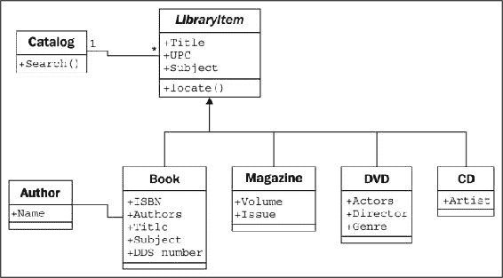
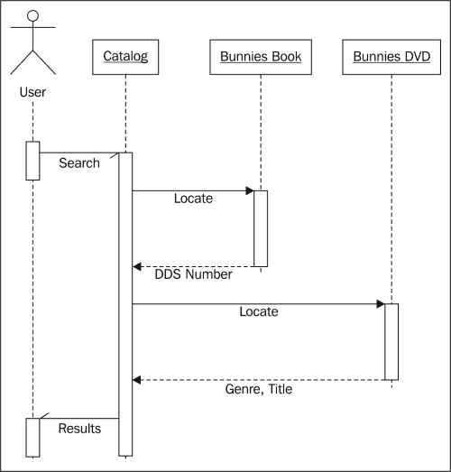

# 二、面向对象设计

在软件开发中，通常将设计视为编程之前的步骤。 这不是真的。 实际上，分析，编程和设计往往会重叠，合并和交织。 在本章中，我们将介绍以下主题：

*   面向对象的含义
*   面向对象设计和面向对象编程之间的区别
*   面向对象设计的基本原理
*   基本的**统一建模语言**（**UML**）以及它不是邪恶的时候

# 引入面向对象

每个人都知道对象是什么—我们可以感知，感觉和操纵的有形事物。 我们与之互动的最早物体通常是婴儿玩具。 木块，塑料形状和超大拼图块是常见的首要对象。 婴儿很快就会知道某些物体会执行某些操作：铃响，按钮按下以及操纵杆拉动。

在软件开发中，对象的定义没有太大不同。 软件对象通常不是您可以拾取，感知或感觉到的有形事物，但是它们是可以执行某些操作并对它们执行某些操作的模型。 形式上，对象是**数据**和关联的**行为**的集合。

那么，知道什么是对象，面向对象的含义是什么？ 定向简单是指将*定向为*。 因此，面向对象意味着在功能上指向建模对象。 这是通过描述交互对象的数据和行为来收集对象的集合，从而为复杂系统建模的众多技术之一。

如果您读过任何炒作，您可能会遇到术语“面向对象的分析”，“面向对象的设计”，“面向对象的分析和设计以及面向对象的编程”。 这些都是在通用的面向对象框架下的高度相关的概念。

实际上，分析，设计和编程都是软件开发的所有阶段。 称它们为面向对象仅指正在追求的软件开发风格。

**面向对象分析**（**OOA**）是查看问题，系统或任务（某人希望将其转变为应用）并识别的过程。 对象以及这些对象之间的交互。 分析阶段全部与*有关，*需要完成什么。

分析阶段的输出是一组需求。 如果我们要一步完成分析阶段，那么我们会将一项任务（例如我需要一个网站）转变为一组需求。 例如：

网站访问者必须能够（*斜体*代表操作，**粗体**代表对象）：

*   *回顾*我们的**历史**
*   *将*应用于**职位**
*   *浏览*，*比较*和*订购产品*

在某些方面，分析是错误的。 我们前面讨论的婴儿不分析积木和拼图。 相反，它将探索其环境，操纵形状并查看它们可能适合的位置。 更好的措辞可能是面向对象的探索。 在软件开发中，分析的初始阶段包括采访客户，研究他们的流程以及消除可能性。

**面向对象设计**（**OOD**）是将此类要求转换为实现规范的过程。 设计人员必须命名对象，定义行为并正式指定哪些对象可以激活其他对象上的特定行为。 设计阶段是关于*如何完成*的。

设计阶段的输出是实现规范。 如果我们要一步一步完成设计阶段，我们将把在面向对象分析过程中定义的需求转换为可以用（理想情况下）任何面向对象编程语言实现的一组类和接口。

**面向对象程序设计**（**OOP**）是将这种完全定义的设计转换成可以执行 CEO 最初要求的工作程序的过程。

是的，对！ 如果世界实现了这一理想，那就太好了，我们可以按照所有旧教科书告诉我们的那样，以完美的顺序一步一步地走过这些阶段。 像往常一样，现实世界更加模糊。 无论我们多么努力地分离这些阶段，我们在设计时总是会发现需要进一步分析的事物。 在进行编程时，我们会发现需要在设计中进行澄清的功能。

二十一世纪的大多数发展都发生在迭代发展模型中。 在迭代开发中，仅对任务的一小部分进行建模，设计和编程，然后对程序进行审查和扩展以改进每个功能，并在一系列短的开发周期中包括新功能。

本模块的其余部分与面向对象编程有关，但是在本章中，我们将介绍设计上下文中的基本面向对象原理。 这使我们能够理解这些（相当简单的）概念，而不必与软件语法或 Python 解释器争论。

# 对象和类

因此，对象是具有相关行为的数据的集合。 我们如何区分对象类型？ 苹果和橘子都是对象，但是这是一句常见的格言，它们无法比较。 苹果和橘子在计算机编程中不是很常用的模型，但让我们假设我们正在为一个水果农场进行库存应用。 为了简化示例，我们可以假设苹果装在桶中，橘子装在篮子中。

现在，我们有四种对象：苹果，橙子，篮子和桶。 在面向对象的建模中，用于*类对象*的术语是**类**。 因此，从技术上讲，我们现在有四类对象。

对象和类之间的有什么区别？ 类描述对象。 它们就像创建对象的蓝图。 您前面的桌子上可能坐着三个橙子。 每个橙子都是一个不同的对象，但是所有三个橙子都具有与一类相关的属性和行为：普通橙子。

可以使用**统一建模语言**（始终称为 **UML**）来描述，这是库存系统中四类对象之间的关系，因为三个字母的首字母缩写永远不会消失 样式）类图。 这是我们的一流图：

该图显示了**橙色**以某种方式与**篮子**关联，并且**苹果**也以某种方式与**桶**关联。 关联是两个类关联的最基本方法。

UML 在管理人员中非常流行，偶尔会被程序员贬低。 UML 图的语法通常很明显。 您无需阅读教程即可（主要）了解看到的内容。 UML 也很容易绘制，并且非常直观。 毕竟，许多人在描述类及其关系时，自然会在它们之间画线并绘制框。 具有基于这些直观图表的标准，可使程序员轻松与设计师，经理和彼此进行沟通。

但是，一些程序员认为 UML 是浪费时间。 他们以迭代开发为例，他们认为，花哨的 UML 图中完成的正式规范在实施之前将是多余的，维护这些正式图只会浪费时间，而不会使任何人受益。

根据所涉及的公司结构，这可能是正确的，也可能不是正确的。 但是，每个由一个以上人员组成的编程团队有时都必须坐下来，逐一讨论当前正在研究的子系统的详细信息。 在这些集思广益的会议中，UML 对于快速，轻松地进行交流非常有用。 即使是那些嘲笑正式类图的组织，也倾向于在他们的设计会议或团队讨论中使用一些非正式的 UML 版本。

此外，您将不得不与之沟通的最重要的人就是您自己。 我们所有人都认为我们可以记住我们所做的设计决策，但是总会有*为什么这样做？* 时刻藏在我们的未来中。 如果我们保留纸屑，就在开始设计时就进行了初步的制图，那么我们最终会发现它们是有用的参考。

但是，本章并不旨在成为 UML 的教程。 Internet 上有许多此类书籍，以及有关该主题的大量书籍。 UML 涵盖的范围远远超过类图和对象图。 它还具有用例，部署，状态更改和活动的语法。 在此面向对象设计的讨论中，我们将处理一些常见的类图语法。 您会发现可以通过示例了解结构，并且可以在自己的团队或个人设计会议中下意识地选择 UML 启发式语法。

我们最初的图虽然正确，但并没有提醒我们苹果在桶中进入或单个苹果可以进入多少桶。它仅告诉我们苹果与桶相关。 类之间的关联通常很明显，不需要进一步解释，但是我们可以选择根据需要添加进一步的说明。

UML 的优点在于，大多数事情都是可选的。 我们只需要在图中指定尽可能多的信息以适合当前情况即可。 在快速的白板会议中，我们可能会在框之间快速画线。 在正式文档中，我们可能会更详细。 对于苹果和木桶，我们可以很确信该关联为：**许多苹果放入一桶**中，但只是为了确保没有人与之混淆，**一个苹果将破坏一桶[**，我们可以增强该图，如下所示：

该图告诉我们，橙子**装在**篮子中，带有一个小箭头，该箭头指示所要装的东西。 它还告诉我们可以在关系两侧的关联中使用的对象的数量。 一个**篮子**可以容纳许多（以 ***** 表示）**橙色**对象。 任何一个**橙色**都可以恰好放入一个**篮子**中。 此数字称为对象的多重性。 您可能还会听到它被描述为基数。 这些实际上是稍微不同的术语。 基数是指集合中项目的实际数量，而多重性则指定该数量可以多小。

我经常忘记多重性在关系的哪一边。 最接近一个类的多样性是可以与关联另一端的中的任何一个对象关联的该类对象的数量。 对于苹果进入桶关联，从左到右读取，**苹果**类的许多实例（即许多**苹果**对象）可以进入任何一个**苹果桶**。 从右向左读取，可以将一个**桶**与任何一个**苹果**关联。

# 指定属性和行为

现在，我们掌握了一些基本的面向对象术语。 对象是可以相互关联的类的实例。 对象实例是具有其自己的数据和行为集的特定对象。 我们面前桌子上的特定橙子被称为是普通橙子的一个实例。 这很简单，但是与每个对象关联的这些数据和行为是什么？

## 数据描述对象

让我们从数据开始。 数据通常代表特定对象的个体特征。 类可以定义该类的所有对象共享的特定特征集。 对于给定的特性，任何特定对象都可以具有不同的数据值。 例如，我们桌上的三个橙子（如果我们还没有吃过）可能各自重量不同。 然后，橙色类可以具有权重**属性**。 Orange 类的所有实例都具有 weight 属性，但是每个 Orange 对此属性都有不同的值。 但是，属性不必唯一。 任何两个橙子的重量相同。 作为一个更现实的示例，代表不同客户的两个对象的“名字”属性可能具有相同的值。

属性通常称为**成员**或**属性**。 一些作者建议这些术语具有不同的含义，通常属性是可设置的，而属性是只读的。 在 Python 中，“只读”的概念毫无意义，因此在本模块中，我们将看到两个术语可以互换使用。 另外，正如我们将在第 5 章，“何时使用面向对象的编程”中讨论的那样，属性关键字在 Python 中对于特定类型的属性具有特殊含义。

在我们的水果清单应用中，果农可能想知道橙子来自哪个果园，何时采摘以及它的重量。 他们可能还想保持每个篮子的存放位置。 苹果可能具有颜色属性，并且桶的尺寸可能会不同。 其中一些属性可能还属于多个类（我们也可能想知道何时摘苹果），但是对于第一个示例，我们仅向类图添加一些不同的属性：

根据设计的详细程度，我们还可以为每个属性指定类型。 属性类型通常是大多数编程语言的标准原语，例如整数，浮点数，字符串，字节或布尔值。 但是，它们也可以表示数据结构，例如列表，树或图形，或者最值得注意的是其他类。 这是设计阶段可以与编程阶段重叠的区域。 一种编程语言中可用的各种原语或对象可能与其他语言中可用的不同。

通常，我们不需要在设计阶段就过度关注数据类型，因为在编程阶段会选择特定于实现的细节。 通用名称通常足以进行设计。 如果我们的设计需要列表容器类型，则 Java 程序员可以在实现时选择使用`LinkedList`或`ArrayList`，而 Python 程序员（就是我们！）可以在`list`内置和[ 一个`tuple`。

到目前为止，在我们的水果农场示例中，我们的属性都是基本的基本元素。 但是，我们可以使一些隐式属性成为显式属性-关联。 对于给定的橙色，我们可能具有一个属性，其中包含保存该橙色的购物篮。

## 行为就是行动

现在，我们知道什么是数据，但是什么是行为？ 行为是可能在对象上发生的动作。 可以在特定类别的对象上执行的行为称为**方法**。 在编程级别，方法类似于结构化编程中的函数，但是它们神奇地可以访问与此对象关联的所有数据。 像函数一样，方法也可以接受**参数**并返回**值**。

方法的参数是对象的列表，需要将**传递给**并传递给被调用的方法（从调用对象传递来的对象通常称为**自变量**）。 方法使用这些对象来执行其打算执行的任何行为或任务。 返回的值是该任务的结果。

我们已经将“比较苹果和橘子”的例子扩展到一个基本的（如果牵强）清单应用中。 让我们进一步伸展一下，看看它是否破裂。 可以将与橙色关联的一种动作是**选择**动作。 如果您考虑实现，则**选择**会通过更新橙色的**篮子**属性，并将该橙色添加到**桔子**列表中，将橙色放入篮子中 在**篮子**上。 因此，**选秀权**需要知道它正在处理哪个篮筐。 为此，我们为**选择**方法提供了**篮子**参数。 由于我们的水果农也出售果汁，因此我们可以在**橙**中添加**挤压**方法。 挤压时，**挤压**可能会返回取回的果汁量，同时还从其中的**篮子**中取出**橙色**。

**篮子**可以有**卖出**动作。 当篮子被出售后，我们的库存系统可能会更新尚未指定的对象上的某些数据，以进行会计和利润计算。 另外，我们的橙子篮子在出售之前可能会变质，因此我们添加了**丢弃**方法。 让我们将这些方法添加到图中：

将模型和方法添加到单个对象可以使我们创建交互对象的**系统**。 系统中的每个对象都是某个类的成员。 这些类指定对象可以保存哪些数据类型以及可以在对象上调用哪些方法。 每个对象中的数据可以处于与同一类的其他对象不同的状态，并且由于状态不同，每个对象对方法调用的反应也可能不同。

面向对象的分析和设计都是关于弄清楚那些对象是什么以及它们应该如何交互。 下一节将介绍可用于使这些交互尽可能简单直观的原理。

# 隐藏详细信息并创建公共界面

在面向对象的设计中对对象建模的关键的目的是确定该对象的公共**接口**是什么。 接口是其他对象可以用来与该对象进行交互的属性和方法的集合。 它们不需要（通常也不允许）访问对象的内部工作原理。 电视是现实世界中常见的示例。 我们与电视的接口是遥控器。 遥控器上的每个按钮代表一种可以在电视对象上调用的方法。 当我们作为调用对象访问这些方法时，我们不知道或不在乎电视是从天线，电缆连接还是卫星天线接收信号。 我们不在乎发送什么电子信号来调节音量，也不管声音是发给扬声器还是耳机。 如果我们打开电视来访问内部工作原理（例如，将输出信号分配到外部扬声器和一组耳机），将使保修无效。

隐藏对象的实现或功能性详细信息的处理适当地称为**信息隐藏**。 有时也将其称为**封装**，但是封装实际上是一个更全面的术语。 封装的数据不一定是隐藏的。 封装实际上就是创建一个胶囊，因此可以考虑创建一个时间胶囊。 如果将一堆信息放入时间囊中，将其锁定并掩埋，则它们将被封装并且信息将被隐藏。 另一方面，如果时间胶囊没有被掩埋并被解锁或由透明塑料制成，则其内部的物品仍将被封装，但是不会隐藏任何信息。

封装与信息隐藏之间的区别在很大程度上无关紧要，尤其是在设计级别上。 许多实用参考文献可互换使用这些术语。 作为 Python 程序员，我们实际上并没有隐藏真正的信息，（我们将在第 2 章和 *Python 中的对象*中讨论其原因），因此更笼统的定义是 用于封装是合适的。

但是，公共接口非常重要。 需要对其进行仔细设计，因为将来很难对其进行更改。 更改接口将破坏正在调用该接口的所有客户端对象。 我们可以更改我们喜欢的所有内部结构，例如使其更有效，或者通过网络以及本地访问数据，并且客户端对象仍可以使用公共接口与其进行对话，而无需进行修改。 另一方面，如果我们通过更改公共访问的属性名称或通过更改方法可以接受的参数的顺序或类型来更改接口，则也必须修改所有客户端对象。 在讨论公共接口时，请保持简单。 始终根据对象的易用性（而不是编码的难度）来设计对象的界面（此建议也适用于用户界面）。

请记住，程序对象可能代表真实的对象，但是并不能使它们成为真实的对象。 他们是模特。 建模最大的天赋之一就是能够忽略无关的细节。 我小时候建造的模型车看起来像是一辆 1956 年的雷鸟，但它没有运转，并且传动轴也没有转动。 在我开始开车之前，这些细节过于复杂且无关紧要。 该模型是真实概念的**抽象**。

**抽象**是另一个与封装和信息隐藏有关的面向对象的概念。 简而言之，抽象意味着处理最适合给定任务的细节级别。 这是从内部细节中提取公共接口的过程。 汽车驾驶员需要与转向，油门踏板和制动器互动。 电动机，传动系统和制动子系统的工作对驾驶员而言无关紧要。 另一方面，机械师则在不同的抽象水平上工作，调整引擎并释放刹车。 这是汽车的两个抽象级别的示例：

现在，我们有几个新术语引用了相似的概念。 将所有这些术语概括为两句话：抽象是使用独立的公共接口和私有接口封装信息的过程。 专用接口可能会隐藏信息。

从所有这些定义中吸取的重要教训是，使我们的模型对于其他必须与之交互的对象而言是可以理解的。 这意味着会细心注意细节。 确保方法和属性的名称合理。 分析系统时，对象通常代表原始问题中的名词，而方法通常是动词。 属性通常可以用作形容词，尽管如果属性引用的是当前对象一部分的另一个对象，则它仍可能是名词。 相应地命名类，属性和方法。

不要尝试对*将来可能有用的对象或动作建模。 对系统需要执行的那些任务进行精确建模，并且设计自然会倾向于具有适当抽象级别的任务。 这并不是说我们不应该考虑将来可能进行的设计修改。 我们的设计应该是开放式的，以便可以满足将来的要求。 但是，在抽象接口时，请尝试完全建模需要建模的对象，仅此而已。*

设计界面时，请尝试将自己放在对象的鞋子中，并想象该对象对隐私具有强烈的偏好。 除非您认为拥有它们符合您的最大利益，否则不要让其他对象访问有关您的数据。 除非确定您希望他们能够对您执行此操作，否则不要给他们一个界面来强迫您执行特定任务。

# 组成

到目前为止，我们学会了将系统设计为一组交互对象，其中每个交互都涉及在适当的抽象级别上查看对象。 但是我们还不知道如何创建这些抽象级别。 有多种方法可以做到这一点。 但是，即使大多数设计模式都依赖于两种基本的面向对象的原理，即**组成**和**继承**。 合成比较简单，因此让我们开始吧。

合成是将多个对象收集在一起以创建一个新对象的行为。 当一个对象是另一对象的一部分时，合成通常是一个不错的选择。 在机械示例中，我们已经看到了构图的第一个提示。 汽车由发动机，变速器，起动机，前大灯和挡风玻璃以及许多其他部分组成。 发动机又由活塞，曲轴和气门组成。 在此示例中，组合是提供抽象级别的好方法。 汽车对象可以提供驾驶员所需的界面，同时还可以访问其组成部分，从而提供了适合技工的更深层次的抽象。 如果技工需要更多信息来诊断问题或调整发动机，则这些零件当然可以进一步分解。

这是组成的常见入门示例，但在设计计算机系统时并不太有用。 物理对象很容易分解为组件对象。 至少从古希腊人最初假设原子是物质的最小单位开始，人们就开始这样做了（当然，他们没有机会使用粒子加速器）。 计算机系统通常不如物理对象复杂，但是在这种系统中识别组件对象并不是自然而然的事情。

面向对象系统中的对象有时代表物理对象，例如人，书或电话。 但是，它们更多时候代表抽象的想法。 人们有名字，书有书名，电话是用来打电话的。 呼叫，标题，帐户，名称，约会和付款通常不被视为物理世界中的对象，但它们都是计算机系统中经常建模的组件。

让我们尝试建模一个更加面向计算机的示例，以查看实际的合成。 我们将研究计算机化的国际象棋游戏的设计。 在 80 年代和 90 年代，这是一种非常流行的消遣方式。 人们预言，计算机将有一天能够击败人类的国际象棋大师。 当这种情况在 1997 年发生（IBM 的深蓝击败世界象棋冠军加里·卡斯帕罗夫）时，尽管在计算机和人类象棋玩家之间仍存在竞争，对这个问题的兴趣却减弱了。 （计算机通常会赢。）

作为基本的高级分析，使用棋盘组在 8 X 8 网格中包含 64 个位置，在两个玩家之间进行棋盘游戏。 棋盘可以有两组可移动的十六块棋子，由两个玩家以不同的方式交替交替进行。 每块可以取其他块。 每次转动后，将要求该板在计算机屏幕上进行绘制。

我已经使用*斜体*标识了描述中的某些可能对象，并使用了**粗体**标识了一些关键方法。 这是将面向对象的分析转变为设计的第一步。 在这一点上，为了强调构图，我们将专注于董事会，而不必过多担心球员或不同类型的棋子。

让我们从尽可能高的抽象水平开始。 我们有两个玩家轮流做出动作，与国际象棋互动：

这是什么？ 它看起来不太像我们以前的类图。 那是因为它不是一个类图！ 这是和**对象图**，也称为实例图。 它描述了处于特定时间状态的系统，并描述了对象的特定实例，而不是类之间的交互。 记住，两个玩家都是同一个班级的成员，因此班级图看起来有些不同：

该图显示，恰好有两个玩家可以与一个国际象棋互动。 这也表明任何一位玩家一次只能玩一副国际象棋。

但是，我们讨论的不是 UML 的组成，因此让我们考虑一下**国际象棋集合**的组成。 我们目前不在乎玩家的组成。 我们可以假设玩家具有心脏和大脑以及其他器官，但是这些与我们的模型无关。 确实，没有什么能阻止所说的球员成为深蓝的人，既没有心脏也没有大脑。

这样，国际象棋的集合由一个棋盘和 32 个棋子组成。 董事会还包括 64 个职位。 您可能会争辩说棋子不是国际象棋集合的一部分，因为您可以用另一组棋子替换国际象棋集合中的棋子。 尽管在计算机化的国际象棋版本中这不太可能或不可能，但它为我们介绍了**聚合**。

聚合几乎完全像一样。 区别在于聚合对象可以独立存在。 一个职位不可能与另一个棋盘相关联，因此我们说棋盘是由职位组成的。 但是据说这些棋子可能独立于国际象棋棋盘而存在，但据说与该棋盘存在着总体关系。

区分聚集和组成的另一种方法是考虑对象的寿命。 如果复合（外部）对象控制何时（HTG0）创建和销毁相关（内部）对象，则最适合使用合成。 如果相关对象是独立于复合对象创建的，或者可以使该对象持久存在，则聚合关系更有意义。 另外，请记住，组成是聚合。 聚集只是组合的一种更一般的形式。 任何复合关系也是一种聚合关系，但反之亦然。

让我们描述当前的国际象棋集合组成，并向对象添加一些属性以保持复合关系：

组成关系在 UML 中表示为实心菱形。 空心菱形代表总体关系。 您会注意到，棋盘和棋子是作为国际象棋集合的一部分存储的，与对它们的引用作为属性存储在国际象棋集合上的完全相同。 这再次表明，在实践中，一旦超过设计阶段，聚集和组成之间的区别通常就不重要了。 实施后，它们的行为几乎相同。 但是，当您的团队讨论不同对象如何交互时，它可以帮助区分两者。 通常，您可以将它们视为同一事物，但是当您需要区分它们时，很高兴知道它们之间的区别（这是工作中的抽象）。

# 继承

我们讨论了对象之间的三种关系类型：关联，组合和聚合。 但是，我们尚未完全指定我们的国际象棋，并且这些工具似乎没有提供我们所需的全部功能。 我们讨论了玩家可能是人类还是可能是具有人工智能功能的软件的可能性。 似乎说玩家是*与人相关联的*，或者说人工智能实现是玩家对象*的*的一部分，这似乎是不对的。 我们真正需要的是能够说“深蓝*是*播放器”或“加里·卡斯帕罗夫*是*播放器”的能力。**

*是通过**继承**形成的*关系。 继承是面向对象程序设计中最著名，最著名和过度使用的关系。 继承有点像家谱。 我祖父的姓氏是 Phillips ，父亲继承了这个名字。 我从他那里继承了它（还有蓝色的眼睛和对写作的爱好）。 在面向对象的编程中，一个类可以从另一个类继承属性和方法，而不是从一个人继承特征和行为。

例如，我们的国际象棋中有 32 个棋子，但是只有六种不同类型的棋子（棋子，车子，主教，骑士，国王和王后），每一种棋子在移动时的行为都不同。 所有这些类别的棋子都具有属性，例如颜色和它们所属的棋盘，但是在棋盘上绘制时它们也具有独特的形状，并且可以进行不同的移动。 让我们看看如何从 **Piece** 类继承六种类型的片断：

空心箭头表示各个类别的碎片均继承自**碎片**类别。 所有子类型都自动具有从基类继承的**国际象棋集**和**颜色**属性。 每一块都提供不同的形状属性（在渲染板时在屏幕上绘制），并且每转一圈都有不同的**移动**方法将其移动到板上的新位置。

实际上，我们知道 **Piece** 类的所有子类都需要具有 **move** 方法。 否则，当木板试图移动一块时，就会感到困惑。 我们可能想创建一个新版本的国际象棋游戏，其中又增加了一块（向导）。 我们当前的设计允许我们在不使用 **move** 方法的情况下设计该作品。 当董事会要求棋子移动时，棋盘就会窒息。

我们可以通过在 **Piece** 类上创建一个伪移动方法来实现这一点。 然后，子类可以使用更具体的实现来**覆盖**此方法。 例如，默认实现可能会弹出一条错误消息：**该部件无法移动**。

子类型中的重写方法允许开发非常强大的面向对象的系统。 例如，如果我们想用人工智能实现一个玩家类，我们可以提供一个`calculate_move`方法，该方法采用 **Board** 对象并决定将哪一块移动到哪里。 一个非常基础的班级可能会随机选择一个片段和一个方向并相应地移动它。 然后，我们可以使用 Deep Blue 实现在子类中重写此方法。 头等舱适合与未加工的初学者对抗，后者将挑战大师级。 重要的是，该类中的其他方法（例如，通知董事会有关选择了哪个动作的方法）无需更改； 该实现可以在两个类之间共享。

对于国际象棋棋子，提供 move 方法的默认实现实际上没有任何意义。 我们需要做的就是指定所有子类都需要 move 方法。 这可以通过使用声明为**抽象**的 move 方法使 **Piece** 成为**抽象类**来实现。 抽象方法基本上说：“我们要求此方法存在于任何非抽象子类中，但我们拒绝在此类中指定实现。”

实际上，可以创建一个根本不实现任何方法的类。 这样的课程只会告诉我们该课程应该做什么，但绝对不提供有关如何操作的建议。 在面向对象的说法中，此类称为**接口**。

## 继承提供抽象

让我们探讨面向对象的 Argot 中最长的单词。 **多态性**是根据实现的子类来区别对待类的能力。 我们已经在所描述的 Pieces 系统中看到了。 如果进一步进行设计，我们可能会看到**开发板**对象可以接受来自播放器的移动，并在该棋子上调用**移动**功能。 董事会不必知道要处理的是哪种类型。 它所要做的只是调用 **move** 方法，适当的子类将把它作为 **Knight** 或 **Pawn** 来处理。

多态性很酷，但是这个词在 Python 编程中很少使用。 Python 超越了一个额外的步骤，允许将对象的子类视为父类。 用 Python 实现的板可以采用具有**移动**方法的任何对象，无论是主教块，汽车还是鸭子。 当**移动**时，**Bishop** 将在板上沿对角线移动，汽车将行驶到某个位置，而鸭子将根据其心情游泳或飞行。

Python 中这种类型的多态性通常称为**鸭子键入**：“如果它走路像鸭子一样游泳，或者像鸭子一样游泳，那就是鸭子”。 我们不在乎它是否真的是*是*鸭（继承），只是它会游泳或走路。 鹅和天鹅可能很容易提供我们想要的鸭子般的行为。 这使未来的设计人员可以创建新的鸟类类型，而无需实际指定水生鸟类的继承层次。 它还使他们能够创建完全不同于原始设计人员计划的插入行为。 例如，未来的设计师可能能够制作出具有相同界面的步行游泳企鹅，而不会暗示企鹅是鸭子。

## 多重继承

当我们想到我们自己的家族树中的继承时，我们可以看到我们从多个父母那里继承了特征。 当陌生人告诉一个骄傲的母亲她的儿子有“他的父亲的眼睛”时，她通常会回答“是的，但他让我流鼻涕”。

面向对象的设计还可以具有**多重继承**的功能，它允许子类从多个父类继承功能。 实际上，多重继承可能是一件棘手的事情，并且某些编程语言（最著名的是 Java）严格禁止这样做。 但是，多重继承可以有其用途。 通常，它可用于创建具有两组不同行为的对象。 例如，可以通过从两个单独的`scanner`和`faxer`对象继承来创建旨在连接到扫描仪并发送扫描文档传真的对象。

只要两个类具有不同的接口，子类从这两个类继承通常不会有害。 但是，如果我们从提供重叠接口的两个类继承，则会变得混乱。 例如，如果我们有一个具有`move`方法的摩托车类，并且也具有`move`方法的船类，并且想要将它们合并到最终的两栖车辆中，那么所得的类如何知道该怎么做 当我们叫`move`时？ 在设计级别，需要对此进行解释，在实现级别，每种编程语言都有不同的方式来决定调用哪个父类的方法或以什么顺序进行调用。

通常，处理它的最好方法是避免它。 如果您的设计如此显示，则可能是*做错了。 退后一步，再次分析系统，看看是否可以删除多继承关系，而采用其他关联或复合设计。*

继承是扩展行为的强大工具。 与早期的范例相比，它也是面向对象设计最可销售的进步之一。 因此，它通常是面向对象的程序员所追求的第一个工具。 但是，重要的是要认识到，拥有锤子不会将螺钉变成钉子。 继承是完美的解决方案，因为显然*是*关系，但是可以滥用。 程序员经常使用继承在两种对象之间共享代码，而这两种对象之间只有很远的关系，而*与*的关系就不存在了。 尽管这不一定是一个糟糕的设计，但它是一个极好的机会，询问他们为什么决定以这种方式设计，以及使用其他关系或设计模式是否更合适。

# 案例研究

让我们通过在一个真实世界的示例上进行几次面向对象设计的迭代，将的所有新的面向对象知识结合在一起。 我们将要建模的系统是一个图书馆目录。 几个世纪以来，图书馆一直在追踪其库存，最初使用的是卡片目录，最近使用的是电子清单。 现代图书馆有基于网络的目录，我们可以在家里查询。

让我们从分析开始。 当地的图书管理员要求我们编写一个新的卡片目录程序，因为他们古老的基于 DOS 的程序丑陋且已过时。 这不会给我们太多的细节，但是在我们开始寻求更多信息之前，让我们考虑一下我们已经了解的关于库目录的知识。

目录包含书籍清单。 人们搜索它们以查找具有特定标题或特定作者的某些主题的书籍。 可以通过**国际标准书号**（**ISBN**）来唯一标识书籍。 每个模块都有一个**杜威十进制系统**（**DDS**）编号，以帮助您在特定的机架上找到它。

这个简单的分析告诉我们系统中一些明显的对象。 我们迅速将**图书**识别为最重要的对象，并已经提到了几个属性，例如作者，书名，主题，ISBN 和 DDS 编号，以及目录是图书的管理者。

我们还注意到可能需要或不需要在系统中建模的其他一些对象。 为了进行分类，我们需要按作者搜索模块的就是模块上的`author_name`属性。 但是，作者也是对象，我们可能要存储有关作者的其他数据。 在思考这一点时，我们可能还记得有些书有多位作者。 突然之间，在对象上具有单个`author_name`属性的想法似乎有些愚蠢。 与每个模块相关的作者列表显然是一个更好的主意。

作者和模块之间的关系显然是关联的，因为您永远不会说“模块是作者”（这不是继承），并且说“模块有作者”，尽管在语法上是正确的，但这并不意味着作者是其中的一部分 书（不是汇总）。 实际上，任何一位作者可能与多本书相关联。

我们还应注意名词（名词总是对象的良好候选者）*架子*。 架子是需要在编目系统中建模的对象吗？ 我们如何识别单个架子？ 如果某个模块存储在一个架子的末尾，然后又由于在上一个架子中插入了另一个模块而又移到下一个架子的开头，会发生什么情况？

DDS 旨在帮助在图书馆中查找实体书籍。 因此，与模块一起存储 DDS 属性应该足以找到它，而不管它存储在哪个架子上。 因此，至少在目前，我们可以从竞争对象列表中删除货架。

系统中的另一个可疑对象是用户。 我们是否需要了解有关特定用户的任何信息，例如其名称，地址或过期书籍列表？ 到目前为止，图书馆员只告诉我们他们想要目录。 他们对跟踪订阅或过期通知一无所知。 在我们的内心深处，我们还注意到作者和用户都是特定的人。 将来可能会有有用的继承关系。

为了进行分类，我们决定暂时不需要识别用户。 我们可以假设用户将搜索目录，但是除了提供一个允许他们搜索的界面之外，我们不必在系统中对其进行建模。

我们已经在模块上确定了一些属性，但是目录具有哪些属性？ 有没有一个图书馆有多个目录？ 我们需要唯一地标识它们吗？ 显然，目录必须以某种方式包含其中包含的书籍的集合，但是此列表可能不是，也不是公共接口的一部分。

行为呢？ 目录显然需要一种搜索​​方法，可能需要针对作者，标题和主题的搜索方法。 书上有行为吗？ 需要预览方法吗？ 还是可以通过首页属性而不是方法来标识预览？

前面讨论中的问题都是面向对象分析阶段的一部分。 但是与这些问题混杂在一起，我们已经确定了设计中的一些关键对象。 确实，您刚刚看到的是分析和设计之间的一些微迭代。

这些迭代很可能都在与图书馆员的初次会面中发生。 但是，在这次会议之前，我们已经可以为我们具体确定的对象设计出最基本的设计：

有了这个基本图表和一支铅笔来进行交互式改进，我们与图书馆员会面。 他们告诉我们，这是一个好的开始，但是图书馆不仅提供书籍，还提供 DVD，杂志和 CD，而这些书都没有 ISBN 或 DDS 编号。 但是，所有这些类型的项目都可以通过 UPC 编号唯一标识。 我们提醒馆员，他们必须在架子上找到物品，而这些物品可能不是 UPC 整理的。 馆员解释说，每种类型的组织方式都不同。 CD 大多是有声读物，库存只有几十张，因此按作者的姓氏组织。 DVD 分为各种类型，并按标题进一步组织。 杂志按标题分类，然后按卷数和发行号进行细化。 正如我们猜想的那样，书籍是按 DDS 编号整理的。

没有以前的面向对象设计经验，我们可能会考虑将 DVD，CD，杂志和书籍的单独列表添加到我们的目录中，然后依次搜索每个列表。 麻烦的是，除了某些扩展属性之外，并标识项目的物理位置，这些项目的行为都一样。 这是继承的工作！ 我们快速更新我们的 UML 图：

图书馆员理解我们的示意图的要点，但对**定位**功能有些困惑。 我们使用一个特定的用例来解释，其中用户正在搜索单词“ bunnies”。 用户首先将搜索请求发送到目录。 目录查询其内部项目列表，并找到标题中带有“ bunnies”的模块和 DVD。 此时，目录并不关心目录中是否装有 DVD，模块，CD 或杂志。 就目录而言，所有项目都是相同的。 但是，用户想知道如何查找实际项目，因此如果仅返回标题列表，则该目录将被删除。 因此，它在已发现的两个项目上调用**定位**方法。 模块的**定位**方法返回一个 DDS 编号，该编号可用于查找容纳模块的架子。 通过返回 DVD 的类型和标题来定位 DVD。 然后，用户可以访问 DVD 部分，找到包含该类型的部分，并找到按标题排序的特定 DVD。

正如我们所解释的，我们绘制了一个 UML **序列图**的示意图，解释了各种对象如何通信：

其中，类图描述了类之间的关系，而序列图描述了对象之间传递的特定消息序列。 悬挂在每个对象上的虚线是**生命线**，用于描述对象的生存期。 每条生命线上的较宽方框表示该对象中的活动处理（没有方框的情况下，该对象基本上处于空闲状态，等待发生的事情）。 生命线之间的水平箭头表示特定的消息。 实线箭头表示被调用的方法，而带实心头的虚线箭头表示方法的返回值。

半箭头指示发送到对象或从对象发送的异步消息。 异步消息通常意味着第一个对象在第二个对象上调用一个方法，该方法立即返回。 经过一些处理后，第二个对象在第一个对象上调用一个方法来为其赋予一个值。 这与常规方法调用形成对照，后者在方法中进行处理并立即返回一个值。

像所有 UML 图一样，序列图最好仅在需要时使用。 为了绘制图表，在中绘制 UML 图毫无意义。 但是，当您需要在两个对象之间进行一系列交互时，顺序图是一个非常有用的工具。

不幸的是，到目前为止，我们的类图仍然是一个混乱的设计。 我们注意到 DVD 上的演员和 CD 上的艺术家都是各种类型的人，但是与模块作者的待遇不同。 馆员还提醒我们，它们的大多数 CD 是有声读物，有作者而不是艺术家。

我们如何与交往促成头衔的各种人士？ 一个明显的实现是使用人物的姓名和其他相关细节创建一个`Person`类，然后为艺术家，作家和演员创建该子类。 但是，在这里继承真的必要吗？ 出于搜索和分类目的，我们并不在乎表演和写作是两个截然不同的活动。 如果我们正在进行经济模拟，则可以给定演员和作者类，以及不同的`calculate_income`和`perform_job`方法，这很有意义，但是出于分类目的，知道这个人如何对物品做出贡献可能就足够了。 我们认识到所有项目都有一个或多个`Contributor`对象，因此我们将作者关系从模块移至其父类：

**贡献者** / **LibraryItem** 关系的多重性是**多对多**，如两端的 ***** 字符所示 关系。 任何一个图书馆项目都可能有多个贡献者（例如，DVD 中的几个演员和一个导演）。 许多作者写了许多书，因此它们会附加到多个图书馆项目中。

尽管的微小更改看上去更简洁，更简单，但是却丢失了一些重要信息。 我们仍然可以确定是谁为特定库项目做出了贡献，但是我们不知道他们是如何做出贡献的。 他们是导演还是演员？ 他们是写音频模块，还是为模块叙述的声音？

如果我们只需在**贡献者**类上添加`contributor_type`属性，那将是很好的选择，但是在与既创作书籍又执导电影的多才多艺的人打交道时，这种方法将分崩离析。

一种选择是向每个 **LibraryItem** 子类添加属性，以保存我们所需的信息，例如**图书**上的**作者**或 **Artist** ]放在 **CD** 上，然后使与这些属性的关系都指向 **Contributor** 类。 问题在于，我们失去了很多多态的优雅。 如果要列出某个项目的贡献者，则必须寻找该项目的特定属性，例如**作者**或 **Actors**。 我们可以通过在子类可以覆盖的 **LibraryItem** 类上添加 **GetContributors** 方法来缓解这种情况。 这样，目录就不必知道对象正在查询什么属性。 我们已经抽象了公共接口：

仅查看这个类图，就好像我们在做错什么。 它又大又脆弱。 它可以满足我们的所有需求，但感觉很难维护或扩展。 关系太多，修改任何一个类别都会影响太多的类别。 看起来像意大利面条和肉丸。

现在，我们已经探讨了将继承作为一种选择，并发现了它的需要，我们可以回顾一下以前的基于组合的图表，其中**贡献者**直接附加到 **LibraryItem** 上。 经过一番思考，我们可以看到我们实际上只需要向一个全新的类添加一个关系即可确定贡献者的类型。 这是面向对象设计中的重要一步。 现在，我们在设计中添加了一个类，该类旨在*支持*其他对象，而不是对初始需求的任何部分进行建模。 我们正在**重构**设计，以简化系统中的对象，而不是现实生活中的对象。 重构是程序或设计维护中必不可少的过程。 重构的目的是通过移动代码，删除重复的代码或复杂的关系来改进设计，以支持更简单，更优雅的设计。

这个新的类由**贡献者**和一个额外的属性组成，该属性标识人员对给定的 **LibraryItem** 做出的贡献的类型。 一个特定的 **LibraryItem** 可以有很多这样的贡献，并且一个贡献者可以以相同的方式为不同的条目做出贡献。 该图很好地传达了这种设计：

首先，这种组合关系看起来不如基于继承的关系自然。 但是，它的优点是允许我们添加新的贡献类型而无需在设计中添加新的类。 当子类具有某种专长时，继承最有用。 专业化是在子类上创建或更改属性或行为，以使其与父类有所不同。 创建一堆只用于识别不同类型对象的空类似乎很愚蠢（这种态度在 Java 和其他“一切都是对象”程序员中并不普遍，但在更实际的 Python 设计人员中很常见）。 如果我们看一下图的继承版本，我们可以看到一堆实际上不做任何事情的子类：

有时，识别何时不使用面向对象的原理很重要。 这个何时不使用继承的示例很好地提醒了对象只是工具，而不是规则。

