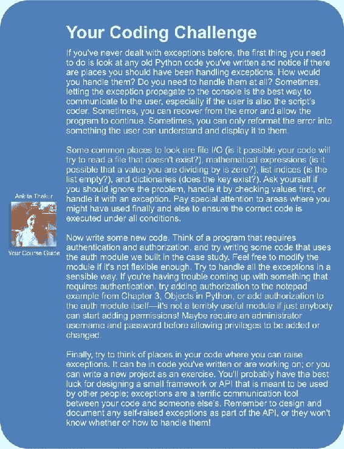
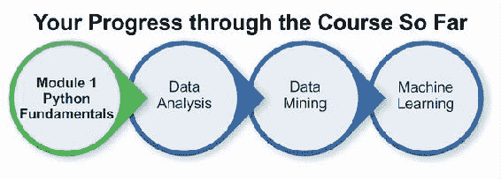

# 第 5 章。期待意外

程序非常脆弱。 如果代码始终返回有效结果，但是有时无法计算出有效结果，那将是理想的选择。 例如，不可能用零除或访问五项列表中的第八项。

在过去，解决此问题的唯一方法是严格检查每个功能的输入以确保它们有意义。 通常，函数具有特殊的返回值以指示错误情况。 例如，他们可以返回负数以表示无法计算正值。 不同的数字可能意味着发生了不同的错误。 任何调用此函数的代码都必须明确检查错误情况并采取相应措施。 很多代码都没有去做，程序只是崩溃了。 但是，在面向对象的世界中，情况并非如此。

在本章中，我们将研究**异常**，这些特殊错误对象仅在有意义的情况下才需要处理。 特别是，我们将介绍：

*   如何导致异常发生
*   发生异常时如何恢复
*   如何以不同方式处理不同的异常类型
*   发生异常时进行清理
*   创建新的异常类型
*   使用异常语法进行流控制

# 引发异常

原则上，异常只是一个对象。 有许多不同的异常类可用，我们可以轻松定义更多自己的异常类。 它们共有的一件事是它们从称为`BaseException`的内置类继承。 这些异常对象在程序的控制流中处理时会变得特殊。 当发生异常时，原本应该发生的一切都不会发生，除非在发生异常时原本应该发生。 有道理？ 不用担心，它将！

导致异常发生的最简单方法是做一些愚蠢的事情！ 您可能已经完成了此操作，并看到了异常输出。 例如，任何时候 Python 在程序中遇到它无法理解的行时，它都会以`SyntaxError`保释，这是一种异常。 这是一个常见的例子：

```pypy
>>> print "hello world"
 File "<stdin>", line 1
 print "hello world"
 ^
SyntaxError: invalid syntax

```

该`print`语句在 Python 2 和早期版本中是有效的命令，但是在 Python 3 中，因为`print`现在是一个函数，所以必须将参数括在括号中。 因此，如果将前面的命令键入 Python 3 解释器，则会得到`SyntaxError`。

除了`SyntaxError`以外，以下示例还显示了我们可以处理的其他一些常见异常：

```pypy
>>> x = 5 / 0
Traceback (most recent call last):
 File "<stdin>", line 1, in <module>
ZeroDivisionError: int division or modulo by zero

>>> lst = [1,2,3]
>>> print(lst[3])
Traceback (most recent call last):
 File "<stdin>", line 1, in <module>
IndexError: list index out of range

>>> lst + 2
Traceback (most recent call last):
 File "<stdin>", line 1, in <module>
TypeError: can only concatenate list (not "int") to list

>>> lst.add
Traceback (most recent call last):
 File "<stdin>", line 1, in <module>
AttributeError: 'list' object has no attribute 'add'

>>> d = {'a': 'hello'}
>>> d['b']
Traceback (most recent call last):
 File "<stdin>", line 1, in <module>
KeyError: 'b'

>>> print(this_is_not_a_var)
Traceback (most recent call last):
 File "<stdin>", line 1, in <module>
NameError: name 'this_is_not_a_var' is not defined

```

有时，这些异常表明我们的程序有问题（在这种情况下，我们将转到指定的行号并进行修复），但在合法情况下也会发生。 `ZeroDivisionError`并不总是表示我们收到了无效的输入。 这也可能意味着我们收到了不同的意见。 用户可能错误或故意输入了零，也可能代表合法值，例如空银行帐户或新生婴儿的年龄。

您可能已经注意到前面所有内置的异常都以名称`Error`结尾。 在 Python 中，`error`和`exception`这两个词几乎可以互换使用。 有时错误被认为比异常更为可怕，但是它们的处理方式完全相同。 实际上，前面示例中的所有错误类都将`Exception`（扩展了`BaseException`）作为其超类。

## 引发异常

我们将在一分钟内处理异常，但首先，让我们发现如果我们正在编写一个需要通知用户或调用函数某些输入无效的程序，该怎么办。 如果我们可以使用 Python 使用的相同机制，那不是很好吗？ 好吧，我们可以！ 这是一个简单的类，仅当项目为偶数整数时才将其添加到列表中：

```pypy
class EvenOnly(list):
    def append(self, integer):
        if not isinstance(integer, int):
            raise TypeError("Only integers can be added")
        if integer % 2:
            raise ValueError("Only even numbers can be added")
        super().append(integer)
```

此类扩展了内置的`list`，正如我们在第 2 章，“Python 中的对象”中所讨论的那样，并重写了`append`方法以检查两个条件来确保 该项目是一个偶数整数。 我们首先检查输入是否为`int`类型的实例，然后使用模运算符确保将其除以 2。 如果两个条件中的任何一个都不满足，则`raise`关键字将导致发生异常。 `raise`关键字后面紧跟着引发异常的对象。 在前面的示例中，从内置类`TypeError`和`ValueError`重新构造了两个对象。 引发的对象可以很容易地成为我们自己创建的新异常类的实例（很快就会看到），在其他地方定义的异常，甚至是先前已经引发和处理的异常对象。 如果我们在 Python 解释器中测试该类，我们可以看到发生异常时，它正在输出有用的错误信息，就像以前一样：

```pypy
>>> e = EvenOnly()
>>> e.append("a string")
Traceback (most recent call last):
 File "<stdin>", line 1, in <module>
 File "even_integers.py", line 7, in add
 raise TypeError("Only integers can be added")
TypeError: Only integers can be added

>>> e.append(3)
Traceback (most recent call last):
 File "<stdin>", line 1, in <module>
 File "even_integers.py", line 9, in add
 raise ValueError("Only even numbers can be added")
ValueError: Only even numbers can be added
>>> e.append(2)

```

### 注意

虽然此类对于演示实际发生的异常非常有效，但它的工作并不是很好。 仍然可以使用索引符号或切片符号将其他值添加到列表中。 可以通过重写其他适当的方法来避免这些问题，其中一些方法是双下划线方法。

## 异常的影响

引发异常时，它似乎立即停止程序执行。 引发异常后应该运行的任何行都不会执行，并且除非处理了异常，否则程序将退出并显示一条错误消息。 看一下这个简单的函数：

```pypy
def no_return():
    print("I am about to raise an exception")
    raise Exception("This is always raised")
    print("This line will never execute")
    return "I won't be returned"
```

如果执行此函数，则会看到第一个`print`调用已执行，然后引发了异常。 第二条`print`语句永远不会执行，`return`语句也永远不会执行：

```pypy
>>> no_return()
I am about to raise an exception
Traceback (most recent call last):
 File "<stdin>", line 1, in <module>
 File "exception_quits.py", line 3, in no_return
 raise Exception("This is always raised")
Exception: This is always raised

```

此外，如果我们有一个函数调用另一个引发异常的函数，则在调用第二个函数的位置之后，第一个函数将不执行任何操作。 引发异常将停止所有通过函数调用堆栈执行的操作，直到该异常被处理或迫使解释器退出为止。 为了演示，让我们添加第二个函数来调用较早的函数：

```pypy
def call_exceptor():
    print("call_exceptor starts here...")
    no_return()
    print("an exception was raised...")
    print("...so these lines don't run")
```

当我们调用此函数时，我们看到第一个`print`语句以及`no_return`函数的第一行都被执行。 但是，一旦引发异常，便不会执行其他任何操作：

```pypy
>>> call_exceptor()
call_exceptor starts here...
I am about to raise an exception
Traceback (most recent call last):
 File "<stdin>", line 1, in <module>
 File "method_calls_excepting.py", line 9, in call_exceptor
 no_return()
 File "method_calls_excepting.py", line 3, in no_return
 raise Exception("This is always raised")
Exception: This is always raised

```

我们很快就会看到，当解释器实际上并没有采取快捷方式并立即退出时，我们可以对这两种方法中的异常进行反应和处理。 确实，异常在最初引发之后可以在任何级别上进行处理。

从底部到顶部查看异常的输出（称为回溯），并注意如何列出这两种方法。 在`no_return`内部，最初引发了异常。 然后，在其上方，我们看到在`call_exceptor`内部，调用了令人讨厌的`no_return`函数，并且该异常冒泡到调用方法中。 从那里，它又上升到主解释器的另一层，主解释器不知道该怎么做，就放弃并打印了回溯。

## 处理异常

现在让我们来看看在异常硬币的尾部。 如果遇到异常情况，我们的代码应如何应对或从中恢复？ 我们通过将可能抛出一个代码的任何代码（无论是异常代码本身，还是对其内部可能引发异常的任何函数或方法的调用）包装在`try` ... `except`子句中来处理异常。 最基本的语法如下所示：

```pypy
try:
    no_return()
except:
    print("I caught an exception")
print("executed after the exception")
```

如果我们使用我们现有的`no_return`函数运行此简单脚本，众所周知，该函数始终会引发异常，则将得到以下输出：

```pypy
I am about to raise an exception
I caught an exception
executed after the exception
```

`no_return`函数高兴地通知我们它即将引发异常，但是我们欺骗了它并捕获了异常。 一旦被抓住，我们就可以自己清理（在这种情况下，通过输出我们正在处理的情况），并继续前进，而不会受到进攻职能的干扰。 `no_return`函数中的其余代码仍未执行，但是调用该函数的代码能够恢复并继续。

注意`try`和`except`周围的缩进。 `try`子句包装可能引发异常的所有代码。 然后，`except`子句返回与`try`行相同的缩进级别。 在`except`子句之后缩进任何用于处理异常的代码。 然后，普通代码将以原始缩进级别恢复。

前面的代码的问题在于它将捕获任何类型的异常。 如果我们正在编写一些可以同时引发`TypeError`和`ZeroDivisionError`的代码怎么办？ 我们可能想捕获`ZeroDivisionError`，但让`TypeError`传播到控制台。 你能猜出语法吗？

这是一个相当愚蠢的功能，它可以做到这一点：

```pypy
def funny_division(divider):
    try:
        return 100 / divider
    except ZeroDivisionError:
        return "Zero is not a good idea!"

print(funny_division(0))
print(funny_division(50.0))
print(funny_division("hello"))
```

该函数已通过`print`语句进行了测试，这些语句表明其行为符合预期：

```pypy
Zero is not a good idea!
2.0
Traceback (most recent call last):
 File "catch_specific_exception.py", line 9, in <module>
 print(funny_division("hello"))
 File "catch_specific_exception.py", line 3, in funny_division
 return 100 / anumber
TypeError: unsupported operand type(s) for /: 'int' and 'str'.

```

输出的第一行显示，如果输入`0`，则会得到正确的模拟。 如果我们使用有效的数字进行调用（请注意，它不是整数，但仍然是有效的除数），则它可以正常运行。 但是，如果我们输入一个字符串（您想知道如何获取`TypeError`，不是吗？），它会失败并出现异常。 如果我们使用了没有指定`ZeroDivisionError`的空`except`子句，那么它将在向我们发送字符串时指责我们将其除以零，这根本不是正确的行为。

我们甚至可以捕获两个或更多不同的异常，并使用相同的代码处理它们。 这是一个引发三种不同类型异常的示例。 它使用相同的异常处理程序处理`TypeError`和`ZeroDivisionError`，但是如果您提供数字`13`，它也可能会引发`ValueError`：

```pypy
def funny_division2(anumber):
    try:
        if anumber == 13:
            raise ValueError("13 is an unlucky number")
        return 100 / anumber
    except (ZeroDivisionError, TypeError):
        return "Enter a number other than zero"

for val in (0, "hello", 50.0, 13):

    print("Testing {}:".format(val), end=" ")
    print(funny_division2(val))
```

底部的`for`循环在多个测试输入上循环并打印结果。 如果您想知道`print`语句中的`end`参数，它将仅将默认的尾随换行符转换为空格，以便将其与下一行的输出结合在一起。 这是程序的运行：

```pypy
Testing 0: Enter a number other than zero
Testing hello: Enter a number other than zero
Testing 50.0: 2.0
Testing 13: Traceback (most recent call last):
 File "catch_multiple_exceptions.py", line 11, in <module>
 print(funny_division2(val))
 File "catch_multiple_exceptions.py", line 4, in funny_division2
 raise ValueError("13 is an unlucky number")
ValueError: 13 is an unlucky number

```

数字`0`和字符串都被`except`子句捕获，并显示适当的错误消息。 无法捕获数字`13`中的异常，因为它是`ValueError`，未包含在要处理的异常类型中。 这一切都很好，但是如果我们想捕获不同的异常并对它们执行不同的操作怎么办？ 还是我们想做一个例外处理，然后让它继续冒泡至父函数，就好像从未被捕获一样？ 我们不需要任何新的语法来处理这些情况。 可以堆叠`except`子句，并且仅执行第一个匹配项。 对于第二个问题，如果我们已经在异常处理程序中，则不带任何参数的`raise`关键字将引发最后一个异常。 观察以下代码：

```pypy
def funny_division3(anumber):
    try:
        if anumber == 13:
            raise ValueError("13 is an unlucky number")
        return 100 / anumber
    except ZeroDivisionError:
        return "Enter a number other than zero"
    except TypeError:
        return "Enter a numerical value"
    except ValueError:
        print("No, No, not 13!")
        raise

```

最后一行重新显示`ValueError`，因此在输出`No, No, not 13!`之后，它将再次引发异常； 我们仍然会在控制台上获得原始堆栈跟踪。

如果像在上一个示例中那样堆叠异常子句，即使只有多个匹配子句适合，也将仅运行第一个匹配子句。 多个子句如何匹配？ 请记住，异常是对象，因此可以被子类化。 正如我们将在下一节中看到的那样，大多数异常扩展了`Exception`类（它本身是从`BaseException`派生的）。 如果我们在捕获`TypeError`之前捕获了`Exception`，则仅会执行`Exception`处理程序，因为从继承的角度来看`TypeError`是`Exception`。

在我们要专门处理一些异常，然后再处理所有其余异常的情况下，这可能会派上用场。 我们可以在捕获所有特定异常之后简单地捕获`Exception`并在那里处理一般情况。

有时，当我们捕获到异常时，我们需要引用`Exception`对象本身。 当我们使用自定义参数定义自己的异常时，这种情况最经常发生，但也可能与标准异常有关。 大多数异常类在其构造函数中接受一组参数，我们可能希望在异常处理程序中访问这些属性。 如果定义了自己的异常类，则甚至可以在捕获到异常类时对其调用自定义方法。 将异常捕获为变量的语法使用`as`关键字：

```pypy
try:
    raise ValueError("This is an argument")
except ValueError as e:
    print("The exception arguments were", e.args)
```

如果运行此简单代码段，它将在初始化时打印出传递给`ValueError`的字符串参数。

我们已经看到了用于处理异常的语法的几种变体，但是无论是否发生异常，我们仍然不知道如何执行代码。 我们也不能指定仅在没有异常发生时才应执行的代码。 另外两个关键字`finally`和`else`可以提供缺少的内容。 没有人接受任何额外的论点。 下面的示例随机选择一个异常引发并引发它。 然后，运行一些不太复杂的异常处理代码，以说明新引入的语法：

```pypy
import random
some_exceptions = [ValueError, TypeError, IndexError, None]

try:
    choice = random.choice(some_exceptions)
    print("raising {}".format(choice))
    if choice:
        raise choice("An error")
except ValueError:
    print("Caught a ValueError")
except TypeError:
    print("Caught a TypeError")
except Exception as e:
    print("Caught some other error: %s" %
        ( e.__class__.__name__))
else:
    print("This code called if there is no exception")
finally:
    print("This cleanup code is always called")
```

如果我们运行此示例（说明几乎所有可能的异常处理方案）几次，则每次都会得到不同的输出，具体取决于`random`选择的异常。 以下是一些示例运行：

```pypy
$ python finally_and_else.py
raising None
This code called if there is no exception
This cleanup code is always called

$ python finally_and_else.py
raising <class 'TypeError'>
Caught a TypeError
This cleanup code is always called

$ python finally_and_else.py
raising <class 'IndexError'>
Caught some other error: IndexError
This cleanup code is always called

$ python finally_and_else.py
raising <class 'ValueError'>
Caught a ValueError
This cleanup code is always called

```

请注意，无论发生什么情况，如何执行`finally`子句中的 `print`语句。 当我们需要在代码完成运行后执行某些任务时（即使发生了异常），这非常有用。 一些常见的示例包括：

*   清理打开的数据库连接
*   关闭打开的文件
*   通过网络发送关闭握手

当我们从`try`子句内部执行`return`语句时，`finally`子句也非常重要。 返回值之前，`finally`句柄仍将执行。

另外，在不引发异常的情况下，请注意输出：`else`和`finally`子句均被执行。 `else`子句似乎是多余的，因为仅当没有引发异常时才应执行的代码可以放在整个`try` ... `except`块之后。 不同之处在于，如果捕获并处理了异常，`else`块仍将执行。 稍后讨论使用异常作为流控制时，我们将对此进行更多介绍。

在`try`块之后，可以省略`except`，`else`和`finally`子句中的任何子句（尽管`else`本身无效）。 如果包含多个，则必须先出现`except`子句，然后是`else`子句，最后是`finally`子句。 `except`子句的顺序通常从最具体到最通用。

## 异常层次结构

我们已经看到了几种最常见的内置异常，您可能会在常规 Python 开发过程中遇到其余的异常。 正如我们前面所注意到的，大多数例外是`Exception`类的子类。 但是，并非所有例外情况都是如此。 `Exception`本身实际上继承自名为`BaseException`的类。 实际上，所有异常都必须扩展`BaseException`类或其子类之一。

`SystemExit`和`KeyboardInterrupt`这是两个主要例外，它们直接源自`BaseException`而不是`Exception`。 每当程序自然退出时，都会引发`SystemExit`异常，这通常是因为我们在代码中的某个地方调用了`sys.exit`函数（例如，当用户选择退出菜单项时，单击了窗口上的“关闭”按钮，或者 输入了关闭服务器的命令）。 该异常旨在允许我们在程序最终退出之前清除代码，因此我们通常无需显式处理它（因为清除代码发生在`finally`子句中）。

如果我们确实处理了该异常，则通常会引发该异常，因为捕获该异常会阻止程序退出。 当然，在某些情况下，我们可能希望停止程序退出，例如，如果有未保存的更改，并且我们想在用户确实要退出时提示用户。 通常，如果我们完全处理`SystemExit`，那是因为我们要对它进行特殊处理，或者直接对其进行预期。 我们尤其不希望它被捕获所有普通异常的泛型子句意外地捕获。 这就是为什么它直接源自`BaseException`的原因。

`KeyboardInterrupt`异常在命令行程序中很常见。 当用户使用与操作系统相关的组合键（通常为 *Ctrl* +`C`）显式中断程序执行时，抛出该错误。 这是用户有意中断正在运行的程序的标准方法，并且像`SystemExit`一样，它几乎总是应通过终止程序来做出响应。 另外，像`SystemExit`一样，它应该处理`finally`块中的所有清理任务。

这是一个类图，充分说明了异常层次结构：


当我们使用`except:`子句而不指定任何异常类型时，它将捕获`BaseException`的所有子类； 也就是说，它将捕获所有异常，包括两个特殊异常。 由于我们几乎总是希望它们得到特殊处理，因此不带参数使用`except:`语句是不明智的。 如果要捕获`SystemExit`和`KeyboardInterrupt`以外的所有异常，请显式捕获`Exception`。

此外，如果您确实想捕获所有异常，我建议使用语法`except BaseException:`而不是原始的`except:`。 这有助于明确告知将来的代码读者您有意处理特殊情况的异常。

## 定义我们自己的例外

通常，当我们想要引发异常时，我们发现没有合适的内置异常。 幸运的是，定义我们自己的新异常很简单。 通常，该类的名称旨在传达问题所在，并且我们可以在初始化程序中提供任意参数以包含其他信息。

我们要做的就是从`Exception`类继承。 我们甚至不必在课程中添加任何内容！ 当然，我们可以直接扩展`BaseException`，但是它将不会被通用`except Exception`子句捕获。

这是我们可能在银行应用中使用的一个简单例外：

```pypy
class InvalidWithdrawal(Exception):
    pass

raise InvalidWithdrawal("You don't have $50 in your account")
```

最后一行说明了如何引发新定义的异常。 我们能够将任意数量的参数传递给异常。 通常会使用字符串消息，但是可以存储在以后的异常处理程序中可能有用的任何对象。 `Exception.__init__`方法旨在接受任何参数，并将它们作为元组存储在名为`args`的属性中。 这使异常更易于定义，而无需覆盖`__init__`。

当然，如果我们确实想自定义初始化程序，则可以随意进行。 这是一个例外情况，其初始化程序接受当前余额和用户要提取的金额。 另外，它添加了一种方法来计算请求的透支程度：

```pypy
class InvalidWithdrawal(Exception):
    def __init__(self, balance, amount):
        super().__init__("account doesn't have ${}".format(
            amount))
        self.amount = amount
        self.balance = balance

    def overage(self):
        return self.amount - self.balance

raise InvalidWithdrawal(25, 50)

```

最后的`raise`语句说明了如何构造此异常。 如您所见，除了可以处理其他对象外，我们可以做任何事情。 我们可以捕获异常并将其作为工作对象传递，尽管更常见的是将对工作对象的引用作为异常的属性包括进来，然后将其传递。

如果引发一个`InvalidWithdrawal`异常，这是我们将如何处理：

```pypy
try:
    raise InvalidWithdrawal(25, 50)
except InvalidWithdrawal as e:
    print("I'm sorry, but your withdrawal is "
            "more than your balance by "
            "${}".format(e.overage()))
```

在这里，我们看到`as`关键字的有效用法。 按照惯例，大多数 Python 编码器都将异常变量命名为`e`，尽管您通常可以随意将其命名为`ex`，`exception`或`aunt_sally`。

定义我们自己的例外有很多原因。 将信息添加到异常或以某种方式记录日志通常很有用。 但是，在创建旨在供其他程序员访问的框架，库或 API 时，自定义异常的实用程序真正发挥作用。 在这种情况下，请务必确保您的代码提出了对客户端程序员有意义的异常。 它们应该易于处理并清楚地描述发生了什么。 客户端程序员应该容易地看到如何解决错误（如果它反映了他们的代码中的错误）或处理异常（如果是这种情况，则需要使他们意识到）。

异常不是例外。 新手程序员倾向于认为异常仅对特殊情况有用。 但是，特殊情况的定义可能会含糊不清，并可能需要解释。 请考虑以下两个功能：

```pypy
def divide_with_exception(number, divisor):
    try:
        print("{} / {} = {}".format(
            number, divisor, number / divisor * 1.0))
    except ZeroDivisionError:
        print("You can't divide by zero")

def divide_with_if(number, divisor):
    if divisor == 0:
        print("You can't divide by zero")
    else:
        print("{} / {} = {}".format(
            number, divisor, number / divisor * 1.0))
```

这些两个功能的行为相同。 如果`divisor`为零，则会显示一条错误消息；否则，将显示错误消息。 否则，显示打印除法结果的消息。 通过使用`if`语句进行测试，可以避免抛出`ZeroDivisionError`。 类似地，我们可以通过显式检查参数是否在列表的范围内来避免使用`IndexError`，而通过检查键是否在字典中来避免使用`KeyError`。

但是我们不应该这样做。 一方面，我们可能会编写`if`语句来检查索引是否低于列表的参数，但忘记检查负值。

### 注意

请记住，Python 列表支持否定索引。 `-1`引用列表中的最后一个元素。

最终，我们将发现这一点，并且必须找到检查代码的所有位置。 但是，如果我们只是捕获并处理了`IndexError`，我们的代码就可以工作。

Python 程序员倾向于遵循*寻求宽恕而不是许可*的模型，也就是说，他们执行代码，然后处理任何出错的地方。 通常，对于*在跳到*之前先看一眼的选择不屑一顾。 造成这种情况的原因有很多，但是主要的原因是，不必花费大量的 CPU 周期来寻找在正常的代码路径中不会出现的异常情况。 因此，明智的做法是在例外情况下使用例外，即使这些情况只是一点例外。 更进一步，我们实际上可以看到异常语法对于流控制也是有效的。 像`if`语句一样，可以将异常用于决策，分支和消息传递。

想象一个库存应用，该应用销售一家小部件和小工具的公司。 当客户购买商品时，该商品可以被使用，在这种情况下，该商品将从库存中移除并退回剩余的商品数量，或者它可能无货。 现在，缺货是库存应用中发生的完全正常的事情。 当然，这不是例外情况。 但是，如果缺货我们会退货吗？ 字符串说缺货？ 负数？ 在这两种情况下，调用方法都必须检查返回值是正整数还是其他值，以确定是否缺货。 似乎有点混乱。 相反，我们可以提高`OutOfStockException`并使用`try`语句来指导程序流控制。 有道理？ 此外，我们要确保不会将同一商品卖给两个不同的客户，也不会出售没有库存的商品。 简化此操作的一种方法是锁定每种类型的项目，以确保一次只有一个人可以更新它。 用户必须锁定该物品，操纵该物品（购买，添加库存，盘点剩余物品……），然后解锁该物品。 这是一个带有文档字符串的不完整`Inventory`示例，该示例描述了某些方法应该执行的操作：

```pypy
class Inventory:
    def lock(self, item_type):
        '''Select the type of item that is going to
        be manipulated. This method will lock the
        item so nobody else can manipulate the
        inventory until it's returned. This prevents
        selling the same item to two different
        customers.'''
        pass

    def unlock(self, item_type):
        '''Release the given type so that other
        customers can access it.'''
        pass

    def purchase(self, item_type):
        '''If the item is not locked, raise an
        exception. If the item_type  does not exist,
        raise an exception. If the item is currently
        out of stock, raise an exception. If the item
        is available, subtract one item and return
        the number of items left.'''
        pass
```

我们可以将的对象原型交给开发人员，让他们实现所需的方法以完全按照他们所说的进行操作，同时处理需要购买的代码。 我们将使用 Python 强大的异常处理来考虑不同的分支，具体取决于购买方式：

```pypy
item_type = 'widget'
inv = Inventory()
inv.lock(item_type)
try:
    num_left = inv.purchase(item_type)
except InvalidItemType:
    print("Sorry, we don't sell {}".format(item_type))
except OutOfStock:
    print("Sorry, that item is out of stock.")
else:
    print("Purchase complete. There are "
            "{} {}s left".format(num_left, item_type))
finally:
    inv.unlock(item_type)
```

请注意如何使用所有可能的异常处理子句来确保正确的操作在正确的时间发生。 即使`OutOfStock`并不是非常例外的情况，我们也可以使用异常来适当地处理它。 可以使用`if` ... `elif` ... `else`结构编写相同的代码，但是它不那么容易阅读或维护。

我们还可以使用异常在不同方法之间传递消息。 例如，如果我们想通知客户该物料预计在什么日期再次进货，我们可以确保`OutOfStock`对象在构造时需要`back_in_stock`参数。 然后，当我们处理异常时，我们可以检查该值并向客户提供其他信息。 附加到对象的信息可以轻松地在程序的两个不同部分之间传递。 该异常甚至可以提供一种指示库存对象重新订购或补货的方法。

将异常用于流控制可以使一些方便的程序设计成为可能。 从此讨论中获取的重要信息是，异常不是我们应该避免的不好的事情。 发生异常并不意味着您应该防止这种特殊情况的发生。 而是，这只是在可能不会直接相互调用的两个代码段之间传递信息的有效方法。

# 案例研究

我们一直在以相当低的详细程度（语法和定义）研究的使用和异常处理。 此案例研究将有助于将其与我们前面的章节联系在一起，以便我们了解如何在对象，继承和模块的更大上下文中使用异常。

今天，我们将设计一个简单的中央身份验证和授权系统。 整个系统将放置在一个模块中，其他代码将能够查询该模块对象以进行身份​​验证和授权。 我们应该从一开始就承认我们不是安全专家，并且我们正在设计的系统可能充满安全漏洞。 我们的目的是研究异常，而不是保护系统。 但是，对于一个基本的登录和许可系统，其他代码可以与之交互就足够了。 以后，如果需要使其他代码更安全，我们可以请安全性或加密专家审查或重写我们的模块，最好不更改 API。

身份验证是确保用户确实是他们所说的人的过程。 我们将沿用当今常见的 Web 系统，使用用户名和私人密码组合。 其他身份验证方法包括语音识别，指纹或视网膜扫描仪和身份证。

另一方面，授权是关于确定是否允许给定（经过身份验证的）用户执行特定操作的。 我们将创建一个基本的权限列表系统，其中存储了允许执行每个操作的特定人员的列表。

此外，我们将添加一些管理功能，以允许将新用户添加到系统中。 为简便起见，添加密码后，我们将省去密码的编辑或更改权限，但是将来肯定可以添加这些（非常必要的）功能。

有一个简单的分析； 现在让我们继续设计。 显然，我们需要一个`User`类来存储用户名和加密密码。 该类还将允许用户通过检查提供的密码是否有效来登录。 我们可能不需要`Permission`类，因为这些类可以只是使用字典映射到用户列表的字符串。 我们应该有一个中央的`Authenticator`类来处理用户管理以及登录或注销。 难题的最后一部分是`Authorizor`类，该类处理权限并检查用户是否可以执行活动。 我们将在`auth`模块中为每个此类提供一个实例，以便其他模块可以使用此中心机制来满足其所有身份验证和授权需求。 当然，如果他们想实例化这些类的私有实例，则对于非中央授权活动，他们可以自由地这样做。

我们还将定义几个例外。 我们将从一个特殊的`AuthException`基类开始，该基类接受`username`和可选的`user`对象作为参数； 我们大多数的自定义异常都将从该异常继承。

让我们首先构建`User`类； 看起来很简单。 可以使用用户名和密码初始化新用户。 密码将以加密方式存储，以减少被盗的机会。 我们还需要一种`check_password`方法来测试提供的密码是否正确。 这是完整的课程：

```pypy
import hashlib

class User:
    def __init__(self, username, password):
        '''Create a new user object. The password
        will be encrypted before storing.'''
        self.username = username
        self.password = self._encrypt_pw(password)
        self.is_logged_in = False

    def _encrypt_pw(self, password):
        '''Encrypt the password with the username and return
        the sha digest.'''
        hash_string = (self.username + password)
        hash_string = hash_string.encode("utf8")
        return hashlib.sha256(hash_string).hexdigest()

    def check_password(self, password):
        '''Return True if the password is valid for this
        user, false otherwise.'''
        encrypted = self._encrypt_pw(password)
        return encrypted == self.password
```

由于`__init__`和`check_password`都需要用于加密密码的代码，因此我们将其拉出自己的方法。 这样，只有在有人意识到它不安全并且需要改进时，才需要在一个地方进行更改。 该类可以轻松扩展为包括必填或可选的个人详细信息，例如姓名，联系信息和生日。

在编写代码以添加用户之前（这将在尚未定义的`Authenticator`类中发生），我们应该检查一些用例。 如果一切顺利，我们可以添加一个用户名和密码。 创建`User`对象并将其插入字典中。 但是，在什么方面都不能顺利？ 好吧，显然，我们不想添加用户名与字典中已经存在的用户相同的用户。 如果这样做，我们将覆盖现有用户的数据，新用户可能会访问该用户的特权。 因此，我们需要一个`UsernameAlreadyExists`异常。 另外，为了安全起见，如果密码太短，我们可能应该引发异常。 这两个异常都将扩展`AuthException`，这是我们前面提到的。 因此，在编写`Authenticator`类之前，让我们定义以下三个异常类：

```pypy
class AuthException(Exception):
    def __init__(self, username, user=None):
        super().__init__(username, user)
        self.username = username
        self.user = user

class UsernameAlreadyExists(AuthException):
    pass

class PasswordTooShort(AuthException):
    pass
```

`AuthException`需要用户名并具有可选的用户参数。 第二个参数应该是与该用户名关联的`User`类的实例。 我们正在定义的两个特定异常只需要告知调用类异常情况，因此我们不需要向其添加任何其他方法。

现在让我们从`Authenticator`类开始。 它可以只是用户名到用户对象的映射，因此我们将从初始化函数中的字典开始。 添加用户的方法需要在创建新的`User`实例并将其添加到字典之前检查两个条件（密码长度和以前存在的用户）：

```pypy
class Authenticator:
    def __init__(self):
        '''Construct an authenticator to manage
        users logging in and out.'''
        self.users = {}

    def add_user(self, username, password):
        if username in self.users:
            raise UsernameAlreadyExists(username)
        if len(password) < 6:
            raise PasswordTooShort(username)
        self.users[username] = User(username, password)

```

当然，如果需要，我们可以扩展的密码验证，以引发太容易以其他方式破解的密码例外。 现在让我们准备`login`方法。 如果我们现在不考虑异常，则可能只希望该方法返回`True`或`False`，具体取决于登录是否成功。 但是我们正在考虑例外情况，这可能是在不太例外的情况下使用例外情况的好地方。 我们可能会提出不同的例外情况，例如，如果用户名不存在或密码不匹配。 这样，任何试图登录用户的人都可以使用`try` / `except` / `else`子句轻松地处理这种情况。 因此，首先我们添加以下新异常：

```pypy
class InvalidUsername(AuthException):
    pass

class InvalidPassword(AuthException):
    pass
```

然后，我们可以为`Authenticator`类定义一个简单的`login`方法，该方法在必要时引发这些异常。 如果没有，它将`user`标记为已登录并返回：

```pypy
    def login(self, username, password):
        try:
            user = self.users[username]
        except KeyError:
            raise InvalidUsername(username)

        if not user.check_password(password):
            raise InvalidPassword(username, user)

        user.is_logged_in = True
        return True
```

注意如何处理`KeyError`。 可以使用`if username not in self.users:`处理此问题，但我们选择直接处理该异常。 我们最终吃掉了第一个例外，并提出了一个全新的，更适合面向用户的 API 的例外。

我们还可以添加一种方法来检查是否登录了特定的用户名。在此处决定是否使用异常更为棘手。 如果用户名不存在，是否应该引发异常？ 如果用户未登录，是否应该引发异常？

要回答这些问题，我们需要考虑如何访问该方法。 通常，此方法将用于回答“是/否”问题：“我应该允许他们访问 *<还是>* 吗？” 答案将是“是，用户名有效且已登录”，或“否，用户名无效或未登录”。 因此，布尔返回值就足够了。 此处仅出于使用异常的目的而无需使用异常。

```pypy
    def is_logged_in(self, username):
        if username in self.users:
            return self.users[username].is_logged_in
        return False
```

最后，我们可以向模块添加默认的身份验证器实例，以便客户端代码可以使用`auth.authenticator`轻松访问它：

```pypy
authenticator = Authenticator()
```

该行在任何类定义之外的模块级别进入，因此可以通过`auth.authenticator`来访问 authenticator 变量。 现在我们可以从`Authorizor`类开始，该类将权限映射到用户。 如果用户未登录，则`Authorizor`类不应允许用户访问权限，因此，他们需要引用特定的身份验证器。 我们还需要在初始化时设置权限字典：

```pypy
class Authorizor:
    def __init__(self, authenticator):
        self.authenticator = authenticator
        self.permissions = {}
```

现在，我们可以编写添加新权限以及设置与每个权限相关联的用户的方法：

```pypy
    def add_permission(self, perm_name):
        '''Create a new permission that users
        can be added to'''
        try:
            perm_set = self.permissions[perm_name]
        except KeyError:
            self.permissions[perm_name] = set()
        else:
            raise PermissionError("Permission Exists")

    def permit_user(self, perm_name, username):
        '''Grant the given permission to the user'''
        try:
            perm_set = self.permissions[perm_name]
        except KeyError:
            raise PermissionError("Permission does not exist")
        else:
            if username not in self.authenticator.users:
                raise InvalidUsername(username)
            perm_set.add(username)
```

第一个方法允许我们创建一个新的权限，除非它已经存在，在这种情况下会引发异常。 第二个允许我们将用户名添加到权限中，除非该权限或用户名尚不存在。

我们使用`set`代替`list`作为用户名，因此，即使您多次授予用户权限，集合的性质也意味着该用户仅在集合中一次。 我们将在下一章中进一步讨论集合。

两种方法都将引发`PermissionError`。 这个新错误不需要用户名，因此我们将使其直接扩展为`Exception`，而不是我们的自定义`AuthException`：

```pypy
class PermissionError(Exception):
    pass
```

最后，我们可以添加一种方法来检查用户是否具有特定的`permission`。 为了使他们具有访问权限，必须将它们既登录到身份验证器中，又要登录到已被授予访问该特权的人员集中。 如果不满足这些条件之一，则会引发异常：

```pypy
    def check_permission(self, perm_name, username):
        if not self.authenticator.is_logged_in(username):
            raise NotLoggedInError(username)
        try:
            perm_set = self.permissions[perm_name]
        except KeyError:
            raise PermissionError("Permission does not exist")
        else:
            if username not in perm_set:
                raise NotPermittedError(username)
            else:
                return True
```

这里有两个新的例外； 它们都使用用户名，因此我们将它们定义为`AuthException`的子类：

```pypy
class NotLoggedInError(AuthException):
    pass

class NotPermittedError(AuthException):
    pass
```

最后，我们可以添加默认的`authorizor`与我们的默认身份验证器一起使用：

```pypy
authorizor = Authorizor(authenticator)
```

从而完成了基本身份验证/授权系统。 我们可以在 Python 提示符下测试系统，检查是否允许用户`joe`在油漆部门执行任务：

```pypy
>>> import auth
>>> auth.authenticator.add_user("joe", "joepassword")
>>> auth.authorizor.add_permission("paint")
>>> auth.authorizor.check_permission("paint", "joe")
Traceback (most recent call last):
 File "<stdin>", line 1, in <module>
 File "auth.py", line 109, in check_permission
 raise NotLoggedInError(username)
auth.NotLoggedInError: joe
>>> auth.authenticator.is_logged_in("joe")
False
>>> auth.authenticator.login("joe", "joepassword")
True
>>> auth.authorizor.check_permission("paint", "joe")
Traceback (most recent call last):
 File "<stdin>", line 1, in <module>
 File "auth.py", line 116, in check_permission
 raise NotPermittedError(username)
auth.NotPermittedError: joe
>>> auth.authorizor.check_permission("mix", "joe")
Traceback (most recent call last):
 File "auth.py", line 111, in check_permission
 perm_set = self.permissions[perm_name]
KeyError: 'mix'

During handling of the above exception, another exception occurred:
Traceback (most recent call last):
 File "<stdin>", line 1, in <module>
 File "auth.py", line 113, in check_permission
 raise PermissionError("Permission does not exist")
auth.PermissionError: Permission does not exist
>>> auth.authorizor.permit_user("mix", "joe")
Traceback (most recent call last):
 File "auth.py", line 99, in permit_user
 perm_set = self.permissions[perm_name]
KeyError: 'mix'

During handling of the above exception, another exception occurred:

Traceback (most recent call last):
 File "<stdin>", line 1, in <module>
 File "auth.py", line 101, in permit_user
 raise PermissionError("Permission does not exist")
auth.PermissionError: Permission does not exist
>>> auth.authorizor.permit_user("paint", "joe")
>>> auth.authorizor.check_permission("paint", "joe")
True

```

虽然非常详细，但显示了我们的所有代码和大多数正在使用的异常，但是要真正理解我们定义的 API，我们应该编写一些实际使用它的异常处理代码。 这是一个基本的菜单界面，允许某些用户更改或测试程序：

```pypy
import auth

# Set up a test user and permission
auth.authenticator.add_user("joe", "joepassword")
auth.authorizor.add_permission("test program")
auth.authorizor.add_permission("change program")
auth.authorizor.permit_user("test program", "joe")

class Editor:
    def __init__(self):
        self.username = None
        self.menu_map = {
                "login": self.login,
                "test": self.test,
                "change": self.change,
                "quit": self.quit
           }

    def login(self):
        logged_in = False
        while not logged_in:
            username = input("username: ")
            password = input("password: ")
            try:
                logged_in = auth.authenticator.login(
                        username, password)
            except auth.InvalidUsername:
                print("Sorry, that username does not exist")
            except auth.InvalidPassword:
                print("Sorry, incorrect password")
            else:
                self.username = username
    def is_permitted(self, permission):
        try:
            auth.authorizor.check_permission(
                permission, self.username)
        except auth.NotLoggedInError as e:
            print("{} is not logged in".format(e.username))
            return False
        except auth.NotPermittedError as e:
            print("{} cannot {}".format(
                e.username, permission))
            return False
        else:
            return True

    def test(self):
        if self.is_permitted("test program"):
            print("Testing program now...")

    def change(self):
        if self.is_permitted("change program"):
            print("Changing program now...")

    def quit(self):
        raise SystemExit()

    def menu(self):
        try:
            answer = ""
            while True:
                print("""
Please enter a command:
\tlogin\tLogin
\ttest\tTest the program
\tchange\tChange the program
\tquit\tQuit
""")
                answer = input("enter a command: ").lower()
                try:
                    func = self.menu_map[answer]
                except KeyError:
                    print("{} is not a valid option".format(
                        answer))
                else:
                    func()
        finally:
            print("Thank you for testing the auth module")

Editor().menu()
```

这个相当长的示例在概念上非常简单。 `is_permitted`方法可能是最有趣的； 这是`test`和`change`都调用的一种内部方法，以确保在继续操作之前允许用户访问。 当然，这两种方法都是存根，但是我们这里不是在编写编辑器。 我们通过测试身份验证和授权框架来说明异常和异常处理程序的使用




