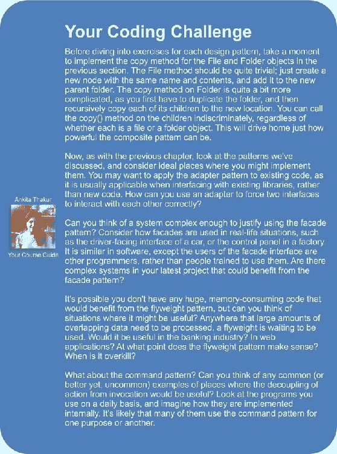

# 第 12 章 Python 设计模式 II

在本章中，我们将介绍更多的设计模式。 再次，我们将介绍规范示例以及 Python 中的所有常见替代实现。 我们将讨论：

*   适配器模式
*   外墙图案
*   延迟初始化和 flyweight 模式
*   命令模式
*   抽象工厂模式
*   构图模式

# 适配器模式

与中的大多数模式不同，我们在第 8 章，“字符串和序列化”中介绍了该适配器模式，旨在与现有代码进行交互。 我们不会设计实现适配器模式的全新对象集。 适配器用于允许两个预先存在的对象一起工作，即使它们的接口不兼容也是如此。 就像允许 VGA 投影仪插入 HDMI 端口的显示适配器一样，适配器对象位于两个不同的接口之间，可以在它们之间进行即时转换。 适配器对象的唯一目的是执行此转换作业。 适应可能需要执行各种任务，例如将参数转换为不同的格式，重新排列参数的顺序，调用名称不同的方法或提供默认参数。

在结构上，适配器模式类似于简化的装饰器模式。 装饰器通常提供与其替换的相同接口，而适配器在两个不同的接口之间映射。 这是 UML 形式：


在这里，**Interface1** 是，它希望调用称为 **make_action（some，arguments）**的方法。 我们已经有了这个完美的 **Interface2** 类，它可以完成我们想要的所有事情（并且为了避免重复，我们不想重写它！），但是它提供了一种名为 **different_action（other ，参数）**代替。 **适配器**类实现 **make_action** 接口，并将参数映射到现有接口。

这样做的好处是，从一个接口映射到另一个接口的代码都在一个地方。 替代方案确实非常丑陋； 每当我们需要访问此代码时，我们都必须在多个位置执行翻译。

例如，假设我们有以下预先存在的类，该类采用格式为“ YYYY-MM-DD”的字符串日期并计算某天的年龄：

```pypy
class AgeCalculator:
    def __init__(self, birthday):
        self.year, self.month, self.day = (
                int(x) for x in birthday.split('-'))

    def calculate_age(self, date):
        year, month, day = (
                int(x) for x in date.split('-'))
        age = year - self.year
        if (month,day) < (self.month,self.day):
            age -= 1
        return age
```

这是一个非常简单的类，可以完成预期的工作。 但是我们不得不怀疑程序员在想什么，使用特定格式的字符串而不是使用 Python 极其有用的内置`datetime`库。 作为尽职尽责的程序员，他们尽可能地重用代码，因此我们编写的大多数程序都将与`datetime`对象（而不是字符串）进行交互。

我们有个选项来解决这种情况； 我们可以重写该类以接受`datetime`对象，无论如何这可能会更准确。 但是，如果此类是由第三方提供的，并且我们不知道或无法更改其内部结构，则需要尝试其他方法。 我们可以按原样使用该类，并且每当要计算`datetime.date`对象的年龄时，都可以调用`datetime.date.strftime('%Y-%m-%d')`将其转换为正确的格式。 但是这种转换会在很多地方发生，更糟糕的是，如果我们将`%m`输入错误的名称为`%M`，它将为我们提供当前分钟而不是输入的月份！ 试想一下，如果您在十几个不同的地方写过这篇文章，那么当您意识到自己的错误时，只需回头修改它即可。 它不是可维护的代码，并且破坏了 DRY 原理。

相反，我们可以编写一个适配器，该适配器允许将正常日期插入到正常的`AgeCalculator`类中：

```pypy
import datetime
class DateAgeAdapter:
    def _str_date(self, date):
        return date.strftime("%Y-%m-%d")

    def __init__(self, birthday):
        birthday = self._str_date(birthday)
 self.calculator = AgeCalculator(birthday)

    def get_age(self, date):
        date = self._str_date(date)
 return self.calculator.calculate_age(date)

```

该适配器将`datetime.date`和`datetime.time`（它们与`strftime`具有相同的接口）转换为我们原始`AgeCalculator`可以使用的字符串。 现在，我们可以在新界面中使用原始代码。 我将方法签名更改为`get_age`，以说明调用接口也可能正在寻找其他方法名称，而不仅仅是其他类型的参数。

创建类作为适配器是实现此模式的常用方法，但是与往常一样，在 Python 中还有其他方法可以实现。 继承和多重继承可用于向类添加功能。 例如，我们可以在`date`类上添加一个适配器，使其与原始`AgeCalculator`类一起使用：

```pypy
import datetime
class AgeableDate(datetime.date):
    def split(self, char):
        return self.year, self.month, self.day
```

像这样的代码让人怀疑 Python 是否应该合法。 我们在子类中添加了`split`方法，该方法采用单个参数（我们将其忽略）并返回年，月和日的元组。 这对于原始的`AgeCalculator`类来说是完美无缺的，因为代码在特殊格式的字符串上调用`strip`，在这种情况下，`strip`返回年，月和日的元组。 `AgeCalculator`代码仅关心`strip`是否存在并返回可接受的值； 不管我们是否真的传入了一个字符串。 真的行：

```pypy
>>> bd = AgeableDate(1975, 6, 14)
>>> today = AgeableDate.today()
>>> today
AgeableDate(2015, 8, 4)
>>> a = AgeCalculator(bd)
>>> a.calculate_age(today)
40

```

它有效，但这是一个愚蠢的想法。 在这种特定情况下，这样的适配器将难以维护。 我们很快就会忘记为什么我们需要向`date`类添加`strip`方法。 方法名称不明确。 这可能是适配器的本性，但是显式创建适配器而不是使用继承通常可以阐明其目的。

除了继承之外，有时我们还可以使用猴子修补将方法添加到现有类中。 它不能与`datetime`对象一起使用，因为它不允许在运行时添加属性，但是在普通类中，我们只能添加一个新方法，该方法提供调用代码所需的已适配接口。 或者，我们可以扩展`AgeCalculator`本身或对其进行猴子补丁，以更适合我们需求的方式替换`calculate_age`方法。

最后，通常可以将函数用作适配器。 这显然不适合适配器模式的实际设计，但是如果我们回想起函数本质上是使用`__call__`方法的对象，则它将成为适配器的明显改编。

# 外墙图案

外观模式旨在为复杂的组件系统提供简单的界面。 对于复杂的任务，我们可能需要直接与这些对象进行交互，但是对于系统而言，通常不需要使用“典型”的操作，而无需进行这些复杂的交互。 外观模式允许我们定义一个新对象，该对象封装了系统的这种典型用法。 每当我们想要访问通用功能时，我们都可以使用单个对象的简化接口。 如果项目的另一部分需要访问更复杂的功能，则它仍然能够直接与系统进行交互。 外观模式的 UML 图实际上取决于子系统，但是以一种模糊的方式，它看起来像这样：


在许多方面，外墙就像一个适配器。 主要区别在于，外观正试图从复杂的接口中抽象出一个更简单的接口，而适配器仅试图将一个现有接口映射到另一个接口。

让我们为电子邮件应用程序编写一个简单的外观。 正如在第 7 章和 *Python 面向对象的快捷方式*中所看到的那样，用于在 Python 中发送电子邮件的低级库非常复杂。 用于接收消息的两个库更糟。

最好有一个简单的类，该类允许我们发送一封电子邮件，并列出 IMAP 或 POP3 连接上收件箱中当前的电子邮件。 为了使我们的示例简短，我们将继续使用 IMAP 和 SMTP：碰巧处理电子邮件的两个完全不同的子系统。 我们的外观仅执行两项任务：向特定地址发送电子邮件，以及检查 IMAP 连接上的收件箱。 它对连接进行了一些常见的假设，例如 SMTP 和 IMAP 的主机位于同一地址，两者的用户名和密码相同，并且它们使用标准端口。 这涵盖了许多电子邮件服务器的情况，但是如果程序员需要更大的灵活性，则他们总是可以绕过立面并直接访问两个子系统。

该类用电子邮件服务器的主机名，用户名和登录密码初始化：

```pypy
import smtplib
import imaplib

class EmailFacade:
    def __init__(self, host, username, password):
        self.host = host
        self.username = username
        self.password = password
```

`send_email`方法格式化电子邮件地址和消息，然后使用`smtplib`发送。 这不是一项复杂的任务，但是需要花很多时间来调整传递给外观的“自然”输入参数的正确格式，以使`smtplib`能够发送消息：

```pypy
    def send_email(self, to_email, subject, message):
        if not "@" in self.username:
            from_email = "{0}@{1}".format(
                    self.username, self.host)
        else:
            from_email = self.username
        message = ("From: {0}\r\n"
                "To: {1}\r\n"
                "Subject: {2}\r\n\r\n{3}").format(
                    from_email,
                    to_email,
                    subject,
                    message)

        smtp = smtplib.SMTP(self.host)
        smtp.login(self.username, self.password)
        smtp.sendmail(from_email, [to_email], message)
```

该方法开头的`if`语句正在捕获`username`是整个“发件人”电子邮件地址还是只是`@`符号左侧的部分； 不同的主机以不同的方式处理登录详细信息。

最后，获取当前收件箱中消息的代码是一片混乱。 IMAP 协议经过了过度的精心设计，`imaplib`标准库只是该协议的薄层：

```pypy
    def get_inbox(self):
        mailbox = imaplib.IMAP4(self.host)
        mailbox.login(bytes(self.username, 'utf8'),
            bytes(self.password, 'utf8'))
        mailbox.select()
        x, data = mailbox.search(None, 'ALL')
        messages = []
        for num in data[0].split():
            x, message = mailbox.fetch(num, '(RFC822)')
            messages.append(message[0][1])
        return messages
```

现在，如果将全部加在一起，我们将拥有一个简单的 Facade 类，该类可以以相当直接的方式发送和接收消息，这比必须直接与这些复杂的库进行交互要简单得多。

尽管在 Python 社区中很少使用，但是外观模式是 Python 生态系统不可或缺的一部分。 由于 Python 强调语言的可读性，因此语言及其库都倾向于为复杂任务提供易于理解的界面。 例如，`for`循环，`list`理解和生成器都是更复杂的迭代器协议的基础。 `defaultdict`实现是一个立面，可以抽象化字典中不存在键时烦人的角落情况。 第三方请求库是 HTTP 请求的可读性较弱的库的强大基础。

# 轻量化模式

轻量级模式是内存优化模式。 假定内置垃圾收集器会照顾好它们，那么 Python 新手往往会忽略内存优化。 这通常是完全可以接受的，但是当开发具有许多相关对象的大型应用程序时，关注内存问题可以带来巨大的回报。

flyweight 模式基本上确保了共享状态的对象可以为该共享状态使用相同的内存。 它通常仅在程序显示出内存问题后才实施。 在某些情况下，从一开始就设计最佳配置可能很有意义，但请记住，过早的优化是创建过于复杂而难以维护的程序的最有效方法。

让我们看一下 flyweight 模式的 UML 图：


每个 **Flyweight** 都没有没有特定状态； 每当需要在 **SpecificState** 上执行操作时，该状态就需要通过调用代码传递到 **Flyweight** 中。 传统上，返回轻量级的工厂是一个单独的对象。 它的目的是为给定密钥返回一个飞行重量，以标识该飞行重量。 它的工作方式类似于我们在第 10 章，“Python 设计模式 I” 中讨论的单例模式； 如果存在飞重，我们将其退还； 否则，我们将创建一个新的。 在许多语言中，工厂不是作为单独的对象而是作为`Flyweight`类本身的静态方法实现的。

考虑一下汽车销售的库存系统。 每辆汽车都有特定的序列号和特定的颜色。 但是，关于该车的大多数细节对于特定型号的所有车都是相同的。 例如，本田飞度 DX 车型是功能不多的裸车。 LX 型号具有 A / C，倾斜，巡航，电动窗和锁。 Sport 车型配备花式轮毂，USB 充电器和扰流板。 如果没有飞重模式，则每个单独的汽车对象都必须存储一长串它具有和不具有的功能。 考虑到本田一年销售的汽车数量，这将增加大量的内存浪费。 使用 flyweight 模式，我们可以使共享对象成为与模型关联的功能列表，然后简单地为单个车辆引用该模型以及序列号和颜色。 在 Python 中，flyweight 工厂通常使用时髦的`__new__`构造函数来实现，类似于我们对 singleton 模式所做的事情。 与 Singleton 不同，后者仅需要返回该类的一个实例，而我们需要能够根据键返回不同的实例。 我们可以将项目存储在字典中，然后根据关键字进行查找。 但是，这种解决方案是有问题的，因为只要该项在字典中，它就会一直保留在内存中。 如果我们售罄 LX 型号 Fits，则不再需要 Fit 配重，但仍将在字典中。 当然，每当我们卖出一辆车时，我们都可以清理一下，但这不是垃圾收集器的作用吗？

我们可以利用 Python 的`weakref`模块来解决此问题。 这个模块提供了一个`WeakValueDictionary`对象，该对象基本上允许我们将项目存储在字典中，而无需垃圾收集器关心它们。 如果某个值位于弱引用的字典中，并且在应用程序中的任何地方都没有存储对该对象的其他引用（也就是说，我们售罄了 LX 模型），那么垃圾收集器最终将为我们清理数据。

让我们首先为我们的汽车轻量化建立工厂：

```pypy
import weakref

class CarModel:
 _models = weakref.WeakValueDictionary()

    def __new__(cls, model_name, *args, **kwargs):
 model = cls._models.get(model_name)
        if not model:
            model = super().__new__(cls)
 cls._models[model_name] = model

        return model
```

基本上，每当我们使用给定名称构造一个新的 flyweight 时，我们首先会在弱引用字典中查找该名称； 如果存在，我们返回该模型； 如果没有，我们创建一个新的。 无论哪种方式，我们都知道每次都会调用 flyweight 上的`__init__`方法，无论它是新对象还是现有对象。 因此，我们的`__init__`方法如下所示：

```pypy
    def __init__(self, model_name, air=False, tilt=False,
            cruise_control=False, power_locks=False,
            alloy_wheels=False, usb_charger=False):
 if not hasattr(self, "initted"):
            self.model_name = model_name
            self.air = air
            self.tilt = tilt
            self.cruise_control = cruise_control
            self.power_locks = power_locks
            self.alloy_wheels = alloy_wheels
            self.usb_charger = usb_charger
            self.initted=True
```

`if`语句确保我们仅在首次调用`__init__`时初始化对象。 这意味着我们稍后可以仅使用模型名称来调用工厂，并返回相同的 flyweight 对象。 但是，由于如果没有外部引用来控制 flyweight，则必须对其进行垃圾回收，因此我们必须注意不要意外创建具有空值的新 flyweight。

让我们在飞行重量中添加一种方法，该方法假设在特定型号的车辆上查找序列号，并确定该序列号是否涉及任何事故。 此方法需要访问汽车的序列号，每个序列号各不相同； 它不能与飞行重量一起存储。 因此，此数据必须通过调用代码传递到方法中：

```pypy
 def check_serial(self, serial_number):
        print("Sorry, we are unable to check "
                "the serial number {0} on the {1} "
                "at this time".format(
                    serial_number, self.model_name))
```

我们可以定义一个类，该类存储附加信息以及对 flyweight 的引用：

```pypy
class Car:
    def __init__(self, model, color, serial):
        self.model = model
        self.color = color
        self.serial = serial

    def check_serial(self):
        return self.model.check_serial(self.serial)
```

我们还可以跟踪可用模型以及批次中的各个汽车：

```pypy
>>> dx = CarModel("FIT DX")
>>> lx = CarModel("FIT LX", air=True, cruise_control=True,
... power_locks=True, tilt=True)
>>> car1 = Car(dx, "blue", "12345")
>>> car2 = Car(dx, "black", "12346")
>>> car3 = Car(lx, "red", "12347")

```

现在，让我们演示工作中的弱引用：

```pypy
>>> id(lx)
3071620300
>>> del lx
>>> del car3
>>> import gc
>>> gc.collect()
0
>>> lx = CarModel("FIT LX", air=True, cruise_control=True,
... power_locks=True, tilt=True)
>>> id(lx)
3071576140
>>> lx = CarModel("FIT LX")
>>> id(lx)
3071576140
>>> lx.air
True

```

`id`函数告诉我们对象的唯一标识符。 当我们第二次调用它时，在删除所有对 LX 模型的引用并强制进行垃圾回收之后，我们看到 ID 已更改。 `CarModel __new__`工厂字典中的值已删除，并创建了一个新值。 但是，如果我们然后尝试构造第二个`CarModel`实例，它将返回相同的对象（ID 相同），并且即使我们在第二个调用中未提供任何参数，`air`变量仍 设置为`True`。 这意味着对象没有像我们设计的那样第二次初始化。

显然，使用 flyweight 模式可能比仅将特征存储在单个汽车类上更为复杂。 我们什么时候应该选择使用它？ 轻量级模式旨在节省内存； 如果我们有成千上万个相似的对象，则将相似的属性组合成一个 flyweight 会对内存消耗产生巨大影响。 优化 CPU，内存或磁盘空间的编程解决方案通常比未优化的同类导致更复杂的代码。 因此，在决定代码的可维护性与优化之间权衡取舍很重要。 在选择优化时，请尝试使用诸如 flyweight 之类的模式，以确保优化引入的复杂性仅限于代码的单个（详细记录）部分。

# 命令模式

命令模式通常在以后的时间中，在必须执行的动作与调用这些动作的对象之间增加了一个抽象级别。 在命令模式中，客户端代码创建一个`Command`对象，该对象可以在以后执行。 该对象知道一个接收者对象，当在其上执行命令时，该对象将管理自己的内部状态。 `Command`对象实现特定的接口（通常具有`execute`或`do_action`方法，并跟踪执行该操作所需的任何参数。最后，一个或多个`Invoker`对象在该对象处执行命令）。 正确的时间。

这是 UML 图：


命令模式的常见示例是图形窗口上的操作。 通常，可以通过菜单栏上的菜单项，键盘快捷键，工具栏图标或上下文菜单来调用动作。 这些都是`Invoker`对象的示例。 实际发生的动作，例如`Exit`，`Save`或`Copy`是`CommandInterface`的实现。 可能会显示`Receivers`的示例包括一个用于接收退出的 GUI 窗口，一个用于接收保存的文档以及一个用于接收复制命令的`ClipboardManager`。

让我们实现一个简单的命令模式，该模式为`Save`和`Exit`操作提供命令。 我们将从一些适度的接收器类开始：

```pypy
import sys

class Window:
    def exit(self):
        sys.exit(0)

class Document:
    def __init__(self, filename):
        self.filename = filename
        self.contents = "This file cannot be modified"

    def save(self):
        with open(self.filename, 'w') as file:
            file.write(self.contents)
```

这些模拟类为在工作环境中可能会做更多工作的对象建模。 该窗口将需要处理鼠标移动和键盘事件，而文档将需要处理字符的插入，删除和选择。 但是对于我们的示例，这两个类将满足我们的需求。

现在让我们定义一些调用程序类。 这些将对可能发生的工具栏，菜单和键盘事件进行建模。 同样，它们实际上并没有连接任何东西，但是我们可以看到如何将它们与命令，接收器和客户端代码分离：

```pypy
class ToolbarButton:
    def __init__(self, name, iconname):
        self.name = name
        self.iconname = iconname

    def click(self):
 self.command.execute()

class MenuItem:
    def __init__(self, menu_name, menuitem_name):
        self.menu = menu_name
        self.item = menuitem_name

    def click(self):
 self.command.execute()

class KeyboardShortcut:
    def __init__(self, key, modifier):
        self.key = key
        self.modifier = modifier

    def keypress(self):
 self.command.execute()

```

注意各种操作方法如何分别在各自的命令上调用`execute`方法吗？ 此代码未显示在每个对象上设置的`command`属性。 可以将它们传递到`__init__`函数中，但是由于可以更改它们（例如，使用可自定义的键绑定编辑器），因此以后在对象上设置属性更加有意义。

现在，让我们自己连接命令：

```pypy
class SaveCommand:
    def __init__(self, document):
        self.document = document

    def execute(self):
        self.document.save()

class ExitCommand:
    def __init__(self, window):
        self.window = window

    def execute(self):
        self.window.exit()
```

这些命令很简单； 它们演示了基本模式，但是必须注意，必要时我们可以使用命令存储状态和其他信息。 例如，如果我们有一个插入字符的命令，我们可以保持当前插入字符的状态。

现在，我们要做的就是连接一些客户端和测试代码以使命令起作用。 对于基本测试，我们可以在脚本末尾添加以下内容：

```pypy
window = Window()
document = Document("a_document.txt")
save = SaveCommand(document)
exit = ExitCommand(window)

save_button = ToolbarButton('save', 'save.png')
save_button.command = save
save_keystroke = KeyboardShortcut("s", "ctrl")
save_keystroke.command = save
exit_menu = MenuItem("File", "Exit")
exit_menu.command = exit
```

首先，我们创建两个接收器和两个命令。 然后，我们创建几个可用的调用程序，并在每个调用程序上设置正确的命令。 为了进行测试，我们可以使用`python3 -i filename.py`并运行`exit_menu.click()`这样的代码，该代码将结束程序，或者运行`save_keystroke.keystroke()`这样的代码，该代码将保存虚假文件。

不幸的是，前面的示例并没有让人感觉很 Python 化。 他们有很多“样板代码”（什么都不做，只为模式提供结构的代码），并且`Command`类彼此之间都非常相似。 也许我们可以创建一个将函数作为回调的通用命令对象？

其实为什么要打扰？ 我们可以仅对每个命令使用函数或方法对象吗？ 代替使用`execute()`方法的对象，我们可以编写一个函数并将其直接用作命令。 这是 Python 中命令模式的常见范例：

```pypy
import sys

class Window:
    def exit(self):
        sys.exit(0)

class MenuItem:
    def click(self):
        self.command()

window = Window()
menu_item = MenuItem()
menu_item.command = window.exit

```

现在看起来更像 Python。 乍一看，好像我们已经完全删除了命令模式，并且我们已经紧密连接了`menu_item`和`Window`类。 但是，如果我们仔细观察，就会发现根本没有紧密的耦合。 像以前一样，可以在`MenuItem`上将任何可调用对象设置为命令。 并且`Window.exit`方法可以附加到任何调用程序。 命令模式的大多数灵活性都得到了保留。 为了牺牲可读性，我们已经牺牲了完全的去耦，但是在我看来，与许多 Python 程序员相比，此代码比完全抽象的版本更具可维护性。

当然，由于我们可以向任何对象添加`__call__`方法，因此我们不仅限于函数。 当被调用的方法不必维护状态时，上一个示例是一个有用的快捷方式，但是在更高级的用法中，我们也可以使用以下代码：

```pypy
class Document:
    def __init__(self, filename):
        self.filename = filename
        self.contents = "This file cannot be modified"

    def save(self):
        with open(self.filename, 'w') as file:
            file.write(self.contents)

class KeyboardShortcut:
    def keypress(self):
        self.command()
class SaveCommand:
    def __init__(self, document):
        self.document = document

 def __call__(self):
 self.document.save()

document = Document("a_file.txt")
shortcut = KeyboardShortcut()
save_command = SaveCommand(document)
shortcut.command = save_command
```

在中，我们有一些看起来像第一个命令模式，但有点惯用语。 如您所见，使用 execute 方法使调用者调用可调用对象而不是命令对象，并没有以任何方式限制我们。 实际上，它给了我们更多的灵活性。 我们可以在函数正常工作时直接链接到函数，但是当情况需要时，我们可以构建一个完整的可调用命令对象。

命令模式通常被扩展为支持不可撤销的命令。 例如，文本程序不仅可以使用`execute`方法将每个插入内容包装在单独的命令中，还可以使用`undo`方法来删除该插入内容。 图形程序可以在具有`undo`方法的命令中包装每个绘图动作（矩形，直线，手绘像素等），该方法会将像素重置为其原始状态。 在这种情况下，命令模式的解耦更加有用，因为每个动作必须保持足够的状态才能在以后撤消该动作。

# 抽象工厂模式

当我们有多个可能依赖于某些配置或平台问题的系统实现时，通常使用抽象工厂模式。 调用代码从抽象工厂请求一个对象，而不确切知道将返回什么类的对象。 返回的基础实现可能取决于多种因素，例如当前的语言环境，操作系统或本地配置。

抽象工厂模式的常见示例包括独立于操作系统的工具包，数据库后端以及特定于国家/地区的格式化程序或计算器的代码。 独立于操作系统的 GUI 工具包可能使用抽象的工厂模式，该模式将返回 Windows 下的 WinForm 小部件，Mac 下的 Cocoa 小部件，Gnome 下的 GTK 小部件以及 KDE 下的 QT 小部件。 Django 提供了一个抽象工厂，该工厂根据当前站点的配置设置返回一组对象关系类，以与特定的数据库后端（MySQL，PostgreSQL，SQLite 等）进行交互。 如果应用程序需要部署在多个地方，则每个人可以通过仅更改一个配置变量来使用不同的数据库后端。 不同的国家/地区使用不同的系统来计算零售商品的税金，小计和总计； 抽象工厂可以返回特定的税收计算对象。

没有特定的示例，很难理解用于抽象工厂模式的 UML 类图，因此让我们先回过头来创建一个具体的示例。 我们将创建一组格式化程序，这些格式化程序取决于特定的语言环境，并帮助我们格式化日期和货币。 将有一个抽象工厂类来选择特定工厂，以及几个示例混凝土工厂，一个用于法国，一个用于美国。 这些中的每一个都会为日期和时间创建格式化程序对象，可以查询这些对象以格式化特定的值。 如下图：


将该图像与较早的较简单文本进行比较，可以发现一张图片并不总是值一千个字，尤其是考虑到我们甚至在这里甚至都不允许使用工厂选择代码。

当然，在 Python 中，我们无需实现任何接口类，因此可以丢弃`DateFormatter`，`CurrencyFormatter`和`FormatterFactory`。 格式类本身非常简单，如果冗长的话：

```pypy
class FranceDateFormatter:
    def format_date(self, y, m, d):
        y, m, d = (str(x) for x in (y,m,d))
        y = '20' + y if len(y) == 2 else y
        m = '0' + m if len(m) == 1 else m
        d = '0' + d if len(d) == 1 else d
        return("{0}/{1}/{2}".format(d,m,y))

class USADateFormatter:
    def format_date(self, y, m, d):
        y, m, d = (str(x) for x in (y,m,d))
        y = '20' + y if len(y) == 2 else y
        m = '0' + m if len(m) == 1 else m
        d = '0' + d if len(d) == 1 else d
        return("{0}-{1}-{2}".format(m,d,y))

class FranceCurrencyFormatter:
    def format_currency(self, base, cents):
        base, cents = (str(x) for x in (base, cents))
        if len(cents) == 0:
            cents = '00'
        elif len(cents) == 1:
            cents = '0' + cents

        digits = []
        for i,c in enumerate(reversed(base)):
            if i and not i % 3:
                digits.append(' ')
            digits.append(c)
        base = ''.join(reversed(digits))
        return "{0}€{1}".format(base, cents)

class USACurrencyFormatter:
    def format_currency(self, base, cents):
        base, cents = (str(x) for x in (base, cents))
        if len(cents) == 0:
            cents = '00'
        elif len(cents) == 1:
            cents = '0' + cents
        digits = []
        for i,c in enumerate(reversed(base)):
            if i and not i % 3:
                digits.append(',')
            digits.append(c)
        base = ''.join(reversed(digits))
        return "${0}.{1}".format(base, cents)
```

这些类使用一些基本的字符串操作来尝试将各种可能的输入（整数，不同长度的字符串等）转换为以下格式：

<colgroup class="calibre17"><col class="calibre18"> <col class="calibre18"> <col class="calibre18"></colgroup> 
|   | 

美国

 | 

法国

 |
| --- | --- | --- |
| **日期** | mm-dd-yyyy | dd / mm / yyyy |
| **货币** | $14,500.50 | 14 500€50 |

可能显然会在此代码中的输入上得到更多验证，但在此示例中，让我们保持其简单明了。

现在我们已经设置了格式化程序，我们只需要创建格式化程序工厂即可：

```pypy
class USAFormatterFactory:
    def create_date_formatter(self):
        return USADateFormatter()
    def create_currency_formatter(self):
        return USACurrencyFormatter()

class FranceFormatterFactory:
    def create_date_formatter(self):
        return FranceDateFormatter()
    def create_currency_formatter(self):
        return FranceCurrencyFormatter()
```

现在，我们设置了选择适当格式器的代码。 由于这种事情只需要设置一次，因此我们可以将其设置为单例-除非单例在 Python 中不是很有用。 让我们仅将当前格式化程序设为模块级变量：

```pypy
country_code = "US"
factory_map = {
        "US": USAFormatterFactory,
        "FR": FranceFormatterFactory}
formatter_factory = factory_map.get(country_code)()
```

在此示例中，我们对当前国家/地区代码进行了硬编码。 实际上，它可能会自省区域设置，操作系统或配置文件以选择代码。 本示例使用字典将国家/地区代码与工厂类别相关联。 然后我们从字典中获取正确的类并实例化它。

当我们想增加对更多国家的支持时，很容易看出需要做什么：创建新的格式化程序类和抽象工厂本身。 请记住，`Formatter`类可能会被重用； 例如，加拿大的货币格式与美国相同，但其日期格式比其南部邻国更明智。

抽象工厂通常返回一个单例对象，但这不是必需的。 在我们的代码中，每次调用时都会返回每个格式化程序的新实例。 没有理由不能将格式化程序存储为实例变量，并且为每个工厂返回相同的实例。

回顾这些示例，我们再次看到，似乎有很多工厂的样板代码，在 Python 中根本不需要。 通常，通过为每种工厂类型（例如：美国和法国）使用单独的模块，然后确保在工厂模块中访问正确的模块，可以更轻松地满足可能需要抽象工厂的要求。 此类模块的软件包结构可能如下所示：

```pypy
localize/
    __init__.py
    backends/
        __init__.py
        USA.py
        France.py
        …
```

诀窍在于，`localize`软件包中的`__init__.py`可以包含将所有请求重定向到正确后端的逻辑。 有很多种方法可以做到这一点。

如果我们知道后端永远不会动态更改（即不重新启动），则可以在`__init__.py`中放置一些`if`语句来检查当前国家/地区代码，并使用通常不可接受的`from .backends.USA import *`语法 从适当的后端导入所有变量。 或者，我们可以导入每个后端并设置`current_backend`变量以指向特定模块：

```pypy
from .backends import USA, France

if country_code == "US":
    current_backend = USA
```

根据我们选择的解决方案，我们的客户代码必须调用`localize.format_date`或`localize.current_backend.format_date`才能以当前国家/地区的语言环境设置日期格式。 最终结果比原始的抽象工厂模式具有更多的 Python 风格，并且在典型用法中同样灵活。

# 复合图案

复合模式允许从简单的组件构建复杂的树状结构。 这些组件称为复合对象，它们的行为类似于容器，而类似于变量，取决于它们是否具有子组件。 复合对象是容器对象，其中内容实际上可能是另一个复合对象。

传统上，复合对象中的每个组件都必须是叶节点（不能包含其他对象）或复合节点。 关键是复合节点和叶节点都可以具有相同的接口。 UML 图非常简单：


但是，这种简单的模式允许我们创建元素的复杂排列，所有元素都满足组件对象的接口。 这是这种复杂安排的具体实例：


复合模式通常在类似文件/文件夹的树中有用。 无论树中的节点是普通文件还是文件夹，它都仍会受到诸如移动，复制或删除节点之类的操作的影响。 我们可以创建一个支持这些操作的组件接口，然后使用一个复合对象表示文件夹，并使用叶节点表示普通文件。

当然，在 Python 中，我们再次可以利用鸭子类型来隐式提供接口，因此我们只需要编写两个类。 让我们首先定义这些接口：

```pypy
class Folder:
    def __init__(self, name):
        self.name = name
        self.children = {}

    def add_child(self, child):
        pass

    def move(self, new_path):
        pass

    def copy(self, new_path):
        pass

    def delete(self):
        pass

class File:
    def __init__(self, name, contents):
        self.name = name
        self.contents = contents

    def move(self, new_path):
        pass

    def copy(self, new_path):
        pass

    def delete(self):
        pass
```

对于每个文件夹（复合）对象，我们维护一个儿童字典。 通常，列表就足够了，但是在这种情况下，词典对于按名称查找孩子很有用。 我们的路径将被指定为由`/`字符分隔的节点名称，类似于 Unix shell 中的路径。

考虑到所涉及的方法，我们可以看到移动或删除节点的行为类似，无论它是文件节点还是文件夹节点。 但是，复制必须对文件夹节点进行递归复制，而复制文件节点则是微不足道的操作。

为了利用的类似操作优势，我们可以将一些常用方法提取到父类中。 让我们以废弃的`Component`接口并将其更改为基类为例：

```pypy
class Component:
 def __init__(self, name):
 self.name = name

    def move(self, new_path):
        new_folder =get_path(new_path)
        del self.parent.children[self.name]
        new_folder.children[self.name] = self
        self.parent = new_folder

    def delete(self):
        del self.parent.children[self.name]

class Folder(Component):
    def __init__(self, name):
 super().__init__(name)
        self.children = {}

    def add_child(self, child):
        pass

    def copy(self, new_path):
        pass

class File(Component):
    def __init__(self, name, contents):
 super().__init__(name)
        self.contents = contents

    def copy(self, new_path):
        pass

root = Folder('')
def get_path(path):
 names = path.split('/')[1:]
 node = root
 for name in names:
 node = node.children[name]
 return node

```

在`Component`类上创建了，`move`和`delete`方法。 他们两个都访问我们尚未设置的神秘`parent`变量。 `move`方法使用模块级`get_path`函数，该函数从给定路径的预定义根节点中查找节点。 所有文件将被添加到该根节点或该节点的子节点。 对于`move`方法，目标应该是当前存在的文件夹，否则我们会收到错误消息。 与技术书籍中的许多示例一样，严重缺乏错误处理，以帮助重点关注所考虑的原理。

让我们先设置一个神秘的`parent`变量； 在文件夹的`add_child`方法中会发生这种情况：

```pypy
    def add_child(self, child):
        child.parent = self
        self.children[child.name] = child
```

好吧，这很容易。 让我们看看我们的复合文件层次结构是否正常工作：

```pypy
$ python3 -i 1261_09_18_add_child.py

>>> folder1 = Folder('folder1')
>>> folder2 = Folder('folder2')
>>> root.add_child(folder1)
>>> root.add_child(folder2)
>>> folder11 = Folder('folder11')
>>> folder1.add_child(folder11)
>>> file111 = File('file111', 'contents')
>>> folder11.add_child(file111)
>>> file21 = File('file21', 'other contents')
>>> folder2.add_child(file21)
>>> folder2.children
{'file21': <__main__.File object at 0xb7220a4c>}
>>> folder2.move('/folder1/folder11')
>>> folder11.children
{'folder2': <__main__.Folder object at 0xb722080c>, 'file111': <__main__.File object at 0xb72209ec>}
>>> file21.move('/folder1')
>>> folder1.children
{'file21': <__main__.File object at 0xb7220a4c>, 'folder11': <__main__.Folder object at 0xb722084c>}

```

是的，我们可以创建文件夹，将文件夹添加到其他文件夹，将文件添加到文件夹，然后移动它们！ 在文件层次结构中，我们还能要求什么？

好吧，我们可以要求复制，但是为了保护树木，让我们将其保留为练习。

复合模式对于多种树状结构非常有用，包括 GUI 小部件层次结构，文件层次结构，树集，图形和 HTML DOM。 如先前的示例所示，当按照传统实现来实现时，这可能是 Python 中有用的模式。 有时，如果仅创建一棵浅树，我们可以摆脱列表列表或词典字典，而无需实现自定义组件，叶和复合类。 在其他时候，我们可以只实现一个复合类，而将叶子和复合对象作为一个类来处理。 另外，只要它们具有正确的接口，Python 的鸭子类型可以轻松地将其他对象添加到复合层次结构中。




