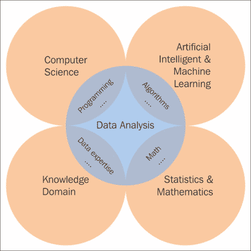

# 十五、数据分析和库简介

数据是原始的信息，可以任何形式存在（无论是否可用）。 我们可以轻松地在生活中的任何地方获取数据； 例如，撰写本文之日的黄金价格为每盎司 1.158 美元。 除了描述黄金价格外，这没有任何意义。 这也表明数据基于上下文是有用的。

通过关系数据连接，信息出现并允许我们将知识扩展到我们的感官范围之外。 当我们拥有随时间推移而收集的黄金价格数据时，我们可能拥有的一条信息是，金价在三天内从 1.152 美元连续上涨至 1.158 美元。 跟踪黄金价格的人可能会使用它。

知识可以帮助人们在生活和工作中创造价值。 此值基于组织，合成或汇总的信息以增强理解，认识或理解。 它代表采取行动和决策的状态或潜力。 当金价连续三天上涨时，第二天可能会下跌； 这是有用的知识。

下图说明了从数据到知识的步骤； 我们称这个过程为数据分析过程，我们将在下一节中介绍它：

在本章中，我们将介绍以下主题：

*   数据分析与处理
*   使用不同编程语言进行数据分析的库概述
*   通用 Python 数据分析库

# 数据分析和处理

数据每天都在变得越来越大和多样化。 因此，分析和处理数据以提高人类知识或创造价值是一个巨大的挑战。 为了解决这些挑战，您将需要领域知识和各种技能，这些知识来自计算机科学，**人工智能**（**AI**）和**机器学习**（**ML**），统计和数学以及知识领域，如下图所示：

让我们看一下数据分析及其域知识：

*   **计算机科学**：我们需要此知识来提供有效数据处理的抽象。 需要具备基本的 Python 编程经验才能遵循下一章。 我们将介绍用于数据分析的 Python 库。
*   **人工智能和机器学习**：如果计算机科学知识帮助我们编程数据分析工具，那么人工智能和机器学习将帮助我们对数据建模并从中学习以构建智能 产品。
*   **统计和数学**：如果我们不使用统计技术或数学函数，则无法从原始数据中提取有用的信息。
*   **知识领域**：除了技术和通用技术外，深入了解特定领域也很重要。 数据字段是什么意思？ 我们需要收集什么数据？ 基于专业知识，我们将逐步应用上述技术来探索和分析原始数据。

数据分析是一个由以下步骤组成的过程：

*   **数据需求**：我们具有可以根据需求或问题分析定义要收集的数据类型。 例如，如果我们想在阅读 Internet 新闻时检测到用户的行为，则应了解访问的文章链接，日期和时间，文章类别以及用户在不同页面上花费的时间。
*   **数据收集**：可以从各种来源收集数据：移动，个人计算机，照相机或记录设备。 它也可以通过不同的方式获得：通信，事件以及人与人之间，人与设备之间或设备与设备之间的交互。 数据随时随地出现在世界上。 问题是我们如何找到并收集它来解决我们的问题？ 这是此步骤的任务。
*   **数据处理**：必须对最初获得的数据进行处理或组织以进行分析。 此过程对性能敏感。 我们可以多快地创建，插入，更新或查询数据？ 在构建必须处理大数据的真实产品时，我们应该仔细考虑这一步骤。 我们应该使用哪种数据库来存储数据？ 哪种数据结构（例如分析，统计或可视化）适合我们的目的？
*   **数据清除**：在处理和组织了之后，数据可能仍然包含重复项或错误。 因此，我们需要一个清洁步骤，以减少这些情况并在以下步骤中提高结果的质量。 常见任务包括记录匹配，重复数据删除和列分段。 根据数据类型，我们可以应用几种类型的数据清除。 例如，用户访问新闻网站的历史记录可能包含很多重复的行，因为用户可能多次刷新某些页面。 对于我们的特定问题，在探索用户的行为时，这些行可能没有任何意义，因此在将其保存到数据库之前，应将其删除。 我们可能遇到的另一种情况是新闻点击欺诈-某人只想提高其网站排名或破坏网站。 在这种情况下，数据将无助于我们探索用户的行为。 我们可以使用阈值来检查访问页面事件是来自真人还是来自恶意软件。
*   **探索性数据分析**：现在，我们可以开始通过各种称为探索性数据分析的技术来分析数据。 我们可能会在数据清理中发现其他问题，或者发现对其他数据的请求。 因此，这些步骤可能是迭代的，并且在整个数据分析过程中都会重复。 数据可视化技术还用于检查图形或图表中的数据。 可视化通常有助于理解数据集，尤其是在数据集较大或高维的情况下。
*   **建模和算法**：大量数学公式和算法可用于从原始数据中检测或预测有用的知识。 例如，我们可以使用相似性度量来对表现出相似新闻阅读行为的用户进行聚类，并在下次推荐感兴趣的文章。 另外，我们可以通过应用分类模型，例如**支持向量机**（**SVM**）或线性回归，根据用户的新闻阅读行为来检测他们的性别。 根据问题，我们可能使用不同的算法来获得可接受的结果。 评估算法的准确性并为特定产品选择最佳实施方法可能需要花费大量时间。
*   **数据产品**：此步骤的目标是构建数据产品，以根据问题要求接收数据输入并生成输出。 我们将应用计算机科学知识来实施我们选择的算法以及管理数据存储。

# 数据分析中的库概述

有许多数据分析库，可以帮助我们处理和分析数据。 它们使用不同的编程语言，并且在解决各种数据分析问题方面具有不同的优缺点。 现在，我们将介绍一些可能对您有用的通用库。 他们应该给您概述该领域的图书馆。 但是，本模块的其余部分重点介绍基于 Python 的库。

一些使用 Java 语言进行数据分析的库如下：

*   **Weka**：这是我第一次学习数据分析时就熟悉的库。 它具有图形用户界面，可让您在小型数据集上运行实验。 如果您想了解数据处理领域中可能发生的情况，那就太好了。 但是，如果您构建复杂的产品，我认为它不是最佳选择，因为它的性能，粗略的 API 设计，[非最佳算法以及很少的文档](http://www.cs.waikato.ac.nz/ml/weka/)。
*   **Mallet**：这是另一个 Java 库，用于统计自然语言处理，文档分类，聚类，主题建模，信息提取以及其他文本的机器学习应用。 Mallet 有一个名为 GRMM 的附加程序包，其中包含对一般图形模型推断的支持，以及对具有任意图形结构的**条件随机字段**（**CRF**）的训练。 以我的经验，库的性能和算法要比 Weka 好。 但是，它仅关注文本处理问题。 参考页面位于[这个页面](http://mallet.cs.umass.edu/)。
*   **Mahout**：此是 Apache 的基于 Hadoop 的机器学习框架； 它的目标是建立一个可扩展的机器学习库。 它看起来很有前途，但伴随着 Hadoop 的所有负担和开销。 主页位于[这个页面](http://mahout.apache.org/)。
*   **Spark**：这是一个相对较新的 Apache 项目，据说的速度比 Hadoop 快一百倍。 它也是一个可扩展的库，由常见的机器学习算法和实用程序组成。 开发可以用 Python 以及任何 JVM 语言完成。 参考页位于[这个页面](https://spark.apache.org/docs/1.5.0/mllib-guide.html)。

以下是一些用 C ++ 实现的库：

*   **Vowpal Wabbit**：此库是由 Microsoft Research 和以前的 Yahoo!赞助的快速核心学习系统。 研究。 它已被用来在一小时内学习 1,000 个节点上的 Tera-feature（1012）数据集。 有关更多信息，请参见[出版物](http://arxiv.org/abs/1110.4198)。
*   **MultiBoost**：此程序包是用 C ++ 实现的多类，多标签和多任务分类增强软件。 如果您使用此软件，则应参阅 2012 年发表在*机器学习研究*，*MultiBoost：多用途 Boosting 软件包*，*D.Benbouzid*，*R. Busa-Fekete*，*N. Casagrande*，*F.-D。 Collin* 和 *B.Kégl*。
*   **MLpack**：这也是也是 C ++ 机器学习库，由乔治亚州的**基础算法和统计工具实验室**（**FASTLab**）开发 科技 它专注于可伸缩性，速度和易用性，并在 NIPS 2011 的 BigLearning 研讨会上进行了介绍。它的主页位于[这个页面](http://www.mlpack.org/about.html)。
*   **Caffe**：我们要提及的最后一个 C ++ 库是 Caffe。 这是一个考虑了表达，速度和模块化的深度学习框架。 它是由**伯克利视觉与学习中心**（**BVLC**）和社区贡献者开发的。 您可以在[这个页面](http://caffe.berkeleyvision.org/)上找到有关它的更多信息。

其他用于数据处理和分析的库如下：

*   **统计模型**：此是一个很棒的用于统计建模的 Python 库，主要用于预测和探索性分析。
*   **用于数据处理的模块化工具包**（**MDP**）：此是有监督和无监督学习算法的集合，以及可以组合的其他数据处理单元 数据处理序列和更复杂的[前馈网络体系结构](http://mdp-toolkit.sourceforge.net/index.html)。
*   **橙色**：这是开源数据可视化，适合新手和专家进行分析。 它具有用于数据分析的功能，并具有用于生物信息学和文本挖掘的附加组件。 它包含一个自组织映射的实现，[这也使其与其他项目](http://orange.biolab.si/)区分开来。
*   **Mirador**：此是用于可视化探索复杂数据集的工具，支持 Mac 和 Windows。 [它使用户能够发现相关模式并从数据中得出新的假设](http://orange.biolab.si/)。
*   **RapidMiner**：此是另一个基于 GUI 的工具，用于数据挖掘，[机器学习和预测分析](https://rapidminer.com/)。
*   **Theano**：此弥补了 Python 和较低级语言之间的空白。 Theano 可以显着提高性能，尤其是对于大型矩阵操作，因此是深度学习模型的不错选择。 但是，由于增加了编译层，因此调试起来并不容易。
*   **自然语言处理工具包**（**NLTK**）：此用 Python 编写，具有非常独特和显着的功能。

在这里，我无法列出所有用于数据分析的库。 但是，我认为上述库足以花很多时间来学习和构建数据分析应用。 我希望您阅读完本模块后会喜欢它们。

# 数据分析中的 Python 库

Python 是一种多平台通用编程语言，可以在 Windows，Linux / Unix 和 Mac OS X 上运行，并且已经移植到 Java 和.NET 虚拟机。 它具有强大的标准库。 此外，它还有许多用于数据分析的库：Pylearn2，Hebel，Pybrain，Pattern，MontePython 和 MILK。 在本模块中，我们将介绍一些常见的 Python 数据分析库，例如 Numpy，pandas，Matplotlib，PyMongo 和 scikit-learn。 现在，为了帮助您入门，我将为不熟悉科学 Python 堆栈的读者简要介绍每个库的概述。

## NumPy

Python 中用于科学计算的基本软件包之一是 Numpy。 除其他外，它包含以下内容：

*   强大的 N 维数组对象
*   复杂的（广播）函数，用于执行数组计算
*   集成 C/C++ 和 Fortran 代码的工具
*   有用的线性代数运算，傅立叶变换和随机数功能

除此之外，它还可以用作通用数据的有效多维容器。 可以定义任意数据类型，并将其与各种数据库集成。

## Pandas

pandas 是 Python 软件包，它支持丰富的数据结构和用于分析数据的功能，由 PyData 开发团队开发。 它着重于 Python 数据库的改进。 Pandas包括以下内容：

*   一组标记数组数据结构； 主要是 Series，DataFrame 和 Panel
*   支持简单轴索引和多级/层次轴索引的索引对象
*   集成引擎按组分组，用于聚合和转换数据集
*   日期范围生成和自定义日期偏移
*   输入/输出工具，可从平面文件或 PyTables / HDF5 格式加载和保存数据
*   标准数据结构的最佳内存版本
*   移动窗口统计信息以及静态和动态窗口线性/面板回归

由于这些功能，对于需要复杂数据结构或高性能时间序列功能的系统（例如财务数据分析应用），pandas 是理想的工具。

## Matplotlib

Matplotlib 是用于 2D 图形的最常用的 Python 软件包。 它提供了一种非常快速的方式来可视化来自 Python 的数据以及具有多种格式的出版物质量的图形：折线图，轮廓图，散点图和底图图。 它带有一组默认设置，但允许自定义各种属性。 但是，我们可以使用 Matplotlib 中几乎每个属性的默认值轻松创建图表。

## PyMongo

MongoDB 是 NoSQL 数据库的一种。 具有高度的可伸缩性，强大的功能，非常适合与基于 JavaScript 的 Web 应用一起使用，因为我们可以将数据存储为 JSON 文档并使用灵活的模式。

PyMongo 是一个 Python 发行版，其中包含用于 MongoDB 的工具。 还编写了许多工具与 PyMongo 一起使用，以添加更多功能，例如 MongoKit，Humangolus，MongoAlchemy 和 Ming。

## scikit 学习库

scikit-learn 是使用 Python 编程语言的开源机器学习库。 它支持与 Python 数值和科学库 NumPy 和 SciPy 互操作的各种机器学习模型，例如分类，回归和聚类算法。

