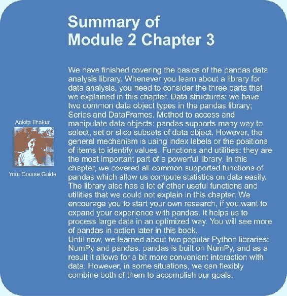

# 第 3 章。使用熊猫进行数据分析

在本章中，我们将探索另一个称为 pandas 的数据分析库。 本章的目的是为您提供一些入门熊猫的基本知识和具体示例。

# 熊猫包概述

pandas 是一个 Python 软件包，它支持快速，灵活和富于表现力的数据结构，以及用于数据分析的计算功能。 以下是熊猫支持的一些突出功能：

*   带有标记轴的数据结构。 这样可以使程序整洁清晰，并避免由于数据未对齐而引起的常见错误。
*   灵活处理丢失的数据。
*   基于智能标签的切片，花式索引和大型数据集的子集创建。
*   通过轴标签在自定义轴上进行强大的算术运算和统计计算。
*   强大的输入和输出支持，用于从文件，数据库或 HDF5 格式加载或保存数据。

与熊猫安装有关，我们建议一种简单的方法，即将其安装为 Anaconda 的一部分，Anaconda 是用于数据分析和科学计算的跨平台发行版。 您可以参考[这个页面](http://docs.continuum.io/anaconda/)上的参考资料，以下载并安装该库。

安装后，我们可以像其他 Python 软件包一样使用它。 首先，我们必须在程序开始时导入以下软件包：

```py
>>> import pandas as pd
>>> import numpy as np

```

# 大熊猫数据结构

首先让了解熊猫的两个主要数据结构：系列和数据帧。 他们可以处理金融，统计，社会科学以及许多工程领域中的大多数用例。

## 系列

系列是一维对象，类似于表中的数组，列表或列。 系列中的每个项目都分配给索引中的一个条目：

```py
>>> s1 = pd.Series(np.random.rand(4),
 index=['a', 'b', 'c', 'd'])
>>> s1
a    0.6122
b    0.98096
c    0.3350
d    0.7221
dtype: float64

```

默认情况下，如果未传递任何索引，则将其创建为具有从`0`到`N-1`的值，其中`N`是 Series 的长度：

```py
>>> s2 = pd.Series(np.random.rand(4))
>>> s2
0    0.6913
1    0.8487
2    0.8627
3    0.7286
dtype: float64

```

我们可以通过使用索引访问 Series 的值：

```py
>>> s1['c']
0.3350
>>>s1['c'] = 3.14
>>> s1['c', 'a', 'b']
c    3.14
a    0.6122
b    0.98096

```

此访问方法类似于 Python 字典。 因此，pandas 还允许我们直接从 Python 字典初始化 Series 对象：

```py
>>> s3 = pd.Series({'001': 'Nam', '002': 'Mary',
 '003': 'Peter'})
>>> s3
001    Nam
002    Mary
003    Peter
dtype: object

```

有时，我们想要过滤或重命名从 Python 字典创建的系列的索引。 在这种情况下，我们可以将所选索引列表直接传递给初始函数，类似于前面示例中的过程。 只有索引列表中存在的元素才会在 Series 对象中。 相反，字典中缺少的索引被熊猫初始化为默认的`NaN`值：

```py
>>> s4 = pd.Series({'001': 'Nam', '002': 'Mary',
 '003': 'Peter'}, index=[
 '002', '001', '024', '065'])
>>> s4
002    Mary
001    Nam
024    NaN
065    NaN
dtype:   object
ect

```

该库还支持检测丢失数据的功能：

```py
>>> pd.isnull(s4)
002    False
001    False
024    True
065    True
dtype: bool

```

同样，我们也可以从标量值初始化 Series：

```py
>>> s5 = pd.Series(2.71, index=['x', 'y'])
>>> s5
x    2.71
y    2.71
dtype: float64

```

Series 对象也可以使用 NumPy 对象初始化，例如`ndarray`。 此外，熊猫可以在算术运算中自动以不同的方式对齐索引的数据：

```py
>>> s6 = pd.Series(np.array([2.71, 3.14]), index=['z', 'y'])
>>> s6
z    2.71
y    3.14
dtype: float64
>>> s5 + s6
x    NaN
y    5.85
z    NaN
dtype: float64

```

## 数据框

DataFrame 是一个表格数据结构，包含一组有序的列和行。 可以将其视为共享索引（列名）的一组 Series 对象。 有很多方法可以初始化 DataFrame 对象。 首先，让我们看一下从列表字典创建 DataFrame 的常见示例：

```py
>>> data = {'Year': [2000, 2005, 2010, 2014],
 'Median_Age': [24.2, 26.4, 28.5, 30.3],
 'Density': [244, 256, 268, 279]}
>>> df1 = pd.DataFrame(data)
>>> df1
 Density    Median_Age    Year
0  244        24.2        2000
1  256        26.4        2005
2  268        28.5        2010
3  279        30.3        2014

```

默认情况下，DataFrame 构造函数将按字母顺序对列进行排序。 我们可以通过将列的属性传递给初始化函数来编辑默认顺序：

```py
>>> df2 = pd.DataFrame(data, columns=['Year', 'Density', 
 'Median_Age'])
>>> df2
 Year    Density    Median_Age
0    2000    244        24.2
1    2005    256        26.4
2    2010    268        28.5
3    2014    279        30.3
>>> df2.index
Int64Index([0, 1, 2, 3], dtype='int64')

```

我们可以提供类似于 Series 的 DataFrame 的索引标签：

```py
>>> df3 = pd.DataFrame(data, columns=['Year', 'Density', 
 'Median_Age'], index=['a', 'b', 'c', 'd'])
>>> df3.index
Index([u'a', u'b', u'c', u'd'], dtype='object')

```

我们也可以从嵌套列表中构造一个 DataFrame：

```py
>>> df4 = pd.DataFrame([
 ['Peter', 16, 'pupil', 'TN', 'M', None],
 ['Mary', 21, 'student', 'SG', 'F', None],
 ['Nam', 22, 'student', 'HN', 'M', None],
 ['Mai', 31, 'nurse', 'SG', 'F', None],
 ['John', 28, 'laywer', 'SG', 'M', None]],
columns=['name', 'age', 'career', 'province', 'sex', 'award'])

```

如果列名是语法上有效的属性名，则可以按列名的方式访问列，也可以按类的字典符号或属性的方式访问列：

```py
>>> df4.name    # or df4['name'] 
0    Peter
1    Mary
2    Nam
3    Mai
4    John
Name: name, dtype: object

```

要将新列修改或追加到创建的 DataFrame 中，我们指定列名称和我们要分配的值：

```py
>>> df4['award'] = None
>>> df4
 name age   career province  sex award
0  Peter  16    pupil       TN    M  None
1    Mary  21  student       SG    F  None
2    Nam   22  student       HN  M  None
3    Mai    31    nurse        SG    F    None
4    John    28    lawer        SG    M    None

```

使用两种方法，可以按位置或名称检索行：

```py
>>> df4.ix[1]
name           Mary
age              21
career      student
province         SG
sex               F
award          None
Name: 1, dtype: object

```

还可以从不同的数据结构（例如字典列表，系列字典或记录数组）创建 DataFrame 对象。 初始化 DataFrame 对象的方法与前面的示例相似。

另一种常见情况是为 DataFrame 提供来自诸如文本文件等位置的数据。 在这种情况下，我们使用`read_csv`函数，默认情况下期望列分隔符为逗号。 但是，我们可以使用`sep`参数来更改它：

```py
# person.csv file
name,age,career,province,sex
Peter,16,pupil,TN,M
Mary,21,student,SG,F
Nam,22,student,HN,M
Mai,31,nurse,SG,F
John,28,lawer,SG,M
# loading person.cvs into a DataFrame
>>> df4 = pd.read_csv('person.csv')
>>> df4
 name   age   career   province  sex
0    Peter    16    pupil       TN        M
1    Mary     21    student     SG       F
2    Nam      22    student     HN       M
3    Mai      31    nurse       SG       F
4    John     28    laywer      SG       M

```

在读取数据文件时，有时我们想跳过一行或无效值。 至于大熊猫`0.16.2`， `read_csv`支持 50 多个参数来控制加载过程。 一些常用的有用参数如下：

*   `sep`：这是列之间的分隔符。 默认值为逗号符号。
*   `dtype`：这是数据或列的数据类型。
*   `header`：设置行号用作列名。
*   `skiprows`：这会跳过行号以在文件的开头跳过。
*   `error_bad_lines`：这显示无效行（太多字段），默认情况下会导致异常，因此不会返回任何 DataFrame。 如果我们将此参数的值设置为`false`，则会跳过错误的行。

此外，熊猫还支持直接从数据库读取数据帧或向数据库读取数据帧，例如熊猫模块中的`read_frame`或`write_frame`函数。 我们将在本章后面再回到这些方法。


# 基本的基本功能

熊猫支持许多对操纵熊猫数据结构有用的基本功能。 在本模块中，我们将重点介绍与探索和分析有关的最重要功能。

## 重新索引和更改标签

重新索引是熊猫数据结构中的关键方法。 它确认新数据或修改后的数据是否满足沿熊猫对象特定轴的一组给定标签。

首先，让我们来看一个关于 Series 对象的`reindex`示例：

```py
>>> s2.reindex([0, 2, 'b', 3])
0    0.6913
2    0.8627
b    NaN
3    0.7286
dtype: float64

```

当数据对象中不存在`reindexed`标签时，将自动为该位置分配默认值`NaN`。 对于 DataFrame 情况也是如此：

```py
>>> df1.reindex(index=[0, 2, 'b', 3],
 columns=['Density', 'Year', 'Median_Age','C'])
 Density  Year  Median_Age        C
0      244  2000        24.2      NaN
2      268  2010        28.5      NaN
b      NaN   NaN         NaN      NaN
3      279  2014        30.3      NaN

```

通过设置`fill_value`参数，我们可以在缺少索引的情况下将`NaN`值更改为自定义值。 让我们看一下`reindex`函数支持的参数，如下表所示：

<colgroup class="calibre17"><col class="calibre18"> <col class="calibre18"></colgroup> 
| 

争论

 | 

描述

 |
| --- | --- |
| `index` | 这是要遵守的新标签/索引。 |
| `method` | 这是用于填充`reindexed`对象中的孔的方法。 默认设置为填空。`pad/ffill`：向前填充值`backfill` / `bfill`：向后填充值`nearest`：使用最接近的值填补空白 |
| `copy` | 这将返回一个新对象。 默认设置为`true`。 |
| `level` | 在传递的多个索引级别上匹配索引值。 |
| `fill_value` | 这是用于缺失值的值。 默认设置为`NaN`。 |
| `limit` | 这是填补`forward`或`backward`方法的最大尺寸差距。 |

## 头和尾

在常见的数据分析情况下，我们的数据结构对象包含许多列和大量行。 因此，我们无法查看或加载对象的所有信息。 熊猫支持的功能使我们可以检查少量样品。 默认情况下，这些函数返回五个元素，但是我们也可以设置一个自定义数字。 以下示例显示了如何显示较长系列的前五行和后三行：

```py
>>> s7 = pd.Series(np.random.rand(10000))
>>> s7.head()
0    0.631059
1    0.766085
2    0.066891
3    0.867591
4    0.339678
dtype: float64
>>> s7.tail(3)
9997    0.412178
9998    0.800711
9999    0.438344
dtype: float64

```

我们也可以以相同的方式将这些函数用于 DataFrame 对象。

## 二进制运算

首先，我们将考虑对象之间的算术运算。 在不同索引对象的情况下，预期结果将是索引对的并集。 我们不会再对此进行解释，因为在上一节（`s5 + s6`）中有一个示例。 这次，我们将展示另一个带有 DataFrame 的示例：

```py
>>> df5 = pd.DataFrame(np.arange(9).reshape(3,3),0
 columns=['a','b','c'])
>>> df5
 a  b  c
0  0  1  2
1  3  4  5
2  6  7  8
>>> df6 = pd.DataFrame(np.arange(8).reshape(2,4), 
 columns=['a','b','c','d'])
>>> df6
 a  b  c  d
0  0  1  2  3
1  4  5  6  7
>>> df5 + df6
 a   b   c   d
0   0   2   4 NaN
1   7   9  11 NaN
2   NaN NaN NaN NaN

```

用于在两种数据结构之间返回结果的机制相似。 我们需要考虑的问题是对象之间的数据丢失。 在这种情况下，如果要填充固定值（例如`0`），则可以使用算术函数（例如`add`，`sub`，`div`和`mul`）以及该函数支持的参数 例如`fill_value`：

```py
>>> df7 = df5.add(df6, fill_value=0)
>>> df7
 a  b   c   d
0  0  2   4   3
1  7  9  11   7
2  6  7   8   NaN

```

接下来，我们将讨论数据对象之间的比较操作。 支持某些 函数，例如**等于**（**eq**），**不等于**（**ne [**），**大于**（**gt**），**小于**（**lt**），**小于**（[ 或**等于**（**ge**）。 这里是一个示例：

```py
>>> df5.eq(df6)
 a      b      c      d
0   True   True   True  False
1  False  False  False  False
2  False  False  False  False

```


## 功能统计

库支持的统计方法在数据分析中确实很重要。 要进入大数据对象，我们需要了解一些汇总信息，例如均值，总和或分位数。 熊猫支持多种计算方法。 让我们考虑一个简单的示例，该示例计算作为数据帧对象的`df5`的`sum`信息：

```py
>>> df5.sum()
a     9
b    12
c    15
dtype: int64

```

当我们未指定要计算 `sum`信息的轴时，默认情况下，该函数将在索引轴（即`0`轴）上进行计算：

*   **系列**：我们不需要指定轴。
*   **DataFrame**：列（`axis = 1`）或索引（`axis = 0`）。 默认设置为`axis 0`。

我们还具有`skipna`参数，该参数使我们可以决定是否排除丢失的数据。 默认情况下，它设置为`true`：

```py
>>> df7.sum(skipna=False)
a    13
b    18
c    23
d   NaN
dtype: float64

```

我们要考虑的另一个功能是`describe()`。 对于我们来说，汇总数据结构的大多数统计信息（例如 Series 和 DataFrame）也非常方便：

```py
>>> df5.describe()
 a    b    c
count  3.0  3.0  3.0
mean   3.0  4.0  5.0
std    3.0  3.0  3.0
min    0.0  1.0  2.0
25%    1.5  2.5  3.5
50%    3.0  4.0  5.0
75%    4.5  5.5  6.5
max    6.0  7.0  8.0

```

我们可以使用`percentiles`参数指定要包含在输出中或排除在输出中的百分位数； 例如，考虑以下因素：

```py
>>> df5.describe(percentiles=[0.5, 0.8])
 a    b    c
count  3.0  3.0  3.0
mean   3.0  4.0  5.0
std    3.0  3.0  3.0
min    0.0  1.0  2.0
50%    3.0  4.0  5.0
80%    4.8  5.8  6.8
max    6.0  7.0  8.0

```

在这里，我们有一个汇总表，列出了熊猫中常见的受支持的统计信息：

<colgroup class="calibre17"><col class="calibre18"> <col class="calibre18"></colgroup> 
| 

功能

 | 

描述

 |
| --- | --- |
| `idxmin(axis)`，`idxmax(axis)` | 这将使用最小或最大对应值来计算索引标签。 |
| `value_counts()` | 这将计算唯一值的频率。 |
| `count()` | 这将返回数据对象中非空值的数量。 |
| `mean()`，`median()`，`min()`，`max()` | 此返回值是数据对象中轴的平均值，中位数，最小值和最大值。 |
| `std()`，`var()`，`sem()` | 这些返回标准偏差，方差和平均值的标准误差。 |
| `abs()` | 这将获取数据对象的绝对值。 |

## 功能应用

pandas 支持函数应用程序，它使我们可以将其他软件包（如 NumPy）中支持的某些函数应用于数据结构对象上。 在这里，我们举例说明这些情况的两个示例，首先，使用`apply`执行`std()`函数，该函数是 NumPy 包的标准差计算函数：

```py
>>> df5.apply(np.std, axis=1)    # default: axis=0
0    0.816497
1    0.816497
2    0.816497
dtype: float64

```

其次，如果我们想将公式应用于数据对象，则还可以通过执行以下步骤来使用 apply 函数：

1.  定义要应用于数据对象的函数或公式。
2.  通过`apply`调用定义的函数或公式。 在这一步中，我们还需要弄清楚要将计算应用于的轴：

    ```py
    >>> f = lambda x: x.max() – x.min()    # step 1
    >>> df5.apply(f, axis=1)               # step 2
    0    2
    1    2
    2    2
    dtype: int64
    >>> def sigmoid(x):
     return 1/(1 + np.exp(x))
    >>> df5.apply(sigmoid)
     a           b         c
    0  0.500000  0.268941  0.119203
    1  0.047426  0.017986  0.006693
    2  0.002473  0.000911  0.000335

    ```

## 排序

有两种我们感兴趣的排序方法：按行或列索引排序和按数据值排序。

首先，我们将考虑按行和列索引排序的方法。 在这种情况下，我们具有`sort_index()`功能。 我们还具有`axis`参数来设置函数应按行还是按列排序。 带有`true`或`false`值的`ascending`选项将允许我们按升序或降序对数据进行排序。 此选项的默认设置为`true`：

```py
>>> df7 = pd.DataFrame(np.arange(12).reshape(3,4), 
 columns=['b', 'd', 'a', 'c'],
 index=['x', 'y', 'z'])
>>> df7
 b  d   a   c
x  0  1   2   3
y  4  5   6   7
z  8  9  10  11
>>> df7.sort_index(axis=1)
 a  b   c  d
x   2  0   3  1
y   6  4   7  5
z  10  8  11  9

```

系列具有按值排序的方法顺序。 对于对象中的`NaN`值，我们还可以通过`na_position`选项进行特殊处理：

```py
>>> s4.order(na_position='first')
024     NaN
065     NaN
002    Mary
001     Nam
dtype: object
>>> s4
002    Mary
001     Nam
024     NaN
065     NaN
dtype: object

```

除此之外，系列还具有`sort()`函数，该函数按值对数据进行排序。 但是，该函数不会返回已排序数据的副本：

```py
>>> s4.sort(na_position='first')
>>> s4
024     NaN
065     NaN
002    Mary
001     Nam
dtype: object

```

如果要对 DataFrame 对象应用排序功能，则需要弄清楚将对哪些列或行进行排序：

```py
>>> df7.sort(['b', 'd'], ascending=False)
 b  d   a   c
z  8  9  10  11
y  4  5   6   7
x  0  1   2   3

```

如果我们不想自动将排序结果保存到当前数据对象，则可以将`inplace`参数的设置更改为`False`。

# 索引和选择数据

在本节中，我们将关注于如何获取，设置或切片熊猫数据结构对象的子集。 正如我们在前面的部分中了解到的那样，Series 或 DataFrame 对象具有轴标签信息。 此信息可用于标识我们要选择或在对象中分配新值的项目：

```py
>>> s4[['024', '002']]    # selecting data of Series object
024     NaN
002    Mary
dtype: object
>>> s4[['024', '002']] = 'unknown' # assigning data
>>> s4
024    unknown
065        NaN
002    unknown
001        Nam
dtype: object

```

如果数据对象是 DataFrame 结构，我们也可以按照类似的方式进行：

```py
>>> df5[['b', 'c']]
 b  c
0  1  2
1  4  5
2  7  8

```

对于在 DataFrame 的行上建立标签的索引，我们使用`ix`函数，该函数使我们能够选择对象中的一组行和列。 我们需要指定两个参数：我们要获取的`row`和`column`标签。 默认情况下，如果我们不指定选定的列名，则该函数将返回选定的行以及对象中的所有列：

```py
>>> df5.ix[0]
a    0
b    1
c    2
Name: 0, dtype: int64
>>> df5.ix[0, 1:3]
b    1
c    2
Name: 0, dtype: int64

```

此外，我们有很多方法可以选择和编辑熊猫对象中包含的数据。 我们在下表中总结了这些功能：

<colgroup class="calibre17"><col class="calibre18"> <col class="calibre18"></colgroup> 
| 

方法

 | 

描述

 |
| --- | --- |
| `icol`，`irow` | 这将按整数位置选择单个行或列。 |
| `get_value`，`set_value` | 这将按行或列标签选择或设置数据对象的单个值。 |
| `xs` | 这将选择单个列或行作为“按标签序列”。 |

### 注意

熊猫数据对象可能包含重复索引。 在这种情况下，当我们通过索引标签获取或设置数据值时，它将影响具有相同选定索引名称的所有行或列。


# 计算工具

让我们从两个数据对象之间的相关性和协方差计算开始。 Series 和 DataFrame 都具有`cov`方法。 在 DataFrame 对象上，此方法将计算对象内部 Series 之间的协方差：

```py
>>> s1 = pd.Series(np.random.rand(3))
>>> s1
0    0.460324
1    0.993279
2    0.032957
dtype: float64
>>> s2 = pd.Series(np.random.rand(3))
>>> s2
0    0.777509
1    0.573716
2    0.664212
dtype: float64
>>> s1.cov(s2)
-0.024516360159045424

>>> df8 = pd.DataFrame(np.random.rand(12).reshape(4,3), 
 columns=['a','b','c'])
>>> df8
 a         b         c
0  0.200049  0.070034  0.978615
1  0.293063  0.609812  0.788773
2  0.853431  0.243656  0.978057
0.985584  0.500765  0.481180
>>> df8.cov()
 a         b         c
a  0.155307  0.021273 -0.048449
b  0.021273  0.059925 -0.040029
c -0.048449 -0.040029  0.055067

```

相关方法的用法类似于协方差方法。 如果数据对象是 DataFrame，它会计算数据对象内部 Series 之间的相关性。 但是，我们需要指定将使用哪种方法来计算相关性。 可用的方法是`pearson`，`kendall`和`spearman`。 默认情况下，该函数应用`spearman`方法：

```py
>>> df8.corr(method = 'spearman')
 a    b    c
a  1.0  0.4 -0.8
b  0.4  1.0 -0.8
c -0.8 -0.8  1.0

```

我们还具有`corrwith`函数，该函数支持计算在不同 DataFrame 对象中包含相同标签的 Series 之间的相关性：

```py
>>> df9 = pd.DataFrame(np.arange(8).reshape(4,2), 
 columns=['a', 'b'])
>>> df9
 a  b
0  0  1
1  2  3
2  4  5
3  6  7
>>> df8.corrwith(df9)
a    0.955567
b    0.488370
c         NaN
dtype: float64

```

# 处理丢失的数据

在本节中，我们将讨论熊猫数据结构中的`NaN`或`null`值缺失。 在对象中丢失数据是很常见的情况。 导致丢失数据的一种情况是重新索引：

```py
>>> df8 = pd.DataFrame(np.arange(12).reshape(4,3), 
 columns=['a', 'b', 'c'])
 a   b   c
0  0   1   2
1  3   4   5
2  6   7   8
3  9  10  11
>>> df9 = df8.reindex(columns = ['a', 'b', 'c', 'd'])
 a   b   c   d
0  0   1   2 NaN
1  3   4   5 NaN
2  6   7   8 NaN
4  9  10  11 NaN
>>> df10 = df8.reindex([3, 2, 'a', 0])
 a   b   c
3   9  10  11
2   6   7   8
a NaN NaN NaN
0   0   1   2

```

为了处理缺失值，我们可以使用`isnull()`或`notnull()`函数来检测 Series 对象以及 DataFrame 对象中的缺失值：

```py
>>> df10.isnull()
 a      b      c
3  False  False  False
2  False  False  False
a   True   True   True
0  False  False  False

```

在系列中，我们可以使用`dropna`函数删除所有`null`数据和索引值：

```py
>>> s4 = pd.Series({'001': 'Nam', '002': 'Mary',
 '003': 'Peter'},
 index=['002', '001', '024', '065'])
>>> s4
002    Mary
001     Nam
024     NaN
065     NaN
dtype: object
>>> s4.dropna()    # dropping all null value of Series object
002    Mary
001     Nam
dtype: object

```

对于 DataFrame 对象，它比 Series 复杂一些。 我们可以判断要删除的行或列，以及是否所有条目都必须为`null`或单个`null`值就足够了。 默认情况下，该函数将删除包含缺失值的任何行：

```py
>>> df9.dropna()    # all rows will be dropped
Empty DataFrame
Columns: [a, b, c, d]
Index: []
>>> df9.dropna(axis=1)
 a   b   c
0  0   1   2
1  3   4   5
2  6   7   8
3  9  10  11

```

控制缺失值的另一种方法是使用我们在上一节中介绍的功能的受支持参数。 它们对于解决此问题也非常有用。 根据我们的经验，当我们创建数据对象时，应该在丢失情况下分配一个固定值。 此将在后续处理步骤中使我们的对象更清洁。 例如，考虑以下内容：

```py
>>> df11 = df8.reindex([3, 2, 'a', 0], fill_value = 0)
>>> df11
 a   b   c
3  9  10  11
2  6   7   8
a  0   0   0
0  0   1   2

```

我们还可以使用`fillna`函数在缺失值中填充自定义值：

```py
>>> df9.fillna(-1)
 a   b   c  d
0  0   1   2 -1
1  3   4   5 -1
2  6   7   8 -1
3  9  10  11 -1

```


# 熊猫用于数据分析的高级用途

在本节中，我们将考虑一些高级熊猫用例。

## 分层索引

分层索引通过在轴上将数据对象构造为多个索引级别，为我们提供了一种在较低维度上处理较高维度数据的方法：

```py
>>> s8 = pd.Series(np.random.rand(8), index=[['a','a','b','b','c','c', 'd','d'], [0, 1, 0, 1, 0,1, 0, 1, ]])
>>> s8
a  0    0.721652
 1    0.297784
b  0    0.271995
 1    0.125342
c  0    0.444074
 1    0.948363
d  0    0.197565
 1    0.883776
dtype: float64

```

在前面的示例中，我们有一个具有两个索引级别的 Series 对象。 可以使用`unstack`功能将重新布置到 DataFrame 中。 在相反的情况下，可以使用`stack`功能：

```py
>>> s8.unstack()
 0         1
a  0.549211  0.420874
b  0.051516  0.715021
c  0.503072  0.720772
d  0.373037  0.207026

```

我们还可以创建一个 DataFrame 在两个轴上都具有层次结构索引：

```py
>>> df = pd.DataFrame(np.random.rand(12).reshape(4,3),
 index=[['a', 'a', 'b', 'b'],
 [0, 1, 0, 1]],
 columns=[['x', 'x', 'y'], [0, 1, 0]])
>>> df
 x                   y
 0         1         0
a 0  0.636893  0.729521  0.747230
 1  0.749002  0.323388  0.259496
b 0  0.214046  0.926961  0.679686
0.013258  0.416101  0.626927
>>> df.index
MultiIndex(levels=[['a', 'b'], [0, 1]],
 labels=[[0, 0, 1, 1], [0, 1, 0, 1]])
>>> df.columns
MultiIndex(levels=[['x', 'y'], [0, 1]],
 labels=[[0, 0, 1], [0, 1, 0]])

```

获取或设置具有多个索引级别的数据对象的值或子集的方法与非分层情况类似：

```py
>>> df['x']
 0         1
a 0  0.636893  0.729521
 1  0.749002  0.323388
b 0  0.214046  0.926961
0.013258  0.416101
>>> df[[0]]
 x
 0
a 0  0.636893
 1  0.749002
b 0  0.214046
0.013258
>>> df.ix['a', 'x']
 0         1
0  0.636893  0.729521
0.749002  0.323388
>>> df.ix['a','x'].ix[1]
0    0.749002
1    0.323388
Name: 1, dtype: float64

```

将数据分组为多个索引级别后，我们还可以使用大多数具有级别选项的描述和统计功能，这些功能可用于指定我们要处理的级别：

```py
>>> df.std(level=1)
 x                   y
 0         1         0
0  0.298998  0.139611  0.047761
0.520250  0.065558  0.259813
>>> df.std(level=0)
 x                   y
 0         1         0
a  0.079273  0.287180  0.344880
b  0.141979  0.361232  0.037306

```


## 面板数据

面板是另一个用于熊猫中三维数据的数据结构。 但是，它比 Series 或 DataFrame 的使用频率更低。 您可以将 Panel 视为 DataFrame 对象的表。 我们可以从 3D `ndarray`或 DataFrame 对象的字典创建 Panel 对象：

```py
# create a Panel from 3D ndarray
>>> panel = pd.Panel(np.random.rand(2, 4, 5),
 items = ['item1', 'item2'])
>>> panel
<class 'pandas.core.panel.Panel'>
Dimensions: 2 (items) x 4 (major_axis) x 5 (minor_axis)
Items axis: item1 to item2
Major_axis axis: 0 to 3
Minor_axis axis: 0 to 4

>>> df1 = pd.DataFrame(np.arange(12).reshape(4, 3), 
 columns=['a','b','c'])
>>> df1
 a   b   c
0  0   1   2
1  3   4   5
2  6   7   8
9  10  11
>>> df2 = pd.DataFrame(np.arange(9).reshape(3, 3), 
 columns=['a','b','c'])
>>> df2
 a  b  c
0  0  1  2
1  3  4  5
6  7  8
# create another Panel from a dict of DataFrame objects
>>> panel2 = pd.Panel({'item1': df1, 'item2': df2})
>>> panel2
<class 'pandas.core.panel.Panel'>
Dimensions: 2 (items) x 4 (major_axis) x 3 (minor_axis)
Items axis: item1 to item2
Major_axis axis: 0 to 3
Minor_axis axis: a to c

```

面板中的每个项目都是一个 DataFrame。 我们可以通过项目名称选择一个项目：

```py
>>> panel2['item1']
 a   b   c
0  0   1   2
1  3   4   5
2  6   7   8
3  9  10  11

```

另外，如果我们要通过轴或数据位置选择数据，则可以使用`ix`方法，例如在 Series 或 DataFrame 上：

```py
>>> panel2.ix[:, 1:3, ['b', 'c']]
<class 'pandas.core.panel.Panel'>
Dimensions: 2 (items) x 3 (major_axis) x 2 (minor_axis)
Items axis: item1 to item2
Major_axis axis: 1 to 3
Minor_axis axis: b to c
>>> panel2.ix[:, 2, :]
 item1  item2
a      6      6
b      7      7
c      8      8

```




