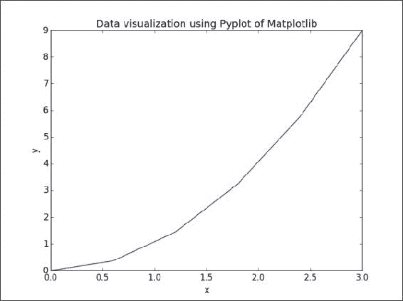
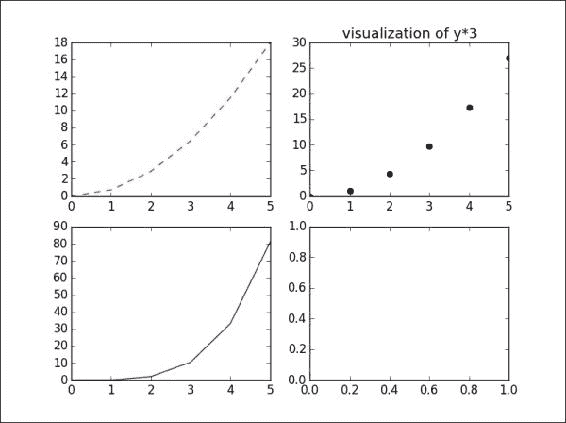
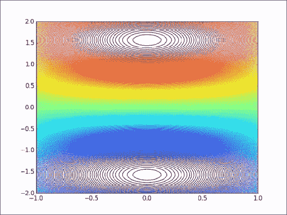
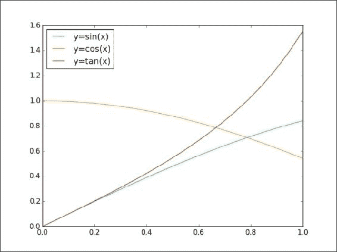

# 第 4 章。数据可视化

数据可视化与图形或图形形式的数据表示有关。 这是数据分析中最重要的任务之一，因为它使我们能够查看分析结果，检测异常值并为模型构建做出决策。 有许多用于可视化的 Python 库，其中 matplotlib，seaborn，bokeh 和 ggplot 最受欢迎。 但是，在本章中，我们主要关注 matplotlib 库，该库在许多不同的上下文中被许多人使用。

Matplotlib 生成各种格式的出版物质量的数字，以及跨 Python 平台的交互式环境。 另一个优点是，pandas 附带了一些围绕 matplotlib 绘制例程的有用包装器，可以快速方便地绘制 Series 和 DataFrame 对象。

IPython 包起初是对标准交互式 Python Shell 的替代，但从那时起，它已发展成为用于数据探索，可视化和快速原型制作的必不可少的工具。 可以通过各种选项来使用 IPython 中 matplotlib 提供的图形功能，其中最简单的方法是`pylab`标志：

```pypy
$ ipython --pylab

```

该标志将预加载`matplotlib`和`numpy`与默认的 matplotlib 后端进行交互使用。 IPython 可以在各种环境中运行：在终端中作为`Qt`应用运行，或者在浏览器内部运行。 这些选项值得探索，因为 IPython 已在许多用例中得到广泛采用，例如原型设计，用于使会议演讲或讲座更具吸引力的交互式幻灯片，以及作为共享研究的工具。

# matplotlib API 入门

使用 matplotlib 进行绘图的最简单的方法通常是使用软件包支持的 MATLAB API：

```pypy
>>> import matplotlib.pyplot as plt
>>> from numpy import *
>>> x = linspace(0, 3, 6)
>>> x
array([0., 0.6, 1.2, 1.8, 2.4, 3.])
>>> y = power(x,2)
>>> y
array([0., 0.36, 1.44, 3.24, 5.76, 9.])
>>> figure()
>>> plot(x, y, 'r')
>>> xlabel('x')
>>> ylabel('y')
>>> title('Data visualization in MATLAB-like API')
>>> plt.show()

```

先前命令的输出如下：


但是，除非有充分的理由，否则不应使用星级导入。 对于 matplotlib，我们可以使用规范导入：

```pypy
>>> import matplotlib.pyplot as plt

```

然后，可以将前面的示例编写如下：

```pypy
>>> plt.plot(x, y)
>>> plt.xlabel('x')
>>> plt.ylabel('y')
>>> plt.title('Data visualization using Pyplot of Matplotlib')
>>> plt.show()

```

先前命令的输出如下：



如果我们仅向 plot 函数提供单个参数，它将自动将其用作`y`值并生成从`0`到`N-1`的`x`值，其中`N`等于值的数量 ：

```pypy
>>> plt.plot(y)
>>> plt.xlabel('x')
>>> plt.ylabel('y')
>>> plt.title('Plot y value without given x values')
>>> plt.show()

```

先前命令的输出如下：


默认情况下，轴的范围受输入`x`和`y`数据的范围限制。 如果要指定轴的`viewport`，则可以使用`axis()`方法设置自定义范围。 例如，在先前的可视化中，我们可以通过编写以下命令来将`x`轴的范围从`[0, 5]`增大到`[0, 6]`，并将`y`轴的范围从`[0, 9]`增大到`[0, 10]`。 ：

```pypy
>>> plt.axis([0, 6, 0, 12])

```

## 线属性

当我们在 matplotlib 中绘制数据时，默认线格式是蓝色实线，缩写为`b-`。 要更改此设置，我们只需要向`plot`功能添加符号代码，其中包括字母作为颜色字符串和符号作为线条样式字符串。 让我们考虑一下具有不同格式样式的多条线的图：

```pypy
>>> plt.plot(x*2, 'g^', x*3, 'rs', x**x, 'y-')
>>> plt.axis([0, 6, 0, 30])
>>> plt.show()

```

上一条命令的输出如下：


我们可以选择许多线型和属性，例如颜色，线宽和破折号，以控制图形的外观。 以下示例说明了设置线属性的几种方法：

```pypy
>>> line = plt.plot(y, color='red', linewidth=2.0)
>>> line.set_linestyle('--')
>>> plt.setp(line, marker='o')
>>> plt.show()

```

上一条命令的输出如下：


下表列出了`line2d`绘图的一些常见属性：

<colgroup class="calibre17"><col class="calibre18"> <col class="calibre18"> <col class="calibre18"></colgroup> 
| 

财产

 | 

值类型

 | 

描述

 |
| --- | --- | --- |
| `color`或`c` | 任何 matplotlib 颜色 | 设置图中线条的颜色 |
| `dashes` | 开关 | 这样可以设置墨点的顺序 |
| `data` | `np`。 `array xdata`，`np.array ydata` | 设置用于可视化的数据 |
| `linestyle`或`ls` | [`'-'` &#124; `'—'` &#124; `'-.'` &#124; `':'` &#124; ...] | 这将在图中设置线条样式 |
| `linewidth`或`lw` | 浮点价值 | 这将设置图中的线宽 |
| `marker` | 任何符号 | 这将在图中的数据点设置样式 |

## 图和子图

默认情况下，所有绘图命令均适用于当前图形和轴。 在某些情况下，我们希望可视化多个图形和轴上的数据，以比较不同的图或更有效地使用页面上的空间。 在绘制数据之前，需要完成两个步骤。 首先，我们必须定义要绘制的图形。 其次，我们需要弄清楚子图在图中的位置：

```pypy
>>> plt.figure('a')    # define a figure, named 'a'
>>> plt.subplot(221)    # the first position of 4 subplots in 2x2 figure
>>> plt.plot(y+y, 'r--')
>>> plt.subplot(222)    # the second position of 4 subplots
>>> plt.plot(y*3, 'ko')
>>> plt.subplot(223)    # the third position of 4 subplots
>>> plt.plot(y*y, 'b^')
>>> plt.subplot(224)
>>> plt.show()

```

上一条命令的输出如下：


在这种情况下，我们当前具有图`a`。 如果要修改图形`a`中的任何子图，我们首先调用命令以选择图形和子图，然后执行该函数以修改子图。 例如，在这里，我们更改了四图图形的第二个图形的标题：

```pypy
>>> plt.figure('a')
>>> plt.subplot(222)
>>> plt.title('visualization of y*3')
>>> plt.show()

```

前面的命令的输出如下：



### 注意

如果我们不使用逗号分隔索引，则整数子图规范必须为三位数。 因此，`plt.subplot(221)`等于`plt.subplot(2,2,1)`命令。

有便捷方法`plt.subplots()`来创建包含给定数量的子图的图形。 与前面的示例一样，我们可以使用`plt.subplots(2,2)`命令创建由四个子图组成的`2x2`图形。

我们还可以使用`plt.axes([left, bottom, width, height])`命令手动创建轴，而不是矩形网格，其中所有输入参数都在小数`[0, 1]`坐标中：

```pypy
>>> plt.figure('b')    # create another figure, named 'b'
>>> ax1 = plt.axes([0.05, 0.1, 0.4, 0.32])
>>> ax2 = plt.axes([0.52, 0.1, 0.4, 0.32])
>>> ax3 = plt.axes([0.05, 0.53, 0.87, 0.44])
>>> plt.show()

```

先前命令的输出如下：


但是，当您手动创建轴时，需要花费更多时间来平衡子图之间的坐标和大小，才能获得比例合理的图形。


# 探索地块类型

到目前为止，我们已经研究了如何创建简单的线图。 matplotlib 库支持更多可用于数据可视化的图类型。 但是，我们的目标是提供基本知识，以帮助您理解和使用该库在最常见的情况下可视化数据。 因此，我们仅关注四种图类型：**散点图**，**条形图**，**等高线图**和**直方图**。

## 散点图

散点图用于可视化同一数据集中测得的变量之间的关系。 使用`plt.scatter()`函数可以很容易地绘制一个简单的散点图，该散点图需要`x`和`y`轴都使用数字列：


让我们看一下前面输出的命令：

```pypy
>>> X = np.random.normal(0, 1, 1000)
>>> Y = np.random.normal(0, 1, 1000)
>>> plt.scatter(X, Y, c = ['b', 'g', 'k', 'r', 'c'])
>>> plt.show()

```

## 条形图

条形图用于以矩形条形显示分组的数据，矩形条可以是垂直或水平的，且条形的长度对应于其值。 我们使用`plt.bar()`命令显示垂直条，使用`plt.barh()`命令显示其他条形：


上一个输出的命令如下：

```pypy
>>> X = np.arange(5)
>>> Y = 3.14 + 2.71 * np.random.rand(5)
>>> plt.subplots(2)
>>> # the first subplot
>>> plt.subplot(211)
>>> plt.bar(X, Y, align='center', alpha=0.4, color='y')
>>> plt.xlabel('x')
>>> plt.ylabel('y')
>>> plt.title('bar plot in vertical')
>>> # the second subplot
>>> plt.subplot(212)
>>> plt.barh(X, Y, align='center', alpha=0.4, color='c')
>>> plt.xlabel('x')
>>> plt.ylabel('y')
>>> plt.title('bar plot in horizontal')
>>> plt.show()

```

## 等高线图

我们使用等高线图来表示二维的三个数值变量之间的关系。 沿`x`和`y`轴绘制了两个变量，第三个变量`z`用于以不同颜色绘制为曲线的轮廓级别：

```pypy
>>> x = np.linspace(-1, 1, 255)
>>> y = np.linspace(-2, 2, 300)
>>> z = np.sin(y[:, np.newaxis]) * np.cos(x)
>>> plt.contour(x, y, z, 255, linewidth=2)
>>> plt.show()

```

让我们看一下下图中的轮廓图：



### 注意

如果要绘制轮廓线和填充轮廓，可以使用`plt.contourf()`方法代替`plt.contour()`。 与 MATLAB 相比，matplotlib 的`contourf()`不会绘制多边形的边缘。

## 直方图

直方图以图形方式表示数值数据的分布。 通常，值范围被划分为大小相等的 bin，每个 bin 的高度对应于该 bin 中值的频率：


先前输出的命令如下：

```pypy
>>> mu, sigma = 100, 25
>>> fig, (ax0, ax1) = plt.subplots(ncols=2)
>>> x = mu + sigma * np.random.randn(1000)
>>> ax0.hist(x,20, normed=1, histtype='stepfilled', 
 facecolor='g', alpha=0.75)
>>> ax0.set_title('Stepfilled histogram')
>>> ax1.hist(x, bins=[100,150, 165, 170, 195] normed=1, 
 histtype='bar', rwidth=0.8)
>>> ax1.set_title('uniquel bins histogram')
>>> # automatically adjust subplot parameters to give specified padding
>>> plt.tight_layout()
>>> plt.show()

```


# 图例和注释

图例是一个重要元素，用于标识图中的`plot`元素。 在图中显示图例的最简单方法是使用`plot`函数的`label`参数，并通过调用`plt.legend()`方法显示标签：

```pypy
>>> x = np.linspace(0, 1, 20) 
>>> y1 = np.sin(x)
>>> y2 = np.cos(x)
>>> y3 = np.tan(x)
>>> plt.plot(x, y1, 'c', label='y=sin(x)')
>>> plt.plot(x, y2, 'y', label='y=cos(x)')
>>> plt.plot(x, y3, 'r', label='y=tan(x)')
>>> plt.lengend(loc='upper left')
>>> plt.show()

```

前面命令的输出如下：



图例命令中的`loc`自变量用于确定标签框的位置。 有几个有效的位置选项：`lower left`，`right`，`upper left`，`lower center`，`upper right`，`center`，`lower right`，`upper right`，`center right`，`best`，`upper center` 和`center left`。 默认位置设置为`upper right`。 但是，当我们设置了上面列表中不存在的无效位置选项时，该功能将自动退回到最佳选项。

如果要将图例分成多个图框，可以手动设置绘图线的预期标签，如下图所示：


上一条命令的输出如下：

```pypy
>>> p1 = plt.plot(x, y1, 'c', label='y=sin(x)')
>>> p2 = plt.plot(x, y2, 'y', label='y=cos(x)')
>>> p3 = plt.plot(x, y3, 'r', label='y=tan(x)')
>>> lsin = plt.legend(handles=p1, loc='lower right')
>>> lcos = plt.legend(handles=p2, loc='upper left')
>>> ltan = plt.legend(handles=p3, loc='upper right')
>>> # with above code, only 'y=tan(x)' legend appears in the figure
>>> # fix: add lsin, lcos as separate artists to the axes
>>> plt.gca().add_artist(lsin)
>>> plt.gca().add_artist(lcos)
>>> # automatically adjust subplot parameters to specified padding
>>> plt.tight_layout()
>>> plt.show()

```

我们要介绍的图形中的另一个元素是注释，可以由文本，箭头或其他形状组成，以详细说明图形的各个部分或强调一些特殊的数据点。 有多种显示注释的方法，例如`text`，`arrow`和 `annotation`。

*   `text`方法在绘图上的给定坐标`(x, y)`处绘制文本； （可选）具有自定义属性。 该函数中有一些常见的参数：`x`，`y`，标签文本和可以通过`fontdict`传递的字体相关属性，例如`family`，`fontsize`和`style`。
*   `annotate`方法可以绘制适当排列的文本和箭头。 该函数的参数是`s`（标签文本），`xy`（要注释的元素的位置），`xytext`（标签`s`的位置），`xycoords`（指示什么类型的 坐标`xy`是）和`arrowprops`（连接注释的箭头的线属性字典）。

这是一个简单的示例来说明`annotate`和`text`功能：

```pypy
>>> x = np.linspace(-2.4, 0.4, 20)
>>> y = x*x + 2*x + 1
>>> plt.plot(x, y, 'c', linewidth=2.0)
>>> plt.text(-1.5, 1.8, 'y=x^2 + 2*x + 1',
 fontsize=14, style='italic')
>>> plt.annotate('minima point', xy=(-1, 0),
 xytext=(-1, 0.3),
 horizontalalignment='center', 
 verticalalignment='top', 
 arrowprops=dict(arrowstyle='->', 
 connectionstyle='arc3'))
>>> plt.show()

```

上一条命令的输出如下：


# 用熊猫绘图功能

我们已使用 matplotlib 覆盖了图中的大多数重要组件。 在本节中，我们将介绍另一种强大的绘图方法，该方法可从通常用于处理数据的熊猫数据对象直接创建标准可视化效果。

对于熊猫中的 Series 或 DataFrame 对象，支持大多数绘图类型，例如折线图，条形图，框形图，直方图和散点图以及饼图。 要选择绘图类型，我们使用`plot`函数的`kind`参数。 没有指定任何类型的绘图，默认情况下`plot`函数将生成线型可视化效果，如以下示例所示：

```pypy
>>> s = pd.Series(np.random.normal(10, 8, 20))
>>> s.plot(style='ko—', alpha=0.4, label='Series plotting')
>>> plt.legend()
>>> plt.show()

```

上一条命令的输出如下：


另一个示例将可视化包含多列的 DataFrame 对象的数据：

```pypy
>>> data = {'Median_Age': [24.2, 26.4, 28.5, 30.3],
 'Density': [244, 256, 268, 279]}
>>> index_label = ['2000', '2005', '2010', '2014'];
>>> df1 = pd.DataFrame(data, index=index_label)
>>> df1.plot(kind='bar', subplots=True, sharex=True)
>>> plt.tight_layout();
>>> plt.show()

```

上一条命令的输出如下：


DataFrame 的绘图方法具有许多选项，使我们能够处理列的绘图。 例如，在前面的 DataFrame 可视化中，我们选择将列绘制在单独的子图中。 下表列出了更多选项：

<colgroup class="calibre17"><col class="calibre18"> <col class="calibre18"> <col class="calibre18"></colgroup> 
| 

争论

 | 

价值

 | 

描述

 |
| --- | --- | --- |
| `subplots` | `True` / `False` | 该图在单独的子图中绘制每个数据列 |
| `logy` | `True` / `False` | 获取对数刻度`y`轴 |
| `secondary_y` | `True` / `False` | 在辅助`y`轴上绘制数据 |
| `sharex`，`sharey` | `True` / `False` | 共享相同的`x`或`y`轴，链接杆和限制 |


# 其他 Python 数据可视化工具

除了 matplotlib 之外，还有其他基于 Python 的强大数据可视化工具包。 尽管我们无法更深入地研究这些库，但我们希望至少在本节中简要介绍它们。

## 散景

Bokeh 是，由 Peter Wang，Hugo Shi 和其他人在 Continuum Analytics 中进行。 它旨在以`D3.js`的样式提供优雅且引人入胜的可视化。 该库可以快速轻松地创建交互式绘图，仪表板和数据应用。 这是 matplotlib 和 Bokeh 之间的一些差异：

*   Bokeh 通过 IPython 的浏览器内客户端渲染新模型实现了跨平台的普遍性
*   Bokeh 使用 R 和 ggplot 用户熟悉的语法，而 matplotlib 对 Matlab 用户更熟悉
*   Bokeh 具有一致的构想，以构建受 ggplot 启发的浏览器内交互式可视化工具，而 Matplotlib 具有一致的构想，即专注于 2D 跨平台图形。

使用散景创建图的基本步骤如下：

*   准备列表，系列和数据框中的一些数据
*   告诉 Bokeh 您想在哪里生成输出
*   调用`figure()`创建带有一些总体选项的绘图，类似于前面讨论的 matplotlib 选项
*   使用颜色，图例和宽度等视觉自定义添加数据的渲染器
*   要求 Bokeh `show()`或`save()`结果

## MayaVi

MayaVi 是一个用于交互式科学数据可视化和 3D 绘图的库，建立在屡获殊荣的**可视化工具包**（**VTK**）的基础上， 开源可视化库的基于特征的包装器。 它提供以下内容：

*   通过对话框与可视化中的数据和对象进行交互的可能性。
*   Python 中的接口，用于编写脚本。 MayaVi 可以与 Numpy 和 scipy 一起使用以进行现成的 3D 绘制，并且可以在 IPython 笔记本中使用，类似于 matplotlib。
*   VTK 的抽象，提供了更简单的编程模型。

让我们查看基于 VTK 示例及其提供的数据完全使用 MayaVi 制作的插图：


