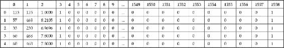

# 第 5 章。使用变压器提取特征

到目前为止，我们已经使用的数据集已按功能进行了描述。 在上一章中，我们使用了以事务为中心的数据集。 但是，最终这只是表示基于特征的数据的另一种格式。

还有许多其他类型的数据集，包括文本，图像，声音，电影，甚至是真实对象。 但是，大多数数据挖掘算法都依赖于具有数字或分类特征。 这意味着我们需要一种表示这些类型的方法，然后再将它们输入数据挖掘算法。

在本章中，我们将讨论如何提取数字和分类特征，并在拥有特征时选择最佳特征。 我们将讨论一些常见的特征提取模式和技术。

本章介绍的关键概念包括：

*   从数据集中提取特征
*   创建新功能
*   选择好的功能
*   为自定义数据集创建自己的转换器

# 特征提取

提取功能是数据挖掘中最关键的任务之一，并且与选择数据挖掘算法相比，它通常对最终结果的影响更大。 不幸的是，对于选择可导致高性能数据挖掘的功能没有严格的规定。 在许多方面，这就是数据挖掘科学成为一门艺术的地方。 创建好的功能依赖于直觉，领域专业知识，数据挖掘经验，反复试验，有时还需要运气。

## 代表模型中的现实

并非所有数据集都以特征表示。 有时，数据集仅由给定作者撰写的所有书籍组成。 有时，它是 1979 年发行的每部电影的电影。有时，它是有趣的历史文物的图书馆集合。

从这些数据集中，我们可能想要执行数据挖掘任务。 对于书籍，我们可能想知道作者撰写的不同类别。 在电影中，我们不妨看看如何描绘女性。 在历史文物中，我们可能想知道它们是否来自一个国家或另一个国家。 不能仅将这些原始数据集传递到决策树中并查看结果是什么。

为了在这里为我们提供帮助的数据挖掘算法，我们需要将其表示为特征。 特征是一种创建模型的方式，而模型以数据挖掘算法可以理解的方式提供了逼真的近似。 因此，模型只是现实世界中某些方面的简化版本。 例如，国际象棋是历史战争的简化模型。

选择功能还有另一个优点：将特征的复杂性降低到更易于管理的模型中。 想象一下，要正确，准确和完整地向不具备该项目背景知识的人描述真实世界的对象需要多少信息。 您需要描述尺寸，重量，质地，成分，年龄，缺陷，目的，来源等。

对于当前算法而言，真实对象的复杂性太大，因此我们改用这些更简单的模型。

这种简化还将我们的意图集中在数据挖掘应用程序中。 在后面的章节中，我们将研究集群及其在哪些方面至关重要。 如果放入随机特征，则会得到随机结果。

但是，这样做有一个弊端，因为这种简化会减少细节，或者可能会删除我们希望对其进行数据挖掘的事物的良好指示。

应该始终考虑如何以模型的形式表示现实。 您不仅需要使用过去使用过的方法，还需要考虑数据挖掘工作的目标。 您想达到什么目的？ 在[第 3 章](24.html "Chapter 3. Predicting Sports Winners with Decision Trees")和*用决策树*预测运动优胜者中，我们通过考虑目标（预测优胜者）来创建功能，并使用了一点点领域知识来提出新功能的想法。

### 注意

并非所有功能都必须是数字或分类的。 已经开发了可以直接在文本，图形和其他数据结构上运行的算法。 不幸的是，这些算法不在本模块的范围之内。 在本模块中，我们主要使用数字或分类特征。

`Adult`数据集是采用复杂现实并尝试使用功能对其建模的一个很好的例子。 在此数据集中，目标是估计某人的年收入是否超过 50,000 美元。 要下载数据集，请导航至 [http://archive.ics.uci.edu/ml/datasets/成人](http://archive.ics.uci.edu/ml/datasets/Adult)，然后单击**数据文件夹**链接。 将`adult.data`和`adult.names`下载到数据文件夹中名为`Adult`的目录中。

该数据集承担一项复杂的任务，并在功能中对其进行了描述。 这些功能描述了人，他们的环境，他们的背景和他们的生活状况。

在本章中打开一个新的 IPython Notebook，并设置数据的文件名并导入 pandas 以加载文件：

```py
import os
import pandas as pd
data_folder = os.path.join(os.path.expanduser("~"), "Data", "Adult")
adult_filename = os.path.join(data_folder, "adult.data")
Using pandas as before, we load the file with read_csv:
adult = pd.read_csv(adult_filename, header=None,
    names=["Age", "Work-Class", "fnlwgt",
    "Education", "Education-Num",
    "Marital-Status", "Occupation",
    "Relationship", "Race", "Sex",
    "Capital-gain", "Capital-loss",
    "Hours-per-week", "Native-Country",
    "Earnings-Raw"])
```

大多数代码与前面的章节相同。

`adult`文件本身在文件末尾包含两个空行。 默认情况下，熊猫会将倒数第二行解释为空（但有效）行。 要删除此行，我们删除任何行号无效的行（使用`inplace`只是确保同一数据框受到影响，而不是创建一个新的行）：

```py
adult.dropna(how='all', inplace=True)
```

看一下数据集，我们可以从`adult.columns`中看到各种功能：

```py
adult.columns
```

结果显示了存储在`pandas`中`Index`对象中的每个功能名称：

```py
Index(['Age', 'Work-Class', 'fnlwgt', 'Education', 'Education-Num', 'Marital-Status', 'Occupation', 'Relationship', 'Race', 'Sex', 'Capital-gain', 'Capital-loss', 'Hours-per-week', 'Native-Country', 'Earnings-Raw'], dtype='object')
```

## 共同特征模式

尽管有数百万种创建特征的方法，但跨不同学科采用的某些常见模式。 但是，选择合适的功能很棘手，值得考虑一下功能如何与最终结果相关。 就像谚语所说的那样，不要凭封面来判断一本书-如果您对其中包含的信息感兴趣，那么就不值得考虑一本书的大小。

一些常用功能着眼于正在研究的现实世界对象的物理属性，例如：

*   空间属性，例如对象的长度，宽度和高度
*   物体的重量和/或密度
*   对象或其组件的年龄
*   对象的类型
*   物体的质量

其他功能可能取决于对象的用法或历史记录：

*   对象的生产者，发行者或创建者
*   制造年份
*   使用对象

其他功能根据其组成部分描述数据集：

*   给定子组件的频率，例如书中的单词
*   子组件数和/或不同子组件数
*   子组件的平均大小，例如平均句子长度

序数功能使我们能够对相似值进行排名，排序和分组。 正如我们在前几章中看到的那样，特征可以是数字的或分类的。 数字特征通常被描述为**序数**。 例如，三个人爱丽丝，鲍勃和查理可能身高分别为 1.5 m，1.6 m 和 1.7 m。 我们可以说爱丽丝和鲍勃的身高比爱丽丝和查理高。

我们在上一节中加载的 Adult 数据集包含连续，序数特征的示例。 例如，`Hours-per-week`功能可跟踪人们每周工作多少小时。 在这样的功能上，某些操作是有意义的。 它们包括计算平均值，标准偏差，最小值和最大值。 大熊猫中有一个函数可以提供这种类型的一些基本摘要统计信息：

```py
adult["Hours-per-week"].describe()
```

结果告诉我们有关此功能的一些信息。

```py
count    32561.000000
mean        40.437456
std         12.347429
min          1.000000
25%         40.000000
50%         40.000000
75%         45.000000
max         99.000000
dtype: float64
```

这些操作中的某些对其他功能没有意义。 例如，计算教育状况的总和是没有意义的。

也有一些特征不是数字的，但仍然是序数。 Adult 数据集中的`Education`功能就是一个示例。 例如，学士学位比未完成高中的学历更高，而未完成高中的学历更高。 计算这些值的平均值并没有多大意义，但是我们可以通过取中值来创建一个近似值。 该数据集提供了一个有用的功能`Education-Num`，该功能分配的数字基本上等于完成的教育年限。 这使我们可以快速计算中位数：

```py
adult["Education-Num"].median()
```

结果是 10，或高中毕业一年。 如果没有，我们可以通过对教育值进行排序来计算中位数。

功能也可以是分类的。 例如，球可以是*网球*，*板球*，*足球*或任何其他类型的球。 分类特征也称为标称特征。 对于名义特征，值可以相同或不同。 尽管我们可以按大小或重量对球进行排名，但仅凭类别还不足以比较事物。 网球不是板球，也不是足球。 我们可以争辩说，网球与板球（在尺寸上）更相似，但仅凭类别并不能与之区分开来-它们是相同的，或者不是。

如[第 3 章](24.html "Chapter 3. Predicting Sports Winners with Decision Trees")，*用决策树*预测体育获胜者中所述，我们可以使用一键编码将类别特征转换为数字特征。 对于上述类别的球，我们可以创建三个新的二进制特征：`is a tennis ball`，`is a cricket ball`和`is a football`。 对于网球，向量将为[1、0、0]。 板球的值为[0，1，0]，而足球的值为[0，0，1]。 这些特征是二进制的，但是许多算法都可以将它们用作连续特征。 这样做的一个关键原因是它很容易实现直接的数值比较（例如计算样本之间的距离）。

Adult 数据集包含几个分类特征，例如`Work-Class`。 虽然我们可以争辩说某些价值观比其他价值观具有更高的地位（例如，有工作的人可能比没有工作的人收入更高），但这并非对所有价值观都有意义。 例如，在州政府工作的人比在私营部门工作的人收入的可能性不大或少。

我们可以使用`unique()`函数在数据集中查看此功能的唯一值：

```py
adult["Work-Class"].unique()
```

结果在此列中显示唯一值：

```py
array([' State-gov', ' Self-emp-not-inc', ' Private', ' Federal-gov',
       ' Local-gov', ' ?', ' Self-emp-inc', ' Without-pay',
       ' Never-worked', nan], dtype=object)
```

前面的数据集中有一些缺失值，但是在此示例中它们不会影响我们的计算。

类似地，我们可以通过称为**离散化**的过程将数字特征转换为分类特征，正如我们在[第 4 章](04.html "Chapter 4. When Objects Are Alike")和*使用亲和力分析*推荐电影中所看到的那样。 我们可以称呼任何身高高于 1.7 m 的人，以及任何身高小于 1.7 m 的人。 这给了我们一种分类特征（尽管仍然是序数特征）。 我们在这里确实丢失了一些数据。 例如，两个人，一个身高 1.69 m，一个身高 1.71 m，将处于两个不同的类别，并且认为*彼此完全不同。 相反，身高 1.2 m 的人将被认为与身高 1.69 m 的人“大致相同的身高”！ 细节上的损失是离散化的副作用，这是我们在创建模型时要处理的问题。*

在成人数据集中，我们可以创建`LongHours`功能，该功能可以告诉我们一个人每周工作时间是否超过 40 小时。 这将我们的连续功能（`Hours-per-week`）变成了一个绝对的功能：

```py
adult["LongHours"] = adult["Hours-per-week"] > 40
```

## 创建良好的功能

建模以及简化所导致的信息丢失是我们没有可以仅应用于任何数据集的数据挖掘方法的原因。 优秀的数据挖掘从业人员将在其应用数据挖掘的领域中拥有或获得领域知识。 他们将研究问题，可用的数据，并提出一个代表他们试图实现的目标的模型。

例如，*身高*特征可能描述一个人的一个组成部分，但可能无法很好地描述他们的学习成绩。 如果我们试图预测一个人的等级，我们可能不会费心测量每个人的身高。

在这里，数据挖掘变得比艺术更具艺术性。 提取好的特征是困难的，并且是正在进行的重要研究的主题。 选择更好的分类算法可以提高数据挖掘应用程序的性能，但是选择更好的功能通常是更好的选择。

在所有数据挖掘应用程序中，您应先概述要查找的内容，然后再开始设计可以找到它的方法。 这将决定您要针对的功能类型，可以使用的算法类型以及对最终结果的期望。


# 功能选择

通常会有很多功能可供选择，但是我们只希望选择一小部分。 有许多可能的原因：

*   **降低复杂度**：随着数据数量的增加，许多数据挖掘算法需要更多的时间和资源。 减少功能部件的数量是一种使算法运行更快或资源更少的好方法。
*   **降低噪音**：添加额外的功能并不总是可以带来更好的性能。 额外的功能可能会使算法感到困惑，从而发现没有意义的相关性和模式（这在较小的数据集中很常见）。 仅选择适当的特征是减少没有实际意义的随机相关性的好方法。
*   **创建可读模型**：尽管许多数据挖掘算法将为具有数千个特征的模型愉快地计算答案，但结果可能难以为人类解释。 在这些情况下，值得使用较少的功能并创建人类可以理解的模型。

一些分类算法可以处理诸如此类的数据。 获得正确的数据并获得有效描述正在建模的数据集的功能仍可以帮助算法。

我们可以执行一些基本测试，例如确保功能至少有所不同。 如果要素的值都相同，则无法为我们提供额外的信息来执行数据挖掘。

例如，scikit-learn 中的`VarianceThreshold`转换器将删除至少没有最小方差值的任何功能。 为了展示它是如何工作的，我们首先使用 NumPy 创建一个简单的矩阵：

```py
import numpy as np
X = np.arange(30).reshape((10, 3))
```

结果是三列 10 行中的数字 0 到 29。 这代表具有 10 个样本和三个特征的综合数据集：

```py
array([[ 0,  1,  2],
       [ 3,  4,  5],
       [ 6,  7,  8],
       [ 9, 10, 11],
       [12, 13, 14],
       [15, 16, 17],
       [18, 19, 20],
       [21, 22, 23],
       [24, 25, 26],
       [27, 28, 29]])
```

然后，我们将整个第二列/功能设置为值 1：

```py
X[:,1] = 1
```

结果在第一行和第三行中有很多方差，但是在第二行中没有方差：

```py
array([[ 0,  1,  2],
       [ 3,  1,  5],
       [ 6,  1,  8],
       [ 9,  1, 11],
       [12,  1, 14],
       [15,  1, 17],
       [18,  1, 20],
       [21,  1, 23],
       [24,  1, 26],
       [27,  1, 29]])
```

现在，我们可以创建一个`VarianceThreshold`转换器并将其应用于我们的数据集：

```py
from sklearn.feature_selection import VarianceThreshold
vt = VarianceThreshold()
Xt = vt.fit_transform(X)
```

现在，结果`Xt`没有第二列：

```py
array([[ 0,  2],
       [ 3,  5],
       [ 6,  8],
       [ 9, 11],
       [12, 14],
       [15, 17],
       [18, 20],
       [21, 23],
       [24, 26],
       [27, 29]])
```

我们可以通过打印`vt.variances_`属性来观察每一列的方差：

```py
print(vt.variances_)
```

结果表明，尽管第一列和第三列至少包含一些信息，但第二列没有差异：

```py
array([ 74.25,   0\.  ,  74.25])
```

像这样的简单明了的测试总是很适合在初次查看数据时运行。 没有差异的要素不会为数据挖掘应用程序增加任何价值； 但是，它们会降低算法的性能。

## 选择最佳的个人功能

如果我们具有许多功能，那么找到最佳子集的问题将是一项艰巨的任务。 它涉及多次解决数据挖掘问题本身。 正如我们在[第 4 章](25.html "Chapter 4. Recommending Movies Using Affinity Analysis")和*中使用亲和力分析推荐电影*一样，基于子集的任务随着特征数量的增加而呈指数增长。 寻找所需的最佳特征子集所需的时间呈指数增长。

解决此问题的方法不是寻找一个可以协同工作的子集，而不仅仅是寻找最佳的个别功能。 这个**单变量**特征选择会根据一个特征本身的执行情况给我们一个分数。 这通常是针对分类任务完成的，并且我们通常会测量变量和目标类之间的某种类型的相关性。

`scikit-learn`程序包具有许多用于执行单变量特征选择的转换器。 它们包括`SelectKBest`和`SelectPercentile`，它们返回 *k* 最佳性能特征，而`SelectPercentile`则返回最高 *r％*特征。 在这两种情况下，都有许多计算要素质量的方法。

有许多不同的方法可以计算单个要素与类值的关联效率。 常用的方法是卡方检验（*χ2*）。 其他方法包括互信息和熵。

我们可以使用`Adult`数据集观察单个功能的测试。 首先，我们从熊猫`DataFrame`中提取数据集和类值。 我们可以选择以下功能：

```py
X = adult[["Age", "Education-Num", "Capital-gain", "Capital-loss", "Hours-per-week"]].values
```

我们还将通过测试`Earnings-Raw`值是否超过$ 50,000 来创建目标类数组。 如果是，则类别为`True`。 否则为`False`。 让我们看一下代码：

```py
y = (adult["Earnings-Raw"] == ' >50K').values
```

接下来，我们使用`chi2`函数和`SelectKBest`变压器创建变压器：

```py
from sklearn.feature_selection import SelectKBest
from sklearn.feature_selection import chi2
transformer = SelectKBest(score_func=chi2, k=3)
```

运行`fit_transform`将调用 fit，然后使用相同的数据集进行转换。 结果将创建一个新的数据集，仅选择最佳的三个特征。 让我们看一下代码：

```py
Xt_chi2 = transformer.fit_transform(X, y)
```

现在，生成的矩阵仅包含三个特征。 我们还可以获取每列的分数，从而找出所使用的功能。 让我们看一下代码：

```py
print(transformer.scores_)
```

列印结果给我们这些分数：

```py
[  8.60061182e+03   2.40142178e+03   8.21924671e+07   1.37214589e+06
   6.47640900e+03]
```

第一，第三和第四列的最大值与`Age`，`Capital-Gain`和`Capital-Loss`功能相关。 基于单变量特征选择，这些是最佳选择。

### 注意

如果您想了解有关成人数据集中特征的更多信息，请查看数据集随附的`adult.names`文件及其引用的学术论文。

我们还可以实现其他相关性，例如 Pearson 相关性系数。 这在 SciPy 中实现，SciPy 是用于科学计算的库（scikit-learn 将其用作基础）。

### 注意

如果您的计算机上正在运行 scikit-learn，则 SciPy 也是如此。 您无需进一步安装任何组件即可使此示例正常工作。

首先，我们从 SciPy 导入`pearsonr`函数：

```py
from scipy.stats import pearsonr
```

前面的功能几乎适合 scikit-learn 的单变量转换器所需的接口。 该函数需要接受两个数组（在我们的示例中为`x`和`y`）作为参数，并返回两个数组，即每个要素的得分和相应的 p 值。 我们先前使用的`chi2`函数仅使用所需的接口，这使我们可以将其直接传递给 SelectKBest。

SciPy 中的`pearsonr`函数接受两个数组。 但是，它接受的 X 数组只是一个维度。 我们将编写一个包装函数，使我们可以将其用于多变量数组，就像我们拥有的那样。 让我们看一下代码：

```py
def multivariate_pearsonr(X, y):
```

我们创建`scores`和`pvalues`数组，然后遍历数据集的每一列：

```py
    scores, pvalues = [], []
    for column in range(X.shape[1]):
```

我们仅计算此列的 Pearson 相关性，并记录得分和 p 值。

```py
        cur_score, cur_p = pearsonr(X[:,column], y)
        scores.append(abs(cur_score))
        pvalues.append(cur_p)
```

### 注意

皮尔逊值可以在`-1`和`1`之间。 `1`的值表示两个变量之间的完美相关，而值-1 表示一个完美的负相关，即，一个变量的高值给出另一个变量的低相关值，反之亦然。 拥有这些功能确实很有用，但是将被丢弃。 因此，我们将绝对值而不是原始有符号值存储在`scores`数组中。

最后，我们在一个元组中返回分数和`p-values`：

```py
    return (np.array(scores), np.array(pvalues))
```

现在，我们可以像以前一样使用变形器类使用 Pearson 相关系数对特征进行排名：

```py
transformer = SelectKBest(score_func=multivariate_pearsonr, k=3)
Xt_pearson = transformer.fit_transform(X, y)
print(transformer.scores_)
```

这将返回一组不同的功能！ 以这种方式选择的功能是第一，第二和第五列：`Age`，`Education`和`Hours-per-week`有效。 这表明最好的功能是什么并没有确切的答案，这取决于度量标准。

通过分类器运行它们，我们可以看到哪个更好。 请记住，结果仅表明哪个子集更适合特定的分类器和/或特征组合-在数据挖掘中很少有一种情况在所有情况下均严格优于另一种方法！ 让我们看一下代码：

```py
from sklearn.tree import DecisionTreeClassifier
from sklearn.cross_validation import cross_val_score
clf = DecisionTreeClassifier(random_state=14)
scores_chi2 = cross_val_score(clf, Xt_chi2, y, scoring='accuracy')
scores_pearson = cross_val_score(clf, Xt_pearson, y, scoing='accuracy')
```

这里的`chi2`平均值为 0.83，而 Pearson 得分较低，为 0.77。 对于此组合，`chi2`返回更好的结果！

值得记住此数据挖掘活动的目标：预测财富。 结合良好的功能和功能选择，仅使用一个人的三个功能就可以达到 83％的准确性！


# 功能创建

有时，仅从现有功能中选择功能是不够的。 我们可以用不同于已有的功能来创建功能。 我们之前看到的单热编码方法就是一个例子。 代替使用带有 *A* ， *B* 和 *C* 选项的类别特征，我们将创建三个新特征*是 A 吗？* ，*是 B 吗？* 和*是 C 吗？* 。

创建新功能似乎没有必要，也没有明显的好处-毕竟，信息已经在数据集中，我们只需要使用它即可。 但是，某些算法在要素之间具有显着相关性或存在冗余要素时会遇到困难。 如果有多余的功能，它们也可能会遇到困难。

因此，有多种方法可以从现有功能中创建新功能。

我们将加载一个新的数据集，因此现在是启动一个新的 IPython Notebook 的好时机。 从 [http://archive.ics.uci.edu/ml/datasets/Internet+Advertisements](http://archive.ics.uci.edu/ml/datasets/Internet+Advertise) 下载广告数据集，并将其保存到`Data`文件夹中。

接下来，我们需要用熊猫加载数据集。 首先，我们像往常一样设置数据的文件名：

```py
import os
import numpy as np
import pandas as pd
data_folder = os.path.join(os.path.expanduser("~"), "Data")
data_filename = os.path.join(data_folder, "Ads", "ad.data")
```

此数据集存在两个问题，使我们无法轻松加载它。 首先，前几个特征是数字，但是大熊猫会将它们作为字符串加载。 为了解决这个问题，我们需要编写一个转换函数，该函数将字符串转换为数字（如果可能）。 否则，我们将得到 **NaN** （这是**的缩写，不是数字**），这是一个特殊的值，指示该值不能解释为数字。 与其他编程语言中的*无*或 *null* 相似。

该数据集的另一个问题是缺少某些值。 这些在数据集中使用字符串`?`表示。 幸运的是，问号不会转换为浮点数，因此我们可以使用相同的概念将其转换为 NaN。 在后续的章节中，我们将探讨处理此类缺失值的其他方法。

我们将创建一个函数来为我们执行此转换：

```py
def convert_number(x):
```

首先，我们要将字符串转换为数字，然后查看是否失败。 然后，我们将转换包含在`try/except`块中，并捕获`ValueError`异常（如果无法通过这种方式将字符串转换为数字，则会抛出该异常）：

```py
    try:
        return float(x)
    except ValueError:
```

最后，如果转换失败，我们将从先前导入的 NumPy 库中获得一个 NaN：

```py
        return np.nan
```

现在，我们为转换创建字典。 我们希望将所有功能转换为浮点数：

```py
converters = defaultdict(convert_number
```

另外，我们想将最后一列（列索引＃1558）设置为二进制功能。 在成人数据集中，我们为此创建了一个新功能。 在数据集中，我们将在加载特征时对其进行转换。

```py
converters[1558] = lambda x: 1 if x.strip() == "ad." else 0
```

现在我们可以使用`read_csv`加载数据集。 我们使用 converters 参数将自定义转换传递给熊猫：

```py
ads = pd.read_csv(data_filename, header=None, converters=converters)
```

结果数据集非常大，具有 1,559 个要素和 2,000 多个行。 以下是通过将`ads[:5]`插入新单元格来打印的前五个特征值：



数据集描述了网站上的图像，目的是确定给定图像是否为广告。

该数据集中的特征未按其标题很好地描述。 `ad.data`文件随附两个文件，它们具有更多信息：`ad.DOCUMENTATION`和`ad.names`。 前三个功能是图像尺寸的高度，宽度和比率。 如果是广告，则最终功能为 1，否则为 0。

其他功能是 1，表示 URL 中的某些单词，替代文本或图像的标题。 这些单词（例如单词*赞助商*）用于确定图片是否可能是广告。 许多功能重叠很多，因为它们是其他功能的组合。 因此，该数据集具有很多冗余信息。

将数据集加载到熊猫中后，我们现在将提取`x`和`y`数据用于分类算法。 `x`矩阵将是我们数据框中的所有列，但最后一列除外。 相反，y 数组将仅是最后一列（特征＃1558）。 让我们看一下代码：

```py
X = ads.drop(1558, axis=1).values
y = ads[1558]
```

# 创建自己的转换器

随着复杂性和数据集类型的变化，您可能会发现找不到适合您需求的现有特征提取转换器。 我们将在[第 7 章](28.html "Chapter 7. Discovering Accounts to Follow Using Graph Mining")和*使用图形挖掘*发现要遵循的帐户中看到一个示例，在此我们从图形中创建新功能。

变压器类似于转换功能。 它以一种形式的数据作为输入，并以另一种形式的数据作为输出。 可以使用一些训练数据集来训练变压器，并且可以使用这些训练后的参数来转换测试数据。

转换器 API 非常简单。 它以特定格式的数据作为输入，并返回另一种格式（与输入相同或不同）的数据作为输出。 程序员不需要太多其他内容。


## 变压器 API

变压器具有两个关键功能：

*   `fit()`：此以训练数据集作为输入并设置内部参数
*   `transform()`：此本身执行转换。 这可以采用训练数据集，也可以采用相同格式的新数据集

`fit()`和`transform()`功能应采用与输入相同的数据类型，但是`transform()`可以返回不同类型的数据。

我们将创建一个琐碎的转换器来展示该 API 的作用。 转换器将 NumPy 数组作为输入，并根据均值将其离散化。 高于（训练数据的）平均值的任何值将被赋予值 1，而低于或等于平均值​​的任何值将被赋予值 0。

我们使用熊猫对 Adult 数据集进行了相似的转换：如果值大于每周 40 小时，则采用`Hours-per-week`功能并创建了`LongHours`功能。 该变压器不同有两个原因。 首先，代码将符合 scikit-learn API，使我们可以在管道中使用它。 第二，代码将*学习*平均值，而不是将其作为固定值（例如`LongHours`示例中为 40）。

## 实施细节

首先，打开我们用于成人数据集的 IPython Notebook 的。 然后，单击**单元菜单**项，然后选择 **Run All** 。 这将重新运行所有单元，并确保笔记本计算机是最新的。

首先，我们导入`TransformerMixin`，这将为我们设置 API。 尽管 Python 没有严格的接口（与 Java 之类的语言相对），但使用`mixin`这样的 scikit-learn 可以确定该类实际上是一个转换器。 我们还需要导入一个函数来检查输入的有效类型。 我们将尽快使用它。

让我们看一下代码：

```py
from sklearn.base import TransformerMixin
from sklearn.utils import as_float_array
```

现在，创建一个新类，作为我们`mixin`的子类：

```py
class MeanDiscrete(TransformerMixin):
```

我们需要定义 fit 和 transform 函数以符合 API。 在`fit`函数中，我们找到数据集的平均值，并设置一个内部变量以记住该值。 让我们看一下代码：

```py
    def fit(self, X):
```

首先，我们使用`as_float_array`函数确保`X`是我们可以使用的数据集（如果可以，例如`X`是浮点列表，它也会转换`X`）：

```py
        X = as_float_array(X)
```

接下来，我们计算数组的平均值并设置一个内部参数以记住该值。 当`X`是一个多元数组时，`self.mean`将是一个包含每个特征均值的数组：

```py
        self.mean = X.mean(axis=0)
```

`fit`函数还需要返回类本身。 此要求确保我们可以在转换器中执行功能链（例如调用`transformer.fit(X).transform(X)`）。 让我们看一下代码：

```py
        return self
```

接下来，我们定义转换函数，它采用与拟合函数相同类型的数据集，因此我们需要检查是否输入正确：

```py
    def transform(self, X):
        X = as_float_array(X)
```

我们也应该在这里执行另一项检查。 尽管我们需要输入为 NumPy 数组（或等效数据结构），但形状也必须保持一致。 该数组中的要素数量必须与该类在其上进行训练的要素数量相同。

```py
        assert X.shape[1] == self.mean.shape[0]
```

现在，我们仅通过测试`X`中的值是否大于存储的平均值来执行实际的转换。

```py
        return X > self.mean
```

然后，我们可以创建此类的实例，并使用它来转换我们的`X`数组：

```py
mean_discrete = MeanDiscrete()
X_mean = mean_discrete.fit_transform(X)
```

## 单元测试

当创建自己的函数和类时，进行单元测试总是一个好主意。 单元测试旨在测试代码的单个单元。 在这种情况下，我们要测试我们的变压器是否按需进行。

好的测试应该是独立可验证的。 确认测试合法性的一个好方法是使用另一种计算机语言或方法来执行计算。 在这种情况下，我使用 Excel 创建数据集，然后计算每个单元的平均值。 然后将这些值转移到此处。

单元测试也应该很小并且可以快速运行。 因此，所使用的任何数据都应具有较小的大小。 我用于创建测试的数据集存储在先前的`Xt`变量中，我们将在测试中重新创建它。 这两个特征的平均值分别为 13.5 和 15.5。

为了创建我们的单元测试，我们从 NumPy 的测试中导入`assert_array_equal`函数，该函数检查两个数组是否相等：

```py
from numpy.testing import assert_array_equal
```

接下来，我们创建函数。 测试名称以`test_`开头很重要，因为此名称是用于自动查找和运行测试的工具。 我们还设置了测试数据：

```py
def test_meandiscrete():
    X_test = np.array([[ 0,  2],
                        [ 3,  5],
                        [ 6,  8],
                        [ 9, 11],
                        [12, 14],
                        [15, 17],
                        [18, 20],
                        [21, 23],
                        [24, 26],
                        [27, 29]])
```

然后，我们创建变压器实例并使用以下测试数据进行拟合：

```py
    mean_discrete = MeanDiscrete()
    mean_discrete.fit(X_test)
```

接下来，我们将内部均值参数与我们独立验证的结果进行比较，以检查内部均值参数是否设置正确：

```py
    assert_array_equal(mean_discrete.mean, np.array([13.5, 15.5]))
```

然后，我们运行转换以创建转换后的数据集。 我们还使用输出的期望值创建一个（独立计算的）数组：

```py
    X_transformed = mean_discrete.transform(X_test)
    X_expected = np.array([[ 0,  0],
                            [ 0, 0],
                            [ 0, 0],
                            [ 0, 0],
                            [ 0, 0],
                            [ 1, 1],
                            [ 1, 1],
                            [ 1, 1],
                            [ 1, 1],
                            [ 1, 1]])
```

最后，我们测试返回的结果确实是我们期望的结果：

```py
    assert_array_equal(X_transformed, X_expected)
```

我们可以通过简单地运行函数本身来运行测试：

```py
test_meandiscrete()
```

如果没有错误，则测试运行没有问题！ 您可以通过将某些测试更改为故意不正确的值并查看测试失败来验证这一点。 记住将它们改回来，以便测试通过。

如果我们有多个测试，那么值得使用一个名为`nose`的测试框架来运行我们的测试。

## 全部放在一起

现在我们已经测试了变压器，是时候将其付诸实践了。 使用到目前为止所学的知识，我们创建`Pipeline`，第一步设置为`MeanDiscrete`转换器，第二步设置为决策树分类器。 然后，我们进行交叉验证并打印出结果。 让我们看一下代码：

```py
from sklearn.pipeline import Pipeline
pipeline = Pipeline([('mean_discrete', MeanDiscrete()),
  ('classifier', DecisionTreeClassifier(random_state=14))])
  scores_mean_discrete = cross_val_score(pipeline, X, y, scoring='accuracy')
  print("Mean Discrete performance:
{0:.3f}".format(scores_mean_discrete.mean()))
```

结果为 0.803，不如以前好，但对于简单的二进制功能也不错。


