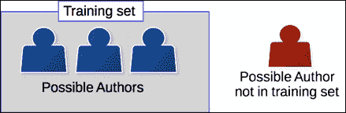

# 三十、作者归属

作者身份分析主要是一项文本挖掘任务，旨在仅基于作者的内容来确定有关作者的某些方面。 这可能包括年龄，性别或背景等特征。 在特定的**作者归属**任务中，我们旨在确定一组特定文档中谁是谁撰写的。 这是分类任务的典型案例。 在许多方面，作者权限分析任务是使用标准数据挖掘方法执行的，例如交叉折叠验证，特征提取和分类算法。

在本章中，我们将使用作者归属问题来拼凑我们在前几章中开发的数据挖掘方法的各个部分。 我们确定问题并讨论问题的背景和知识。 这使我们可以选择要提取的功能，从而为实现建立一个管道。 我们将测试两种不同类型的功能：功能词和字符 n-gram。 最后，我们将对结果进行深入分析。 我们将使用书籍数据集，然后使用非常混乱的真实电子邮件语料库。

我们将在本章中介绍的主题如下：

*   功能工程以及功能根据应用的不同
*   带着特定目标重新审视词袋模型
*   特征类型和字符 n-gram 模型
*   支持向量机
*   清理凌乱的数据集以进行数据挖掘

# 将文件归给作者

作者身份分析在**笔法**中具有背景，是对作者写作风格的研究。 这个概念的基础是每个人学习语言的方式略有不同，并且衡量人们写作中的细微差别将使我们能够仅使用他们的写作内容来区分他们。

该问题历来是使用手动分析和统计数据执行的，这很好地表明了可以通过数据挖掘将其自动化。 现代作者分析研究几乎完全基于数据挖掘，尽管仍然有相当多的工作需要使用语言样式进行更多手动驱动的分析。

作者分析有个子问题，主要子问题如下：

*   **作者身份分析**：这根据撰写内容确定作者的年龄，性别或其他特征。 例如，我们可以通过寻找说英语的特定方式来检测该人说英语的母语。
*   **作者身份验证**：这检查*该文档的作者是否也写了另一文档*。 这个问题就是您在法律法庭上通常会想到的。 例如，将分析犯罪嫌疑人的写作风格（从内容上看），看其是否与赎金记录相符。
*   **作者身份聚类**：这是作者身份验证的扩展，在中，我们使用聚类分析将来自大集合的文档分组为聚类，每个聚类由同一位作者编写。

但是，作者身份分析研究的最常见形式是作者身份归属，这是一种分类任务，我们试图预测一组作者中的哪位撰写了给定文档。

## 应用和用例

作者分析有许多用例。 的许多使用案例都涉及诸如验证作者身份，证明共享作者身份/出处或将社交媒体资料与实际用户链接等问题。

从历史的角度来看，我们可以使用作者身份分析来验证某些文档是否确实由其假定的作者撰写。 有争议的作者主张包括莎士比亚的一些戏剧，美国建国时期的联邦主义者论文以及其他历史著作。

单独的作者研究不能证明作者，但是可以提供支持或反对给定理论的证据。 例如，在测试给定十四行诗是否确实源于莎士比亚之前，我们可以分析莎士比亚的戏剧以确定他的写作风格。

一个更现代的用例是关联社交网络帐户的用例。 例如，恶意的在线用户可能在多个在线社交网络上设置帐户。 能够链接它们允许当局跟踪给定帐户的用户-例如，如果它正在骚扰其他在线用户。

过去使用的另一个示例是成为法庭上提供专家证词以确定给定人员是否撰写文档的支柱。 例如，犯罪嫌疑人可能被指控撰写骚扰他人的电子邮件。 作者分析的使用可以确定该人是否确实确实在写文件。 另一种基于法院的用途是解决版权被盗的主张。 例如，两名作者可能声称写过一本书，而作者身份分析可以提供证据证明可能的作者。

作者分析并不是万无一失的。 最近的一项研究发现，仅要求未受过培训的人隐藏其写作风格，就很难将文档赋予作者。 这项研究还研究了一种框架练习，要求人们以另一种人的风格写作。 事实证明，这种对他人的取证非常可靠，伪造的文件通常归因于被陷害的人。

尽管存在这些问题，作者身份分析仍在越来越多的领域中被证明是有用的，并且是一个有趣的数据挖掘问题，需要研究。

## 署名作者

作者身份归因是一项分类任务，通过该任务，我们具有一组候选作者，每个作者的一组文档（训练集）和一组未知作者的文档（测试集） 。 如果作者身份不明的文档肯定是属于其中一个候选者，我们将其称为**封闭问题**。


如果我们不能确定，则将其称为未解决的问题。 但是，这种区别不仅仅针对作者归属-在实际训练中可能没有实际班级的任何数据挖掘应用都被认为是一个开放性问题，任务是查找候选作者或不选择任何作者。



在作者身份归属中，我们通常对任务有两个限制。 首先，我们仅使用文档中的内容信息，而不使用有关书写时间，交付时间，笔迹样式等的元数据。 有多种方法可以将这些不同类型的信息中的模型进行组合，但这通常不被认为是作者身份归属，它更是一种数据融合应用。

第二个限制是我们不关注文档主题。 相反，我们寻找更显着的功能，例如单词使用，标点符号和其他基于文本的功能。 这里的理由是，一个人可以写许多不同的主题，因此担心他们的写作主题不会模拟他们的实际作者风格。 查看主题词也可能导致训练数据过拟合-我们的模型可能会训练来自同一作者的文档，也可能针对同一主题。 例如，如果您要通过查看此模块来建模我的作者风格，则您可能会得出结论，*数据挖掘*表示我的风格，而实际上我也在其他主题上写作。

从这里开始，用于执行作者身份归因的管道看起来很像我们在第 6 章，“使用朴素贝叶斯”的社交媒体洞察中开发的管道。 首先，我们从文本中提取特征。 然后，我们对这些功能执行一些功能选择。 最后，我们训练分类算法以适合模型，然后将其用于预测文档的类（在这种情况下为作者）。

我们将在本章中介绍一些差异，主要与所使用的功能有关。 但是首先，我们将定义问题的范围。

## 获取数据

我们将在本章中使用的数据是 Gutenberg 项目在[这个页面](http://www.gutenberg.org)上的一组书籍，该书籍是公共领域文献作品的存储库。 我用于这些实验的书籍来自不同的作者：

*   摊位 Tarkington（22 个标题）
*   查尔斯·狄更斯（44 题）
*   伊迪丝·内斯比特（10 个标题）
*   亚瑟·柯南·道尔（51 题）
*   马克·吐温（29 个标题）
*   理查德·弗朗西斯·伯顿爵士（11 个冠军）
*   埃米尔·加博里奥（10 标题）

总体而言，有 7 位作者撰写的 177 篇文档，为您提供了大量可参考的文字。 代码包中提供了标题的完整列表，以及下载链接和自动获取它们的脚本。

要下载这些书，我们使用请求库将文件下载到我们的数据目录中。 首先，设置数据目录并确保以下代码链接到该目录：

```pypy
import os
import sys
data_folder = os.path.join(os.path.expanduser("~"), "Data", "books")
```

接下来，从代码包中运行脚本以从 Gutenberg 项目下载每本书。 这会将它们放置在此数据文件夹的相应子文件夹中。

要运行该脚本，请从代码包的`Chapter 9`文件夹中下载`getdata.py`脚本。 将其保存到`notebooks`文件夹，然后在新单元格中输入以下内容：

```pypy
!load getdata.py
```

然后，从 IPython Notebook 的中，按 *Shift* + *输入*以运行单元格。 这会将脚本加载到单元格中。 然后再次单击代码，然后按 *Shift* + *输入*以运行脚本本身。 这将花费一些时间，但是它将打印一条消息以通知您它已完成。

在查看了这些文件之后，您会发现其中的许多文件都是非常混乱的-至少从数据分析的角度来看。 文件开始处有一个大型项目 Gutenberg 免责声明。 在进行分析之前，需要将其删除。

我们可以更改磁盘上的单个文件以删除这些内容。 但是，如果我们丢失数据怎么办？ 我们将丢失所做的更改，并可能无法复制研究。 因此，我们将在加载文件时执行预处理-这使我们可以确保结果是可复制的（只要数据源保持不变）。 代码如下：

```pypy
def clean_book(document):
```

我们首先将文档分成几行，因为我们可以通过开始和结束行来标识免责声明的开始和结束：

```pypy
    lines = document.split("\n")
```

我们将遍历每一行。 我们寻找指示书的开始的线和指示书的结束的线。 然后，我们将介于两者之间的文本作为本书本身。 代码如下：

```pypy
    start = 0
    end = len(lines)
    for i in range(len(lines)):
        line = lines[i]
        if line.startswith("*** START OF THIS PROJECT GUTENBERG"):
            start = i + 1
        elif line.startswith("*** END OF THIS PROJECT GUTENBERG"):
            end = i - 1
```

最后，我们将这些行与换行符连接在一起，以重新创建不带免责声明的书：

```pypy
    return "\n".join(lines[start:end])
```

现在，从这里，我们可以创建一个函数，该函数加载所有书籍，执行预处理，并将其与每个作者的班级号一起返回。 代码如下：

```pypy
import numpy as np
```

默认情况下，我们的函数签名使用包含每个包含实际书籍的子文件夹的父文件夹。 代码如下：

```pypy
def load_books_data(folder=data_folder):
```

我们创建用于存储文档本身和作者类的列表：

```pypy
    documents = []
    authors = []
```

然后，我们直接在父级中创建每个子文件夹的列表，因为脚本为每个作者创建了一个子文件夹。 代码如下：

```pypy
    subfolders = [subfolder for subfolder in os.listdir(folder)
                  if os.path.isdir(os.path.join(folder, subfolder))]
```

接下来，我们遍历这些子文件夹，并使用`enumerate`为每个子文件夹分配一个数字：

```pypy
    for author_number, subfolder in enumerate(subfolders):
```

然后，我们创建完整的子文件夹路径，并在该子文件夹中查找所有文档：

```pypy
        full_subfolder_path = os.path.join(folder, subfolder)
        for document_name in os.listdir(full_subfolder_path):
```

对于每个文件，我们都将其打开，阅读其中的内容，对其进行预处理并将其附加到我们的文档列表中。 代码如下：

```pypy
            with open(os.path.join(full_subfolder_path, document_name)) as inf:
                documents.append(clean_book(inf.read()))
```

我们还将分配给该作者的编号附加到我们的作者列表中，这将构成我们的课程：

```pypy
                authors.append(author_number)
```

然后，我们返回文档和类（稍后将其转换为每个索引的 NumPy 数组）：

```pypy
    return documents, np.array(authors, dtype='int')
```

现在，我们可以使用以下函数调用获取我们的文档和类：

```pypy
documents, classes = load_books_data(data_folder)
```

### 注意

该数据集很容易装入内存，因此我们可以一次加载所有文本。 如果整个数据集都不适合，则更好的解决方案是一次（或分批）从每个文档中提取特征，并将结果值保存到文件或内存矩阵中。

# 功能词

最早的一种功能，对于作者权分析仍然非常有效，一种功能是在词袋模型中使用功能词。 功能词是本身没有什么意义的词，但是创建（英语）句子是必需的。 例如，单词*，*和*（其中*）实际上是仅由它们在句子中的作用而不是其含义定义的词。 将此内容与诸如 *Tiger* 之类的内容词进行对比，该词具有明确的含义，当在句子中使用时会调用大型猫的图像。

并非总是清楚地阐明功能词。 一个好的经验法则是选择使用频率最高的单词（在所有可能的文档中，而不仅仅是同一作者的文档）。 通常，单词使用得越频繁，对作者身份分析的效果就越好。 相反，单词使用的频率越少，基于内容的文本挖掘就越有用，例如在下一章中，我们将讨论不同文档的主题。


功能词的使用较少地由文档的内容来定义，而更多地由作者的决定来定义。 这使它们成为区分不同用户之间的作者特征的理想人选。 例如，虽然许多美国人特别关注和*在句子中所用的*与*之间的区别，但是来自其他国家（如澳大利亚）的人们对此不太关注。 这意味着一些澳大利亚人将倾向于只使用一个单词或另一个单词，而另一些澳大利亚人可能会使用*，而*更多。 这种差异加上成千上万的其他细微差异构成了作者身份的模型。***

## 计数功能字

我们可以使用第 6 章，“使用朴素贝叶斯”的社交媒体洞察力来使用`CountVectorizer`类对功能词进行计数。 此类可以通过词汇表传递，这是它将要查找的一组单词。 如果未传递词汇表（在`Chapter 6`的代码中我们未传递词汇表），则它将从数据集中学习该词汇表。 所有单词都在培训文档集中（取决于课程的其他参数）。

首先，我们建立功能词的词汇表，它只是包含每个功能词的列表。 确切地说，哪些词是功能词，哪些不该争论。 从公开发表的研究中，我发现这个列表相当不错：

```pypy
function_words = ["a", "able", "aboard", "about", "above", "absent",
"according" , "accordingly", "across", "after", "against",
"ahead", "albeit", "all", "along", "alongside", "although",
"am", "amid", "amidst", "among", "amongst", "amount", "an",
"and", "another", "anti", "any", "anybody", "anyone",
"anything", "are", "around", "as", "aside", "astraddle",
"astride", "at", "away", "bar", "barring", "be", "because",
"been", "before", "behind", "being", "below", "beneath",
"beside", "besides", "better", "between", "beyond", "bit",
"both", "but", "by", "can", "certain", "circa", "close",
"concerning", "consequently", "considering", "could",
"couple", "dare", "deal", "despite", "down", "due", "during",
"each", "eight", "eighth", "either", "enough", "every",
"everybody", "everyone", "everything", "except", "excepting",
"excluding", "failing", "few", "fewer", "fifth", "first",
"five", "following", "for", "four", "fourth", "from", "front",
"given", "good", "great", "had", "half", "have", "he",
"heaps", "hence", "her", "hers", "herself", "him", "himself",
"his", "however", "i", "if", "in", "including", "inside",
"instead", "into", "is", "it", "its", "itself", "keeping",
"lack", "less", "like", "little", "loads", "lots", "majority",
"many", "masses", "may", "me", "might", "mine", "minority",
"minus", "more", "most", "much", "must", "my", "myself",
"near", "need", "neither", "nevertheless", "next", "nine",
"ninth", "no", "nobody", "none", "nor", "nothing",
"notwithstanding", "number", "numbers", "of", "off", "on",
"once", "one", "onto", "opposite", "or", "other", "ought",
"our", "ours", "ourselves", "out", "outside", "over", "part",
"past", "pending", "per", "pertaining", "place", "plenty",
"plethora", "plus", "quantities", "quantity", "quarter",
"regarding", "remainder", "respecting", "rest", "round",
"save", "saving", "second", "seven", "seventh", "several",
"shall", "she", "should", "similar", "since", "six", "sixth",
"so", "some", "somebody", "someone", "something", "spite",
"such", "ten", "tenth", "than", "thanks", "that", "the",
"their", "theirs", "them", "themselves", "then", "thence",
"therefore", "these", "they", "third", "this", "those",
"though", "three", "through", "throughout", "thru", "thus",
"till", "time", "to", "tons", "top", "toward", "towards",
"two", "under", "underneath", "unless", "unlike", "until",
"unto", "up", "upon", "us", "used", "various", "versus",
"via", "view", "wanting", "was", "we", "were", "what",
"whatever", "when", "whenever", "where", "whereas",
"wherever", "whether", "which", "whichever", "while",
"whilst", "who", "whoever", "whole", "whom", "whomever",
"whose", "will", "with", "within", "without", "would", "yet",
"you", "your", "yours", "yourself", "yourselves"]
```

现在，我们可以设置一个提取器来获取这些功能字的计数。 稍后我们将使用管道进行调整：

```pypy
from sklearn.feature_extraction.text import CountVectorizer
extractor = CountVectorizer(vocabulary=function_words)
```

## 用功能词分类

接下来，我们导入我们的类。 这里唯一的新事物是支持向量机，我们将在下一节中介绍（目前，仅将其视为标准分类算法）。 我们导入 SVC 类，用于分类的 SVM 以及我们之前看到的其他标准工作流程工具：

```pypy
from sklearn.svm import SVC
from sklearn.cross_validation import cross_val_score
from sklearn.pipeline import Pipeline
from sklearn import grid_search
```

支持向量机采用许多参数。 就像我说的，在下一节中详细介绍之前，我们将在这里盲目使用。 然后，我们使用字典来设置要搜索的参数。 对于`kernel`参数，我们将尝试`linear`和`rbf`。 对于`C`，我们将尝试使用值 1 和 10（这些参数的说明将在下一部分中介绍）。 然后，我们创建一个网格搜索以搜索以下参数以获得最佳选择：

```pypy
parameters = {'kernel':('linear', 'rbf'), 'C':[1, 10]}
svr = SVC()
grid = grid_search.GridSearchCV(svr, parameters)
```

### 注意

高斯核（例如`rbf`）仅适用于大小合理的数据集，例如要素数量少于 10,000 个时。

接下来，我们建立一个管道，该管道使用`CountVectorizer`（仅使用功能词）以及使用 SVM 的网格搜索进行特征提取步骤。 代码如下：

```pypy
pipeline1 = Pipeline([('feature_extraction', extractor),
                     ('clf', grid)
                     ])
```

接下来，我们应用`cross_val_score`来获得该管道的交叉验证分数。 结果为 0.811，这意味着大约有 80％的预测正确。 对于 7 位作者来说，这是一个很好的结果！

# 支持向量机

**支持向量机**（**SVM**）是基于简单直观的思想的分类算法。 它仅在两个类之间执行分类（尽管我们可以将其扩展到更多类）。 假设我们的两个类可以用一条线分开，使得该线之上的任何点都属于一个类，而该线之下的任何点都属于另一类。 支持向量机找到这条线并将其用于预测，与线性回归的工作方式大致相同。 但是，SVM 找到用于分离数据集的最佳*行*。

在下图中，我们用三行分隔数据集：蓝色，黑色和绿色。 您会说哪个是最好的选择？


凭直觉，人通常会选择蓝线作为*最佳*选项，因为这会最大程度地分离数据。 也就是说，它与每个类别中任何点的最大距离。

找到这条线是一个优化问题，其基础是找到边缘之间的最大距离的线。

### 注意

这些方程式的推导超出了本模块的范围，但我建议感兴趣的读者详细阅读[这个页面](http://en.wikibooks.org/wiki/Support_Vector_Mach)的推导。 另外，您可以访问[这个页面](http://docs.opencv.org/doc/tutorials/ml/introduction_to_svm/introduction_to_svm.html)。

## 使用 SVM 分类

在训练模型后，我们有一条最大边距的线。 然后，新样本的分类只是问一个问题：*是落在该线之上还是之下？* 如果它落在该线的上方，则被预测为一类。 如果在该线以下，则将其预测为另一类。

对于多个类，我们创建了多个 SVM-每个二进制分类器。 然后，我们使用多种策略中的任何一种将它们连接起来。 一种基本策略是为每个类别创建一个对所有分类器，我们在其中使用两个类别（给定的类别和所有其他样本）进行训练。 我们为每个类别执行此操作，并在一个新样本上运行每个分类器，并从每个类别中选择最佳匹配项。 在大多数 SVM 实现中，都会自动执行此过程。

我们在之前的代码中看到了两个参数：`C`和`kernel`。 我们将在下一节介绍`kernel`参数，但是`C`参数是安装 SVM 的重要参数。 `C`参数涉及分类器在过度拟合的风险下应旨在正确预测所有训练样本的程度。 选择较高的`C`值将找到一条边距较小的分隔线，目的是对所有训练样本进行正确分类。 选择较低的`C`值将导致分离线具有较大的余量-即使这意味着某些训练样本未正确分类。 在这种情况下，较低的`C`值表示过拟合的机会较小，存在选择通常较差的分离线的风险。

SVM（以其基本形式）的局限性在于它们仅分离线性可分离的数据。 如果没有数据该怎么办？ 对于这个问题，我们使用内核。

## 内核

当数据无法线性分离时，诀窍是将其嵌入到高维空间中。 这意味着要花很多时间在细节上，这是要添加伪特征，直到数据可线性分离为止（如果添加了足够多的正确种类的特征，则总是会发生这种情况）。

诀窍在于，当找到最佳数据线以分离数据集时，我们通常会计算样本的内部生成量。 给定使用点积的功能，我们可以有效地制造新功能，而不必实际定义这些新功能。 这很方便，因为我们仍然不知道这些功能将是什么。 现在，我们将`kernel`定义为一个函数，该函数本身就是数据集中两个样本的函数的点积，而不是基于样本（及其组成特征）本身。

现在我们可以计算出点积是什么（或近似值），然后使用它。

有个常用内核。 `linear`内核是最简单的内核，它只是两个样本特征向量，权重特征和偏差值的点积。 还有一个多项式内核，它将点积提高到给定的度数（例如 2）。 其他函数包括高斯函数（`rbf`）和 Sigmoidal 函数。 在我们先前的代码示例中，我们在`linear`内核和`rbf`内核之间进行了测试。

所有这些推导的最终结果是，这些内核有效地定义了两个样本之间的距离，该距离用于支持向量机中新样本的分类。 从理论上讲，可以使用任何距离，尽管它可能不具有能够轻松优化 SVM 训练的相同特征。

在 scikit-learn 的 SVM 的实现中，我们可以定义`kernel`参数来更改在计算中使用哪个内核函数，就像我们在前面的代码示例中看到的那样。


# 字符 n-gram

我们看到了功能词如何用作预测文档作者的特征。 另一种特征类型是**字符 n-gram**。 n-gram 是`n`对象的序列，其中`n`是一个值（对于文本，通常在 2 到 6 之间）。 *单词 n-gram* 已用于许多研究中，通常与文档的主题有关。 但是，字符 n-gram 已被证明具有高质量的作者身份。

通过将文档表示为字符序列，可以在文本文档中找到字符 n-gram。 然后从该序列中提取这些 n-gram，并训练模型。 有很多不同的模型，但是一个标准模型与我们之前使用的词袋模型非常相似。

对于训练语料库中的每个不同的 n-gram，我们为其创建一个特征。 n-gram 的示例是`<e t>`，它是字母`e`，空格，然后是字母`t`（尖括号用于表示开始和结束 而不是其中的一部分）。 然后，我们使用训练文档中每个 n-gram 的频率训练模型，并使用创建的特征矩阵训练分类器。

### 注意

字符 n 元语法有多种定义方式。 例如，某些应用仅选择单词内字符，而忽略空格和标点符号。 有些人使用此信息（例如本章中的实现）。

关于字符 n-gram 为何起作用的一个普遍理论是，人们通常会写出他们可以轻松说出的单词，而字符 n-gram（至少当 n 在 2 到 6 之间时）是音素的一个很好的近似值。 说的话。 从这个意义上讲，使用字符 n-gram 可以近似单词的声音，也可以近似您的写作风格。 这是创建新功能时的常见模式。 首先，我们有一个理论来研究哪些概念会影响最终结果（作者风格），然后创建特征来近似或度量这些概念。

字符 n 元语法矩阵的主要特征是它稀疏并且稀疏度随 n 值较高而迅速增加。 对于`n`-值为 2，大约 75％的特征矩阵为零。 对于`n`值为 5，超过 93％的是零。 但是，这通常比同类型的单词 n-gram 矩阵稀疏，并且使用基于单词的分类的分类器不会引起很多问题。

## 提取字符 n-gram

将使用我们的`CountVectorizer`类提取字符 n-gram。 为此，我们设置`analyzer`参数并为`n`指定一个值以提取 n-gram。

scikit-learn 中的实现使用 n-gram *范围*，使您可以同时提取多个大小的 n-gram。 在本实验中，我们不会研究不同的`n`-值，因此我们将这些值设置为相同。 要提取大小为 3 的 n-gram，您需要指定（3，3）作为 n-gram 范围的值。

我们可以重用先前代码中的网格搜索。 我们需要做的就是在新管道中指定新功能提取器：

```pypy
pipeline = Pipeline([('feature_extraction', CountVectorizer(analyzer='char', ngram_range=(3, 3))),
                     ('classifier', grid)
                     ])
scores = cross_val_score(pipeline, documents, classes, scoring='f1')
print("Score: {:.3f}".format(np.mean(scores)))
```

### 注意

功能词和字符 n 元语法词之间存在很多隐式重叠，因为功能词中的字符序列更可能出现。 但是，实际特征非常不同，字符 n-gram 捕获标点符号，而功能词则没有。 例如，一个字符 n-gram 在句子的末尾包括句号，而基于功能词的方法将仅使用前一个词本身。


# 使用 Enron 数据集

在 1990 年代后期，安然（HTG0）是世界上最大的能源公司之一，报告收入超过 1000 亿美元。 它拥有 20,000 多名员工，并且-到 2000 年-似乎没有迹象表明有什么不对劲。

在 2001 年，发生了*安然丑闻*，发现该安然正在采取系统的，欺诈性的会计惯例。 这种欺诈行为是故意的，遍及整个公司，涉及金额可观。 在公开发现此消息后，其股价从 2000 年的 90 多美元跌至 2001 年的 1 美元以下。安然不久便申请了破产，一团糟，最终需要 5 年以上的时间才能解决。

作为对安然公司的调查的一部分，美国联邦能源管理委员会公开发布了 60 万封电子邮件。 从那时起，此数据集已用于从社交网络分析到欺诈分析的所有内容。 它也是进行作者身份分析的绝佳数据集，因为我们能够从单个用户的已发送文件夹中提取电子邮件。 这使我们可以创建一个比许多以前的数据集大得多的数据集。

## 访问 Enron 数据集

可在[这个页面](https://www.cs.cmu.edu/~./enron/)上获取完整的 Enron 电子邮件的集。

### 注意

完整的数据集为 423 MB，压缩格式为`gzip`。 如果您没有基于 Linux 的计算机来解压缩（解压缩）该文件，请获取其他程序，例如如 [7-zip](http://www.7-zip.org/)。

下载完整的语料库并将其解压缩到您的数据文件夹中。 默认情况下，它将解压缩到名为`enron_mail_20110402`的文件夹中。

在寻找作者身份信息时，我们只希望可以将电子邮件归因于特定作者。 因此，我们将查看每个用户的已发送文件夹，即他们已发送的电子邮件。

在笔记本中，设置 Enron 数据集的数据文件夹：

```pypy
enron_data_folder = os.path.join(os.path.expanduser("~"), "Data", "enron_mail_20110402", "maildir")
```

## 创建数据集加载器

现在，我们可以创建一个函数，该函数将随机选择几个作者，并在其发送的文件夹中返回每个电子邮件。 具体来说，我们正在寻找有效载荷，即内容而不是电子邮件本身。 为此，我们将需要一个电子邮件解析器。 代码如下：

```pypy
from email.parser import Parser
p = Parser()
```

稍后我们将使用它从数据文件夹中的电子邮件文件中提取有效负载。

我们将随机选择作者，因此我们将使用随机状态，该状态允许我们在需要时复制结果：

```pypy
from sklearn.utils import check_random_state
```

通过我们的数据加载功能，我们将有很多选择。 这些大多数确保我们的数据集相对平衡。 有些作者的发送邮件中将有数千封电子邮件，而其他作者则只有几十封。 我们将搜索限制为仅使用`min_docs_author`接收至少 10 封电子邮件的作者，并使用`max_docs_author`参数从每位作者接收最多 100 封电子邮件。 我们还指定了我们希望获得多少作者-默认情况下，使用`num_authors`参数为 10 位作者。 代码如下：

```pypy
def get_enron_corpus(num_authors=10, data_folder=data_folder,
                     min_docs_author=10, max_docs_author=100,
                     random_state=None):
    random_state = check_random_state(random_state)
```

接下来，我们列出 data 文件夹中的所有文件夹，它们是 Enron 员工的单独电子邮件地址。 当我们随机地对它们进行洗牌时，我们可以在每次运行代码时选择一个新的集合。 请记住，设置随机状态将使我们能够复制以下结果：

```pypy
    email_addresses = sorted(os.listdir(data_folder))
    random_state.shuffle(email_addresses)
```

### 注意

我们对电子邮件地址进行排序，只是将它们乱码，似乎有些奇怪。 `os.listdir`函数并不总是返回相同的结果，因此我们首先对其进行排序以获得一定的稳定性。 然后，我们使用随机状态进行混洗，这意味着我们的混洗可以根据需要重现过去的结果。

然后，我们设置了我们的文档和类列表。 我们还创建了一个`author_num`，它将告诉我们每个新作者要使用哪个类。 我们不会使用我们之前使用的`enumerate`技巧，因为我们可能不会选择某些作者。 例如，如果作者没有发送 10 封电子邮件，我们将不使用它。 代码如下：

```pypy
    documents = []
    classes = []
    author_num = 0
```

我们还将记录使用的作者以及分配给他们的班级编号。 这不是用于数据挖掘，而是将在可视化中使用，以便我们可以更轻松地识别作者。 该词典将简单地将电子邮件用户名映射到类值。 代码如下：

```pypy
    authors = {}
```

接下来，我们遍历每个电子邮件地址，并查找名称中带有“已发送”的所有子文件夹，以指示已发送的邮箱。 代码如下：

```pypy
    for user in email_addresses:
      users_email_folder = os.path.join(data_folder, user)
      mail_folders = [os.path.join(users_email_folder, subfolder) for subfolder in os.listdir(users_email_folder)
                        if "sent" in subfolder]
```

然后，我们获取此文件夹中的每封电子邮件。 我把这个调用放在了 try-except 块中，因为有些作者的发送邮件中有子目录。 我们可以使用一些更详细的代码来获取所有这些电子邮件，但是现在我们将继续并忽略这些用户。 代码如下：

```pypy
        try:
          authored_emails = [open(os.path.join(mail_folder, email_filename), encoding='cp1252').read()
          for mail_folder in mail_folders
          for email_filename in os.listdir(mail_folder)]
        except IsADirectoryError:
            continue
```

接下来，我们检查至少有 10 封电子邮件（或设置为`min_docs_author`的任何内容）：

```pypy
        if len(authored_emails) < min_docs_author:
            continue
```

作为的下一步，如果我们收到来自该作者的过多电子邮件，则仅接收前 100 条电子邮件（来自`max_docs_author`）：

```pypy
        if len(authored_emails) > max_docs_author:
            authored_emails = authored_emails[:max_docs_author]
```

接下来，我们解析电子邮件以提取内容。 我们对标题不感兴趣-作者对此处的内容几乎没有控制权，因此它不能为作者身份分析提供良好的数据。 然后，我们将这些电子邮件有效负载添加到我们的数据集中：

```pypy
        contents = [p.parsestr(email)._payload for email in authored_emails]
        documents.extend(contents)
```

然后，对于添加到数据集中的每封电子邮件，我们都为该作者添加一个类值：

```pypy
        classes.extend([author_num] * len(authored_emails))
```

然后，我们记录用于该作者的类编号，然后按*，然后按*递增：

```pypy
        authors[user] = author_num
        author_num += 1
```

然后，我们检查我们是否有足够的作者，如果有，我们跳出循环返回数据集。 代码如下：

```pypy
        if author_num >= num_authors or author_num >= len(email_addresses):
            break
```

然后，我们返回数据集的文档和类，以及我们的作者映射。 代码如下：

```pypy
    return documents, np.array(classes), authors
```

在此函数之外，我们现在可以通过执行以下函数调用来获取数据集。 我们将在这里使用 14 的随机状态（与本模块一样），但是您可以尝试其他值或将其设置为 *none*，以在每次调用函数时获得随机设置：

```pypy
documents, classes, authors = get_enron_corpus(data_folder=enron_data_folder, random_state=14)
```

如果您看一下数据集，我们还需要进行进一步的预处理。 我们的电子邮件非常混乱，但是（从数据分析的角度来看）最糟糕的一点是，这些电子邮件包含其他作者的来信，形式为。 以以下电子邮件为例：`documents[100]`：

> *我对时机感到失望，但我理解。 谢谢。 标记*
> 
> *-----原始消息-----*
> 
> *来自：马克·格林伯格*
> 
> *发送：2001 年 9 月 28 日，星期五，下午 4:19*
> 
> 致：海迪克（Mark E.）
> 
> *主题：网站*
> 
> *标记-*
> 
> *仅供参考-我在下面附上了该网站拟议的新外观的屏幕截图。 我们需要进行一些调整，但是我认为这比我们现在的外观干净得多。*

本文档包含另一封作为回复的电子邮件，作为一种常见的电子邮件格式，附加在底部。 电子邮件的第一部分来自 *Mark Haedicke*，而第二部分是 *Mark Greenberg* 写给 Mark Haedicke 的先前电子邮件。 只有前面的文本（**-----原始消息的第一个实例-----**）可以归因于作者，这是我们真正担心的唯一一环。

通常，提取此信息并不容易。 电子邮件是一种众所周知的不好使用的格式。 不同的电子邮件客户端添加其自己的标头，以不同的方式定义答复，并根据需要进行操作。 电子邮件在当前环境中可以正常工作真是令人惊讶。

我们可以寻找一些常用的模式。 `quotequail`程序包将查找这些，并且可以找到电子邮件的新部分，丢弃回复和其他信息。

### 提示

您可以使用 pip `pip3 install quotequail`安装`quotequail`。

我们将编写一个简单的函数来包装`quotequail`功能，使我们能够轻松地在所有文档上调用它。 首先，我们导入`quotequail`并设置函数定义：

```pypy
import quotequail
def remove_replies(email_contents):
```

接下来，我们使用`quotequail`展开电子邮件，这将返回包含电子邮件不同部分的字典。 代码如下：

```pypy
    r = quotequail.unwrap(email_contents)
```

在某些情况下，`r`可以为无。 如果无法解析电子邮件，则会发生这种情况。 在这种情况下，我们只返回完整的电子邮件内容。 在处理实际数据集时，通常需要这种凌乱的解决方案。 代码如下：

```pypy
    if r is None:
        return email_contents
```

我们感兴趣的电子邮件的实际部分称为`text_top`（由`quotequail`表示）。 如果存在，我们将其作为电子邮件中有趣的部分返回。 代码如下：

```pypy
    if 'text_top' in r:
        return r['text_top']
```

如果不存在，则`quotequail`找不到。 可能在电子邮件中找到其他文本。 如果存在，我们仅返回该文本。 代码如下：

```pypy
    elif 'text' in r:
        return r['text']
```

最后，如果无法获得结果，我们只返回电子邮件内容，希望它们为我们的数据分析提供一些好处：

```pypy
    return email_contents
```

现在，我们可以通过在每个文档上运行此功能来预处理所有文档：

```pypy
documents = [remove_replies(document) for document in documents]
```

我们之前的电子邮件示例现在已经得到了很大的澄清，并且仅包含 *Mark Greenberg* 编写的电子邮件：

> *我对时机感到失望，但我理解。 谢谢。 标记*

## 全部放在一起

我们可以使用先前实验的中现有的参数空间和分类器-我们要做的就是将其重新调整为新数据。 默认情况下，对 scikit-learn 的培训是从头开始的，随后对`fit()`的调用将丢弃任何先前的信息。

### 注意

有一种称为在线学习的算法，可以用新样本更新训练，而不必每次都重新开始训练。 我们将在本模块的稍后部分看到在线学习的实际应用，包括下一章[，第 10 章](31.html "Chapter 10. Clustering News Articles")，“聚类新闻文章”。

和以前一样，我们可以使用`cross_val_score`计算分数并打印结果。 代码如下：

```pypy
scores = cross_val_score(pipeline, documents, classes, scoring='f1')
print("Score: {:.3f}".format(np.mean(scores)))
```

结果是 0.523，对于这样一个混乱的数据集，这是一个合理的结果。 添加更多数据（例如增加数据集加载中的`max_docs_author`）可以改善这些结果。

## 评估

通常，永远不要将评估基于单个数字。 在 f 得分的情况下，它通常比*技巧*更强健，尽管它们没有用，但仍能给出良好的分数。 一个例子就是准确性。 正如我们在上一章中所述，垃圾邮件分类器可以将所有内容预测为垃圾邮件，并且可以达到 80％以上的准确性，尽管该解决方案根本没有用。 因此，通常值得对结果进行更深入的研究。

首先，我们将研究混淆矩阵，就像在第 8 章，“使用神经网络击败 CAPTCHA”一样。 在我们这样做之前，我们需要预测一个测试集。 先前的代码使用`cross_val_score`，实际上并没有给我们提供可以使用的经过训练的模型。 因此，我们将需要改装一个。 为此，我们需要培训和测试子集：

```pypy
from sklearn.cross_validation import train_test_split
training_documents, testing_documents, y_train, y_test = train_test_split(documents, classes, random_state=14)
```

接下来，我们将管道调整到培训文档中，并为测试集创建预测：

```pypy
pipeline.fit(training_documents, y_train)
y_pred = pipeline.predict(testing_documents)
```

此时，您可能想知道参数的最佳组合实际上是什么。 我们可以很容易地从网格搜索对象中提取它（这是管道的`classifier`步骤）：

```pypy
print(pipeline.named_steps['classifier'].best_params_)
```

结果为您提供了分类器的所有参数。 但是，大多数参数是我们没有碰过的默认值。 我们搜索的是`C`和`kernel`，它们分别设置为`1`和`linear`。

现在我们可以创建一个混淆矩阵：

```pypy
from sklearn.metrics import confusion_matrix
cm = confusion_matrix(y_pred, y_test)
cm = cm / cm.astype(np.float).sum(axis=1)
```

接下来，我们得到我们的作者，以便我们可以正确地标记轴。 为此，我们使用 Enron 数据集加载的`authors`字典。 代码如下：

```pypy
sorted_authors = sorted(authors.keys(), key=lambda x:authors[x])
```

最后，我们使用`matplotlib`显示混淆矩阵。 与上一章相比，唯一的变化如下。 只需用本章实验中的作者替换字母标签：

```pypy
%matplotlib inline
from matplotlib import pyplot as plt
plt.figure(figsize=(10,10))
plt.imshow(cm, cmap='Blues')
tick_marks = np.arange(len(sorted_authors))
plt.xticks(tick_marks, sorted_authors)
plt.yticks(tick_marks, sorted_authors)
plt.ylabel('Actual')
plt.xlabel('Predicted')
plt.show()
```

结果如下图所示：


我们可以看到，在大多数情况下，作者的预测是正确的-存在一条清晰的对角线，其值很高。 但是，错误的来源很多（较暗的值更大）：例如，通常预测来自用户`baughman-d`的电子邮件来自`reitmeyer-j`。


