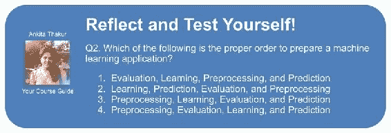

# 第 1 章。赋予计算机学习数据的能力

在我看来，*机器学习*是使数据有意义的算法的应用和科学，是所有计算机科学中最激动人心的领域！ 我们生活在一个数据丰富的时代。 使用机器学习领域的自学习算法，我们可以将这些数据转化为知识。 得益于近年来开发的许多强大的开源库，可能再没有比现在更好的时机进入机器学习领域并学习如何利用强大的算法来发现数据模式并对未来事件做出预测。

在本章中，我们将学习机器学习的主要概念和不同类型。 连同对相关术语的基本介绍，我们将为成功使用机器学习技术解决实际问题奠定基础。

在本章中，我们将介绍以下主题：

*   机器学习的一般概念
*   三种学习和基本术语
*   成功设计机器学习系统的基础

# 如何将数据转化为知识

在现代技术的这个时代，我们拥有大量的资源：大量的结构化和非结构化数据。 在 20 世纪下半叶，机器学习作为*人工智能*的一个子领域发展起来，其中涉及开发自学习算法以从该数据中获取知识以进行预测。 机器学习不再需要人工从大量数据的分析中得出规则并建立模型，而是提供了一种更有效的替代方法来捕获数据中的知识，从而逐步提高了预测模型的性能并做出了数据驱动的决策。 机器学习不仅在计算机科学研究中变得越来越重要，而且在我们的日常生活中也起着越来越重要的作用。 借助机器学习，我们可以使用强大的电子邮件垃圾邮件过滤器，便捷的文本和语音识别软件，可靠的 Web 搜索引擎，具有挑战性的国际象棋棋手，以及希望不久之后可以使用的安全高效的自动驾驶汽车。

# 三种不同类型的机器学习

在本节中，我们将研究三种类型的机器学习：*监督学习*，*非监督学习*和*强化学习*。 我们将了解这三种不同学习类型之间的基本区别，并使用概念性示例，为可以应用这些问题的实际问题领域发展直觉：

## 通过监督学习对未来进行预测

监督学习中的主要目标是从标记的*训练*数据中学习一个模型，该模型可让我们对看不见或将来的数据进行预测。 在此，术语*监督*是指一组样本，其中所需的输出信号（标签）是已知的。

考虑到电子邮件垃圾邮件过滤的示例，我们可以在标签电子邮件，正确标记为垃圾邮件的电子邮件的语料库上使用监督机器学习算法训练模型，以预测是否有新的电子邮件 -mail 属于两个类别之一。 具有离散*类标签*的监督学习任务，例如在先前的电子邮件垃圾邮件过滤示例中，也称为*分类*任务。 监督学习的另一个子类别是*回归*，其中结果信号是一个连续值：

### 用于预测类别标签的分类

分类是监督学习的子类别，目的是根据过去的观察结果预测新实例的类别标签。 这些类标签是离散的无序值，可以理解为实例的*组成员资格*。 前面提到的电子邮件垃圾邮件检测示例代表了*二进制分类*任务的典型示例，其中机器学习算法学习了一组规则以区分两种可能的类别：垃圾邮件和非垃圾邮件。 垃圾邮件。

但是，类标签集不必具有二进制性质。 通过监督学习算法学习的预测模型可以将训练数据集中显示的任何类别标签分配给新的未标签实例。 *多类别分类*任务的典型示例是手写字符识别。 在这里，我们可以收集一个训练数据集，该数据集由字母表中每个字母的多个手写示例组成。 现在，如果用户通过输入设备提供了新的手写字符，我们的预测模型将能够以一定的准确性预测字母表中的正确字母。 但是，我们的机器学习系统将无法正确识别零到九的任何数字，例如，如果它们不是我们训练数据集的一部分。

下图说明了给定 30 个训练样本的二进制分类任务的概念：15 个训练样本被标记为*负面类别*（圆圈），而 15 个训练样本被标记为*正面类别* ]（加号）。 在这种情况下，我们的数据集是二维的，这意味着每个样本都有两个与之关联的值：`x[1]`和`x[2]`。 现在，我们可以使用监督式机器学习算法来学习一条规则（决策边界以黑色虚线表示），该规则可以将这两个类别分开，并根据`x[1]`和`x[2]`将新数据分为这两个类别中的每一个 值：

### 预测连续结果的回归

我们在的上一节中了解到，分类的任务是为实例分配分类无序的标签。 监督学习的第二种类型是对连续结果的预测，这也称为回归分析。 在*回归分析*中，我们得到了许多*预测变量*（解释性）变量和连续响应变量（结果），我们试图找到这些变量之间的关系，使我们能够 预测结果。

例如，让我们假设我们对预测学生的数学 SAT 成绩感兴趣。 如果为考试而花费的时间与最终分数之间存在关联，我们可以将其用作训练数据，以学习一个模型，该模型利用学习时间来预测计划参加此考试的未来学生的考试分数。

### 注意

术语*回归*由弗朗西斯·加尔顿（Francis Galton）于 1886 年在他的文章*向遗传性中枢的平庸回归*中提出。 人口不会随着时间增加。 他观察到父母的身高并未传递给孩子，但孩子的身高正在向人口均值回归。

下图说明了*线性回归*的概念。 给定一个预测变量`x`和一个响应变量`y`，我们对该数据拟合一条直线，以使采样点和拟合点之间的距离（通常是平均平方距离）最小化 线。 现在，我们可以使用从该数据中学到的截距和斜率来预测新数据的结果变量：

## 通过强化学习解决互动问题

机器学习的另一种类型是强化学习。 在强化学习中，目标是开发一个基于与*环境*的交互作用来提高其性能的系统（ *agent* ）。 由于有关环境当前状态的信息通常还包含所谓的*奖励*信号，因此我们可以将强化学习视为与*监督的*学习相关的领域。 但是，在强化学习中，此反馈不是正确的地面真理标签或值，而是衡量*奖励*函数对动作的评估程度的方法。 通过与环境的交互，代理可以使用强化学习来学习一系列行动，这些行动可以通过探索性的试错法或深思熟虑的计划来最大化这种奖励。

强化学习的一个流行示例是国际象棋引擎。 在这里，座席根据棋盘的状态（环境）决定一系列动作，奖励可以定义为游戏结束时*赢*或*输*：

## 通过无监督学习发现隐藏结构

在监督学习中，当我们训练模型时，我们事先知道*正确答案*，在强化学习中，我们定义了*奖励*针对特定动作的度量 代理人。 但是，在无监督学习中，我们正在处理未标记的数据或*未知结构*的数据。 使用无监督学习技术，我们可以在没有已知结果变量或奖励函数指导的情况下，探索数据结构以提取有意义的信息。

### 通过聚类查找子组

*聚类*是一种探索性数据分析技术，它使我们可以将一堆信息组织成有意义的子组（*集群*），而无需事先知道它们的组成员身份。 分析期间可能出现的每个聚类定义一组对象，这些对象具有一定程度的相似性，但与其他聚类中的对象更为不同，这就是为什么聚类有时也称为“无监督分类”的原因。 聚类是一种用于构造信息并在数据之间派生有意义的关系的出色技术，例如，它允许营销人员根据他们的兴趣来发现客户组，以开发独特的营销程序。

下图说明了如何基于它们的特征`x[1]`和`x[2]`的相似性，将聚类应用于将未标记的数据分为三个不同的组：

### 降低数据压缩量

无监督学习的另一个子字段是*降维*。 通常，我们使用的是高维数据（每次观察都带有大量测量值），这可能对有限的存储空间和机器学习算法的计算性能提出了挑战。 无监督降维是特征预处理中从数据中去除噪声的一种常用方法，这还会降低某些算法的预测性能，并在保留大多数相关信息的同时将数据压缩到较小的维子空间中。

有时，降维对于可视化数据也很有用，例如，可以将高维特征集投影到一维，二维或三维特征空间上，以便通过 3D 或 2D 对其进行可视化 -散点图或直方图。 下图显示了一个示例，其中应用了非线性降维将 3D *Swiss Roll* 压缩到新的 2D 特征子空间上：

# 基本术语和符号介绍

现在，我们已经讨论了机器学习的三大类（监督学习，无监督学习和强化学习），下面让我们看一下将在下一章中使用的基本术语。 下表描述了 *Iris* 数据集的摘录，其中是机器学习领域中的经典示例。 鸢尾花数据集包含来自三个不同物种的 150 种鸢尾花的测量值：*Setosa*，*Versicolor* 和 *Virginica*。 在这里，每个花朵样本代表我们数据集中的一行，并且以厘米为单位的花朵测量值存储为列，我们也将其称为数据集的特征：

为了使标记和实现简单而有效，我们将使用*线性代数*的一些基础知识。 在以下各章中，我们将使用*矩阵*和*向量*表示法来引用我们的数据。 我们将遵循通用约定将每个样本表示为特征矩阵`X`中的单独行，其中每个特征都存储为单独的列。

然后，可以将由 150 个样本和 4 个要素组成的 Iris 数据集写为`150 x 4`矩阵`x ∈ R^(150x4)`：

### 注意

在本模块的其余部分，我们将使用上标*（i）*指代`i`训练样本，下标`j`指代`j`训练数据集的维度。

我们分别使用小写的粗体字母表示向量`x ∈ R^(nx1)`和使用大写的粗体字母表示矩阵`X ∈ R^(nxm)`。 要引用向量或矩阵中的单个元素，我们用斜体写字母（分别为`x^(n)`或`x^(m, n)`）。

例如，`x^(150, 1)`是指花朵样品 150 的第一维度，即*萼片长度*。 因此，该特征矩阵中的每一行都代表一个花朵实例，并且可以写为四维行向量`x^(i) ∈ R(1x4)`和`x^(i) = [x^(i, 1), x^(i, 2), x^(i, 3), x^(i, 4)]`。

每个要素维都是一个 150 维的列向量`x[j] ∈ R(150x1)`，例如：

同样，我们将目标变量（此处为类标签）存储为 150 维列向量`y = [y^(1), ..., y^(150)]^T, y = {setosa, versicolor, verginica}`。

# 建立机器学习系统的路线图

在前面的中，我们讨论了机器学习的基本概念以及三种不同的学习类型。 在本节中，我们将讨论伴随学习算法的机器学习系统的其他重要部分。 下图显示了在*预测模型*中使用机器学习的典型工作流程图，我们将在以下小节中进行讨论：

## 预处理–使数据成形

原始数据很少以学习算法的最佳性能所必需的形式出现。 因此，数据的*预处理*是任何机器学习应用中最关键的步骤之一。 如果以上一节中的鸢尾花数据集为例，我们可以将原始数据视为一系列花图像，以从中提取有意义的特征。 有用的功能可能是颜色，色调，花朵的强度，高度以及花朵的长度和宽度。 许多机器学习算法还要求所选特征必须具有相同的比例才能获得最佳性能，这通常是通过将特征转换为[0，1]范围或均值和单位方差为零的标准正态分布来实现的，因为我们将 请参阅后面的章节。

某些选定的特征可能高度相关，因此在一定程度上是多余的。 在那些情况下，降维技术可用于将特征压缩到较低维子空间上。 减少特征空间的维数具有以下优点：需要较少的存储空间，并且学习算法可以运行得更快。

为了确定我们的机器学习算法是否不仅在训练集上表现良好，而且还可以很好地推广到新数据，我们还希望将数据集随机分为单独的训练和测试集。 我们使用训练集来训练和优化我们的机器学习模型，同时保留测试集直到最后评估最终模型。

## 训练和选择预测模型

正如我们将在后面的章节中看到的那样，已经开发了许多不同的机器学习算法来解决不同的问题任务。 可以从 David Wolpert 著名的*没有免费午餐定理*中总结出一个重要的观点，那就是我们不能“免费”学习（*学习算法之间缺乏先验区分*， DH Wolpert 1996；*没有免费的午餐定理用于优化*，DH Wolpert 和 WG Macready，1997）。 直观地讲，我们可以将这一概念与流行语联系起来：“*如果您仅有的工具是锤子，我想这很诱人，就好像把它当作钉子*一样对待”（Abraham Maslow，1966 年 ）。 例如，每种分类算法都有其固有的偏差，如果不对任务进行任何假设，则没有哪个分类模型会具有优势。 因此，在实践中，有必要比较至少几种不同的算法，以训练和选择性能最佳的模型。 但是，在我们可以比较不同的模型之前，我们首先必须确定一个衡量绩效的指标。 一种常用的度量标准是分类准确性，它定义为正确分类的实例的比例。

要问的一个合法问题是：*如果不将测试集用于模型选择，而将其保留用于最终模型评估，那么我们如何知道哪个模型在最终测试数据集和真实数据上表现良好？* 为了解决此问题中嵌入的问题，可以使用不同的交叉验证技术，其中将训练数据集进一步分为训练和*验证子集*以估计[HTG5 模型的泛化性能。 最后，我们也不能期望软件库提供的不同学习算法的默认参数对于我们的特定问题任务是最佳的。 因此，我们将在以后的章节中频繁使用超参数*优化技术*，这些技术可帮助我们微调模型的性能。 直观地，我们可以将这些超参数视为不是从数据中学习到的参数，而是代表我们可以用来提高其性能的模型的旋钮，当我们看到实际示例时，这些参数将在后面的章节中变得更加清楚。

## 评估模型并预测看不见的数据实例

在我们选择了适合训练数据集的模型之后，我们可以使用测试数据集来估计它在看不见的数据上的表现如何，以估计泛化误差。 如果我们对其性能感到满意，我们现在可以使用此模型来预测新的未来数据。 很重要，请注意，先前提到的过程的参数（例如特征缩放和降维）仅从训练数据集中获取，并且稍后再次应用相同的参数来转换测试数据集 与任何新数据样本一样，否则测试数据上的性能可能会过分乐观。

# 使用 Python 进行机器学习

Python 是上最流行的数据科学编程语言之一，因此拥有由其强大社区开发的大量有用的附加库。

尽管对于诸如计算密集型任务，解释性语言（如 Python）的性能不如低级编程语言，但已开发了诸如 *NumPy* 和 *SciPy* 等扩展库。 它们在较低层的 Fortran 和 C 实现的基础上进行，以便在多维数组上进行快速和矢量化操作。

对于机器学习编程任务，我们将主要参考 *scikit-learn* 库，它是迄今为止最受欢迎和可访问的开源机器学习库之一。

