# 第 3 章。使用 scikit-learn 进行机器学习分类器之旅

在本章中，我们将浏览学术界和行业中常用的流行且功能强大的机器学习算法。 在了解几种分类监督学习算法之间的差异的同时，我们还将对它们各自的优缺点进行直观的了解。 此外，我们将通过 scikit-learn 库迈出第一步，该库提供了一个用户友好的界面，可有效，高效地使用这些算法。

我们将在本章中学习的主题如下：

*   流行分类算法概念介绍
*   使用 scikit-learn 机器学习库
*   选择机器学习算法时要问的问题

# 选择分类算法

为特定问题任务选择合适的分类算法需要实践：每种算法都有自己的怪癖，并基于某些假设。 重申“无免费午餐”定理：在所有可能的情况下，没有一个分类器最有效。 在实践中，始终建议您比较至少几种不同学习算法的性能，以针对特定问题选择最佳模型。 这些可能在特征或样本的数量，数据集中的噪声量以及类别是否可线性分离方面有所不同。

最终，分类器的性能，计算能力以及预测能力在很大程度上取决于可用于学习的基础数据。 训练机器学习算法所涉及的五个主要步骤可以总结如下：

1.  功能选择。
2.  选择性能指标。
3.  选择分类器和优化算法。
4.  评估模型的性能。
5.  调整算法。

由于本书的方法是逐步建立机器学习知识，因此在本章中，我们将主要关注不同算法的主要概念，并重新讨论诸如功能选择和预处理，性能指标以及超参数调整之类的主题。 有关本书后面的更详细的讨论。

# scikit-learn 的第一步

在[第 2 章](36.html "Chapter 2. Training Machine Learning Algorithms for Classification")和*训练机器学习分类算法*中，您了解了两种相关的学习分类算法：**感知器** 规则和[ **Adaline** ，我们自己在 Python 中实现。 现在我们来看看 scikit-learn API，它结合了用户友好的界面和高度优化的几种分类算法的实现。 但是，scikit-learn 库不仅提供了多种学习算法，还提供了许多方便的功能来预处理数据以及微调和评估我们的模型。 我们将在[第 4 章](38.html "Chapter 4. Building Good Training Sets – Data Preprocessing")，*建立良好的训练集–数据预处理*和[第 5 章](39.html "Chapter 5. Compressing Data via Dimensionality Reduction")，*压缩中更详细地讨论这些基本概念。 数据通过降维*。

## 通过 scikit-learn 训练感知器

为了开始使用 scikit-learn 库，我们将训练一个感知器模型，该模型类似于在[第 2 章](36.html "Chapter 2. Training Machine Learning Algorithms for Classification")和*训练分类机器学习算法*中实现的模型。 为简单起见，在以下各节中，我们将使用已经熟悉的 **Iris** 数据集。 方便地，Iris 数据集已经可以通过 scikit-learn 获得，因为它是一个简单而流行的数据集，通常用于测试和试验算法。 另外，我们仅将**鸢尾花**数据集中的两个功能用于可视化目的。

我们将 150 个花朵样本的*花瓣长度* 和*花瓣宽度* 分配给特征矩阵`X`和花朵种类的相应类别标签 向量`y`：

```py
>>> from sklearn import datasets
>>> import numpy as np
>>> iris = datasets.load_iris()
>>> X = iris.data[:, [2, 3]]
>>> y = iris.target
```

如果执行`np.unique(y)`返回存储在`iris.target`中的不同类别标签，则会看到鸢尾花的类别名称，*鸢尾花-Setosa* ，*鸢尾花*和 *Iris-Virginica* 已作为存储为整数（`0`，`1`，`2`），为许多机器学习库的最佳性能而推荐使用。

为了评估训练好的模型在看不见的数据上的效果，我们将进一步将数据集拆分为单独的训练和测试数据集。 在[第 5 章](39.html "Chapter 5. Compressing Data via Dimensionality Reduction")和*通过降维压缩*压缩数据中，我们将更详细地讨论围绕模型评估的最佳实践：

```py
>>> from sklearn.cross_validation import train_test_split
>>> X_train, X_test, y_train, y_test = train_test_split(
...           X, y, test_size=0.3, random_state=0)
```

使用 scikit-learn 的`cross_validation`模块中的`train_test_split`函数，我们将`X`和`y`阵列随机分为 30％的测试数据（45 个样本）和 70％的训练数据（105 个样本）。

正如我们从[第 2 章](36.html "Chapter 2. Training Machine Learning Algorithms for Classification")和*训练分类的机器学习算法中的 **梯度下降**示例中所记得的那样，许多机器学习和优化算法也需要特征缩放以实现最佳性能。* 。 在这里，我们将使用 scikit-learn 的`preprocessing`模块中的`StandardScaler`类对功能进行标准化：

```py
>>> from sklearn.preprocessing import StandardScaler
>>> sc = StandardScaler()
>>> sc.fit(X_train)
>>> X_train_std = sc.transform(X_train)
>>> X_test_std = sc.transform(X_test)
```

使用前面的代码，我们从预处理模块中加载了`StandardScaler`类，并初始化了一个新的`StandardScaler`对象，该对象已分配给变量`sc`。 `StandardScaler`使用`fit`方法，从训练数据中估算出每个特征维度的参数（样本平均值）和（标准偏差）。 通过调用`transform`方法，我们然后使用那些估计的参数和标准化训练数据。 请注意，我们使用相同的缩放参数来标准化测试集，以使训练数据集和测试数据集中的值彼此可比。

标准化训练数据后，我们现在可以训练感知器模型。 默认情况下，scikit-learn 中的大多数算法已通过 **单项相对于其余**（ **OvR** ）方法支持多类分类，这使我们可以将三个花类馈入 感知器一次全部。 代码如下：

```py
>>> from sklearn.linear_model import Perceptron
>>> ppn = Perceptron(n_iter=40, eta0=0.1, random_state=0)
>>> ppn.fit(X_train_std, y_train)
```

scikit-learn 接口使我们想起[第 2 章](36.html "Chapter 2. Training Machine Learning Algorithms for Classification")和*训练机器学习算法*的感知器实现：从`linear_model`模块加载`Perceptron`类后 ，我们初始化了一个新的`Perceptron`对象，并通过`fit`方法训练了模型。 在这里，模型参数`eta0`等于我们在自己的感知器实现中使用的学习率`eta`，参数`n_iter`定义了历元数（经过训练集）。 我们从[第 2 章](36.html "Chapter 2. Training Machine Learning Algorithms for Classification")和*分类训练机器学习算法*记得，找到合适的学习率需要做一些实验。 如果学习率太大，该算法将超出全局最小成本。 如果学习速率太小，则该算法需要更多的时间才能收敛，这可能会使学习变慢，尤其是对于大型数据集。 同样，我们使用`random_state`参数来实现每个时期后训练数据集的初始改组的可重复性。

在 scikit-learn 中训练了模型之后，我们可以通过`predict`方法进行预测，就像在[第 2 章](36.html "Chapter 2. Training Machine Learning Algorithms for Classification")和*训练分类机器学习算法*中我们自己的感知器实现中一样。 代码如下：

```py
>>> y_pred = ppn.predict(X_test_std)
>>> print('Misclassified samples: %d' % (y_test != y_pred).sum())
Misclassified samples: 4
```

在执行前面的代码时，我们看到感知器对 45 个花样本中的 4 个进行了错误分类。 因此，测试数据集上的错误分类错误为 0.089 或 8.9％。

### 注意

代替错误分类**错误**，许多机器学习从业者报告了模型的分类**准确性**，其计算方法如下：

1-*错误分类错误* = 0.911 或 91.1％。

Scikit-learn 还实现了可通过`metrics`模块获得的各种不同的性能指标。 例如，我们可以如下计算感知器在测试集上的分类精度：

```py
>>> from sklearn.metrics import accuracy_score
>>> print('Accuracy: %.2f' % accuracy_score(y_test, y_pred))
0.91
```

这里，`y_test`是真实类别标签，`y_pred`是我们之前预测的类别标签。

### 注意

请注意，我们根据本章中的测试集评估模型的性能。 在[第 5 章](39.html "Chapter 5. Compressing Data via Dimensionality Reduction")和*通过降维压缩数据*中，您将学习有用的技术，包括图形分析（例如学习曲线），以检测和防止 **过拟合** ]。 过度拟合意味着该模型很好地捕获了训练数据中的模式，但是无法很好地概括为看不见的数据。

最后，我们可以使用[第 2 章](36.html "Chapter 2. Training Machine Learning Algorithms for Classification")和*分类训练机器学习算法*的`plot_decision_regions`函数，绘制新的 **决策区域**的图 训练好的感知器模型，并可视化其如何分离不同的花朵样本。 但是，我们添加一个小的修改以通过小圆圈突出显示来自测试数据集的样本：

```py
from matplotlib.colors import ListedColormap
import matplotlib.pyplot as plt

def plot_decision_regions(X, y, classifier, 
                    test_idx=None, resolution=0.02):

    # setup marker generator and color map
    markers = ('s', 'x', 'o', '^', 'v')
    colors = ('red', 'blue', 'lightgreen', 'gray', 'cyan')
    cmap = ListedColormap(colors[:len(np.unique(y))])

    # plot the decision surface
    x1_min, x1_max = X[:, 0].min() - 1, X[:, 0].max() + 1
    x2_min, x2_max = X[:, 1].min() - 1, X[:, 1].max() + 1
    xx1, xx2 = np.meshgrid(np.arange(x1_min, x1_max, resolution),
                         np.arange(x2_min, x2_max, resolution))
    Z = classifier.predict(np.array([xx1.ravel(), xx2.ravel()]).T)
    Z = Z.reshape(xx1.shape)
    plt.contourf(xx1, xx2, Z, alpha=0.4, cmap=cmap)
    plt.xlim(xx1.min(), xx1.max())
    plt.ylim(xx2.min(), xx2.max())

    # plot all samples
    for idx, cl in enumerate(np.unique(y)):
        plt.scatter(x=X[y == cl, 0], y=X[y == cl, 1],
                    alpha=0.8, c=cmap(idx),
                    marker=markers[idx], label=cl)

 # highlight test samples
 if test_idx:
 X_test, y_test = X[test_idx, :], y[test_idx] 
 plt.scatter(X_test[:, 0], X_test[:, 1], c='', 
 alpha=1.0, linewidths=1, marker='o', 
                s=55, label='test set')
```

通过对`plot_decision_regions`函数进行的轻微修改（在前面的代码中已突出显示），我们现在可以指定要在结果图上标记的样本的索引。 代码如下：

```py
>>> X_combined_std = np.vstack((X_train_std, X_test_std))
>>> y_combined = np.hstack((y_train, y_test))
>>> plot_decision_regions(X=X_combined_std, 
...                       y=y_combined, 
...                       classifier=ppn,
...                       test_idx=range(105,150))
>>> plt.xlabel('petal length [standardized]') 
>>> plt.ylabel('petal width [standardized]') 
>>> plt.legend(loc='upper left')
>>> plt.show()
```

正如我们在结果图中看到的那样，三个花类不能通过线性决策边界完美地分开：


我们从[第 2 章](36.html "Chapter 2. Training Machine Learning Algorithms for Classification")和*训练机器学习分类算法*的讨论中还记得，感知器算法从未收敛于不能完全线性分离的数据集，这就是为什么使用 实践中通常不建议使用感知器算法。 在以下各节中，我们将介绍功能更强大的线性分类器，即使这些类不是完全线性可分离的，它们也会收敛到最低成本。

### 注意

`Perceptron`以及其他 scikit-learn 函数和类具有其他参数，为清楚起见，我们将其省略。 您可以使用 Python 中的`help`函数（例如`help(Perceptron)`）或阅读[上出色的 scikit-learn 在线文档，以了解有关这些参数的更多信息。http://scikit-learn.org / stable /](http://scikit-learn.org/stable/) 。


# 通过逻辑回归建模类概率

尽管感知器规则为机器学习算法分类提供了很好而又轻松的介绍，但其最大的缺点是，如果类不是完全线性可分离的，则它永远不会收敛。 上一节中的分类任务将是这种情况的一个示例。 凭直觉，我们可以认为原因是权重不断更新，因为每个时期始终至少存在一个错误分类的样本。 当然，您可以更改学习率并增加时期数，但要注意，感知器将永远不会收敛于该数据集。 为了更好地利用我们的时间，我们现在来看看另一种简单的功能更强大的线性和二进制分类问题算法： **Logistic 回归**。 请注意，尽管逻辑回归的名称如此，但它是分类的模型，而不是回归的模型。

## Logistic 回归直觉和条件概率

Logistic 回归是一种分类模型，非常易于实现，但在线性可分离类上的表现很好。 它是工业上最广泛使用的分类算法之一。 与感知器和 Adaline 相似，本章中的逻辑回归模型也是用于二分类的线性模型，可以通过 OvR 技术将其扩展到多分类。

为了解释逻辑回归作为概率模型的思想，让我们首先介绍 **几率**，这是支持特定事件的几率。 优势比可以写为，其中代表阳性事件的概率。 术语*阳性事件*不一定表示*好*，而是指我们要预测的事件，例如，患者患有某种疾病的概率； 我们可以将积极的事件视为类标签。 然后，我们可以进一步定义 **logit** 函数，它只是比值比（log-odds）的对数：


logit 函数采用 0 到 1 范围内的输入值，并将它们转换为整个实数范围内的值，我们可以用来表达特征值和对数奇数之间的线性关系：


在此，是特定样本由于其特征 *x* 而属于类别 1 的条件概率。

现在，我们真正感兴趣的是预测某个样本属于特定类别的概率，这是 logit 函数的逆形式。 它也被称为*逻辑*函数，由于其特征 S 形，有时有时缩写为 *Sigmoid* 函数。


此处， *z* 是净输入，即权重和样本特征的线性组合，可以计算为。

现在，让我们简单地绘制 sigmoid 函数以得到-7 到 7 范围内的某些值，以查看其外观：

```py
>>> import matplotlib.pyplot as plt
>>> import numpy as np
>>> def sigmoid(z):
...     return 1.0 / (1.0 + np.exp(-z))
>>> z = np.arange(-7, 7, 0.1)
>>> phi_z = sigmoid(z)
>>> plt.plot(z, phi_z)
>>> plt.axvline(0.0, color='k')
>>> plt.axhspan(0.0, 1.0, facecolor='1.0', alpha=1.0, ls='dotted')
>>> plt.axhline(y=0.5, ls='dotted', color='k')
>>> plt.yticks([0.0, 0.5, 1.0])
>>> plt.ylim(-0.1, 1.1)
>>> plt.xlabel('z')
>>> plt.ylabel('$\phi (z)$')
>>> plt.show() 
```

由于执行了前面的代码示例，现在我们应该看到 **S 形**（S 型）曲线：


我们可以看到，如果 *z* 趋于无穷大（），则接近 1，因为对于 *z* 的较大值，变得非常小。 类似地，由于分母越来越大，的趋于 0。 因此，我们得出的结论是，此 S 型函数将实数值作为输入并将其转换为[0，1]范围内的值，并在处进行截距。

要为逻辑回归模型建立一些直觉，我们可以将其与我们先前在[第 2 章](36.html "Chapter 2. Training Machine Learning Algorithms for Classification")，*训练机器学习分类算法*中的 Adaline 实现相关。 在 Adaline 中，我们使用身份函数作为激活函数。 在逻辑回归中，此激活函数简单地变成了我们前面定义的 S 型函数，如下图所示：


然后，将 S 型函数的输出解释为属于类别 1 的特定样本的概率，因为其特征 *x* 由权重 *w* 参数化。 例如，如果我们为特定的花朵样本计算，则意味着该样本是鸢尾花-杂色花朵的机会是 80％。 同样，此花是鸢尾-Setosa 花的概率可以计算为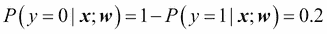或 20％。 然后，可以通过量化器（单位步长函数）将预测的概率简单地转换为二进制结果：


如果我们查看前面的 S 型曲线，则等效于以下内容：


实际上，在许多应用程序中，我们不仅对预测的类别标签感兴趣，而且在估计类别成员资格的概率方面特别有用。 Logistic 回归用于天气预报，例如，不仅可以预测特定日子是否下雨，还可以报告下雨的机会。 类似地，逻辑回归可以用于预测患者具有某些症状的特定疾病的机会，这就是为什么逻辑回归在医学领域享有广泛欢迎的原因。

## 学习物流成本函数的权重

您学习了，如何使用逻辑回归模型预测概率和类别标签。 现在，让我们简要讨论一下模型的参数，例如权重 *w* 。 在上一章中，我们定义了平方和误差成本函数：


为了学习 Adaline 分类模型的权重 *w* ，我们将其最小化。 为了解释如何得出逻辑回归的成本函数，我们首先定义在构建逻辑回归模型时要最大化的 *L* 的可能性，假设数据集中的各个样本为 彼此独立。 计算公式如下：


在实践中，更容易最大化此方程的（自然）对数，这称为对数似然函数：


首先，应用对数函数可减少出现数字下溢的可能性，如果可能性很小，则可能发生这种情况。 其次，我们可以将因子的乘积转换为因子的总和，这可以使您更容易通过加法获得此函数的导数，正如您可能从微积分中还记得的那样。

现在，我们可以使用诸如梯度上升之类的优化算法来最大化此对数似然函数。 或者，让我们将对数似然重写为成本函数，可以使用梯度下降来将其最小化，如[第 2 章](36.html "Chapter 2. Training Machine Learning Algorithms for Classification")和*训练机器学习分类算法*一样：


为了更好地了解这个成本函数，让我们看一下我们为一个单样本实例计算的成本：


查看前面的公式，我们可以看到，如果，则第一项变为零；如果，则第二项变为零：


下图显示了不同值的单样本实例分类的成本：


如果我们正确地预测样本属于类别 1，我们可以看到成本接近 0（纯蓝色线）。类似地，我们可以在 *y* 轴上看到，如果我们正确预测（虚线）。 但是，如果预测错误，则成本将达到无穷大。 道德是我们会以越来越大的代价惩罚错误的预测。

## 使用 scikit-learn 训练逻辑回归模型

如果我们自己实现逻辑回归，则可以简单地将成本函数替换为[第 2 章](36.html "Chapter 2. Training Machine Learning Algorithms for Classification")，*训练机器学习分类算法*的 Adaline 实现， 新的成本函数：


这将计算出每个时期对所有训练样本进行分类的成本，最终我们将得到一个有效的逻辑回归模型。 但是，由于 scikit-learn 实现了高度逻辑优化的 Logistic 回归版本，该版本还支持现成的多类设置，因此我们将跳过该实现并使用`sklearn.linear_model.LogisticRegression`类以及熟悉的`fit`方法来训练模型 在标准化的花卉训练数据集上：

```py
>>> from sklearn.linear_model import LogisticRegression
>>> lr = LogisticRegression(C=1000.0, random_state=0)
>>> lr.fit(X_train_std, y_train)
   >>> plot_decision_regions(X_combined_std, 
...                       y_combined, classifier=lr,
...                       test_idx=range(105,150))
>>> plt.xlabel('petal length [standardized]')
>>> plt.ylabel('petal width [standardized]')
>>> plt.legend(loc='upper left')
>>> plt.show()
```

将模型拟合到训练数据上之后，我们绘制了决策区域，训练样本和测试样本，如下所示：


看一下我们用来训练`LogisticRegression`模型的先前代码，您现在可能会想：“这个神秘的参数`C`是什么？” 我们将在一秒钟内解决这个问题，但让我们先在下一部分中简要讨论过度拟合和正则化的概念。

此外，我们可以通过`predict_proba`方法预测样本的类成员概率。 例如，我们可以预测第一个 Iris-Setosa 样本的概率：

```py
>>> lr.predict_proba(X_test_std[0,:])
```

这将返回以下数组：

```py
array([[  0.000,   0.063,   0.937]])
```

前面的数组告诉我们，该模型预测样本属于 Iris-Virginica 类的机会为 93.7％，样本为 Iris-Versicolor 花的机会为 6.3％。

我们可以证明，通过梯度下降进行逻辑回归的权重更新确实等于在[第 2 章](36.html "Chapter 2. Training Machine Learning Algorithms for Classification")和*训练机器学习分类算法*中的 Adaline 中使用的方程式。 让我们开始计算对数 *j* 权重的对数似然函数的偏导数：


在继续之前，让我们首先计算 S 型函数的偏导数：


现在，我们可以用我们的第一个等式替换 = 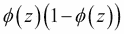，以获得以下信息：


请记住，目标是找到使对数可能性最大化的权重，以便我们对每个权重执行如下更新：


由于我们同时更新所有权重，因此我们可以编写以下通用更新规则：


我们定义如下：


由于最大化对数可能性等于最小化我们先前定义的成本函数，因此我们可以编写如下的梯度下降更新规则：


这等于，与[第 2 章](36.html "Chapter 2. Training Machine Learning Algorithms for Classification")，*分类训练机器学习算法*中的 Adaline 中的梯度下降规则相同。

## 通过正则化处理过拟合

过度拟合是在机器学习中的一个常见问题，在该模型中，模型在训练数据上表现良好，但对于未见数据（测试数据）却不能很好地泛化。 如果模型遭受过度拟合，我们也可以说该模型具有很高的方差，这可能是由于参数过多导致给定基础数据的模型过于复杂所致。 同样，我们的模型也可能会遇到 **拟合不足**（高偏差）的问题，这意味着我们的模型不够复杂，无法很好地捕获训练数据中的模式，因此在看不见的情况下也会表现出较低的性能 数据。

尽管到目前为止，我们仅遇到用于分类的线性模型，但是可以通过使用更复杂的非线性决策边界来最好地说明过度拟合和欠拟合的问题，如下图所示：


### 注意

如果我们要在训练数据集的不同子集上多次重新训练模型，则方差度量特定样本实例的模型预测的一致性（或可变性）。 我们可以说该模型对训练数据中的随机性敏感。 相反，如果我们在不同的训练数据集上多次重建模型，则偏差通常会衡量预测与正确值的差距。 偏差是系统误差的度量，该误差不是由于随机性引起的。

寻求良好偏差偏差权衡的一种方法是通过正则化调整模型的复杂性。 正则化是处理共线性（要素之间的高度相关性），从数据中滤除噪声并最终防止过度拟合的非常有用的方法。 正则化背后的概念是引入附加信息（偏差）以惩罚极端参数权重。 最常见的正则化形式是所谓的 **L2 正则化**（有时也称为 L2 收缩或权重衰减），其写法如下：

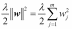

在此，是所谓的正则化参数。

### 注意

正则化是为什么诸如标准之类的特征缩放很重要的另一个原因。 为了使正则化正常工作，我们需要确保我们所有的功能都具有可比的规模。

为了应用正则化，我们只需要将正则化项添加到为逻辑回归定义的成本函数中即可缩小权重：


通过正则化参数，我们可以控制拟合数据的拟合程度，同时保持较小的权重。 通过增加的值，我们增加了正则化强度。

在 scikit-learn 中为`LogisticRegression`类实现的参数`C`来自支持向量机中的约定，这将是下一部分的主题。 `C`与正则化参数直接相关，它是反函数：


因此，我们可以如下重写逻辑回归的正则化成本函数：


因此，减小逆正则化参数`C`的值意味着我们正在增加正则化强度，这可以通过绘制两个权重系数的 L2 正则化路径来可视化：

```py
>>> weights, params = [], []
>>> for c in np.arange(-5, 5):
...     lr = LogisticRegression(C=10**c, random_state=0)
...     lr.fit(X_train_std, y_train)
...     weights.append(lr.coef_[1])
...     params.append(10**c)
>>> weights = np.array(weights)
>>> plt.plot(params, weights[:, 0], 
...          label='petal length')
>>> plt.plot(params, weights[:, 1], linestyle='--', 
...          label='petal width')
>>> plt.ylabel('weight coefficient')
>>> plt.xlabel('C')
>>> plt.legend(loc='upper left')
>>> plt.xscale('log')
>>> plt.show()
```

通过执行上述代码，我们为十个逻辑逆模型拟合了反正则化参数`C`的不同值。 为了说明的目的，我们仅收集了第 2 类与所有分类器的权重系数。 请记住，我们使用 OvR 技术进行多类分类。

正如我们在结果图中看到的所示，如果我们减小参数 **C** ，即增加正则化强度，则权重系数会减小：


### 注意

由于对单个分类算法的深入介绍超出了本书的范围，因此我热烈推荐 Scott Menard 博士的 *Logistic 回归：从入门到高级概念和应用*， *Sage 出版物* ，希望了解更多关于逻辑回归的读者。


# 支持向量机的最大边距分类

另一种强大且广泛使用的学习算法是 **支持向量机**（ **SVM** ），可以将其视为感知器的扩展。 使用感知器算法，我们将错误分类错误最小化。 但是，在 SVM 中，我们的优化目标是使**余量**最大化。 余量定义为分离的超平面（决策边界）与最接近该超平面的训练样本之间的距离，即所谓的 **支持向量**。 下图对此进行了说明：

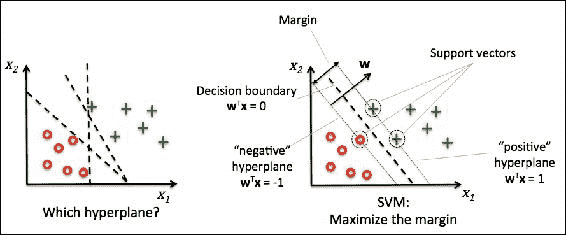

## 最大直觉

具有较大边界的决策边界背后的理由是，它们倾向于具有较低的泛化误差，而具有较小边界的模型更倾向于过度拟合。 为了直观了解裕量最大化，让我们仔细看一下平行于决策边界的那些*正*和*负*超平面，它们可以表示为：


如果我们将这两个线性方程式（ **1** ）和（ **2** ）彼此相减，则会得到：


我们可以通过向量 *w* 的长度对其进行归一化，其定义如下：


因此，我们得出以下等式：


然后，前面等式的左侧可以解释为正超平面和负超平面之间的距离，这是我们想要最大化的所谓余量。

现在，在样本被正确分类的约束下，通过最大化，SVM 的目标函数变为了该裕度的最大化，可以写成如下：


这两个等式基本上说所有负样本都应该落在负超平面的一侧，而所有正样本都应该落在正超平面的后面。 也可以更紧凑地编写如下：


但是，实际上，更容易将倒数项最小化，这可以通过二次编程来解决。 但是，关于二次编程的详细讨论超出了本书的范围，但是，如果您有兴趣，可以在 Vladimir Vapnik 的*中了解有关**支持向量机**（ **SVM** ）的更多信息。 ]统计学习理论*， *Springer Science &商业媒体*或 Chris JC Burges 在*模式识别支持向量机教程*中的出色解释（Data 挖掘和知识发现，2（2）：121-167，1998 年）。

## 使用松弛变量处理非线性可分情况

尽管我们不想深入探讨裕度分类背后更复杂的数学概念，但让我们简要地提及松弛变量。 它是由弗拉基米尔·瓦普尼克（Vladimir Vapnik）在 1995 年提出的，并导致了所谓的软边际分类。 引入松弛变量的动机是，对于非线性可分离的数据，需要放宽线性约束，以在存在错误分类的情况下，在适当的成本惩罚下允许优化的收敛。

正值松弛变量仅添加到线性约束中：


因此，要最小化的新目标（受前面的约束）变为：


使用变量`C`，我们可以控制错误分类的代价。 较大的`C`值对应较大的错误惩罚，而如果我们为`C`选择较小的值，则对误分类错误的要求就不那么严格。 然后，我们可以使用参数`C`来控制边距的宽度，从而调整偏差方差的权衡，如下图所示：


这个概念与正则化相关，我们先前在正则回归的背景下讨论过，其中增加`C`的值会增加偏差并降低模型的方差。

现在我们学习了线性 SVM 的基本概念，让我们训练一个 SVM 模型来对 Iris 数据集中的不同花朵进行分类：

```py
>>> from sklearn.svm import SVC
   >>> svm = SVC(kernel='linear', C=1.0, random_state=0)
>>> svm.fit(X_train_std, y_train)
>>> plot_decision_regions(X_combined_std, 
...                       y_combined, classifier=svm,
...                       test_idx=range(105,150))
>>> plt.xlabel('petal length [standardized]')
>>> plt.ylabel('petal width [standardized]')
>>> plt.legend(loc='upper left')
>>> plt.show()
```

下图显示了执行前面的代码示例后可视化的 SVM 的决策区域：


### 注意

**Logistic 回归与 SVM**

在实际的分类任务中，线性逻辑回归和线性支持向量机通常会产生非常相似的结果。 Logistic 回归试图使训练数据的条件可能性最大化，这使其比 SVM 更容易出现异常值。 SVM 最关心的是最靠近决策边界的点（支持向量）。 另一方面，逻辑回归的优势在于它是一个更简单的模型，可以更轻松地实现。 此外，逻辑回归模型可以轻松更新，这在处理流数据时很有吸引力。

## scikit-learn 中的替代实现

我们在上一节中通过 scikit-learn 使用的，`Perceptron`和`LogisticRegression`类利用了 LIBLINEAR 库，该库是由台湾大学开发的高度优化的 C / C ++库。 HTG5] http://www.csie.ntu.edu.tw/~cjlin/liblinear/ ）。 同样，我们用来训练 SVM 的`SVC`类也使用了 LIBSVM，这是专门用于 SVM 的等效 C / C ++库（ [http://www.csie.ntu.edu.tw /〜cjlin / libsvm /](http://www.csie.ntu.edu.tw/~cjlin/libsvm/) ）。

与本地 Python 实现相比，使用 LIBLINEAR 和 LIBSVM 的优势在于，它们可以非常快速地训练大量的线性分类器。 但是，有时我们的数据集太大而无法容纳计算机内存。 因此，scikit-learn 还可以通过`SGDClassifier`类提供替代实现，该类还支持通过`partial_fit`方法进行在线学习。 `SGDClassifier`类的概念类似于我们在[第 2 章](36.html "Chapter 2. Training Machine Learning Algorithms for Classification")，*训练机器学习分类算法*中为 Adaline 实现的随机梯度算法。 我们可以使用以下默认参数初始化感知器的随机梯度下降版本，逻辑回归和支持向量机：

```py
>>> from sklearn.linear_model import SGDClassifier
>>> ppn = SGDClassifier(loss='perceptron')
>>> lr = SGDClassifier(loss='log')
>>> svm = SGDClassifier(loss='hinge')
```

# 使用内核 SVM 解决非线性问题

SVM 在机器学习从业者中如此受欢迎的另一个原因是，它们可以轻松地*内核化*来解决非线性分类问题。 在讨论 **内核 SVM** 背后的主要概念之前，让我们首先定义并创建一个样本数据集，以查看这种非线性分类问题的外观。

使用下面的代码，我们将使用 NumPy 中的`logical_xor`函数创建一个简单的数据集，该数据集具有 XOR 门的形式，其中将为 100 个样本分配类别标签，为 100 个样本分配类别标签 -1，分别为：

```py
>>> np.random.seed(0)
>>> X_xor = np.random.randn(200, 2)
>>> y_xor = np.logical_xor(X_xor[:, 0] > 0, X_xor[:, 1] > 0)
>>> y_xor = np.where(y_xor, 1, -1)

>>> plt.scatter(X_xor[y_xor==1, 0], X_xor[y_xor==1, 1],
...             c='b', marker='x', label='1')
>>> plt.scatter(X_xor[y_xor==-1, 0], X_xor[y_xor==-1, 1],
...             c='r', marker='s', label='-1')
>>> plt.ylim(-3.0)
>>> plt.legend()
>>> plt.show()
```

执行完代码后，我们将获得一个具有随机噪声的 XOR 数据集，如下图所示：

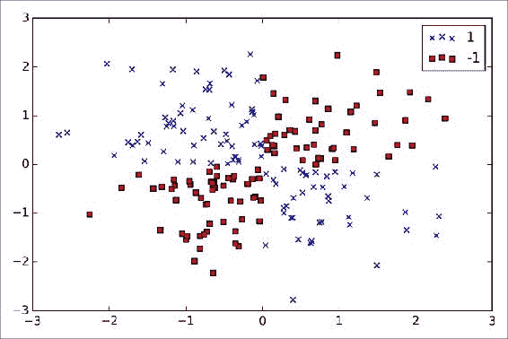

显然，我们无法使用线性超平面作为决策边界，通过线性逻辑回归或线性 SVM 模型，将正负类样本很好地分离开来。

处理此类线性不可分离的数据的内核方法背后的基本思想是创建原始特征的非线性组合，以通过映射函数将它们投影到更高维的空间，在该映射函数中线性可分离。 如下图所示，我们可以将二维数据集转换到新的三维特征空间上，在该空间中，类可以通过以下投影进行分离：


这使我们能够通过线性超平面来分离图中所示的两个类别，如果我们将其投影回原始特征空间，它将成为非线性决策边界：


## 使用内核技巧在高维空间中找到分离的超平面

为了使用 SVM 解决非线性问题，我们通过映射函数将训练数据转换到更高维的特征空间，并训练线性 SVM 模型以对该新特征空间中的数据进行分类。 然后，我们可以使用相同的映射函数来转换看不见的新数据，以使用线性 SVM 模型对其进行分类。

但是，这种映射方法的一个问题是，新功能的构建在计算上非常昂贵，尤其是当我们处理高维数据时。 这就是所谓的内核技巧起作用的地方。 尽管我们没有详细介绍如何解决二次编程任务以训练 SVM，但实际上，我们所需要做的只是用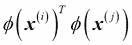代替点积。 在中，为了节省显式计算两点之间的点积的昂贵步骤，我们定义了一个所谓的核函数： = 。

使用最广泛的内核之一是 **径向基函数内核**（ **RBF 内核**）或高斯内核：


通常将其简化为：


此处，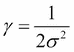是要优化的自由参数。

粗略地说，术语*内核*可以解释为一对样本之间的*相似度函数*。 负号将距离量度反转为相似度得分，并且由于指数项，所得相似度得分将落在 1（对于完全相似的样本）和 0（对于非常不同的样本）之间的范围内。

现在，我们定义了内核技巧背后的全局，让我们看看是否可以训练内核 SVM，该 SVM 能够绘制出将 XOR 数据很好地分开的非线性决策边界。 在这里，我们仅使用先前导入的 scikit-learn 中的`SVC`类，并将参数`kernel='linear'`替换为`kernel='rbf'`：

```py
>>> svm = SVC(kernel='rbf', random_state=0, gamma=0.10, C=10.0)
>>> svm.fit(X_xor, y_xor)
>>> plot_decision_regions(X_xor, y_xor, classifier=svm)
>>> plt.legend(loc='upper left')
>>> plt.show()
```

正如我们在中看到的结果图所示，内核 SVM 相对较好地分离了 XOR 数据：


我们设置为`gamma=0.1`的参数可以理解为高斯球的*截止*参数。 如果我们增加的值，则会增加训练样本的影响或影响范围，从而导致较软的决策边界。 为了更好地了解，让我们将 RBF 内核 SVM 应用于我们的鸢尾花数据集：

```py
>>> svm = SVC(kernel='rbf', random_state=0, gamma=0.2, C=1.0)
>>> svm.fit(X_train_std, y_train)
>>> plot_decision_regions(X_combined_std, 
...                       y_combined, classifier=svm,
...                       test_idx=range(105,150))
>>> plt.xlabel('petal length [standardized]')
>>> plt.ylabel('petal width [standardized]')
>>> plt.legend(loc='upper left')
>>> plt.show()
```

由于我们为选择了较小的值，因此 RBF 内核 SVM 模型的最终决策边界将相对较软，如下图所示：


现在让我们增加的值，并观察对决策边界的影响：

```py
>>> svm = SVC(kernel='rbf', random_state=0, gamma=100.0, C=1.0)
>>> svm.fit(X_train_std, y_train)
>>> plot_decision_regions(X_combined_std,
...                       y_combined, classifier=svm,
...                       test_idx=range(105,150))
>>> plt.xlabel('petal length [standardized]')
>>> plt.ylabel('petal width [standardized]')
>>> plt.legend(loc='upper left')
>>> plt.show()
```

在结果图中，我们现在可以看到，使用相对较大的值，围绕类 0 和 1 的决策边界要紧密得多：

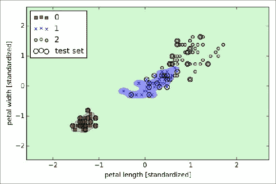

尽管模型非常适合训练数据集，但是这样的分类器可能会在看不见的数据上具有很高的泛化误差，这说明的优化在控制过度拟合方面也起着重要作用。

# 决策树学习

尽管我们在前面的模块中已经了解了决策树，但是让我们更深入地研究。 **如果我们关注可解释性，则决策树**分类器是有吸引力的模型。 就像名称*决策树*所暗示的那样，我们可以认为此模型是通过基于提出一系列问题来做出决策来分解数据。

让我们考虑以下示例，其中我们使用决策树来决定特定日期的活动：


基于我们训练集中的功能，决策树模型学习一系列问题以推断样本的类别标签。 尽管上图说明了基于分类变量的决策树的概念，但是如果我们的特征是像 Iris 数据集中那样的实数，则可以应用相同的概念。 例如，我们可以简单地沿**萼片宽度**特征轴定义一个截止值，然后问一个二元问题“分隔宽度 cm？”。

使用决策算法，我们从树的根部开始，对特征上的数据进行分割，从而获得最大的 **信息增益**（ **IG** ），这将在更多内容中进行解释。 在下一节中详细介绍。 在一个迭代过程中，我们可以在每个子节点上重复此拆分过程，直到叶子纯净为止。 这意味着每个节点上的样本都属于同一类。 实际上，这可能会导致具有许多节点的非常深的树，这很容易导致过度拟合。 因此，我们通常希望通过设置树的最大深度的限制来*修剪*树。

## 最大限度地提高信息获取能力–物有所值

为了使在信息最多的特征上分割节点，我们需要定义一个目标函数，该目标函数要通过树学习算法进行优化。 在这里，我们的目标功能是使每次拆分的信息增益最大化，定义如下：


*f* 是执行分割的功能，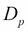和是父级的数据集，第 *j 个*子节点， *I [* 是我们的杂质度量，是父节点上的样本总数，是第 *j* 个子节点中的样本数。 可以看到，信息增益只是父节点的杂质与子节点杂质之和之间的差，子节点的杂质越低，信息增益就越大。 但是，为了简化并减少组合搜索空间，大多数库（包括 scikit-learn）都采用二进制决策树。 这意味着每个父节点都分为两个子节点和：


现在，二元决策树中常用的三种杂质测度或分裂标准是 **基尼杂质**（）， **熵**（） ，以及 **分类错误**（）。 让我们从所有 **非空**类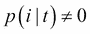的熵的定义开始：


在此，是属于特定节点 *t* 的类别 *i* 的样本的比例。 因此，如果节点上的所有样本都属于同一类别，则熵为 0，如果我们具有统一的类别分布，则熵为最大。 例如，在二进制类别设置中，如果或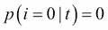，则熵为 0。 如果类别通过和均匀分布，则熵为 1。因此，可以说熵准则试图使树中的互信息最大化。

直观地，基尼杂质可以被理解为使错误分类的可能性最小化的标准：


类似于熵，如果类别完美混合，例如在二进制类别设置（）中，则基尼杂质最大。


但是，在实践中，基尼杂质和熵通常会产生非常相似的结果，通常不值得花大量时间使用不同的杂质标准评估树木，而不是尝试使用不同的修剪截止值。

另一个杂质度量是分类错误：


这是用于修剪的有用标准，但不建议用于增长决策树，因为它对节点的类概率的更改不太敏感。 我们可以通过查看下图中所示的两种可能的拆分方案来说明这一点：

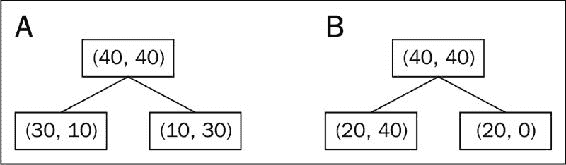

我们从父节点的数据集开始，该数据集由 1 类的 40 个样本和 2 类的 40 个样本组成，我们分别分成两个数据集和。 在场景 A 和场景 B 中，使用分类误差作为划分标准的信息增益将是相同的（）：


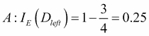


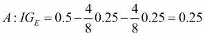


但是，基尼杂质比方案更倾向于方案中的拆分，而方案的确更纯净：


类似地，熵标准比方案更倾向于方案：


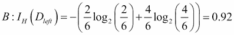


为了更直观地比较前面讨论的三个不同杂质标准，让我们绘制类别 1 的概率范围[0，1]的杂质指数。请注意，我们还将添加熵的缩放版本 （*熵/ 2* ）观察到，基尼杂质是熵和分类误差之间的中间量度。 代码如下：

```py
>>> import matplotlib.pyplot as plt
>>> import numpy as np
>>> def gini(p):
...     return (p)*(1 - (p)) + (1 - p)*(1 - (1-p))
>>> def entropy(p):
...     return - p*np.log2(p) - (1 - p)*np.log2((1 - p))
>>> def error(p):
...     return 1 - np.max([p, 1 - p])
>>> x = np.arange(0.0, 1.0, 0.01)
>>> ent = [entropy(p) if p != 0 else None for p in x]
>>> sc_ent = [e*0.5 if e else None for e in ent]
>>> err = [error(i) for i in x]
>>> fig = plt.figure()
>>> ax = plt.subplot(111)
>>> for i, lab, ls, c, in zip([ent, sc_ent, gini(x), err], 
...                   ['Entropy', 'Entropy (scaled)', 
...                   'Gini Impurity', 
...                   'Misclassification Error'],
...                   ['-', '-', '--', '-.'],
...                   ['black', 'lightgray',
...                      'red', 'green', 'cyan']):
...     line = ax.plot(x, i, label=lab, 
...                    linestyle=ls, lw=2, color=c)
>>> ax.legend(loc='upper center', bbox_to_anchor=(0.5, 1.15),
...           ncol=3, fancybox=True, shadow=False)
>>> ax.axhline(y=0.5, linewidth=1, color='k', linestyle='--')
>>> ax.axhline(y=1.0, linewidth=1, color='k', linestyle='--')
>>> plt.ylim([0, 1.1])
>>> plt.xlabel('p(i=1)')
>>> plt.ylabel('Impurity Index')
>>> plt.show()
```

前面的代码示例生成的图如下：


## 建立决策树

决策树可以通过将特征空间划分为矩形来建立复杂的决策边界。 但是，我们必须谨慎，因为决策树越深，决策边界变得越复杂，这很容易导致过度拟合。 使用 scikit-learn，我们现在将使用熵作为杂质标准来训练最大深度为 3 的决策树。 尽管出于可视化目的可能需要特征缩放，但是请注意，特征缩放不是决策树算法的要求。 代码如下：

```py
>>> from sklearn.tree import DecisionTreeClassifier
>>> tree = DecisionTreeClassifier(criterion='entropy', 
...                               max_depth=3, random_state=0)
>>> tree.fit(X_train, y_train)
>>> X_combined = np.vstack((X_train, X_test))
>>> y_combined = np.hstack((y_train, y_test))
>>> plot_decision_regions(X_combined, y_combined, 
...                    classifier=tree, test_idx=range(105,150))
>>>plt.xlabel('petal length [cm]')
>>>plt.ylabel('petal width [cm]') 
>>> plt.legend(loc='upper left')
>>> plt.show()
```

在执行上述代码示例的之后，我们获得了决策树的典型轴平行决策边界：


scikit-learn 的一个不错的功能是它允许我们在训练后将决策树导出为`.dot`文件，我们可以使用 GraphViz 程序将其可视化。 该程序可从[这个页面](http://www.graphviz.org)免费获得，并受 Linux，Windows 和 Mac OS X 支持。

首先，我们使用`tree`子模块中的`export_graphviz`函数通过 scikit-learn 创建`.dot`文件，如下所示：

```py
>>> from sklearn.tree import export_graphviz
>>> export_graphviz(tree, 
...                 out_file='tree.dot',
...                 feature_names=['petal length', 'petal width'])
```

在计算机上安装 GraphViz 之后，可以通过在保存`tree.dot`文件的位置从命令行执行以下命令，将`tree.dot`文件转换为 PNG 文件：

```py
> dot -Tpng tree.dot -o tree.png
```


查看我们通过 GraphViz 创建的决策树图，我们现在可以很好地追溯决策树从训练数据集中确定的拆分。 我们从根部的 105 个样本开始，使用**花瓣宽度**截止值≤0.75 厘米，将其分为两个子节点，分别具有 34 和 71 个样本。 第一次拆分后，我们可以看到左侧的子节点已经是纯节点，并且仅包含 Iris-Setosa 类的样本（熵= 0）。 然后使用右侧的其他拆分从 Iris-Versicolor 和 Iris-Virginica 类中分离样本。

## 通过随机森林将弱者和强者合并

**随机森林** 由于其良好的分类性能，可伸缩性和易用性，在过去的十年中在机器学习应用中获得了巨大的普及。 直观上，可以将随机森林视为决策树的*集合*。 集成学习的思想是结合 **弱学习者**建立一个更健壮的模型 **强学习者**，该模型具有更好的泛化误差并且不易受到影响 过度拟合。 随机森林算法可以归纳为四个简单步骤：

1.  绘制大小为 *n* 的随机**引导程序**样本（从训练集中随机选择 *n* 样本，并进行替换）。
2.  从引导程序样本中增长决策树。 在每个节点上：

    1.  随机选择 *d* 功能，无需替换。
    2.  使用根据目标函数提供最佳拆分的功能（例如，通过最大化信息增益）拆分节点。

3.  重复步骤 1 至 2 *k* 次。
4.  汇总每棵树的预测，以 **多数票**分配类别标签。 多数投票将在[第 7 章](41.html "Chapter 7. Combining Different Models for Ensemble Learning")和*结合不同模型进行整合学习*中进行详细讨论。

当我们训练各个决策树时，第 2 步有一个轻微修改：我们不考虑评估所有功能以确定每个节点上的最佳分割，而只考虑其中的一个随机子集。

尽管随机森林不能提供与决策树相同的可解释性，但是随机森林的一大优势是我们不必为选择良好的超参数值而担心。 通常，我们不需要修剪随机森林，因为集成模型对于来自各个决策树的噪声非常鲁棒。 实际上，我们真正需要关心的唯一参数是我们为随机森林选择的树数 *k* （第 3 步）。 通常，树的数量越多，随机森林分类器的性能越好，但以增加的计算成本为代价。

尽管在实践中不太常见，但可以优化随机森林分类器的其他超参数（使用我们将在[第 5 章](39.html "Chapter 5. Compressing Data via Dimensionality Reduction")，*通过降维压缩*压缩数据中讨论的技术）的大小 自举样本的 *n* （步骤 1）和为每个分割随机选择的特征数 *d* （步骤 2.1）。 通过引导程序样本的样本大小 *n* ，我们控制了随机森林的偏差-方差折衷。 通过为 *n* 选择较大的值，我们可以减少随机性，因此森林更可能过度适应。 另一方面，我们可以通过为模型性能选择 *n* 较小的值来减少过拟合的程度。 在大多数实施方式中，包括 scikit-learn 中的`RandomForestClassifier`实施方式，引导程序样本的样本大小均应选择为等于原始训练集中的样本数，这通常会提供良好的偏差方差折衷。 对于每个拆分中的特征数 *d* ，我们希望选择一个比训练集中的特征总数小的值。 scikit-learn 和其他实现中使用的合理默认值是，其中 *m* 是训练集中功能的数量。

方便地，我们不必自己从各个决策树构造随机森林分类器。 scikit-learn 中已经有一个我们可以使用的实现：

```py
>>> from sklearn.ensemble import RandomForestClassifier
>>> forest = RandomForestClassifier(criterion='entropy',
...                                 n_estimators=10, 
...                                 random_state=1,
...                                 n_jobs=2)
>>> forest.fit(X_train, y_train)
>>> plot_decision_regions(X_combined, y_combined, 
...                classifier=forest, test_idx=range(105,150))
>>> plt.xlabel('petal length')
>>> plt.ylabel('petal width')
>>> plt.legend(loc='upper left')
>>> plt.show()
```

执行完前面的代码后，我们应该看到由随机森林中的树木集合形成的决策区域，如下图所示：


使用前面的代码，我们通过`n_estimators`参数从 10 个决策树中训练了一个随机森林，并使用熵准则作为杂质度量来分割节点。 尽管我们从很小的训练数据集中生长出非常小的随机森林，但出于演示目的，我们使用了`n_jobs`参数，这使我们可以使用计算机的多个核（这里为两个）并行化模型训练。

# K 近邻–惰性学习算法

我们将在本章中讨论的最后一个监督学习算法是 **k 最近邻分类器**（ **KNN** ），这特别有趣，因为它从根本上讲 与我们到目前为止讨论的学习算法不同。

KNN 是 **懒惰学习者**的典型示例。 之所以称其为*懒惰*，并不是因为它看上去简单，而是因为它没有从训练数据中学习判别函数，而是存储了训练数据集。

### 注意

**参数模型与非参数模型**

机器学习算法可以分为**参数**和 **非参数**模型。 使用参数模型，我们从训练数据集中估计参数，以学习可以对新数据点进行分类的功能，而不再需要原始训练数据集。 参数模型的典型示例是感知器，逻辑回归和线性 SVM。 相比之下，非参数模型无法通过一组固定的参数来表征，并且参数的数量随训练数据的增长而增加。 到目前为止，我们已经看到了两个非参数模型的例子：决策树分类器/随机森林和内核 SVM。

KNN 属于非参数模型的子类别，该子类别被描述为 **基于实例的学习**。 基于实例学习的模型的特征是记忆训练数据集，而惰性学习是基于实例学习的特例，在学习过程中无需花费零成本。

KNN 算法本身非常简单，可以通过以下步骤进行总结：

1.  选择 *k* 的数量和距离度量。
2.  找到我们要分类的样本的 *k* 最近邻居。
3.  通过多数表决分配班级标签。

下图说明了如何根据新数据点（**？**）在五个最邻近邻居之间的多数表决方式为其分配三角形类别标签。


基于选择的距离度量，KNN 算法在训练数据集中找到最接近（最相似）我们要分类的点的 *k* 个样本。 然后，由新数据点的 *k* 最近邻居中的多数票决定其类别标签。

这种基于内存的方法的主要优势在于，分类器会在我们收集新的训练数据时立即进行调整。 但是，不利的一面是，在最坏的情况下，用于对新样本进行分类的计算复杂度会随着训练数据集中的样本数量线性增加，除非该数据集的维数（特征）很少，并且该算法已使用有效数据来实现 结构，例如 KD 树。 （JH Friedman，JL Bentley 和 RA Finkel。一种用于寻找对数期望时间的最佳匹配的算法。ACMTransactions on Mathematical Software（TOMS），3（3）：209-226，1977。）此外，我们不能放弃 培训样本，因为不涉及*培训*步骤。 因此，如果我们使用大型数据集，则存储空间可能会成为一个挑战。

通过执行以下代码，我们现在将使用欧几里德距离度量在 scikit-learn 中实现 KNN 模型：

```py
>>> from sklearn.neighbors import KNeighborsClassifier
>>> knn = KNeighborsClassifier(n_neighbors=5, p=2,
...                            metric='minkowski')
>>> knn.fit(X_train_std, y_train)
>>> plot_decision_regions(X_combined_std, y_combined, 
...                       classifier=knn, test_idx=range(105,150))
>>> plt.xlabel('petal length [standardized]')
>>> plt.ylabel('petal width [standardized]')
>>> plt.show()
```

通过在此数据集的 KNN 模型中指定五个邻居，我们获得了相对平滑的决策边界，如下图所示：


### 注意

在平局的情况下，KNN 算法的 scikit-learn 实现将更喜欢距离样本更近的邻居。 如果邻居的距离相似，则算法将选择训练数据集中最先出现的类别标签。

*k* 的*正确*选择对于在过度拟合和欠拟合之间找到良好的平衡至关重要。 我们还必须确保选择适合于数据集中要素的距离度量。 通常，简单的欧几里德距离度量用于实值样本，例如，虹膜数据集中的花朵具有以厘米为单位的特征。 但是，如果我们使用欧几里德距离度量，则标准化数据也很重要，以使每个要素对距离的贡献均等。 我们在前面的代码中使用的`'minkowski'`距离只是欧几里得距离和曼哈顿距离的概括，可以写成如下形式：


如果我们将参数`p=2`或曼哈顿距离分别设置为`p=1`，则它成为欧几里德距离。 scikit-learn 中提供了许多其他距离度量，并且可以将提供给`metric`参数。 它们在[这个页面](http://scikit-learn.org/stable/modules/generated/sklearn.neighbors.DistanceMetric.html)中列出。

### 注意

**维度的诅咒**

值得一提的是，由于 **维度**的诅咒，KNN 非常容易过拟合。 维度的诅咒描述了一种现象，其中随着固定大小的训练数据集的维度数量的增加，特征空间变得越来越稀疏。 凭直觉，我们可以想到即使是最接近的邻居在高维空间中也相距太远，无法给出良好的估计。

我们在关于逻辑回归的部分中讨论了正则化的概念，这是避免过度拟合的一种方法。 但是，在不适用正则化的模型（例如决策树和 KNN）中，我们可以使用特征选择和降维技术来帮助我们避免降维。 下一章将对此进行更详细的讨论。


