# 第 5 章。通过降维压缩数据

在[第 4 章](38.html "Chapter 4. Building Good Training Sets – Data Preprocessing")和*建立良好的训练集–数据预处理*中，您了解了使用不同的特征选择技术来降低数据集维数的不同方法。 用于降维的特征选择的替代方法是*特征提取*。 在本章中，您将学习三种基本技术，这些技术可以帮助我们通过将数据集转换为维数比原始维数低的新特征子空间来总结数据集的信息内容。 数据压缩是机器学习中的一个重要主题，它有助于我们存储和分析在现代技术时代生成和收集的不断增长的数据量。 在本章中，我们将介绍以下主题：

*   **用于无监督数据压缩的主成分分析**（ **PCA** ）
*   **线性判别分析**（ **LDA** ）作为一种监督降维技术，可最大限度地提高类别可分离性
*   通过**核主成分分析**进行非线性降维

# 通过主成分分析进行无监督的降维

与特征选择类似，我们可以使用特征提取来减少数据集中的特征数量。 但是，虽然我们在使用特征选择算法（例如*顺序向后选择*）时保留了原始特征，但是我们使用特征提取将数据转换或投影到新的特征空间上。 在降维的情况下，特征提取可以理解为一种数据压缩的方法，其目的是保留大多数相关信息。 特征提取通常用于提高计算效率，但也可以帮助减少维度的*诅咒-特别是在我们使用非正规模型的情况下。*

**主成分分析**（ **PCA** ）是无监督线性变换技术，已广泛应用于不同领域，最显着的是用于降维。 PCA 的其他流行应用包括在股票市场交易中进行探索性数据分析和信号去噪，以及在生物信息学领域分析基因组数据和基因表达水平。 PCA 帮助我们根据特征之间的相关性来识别数据中的模式。 简而言之，PCA 旨在在高维数据中找到最大方差的方向，并将其投影到尺寸等于或小于原始维的新子空间中。 鉴于新特征轴彼此正交的约束，新子空间的正交轴（主分量）可以解释为最大方差方向，如下图所示。 这里，和是原始特征轴， **PC1** 和 **PC2** 是主要组成部分：

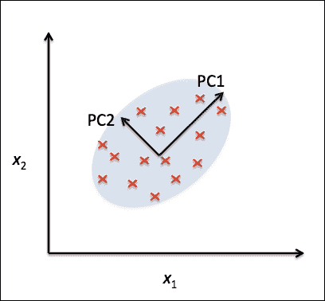

如果我们使用 PCA 进行降维，则会构建一个-维变换矩阵，该矩阵允许我们将样本矢量映射到一个新的-维特征子空间，该子空间的维数少于 原始的-维特征空间：


将原始维数据转换到这个新的维子空间（通常为）的结果是，第一个主成分将具有最大的方差，并且所有随后的主成分将具有最大的可能方差 假设它们与其他主成分不相关（正交），则为方差。 请注意，PCA 方向对数据缩放高度敏感，如果在不同尺度上对特征进行测量，并且我们想对所有特征赋予同等的重要性，则我们需要先将特征*优先于*。

在更详细地研究用于降维的 PCA 算法之前，让我们通过几个简单的步骤来总结该方法：

1.  标准化维数据集。
2.  构造协方差矩阵。
3.  将协方差矩阵分解为其特征向量和特征值。
4.  选择与最大特征值相对应的特征向量，其中是新特征子空间（）的维数。
5.  从“顶部” 特征向量构造投影矩阵。
6.  使用投影矩阵变换维输入数据集，以获得新的维特征子空间。

## 总计和解释方差

在本小节中，我们将处理主成分分析的前四个步骤：标准化数据，构建协方差矩阵，获得协方差矩阵的特征值和特征向量，以及通过将特征值递减排序以 对特征向量进行排名。

首先，我们将从加载[第 4 章](38.html "Chapter 4. Building Good Training Sets – Data Preprocessing")和*构建良好的训练集–数据预处理*中一直使用的*葡萄酒*数据集开始：

```py
>>> import pandas as pd
>>> df_wine = pd.read_csv('https://archive.ics.uci.edu/ml/machine-learning-databases/wine/wine.data', header=None)
```

接下来，我们将 *Wine* 数据处理为单独的训练和测试集（分别使用 70％和 30％的数据）并将其标准化为单位差异。

```py
>>> from sklearn.cross_validation import train_test_split
>>> from sklearn.preprocessing import StandardScaler
>>> X, y = df_wine.iloc[:, 1:].values, df_wine.iloc[:, 0].values
>>> X_train, X_test, y_train, y_test = \
...              train_test_split(X, y,
...              test_size=0.3, random_state=0)
>>> sc = StandardScaler()
>>> X_train_std = sc.fit_transform(X_train)
>>> X_test_std = sc.transform(X_test)
```

通过执行前面的代码完成强制性预处理步骤后，让我们进入第二步：构造协方差矩阵。 对称维协方差矩阵（其中是数据集中的维数）存储不同特征之间的成对协方差。 例如，可以通过以下公式计算总体水平上两个特征和之间的协方差：


在此，和分别是特征和的样本均值。 请注意，如果我们标准化数据集，则样本均值为零。 两个特征之间的正协方差表示特征一起增加或减少，而负协方差则表示特征沿相反的方向变化。 例如，然后可以将三个特征的协方差矩阵写为（请注意代表希腊字母 *sigma* ，请勿与*和*符号混淆） ：


协方差矩阵的特征向量表示主成分（最大方差的方向），而相应的特征值将定义其大小。 对于 *Wine* 数据集，我们将从维协方差矩阵中获得 13 个特征向量和特征值。

现在，让我们获得协方差矩阵的特征对。 正如我们从线性代数或微积分入门课中肯定记得的那样，特征向量满足以下条件：


在这里，是一个标量：特征值。 由于特征向量和特征值的手动计算是一项繁琐且复杂的任务，因此我们将使用 NumPy 的`linalg.eig`函数来获取 *Wine* 协方差矩阵的特征对：

```py
>>> import numpy as np
>>> cov_mat = np.cov(X_train_std.T)
>>> eigen_vals, eigen_vecs = np.linalg.eig(cov_mat)
>>> print('\nEigenvalues \n%s' % eigen_vals)
Eigenvalues 
[ 4.8923083   2.46635032  1.42809973  1.01233462  0.84906459  0.60181514
0.52251546  0.08414846  0.33051429  0.29595018  0.16831254  0.21432212
0.2399553 ]
```

使用`numpy.cov`函数，我们计算了标准化训练数据集的协方差矩阵。 使用`linalg.eig`函数，我们进行了特征分解，生成了一个向量（`eigen_vals`），该向量由 13 个特征值组成，并且对应的特征向量作为列存储在-维矩阵（`eigen_vecs`）中。

### 注意

尽管`numpy.linalg.eig`函数旨在分解非对称方阵，但您可能会发现在某些情况下它会返回复杂的特征值。

已实现相关函数`numpy.linalg.eigh`来分解 Hermetian 矩阵，这是在数值上更稳定的方法，可用于处理对称矩阵（例如协方差矩阵）； `numpy.linalg.eigh`始终返回实特征值。

由于我们想通过将压缩到新的特征子空间中来降低数据集的维数，因此，我们仅选择包含大部分信息（方差）的特征向量的子集（主要成分）。 由于特征值定义了特征向量的大小，因此我们必须通过减小大小对特征值进行排序。 我们基于其对应特征值的值对顶部特征向量感兴趣。 但是在收集那些信息最多的特征向量之前，让我们绘制特征值的*方差解释比率*。

特征值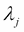的方差解释比率只是特征值与特征值总和的分数：


使用 NumPy `cumsum`函数，我们可以计算出解释方差的累积和，我们将通过 matplotlib 的`step`函数进行绘制：

```py
>>> tot = sum(eigen_vals)
>>> var_exp = [(i / tot) for i in
...            sorted(eigen_vals, reverse=True)]
>>> cum_var_exp = np.cumsum(var_exp)

>>> import matplotlib.pyplot as plt
>>> plt.bar(range(1,14), var_exp, alpha=0.5, align='center',
...         label='individual explained variance')
>>> plt.step(range(1,14), cum_var_exp, where='mid',
...         label='cumulative explained variance')
>>> plt.ylabel('Explained variance ratio')
>>> plt.xlabel('Principal components')
>>> plt.legend(loc='best')
>>> plt.show()
```

生成的图表明仅第一个主成分占方差的 40％。 此外，我们可以看到前两个主要成分的组合几乎解释了数据中 60％的方差：


尽管解释的方差图使我们想起了功能重要性，但我们在[第 4 章](38.html "Chapter 4. Building Good Training Sets – Data Preprocessing")，*建立良好的训练集–数据预处理*中通过随机森林计算了， 提醒自己，PCA 是一种不受监督的方法，这意味着有关类标签的信息将被忽略。 随机森林使用类成员关系信息来计算节点杂质，而方差则测量值沿特征轴的分布。

## 功能转换

在成功将协方差矩阵分解为特征对之后，我们现在进行最后三个步骤，将 *Wine* 数据集转换到新的主成分轴上。 在本节中，我们将按照特征值的降序对特征对进行排序，从选定的特征向量构建投影矩阵，然后使用该投影矩阵将数据转换到低维子空间上。

我们首先通过降低特征值的顺序对特征对进行排序：

```py
>>> eigen_pairs =[(np.abs(eigen_vals[i]),eigen_vecs[:,i])
...              for i inrange(len(eigen_vals))]
>>> eigen_pairs.sort(reverse=True)
```

接下来，我们收集与两个最大值对应的两个特征向量，以捕获此数据集中约 60％的方差。 请注意，出于说明的目的，我们仅选择了两个特征向量，因为我们将在本小节的后面部分通过二维散点图绘制数据。 实际上，必须根据计算效率和分类器性能之间的折衷来确定主成分的数量：

```py
>>> w= np.hstack((eigen_pairs[0][1][:, np.newaxis],
...               eigen_pairs[1][1][:, np.newaxis]))
>>> print('Matrix W:\n',w)
Matrix W:
[[ 0.14669811  0.50417079]
[-0.24224554  0.24216889]
[-0.02993442  0.28698484]
[-0.25519002 -0.06468718]
[ 0.12079772  0.22995385]
[ 0.38934455  0.09363991]
[ 0.42326486  0.01088622]
[-0.30634956  0.01870216]
[ 0.30572219  0.03040352]
[-0.09869191  0.54527081]
[ 0.30032535 -0.27924322]
[ 0.36821154 -0.174365  ]
[ 0.29259713  0.36315461]]
```

通过执行前面的代码，我们从顶部的两个特征向量创建了维投影矩阵。 使用投影矩阵，我们现在可以将样本（表示为-维行向量）变换到 PCA 子空间上，从而获得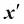，这是一个由两个新功能组成的二维样本向量：


```py
>>> X_train_std[0].dot(w)
array([ 2.59891628,  0.00484089])
```

类似地，我们可以通过计算矩阵点积，将将整个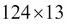维训练数据集转换为两个主成分：

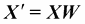

```py
>>> X_train_pca = X_train_std.dot(w)
```

最后，让我们在二维散点图中可视化转换后的 *Wine* 训练集，现在将其存储为-维矩阵。

```py
>>> colors = ['r', 'b', 'g']
>>> markers = ['s', 'x', 'o']
>>> for l, c, m in zip(np.unique(y_train), colors, markers):
...     plt.scatter(X_train_pca[y_train==l, 0], 
...                 X_train_pca[y_train==l, 1], 
...                 c=c, label=l, marker=m) 
>>> plt.xlabel('PC 1')
>>> plt.ylabel('PC 2')
>>> plt.legend(loc='lower left')
>>> plt.show()
```

正如我们在结果图中看到的那样（如下图所示），数据沿 *x* 轴（第一个主成分）分布的比第二个主成分（ *y* -轴），这与我们在上一个小节中创建的解释的方差比图一致。 但是，我们可以直观地看到线性分类器很可能能够很好地分离这些类：

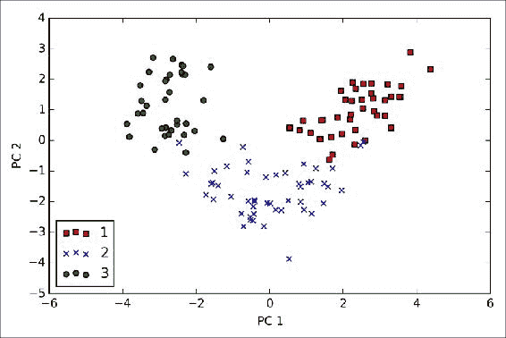

尽管出于前面的散点图中的说明目的，我们对类标签信息进行了编码，但我们必须记住 PCA 是一种不使用类标签信息的无监督技术。

## scikit-learn 中的主成分分析

尽管前面小节中的详细方法帮助我们了解了 PCA 的内部工作原理，但是我们现在将讨论如何使用 scikit-learn 中实现的`PCA`类。 `PCA`是 scikit-learn 的变压器类中的另一类，在该类中，我们首先使用训练数据拟合模型，然后再使用相同的模型参数转换训练数据和测试数据。 现在，让我们在 *Wine* 训练数据集上使用来自 scikit-learn 的`PCA`，通过 logistic 回归对转换后的样本进行分类，并通过我们在[中定义的`plot_decision_region`函数可视化决策区域 第 2 章](36.html "Chapter 2. Training Machine Learning Algorithms for Classification")和*训练机器学习分类算法*：

```py
from matplotlib.colors import ListedColormap

def plot_decision_regions(X, y, classifier, resolution=0.02):

    # setup marker generator and color map
    markers = ('s', 'x', 'o', '^', 'v')
    colors = ('red', 'blue', 'lightgreen', 'gray', 'cyan')
    cmap = ListedColormap(colors[:len(np.unique(y))])

    # plot the decision surface
    x1_min, x1_max = X[:, 0].min() - 1, X[:, 0].max() + 1
    x2_min, x2_max = X[:, 1].min() - 1, X[:, 1].max() + 1
    xx1, xx2 = np.meshgrid(np.arange(x1_min, x1_max, resolution),
                         np.arange(x2_min, x2_max, resolution))
    Z = classifier.predict(np.array([xx1.ravel(), xx2.ravel()]).T)
    Z = Z.reshape(xx1.shape)
    plt.contourf(xx1, xx2, Z, alpha=0.4, cmap=cmap)
    plt.xlim(xx1.min(), xx1.max())
    plt.ylim(xx2.min(), xx2.max())

    # plot class samples
    for idx, cl in enumerate(np.unique(y)):
        plt.scatter(x=X[y == cl, 0], y=X[y == cl, 1],
                    alpha=0.8, c=cmap(idx),
                    marker=markers[idx], label=cl)

>>> from sklearn.linear_model import LogisticRegression
>>> from sklearn.decomposition import PCA
>>> pca = PCA(n_components=2)
>>> lr = LogisticRegression()
>>> X_train_pca = pca.fit_transform(X_train_std)
>>> X_test_pca = pca.transform(X_test_std)
>>> lr.fit(X_train_pca, y_train)
>>> plot_decision_regions(X_train_pca, y_train, classifier=lr)
>>> plt.xlabel('PC1')
>>> plt.ylabel('PC2')
>>> plt.legend(loc='lower left')
>>> plt.show()
```

通过执行前面的代码，我们现在应该看到训练模型的决策区域缩小为两个主要成分轴。


如果我们通过 scikit-learn 将 PCA 投影与我们自己的 PCA 实现进行比较，则我们会注意到，通过我们的分步方法，上图是先前 PCA 的镜像。 请注意，这不是由于这两种实现方式中的任何一种都会导致错误，而是这种差异的原因在于，根据本征求解器，本征向量可以具有负号或正号。 没关系，但是如果需要，我们可以通过将数据乘以`-1`来简单地还原镜像。 注意，特征向量通常按比例缩放到单位长度`1`。 为了完整起见，让我们在转换后的测试数据集上绘制逻辑回归的决策区域，以查看它是否可以很好地分离类：

```py
>>> plot_decision_regions(X_test_pca, y_test, classifier=lr)
>>> plt.xlabel('PC1')
>>> plt.ylabel('PC2')
>>> plt.legend(loc='lower left')
>>> plt.show()
```

在通过执行前面的代码绘制测试集的决策区域之后，我们可以看到逻辑回归在这个小的二维特征子空间上执行得很好，并且只对测试数据集中的一个样本进行了错误分类。


如果我们对对不同主成分的解释方差比率感兴趣，我们可以简单地将`n_components`参数设置为`None`来初始化`PCA`类，以便保留所有主成分和解释方差比率 然后可以通过`explained_variance_ratio_`属性进行访问：

```py
>>> pca = PCA(n_components=None)
>>> X_train_pca = pca.fit_transform(X_train_std)
>>> pca.explained_variance_ratio_
array([ 0.37329648,  0.18818926,  0.10896791,  0.07724389,  0.06478595,
0.04592014,  0.03986936,  0.02521914,  0.02258181,  0.01830924,
0.01635336,  0.01284271,  0.00642076])
```

请注意，我们在初始化 PCA 类时设置了`n_components=None`，以便它将按排序顺序返回所有主成分，而不是执行降维。

# 通过线性判别分析进行监督数据压缩

**线性判别分析**（ **LDA** ）可以用作特征提取技术，以提高计算效率并减少因非规则模型中的尺寸诅咒而引起的过拟合程度。

LDA 背后的一般概念与 PCA 非常相似，而 PCA 则试图在数据集中找到最大方差的正交分量轴。 LDA 中的目标是找到可优化类可分离性的特征子空间。 LDA 和 PCA 都是线性变换技术，可用于减少数据集中的维数。 前者是无监督算法，而后者是有监督的。 因此，我们可能会直观地认为，与 PCA 相比，LDA 是用于分类任务的高级特征提取技术。 但是，上午 Martinez 报告说，在某些情况下，例如，如果每个类别仅包含少量样本（AM Martinez 和 AC Kak。 *PCA 与 LDA [* 。Pattern Analysis and Machine Intelligence，IEEE Transactions on，23（2）：228-233，2001）。

### 注意

尽管 LDA 有时也称为 Fisher 的 LDA，但 Ronald A. Fisher 于 1936 年最初针对两类分类问题制定了 *Fisher 线性判别式*（RA Fisher。*在分类学问题中使用多重度量* （《优生学年鉴》，7（2）：179–188，1936 年）。 费舍尔线性判别式后来由 C.Radhakrishna Rao 在 1948 年等分类协方差和正态分布类的假设下推广到多类问题，我们现在将其称为 LDA（CR Rao。 *生物学分类*，英国皇家统计学会杂志，B 系列（方法论），10（2）：159–203，1948 年）。

下图总结了针对两类问题的 LDA 概念。 来自类别 1 的样本显示为十字形，来自类别 2 的样本显示为圆形：


*x* -轴（LD 1）上显示的线性判别式可以很好地分隔两个正态分布的类。 尽管 *y* 轴（LD 2）上显示的示例性线性判别式捕获了数据集中的许多方差，但由于它无法捕获任何类别歧视性，因此它作为良好的线性判别式将失败 信息。

LDA 中的一种假设是数据是正态分布的。 同样，我们假设这些类具有相同的协方差矩阵，并且这些特征在统计上彼此独立。 但是，即使略微违反了这些假设中的一个或多个假设，用于降维的 LDA 仍然可以很好地发挥作用（RO Duda，PE Hart 和 DG Stork。*模式分类*。第二版，纽约， 2001）。

在下面的小节中，我们将深入研究 LDA 的内部工作原理，然后让我们总结一下 LDA 方法的关键步骤：

1.  标准化维数据集（是要素数量）。
2.  对于每个类，计算维平均向量。
3.  构造类间散布矩阵和类内散布矩阵。
4.  计算矩阵的特征向量和相应的特征值。
5.  选择与最大特征值对应的特征向量，以构建维变换矩阵； 特征向量是该矩阵的列。
6.  使用变换矩阵将样本投影到新的特征子空间上。

### 注意

我们在使用 LDA 时所做的假设是，这些要素呈正态分布且彼此独立。 同样，LDA 算法假定各个类的协方差矩阵相同。 但是，即使我们在一定程度上违反了这些假设，LDA 在降维和分类任务（RO Duda，PE Hart 和 DG Stork。*模式分类*。2nd。Edition。New）上仍然可以很好地发挥作用。 约克，2001 年）。

## 计算散点矩阵

由于我们已经在本章开始的[PCA]部分中对葡萄酒 *Wine* 数据集的功能进行了标准化，因此我们可以跳过第一步，继续进行均值向量的计算，我们将 分别用于构造类内散布矩阵和类间散布矩阵。 每个平均值向量存储有关类样本的平均特征值：


结果是三个均值向量：

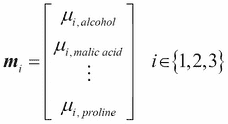

```py
>>> np.set_printoptions(precision=4)
>>> mean_vecs = []
>>> for label in range(1,4):
...     mean_vecs.append(np.mean(
...                X_train_std[y_train==label], axis=0))
...     print('MV %s: %s\n' %(label, mean_vecs[label-1]))
MV 1: [ 0.9259 -0.3091  0.2592 -0.7989  0.3039  0.9608  1.0515 -0.6306  0.5354
  0.2209  0.4855  0.798   1.2017]

MV 2: [-0.8727 -0.3854 -0.4437  0.2481 -0.2409 -0.1059  0.0187 -0.0164  0.1095
 -0.8796  0.4392  0.2776 -0.7016]

MV 3: [ 0.1637  0.8929  0.3249  0.5658 -0.01   -0.9499 -1.228   0.7436 -0.7652
  0.979  -1.1698 -1.3007 -0.3912]
```

使用均值向量，我们现在可以计算类内散布矩阵：

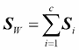

这是通过将每个单独类别的各个散布矩阵相加得出的：


```py
>>> d = 13 # number of features
>>> S_W = np.zeros((d, d))
>>> for label,mv in zip(range(1,4), mean_vecs):
...     class_scatter = np.zeros((d, d)) 
...     for row in X_train[y_train == label]:
...         row, mv = row.reshape(d, 1), mv.reshape(d, 1) 
...         class_scatter += (row-mv).dot((row-mv).T)
...     S_W += class_scatter                             
>>> print('Within-class scatter matrix: %sx%s'
...        % (S_W.shape[0], S_W.shape[1]))
Within-class scatter matrix: 13x13
```

我们在计算散点矩阵时所做的假设是训练集中的类标签是均匀分布的。 但是，如果我们打印类标签的数量，则会发现违反了该假设：

```py
>>> print('Class label distribution: %s' 
...       % np.bincount(y_train)[1:])
Class label distribution: [40 49 35]
```

因此，在将各个散点矩阵汇总为散点矩阵之前，我们希望对它们进行缩放。 当将散布矩阵除以类别样本的数量时，我们可以看到，计算散布矩阵实际上与计算协方差矩阵相同。 协方差矩阵是散射矩阵的归一化版本：


```py
>>> d = 13 # number of features
>>> S_W = np.zeros((d, d))
>>> for label,mv in zip(range(1, 4), mean_vecs):
...     class_scatter = np.cov(X_train_std[y_train==label].T)
...     S_W += class_scatter
>>> print('Scaled within-class scatter matrix: %sx%s' 
...       % (S_W.shape[0], S_W.shape[1]))
Scaled within-class scatter matrix: 13x13
```

在计算了缩放后的类内散布矩阵（或协方差矩阵）之后，我们可以继续进行下一步，并计算类间散布矩阵：


此处，是所计算的总体平均值，包括来自所有类别的样本。

```py
>>> mean_overall = np.mean(X_train_std, axis=0)
>>> d = 13 # number of features
>>> S_B = np.zeros((d, d))
>>> for i,mean_vec in enumerate(mean_vecs):
...     n = X_train[y_train==i+1, :].shape[0]
...     mean_vec = mean_vec.reshape(d, 1)
...     mean_overall = mean_overall.reshape(d, 1) 
    S_B += n * (mean_vec - mean_overall).dot(
...                (mean_vec - mean_overall).T)
print('Between-class scatter matrix: %sx%s' 
...    % (S_B.shape[0], S_B.shape[1]))
Between-class scatter matrix: 13x13
```

## 为新特征子空间选择线性判别式

LDA 的其余步骤与 PCA 的步骤相似。 但是，我们没有对协方差矩阵进行特征分解，而是解决了矩阵的广义特征值问题：

```py
>>>eigen_vals, eigen_vecs =\
...np.linalg.eig(np.linalg.inv(S_W).dot(S_B))
```

计算完特征对之后，我们现在可以按降序对特征值进行排序：

```py
>>> eigen_pairs = [(np.abs(eigen_vals[i]), eigen_vecs[:,i]) 
...              for i in range(len(eigen_vals))]
>>> eigen_pairs = sorted(eigen_pairs, 
...               key=lambda k: k[0], reverse=True)
>>> print('Eigenvalues in decreasing order:\n')
>>> for eigen_val in eigen_pairs:
...     print(eigen_val[0])

Eigenvalues in decreasing order:

452.721581245
156.43636122
8.11327596465e-14
2.78687384543e-14
2.78687384543e-14
2.27622032758e-14
2.27622032758e-14
1.97162599817e-14
1.32484714652e-14
1.32484714652e-14
1.03791501611e-14
5.94140664834e-15
2.12636975748e-16
```

在 LDA 中，线性判别式的数量最多为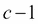，其中是类别标签的数量，因为类别之间的散布矩阵是等级为 1 或更小的矩阵之和。 我们确实可以看到我们只有两个非零特征值（特征值 3-13 不完全为零，但这是由于 NumPy 中的浮点算法所致）。 请注意，在极少数情况下，理想的共线性（所有对齐的样本点都位于一条直线上），协方差矩阵的秩为 1，这将导致仅一个特征向量具有非零特征值。

为了测量线性判别式（特征向量）捕获了多少类别区分信息，让我们通过减少特征值来绘制线性判别式，类似于在 PCA 部分中创建的解释方差图。 为简单起见，我们将类别区分信息的内容称为*可辨别性*。

```py
>>> tot = sum(eigen_vals.real)
>>> discr = [(i / tot) for i in sorted(eigen_vals.real, reverse=True)]
>>> cum_discr = np.cumsum(discr)
>>> plt.bar(range(1, 14), discr, alpha=0.5, align='center',
...         label='individual "discriminability"')
>>> plt.step(range(1, 14), cum_discr, where='mid',
...          label='cumulative "discriminability"')
>>> plt.ylabel('"discriminability" ratio')
>>> plt.xlabel('Linear Discriminants')
>>> plt.ylim([-0.1, 1.1])
>>> plt.legend(loc='best')
>>> plt.show()
```

从结果图中可以看出，前两个线性判别式在 *Wine* 训练数据集中捕获了约 100％的有用信息：


现在让我们堆叠两个最有区别的特征向量列，以创建变换矩阵：

```py
>>> w = np.hstack((eigen_pairs[0][1][:, np.newaxis].real,
...                eigen_pairs[1][1][:, np.newaxis].real))
>>> print('Matrix W:\n', w)
Matrix W:
[[ 0.0662 -0.3797]
[-0.0386 -0.2206]
[ 0.0217 -0.3816]
[-0.184 0.3018]
[ 0.0034 0.0141]
[-0.2326 0.0234]
[ 0.7747 0.1869]
[ 0.0811 0.0696]
[-0.0875 0.1796]
[-0.185 -0.284 ]
[ 0.066 0.2349]
[ 0.3805 0.073 ]
[ 0.3285 -0.5971]]
```

## 将样本投影到新特征空间上

使用我们在上一节中创建的转换矩阵，我们现在可以通过乘以矩阵来转换训练数据集：


```py
>>> X_train_lda = X_train_std.dot(w)
>>> colors = ['r', 'b', 'g']
>>> markers = ['s', 'x', 'o']
>>> for l, c, m in zip(np.unique(y_train), colors, markers):
...     plt.scatter(X_train_lda[y_train==l, 0]*(-1) 
...                 X_train_lda[y_train==l, 1]*(-1) 
...                 c=c, label=l, marker=m)
>>> plt.xlabel('LD 1')
>>> plt.ylabel('LD 2')
>>> plt.legend(loc='lower right')
>>> plt.show()
```

正如我们在结果图中看到的那样，这三个酒类现在在新功能子空间中是线性可分离的：

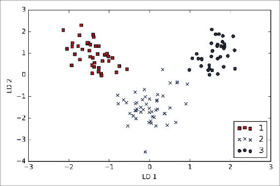

## 通过 scikit-learn 进行的 LDA

分步实施对于了解 LDA 的内部工作原理以及了解 LDA 与 PCA 之间的差异是一个很好的练习。 现在，让我们看一下在 scikit-learn 中实现的`LDA`类：

```py
>>> from sklearn.lda import LDA
>>> lda = LDA(n_components=2)
>>> X_train_lda = lda.fit_transform(X_train_std, y_train)
```

接下来，让我们看看逻辑回归分类器在 LDA 转换后如何处理低维训练数据集：

```py
>>> lr = LogisticRegression()
>>> lr = lr.fit(X_train_lda, y_train)
>>> plot_decision_regions(X_train_lda, y_train, classifier=lr)
>>> plt.xlabel('LD 1')
>>> plt.ylabel('LD 2')
>>> plt.legend(loc='lower left')
>>> plt.show()
```

查看结果图，我们发现逻辑回归模型对类别 2 的样本之一进行了错误分类：


通过降低正则化强度，我们可能可以改变决策边界，以便逻辑回归模型可以对训练数据集中的所有样本进行正确分类。 但是，让我们看一下测试集上的结果：

```py
>>> X_test_lda = lda.transform(X_test_std)
>>> plot_decision_regions(X_test_lda, y_test, classifier=lr)
>>> plt.xlabel('LD 1')
>>> plt.ylabel('LD 2')
>>> plt.legend(loc='lower left')
>>> plt.show()
```

正如我们在结果图中看到的那样，逻辑回归分类器通过仅使用二维特征子空间而不是原始的 13 *Wine* ，就可以对测试数据集中的样本进行分类，从而获得完美的准确性得分。 特征：


# 使用内核主成分分析进行非线性映射

许多机器学习算法都对输入数据的线性可分离性进行了假设。 您了解到，感知器甚至需要完全线性可分离的训练数据来收敛。 到目前为止，我们已经介绍的其他算法都假设缺乏完美的线性可分离性是由于噪声引起的：Adaline，逻辑回归和（标准）**支持向量机**（ **SVM** ）[ 仅举几例。 但是，如果要处理非线性问题（在实际应用中可能会经常遇到），则用于降维的线性变换技术（例如 PCA 和 LDA）可能不是最佳选择。 在本节中，我们将研究 PCA 的内核版本，或*内核 PCA* ，它与我们从[第 3 章](37.html "Chapter 3. A Tour of Machine Learning Classifiers Using scikit-learn")，*中记住的内核 SVM 的概念有关。 使用 Scikit 学习*的机器学习分类器的浏览。 使用内核 PCA，我们将学习如何将不可线性分离的数据转换为适合线性分类器的新的较低维子空间。


## 内核功能和内核技巧

我们在[第 3 章](37.html "Chapter 3. A Tour of Machine Learning Classifiers Using scikit-learn")和*使用 Scikit-learn* 进行的机器学习分类器讨论中对内核 SVM 的讨论中还记得，我们可以通过投影非线性问题来解决它们 到更高维度的新特征空间上，这些类可以线性分离。 为了将样本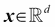转换到这个更高的维子空间，我们定义了非线性映射函数：


我们可以将视为创建原始特征的非线性组合以将原始-维数据集映射到更大的-维特征空间的函数。 例如，如果我们具有二维的特征向量（是由特征组成的列向量），则到 3D 空间的潜在映射可能如下：


换句话说，通过内核 PCA，我们执行了非线性映射，将数据转换为到更高维度的空间，并在该更高维度的空间中使用标准 PCA 将数据投射回更低维度的空间， 样本可以通过线性分类器分离（在样本可以通过输入空间中的密度分离的条件下）。 但是，这种方法的一个缺点是它在计算上非常昂贵，这就是我们使用*内核技巧*的地方。 使用内核技巧，我们可以计算原始特征空间中两个高维特征向量之间的相似度。

在继续使用内核技巧来解决这个计算量巨大的问题的更多细节之前，让我们回顾一下在本章开始时实现的*标准* PCA 方法。 我们计算了两个特征和之间的协方差，如下所示：


由于特征的标准化使它们居中于零均值（例如和），因此可以如下简化此方程：


请注意，前面的方程是指两个特征之间的协方差。 现在，让我们编写通用方程式以计算协方差*矩阵* ：


Bernhard Scholkopf 推广了这种方法（B. Scholkopf，A。Smola 和 K.-R. Muller。*核主成分分析*。第 583-588 页，1997 年），以便我们可以替换样本之间的点积 通过的非线性特征组合在原始特征空间中：


要从此协方差矩阵中获得特征向量（主要成分），我们必须求解以下方程式：


此处，和是协方差矩阵的特征值和特征向量，而可以是通过提取内核（相似性）矩阵的特征向量而获得的。 我们将在以下段落中看到。

内核矩阵的推导如下：

首先，让我们以矩阵表示法编写协方差矩阵，其中是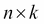-维矩阵：


现在，我们可以写出特征向量公式，如下所示：


由于，我们得到：

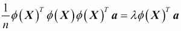

在两侧将其乘以会得到以下结果：


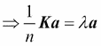

在这里，是相似度（内核）矩阵：

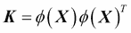

正如我们在[第 3 章](37.html "Chapter 3. A Tour of Machine Learning Classifiers Using scikit-learn")和*使用 Scikit 学习*的机器学习分类器中的 SVM 部分所回顾的那样，我们使用内核技巧来避免计算成对的点[HTG5 使用内核函数显式地提取下的样本的乘积，因此我们无需显式地计算特征向量：


换句话说，我们在内核 PCA 之后获得的是已经投影到各个组件上的样本，而不是像标准 PCA 方法那样构造转换矩阵。 基本上，内核函数（或简称为*内核*）可以理解为一种计算两个向量之间的点积（一种相似性度量）的函数。

最常用的内核如下：

*   The polynomial kernel:

    

    此处，是阈值，是用户必须指定的功率。

*   The hyperbolic tangent (sigmoid) kernel:

    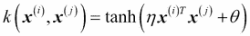

*   The **Radial Basis Function** (**RBF**) or Gaussian kernel that we will use in the following examples in the next subsection:

    

    它也写成如下：

    

总结到目前为止，我们可以定义以下三个步骤来实现 RBF 内核 PCA：

1.  We compute the kernel (similarity) matrix , where we need to calculate the following:

    

    We do this for each pair of samples:

    

    例如，如果我们的数据集包含 100 个训练样本，则成对相似性的对称核矩阵将是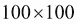维。

2.  We center the kernel matrix  using the following equation:

    

    Here,  is an - dimensional matrix (the same dimensions as the kernel matrix) where all values are equal to .
3.  我们基于中心核矩阵的相应特征值收集顶部的特征向量，这些特征向量通过减小幅度进行排序。 与标准 PCA 相比，特征向量不是主要成分轴，而是投影到这些轴上的样本。

此时，您可能想知道为什么我们需要在第二步中将内核矩阵居中。 以前我们假设我们正在使用标准化数据，当我们制定协方差矩阵并通过将非线性特征组合替换为点积时，所有特征均均值为零。 因此，由于我们没有明确地计算新特征空间，并且不能保证新特征空间也以零为中心，因此在第二步中将内核矩阵居中成为必要。

在下一节中，我们将通过在 Python 中实现内核 PCA 来将这三个步骤付诸实践。

## 用 Python 实现内核主成分分析

在前面的小节中，我们讨论了内核 PCA 背后的核心概念。 现在，我们将按照概述内核 PCA 方法的三个步骤，用 Python 实现 RBF 内核 PCA。 使用 SciPy 和 NumPy 帮助函数，我们将看到实现内核 PCA 实际上非常简单：

```py
from scipy.spatial.distance import pdist, squareform
from scipy import exp
from scipy.linalg import eigh
import numpy as np

def rbf_kernel_pca(X, gamma, n_components):
    """
    RBF kernel PCA implementation.

    Parameters
    ------------
    X: {NumPy ndarray}, shape = [n_samples, n_features]

    gamma: float
      Tuning parameter of the RBF kernel

    n_components: int
      Number of principal components to return

    Returns
    ------------
     X_pc: {NumPy ndarray}, shape = [n_samples, k_features]
       Projected dataset   

    """
    # Calculate pairwise squared Euclidean distances
    # in the MxN dimensional dataset.
    sq_dists = pdist(X, 'sqeuclidean')

    # Convert pairwise distances into a square matrix.
    mat_sq_dists = squareform(sq_dists)

    # Compute the symmetric kernel matrix.
    K = exp(-gamma * mat_sq_dists)

    # Center the kernel matrix.
    N = K.shape[0]
    one_n = np.ones((N,N)) / N
    K = K - one_n.dot(K) - K.dot(one_n) + one_n.dot(K).dot(one_n)

    # Obtaining eigenpairs from the centered kernel matrix
    # numpy.eigh returns them in sorted order
    eigvals, eigvecs = eigh(K)

    # Collect the top k eigenvectors (projected samples)
    X_pc = np.column_stack((eigvecs[:, -i] 
                            for i in range(1, n_components + 1)))

    return X_pc
```

使用 RBF 内核 PCA 进行降维的一个缺点是我们必须先指定参数。 为找到合适的值需要进行实验，最好使用参数调整算法来完成，例如网格搜索，我们将在[第 6 章](40.html "Chapter 6. Learning Best Practices for Model Evaluation and Hyperparameter Tuning")和*学习最佳实践中详细讨论。 模型评估和超参数调整*。

### 示例 1 –分离半月形

现在，让我们将`rbf_kernel_pca`应用于某些非线性示例数据集。 我们将首先创建一个包含两个半月形的 100 个采样点的二维数据集：

```py
>>> from sklearn.datasets import make_moons
>>> X, y = make_moons(n_samples=100, random_state=123)
>>> plt.scatter(X[y==0, 0], X[y==0, 1], 
...             color='red', marker='^', alpha=0.5)
>>> plt.scatter(X[y==1, 0], X[y==1, 1],
...             color='blue', marker='o', alpha=0.5)
>>> plt.show()
```

为了说明的目的，三角形符号的半月形代表一个类别，圆形符号表示的半月形代表另一个类别的样本：


显然，这两个半月形不是线性可分离的，我们的目标是通过内核 PCA *展开*半月，以便数据集可以用作线性分类器的合适输入。 但是首先，让我们看看如果通过标准 PCA 将数据集投影到主要组件上，数据集会是什么样子：

```py
>>> from sklearn.decomposition import PCA
>>> scikit_pca = PCA(n_components=2)
>>> X_spca = scikit_pca.fit_transform(X)
>>> fig, ax = plt.subplots(nrows=1,ncols=2, figsize=(7,3))
>>> ax[0].scatter(X_spca[y==0, 0], X_spca[y==0, 1], 
...               color='red', marker='^', alpha=0.5)
>>> ax[0].scatter(X_spca[y==1, 0], X_spca[y==1, 1],
...               color='blue', marker='o', alpha=0.5)
>>> ax[1].scatter(X_spca[y==0, 0], np.zeros((50,1))+0.02, 
...               color='red', marker='^', alpha=0.5)
>>> ax[1].scatter(X_spca[y==1, 0], np.zeros((50,1))-0.02,
...               color='blue', marker='o', alpha=0.5)
>>> ax[0].set_xlabel('PC1')
>>> ax[0].set_ylabel('PC2')
>>> ax[1].set_ylim([-1, 1])
>>> ax[1].set_yticks([])
>>> ax[1].set_xlabel('PC1')
>>> plt.show()
```

显然，我们可以在结果图中看到，线性分类器将无法在通过标准 PCA 转换的数据集上很好地发挥作用：


请注意，当我们仅绘制第一个主成分（右子图）时，我们将三角形样本稍微向上移动，将圆形样本稍微向下移动，以更好地可视化类别重叠。

### 注意

请记住，PCA 是一种不受监督的方法，并且不使用类标签信息来最大化与 LDA 相比的差异。 此处，仅出于可视化目的添加了三角形和圆形符号以指示分离程度。

现在，让我们尝试一下我们在上一节中实现的内核 PCA 函数`rbf_kernel_pca`：

```py
>>> from matplotlib.ticker import FormatStrFormatter
>>> X_kpca = rbf_kernel_pca(X, gamma=15, n_components=2)
>>> fig, ax = plt.subplots(nrows=1,ncols=2, figsize=(7,3))
>>> ax[0].scatter(X_kpca[y==0, 0], X_kpca[y==0, 1], 
...               color='red', marker='^', alpha=0.5)
>>> ax[0].scatter(X_kpca[y==1, 0], X_kpca[y==1, 1],
...               color='blue', marker='o', alpha=0.5)
>>> ax[1].scatter(X_kpca[y==0, 0], np.zeros((50,1))+0.02, 
...               color='red', marker='^', alpha=0.5)
>>> ax[1].scatter(X_kpca[y==1, 0], np.zeros((50,1))-0.02,
...               color='blue', marker='o', alpha=0.5)
>>> ax[0].set_xlabel('PC1')
>>> ax[0].set_ylabel('PC2')
>>> ax[1].set_ylim([-1, 1])
>>> ax[1].set_yticks([])
>>> ax[1].set_xlabel('PC1')
>>> ax[0].xaxis.set_major_formatter(FormatStrFormatter('%0.1f'))
>>> ax[1].xaxis.set_major_formatter(FormatStrFormatter('%0.1f'))
>>> plt.show()
```

现在我们可以看到两个类（圆形和三角形）线性良好地分开，因此它成为线性分类器的合适训练数据集：


不幸的是，没有适用于不同数据集的调整参数的通用值。 要找到适合给定问题的值，需要进行实验。 在[第 6 章](40.html "Chapter 6. Learning Best Practices for Model Evaluation and Hyperparameter Tuning")和*学习模型评估和超参数调整的最佳实践*中，我们将讨论可以帮助我们自动执行优化调整参数任务的技术。 在这里，我将使用我发现产生*良好*结果的值。

### 示例 2 –分离同心圆

在上一小节中，我们向您展示了如何通过内核 PCA 分离半月形。 由于我们花了很多精力来理解内核 PCA 的概念，因此让我们看一下另一个有趣的非线性问题示例：同心圆。

代码如下：

```py
>>> from sklearn.datasets import make_circles
>>> X, y = make_circles(n_samples=1000, 
...            random_state=123, noise=0.1, factor=0.2)
>>> plt.scatter(X[y==0, 0], X[y==0, 1],
...            color='red', marker='^', alpha=0.5)
>>> plt.scatter(X[y==1, 0], X[y==1, 1],
...            color='blue', marker='o', alpha=0.5)
>>> plt.show()
```

同样，我们假设一个两类问题，其中三角形分别代表一类，而圆形分别代表另一类：


让我们从标准 PCA 方法开始，将其与 RBF 内核 PCA 的结果进行比较：

```py
>>> scikit_pca = PCA(n_components=2)
>>> X_spca = scikit_pca.fit_transform(X)
>>> fig, ax = plt.subplots(nrows=1,ncols=2, figsize=(7,3))
>>> ax[0].scatter(X_spca[y==0, 0], X_spca[y==0, 1], 
...               color='red', marker='^', alpha=0.5)
>>> ax[0].scatter(X_spca[y==1, 0], X_spca[y==1, 1],
...               color='blue', marker='o', alpha=0.5)
>>> ax[1].scatter(X_spca[y==0, 0], np.zeros((500,1))+0.02, 
...              color='red', marker='^', alpha=0.5)
>>> ax[1].scatter(X_spca[y==1, 0], np.zeros((500,1))-0.02,
...               color='blue', marker='o', alpha=0.5)
>>> ax[0].set_xlabel('PC1')
>>> ax[0].set_ylabel('PC2')
>>> ax[1].set_ylim([-1, 1])
>>> ax[1].set_yticks([])
>>> ax[1].set_xlabel('PC1')
>>> plt.show()
```

同样，我们可以看到标准 PCA 无法产生适合训练线性分类器的结果：

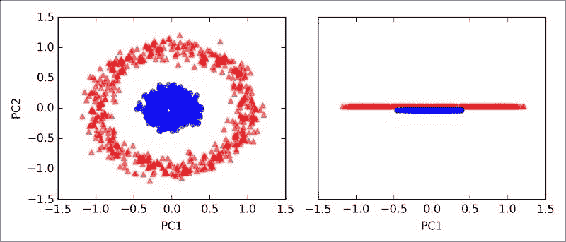

给定的适当值，让我们看看使用 RBF 内核 PCA 实现是否更幸运：

```py
>>> X_kpca = rbf_kernel_pca(X, gamma=15, n_components=2)
>>> fig, ax = plt.subplots(nrows=1,ncols=2, figsize=(7,3))
>>> ax[0].scatter(X_kpca[y==0, 0], X_kpca[y==0, 1], 
...               color='red', marker='^', alpha=0.5)
>>> ax[0].scatter(X_kpca[y==1, 0], X_kpca[y==1, 1],
...               color='blue', marker='o', alpha=0.5)
>>> ax[1].scatter(X_kpca[y==0, 0], np.zeros((500,1))+0.02, 
...               color='red', marker='^', alpha=0.5)
>>> ax[1].scatter(X_kpca[y==1, 0], np.zeros((500,1))-0.02,
...               color='blue', marker='o', alpha=0.5)
>>> ax[0].set_xlabel('PC1')
>>> ax[0].set_ylabel('PC2')
>>> ax[1].set_ylim([-1, 1])
>>> ax[1].set_yticks([])
>>> ax[1].set_xlabel('PC1')
>>> plt.show()
```

再次，RBF 内核 PCA 将数据投影到新的子空间上，在这两个类之间可以线性分离：


## 投影新数据点

在内核 PCA 的前两个示例应用程序，半月形和同心圆中，我们将单个数据集投影到了新功能上。 但是，在实际应用中，我们可能要转换一个以上的数据集，例如训练和测试数据，并且通常还会在模型构建和评估后收集新样本。 在本节中，您将学习如何投影不属于训练数据集的数据点。

我们从本章开始的标准 PCA 方法中记得，我们通过计算转换矩阵与输入样本之间的点积来投影数据。 投影矩阵的列是我们从协方差矩阵获得的顶部特征向量（）。 现在，问题是如何将这一概念转移到内核 PCA？ 如果我们回想一下内核 PCA 背后的想法，我们记得我们已经获得了中心内核矩阵（不是协方差矩阵）的特征向量（），这意味着这些是已经投影到主成分上的样本 轴。 因此，如果要将新样本投影到该主分量轴上，则需要计算以下内容：


幸运的是，我们可以使用内核技巧，因此我们不必显式计算投影。 但是，值得注意的是，与标准 PCA 相比，内核 PCA 是一种基于内存的方法，这意味着我们每次都必须重用原始训练集来投影新样本。 我们必须计算训练数据集中的每个样本与新样本之间的成对 RBF 核（相似性）：


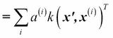

在此，内核矩阵的特征向量和特征值在公式中满足以下条件：


在计算新样本与训练集中样本之间的相似度后，我们必须通过特征向量对其特征值进行归一化。 因此，让我们修改我们先前实现的`rbf_kernel_pca`函数，使其也返回内核矩阵的特征值：

```py
from scipy.spatial.distance import pdist, squareform
from scipy import exp
from scipy.linalg import eigh
import numpy as np

def rbf_kernel_pca(X, gamma, n_components):
    """
    RBF kernel PCA implementation.

    Parameters
    ------------
    X: {NumPy ndarray}, shape = [n_samples, n_features]

    gamma: float
      Tuning parameter of the RBF kernel

    n_components: int
      Number of principal components to return

    Returns
    ------------
     X_pc: {NumPy ndarray}, shape = [n_samples, k_features]
       Projected dataset   

     lambdas: list
       Eigenvalues

    """
    # Calculate pairwise squared Euclidean distances
    # in the MxN dimensional dataset.
    sq_dists = pdist(X, 'sqeuclidean')

    # Convert pairwise distances into a square matrix.
    mat_sq_dists = squareform(sq_dists)

    # Compute the symmetric kernel matrix.
    K = exp(-gamma * mat_sq_dists)

    # Center the kernel matrix.
    N = K.shape[0]
    one_n = np.ones((N,N)) / N
    K = K - one_n.dot(K) - K.dot(one_n) + one_n.dot(K).dot(one_n)

    # Obtaining eigenpairs from the centered kernel matrix
    # numpy.eigh returns them in sorted order
    eigvals, eigvecs = eigh(K)

    # Collect the top k eigenvectors (projected samples)
    alphas = np.column_stack((eigvecs[:,-i] 
                    for i in range(1,n_components+1)))

    # Collect the corresponding eigenvalues
    lambdas = [eigvals[-i] for i in range(1,n_components+1)]

    return alphas, lambdas
```

现在，让我们创建一个新的半月数据集，并使用更新的 RBF 内核 PCA 实现将其投影到一维子空间上：

```py
>>> X, y = make_moons(n_samples=100, random_state=123)
>>> alphas, lambdas =rbf_kernel_pca(X, gamma=15, n_components=1)
```

为了确保实现用于投影新样本的代码，我们假设半月数据集的第 26 个点是一个新数据点，我们的任务是将其投影到这个新子空间上：

```py
>>> x_new = X[25]
>>> x_new
array([ 1.8713187 ,  0.00928245])
>>> x_proj = alphas[25] # original projection
>>> x_proj
array([ 0.07877284])
>>> def project_x(x_new, X, gamma, alphas, lambdas):
...     pair_dist = np.array([np.sum(
...                  (x_new-row)**2) for row in X])
...     k = np.exp(-gamma * pair_dist)
... return k.dot(alphas / lambdas)
```

通过执行以下代码，我们可以再现原始投影。 使用`project_x`功能，我们也可以投影任何新的数据样本。 代码如下：

```py
>>> x_reproj = project_x(x_new, X, 
...       gamma=15, alphas=alphas, lambdas=lambdas)
>>> x_reproj
array([ 0.07877284])
```

最后，让我们可视化第一个主要成分上的投影：

```py
>>> plt.scatter(alphas[y==0, 0], np.zeros((50)), 
...             color='red', marker='^',alpha=0.5)
>>> plt.scatter(alphas[y==1, 0], np.zeros((50)), 
...             color='blue', marker='o', alpha=0.5)
>>> plt.scatter(x_proj, 0, color='black', 
...             label='original projection of point X[25]',
...             marker='^', s=100)
>>> plt.scatter(x_reproj, 0, color='green', 
...             label='remapped point X[25]',
...             marker='x', s=500)
>>> plt.legend(scatterpoints=1)
>>> plt.show()
```

正如我们在散点图的中所看到的，我们将样本正确映射到了第一个主成分上：


## scikit-learn 中的内核主成分分析

为了我们的方便，scikit-learn 在`sklearn.decomposition`子模块中实现了内核 PCA 类。 用法类似于标准 PCA 类，我们可以通过`kernel`参数指定内核：

```py
>>> from sklearn.decomposition import KernelPCA
>>> X, y = make_moons(n_samples=100, random_state=123)
>>> scikit_kpca = KernelPCA(n_components=2, 
...               kernel='rbf', gamma=15)
>>> X_skernpca = scikit_kpca.fit_transform(X)
```

为了查看是否获得与我们自己的内核 PCA 实现一致的结果，让我们将转换后的半月形数据绘制到前两个主要成分上：

```py
>>> plt.scatter(X_skernpca[y==0, 0], X_skernpca[y==0, 1], 
...             color='red', marker='^', alpha=0.5)
>>> plt.scatter(X_skernpca[y==1, 0], X_skernpca[y==1, 1], 
...             color='blue', marker='o', alpha=0.5)
>>> plt.xlabel('PC1')
>>> plt.ylabel('PC2')
>>> plt.show()
```

如我们所见， scikit-learn `KernelPCA`的结果与我们自己的实现一致：

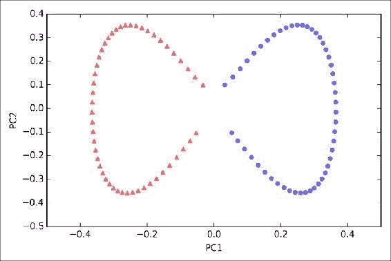

### 注意

Scikit-learn 还实现了非线性降维的高级技术，这超出了本书的范围。 您可以通过[这个页面](http://scikit-learn.org/stable/modules/manifold.html)上的说明示例，在 scikit-learn 中找到有关当前实现的很好概述。


