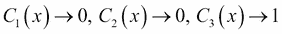
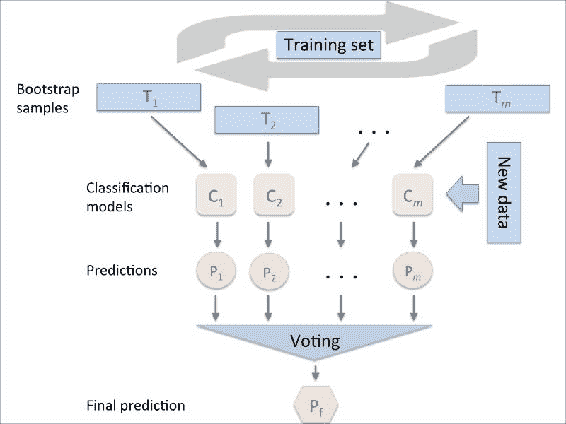

# 第 7 章。组合不同的模型进行集成学习

在上一章中，我们重点介绍了优化和评估不同分类模型的最佳实践。 在本章中，我们将基于这些技术并探索构建一组分类器的不同方法，这些分类器通常比其任何单个成员具有更好的预测性能。 你将学到如何：

*   根据多数投票做出预测
*   通过绘制带有重复的训练集的随机组合来减少过度拟合
*   从*弱小学习者*建立强大的模型，从他们的错误中学习

# 通过合奏学习

**集成方法** 背后的目标是将不同的分类器组合成一个元分类器，该分类器比单独的每个分类器具有更好的泛化性能。 例如，假设我们收集了 10 位专家的预测，那么集成方法将使我们能够策略性地组合 10 位专家的这些预测，以得出比每位专家的预测更准确，更可靠的预测。 正如我们将在本章稍后看到的那样，有几种不同的方法可以创建分类器集合。 在本节中，我们将介绍有关集成的工作原理以及为什么通常以产生良好的泛化性能而闻名的原因的基本认识。

在本章中，我们将重点介绍使用**多数表决**原理的最流行的合奏方法。 多数投票只是意味着我们选择大多数分类器预测的分类标签，即获得超过 50％的投票。 严格来说，**多数票**一词仅指二进制类设置。 但是，很容易将多数表决原则推广到多类别设置，这称为**多个表决**。 在这里，我们选择获得最多投票（模式）的类别标签。 下图说明了由 10 个分类器组成的集合的多数表决和多数表决的概念，其中每个唯一符号（三角形，正方形和圆形）代表一个唯一的类别标签：


使用训练集合，我们从训练`m`不同分类器（`C[1], ..., C[m]`）开始。 根据技术的不同，可以根据不同的分类算法（例如决策树，支持向量机，逻辑回归分类器等）构建整体。 或者，我们也可以使用适合训练集不同子集的相同基础分类算法。 这种方法的一个突出示例是随机森林算法，该算法结合了不同的决策树分类器。 下图说明了使用多数投票的一般合奏方法的概念：


为了通过简单多数或多次投票来预测类别标签，我们将每个分类器`C[j]`的预测类别标签进行组合，然后选择获得最多投票的类别标签`y_hat`：


例如，在`class1 = -1`和`class2 = +1`的二进制分类任务中，我们可以编写如下的多数投票预测：


为了说明，为什么集成方法比单独的分类器可以更好地工作，让我们应用组合器的简单概念。 对于以下示例，我们假设二进制分类任务的所有`n`个基本分类器均具有相同的错误率`ε`。 此外，我们假设分类器是独立的，并且错误率不相关。 在这些假设下，我们可以简单地将一组基本分类器的错误概率表示为二项式分布的概率质量函数：


此处，`C(n, k)`是二项式系数 *n 选择 k*。 换句话说，我们计算整体预测错误的概率。 现在，让我们看一下 11 个基本分类器（`n = 11`）的更具体示例，错误率为 0.25（`ε = 0.25`）：


如我们所见，如果满足所有假设，则集合的错误率（0.034）远低于每个单独分类器的错误率（0.25）。 注意，在此简化图示中，将 50-50 除以偶数个分类器`n`视为错误，而这只有一半的时间是真实的。 为了在一系列不同的基本错误率上将这种理想的整体分类器与基本分类器进行比较，让我们在 Python 中实现概率质量函数：

```py
>>> from scipy.misc import comb
>>> import math
>>> def ensemble_error(n_classifier, error):
...     k_start = math.ceil(n_classifier / 2.0)
...     probs = [comb(n_classifier, k) * 
...              error**k * 
...              (1-error)**(n_classifier - k) 
...              for k in range(k_start, n_classifier + 1)]
...     return sum(probs)
>>> ensemble_error(n_classifier=11, error=0.25)
0.034327507019042969
```

在实现`ensemble_error`函数之后，我们可以计算范围从 0.0 到 1.0 的不同基础误差的整体误差率，以在折线图中可视化整体和基础误差之间的关系：

```py
>>> import numpy as np
>>> error_range = np.arange(0.0, 1.01, 0.01)
>>> ens_errors = [ensemble_error(n_classifier=11, error=error) 
...               for error in error_range]
>>> import matplotlib.pyplot as plt
>>> plt.plot(error_range, ens_errors, 
...          label='Ensemble error', 
...          linewidth=2)
>>> plt.plot(error_range, error_range, 
...          linestyle='--', label='Base error',
...          linewidth=2)
>>> plt.xlabel('Base error')
>>> plt.ylabel('Base/Ensemble error')
>>> plt.legend(loc='upper left')
>>> plt.grid()
>>> plt.show()
```

正如我们在结果图中看到的那样，只要基本分类器的性能优于随机猜测（`ε < 0.25`），则集成的错误概率总是比单个基本分类器的错误概率要好。 请注意，`y`轴描述了基本误差（虚线）以及整体误差（实线）：


# 实现简单的多数投票分类器

在上一节对集成学习的简短介绍之后，让我们开始进行热身练习，并为 Python 中的多数投票实现一个简单的集成分类器。 尽管以下算法也可以通过复数投票将其推广到多类别设置，但为简便起见，我们将使用术语*多数投票*，这在文献中也经常这样做。

我们将要实现的算法将使我们能够将与各个权重相关联的不同分类算法组合在一起，以提高置信度。 我们的目标是建立一个更强大的元分类器，以平衡特定数据集上各个分类器的弱点。 用更精确的数学术语，我们可以编写加权多数投票，如下所示：


在这里，`w[j]`是与基本分类器关联的权重，`C[j]`，`y_hat`是集合的预测类别标签，`χ[A]`（希腊语 *chi* ）是特征函数`C[j](x) = i ∈ A`和`A`是唯一类标签的集合。 对于相等的权重，我们可以简化此等式并将其编写如下：


为了更好地理解*加权*的概念，我们现在来看一个更具体的示例。 假设我们有三个基本分类器`C[j]`（`j ∈ {0, 1}`）的集合，并且要预测给定样本实例的类别标签`x`。三个基本分类器中有两个预测类别标签 0， 一个`C[3]`预测该样本属于 1 类。如果我们对每个基本分类器的预测进行平均加权，则多数投票将预测该样本属于 0 类：




现在让我们分别为`C[3]`分配 0.6 的权重，并为`C[1]`和`C[2]`分配权重 0.2 的系数。


直观地讲，更多，因为`3 x 0.2 = 0.6`可以说，`C[3]`的预测权重分别比`C[1]`或`C[2]`的预测权重高三倍。 我们可以这样写：


要将加权多数投票的概念转换为 Python 代码，我们可以使用 NumPy 方便的`argmax`和`bincount`函数：

```py
>>> import numpy as np
>>> np.argmax(np.bincount([0, 0, 1], 
...           weights=[0.2, 0.2, 0.6]))
1
```

如第 3 章和“使用 Scikit-learn” 进行的机器学习分类器之旅中所述，scikit-learn 中的某些分类器还可以通过`predict_proba`返回预测的类标签的概率。 方法。 如果对我们集成中的分类器进行了很好的校准，则使用预测的分类概率代替多数投票的分类标签将很有用。 用于根据概率预测类别标签的多数投票的修改版本可以写成：


在此，`p[ij]`是分类标签`i`的第 *jth 个*分类器的预测概率。

继续前面的示例，我们假设我们有一个带有类别标签`i ∈ {0, 1}`和三个分类器`C[j]`（`j ∈ {1, 2, 3}`）的集合的二进制分类问题。 假设分类器`C[j]`针对特定样本`x`返回以下类成员资格概率：


然后，我们可以如下计算各个类别的概率：


为了实现基于类概率的加权多数投票，我们可以再次使用`numpy.average`和`np.argmax`使用 NumPy：

```py
>>> ex = np.array([[0.9, 0.1],
...                [0.8, 0.2],
...                [0.4, 0.6]])
>>> p = np.average(ex, axis=0, weights=[0.2, 0.2, 0.6])
>>> p
array([ 0.58,  0.42])
>>> np.argmax(p)
0
```

将所有放在一起，现在让我们在 Python 中实现一个`MajorityVoteClassifier`：

```py
from sklearn.base import BaseEstimator
from sklearn.base import ClassifierMixin
from sklearn.preprocessing import LabelEncoder
from sklearn.externals import six
from sklearn.base import clone
from sklearn.pipeline import _name_estimators
import numpy as np
import operator

class MajorityVoteClassifier(BaseEstimator,
                             ClassifierMixin):
    """ A majority vote ensemble classifier

    Parameters
    ----------
    classifiers : array-like, shape = [n_classifiers]
      Different classifiers for the ensemble

    vote : str, {'classlabel', 'probability'}
      Default: 'classlabel'
      If 'classlabel' the prediction is based on
      the argmax of class labels. Else if
      'probability', the argmax of the sum of
      probabilities is used to predict the class label
      (recommended for calibrated classifiers).

    weights : array-like, shape = [n_classifiers]
      Optional, default: None
      If a list of `int` or `float` values are
      provided, the classifiers are weighted by
      importance; Uses uniform weights if `weights=None`.

    """
    def __init__(self, classifiers,
                 vote='classlabel', weights=None):

        self.classifiers = classifiers
        self.named_classifiers = {key: value for
                                  key, value in
                                  _name_estimators(classifiers)}
        self.vote = vote
        self.weights = weights

    def fit(self, X, y):
        """ Fit classifiers.

        Parameters
        ----------
        X : {array-like, sparse matrix},
            shape = [n_samples, n_features]
            Matrix of training samples.

        y : array-like, shape = [n_samples]
            Vector of target class labels.

        Returns
        -------
        self : object

        """
        # Use LabelEncoder to ensure class labels start
        # with 0, which is important for np.argmax
        # call in self.predict
        self.lablenc_ = LabelEncoder()
        self.lablenc_.fit(y)
        self.classes_ = self.lablenc_.classes_
        self.classifiers_ = []
        for clf in self.classifiers:
            fitted_clf = clone(clf).fit(X,
                              self.lablenc_.transform(y))
            self.classifiers_.append(fitted_clf)
        return self
```

我在代码中添加了很多注释，以更好地理解各个部分。 但是，在实现其余方法之前，让我们先休息一下，讨论一些乍一看可能令人困惑的代码。 我们使用父类`BaseEstimator`和`ClassifierMixin`免费获得了一些基本功能*，包括用于设置和返回分类器参数以及`score`的方法`get_params`和`set_params` 分别计算预测精度的方法。 还要注意，我们导入了`six`以使`MajorityVoteClassifier`与 Python 2.7 兼容。*

接下来，如果我们使用`vote='classlabel'`初始化新的`MajorityVoteClassifier`对象，则将添加`predict`方法以基于类标签通过多数表决来预测类标签。 或者，我们将能够使用`vote='probability'`初始化整体分类器，以根据类成员资格概率预测类标签。 此外，我们还将添加`predict_proba`方法以返回平均概率，这对于计算曲线（**ROC AUC**）下的**接收机操作员特征区域很有用。**

```py
    def predict(self, X):
        """ Predict class labels for X.

        Parameters
        ----------
        X : {array-like, sparse matrix},
            Shape = [n_samples, n_features]
            Matrix of training samples.

        Returns
        ----------
        maj_vote : array-like, shape = [n_samples]
            Predicted class labels.

        """
        if self.vote == 'probability':
            maj_vote = np.argmax(self.predict_proba(X),
                                 axis=1)
        else:  # 'classlabel' vote

            #  Collect results from clf.predict calls
            predictions = np.asarray([clf.predict(X)
                                      for clf in
                                      self.classifiers_]).T

            maj_vote = np.apply_along_axis(
                           lambda x:
                           np.argmax(np.bincount(x,                                             
                                        weights=self.weights)),
                           axis=1,
                           arr=predictions)
        maj_vote = self.lablenc_.inverse_transform(maj_vote)
        return maj_vote

    def predict_proba(self, X):
        """ Predict class probabilities for X.

        Parameters
        ----------
        X : {array-like, sparse matrix},
            shape = [n_samples, n_features]
            Training vectors, where n_samples is
            the number of samples and
            n_features is the number of features.

        Returns
        ----------
        avg_proba : array-like,
            shape = [n_samples, n_classes]
            Weighted average probability for
            each class per sample.

        """
        probas = np.asarray([clf.predict_proba(X)
                             for clf in self.classifiers_])
        avg_proba = np.average(probas, 
                               axis=0, weights=self.weights)
        return avg_proba

    def get_params(self, deep=True):
        """ Get classifier parameter names for GridSearch"""
        if not deep:
            return super(MajorityVoteClassifier,
                         self).get_params(deep=False)
        else:
            out = self.named_classifiers.copy()
            for name, step in\ 
                    six.iteritems(self.named_classifiers):
                for key, value in six.iteritems(
                        step.get_params(deep=True)):
                    out['%s__%s' % (name, key)] = value
            return out
```

另外，请注意，我们定义了自己的`get_params`方法的修改版本以使用`_name_estimators`函数，以便访问集合中各个分类器的参数。 乍一看，这可能看起来有些复杂，但是当我们在稍后的部分中使用网格搜索进行超参数调整时，这将非常有意义。

### 注意

尽管我们的`MajorityVoteClassifier`实现对于演示非常有用，但我还在 scikit-learn 中实现了多数表决分类器的更高级版本。 在下一发行版（v0.17）中将以`sklearn.ensemble.VotingClassifier`的形式提供。

## 结合不同的分类算法和多数票

现在是时候，将我们在上一节中实现的`MajorityVoteClassifier`付诸实践。 但是首先，让我们准备一个可以测试的数据集。 由于我们已经熟悉从 CSV 文件加载数据集的技术，因此，我们将采取捷径并从 scikit-learn 的数据集模块中加载 **Iris** 数据集。 此外，我们将仅选择**萼片宽度** 和**花瓣长度**这两个特征，以使分类任务更具挑战性。 尽管我们的`MajorityVoteClassifier`泛化为多类问题，但我们仅将 **Iris-Versicolor** 和 **Iris-Virginica** 这两个类别的花朵样本进行分类，以计算 **ROC AUC**。 代码如下：

```py
>>> from sklearn import datasets
>>> from sklearn.cross_validation import train_test_split
>>> from sklearn.preprocessing import StandardScaler
>>> from sklearn.preprocessing import LabelEncoder
>>> iris = datasets.load_iris()
>>> X, y = iris.data[50:, [1, 2]], iris.target[50:]
>>> le = LabelEncoder()
>>> y = le.fit_transform(y)
```

### 注意

请注意，scikit-learn 使用`predict_proba`方法（如果适用）来计算 ROC AUC 分数。 在第 3 章和“使用 Scikit-learn” 的机器学习分类器中，我们看到了如何在逻辑回归模型中计算类概率。 在决策树中，概率是根据在训练时为每个节点创建的频率向量计算的。 该向量收集从该节点处的类标签分布计算出的每个类标签的频率值。 然后对频率进行归一化，使它们的总和为 1。类似地，将 k 个近邻的类别标签聚合在一起，以在 k 近邻算法中返回归一化的类别标签频率。 尽管决策树和 k 最近邻分类器返回的归一化概率看起来与从 Logistic 回归模型获得的概率相似，但我们必须意识到，这些概率实际上并非来自概率质量函数。

接下来，我们将虹膜样本分成 50％的训练和 50％的测试数据：

```py
>>> X_train, X_test, y_train, y_test =\
...        train_test_split(X, y, 
...                         test_size=0.5, 
...                         random_state=1)
```

使用训练数据集，我们现在将训练三个不同的分类器（逻辑回归分类器，决策树分类器和 k 最近邻分类器），并通过对训练数据集进行 10 倍交叉验证来查看它们的个人表现， 我们将它们组合成一个整体分类器：

```py
>>> from sklearn.cross_validation import cross_val_score
>>> from sklearn.linear_model import LogisticRegression
>>> from sklearn.tree import DecisionTreeClassifier
>>> from sklearn.neighbors import KNeighborsClassifier 
>>> from sklearn.pipeline import Pipeline
>>> import numpy as np
>>> clf1 = LogisticRegression(penalty='l2', 
...                           C=0.001, 
...                           random_state=0)
>>> clf2 = DecisionTreeClassifier(max_depth=1, 
...                               criterion='entropy', 
...                               random_state=0)
>>> clf3 = KNeighborsClassifier(n_neighbors=1, 
...                             p=2, 
...                             metric='minkowski')
>>> pipe1 = Pipeline([['sc', StandardScaler()],
...                   ['clf', clf1]])
>>> pipe3 = Pipeline([['sc', StandardScaler()],
...                   ['clf', clf3]])
>>> clf_labels = ['Logistic Regression', 'Decision Tree', 'KNN']
>>> print('10-fold cross validation:\n')
>>> for clf, label in zip([pipe1, clf2, pipe3], clf_labels):
...     scores = cross_val_score(estimator=clf, 
>>>                              X=X_train, 
>>>                              y=y_train, 
>>>                              cv=10, 
>>>                              scoring='roc_auc')
>>>     print("ROC AUC: %0.2f (+/- %0.2f) [%s]" 
...                % (scores.mean(), scores.std(), label))
```

如以下代码段所示，我们收到的输出表明各个分类器的预测性能几乎相等：

```py
10-fold cross validation:

ROC AUC: 0.92 (+/- 0.20) [Logistic Regression]
ROC AUC: 0.92 (+/- 0.15) [Decision Tree]
ROC AUC: 0.93 (+/- 0.10) [KNN]
```

您可能想知道为什么我们训练逻辑回归和 k 最近邻分类器作为**管道**的一部分。 其背后的原因是，如第 3 章和“使用 Scikit-learn” 进行的机器学习分类器之旅中所述，逻辑回归和 k 最近邻算法（使用欧几里得 距离度量）与决策树相比，其比例不变。 尽管所有虹膜特征都是在相同的比例尺（cm）上测量的，但是使用标准化特征是一个好习惯。

现在，让我们继续进行更令人兴奋的部分，并在我们的`MajorityVoteClassifier`中结合各个分类器进行多数规则投票：

```py
>>> mv_clf = MajorityVoteClassifier(
...                 classifiers=[pipe1, clf2, pipe3])
>>> clf_labels += ['Majority Voting']
>>> all_clf = [pipe1, clf2, pipe3, mv_clf]
>>> for clf, label in zip(all_clf, clf_labels):
...     scores = cross_val_score(estimator=clf, 
...                              X=X_train, 
...                              y=y_train, 
...                              cv=10, 
...                              scoring='roc_auc')
...     print("Accuracy: %0.2f (+/- %0.2f) [%s]" 
...                % (scores.mean(), scores.std(), label))
ROC AUC: 0.92 (+/- 0.20) [Logistic Regression]
ROC AUC: 0.92 (+/- 0.15) [Decision Tree]
ROC AUC: 0.93 (+/- 0.10) [KNN]
ROC AUC: 0.97 (+/- 0.10) [Majority Voting]
```

如我们所见，在 10 倍交叉验证评估中，`MajorityVotingClassifier`的性能大大优于单个分类器。

# 评估和调整集成分类器

在本节中，我们将根据测试集计算 ROC 曲线，以检查`MajorityVoteClassifier`是否能很好地推广到看不见的数据。 我们应该记住，测试集不能用于模型选择； 它的唯一目的是报告分类器系统的泛化性能的无偏估计。 代码如下：

```py
>>> from sklearn.metrics import roc_curve
>>> from sklearn.metrics import auc
>>> colors = ['black', 'orange', 'blue', 'green']
>>> linestyles = [':', '--', '-.', '-']
>>> for clf, label, clr, ls \
...         in zip(all_clf, clf_labels, colors, linestyles):
...     # assuming the label of the positive class is 1
...     y_pred = clf.fit(X_train, 
...                      y_train).predict_proba(X_test)[:, 1]
...     fpr, tpr, thresholds = roc_curve(y_true=y_test, 
...                                      y_score=y_pred)
...     roc_auc = auc(x=fpr, y=tpr)
...     plt.plot(fpr, tpr, 
...              color=clr, 
...              linestyle=ls, 
...              label='%s (auc = %0.2f)' % (label, roc_auc))
>>> plt.legend(loc='lower right')
>>> plt.plot([0, 1], [0, 1], 
...          linestyle='--', 
...          color='gray', 
...          linewidth=2)
>>> plt.xlim([-0.1, 1.1])
>>> plt.ylim([-0.1, 1.1])
>>> plt.grid()
>>> plt.xlabel('False Positive Rate')
>>> plt.ylabel('True Positive Rate')
>>> plt.show()
```

正如我们在生成的 ROC 中看到的那样，集成分类器在测试集上的效果也不错（ *ROC AUC = 0.95* ），而 k 最近邻分类器似乎过度拟合了训练数据（训练 *ROC AUC = 0.93*，测试 *ROC AUC = 0.86* ）：


由于我们仅选择作为分类示例，因此很有趣的是查看集合分类器的决策区域实际上是什么样的。 尽管在模型拟合之前不必标准化训练功能，因为我们的逻辑回归和 k 最近邻管道会自动处理此问题，但我们将标准化训练集，以便决策树的决策区域位于 出于视觉目的相同的比例。 代码如下：

```py
>>> sc = StandardScaler()
>>> X_train_std = sc.fit_transform(X_train)
>>> from itertools import product
>>> x_min = X_train_std[:, 0].min() - 1
>>> x_max = X_train_std[:, 0].max() + 1
>>> y_min = X_train_std[:, 1].min() - 1
>>> y_max = X_train_std[:, 1].max() + 1
>>> xx, yy = np.meshgrid(np.arange(x_min, x_max, 0.1),
...                      np.arange(y_min, y_max, 0.1))
>>> f, axarr = plt.subplots(nrows=2, ncols=2, 
...                         sharex='col', 
...                         sharey='row', 
...                         figsize=(7, 5))
>>> for idx, clf, tt in zip(product([0, 1], [0, 1]),
...                         all_clf, clf_labels):
...     clf.fit(X_train_std, y_train)
...     Z = clf.predict(np.c_[xx.ravel(), yy.ravel()])
...     Z = Z.reshape(xx.shape)
...     axarr[idx[0], idx[1]].contourf(xx, yy, Z, alpha=0.3)    
...     axarr[idx[0], idx[1]].scatter(X_train_std[y_train==0, 0], 
...                                   X_train_std[y_train==0, 1], 
...                                   c='blue', 
...                                   marker='^',
...                                   s=50)    
...     axarr[idx[0], idx[1]].scatter(X_train_std[y_train==1, 0], 
...                                   X_train_std[y_train==1, 1], 
...                                   c='red', 
...                                   marker='o',
...                                   s=50)   
...     axarr[idx[0], idx[1]].set_title(tt)
>>> plt.text(-3.5, -4.5, 
...          s='Sepal width [standardized]', 
...          ha='center', va='center', fontsize=12)
>>> plt.text(-10.5, 4.5, 
...          s='Petal length [standardized]', 
...          ha='center', va='center', 
...          fontsize=12, rotation=90)
>>> plt.show()
```

有趣的是，但也正如预期的那样，集成分类器的决策区域似乎是各个分类器的决策区域的混合体。 乍一看，多数表决决策边界看起来很像 k 近邻分类器的决策边界。 但是，我们可以看到它与`sepal_width >= 1`的`y`轴正交，就像决策树树桩一样：


在您学习如何调整单个分类器参数以进行整体分类之前，让我们调用`get_params`方法以基本了解如何访问`GridSearch`对象内的单个参数：

```py
>>> mv_clf.get_params()
{'decisiontreeclassifier': DecisionTreeClassifier(class_weight=None, criterion='entropy', max_depth=1,
             max_features=None, max_leaf_nodes=None, min_samples_leaf=1,
             min_samples_split=2, min_weight_fraction_leaf=0.0,
             random_state=0, splitter='best'),
 'decisiontreeclassifier__class_weight': None,
 'decisiontreeclassifier__criterion': 'entropy',
 [...]
 'decisiontreeclassifier__random_state': 0,
 'decisiontreeclassifier__splitter': 'best',
 'pipeline-1': Pipeline(steps=[('sc', StandardScaler(copy=True, with_mean=True, with_std=True)), ('clf', LogisticRegression(C=0.001, class_weight=None, dual=False, fit_intercept=True,
           intercept_scaling=1, max_iter=100, multi_class='ovr',
           penalty='l2', random_state=0, solver='liblinear', tol=0.0001,
           verbose=0))]),
 'pipeline-1__clf': LogisticRegression(C=0.001, class_weight=None, dual=False, fit_intercept=True,
           intercept_scaling=1, max_iter=100, multi_class='ovr',
           penalty='l2', random_state=0, solver='liblinear', tol=0.0001,
           verbose=0),
 'pipeline-1__clf__C': 0.001,
 'pipeline-1__clf__class_weight': None,
 'pipeline-1__clf__dual': False,
 [...]
 'pipeline-1__sc__with_std': True,
 'pipeline-2': Pipeline(steps=[('sc', StandardScaler(copy=True, with_mean=True, with_std=True)), ('clf', KNeighborsClassifier(algorithm='auto', leaf_size=30, metric='minkowski',
            metric_params=None, n_neighbors=1, p=2, weights='uniform'))]),
 'pipeline-2__clf': KNeighborsClassifier(algorithm='auto', leaf_size=30, metric='minkowski',
            metric_params=None, n_neighbors=1, p=2, weights='uniform'),
 'pipeline-2__clf__algorithm': 'auto',
 [...]
 'pipeline-2__sc__with_std': True}
```

基于`get_params`方法返回的值，我们现在知道如何访问各个分类器的属性。 现在，我们通过网格搜索调整逻辑回归分类器的逆正则化参数`C`和决策树深度，以进行演示。 代码如下：

```py
>>> from sklearn.grid_search import GridSearchCV
>>> params = {'decisiontreeclassifier__max_depth': [1, 2],
...           'pipeline-1__clf__C': [0.001, 0.1, 100.0]}
>>> grid = GridSearchCV(estimator=mv_clf, 
...                     param_grid=params, 
...                     cv=10, 
...                     scoring='roc_auc')
>>> grid.fit(X_train, y_train)
```

网格搜索完成后，我们可以打印不同的超参数值组合和通过 10 倍交叉验证计算的平均 ROC AUC 得分。 代码如下：

```py
>>> for params, mean_score, scores in grid.grid_scores_:
...     print("%0.3f+/-%0.2f %r"
...            % (mean_score, scores.std() / 2, params))
0.967+/-0.05 {'pipeline-1__clf__C': 0.001, 'decisiontreeclassifier__max_depth': 1}
0.967+/-0.05 {'pipeline-1__clf__C': 0.1, 'decisiontreeclassifier__max_depth': 1}
1.000+/-0.00 {'pipeline-1__clf__C': 100.0, 'decisiontreeclassifier__max_depth': 1}
0.967+/-0.05 {'pipeline-1__clf__C': 0.001, 'decisiontreeclassifier__max_depth': 2}
0.967+/-0.05 {'pipeline-1__clf__C': 0.1, 'decisiontreeclassifier__max_depth': 2}
1.000+/-0.00 {'pipeline-1__clf__C': 100.0, 'decisiontreeclassifier__max_depth': 2}

>>> print('Best parameters: %s' % grid.best_params_)
Best parameters: {'pipeline-1__clf__C': 100.0, 'decisiontreeclassifier__max_depth': 1}

>>> print('Accuracy: %.2f' % grid.best_score_)
Accuracy: 1.00
```

如我们所见，当我们选择较低的正则化强度（`C` = `100.0`）时，我们会获得最佳的交叉验证结果，而树的深度似乎根本不会影响性能，这表明了一个决定 树桩足以分隔数据。 为了提醒自己，多次使用测试数据集进行模型评估是一种不好的做法，在本节中，我们将不估计已调整超参数的泛化性能。 我们将迅速转向集成学习的另一种方法：**套袋**。

### 注意

我们在本节中实现的多数表决方法有时也称为**堆叠**。 但是，堆叠算法通常与逻辑回归模型结合使用，该逻辑回归模型使用集合中各个分类器的预测作为输入来预测最终分类标签，这已由 DH Wolpert 的 David H. Wolpert 进行了更详细的描述。 。 *堆叠概括*。 神经网络，5（2）：241-259，1992 年。

# 套袋–从引导程序样本构建分类器集合

套袋是的一种整体学习技术，与我们在上一节中实现的`MajorityVoteClassifier`紧密相关，如下图所示：



但是，我们没有使用相同的训练集来适合集合中的各个分类器，而是从初始训练集中绘制了引导样本（带有替换的随机样本），这就是为什么袋装也称为**引导聚集**。 为了提供有关引导过程的更具体示例，让我们考虑下图所示的示例。 在这里，我们有七个不同的训练实例（表示为索引 1-7），它们在每轮装袋中都随机抽样替换。 然后，每个引导程序样本都用于拟合分类器`C[j]`，该分类器通常是未修剪的决策树：


套袋与也与我们在第 3 章，“使用 Scikit-learn” 的机器学习分类器介绍中引入的随机森林分类器有关。 实际上，随机森林是装袋的一种特殊情况，在这种情况下，我们还使用随机特征子集来拟合各个决策树。 套袋是 Leo Breiman 在 1994 年的一份技术报告中首次提出的； 他还表明，套袋可以提高不稳定模型的准确性，并减少过度拟合的程度。 我强烈建议您阅读有关他在布莱曼（L. Breiman）的研究。 *套袋预测器*。 机器学习，24（2）：123–140，1996，可以免费在线在线获取有关装袋的更多信息。

为了了解实际情况，让我们使用我们在第 4 章，“建立良好的训练集–数据预处理”中引入的 **Wine** 数据集创建一个更复杂的分类问题。 在这里，我们只考虑 Wine 类 2 和 3，我们选择两个功能：**酒精**和**色相**。

```py
>>> import pandas as pd
>>> df_wine = pd.read_csv('https://archive.ics.uci.edu/ml/machine-learning-databases/wine/wine.data', header=None)
>>> df_wine.columns = ['Class label', 'Alcohol', 
...                    'Malic acid', 'Ash', 
...                    'Alcalinity of ash', 
...                    'Magnesium', 'Total phenols', 
...                    'Flavanoids', 'Nonflavanoid phenols',
...                    'Proanthocyanins', 
...                    'Color intensity', 'Hue', 
...                    'OD280/OD315 of diluted wines', 
...                    'Proline']
>>> df_wine = df_wine[df_wine['Class label'] != 1]
>>> y = df_wine['Class label'].values
>>> X = df_wine[['Alcohol', 'Hue']].values
```

接下来，我们将类标签编码为二进制格式，并将数据集分别分为 60％训练和 40％测试集：

```py
>>> from sklearn.preprocessing import LabelEncoder
>>> from sklearn.cross_validation import train_test_split
>>> le = LabelEncoder()
>>> y = le.fit_transform(y)
>>> X_train, X_test, y_train, y_test =\
...            train_test_split(X, y, 
...                             test_size=0.40, 
...                             random_state=1)
```

scikit-learn 中已经实现了`BaggingClassifier`算法，我们可以从`ensemble`子模块中导入该算法。 在这里，我们将使用未修剪的决策树作为基础分类器，并在训练数据集的不同引导样本上创建一个由 500 个决策树组成的集合：

```py
>>> from sklearn.ensemble import BaggingClassifier
>>> tree = DecisionTreeClassifier(criterion='entropy',
...                               max_depth=None,
...                               random_state=1)
>>> bag = BaggingClassifier(base_estimator=tree,
...                         n_estimators=500, 
...                         max_samples=1.0, 
...                         max_features=1.0, 
...                         bootstrap=True, 
...                         bootstrap_features=False, 
...                         n_jobs=1, 
...                         random_state=1)
```

接下来，我们将在训练和测试数据集上计算预测的准确性得分，以将装袋分类器的性能与单个未修剪的决策树的性能进行比较：

```py
>>> from sklearn.metrics import accuracy_score
>>> tree = tree.fit(X_train, y_train)
>>> y_train_pred = tree.predict(X_train)
>>> y_test_pred = tree.predict(X_test)
>>> tree_train = accuracy_score(y_train, y_train_pred)
>>> tree_test = accuracy_score(y_test, y_test_pred)
>>> print('Decision tree train/test accuracies %.3f/%.3f'
...        % (tree_train, tree_test))
Decision tree train/test accuracies 1.000/0.833
```

根据我们通过执行前面的代码段打印的精度值，未修剪的决策树会正确预测训练样本的所有类别标签； 但是，实质上较低的测试准确性表明该模型具有较高的方差（过度拟合）：

```py
>>> bag = bag.fit(X_train, y_train)
>>> y_train_pred = bag.predict(X_train)
>>> y_test_pred = bag.predict(X_test)
>>> bag_train = accuracy_score(y_train, y_train_pred) 
>>> bag_test = accuracy_score(y_test, y_test_pred) 
>>> print('Bagging train/test accuracies %.3f/%.3f'
...        % (bag_train, bag_test))
Bagging train/test accuracies 1.000/0.896
```

尽管决策树和装袋分类器的训练精度在训练集上都相似（均为 1.0），但我们可以看到，装袋分类器具有比测试集更高的泛化性能。 接下来，让我们比较决策树和装袋分类器之间的决策区域：

```py
>>> x_min = X_train[:, 0].min() - 1
>>> x_max = X_train[:, 0].max() + 1
>>> y_min = X_train[:, 1].min() - 1
>>> y_max = X_train[:, 1].max() + 1
>>> xx, yy = np.meshgrid(np.arange(x_min, x_max, 0.1),
...                      np.arange(y_min, y_max, 0.1))
>>> f, axarr = plt.subplots(nrows=1, ncols=2, 
...                         sharex='col', 
...                         sharey='row', 
...                         figsize=(8, 3))
>>> for idx, clf, tt in zip([0, 1],
...                         [tree, bag],
...                         ['Decision Tree', 'Bagging']):
...     clf.fit(X_train, y_train)
...     
...     Z = clf.predict(np.c_[xx.ravel(), yy.ravel()])
...     Z = Z.reshape(xx.shape)
...     axarr[idx].contourf(xx, yy, Z, alpha=0.3)
...     axarr[idx].scatter(X_train[y_train==0, 0], 
...                        X_train[y_train==0, 1], 
...                        c='blue', marker='^')    
...     axarr[idx].scatter(X_train[y_train==1, 0], 
...                        X_train[y_train==1, 1], 
...                        c='red', marker='o')    
...     axarr[idx].set_title(tt)
>>> axarr[0].set_ylabel(Alcohol', fontsize=12)
>>> plt.text(10.2, -1.2, 
...          s=Hue', 
...          ha='center', va='center', fontsize=12)
>>> plt.show()
```

正如我们在结果图中看到的所示，在装袋集合中，三节点深度决策树的分段线性决策边界看起来更平滑：


在本节中，我们仅看一个非常简单的装袋示例。 实际上，更复杂的分类任务和数据集的高维性很容易导致单个决策树的过度拟合，而这正是装袋算法可以真正发挥其优势的地方。 最后，我们将注意到装袋算法可能是减少模型方差的有效方法。 但是，套袋不能有效地减少模型偏差，这就是的原因，我们想要选择低偏差的分类器集合，例如未修剪的决策树。


# 通过自适应提升来利用弱势学习者

在本节中有关集成方法的部分，我们将讨论**提升**，特别关注其最常见的实现，**AdaBoost**（[ **Adaptive Boosting**）。

### 注意

AdaBoost 背后的最初想法是由 Robert Schapire 在 1990 年提出的（R. E. Schapire。*弱学习能力*。机器学习，5（2）：197–227，1990）。 Robert Schapire 和 Yoav Freund 在第十三届国际会议论文集（ICML 1996）中提出 AdaBoost 算法后，AdaBoost 成为随后几年中使用最广泛的集成方法之一（Y. Freund，RE Schapire 等人[ *使用新的增强算法*进行实验。在 ICML 中，第 96 卷，第 148-156 页，1996 年）。 在 2003 年，Freund 和 Schapire 的开创性工作获得了*戈德尔奖*，这是计算机科学领域最杰出出版物的著名奖项。

在增强中，合奏由非常简单的基本分类器组成，这些分类器通常也称为**弱学习者**和，它们在性能上比随机猜测略有优势。 学习者能力弱的一个典型例子是决策树桩。 增强后的关键概念是集中于难以分类的训练样本，即让弱学习者随后从错误分类的训练样本中学习，以提高整体表现。 与装袋（加强的最初公式）相反，该算法使用从训练数据集中抽取的训练样本的随机子集而无需替换。 原始的增强过程分为四个关键步骤，如下所示：

1.  抽取训练样本`d[1]`的随机子集，而不用从训练集`D`进行替换来训练弱学习者`C[1]`。
2.  从训练集中抽取第二个随机训练子集`d[2]`而不进行替换，并添加 50％先前被错误分类以训练弱学习者的样本`C[2]`。
3.  在训练集`D`中找到训练样本`d[3]`，在该训练集上`C[1]`和`C[2]`不同意训练第三位弱学习者`C[3]`。
4.  通过多数投票将弱学习者`C[1]`，`C[2]`和`C[3]`合并在一起。

正如 Leo Breiman（L。Breiman。 *Bias，Variance 和 Arcing 分类器*。1996）所讨论的，与套袋模型相比，提振可以导致偏差和方差的减少。 然而，实际上，诸如 AdaBoost 之类的增强算法也因其高方差而闻名，也就是说，倾向于过度拟合训练数据（G. Raetsch，T。Onoda 和 KR Mueller。 *Adaboost 的一种避免方法） 过度拟合*，见《国际神经信息处理会议公报》（Citeseer，1998 年）。

与此处所述的原始增强过程相反，AdaBoost 使用完整的训练集来训练弱学习者，在每次迭代中对训练样本进行加权，以建立一个强大的分类器，该学习者从集合中以前的弱学习者的错误中学习。 在深入研究 AdaBoost 算法的具体细节之前，让我们看一下下图以更好地了解 AdaBoost 背后的基本概念：


为了逐步通过 AdaBoost 插图介绍，我们从子图`1`开始，它代表了针对二进制分类的训练集，其中所有训练样本均被分配了相同的权重。 基于此训练集，我们训练一个决策树桩（以虚线显示），该树桩试图对两个类别（三角形和圆形）的样本进行分类，并通过最小化成本函数（或特殊样本中的杂质评分） 决策树集成的案例）。 对于下一轮（子图`2`），我们将较大的权重分配给两个先前错误分类的样本（圆圈）。 此外，我们降低了正确分类的样本的权重。 现在，下一个决策树桩将更加集中于权重最大的训练样本，即据称难以分类的训练样本。 子图`2`中显示的弱学习者对圆形类的三个不同样本进行了错误分类，如子图`3`所示，它们被赋予了较大的权重。 假设我们的 AdaBoost 合奏仅由三轮提升组成，然后我们将通过加权多数投票将在不同的重新加权训练子集中训练的三个弱学习者组合在一起，如子图`4`所示。

现在，对 A​​daBoost 的基本概念有了的更好的理解，让我们更详细地了解使用伪代码的算法。 为了清楚起见，我们将分别用叉号`×`和按两个符号之间的点积`·`分别表示元素乘积。 步骤如下：

1.  将权重向量`w`设置为统一权重，其中`sum(w) = 1`
2.  对于`m`增强回合中的`j`，请执行以下操作：
3.  训练加权的弱学习者：`C[j] = train(X, y, w)`。
4.  预测类别标签：`y_hat = predict(C[j], X)`。
5.  计算加权错误率：`ε = w · (y_hat == y)`。
6.  计算系数：`α = 0.5 log((1 - ε) / ε)`。
7.  更新权重：`w := w × exp(-α[j] × y_hat × y)`。
8.  将权重归一化为 1：`w = w / sum(w)`。
9.  计算最终预测：

    

注意，步骤 5 中的表达式`(y_hat == y)`表示 1s 和 0s 的向量，如果预测不正确，则将其分配为 1，否则将其分配为 0。

尽管 AdaBoost 算法看似非常简单，但让我们通过一个包含 10 个训练样本的训练集来遍历更具体的示例，如下表所示：


该表的第一列描述了训练样本 1 至 10 的样本索引。在第二列中，假设这是一维数据集，我们将看到各个样本的特征值。 第三列显示每个训练样本`x[i]`的真实类别标签`y[i]`，其中`y[i] ∈ {1, -1}`。 初始权重显示在第四列； 我们将权重初始化为统一的并将其标准化为总和。 因此，在 10 个样本训练集的情况下，我们将 0.1 分配给权重向量`w`中的每个权重`w[i]`。 假设我们的分割标准为!`x <= 3.0`，则预测的类别标签`y_hat`显示在第五列中。 然后，表格的最后一列显示基于我们在伪代码中定义的更新规则的更新权重。

由于权重更新的计算乍看起来可能有点复杂，因此我们现在将逐步进行计算。 我们首先按照步骤 5 中所述计算加权错误率`ε`：


接下来，我们计算系数`α[j]`（在步骤 6 中显示），该系数随后在步骤 7 中用于更新权重以及多数表决预测中的权重（步骤 10）：


在计算了系数`α[j]`之后，我们现在可以使用以下公式更新权重向量：


在此，`y_hat × y`分别是预测类别标签和真实类别标签的向量之间的逐元素乘法。 因此，如果预测`y_hat[i]`是正确的，则`y_hat[i] × y[i]`将具有正号，因此由于`α[j]`也是正数，因此我们将的权重降低了*。*


同样，如果`y_hat[i]`像这样错误地预测标签，我们将增加*的权重：*


或像这样：


更新权重向量中的每个权重后，我们将权重归一化，以使它们的总和为 1（第 8 步）：


在这里：


因此，对应于正确分类的样本的每个权重将从初始值 0.1 降低到`0.065 / 0.914 ≈ 0.071`，以进行下一轮增强。 类似地，每个错误分类的样本的权重将从 0.1 增加到`0.153 / 0.914 ≈ 0.167`。

简而言之，这就是 AdaBoost 。 跳到更实际的部分，让我们现在通过 scikit-learn 训练 AdaBoost 集成分类器。 我们将使用与上一节相同的 Wine 子集来训练装袋元分类器。 通过`base_estimator`属性，我们将在 500 个决策树树桩上训练`AdaBoostClassifier`：

```py
>>> from sklearn.ensemble import AdaBoostClassifier
>>> tree = DecisionTreeClassifier(criterion='entropy',
...                               max_depth=None,
...                               random_state=0)
>>> ada = AdaBoostClassifier(base_estimator=tree,
...                          n_estimators=500, 
...                          learning_rate=0.1,
...                          random_state=0)
>>> tree = tree.fit(X_train, y_train)
>>> y_train_pred = tree.predict(X_train)
>>> y_test_pred = tree.predict(X_test)
>>> tree_train = accuracy_score(y_train, y_train_pred)
>>> tree_test = accuracy_score(y_test, y_test_pred)
>>> print('Decision tree train/test accuracies %.3f/%.3f'
...       % (tree_train, tree_test))
Decision tree train/test accuracies 0.845/0.854
```

如我们所见，与上一节中未修剪的决策树相比，决策树树桩倾向于不适合训练数据：

```py
>>> ada = ada.fit(X_train, y_train)
>>> y_train_pred = ada.predict(X_train)
>>> y_test_pred = ada.predict(X_test)
>>> ada_train = accuracy_score(y_train, y_train_pred) 
>>> ada_test = accuracy_score(y_test, y_test_pred) 
>>> print('AdaBoost train/test accuracies %.3f/%.3f'
...       % (ada_train, ada_test))
AdaBoost train/test accuracies 1.000/0.875
```

我们可以看到，AdaBoost 模型可以正确预测训练集的所有类别标签，并且与决策树树桩相比，还显示出测试集性能略有改善。 但是，我们也看到通过尝试减少模型偏差而引入了额外的方差。

尽管我们使用进行演示的另一个简单示例，但我们可以看到，与决策树桩相比，AdaBoost 分类器的性能略有提高，并且获得了与上一节中训练的装袋分类器非常相似的准确性得分。 但是，我们应该注意，基于重复使用测试集来选择模型被认为是不好的做法。 泛化性能的估计可能过于乐观，我们将在第 6 章，“学习模型评估和超参数调整”的最佳实践中对此进行更详细的讨论。

最后，让我们检查决策区域是什么样的：

```py
>>> x_min = X_train[:, 0].min() - 1
>>> x_max = X_train[:, 0].max() + 1
>>> y_min = X_train[:, 1].min() - 1
>>> y_max = X_train[:, 1].max() + 1
>>> xx, yy = np.meshgrid(np.arange(x_min, x_max, 0.1),
...                      np.arange(y_min, y_max, 0.1))
>>> f, axarr = plt.subplots(1, 2, 
...                         sharex='col', 
...                         sharey='row', 
...                         figsize=(8, 3))
>>> for idx, clf, tt in zip([0, 1],
...                         [tree, ada],
...                         ['Decision Tree', 'AdaBoost']):
...     clf.fit(X_train, y_train)   
...     Z = clf.predict(np.c_[xx.ravel(), yy.ravel()])
...     Z = Z.reshape(xx.shape)
...     axarr[idx].contourf(xx, yy, Z, alpha=0.3)
...     axarr[idx].scatter(X_train[y_train==0, 0], 
...                        X_train[y_train==0, 1], 
...                        c='blue', 
...                        marker='^')
...     axarr[idx].scatter(X_train[y_train==1, 0], 
...                        X_train[y_train==1, 1], 
...                        c='red',
...                        marker='o')
... axarr[idx].set_title(tt)
... axarr[0].set_ylabel('Alcohol', fontsize=12)
>>> plt.text(10.2, -1.2, 
...          s=Hue', 
...          ha='center', 
...          va='center', 
...          fontsize=12)    
>>> plt.show()
```

通过查看决策区域，我们可以看到 AdaBoost 模型的决策边界实际上比决策树桩的决策边界复杂得多。 此外，我们注意到 AdaBoost 模型与上一节中训练的装袋分类器非常相似，将要素空间分开。


作为关于集成技术的总结，值得注意的是，与单个分类器相比，集成学习会增加计算复杂性。 在实践中，我们需要仔细考虑是否要为通常相对适度的预测性能提高付出付出的计算成本。

这种权衡取舍的一个经常被引用的例子是著名的 *100 万美元的 Netflix 奖*，该奖项是通过合奏技术获得的。 有关该算法的详细信息发表在 A. Toescher，M。Jahrer 和 R.M. Bell 中。 *Netflix 大奖*的 Bigchaos 解决方案。 Netflix 奖状文档，2009 年（可在[这个页面](http://www.stat.osu.edu/~dmsl/GrandPrize2009_BPC_BigChaos.pdf)中找到）。 尽管获胜的团队获得了 100 万美元的奖金，但 Netflix 由于其复杂性而从未实施他们的模型，这使其在现实应用中不可行。 [引用他们的确切字词](http://techblog.netflix.com/2012/04/netflix-recommendations-beyond-5-stars.html)：

> *“ […]我们测得的额外精度增益似乎不足以证明将其投入生产环境所需的工程努力。”*


