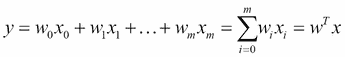
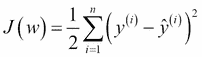
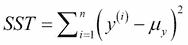
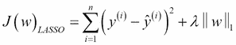
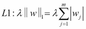
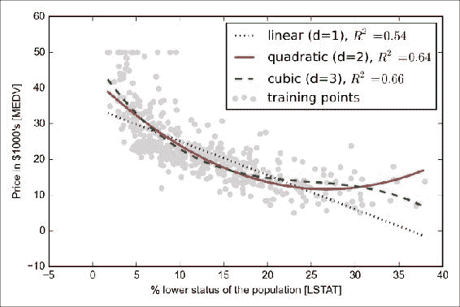
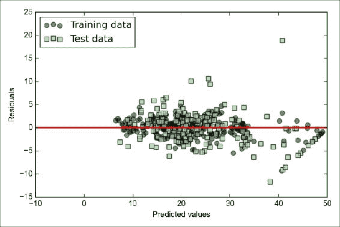

# 第 8 章。使用回归分析预测连续目标变量

在前几章中，您了解了*监督学习*背后的主要概念，并为分类任务训练了许多不同的模型以预测组成员或分类变量。 在本章中，我们将深入研究监督学习的另一个子类别：*回归分析*。

回归模型用于在*连续*规模上预测目标变量，这使它们对于解决科学和工业应用中的许多问题具有吸引力，例如理解变量之间的关系，评估趋势或进行预测。 一个例子是预测未来几个月公司的销售额。

在本章中，我们将讨论回归模型的主要概念，并涉及以下主题：

*   探索和可视化数据集
*   研究实现线性回归模型的不同方法
*   训练对异常值具有鲁棒性的回归模型
*   评估回归模型并诊断常见问题
*   将回归模型拟合到非线性数据

# 介绍一个简单的线性回归模型

简单（*单变量*）线性回归的目标是为单个特征（解释变量`x`）与连续值*响应*之间的关系建模的模型（ 目标变量*和*）。 具有一个解释变量的线性模型方程定义如下：


在此，权重`w[0]`代表`y`轴截距，`w[1]`是解释变量的系数。 我们的目标是学习线性方程的权重，以描述解释变量与目标变量之间的关系，然后将其用于预测不属于训练数据集的新解释变量的响应。

根据我们先前定义的线性方程，线性回归可以理解为通过样本点找到最合适的直线，如下图所示：


此最佳拟合线也称为**回归线**，从回归线到采样点的垂直线为**偏移量**或[ **残差**-我们预测的误差。

一个解释变量的特殊情况也称为**简单线性回归**，但是我们当然也可以将线性回归模型推广到多个解释变量。 因此，此过程称为**多元线性回归**：



此处，`w[0]`是与`x[0] = 1`相对的`y`轴截距。

# 探索房屋数据集

在实施第一个线性回归模型之前，我们将介绍一个新数据集**住房数据集**，其中包含 D. Harrison 和 D.L.收集的波士顿郊区房屋信息。 1978 年鲁宾菲尔德（Rubinfeld）。*住房数据集*已免费提供，可以从 [UCI 机器学习存储库](https://archive.ics.uci.edu/ml/datasets/Housing)下载。

506 个样本的特征可以汇总，如数据集描述的摘录所示：

*   **CRIM**：这是城镇的人均犯罪率
*   **ZN**：这是划分给大于 25,000 平方英尺的地块的住宅用地比例。
*   **印度**：这是每个城镇的非零售营业面积的比例
*   **CHAS**：这是查尔斯河虚拟变量（如果束缚河，则等于 1；否则为 0）
*   **NOX**：这是一氧化氮的浓度（百万分之几）
*   **RM**：这是每个住宅的平均房间数
*   **年龄**：这是 1940 年之前建造的自有住房的比例
*   **DIS**：这是到五个波士顿就业中心的加权距离
*   **RAD**：这是径向公路的可达性指数
*   **税**：这是每 10,000 美元的全值财产税率
*   **PTRATIO**：这是按城镇划分的师生比率
*  `B`：这是按 *1000（Bk-0.63）^ 2* 计算的，其中 Bk 是按城镇划分的非裔美国人的比例
*   **LSTAT**：这是总人口比例降低的百分比
*   **MEDV**：这是自用房屋的中位数，单位为$ 1000

对于本章的其余部分，我们将房价（MEDV）视为目标变量，即我们要使用 13 个解释变量中的一个或多个来预测的变量。 在进一步探索该数据集之前，让我们将其从 UCI 存储库中提取到Pandas`DataFrame`中：

```pypy
>>> import pandas as pd
>>> df = pd.read_csv('https://archive.ics.uci.edu/ml/machine-learning-databases/housing/housing.data', 
...                 header=None, sep='\s+')
>>> df.columns = ['CRIM', 'ZN', 'INDUS', 'CHAS', 
...              'NOX', 'RM', 'AGE', 'DIS', 'RAD', 
...              'TAX', 'PTRATIO', 'B', 'LSTAT', 'MEDV']
>>> df.head()
```

为了确认数据集已成功加载，我们显示了数据集的前五行，如以下屏幕截图所示：


## 可视化数据集的重要特征

**探索性数据分析**（**EDA**）是训练机器学习模型之前重要的第一步。 在本节的其余部分，我们将使用来自图形 EDA 工具箱的一些简单但有用的技术，这些技术可能有助于我们直观地检测异常值的存在，数据的分布以及要素之间的关系。

首先，我们将创建一个 *散点图矩阵*，该矩阵使我们可以在一处可视化此数据集中不同特征之间的成对相关性。 为了绘制散点图矩阵，我们将使用`seaborn`库（`http://stanford.edu/~mwaskom/software/seaborn/`）中的`pairplot`函数，该函数是一个 Python 库，用于基于 matplotlib 绘制统计图：

```pypy
>>> import matplotlib.pyplot as plt
>>> import seaborn as sns
>>> sns.set(style='whitegrid', context='notebook')
>>> cols = ['LSTAT', 'INDUS', 'NOX', 'RM', 'MEDV']
>>> sns.pairplot(df[cols], size=2.5)
>>> plt.show()
```

如下图所示，散点图矩阵为我们提供了数据集中关系的有用图形摘要：


### 注意

导入 seaborn 库会修改当前 Python 会话的 matplotlib 的默认外观。 如果您不想使用 seaborn 的样式设置，则可以通过执行以下命令来重置 matplotlib 设置：

```pypy
>>> sns.reset_orig()
```

由于篇幅所限，并且出于可读性考虑，我们仅从数据集中绘制了五列：**LSTAT**，**INDUS**，**NOX**，**RM** 和 **MEDV**。 但是，建议您创建整个`DataFrame`的散点图矩阵，以进一步探索数据。

使用此散点图矩阵，我们现在可以快速查看数据的分布方式以及是否包含异常值。 例如，我们可以看到 **RM** 与房价 **MEDV** 之间存在线性关系（第四行的第五列）。 此外，我们可以在直方图中（散点图矩阵的右下子图）看到 **MEDV** 变量似乎呈正态分布，但包含多个异常值。

### 注意

请注意，与通常的看法相反，训练线性回归模型不需要解释变量或目标变量呈正态分布。 正态性假设只是某些统计检验和假设检验的要求，这些检验和假设检验不在本书的范围内（蒙哥马利 DC，Peck，EA 和 Vining，GG *线性回归分析简介*，John Wiley 和 儿子，2012 年，第 318-319 页）。

为了量化特征之间的线性关系，我们现在将创建一个相关矩阵。 相关矩阵与在第 4 章中**主成分分析**（**PCA**）一节中看到的协方差矩阵密切相关。 HTG7]建立良好的培训集-数据预处理。 直观地，我们可以将相关矩阵解释为协方差矩阵的重新缩放版本。 实际上，相关矩阵与根据标准化数据计算的协方差矩阵相同。

相关矩阵是一个平方矩阵，包含**皮尔逊积矩相关系数**（通常缩写为 **Pearson r**），用于测量要素对之间的线性相关性。 相关系数的范围为-1 和 1。如果`r = 1`，则两个特征分别具有完全正相关；如果`r = 0`，则两个特征分别具有完全正相关；如果`r = -1`，则具有完全负相关。 如前所述，皮尔逊相关系数可以简单地计算为两个特征`x`和`y`（分子）之间的协方差除以它们的标准偏差（分母）的乘积：


这里，`μ`表示相应特征的样本均值，`σ[xy]`是特征`x`和`y`之间的协方差，`σ[x]`和`σ[y]`分别是特征的标准偏差。 。

### 注意

我们可以证明标准化特征之间的协方差实际上等于它们的线性相关系数。

让我们首先对特征`x`和`y`进行标准化，以获得它们的 z 分数，我们分别将其表示为`x'`和`y'`：


请记住，我们计算两个要素之间的（人口）协方差如下：


由于标准化将特征变量的中心均值设为 0，因此我们现在可以按以下方式计算缩放特征之间的协方差：


通过重新替换，我们得到以下结果：


我们可以简化如下：


在下面的代码示例中，我们将在以前在散点图矩阵中可视化的五个特征列上使用 NumPy 的`corrcoef`函数，并且将使用 seaborn 的`heatmap`函数将相关矩阵数组绘制为热图 ：

```pypy
>>> import numpy as np
>>> cm = np.corrcoef(df[cols].values.T)
>>> sns.set(font_scale=1.5)
>>> hm = sns.heatmap(cm, 
...            cbar=True,
...            annot=True, 
...            square=True,
...            fmt='.2f',
...            annot_kws={'size': 15},
...            yticklabels=cols,
...            xticklabels=cols)
>>> plt.show()
```

从结果图中可以看出，相关矩阵为我们提供了另一个有用的摘要图形，可以帮助我们根据特征各自的线性相关性来选择特征：


为了拟合线性回归模型，我们对与目标变量 **MEDV** 具有高度相关性的那些特征感兴趣。 看前面的相关矩阵，我们看到我们的目标变量 **MEDV** 与 **LSTAT** 变量显示最大的相关性（-0.74）。 但是，您可能会从散点图矩阵记住，**LSTAT** 和 **MEDV** 之间存在明显的非线性关系。 另一方面，**RM** 和 **MEDV** 之间的相关性也相对较高（0.70），并给出了在散点图中观察到的这两个变量 **RM 之间的线性关系** 似乎是解释变量在下一节中介绍简单线性回归模型概念的不错选择。

# 实现普通的最小二乘线性回归模型

在本章的开头，我们讨论了线性回归可以理解为通过训练数据的采样点找到最合适的直线。 但是，我们既没有定义最适合*的术语*，也没有讨论适合这种模型的不同技术。 在下面的小节中，我们将使用**普通最小二乘法**（**OLS**）方法来填充此难题的缺失部分，以估算将 到采样点的垂直距离的平方和（残差或误差）。**

## 用梯度下降法求解回归参数的回归

考虑我们对**自适应线性神经网络**（**Adaline**）的实现，该知识来自第 2 章，“训练机器学习算法，用于分类”； 我们记得人工神经元使用线性激活函数，并定义了成本函数`J(·)`，我们通过优化算法将其最小化以学习权重，例如**梯度下降**（**GD**）和**随机梯度下降**（**SGD**）。 Adaline 中的成本函数是**平方误差总和**（**SSE**）。 这与我们定义的 OLS 成本函数相同：



这里，`y_hat`是预测值`y_hat = w^T x`（注意，为了方便起见，术语 1/2 仅用于导出 GD 的更新规则）。 本质上，OLS 线性回归可以理解为没有单位步长函数的 Adaline，以便我们获得连续的目标值，而不是类标签-1 和 1。为演示相似性，让我们以 *Adaline* 的 GD 实现方式 摘自第 2 章和“训练机器学习分类算法”，并删除单位步长函数以实现我们的第一个线性回归模型：

```pypy
class LinearRegressionGD(object):

    def __init__(self, eta=0.001, n_iter=20):
        self.eta = eta
        self.n_iter = n_iter

    def fit(self, X, y):
        self.w_ = np.zeros(1 + X.shape[1])
        self.cost_ = []

        for i in range(self.n_iter):
            output = self.net_input(X)
            errors = (y - output)
            self.w_[1:] += self.eta * X.T.dot(errors)
            self.w_[0] += self.eta * errors.sum()
            cost = (errors**2).sum() / 2.0
            self.cost_.append(cost)
        return self

    def net_input(self, X):
        return np.dot(X, self.w_[1:]) + self.w_[0]

    def predict(self, X):
        return self.net_input(X)
```

如果需要重新了解权重的更新方式-向渐变的相反方向迈进-请重新访问第 2 章，“训练机器学习分类算法”中的 Adaline 部分。

要查看我们的`LinearRegressionGD`回归器的运行情况，让我们使用“住房数据集”中的 RM（房间数）变量作为解释变量来训练可以预测 MEDV（住房价格）的模型。 此外，我们将对变量进行标准化，以更好地收敛 GD 算法。 代码如下：

```pypy
>>> X = df[['RM']].values
>>> y = df['MEDV'].values
>>> from sklearn.preprocessing import StandardScaler
>>> sc_x = StandardScaler()
>>> sc_y = StandardScaler()
>>> X_std = sc_x.fit_transform(X)
>>> y_std = sc_y.fit_transform(y)
>>> lr = LinearRegressionGD()
>>> lr.fit(X_std, y_std)
```

我们在第 2 章，“用于分类的训练机器学习算法”中进行了讨论，将成本绘制为历元数（遍历训练数据集）总是一个好主意。 ），当我们使用优化算法（例如梯度下降）来检查收敛性时。 简而言之，让我们针对时期数绘制成本，以检查线性回归是否收敛：

```pypy
>>> plt.plot(range(1, lr.n_iter+1), lr.cost_)
>>> plt.ylabel('SSE')
>>> plt.xlabel('Epoch')
>>> plt.show()
```

正如我们在下图中看到的，GD 算法在第五个时期之后收敛：


接下来，让我们可视化线性回归线拟合训练数据的程度。 为此，我们将定义一个简单的辅助函数，该函数将绘制训练样本的散点图并添加回归线：

```pypy
>>> def lin_regplot(X, y, model):
...     plt.scatter(X, y, c='blue')
...     plt.plot(X, model.predict(X), color='red')    
...     return None
```

现在，我们将使用此`lin_regplot`函数根据房价绘制房间数量：

```pypy
>>> lin_regplot(X_std, y_std, lr)
>>> plt.xlabel('Average number of rooms [RM] (standardized)')
>>> plt.ylabel('Price in $1000\'s [MEDV] (standardized)')
>>> plt.show()
```

如下图所示，线性回归线反映了房价趋于随房间数量增加的总体趋势：


尽管此观察具有直观意义，但数据还告诉我们，在许多情况下，房间数量不能很好地解释房价。 在本章的后面，我们将讨论如何量化回归模型的性能。 有趣的是，我们还观察到一条奇怪的线`y = 3`，这表明价格可能已被削减。 在某些应用中，以其原始规模报告预测结果变量也可能很重要。 为了将预测的价格结果重新按$ 1000 的轴上的**价格，我们可以简单地应用`StandardScaler`的`inverse_transform`方法：**

```pypy
>>> num_rooms_std = sc_x.transform([5.0]) 
>>> price_std = lr.predict(num_rooms_std)
>>> print("Price in $1000's: %.3f" % \
...       sc_y.inverse_transform(price_std))
Price in $1000's: 10.840
```

在前面的代码示例中，我们使用了先前训练的线性回归模型来预测具有五个房间的房屋的价格。 根据我们的模型，这样的房子价值 10840 美元。

另外，值得一提的是，如果我们使用标准化变量，则从技术上讲，我们不必更新截距的权重，因为在这些变量中，`y`轴截距始终为 0 案件。 我们可以通过打印权重来快速确认：

```pypy
>>> print('Slope: %.3f' % lr.w_[1])
Slope: 0.695
>>> print('Intercept: %.3f' % lr.w_[0])
Intercept: -0.000
```

## 通过 scikit-learn 估算回归模型的系数

在的上一部分中，我们实现了用于回归分析的工作模型。 但是，在实际的应用中，我们可能对更高效的实现感兴趣，例如 scikit-learn 的`LinearRegression`对象，该对象利用了 **LIBLINEAR** 库和有效的高级优化算法 与非标准化变量相比更好。 有时对于某些应用是理想的：

```pypy
>>> from sklearn.linear_model import LinearRegression
>>> slr = LinearRegression()
>>> slr.fit(X, y)
>>> print('Slope: %.3f' % slr.coef_[0])
Slope: 9.102
>>> print('Intercept: %.3f' % slr.intercept_)
Intercept: -34.671
```

正如我们通过执行前面的代码所看到的，装有未标准化的 **RM** 和 **MEDV** 变量的 scikit-learn 的`LinearRegression`模型产生了不同的模型系数。 通过将 MEDV 与 RM 作图，将其与我们自己的 GD 实现进行比较：

```pypy
>>> lin_regplot(X, y, slr)
>>> plt.xlabel('Average number of rooms [RM]')
>>> plt.ylabel('Price in $1000\'s [MEDV]')
>>> plt.show()w
```

现在，当我们通过执行上面的代码来绘制训练数据和拟合模型时，我们可以看到总体结果看起来与我们的 GD 实现相同：


### 注意

作为替代使用机器学习库的替代方法，还有一种用于解决 OLS 的封闭式解决方案，其中涉及一个线性方程组，可以在大多数入门级统计教科书中找到：


我们可以在 Python 中实现它，如下所示：

```pypy
# adding a column vector of "ones"
>>> Xb = np.hstack((np.ones((X.shape[0], 1)), X))
>>> w = np.zeros(X.shape[1])
>>> z = np.linalg.inv(np.dot(Xb.T, Xb))
>>> w = np.dot(z, np.dot(Xb.T, y))
>>> print('Slope: %.3f' % w[1])
Slope: 9.102
>>> print('Intercept: %.3f' % w[0])
Intercept: -34.671

```

这种方法的优点是可以保证找到最佳解决方案。 但是，如果正在使用非常大的数据集，则在此公式中将矩阵求逆可能在计算上过于昂贵（有时也称为**正规方程**），或者样本矩阵可能是 单数（不可逆），这就是为什么我们在某些情况下可能更喜欢迭代方法的原因。

如果您对有关如何获得正态方程的更多信息感兴趣，我建议您从他在莱斯特大学的演讲中阅读斯蒂芬·波洛克博士的章节*经典线性回归模型*。 可从[这个页面](http://www.le.ac.uk/users/dsgp1/COURSES/MESOMET/ECMETXT/06mesmet.pdf)免费获得。

# 使用 RANSAC 拟合稳健的回归模型

异常值的存在会严重影响线性回归模型。 在某些情况下，我们数据的一小部分会对估计的模型系数产生很大的影响。 有许多统计测试可用于检测离群值，这超出了本书的范围。 但是，消除异常值始终需要我们作为数据科学家的判断力以及我们的领域知识。

作为排除异常值的替代方法，我们将使用**随机抽样共识**（**RANSAC**）算法研究一种可靠的回归方法，该算法将回归模型拟合到子集 数据，即所谓的*内线*。

我们可以将 RANSAC 迭代算法总结如下：

1.  选择随机数的样本作为内点并拟合模型。
2.  针对拟合模型测试所有其他数据点，并将落入用户给定公差范围内的那些点添加到内点。
3.  使用所有 inlier 调整模型。
4.  估计拟合模型与内部模型的误差。
5.  如果性能达到某个用户定义的阈值或已达到固定的迭代次数，则终止算法； 否则，请返回步骤 1。

现在，让使用 scikit-learn 的`RANSACRegressor`对象将线性模型包装在 RANSAC 算法中：

```pypy
>>> from sklearn.linear_model import RANSACRegressor
>>> ransac = RANSACRegressor(LinearRegression(), 
...            max_trials=100, 
...            min_samples=50, 
...            residual_metric=lambda x: np.sum(np.abs(x), axis=1), 
...            residual_threshold=5.0, 
...            random_state=0)
>>> ransac.fit(X, y)
```

我们将`RANSACRegressor`的最大迭代次数设置为 100，并使用`min_samples=50`，将随机选择的样本的最小次数设置为至少 50。使用`residual_metric`参数，我们提供了可调用的`lambda`函数，可以简单地计算拟合线和采样点之间的绝对垂直距离。 通过将`residual_threshold`参数设置为`5.0`，如果样本到拟合线的垂直距离在 5 个距离单位以内，则我们仅允许样本包含在内部样本集中，这在此特定数据集上效果很好。 默认情况下，scikit-learn 使用 MAD 估计值选择内部阈值，其中 **MAD** 代表目标值`y`的**中位数绝对偏差**。 但是，为内部阈值选择合适的值是特定于问题的，这是 RANSAC 的缺点之一。 近年来，已经开发出许多不同的方法来自动选择良好的内部阈值。 您可以在 R. Toldo 和 A. Fusiello 的书中找到详细的讨论。 *健壮的多结构拟合*中的阈值自动估计（在图像分析和处理– ICIAP 2009 中，第 123–131 页。Springer，2009 年）。

拟合完 RANSAC 模型后，让我们从拟合的 RANSAC 线性回归模型中获得离群值和离群值，并将它们与线性拟合一起绘制：

```pypy
>>> inlier_mask = ransac.inlier_mask_
>>> outlier_mask = np.logical_not(inlier_mask)
>>> line_X = np.arange(3, 10, 1)
>>> line_y_ransac = ransac.predict(line_X[:, np.newaxis])
>>> plt.scatter(X[inlier_mask], y[inlier_mask], 
...             c='blue', marker='o', label='Inliers')
>>> plt.scatter(X[outlier_mask], y[outlier_mask],
...             c='lightgreen', marker='s', label='Outliers')
>>> plt.plot(line_X, line_y_ransac, color='red')
>>> plt.xlabel('Average number of rooms [RM]')
>>> plt.ylabel('Price in $1000\'s [MEDV]')
>>> plt.legend(loc='upper left')
>>> plt.show()
```

正如我们可以在下面的散点图中看到的一样，线性回归模型被拟合到检测到的以圆圈表示的一组象素上：


当我们打印执行以下代码的模型的斜率和截距时，我们可以看到线性回归线与上一节中未使用 RANSAC 的拟合度略有不同：

```pypy
>>> print('Slope: %.3f' % ransac.estimator_.coef_[0])
Slope: 9.621
>>> print('Intercept: %.3f' % ransac.estimator_.intercept_)
Intercept: -37.137
```

使用 RANSAC，我们减少了此数据集中异常值的潜在影响，但我们不知道这种方法是否会对看不见的数据的预测性能产生积极影响。 因此，在下一部分中，我们将讨论如何评估不同方法的回归模型，这是构建预测模型系统的关键部分。


# 评估线性回归模型的性能

在的上一部分中，我们讨论了如何在训练数据上拟合回归模型。 但是，您在前面的章节中了解到，至关重要的是，在训练过程中未见过的数据上对该模型进行测试，以获取对其性能的无偏估计。

正如我们从第 6 章，“学习模型评估和超参数调整”的最佳实践中所记起的那样，我们希望将数据集拆分为单独的训练和测试数据集，并在其中使用前者来拟合模型 后者评估其性能以将其推广到看不见的数据。 现在，我们不再使用简单的回归模型，而是使用数据集中的所有变量并训练多元回归模型：

```pypy
>>> from sklearn.cross_validation import train_test_split
>>> X = df.iloc[:, :-1].values
>>> y = df['MEDV'].values
>>> X_train, X_test, y_train, y_test = train_test_split(
...       X, y, test_size=0.3, random_state=0)
>>> slr = LinearRegression()
>>> slr.fit(X_train, y_train)
>>> y_train_pred = slr.predict(X_train)
>>> y_test_pred = slr.predict(X_test)
```

由于我们的模型使用了多个解释变量，因此我们无法在二维图中可视化线性回归线（或精确地说是超平面），但可以绘制残差（实际值与预测值之间的差或垂直距离） 与预测值进行比较以诊断我们的回归模型。 那些**残留图**是诊断回归模型的常用图形分析，以检测非线性和离群值，并检查误差是否随机分布。

使用以下代码，我们现在将绘制残差图，在该残差图中，我们简单地从预测的响应中减去真实的目标变量：

```pypy
>>> plt.scatter(y_train_pred, y_train_pred - y_train, 
...             c='blue', marker='o', label='Training data')
>>> plt.scatter(y_test_pred,  y_test_pred - y_test,
...             c='lightgreen', marker='s', label='Test data')
>>> plt.xlabel('Predicted values')
>>> plt.ylabel('Residuals')
>>> plt.legend(loc='upper left')
>>> plt.hlines(y=0, xmin=-10, xmax=50, lw=2, color='red')
>>> plt.xlim([-10, 50])
>>> plt.show()
```

执行代码后，我们应该看到一条残差图，其中有一条线穿过`x`轴原点，如下所示：


在完美预测的情况下，残差将恰好为零，在现实和实际应用中我们可能从未遇到过。 但是，对于一个好的回归模型，我们希望误差是随机分布的，并且残差应该随机分散在中心线周围。 如果我们在残差图中看到模式，则意味着我们的模型无法捕获一些解释性信息，这些信息泄漏到了残差中，就像我们在先前的残差图中略微看到的那样。 此外，我们还可以使用残差图来检测离群值，这些离群值由与中心线有较大偏差的点表示。

衡量模型性能的另一个有用的量化方法是所谓的**均方误差**（**MSE**），这只是我们最小化为 SSE 成本函数的平均值 拟合线性回归模型。 MSE 对于比较不同的回归模型或通过网格搜索和交叉验证调整其参数非常有用：


执行以下代码：

```pypy
>>> from sklearn.metrics import mean_squared_error
>>> print('MSE train: %.3f, test: %.3f' % (
        mean_squared_error(y_train, y_train_pred),
        mean_squared_error(y_test, y_test_pred)))
```

我们将看到训练集的 MSE 为 19.96，测试集的 MSE 更大，值为 27.20，这表明我们的模型过度拟合了训练数据。

有时，报告确定系数（`R²`）可能更有用，可以将其理解为 MSE 的标准化版本，以更好地解释模型性能。 换句话说，`R²`是模型捕获的响应方差的一部分。 `R²`值定义如下：


在此，SSE 是平方误差的总和，而 SST 是平方和的总和，换句话说，它只是响应的方差。



让我们快速展示一下`R²`确实只是 MSE 的重新缩放版本：


对于训练数据集，`R²`的范围在 0 到 1 之间，但对于测试集可能变为负数。 如果为`R² = 1`，则模型将数据与相应的`MSE = 0`完美拟合。

根据训练数据评估，我们模型的`R²`为 0.765，听起来还不错。 但是，测试数据集上的`R²`仅为 0.673，我们可以通过执行以下代码进行计算：

```pypy
>>> from sklearn.metrics import r2_score
>>> print('R^2 train: %.3f, test: %.3f' % 
...       (r2_score(y_train, y_train_pred),
...        r2_score(y_test, y_test_pred)))
```

# 使用正则化方法进行回归

正如我们在第 3 章，“使用 Scikit-learn 进行的机器学习分类器”讨论中一样，正则化是一种通过添加其他信息来解决过拟合问题的方法。 缩小模型的参数值以降低复杂度。 进行正则化线性回归的最流行方法是**岭回归**，**最小绝对收缩和选择算子**（**LASSO**）和**弹性网**方法。

Ridge 回归是一个 L2 惩罚模型，我们只需将权重的平方和加到最小二乘成本函数中：


这里：


通过增加超参数`λ`的值，我们增加了正则化强度并缩小了模型的权重。 请注意，我们没有对拦截项`w[0]`进行正则化。

可以导致模型稀疏的另一种方法是 LASSO。 根据正则化强度，某些权重可以变为零，这使得 LASSO 也可以用作有监督的特征选择技术：



这里：



但是，LASSO 的局限性在于，如果`m > n`，它最多选择`n`变量。 Ridge 回归和 LASSO 之间的折衷是 Elastic Net，它具有产生稀疏性的 L1 损失和克服 LASSO 的某些限制（例如所选变量的数量）的 L2 损失。


这些正则回归模型都可以通过 scikit-learn 获得，其用法与正则回归模型相似，只是我们必须通过参数`λ`指定正则化强度，例如，通过 k 倍交叉验证进行了优化。

可以按以下方式初始化 Ridge 回归模型：

```pypy
>>> from sklearn.linear_model import Ridge
>>> ridge = Ridge(alpha=1.0)
```

注意，正则化强度由参数`alpha`调节，该参数类似于参数`λ`。 同样，我们可以从`linear_model`子模块初始化 LASSO 回归器：

```pypy
>>> from sklearn.linear_model import Lasso
>>> lasso = Lasso(alpha=1.0)
```

最后，`ElasticNet`实现允许我们更改 L1 与 L2 的比率：

```pypy
>>> from sklearn.linear_model import ElasticNet
>>> lasso = ElasticNet(alpha=1.0, l1_ratio=0.5)
```

例如，如果我们将`l1_ratio`设置为`1.0`，则`ElasticNet`回归变量将等于 LASSO 回归变量。 有关线性回归的不同实现的更多详细信息，请参见[这个页面](http://scikit-learn.org/stable/modules/linear_model.html)上的文档。

# 将线性回归模型变成曲线-多项式回归

在前面的中，我们假设解释变量和响应变量之间存在线性关系。 解决违反线性假设的一种方法是通过添加多项式项来使用多项式回归模型：


在此，`d`表示多项式的次数。 尽管我们可以使用多项式回归来建模非线性关系，但是由于线性回归系数`w`，仍将其视为多元线性回归模型。

现在，我们将讨论如何使用 scikit-learn 中的`PolynomialFeatures`转换器类，将一个二次项（`d = 2`）添加到带有一个解释变量的简单回归问题中，并将多项式与线性拟合进行比较。 步骤如下：

1.  添加二次多项式项：

    ```pypy
    from sklearn.preprocessing import PolynomialFeatures
    >>> X = np.array([258.0, 270.0, 294.0,
    …                          320.0, 342.0, 368.0,
    …                          396.0, 446.0, 480.0,
    …                          586.0])[:, np.newaxis]

    >>> y = np.array([236.4, 234.4, 252.8,
    …                         298.6, 314.2, 342.2,
    …                         360.8, 368.0, 391.2,
    …                         390.8])
    >>> lr = LinearRegression()
    >>> pr = LinearRegression()
    >>> quadratic = PolynomialFeatures(degree=2)
    >>> X_quad = quadratic.fit_transform(X)
    ```

2.  拟合简单的线性回归模型进行比较：

    ```pypy
    >>> lr.fit(X, y)
    >>> X_fit = np.arange(250,600,10)[:, np.newaxis]
    >>> y_lin_fit = lr.predict(X_fit)
    ```

3.  在多项式回归的变换特征上拟合多元回归模型：

    ```pypy
    >>> pr.fit(X_quad, y)
    >>> y_quad_fit = pr.predict(quadratic.fit_transform(X_fit))
    Plot the results:
    >>> plt.scatter(X, y, label='training points')
    >>> plt.plot(X_fit, y_lin_fit, 
    ...          label='linear fit', linestyle='--')
    >>> plt.plot(X_fit, y_quad_fit,
    ...          label='quadratic fit')
    >>> plt.legend(loc='upper left')
    >>> plt.show()
    ```

在结果图中，我们可以看到多项式拟合比线性拟合更好地捕获了响应和解释变量之间的关系：


```pypy
>>> y_lin_pred = lr.predict(X)
>>> y_quad_pred = pr.predict(X_quad)
>>> print('Training MSE linear: %.3f, quadratic: %.3f' % (
...         mean_squared_error(y, y_lin_pred),
...         mean_squared_error(y, y_quad_pred)))
Training MSE linear: 569.780, quadratic: 61.330
>>> print('Training R^2 linear: %.3f, quadratic: %.3f' % (
...         r2_score(y, y_lin_pred),
...         r2_score(y, y_quad_pred)))
Training R^2 linear: 0.832, quadratic: 0.982
```

正如我们可以在执行前面的代码后看到的一样，MSE 从 570（线性拟合）降低到 61（二次拟合），并且确定系数反映出更接近二次模型（`R² = 0.982`） 与该特定玩具问题中的线性拟合（`R² = 0.832`）相反。

## 在房屋数据集中建模非线性关系

在讨论了如何构造多项式特征以使其适合玩具问题中的非线性关系之后，现在让我们看一个更具体的示例，并将这些概念应用于*住房数据集*中的数据。 通过执行以下代码，我们将使用二阶（二次）多项式和三次（三次）多项式对房价与 LSTAT（较低人口百分比）之间的关系进行建模，并将其与线性拟合进行比较。

代码如下：

```pypy
>>> X = df[['LSTAT']].values
>>> y = df['MEDV'].values
>>> regr = LinearRegression()

# create polynomial features
>>> quadratic = PolynomialFeatures(degree=2)
>>> cubic = PolynomialFeatures(degree=3)
>>> X_quad = quadratic.fit_transform(X)
>>> X_cubic = cubic.fit_transform(X)

# linear fit
>>> X_fit = np.arange(X.min(), X.max(), 1)[:, np.newaxis]
>>> regr = regr.fit(X, y)
>>> y_lin_fit = regr.predict(X_fit)
>>> linear_r2 = r2_score(y, regr.predict(X))

# quadratic fit
>>> regr = regr.fit(X_quad, y)
>>> y_quad_fit = regr.predict(quadratic.fit_transform(X_fit))
>>> quadratic_r2 = r2_score(y, regr.predict(X_quad))

# cubic fit
>>> regr = regr.fit(X_cubic, y)
>>> y_cubic_fit = regr.predict(cubic.fit_transform(X_fit))
>>> cubic_r2 = r2_score(y, regr.predict(X_cubic))

# plot results
>>> plt.scatter(X, y, 
...             label='training points', 
...             color='lightgray')
>>> plt.plot(X_fit, y_lin_fit, 
...          label='linear (d=1), $R^2=%.2f$' 
...            % linear_r2, 
...          color='blue', 
...          lw=2, 
...          linestyle=':')
>>> plt.plot(X_fit, y_quad_fit, 
...          label='quadratic (d=2), $R^2=%.2f$' 
...            % quadratic_r2,
...          color='red', 
...          lw=2,
...          linestyle='-')
>>> plt.plot(X_fit, y_cubic_fit, 
...          label='cubic (d=3), $R^2=%.2f$' 
...            % cubic_r2,
...          color='green', 
...          lw=2, 
...          linestyle='--')
>>> plt.xlabel('% lower status of the population [LSTAT]')
>>> plt.ylabel('Price in $1000\'s [MEDV]')
>>> plt.legend(loc='upper right')
>>> plt.show()
```

正如我们在结果图中看到的所示，三次拟合比线性和二次拟合更好地捕获了房价和 **LSTAT** 之间的关系。 但是，我们应该意识到，添加越来越多的多项式特征会增加模型的复杂度，因此会增加过拟合的机会。 因此，在实践中，始终建议您在单独的测试数据集上评估模型的性能，以评估泛化性能：



此外，多项式特征并非始终是建模非线性关系的最佳选择。 例如，仅通过查看 **MEDV-LSTAT** 散点图，我们可以建议 **LSTAT** 特征变量和 **MEDV** 的平方根的对数变换 将数据投影到适合线性回归拟合的线性特征空间上。 让我们通过执行以下代码来检验这个假设：

```pypy
# transform features
>>> X_log = np.log(X)
>>> y_sqrt = np.sqrt(y)

# fit features
>>> X_fit = np.arange(X_log.min()-1, 
...                   X_log.max()+1, 1)[:, np.newaxis]
>>> regr = regr.fit(X_log, y_sqrt)
>>> y_lin_fit = regr.predict(X_fit)
>>> linear_r2 = r2_score(y_sqrt, regr.predict(X_log))

# plot results
>>> plt.scatter(X_log, y_sqrt,
...             label='training points',
...             color='lightgray')
>>> plt.plot(X_fit, y_lin_fit, 
...          label='linear (d=1), $R^2=%.2f$' % linear_r2, 
...          color='blue', 
...          lw=2)
>>> plt.xlabel('log(% lower status of the population [LSTAT])')
>>> plt.ylabel('$\sqrt{Price \; in \; \$1000\'s [MEDV]}$')
>>> plt.legend(loc='lower left')
>>> plt.show()
```

将解释性变量`R² = 0.69`转换为对数空间并取目标变量的平方根后，我们能够使用似乎比数据更适合（`R² = 0.69`）的线性回归线捕获两个变量之间的关系。 以前的任何多项式特征转换：


## 使用随机森林处理非线性关系

在此部分中，我们将研究**随机森林**回归，它在概念上与本章中的先前回归模型不同。 与前面讨论的全局线性和多项式回归模型相比，随机森林是多个**决策树**的集合，可以理解为分段线性函数的总和。 换句话说，通过决策树算法，我们将输入空间细分为较小的区域，这些区域变得更*更易于管理*。

### 决策树回归

决策树算法的优势在于，如果我们处理非线性数据，则不需要对特征进行任何转换。 我们从第 3 章和“使用 Scikit-learn” 进行的机器学习分类器之旅中还记得，我们通过迭代拆分其节点直到叶子是纯净的或停止准则为 使满意。 当我们使用决策树进行分类时，我们将熵定义为杂质的度量，以确定哪个特征分割最大化**信息增益**（**IG**），其定义如下 对于二进制拆分：


在这里，`x`是执行分割的功能，`N[p]`是父节点中样本的数量，`I`是杂质函数，`D[p]`是父节点中训练样本的子集，并且`D[left]`和`D[right]`是分割后左右子节点中训练样本的子集。 请记住，我们的目标是找到使信息增益最大化的特征分割，换句话说，我们希望找到减少子节点中杂质的特征分割。 在第 3 章，“使用 Scikit-learn”的机器学习分类器中，我们使用*熵*作为杂质的度量，这是分类的有用标准。 为了使用决策树进行回归，我们将用 MSE 代替熵作为节点`t`的杂质度量：


在此，`N[t]`是节点`t`处的训练样本的个数量，`D[t]`是节点`t`处的训练子集，`y^(i)`是真实的目标值，`y_hat[t]`是预测的目标 值（样本均值）：


在决策树回归的情况下，MSE 通常也称为节点内方差，这就是为什么拆分标准也被更好地称为*方差减少*的原因。 要查看决策树的线拟合情况，让我们使用 scikit-learn 中实现的`DecisionTreeRegressor`对 **MEDV** 和 **LSTAT** 变量之间的非线性关系进行建模：

```pypy
>>> from sklearn.tree import DecisionTreeRegressor
>>> X = df[['LSTAT']].values
>>> y = df['MEDV'].values
>>> tree = DecisionTreeRegressor(max_depth=3)
>>> tree.fit(X, y)
>>> sort_idx = X.flatten().argsort()
   >>> lin_regplot(X[sort_idx], y[sort_idx], tree)
>>> plt.xlabel('% lower status of the population [LSTAT]')
>>> plt.ylabel('Price in $1000\'s [MEDV]')
>>> plt.show()
```

从结果图中可以看出，决策树捕获了数据中的总体趋势。 但是，此模型的局限性在于它无法捕获所需预测的的连续性和可微性。 此外，我们需要谨慎选择树的深度值，以免数据过拟合或欠拟合。 在这里，深度为 3 似乎是一个不错的选择：


在下一部分中，我们将介绍一种更合适的回归树拟合方法：随机森林。

### 随机森林回归

正如我们在第 3 章，“使用 Scikit-learn 进行的机器学习分类器之旅”中所讨论的那样，随机森林算法是一种结合了多个决策树的集成技术。 由于随机性有助于减少模型方差，因此随机森林通常比单个决策树具有更好的泛化性能。 随机森林的其他优点是它们对数据集中的异常值较不敏感，不需要太多的参数调整。 我们通常需要试验的随机森林中的唯一参数是合奏中树木的数量。 用于回归的基本随机森林算法与我们在第 3 章，“使用 Scikit-learn” 的机器学习分类器中讨论的用于分类的随机森林算法几乎相同。 唯一的不同是，我们使用 MSE 标准来增长各个决策树，并且将预测目标变量计算为所有决策树的平均预测。

现在，让我们使用 Housing Dataset 中的所有功能，对 60％的样本拟合随机森林回归模型，并在其余 40％的样本上评估其性能。 代码如下：

```pypy
>>> X = df.iloc[:, :-1].values
>>> y = df['MEDV'].values
>>> X_train, X_test, y_train, y_test =\
...       train_test_split(X, y, 
...                        test_size=0.4, 
...                        random_state=1)

>>> from sklearn.ensemble import RandomForestRegressor
>>> forest = RandomForestRegressor(                             ...                                n_estimators=1000, 
...                                criterion='mse', 
...                                random_state=1, 
...                                n_jobs=-1)
>>> forest.fit(X_train, y_train)
>>> y_train_pred = forest.predict(X_train)
>>> y_test_pred = forest.predict(X_test)
>>> print('MSE train: %.3f, test: %.3f' % (
...        mean_squared_error(y_train, y_train_pred),
...        mean_squared_error(y_test, y_test_pred)))
>>> print('R^2 train: %.3f, test: %.3f' % (
...        r2_score(y_train, y_train_pred),
...        r2_score(y_test, y_test_pred)))
MSE train: 1.642, test: 11.635
R^2 train: 0.960, test: 0.871
```

不幸的是，我们看到随机森林倾向于过度拟合训练数据。 但是，仍然能够很好地解释目标变量和解释变量之间的关系（测试数据集上的`R² = 0.871`）。

最后，让我们看一下预测的残差：

```pypy
>>> plt.scatter(y_train_pred,  
...             y_train_pred - y_train, 
...             c='black', 
...             marker='o', 
...             s=35,
...             alpha=0.5,
...             label='Training data')
>>> plt.scatter(y_test_pred,  
...             y_test_pred - y_test, 
...             c='lightgreen', 
...             marker='s', 
...             s=35,
...             alpha=0.7,
...             label='Test data')
>>> plt.xlabel('Predicted values')
>>> plt.ylabel('Residuals')
>>> plt.legend(loc='upper left')
>>> plt.hlines(y=0, xmin=-10, xmax=50, lw=2, color='red')
>>> plt.xlim([-10, 50])
>>> plt.show()
```

正如已经由`R²`系数总结的那样，我们可以看到该模型比训练数据更适合训练数据，如`y`轴方向上的异常值所指示。 同样，残差的分布在零中心点附近似乎并不是完全随机的，这表明该模型无法捕获所有探索性信息。 但是，残差图表示相对于本章前面绘制的线性模型的残差图有很大的改进：



### 注意

在第 3 章和“使用 Scikit-learn” 的机器学习分类器中，我们还讨论了可与**支持向量机**结合使用的内核技巧（**支持向量机**）用于分类，这在处理非线性问题时很有用。 尽管讨论超出了本书的范围，但 SVM 也可以用于非线性回归任务。 有兴趣的读者可以在 S. R. Gunn 的出色报告中找到有关支持向量机回归的更多信息：S. R. Gunn 等。 *用于分类和回归的支持向量机*。 （ISIS 技术报告，1998 年 14 月）。 SVM 回归器也在 scikit-learn 中实现，有关其用法的更多信息，请参见[这个页面](http://scikit-learn.org/stable/modules/generated/sklearn.svm.SVR.html#sklearn.svm.SVR)。


