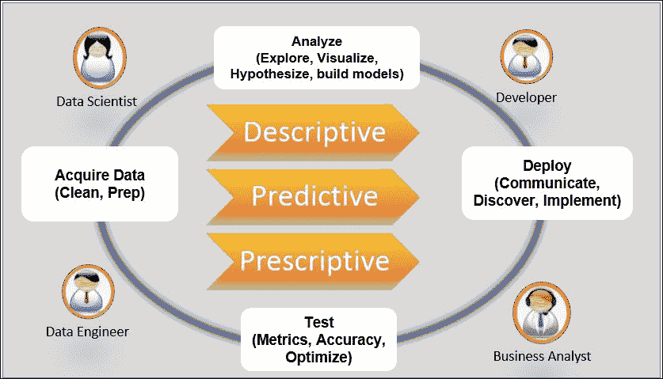
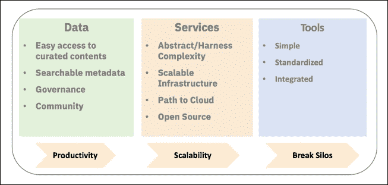

# 第 1 章。开发人员对数据科学的看法

> “数据是一件宝贵的事情，并且会比系统本身持续更长时间。”

——*万维网*的发明者 [Tim Berners-Lee](https://en.wikipedia.org/wiki/Tim_Berners-Lee)

在本介绍性章节中，我将通过尝试回答一些基本问题来开始对话，这些基本问题有望为本书的其余部分提供上下文和清晰性：

*   什么是数据科学，为什么它呈上升趋势
*   为什么数据科学将继续存在
*   为什么开发人员需要参与数据科学

作为开发人员和最近的数据科学从业者，我将使用自己的经验，讨论我所从事的具体数据管道项目以及从这项工作中得出的数据科学策略，该策略包括三个支柱：数据，服务和工具 。 在本章的结尾，我将介绍 Jupyter 笔记本，这是我在本书中提出的解决方案的核心。

# 什么是数据科学

如果您在网上搜索数据科学的定义，肯定会发现很多。 这反映了一个事实，即数据科学对不同的人意味着不同的事物。 关于数据科学家究竟要做什么以及他们必须接受什么培训尚无真正的共识； 这全都取决于他们要完成的任务，例如数据收集和清理，数据可视化等等。

现在，我将尝试使用一个通用的，希望是一致同意的定义：*数据科学是指分析大量数据以提取知识和见解以导致可采取行动的决策的活动*。 但是它仍然很模糊。 有人会问我们在谈论什么样的知识，洞察力和可行的决策？

为了确定对话的方向，我们将范围缩小到数据科学的三个领域：

*   **描述性分析**：数据科学与相关联，它与信息检索和数据收集技术相关，目的是重构过去的事件以识别模式并找到有助于理解发生了什么以及导致它发生的原因的见解。 这样的一个示例是按区域查看销售数据和人口统计数据，以对客户偏好进行分类。 这部分需要熟悉统计和数据可视化技术。
*   **预测性分析**：数据科学是预测某些事件当前正在发生或将来会发生的可能性的方法。 在这种情况下，数据科学家会查看过去的数据以查找解释变量并建立统计模型，该模型可应用于我们试图预测其结果的其他数据点，例如，预测信用卡交易发生实时欺诈的可能性。 这部分通常与机器学习领域相关。
*   **规范性分析**：在这种情况下，数据科学被视为做出更好决策的一种方式，或者我应该说是数据驱动的决策。 想法是考虑多种选择并使用模拟技术来量化和最大化结果，例如，通过着眼于最小化运营成本来优化供应链。

从本质上讲，描述性数据科学回答了*问题*（数据告诉我），预测性数据科学回答了*为什么*（数据以某种方式发生）的问题，并且规范性数据科学回答了*如何*（我们朝着特定目标优化数据）的问题。

# 数据科学将继续存在吗？

让我们从一开始就直截了当地：我强烈认为答案是肯定的。

但是，并非总是如此。 几年前，当我第一次听说数据科学作为概念时，我最初认为这是描述该行业中已经存在的一项活动的又一个营销流行语：**商业智能**（**BI**）。 作为主要从事解决复杂系统集成问题的开发人员和架构师，可以很容易地使自己确信我不需要直接参与数据科学项目，即使很明显他们的数量正在增加 ，原因是开发人员传统上将数据管道视为黑箱，可通过定义明确的 API 对其进行访问。 但是，在过去的十年中，我们已经看到学术界和行业对数据科学的兴趣呈指数增长，这一点很明显，这种模式是不可持续的。

随着数据分析在公司的运营过程中发挥越来越大的作用，开发人员的作用也得到了扩展，以更接近算法并构建在生产中运行它们的基础结构。 数据科学已成为新的*淘金热*的另一项证据是数据科学家职位的飞速增长，[该职位已连续两年在 Glassdoor 上排名第一](https://www.prnewswire.com/news-releases/glassdoor-reveals-the-50-best-jobs-in-america-for-2017-300395188.html)，雇主确实在 Indeed 上发布的最多。 猎头公司也在 LinkedIn 和其他社交媒体平台上四处寻觅，向有资料显示任何数据科学技能的人发送大量招聘信息。

对这些新技术进行所有投资的主要原因之一是希望它将带来重大改进并提高业务效率。 但是，尽管这是一个不断发展的领域，但当今企业中的数据科学仍然仅限于实验，而不是像人们期望的那样大肆宣传。 如果数据科学正在逐渐消亡并最终消灭另一种技术泡沫，那么这使许多人感到不安。

这些都是好点，但我很快意识到这不仅仅是一种过时的时尚; 我领导的越来越多的项目包括将数据分析集成到核心产品功能中。 最后，这是 IBM Watson Question Answering 系统在 *Jeopardy* 与两个经验丰富的冠军对决，我深信数据科学以及与云，大数据和**人工智能**（**AI**）将会留下来，并最终改变我们对计算机科学的思考方式。

# 数据科学为何在兴起？

数据科学的迅猛发展涉及多个因素。

首先，收集的数据量一直以指数速度增长。 根据 [IBM Marketing Cloud](https://www-01.ibm.com/common/ssi/cgi-bin/ssialias?htmlfid=WRL12345GBEN) 的最新市场研究，大约每天创建了 2.5 亿个字节（让您知道它有多大，即 25 亿个字节），但只分析了这些数据的一小部分，却遗漏了许多机会。

其次，我们正处于几年前开始的认知革命之中。 几乎每个行业都在追赶 AI 潮流，其中包括**自然语言处理**（**NLP**）和机器学习。 尽管这些领域已经存在了很长时间，但它们最近重新受到关注，以至于它们现已成为大学中最受欢迎的课程之一，并且在开源活动中获得了最大份额。 显然，如果要生存，公司就需要变得更加敏捷，更快地发展并转变为数字业务，并且随着可供决策的时间越来越接近实时，它们必须完全具备数据功能， 驱动。 如果您还包括 AI 算法需要高质量数据（以及很多数据）才能正常工作的事实，我们就可以开始理解数据科学家扮演的关键角色。

第三，随着云技术的进步以及**平台即服务**（**PaaS**）的开发，访问大型计算引擎和存储从未如此简单或便宜。 曾经是大公司的权限的大数据工作负载现在可用于较小的组织或拥有信用卡的任何个人; 反过来，这也促进了创新的全面发展。

由于这些原因，毫无疑问，类似于 AI 革命，数据科学将继续存在，并且其增长将持续很长时间。 但是我们也不能忽视这样一个事实，即数据科学尚未充分发挥其潜力并产生了预期的结果，特别是在帮助公司转变为数据驱动型组织的过程中。 通常，挑战是实现下一步，即将数据科学和分析转变为一项核心业务活动，最终实现清晰，明智，明智的业务决策。

# 与开发者有什么关系？

这是一个非常重要的问题，在接下来的章节中我们将花费大量时间进行开发。 让我回顾一下我的职业生涯。 我从事开发人员的大部分时间都可以追溯到 20 多年前，从事计算机科学的许多方面。

我首先构建了各种工具，这些工具通过自动将用户界面翻译成多种语言的过程来帮助软件国际化。 然后我研究了用于 Eclipse 的 LotusScript（Lotus Notes 的脚本语言）编辑器，该编辑器将直接与基础编译器交互。 该编辑器提供了一流的开发功能，例如提供建议的内容辅助，实时语法错误报告等。 然后，我花了几年时间为 Lotus Domino 服务器构建基于 Java EE 和 [OSGI](https://www.osgi.org) 的中间件组件。 在此期间，我领导一个团队，通过将 Lotus Domino 编程模型引入当时可用的最新技术来对其进行现代化。 我对软件开发，前端，中间件，后端数据层，工具等的各个方面都很满意; 我被某些人称为全栈开发人员。

直到我看到 IBM Watson Question Answering 系统的演示，它在 2011 年在 *Jeopardy* 游戏中击败了长期冠军 Brad Rutter 和 Ken Jennings。哇！ 这是一个突破性的技术，它是一种能够回答自然语言问题的计算机程序。 我很感兴趣，在进行了一些研究之后，与参与该项目的一些研究人员会面，并了解了用于构建该系统的技术，例如 NLP，机器学习和通用数据科学，我意识到了如果将技术应用于业务的其他部分，这种技术有多少潜力。

几个月后，我有机会加入 IBM 新组建的 Watson 部门，领导一个工具团队，其任务是为 Watson 系统建立数据提取和准确性分析功能。 我们最重要的要求之一就是确保我们的客户易于使用这些工具，这就是为什么回想起来，将这一责任赋予开发人员团队是正确的做法。 从我的角度来看，从事这项工作既充满挑战，又富有。 我离开了一个熟悉的世界，在那里我擅长基于众所周知的模式设计架构并实现前端，中间件或后端软件组件，而这个世界主要专注于处理大量数据; 获取，清理，分析，可视化并构建模型。 我花了前六个月的时间从消防水龙头喝酒，阅读和学习有关 NLP，机器学习，信息检索和统计数据科学的知识，至少足以使用我正在构建的功能。

那时，我与研究团队进行了互动，将这些算法推向市场，我意识到开发人员和数据科学家需要更好地协作的重要性。 的传统方法是让数据科学家孤立地解决复杂的数据问题，然后将结果“扔给开发人员”，让开发人员对其进行操作是不可持续的，并且无法扩展，考虑到要处理的数据量保持指数级增长，所需的上市时间不断缩小。

相反，他们的角色需要转向一个团队，这意味着数据科学家必须像软件开发人员那样工作和思考，反之亦然。 确实，这在纸上看起来非常好：一方面，数据科学家将受益于久经考验的软件开发方法（例如敏捷）及其快速迭代和频繁的反馈方法，而且还将受益于符合企业需求的严格的软件开发生命周期，例如安全性，代码审查，源代码控制等。 另一方面，开发人员将开始以新的方式考虑数据：分析旨在发现见解，而不仅仅是具有查询和 **CRUD** API 的持久层（**创建**，**读取**，**更新**，**删除**的缩写）。

# 将这些概念付诸实践

在担任 Watson Core Tooling 首席架构师为 Watson Questioning System 构建自助工具 4 年之后，我加入了 Watson Data Platform 组织的 Developer Advocacy 团队，该团队的任务扩展是创建一个平台，来将产品组合带给 IBM 公共云的数据和认知服务。 我们的任务非常简单：赢得开发人员的支持并帮助他们在数据和 AI 项目上取得成功。

作品有多个方面：教育，传福音和行动主义。 前两个非常简单，但是行动主义的概念与此讨论有关，值得更详细地说明。 顾名思义，行动主义就是在需要变革的地方带来变革。 对于我们的由 15 名开发人员拥护者组成的团队来说，这意味着在开发人员尝试使用数据时（无论他们是刚刚起步还是已经在运行高级算法），他们步履蹒跚，他们感到痛苦，并确定了应该解决的差距。 为此，我们构建了具有现实用例的大量示例数据管道并使其开源。

这些项目至少都需要满足三个要求：

*   用作输入的原始数据必须公开可用
*   提供清晰的说明以在合理的时间内在云上部署数据管道
*   开发人员应该能够将项目用作类似情况的起点，也就是说，代码必须具有高度可定制性和可重用性

我们从这些练习中获得的经验和见解非常宝贵：

*   了解哪种数据科学工具最适合每个任务
*   最佳实践框架和语言
*   部署和操作分析的最佳实践架构

指导我们选择的指标很多：准确性，可伸缩性，代码可重用性，但最重要的是，改善了数据科学家与开发人员之间的协作。

# 深入探讨具体示例

早期，我们想建立一个数据管道，通过对包含特定主题标签的推文进行情感分析，从 Twitter 提取见解，并将结果部署到实时仪表板中。 该应用程序是我们的理想起点，因为数据科学分析不太复杂，并且该应用程序涵盖了现实生活场景的许多方面：

*   高容量，高吞吐量的流数据
*   使用情感分析 NLP 进行数据丰富
*   基本数据汇总
*   数据可视化
*   部署到实时仪表板

为了进行试验，第一个实现是一个简单的 Python 应用程序，该应用程序使用 [tweepy 库](https://pypi.python.org/pypi/tweepy)（Python 的官方 Twitter 库）连接到 Twitter 并获得一系列推文和 [textblob](https://pypi.python.org/pypi/textblob)（用于基本 NLP 的简单 Python 库），以丰富情感分析。

然后将结果保存到 JSON 文件中进行分析。 这个原型是使事情开始并快速进行实验的好方法，但是经过几次迭代，我们很快意识到我们需要认真对待并构建满足企业需求的体系结构。

# 数据管道蓝图

在较高的层次上，可以使用以下通用蓝图来描述数据管道：



数据管道工作流程

数据管道的主要目标是在可扩展，可重复的过程中以高度自动化的方式来操作（即*提供直接业务价值*）数据科学分析结果。 分析的示例可以是一个推荐引擎，以诱使消费者购买更多产品，例如，亚马逊推荐的列表，或者显示可以帮助以下方面的信息的仪表板：**关键绩效指标**（**KPI**）。 首席执行官为公司制定未来决策。

数据管道的构建涉及多个人：

*   **数据工程师**：他们负责设计和操作信息系统。 换句话说，数据工程师负责与数据源进行接口，以原始格式获取数据，然后对其进行按摩（有些人称此数据为问题），直到准备好进行分析为止。 在 Amazon 推荐系统示例中，他们将实现流处理管道，该流处理管道从记录的电子商务系统中捕获并汇总特定的消费者交易事件并将其存储到数据仓库中。
*   **数据科学家**：他们分析数据并建立提取见解的分析方法。 在我们的 Amazon 推荐系统示例中，他们可以使用连接到数据仓库的 Jupyter笔记本加载数据集并使用[协作过滤算法](https://en.wikipedia.org/wiki/Collaborative_filtering)。
*   **开发人员**：他们负责将分析操作化为针对业务用户（业务分析师，C-Suite，最终用户等）的应用程序。 同样，在 Amazon 推荐系统中，开发人员将在用户完成购买或通过定期电子邮件后显示推荐产品的列表。
*   **业务用户**：包括使用数据科学分析输出的所有用户，例如，业务分析人员分析仪表板以监视业务的健康状况，或者使用提供以下建议的应用程序监视最终用户： 接下来要买什么。

### 注意

在现实生活中，同一个人扮演的角色不止这里描述的一种，这并不罕见。 这可能意味着一个人在与数据管道进行交互时有多种不同的需求。

如上图所示，构建数据科学管道在本质上是迭代的，并且遵循定义明确的流程：

1.  **获取数据**：此步骤包括从各种来源获取原始格式的数据：结构化（RDBMS，记录系统等）或非结构化（网页，报告等）：

    *   **数据清理**：检查完整性，填充丢失的数据，修复错误的数据，以及清除数据
    *   **数据准备**：充实，检测/删除异常值并应用业务规则

2.  **分析**：此步骤将描述性活动（理解数据）和描述性活动（构建模型）结合在一起：

    *   **探索**：查找统计属性，例如中央趋势，标准差，分布和变量识别，例如单变量和双变量分析，变量之间的相关性等。
    *   **可视化**：此步骤对于正确分析数据并形成假设非常重要。 可视化工具应提供合理水平的交互性，以促进对数据的理解。
    *   **构建模型**：应用推断统计信息来形成假设，例如为模型选择特征。 此步骤通常需要专业知识，并且需要大量解释。

3.  **部署**：将分析阶段的输出操作化：

    *   **沟通**：生成报告和仪表板，以清楚地传达分析输出，以供业务部门用户使用（C-Suite，业务分析师等）
    *   **发现**：设置业务结果目标，着重于发现可以带来新收入来源的新见解和商机
    *   **实现**：为最终用户创建应用程序

4.  **测试**：此活动应真正包含在的每个步骤中，但是在这里，我们谈论的是根据现场使用情况创建反馈回路：

    *   创建衡量模型的准确性的指标
    *   优化模型，例如，获取更多数据，查找新功能等等

# 成为数据科学家需要什么样的技能？

在行业中，现实情况是数据科学太新了，公司还没有一个明确的职业道路。 您如何获得数据科学家职位的聘用？ 需要多少年的经验？ 您需要具备哪些技巧？ 数学，统计学，机器学习，信息技术，计算机科学等等？

好吧，答案可能是所有事情的一点点，再加上一项更关键的技能：特定领域的专业知识。

关于是否将通用数据科学技术应用于任何数据集而没有深入了解其含义的争论正在展开，这是否会导致期望的业务成果。 许多公司都倾向于确保数据科学家拥有大量的领域专业知识，其基本原理是，如果没有它，您可能会在不知不觉中在任何步骤上引入偏见，例如在填补数据清理阶段或功能选择过程中的空白时，以及最终建立的模型很适合给定的数据集，但最终仍然毫无价值。 想象一下，一位没有化学背景的数据科学家，正在为一家开发新药的制药公司研究有害分子之间的相互作用。 这也可能就是为什么我们看到专门针对特定领域的统计课程的繁多的原因，例如生物学的生物统计学，或用于分析与供应链相关的运营管理的供应链分析等等。

总而言之，数据科学家理论上应该在以下方面有所精通：

*   数据工程/信息检索
*   计算机科学
*   数学与统计
*   机器学习
*   数据可视化
*   商业情报
*   特定领域的专业知识

### 注意

如果您正在考虑学习这些技能，但又没有时间参加传统课程，我强烈建议您使用在线课程。

[我特别推荐此课程](https://www.coursera.org/)。

经典的 Drew 的 Conway Venn 图很好地展示了什么是数据科学以及为什么数据科学家有点独角兽：


德鲁的康威数据科学维恩图

到现在为止，我希望可以很清楚地发现，符合上述描述的完美数据科学家更多地是个例外，而不是规范，而且角色通常涉及多个角色。 是的，是的，我要提出的观点是*数据科学是一项团队运动*，这一想法将贯穿本书。

# IBM Watson DeepQA

IBM DeepQA 研究项目就是一个例证，它证明了数据科学是一项团队运动的想法，该项目源于 IBM 的一项巨大挑战，即要建立一个能够针对预定的域知识回答自然语言问题的人工智能系统。 **问答系统**（**QA**）应该足够好，可以与 *Jeopardy* 受欢迎的电视游戏节目。

众所周知，被称为 IBM Watson 的该系统在 2011 年赢得了对抗两个最老牌 *Jeopardy* 冠军：肯·詹宁斯和布拉德·鲁特。 以下照片是从 2011 年 2 月播出的实际游戏中拍摄的：


IBM Watson 在 Jeopardy 中与 Ken Jennings 和 Brad Rutter 作战！

资料来源：https://upload.wikimedia.org/wikipedia/e

正是在这段时间里，我与构建 IBM Watson QA 计算机系统的研究团队进行了互动，我仔细研究了 DeepQA 项目架构，并亲眼目睹了实际用于多少数据科学领域。

下图描述了 DeepQA 数据管道的高级架构：


沃森 DeepQA 架构图

资料来源：https://researcher.watson.ibm.com/researcher/files/us-mi

如上图所示，用于回答问题的数据管道由以下高级步骤组成：

1.  **问题和主题分析（自然语言处理）**：此步骤使用深度解析组件，该组件检测组成问题的单词之间的依存关系和层次结构。 目标是对问题有更深入的了解并提取基本属性，例如：

    *   **焦点**：问题是什么？
    *   **词汇答案类型**（**LAT**）：预期答案的类型是什么，例如，一个人，一个地点等。 在为候选答案评分时，此信息非常重要，因为它为与 LAT 不匹配的答案提供了早期过滤器。
    *   **命名实体解析**：这将实体解析为标准化名称，例如，`Big Apple`到`New York`。
    *   **回指解析度**：这将代词与该问题的先前用语联系起来，例如，句子`On Sept. 1, 1715 Louis XIV died in this city, site of a fabulous palace he built`所建立的代词`he`是指路易十四。
    *   **关系检测**：这可以检测问题中的关系，例如，`She divorced Joe DiMaggio in 1954`，其中的关系是`Joe DiMaggio Married X`。 这些类型的关系（主谓宾）可用于查询三元组存储并产生高质量的候选答案。
    *   **问题类别**：这会将问题映射到 *Jeopardy* 中使用的预定义类型之一，例如，类事实，多项选择题，难题等。

2.  **主要搜索和假设生成（信息检索）**：此步骤在很大程度上依赖于问题分析步骤的结果，以组装适用于不同可用答案源的一组查询。 答案源的示例包括各种全文本搜索引擎，例如 [Indri](https://www.lemurproject.org/indri.php) 和 [Apache Lucene/Solr](http://lucene.apache.org/solr)，面向文档和面向标题的搜索（Wikipedia），三重存储等等。 然后，搜索结果用于生成候选答案。 例如，面向标题的结果将直接用作候选，而文档搜索将需要对段落进行更详细的分析（再次使用 NLP 技术）以提取可能的候选答案。
3.  **假设和证据评分（NLP 和信息检索）**：对于每个候选答案，将进行另一轮搜索，以使用不同的评分技术来查找其他支持证据。 此步骤还用作预筛选测试，其中消除了一些候选答案，例如与步骤 1 中计算得出的 LAT 不匹配的答案。此步骤的输出是一组机器学习特征，对应于找到的支持性证据。 这些功能将用作一组机器学习模型的输入，以对候选答案进行评分。
4.  **最终合并和评分（机器学习）**：在此最后步骤中，系统识别出同一答案的变体并将其合并在一起。 它还使用步骤 3 中生成的功能，使用机器学习模型来选择按其各自分数排名的最佳答案。这些机器学习模型已经针对一组代表性问题进行了训练，这些问题具有针对已被收集的文档的正确答案。 预先吃了。

当我们继续讨论数据科学和 AI 如何改变计算机科学领域时，我认为了解最新技术水平非常重要。 IBM 沃森（Watson）是这些旗舰项目之一，为我们在 *Jeopardy* 游戏中击败肯·詹宁斯（Ken Jennings）和布拉德·鲁特（Brad Rutter）奠定了基础，为我们取得更大的进步铺平了道路。

# 返回我们对 Twitter hashtags 项目的情感分析

我们构建的快速数据流水线原型使我们对数据有了很好的了解，但是随后我们需要设计更健壮的体系结构并使应用企业做好准备。 我们的主要目标仍然是获得构建数据分析的经验，而不是在数据工程部分花费太多时间。 这就是为什么我们尝试尽可能地利用开源工具和框架的原因：

*   [**Apache Kafka**](https://kafka.apache.org)：这是一个可扩展的流媒体平台，用于以可靠且容错的方式处理大量推文 。
*   [**Apache Spark**](https://spark.apache.org)：这是一个内存中的集群计算框架。 Spark 提供了可简化并行计算复杂性的编程接口。
*   [**Jupyter 笔记本**](http://jupyter.org)：这些基于 Web 的交互式文档（笔记本）使用户可以远程连接到计算环境（内核）以创建高级数据分析。 Jupyter Kernels 支持多种编程语言（Python，R，Java/Scala 等）以及多种计算框架（Apache Spark，Hadoop 等）。

在情感分析部分，我们决定将使用 textblob Python 库编写的代码替换为 [Watson Tone Analyzer 服务](https://www.ibm.com/watson/services/tone-analyzer)，这是一项基于云的休息服务，可提供高级情感分析，包括情感，语言和社交语气的检测。 即使 Tone Analyzer 不是开源的，也可以在 [IBM Cloud](https://www.ibm.com/cloud) 上使用可用于开发和试用的免费版本。

我们的架构现在看起来像这样：


Twitter 情感分析数据管道架构

在上图中，我们可以将工作流分解为以下步骤：

1.  产生一系列推文并将其发布到 Kafka 主题中，可以将其视为将事件分组在一起的渠道。 反过来，接收者组件可以订阅此主题/频道以使用这些事件。
2.  通过情感，语言和社交语调得分丰富推文：使用 Spark Streaming 从组件`1`订阅 Kafka 主题，然后将文本发送到 Watson Tone Analyzer 服务。 将得到的色调分数添加到数据中，以进行进一步的下游处理。 该组件使用 Scala 实现，为方便起见，使用 Jupyter Scala 笔记本运行。
3.  数据分析和探索：在这一部分，我们决定使用 Python笔记本仅仅是因为 Python 提供了更具吸引力的库生态系统，尤其是在数据可视化方面。
4.  将结果发布回 Kafka。
5.  将实时仪表板实现为 Node.js 应用程序。

由三个人组成的团队，花了我们大约 8 周的时间才能使仪表板使用实时 Twitter 情感数据。 的原因很长，原因有很多：

*   Kafka 和 Spark Streaming 等一些框架和服务对我们来说是新的，我们必须学习如何使用它们的 API。
*   仪表板前端使用 [Mozaïk 框架](https://github.com/plouc/mozaik)作为独立的 Node.js 应用程序构建，这使构建强大的实时仪表板变得容易。 但是，我们发现代码存在一些局限性，迫使我们不得不深入研究实现并编写补丁程序，从而增加了总体进度的延迟。

结果显示在以下屏幕截图中：


Twitter 情感分析实景仪表板

# 建立第一个可用于企业的数据管道的经验教训

充分利用开源框架，库和工具绝对可以帮助我们更高效地实现数据管道。 例如，Kafka 和 Spark 非常易于部署且易于使用，当我们陷入困境时，我们始终可以通过使用问答网站（例如 [StackOverflow](https://stackoverflow.com)）来依靠开发人员社区寻求帮助。

另一个不错的选择是使用基于云的托管服务进行情感分析，例如 [IBM Watson Tone Analyzer](https://www.ibm.com/watson/services/tone-analyzer)。 它使我们能够抽象出训练和部署模型的复杂性，从而使整个步骤比我们自己实现的过程更可靠，当然也更准确。

集成起来非常容易，因为我们只需要发出 REST 请求（也称为 HTTP 请求，请参阅[这个页面](https://en.wikipedia.org/wiki/Representational_state_transfer)了解有关 REST 体系结构的更多信息 ）以获取答案。 现在，大多数现代 Web 服务都符合 REST 架构，但是，我们仍然需要了解每种 API 的规范，这可能需要很长时间才能正确。 通常，通过使用 SDK 库可以简化此步骤，该 SDK 库通常是免费提供的，并且以 Python，R，Java 和 Node.js 等大多数流行语言提供。 通过提取生成 REST 请求的代码，SDK 库提供对服务的更高级别的编程访问。 SDK 通常会提供一个代表服务的类，其中每种方法都将封装 REST API，同时注意用户身份验证和其他标头。

在工具方面，Jupyter 笔记本给我们留下了深刻的印象，它提供了出色的功能，例如协作和完全交互性（我们将在后面详细介绍笔记本）。

但是，并非所有事情都很顺利，因为我们在几个关键领域苦苦挣扎：

*   为某些关键任务（例如数据充实和数据分析）选择哪种编程语言。 即使团队经验很少，我们最终还是使用了 Scala 和 Python，这主要是因为它们在数据科学家中非常受欢迎，并且还因为我们想学习它们。
*   创建用于数据探索的可视化需要太多时间。 使用可视化库（例如 Matplotlib 或 Bokeh）编写简单的图表需要编写太多代码。 反过来，这减慢了我们进行快速实验的需求。
*   将分析运入实时仪表板太难了，无法扩展。 如前所述，我们需要编写一个成熟的独立 Node.js 应用程序，该应用程序使用来自 Kafka 的数据，并需要在 IBM Cloud 上部署为[云铸造应用程序](https://www.cloudfoundry.org) 。 可以理解，这项任务需要很长的时间才能完成第一次，但是我们也发现很难更新。 将数据写入 Kafka 的分析更改也需要与仪表板应用程序上的更改同步。

# 数据科学策略

如果数据科学要继续发展并逐步发展成为一项核心业务活动，则企业必须找到一种方法来在整个组织的各个层次上对其进行扩展，并克服我们前面讨论的所有困难挑战。 为了达到此目的，我们确定了计划数据科学策略的架构师应重点关注的三个重要支柱，即数据，服务和工具：



数据科学的三大支柱

*   **数据是您最宝贵的资源**：您需要一种适当的数据策略，以确保数据科学家可以轻松访问所需的精选内容。 正确地对数据进行分类，设置适当的管理策略以及使元数据可搜索，将减少数据科学家花费在获取数据然后请求使用数据的时间。 这不仅将提高他们的生产率，还将提高他们的工作满意度，因为他们将花费更多的时间进行实际的数据科学工作。

    *设置一种数据策略，使数据科学家能够轻松访问与其相关的高质量数据，从而提高了工作效率和士气，并最终提高了成功率。*

*   **服务**：每个计划进行数据科学的架构师都应该考虑**面向服务的架构**（**SOA**）。 与将所有功能捆绑到一个部署中的传统整体式应用程序相反，面向服务的系统将功能分解为服务，这些服务旨在完成一些事情，但要做好，并具有高性能和可伸缩性。 然后，这些系统彼此独立部署和维护，从而为整个应用程序基础结构提供可伸缩性和可靠性。 例如，您可能有一项服务，该服务运行用于创建深度学习模型的算法，另一项服务将持久化模型并让应用程序运行它以对客户数据进行预测，依此类推。

    优势显而易见：可重用性高，易于维护，缩短上市时间，可扩展性等等。 此外，这种方法非常适合云策略，因为工作负载的大小超出了现有容量，因此可以为您提供增长的途径。 您还希望优先考虑开源技术，并尽可能地在开放协议上进行标准化。

    *将进程分解为较小的功能可将可伸缩性，可靠性和可重复性注入系统。*

*   **工具确实很重要**！如果没有适当的工具，某些任务将变得非常难以完成（至少这是我用来解释为什么无法在房子周围固定东西的理由）。 但是，您还希望保持工具的简单，标准化和合理集成，以便不熟练的用户可以使用它们（即使我获得了正确的工具，我也不确定我是否能够完成房屋装修任务，除非它足够简单才能使用）。 一旦减少使用这些工具的学习曲线，非数据科学家用户将更容易使用它们。

    *使工具更易于使用有助于打破孤岛，并增强数据科学，工程和业务团队之间的协作。*

# Jupyter 笔记本电脑是我们战略的中心

本质上，笔记本是由可编辑单元格组成的 Web 文档，可让您针对后端引擎交互地运行命令。 顾名思义，我们可以将它们视为纸质便签本的数字版本，用于书写笔记和实验结果。 该概念同时非常强大和简单：用户以他/她选择的语言输入代码（大多数笔记本的实现都支持多种语言，例如 Python，Scala，R 等），运行单元，并在成为文档一部分的单元格下方的输出区域中以交互方式获取结果。 结果可以是任何类型：文本，HTML 和图像，这非常适合以图形方式显示数据。 就像将与传统 **REPL**（**读取-解释-打印-循环**的程序）一起使用，是因为笔记本可以连接到功能强大的计算引擎（例如 [Apache Spark](https://spark.apache.org) 或 [Python Dask](https://dask.pydata.org) 集群使您可以进行大数据实验（如果需要）。

在笔记本中，在下面的单元格中可以看到在单元格中创建的任何类，函数或变量，从而使您能够逐段编写复杂的分析，迭代测试假设并解决问题，然后再进行下一阶段。 此外，用户还可以使用流行的 Markdown 语言编写富文本格式，或者使用 [LaTeX](https://www.latex-project.org/) 编写数学表达式，以便为其他用户描述实验。

下图显示了示例 Jupyter笔记本的各个部分，其中包含 Markdown 单元格以解释实验内容，用 Python 编写的可创建 3D 图的代码单元以及实际的 3D 图表结果：


充足的 Jupyter 笔记本

## 为什么笔记本如此受欢迎？

在过去的几年中，笔记本电脑作为与数据科学相关的活动的首选工具，其受欢迎程度迅猛增长。 有很多原因可以解释它，但我认为主要的原因是它的多功能性，使其成为数据科学家必不可少的工具，不仅对于构建数据管道的大多数角色（包括业务分析师和开发人员）都是必不可少的工具。

对于数据科学家而言，笔记本是进行迭代实验的理想之选，因为它使他们能够快速加载，浏览和可视化数据。 笔记本也是一种出色的协作工具; 它们可以导出为 JSON 文件，并可以在团队中轻松共享，从而可以重复进行相同的实验并在需要时进行调试。 此外，由于笔记本也是 Web 应用程序，因此可以轻松地将它们集成到基于云的多用户环境中，从而提供更好的协作体验。

这些环境还可以通过使用 Apache Spark 等框架将笔记本电脑与计算机集群连接，从而按需访问大型计算资源。 这些基于云的笔记本服务器的需求正在快速增长，因此，我们看到越来越多的 **SaaS**（**软件即服务**）解决方案，以商业化为例，都使用 [IBM Data Science Experience](https://datascience.ibm.com) 或 [DataBricks](https://databricks.com/try-databricks) 并使用 [JupyterHub](https://jupyterhub.readthedocs.io/en/latest) 开放源代码。

对于业务分析师来说，笔记本电脑可以用作演示工具，在大多数情况下，其[...] Markdown 支持为提供足够的功能，以取代传统的 PowerPoint。 生成的图表可以直接用于有效地传达复杂分析的结果； 不再需要复制和粘贴，并且算法的更改会自动反映在最终演示中。 例如，某些笔记本实现（例如 Jupyter）可将单元格布局自动转换为幻灯片显示，从而使整个体验更加无缝。

### 注意

作为参考，以下是在 Jupyter 笔记本中制作这些幻灯片的步骤：

*   使用**视图 | 单元格工具栏 | 幻灯片**，首先在**幻灯片**，**子幻灯片**，**片段**，**跳过**或**注释**。
*   使用`nbconvert jupyter`命令将笔记本转换为 Reveal.js 支持的 HTML 幻灯片：
*   （可选）您可以启动 Web 应用程序服务器以在线访问以下幻灯片：

```py

jupyter nbconvert <pathtonotebook.ipynb> --to slides
 jupyter nbconvert <pathtonotebook.ipynb> --to slides –post serve

```

对于开发人员来说，情况就不那么清楚了。 一方面，开发人员喜欢 REPL 编程，而笔记本提供了交互式 REPL 的所有优点，并且可以通过连接到远程后端而获得额外的好处。 通过在浏览器中运行，结果可以包含图形，并且由于可以保存图形，因此可以在不同情况下重用笔记本的全部或部分内容。 因此，对于开发人员而言，只要可以选择语言，笔记本电脑便可以提供一种很好的方法来进行测试和测试，例如微调算法或集成新的 API。 另一方面，即使开发人员最终负责将分析操作化为可满足客户需求的应用程序，开发人员也很少采用笔记本来进行数据科学活动，从而可以补充数据科学家的工作。

为了改善软件开发生命周期并缩短实现价值的时间，他们需要开始使用与数据科学家相同的工具，编程语言和框架，包括 Python 及其拥有丰富的库和笔记本生态系统的 Python，这些已成为非常重要的数据科学工具。 承认开发人员必须与中间的数据科学家会面，并加快了解数据科学背后的理论和概念。 根据我的经验，我强烈建议使用 **MOOC**（**大规模开放在线课程**的缩写），例如 [Coursera](https://www.coursera.org) 或 [EdX](http://www.edx.org)，它们为每个级别提供了各种各样的课程。

但是，很广泛地使用了笔记本，很显然，它们虽然功能强大，但主要是为数据科学家设计的，这给开发人员带来了陡峭的学习曲线。 他们还缺乏对开发人员至关重要的应用程序开发功能。 正如我们在“Twitter Hashtags 项目的情感分析”中所看到的那样，基于笔记本中创建的分析来构建应用程序或仪表板可能非常困难，并且需要难以实现的架构，并且在基础架构上占用了大量资源。

为了解决这些空白，我决定创建 [PixieDust](https://github.com/ibm-watson-data-lab/pixiedust) 库并将其开源。 正如我们将在下一章中看到的那样，PixieDust 的主要目标是通过提供简单的 API 来加载和降低新用户（无论是数据科学家还是开发人员）的*入门成本*。 可视化数据。 PixieDust 还为开发人员框架提供了 API，可轻松构建可直接在笔记本中运行并也可作为 Web 应用程序部署的应用程序，工具和仪表板。

# 总结

在本章中，我以开发人员的身份介绍了数据科学，并讨论了为什么我认为数据科学与 AI 和 Cloud 一起具有定义下一个计算时代的潜力的原因。 我还讨论了在充分发挥其潜力之前必须解决的许多问题。 虽然这本书并未假装提供解决所有这些问题的灵丹妙药，但它确实试图回答使数据科学民主化这一棘手但至关重要的问题，更具体地说，是*弥合了数据科学家与开发人员之间的鸿沟*。

在接下来的几章中，我们将深入研究 PixieDust 开源库，并了解它如何帮助 Jupyter笔记本用户在处理数据时更加高效。 我们还将深入研究 PixieApp 应用程序开发框架，该框架使开发人员能够利用笔记本中实现的分析来构建应用程序和仪表板。

在其余各章中，我们将深入研究许多示例，这些示例说明数据科学家和开发人员如何有效地协作以构建端到端数据管道，迭代分析并在短时间内将其部署到最终用户。 样例应用程序将涵盖许多行业用例，例如图像识别，社交媒体和财务数据分析，其中包括数据科学用例，例如描述性分析，机器学习，自然语言处理和流数据。

我们不会深入讨论示例应用程序中涵盖的所有算法背后的理论（这超出了本书的范围，将涉及多于一本书），但我们将强调如何利用开源生态系统来快速发展。 完成手头的任务（模型构建，可视化等）并将结果可操作到应用程序和仪表板中。

### 注意

所提供的示例应用程序主要是用 Python 编写的，并附带完整的源代码。 该代码已经过广泛测试，可以在您自己的项目中重复使用和自定义了。*