# 第 2 章。使用 Jupyter 笔记本和 PixieDust 的大规模数据科学

> “最好的代码行是您不必编写的代码！”

– *匿名*

在上一章中，我根据实际经验给出了开发人员对数据科学的看法，并讨论了在企业中成功进行部署所需的三个战略支柱：数据，服务和工具。 我还讨论了这样一个想法，即数据科学不仅是数据科学家的唯一权限，而且是对开发人员具有特殊作用的团队运动。

在本章中，我将介绍一个基于 Jupyter 笔记本，Python 和 PixieDust 开源库的解决方案，该解决方案着重于三个简单的目标：

*   通过降低非数据科学家的进入门槛使数据科学民主化
*   开发人员与数据科学家之间的协作不断增强
*   简化数据科学分析的操作

### 注意

此解决方案仅关注工具支柱，而不关注数据和服务，尽管应该在第 6 章，“使用 TensorFlow 的图像识别”开始讨论示例应用时发现它们，但应该独立实现。 

# 为什么选择 Python？

像许多开发人员一样，当用于构建数据密集型项目时，使用 Python 并不是我的首选。 老实说，在 Java 领域已经工作了很多年，尽管学习曲线相当陡峭，但 Scala 最初对我来说更具吸引力。 Scala 是一种非常强大的语言，完美地结合了 Java 所欠缺的面向对象和函数式编程（直到 Java 8 开始引入 Lambda 表达式为止）。

Scala 还提供了一种非常简洁的语法，可以将其转换为更少的代码行，更高的生产率并最终减少错误。 这非常方便，尤其是当您大部分工作是操纵数据时。 喜欢 Scala 的另一个原因是，在使用大数据框架（例如 Apache Spark）时，它们具有更好的 API 覆盖范围，这些框架本身是用 Scala 编写的。 还有很多其他理由更喜欢 Scala，例如它是一个强大的类型化系统，并且它与 Java 互操作性，在线文档和高性能。

因此，对于像我这样开始涉足数据科学的开发人员来说，Scala 似乎是一个更自然的选择，但是，扰流警报却使我们最终专注于 Python。 这种选择有多种原因：

*   Python 作为一种语言，本身也有很多发展。 它是一种动态规划语言，具有与 Scala 相似的优点，例如函数式编程，简洁的语法等。
*   在过去的几年中，Python 见证了数据科学家的飞速发展，已取代长期的竞争对手 R 作为数据科学的整体首选语言，这可以通过在 Google 趋势中快速搜索术语“Python 数据科学”，“Python 机器学习”，“R 数据科学”和“R 机器学习”来证明：

    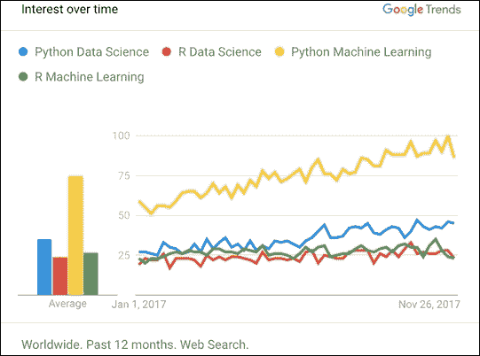

    2017 年的兴趣趋势

在一个良性循环中，Python 的受欢迎程度不断提高，带动了一个广泛且不断发展的范围广泛的库，可以使用 PIP Python 包安装程序轻松将其导入到您的项目中。 数据科学家现在可以访问许多功能强大的开源 Python 库，以进行数据处理，数据可视化，统计，数学，机器学习和自然语言处理。

即使初学者也可以使用流行的 [Scikit-learn 包](http://scikit-learn.org)快速构建机器学习分类器，而无需成为机器学习专家，也可以使用 [Matplotlib](https://matplotlib.org) 或 [Bokeh](https://bokeh.pydata.org) 快速绘制丰富的图表。

此外，Python 也已成为 [IEEE Spectrum 2017 调查](https://spectrum.ieee.org/computing/software/the-2017-top-programming-languages)：


编程语言的使用情况统计

GitHub 上也证实了这种趋势，其中 Python 现在在存储库总数中排名第三，仅次于 Java 和 JavaScript：


通过编程语言的 GitHub 存储库统计信息

上图显示了一些有趣的统计数据，展示了 Python 开发人员社区的活跃程度。 在 GitHub 上活动的与 Python 相关的存储库的大小为第三大，每个存储库的总代码推送和未解决的问题也相类似。

Python 在网络上也变得无处不在，它通过 Web 开发框架为众多知名网站提供支持，例如 [Django](https://www.djangoproject.com)，[Tornado](http://www.tornadoweb.org) 和 [TurboGears](http://turbogears.org)。 最近有迹象表明，Python 也在所有主要的云提供商中进入了云服务领域，其中包括中提供了某些功能。

Python 显然在数据科学领域有着光明的前途，尤其是与诸如 Jupyter 笔记本之类的强大工具结合使用时，Python 在数据科学家社区中已变得非常流行。 笔记本电脑的价值主张是，它们非常易于创建，并且非常适合快速运行的实验。 此外，笔记本电脑还支持多种高保真序列化格式，可以捕获指令，代码和结果，然后可以很容易地与团队中的其他数据科学家共享这些代码，也可以将其作为开源供所有人使用。 例如，我们看到 Jupyter 笔记本在 GitHub 上激增，数量超过 250 万并且还在增加。

以下屏幕快照显示了 GitHub 搜索任何扩展名为`.ipynb,`的文件的结果，该文件是序列化 Jupyter 笔记本（JSON 格式）的最流行格式：


GitHub 上的 Jupyter 笔记本的搜索结果

这很棒，但是 Jupyter 笔记本经常被认为仅仅是数据科学家工具。 我们将在接下来的章节中看到它们可以提供更多的功能，它们还可以帮助所有类型的团队解决数据问题。 例如，它们可以帮助业务分析师快速加载和可视化数据集，使开发人员可以直接在笔记本电脑中与数据科学家合作，以利用他们的分析和构建功能强大的仪表板，或者允许 DevOps 轻松地将这些仪表板部署到可扩展，在企业中就绪的微服务，可以作为独立的 Web 应用或可嵌入的组件运行。 基于将数据科学工具带给非数据科学家的愿景，创建了 PixieDust 开源项目。

# 介绍 PixieDust

### 提示

**有趣的事实**

我经常被问到我是如何想到 PixieDust 这个名字的，我只是想让笔记本对于非数据科学家来说就像魔术一样简单。

[PixieDust](https://github.com/ibm-watson-data-lab/pixiedust) 是一个开源项目，主要由三个组件组成，旨在解决本章开头所述的三个目标。

*   一个适用于 Jupyter 笔记本的辅助 Python 库，它提供了简单的 API，可将各种来源的数据加载到流行的框架（如 Pandas 和 Apache Spark `DataFrame`）中，然后以交互方式可视化和浏览数据集。
*   一个基于 Python 的简单编程模型，通过创建功能强大的仪表板 PixieApps，开发人员可以将分析结果直接“产品化”到笔记本中。 正如我们将在下一章中看到的那样，PixieApps 与传统的 **BI**（**商业智能**的缩写）仪表板有所不同，因为开发人员可以直接使用 HTML 和 CSS 来创建任意复杂的布局。 此外，他们可以将对笔记本中创建的任何变量，类或函数的访问权限嵌入其业务逻辑中。
*   一个安全的微服务 Web 服务器，称为 PixieGateway，可以将 PixieApps 作为独立的 Web 应用运行，也可以作为可以嵌入到任何网站中的组件运行。 使用图形向导可以从 Jupyter 笔记本轻松部署 PixieApps，而无需更改任何代码。 此外，PixieGateway 支持将由 PixieDust 创建的任何图表共享为可嵌入的网页，从而使数据科学家可以轻松地在笔记本电脑外部传达结果。

请务必注意，PixieDust `display()` API 主要支持两种流行的数据处理框架：

*   [**pandas**](https://pandas.pydata.org)：迄今为止，最流行的 Python 数据分析包，Pandas 提供了两种主要数据结构：用于处理两个- 一维列状数据集和系列。

    ### 注意

    当前，PixieDust `display()`仅支持 Pandas `DataFrame`。

*   [**Apache Spark `DataFrame`**](https://spark.apache.org/docs/latest/sql-programming-guide.html)：这是高级数据结构，用于操纵整个 Spark 集群中的分布式数据集。 Spark`DataFrame`构建在较低级 **RDD**（**弹性分布式数据集**的简称）之上，并添加了支持 SQL 查询的功能。

PixieDust `display()`支持的另一种较不常用的格式是 JSON 对象数组。 在这种情况下，PixieDust 将使用这些值来构建行，并将键用作列，例如，如下所示：

```py
my_data = [
{"name": "Joe", "age": 24},
{"name": "Harry", "age": 35},
{"name": "Liz", "age": 18},
...
]

```

此外，PixieDust 在数据处理和渲染级别都具有高度可扩展性。 例如，您可以添加要由可视化框架渲染的新数据类型，或者如果您想利用自己喜欢的绘图库，则可以轻松地将其添加到 PixieDust 支持的渲染器列表中（更多信息请参见下一章）。

您还将发现 PixieDust 包含一些与 Apache Spark 相关的额外工具，例如：

*   **包管理器**：这使您可以在 Python 笔记本中安装 Spark 包。
*   **Scala 桥接**：您可以使用`%%scala`魔术在 Python 笔记本中直接使用 Scala 。 变量自动从 Python 传输到 Scala，反之亦然。
*   **Spark 作业进度监视器**：通过直接在单元格输出中显示进度条来跟踪任何 Spark 作业的状态。

在深入研究三个 PixieDust 组件中的每一个之前，最好通过在云上注册托管解决方案（例如，位于[这个页面](https://datascience.ibm.com)）来访问 Jupyter 笔记本或在本地计算机上安装开发版本。

### 注意

[您可以按照以下说明在本地安装笔记本服务器](http://jupyter.readthedocs.io/en/latest/install.html)。

要在本地启动笔记本服务器，只需从终端运行以下命令：

```py
jupyter notebook --notebook-dir=<<directory path where notebooks are stored>>

```

笔记本主页将在浏览器中自动打开。 有许多配置选项可控制启动笔记本服务器的方式。 这些选项可以添加到命令行或保留在笔记本配置文件中。 如果您想尝试所有可能的配置选项，可以使用`--generate-config`选项生成配置文件，如下所示：

```py
jupyter notebook --generate-config

```

这将生成以下 Python 文件`<home_directory>/.jupyter/jupyter_notebook_config.py`，其中包含一组已禁用的自动记录的选项。 例如，如果不想在 Jupyter 笔记本启动时自动打开浏览器，请找到包含`sc.NotebookApp.open_browser`变量的行，取消注释，然后将其设置为`False`：

```py
## Whether to open in a browser after starting. The specific browser used is
#  platform dependent and determined by the python standard library 'web browser'
#  module, unless it is overridden using the --browser (NotebookApp.browser)
#  configuration option.
c.NotebookApp.open_browser = False

```

进行更改后，只需保存`jupyter_notebook_config.py`文件并重新启动笔记本服务器。

下一步是使用`pip`工具安装 PixieDust 库：

1.  从笔记本计算机本身，在单元格中输入以下命令：

    ```py
    !pip install pixiedust

    ```

    ### 注意

    **注意**：感叹号语法特定于 Jupyter 笔记本，它表示其余命令将作为系统命令执行。 例如，您可以使用`!ls`列出当前工作目录下的所有文件和目录。

2.  使用**单元格 | 运行单元格**菜单或工具栏上的**运行**图标。 您还可以使用以下键盘快捷键来运行单元格：

    *   `Ctrl + Enter`：运行并保持当前单元格处于选中状态
    *   `Shift + Enter`：运行并选择下一个单元格
    *   `Alt + Enter`：运行并创建新的空白

    下方的单元格
3.  重新启动内核以确保`pixiedust`库已正确加载到内核中。

以下屏幕截图显示了首次安装`pixiedust`后的结果：

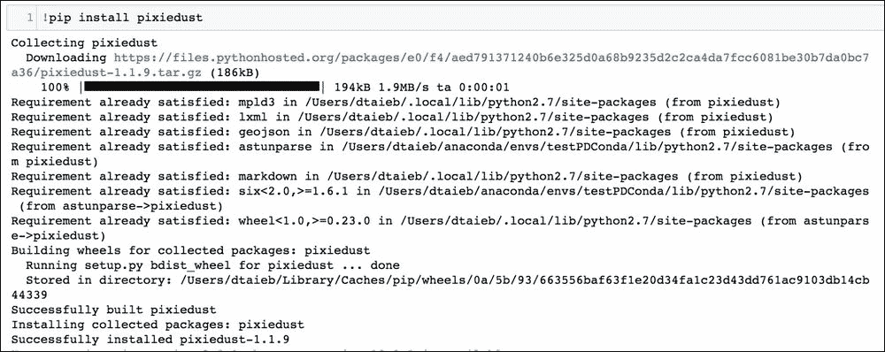

在 Jupyter 笔记本上安装 PixieDust 库

### 提示

我强烈建议您使用 [Anaconda](https://anaconda.org)，它提供了出色的 Python 包管理功能。 如果像我一样喜欢试验不同版本的 Python 和库依赖关系，建议您使用 Anaconda 虚拟环境。

它们是轻量级的 Python 沙箱，非常易于创建和激活（请参见[这个页面](https://conda.io/docs/user-guide/tasks/manage-environments.html)）：

*   创建一个新环境：`conda create --name env_name`
*   列出所有环境：`conda env list`
*   激活环境：`source activate env_name`

我还建议您有选择地熟悉源代码，该源代码位于[这个页面](https://github.com/ibm-watson-data-lab/pixiedust)和[这个页面](https://github.com/ibm-watson-data-lab/pixiegateway)。

现在，我们准备在下一部分中以`sampleData()`开头探索 PixieDust API。

# `SampleData`——用于加载数据的简单 API

将数据加载到笔记本中是数据科学家可以执行的最多重复任务之一，但是根据所使用的框架或数据源，编写代码可能既困难又耗时。

让我们举一个具体的示例，尝试从一个开放的数据站点（例如[这个页面](https://data.cityofnewyork.us)）中将 CSV 文件加载到 Pandas 和 Apache Spark`DataFrame`中。

### 注意

**注意**：继续，假定所有代码都在 Jupyter 笔记本中运行。

对于 Pandas 来说，代码非常简单，因为它提供了直接从 URL 加载的 API：

```py
import pandas
data_url = "https://data.cityofnewyork.us/api/views/e98g-f8hy/rows.csv?accessType=DOWNLOAD"
building_df = pandas.read_csv(data_url)
building_df
```

最后一条调用`building_df,`的语句将在输出单元格中打印其内容。 如果没有打印，这是可能的，因为 Jupyter 会将调用变量的单元格的最后一条语句解释为打印该指令的指令：

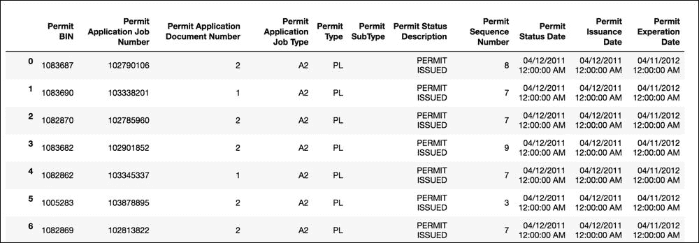

Pandas `DataFrame`的默认输出

但是，对于 Apache Spark，我们需要先将数据下载到文件中，然后使用 Spark CSV 连接器将其加载到`DataFrame`中：

```py
#Spark CSV Loading
from pyspark.sql import SparkSession
try:
    from urllib import urlretrieve
except ImportError:
    #urlretrieve package has been refactored in Python 3
    from urllib.request import urlretrieve

data_url = "https://data.cityofnewyork.us/api/views/e98g-f8hy/rows.csv?accessType=DOWNLOAD"
urlretrieve (data_url, "building.csv")

spark = SparkSession.builder.getOrCreate()
building_df = spark.read\
  .format('org.apache.spark.sql.execution.datasources.csv.CSVFileFormat')\
  .option('header', True)\
  .load("building.csv")
building_df
```

由于`building_df`现在是 Spark `DataFrame`，因此输出略有不同：


Spark`DataFrame`的默认输出

即使此代码不是那么大，也必须每次都重复，并且很可能需要花费时间进行 Google 搜索以记住正确的语法。 数据也可以采用其他格式，例如 JSON，这将要求为 Pandas 和 Spark 调用不同的 API。 数据的格式也可能不正确，并且可能在 CSV 文件中包含错误的行或 JSON 语法错误。 不幸的是，所有这些问题并非罕见，并助长了数据科学的 80/20 规则，该规则指出，数据科学家平均花费 80% 的时间来获取，清理和加载数据，而只有 20% 的时间用于实际分析。

PixieDust 提供了一个简单的`sampleData` API，以帮助改善这种情况。 当不带参数调用时，它将显示准备分析的预整理数据集的列表：

```py
import pixiedust
pixiedust.sampleData()
```

结果如下所示：


PixieDust 内置数据集

可以根据组织的需要定制预定义的策划数据集列表，这是朝着*数据*支柱迈出的重要一步，如上一章所述。

然后，用户可以使用预构建数据集的 ID 再次再次调用`sampleData` API，并在 Jupyter Kernel 中的 Spark 框架可用的情况下获取 Spark `DataFrame`；如果没有，则退回到 Pandas `DataFrame`。

在以下示例中，我们在连接了 Spark 的笔记本电脑上调用`sampleData()`。 我们还调用`enableSparkJobProgressMonitor()`以显示有关操作中涉及的 Spark 作业的实时信息。

### 注意

**注意**：Spark 作业是在 Spark 集群中具有特定数据子集的特定节点上运行的进程。 在从数据源加载大量数据的情况下，将为每个 Spark 作业分配一个特定的子集（实际大小取决于集群中的节点数和整体数据的大小）。 与其他工作。

在一个单独的单元中，我们运行以下代码以启用 Spark Job Progress Monitor：

```py
pixiedust.enableSparkJobProgressMonitor()
```

结果如下：

```py
Successfully enabled Spark Job Progress Monitor
```

然后，我们调用`sampleData`来加载`cars`数据集：

```py
cars = pixiedust.sampleData(1)
```

结果如下所示：


使用 PixieDust sampleData API 加载内置数据集

用户还可以传递指向可下载文件的任意 URL。 PixieDust 当前支持 JSON 和 CSV 文件。 在这种情况下，PixieDust 将自动下载文件，将缓存在临时区域中，检测格式，然后根据 Spark 是否在笔记本电脑中可用加载到 Spark 或 Pandas `DataFrame`中。 请注意，即使使用`forcePandas `关键字参数可以使用 Spark，用户也可以强制加载到 Pandas 中：

```py
import pixiedust
data_url = "https://data.cityofnewyork.us/api/views/e98g-f8hy/rows.csv?accessType=DOWNLOAD"
building_dataframe = pixiedust.sampleData(data_url, forcePandas=True)
```

结果如下：

```py
Downloading 'https://data.cityofnewyork.us/api/views/e98g-f8hy/rows.csv?accessType=DOWNLOAD' from https://data.cityofnewyork.us/api/views/e98g-f8hy/rows.csv?accessType=DOWNLOAD
Downloaded 13672351 bytes
Creating pandas DataFrame for 'https://data.cityofnewyork.us/api/views/e98g-f8hy/rows.csv?accessType=DOWNLOAD'. Please wait...
Loading file using 'pandas'
Successfully created pandas DataFrame for 'https://data.cityofnewyork.us/api/views/e98g-f8hy/rows.csv?accessType=DOWNLOAD'
```

`sampleData()` API 也足够聪明，可以识别指向 ZIP 和 GZ 类型的压缩文件的 URL。 在这种情况下，它将自动解压缩原始二进制数据并加载存档中包含的文件。 对于 ZIP 文件，它查看存档中的第一个文件；对于 GZ 文件，它只是解压缩内容，因为 GZ 文件不是存档，并且不包含多个文件。 然后`sampleData()` API 将从解压缩的文件中加载`DataFrame`。

例如，我们可以直接从伦敦开放数据网站提供的 ZIP 文件中加载自治市镇信息，并使用`display()` API 将结果显示为饼图，如下所示：

```py
import pixiedust
london_info = pixiedust.sampleData("https://files.datapress.com/london/dataset/london-borough-profiles/2015-09-24T15:50:01/London-borough-profiles.zip")
```

结果如下（假设您的笔记本计算机已连接到 Spark，否则将加载 Pandas `DataFrame`）：

```py
Downloading 'https://files.datapress.com/london/dataset/london-borough-profiles/2015-09-24T15:50:01/London-borough-profiles.zip' from https://files.datapress.com/london/dataset/london-borough-profiles/2015-09-24T15:50:01/London-borough-profiles.zip
Extracting first item in zip file...
File extracted: london-borough-profiles.csv
Downloaded 948147 bytes
Creating pySpark DataFrame for 'https://files.datapress.com/london/dataset/london-borough-profiles/2015-09-24T15:50:01/London-borough-profiles.zip'. Please wait...
Loading file using 'com.databricks.spark.csv'
Successfully created pySpark DataFrame for 'https://files.datapress.com/london/dataset/london-borough-profiles/2015-09-24T15:50:01/London-borough-profiles.zip'
```

然后，我们可以在`london_info``DataFrame`上调用`display()`，如下所示：

```py
display(london_info)
```

我们在图表菜单中选择**饼图**，然后在**选项**对话框中，将`Area name`列拖放到**键**区域和`Crime rates per thousand population 2014/15`到**值**区域中，如以下屏幕截图所示：


用于可视化`london_info`数据帧的图表选项

在**选项**对话框中单击 **OK** 按钮后，我们得到以下结果：

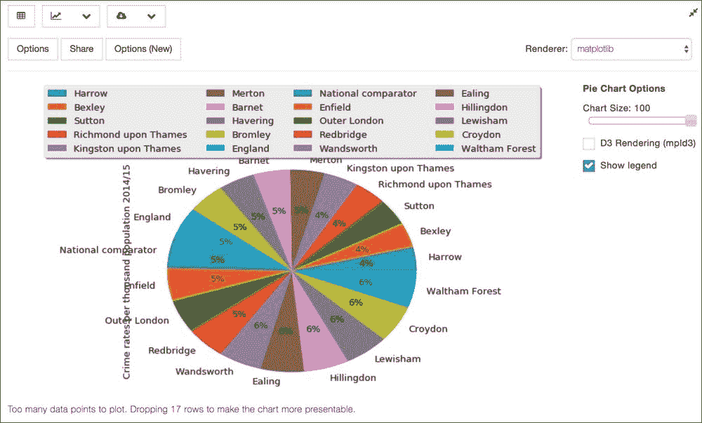

通过指向压缩文件的 URL 创建的饼图

很多时候，您找到了一个不错的数据集，但文件包含错误或对您而言很重要的数据为错误格式或埋在一些非结构化文本中，需要将其提取到自己的列中。 此过程也称为**数据整理**，可能非常耗时。 在下一节中，我们将研究 PixieDust 的扩展名`pixiedust_rosie`，该扩展提供了`wrangle_data`方法，该方法可以帮助完成此过程。

# 使用`pixiedust_rosie`整理数据

在大多数情况下，在受控实验中工作与在现实世界中工作不同。 我的意思是，在开发过程中，我们通常会选择（或者我应该说是制造）一个旨在表现出来的样本数据集。 它具有正确的格式，符合架构规范，没有数据丢失，依此类推。 目标是专注于验证假设并构建算法，而不是集中在数据清理上，这可能非常痛苦且耗时。 但是，在开发过程中尽早获得尽可能接近真实数据的数据具有不可否认的优势。 为了帮助完成此任务，我与 IBM 的两个同事 Jamie Jennings 和 Terry Antony 合作，他们自愿为 PixieDust 扩展了名为`pixiedust_rosie`的扩展。

该 Python 包实现了一个简单的`wrangle_data()`方法，以自动执行原始数据的清理。 `pixiedust_rosie`包当前支持 CSV 和 JSON，但是将来会添加更多格式。 底层数据处理引擎使用 **Rosie 模式语言**（**RPL**）开源组件，这是一个正则表达式引擎，旨在使开发人员更容易使用，性能更高， 并可以扩展到大数据。 [您可以在此处找到有关 Rosie 的更多信息](http://rosie-lang.org)。

首先，您需要使用以下命令安装`pixiedust_rosie`包：

```py
!pip install pixiedust_rosie

```

`pixiedust_rosie`包依赖于`pixiedust`和`rosie,`，如果尚未安装在系统上，它们将自动下载。

`wrangle_data()`方法与`sampleData()` API 非常相似。 当不带参数调用时，它将显示预整理的数据集列表，如下所示：

```py
import pixiedust_rosie
pixiedust_rosie.wrangle_data()
```

这将产生以下结果：

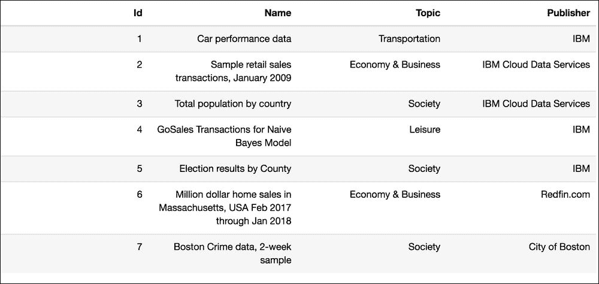

可用于`wrangle_data()`的预整理数据集的列表

您还可以使用预整理数据集的 ID 或 URL 链接来调用它，例如，如下所示：

```py
url = "https://github.com/ibm-watson-data-lab/pixiedust_rosie/raw/master/sample-data/Healthcare_Cost_and_Utilization_Project__HCUP__-_National_Inpatient_Sample.csv"
pixiedust_rosie.wrangle_data(url)
```

在前面的代码中，我们在`url`变量引用的 CSV 文件上调用`wrangle_data()`。 该功能首先在本地文件系统中下载文件，然后对数据的子集执行自动数据分类，以推断数据模式。 然后启动模式编辑器 PixieApp，它提供了一组向导屏幕，可让用户配置模式。 例如，用户将能够删除和重命名列，更重要的是，通过提供 Rosie 模式，可以将现有列分解为新列。

下图说明了工作流程：


`wrangle_data()`工作流程

`wrangle_data()`向导的第一个屏幕显示了由 Rosie 数据分类器推断的架构，如以下屏幕截图所示：

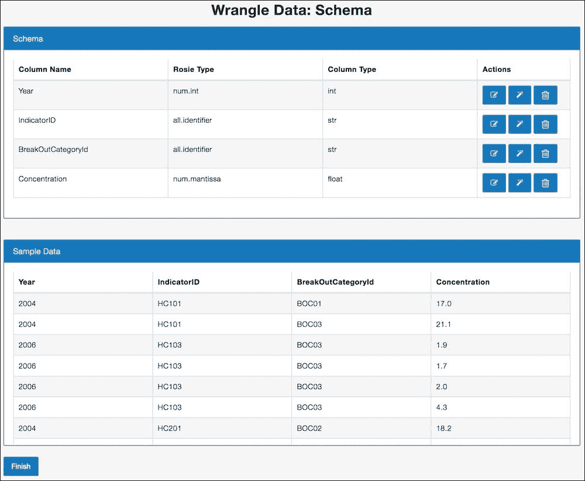

`wrangle_data()`模式编辑器

前面的架构窗口小部件显示了列名称`Rosie Type`（特定于 Rosie 的高级类型表示）和`Column Type`（映射至受支持的 Pandas 类型）。 每行还包含三个操作按钮：

*   **删除列**：这将从架构中删除列。 此列将不会出现在最终的 Pandas `DataFrame`中。
*   **重命名列**：这将更改列的名称。
*   **转换列**：这通过将列分解为新列来对其进行转换。

用户可以随时预览数据（如前面的 SampleData 小部件中所示）以验证架构配置是否按预期进行。

当用户单击转换列按钮时，将显示一个新屏幕，让用户指定用于构建新列的模式。 在某些情况下，数据分类器将能够自动检测模式，在这种情况下，将添加一个按钮询问用户是否应应用建议。

以下屏幕截图显示了**转换所选列**屏幕，并带有自动建议：

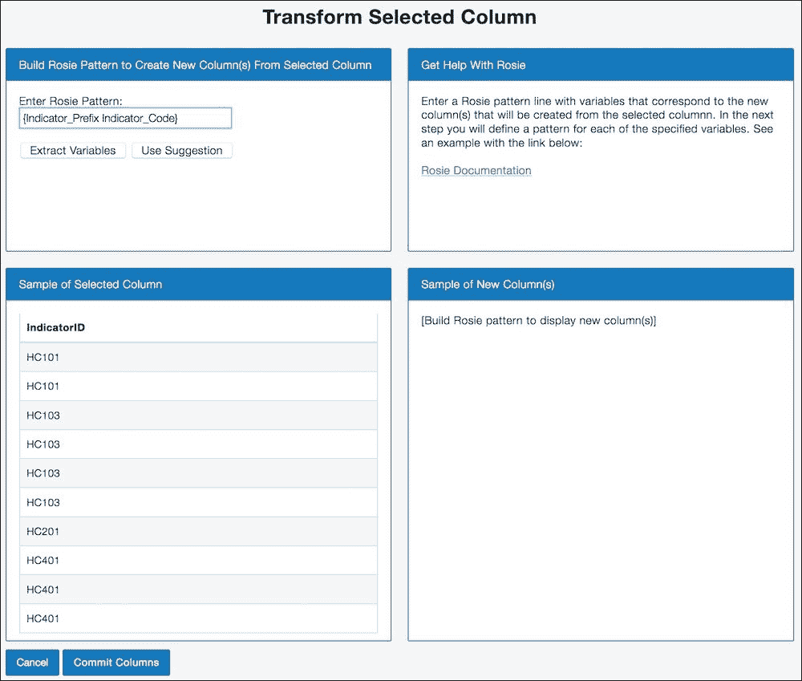

转换列屏幕

此屏幕显示四个小部件，其中包含以下信息：

*   Rosie 模式输入是您可以输入代表该列数据的自定义 Rosie 模式的地方。 然后，您使用**提取变量**按钮告诉模式编辑器应将模式的哪一部分提取到新列中（稍后将对此进行详细说明）。
*   有一个帮助窗口小部件，提供指向 RPL 文档的链接。
*   当前列的数据预览。
*   应用了 Rosie 模式的数据预览。

当用户单击**提取变量**按钮时，小部件将更新为以下内容：


将 Rosie 变量提取到列中

此时，用户可以选择编辑定义，然后单击**创建列**按钮以将新列添加到架构。 然后更新**新列样本**小部件以显示数据外观的预览。 如果模式定义包含错误的语法，则此小部件中将显示错误：


应用模式定义后预览新列

当用户单击**提交列**按钮时，将再次显示主模式编辑器屏幕，并添加新列，如以下屏幕快照所示：

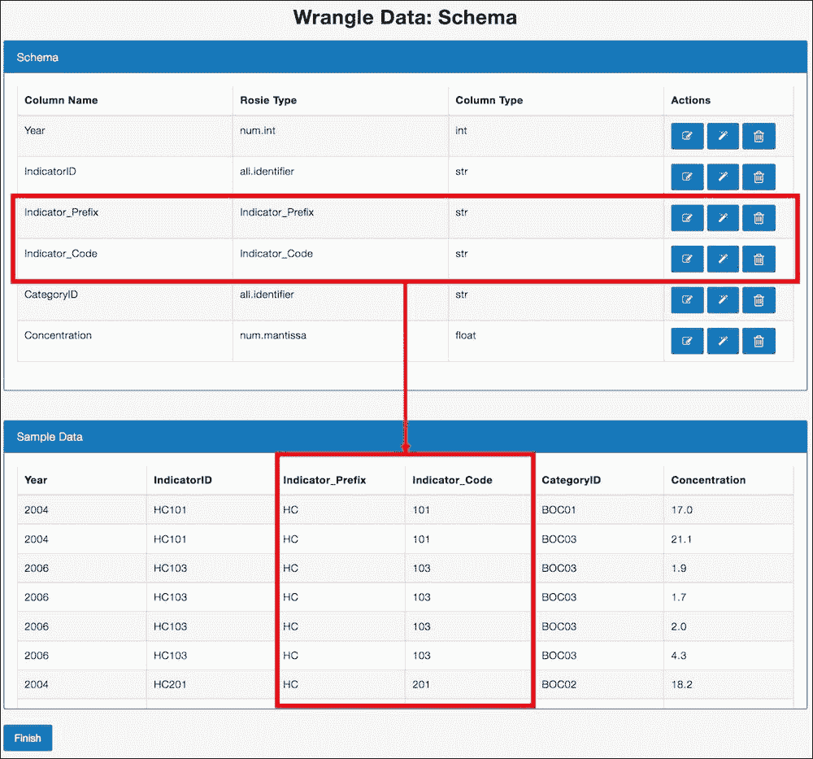

具有新列的模式编辑器

最后一步是单击**完成**按钮以将架构定义应用于原始文件，并创建一个 Pandas `DataFrame`，它将在笔记本中用作变量。 此时，系统会向用户显示一个对话框，其中包含一个可以编辑的默认变量名，如以下屏幕截图所示：


编辑结果 Pandas 数据帧的变量名

单击**完成**按钮后，`pixiedust_rosie`应用模式定义遍历整个数据集。 完成后，它将使用生成的代码在当前单元的下面创建一个新单元格，该代码在新生成的 Pandas `DataFrame`上调用`display()` API，如下所示：

```py
#Code generated by pixiedust_rosie
display(wrangled_df)
```

运行前面的单元格将使您能够浏览和可视化新数据集。

我们在本节中探讨的`wrangle_data()`函数是帮助数据科学家花更少的时间清理数据并花更多时间分析数据的第一步。 在下一部分中，我们将讨论如何帮助数据科学家进行数据探索和可视化。

# 可视化——用于数据可视化的简单交互式 API

数据可视化是另一个非常重要的数据科学任务，对于探索和形成假设来说是必不可少的。 幸运的是，Python 生态系统具有许多强大的库，专门用于数据可视化，例如以下热门示例：

*   [Matplotlib](http://matplotlib.org)
*   [Seaborn](https://seaborn.pydata.org)
*   [Bokeh](http://bokeh.pydata.org)
*   [Brunel](https://brunelvis.org)

但是，类似于数据加载和清理，在笔记本中使用这些库可能既困难又耗时。 这些库中的每一个都有各自的编程模型，并且 API 并不总是易于学习和使用的，特别是如果您不是经验丰富的开发人员。 另一个问题是这些库没有与常用数据处理框架（例如 Pandas（可能是 Matplotlib 除外）或 Apache Spark）的高层接口，因此，在绘制数据之前需要进行大量数据准备。

为解决此问题，PixieDust 提供了一个简单的`display()` API，该 API 使 Jupyter 笔记本用户可以使用交互式图形界面来绘制数据而无需任何编码。 这个 API 实际上不会创建图表，但是会在根据用户选择通过调用其 API 委托给渲染器之前完成准备数据的所有繁重工作。

`display()` API 支持多种数据结构（Pandas，Spark 和 JSON）以及多种渲染器（Matplotlib，Seaborn，Bokeh 和 Brunel）。

作为说明，让我们使用内置的汽车性能数据集，并通过调用`display()` API 开始可视化数据：

```py
import pixiedust
cars = pixiedust.sampleData(1, forcePandas=True) #car performance data
display(cars)
```

第一次在单元格上调用该命令时，将显示表格视图，并且当用户浏览菜单时，所选选项将以 JSON 格式存储在单元格元数据中，以便下次单元格运行时可以再次使用它们。 所有可视化的输出布局遵循相同的模式：

*   有一个可扩展的顶层菜单，可在图表之间进行切换。
*   有一个下载菜单，用于在本地计算机上下载文件。
*   有一个过滤器切换按钮，使用户可以通过过滤数据来优化他们的探索。 我们将在“过滤”部分中讨论过滤器功能。
*   有一个`Expand/Collapse Pixiedust Output`按钮，用于折叠/扩展输出内容。
*   有一个**选项**按钮可调用一个对话框，该对话框具有特定于当前可视化的配置。
*   有一个“共享”按钮，可让您在网络上发布可视化内容。

    ### 注意

    **注意**：仅当您已部署 PixieGateway 时，才可以使用此按钮，我们将在第四章，“将 PixieApps 部署到使用 Web 的 PixieGateway 服务器”中进行详细讨论。

*   在可视化的右侧有一组上下文选项。
*   存在主要的可视化区域。


表格渲染器的可视化输出布局

要开始创建图表，首先在菜单中选择适当的类型。 开箱即用，PixieDust 支持六种类型的图表：**条形图**，**线形图**，**散点图**，**饼图**，**映射**和**直方图**。 正如我们将在第 5 章，“最佳做法和高级 PixieDust 概念”中看到的那样，PixieDust 还提供了 API，可让您通过添加新菜单或向现有菜单添加选项来自定义这些菜单：

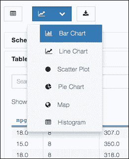

PixieDust 图表菜单

首次调用图表菜单时，将显示一个选项对话框，以配置一组基本配置选项，例如`X`和`Y`轴所使用的类型，聚合等等。 为了节省您的时间，该对话框将预先填充 PixieDust 从`DataFrame`自动检查的数据模式。

在以下示例中，我们将创建一个条形图，显示按马力计算的平均里程消耗：

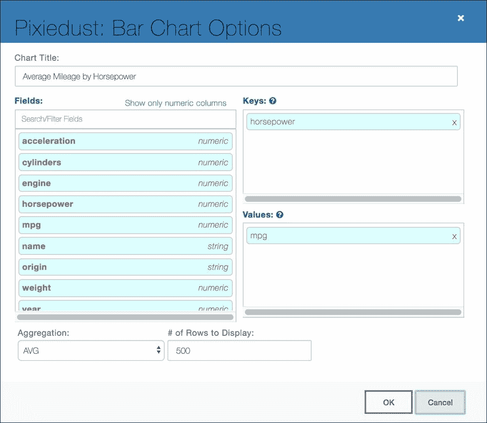

条形图对话框选项

单击 **OK** 将在单元格输出区域中显示交互式界面：

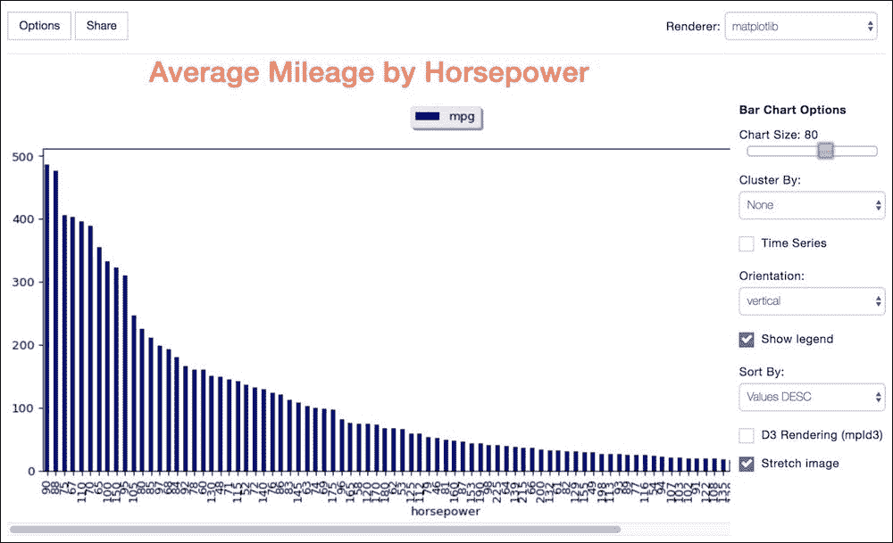

条形图可视化

画布在中心区域显示图表，并在与所选图表类型相关的一侧显示一些上下文选项。 例如，我们可以在**群集**组合框中选择字段**来源**，以按来源国显示明细：


集群条形图可视化

如前所述，PixieDust `display()`实际上并不创建图表，而是根据所选选项准备数据，并使用正确的参数来繁重地调用渲染器引擎的 API。 该设计背后的目标是使每种图表类型都支持多个渲染器，而无需任何额外的编码，从而为用户提供了尽可能多的探索自由。

只要安装了相应的库，PixieDust 即可使用以下渲染器。 对于未安装的渲染器，将在 PixieDust 日志中生成警告，并且相应的渲染器不会显示在菜单中。 我们将在第 5 章，“最佳实践和高级 PixieDust 概念”中详细介绍 PixieDust 登录。

*   [Matplotlib](https://matplotlib.org)
*   [Seaborn](https://seaborn.pydata.org)

    ### 注意

    需要使用以下库来安装该库： `!pip install seaborn.`

*   [Bokeh](https://bokeh.pydata.org)

    ### 注意

    需要使用以下库来安装该库： `!pip install bokeh.`

*   [Brunel](https://brunelvis.org)

    ### 注意

    需要使用以下库来安装该库： `!pip install brunel.`

*   [Google 地图](https://developers.google.com/maps)
*   [Mapbox](https://www.mapbox.com)

    ### 注意

    **注意**：Google Map 和 Mapbox 需要您可以在各自站点上获得的 API 密钥。

您可以使用**渲染器**组合框在渲染器之间切换。 例如，如果我们想要更多的交互性来探索图表（例如缩放和平移），则可以使用 Bokeh 渲染器而不是 Matplotlib，它只能为我们提供静态图像：

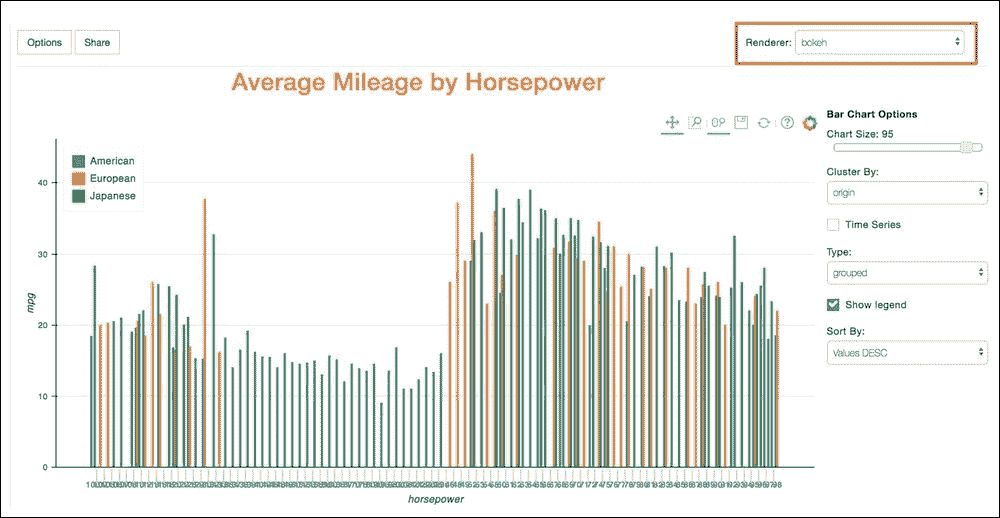

使用 Bokeh 渲染器的群集条形图

另一个值得一提的图表类型是地图，当您的数据包含地理空间信息（例如经度，纬度或国家/州信息）时，这会很有意思。 PixieDust 支持多种类型的地理映射渲染引擎，包括流行的 Mapbox 引擎。

### 注意

在使用 Mapbox 渲染器之前，[建议从以下位置的 Mapbox 站点获取 API 密钥](https://www.mapbox.com/help/how-access-tokens-work)。 但是，如果您没有，则 PixieDust 将提供一个默认密钥。

要创建地图，请使用 NE Mass 数据集中的*百万美元房屋销售*，如下所示：

```py
import pixiedust
homes = pixiedust.sampleData(6, forcePandas=True) #Million dollar home sales in NE Mass
display(homes)
```

首先，在图表下拉按钮中选择**地图**，然后在选项对话框中，选择`LONGITUDE`和`LATITUDE`作为键，然后在提供的输入中输入 Mapbox 访问令牌。 您可以在**值**区域中添加多个字段，它们将作为工具提示显示在地图上：


Mapbox 图表的“选项”对话框

单击 **OK** 按钮时，您将获得交互式地图，您可以使用样式（简单，正弦或密度图），颜色和底图（亮，卫星，暗， 和户外）选项：

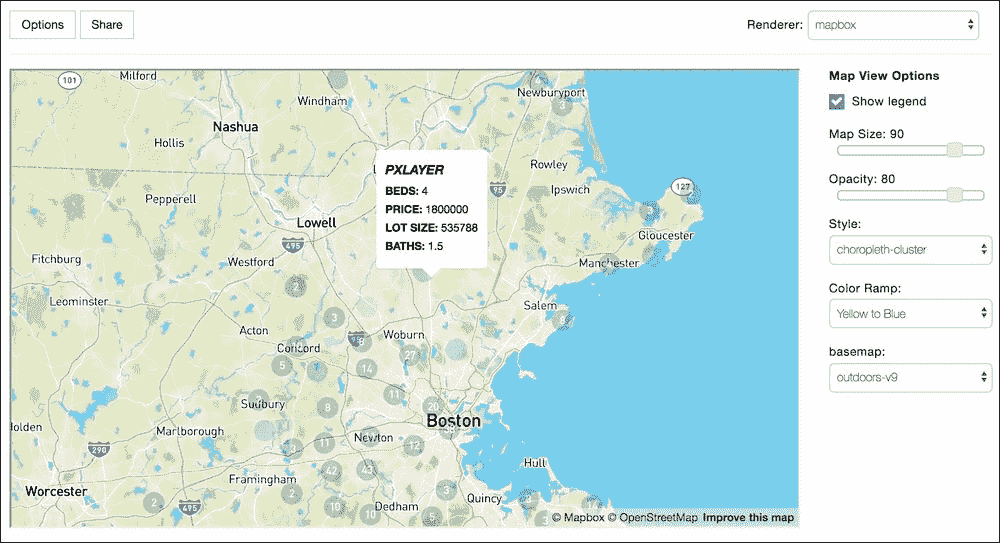

交互式 Mapbox 可视化

每种图表类型都有其自己的上下文选项集，这些选项不言自明，在这一点上，我鼓励您使用它们中的每一个。 如果您发现问题或有增强想法，则可以始终在 GitHub 上的[这个页面](https://github.com/ibm-watson-data-lab/pixiedust/issues)创建一个新问题，或者提交一个带有您的代码更改的请求更好（[这里有更多有关该操作的信息](https://help.github.com/articles/creating-a-pull-request)）。

为避免每次单元格运行时都重新配置图表，PixieDust 将图表选项作为 JSON 对象存储在单元格元数据中，最终将其保存在笔记本中。 您可以通过选择**视图 | 单元格工具栏 | 编辑元数据**菜单手动检查此数据，如以下屏幕截图所示：


显示编辑元数据按钮

**编辑元数据**按钮将显示在单元格的顶部，单击该按钮将显示 PixieDust 配置：


编辑单元元数据对话框

当我们在下一节讨论 PixieApps 时，此 JSON 配置将非常重要。

# 过滤

为了更好地浏览数据，PixieDust 还提供了一个内置的简单图形界面，可让您快速过滤正在可视化的数据。 您可以通过单击顶层菜单中的过滤器切换按钮来快速调用过滤器。 为简单起见，过滤器仅支持仅基于一列构建谓词，这在大多数情况下足以验证简单假设（基于反馈，将来可能会增强此功能以支持多个谓词）。 过滤器用户界面会自动让您选择要过滤的列，并根据其类型显示不同的选项：

*   **数值类型**：用户可以选择一个数学比较器并为操作数输入一个值。 为了方便起见，UI 还将显示与所选列相关的统计值，这些统计值可在选择操作数值时使用：

    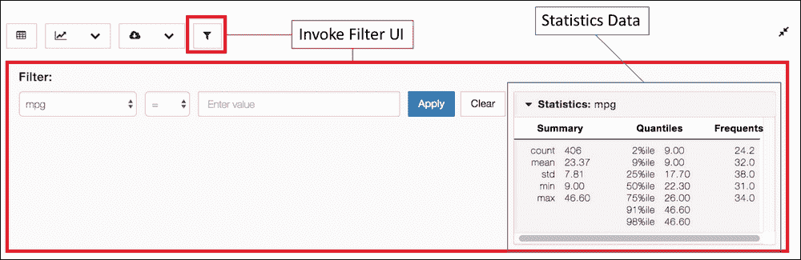

    过滤汽车数据集的`mpg`数字列

*   **字符串类型**：用户可以输入表达式以匹配列值，该表达式可以是正则表达式或纯字符串。 为了方便起见，UI 还显示了有关如何构建正则表达式的基本帮助：


过滤汽车数据集的名称字符串类型

单击**应用**按钮时，当前可视化将更新以反映过滤器配置。 重要的是要注意，该过滤器不仅适用于当前单元格，还适用于整个单元格。 因此，当在图表类型之间切换时，它将继续适用。 筛选器配置也保存在单元元数据中，因此在保存笔记本并重新运行单元时将保留它。

例如，以下屏幕快照将`cars`数据集可视化为条形图，仅显示`mpg`大于`23,`的行，根据统计框，这是数据集的平均值，并按年份进行聚类。 在选项对话框中，我们选择`mpg`列作为键，并选择`origin`作为值：

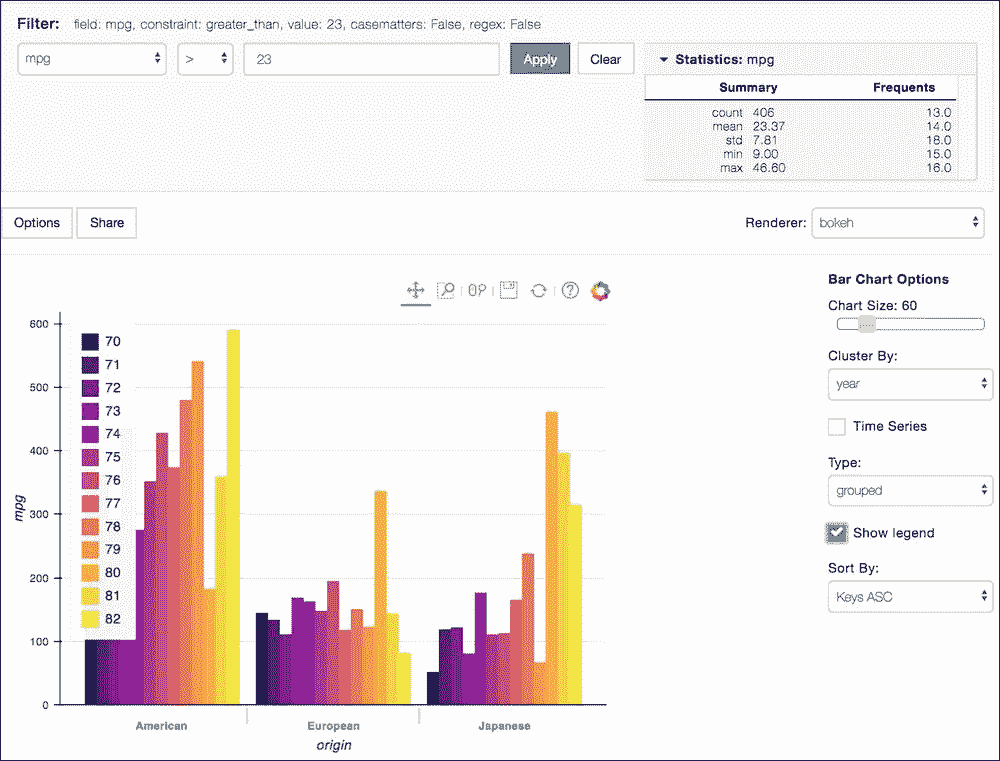

汽车数据集的已过滤条形图

总而言之，在本节中，我们讨论了 PixieDust 如何帮助完成三个困难且耗时的数据科学任务：数据加载，数据整理和数据可视化。 接下来，我们将了解 PixieDust 如何帮助增加数据科学家与开发人员之间的协作。

# 通过 PixieApps 弥合开发人员与数据科学家之间的鸿沟

解决硬数据问题只是数据科学团队的任务之一。 他们还需要确保正确执行数据科学结果，以为组织提供业务价值。 数据分析的运营在很大程度上取决于用例。 例如，这可能意味着创建仪表板，为决策者综合见解，或者将诸如推荐引擎之类的机器学习模型集成到 Web 应用中。

在大多数情况下，这是数据科学与软件工程相遇的地方（或者就像人们所说的，*橡胶与道路相遇*）。 团队之间的持续协作（而不是一次交接）是成功完成任务的关键。 通常，他们还必须应对不同的语言和平台，从而导致软件工程团队重写大量代码。

当我们需要构建实时仪表板以可视化结果时，我们在 Twitter 主题标签项目的情感分析中亲身体验了它。 数据分析是使用 Pandas，Apache Spark 和一些绘图库（例如 Matplotlib 和 Bokeh）以 Python 编写的，而仪表板是用 [Node.js](https://nodejs.org) 和 [D3](https://d3js.org) 编写的。

我们还需要在分析和仪表板之间建立数据接口，并且由于我们需要系统是实时的，因此我们选择使用 Apache Kafka 来流化分析结果格式的事件。

下图概括了一种方法，我将其称为**切换模式**，其中数据科学团队构建分析并将结果部署在数据接口层中。 然后，结果将由应用使用。 数据层通常由数据工程师处理，这是我们在第 1 章“开发人员对数据科学的观点”中讨论的角色之一：


数据科学与工程学之间的交接

这种移交模式的问题在于它不利于快速迭代。 数据层中的任何更改都需要与软件工程团队同步，以避免破坏应用。 PixieApps 背后的想法是在构建应用的同时尽可能靠近数据科学环境，在我们的示例中为 Jupyter 笔记本。 使用这种方法，可以直接从运行在 Jupyter 笔记本中的 PixieApp 调用分析功能，从而使数据科学家和开发人员可以轻松地进行协作并反复进行快速改进。

PixieApp 定义了一个简单的编程模型，用于构建单页应用，可直接访问 IPython 笔记本内核（这是运行笔记本代码的 Python 后端进程）。 本质上，PixieApp 是一个 Python 类，它封装了表示形式和业务逻辑。 该演示文稿由一组称为路由的特殊方法组成，这些方法返回任意 HTML 片段。 每个 PixieApp 都有一个默认路由，该路由返回起始页面的 HTML 片段。 开发人员可以使用自定义 HTML 属性来调用其他路由，并动态更新页面的全部或部分。 例如，一条路线可能会调用从笔记本内部创建的机器学习算法或使用 PixieDust 显示框架生成图表。

下图显示了 PixieApps 与 Jupyter 笔记本客户端前端和 IPython 内核交互的高层架构：


PixieApp 与 Jupyter 内核的交互

作为 PixieApp 外观的预览，这是一个`hello world`示例应用，其中有一个按钮显示了我们在上一节中创建的汽车`DataFrame`的条形图：

```py
#import the pixieapp decorators
from pixiedust.display.app import *

#Load the cars dataframe into the Notebook
cars = pixiedust.sampleData(1)

@PixieApp   #decorator for making the class a PixieApp
class HelloWorldApp():
    #decorator for making a method a
    #route (no arguments means default route)
    @route()
    def main_screen(self):
        return """
        <button type="submit" pd_options="show_chart=true" pd_target="chart">Show Chart</button>
        <!--Placeholder div to display the chart-->
        <div id="chart"></div>
        """

    @route(show_chart="true")
    def chart(self):
        #Return a div bound to the cars dataframe
        #using the pd_entity attribute
        #pd_entity can refer a class variable or
        #a global variable scoped to the notebook
        return """
        <div pd_render_onload pd_entity="cars">
            <pd_options>
                {
                  "title": "Average Mileage by Horsepower",
                  "aggregation": "AVG",
                  "clusterby": "origin",
                  "handlerId": "barChart",
                  "valueFields": "mpg",
                  "rendererId": "bokeh",
                  "keyFields": "horsepower"
                }
            </pd_options>
        </div>
        """
#Instantiate the application and run it
app = HelloWorldApp()
app.run()
```

当前面的代码在笔记本单元中运行时，我们得到以下结果：

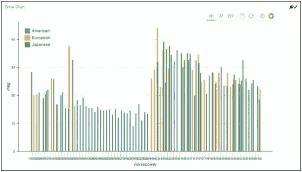

Hello World PixieApp

您可能对前面的代码有很多问题，但请不要担心。 在下一章中，我们将介绍所有 PixieApp 技术细节，包括如何在端到端管道中使用它们。

# 用于实现数据科学分析的架构

在上一节中，我们了解了 PixieApps 与 PixieDust 显示框架的结合如何提供一种简便的方法来构建功能强大的仪表板，这些仪表板可直接与您的数据分析连接，从而允许算法和用户界面之间的快速迭代。 这对于快速原型制作非常有用，但是笔记本电脑不适合在目标角色是业务用户的生产环境中使用。 一个显而易见的解决方案是使用传统的三层 Web 应用架构重写 PixieApp，如下所示：

*   用于表示层的 [React](https://reactjs.org)
*   Web 层的 Node.js
*   针对 Web 分析层的数据访问库，用于机器学习评分或运行任何其他分析作业

但是，这将仅对现有流程进行少量改进，在这种情况下，将仅包括使用 PixieApp 进行迭代实现的能力。

更好的解决方案是直接将 PixieApps 部署和运行为 Web 应用，包括周围笔记本电脑中的分析功能，而我们在使用它时无需更改任何代码。

使用此模型，Jupyter 笔记本将成为简化开发生命周期的中心工具，如下图所示：

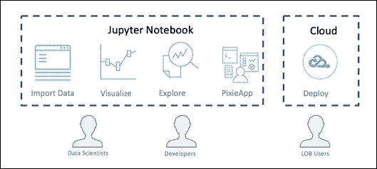

数据科学管道开发生命周期

1.  数据科学家使用 Python 笔记本来加载，丰富和分析数据并创建分析（机器学习模型，统计信息等）
2.  开发人员在同一个笔记本中创建一个 PixieApp 来实现这些分析
3.  准备就绪后，开发人员将 PixieApp 发布为 Web 应用，业务部门用户可以轻松地以交互方式使用它，而无需访问笔记本电脑

PixieDust 使用 PixieGateway 组件提供了该解决方案的实现。 PixieGateway 是一个 Web 应用服务器，负责加载和运行 PixieApps。 它构建在 [Jupyter 内核网关](https://github.com/jupyter/kernel_gateway)之上，该网关本身构建在 Tornado Web 框架之上，因此遵循如图所示的架构。 下图：


PixieGateway 架构图

1.  PixieApp 直接从笔记本中发布到 PixieGateway 服务器中，并生成一个 URL。 在后台，PixieGateway 分配了一个 Jupyter 内核来运行 PixieApp。 根据配置，PixieApp 可以与其他应用共享内核实例，也可以根据需要拥有专用的内核。 PixieGateway 中间件可以通过管理多个内核实例的生命周期来水平扩展，这些实例本身可以是服务器本地的，也可以是群集上的远程的。

    ### 注意

    **注意**：远程内核必须是 Jupyter 内核网关。

    使用发布向导，用户可以选择定义应用的安全性。 提供多个选项，包括基本认证，OAuth 2.0 和承载令牌。

2.  业务用户使用步骤 1 中的 URL 从浏览器访问应用。
3.  PixieGateway 提供了一个全面的管理控制台，用于管理服务器，包括配置应用，配置和监视内核，访问日志以进行故障排除等。
4.  PixieGateway 使用 [IPython 消息传递协议](http://jupyter-client.readthedocs.io/en/latest/messaging.html)通过 WebSocket 或 ZeroMQ，具体取决于内核是本地的还是远程的。

在将分析产品化时，此解决方案相对于传统的三层 Web 应用架构进行了重大改进，因为它可以将 Web 和数据层折叠为一个 **Web 分析层**，如下图所示：


经典三层与 PixieGateway Web 架构之间的比较

在经典的三层架构中，开发人员必须维护多个 REST 端点，以调用数据层中的分析并按摩数据以符合表示层要求以正确显示数据。 结果，必须将大量工程设计添加到这些端点，从而增加了开发和代码维护的成本。 相反，在 PixieGateway 两层架构中，开发人员不必担心创建端点，因为服务器负责使用内置的通用端点将请求分发到适当的内核。 用另一种方式解释，PixieApp Python 方法自动成为表示层的端点，而无需任何代码更改。 该模型有助于快速迭代，因为重新发布后，Python 代码中的任何更改都直接反映在应用中。

PixieApps 非常适合快速构建单页应用和仪表板。 但是，您可能还想生成更简单的一页报告并与用户共享。 为此，PixieGateway 还允许您使用**共享**按钮共享由`display()` API 生成的图表，从而产生 URL 链接到包含该图表的网页。 反过来，用户可以通过复制和粘贴为页面生成的代码将图表嵌入网站或博客文章中。

### 注意

**注意**：我们将在第 4 章“使用 PixieGateway 服务器将 PixieApps 部署到 Web 上”中，详细介绍 PixieGateway，包括如何在本地和在云上安装新实例。

为了演示此功能，我们使用之前创建的`DataFrame`汽车：


共享图表对话框

如果共享成功，则下一页将显示生成的 URL 和代码片段以嵌入到 Web 应用或博客文章中：

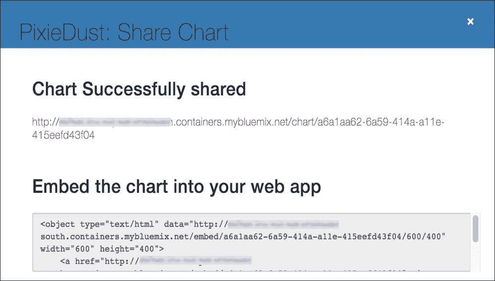

确认共享图表

单击链接将转到页面：

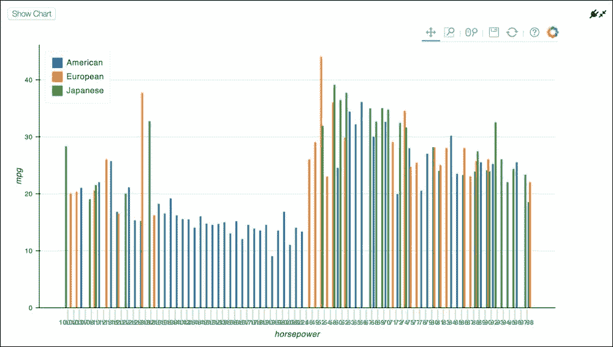

将图表显示为网页

# 总结

在本章中，我们讨论了为什么我们的数据科学工具策略以 Python 和 Jupyter 笔记本为中心的原因。 我们还介绍了 PixieDust 功能，这些功能可通过以下功能提高用户的工作效率：

*   数据加载和清理
*   无需任何编码的数据可视化和探索
*   一个基于 HTML 和 CSS 的简单编程模型称为 PixieApp，用于构建与笔记本直接交互的工具和仪表板
*   一种点击机制，可将图表和 PixieApp 直接发布到 Web

在下一章中，我们将深入研究 PixieApp 编程模型，并通过大量代码示例讨论 API 的各个方面。