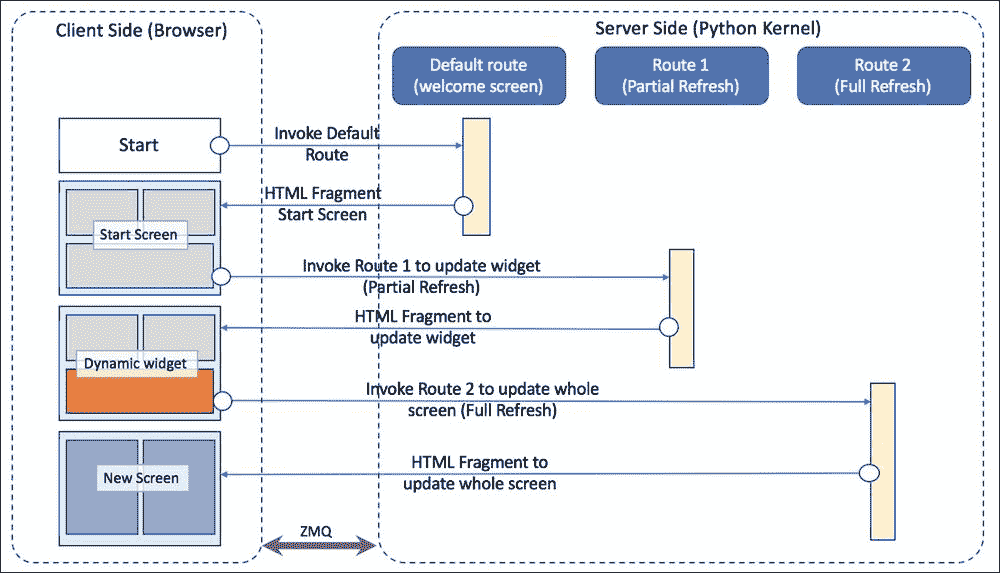
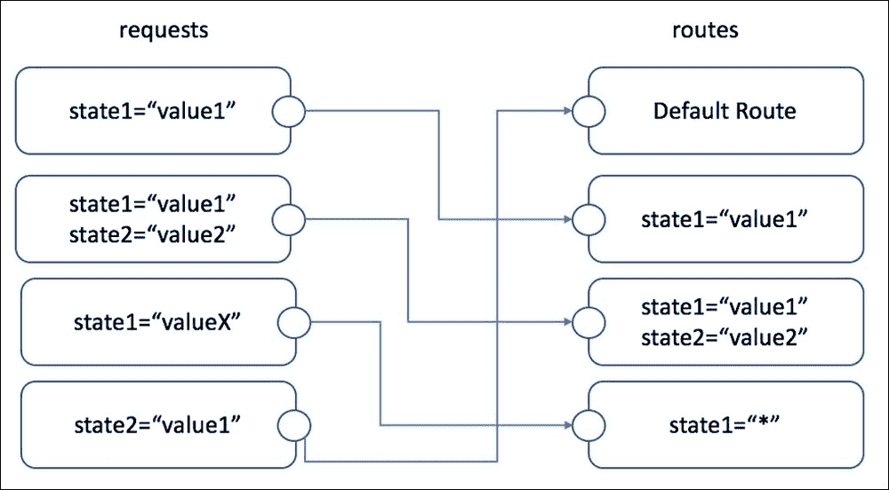
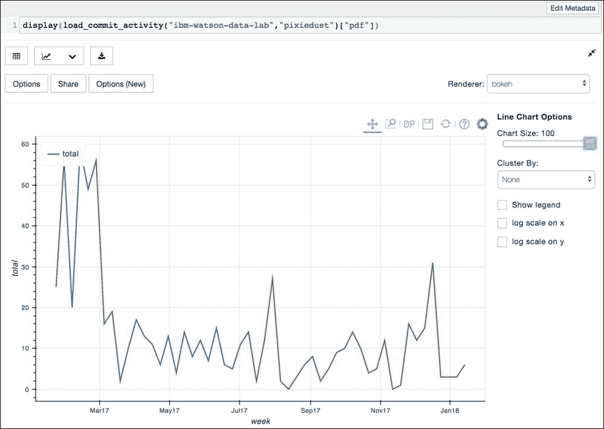
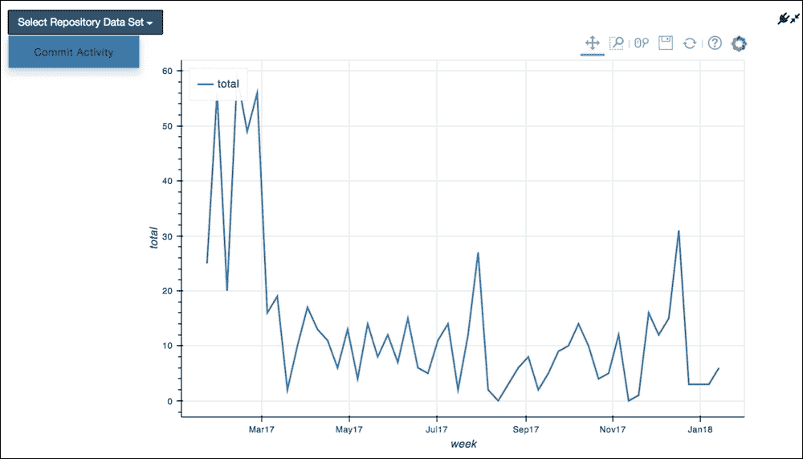

# 第 3 章。PixieApp 深入了解

> “每个视觉都是开玩笑，直到第一个人完成它；一旦意识到，它就变得司空见惯。”

– *Robert H Goddard*

在本章中，我们将对 PixieApp 框架进行技术上的深入研究。 您既可以将以下信息用作*入门*教程，又可以用作 PixieApp 编程模型的参考文档。

在深入探讨 PixieApp 的基本概念（例如路线和请求）之前，我们将首先对它进行剖析。 为了帮助跟进，我们将逐步构建一个 *GitHub Tracking* 示例应用程序，该示例应用程序将在引入功能和最佳实践时应用这些功能和最佳实践，从构建数据分析到将其集成到 PixieApp 中。

在本章的最后，您应该能够将学习到的经验教训应用到您自己的用例中，包括编写自己的 PixieApp。

# PixieApp 的剖析

### 注意

**注**：PixieApp 编程模型不需要任何 JavaScript 经验，但是，希望读者熟悉以下内容：

*   Python（ [https://www.python.org](https://www.python.org) ）
*   HTML5（ [https://www.w3schools.com/html](https://www.w3schools.com/html) ）
*   CSS3（ [https://www.w3schools.com/css](https://www.w3schools.com/css) ）

术语 **PixieApp** 代表 **Pixie Application，**，并且旨在强调其与 PixieDust 功能（尤其是`display()` API）的紧密集成。 其主要目标是使开发人员易于构建可以调用 Jupyter Notebook 中实现的数据分析的用户界面。

PixieApp 遵循**单页应用程序**（ **SPA** ）设计模式（ [https://en.wikipedia.org/wiki/Single-page_application](https://en.wikipedia.org/wiki/Single-page_application) ），其中 向用户显示并带有欢迎屏幕，该屏幕会动态更新以响应用户交互。 更新可以是部分刷新，例如在用户单击控件后更新图形，也可以是完全刷新，例如在多步过程中更新新屏幕。 在每种情况下，更新都是通过使用特定机制触发的路由在服务器端进行控制的，我们将在后面讨论。 触发后，路由将执行代码以处理请求，然后发出 HTML 片段，该片段将应用于正确的目标 DOM 元素（ [https://www.w3schools.com/js/js_htmldom.asp](https://www.w3schools.com/js/js_htmldom.asp) ） 在客户端。

以下序列图显示了运行 PixieApp 时客户端和服务器端如何交互：



序列图显示了 PixieApp 的信息流

启动 PixieApp 时（通过调用`run`方法），将调用默认路由，并返回相应的 HTML 片段。 当用户与应用程序交互时，将执行更多请求，从而触发关联的路由，从而相应刷新 UI。

从实现的角度来看，PixieApp 只是一个普通的 Python 类，已经用`@PixieApp`装饰器装饰了。 在封面下，` PixieApp`装饰器检测该类以添加运行应用程序所需的方法和字段，例如`run`方法。

### 注意

有关 Python 装饰器的更多信息，请参见：

[https://wiki.python.org/moin/PythonDecorators](https://wiki.python.org/moin/PythonDecorators)

要开始启动，下面的代码显示了一个简单的 *Hello World* PixieApp：

```py
#import the pixieapp decorators
from pixiedust.display.app import *

@PixieApp   #decorator for making the class a PixieApp
class HelloWorldApp():
    @route()  #decorator for making a method a route (no arguments means default route)
    def main_screen(self):
        return """<div>Hello World</div>"""

#Instantiate the application and run it
app = HelloWorldApp()
app.run()
```

### 注意

您可以在此处找到代码：

[https://github.com/DTAIEB/Thoughtful-Data-Science/blob/master/chapter%203/sampleCode1.py](https://github.com/DTAIEB/Thoughtful-Data-Science/blob/master/chapter%203/sampleCode1.py)

上面的代码显示了 PixieApp 的结构，如何定义路由以及如何实例化和运行该应用程序。 由于 PixieApps 是常规的 Python 类，因此它们可以从其他类（包括其他 PixieApps）继承而来，这对于大型项目来说很方便，使代码模块化和可重用。

## 路线

路由用于动态更新全部或部分客户端屏幕。 可以根据以下规则在任何类方法上使用`@route`装饰器轻松定义它们：

*   A route method is required to return a string that represents the HTML fragment for the update.

    ### 注意

    **注意** ：允许在片段中使用 CSS 和 JavaScript。

*   `@route`装饰器可以具有一个或多个关键字参数，这些参数必须为 String 类型。 可以将这些关键字参数视为请求参数，PixieApp 框架在内部使用这些参数根据以下规则将的请求分发到最匹配的路由：

    *   带有最多参数的路由始终首先​​被评估。
    *   所有参数都必须匹配才能选择路由。
    *   如果未找到路由，则默认路由被选为后备路由。
    *   可以使用通配符（即`*`）配置路由，在这种情况下，状态参数的任何值都将是匹配项。

        以下是一个示例：

        ```py
               @route(state1="value1", state2="value2")
        ```

*   PixieApp 必须具有一个且只有一个默认路由，即没有参数的路由，即`@route()`。

以不引起冲突的方式配置路由非常重要，尤其是在您的应用程序具有分层状态的情况下。 例如，与`state1="load"`关联的路线可能负责加载数据，然后与`(state1="load", state2="graph")`关联的第二路线可能负责绘制数据。 在这种情况下，同时指定了`state1`和`state2`的请求将匹配第二条路由，因为路由评估是从最具体到最不具体的，并在第一个匹配的路由处停止。

为了明确起见，下图显示了如何将请求与路由匹配：



将请求与路线匹配

定义为路由的方法的预期约定是返回 HTML 片段，其中可以包含 Jinja2 模板构造。 Jinja2 是功能强大的 Python 模板引擎，提供了丰富的功能来动态生成文本，包括对 Python 变量，方法和控制结构的访问，例如`if...else`， `the for`循环等。 涵盖的所有功能将超出本书的范围，但是让我们讨论一些经常使用的重要结构：

### 注意

**注意**：如果您想了解有关 Jinja2 的更多信息，可以在这里阅读完整的文档：

[http://jinja.pocoo.org/docs/templates](http://jinja.pocoo.org/docs/templates)

*   **变量**：您可以使用双花括号来访问范围内的变量，例如`"<div>This is my variable {{my_var}}</div>"`。 在渲染期间，`my_var`变量将替换为其实际值。 您还可以使用`.`（点）表示法访问复杂对象，例如`"<div>This is a nested value {{my_var.sub_value}}</div>"`。
*   **for 循环**：您可以使用`...`表示法通过迭代一系列项目（列表，元组，字典等）来动态生成文本，例如：

    ```py
    
    <li>{{message}}</li>
    
    ```

*   **if 语句**：您可以使用`......…`表示法有条件地输出文本，例如：

    ```py
    
    <div class="error">{{status.error}}</div>
    
    <div class="warning">{{status.warning}}</div>
    
    <div class="ok">{{status.message}}</div>
    
    ```

了解变量和方法如何进入路由返回的 JinJa2 模板字符串的范围也很重要。 PixieApp 自动提供对三种类型的变量和方法的访问：

*   **Class variables and methods** : These are accessible using the `this` keyword.

    ### 注意

    **注意** ：我们之所以不使用更具 Pythonic 风格的 `self` 关键字，是因为 Jinja2 本身已经采用了该关键字。

*   **Method arguments**: This is useful when the route arguments use the `*` value and you want to have access to that value at runtime. In this case, you can add arguments to the method itself using the same name as the one defined in the route arguments and the PixieApp framework will automatically pass the correct value.

    ### 注意

    **注意**：参数的顺序实际上并不重要。 您也不必使用路由中定义的每个参数，如果仅对使用参数的子集感兴趣，这将很方便。

    该变量也将在 Jinja2 模板字符串的范围内，如示例所示：

    ```py
    @route(state1="*", state2="*")
    def my_method(self, state1, state2):
        return "<div>State1 is {{state1}}. State2 is {{state2}}</div>"
    ```

    ### 注意

    您可以在此处找到代码文件：

    [https://github.com/DTAIEB/Thoughtful-Data-Science/blob/master/chapter%203/sampleCode2.py](https://github.com/DTAIEB/Thoughtful-Data-Science/blob/master/chapter%203/sampleCode2.py)

*   **方法**的局部变量：只要您将`@templateArgs`装饰器添加到方法中，PixieApp 就会自动将方法中定义的所有局部变量放在 Jinja2 模板字符串的范围内 在示例中：

    ```py
    @route()
    @templateArgs
    def main_screen(self):
        var1 = self.compute_something()
        var2 = self.compute_something_else()
        return "<div>var1 is {{var1}}. var2 is {{var2}}</div>"
    ```

    ### 注意

    您可以在此处找到代码：

    [https：// github.com/DTAIEB/Thoughtful-Data-Science/blob/master/chapter%203/sampleCode3.py](https://github.com/DTAIEB/Thoughtful-Data-Science/blob/master/chapter%203/sampleCode3.py)

## 生成对路由的请求

如之前提到的，PixieApp 遵循 SPA 设计模式。 加载第一个屏幕后，与多页 Web 应用程序一样，使用动态请求而不是 URL 链接完成与服务器的所有后续交互。 有三种方法可以生成对路由的内核请求：

*   使用`pd_options`自定义属性来定义要传递到服务器的状态列表，如以下示例所示：

    ```py
    pd_options="state1=value1;state2=value2;..;staten=valuen"
    ```

*   如果已经有一个包含`pd_options`值的 JSON 对象（例如，调用`display()`的情况），则必须将其转换为`pd_options` HTML 属性期望的格式，这可能会很耗时。 在这种情况下，将`pd_options`指定为子元素会更方便，这允许将选项直接作为 JSON 对象传递（并避免转换数据的额外工作），如以下示例所示：

    ```py
    <div>
        <pd_options>
            {"state1":"value1","state2":"value2",...,
            "staten":"valuen"}
        </pd_options>
    </div>
    ```

*   通过调用`invoke_route`方法以编程方式，如以下示例所示：

    ```py
    self.invoke_route(self.route_method, state1='value1', state2='value2')
    ```

### 注意

**注意**：如果要从 Jinja2 模板字符串调用此方法，请记住使用`this`而不是`self`，因为`self`已经被 Jinja2 本身使用。

当需要根据用户选择动态计算中传递的状态值时，您需要使用`$val(arg)`特殊指令，该指令充当将在执行内核请求时解析的宏 。

`$val(arg)`指令采用一个参数，该参数可以是以下之一：

*   页面上 HTML 元素的 ID，例如输入或组合框，例如以下示例：

    ```py
    <div>
        <pd_options>
            {"state1":"$val(my_element_id)","state2":"value2"}
        <pd_options>
    </div>
    ```

*   必须返回所需值的 JavaScript 函数，如以下示例所示：

    ```py
    <script>
        function resValue(){
                return "my_query";
        }
    </script>
    ...
    <div pd_options="state1=$val(resValue)"></div>
    ```

### 注意

**注意**：大多数 PixieDust 自定义属性支持使用`$val`指令的动态值。

## 一个 GitHub 项目跟踪示例应用程序

让我们将到目前为止所学到的应用于实现示例应用程序。 为了解决问题，我们想使用 GitHub Rest API（ [https://developer.github.com/v3](https://developer.github.com/v3) ）搜索项目并将结果加载到 pandas DataFrame 中进行分析。

初始代码显示了欢迎屏幕，其中带有一个简单的输入框以输入 GitHub 查询和一个按钮来提交请求：

```py
from pixiedust.display.app import *

@PixieApp
class GitHubTracking():
    @route()
    def main_screen(self):
        return """
<style>
    div.outer-wrapper {
        display: table;width:100%;height:300px;
    }
    div.inner-wrapper {
        display: table-cell;vertical-align: middle;height: 100%;width: 100%;
    }
</style>
<div class="outer-wrapper">
    <div class="inner-wrapper">
        <div class="col-sm-3"></div>
        <div class="input-group col-sm-6">
            <input id="query{{prefix}}" type="text" class="form-control" placeholder="Search projects on GitHub">
            <span class="input-group-btn">
                <button class="btn btn-default" type="button">Submit Query</button>
            </span>
        </div>
    </div>
</div>
"""

app = GitHubTracking()
app.run()
```

### 注意

您可以在此处找到代码文件：

[https://github.com/DTAIEB/Thoughtful-Data-Science/blob/master/chapter%203/sampleCode4.py](https://github.com/DTAIEB/Thoughtful-Data-Science/blob/master/chapter%203/sampleCode4.py)

前面的代码中需要注意的几件事：

*   Jupyter 提供了 Bootstrap CSS 框架（ [https://getbootstrap.com/docs/3.3](https://getbootstrap.com/docs/3.3) ）和 jQuery JS 框架（ [https://jquery.com](https://jquery.com) ）。 ] 笔记本。 我们可以轻松地在代码中使用，而无需安装它们。
*   字体令人敬畏的图标（ [https://fontawesome.com](https://fontawesome.com) ）默认情况下在笔记本电脑中也可用。
*   PixieApp 代码可以在笔记本的多个单元中执行。 由于我们依赖 DOM 元素 ID，因此重要的是要确保两个元素没有相同的 ID，这会导致不良的副作用。 为此，建议始终包含由 PixieDust 框架提供的唯一标识符`{{prefix}}`，例如`"query{{prefix}}"`。

结果显示在以下屏幕截图中：


GitHub Tracking 应用程序的欢迎屏幕

下一步是创建一个采用用户值并返回结果的新路由。 此路由将由**提交查询**按钮调用。

为简单起见，以下代码未使用 Python 库与 GitHub 进行接口，例如 PyGithub（ [http://pygithub.readthedocs.io/en/latest](http://pygithub.readthedocs.io/en/latest) ），相反，我们将 直接调用 GitHub 网站上记录的 REST API：

### 注意

**注意**：当您看到以下表示法`[[GitHubTracking]]`时，这意味着该代码应添加到`GitHubTracking` PixieApp 类中，并且为避免一遍又一遍地重复周围的代码，它具有 被省略。 如有疑问，您可以始终参考本节末尾指定的完整笔记本。

```py
import requests
import pandas
[[GitHubTracking]]
@route(query="*")
@templateArgs
def do_search(self, query):
    response = requests.get( "https://api.github.com/search/repositories?q={}".format(query))
    frames = [pandas.DataFrame(response.json()['items'])]
    while response.ok and "next" in response.links:
        response = requests.get(response.links['next']['url'])
        frames.append(pandas.DataFrame(response.json()['items']))

    pdf = pandas.concat(frames)
    response = requests.get( "https://api.github.com/search/repositories?q={}".format(query))
    if not response.ok:
        return "<div>An Error occurred: {{response.text}}</div>"
    return """<h1><center>{{pdf|length}} repositories were found</center></h1>"""
```

### 注意

您可以在此处找到代码文件：

[https://github.com/DTAIEB/Thoughtful-Data-Science/blob/master/chapter%203/sampleCode5.py](https://github.com/DTAIEB/Thoughtful-Data-Science/blob/master/chapter%203/sampleCode5.py)

在前面的代码中，我们创建了一个名为`do_search`的路由，该路由带有一个名为`query`的参数，用于构建 GitHub 的 API URL。 使用`requests` Python 模块（ [http://docs.python-requests.org](http://docs.python-requests.org) ）向此 URL 发出 GET 请求，我们获得了一个 JSON 有效负载，我们将其转换为 pandas DataFrame。 根据 GitHub 文档，Search API 分页，并将下一页存储在链接的标题中。 该代码使用`while`循环遍历每个链接并将下一页加载到新的 DataFrame 中。 然后，我们将所有 DataFrame 合并为一个`pdf`。 我们剩下要做的就是构建将显示结果的 HTML 片段。 该片段使用 Ji​​nja2 表示法`{{...}}`来访问定义为局部变量的`pdf`变量，这仅能起作用是因为我们在`do_search`方法中使用了`@templateArgs`装饰器。 注意，我们还使用了名为`length`的 Jinja2 过滤器来显示找到的存储库数量：`{{pdf|length}}`。

### 注意

有关过滤器的更多信息，请访问以下网站：

[http://jinja.pocoo.org/docs/templates/#filters](http://jinja.pocoo.org/docs/templates/#filters)

当用户单击**提交查询**按钮时，我们仍然需要调用`do_search`路由。 为此，我们将`pd_options`属性添加到`<button>`元素，如下所示：

```py
<div class="input-group col-sm-6">
    <input id="query{{prefix}}" type="text"
     class="form-control"
     placeholder="Search projects on GitHub">
    <span class="input-group-btn">
        <button class="btn btn-default" type="button" pd_options="query=$val(query{{prefix}})">
            Submit Query
        </button>
    </span>
</div>
```

我们在`pd_options`属性中使用`$val()`指令来动态检索 ID 等于`"query{{prefix}}"`的输入框的值，并将其存储在 query 参数中。

## 在表格中显示搜索结果

前面的代码会一次加载所有数据，因此不建议这样做，因为我们可能会有大量匹配。 同样，一次性显示所有内容会使 UI 缓慢且不实用。 值得庆幸的是，我们可以使用以下步骤轻松地构建分页表，而无需花费太多精力：

1.  创建名为`do_retrieve_page`的路由，该路由以 URL 作为参数并返回表主体的 HTML 片段
2.  将第一个，上一个，下一个和最后一个 URL 保留为 PixieApp 类中的字段
3.  使用`First`，`Prev`，`Next`和`Last`按钮创建一个分页小部件（由于可用，我们将使用 Bootstrap）
4.  使用要显示的列标题创建表占位符

现在，我们将更新`do_search,`的代码，如下所示：

### 注意

**注意**：以下代码引用了`do_retrieve_page`方法，稍后我们将对其进行定义。 在添加`do_retrieve_page`方法之前，请不要尝试按原样运行此代码。

```py
[[GitHubTracking]]
@route(query="*")
@templateArgs
def do_search(self, query):
    self.first_url = "https://api.github.com/search/repositories?q={}".format(query)
    self.prev_url = None
    self.next_url = None
    self.last_url = None

    response = requests.get(self.first_url)
    if not response.ok:
        return "<div>An Error occurred: {{response.text}}</div>"

    total_count = response.json()['total_count']
    self.next_url = response.links.get('next', {}).get('url', None)
    self.last_url = response.links.get('last', {}).get('url', None)
    return """
<h1><center>{{total_count}} repositories were found</center></h1>
<ul class="pagination">
    <li><a href="#" pd_options="page=first_url" pd_target="body{{prefix}}">First</a></li>
    <li><a href="#" pd_options="page=prev_url" pd_target="body{{prefix}}">Prev</a></li>
    <li><a href="#" pd_options="page=next_url" pd_target="body{{prefix}}">Next</a></li>
    <li><a href="#" pd_options="page=last_url" pd_target="body{{prefix}}">Last</a></li>
</ul>
<table class="table">
    <thead>
        <tr>
            <th>Repo Name</th>
            <th>Lastname</th>
            <th>URL</th>
            <th>Stars</th>
        </tr>
    </thead>
    <tbody id="body{{prefix}}">
        {{this.invoke_route(this.do_retrieve_page, page='first_url')}}
    </tbody>
</table>
"""
```

### 注意

您可以在此处找到代码文件：

[https://github.com/DTAIEB/Thoughtful-Data-Science/blob/master/chapter%203/sampleCode6.py](https://github.com/DTAIEB/Thoughtful-Data-Science/blob/master/chapter%203/sampleCode6.py)

前面的代码示例显示了 PixieApps 的一个非常重要的属性，即您可以通过简单地将数据存储到类变量中来维护应用程序整个生命周期中的状态。 在这种情况下，我们使用`self.first_url`，`self.prev_url`，`self.next_url`和`self.last_url`。 这些变量对分页小部件中的每个按钮使用`pd_options`属性，并在每次调用`do_retrieve_page`路由时更新。 `do_search`返回的片段现在返回带有主体占位符的表，该表由`body{{prefix}},`标识，该表成为每个按钮的`pd_target`。 我们还使用`invoke_route`方法来确保在首次显示表格时获得第一页。

我们之前已经看到路由返回的 HTML 片段用于替换整个页面，但是在前面的代码中，我们使用`pd_target="body{{prefix}}"`属性表示 HTML 片段将被注入到表的 body 元素中 具有`body{{prefix}}` ID。 如果需要，您还可以通过创建一个或多个`<target>`元素作为可点击源元素的子元素来为用户操作定义多个目标。 每个`<target>`元素本身都可以使用所有 PixieApp 自定义属性来配置内核请求。

这是一个例子：

```py
<button type="button">Multiple Targets
    <target pd_target="elementid1" pd_options="state1=value1"></target>
    <target pd_target="elementid2" pd_options="state2=value2"></target>
</button>
```

回到我们的 GitHub 示例应用程序，`do_retrieve_page`方法现在看起来像这样：

```py
[[GitHubTracking]]
@route(page="*")
@templateArgs
def do_retrieve_page(self, page):
    url = getattr(self, page)
    if url is None:
        return "<div>No more rows</div>"
    response = requests.get(url)
    self.prev_url = response.links.get('prev', {}).get('url', None)
    self.next_url = response.links.get('next', {}).get('url', None)
    items = response.json()['items']
    return """

<tr>
    <td>{{row['name']}}</td>
    <td>{{row.get('owner',{}).get('login', 'N/A')}}</td>
    <td><a href="{{row['html_url']}}" target="_blank">{{row['html_url']}}</a></td>
    <td>{{row['stargazers_count']}}</td>
</tr>

        """
```

### 注意

您可以在此处找到代码文件：

[https://github.com/DTAIEB/Thoughtful-Data-Science/blob/master/chapter%203/sampleCode7.py](https://github.com/DTAIEB/Thoughtful-Data-Science/blob/master/chapter%203/sampleCode7.py)

`page`参数是一个字符串，其中包含我们要显示的`url`类变量的名称。 我们使用标准的`getattr` Python 函数（ [https://docs.python.org/2/library/functions.html#getattr](https://docs.python.org/2/library/functions.html#getattr) ）从页面获取`url`值。 然后，我们在 GitHub API `url`上发出 GET 请求，以 JSON 格式检索有效负载，并将其传递给 Jinja2 模板以生成将插入表中的行集。 为此，我们使用 Jinja2 中可用的``循环控制结构（ [http://jinja.pocoo.org/docs/templates/#for](http://jinja.pocoo.org/docs/templates/#for) ）生成`<tr>`和`<td>` HTML 标记。

以下屏幕快照显示了查询的搜索结果：`pixiedust`：


屏幕显示查询产生的 GitHub 存储库列表

### 注意

在第 1 部分中，我们展示了如何创建`GitHubTracking` PixieApp，如何调用 GitHub 查询 REST API 以及如何使用分页在表中显示结果。 您可以在此处找到带有源代码的完整笔记本：

`https://github.com/DTAIEB/Thoughtful-Data-Science/blob/master/chapter%203/GitHub%20Tracking%20Application/GitHub%20Sample%20Application%20-%20Part%201.ipynb`

在的下一部分中，我们将探索更多 PixieApp 功能，这些功能将允许我们深入用户到特定存储库并可视化有关存储库的各种统计信息，从而使我们能够改进应用程序。

第一步是在搜索结果表的每一行中添加一个按钮，以触发一条新路径以可视化所选存储库统计信息。

以下代码是`do_search`函数的一部分，并在表头中添加了新列：

```py
<thead>
    <tr>
        <th>Repo Name</th>
        <th>Lastname</th>
        <th>URL</th>
        <th>Stars</th>
 <th>Actions</th>
    </tr>
</thead>
```

为了完成该表，我们更新了`do_retrieve_page`方法以添加一个包含`<button>`元素的新单元格，该单元格具有与`analyse_repo_owner`和`analyse_repo_name`相匹配的新路径的`pd_options`参数。 这些参数的值是从`row`元素中提取的，该元素用于对从 GitHub 请求接收的有效负载进行迭代：

```py

<tr>
    <td>{{row['name']}}</td>
    <td>{{row.get('owner',{}).get('login', 'N/A')}}</td>
    <td><a href="{{row['html_url']}}" target="_blank">{{row['html_url']}}</a></td>
    <td>{{row['stargazers_count']}}</td>
 <td>
 <button pd_options=
 "analyse_repo_owner={{row["owner"]["login"]}};
 analyse_repo_name={{row['name']}}"
 class="btn btn-default btn-sm" title="Analyze Repo">
 <i class="fa fa-line-chart"></i>
 </button>
 </td>
</tr>

```

有了此简单代码更改之后，通过再次运行单元重新启动 PixieApp，我们现在可以看到每个存储库的按钮，即使我们尚未实现相应的路由，也将在下一步实现。 提醒一下，当找不到匹配的路由时，将触发默认路由。

以下屏幕截图显示了带有添加按钮的表：


为每一行添加操作按钮

下一步是创建与“回购可视化”页面关联的路由。 该页面的设计非常简单：用户可以从组合框中选择要在页面上可视化的数据类型。 GitHub REST API 提供了对多种类型数据的访问，但是对于此示例应用程序，我们将使用提交活动数据，该数据属于统计信息类别（请参阅 [https://developer.github.com/v3/ repos / statistics /＃get-commit-activity-data](https://developer.github.com/v3/repos/statistics/#get-the-last-year-of-commit-activity-data) ，以获取此 API 的详细说明）。

### 提示

作为练习，请随时通过添加其他类型的 API 的可视化来改进此示例应用程序，例如 Traffic API（ [https://developer.github.com/v3/repos/traffic](https://developer.github.com/v3/repos/traffic) ）。

还需要注意的是，即使大多数 GitHub API 都无需身份验证即可工作，但如果您不提供凭据，服务器可能会限制响应。 要验证请求的身份，您需要使用 GitHub 密码或通过选择 GitHub **设置**页面上的**开发人员设置**菜单，然后单击 **Personal 来生成个人访问令牌。 访问令牌**菜单，然后单击**生成新令牌按钮**。

在单独的 Notebook 单元中，我们将为 GitHub 用户 ID 和令牌创建两个变量：

```py
github_user = "dtaieb"
github_token = "XXXXXXXXXX"
```

这些变量将在以后用于验证请求。 请注意，即使这些变量是在其自己的单元中创建的，它们也对整个 Notebook 可见，包括 PixieApp 代码。

为了提供良好的代码模块化和重用性，我们将在新类中实现 Repo Visualization 页面，并使我们的主要 PixieApp 类继承自该类并自动重用其路由。 当您开始拥有大型项目并将其分解为多个类时，请牢记这种模式。

“回购可视化”页面的主要路径返回一个 HTML 片段，该片段具有一个下拉菜单和一个用于可视化的`<div>`占位符。 使用 Bootstrap `dropdown`类（ [https://www.w3schools.com/bootstrap/bootstrap_dropdowns.asp](https://www.w3schools.com/bootstrap/bootstrap_dropdowns.asp) ）创建下拉菜单。 为了使代码更易于维护，菜单项是通过在元组数组上使用 Jinja2 ``循环生成的（ [https://docs.python.org/3/tutorial/datastructures.html# 称为`analyses`的元组和序列](https://docs.python.org/3/tutorial/datastructures.html#tuples-and-sequences)，其中包含描述和将数据加载到熊猫 DataFrame 中的函数。 再次在这里，我们在自己的单元格中创建此数组，该数组将在 PixieApp 类中引用：

```py
analyses = [("Commit Activity", load_commit_activity)]
```

### 注意

**注意**：`load_commit_activity`功能将在本节稍后讨论。

出于此示例应用程序的目的，该数组仅包含一个与 commit 活动相关的元素，但是将来您可能添加的任何元素都将由 UI 自动选择。

`do_analyse_repo`路由具有两个参数：`analyse_repo_owner`和`analyse_repo_name,`，足以访问 GitHub API。 我们还需要将这些参数保存为类变量，因为在生成可视化效果的路线中将需要它们：

```py
@PixieApp
class RepoAnalysis():
    @route(analyse_repo_owner="*", analyse_repo_name="*")
    @templateArgs
    def do_analyse_repo(self, analyse_repo_owner, analyse_repo_name):
        self._analyse_repo_owner = analyse_repo_owner
        self._analyse_repo_name = analyse_repo_name
        return """
<div class="container-fluid">
    <div class="dropdown center-block col-sm-2">
        <button class="btn btn-primary dropdown-toggle" type="button" data-toggle="dropdown">
            Select Repo Data Set
            <span class="caret"></span>
        </button>
        <ul class="dropdown-menu" style="list-style:none;margin:0px;padding:0px">
            
                <li>
                    <a href="#" pd_options="analyse_type={{analysis}}" pd_target="analyse_vis{{prefix}}"
                     style="text-decoration: none;background-color:transparent">
                        {{analysis}}
                    </a>
                </li>
            
        </ul>
    </div>
    <div id="analyse_vis{{prefix}}" class="col-sm-10"></div>
</div>
"""
```

### 注意

您可以在此处找到代码文件：

[https://github.com/DTAIEB/Thoughtful-Data-Science/blob/master/chapter%203/sampleCode8.py](https://github.com/DTAIEB/Thoughtful-Data-Science/blob/master/chapter%203/sampleCode8.py)

### 注意

上面的代码中有两点需要注意：

*   即使`analyses`变量未定义为类变量，Jinja2 模板也使用`this`关键字引用`analyses`数组。 之所以有效，是因为 PixieApp 的另一个重要功能：在笔记本本身定义的任何变量都可以被引用，就好像它们是 PixieApp 的类变量一样。
*   我将`analyse_repo_owner`和`analyse_repo_name`存储为具有不同名称的类变量，例如`_analyse_repo_owner`和`_analyse_repo_name`。 这很重要，因为使用相同的名称会对路由匹配算法产生副作用，该算法还会查看类变量以查找参数。 使用相同的名称将导致始终找到此路由，这不是理想的效果。

操作按钮链接由`<a>`标记定义，并使用`pd_options`访问具有一个称为`analyse_type`以及`pd_target`指向`"analyse_vis{{prefix}}"`占位符`<div>,`的自变量的路由。 在以下相同的 HTML 片段中定义。

## 使用 pd_entity 属性调用 PixieDust display（）API

当使用`pd_options`属性创建内核请求时，PixieApp 框架将当前 PixieApp 类用作目标。 但是，您可以通过指定`pd_entity`属性来更改此目标。 例如，您可以指向另一个 PixieApp，或更有趣的是，指向`display()` API 支持的数据结构，例如熊猫或 Spark DataFrame。 在这种情况下，如果您提供了`display()` API 预期的正确选项，则生成的输出将为图表本身（对于 Matplotlib，为图像；对于 Mapbox，为 Iframe；对于 Mapbox，则为 SVG 散景）。 一种获取正确选项的简单方法是在其自己的单元格中调用`display()` API，使用菜单将其配置为所需的图表，然后通过单击**编辑元数据**复制可用的单元格元数据 JSON 片段。 按钮。 （您可能首先需要使用菜单**视图** | **单元格工具栏** | **编辑元数据**来启用按钮）。

您也可以指定`pd_entity`，不带任何值。 在这种情况下，PixieApp 框架将使用传递为用于启动 PixieApp 应用程序的`run`方法的第一个参数的实体。 例如，以`cars`为熊猫的`my_pixieapp.run(cars)`或通过`pixiedust.sampleData()`方法创建的 Spark DataFrame。 `pd_entity`的值也可以是返回实体的函数调用。 当您要在渲染之前动态计算实体时，这很有用。 与其他变量一样，`pd_entity`的范围可以是 PixieApp 类或在 Notebook 中声明的任何变量。

例如，我们可以在其自己的单元格中创建一个函数，该函数将前缀作为参数并返回 pandas DataFrame。 然后我们将其用作我的 PixieApp 中的`pd_entity`值，如以下代码所示：

```py
def compute_pdf(key):
    return pandas.DataFrame([
        {"col{}".format(i): "{}{}-{}".format(key,i,j) for i in range(4)} for j in range(10)
    ])
```

### 注意

您可以在此处找到代码文件：

[https://github.com/DTAIEB/Thoughtful-Data-Science/blob/master/chapter%203/sampleCode9.py](https://github.com/DTAIEB/Thoughtful-Data-Science/blob/master/chapter%203/sampleCode9.py)

在前面的代码中，我们使用 Python 列表推导（ [https://docs.python.org/2/tutorial/datastructures.html#list-comprehensions](https://docs.python.org/2/tutorial/datastructures.html#list-comprehensions) ）快速基于`key`生成模拟数据 争论。

### 注意

Python 列表推导是我最喜欢的 Python 语言功能之一，因为它们使您可以使用表达简洁的语法来创建，转换和提取数据。

我可以然后创建一个 PixieApp，使用`compute_pdf`函数作为`pd_entity`将数据呈现为表格：

```py
from pixiedust.display.app import *
@PixieApp
class TestEntity():
    @route()
    def main_screen(self):
        return """
        <h1><center>
            Simple PixieApp with dynamically computed dataframe
        </center></h1>
        <div pd_entity="compute_pdf('prefix')" pd_options="handlerId=dataframe" pd_render_onload></div>
        """
test = TestEntity()
test.run()
```

### 注意

您可以在此处找到代码文件：

[https://github.com/DTAIEB/Thoughtful-Data-Science/blob/master/chapter%203/sampleCode10.py](https://github.com/DTAIEB/Thoughtful-Data-Science/blob/master/chapter%203/sampleCode10.py)

在前面的代码中，为简单起见，我将密钥硬编码为`'prefix'`，然后将其作为练习使用输入控件和`$val()`指令使其可用户定义。

值得注意的另一件事是在显示图表的 div 中使用`pd_render_onload`属性。 此属性告诉 PixieApp 在将元素加载到浏览器 DOM 中后立即执行该元素定义的内核请求。

以下屏幕快照显示了先前 PixieApp 的结果：


在 PixieApp 中动态创建 DataFrame

回到我们的 *GitHub Tracking* 应用程序，现在让我们将`pd_entity`值应用于从 GitHub Statistics API 加载的 DataFrame 。 我们创建了一个称为`load_commit_activity,`的方法，该方法负责将数据加载到 pandas DataFrame 中，并将其与显示图表所需的`pd_options`一起返回：

```py
from datetime import datetime
import requests
import pandas
def load_commit_activity(owner, repo_name):
    response = requests.get(
        "https://api.github.com/repos/{}/{}/stats/commit_activity".format(owner, repo_name),
        auth=(github_user, github_token)
    ).json()
    pdf = pandas.DataFrame([
        {"total": item["total"], "week":datetime.fromtimestamp(item["week"])} for item in response
    ])

    return {
        "pdf":pdf,
        "chart_options": {
          "handlerId": "lineChart",
          "keyFields": "week",
          "valueFields": "total",
          "aggregation": "SUM",
          "rendererId": "bokeh"
        }
    }
```

### 注意

您可以在此处找到代码文件：

[https://github.com/DTAIEB/Thoughtful-Data-Science/blob/master/chapter%203/sampleCode11.py](https://github.com/DTAIEB/Thoughtful-Data-Science/blob/master/chapter%203/sampleCode11.py)

前面的代码将 GET 请求发送到 GitHub，并使用在笔记本开始时设置的`github_user`和`github_token`变量进行身份验证。 响应是一个 JSON 有效负载，我们将使用它创建一个熊猫 DataFrame。 在创建 DataFrame 之前，我们需要将 JSON 有效负载转换为正确的格式。 现在，有效负载如下所示：

```py
[
{"days":[0,0,0,0,0,0,0],"total":0,"week":1485046800},
{"days":[0,0,0,0,0,0,0],"total":0,"week":1485651600},
{"days":[0,0,0,0,0,0,0],"total":0,"week":1486256400},
{"days":[0,0,0,0,0,0,0],"total":0,"week":1486861200}
...
]
```

我们需要删除`days`键，因为它不需要显示图表，并且，为了正确显示图表，我们需要将`week`键的值（它是 Unix 时间戳）转换为 Python `datetime`对象 。 这种转换是通过 Python 列表理解和简单的代码行完成的：

```py
[{"total": item["total"], "week":datetime.fromtimestamp(item["week"])} for item in response]
```

在当前实现中，`load_commit_activity`函数在其自己的单元格中定义，但我们也可以将其定义为 PixieApp 的成员方法。 最佳实践是使用自己的单元非常方便，因为我们可以对功能进行单元测试并对其进行快速迭代，而不会产生每次运行完整应用程序的开销。

要获取`pd_options`值，我们可以简单地使用示例回购信息运行该函数，然后在单独的单元格中调用`display()` API：



在单独的单元格中使用 display（）获取可视化配置

要获取上述图表，您需要选择**折线图**，然后在**选项**对话框中，将`week`列拖放到**键[** 框和`total`列到 **Values** 框。 您还需要选择 Bokeh 作为渲染器。 完成后，请注意，PixieDust 将自动检测到 *x* 轴为日期时间，并将相应地调整渲染。

使用**编辑元数据**按钮，我们现在可以复制图表选项 JSON 片段：


捕获 display（）JSON 配置

然后在`load_commit_activity`有效载荷中返回它：

```py
return {
        "pdf":pdf,
        "chart_options": {
          "handlerId": "lineChart",
          "keyFields": "week",
          "valueFields": "total",
          "aggregation": "SUM",
          "rendererId": "bokeh"
        }
    }
```

现在，我们准备在`RepoAnalysis`类中实现`do_analyse_type`路由，如以下代码所示：

```py
[[RepoAnalysis]]
@route(analyse_type="*")
@templateArgs
def do_analyse_type(self, analyse_type):
    fn = [analysis_fn for a_type,analysis_fn in analyses if a_type == analyse_type]
    if len(fn) == 0:
        return "No loader function found for {{analyse_type}}"
    vis_info = fn[0](self._analyse_repo_owner, self._analyse_repo_name)
    self.pdf = vis_info["pdf"]
    return """
    <div pd_entity="pdf" pd_render_onload>
        <pd_options>{{vis_info["chart_options"] | tojson}}</pd_options>
    </div>
    """
```

### 注意

您可以在此处找到代码文件：

[https://github.com/DTAIEB/Thoughtful-Data-Science/blob/master/chapter%203/sampleCode12.py](https://github.com/DTAIEB/Thoughtful-Data-Science/blob/master/chapter%203/sampleCode12.py)

路由有一个名为`analyse_type,`的参数，我们将其用作在`analyses`数组中查找 load 函数的键（注意，我再次使用列表推导来快速进行搜索）。 然后，我们调用传递回购所有者和名称的此函数来获取`vis_info` JSON 有效负载，并将 pandas DataFrame 存储到名为`pdf`的类变量中。 然后，返回的 HTML 片段将`pdf`用作`pd_entity`值，将`vis_info["chart_options"]`用作`pd_optio` `ns`。 在这里，我使用`tojson` Jinja2 过滤器（ [http://jinja.pocoo.org/docs/templates/#list-of-builtin-filters](http://jinja.pocoo.org/docs/templates/#list-of-builtin-filters) ）来确保在生成的 HTML 中正确进行了转义 。 即使已在堆栈上声明了`vis_info`变量，也允许我使用它，因为我为函数使用了`@templateArgs`装饰器。

在测试改进的应用程序之前，要做的最后一件事是确保主要的`GitHubTracking` PixieApp 类继承自`RepoAnalysis` PixieApp：

```py
@PixieApp
class GitHubTracking(RepoAnalysis):
    @route()
    def main_screen(self):
        <<Code omitted here>>

    @route(query="*")
    @templateArgs
    def do_search(self, query):
        <<Code omitted here>>

    @route(page="*")
    @templateArgs
    def do_retrieve_page(self, page):
        <<Code omitted here>>

app = GitHubTracking()
app.run()
```

### 注意

您可以在此处找到代码文件：

[https://github.com/DTAIEB/Thoughtful-Data-Science/blob/master/chapter%203/sampleCode13.py](https://github.com/DTAIEB/Thoughtful-Data-Science/blob/master/chapter%203/sampleCode13.py)

“回购分析”页面的屏幕快照如下所示：



GitHub 回购提交活动可视化

### 注意

如果您想进一步试验，可以在此处找到 *GitHub Tracking 应用程序*第 2 部分的完整笔记本：

[https://github.com/DTAIEB/Thoughtful-Data-Science/blob/master/chapter%203/GitHub%20Tracking%20Application/GitHub%20Sample%20Application%20-%20Part%202.ipynb](https://github.com/DTAIEB/Thoughtful-Data-Science/blob/master/chapter%203/GitHub%20Tracking%20Application/GitHub%20Sample%20Application%20-%20Part%202.ipynb)

## 使用 pd_script 调用任意 Python 代码

在此部分中，我们研究`pd_script`定制属性，该属性使您可以在触发内核请求时运行任意 Python 代码。 有一些规则可以控制 Python 代码的执行方式：

*   该代码可以使用`self`关键字以及在 Notebook 中定义的任何变量，函数和类访问 PixieApp 类，如以下示例所示：

    ```py
    <button type="submit" pd_script="self.state='value'">Click me</button>
    ```

*   如果指定了`pd_target`，则在`target`元素中将输出使用`print`函数的任何语句。 如果不存在`pd_target`，则不是这种情况。 换句话说，您不能使用`pd_script`进行整页刷新（您必须使用`pd_options`属性），例如：

    ```py
    from pixiedust.display.app import *

    def call_me():
        print("Hello from call_me")

    @PixieApp
    class Test():
        @route()
        def main_screen(self):
            return """
            <button type="submit" pd_script="call_me()" pd_target="target{{prefix}}">Click me</button>

            <div id="target{{prefix}}"></div>
            """
    Test().run()
    ```

    ### 注意

    您可以在此处找到的代码文件：

    [https://github.com/DTAIEB/Thoughtful-Data-Science/blob/master/chapter ％203 / sampleCode14.py](https://github.com/DTAIEB/Thoughtful-Data-Science/blob/master/chapter%203/sampleCode14.py)

*   如果代码包含多行，建议使用`pd_script`子元素，它使您可以使用多行编写 Python 代码。 使用此格式时，请确保代码遵循缩进的 Python 语言规则，例如：

    ```py
    @PixieApp
    class Test():
        @route()
        def main_screen(self):
            return """
            <button type="submit" pd_script="call_me()" pd_target="target{{prefix}}">
                <pd_script>
                    self.name="some value"
                    print("This is a multi-line pd_script")
                </pd_script>
                Click me
            </button>

            <div id="target{{prefix}}"></div>
            """
    Test().run()
    ```

### 注意

您可以在此处找到代码文件：

[https://github.com/DTAIEB/Thoughtful-Data-Science/blob/master/chapter%203/sampleCode15.py](https://github.com/DTAIEB/Thoughtful-Data-Science/blob/master/chapter%203/sampleCode15.py)

`pd_script`的一种常见用例是在触发内核请求之前更新服务器上的某些状态。 通过添加复选框在折线图和数据统计摘要之间切换可视化，让我们将此技术应用于 *GitHub Tracking* 应用程序。

在`do_analyse_repo`返回的 HTML 片段中，我们添加了用于在图表和统计信息摘要之间切换的复选框元素：

```py
[[RepoAnalysis]]
...
return """
<div class="container-fluid">
    <div class="col-sm-2">
        <div class="dropdown center-block">
            <button class="btn btn-primary
             dropdown-toggle" type="button"
             data-toggle="dropdown">
                Select Repo Data Set
                <span class="caret"></span>
            </button>
            <ul class="dropdown-menu"
             style="list-style:none;margin:0px;padding:0px">
                
                    <li>
                        <a href="#"
                        pd_options="analyse_type={{analysis}}"
                        pd_target="analyse_vis{{prefix}}"
                        style="text-decoration: none;background-color:transparent">
                            {{analysis}}
                        </a>
                    </li>
                
            </ul>
        </div>
        <div class="checkbox">
            <label>
                <input id="show_stats{{prefix}}" type="checkbox"
                  pd_script="self.show_stats=('$val(show_stats{{prefix}})' == 'true')">
                Show Statistics
            </label>
        </div>
    </div>
    <div id="analyse_vis{{prefix}}" class="col-sm-10"></div>
</div>
"""
```

在`checkbox`元素中，包含`pd_script`属性，该属性根据`checkbox`元素的状态修改服务器上的变量状态。 我们使用`$val()`指令检索`show_stats_{{prefix}}`元素的值，并将其与`true string`进行比较。 当用户单击复选框时，服务器上的状态将立即更改，并且当用户下次单击菜单时，将显示统计信息而不是图表。

现在，我们需要更改`do_analyse_type`路由以动态配置`pd_entity`和`chart_options`：

```py
[[RepoAnalysis]]
@route(analyse_type="*")
@templateArgs
def do_analyse_type(self, analyse_type):
    fn = [analysis_fn for a_type,analysis_fn in analyses if a_type == analyse_type]
    if len(fn) == 0:
        return "No loader function found for {{analyse_type}}"
    vis_info = fn[0](self._analyse_repo_owner, self._analyse_repo_name)
    self.pdf = vis_info["pdf"]
    chart_options = {"handlerId":"dataframe"} if self.show_stats else vis_info["chart_options"]
    return """
    <div pd_entity="get_pdf()" pd_render_onload>
        <pd_options>{{chart_options | tojson}}</pd_options>
    </div>
    """
```

### 注意

您可以在这里找到文件：

[https://github.com/DTAIEB/Thoughtful-Data-Science/blob/master/chapter%203/sampleCode16.py](https://github.com/DTAIEB/Thoughtful-Data-Science/blob/master/chapter%203/sampleCode16.py)

`chart_options`现在是一个局部变量，如果`show_stats`为`true`，则包含显示为表格的选项；如果不是，则包含常规折线图选项。

`pd_entity`现在设置为`get_pdf()`方法，该方法负责基于`show_stats`变量返回适当的 DataFrame：

```py
def get_pdf(self):
    if self.show_stats:
        summary = self.pdf.describe()
        summary.insert(0, "Stat", summary.index)
        return summary
    return self.pdf
```

### 注意

您可以在此处找到代码文件：

[https://github.com/DTAIEB/Thoughtful-Data-Science/blob/master/chapter%203/sampleCode17.py](https://github.com/DTAIEB/Thoughtful-Data-Science/blob/master/chapter%203/sampleCode17.py)

我们使用大熊猫`describe()`方法（ [https://pandas.pydata.org/pandas-docs/stable/genic/pandas.DataFrame.describe.html](https://pandas.pydata.org/pandas-docs/stable/generated/pandas.DataFrame.describe.html) ）返回包含摘要的 DataFrame 统计信息，例如计数，均值，标准差等。 我们还确保此 DataFrame 的第一列包含统计信息的名称。

我们需要做的最后一个更改是初始化`show_stats`变量，因为如果不这样做，那么第一次检查它时，我们会得到`AttributeError`异常。

由于使用`@PixieApp`装饰器的内部机制，因此无法使用`__init__`方法来初始化变量。 相反，PixieApp 编程模型要求您使用一种称为`setup,`的方法，该方法可以确保在应用程序启动时被调用：

```py
@PixieApp
class RepoAnalysis():
    def setup(self):
        self.show_stats = False
    ...
```

### 注意

**注意**：如果您有一个从其他 PixieApps 继承的类，则 PixieApp 框架将使用它们的出现顺序自动从基类中调用所有`setup`函数。

以下屏幕截图显示了正在显示的摘要统计信息：


GitHub 存储库的摘要统计信息

### 注意

您可以在此处找到 *GitHub Tracking* 应用程序第 3 部分的完整笔记本：

[https://github.com/DTAIEB/Thoughtful-Data-Science/blob/master/chapter%203/GitHub%20Tracking%20Application/GitHub%20Sample%20Application%20-%20Part%203.ipynb](https://github.com/DTAIEB/Thoughtful-Data-Science/blob/master/chapter%203/GitHub%20Tracking%20Application/GitHub%20Sample%20Application%20-%20Part%203.ipynb)

## 使用 pd_refresh 使应用程序响应更快

我们希望通过使**显示统计信息**按钮直接显示统计信息表格，而不是让用户再次单击菜单来改善用户体验。 类似于加载**提交活动**的菜单，我们可以向复选框添加`pd_options`属性，其中`pd_target`属性指向`analyse_vis{{prefix}}`元素。 无需在触发新显示的每个控件中复制`pd_options`，我们可以将其添加到`analyse_vis{{prefix}}`一次，并使用`pd_refresh`属性对其进行更新。

下图显示了两种设计之间的差异：


有和没有 pd_refresh 的序列图

在这两种情况下，步骤 1 都是在服务器端更新某些状态。 在步骤 2 中显示的**控件**调用路由的情况下，请求规范存储在控件本身中，触发步骤 3，该步骤将生成 HTML 片段并将其注入目标元素中 。 使用`pd_refresh`，控件不知道`pd_options`来调用路由，相反，它仅使用`pd_refresh`来向目标元素发信号，从而依次调用路由。 在这种设计中，我们只需要在目标元素中指定一次请求，并且用户控件只需要在触发刷新之前更新状态即可。 这使实现更易于维护。

为了更好地理解两种设计之间的差异，让我们比较`RepoAnalysis`类中的两种实现。

对于 **Analysis** 菜单，更改如下：

之前，控件触发了`analyse_type`路由，将`{{analysis}}`选择作为内核请求的一部分传递给了`analyse_vis{{prefix}}`：

```py
<a href="#" pd_options="analyse_type={{analysis}}"
            pd_target="analyse_vis{{prefix}}"
            style="text-decoration: none;background-color:transparent">
      {{analysis}}
</a>
```

之后，控件现在将选择状态存储为类字段，并要求`analyse_vis{{prefix}}`元素刷新自身：

```py
<a href="#" pd_script="self.analyse_type='{{analysis}}'"
 pd_refresh="analyse_vis{{prefix}}"
 style="text-decoration: none;background-color:transparent">
    {{analysis}}
</a>
```

同样，**显示统计信息**复选框的更改如下：

在复选框之前，只需在类中设置`show_stats`状态即可； 用户必须再次单击菜单以获得可视化效果：

```py
<div class="checkbox">
    <label>
        <input type="checkbox"
         id="show_stats{{prefix}}"
pd_script="self.show_stats='$val(show_stats{{prefix}})'=='true'">
        Show Statistics
    </label>
</div>
```

之后，由于具有`pd_refresh`属性，因此一旦选中该复选框，可视化文件就会更新：

```py
<div class="checkbox">
    <label>
        <input type="checkbox"
         id="show_stats{{prefix}}"
  pd_script="self.show_stats='$val(show_stats{{prefix}})'=='true'"
         pd_refresh="analyse_vis{{prefix}}">
         Show Statistics
    </label>
</div>
```

最后，`analyse_vis{{prefix}}`元素的更改如下：

之前，该元素不知道如何更新自身，它依靠其他控件将请求定向到适当的路由：

```py
<div id="analyse_vis{{prefix}}" class="col-sm-10"></div>
```

之后，元素将携带内核配置以进行自我更新。 任何控件现在都可以更改状态并调用刷新：

```py
<div id="analyse_vis{{prefix}}" class="col-sm-10"
     pd_options="display_analysis=true"
     pd_target="analyse_vis{{prefix}}">
</div>
```

### 注意

您可以在以下位置找到 *GitHub Tracking* 应用程序第 4 部分的完整笔记本：

[https://github.com/DTAIEB/Thoughtful-Data-Science/blob/master/chapter%203/GitHub%20Tracking%20Application/GitHub%20Sample%20Application%20-%20Part%204.ipynb](https://github.com/DTAIEB/Thoughtful-Data-Science/blob/master/chapter%203/GitHub%20Tracking%20Application/GitHub%20Sample%20Application%20-%20Part%204.ipynb)

## 创建可重用的小部件

PixieApp 编程模型提供了一种机制，用于将 HTML 和复杂 UI 构造的逻辑打包到一个小部件中，可以轻松地从其他 PixieApps 中调用该小部件。 创建窗口小部件的步骤如下：

1.  创建一个将包含小部件的 PixieApp 类。
2.  Create a route with a special `widget` attribute, as in the example:

    ```py
    @route(widget="my_widget")
    ```

    这将是小部件的起始路径。

3.  创建从小部件 PixieApp 类继承的使用者 PixieApp 类。
4.  通过使用`pd_widget`属性从`<div>`元素调用窗口小部件。

这是的示例，介绍如何创建小部件和使用者 PixieApp 类：

```py
from pixiedust.display.app import *

@PixieApp
class WidgetApp():
    @route(widget="my_widget")
    def widget_main_screen(self):
        return "<div>Hello World Widget</div>"

@PixieApp
class ConsumerApp(WidgetApp):
    @route()
    def main_screen(self):
        return """<div pd_widget="my_widget"></div>"""

ConsumerApp.run()
```

### 注意

您可以在此处找到代码：

[https://github.com/DTAIEB/Thoughtful-Data-Science/blob/master/chapter%203/sampleCode18.py](https://github.com/DTAIEB/Thoughtful-Data-Science/blob/master/chapter%203/sampleCode18.py)

# 摘要

在本章中，我们介绍了 PixieApp 编程模型的基本构建模块，使您可以直接在 Notebook 中创建强大的工具和仪表板。

我们还通过展示如何构建 *GitHub Tracking* 示例应用程序（包括详细的代码示例）来说明 PixieApp 的概念和技术。 最佳做法和更高级的 PixieApp 概念将在[第 5 章](05.html#173722-6bf9b9b4cfde46e3ba53bd8d61355763 "Chapter 5. Best Practices and Advanced PixieDust Concepts")，*最佳做法和高级 PixieDust 概念*中进行介绍，包括事件，流和调试。

到目前为止，您应该希望对 Jupyter Notebooks，PixieDust 和 PixieApps 如何使数据科学家和开发人员能够通过单一工具（例如 Jupyter Notebook）进行协作来帮助弥合数据科学家和开发人员之间的差距有所了解。

在下一章中，我们将展示如何从 Notebook 中释放 PixieApp 并使用 PixieGateway 微服务服务器将其发布为 Web 应用程序。