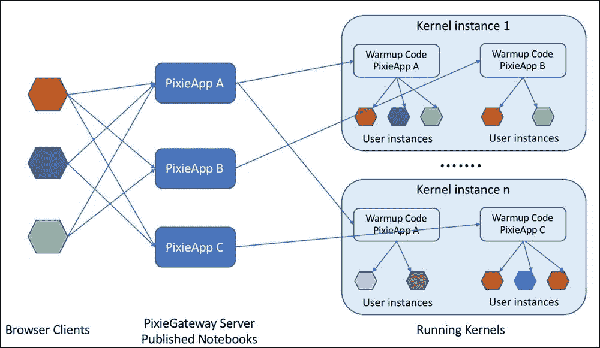
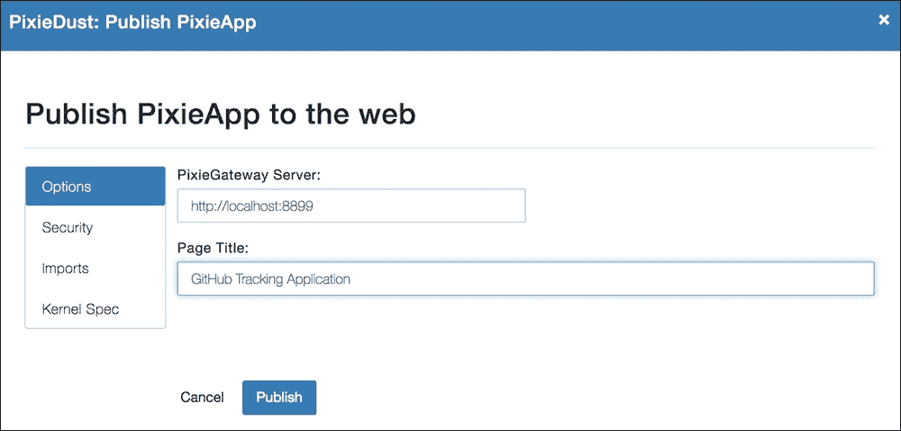
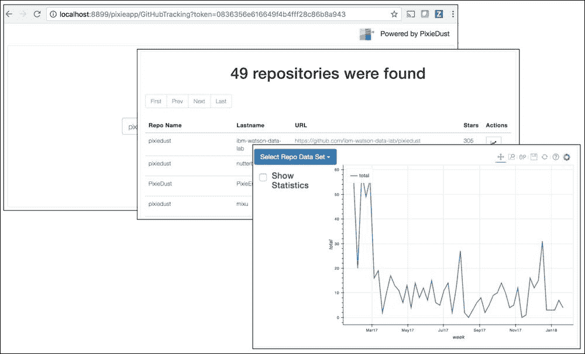
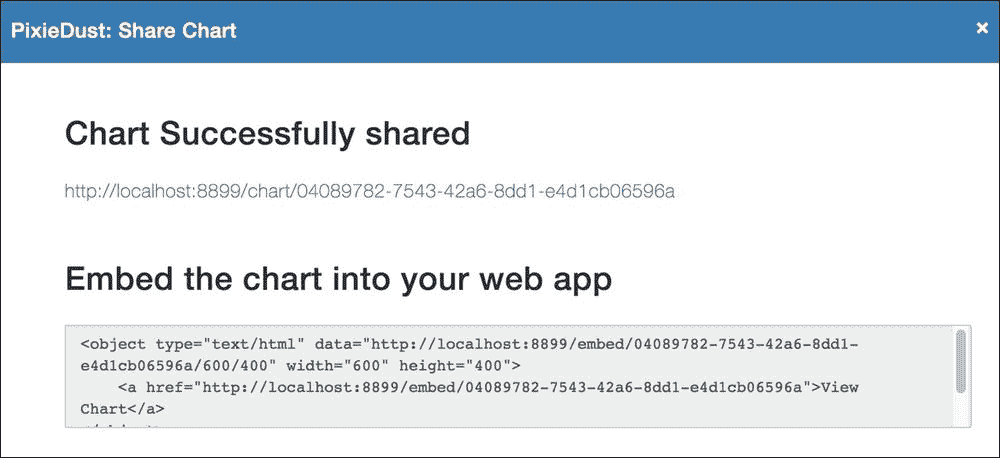
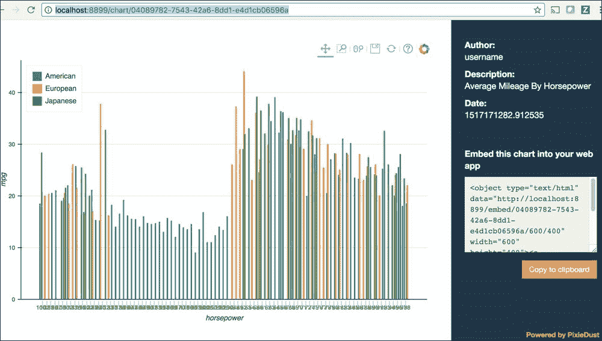
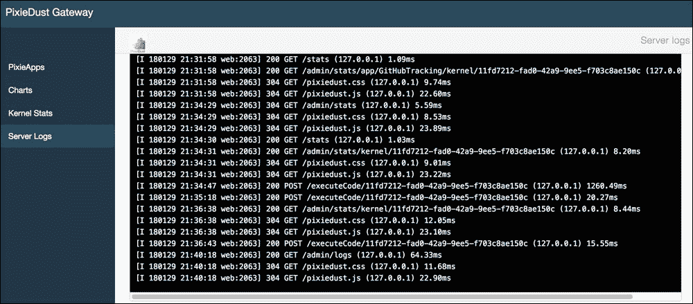
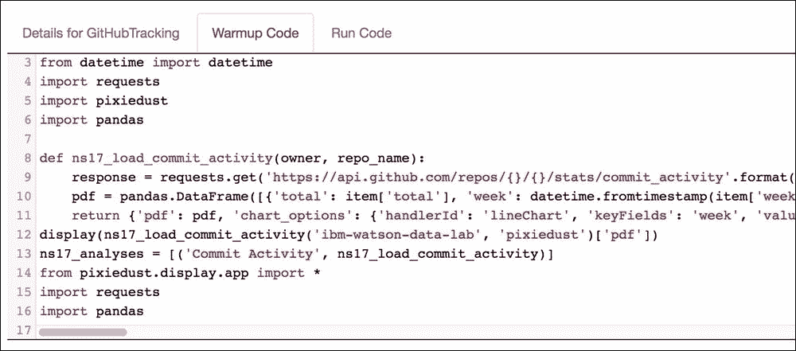

# 第 4 章。使用 PixieGateway 服务器将 PixieApp 部署到 Web

> “我认为数据是讲故事的最强大机制之一。我收集了大量的数据，然后尝试将其用于讲故事。”

– *Steven Levitt* ， *Freakonomics* 的合著者

在上一章中，我们讨论了 Jupyter Notebook 与 PixieDust 结合如何通过简单的 API 加速您的数据科学项目，这些 API 使您无需编写大量代码即可加载，清理和可视化数据，以及使数据科学家与 PixieApps 开发人员。 在本章中，我们将展示如何通过使用 PixieGateway 服务器将其发布为 Web 应用程序，从 Jupyter Notebook *中释放*您的 PixieApps 和关联的数据分析。 笔记本电脑的这种操作方式对于想要使用 PixieApps 的业务用户角色（业务分析师，C-Suite 高管等等）特别有吸引力，但他们与数据科学家或开发人员不同，可能不喜欢使用 Jupyter 笔记本这样做。 相反，他们希望将其作为经典的 Web 应用程序来访问，或者可能类似于 YouTube 视频一样将其嵌入到博客文章或 GitHub 页面中。 使用网站或博客文章，可以轻松传达有价值的见解和从数据分析中提取的其他结果。

到本章末，您将能够在本地安装和配置 PixieGateway 服务器实例以进行测试，也可以在云中的 Kubernetes 容器中进行安装和配置以进行生产。 对于不熟悉 Kubernetes 的那些读者，我们将在下一部分中介绍这些基础知识。

我们将在本章中介绍的 PixieGateway 服务器的另一个主要功能是可以轻松共享使用 PixieDust `display()` API 创建的图表的功能。 我们将展示如何将其发布为网页，您的团队只需单击一个按钮即可访问。 最后，我们将介绍 PixieGateway 管理控制台，该控制台可让您管理应用程序，图表，内核，服务器日志以及对内核执行临时代码请求的 Python 控制台。

### 注意

[**注意**：PixieGateway 服务器是 PixieDust 的子组件，可以在这里找到其源代码](https://github.com/pixiedust/pixiegateway)。

# Kubernetes 概述

[Kubernetes](https://kubernetes.io) 是一个可扩展开源系统，用于自动化和协调容器化应用程序的部署和管理，在云服务中非常流行 提供者。 尽管支持其他类型的容器，但它最常用于 [Docker 容器](https://www.docker.com)。 在开始之前，您需要访问已配置为作为 Kubernetes 群集的一组计算机； [您可以在此处找到有关如何创建此类集群的教程](https://kubernetes.io/docs/tutorials/kubernetes-basics)。

如果您没有计算机资源，那么一个好的解决方案是使用提供 Kubernetes 服务的公共云供应商，例如 [Amazon AWS EKS](https://aws.amazon.com/eks)，[Microsoft Azure](https://azure.microsoft.com/en-us/services/container-service/kubernetes) 或 [IBM Cloud Kubernetes Service](https://www.ibm.com/cloud/container-service)。

为了更好地了解 Kubernetes 集群是如何工作的，让我们看下图所示的高级架构：


Kubernetes 高级架构

在堆栈的顶部，我们具有`kubectl`命令行工具，该工具使用户能够通过向 **Kubernetes 主节点**发送命令来管理 Kubernetes 集群。 `kubectl`命令使用以下语法：

```py
kubectl [command] [TYPE] [NAME] [flags]

```

在哪里：

*   `command`：这指定操作，例如`create`，`get`，`describe`和`delete`
*   `TYPE`：这指定资源类型，例如`pods`，`nodes`和`services`
*   `NAME`：这指定资源的名称
*   `flags`：这指定了特定于操作的可选标志

### 注意

[有关如何使用`kubectl,`的更多信息，请访问以下网站](https://kubernetes.io/docs/reference/kubectl/overview)。

工作节点中存在的另一个重要组件是 **kubelet**，它通过从 **kube API 服务器**读取 pod 配置来控制 pod 的生命周期。 它还负责与主节点的通信。 kube-proxy 根据主节点中指定的策略在所有 Pod 之间提供负载平衡功能，从而确保整个应用程序的高可用性。

在下一节中，我们将讨论安装和配置 PixieGateway 服务器的不同方法，包括使用 Kubernetes 集群的一种方法。

# 安装和配置 PixieGateway 服务器

在深入探讨技术细节之前，最好部署一个 PixieGateway 服务器实例进行尝试。

您可以尝试的安装有主要两种类型：本地安装和服务器安装。

**本地安装**：使用此方法进行测试和开发。

对于这一部分，我强烈建议您使用 [Anaconda 虚拟环境](https://conda.io/docs/user-guide/tasks/manage-environments.html)，因为它们可以很好地隔离环境，从而可以 您可以使用不同版本和配置的 Python 包进行实验。

如果要管理多个环境，则可以使用以下命令获取所有可用环境的列表：

```py
conda env list

```

首先，通过终端使用以下命令选择所需的环境：

```py
source activate <<my_env>>

```

您应该在终端中看到您的环境名称，这表明您已正确激活它。

接下来，通过运行以下命令从 PyPi 安装`pixiegateway`软件包：

```py
pip install pixiegateway

```

### 注意

[**注意**：您可以在此处找到有关 PyPi 上`pixiegateway`软件包的更多信息](https://pypi.python.org/pypi/pixiegateway)。

一旦所有依赖项都已安装，就可以启动服务器了。 假设您要使用`8899 port`，则可以使用以下命令启动 PixieGateway 服务器：

```py
jupyter pixiegateway --port=8899

```

示例输出应如下所示：

```py
(dashboard) davids-mbp-8:pixiegateway dtaieb$ jupyter pixiegateway --port=8899
Pixiedust database opened successfully
Pixiedust version 1.1.10
[PixieGatewayApp] Jupyter Kernel Gateway at http://127.0.0.1:8899

```

### 注意

**注意**：要停止 PixieGateway 服务器，只需从终端使用 *Ctrl* + *C* 。

现在，您可以通过以下 URL 打开 PixieGateway 管理控制台：`http://localhost:8899/admin`。

### 注意

**注意**：遇到挑战时，请以`admin`作为用户，并使用空白（无密码）作为密码。 我们将在本章后面的 *PixieGateway 服务器配置*部分中介绍如何配置安全性和其他属性。

**使用 Kubernetes 和 Docker 进行服务器安装**：如果您需要在生产环境中运行 PixieGateway，并希望通过网络向多个用户提供已部署 PixieApps 的访问权限，请使用此安装方法。

以下说明将使用 IBM Cloud Kubernetes 服务，但它们可以轻松地适用于其他提供商：

1.  Create an IBM Cloud account if you don't already have one and create a container service instance from the catalog.

    ### 注意

    **注意**：精简版计划可免费进行测试。

2.  Download and install the Kubernetes CLI ( [https://kubernetes.io/docs/tasks/tools/install-kubectl](https://kubernetes.io/docs/tasks/tools/install-kubectl) ) and the IBM Cloud CLI ( [https://console.bluemix.net/docs/cli/reference/bluemix_cli/get_started.html#getting-started](https://console.bluemix.net/docs/cli/reference/bluemix_cli/get_started.html#getting-started) ).

    ### 注意

    [**注意**：可以在以下位置找到有关 Kubernetes 容器的其他入门文章](https://console.bluemix.net/docs/containers/container_index.html#container_index)。

3.  登录到 IBM Cloud，然后定位 Kubernetes 实例所在的组织和空间。 安装并初始化`container-service`插件：

    ```py
    bx login -a https://api.ng.bluemix.net
    bx target -o <YOUR_ORG> -s <YOUR_SPACE></YOUR_SPACE>
    bx plugin install container-service -r Bluemix
    bx cs init

    ```

4.  检查已创建您的集群，如果未创建，请创建一个：

    ```py
    bx cs clusters
    bx cs cluster-create --name my-cluster

    ```

5.  Download the cluster configuration that will be used by the `kubectl` command, which is executed on your local machine, later on:

    ```py
    bx cs cluster-config my-cluster

    ```

    前面的命令将生成一个临时 YML 文件，其中包含群集信息和环境变量 export 语句，在开始使用`kubectl`命令之前，您必须先运行该语句，如示例所示：

    ```py
     export KUBECONFIG=/Users/dtaieb/.bluemix/plugins/container-
     service/clusters/davidcluster/kube-config-hou02-davidcluster.yml

    ```

    ### 注意

    [**注意**：YAML 是一种非常流行的数据序列化格式，通常用于系统配置。 您可以在这里找到更多信息](http://www.yaml.org/start.html)。

6.  现在，您可以使用`kubectl`为您的 PixieGateway 服务器创建部署和服务。 为了方便起见，PixieGateway GitHub 存储库已经具有`deployment.yml`和`service.yml`的通用版本，您可以直接参考。 我们将在本章稍后的 *PixieGateway 服务器配置*部分中介绍如何为 Kubernetes 配置这些文件：

    ```py
    kubectl create -f https://github.com/ibm-watson-data-lab/pixiegateway/raw/master/etc/deployment.yml
    kubectl create -f https://github.com/ibm-watson-data-lab/pixiegateway/raw/master/etc/service.yml

    ```

7.  使用`kubectl get`命令验证集群的状态是的一个好主意：

    ```py
    kubectl get pods
    kubectl get nodes
    kubectl get services

    ```

8.  最后，您需要服务器的公共 IP 地址，您可以通过在终端中查看使用以下命令返回的输出的`Public IP`列来找到：

    ```py
    bx cs workers my-cluster

    ```

9.  如果一切顺利，您现在可以通过在`http://<server_ip>>:32222/admin`打开管理控制台来测试部署。 这次，管理控制台的默认凭据为`admin` / `changeme`，我们将在下一部分中说明如何更改它们。

Kubernetes 安装说明中使用的`deployment.yml`文件引用了一个 Docker 映像，该映像已预先安装和配置了 PixieGateway 二进制文件及其所有依赖项。 PixieGateway Docker 映像可从[这个页面](https://hub.docker.com/r/dtaieb/pixiegateway-python35)获得。

在本地工作时，建议的方法是遵循前面介绍的本地安装步骤。 但是，对于喜欢使用 Docker 映像的读者，可以通过简单的 Docker 命令将其直接安装在本地笔记本电脑上，而无需 Kubernetes 在本地试用 PixieGateway Docker 映像：

```py
docker run -p 9999:8888 dtaieb/pixiegateway-python35

```

上面的命令假定您已经安装了 Docker，并且当前正在本地计算机上运行它。 如果不是，[则可以从以下链接下载安装程序](https://docs.docker.com/engine/installation)。

如果不存在 Docker 映像，它将自动被拉出，并且容器将启动，在本地端口`8888`处启动 PixieGateway 服务器。 命令中的`-p`开关将容器本地的`8888 port`映射到主机本地的`9999 port`。 使用给定的配置，您可以通过以下 URL 访问 PixieGateway 服务器的 Docker 实例：`http://localhost:9999/admin`。

### 注意

[您可以在此处找到有关 Docker 命令行的更多信息](https://docs.docker.com/engine/reference/commandline/cli)。

### 注意

[**注意**：使用此方法的另一个原因是为 PixieGateway 服务器提供自己的自定义 Docker 映像。 如果您已经构建了 PixieGateway 的扩展并将其作为已配置的 Docker 映像提供给您的用户，这将非常有用。 关于如何从基本映像构建 Docker 映像的讨论不在本书的讨论范围内，但是您可以在此处找到详细信息](https://docs.docker.com/engine/reference/commandline/image_build)。

## PixieGateway 服务器配置

PixieGateway 服务器的配置与配置 Jupyter 内核网关非常相似。 大多数选项是使用 Python 配置文件配置的； 首先，您可以使用以下命令生成模板配置文件：

```py
jupyter kernelgateway --generate-config

```

`jupyter_kernel_gateway_config.py`模板文件将在`~/.jupyter`目录下生成（`~`表示用户主目录）。 [您可以在此处找到有关标准 Jupyter 内核网关选项的更多信息](http://jupyter-kernel-gateway.readthedocs.io/en/latest/config-options.html)。

当您在本地工作并且可以轻松访问文件系统时，可以使用`jupyter_kernel_gateway_config.py`文件。 使用 Kubernetes 安装时，建议将选项配置为环境变量，您可以使用预定义的`env`类别直接在`deployment.yml`文件中进行设置。

现在让我们看一下 PixieGateway 服务器的每个配置选项。 此处同时使用 Python 和 Environment 方法提供了一个列表：

### 注意

**注意**：提醒一下，Python 方法意味着在`jupyter_kernel_gateway_config.py` Python 配置文件中设置参数，而 Environment 方法意味着在 Kubernetes `deployment.yml`文件中设置参数。

*   **管理控制台凭据**：为管理控制台配置用户 ID /密码：

    *   **Python**：`PixieGatewayApp.admin_user_id`，`PixieGatewayApp.admin_password`
    *   **环境**：`ADMIN_USERID`和`ADMIN_PASSWORD`

*   **Storage connector**: Configure a persistent storage for various resources, such as charts, and Notebooks. By default, PixieGateway uses the local filesystem; for example, it will store the published Notebooks under the `~/pixiedust/gateway` directory. Using the local filesystem is probably fine for a local test environment, but when using a Kubernetes install, you will need to explicitly use persistent volumes ([https://kubernetes.io/docs/concepts/storage/persistent-volumes](https://kubernetes.io/docs/concepts/storage/persistent-volumes)), which can be difficult to use. If no persistence strategy is put in place, the persisted files will be deleted when the container is restarted and all your published chart and PixieApps will disappear. PixieGateway provides another option, which is to configure a storage connector that lets you persist the data using the mechanism and backend of your choice.

    要为图表配置存储连接器，必须在以下任一配置变量中指定标准类名：

    *   **Python**：`SingletonChartStorage.chart_storage_class`
    *   **环境**：`PG_CHART_STORAGE`

    引用的连接器类必须继承`pixiegateway.chartsManager`包中定义的`ChartStorage`抽象类（[可以在此处找到实现](https://github.com/ibm-watson-data-lab/pixiegateway/blob/master/pixiegateway/chartsManager.py)）。

    PixieGateway 提供了到 [Cloudant / CouchDB NoSQL 数据库](http://couchdb.apache.org)的现成连接器。 要使用此连接器，您需要将连接器类设置为`pixiegateway.chartsManager.CloudantChartStorage`。 您还需要指定辅助配置变量以指定服务器和凭据信息（我们显示了 Python / Environment 表单）：

    *   `CloudantConfig.host / PG_CLOUDANT_HOST`
    *   `CloudantConfig.port / PG_CLOUDANT_PORT`
    *   `CloudantConfig.protocol / PG_CLOUDANT_PROTOCOL`
    *   `CloudantConfig.username / PG_CLOUDANT_USERNAME`
    *   `CloudantConfig.password / PG_CLOUDANT_PASSWORD`

*   **Remote Kernels**: Specify the configuration for a remote Jupyter Kernel Gateway.

    目前，仅在 Python 模式下支持此配置选项。 您需要使用的变量名称是`ManagedClientPool.remote_gateway_config`。 期望值是一个包含服务器信息的 JSON 对象，可以通过两种方式指定：

    *   `protocol`，`host`和`port`
    *   `notebook_gateway`指定服务器的标准 URL

    根据内核配置，还可以使用两种方式提供安全性：

    *   `auth_token`
    *   `user`和`password`

    在以下示例中可以看到：

    ```py
    c.ManagedClientPool.remote_gateway_config={
        'protocol': 'http',
        'host': 'localhost',
        'port': 9000,
        'auth_token':'XXXXXXXXXX'
    }

    c.ManagedClientPool.remote_gateway_config={
        'notebook_gateway': 'https://YYYYY.us-south.bluemix.net:8443/gateway/default/jkg/',
        'user': 'clsadmin',
        'password': 'XXXXXXXXXXX'
    }
    ```

    ### 注意

    注意，在前面的示例中，您需要在变量前面加上`c.`。 这是来自底层 Jupyter / IPython 配置机制的要求。

    作为参考，以下是使用 Python 和 Kubernetes 环境变量格式的完整配置示例文件：

*   以下是`jupyter_kernel_gateway_config.py`的内容：

    ```py
    c.PixieGatewayApp.admin_password = "password"

    c.SingletonChartStorage.chart_storage_class = "pixiegateway.chartsManager.CloudantChartStorage"
    c.CloudantConfig.host="localhost"
    c.CloudantConfig.port=5984
    c.CloudantConfig.protocol="http"
    c.CloudantConfig.username="admin"
    c.CloudantConfig.password="password"

    c.ManagedClientPool.remote_gateway_config={
        'protocol': 'http',
        'host': 'localhost',
        'port': 9000,
        'auth_token':'XXXXXXXXXX'
    }
    ```

*   以下是 Deployment.yml 的内容：

    ```py
    apiVersion: extensions/v1beta1
    kind: Deployment 
    metadata:
      name: pixiegateway-deployment
    spec:
      replicas: 1
      template:
        metadata:
          labels:
            app: pixiegateway
        spec:
          containers:
            - name: pixiegateway
              image: dtaieb/pixiegateway-python35
              imagePullPolicy: Always
              env:
                - name: ADMIN_USERID
                  value: admin
                - name: ADMIN_PASSWORD
                  value: changeme
                - name: PG_CHART_STORAGE
                  value: pixiegateway.chartsManager.CloudantChartStorage
                - name: PG_CLOUDANT_HOST
                  value: XXXXXXXX-bluemix.cloudant.com
                - name: PG_CLOUDANT_PORT
                  value: "443"
                - name: PG_CLOUDANT_PROTOCOL
                  value: https
                - name: PG_CLOUDANT_USERNAME
                  value: YYYYYYYYYYY-bluemix
                - name: PG_CLOUDANT_PASSWORD
                  value: ZZZZZZZZZZZZZ
    ```

## PixieGateway 架构

现在是重新查看第 2 章，*数据科学中使用 Jupyter Notebooks 和 PixieDust* 提出的 PixieGateway 体系结构图的好时机。 该服务器被实现为 [Jupyter 内核网关](https://github.com/jupyter/kernel_gateway)的自定义扩展（称为 Personality）。

反过来，PixieGateway 服务器提供了扩展点，以自定义某些行为，我们将在本章稍后讨论。

PixieGateway 服务器的高级架构图如下所示：


PixieGateway 架构图

如图所示，PixieGateway 为三种类型的客户端提供 REST 接口：

*   **Jupyter Notebook 服务器**：此调用一组专用的 REST API，用于共享图表并将 PixieApps 发布为 Web 应用程序
*   **运行 PixieApp 的浏览器客户端**：特殊的 REST API 管理关联内核中 Python 代码的执行
*   **运行管理控制台的浏览器客户端**：一组专用的 REST API，用于管理各种服务器资源和统计信息，例如 PixieApps 和内核实例

在后端，PixieGateway 服务器管理一个或多个负责运行 PixieApps 的 Jupyter Kernel 实例的生命周期。 在运行时，每个 PixieApp 都会使用一组特定的步骤部署在内核实例上。 下图显示了服务器上运行的所有 PixieApp 用户实例的典型拓扑：



运行的 PixieApp 实例的拓扑

在服务器上部署 PixieApp 时，将分析 Jupyter Notebook 每个单元中包含的代码并将其分为两个部分：

*   **预热代码**：这是在主要 PixieApp 定义上方的所有单元格中定义的所有代码。 第一次在内核上启动 PixieApp 应用程序时，此代码仅运行一次，直到重新启动内核或从运行代码中显式调用它之前，该代码才再次运行。 这很重要，因为它将帮助您更好地优化性能。 例如，您应该始终将代码放置在“预热”部分中，该代码将加载大量数据，这些数据不会发生太大变化或可能需要很长时间进行初始化。
*   **Run code**: This is code that will be run in its own instance for every user session. The run code is typically extracted from the cell that contains the PixieApp class declaration. The publisher automatically discovers this cell by doing a static analysis of the Python code and specifically looking for the following two criteria, which must both be met:

    *   该单元格包含一个带有`@PixieApp`批注的类
    *   该单元实例化该类并调用其`run()`方法

        ```py
        @PixieApp
        class MyApp():
            @route()
            def main_screen(self):
            return "<div>Hello World</div>"

        app = MyApp()
        app.run()
        ```

    例如，以下代码必须位于其自己的单元格中才能成为运行代码：

    正如我们在第 3 章， *PixieApp* 下看到的那样，可以在同一笔记本中声明多个 PixieApp，这些笔记本将用作子 PixieApp 或 主要的 PixieApp。 在这种情况下，我们需要确保它们是在自己的单元格中定义的，并且您不要尝试实例化它们并调用其`run()`方法。

    规则是，只有一个主要的 PixieApp 类可以为其调用`run()`方法，并且包含该代码的单元格被 PixieGateway 视为运行代码。

    ### 注意

    **注意**：在 PixieGateway 服务器执行的静态分析期间，未标记为代码的单元格（例如 Markdown，Raw NBConvert 或 Heading）将被忽略。 因此，将它们放在笔记本电脑中是安全的。

对于每个客户端会话，PixieGateway 将使用运行代码（在上图中以彩色六边形表示）实例化 PixieApp 主类的实例。 根据当前负载的，PixieGateway 将决定在一个特定的内核实例中应运行多少个 PixieApp，并在需要时自动生成一个新的内核来服务额外的用户。 例如，如果五个用户使用相同的 PixieApp，则三个实例可能正在特定的内核实例中运行，而另外两个实例将在另一个内核实例中运行。 PixieGateway 通过对多个内核之间的 PixieApps 实例进行负载平衡来持续监控使用模式，以优化工作负载分配。

为了帮助理解 Notebook 代码的分解方式，下图反映了如何从 Notebook 中提取预热和运行代码并进行转换以确保多个实例在同一内核中和平共存：

### 注意

提醒一下，包含主 PixieApp 的单元还必须具有将其实例化并调用`run()`方法的代码。


PixieApp 生命周期：预热和运行代码

由于给定的内核实例可以使用其主要 PixieApp 托管多个笔记本，因此我们需要确保在执行两个主要 PixieApp 的预热代码时不会发生意外的名称冲突。 例如，`title`变量可以在两个 PixieApps 中使用，并且如果单独使用，则第二个变量的值将覆盖第一个变量的值。 为避免这种冲突，通过注入名称空间使预热代码中的所有变量名称唯一。

发布后，`title = 'some string'`语句变为`ns1_title = 'some string'`。 PixieGateway 发布者还将在整个代码中更新对`title`的所有引用，以反映新名称。 所有这些重命名都是在运行时自动完成的，开发人员无需执行任何特定操作。

稍后我们将介绍管理控制台的 *PixieApp 详细信息*页面时，将显示真实的代码示例。

### 提示

如果您已将主要 PixieApp 的代码打包为在 Notebook 中导入的 Python 模块，则仍需要声明继承自它的包装 PixieApp 的代码。 这是因为 PixieGateway 会进行静态代码分析，寻找`@PixieApp`表示法，如果找不到，将无法正确识别主 PixieApp。

例如，假设您有一个从`awesome package`导入的名为`AwesomePixieApp`的 PixieApp。 在这种情况下，您可以将以下代码放在自己的单元格中：

```py
from awesome import AwesomePixieApp
@PixieApp
class WrapperAwesome(AwesomePixieApp):
    pass
app = WrapperAwesome()
app.run()
```

## 发布应用程序

在本部分中，我们将在第 3 章，*引擎盖下的 PixieApp，*中创建的 *GitHub Tracking* 应用程序发布到 PixieGateway 实例中。

### 注意

[您可以从以下 GitHub 位置使用完整的笔记本](https://github.com/DTAIEB/Thoughtful-Data-Science/blob/master/chapter%203/GitHub%20Tracking%20Application/GitHub%20Sample%20Application%20-%20Part%204.ipynb)。

在 Notebook 中，像往常一样运行该应用程序，并使用单元格输出左上方的 publish 按钮开始该过程：


调用发布对话框

发布对话框具有多个选项卡菜单：

*   **选项**：

    *   **PixieGateway 服务器**：例如，`http://localhost:8899`
    *   **页面标题**：简短说明 在浏览器中显示时将用作页面标题的页面

*   **Security** : Configure the PixieApp security when accessed through the web:

    *   **No security**
    *   **Token** : A security token must be added as a query parameter to the URL, for example, `http://localhost:8899/GitHubTracking?token=941b3990d5c0464586d67e48705b9deb` .

    ### 注意

    **注意**：目前，PixieGateway 不提供任何身份验证/授权机制。 第三方授权，例如 [OAuth 2.0](https://oauth.net/2)，[JWT](https://jwt.io) 等将被添加到 未来。

*   **导入**：显示由 PixieDust 发布者自动检测到的 Python 软件包依赖项列表。 这些导入的软件包（如果尚不存在）将自动安装在运行应用程序的内核上。 当检测到特定的依赖项时，PixieDust 会查看当前系统以获取版本和安装位置，例如 PyPi 或自定义安装 URL（例如 GitHub 存储库）。
*   **内核规范**：您可以在此处为 PixieApp 选择内核规范。 默认情况下，PixieDust 选择 PixieGateway 服务器上可用的默认内核，但是，例如，如果您的 Notebook 依赖于 Apache Spark，则您应该能够选择支持它的内核。 使用管理控制台部署 PixieApp 之后，也可以更改此选项。

这是 PixieApp 发布对话框的示例屏幕截图：



PixieApp 发布对话框

单击**发布**按钮将启动发布过程。 完成后（取决于笔记本电脑的大小非常快），您将看到以下屏幕：


成功发布屏幕

然后，您可以通过单击提供的链接来测试该应用程序，可以将其复制并与团队中的用户共享。 以下屏幕快照显示了 *GitHub Tracking* 应用程序在 PixieGateway 上作为 Web 应用程序运行的三个主屏幕：



作为 Web 应用程序运行的 PixieApp

现在您已经知道如何发布 PixieApp，下面让我们回顾一些开发人员最佳实践和规则，这些经验和规则将帮助您优化打算作为 Web 应用程序发布的 PixieApp：

*   为每个用户会话创建一个 PixieApp 实例，因此，为了提高性能，请确保它不包含长时间运行的代码或不加载大量静态数据（不经常更改的数据）的代码。 而是将其放在“预热代码”部分中，并根据需要从 PixieApp 进行引用。
*   Don't forget to add the code that runs the PixieApp in the same cell. If not, you'll end up with a blank page when running it on the web. As a good practice, it is recommended to assign the PixieApp instance into its own variable. For example, do this:

    ```py
    app = GitHubTracking()
    app.run()
    ```

    那不是下面的

    ```py
    GitHubTracking().run()
    ```

*   您可以在同一 Notebook 中声明多个 PixieApp 类，如果您使用子 PixieApp 或 PixieApp 继承，则需要此类。 但是，只有其中一个可以是 PixieGateway 将运行的主要 PixieApp。 它是具有实例化并运行 PixieApp 的额外代码的代码。
*   将 [Docstring](https://www.python.org/dev/peps/pep-0257) 添加到您的 PixieApp 类中是一个好主意，它对应用程序进行了简短描述。 正如我们在本章稍后的 *PixieGateway 管理控制台*部分中所见，此文档字符串将显示在 PixieGateway 管理控制台中，如以下示例所示：

    ```py
    @PixieApp
    class GitHubTracking(RepoAnalysis):
        """
        GitHub Tracking Sample Application
        """
        @route()
        def main_screen(self):
            return """
        ...
    ```

## PixieApp URL 中的编码状态

在某些情况下，您可能希望在 URL 中捕获 PixieApp 的状态作为查询参数，以便可以将其标记为书签和/或与其他人共享。 这个想法是，当使用查询参数时，PixieApp 不是从主屏幕启动，而是自动激活与参数相对应的路由。 例如，在 *GitHub Tracking* 应用程序中，您可以使用`http://localhost:8899/pixieapp/GitHubTracking?query=pixiedust`绕过初始屏幕，直接跳转到显示与给定查询匹配的存储库列表的表。

通过将`persist_args`特殊参数添加到路由，可以在激活路由时将查询参数自动添加到 URL。

`do_search()`路由如下所示：

```py
@route(query="*", persist_args='true')
@templateArgs
def do_search(self, query):
    self.first_url = "https://api.github.com/search/repositories?q={}".format(query)
    self.prev_url = None
    self.next_url = None
    self.last_url = None
    ...
```

### 注意

[您可以在此处找到代码文件](https://github.com/DTAIEB/Thoughtful-Data-Science/blob/master/chapter%204/sampleCode1.py)。

关键字`persist_args`不会影响路由的激活方式。 只有才能在激活时自动将适当的查询参数添加到 URL。 您可以尝试在 Notebook 中进行此简单更改，将 PixieApp 重新发布到 PixieGateway 服务器，然后进行尝试。 在第一个屏幕上单击“提交”按钮后，您会注意到 URL 会自动更新为包含查询参数。

### 注意

**注意**：`persist_args`参数在 Notebook 中运行时也可以使用，尽管实现不同，因为我们没有 URL。 而是使用`pixieapp`键将参数添加到单元元数据，如以下屏幕截图所示：


显示 PixieApp 参数的单元元数据

如果您正在使用`persist_args`功能，则可能会发现在进行迭代开发时，总是去单元格元数据删除参数变得很麻烦。 作为一种快捷方式，PixieApp 框架在右上方的工具栏中添加了一个主页按钮，只需单击一下即可重置参数。

作为的替代方案，您还可以避免在 Notebook 中运行时将路由参数完全保存在单元元数据中（但在 Web 上运行时仍然保存）。 为此，您需要使用`web`作为`persist_args`参数的值，而不是`true`：

```py
@route(query="*", persist_args='web')
…
```

## 通过将图表发布为网页来共享图表

在此部分中，我们展示了如何轻松共享由`display()` API 创建的图表并将其发布为网页。

使用第 2 章和*借助 Jupyter Notebook 和 PixieDust 进行大规模数据科学的示例，*让我们加载汽车性能数据集并使用`display()`创建图表：

```py
import pixiedust
cars = pixiedust.sampleData(1, forcePandas=True) #car performance data
display(cars)
```

### 注意

[您可以在此处找到代码文件](https://github.com/DTAIEB/Thoughtful-Data-Science/blob/master/chapter%204/sampleCode2.py)。

在 PixieDust 输出界面中，选择**条形图**菜单，然后在选项对话框中，为**键选择`horsepower`，为**值选择**和`mpg`，** ]，如以下屏幕截图所示：


PixieDust Chart 选项

然后，我们使用 **Share** 按钮调用图表共享对话框，如以下屏幕截图所示，该屏幕截图使用 Bokeh 作为渲染器：

### 注意

**注意**：图表共享可与任何渲染器一起使用，我建议您与其他渲染器（例如 Matplotlib 和 Mapbox）一起尝试。


调用共享图表对话框

在**共享图表**对话框中，您可以为图表指定 PixieGateway 服务器和可选描述：

### 注意

请注意，为方便起见，PixieDust 将自动记住上一次使用的设备。


共享图表对话框

单击**共享**按钮上的将启动发布过程，该过程会将图表内容带到 PixieGateway，然后将唯一的 URL 返回到网页。 类似于 PixieApp，然后您可以与团队共享此 URL：



图表共享确认对话框

确认对话框包含图表的唯一 URL 和 HTML 片段，可用于将图表嵌入到自己的网页（例如博客文章和仪表板）中。

单击链接上的将显示以下 PixieGateway 页面：



图表页面

前一页显示有关图表的元数据，例如**作者**，**说明**和**日期，**以及嵌入式 HTML 片段。 请注意，如果图表具有交互性（例如 Bokeh，Brunel 或 Mapbox），则将其保留在 PixieGateway 页面中。

例如，在前面的屏幕截图中，用户仍然可以滚轮缩放，框缩放和平移以浏览图表或将图表下载为 PNG 文件。

将图表嵌入到自己的页面中也非常容易。 只需将嵌入式 HTML 片段复制到 HTML 中的任意位置，如以下示例所示：

```py
<!DOCTYPE html>
<html>
    <head>
        <meta charset="utf-8">
        <title>Example page with embedded chart</title>
    </head>
    <body>
        <h1> Embedded a PixieDust Chart in a custom HTML Page</h1>
        <div>
            <object type="text/html" width="600" height="400"
                data="http://localhost:8899/embed/04089782-7543-42a6-8dd1-e4d1cb06596a/600/400"> 
                <a href="http://localhost:8899/embed/04089782-7543-42a6-8dd1-e4d1cb06596a">View Chart</a>
            </object>
        </div>
    </body>
</html>
```

### 注意

[您可以在此处找到代码文件](https://github.com/DTAIEB/Thoughtful-Data-Science/blob/master/chapter%204/sampleCode3.html)。

### 提示

嵌入式图表对象必须使用与浏览器相同的安全级别或更高的安全级别。 否则，浏览器将抛出混合内容错误。 例如，如果宿主页面是通过 HTTPS 加载的，那么嵌入式图表也必须通过 HTTPS 加载，这意味着您需要在 PixieGateway 服务器中启用 HTTPS。 您也可以访问[这个页面](http://jupyter-kernel-gateway.readthedocs.io/en/latest/config-options.html)为 PixieGateway 服务器配置 SSL / TLS 证书。 另一个易于维护的解决方案是为提供 TLS 终止的 Kubernetes 集群配置 Ingress 服务。

为方便起见，[我们在此处为 PixieGateway 服务提供模板入口 YAML 文件](https://github.com/ibm-watson-data-lab/pixiegateway/blob/master/etc/ingress.yml)。 您将需要使用 TLS 主机和提供商提供的密码来更新此文件。 例如，如果您正在使用 IBM Cloud Kubernetes 服务，则只需在`<your cluster name>`占位符中输入集群名称。 [我们在此处为 PixieGateway 服务提供模板入口 YAML 文件](https://github.com/ibm-watson-data-lab/pixiegateway/blob/master/etc/ingress.yml)。 入口服务是提高安全性，可靠性和防御 DDOS 攻击的好方法。 例如，您可以设置各种限制，例如每个唯一 IP 地址允许的每秒请求/连接数或允许的最大带宽。 有关更多信息，请参见[这个页面](https://kubernetes.io/docs/concepts/services-networking/ingress)。

## PixieGateway 管理控制台

管理员控制台是管理资源并对它们进行故障排除的好工具。 您可以使用`/admin` URL 访问它。 请注意，您将需要使用您配置的用户/密码进行身份验证（请参阅 *PixieGateway 服务器配置*部分，以获取本章中有关如何配置用户/密码的说明；默认情况下，用户为`admin` 密码为<空白>）。

管理控制台的用户界面由专注于特定任务的多个菜单组成。 让我们一一看一下：

*   **PixieApps**:

    *   有关所有已部署的 PixieApps 的信息：URL，描述等
    *   安全管理
    *   操作，例如删除和下载

    

    管理控制台 PixieApp 管理页面

*   **Charts**:

    *   有关所有已发布图表的信息：链接，预览等
    *   对于示例的操作，删除，下载和嵌入片段

    

    管理控制台图表管理页面

*   **Kernel Stats**:

    以下屏幕截图显示了**内核统计**屏幕：

    

    管理控制台“内核统计信息”页面

    该屏幕显示了当前在 PixieGateway 中运行的所有内核的实时表。 每行包含以下信息：

    *   **内核名称**：这是带有钻取链接的内核名称，其中显示**内核规范**，**日志**和 **Python 控制台[**。
    *   **状态**：将状态显示为`idle`或`busy`。
    *   **繁忙比率**：这是一个介于 0 到 100％之间的值，表示自启动以来的内核利用率。
    *   **正在运行的应用程序**：这是正在运行的 PixieApps 的列表。 每个 PixieApp 是一个向下钻取链接，该链接显示预热代码并运行 PixieApp 的代码。 这对于解决错误非常有用，因为您可以看到 PixieGateway 正在运行什么代码。
    *   **用户计数**：这是此内核中具有打开会话的用户数。

*   **Server Logs**:

    完全访问龙卷风服务器日志以进行故障排除

    

    管理控制台服务器日志页面

## Python 控制台

通过单击 **Kernel Stats** 屏幕中的内核链接来调用 Python 控制台。 管理员可以使用它对内核执行任何代码，这对于解决问题很有用。

例如，以下屏幕截图显示了如何调用 PixieDust 日志：


从 PixieGateway 管理员 Python 控制台显示 PixieDust 日志

## 显示 PixieApp 的预热和运行代码

当加载页面时发生执行错误时，PixieGateway 将在浏览器中显示完整的 Python 追溯。 但是，可能很难找到该错误，因为其根本原因可能在于启动 PixieApp 时执行的预热代码。 一种重要的调试技术是查看预热并运行 PixieGateway 执行的代码以发现任何异常。

如果错误仍然不明显，您可以例如在一个临时的 Notebook 中复制预热并运行代码，然后尝试从那里运行它，希望您可以重现该错误并找出问题所在。

您可以通过单击 **Kernel Stats** 屏幕上的 PixieApp 链接来访问预热和运行代码，这将带您进入以下屏幕：



显示预热并运行代码

请注意，预热和运行代码不包含原始代码格式，因此可能更难以阅读。 您可以通过复制该问题并将代码粘贴到临时 Notebook 中并再次重新格式化来缓解此问题。

# 摘要

阅读完本章后，您应该能够安装，配置和管理 PixieGateway 微服务服务器，将图表作为网页发布，以及将 PixieApp 从 Notebook 部署到 Web 应用程序。 无论您是在 Jupyter Notebook 中从事分析工作的数据科学家还是开发人员针对企业用户编写和部署应用程序的开发人员，我们在本章中均已展示 PixieDust 如何帮助您更有效地完成任务并减少 操作分析所需的时间。

在下一章中，我们将研究与 PixieDust 和 PixieApp 编程模型相关的高级主题和最佳实践，这在其余各章中讨论行业用例和示例数据管道时将非常有用。