# 第 5 章。最佳实践和高级 PixieDust 概念

> “我们相信上帝，所有其他人都带来了数据。”

– *W. Edwards Deming*

在本书的其余各章中，我们将深入研究行业用例的体系结构，包括示例数据管道的实现，并大量应用到目前为止所学的技术。 在开始查看代码之前，让我们用一些最佳实践和高级 PixieDust 概念完善我们的工具箱，这将对示例应用程序的实现有用：

*   使用`@captureOutput`装饰器调用第三方 Python 库
*   增加 PixieApp 的模块化和代码重用
*   PixieDust 支持流数据
*   通过 PixieApp 事件添加仪表板明细
*   使用自定义显示渲染器扩展 PixieDust
*   调试：

    *   在 Jupyter Notebook 上使用 pdb 运行逐行 Python 代码调试
    *   使用 PixieDebugger 进行视觉调试
    *   使用 PixieDust 日志记录框架对问题进行故障排除
    *   客户端 JavaScript 调试的提示

*   在 Python Notebook 中运行 Node.js

# 使用@captureOutput 装饰器集成第三方 Python 库的输出

假设您想在已经使用了一段时间的第三方库中重用 PixieApp，以便执行某些任务，例如，使用 [scikit-learn 机器学习库计算集群](http://scikit-learn.org)并将其显示为图形。 问题在于大多数时候，您正在调用一个高级方法，该方法不返回数据，而是直接在单元格输出区域上绘制某些内容，例如图表或报表。 从 PixieApp 路由调用此方法将不起作用，因为路由协定是返回将由框架处理的 HTML 片段字符串。 在这种情况下，该方法很可能不返回任何内容，因为它直接将结果写入单元格输出中。 解决方案是在 route 方法中使用`@captureOutput`装饰器（它是 PixieApp 框架的一部分）。

## 使用@captureOutput 创建词云图像

为了更好地演示前面描述的`@captureOutput`场景，让我们举一个具体的示例，在该示例中我们要构建一个使用`wordcloud` Python 库的 [PixieApp](https://pypi.python.org/pypi/wordcloud)，以根据用户通过网址提供的文本文件生成文字云图片。

我们首先通过在其自己的单元格中运行以下命令来安装`wordcloud`库：

```py
!pip install wordcloud

```

### 注意

**注意**：请确保在`wordcloud`库的安装完成后重新启动内核。

PixieApp 的代码如下所示：

```py
from pixiedust.display.app import *
import requests
from wordcloud import WordCloud
import matplotlib.pyplot as plt

@PixieApp
class WordCloudApp():
    @route()
    def main_screen(self):
        return """
        <div style="text-align:center">
            <label>Enter a url: </label>
            <input type="text" size="80" id="url{{prefix}}">
            <button type="submit"
                pd_options="url=$val(url{{prefix}})"
                pd_target="wordcloud{{prefix}}">
                Go
            </button>
        </div>
        <center><div id="wordcloud{{prefix}}"></div></center>
        """

    @route(url="*")
    @captureOutput
    def generate_word_cloud(self, url):
        text = requests.get(url).text
        plt.axis("off")
        plt.imshow(
            WordCloud(max_font_size=40).generate(text),
            interpolation='bilinear'
        )

app = WordCloudApp()
app.run()
```

### 注意

[您可以在此处找到代码](https://github.com/DTAIEB/Thoughtful-Data-Science/blob/master/chapter%205/sampleCode1.py)。

注意，只需将`@captureOutput`装饰器添加到`generate_word_cloud`路由，我们不再需要返回 HTML 片段字符串。 我们可以简单地调用 Matplotlib `imshow()`函数，该函数将图像发送到系统输出。 PixieApp 框架将负责捕获输出并将其打包为 HTML 片段字符串，并将其插入正确的 div 占位符中。 结果如下：

### 注意

[**注意**：我们使用来自 GitHub 上`wordcloud`存储库的以下输入 URL](https://github.com/amueller/word_cloud/blob/master/examples/constitution.txt)。

### 注意

[使用的另一个好的链接是](https://raw.githubusercontent.com/amueller/word_cloud/master/examples/a_new_hope.txt)。


简单的 PixieApp，可从文本生成词云

任何直接绘制到单元格输出的函数都可以与`@captureOutput`装饰器一起使用。 例如，您可以对 HTML 或 JavaScript 类使用 Matplotlib `show()`方法或 IPython `display()`方法。 您甚至可以使用`display_markdown()`方法通过 [Markdown 标记语言](https://en.wikipedia.org/wiki/Markdown)输出富文本，如下所示 代码：

```py
from pixiedust.display.app import *
from IPython.display import display_markdown

@PixieApp
class TestMarkdown():
    @route()
    @captureOutput
    def main_screen(self):
        display_markdown("""
# Main Header:
## Secondary Header with bullet
1\. item1
2\. item2
3\. item3

Showing image of the PixieDust logo
.png "PixieDust Logo")
    """, raw=True)

TestMarkdown().run()
```

这将产生以下结果：


PixieApp 使用@captureOutput 和 Markdown

# 增加模块化和代码重用

将分解为较小的自包含组件始终是良好的开发实践，因为它使代码可重用且易于维护。 PixieApp 框架提供了两种创建和运行可重用组件的方式：

*   具有`pd_app`属性的动态调用其他 PixieApps
*   将应用程序的一部分打包为可重用的小部件

使用`pd_app`属性，您可以通过其完全限定的类名动态调用另一个 PixieApp（从此处开始，将其称为子 PixieApp）。 子 PixieApp 的输出通过使用`runInDialog=true`选项放置在宿主 HTML 元素（通常是 div 元素）或对话框中。 您也可以使用`pd_options`属性初始化子 PixieApp，在这种情况下，框架将调用相应的路由。

为了更好地理解`pd_app`的工作原理，让我们通过重构在自己的 PixieApp 中生成`WordCloud`图像的代码（我们称为`WCChildApp`）来重写`WordCloud`应用程序。

以下代码将`WCChildApp`实现为常规 PixieApp，但请注意，它不包含默认路由。 它只有一条称为`generate_word_cloud`的路由，应该由另一个 PixieApp 使用`url`参数调用该路由：

```py
from pixiedust.display.app import *
import requests
from wordcloud import WordCloud
import matplotlib.pyplot as plt

@PixieApp
class WCChildApp():
    @route(url='*')
    @captureOutput
    def generate_word_cloud(self, url):
        text = requests.get(url).text
        plt.axis("off")
        plt.imshow(
            WordCloud(max_font_size=40).generate(text),
            interpolation='bilinear'
        )
```

### 注意

[您可以在此处找到代码文件](https://github.com/DTAIEB/Thoughtful-Data-Science/blob/master/chapter%205/sampleCode2.py)。

现在，我们可以构建主 PixieApp，当用户在指定 URL 后单击 **Go** 按钮时，它将调用`WCChildApp`。

```py
@PixieApp
class WordCloudApp():
    @route()
    def main_screen(self):
        return """
        <div style="text-align:center">
            <label>Enter a url: </label>
            <input type="text" size="80" id="url{{prefix}}">
            <button type="submit"
                pd_options="url=$val(url{{prefix}})"
                pd_app="WCChildApp"
                pd_target="wordcloud{{prefix}}">
                Go
            </button>
        </div>
        <center><div id="wordcloud{{prefix}}"></div></center>
        """

app = WordCloudApp()
app.run()
```

### 注意

[您可以在此处找到代码文件](https://github.com/DTAIEB/Thoughtful-Data-Science/blob/master/chapter%205/sampleCode3.py)。

在前面的代码中，`Go`按钮具有以下属性：

*   `pd_app="WCChildApp"`：使用子 PixieApp 的类名。 请注意，如果您的孩子 PixieApp 生活在导入的 Python 模块中，则需要使用完全限定的名称。
*   `pd_options="url=$val(url{{prefix}})"`：将用户输入的 URL 作为初始化选项存储到子 PixieApp。
*   `pd_target="wordcloud{{prefix}}"`：告诉 PixieDust 将子 PixieApp 的输出放在 ID 为`wordcloud{{prefix}}`的 div 中。

通过封装组件的逻辑和表示，`pd_app`属性是一种将代码模块化的强大方法。 `pd_widget`属性提供了另一种获得相似结果的方法，但是这次该组件不是在外部调用，而是通过继承调用。

每种方法都有优点和缺点：

*   `pd_widget`技术被实现为路由，并且肯定比`pd_app,`轻巧，后者需要创建一个全新的 PixieApp 实例。 请注意，`pd_widget`和`pd_app`（通过`parent_pixieapp`变量）都可以访问主机应用程序中包含的所有变量。
*   The `pd_app` attribute provides a cleaner separation between the components and more flexibility than widgets. You could, for example, have a button that dynamically invokes multiple PixieApps based on some user selection.

    ### 注意

    **注意**：正如本章稍后将看到的，这实际上是 PixieDust 显示器用于选项对话框的内容。

如果您发现自己需要在 PixieApp 中拥有同一组件的多个副本，请询问自己该组件是否需要在类变量中维护其状态。 如果是这种情况，最好使用`pd_app,`，但如果不是，那么也可以使用`pd_widget`。

## 使用 pd_widget 创建小部件

要创建小部件，可以使用以下步骤：

1.  创建一个 PixieApp 类，该类包含标记有名为`widget`的特殊参数的路由
2.  使主类继承自 PixieApp 小部件
3.  使用 div 元素上的`pd_widget`属性调用窗口小部件

再次，作为说明，让我们用小部件重写`WordCloud`应用程序：

```py
from pixiedust.display.app import *
import requests
from word cloud import WordCloud
import matplotlib.pyplot as plt

@PixieApp
class WCChildApp():
    @route(widget='wordcloud')
    @captureOutput
    def generate_word_cloud(self):
        text = requests.get(self.url).text if self.url else ""
        plt.axis("off")
        plt.imshow(
            WordCloud(max_font_size=40).generate(text),
            interpolation='bilinear'
        )
```

### 注意

[您可以在此处找到代码文件](https://github.com/DTAIEB/Thoughtful-Data-Science/blob/master/chapter%205/sampleCode4.py)。

注意，在前面的代码中，`url`现在被引用为类变量，因为我们假设基类将提供它。 代码必须测试`url`是否为`None,`，这在启动时就是这种情况。 我们以这种方式实现它，因为`pd_widget`是无法轻易动态生成的属性（您将不得不使用带有`pd_widget`属性生成 div 片段的辅助路由）。

现在，主要的 PixieApp 类如下所示：

```py
@PixieApp
class WordCloudApp(WCChildApp):
    @route()
    def main_screen(self):
        self.url=None
        return """
        <div style="text-align:center">
            <label>Enter a url: </label>
            <input type="text" size="80" id="url{{prefix}}">
            <button type="submit"
                pd_script="self.url = '$val(url{{prefix}})'"
                pd_refresh="wordcloud{{prefix}}">
                Go
            </button>
        </div>
        <center><div pd_widget="wordcloud" id="wordcloud{{prefix}}"></div></center>
        """

app = WordCloudApp()
app.run()
```

### 注意

[您可以在此处找到代码文件](https://github.com/DTAIEB/Thoughtful-Data-Science/blob/master/chapter%205/sampleCode5.py)。

包含`pd_widget`属性的 div 在开始时就会呈现，但是由于`url`仍然是`None`，因此实际上没有生成词云。 `Go`按钮具有`pd_script`属性，该属性将`self.url`设置为用户提供的值。 它还具有`pd_widget` div 的`pd_refresh`属性集，该属性将再次调用`wordcloud`小部件，但是这次 URL 初始化为正确的值。

在本节中，我们已经看到了两种用于模块化代码以供重用的方法，以及两种方法的利弊。 我强烈建议您使用代码，以获取何时使用每种技术的感觉。 如果您觉得这仍然有些模糊，请不要担心。 当我们在前面各章的示例代码中使用这些技术时，希望它将变得更加清晰。

在下一节中，我们将进行调整，并查看 PixieDust 中对流数据的支持。

## PixieDust 支持流数据

随着**物联网**设备（**物联网**）的兴起，能够分析和可视化数据实时流变得越来越重要。 例如，您可能在机器或起搏器等便携式医疗设备中安装了诸如温度计之类的传感器，并将数据连续流传输到诸如 Kafka 的流服务中。 通过为 PixieApp 和`display()`框架提供简单的集成 API，PixieDust 使得在 Jupyter Notebook 内部处理实时数据更加容易。

在可视化级别，PixieDust 使用 [Bokeh](https://bokeh.pydata.org) 支持进行有效的数据源更新，以将流数据绘制到实时图表中（请注意，目前仅折线图和散点图 支持绘图，但将来会添加更多）。 `display()`框架还支持使用 Mapbox 渲染引擎对流数据进行地理空间可视化。

要激活流可视化，您需要使用从`StreamingDataAdapter,`继承的类，该类是 PixieDust API 的一部分，是一个抽象类。 此类充当流数据源与可视化框架之间的通用桥梁。

### 注意

[**注意**：我建议您花一些时间在这里查看`StreamingDataAdapter`的代码](https://github.com/pixiedust/pixiedust/blob/0c536b45c9af681a4da160170d38879298aa87cb/pixiedust/display/streaming/__init__.py)。

下图显示了`StreamingDataAdapter`数据结构如何适合`display()`框架：

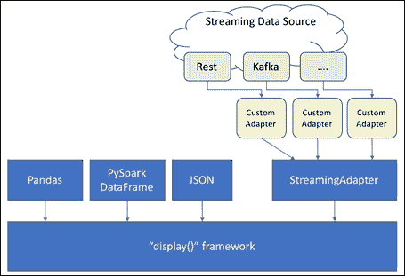

StreamingDataAdapter 体系结构

在实现`StreamingDataAdapter`的子类时，必须重写基类提供的`doGetNextData()`方法，将重复调用该方法以获取新数据以更新可视化效果。 您还可以选择覆盖`getMetadata()`方法，以将上下文传递给渲染引擎（我们稍后将使用此方法来配置 Mapbox 渲染）。

`doGetNextData()`的抽象实现如下所示：

```py
@abstractmethod
def doGetNextData(self):
    """Return the next batch of data from the underlying stream.
    Accepted return values are:
    1\. (x,y): tuple of list/numpy arrays representing the x and y axis
    2\. pandas dataframe
    3\. y: list/numpy array representing the y axis. In this case, the x axis is automatically created
    4\. pandas serie: similar to #3
    5\. json
    6\. geojson
    7\. url with supported payload (json/geojson)
    """
    Pass
```

### 注意

[您可以在此处找到代码文件](https://github.com/DTAIEB/Thoughtful-Data-Science/blob/master/chapter%205/sampleCode6.py)。

前面的文档字符串解释了允许从`doGetNextData()`返回的数据的不同类型。

例如，我们要在地图上实时显示虚拟无人机在地球上徘徊的位置。 [它的当前位置由 REST 服务提供](https://wanderdrone.appspot.com)。

有效负载使用 [GeoJSON](http://geojson.org)，例如：

```py
{
    "geometry": {
        "type": "Point",
        "coordinates": [
            -93.824908715741202, 10.875051131034805
        ]
    },
    "type": "Feature",
    "properties": {}
}
```

### 注意

[您可以在此处找到代码文件](https://github.com/DTAIEB/Thoughtful-Data-Science/blob/master/chapter%205/sampleCode7.json)。

为了实时渲染我们的无人机位置，我们创建了一个`DroneStreamingAdapter`类，该类继承自`StreamingDataAdapter`，并只需在`doGetNextData()`方法中返回无人机位置服务 URL，如以下代码所示：

```py
from pixiedust.display.streaming import *

class DroneStreamingAdapter(StreamingDataAdapter):
    def getMetadata(self):
        iconImage = "rocket-15"
        return {
            "layout": {"icon-image": iconImage, "icon-size": 1.5},
            "type": "symbol"
        }
    def doGetNextData(self):
        return "https://wanderdrone.appspot.com/"
adapter = DroneStreamingAdapter()
display(adapter)
```

### 注意

[您可以在此处找到代码文件](https://github.com/DTAIEB/Thoughtful-Data-Science/blob/master/chapter%205/sampleCode8.py)。

在`getMetadata()`方法中，我们使用火箭 Maki 返回 [Mapbox 特定的样式属性图标](https://www.mapbox.com/maki-icons)（[如此处所述](https://www.mapbox.com/mapbox-gl-js/style-spec)）作为无人机的符号。

使用几行代码，我们能够创建无人机位置的实时地理空间可视化，结果如下：

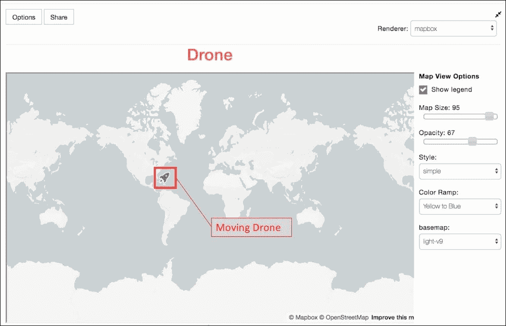

无人机的实时地理空间映射

### 注意

[您可以在以下位置的 PixieDust 存储库中找到此示例的完整笔记本](https://github.com/pixiedust/pixiedust/blob/master/notebook/pixieapp-streaming/Mapbox%20Streaming.ipynb)。

### 为您的 PixieApp 添加流功能

在下一个示例中，我们显示如何使用由 PixieDust 提供的[`MessageHubStreamingApp`](https://github.com/pixiedust/pixiedust/blob/master/pixiedust/apps/messageHub/messageHubApp.py) PixieApp 可视化来自 Apache Kafka 数据源的流数据。

### 注意

**注意**：[`MessageHubStreamingApp`与名为 Message Hub 的 IBM Cloud Kafka 服务一起使用](https://console.bluemix.net/docs/services/MessageHub/index.html#messagehub)，但可以轻松地将其应用于任何其他 Kafka 服务。

如果您不熟悉 Apache Kafka，请不要担心，因为我们将在第 7 章和*大数据 Twitter 情绪分析*中介绍这方面的内容。

通过此 PixieApp，用户可以选择与服务实例相关联的 Kafka 主题，并实时显示事件。 假设来自选定主题的事件有效负载使用 JSON 格式，则它将呈现从对事件数据进行采样中推断出的架构。 然后，用户可以选择一个特定的字段（必须为数字），并显示一个实时图表，显示该字段随时间变化的平均值。


实时可视化流数据

提供流功能所需的关键 PixieApp 属性是`pd_refresh_rate,`，它以指定的时间间隔执行特定的内核请求（拉模型）。 在前面的应用程序中，我们使用它来更新实时图表，如`showChart`路由返回的以下 HTML 片段所示：

```py
    @route(topic="*",streampreview="*",schemaX="*")
    def showChart(self, schemaX):
        self.schemaX = schemaX
        self.avgChannelData = self.streamingData.getStreamingChannel(self.computeAverages)
        return """
<div class="well" style="text-align:center">
    <div style="font-size:x-large">Real-time chart for {{this.schemaX}}(average).</div>
</div>

<div pd_refresh_rate="1000" pd_entity="avgChannelData"></div>
        """
```

### 注意

[您可以在此处找到代码文件](https://github.com/DTAIEB/Thoughtful-Data-Science/blob/master/chapter%205/sampleCode9.py)。

前一个 div 通过`pd_entity`属性绑定到`avgChannelData`实体，并负责创建每秒更新一次的实时图表（ *pd_refresh_rate = 1000 ms* ）。 依次通过对`getStreamingChannel(),`的调用来创建`avgChannelData`实体，该调用将传递给`self`。 `computeAverage`功能负责更新所有流数据的平均值。 重要的是要注意，`avgChannelData`是从`StreamingDataAdapter`继承的类，因此可以传递给`display()`框架以构建实时图表。

最后一个难题是让 PixieApp 返回`display()`框架所需的`displayHandler`。 这是通过重写`newDisplayHandler()`方法来完成的，如下所示：

```py
def newDisplayHandler(self, options, entity):
    if self.streamingDisplay is None:
        self.streamingDisplay = LineChartStreamingDisplay(options, entity)
    else:
        self.streamingDisplay.options = options
    return self.streamingDisplay
```

### 注意

[您可以在此处找到代码文件](https://github.com/DTAIEB/Thoughtful-Data-Science/blob/master/chapter%205/sampleCode10.py)。

在前面的代码中，我们使用它在[`pixiedust.display.streaming.bokeh`包](https://github.com/pixiedust/pixiedust/blob/master/pixiedust/display/streaming/bokeh/lineChartStreamingDisplay.py)中创建由 PixieDust 提供的`LineChartStreamingDisplay`实例，并传递`avgChannelData`实体。

如果要查看该应用程序的运行情况，则需要在 [IBM Cloud](https://console.bluemix.net/catalog/services/message-hub) 上创建一个消息中心服务实例，并使用 它的凭据，请使用以下代码在笔记本中调用此 PixieApp：

```py
from pixiedust.apps.messageHub import *
MessageHubStreamingApp().run(
    credentials={
        "username": "XXXX",
        "password": "XXXX",
        "api_key" : "XXXX",
        "prod": True
    }
)
```

如果您想了解有关 PixieDust 流的更多信息，可以在这里找到其他流应用示例：

*   A simple PixieApp that demonstrate how to create streaming visualizations from randomly generated data: [https://github.com/pixiedust/pixiedust/blob/master/notebook/pixieapp-streaming/PixieApp%20Streaming-Random.ipynb](https://github.com/pixiedust/pixiedust/blob/master/notebook/pixieapp-streaming/PixieApp%20Streaming-Random.ipynb)

    *   [展示如何构建股票行情实时显示的 PixieApp](https://github.com/pixiedust/pixiedust/blob/master/notebook/pixieapp-streaming/PixieApp%20Streaming-Stock%20Ticker.ipynb)

    下一个主题将介绍 PixieApp 事件，这些事件使您可以在应用程序的不同组件之间添加交互性。

## 通过 PixieApp 事件添加仪表板明细

PixieApp 框架支持使用浏览器中可用的发布-订阅模式在不同组件之间发送和接收事件。 使用此模型的最大好处是，[它可以使用宽松的耦合模式](https://en.wikipedia.org/wiki/Loose_coupling)，它允许发送和接收组件保持不可知 彼此。 因此，它们的实现可以彼此独立地执行，并且对需求的变化不敏感。 当您的 PixieApp 使用由不同团队构建的不同 PixieApps 的组件时，或者事件来自用户与图表进行交互（例如，单击地图）并且您想要提供向下钻取功能时，这将非常有用。 。

每个事件都携带任意键和值的 JSON 有效负载。 有效负载必须至少具有以下其中一个键（或两者兼有）：

*   `targetDivId`：标识发送事件的元素的 DOM ID
*   `type`：标识事件类型的字符串

发布者可以通过两种方式触发事件：

*   **Declarative**: Use the `pd_event_payload` attribute to specify the payload content. This attribute follows the same rules as `pd_options`:

    *   每个键/值对必须使用`key=value`表示法进行编码
    *   该事件将由点击或更改事件触发
    *   必须提供对`$val()`指令的支持，以动态注入用户输入的输入
    *   使用`<pd_event_payload>`子代输入原始 JSON

        ```py
        <button type="submit" pd_event_payload="type=topicA;message=Button clicked">
            Send event A
        </button>
        ```

        ```py
        <button type="submit">
            <pd_event_payload>
            {
                "type":"topicA",
                "message":"Button Clicked"
            }
            </pd_event_payload>
            Send event A
        </button>
        ```

    例子：

    或者，我们可以使用以下代码：

    ### 注意

    [您可以在此处找到代码文件](https://github.com/DTAIEB/Thoughtful-Data-Science/blob/master/chapter%205/sampleCode11.html)。

*   **Programmatic**: In some cases, you may want to directly trigger an event via JavaScript. In this case, you can use the `sendEvent(payload, divId)` method of the `pixiedust` global object. The `divId` is an optional argument that specifies the origin of the event. If the `divId` argument is omitted, then it defaults to the `divId` of the element that is currently sending the event. As a result, you should always use `pixiedust.sendEvent` without a `divId` from a JavaScript handler of a user event such as click, and hover.

    例子：

    ```py
    <table
    onclick="pixiedust.sendEvent({type:'topicB',text:event.srcElement.innerText})">
        <tr><td>Row 1</td></tr>
        <tr><td>Row 2</td></tr>
        <tr><td>Row 3</td></tr>
    </table>
    ```

    ### 注意

    [您可以在此处找到代码文件](https://github.com/DTAIEB/Thoughtful-Data-Science/blob/master/chapter%205/sampleCode12.html)。

订阅者可以通过声明`<pd_event_handler>`元素来监听事件，该元素可以接受 PixieApp Kernel 执行属性中的任何一个，例如`pd_options`和`pd_script`。 它还必须使用`pd_source`属性来过滤他们要处理的事件。 `pd_source`属性可以包含以下值之一：

*   `targetDivId`：仅接受来自具有指定 ID 的元素的事件
*   `type`：仅接受具有指定类型的事件
*   `"*"`：表示将接受任何事件

例子：

```py
<div class="col-sm-6" id="listenerA{{prefix}}">
    Listening to button event
    <pd_event_handler
        pd_source="topicA"
        pd_script="print(eventInfo)"
        pd_target="listenerA{{prefix}}">
    </pd_event_handler>
</div>
```

### 注意

[您可以在此处找到代码文件](https://github.com/DTAIEB/Thoughtful-Data-Science/blob/master/chapter%205/sampleCode13.html)。

下图显示了组件之间如何交互：

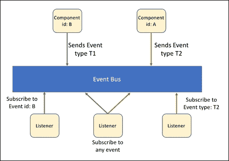

在组件之间发送/接收事件

在以下代码示例中，我们通过构建两个发布者（一个按钮元素和一个表，其中每行都是一个事件源）来说明 PixieDust 事件系统。 我们还有两个实现为 div 元素的侦听器：

```py
from pixiedust.display.app import *
@PixieApp
class TestEvents():
    @route()
    def main_screen(self):
        return """
<div>
    <button type="submit">
        <pd_event_payload>
        {
            "type":"topicA",
            "message":"Button Clicked"
        }
        </pd_event_payload>
        Send event A
    </button>
    <table onclick="pixiedust.sendEvent({type:'topicB',text:event.srcElement.innerText})">
        <tr><td>Row 1</td></tr>
        <tr><td>Row 2</td></tr>
        <tr><td>Row 3</td></tr>
    </table>
</div>
<div class="container" style="margin-top:30px">
    <div class="row">
        <div class="col-sm-6" id="listenerA{{prefix}}">
            Listening to button event
            <pd_event_handler pd_source="topicA" pd_script="print(eventInfo)" pd_target="listenerA{{prefix}}">
            </pd_event_handler>
        </div>
        <div class="col-sm-6" id="listenerB{{prefix}}">
            Listening to table event
            <pd_event_handler pd_source="topicB" pd_script="print(eventInfo)" pd_target="listenerB{{prefix}}">
            </pd_event_handler>
        </div>
    </div>
</div>
        """
app = TestEvents()
app.run()
```

### 注意

[您可以在此处找到代码文件](https://github.com/DTAIEB/Thoughtful-Data-Science/blob/master/chapter%205/sampleCode14.py)。

上面的代码产生以下结果：

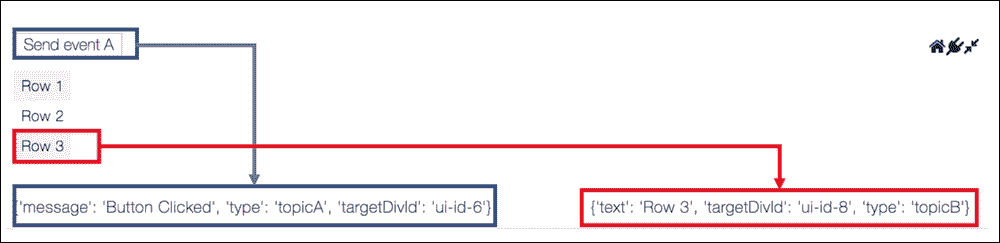

PixieApp 事件的用户交互流程

PixieApp 事件使您能够创建具有追溯功能的复杂仪表板。 也很高兴知道您可以利用为`display()`框架生成的某些图表自动发布的事件。 例如，当用户单击图表上的某个位置时，内置渲染器（例如 Google Maps，Mapbox 和 Table）将自动生成事件。 这对于通过钻取功能快速构建各种交互式仪表板非常有用。

在下一个主题中，我们将讨论如何使用 PixieDust 可扩展性 API 创建自定义可视化。

## 扩展 PixieDust 可视化效果

PixieDust 设计为高度可扩展的。 您可以根据所显示的实体创建自己的可视化并控制何时可以调用它。 PixieDust 框架提供了多个可扩展层。 最低功能最强大的类可让您创建自己的`Display`类。 但是，大多数可视化都有很多共同的属性，例如标准选项（聚合，最大行数，标题等），或者是一种缓存机制，如果用户仅选择了一个不包含选项的次要选项，则可以防止重新计算所有内容。 需要重新处理数据。

为了防止用户每次都重新发明轮子，PixieDust 提供了第二个可扩展层，称为**渲染器**，其中包括此处介绍的所有功能。

下图说明了不同的层：


PixieDust 扩展层

要开始使用**显示扩展层**，您需要通过创建一个继承自`pixiedust.display.DisplayHandlerMeta`的类来在菜单中显示可视化效果。 此类包含两个需要重写的方法：

*   `getMenuInfo(self,entity,dataHandler)`：如果不支持作为参数传递的实体，则返回一个空数组，否则返回包含带有菜单信息的 JSON 对象集的数组。 每个 JSON 对象必须包含以下信息：

    *   `id`：唯一的字符串，用于标识您的工具。
    *   `categoryId`：标识菜单类别或组的唯一字符串。 稍后会提供所有内置类别的完整列表。
    *   `title`：描述菜单的任意字符串。
    *   `icon`：字体真棒图标的名称，或图像的 URL。

*   `newDisplayHandler(self,options,entity)`：当用户激活菜单时，将调用`newDisplayHandler()`方法。 此方法必须返回从`pixiedust.display.Display`继承的类实例。 该类的合同用于实现`doRender()`方法，该方法负责创建可视化文件。

让我们以为熊猫 DataFrame 创建自定义表格渲染为例。 我们首先创建用于配置菜单和工厂方法的`DisplayHandlerMeta`类：

```py
from pixiedust.display.display import *
import pandas
@PixiedustDisplay()
class SimpleDisplayMeta(DisplayHandlerMeta):
    @addId
    def getMenuInfo(self,entity,dataHandler):
        if type(entity) is pandas.core.frame.DataFrame:
            return [
               {"categoryId": "Table", "title": "Simple Table", "icon": "fa-table", "id": "simpleTest"}
            ]
        return []
    def newDisplayHandler(self,options,entity):
        return SimpleDisplay(options,entity)
```

### 注意

[您可以在此处找到代码文件](https://github.com/DTAIEB/Thoughtful-Data-Science/blob/master/chapter%205/sampleCode15.py)。

注意，前面的`SimpleDisplayMeta`类需要用`@PixiedustDisplay,`装饰，这是将该类添加到插件的内部 PixieDust 注册表中所必需的。 在`getMenuInfo()`方法中，我们首先检查实体类型是否为 *pandas DataFrame* ，如果不是，则返回一个空数组，表示此插件不支持当前实体，因此不会对 菜单。 如果类型正确，我们将返回一个数组，其中包含一个包含菜单信息的 JSON 对象。

工厂方法`newDisplayHandler()`作为参数传递了`options`和`entity`。 `options`参数是键/值对的字典，包含用户做出的各种选择。 正如我们将在后面看到的那样，可视化可以定义反映其功能的任意键/值对，并且 PixieDust 框架将自动将它们保留在单元元数据中。

例如，您可以添加一个选项，用于在 UI 中将 HTTP 链接显示为可点击。 在我们的示例中，我们返回一个`SimpleDisplay`实例，如下所示：

```py
class SimpleDisplay(Display):
    def doRender(self, handlerId):
        self._addHTMLTemplateString("""
<table class="table table-striped">
   <thead>
       
       <th>{{column}}</th>
       
   </thead>
   <tbody>
       
       <tr>
           
           <td>{{value}}</td>
           
       </tr>
       
   </tbody>
</table>
        """)
```

### 注意

[您可以在此处找到代码文件](https://github.com/DTAIEB/Thoughtful-Data-Science/blob/master/chapter%205/sampleCode16.py)。

如前所述，`SimpleDisplay`类必须继承`Display`类并实现`doRender()`方法。 在此方法的实现中，您可以访问`self.entity`和`self.options`变量来调整信息在屏幕上的呈现方式。 在前面的示例中，我们使用`self._addHTMLTemplateString()`方法创建将呈现可视化效果的 HTML 片段。 与 PixieApp 路由一样，传递给`self._addHTMLTemplateString()`的字符串可以利用 Jinja2 模板引擎并可以自动访问诸如`entity`之类的变量。 如果您不想在 Python 文件中对模板字符串进行硬编码，则可以将提取到其自己的文件中，该文件必须放置在名为`templates`的目录中，该目录必须与调用 Python 的目录位于同一目录中 文件。 然后，您将需要使用`self._addHTMLTemplate()`方法，该方法将文件名作为参数（不指定`templates`目录）。

### 注意

将 HTML 片段外部化为它自己的文件的另一个优点是，您不必每次进行更改都重新启动内核，这可以节省大量时间。 由于 Python 的工作方式，如果在源代码中嵌入 HTML 片段，就不能说相同的话，在这种情况下，您必须重新启动内核才能对 HTML 片段进行任何更改。

同样重要的是要注意`self._addHTMLTemplate()`和`self._addHTMLTemplateString()`接受将被传递到 Jinja2 模板的关键字参数。 例如：

```py
self._addHTMLTemplate('simpleTable.html', custom_arg = "Some value")
```

现在，我们可以运行一个显示`cars`数据集的单元格：

### 注意

**注意**：**简单表**扩展名仅适用于熊猫，不适用于 Spark DataFrame。 因此，如果您的笔记本计算机连接到 Spark，则在调用`sampleData()`时需要使用`forcePandas = True`。

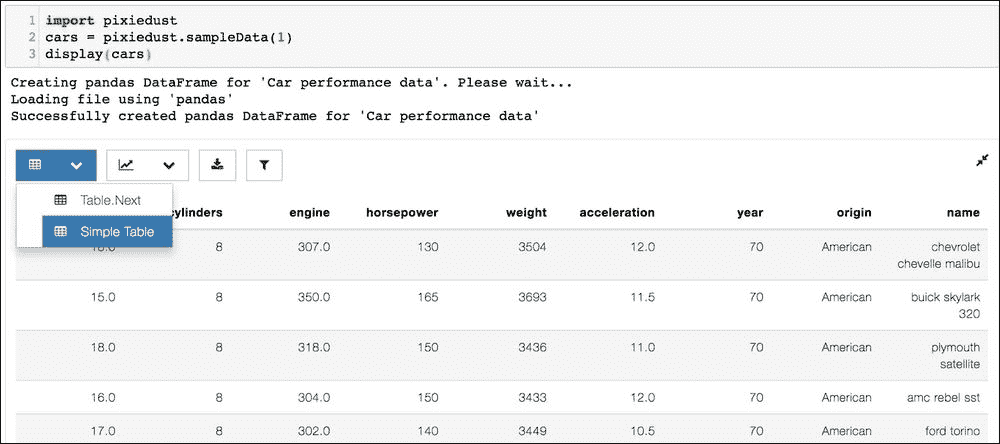

在 pandas DataFrame 上运行自定义可视化插件

如 PixieDust 扩展层架构图所示，您还可以使用 **Renderer 扩展层**扩展 PixieDust，它比**显示扩展层**更具规范性，但提供了更多功能。 框，例如选项管理和临时数据计算缓存。 从用户界面的角度来看，用户可以使用图表区域右上角的**渲染器**下拉菜单在渲染器之间进行切换。

PixieDust 随附了一些内置渲染器，例如 Matplotlib，Seaborn，Bokeh，Mapbox，Brunel 和 Google Maps，但它并未声明对基础可视化库的任何硬性依赖，包括 Bokeh，Brunel 或 Seaborn。 因此，用户必须手动安装它们，否则它们将不会显示在菜单中。

以下屏幕快照说明了在给定图表的渲染器之间切换的机制：

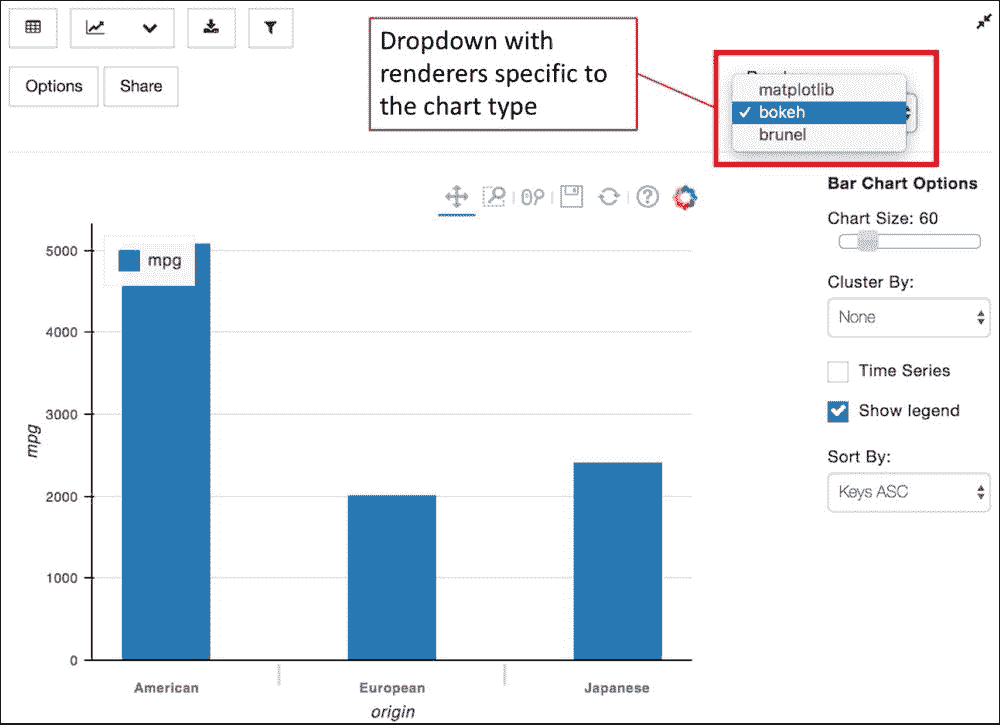

在渲染器之间切换

添加新的渲染器类似于添加显示可视化（使用相同的 API），尽管实际上更简单，因为您只需要构建一个类（无需构建元数据类）即可。 这是您需要遵循的步骤：

1.  创建一个从专门的`BaseChartDisplay class`继承的 Display 类。 实现所需的`doRenderChart()`方法。
2.  Use the `@PixiedustRenderer` decorator to register the `rendererId` (which must be unique across all renderers) and the type of chart being rendered.

    请注意，相同的`rendererId`可以用于渲染器中包含的所有图表。 PixieDust 提供了一组核心图表类型：

    *   `tableView`
    *   `barChart`
    *   `lineChart`
    *   `scatterPlot`
    *   `pieChart`
    *   `mapView`
    *   `histogram`

3.  *（可选）*使用`@commonChartOptions`装饰器创建一组动态选项。
4.  *（可选）*通过重写`get_options_dialog_pixieapp()`方法来自定义从`pixiedust.display.chart.options.baseOptions`包中的`BaseOptions`类继承的 PixieApp 类的完全限定名称，从而自定义选项对话框。

例如，让我们使用渲染器扩展层重写先前的自定义`SimpleDisplay`表可视化：

```py
from pixiedust.display.chart.renderers import PixiedustRenderer
from pixiedust.display.chart.renderers.baseChartDisplay import BaseChartDisplay

@PixiedustRenderer(rendererId="simpletable", id="tableView")
class SimpleDisplayWithRenderer(BaseChartDisplay):
    def get_options_dialog_pixieapp(self):
        return None #No options needed

    def doRenderChart(self):
        return self.renderTemplateString("""
<table class="table table-striped">
   <thead>
       
       <th>{{column}}</th>
       
   </thead>
   <tbody>
       
       <tr>
           
           <td>{{value}}</td>
           
       </tr>
       
   </tbody>
</table>
        """)
```

### 注意

[您可以在此处找到代码文件](https://github.com/DTAIEB/Thoughtful-Data-Science/blob/master/chapter%205/sampleCode17.py)。

我们用`@PixiedustRenderer`装饰器装饰该类，指定一个称为`simpletable,`的唯一`rendererId`并将其与 PixieDust 框架定义的`tableView`图表类型相关联。 对于`get_options_dialog_pixieapp()`方法，我们返回`None`，以表示此扩展名不支持自定义选项。 结果是，将不会显示**选项**按钮。 在`doRenderChart()`方法中，我们返回 HTML 片段。 由于我们要使用 Jinja2，因此需要使用`self.renderTemplateString`方法进行渲染。

现在，我们可以使用`cars`数据集测试此新渲染器。

### 注意

同样，在运行代码时，请确保将`cars`数据集作为 pandas DataFrame 加载。 如果您已经运行了**简单表**的第一个实现，并且正在重新使用笔记本电脑，则可能仍然会看到旧的**简单表**菜单。 如果是这种情况，您将需要重新启动内核并重试。

以下屏幕快照显示了作为呈现器的简单表格可视化：


测试简单表的渲染器实现

[您可以在以下位置找到有关此主题的更多材料](https://pixiedust.github.io/pixiedust/develop.html)。 希望到目前为止，您对定制的类型有个好主意，可以编写将定制的可视化集成到`display()`框架中。

在下一节中，我们将为开发人员讨论一个非常重要的主题：调试。

## 调试

能够快速调试应用程序对于项目的成功至关重要。 如果不是这样，我们将失去通过打破数据科学与工程学之间的孤岛而在生产力和协作方面所获得的大部分（如果不是全部）收益。 还需要注意的是，我们的代码在不同的位置运行，即在服务器端运行 Python，在客户端运行 JavaScript，并且调试必须在这两个位置进行。 对于 Python 代码，让我们看一下解决编程错误的两种方法。

### 使用 pdb 在 Jupyter Notebook 上调试

[PDB](https://docs.python.org/3/library/pdb.html) 是一个交互式命令行 Python 调试器，是每个 Python 发行版的标准配置。

有多种调用调试器的方法：

*   在启动时，从命令行：

    ```py
    python -m pdb <script_file>

    ```

*   以编程方式，在代码中：

    ```py
    import pdb
    pdb.run("<insert a valid python statement here>")
    ```

*   By setting an explicit breakpoint in the code with the `set_trace()` method:

    ```py
    import pdb
    def my_function(arg1, arg2):
        pdb.set_trace()
        do_something_here()
    ```

    ### 注意

    [您可以在此处找到代码文件](https://github.com/DTAIEB/Thoughtful-Data-Science/blob/master/chapter%205/sampleCode18.py)。

*   发生异常后，通过调用`pdb.pm()`进行验尸。

进入交互式调试器后，您可以调用命令，检查变量，运行语句，设置断点等。

### 注意

[命令的完整列表可以在这里找到](https://docs.python.org/3/library/pdb.html)。

好消息是 Jupyter Notebooks 为交互式调试器提供了一流的支持。 要调用调试器，只需使用`%pdb` cell magic 命令打开/关闭它，如果触发了异常，则调试器将自动在有问题的行停止执行。

[魔术命令](http://ipython.readthedocs.io/en/stable/interactive/magics.html)是特定于 IPython 内核的结构。 它们是与语言无关的，因此理论上可以在内核支持的任何语言中使用（例如 Python，Scala 和 R）。

魔术命令有两种类型：

*   **Line magics**: The syntax is `%<magic_command_name> [optional arguments]`for example, `%matplotlib inline`, which configures Matplotlib to output the charts inline in the Notebook output cell.

    它们可以在单元代码中的任何位置调用，甚至可以返回可以分配给 Python 变量的值，例如：

    ```py
    #call the pwd line magic to get the current working directory
    #and assign the result into a Python variable called pwd
    pwd = %pwd
    print(pwd)
    ```

    ### 注意

    [您可以在此处找到所有线魔术的列表](http://ipython.readthedocs.io/en/stable/interactive/magics.html#line-magics)。

*   **Cell magics**: The syntax is `%%<magic_command_name> [optional arguments]`. For example, we call the HTML cell magic to display HTML on the output cell:

    ```py
    %%html
    <div>Hello World</div>
    ```

    细胞魔力必须位于细胞顶部； 任何其他位置都将导致执行错误。 单元魔术下方的所有内容均作为参数传递给处理程序，以根据单元魔术规范进行解释。 例如，HTML 单元魔术师希望单元格内容的其余部分为 HTML。

下面的代码示例调用一个引发`ZeroDivisionError`异常的函数，并激活了`pdb`自动调用：

### 注意

**注意**：一旦打开`pdb`，它在笔记本计算机会话期间将保持打开状态。


交互式命令行调试

以下是一些重要的`pdb`命令，可用于解决问题：

*   `s(tep)`：进入正在调用的函数，然后在下一条语句行停止。
*   `n(ext)`：继续的下一行，而不进入嵌套功能。
*   `l(list)`：当前行周围的列表代码。
*   `c(ontinue)`：继续运行该程序，并在下一个断点处停止，或者如果引发另一个异常。
*   `d(own)`：向下移动堆栈框。
*   `u(p)`：向上移动堆栈帧。
*   `<any expression>`：在当前帧的上下文中求值并显示一个表达式。 例如，您可以使用`locals()`获取范围为当前帧的所有局部变量的列表。

如果发生异常并且您未设置自动`pdb`调用，则仍然可以在另一个单元格中使用`%debug` magic 来在事件发生后调用调试器，如以下屏幕截图所示：

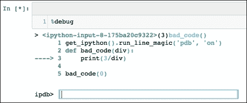

使用％debug 进行事后调试会话

与常规 Python 脚本类似，您也可以通过`pdb.set_trace()`方法以编程方式显式设置断点。 但是，建议使用由 IPython 核心模块提供的`set_trace()`增强版本，该版本提供语法着色：


显式断点

在下一个主题中，我们看一下 PixieDust 提供的 Python 调试器的增强版本。

### 使用 PixieDebugger 进行视觉调试

使用标准的基于命令行的 Python pdb 调试代码是我们工具带中的一个不错的工具，但是它有两个主要限制：

*   它是面向命令行的，这意味着必须手动输入命令并将结果顺序附加到单元格输出中，因此在进行高级调试时不切实际
*   它不适用于 PixieApps

PixieDebugger 功能解决了这两个问题。 您可以将其与在 Jupyter Notebook 单元中运行的任何 Python 代码一起使用，以直观地调试代码。 要在单元格中调用 PixieDebugger，只需在单元格顶部添加`%%pixie_debugger`单元魔术即可。

### 注意

**注意**：如果尚未这样做，请不要忘记在尝试使用`%%pixie_debugger`之前始终将`pixiedust`导入单独的单元格中。

例如，以下代码试图计算`cars`数据集中名称为`chevrolet`的汽车数量：

```py
%%pixie_debugger
import pixiedust
cars = pixiedust.sampleData(1, forcePandas=True)

def count_cars(name):
    count = 0
    for row in cars.itertuples():
        if name in row.name:
            count += 1
    return count

count_cars('chevrolet')
```

### 注意

[您可以在此处找到代码文件](https://github.com/DTAIEB/Thoughtful-Data-Science/blob/master/chapter%205/sampleCode19.py)。

使用前面的代码运行单元将触发以下屏幕快照中所示的可视调试器。 用户界面允许您逐行进入代码，并具有检查局部变量，评估 Python 表达式和设置断点的能力。 代码执行工具栏提供了用于管理代码执行的按钮：恢复执行，单步执行当前行，单步执行特定功能的代码，运行至当前功能的末尾以及向上和向下显示堆栈帧 ：

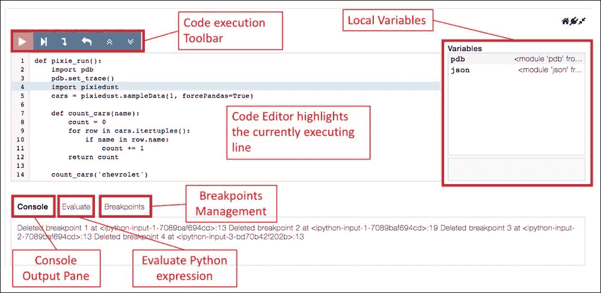

运行中的 PixieDebugger

没有参数，`pixie_debugger`单元魔术将在代码中的第一个可执行语句处停止。 但是，您可以使用`-b`开关轻松地将其配置为在特定位置停止，然后是一个断点列表，该断点可以是行号或方法名。

从前面的示例代码开始，让我们在`count_cars()`方法和第`11`行添加断点：

```py
%%pixie_debugger -b count_cars 11
import pixiedust
cars = pixiedust.sampleData(1, forcePandas=True)

def count_cars(name):
    count = 0
    for row in cars.itertuples():
        if name in row.name:
            count += 1
    return count

count_cars('chevrolet')
```

### 注意

[您可以在此处找到代码文件](https://github.com/DTAIEB/Thoughtful-Data-Science/blob/master/chapter%205/sampleCode20.py)。

现在，运行前面的代码将触发 PixieDebugger 在`count_cars()`方法的第一个可执行语句处停止。 它还在第 11 行添加了一个断点，如果用户继续执行，将导致执行流在此处停止，如以下屏幕截图所示：

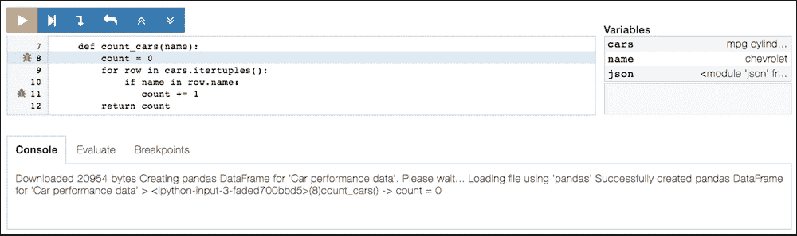

具有预定义断点的 PixieDebugger

### 注意

**注意**：要运行到特定的代码行而不设置明确的断点，只需将鼠标悬停在左侧窗格的装订线中的行号上，然后单击出现的图标即可。

像`%debug`魔法一样，您也可以使用`%pixie_debugger`魔法来调用 PixieDebugger 进行事后调试。

### 使用 PixieDebugger 调试 PixieApp 路由

PixieDebugger 已完全集成到 PixieApp 框架中。 每当触发路由时发生异常时，都会通过两个额外的按钮来增强产生的回溯：

*   **发布 Mortem**：调用 PixieDebugger 启动事后故障排除会话，该会话可让您检查变量并分析堆栈帧
*   **调试路由**：重播当前路由，停止在 PixieDebugger 中的第一个可执行语句处

例如，让我们考虑以下代码来实现 PixieApp，该代码使用户通过提供列名和搜索查询来搜索`cars`数据集：

```py
from pixiedust.display.app import *

import pixiedust
cars = pixiedust.sampleData(1, forcePandas=True)

@PixieApp
class DisplayCars():
    @route()
    def main_screen(self):
        return """
        <div>
            <label>Column to search</label>
            <input id="column{{prefix}}" value="name">
            <label>Query</label>
            <input id="search{{prefix}}">
            <button type="submit" pd_options="col=$val(column{{prefix}});query=$val(search{{prefix}})"
                pd_target="target{{prefix}}">
                Search
            </button>
        </div>
        <div id="target{{prefix}}"></div>
        """
    @route(col="*", query="*")
    def display_screen(self, col, query):
        self.pdf = cars.loc[cars[col].str.contains(query)]
        return """
        <div pd_render_onload pd_entity="pdf">
            <pd_options>
            {
              "handlerId": "tableView",
              "table_noschema": "true",
              "table_nosearch": "true",
              "table_nocount": "true"
            }
            </pd_options>
        </div>
        """
app = DisplayCars()
app.run()
```

### 注意

[您可以在此处找到代码文件](https://github.com/DTAIEB/Thoughtful-Data-Science/blob/master/chapter%205/sampleCode21.py)。

搜索列的缺省值为`name`，但是如果用户输入的列名不存在，则会按以下方式生成的回溯：

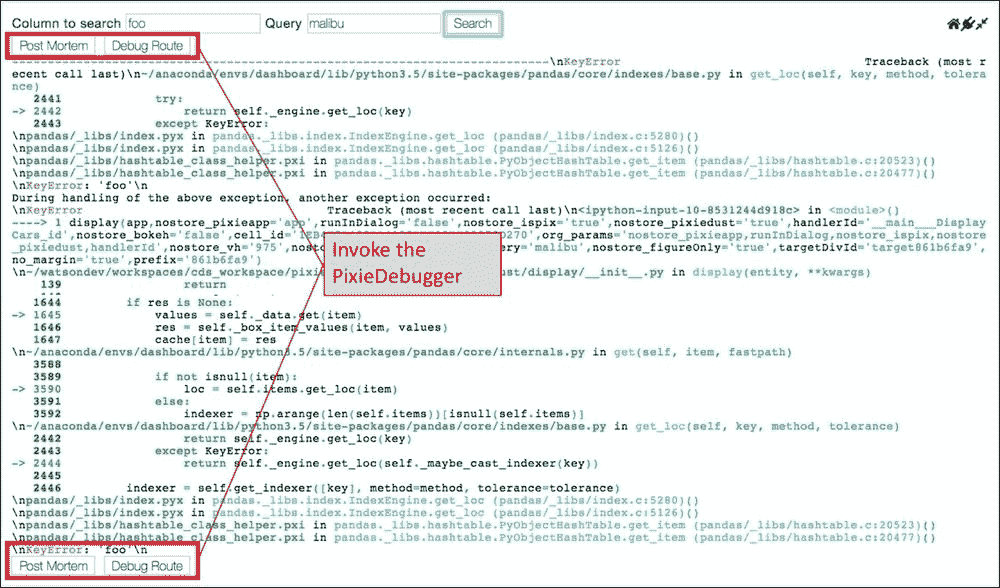

带有按钮的增强的追溯功能，用于调用 PixieDebugger

单击**调试路由**将自动启动 PixieDebugger 并在该路由的第一个可执行语句处停止，如以下屏幕截图所示：


调试 PixieApp 路由

通过使用`run`方法的`debug_route`关键字参数，您也可以故意让 PixieDebugger 停止在`display_screen()`路由上，而无需等待发生回溯：

```py
...
app = DisplayCars()
app.run(debug_route="display_screen")
```

PixieDebugger 是 Jupyter Notebook 的第一个可视化 Python 调试器，提供了 Jupyter 用户社区长期以来要求的功能。 但是，使用实时调试并不是开发人员使用的唯一工具。 在下一节中，我们将通过检查日志记录消息来进行调试。

### 使用 PixieDust 日志记录对问题进行故障排除

始终将实践记录为带有日志消息的代码，PixieDust 框架提供了一种简单的方法来直接从 Jupyter Notebook 创建和读取日志消息。 首先，您需要通过调用`getLogger()`方法来创建一个记录器，如下所示：

```py
import pixiedust
my_logger = pixiedust.getLogger(__name__)
```

### 注意

[您可以在此处找到代码文件](https://github.com/DTAIEB/Thoughtful-Data-Science/blob/master/chapter%205/sampleCode22.py)。

您可以使用任何东西作为`getLogger()`方法的参数。 但是，为了更好地标识特定消息的来源，建议使用`__name__`变量，该变量返回当前模块的名称。 `my_logger`变量是一个标准的 Python 记录器对象，它提供各种级别的记录方法：

*   `debug(msg, *args, **kwargs)`：以`DEBUG`级别记录消息。
*   `info(msg, *args, **kwargs)`：以`INFO`级别记录消息。
*   `warning(msg, *args, **kwargs)`：以`WARNING`级别记录消息。
*   `error(msg, *args, **kwargs)`：以`ERROR`级别记录消息。
*   `critical(msg, *args, **kwargs)`：以`CRITICAL`级别记录消息。
*   `exception(msg, *args, **kwargs)`：以`EXCEPTION`级别记录消息。 此方法只能在异常处理程序中调用。

### 注意

[**注意**：您可以在此处找到有关 Python 日志记录框架的更多信息](https://docs.python.org/2/library/logging.html)。

然后，您可以使用`%pixiedustLog`单元魔术直接从 Jupyter Notebook 中查询日志消息，该魔术具有以下参数：

*   `-l`：按日志级别过滤，例如`CRITICAL`，`FATAL`，`ERROR`，`WARNING`，`INFO`和`DEBUG`
*   `-f`：过滤包含给定字符串的消息，例如`Exception`
*   `-m`：返回的最大条日志消息

在下面的示例中，我们使用`%pixiedustLog`魔术来显示所有调试消息，将它们限制为最后五个消息：

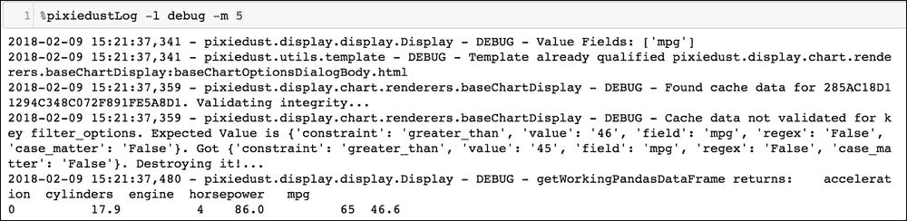

显示最后五条日志消息

为了方便起见，在使用 Python 类时，您还可以使用`@Logger`装饰器，该装饰器使用类名称作为其标识符自动创建记录器。

这是一个使用`@Logger`装饰器的代码示例：

```py
from pixiedust.display.app import *
from pixiedust.utils import Logger

@PixieApp
@Logger()
class AppWithLogger():
    @route()
    def main_screen(self):
        self.info("Calling default route")
        return "<div>hello world</div>"

app = AppWithLogger()
app.run()
```

### 注意

[您可以在此处找到代码文件](https://github.com/DTAIEB/Thoughtful-Data-Science/blob/master/chapter%205/sampleCode23.py)。

在单元格中运行前面的 PixieApp 之后，可以调用`%pixiedustLog`魔术来显示消息：

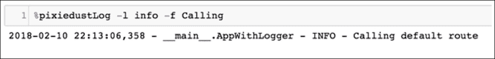

查询带有特定术语的日志

这样就完成了我们关于服务器端调试的讨论。 在下一节中，我们将介绍执行客户端调试的技术

### 客户端调试

PixieApp 编程模型的设计原则之一是最大程度地减少开发人员编写 JavaScript 的需求。 该框架将通过侦听用户输入事件（例如单击或更改事件）来自动触发内核请求。 但是，在某些情况下，不可避免地需要编写一些 JavaScript。 这些 JavaScript 代码段通常是特定路由 HTML 片段的一部分，并动态注入到浏览器中，这使得调试非常困难。

一种流行的技术是在 JavaScript 代码中添加`console.log`调用，以便将消息打印到浏览器开发者控制台。

### 注意

**注意**：每种浏览器版本都有其自己的调用开发者控制台的方式。 例如，在 Google Chrome 浏览器中，您将使用**视图** | **开发人员** | **JavaScript 控制台，**或*命令* + *Alt* +`J`快捷键。

我特别喜欢的另一种调试技术是使用`debugger;`语句以编程方式插入 JavaScript 代码的断点中。 除非打开浏览器开发人员工具并启用源调试，否则该语句无效；在这种情况下，执行将在`debugger;`语句处自动中断。

以下 PixieApp 示例使用 JavaScript 函数来解析`$val()`指令引用的动态值：

```py
from pixiedust.display.app import *

@PixieApp
class TestJSDebugger():
    @route()
    def main_screen(self):
        return """
<script>
function FooJS(){
    debugger;
    return "value"
}
</script>
<button type="submit" pd_options="state=$val(FooJS)">Call route</button>
        """

    @route(state="*")
    def my_route(self, state):
        return "<div>Route called with state <b>{{state}}</b></div>"

app = TestJSDebugger()
app.run()
```

### 注意

[您可以在此处找到代码文件](https://github.com/DTAIEB/Thoughtful-Data-Science/blob/master/chapter%205/sampleCode24.py)。

在前面的代码中，按钮使用包含调试器语句的`FooJS` JavaScript 函数动态设置状态的值。 在开发者工具打开的情况下执行该应用并单击按钮将自动在浏览器上启动调试会话：


使用调试器在客户端调试 JavaScript 代码； 陈述

# 在 Python Notebook 中运行 Node.js

即使我在本书的开头就明确指出 Python 已成为数据科学领域的明确领导者，但它仍然仅被传统语言（例如 Node.js）的开发者社区少量使用。 ，仍然是首选。 认识到，对于某些开发人员而言，学习诸如 Python 之类的新语言是进入数据科学的代价，这可能太高了，我与 IBM 同事 Glynn Bird 合作，为 PixieDust 建立了名为[`pixiedust_node`](https://github.com/pixiedust/pixiedust_node)的扩展库，可以使开发人员在 Python Notebook 中的单元内运行 Node.js / JavaScript 代码。 该库的目的是通过允许开发人员重用自己喜欢的 Node.js 库（例如，从现有数据源加载和处理数据）来使他们轻松进入 Python 世界。

要安装`pixiedust_node`库，只需在其自己的单元格中运行以下命令：

```py
!pip install pixiedust_node

```

### 注意

**注意**：安装完成后，不要忘记重新启动内核。

**重要**：您需要确保在 Jupyter Notebook 服务器所在的同一台计算机上安装了 Node.js 运行时版本 6 或更高版本。

内核重新​​启动后，我们将导入`pixiedust_node`模块：

```py
import pixiedust_node
```

您应该在输出中看到有关 PixieDust 和`pixiedust_node`的信息，如下所示：


pixiedust_node 欢迎输出

导入`pixiedust_node`时，会从 Python 端创建一个 Node 子进程，以及一个特殊线程，该线程读取该子进程的输出并将其传递给 Python 端，以在当前在其中执行的单元格中显示。 笔记本。 此子过程负责启动 **REPL** 会话（[**Read-Eval-Print 循环**](https://en.wikipedia.org/wiki/Read-eval-print_loop)），它将执行从 Notebook 发送的所有脚本，并使所有创建的类，函数和变量在所有执行中都可重用。

它还定义了一组旨在与 Notebook 和 PixieDust `display()` API 交互的功能：

*   `print(data)`：输出当前在笔记本计算机中执行的单元格中的数据值。
*   `display(data)`：使用从数据转换成的 pandas DataFrame 调用 PixieDust `display()` API。 如果数据无法转换为 pandas DataFrame，则默认为`print`方法。
*   `html(data)`：在笔记本计算机中当前正在执行的单元格中以 HTML 格式显示数据。
*   `image(data)`：期望数据是图像的 URL，并将其显示在当前在笔记本计算机中执行的单元格中。
*   `help()`：显示所有前述方法的列表。

此外，`pixiedust_node`使笔记本电脑中全局可用的两个变量分别称为`npm`和`node,`：

*   `node.cancel()`：停止 Node.js 子进程中的当前代码执行。
*   `node.clear()`：重置 Node.js 会话； 所有现有变量将被删除。
*   `npm.install(package)`：安装一个 npm 软件包并使其可用于 Node.js 会话。 该软件包在各个会话之间均保持不变。
*   `npm.uninstall(package)`：从系统和当前 Node.js 会话中删除 npm 软件包。
*   `npm.list()`：列出当前安装的所有 npm 软件包。

`pixiedust_node`创建一个单元魔术，使您可以运行任意 JavaScript 代码。 只需在单元顶部上使用`%%node`魔术，然后照常运行即可。 然后将在 Node.js 子进程 REPL 会话中执行代码。

以下代码使用 [JavaScript `Date`对象](https://www.w3schools.com/Jsref/jsref_obj_date.asp)显示包含当前日期时间的字符串：

```py
%%node
var date = new Date()
print("Today's date is " + date)
```

输出以下内容：

```py
"Today's date is Sun May 27 2018 20:36:35 GMT-0400 (EDT)"
```

下图说明了先前单元的执行流程：


Node.js 脚本执行的生命周期

JavaScript 代码由`pixiedust_node`魔术处理，并发送到 Node 子进程以执行。 在执行代码时，其输出将由特殊线程读取并显示回当前在笔记本计算机中执行的单元格中。 请注意，JavaScript 代码可能会进行异步调用，在这种情况下，执行将在异步调用完成之前立即返回。 在这种情况下，即使以后可能会通过异步代码生成更多的输出，笔记本也会指示单元代码已完成。 没有方法来确定性地知道异步代码何时完成。 因此，开发人员有责任仔细管理此状态。

`pixiedust_node`还具有在 Python 端和 JavaScript 端之间共享变量的能力，反之亦然。 因此，您可以声明一个 Python 变量（例如整数数组），在 JavaScript 中应用转换（也许使用您喜欢的库），然后在 Python 中进行处理。

以下代码在两个单元格中运行，一个在纯 Python 中声明一个整数数组，一个在 JavaScript 中将每个元素乘以 2：


反向也相同。 以下代码首先在节点单元格中的 JavaScript 中创建一个 JSON 变量，然后在 Python 单元格中创建并显示 pandas DataFrame：

```py
%%node
data = {
    "name": ["Bob","Alice","Joan","Christian"],
    "age": [20, 25, 19, 45]
}
print(data)
```

结果如下：

```py
{"age": [20, 25, 19, 45], "name": ["Bob", "Alice", "Joan", "Christian"]}
```

然后，在 Python 单元中，我们使用 PixieDust `display()`：

```py
df = pandas.DataFrame(data)
display(df)
```

使用以下选项：

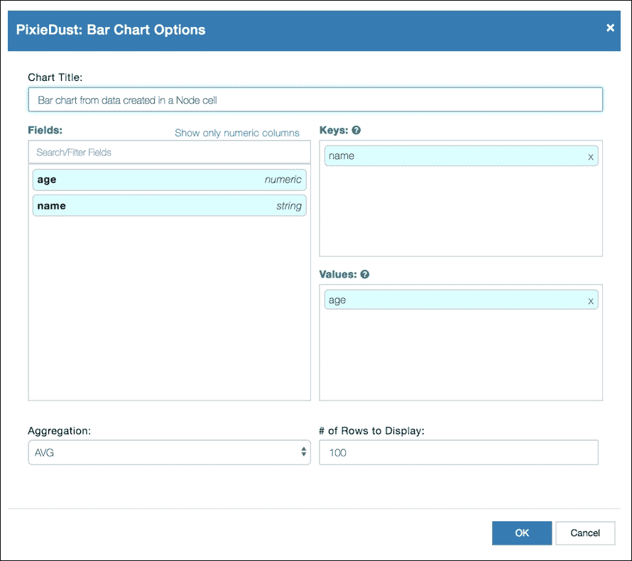

从节点单元创建的数据的 display（）选项

我们得到以下结果：

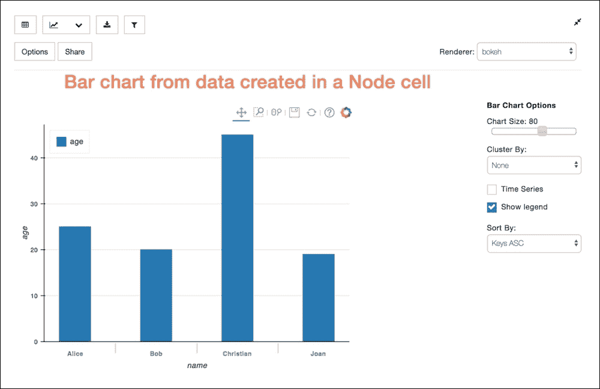

节点单元中创建的数据的条形图

通过使用`pixiedust_node`使可用的`display()`方法，我们也可以直接从 Node 单元获得相同的结果，如以下代码所示：

```py
%%node
data = {
    "name": ["Bob","Alice","Joan","Christian"],
    "age": [20, 25, 19, 45]
}
display(data)
```

如果您对了解更多有关`pixiedust_node`感兴趣，[我强烈推荐此博客文章](https://medium.com/ibm-watson-data-lab/nodebooks-node-js-data-science-notebooks-aa140bea21ba)。 与往常一样，我鼓励读者通过贡献代码或增强想法来参与改进这些工具。

# 摘要

在本章中，我们探讨了各种高级概念，工具和最佳实践，这些新概念，工具和最佳做法为我们的工具箱添加了更多工具，范围包括用于 PixieApps 的高级技术（流式处理，如何通过将第三方库与`@captureOutput`集成，实现路线， PixieApp 事件，以及使用`pd_app`更好的模块性，以实现诸如 PixieDebugger 之类的基本开发人员工具。 我们还介绍了如何使用 PixieDust `display()` API 创建自己的自定义可视化效果的详细信息。 我们还讨论了`pixiedust_node,`，它是 PixieDust 框架的扩展，使对 JavaScript 更熟悉的开发人员可以使用自己喜欢的语言处理数据。

在本书的其余部分中，我们将通过构建行业用例数据管道来充分利用所有这些经验教训，首先从第 6 章中的*深度学习视觉识别*应用程序开始 ，*使用 TensorFlow* 进行图像识别。

本书结尾的[附录](10.html#23MNU1-6bf9b9b4cfde46e3ba53bd8d61355763 "Appendix A. PixieApp Quick-Reference")， *PixieApp 快速参考*中提供了 PixieApp 编程模型的开发人员快速参考指南。