# 第 6 章。使用 TensorFlow 进行图像识别

|   | *“人工智能，深度学习，机器学习-如果您不了解它，无论您在做什么-都要学习。否则，您将在 3 年内成为恐龙。”* |   |
|   | -*马克·库班* |

这是涵盖流行行业用例的一系列示例应用程序的第一章，并且我从与机器学习有关的用例开始，也不是巧合，尤其是通过图像识别示例应用程序进行深度学习。 在过去的几年中，我们看到在**人工智能**（ **AI** ）领域加速发展，以至于许多实际应用正在成为现实，例如 自动驾驶汽车以及具有先进的自动语音识别功能的聊天机器人，在某些任务上完全可以代替人工操作，而从学术界到工业界的越来越多的人开始涉足其中。 但是，人们认为入门成本非常高，并且掌握机器学习的基本数学概念是先决条件。 在本章中，我们试图通过使用示例来证明事实并非如此。

我们将在本章开始时对机器学习进行快速介绍，并将其子集称为深度学习。 然后，我们将介绍一个非常流行的深度学习框架，称为 TensorFlow，我们将使用它来构建图像识别模型。 在本章的第二部分中，我们将展示如何通过实现示例 PixieApp 来操作已构建的模型，该示例使用户可以输入网站链接，抓取所有图像并将其用作模型的输入 对它们进行分类。

在本章的最后，您应该确信无需博士学位即可构建有意义的应用程序并使它们可操作。 在机器学习中。

# 什么是机器学习？

我认为一个很好的定义可以很好地抓住机器学习背后的直觉，这是斯坦福大学兼职教授 Andrew Ng 在 Coursera 的*机器学习*类中（ [https：// www。 coursera.org/learn/machine-learning](https://www.coursera.org/learn/machine-learning) ）：

> 机器学习是一门无需明确编程即可让计算机学习的科学。

前面定义中的关键词是*学习*，在这种情况下，其含义与人类学习方式非常相似。 为了继续进行类似的工作，从很小的时候开始，我们就被教会了如何以身作则或通过反复试验来完成一项任务。 广义上讲，机器学习算法可以分为两种类型，分别对应于人类学习的两种方式：

*   受监督的**：算法从已正确标记的示例数据中学习。 该数据也称为训练数据，或有时称为*基本事实*。**
*   **无监督的**：算法能够自行从尚未标记的数据中学习。

对于此处描述的两种类别，下表概述了最常用的机器学习算法及其解决的问题类型：

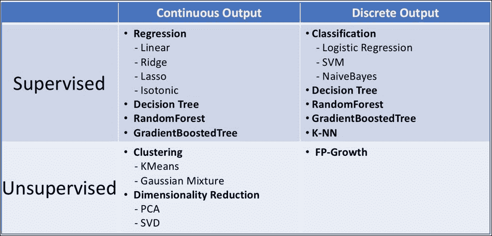

机器学习算法列表

这些算法的输出称为**模型**，用于对以前从未见过的新输入数据进行预测。 构建和部署这些模型的整个端到端过程在不同类型的算法中非常一致。

下图显示了此过程的高级工作流程：

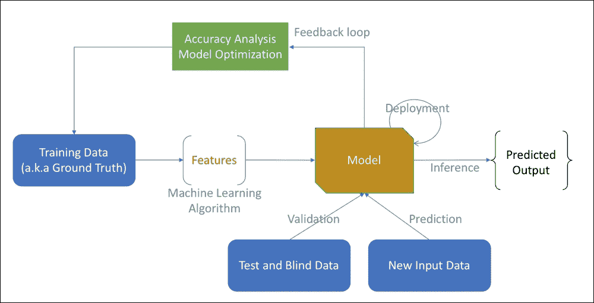

机器学习模型工作流程

与往常一样，工作流从数据开始。 在监督学习的情况下，数据将用作示例，因此必须正确标记正确答案。 然后处理输入数据以提取称为**特征**的内在属性，我们可以将其视为代表输入数据的数值。 随后，将这些特征输入构建模型的机器学习算法中。 在典型设置中，原始数据分为训练数据，测试数据和盲数据。 在模型构建阶段，将使用测试数据和盲数据来验证和优化模型，以确保其不会过度拟合训练数据。 当模型参数过于紧随训练数据时会发生过度拟合，从而在使用看不见的数据时导致错误。 当模型产生所需的精度水平时，然后将其部署到生产中，并根据主机应用程序的需要将其用于新数据。

在本节中，我们将通过简化的数据流水线工作流程对机器学习进行非常高级的介绍，仅足以直观地说明如何构建和部署模型。 再一次，如果您是初学者，我强烈推荐在 Coursera 上使用 Andrew Ng 的 *Machine Learning* 课程（我仍然会不时地复习）。 在下一节中，我们将介绍称为深度学习的机器学习分支，我们将使用它来构建图像识别样本应用程序。

# 什么是深度学习？

使计算机学习，推理和思考（做出决定）是一门被普遍称为**认知计算的科学，其中**机器学习和深度学习是其中的重要部分。 以下维恩图显示了这些字段与 AI 的总体字段的关系：

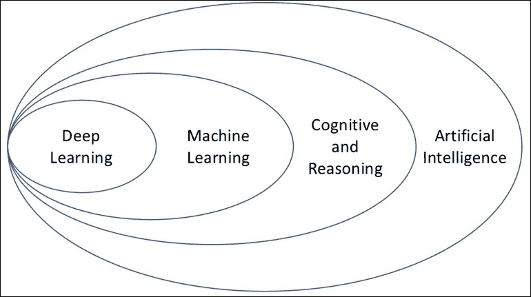

深度学习如何适应 AI

如图所示，深度学习是机器学习算法的一种。 也许尚未广为人知的是，深度学习领域已经存在了很长一段时间，但是直到最近才真正被广泛使用。 兴趣的重新点燃归因于过去几年中观察到的计算机，云和存储技术的非凡进步，随着许多新的深度学习算法的开发推动了 AI 的指数增长，每种算法都最适合解决特定问题。

正如我们将在本章稍后讨论一样，深度学习算法特别擅长学习复杂的非线性假设。 他们的设计实际上受到人脑工作方式的启发，例如，输入数据流经多层计算单元，以便将复杂的模型表示形式（例如图像）分解为更简单的模型表示形式，然后再传递给 将结果返回到下一层，依此类推，以此类推，直到到达负责输出结果的最后一层。 这些层的组装也称为**神经网络**，而组成一层的计算单元称为**神经元**。 本质上，神经元负责获取多个输入并将其转换为单个输出，然后可以将其输入到下一层的其他神经元中。

下图表示用于图像分类的多层神经网络：


用于图像分类的神经网络的高级表示

前面的神经网络也称为**前馈**，因为每个计算单元的输出都用作从输入层开始的下一层的输入。 中间层称为**隐藏层**，其中包含网络自动学习的中间功能。 在我们的图像示例中，某些神经元可能负责检测角，而其他可能关注边缘。 最终输出层负责为每个输出类分配一个置信度（得分）。

一个重要的问题是神经元的输出如何从其输入生成？ 在不深入研究所涉及的数学的情况下，每个人工神经元对其输入的加权总和应用激活函数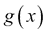以决定是否应*触发*。

以下公式计算加权和：

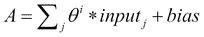

其中是 *i* 和 *i + 1* 层之间的权重矩阵。 这些权重是在训练阶段计算出来的，稍后我们将简要讨论。

### 注意

**注意**：上式中的偏差表示偏差神经元的权重，它是添加到 x 值为+1 的每一层的额外神经元。 偏向神经元是特殊的，因为它有助于下一层的输入，但它没有连接到上一层。 但是，通常仍然像其他神经元一样学习其重量。 偏向神经元背后的直觉是，它在线性回归方程中提供了常数项 b：


当然，在*上应用神经元激活函数 A* 不能简单地产生二进制（0 或 1）值，因为如果存在多个，我们将无法正确地排列最终候选答案 类的得分为 1。相反，我们使用激活函数，该函数提供介于 0 和 1 之间的非离散得分，并设置阈值（例如 0.5）来决定是否激活神经元。

乙状结肠功能是最受欢迎的激活功能之一：


下图显示了如何使用 S 型激活函数根据其输入及其权重来计算神经元输出：


使用 S 型函数计算神经元输出

其他流行的激活函数包括双曲正切和**整流线性单位**（ **ReLu** ）：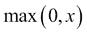。 ReLu 在有很多层时效果更好，因为可以激发*神经元的稀疏性，从而降低噪音并加快学习速度。*

在模型评分期间使用前馈传播，但是在训练神经网络的权重矩阵时，使用的一种流行方法称为**反向传播**（ [https：// zh.wikipedia.org/wiki/反向传播](https://en.wikipedia.org/wiki/Backpropagation)）。

以下高级步骤描述了培训的工作方式：

1.  随机初始化权重矩阵（最好使用较小的值，例如。
2.  使用所有训练示例上所述的前向传播，使用您选择的激活函数来计算每个神经元的输出。
3.  为您的神经网络实现成本函数。 **成本函数**量化了有关训练示例的误差。 反向传播算法可以使用多种成本函数，例如均方误差（ [https://en.wikipedia.org/wiki/Mean_squared_error](https://en.wikipedia.org/wiki/Mean_squared_error) ）和交叉熵（ [https://en.wikipedia.org/wiki/Cross_entropy](https://en.wikipedia.org/wiki/Cross_entropy) ）。
4.  使用反向传播可以最小化成本函数并计算权重矩阵。 反向传播背后的想法是从输出层的激活值开始，计算与训练数据有关的误差，然后将其误差传回隐藏层。 然后调整这些误差以最小化步骤 3 中实现的成本函数。

### 注意

**注**：详细解释这些成本函数以及如何对其进行优化超出了本书的范围。 对于更深层次的探讨，我强烈建议您阅读 MIT 出版社（Ian Goodfellow，Yoshua Bengio 和 Aaron Courville）的*深度学习*书。

在本节中，我们已高层讨论了神经网络如何工作以及如何进行训练。 当然，我们只是触及了这项令人兴奋的技术的表面，但是希望您应该对它们的工作原理有所了解。 在下一部分中，我们将开始研究 TensorFlow，这是一个编程框架，可帮助抽象实现神经网络的底层复杂性。

# TensorFlow 入门

除了 TensorFlow（ [https://www.tensorflow.org](https://www.tensorflow.org) ）之外，我还可以为该示例应用程序选择多个开源深度学习框架。

最受欢迎的一些框架如下：

*   PyTorch（ [http://pytorch.org](http://pytorch.org) ）
*   Caffee2（ [https://caffe2.ai](https://caffe2.ai) ）
*   MXNet（ [https://mxnet.apache.org](https://mxnet.apache.org) ）
*   Keras（ [https://keras.io](https://keras.io) ）：一种高级神经网络抽象 API，能够运行其他深度学习框架，例如 TensorFlow，CNTK（ [https://github.com/Microsoft / cntk](https://github.com/Microsoft/cntk) ）和 Theano（ [https://github.com/Theano/Theano](https://github.com/Theano/Theano) ）

TensorFlow API 有多种语言可用：Python，C ++，Java，Go，以及最近的 JavaScript。 我们可以区分以下两类 API：高级别和低级别，如下图所示：

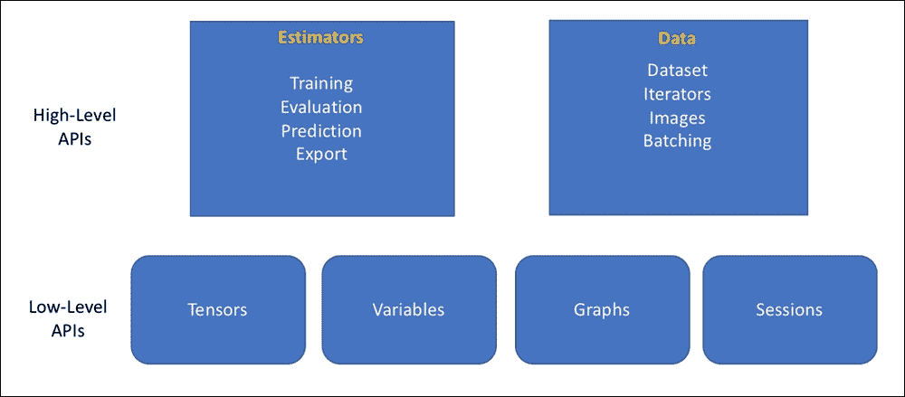

TensorFlow 高级 API 架构

为了使 TensorFlow API 成为，让我们构建一个简单的神经网络来学习 XOR 转换。

提醒一下，XOR 运算符只有四个训练示例：

<colgroup class="calibre23"><col class="calibre24"> <col class="calibre24"> <col class="calibre24"></colgroup> 
| **X** | **和** | **结果** |
| 0 | 0 | 0 |
| 0 | 1 | 1 |
| 1 | 0 | 1 |
| 1 | 1 | 0 |

有趣的是，线性分类器（ [https://en.wikipedia.org/wiki/Linear_classifier](https://en.wikipedia.org/wiki/Linear_classifier) ）无法学习 XOR 转换。 但是，我们可以通过一个简单的神经网络来解决此问题，该神经网络的输入层中包含两个神经元，一个隐藏层中包含两个神经元，而输出层中包含一个神经元（二进制分类），如下所示：


XOR 神经网络

### 注意

**注意**：您可以使用以下命令直接从笔记本计算机安装 TensorFlow：

```py
!pip install tensorflow

```

与往常一样，在成功安装后不要忘记重新启动内核。

要创建输入和输出层张量，我们使用`tf.placeholder` API，如以下代码所示：

```py
import tensorflow as tf
x_input = tf.placeholder(tf.float32)
y_output = tf.placeholder(tf.float32)
```

然后，我们使用`tf.Variable` API（ [https://www.tensorflow.org/programmers_guide/variables](https://www.tensorflow.org/programmers_guide/variables) ）初始化矩阵的随机值，而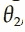对应于隐藏的 层和输出层：

```py
eps = 0.01
W1 = tf.Variable(tf.random_uniform([2,2], -eps, eps))
W2 = tf.Variable(tf.random_uniform([2,1], -eps, eps))
```

对于激活函数，我们使用 S 形函数：

### 注意

**注意**：为简单起见，我们忽略引入偏差。

```py
layer1 = tf.sigmoid(tf.matmul(x_input, W1))
output_layer = tf.sigmoid(tf.matmul(layer1, W2))
```

对于成本函数，我们使用 **MSE** （**均方误差**的缩写）：

```py
cost = tf.reduce_mean(tf.square(y_output - output_layer))
```

将所有张量放置在图中后，我们现在可以通过使用`0.05`的学习率使用`tf.train.GradientDescentOptimizer`来进行训练，以最小化我们的成本函数：

```py
train = tf.train.GradientDescentOptimizer(0.05).minimize(cost)
training_data = ([[0,0],[0,1],[1,0],[1,1]], [[0],[1],[1],[0]])
with tf.Session() as sess:
    sess.run(tf.global_variables_initializer())
    for i in range(5000):
        sess.run(train,
            feed_dict={x_input: training_data[0], y_output: training_data[1]})
```

### 注意

[您可以在此处找到代码文件](https://github.com/DTAIEB/Thoughtful-Data-Science/blob/master/chapter%206/sampleCode1.py)。

前面的代码首次引入了 TensorFlow `Session`的概念，这是框架的基础部分。 本质上，任何 TensorFlow 操作都必须使用`run`方法在`Session`的上下文中执行。 会话还维护需要使用`close`方法显式释放的资源。 为了方便起见，`Session`类通过提供`__enter__`和`__exit__`方法来支持上下文管理协议。 这允许调用者使用`with`语句（ [https://docs.python.org/3/whatsnew/2.6.html#pep-343-the-with-statement](https://docs.python.org/3/whatsnew/2.6.html#pep-343-the-with-statement) ）调用 TensorFlow 操作，并且 自动释放资源。

以下伪代码显示了 TensorFlow 执行的典型结构：

```py
with tf.Session() as sess:
    with-block statement with TensorFlow operations
```

在本部分中，我们快速探索了低级 TensorFlow API，以构建学习 XOR 转换的简单神经网络。 在下一节中，我们将探讨在低层 API 之上提供抽象层的高层估计器 API。

## 使用 DNNClassifier 进行简单分类

### 注意

[**注意**：本节讨论示例 PixieApp 的源代码。 如果您想继续学习，可以在以下位置下载完整的笔记本电脑](https://github.com/DTAIEB/Thoughtful-Data-Science/blob/master/chapter%206/TensorFlow%20classification.ipynb)。

在使用低级 TensorFlow API 使用 Tensor，Graphs 和 Sessions 之前，最好先熟悉`Estimators`软件包中提供的高级 API。 在本节中，我们将构建一个简单的 PixieApp，它将 Pandas DataFrame 作为输入并使用分类输出训练分类模型。

### 注意

**注意**：分类输出本质上有两种类型：分类输出和连续输出。 在分类器模型中，只能从具有或不具有逻辑顺序的有限预定义值列表中选择输出。 我们通常将二进制分类称为只有两个类的分类模型。 另一方面，连续输出可以具有任何数值。

首先要求用户选择一个数值列进行预测，然后对 DataFrame 中存在的所有其他数值列进行分类模型训练。

### 注意

**注意**：此示例应用程序的某些代码改编自 [https://github.com/tensorflow/models/tree/master/samples/core/get_started](https://github.com/tensorflow/models/tree/master/samples/core/get_started) 。

在此示例中，我们将使用内置样本数据集＃7：Boston Crime 数据，为期两周的样本，但是您可以使用任何其他数据集，只要它具有足够的数据和数字列即可。

提醒一下，您可以使用以下代码浏览 PixieDust 内置数据集：

```py
import pixiedust
pixiedust.sampleData()
```

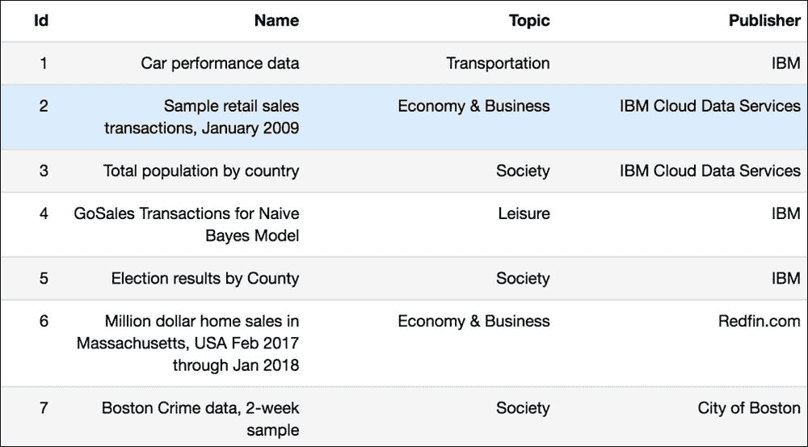

PixieDust 中的内置数据集列表

以下代码使用`sampleData()` API 加载 *Boston Crime* 数据集：

```py
import pixiedust
crimes = pixiedust.sampleData(7, forcePandas=True)
```

与往常一样，我们首先使用`display()`命令探索数据。 目标是寻找合适的列进行预测：

```py
display(crimes)
```


犯罪数据集的表格视图

看起来就像`nonviolent`是二进制分类的良好候选者。 现在让我们调出一个条形图，以确保我们在此列中具有良好的数据分布：

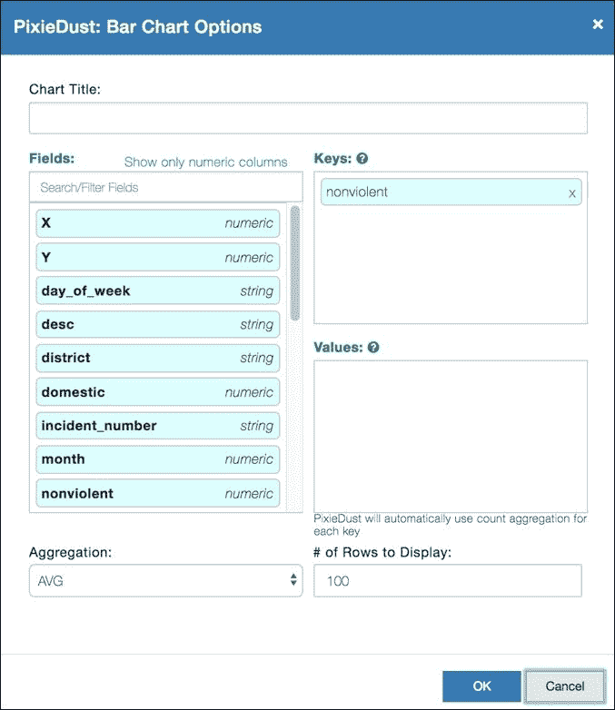

在选项对话框中选择非暴力列

单击**，然后单击确定**将产生以下图表：：

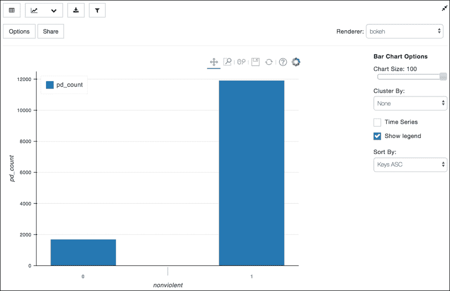

非暴力犯罪的分布

不幸的是，数据偏向于非暴力犯罪，但我们有近 2,000 个暴力犯罪数据点，就本示例应用而言，这应该是可以的。

现在，我们准备创建`do_training`方法，该方法将使用`tf.estimator.DNNClassifier`创建分类模型。

### 注意

[**注意**：您可以在此处找到有关`DNNClassifier`和其他高级 TensorFlow 估计器的更多信息](https://www.tensorflow.org/api_docs/python/tf/estimator)。

`DNNClassifier`构造函数带有很多可选参数。 在示例应用程序中，我们将仅使用其中的三个，但是我建议您看一下文档中的其他参数：

*   `feature_columns`：`feature_column._FeatureColumn`模型输入的迭代。 在我们的例子中，我们可以使用 Python 理解从 pandas DataFrame 的数字列创建一个数组。
*   `hidden_units`：每个单元可迭代的多个隐藏层。 在这里，我们将仅使用两层，每层 10 个节点。
*   `n_classes`：标签类别的数量。 我们将预测变量列上的 DataFrame 分组并计算行数来推断此数字。

这是`do_training`方法的代码：

```py
def do_training(train, train_labels, test, test_labels, num_classes):
    #set TensorFlow logging level to INFO
    tf.logging.set_verbosity(tf.logging.INFO)

    # Build 2 hidden layer DNN with 10, 10 units respectively.
    classifier = tf.estimator.DNNClassifier(
        # Compute feature_columns from dataframe keys using a list comprehension
        feature_columns =
            [tf.feature_column.numeric_column(key=key) for key in train.keys()],
        hidden_units=[10, 10],
        n_classes=num_classes)

    # Train the Model
    classifier.train(
        input_fn=lambda:train_input_fn(train, train_labels,100),
        steps=1000
    )

    # Evaluate the model
    eval_result = classifier.evaluate(
        input_fn=lambda:eval_input_fn(test, test_labels,100)
    )

    return (classifier, eval_result)
```

### 注意

[您可以在此处找到代码文件](https://github.com/DTAIEB/Thoughtful-Data-Science/blob/master/chapter%206/sampleCode2.py)。

`classifier.train`方法使用`train_input_fn`方法，该方法负责提供训练输入数据（又称地面实况）作为小批处理，返回`tf.data.Dataset`或`(features, labels)`的元组。 我们的代码也正在使用`classifier.evaluate`执行模型评估，以通过根据测试数据集对模型评分并在给定标签中比较结果来验证准确性。 然后将结果作为函数输出的一部分返回。

此方法需要与`train_input_fn`相似的`eval_input_fn`方法，除了我们在评估期间不使数据集可重复。 由于这两种方法共享大多数相同的代码，因此我们使用一种称为`input_fn`的辅助方法，这两种方法都使用适当的标志来调用该方法：

```py
def input_fn(features, labels, batch_size, train):
    # Convert the inputs to a Dataset and shuffle.
    dataset = tf.data.Dataset.from_tensor_slices((dict(features), labels)).shuffle(1000)
    if train:
        #repeat only for training
 dataset = dataset.repeat()
    # Return the dataset in batch
    return dataset.batch(batch_size)

def train_input_fn(features, labels, batch_size):
    return input_fn(features, labels, batch_size, train=True)

def eval_input_fn(features, labels, batch_size):
    return input_fn(features, labels, batch_size, train=False)
```

### 注意

[您可以在此处找到代码文件](https://github.com/DTAIEB/Thoughtful-Data-Science/blob/master/chapter%206/sampleCode3.py)。

下一步是构建 PixieApp，它将从作为输入传递给`run`方法的熊猫 DataFrame 创建分类器。 主屏幕将所有数字列的列表构建到一个下拉控件中，并要求用户选择将用作分类器输出的列。 在下面的代码中，这是通过 Jinja2 ``循环来实现的，该循环在使用`pixieapp_entity`变量引用的作为输入传递的 DataFrame 上进行迭代。

### 注意

**注意**：以下代码使用`[[SimpleClassificationDNN]]`表示法表示它不是指定类的完整代码。 在提供完整的实现之前，请勿尝试运行此代码。

```py
[[SimpleClassificationDNN]]
from pixiedust.display.app import *
@PixieApp
class SimpleClassificationDNN():
    @route()
    def main_screen(self):
        return """
<h1 style="margin:40px">
    <center>The classificiation model will be trained on all the numeric columns of the dataset</center>
</h1>
<style>
    div.outer-wrapper {
        display: table;width:100%;height:300px;
    }
    div.inner-wrapper {
        display: table-cell;vertical-align: middle;height: 100%;width: 100%;
    }
</style>
<div class="outer-wrapper">
    <div class="inner-wrapper">
        <div class="col-sm-3"></div>
        <div class="input-group col-sm-6">
          <select id="cols{{prefix}}" style="width:100%;height:30px" pd_options="predictor=$val(cols{{prefix}})">
              <option value="0">Select a predictor column</option>
              
 <option value="{{col}}">{{col}}</option>
 
          </select>
        </div>
    </div>
</div>     
        """
```

### 注意

[您可以在此处找到代码文件](https://github.com/DTAIEB/Thoughtful-Data-Science/blob/master/chapter%206/sampleCode4.py)。

使用`crimes`数据集，我们使用以下代码运行 PixieApp：

```py
app = SimpleClassificationDNN()
app.run(crimes)
```

### 注意

**注意**：PixieApp 代码目前不完整，但是我们仍然可以看到欢迎页面的结果，如以下屏幕截图所示：

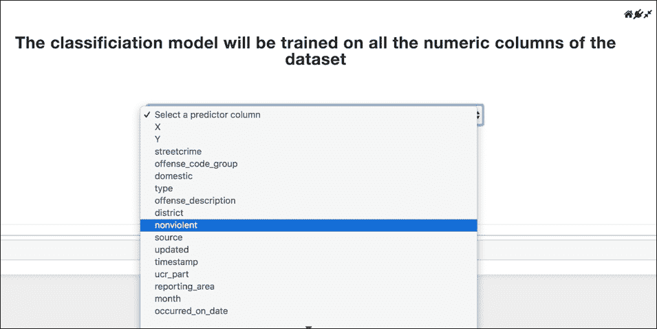

主屏幕显示输入熊猫 DataFrame 中的列列表

当用户选择预测列（例如`nonviolent`）时，新的`prepare_training`路线将由`pd_options="predictor=$val(cols{{prefix}})"`属性触发。 此路线将显示两个条形图，分别显示训练集和测试集的输出类别分布，它们是使用从原始数据集中以 80/20 分割随机选择的。

### 注意

**注意**：我们在训练集和测试集之间使用 80/20 的比例，根据我的经验，这很常见。 当然，这不是绝对的规则，可以根据用例进行调整

屏幕片段还包括一个开始训练分类器的按钮。

`prepare_training`路由的代码如下所示：

```py
[[SimpleClassificationDNN]]
@route(predictor="*")
@templateArgs
def prepare_training(self, predictor):
        #select only numerical columns
        self.dataset = self.pixieapp_entity.dropna(axis=1).select_dtypes(
            include=['int16', 'int32', 'int64', 'float16', 'float32', 'float64']
        )
        #Compute the number of classed by counting the groups
        self.num_classes = self.dataset.groupby(predictor).size().shape[0]
        #Create the train and test feature and labels
        self.train_x=self.dataset.sample(frac=0.8)
        self.full_train = self.train_x.copy()
        self.train_y = self.train_x.pop(predictor)
        self.test_x=self.dataset.drop(self.train_x.index)
        self.full_test = self.test_x.copy()
        self.test_y=self.test_x.pop(predictor)

        bar_chart_options = {
          "rowCount": "100",
          "keyFields": predictor,
          "handlerId": "barChart",
          "noChartCache": "true"
        }

        return """
<div class="container" style="margin-top:20px">
    <div class="row">
        <div class="col-sm-5">
            <h3><center>Train set class distribution</center></h3>
            <div pd_entity="full_train" pd_render_onload>
                <pd_options>{{bar_chart_options|tojson}}</pd_options>
            </div>
        </div>
        <div class="col-sm-5">
            <h3><center>Test set class distribution</center></h3>
            <div pd_entity="full_test" pd_render_onload>
                <pd_options>{{bar_chart_options|tojson}}</pd_options>
            </div>
        </div>
    </div>
</div>

<div style="text-align:center">
 <button class="btn btn-default" type="submit" pd_options="do_training=true">
 Start Training
 </button>
</div>
"""
```

### 注意

[您可以在此处找到代码文件](https://github.com/DTAIEB/Thoughtful-Data-Science/blob/master/chapter%206/sampleCode5.py)。

**注意**：由于我们计算一次`bar_chart_options`变量，然后在 Jinja2 模板中使用它，因此使用。

选择`nonviolent`预测列将为我们提供以下屏幕截图结果：


预训练屏幕

**Start Training** 按钮使用属性`pd_options="do_training=true",`调用`do_training`路线，该属性调用我们之前创建的`do_training`方法。 请注意，我们使用`@captureOutput`装饰器，因为由于我们将 TensorFlow 日志级别设置为`INFO`，所以我们希望捕获日志消息并将其显示给用户。 这些日志消息使用*流*模式发送回浏览器，PixieDust 将自动将它们显示为特殊创建的`<div>`元素，并将其添加到数据中。 训练完成后，该路由返回一个 HTML 片段，该片段会生成一个表，该表具有`do_training`方法返回的评估指标，如以下代码所示：

```py
[[SimpleClassificationDNN]]
@route(do_training="*")
   @captureOutput
def do_training_screen(self):
 self.classifier, self.eval_results = \
 do_training(
self.train_x, self.train_y, self.test_x, self.test_y, self.num_classes
 )
        return """
<h2>Training completed successfully</h2>
<table>
    <thead>
        <th>Metric</th>
        <th>Value</th>
    </thead>
    <tbody>

<tr>
    <td>{{key}}</td>
    <td>{{value}}</td>
</tr>

    </tbody>
</table>
        """
```

### 注意

[您可以在此处找到代码文件](https://github.com/DTAIEB/Thoughtful-Data-Science/blob/master/chapter%206/sampleCode6.py)。

以下屏幕快照显示了成功创建模型后的结果，并包括分类模型的评估指标表，其准确性为 87％：


最终屏幕显示成功训练的结果

使用`crimes`数据集作为参数运行此 PixieApp ，如以下代码所示：

```py
app = SimpleClassificationDNN()
app.run(crimes)
```

成功训练模型后，您可以通过调用`app.classifier`变量上的`predict`方法来访问它以对新数据进行分类。 与`train`和`evaluate`方法类似，`predict`也采用`input_fn`来构造输入特征。

### 注意

[**注意**：此处提供有关`predict`方法的更多详细信息](https://www.tensorflow.org/api_docs/python/tf/estimator/DNNClassifier#predict)。

该示例应用程序通过使用高级估计器 API 为熟悉 TensorFlow 框架提供了一个很好的起点。

### 注意

[**注意**：可在此处找到此示例应用程序的完整笔记本](https://github.com/DTAIEB/Thoughtful-Data-Science/blob/master/chapter%206/TensorFlow%20classification.ipynb)。

在下一节中，我们将开始使用低级 TensorFlow API（包括 Tensors，Graphs 和 Sessions）来构建图像识别示例应用程序。

# 图像识别示例应用程序

在涉及构建开放式应用程序的时，您首先需要定义包含足够的 **MVP** （**最低可行产品**）版本的要求。 使其实用且对用户有价值的功能。 在为实施制定技术决策时，确保尽快获得可行的端到端实施而又不花费太多时间是非常重要的标准。 这个想法是您希望从小处着手，以便快速迭代并改善您的应用程序。

对于我们的图像识别示例应用程序的 MVP，我们将使用以下要求：

*   不要从头开始构建模型； 相反，请重用已公开的预先训练的通用**卷积神经网络**（ **CNN** ： [https://en.wikipedia.org/wiki/Convolutional_neural_network](https://en.wikipedia.org/wiki/Convolutional_neural_network) ）模型之一 可用，例如 MobileNet。 我们以后总是可以使用传递学习（ [https://en.wikipedia.org/wiki/Transfer_learning](https://en.wikipedia.org/wiki/Transfer_learning) ）使用自定义训练图像来重新训练这些模型。
*   对于 MVP，虽然我们只关注得分而不是训练，但我们仍然应该使用户感兴趣。 因此，让我们构建一个 PixieApp，该应用程序允许用户输入网页的 URL 并显示从该页面抓取的所有图像，包括由我们的模型推断出的分类输出。
*   由于我们正在学习深度学习神经网络和 TensorFlow，因此如果可以在 Jupyter Notebook 中直接显示 TensorBoard Graph Visualization（ [https://www.tensorflow.org/programmers_guide/graph_viz](https://www.tensorflow.org/programmers_guide/graph_viz) ）会很棒 而不强迫用户使用其他工具。 这将提供更好的用户体验并增加他们对应用程序的参与度。

### 注意

[**注意**：本节中应用程序的实现改编自教程](https://codelabs.developers.google.com/codelabs/tensorflow-for-poets)。

## 第 1 部分–加载预训练的 MobileNet 模型

### 注意

[**注意**：您可以下载完整的笔记本，以按照此处的讨论进行操作](https://github.com/DTAIEB/Thoughtful-Data-Science/blob/master/chapter%206/Tensorflow%20VR%20Part%201.ipynb)。

在使用 CNN 的中，有很多公开可用的图像分类模型，这些模型已经在大型图像数据库（例如 ImageNet， [http://www.image-net.org](http://www.image-net.org) ）上进行了预训练。 ImageNet 已发起了多个公共挑战，例如 **ImageNet 大规模视觉识别挑战**（ **ILSVRC** ）或 Kaggle 上的 *ImageNet 对象本地化挑战*（ [https ：//www.kaggle.com/c/imagenet-object-localization-challenge](https://www.kaggle.com/c/imagenet-object-localization-challenge) ），结果非常有趣。

这些挑战已经产生了多个模型，例如 ResNet，Inception，SqueezeNet，VGGNet 或 Xception，每个模型都使用不同的神经网络体系结构。 遍历所有这些体系结构都超出了本书的范围，但是即使您还不是机器学习专家（我绝对不是），我还是鼓励您在线阅读它们。 我为该示例应用程序选择的模型是 MobileNet，因为它小巧，快速且非常准确。 它提供了用于 1,000 个图像类别的图像分类模型，对于该示例应用程序已经足够了。

为了确保代码的稳定性，[我在 GitHub 存储库中复制了该模型](https://github.com/DTAIEB/Thoughtful-Data-Science/tree/master/chapter%206/Visual%20Recognition/mobilenet_v1_0.50_224)。

在此目录中，您可以找到以下文件：

*   `frozen_graph.pb`：TensorFlow 图的序列化二进制版本
*   `labels.txt`：一个文本文件，其中包含对 1,000 个图像类别及其索引的描述
*   `quantized_graph.pb`：模型图的压缩形式，使用 8 位定点表示

加载模型包括构建`tf.graph`对象和相关标签。 由于将来可能要加载多个模型，因此我们首先定义一个字典，该字典提供有关模型的元数据：

```py
models = {
    "mobilenet": {
        "base_url":"https://github.com/DTAIEB/Thoughtful-Data-Science/raw/master/chapter%206/Visual%20Recognition/mobilenet_v1_0.50_224",
        "model_file_url": "frozen_graph.pb",
        "label_file": "labels.txt",
        "output_layer": "MobilenetV1/Predictions/Softmax"
    }
}
```

### 注意

[您可以在这里找到文件](https://github.com/DTAIEB/Thoughtful-Data-Science/blob/master/chapter%206/sampleCode7.py)。

前面的`models`字典中的中的每个键都代表特定模型的元数据：

*   `base_url`：指向文件存储的 URL
*   `model_file_url`：假定相对于`base_url`的模型文件的名称
*   `label_file`：假定相对于`base_url`的标签名称
*   `output_layer`：为每个类别提供最终评分的输出层的名称

我们实现了`get_model_attribute`帮助方法，以方便读取`model`元数据，这在整个应用程序中将非常有用：

```py
# helper method for reading attributes from the model metadata
def get_model_attribute(model, key, default_value = None):
    if key not in model:
        if default_value is None:
            raise Exception("Require model attribute {} not found".format(key))
        return default_value
    return model[key]
```

### 注意

[您可以在此处找到代码文件](https://github.com/DTAIEB/Thoughtful-Data-Science/blob/master/chapter%206/sampleCode8.py)。

要加载图，我们下载二进制文件，使用`ParseFromString`方法将其加载到`tf.GraphDef`对象中，然后使用图作为当前内容管理器来调用`tf.import_graph_def`方法：

```py
import tensorflow as tf
import requests
# Helper method for resolving url relative to the selected model
def get_url(model, path):
    return model["base_url"] + "/" + path

# Download the serialized model and create a TensorFlow graph
def load_graph(model):
    graph = tf.Graph()
    graph_def = tf.GraphDef()
    graph_def.ParseFromString(
        requests.get( get_url( model, model["model_file_url"] ) ).content
    )
    with graph.as_default():
        tf.import_graph_def(graph_def)
    return graph
```

### 注意

[您可以在此处找到代码文件](https://github.com/DTAIEB/Thoughtful-Data-Science/blob/master/chapter%206/sampleCode9.py)。

加载标签的方法返回一个 JSON 对象或一个数组（我们将在后面看到两者）。 以下代码使用 Python 列表推导来迭代`requests.get`调用返回的行。 然后，它使用`as_json`标志来适当地格式化数据：

```py
# Load the labels
def load_labels(model, as_json = False):
    labels = [line.rstrip() \
      for line in requests.get(get_url(model, model["label_file"]) ).text.split("\n") if line != ""]
    if as_json:
        return [{"index": item.split(":")[0],"label":item.split(":")[1]} for item in labels]
    return labels
```

### 注意

[您可以在此处找到代码文件](https://github.com/DTAIEB/Thoughtful-Data-Science/blob/master/chapter%206/sampleCode10.py)。

下一步是调用模型对图像进行分类。 为了使其更简单并且可能更有价值，我们要求用户提供指向包含要分类图像的 HTML 页面的 URL。 我们将使用 BeautifulSoup4 库来帮助解析页面。 要安装 BeautifulSoup4，只需运行以下命令：

```py
!pip install beautifulsoup4

```

### 注意

**注意**：与往常一样，安装完成后，不要忘记重新启动内核。

下面的`get_image_urls`方法将 URL 作为输入，下载 HTML，实例化 BeautifulSoup 解析器，并提取以任何``元素和`background-image`样式找到的所有图像。 BeautifulSoup 具有一个非常优雅且易于使用的 API，用于解析 HTML。 在这里，我们仅使用`find_all`方法查找所有``元素，然后使用`select`方法选择所有具有内联样式的元素。 读者会很快注意到还有许多其他方法可以使用我们没有发现的 HTML 来创建图像，例如，声明为 CSS 类的图像。 与往常一样，如果您有兴趣和时间来改进它，我强烈欢迎 GitHub 存储库中的请求请求（有关如何创建请求请求的说明，[请参见此处](https://help.github.com/articles/creating-a-pull-request)）。

`get_image_urls`的代码如下所示：

```py
from bs4 import BeautifulSoup as BS
import re

# return an array of all the images scraped from an html page
def get_image_urls(url):
    # Instantiate a BeautifulSoup parser
    soup = BS(requests.get(url).text, "html.parser")

    # Local helper method for extracting url
    def extract_url(val):
        m = re.match(r"url\((.*)\)", val)
        val = m.group(1) if m is not None else val
        return "http:" + val if val.startswith("//") else val

    # List comprehension that look for  elements and backgroud-image styles
    return [extract_url(imgtag['src']) for imgtag in soup.find_all('img')] + [ \
        extract_url(val.strip()) for key,val in \
        [tuple(selector.split(":")) for elt in soup.select("[style]") \
            for selector in elt["style"].strip(" ;").split(";")] \
            if key.strip().lower()=='background-image' \
        ]
```

### 注意

[您可以在此处找到代码文件](https://github.com/DTAIEB/Thoughtful-Data-Science/blob/master/chapter%206/sampleCode11.py)。

对于发现的每个图像，我们还需要一个辅助函数来下载将作为输入传递到模型进行分类的图像。

以下`download_image`方法将图像下载到一个临时文件中：

```py
import tempfile
def download_image(url):
   response = requests.get(url, stream=True)
   if response.status_code == 200:
      with tempfile.NamedTemporaryFile(delete=False) as f:
 for chunk in response.iter_content(2048):
 f.write(chunk)
         return f.name
   else:
      raise Exception("Unable to download image: {}".format(response.status_code))
```

### 注意

[您可以在此处找到代码文件](https://github.com/DTAIEB/Thoughtful-Data-Science/blob/master/chapter%206/sampleCode12.py)。

给定图像的本地路径，我们现在需要通过从`tf.image`包（即`.png`文件的`decode_png`）调用正确的解码方法，将其解码为张量。

### 注意

**注**：在数学中，张量是向量的概括，向量由方向和大小定义，以支持更高的维度。 向量是 1 阶张量，类似地，标量是 0 阶张量。直观地，我们可以将 2 阶张量视为一个二维数组，其值定义为两个向量相乘的结果。 在 TensorFlow 中，张量是 n 维数组。

在图像读取器张量上进行了一些转换（广播到右边的小数表示，调整大小和规格化）之后，我们在规格化张量上调用`tf.Session.run`以使执行之前定义的步骤，如以下代码所示：

```py
# decode a given image into a tensor
def read_tensor_from_image_file(model, file_name):
    file_reader = tf.read_file(file_name, "file_reader")
    if file_name.endswith(".png"):
        image_reader = tf.image.decode_png(file_reader, channels = 3,name='png_reader')
    elif file_name.endswith(".gif"):
        image_reader = tf.squeeze(tf.image.decode_gif(file_reader,name='gif_reader'))
    elif file_name.endswith(".bmp"):
        image_reader = tf.image.decode_bmp(file_reader, name='bmp_reader')
    else:
        image_reader = tf.image.decode_jpeg(file_reader, channels = 3, name='jpeg_reader')
    float_caster = tf.cast(image_reader, tf.float32)
    dims_expander = tf.expand_dims(float_caster, 0);

    # Read some info from the model metadata, providing default values
    input_height = get_model_attribute(model, "input_height", 224)
    input_width = get_model_attribute(model, "input_width", 224)
    input_mean = get_model_attribute(model, "input_mean", 0)
    input_std = get_model_attribute(model, "input_std", 255)

    resized = tf.image.resize_bilinear(dims_expander, [input_height, input_width])
    normalized = tf.divide(tf.subtract(resized, [input_mean]), [input_std])
    sess = tf.Session()
    result = sess.run(normalized)
    return result
```

### 注意

[您可以在此处找到代码文件](https://github.com/DTAIEB/Thoughtful-Data-Science/blob/master/chapter%206/sampleCode13.py)。

一切准备就绪后，我们现在就可以实现`score_image`方法，该方法将`tf.graph`，模型元数据和图像的 URL 作为输入参数，并根据其置信度返回前五个候​​选类别 分数，包括其标签：

```py
import numpy as np

# classify an image given its url
def score_image(graph, model, url):
    # Get the input and output layer from the model
    input_layer = get_model_attribute(model, "input_layer", "input")
    output_layer = get_model_attribute(model, "output_layer")

    # Download the image and build a tensor from its data
    t = read_tensor_from_image_file(model, download_image(url))

    # Retrieve the tensors corresponding to the input and output layers
    input_tensor = graph.get_tensor_by_name("import/" + input_layer + ":0");
    output_tensor = graph.get_tensor_by_name("import/" + output_layer + ":0");

    with tf.Session(graph=graph) as sess:
        results = sess.run(output_tensor, {input_tensor: t})
    results = np.squeeze(results)
    # select the top 5 candidate and match them to the labels
    top_k = results.argsort()[-5:][::-1]
 labels = load_labels(model)
 return [(labels[i].split(":")[1], results[i]) for i in top_k]

```

### 注意

[您可以在此处找到代码文件](https://github.com/DTAIEB/Thoughtful-Data-Science/blob/master/chapter%206/sampleCode14.py)。

现在，我们可以使用以下步骤测试代码：

1.  选择`mobilenet`模型并加载相应的图
2.  获取从 Flickr 网站抓取的图像 URL 的列表
3.  为每个图像 URL 调用`score_image`方法并打印结果

代码如下所示：

```py
model = models['mobilenet']
graph = load_graph(model)
image_urls = get_image_urls("https://www.flickr.com/search/?text=cats")
for url in image_urls:
    results = score_image(graph, model, url)
    print("Result for {}: \n\t{}".format(url, results))
```

### 注意

[您可以在此处找到代码文件](https://github.com/DTAIEB/Thoughtful-Data-Science/blob/master/chapter%206/sampleCode15.py)。

结果非常准确（除了第一张图像是空白图像），如以下屏幕截图所示：


在 Flickr 页面上找到与猫有关的图像的分类

我们的图像识别示例应用程序的第 1 部分现已完成； 您可以在以下位置找到完整的笔记本： [https://github.com/DTAIEB/Thoughtful-Data-Science/blob/master/chapter%206/Tensorflow%20VR%20Part%201.ipynb](https://github.com/DTAIEB/Thoughtful-Data-Science/blob/master/chapter%206/Tensorflow%20VR%20Part%201.ipynb) 。

在下一部分中，我们将通过使用 PixieApp 构建用户界面来构建更加用户友好的体验。

## 第 2 部分–为我们的图像识别示例应用程序创建 PixieApp

### 注意

[**注意**：您可以下载完整的笔记本，以按照此处的讨论进行操作](https://github.com/DTAIEB/Thoughtful-Data-Science/blob/master/chapter%206/Tensorflow%20VR%20Part%202.ipynb)。

提醒一下，PixieApp 的`setup`方法（如果已定义）是在应用开始运行之前执行的。 我们使用选择模型并初始化图形：

```py
from pixiedust.display.app import *

@PixieApp
class ScoreImageApp():
    def setup(self):
        self.model = models["mobilenet"]
        self.graph = load_graph( self.model )
    ...
```

### 注意

[您可以在此处找到代码文件](https://github.com/DTAIEB/Thoughtful-Data-Science/blob/master/chapter%206/sampleCode16.py)。

在 PixieApp 的主屏幕中，我们使用输入框让用户输入网页的 URL，如以下代码片段所示：

```py
[[ScoreImageApp]]
@route()
def main_screen(self):
   return """
<style>
    div.outer-wrapper {
        display: table;width:100%;height:300px;
    }
    div.inner-wrapper {
        display: table-cell;vertical-align: middle;height: 100%;width: 100%;
    }
</style>
<div class="outer-wrapper">
    <div class="inner-wrapper">
        <div class="col-sm-3"></div>
        <div class="input-group col-sm-6">
          <input id="url{{prefix}}" type="text" class="form-control"
              value="https://www.flickr.com/search/?text=cats"
              placeholder="Enter a url that contains images">
          <span class="input-group-btn">
            <button class="btn btn-default" type="button" pd_options="image_url=$val(url{{prefix}})">Go</button>
          </span>
        </div>
    </div>
</div>
"""
```

### 注意

[您可以在此处找到代码文件](https://github.com/DTAIEB/Thoughtful-Data-Science/blob/master/chapter%206/sampleCode17.py)。

为了方便起见，我们使用默认值`https://www.flickr.com/search/?text=cats`初始化输入文本。

我们已经可以使用以下代码运行代码以测试主屏幕：

```py
app = ScoreImageApp()
app.run()
```

主屏幕如下所示：


图像识别 PixieApp 的主屏幕

### 注意

**注意**：这对测试很有用，但是我们要记住，`do_process_url`路由尚未实现，因此，单击 **Go** 按钮将退回到 再次使用默认路由。

现在让我们实现`do_process_url`路由，该路由在用户单击 **Go** 按钮时触发。 该路由首先调用`get_image_urls`方法以获取图像 URL 列表。 然后，使用 Jinja2，我们构建一个 HTML 片段来显示所有图像。 对于每个图像，我们异步调用运行模型并显示结果的`do_score_url`路由。

以下代码显示了`do_process_url`路由的实现：

```py
[[ScoreImageApp]]
@route(image_url="*")
@templateArgs
def do_process_url(self, image_url):
    image_urls = get_image_urls(image_url)
    return """
<div>

<div style="float: left; font-size: 9pt; text-align: center; width: 30%; margin-right: 1%; margin-bottom: 0.5em;">

  <div style="display:inline-block" pd_render_onload pd_options="score_url={{url}}">
  </div>
</div>

<p style="clear: both;">
</div>
        """
```

### 注意

[您可以在此处找到代码文件](https://github.com/DTAIEB/Thoughtful-Data-Science/blob/master/chapter%206/sampleCode18.py)。

注意`@templateArgs`装饰器的使用，它允许 Jinja2 片段引用本地`image_urls`变量。

最后，在`do_score_url`路由中，我们调用`score_image`并将结果显示为列表：

```py
[[ScoreImageApp]]
@route(score_url="*")
@templateArgs
def do_score_url(self, score_url):
    results = score_image(self.graph, self.model, score_url)
    return """
<ul style="text-align:left">

<li><b>{{label}}</b>: {{confidence}}</li>

</ul>
"""
```

### 注意

[您可以在此处找到代码文件](https://github.com/DTAIEB/Thoughtful-Data-Science/blob/master/chapter%206/sampleCode19.py)。

以下屏幕截图显示了包含猫图像的 Flickr 页面的结果：

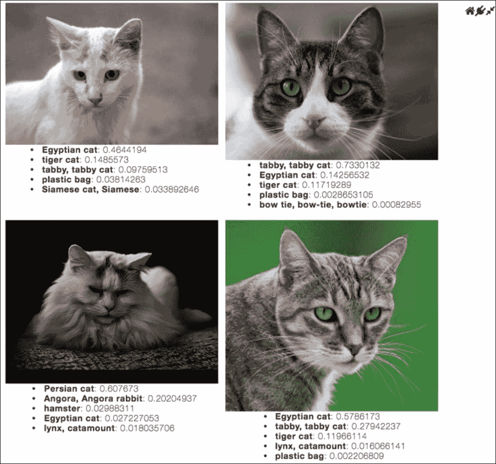

猫的图像分类结果

### 注意

[提醒一下，您可以在以下位置找到完整的笔记本](https://github.com/DTAIEB/Thoughtful-Data-Science/blob/master/chapter%206/Tensorflow%20VR%20Part%202.ipynb)。

我们的 MVP 应用程序即将完成。 在下一节中，我们将在笔记本中直接集成 TensorBoard 图形可视化。

## 第 3 部分–集成 TensorBoard 图形可视化

### 注意

[**注意**：本节中描述的部分代码改编自位于此处的`deepdream`笔记本](https://github.com/tensorflow/tensorflow/blob/master/tensorflow/examples/tutorials/deepdream/deepdream.ipynb)。

[您可以在此处下载完整的笔记本以遵循本节的讨论](https://github.com/DTAIEB/Thoughtful-Data-Science/blob/master/chapter%206/Tensorflow%20VR%20Part%203.ipynb)。

TensorFlow 带有非常强大的可视化套件，可帮助您调试和优化应用程序的性能。 [请花一点时间在这里探索 TensorBoard 功能](https://www.tensorflow.org/programmers_guide/summaries_and_tensorboard)。

这里的一个问题是，配置 TensorBoard 服务器以使其与笔记本电脑一起使用可能会很困难，尤其是如果您的笔记本电脑托管在云中，并且您几乎无法访问基础操作系统。 在这种情况下，配置和启动 TensorBoard 服务器可能证明是不可能的任务。 在本节中，我们将说明如何通过将模型图可视化直接集成到您的笔记本电脑中（零配置）来解决此问题。 为了提供更好的用户体验，我们想将 TensorBoard 可视化添加到我们的 PixieApp 中。 为此，我们将主布局更改为选项卡布局，然后将 TensorBoard 可视化效果分配给自己的选项卡。 方便地，PixieDust 提供了一个名为`TemplateTabbedApp`的基本 PixieApp，用于构建选项卡式布局。 使用`TemplateTabbedApp`作为基类时，我们需要按以下方式配置`setup`方法中的选项卡：

```py
[[ImageRecoApp]]
from pixiedust.apps.template import TemplateTabbedApp
@PixieApp
class ImageRecoApp(TemplateTabbedApp):
    def setup(self):
        self.apps = [
            {"title": "Score", "app_class": "ScoreImageApp"},
            {"title": "Model", "app_class": "TensorGraphApp"},
            {"title": "Labels", "app_class": "LabelsApp"}
        ]
        self.model = models["mobilenet"]
        self.graph = self.load_graph(self.model)

app = ImageRecoApp()
app.run()
```

### 注意

[您可以在此处找到代码文件](https://github.com/DTAIEB/Thoughtful-Data-Science/blob/master/chapter%206/sampleCode20.py)。

应该注意的是，在前面的代码中，我们尚未将`LabelsApp`子 PixieApp 添加到选项卡列表中，即使尚未实现。 因此，按预期，如果按原样运行代码，则`Labels`选项卡将失败。

`self.apps`包含定义选项卡的对象数组：

*   `title`：标签标题
*   `app_class`：选择选项卡时运行的 PixieApp

在`ImageRecoApp`中，我们配置了与三个子 PixieApps 相关的三个选项卡：我们已经在*第 2 部分中创建的`ScoreImageApp`-为我们的图像识别示例应用程序*创建一个 PixieApp，为 会显示模型图，`LabelsApp`会显示模型中使用的所有标签类别的表格。

结果显示在以下屏幕截图中：


选项卡式布局，其中包括得分，模型和标签

使用`TemplateTabbedApp`超类的另一个好处是，分别定义了子 PixieApps，这使代码更易于维护和重用。

首先让我们看一下`TensorGraphApp` PixieApp。 它的主要路线返回一个 HTML 片段，该片段将`tf-graph-basic.build.html`从`https://tensorboard.appspot.com,`加载到 iframe 中，并使用 JavaScript 加载侦听器应用通过`tf.Graph.as_graph_def`方法计算的序列化图定义。 为确保图形定义保持合理的大小，并避免浏览器客户端上不必要的性能下降，我们调用`strip_consts`方法来移除具有大尺寸的恒定值的张量。

`TensorGraphApp`的代码如下所示：

```py
@PixieApp
class TensorGraphApp():
    """Visualize TensorFlow graph."""
    def setup(self):
        self.graph = self.parent_pixieapp.graph

    @route()
    @templateArgs
    def main_screen(self):
        strip_def = self.strip_consts(self.graph.as_graph_def())
        code = """
            <script>
              function load() {{
                document.getElementById("{id}").pbtxt = {data};
              }}
            </script>
            <link rel="import" href="https://tensorboard.appspot.com/tf-graph-basic.build.html" onload=load()>
            <div style="height:600px">
              <tf-graph-basic id="{id}"></tf-graph-basic>
            </div>
        """.format(data=repr(str(strip_def)), id='graph'+ self.getPrefix()).replace('"', '&quot;')

        return """
<iframe seamless style="width:1200px;height:620px;border:0" srcdoc="{{code}}"></iframe>
"""

    def strip_consts(self, graph_def, max_const_size=32):
        """Strip large constant values from graph_def."""
        strip_def = tf.GraphDef()
        for n0 in graph_def.node:
            n = strip_def.node.add() 
            n.MergeFrom(n0)
            if n.op == 'Const':
                tensor = n.attr['value'].tensor
                size = len(tensor.tensor_content)
                if size > max_const_size:
                    tensor.tensor_content = "<stripped {} bytes>".format(size).encode("UTF-8")
        return strip_def
```

### 注意

[您可以在此处找到代码文件](https://github.com/DTAIEB/Thoughtful-Data-Science/blob/master/chapter%206/sampleCode21.py)。

**注意**：子级 PixieApps 可以通过`self.parent_pixieapp`变量访问其父级 PixieApp。

以下屏幕快照显示了`TensorGraphApp`子 PixieApp 的结果屏幕。 它为选定的模型提供了 TensorFlow 图的交互式可视化，允许用户浏览不同的节点并深入研究模型。 但是，重要的是要注意，可视化完全在浏览器中运行，而没有 TensorBoard 服务器。 因此，整个 TensorBoard 中可用的某些功能（例如运行时统计信息）被禁用。

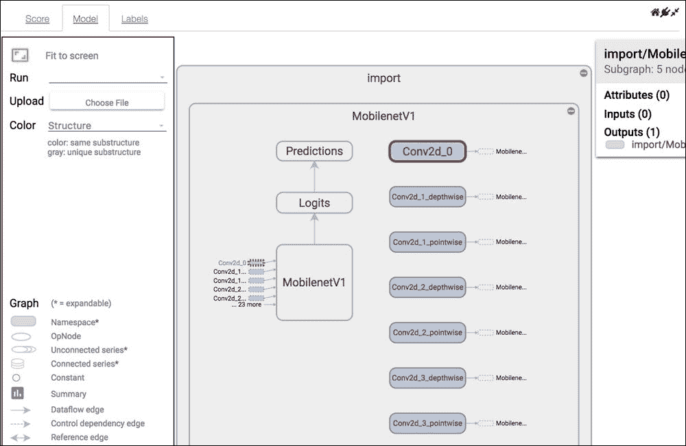

显示 MobileNet V1 的模型图

在`LabelsApp` PixieApp 中，我们简单地将标签加载为 JSON 格式，并使用`handlerId=tableView`选项在 PixieDust 表中显示它：

```py
[[LabelsApp]]
@PixieApp
class LabelsApp():
    def setup(self):
        self.labels = self.parent_pixieapp.load_labels(
            self.parent_pixieapp.model, as_json=True
        )

    @route()
    def main_screen(self):
        return """
<div pd_render_onload pd_entity="labels">
    <pd_options>
    {
        "table_noschema": "true",
 "handlerId": "tableView",
        "rowCount": "10000"
    }
    </pd_options>
</div>
        """
```

### 注意

[您可以在此处找到代码文件](https://github.com/DTAIEB/Thoughtful-Data-Science/blob/master/chapter%206/sampleCode22.py)。

**注意**：我们通过将`table_noschema`设置为`true`将表配置为不显示架构，但是为了方便起见，我们保留了搜索栏。

结果显示在以下屏幕截图中：


可搜索的表中的模型类别

我们的 MVP 图像识别示例应用程序现已完成； 您可以在此处找到完整的笔记本： [https://github.com/DTAIEB/Thoughtful-Data-Science/blob/master/chapter%206/Tensorflow%20VR%20Part%203.ipynb](https://github.com/DTAIEB/Thoughtful-Data-Science/blob/master/chapter%206/Tensorflow%20VR%20Part%203.ipynb) 。

在下一个部分，我们将通过允许用户使用自定义图像重新训练模型来改进应用程序。

## 第 4 部分–使用自定义训练数据重新训练模型

### 注意

[**注意**：您可以下载完整的笔记本，以按照此处的讨论进行操作](https://github.com/DTAIEB/Thoughtful-Data-Science/blob/master/chapter%206/Tensorflow%20VR%20Part%204.ipynb)。

本节中的代码相当广泛，一些与该主题不直接相关的帮助器功能将被省略。 但是，与往常一样，请参阅 GitHub 上完整的 Notebook 以获取有关代码的更多信息。

在本节中，我们希望使用自定义训练数据对 MobileNet 模型进行再训练，并使用它来对在常规模型上得分较低的图像进行分类。

### 注意

[**注意**：本节中的代码改编自 *TensorFlow，用于诗人*教程](https://github.com/googlecodelabs/tensorflow-for-poets-2/blob/master/scripts/retrain.py)。

在大多数情况下，获得高质量的培训数据可能是最艰巨且耗时的任务之一。 在我们的示例中，我们要训练的每个类都需要大量的图像。 为了简单和可重复性，我们使用 ImageNet 数据库方便地提供用于获取 URL 和相关标签的 API。 我们还将下载的文件限制为`.jpg`文件。 当然，如有需要，随时获取您自己的培训数据。

我们首先下载了 2011 年秋季版本中所有图像 URL 的列表，[可在此处下载](http://image-net.org/imagenet_data/urls/imagenet_fall11_urls.tgz)，然后将文件解压缩为 您选择的本地目录（例如，我选择`/Users/dtaieb/Downloads/fall11_urls.txt`）。我们还需要下载[上所有`synsets`的 WordNet ID 和单词之间的映射，网址为 http://image-net.org/archive/ words.txt](http://image-net.org/archive/words.txt) ，我们将使用它来查找包含我们需要下载的 URL 的 WordNet ID。

以下代码将两个文件分别加载到 pandas DataFrame 中：

```py
import pandas
wnid_to_urls = pandas.read_csv('/Users/dtaieb/Downloads/fall11_urls.txt',
                sep='\t', names=["wnid", "url"],
                header=0, error_bad_lines=False,
                warn_bad_lines=False, encoding="ISO-8859-1")
wnid_to_urls['wnid'] = wnid_to_urls['wnid'].apply(lambda x: x.split("_")[0])
wnid_to_urls = wnid_to_urls.dropna()

wnid_to_words = pandas.read_csv('/Users/dtaieb/Downloads/words.txt',
                sep='\t', names=["wnid", "description"],
                header=0, error_bad_lines=False,
                warn_bad_lines=False, encoding="ISO-8859-1")
wnid_to_words = wnid_to_words.dropna()
```

### 注意

[您可以在此处找到代码文件](https://github.com/DTAIEB/Thoughtful-Data-Science/blob/master/chapter%206/sampleCode23.py)。

注意，我们需要清除`wnid_to_urls`数据集中的`wnid`列，因为它包含与类别中图像索引相对应的后缀。

然后，我们可以定义方法`get_url_for_keywords`，该方法返回一个字典，其中包含作为关键字的类别和作为值的 URL 数组：

```py
def get_url_for_keywords(keywords):
    results = {}
    for keyword in keywords:
        df = wnid_to_words.loc[wnid_to_words['description'] == keyword]
        row_list = df['wnid'].values.tolist()
        descriptions = df['description'].values.tolist()
        if len(row_list) > 0:
            results[descriptions[0]] = \
            wnid_to_urls.loc[wnid_to_urls['wnid'] == \
            row_list[0]]["url"].values.tolist()
    return results
```

### 注意

[您可以在此处找到代码文件](https://github.com/DTAIEB/Thoughtful-Data-Science/blob/master/chapter%206/sampleCode24.py)。

通过使用 PixieDust `display`，我们可以轻松浏览一下数据分布。 与往常一样，随时可以自己进行更多探索：


按类别分配图像

我们现在可以构建代码，该代码将下载与我们选择的类别列表相对应的图像。 在本例中，我们选择了水果：`["apple", "orange", "pear", "banana"]`。 图像将被下载到 PixieDust 主目录的子目录中（使用`pixiedust.utils`包中的 PixieDust `Environment` helper 类），从而将图像数量限制为`500`以提高速度：

### 注意

**注意**：以下代码使用笔记本中先前定义的方法和导入。 在尝试运行以下代码之前，请确保运行相应的单元格。

```py
from pixiedust.utils.environment import Environment
root_dir = ensure_dir_exists(os.path.join(Environment.pixiedustHome, "imageRecoApp")
image_dir = root_dir
image_dict = get_url_for_keywords(["apple", "orange", "pear", "banana"])
with open(os.path.join(image_dir, "retrained_label.txt"), "w") as f_label:
    for key in image_dict:
        f_label.write(key + "\n")
        path = ensure_dir_exists(os.path.join(image_dir, key))
        count = 0
        for url in image_dict[key]:
            download_image_into_dir(url, path)
            count += 1
            if count > 500:
                break;
```

### 注意

[您可以在此处找到代码文件](https://github.com/DTAIEB/Thoughtful-Data-Science/blob/master/chapter%206/sampleCode25.py)。

代码的下一部分使用以下步骤处理训练集中的每个图像：

### 注意

**注意**：如前所述，该代码相当广泛，并且省略了一部分； 这里仅说明重要部分。 请不要尝试按原样运行以下代码，并且请参阅完整的 Notebook 以获取完整的实现。

1.  Decode the `.jpeg` file using the following code:

    ```py
    def add_jpeg_decoding(model):
        input_height = get_model_attribute(model,
                       "input_height")
        input_width = get_model_attribute(model, "input_width")
        input_depth = get_model_attribute(model, "input_depth")
        input_mean = get_model_attribute(model, "input_mean",
                     0)
        input_std = get_model_attribute(model, "input_std",
                    255)

        jpeg_data = tf.placeholder(tf.string,
                    name='DecodeJPGInput')
        decoded_image = tf.image.decode_jpeg(jpeg_data,
                        channels=input_depth)
        decoded_image_as_float = tf.cast(decoded_image,
                                 dtype=tf.float32)
        decoded_image_4d =  tf.expand_dims(
                           decoded_image_as_float,
                           0)
        resize_shape = tf.stack([input_height, input_width])
        resize_shape_as_int = tf.cast(resize_shape,
                              dtype=tf.int32)
        resized_image = tf.image.resize_bilinear(
                        decoded_image_4d,
                        resize_shape_as_int)
        offset_image = tf.subtract(resized_image, input_mean)
        mul_image = tf.multiply(offset_image, 1.0 / input_std)
        return jpeg_data, mul_image
    ```

    ### 注意

    您可以在此处找到代码文件：

    [https://github.com/DTAIEB/Thoughtful-Data-Science/blob/master/chapter%206/sampleCode26.py](https://github.com/DTAIEB/Thoughtful-Data-Science/blob/master/chapter%206/sampleCode26.py)

2.  Create the bottleneck values (caching them as appropriate) that normalize the image by resizing and rescaling it. This is done in the following code:

    ```py
    def run_bottleneck_on_image(sess, image_data,
        image_data_tensor,decoded_image_tensor,
        resized_input_tensor,bottleneck_tensor):
        # First decode the JPEG image, resize it, and rescale the pixel values.
        resized_input_values = sess.run(decoded_image_tensor,
            {image_data_tensor: image_data})
        # Then run it through the recognition network.
        bottleneck_values = sess.run(
            bottleneck_tensor,
            {resized_input_tensor: resized_input_values})
        bottleneck_values = np.squeeze(bottleneck_values)
        return bottleneck_values
    ```

    ### 注意

    您可以在此处找到代码文件：

    [https://github.com/DTAIEB/Thoughtful-Data-Science/blob/master/chapter%206/sampleCode27.py](https://github.com/DTAIEB/Thoughtful-Data-Science/blob/master/chapter%206/sampleCode27.py)

3.  在公共名称空间下，使用`add_final_training_ops`方法添加最终的训练操作，以便在可视化图形时更易于操作。 训练步骤如下：

    1.  使用`tf.truncated_normal` API 生成随机权重：

        ```py
              initial_value = tf.truncated_normal(
                  [bottleneck_tensor_size, class_count],
                  stddev=0.001)
                  layer_weights = tf.Variable(
                      initial_value, name='final_weights')
        ```

    2.  添加偏差，并初始化为零：

        ```py
              layer_biases = tf.Variable(tf.zeros([class_count]),
                  name='final_biases')
        ```

    3.  计算加权和：

        ```py
              logits = tf.matmul(bottleneck_input, layer_weights) +
                  layer_biases
        ```

    4.  添加`cross_entropy`成本函数：

        ```py
              cross_entropy =
                  tf.nn.softmax_cross_entropy_with_logits(
                  labels=ground_truth_input, logits=logits)
              with tf.name_scope('total'):
                  cross_entropy_mean = tf.reduce_mean(
                  cross_entropy)
        ```

        ]
    5.  最小化成本函数：

        ```py
              optimizer = tf.train.GradientDescentOptimizer(
                  learning_rate)
              train_step = optimizer.minimize(cross_entropy_mean)
        ```

为了可视化重新训练的图形，我们首先需要更新`TensorGraphApp` PixieApp，以让用户选择要可视化的模型：通用 MobileNet 或自定义。 这是通过在主路径中添加`<select>`下拉菜单并附加`pd_script`元素来更新状态来完成的：

```py
[[TensorGraphApp]]
return """

<div style="margin-top:10px" pd_refresh>
    <pd_script>
self.graph = self.custom_graph if self.graph is not self.custom_graph else self.parent_pixieapp.graph
    </pd_script>
    <span style="font-weight:bold">Select a model to display:</span>
    <select>
 <option selected value="main">MobileNet</option>
 <option selected value="custom">Custom</options>
    </select>

<iframe seamless style="width:1200px;height:620px;border:0" srcdoc="{{code}}"></iframe>
"""
```

### 注意

[您可以在此处找到代码文件](https://github.com/DTAIEB/Thoughtful-Data-Science/blob/master/chapter%206/sampleCode28.py)。

重新运行我们的`ImageReco` PixieApp 会产生以下屏幕截图：


可视化再训练图

单击火车节点将显示运行反向传播算法的嵌套操作，以最小化前面的`add_final_training_ops`中指定的`cross_entropy_mean`成本函数：

```py
with tf.name_scope('cross_entropy'):
    cross_entropy = tf.nn.softmax_cross_entropy_with_logits(
        labels=ground_truth_input, logits=logits)
    with tf.name_scope('total'):
        cross_entropy_mean = tf.reduce_mean(cross_entropy)

```

### 注意

[您可以在此处找到代码文件](https://github.com/DTAIEB/Thoughtful-Data-Science/blob/master/chapter%206/sampleCode29.py)。

以下屏幕截图显示了**火车**命名空间的详细信息：

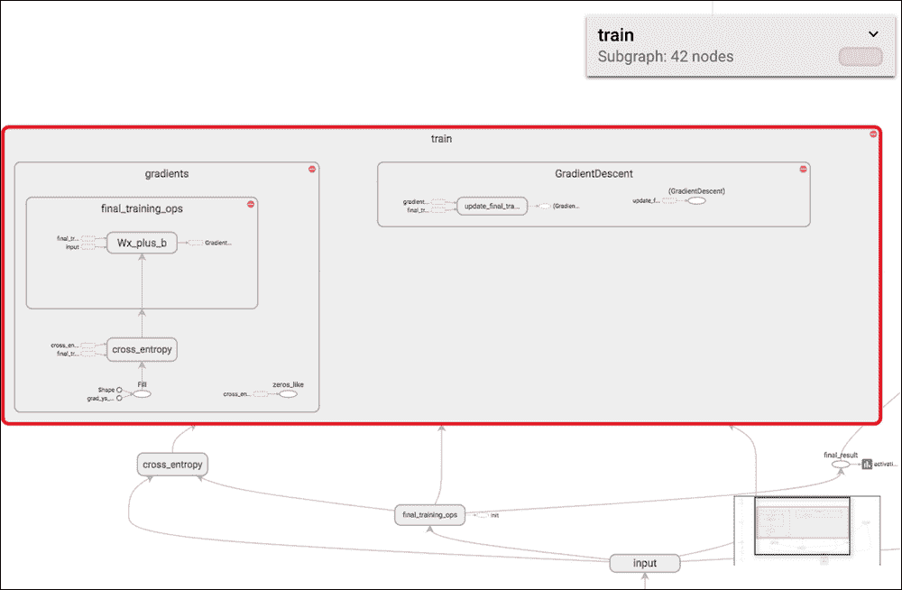

训练期间的反向传播

同样，我们可以在`LabelsApp`中添加下拉开关，以在通用 MobileNet 和自定义模型之间切换可视化效果：

```py
[[LabelsApp]]
@PixieApp
class LabelsApp():
    def setup(self):
        ...

    @route()
    def main_screen(self):
        return """

<div style="margin-top:10px" pd_refresh>
    <pd_script>
self.current_labels = self.custom_labels if self.current_labels is not self.custom_labels else self.labels
    </pd_script>
    <span style="font-weight:bold">
        Select a model to display:</span>
    <select>
        <option selected value="main">MobileNet</option>
        <option selected value="custom">Custom</options>
    </select>

<div pd_render_onload pd_entity="current_labels">
    <pd_options>
    {
        "table_noschema": "true",
        "handlerId": "tableView",
        "rowCount": "10000",
        "noChartCache": "true"

    }
    </pd_options>
</div>
        """
```

### 注意

[您可以在此处找到代码文件](https://github.com/DTAIEB/Thoughtful-Data-Science/blob/master/chapter%206/sampleCode30.py)。

结果显示在以下屏幕截图中：

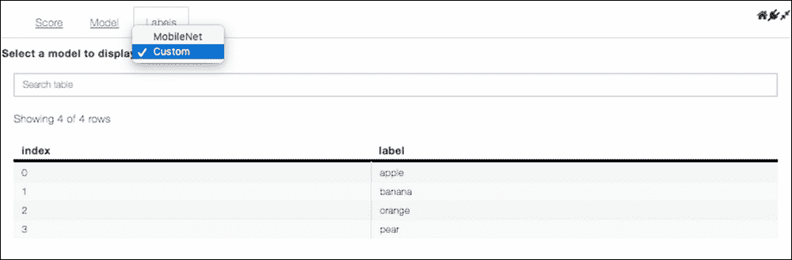

显示每个型号的标签信息

我们的第 4 部分 MVP 的最后一步是更新`score_image`方法，以使用两个模型对图像进行分类，并将结果添加到带有每个模型条目的字典中。 我们定义了一个本地方法`do_score_image`，该方法返回前 5 个候选答案。

每个模型都会调用此方法，结果将以模型名称为关键字填充字典：

```py
# classify an image given its url
def score_image(graph, model, url):
    # Download the image and build a tensor from its data
    t = read_tensor_from_image_file(model, download_image(url))

    def do_score_image(graph, output_layer, labels):
        # Retrieve the tensors corresponding to the input and output layers
        input_tensor = graph.get_tensor_by_name("import/" +
            input_layer + ":0");
        output_tensor = graph.get_tensor_by_name( output_layer +
            ":0");

        with tf.Session(graph=graph) as sess:
            # Initialize the variables
            sess.run(tf.global_variables_initializer())
            results = sess.run(output_tensor, {input_tensor: t})
        results = np.squeeze(results)
        # select the top 5 candidates and match them to the labels
        top_k = results.argsort()[-5:][::-1]
        return [(labels[i].split(":")[1], results[i]) for i in top_k]

    results = {}
    input_layer = get_model_attribute(model, "input_layer",
        "input")
    labels = load_labels(model)
    results["mobilenet"] = do_score_image(graph, "import/" +
        get_model_attribute(model, "output_layer"), labels)
    if "custom_graph" in model and "custom_labels" in model:
        with open(model["custom_labels"]) as f:
            labels = [line.rstrip() for line in f.readlines() if line != ""]
            custom_labels = ["{}:{}".format(i, label) for i,label in zip(range(len(labels)), labels)]
        results["custom"] = do_score_image(model["custom_graph"],
            "final_result", custom_labels)
    return results
```

### 注意

[您可以在此处找到代码文件](https://github.com/DTAIEB/Thoughtful-Data-Science/blob/master/chapter%206/sampleCode31.py)。

由于修改了`score_image`方法的返回值，因此我们需要调整`ScoreImageApp`中返回的 HTML 片段，以循环遍历`results`词典的所有模型条目：

```py
@route(score_url="*")
@templateArgs
def do_score_url(self, score_url):
    scores_dict = score_image(self.graph, self.model, score_url)
    return """

<div style="font-weight:bold">{{model}}</div>
<ul style="text-align:left">

<li><b>{{label}}</b>: {{confidence}}</li>

</ul>

    """
```

### 注意

[您可以在此处找到代码文件](https://github.com/DTAIEB/Thoughtful-Data-Science/blob/master/chapter%206/sampleCode32.py)。

进行这些更改后，PixieApp 将自动调用自定义模型（如果可用），并且在这种情况下，将显示两个模型的结果。

以下屏幕截图显示了与*香蕉*相关的图像的结果：

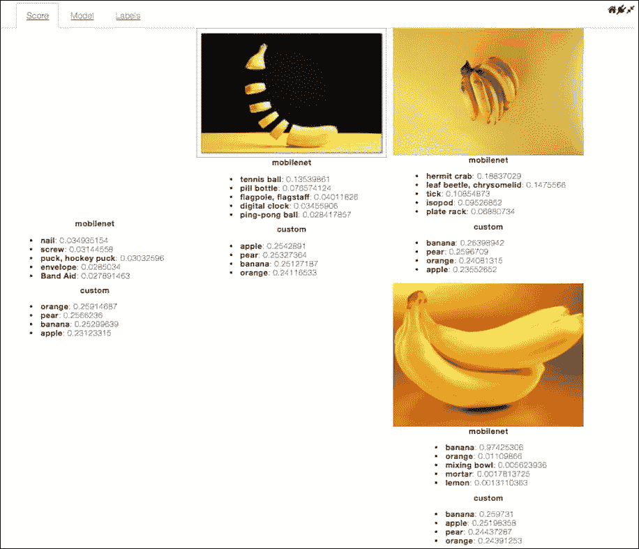

使用通用 MobileNet 和定制培训模型进行评分

读者会注意到，定制模型的分数非常低。 一种可能的解释是，训练数据采集是完全自动化的，无需人工管理即可使用。 此示例应用程序的一项可能增强是将训练数据获取和再训练步骤移至其自己的标签 PixieApp 中。 我们还应该给用户机会验证图像​​并拒绝质量低劣的图像。 让用户重新标记被错误分类的图像也将是很棒的。

### 注意

[完整的第四部分笔记本可以在以下位置找到](https://github.com/DTAIEB/Thoughtful-Data-Science/blob/master/chapter%206/Tensorflow%20VR%20Part%204.ipynb)。

在本节中，我们讨论了使用 TensorFlow 在 Jupyter Notebook 中构建图像识别示例应用程序的增量方法，特别着重于使用 PixieApps 操作算法。 我们首先使用 TensorFlow `DNNClassifier`估算器从 pandas DataFrame 构建简单的分类模型。 然后我们分四个部分构建了图像识别示例应用程序的 MVP 版本：

1.  我们加载了预训练的 MobileNet 模型
2.  我们为图像识别示例应用程序创建了一个 PixieApp
3.  我们将 TensorBoard 图形可视化集成到 PixieApp 中
4.  我们使用户能够使用来自 ImageNet 的自定义训练数据来重新训练模型

# 摘要

机器学习是一个巨大的主题，无论在研发方面，它都得到了巨大的发展。 在本章中，我们仅结合机器学习算法探索了最新技术，即使用深度学习神经网络执行图像识别。 对于刚开始熟悉机器学习的一些读者来说，示例 PixieApps 和相关的算法代码可能太深，无法一次消化。 但是，其根本目的是演示如何迭代地构建利用机器学习模型的应用程序。 我们曾经尝试使用卷积神经网络模型进行图像识别，但是任何其他模型都可以。

希望您对 PixieDust 和 PixieApp 编程模型可以如何帮助您完成自己的项目有一个好主意，我强烈建议您使用此示例应用程序作为起点，使用您选择的机器学习来构建自己的自定义应用程序 。 我还建议您通过 PixieGateway 微服务将 PixieApp 部署为 Web 应用程序，并探索它是否是可行的解决方案。

在下一章中，我们将介绍与大数据和自然语言处理有关的另一个重要的行业用例。 我们将构建一个示例应用程序，使用自然语言理解服务来分析社交媒体趋势。