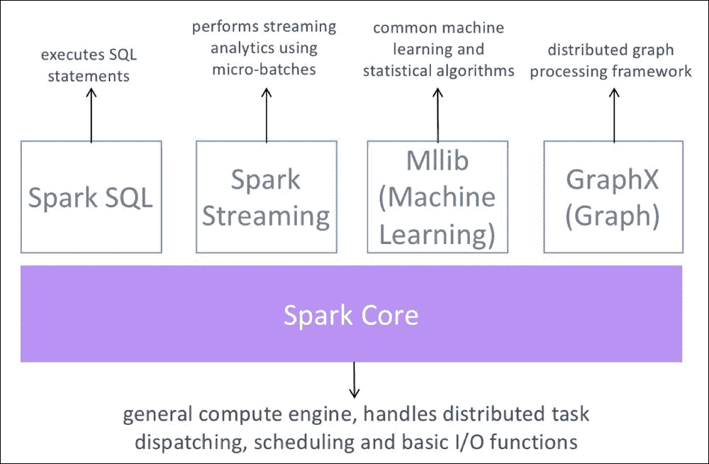
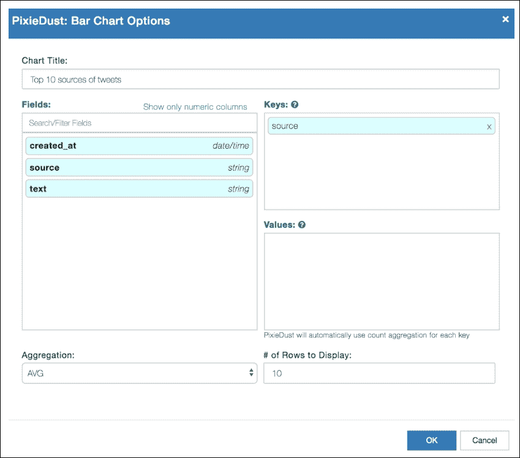
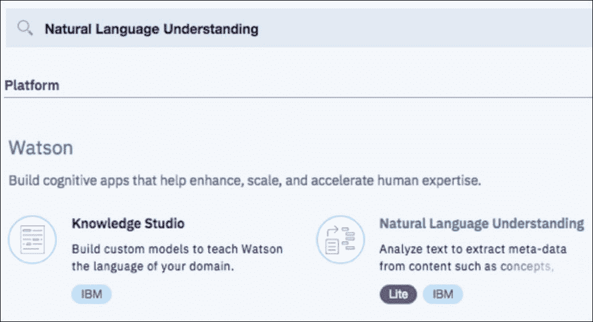
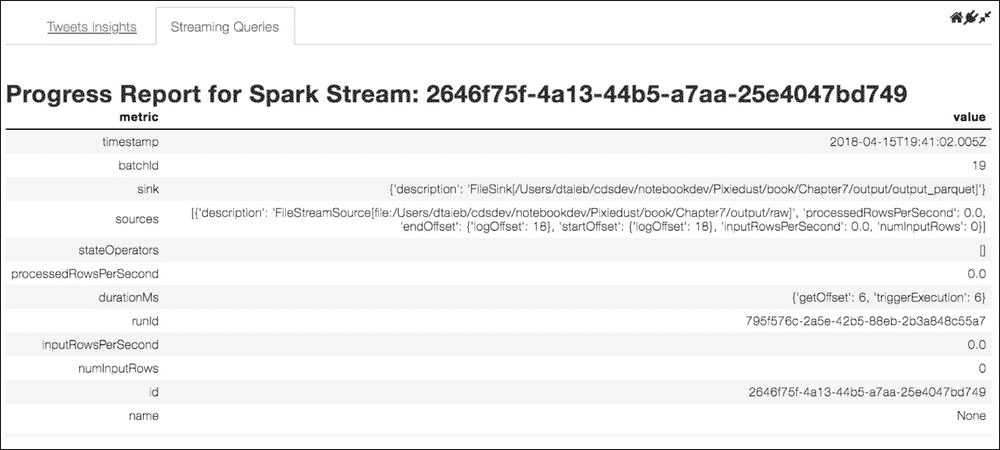
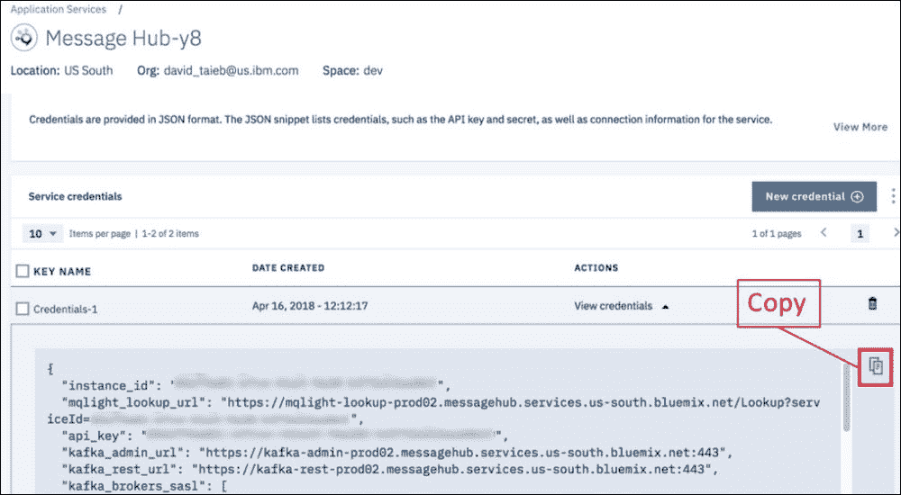
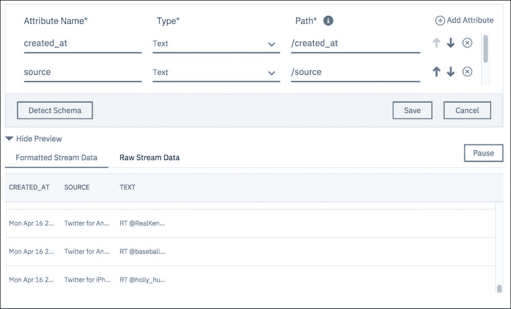
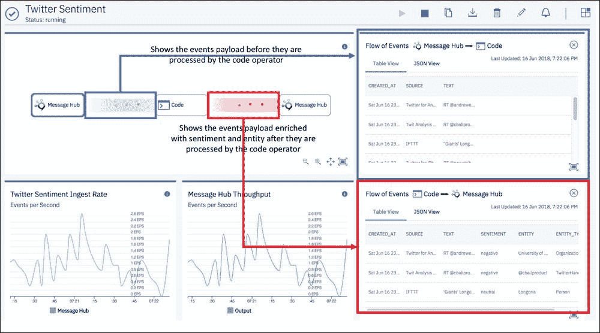

# 第 7 章。大数据 Twitter 情绪分析

|   | *“数据是新的石油。”* |   |
|   | -*未知* |

在本章中，我们将研究 AI 和数据科学的两个重要领域：**自然语言处理**（**NLP**）和大数据分析。 对于支持的示例应用程序，我们重新实现了 Twitter 主题标签项目的*情绪分析，该项目在第 1 章和*开发人员对数据科学的观点*中进行了介绍， 我们利用 Jupyter Notebooks 和 PixieDust 构建实时的仪表板，以分析从相关的推文流到特定实体（例如公司提供的产品）的数据，以提供情感信息以及有关其他信息 从相同推文中提取的趋势实体。 在本章的最后，读者将学习如何将基于云的 NLP 服务（例如*，IBM Watson 自然语言理解*）集成到其应用程序中，以及如何在（Twitter）规模上使用诸如 Apache Spark。*

与往常一样，我们将展示如何通过将实时仪表板实现为直接在 Jupyter Notebook 中运行的 PixieApp 来实现分析的操作。

# Apache Spark 入门

*大数据*一词可能会感到模糊不清。 考虑任何数据集大数据的截止点是什么？ 是 10 GB，100 GB，1 TB 还是更多？ 我喜欢的一个定义是：大数据是指数据无法容纳在单台计算机上可用的内存中。 多年以来，数据科学家一直被迫对大型数据集进行采样，因此它们可以放入一台机器中，但是随着并行计算框架能够将数据分布到一组机器中，并行处理框架开始发生变化，这种情况就开始发生变化。 整个数据集，当然前提是集群具有足够的计算机。 同时，随着云技术的进步，可以按需提供适应数据集大小的机器集群。

如今，有多个框架（大多数时候可以作为开源使用），可以提供强大，灵活的并行计算功能。 最受欢迎的包括 [Apache Hadoop](http://hadoop.apache.org)，[Apache Spark](https://spark.apache.org) 和 [Dask](https://dask.pydata.org)。 对于我们的 *Twitter 情绪分析*应用程序，我们将使用 Apache Spark，它在可伸缩性，可编程性和速度方面提供出色的性能。 此外，许多云提供商提供了一些 Spark 即服务的功能，使您能够在几分钟内按需创建大小合适的 Spark 集群。

一些 Spark 即服务的云提供商包括：

*   [Microsoft Azure](https://azure.microsoft.com/en-us/services/hdinsight/apache-spark)
*   [亚马逊网络服务](https://aws.amazon.com/emr/details/spark)
*   [Google 云端](https://cloud.google.com/dataproc)
*   [Databricks](https://databricks.com)
*   [IBM Cloud](https://www.ibm.com/cloud/analytics-engine)

### 注意

**注意**：Apache Spark 也可以很容易地安装在本地计算机上以进行测试，在这种情况下，群集节点是使用线程模拟的。

## Apache Spark 架构

以下图显示了 Apache Spark 框架的主要组件：



Spark 高级架构

*   **Spark SQL**：此组件的核心数据结构是 Spark DataFrame，它使了解 SQL 语言的用户可以轻松处理结构化数据。
*   **Spark Streaming**：模块用于处理流数据。 稍后我们将看到，我们将在示例应用程序中使用此模块，尤其是使用结构化流（在 Spark 2.0 中引入）。
*   **MLlib**：模块，提供了功能丰富的机器学习库，可在 Spark 规模上工作。
*   **GraphX**：模块用于执行图形并行计算。

主要有两种使用 Spark 集群的方法，如下图所示：


使用 Spark 集群的两种方法

*   **spark-submit**：用于在集群上启动 Spark 应用程序的 Shell 脚本
*   **笔记本**：以交互方式针对 Spark 集群执行代码语句

关于`spark-submit` shell 脚本的内容不在本书的讨论范围内，[但是可以在以下位置找到官方文档](https://spark.apache.org/docs/latest/submitting-applications.html)。 在本章的其余部分，我们将重点介绍通过 Jupyter Notebook 与 Spark 集群进行交互。

## 配置笔记本计算机以与 Spark 配合使用

本节中的说明仅涉及在本地安装 Spark 以进行开发和测试。 在群集中手动安装 Spark 超出了本书的范围。 如果需要一个真正的集群，强烈建议使用基于云的服务。

默认情况下，本地 Jupyter 笔记本安装了纯 Python 内核。 要使用 Spark，用户必须使用以下步骤：

1.  通过从[这个页面](https://spark.apache.org/downloads.html)下载二进制发行版在本地安装 Spark。
2.  Generate a kernel specification in a temporary directory using the following command:

    ```py
    ipython kernel install --prefix /tmp

    ```

    ### 注意

    **注意**：只要声明以下消息，上述命令可能会生成警告消息，可以安全地忽略该警告消息：

    `Installed kernelspec python3 in /tmp/share/jupyter/kernels/python3`

3.  转到`/tmp/share/jupyter/kernels/python3`，然后编辑`kernel.json`文件，将以下密钥添加到 JSON 对象（将`<<spark_root_path>>`替换为安装 Spark 的目录路径，将`<<py4j_version>>`替换为系统上安装的版本）：

    ```py
    "env": {
        "PYTHONPATH": "<<spark_root_path>>/python/:<<spark_root_path>>/python/lib/py4j-<<py4j_version>>-src.zip",
        "SPARK_HOME": "<<spark_root_path>>",
        "PYSPARK_SUBMIT_ARGS": "--master local[10] pyspark-shell",
        "SPARK_DRIVER_MEMORY": "10G",
        "SPARK_LOCAL_IP": "127.0.0.1",
        "PYTHONSTARTUP": "<<spark_root_path>>/python/pyspark/shell.py"
    }
    ```

4.  You may also want to customize the `display_name` key to make it unique and easily recognizable from the Juptyer UI. If you need to know the list of existing kernels, you can use the following command:

    ```py
    jupyter kernelspec list

    ```

    前面的命令将为您提供内核名称列表以及本地文件系统上的关联路径。 从路径中，您可以打开`kernel.json`文件来访问`display_name`值。 例如：

    ```py
     Available kernels:
     pixiedustspark16
     /Users/dtaieb/Library/Jupyter/kernels/pixiedustspark16
     pixiedustspark21
     /Users/dtaieb/Library/Jupyter/kernels/pixiedustspark21
     pixiedustspark22
     /Users/dtaieb/Library/Jupyter/kernels/pixiedustspark22
     pixiedustspark23
     /Users/dtaieb/Library/Jupyter/kernels/pixiedustspark23

    ```

5.  Install the kernel with the edited files using the following command:

    ```py
    jupyter kernelspec install /tmp/share/jupyter/kernels/python3

    ```

    ### 注意

    注意：根据环境，运行前面的命令时，您可能会收到“权限被拒绝”错误。 在这种情况下，您可能希望使用`sudo`以管理员权限运行命令或使用`--user`开关，如下所示：

    `jupyter kernelspec install --user /tmp/share/jupyter/kernels/python3`

    有关安装选项的更多信息，可以使用`-h`开关。 例如：

    ```py
     jupyter kernelspec install -h

    ```

6.  重新启动 Notebook 服务器并开始使用新的 PySpark 内核。

幸运的是，PixieDust 提供了一个`install`脚本来自动执行上述手动步骤。

### 注意

[您可以在此处找到有关此脚本的详细文档](https://pixiedust.github.io/pixiedust/install.html)。

简而言之，使用自动 PixieDust `install`脚本需要发出以下命令并遵循屏幕上的说明：

```py
jupyter pixiedust install

```

我们将在本章稍后深入研究 Spark 编程模型，但是现在，让我们在下一部分中定义 *Twitter 情绪分析*应用程序的 MVP 要求。

# Twitter 情绪分析应用程序

与往常一样，我们首先定义 MVP 版本的要求：

*   连接到 Twitter 以获取由用户提供的查询字符串过滤的实时推文流
*   丰富推文以添加情感信息和从文本中提取的相关实体
*   使用实时图表显示仪表板，其中包含有关数据的各种统计信息，并按指定的时间间隔进行更新
*   系统应该能够扩展到 Twitter 数据大小

以下图显示了我们的应用程序体系结构的第一个版本：


Twitter 情绪体系结构版本 1

对于版本 1，该应用程序将完全在单个 Python Notebook 中实现，并将调出 NLP 部分的外部服务。 为了进行扩展，我们当然必须将 Notebook 外部的某些处理外部化，但是为了进行开发和测试，我发现能够在单个 Notebook 中包含整个应用程序可以显着提高生产力。

至于库和框架，我们将使用 [Tweepy](http://www.tweepy.org) 将连接到 Twitter，[Apache Spark 结构化流](https://spark.apache.org/streaming)，用于处理分布式集群和 [Watson Developer Cloud Python SDK](https://github.com/watson-developer-cloud/python-sdk) 来访问 [IBM Watson Natural 语言理解](https://www.ibm.com/watson/services/natural-language-understanding)服务。

# 第 1 部分–使用 Spark 结构化流媒体获取数据

为了获取数据，我们使用 Tweepy，它提供了一个优雅的 Python 客户端库来访问 Twitter API。 Tweepy 涵盖的 API 非常广泛，详细介绍超出了本书的范围，[但是您可以在 Tweepy 官方网站上找到完整的 API 参考](http://tweepy.readthedocs.io/en/v3.6.0/cursor_tutorial.html)。

您可以使用`pip install`命令直接从 PyPi 安装 Tweepy 库。 以下命令显示如何使用`!`指令从笔记本计算机安装它：

```py
!pip install tweepy

```

### 注意

**注意**：当前使用的 Tweepy 版本是 3.6.0。 安装库后，不要忘记重新启动内核。

## 数据管道的架构图

在我们开始深入研究数据管道的每个组件之前，最好先了解其总体架构并了解计算流程。

如下图所示，我们首先创建一个 Tweepy 流，该流将原始数据写入 CSV 文件。 然后，我们创建一个 Spark Streaming DataFrame，该框架读取 CSV 文件，并定期使用新数据进行更新。 从 Spark Streaming DataFrame 中，我们使用 SQL 创建一个 Spark 结构化查询并将其结果存储在 Parquet 数据库中：


流计算流程

## 通过 Twitter 进行身份验证

在使用任何 Twitter API 之前，建议先通过系统进行身份验证。 [OAuth 2.0 协议](https://oauth.net)是最常用的身份验证机制之一，它使第三方应用程序能够访问网络上的服务。 您需要做的第一件事是获取 OAuth 协议用来验证您身份的一组密钥字符串：

*   **使用者密钥**：唯一标识客户端应用程序的字符串（也称为 API 密钥）。
*   **消费者密码**：仅应用程序和 Twitter OAuth 服务器知道的密码字符串。 可以认为它就像一个密码。
*   **访问令牌**：使用字符串来验证您的请求。 在授权阶段还可以使用此令牌来确定应用程序的访问级别。
*   **访问令牌密钥**：类似于消费者密钥，这是与访问令牌一起发送的秘密字符串，用作密码。

要生成上述密钥字符串，您需要转到[这个页面](http://apps.twitter.com)，使用常规的 Twitter 用户 ID 和密码进行身份验证，然后按照以下步骤操作：

1.  使用**创建新应用**按钮创建一个新的 Twitter 应用。
2.  Fill out the application details, agree to the Developer agreement and click on  **Create your Twitter application** button.

    ### 提示

    **注意**：请确保您的手机号码已添加到个人资料中，否则在创建 Twitter 应用程序时会出现错误。

    您可以为 **必填网站** 的强制输入提供随机 URL，并将 **URL** 的输入保留为空白，因为这是可选的回调 URL。

3.  单击**密钥和访问令牌**选项卡以获取使用者和访问令牌。 您可以随时使用此页面上的按钮重新生成这些令牌。 如果这样做，则还需要更新您的应用程序代码中的值。

为了更轻松地维护代码，让我们将这些标记放在 Notebook 顶部的自己的变量中，并创建`tweepy.OAuthHandler`类，稍后我们将使用它：

```py
from tweepy import OAuthHandler
# Go to http://apps.twitter.com and create an app.
# The consumer key and secret will be generated for you after
consumer_key="XXXX"
consumer_secret="XXXX"

# After the step above, you will be redirected to your app's page.
# Create an access token under the "Your access token" section
access_token="XXXX"
access_token_secret="XXXX"

auth = OAuthHandler(consumer_key, consumer_secret)
auth.set_access_token(access_token, access_token_secret)

```

## 创建 Twitter 流

为了实现我们的应用程序，[我们只需要使用此处记录的 Twitter 流 API](http://tweepy.readthedocs.io/en/v3.5.0/streaming_how_to.html)。 在此步骤中，我们创建一个 Twitter 流，将输入的数据存储到本地文件系统上的 CSV 文件中。 这是使用从`tweepy.streaming.StreamListener`继承的自定义`RawTweetsListener`类完成的。 通过覆盖`on_data`方法，可以完成对传入数据的自定义处理。

在我们的例子中，我们想使用来自标准 Python `csv`模块的`DictWriter`将传入的数据从 JSON 转换为 CSV。 由于 Spark Streaming 文件输入源仅在输入目录中创建新文件时才触发，因此我们不能简单地将数据追加到现有文件中。 取而代之的是，我们将数据缓冲到一个数组中，并在缓冲区达到容量后将其写入磁盘。

### 注意

为简单起见，该实现不包括在处理完文件后清理文件。 此实现的另一个次要限制是，我们当前要等到缓冲区被填满后才能写入文件，如果没有新的 tweet 出现，理论上可能会花费很长时间。

`RawTweetsListener`的代码如下所示：

```py
from six import iteritems
import json
import csv
from tweepy.streaming import StreamListener
class RawTweetsListener(StreamListener):
    def __init__(self):
        self.buffered_data = []
        self.counter = 0

    def flush_buffer_if_needed(self):
        "Check the buffer capacity and write to a new file if needed"
        length = len(self.buffered_data)
        if length > 0 and length % 10 == 0:
            with open(os.path.join( output_dir,
                "tweets{}.csv".format(self.counter)), "w") as fs:
                self.counter += 1
                csv_writer = csv.DictWriter( fs,
                    fieldnames = fieldnames)
                for data in self.buffered_data:
 csv_writer.writerow(data)
            self.buffered_data = []

    def on_data(self, data):
        def transform(key, value):
            return transforms[key](value) if key in transforms else value

        self.buffered_data.append(
            {key:transform(key,value) \
                 for key,value in iteritems(json.loads(data)) \
                 if key in fieldnames}
        )
        self.flush_buffer_if_needed()
        return True

    def on_error(self, status):
        print("An error occured while receiving streaming data: {}".format(status))
        return False
```

### 注意

[您可以在此处找到代码文件](https://github.com/DTAIEB/Thoughtful-Data-Science/blob/master/chapter%207/sampleCode1.py)。

从前面的代码中需要注意的重要事项是：

*   来自 Twitter API 的每条推文都包含大量数据，我们选择继续使用`field_metadata`变量的字段。 我们还定义了一个全局变量`fieldnames`，该全局变量保存要从流中捕获的字段列表，而一个`transforms`变量则包含一个字典，该字典的所有字段名称均具有转换功能作为键，而转换功能本身为 值：

    ```py
    from pyspark.sql.types import StringType, DateType
    from bs4 import BeautifulSoup as BS
    fieldnames = [f["name"] for f in field_metadata]
    transforms = {
        item['name']:item['transform'] for item in field_metadata if "transform" in item
    }
    field_metadata = [
        {"name": "created_at","type": DateType()},
        {"name": "text", "type": StringType()},
        {"name": "source", "type": StringType(),
             "transform": lambda s: BS(s, "html.parser").text.strip()
        }
    ]
    ```

    ### 注意

    [您可以在此处找到的文件文件](https://github.com/DTAIEB/Thoughtful-Data-Science/blob/master/chapter%207/sampleCode2.py)。

*   The CSV files are written in `output_dir` which is defined in its own variable. At start time, we first remove the directory and its contents:

    ```py
    import shutil
    def ensure_dir(dir, delete_tree = False):
        if not os.path.exists(dir):
            os.makedirs(dir)
        elif delete_tree:
            shutil.rmtree(dir)
            os.makedirs(dir)
        return os.path.abspath(dir)

    root_dir = ensure_dir("output", delete_tree = True)
    output_dir = ensure_dir(os.path.join(root_dir, "raw"))

    ```

    ### 注意

    [您可以在此处找到代码文件](https://github.com/DTAIEB/Thoughtful-Data-Science/blob/master/chapter%207/sampleCode3.py)。

*   `field_metadata`包含 Spark 数据类型，我们稍后将在创建 Spark 流查询时使用它来构建架构。
*   `field_metadata`还包含一个可选的变换`lambda`函数，用于在将值写入磁盘之前清除该值。 作为参考，Python 中的 lambda 函数是内联定义的匿名函数（请参见[这个页面](https://docs.python.org/3/tutorial/controlflow.html#lambda-expressions)）。 我们将其用于通常作为 HTML 片段返回的源字段。 在此 lambda 函数中，我们使用 BeautifulSoup 库（在上一章中也使用过）仅提取文本，如以下代码片段所示：

    ```py
    lambda s: BS(s, "html.parser").text.strip()
    ```

现在`RawTweetsListener`已创建，我们定义了`start_stream`函数，稍后将在 PixieApp 中使用。 此函数将搜索词数组作为输入，并使用`filter`方法开始新的流：

```py
from tweepy import Stream
def start_stream(queries):
    "Asynchronously start a new Twitter stream"
    stream = Stream(auth, RawTweetsListener())
 stream.filter(track=queries, async=True)
    return stream
```

### 注意

注意`async=True`参数传递给`stream.filter`。 需要确保该功能不会被阻止，这将阻止我们在 Notebook 中运行任何其他代码。

[您可以在此处找到代码文件](https://github.com/DTAIEB/Thoughtful-Data-Science/blob/master/chapter%207/sampleCode4.py)。

以下代码启动流，该流将接收其中包含单词`baseball`的推文：

```py
stream = start_stream(["baseball"])
```

当运行前面的代码时，笔记本计算机中不生成任何输出。 但是，您可以从运行 Notebook 的路径中看到在输出目录（即`../output/raw`）中生成的文件（即`tweets0.csv`，`tweets1.csv`等）。

要停止流，我们只需调用`disconnect`方法，如下所示：

```py
stream.disconnect()
```

## 创建 Spark 流数据框架

参考体系结构图，下一步是创建一个将`output_dir`用作源文件输入的 Spark Streaming DataFrame `tweets_sdf`。 我们可以将 Streaming DataFrame 视为一个无界表，其中随着新数据从流到达而不断添加新行。

### 注意

**注**：Spark 结构化流支持多种类型的输入源，包括文件，Kafka，套接字和速率。 （Socket 和 Rate 均仅用于测试。）

下图取自 Spark 网站，并很好地解释了如何将新数据附加到 Streaming DataFrame：


流式 DataFrame 流

[来源](https://spark.apache.org/docs/latest/img/structured-streaming-stream-as-a-table.png)

Spark Streaming Python API 提供了一种优雅的方法，可以使用`spark.readStream`属性创建 Streaming DataFrame，该属性创建一个新的`pyspark.sql.streamingreamReader`对象，该对象方便地使您链接方法调用，并具有创建更清晰代码的额外好处（请参见[这个页面](https://en.wikipedia.org/wiki/Method_chaining)，以获取有关此模式的更多详细信息）。

例如，要创建 CSV 文件流，我们使用`csv`调用 format 方法，链接适用的选项，然后使用目录路径调用`load`方法：

```py
schema = StructType(
[StructField(f["name"], f["type"], True) for f in field_metadata]
)
csv_sdf = spark.readStream\
    .format("csv")\
 .option("schema", schema)\
    .option("multiline", True)\
 .option("dateFormat", 'EEE MMM dd kk:mm:ss Z y')\
    .option("ignoreTrailingWhiteSpace", True)\
    .option("ignoreLeadingWhiteSpace", True)\
    .load(output_dir)
```

### 注意

[您可以在此处找到代码文件](https://github.com/DTAIEB/Thoughtful-Data-Science/blob/master/chapter%207/sampleCode5.py)。

`spark.readStream`还提供了一种方便的高级`csv`方法，该方法将 path 作为选项的第一个参数和关键字参数：

```py
csv_sdf = spark.readStream \
    .csv(
        output_dir,
        schema=schema,
        multiLine = True,
        dateFormat = 'EEE MMM dd kk:mm:ss Z y',
        ignoreTrailingWhiteSpace = True,
        ignoreLeadingWhiteSpace = True
    )
```

### 注意

[您可以在此处找到代码文件](https://github.com/DTAIEB/Thoughtful-Data-Science/blob/master/chapter%207/sampleCode6.py)。

您可以通过调用应返回`true`的`isStreaming`方法来验证`csv_sdf` DataFrame 确实是流数据帧。 以下代码还向`printSchema`添加了一个调用，以验证模式是否按预期遵循`field_metadata`配置：

```py
print(csv_sdf.isStreaming)
csv_sdf.printSchema()
```

返回值：

```py
root
 |-- created_at: date (nullable = true)
 |-- text: string (nullable = true)
 |-- source: string (nullable = true)
```

在继续下一步之前，重要的是要了解`csv_sdf` Streaming DataFrame 如何适合结构化流编程模型，以及它具有哪些限制。 Spark 底层 API 定义了**弹性分布式数据集**（**RDD**）数据结构，该数据结构封装了管理分布式数据的所有底层复杂性。 诸如容错之类的功能（由于任何原因而崩溃的群集节点将在无需开发人员干预的情况下透明地重新启动）由框架自动处理。 RDD 操作有两种类型：转换和操作。 **转换**是对现有 RDD 的逻辑操作，除非调用某个操作（延迟执行），否则它们不会立即在集群上执行。 转换的输出是新的 RDD。 在内部，Spark 维护一个 RDD 非循环有向图，该图可跟踪导致创建 RDD 的所有沿袭，这在从服务器故障中恢复时非常有用。 示例转换包括`map`，`flatMap`，`filter`，`sample`和`distinct`。 在 DataFrame（内部由 RDD 支持）上进行转换的情况也是如此，这些转换具有包括 SQL 查询的优点。 另一方面，**操作**不产生其他 RDD，而是对实际的分布式数据执行操作以返回非 RDD 值。 动作的示例包括`reduce`，`collect`，`count`和`take`。

如前所述，`csv_sdf`是一个 Streaming DataFrame，这意味着数据不断被添加到其中，因此我们只能对其进行转换，而不能对其进行操作。 为了解决这个问题，我们必须首先使用作为`pyspark.sql.streaming.DataStreamWriter`对象的`csv_sdf.writeStream`创建一个流查询。 流查询负责将结果发送到输出接收器。 然后我们可以使用`start()`方法运行流式查询。

Spark Streaming 支持多种输出接收器类型：

*   **文件**：支持所有经典文件格式，包括 JSON，CSV 和 Parquet
*   **Kafka**：直接写一个或多个 Kafka 主题
*   **Foreach**：对集合中的每个元素运行任意计算
*   **控制台**：将输出打印到系统控制台（主要用于调试）
*   **存储器**：输出存储在存储器中

在的下一部分中，我们将在`csv_sdf`上创建并运行结构化查询，该查询带有一个输出接收器，该输出接收器以 Parquet 格式存储输出。

## 创建并运行结构化查询

使用`tweets_sdf`流式数据帧，我们创建了一个流式查询`tweet_streaming_query`，该查询使用*附加*输出模式将数据写入 Parquet 格式。

### 注意

**注意**：Spark 流查询支持三种输出模式：**完整**，其中在每个触发器中写入整个表，**附加**，其中仅包含自上一个触发器以来的增量行 写入，**更新**，其中仅写入已修改的行。

Parquet 是列式数据库格式，可为分布式分析提供高效，可扩展的存储。 [您可以在以下位置找到有关 Parquet 格式的更多信息](https://parquet.apache.org)。

以下代码创建并启动`tweet_streaming_query`流查询：

```py
tweet_streaming_query = csv_sdf \
    .writeStream \
    .format("parquet") \
 .option("path", os.path.join(root_dir, "output_parquet")) \
 .trigger(processingTime="2 seconds") \
 .option("checkpointLocation", os.path.join(root_dir, "output_chkpt")) \
    .start()
```

### 注意

[您可以在此处找到代码文件](https://github.com/DTAIEB/Thoughtful-Data-Science/blob/master/chapter%207/sampleCode7.py)。

同样，可以使用`stop()`方法停止流查询，如下所示：

```py
tweet_streaming_query.stop()
```

在前面的代码中，我们使用`path`选项指定 Parquet 文件的位置，并使用`checkpointLocation`指定在服务器故障的情况下将使用的恢复数据的位置。 我们还为从流中读取新数据和要添加到 Parquet 数据库中的新行指定触发间隔。

为了测试，每次`output_dir`目录中生成新的原始 CSV 文件时，也可以使用`console`接收器查看正在读取的新行：

```py
tweet_streaming_query = csv_sdf.writeStream\
    .outputMode("append")\
    .format("console")\
    .trigger(processingTime='2 seconds')\
    .start()
```

### 注意

[您可以在此处找到代码文件](https://github.com/DTAIEB/Thoughtful-Data-Science/blob/master/chapter%207/sampleCode8.py)。

您可以在 Spark 集群的主节点的系统输出中看到结果（您将需要物理访问主节点机器并查看日志文件，因为不幸的是，输出未打印到 Notebook 本身中，因为 日志文件的位置取决于群集管理软件;有关更多信息，请参阅特定的文档）。

以下是显示特定批次的示例结果（标识符已被屏蔽）：

```py
-------------------------------------------
Batch: 17
-------------------------------------------
+----------+--------------------+-------------------+
|created_at|                text|             source|
+----------+--------------------+-------------------+
|2018-04-12|RT @XXXXXXXXXXXXX...|Twitter for Android|
|2018-04-12|RT @XXXXXXX: Base...| Twitter for iPhone|
|2018-04-12|That's my roommat...| Twitter for iPhone|
|2018-04-12|He's come a long ...| Twitter for iPhone|
|2018-04-12|RT @XXXXXXXX: U s...| Twitter for iPhone|
|2018-04-12|Baseball: Enid 10...|   PushScoreUpdates|
|2018-04-12|Cubs and Sox aren...| Twitter for iPhone|
|2018-04-12|RT @XXXXXXXXXX: T...|          RoundTeam|
|2018-04-12|@XXXXXXXX that ri...| Twitter for iPhone|
|2018-04-12|RT @XXXXXXXXXX: S...| Twitter for iPhone|
+----------+--------------------+-------------------+
```

## 监视活动的流查询

启动流查询时，Spark 会分配群集资源。 因此，重要的是管理和监视这些查询，以确保不会耗尽群集资源。 您可以随时获取所有正在运行的查询的列表，如以下代码所示：

```py
print(spark.streams.active)
```

结果：

```py
[<pyspark.sql.streaming.StreamingQuery object at 0x12d7db6a0>, <pyspark.sql.streaming.StreamingQuery object at 0x12d269c18>]
```

然后，您可以使用以下查询监视属性来深入了解每个查询的详细信息：

*   `id`：返回查询的唯一标识符，该标识符在从检查点数据重新启动后持续存在
*   `runId`：返回为当前会话生成的唯一 ID
*   `explain()`：打印查询的详细说明
*   `recentProgress`：返回最新进度更新的数组
*   `lastProgress:`返回最新进度

以下代码显示每个活动查询的最新进度：

```py
import json
for query in spark.streams.active:
    print("-----------")
    print("id: {}".format(query.id))
    print(json.dumps(query.lastProgress, indent=2, sort_keys=True))
```

### 注意

[您可以在此处找到代码文件](https://github.com/DTAIEB/Thoughtful-Data-Science/blob/master/chapter%207/sampleCode9.py)。

第一个查询的结果如下所示：

```py
-----------
id: b621e268-f21d-4eef-b6cd-cb0bc66e53c4
{
  "batchId": 18,
  "durationMs": {
    "getOffset": 4,
    "triggerExecution": 4
  },
  "id": "b621e268-f21d-4eef-b6cd-cb0bc66e53c4",
  "inputRowsPerSecond": 0.0,
  "name": null,
  "numInputRows": 0,
  "processedRowsPerSecond": 0.0,
  "runId": "d2459446-bfad-4648-ae3b-b30c1f21be04",
  "sink": {
    "description": "org.apache.spark.sql.execution.streaming.ConsoleSinkProvider@586d2ad5"
  },
  "sources": [
    {
      "description": "FileStreamSource[file:/Users/dtaieb/cdsdev/notebookdev/Pixiedust/book/Chapter7/output/raw]",
      "endOffset": {
        "logOffset": 17
      },
      "inputRowsPerSecond": 0.0,
      "numInputRows": 0,
      "processedRowsPerSecond": 0.0,
      "startOffset": {
        "logOffset": 17
      }
    }
  ],
  "stateOperators": [],
  "timestamp": "2018-04-12T21:40:10.004Z"
}
```

作为读者的练习，构建一个 PixieApp 很有用，该 PixieApp 提供一个实时仪表板，其中包含有关每个活动流查询的更新详细信息。

### 注意

**注意**：我们将在*第 3 部分–创建实时仪表板 PixieApp* 中展示如何构建此 PixieApp。

## 从 Parquet 文件创建批处理 DataFrame

### 注意

**注意**：对于本章的其余部分，我们将批处理 Spark DataFrame 定义为经典的 Spark DataFrame，它是非流式的。

此流计算流程的最后一步是创建一个或多个批处理 DataFrame，我们可以将其用于构建分析和数据可视化。 我们可以认为这最后一步是对数据进行快照以进行更深入的分析。

有两种方法可以通过编程方式从 Parquet 文件中加载批处理 DataFrame：

*   使用`spark.read`（注意，我们不像以前那样使用`spark.readStream`）：

    ```py
    parquet_batch_df = spark.read.parquet(os.path.join(root_dir, "output_parquet"))
    ```

*   Using `spark.sql` :

    ```py
    parquet_batch_df = spark.sql(
    "select * from parquet.'{}'".format(
    os.path.join(root_dir, "output_parquet")
    )
    )
    ```

    ### 注意

    [您可以在此处找到代码文件](https://github.com/DTAIEB/Thoughtful-Data-Science/blob/master/chapter%207/sampleCode10.py)。

这种方法的好处是，我们可以使用任何 ANSI SQL 查询来加载数据，而不是使用在第一种方法中必须使用的等效低级 DataFrame API。

然后，我们可以通过重新运行前面的代码并重新创建 DataFrame 来定期刷新数据。 现在，我们准备对数据进行进一步的分析，例如，通过对数据运行 PixieDust `display()`方法来创建可视化效果：

```py
import pixiedust
display(parquet_batch_df)
```

我们选择**条形图**菜单并在**键**字段区域中拖放`source`字段。 由于我们只想显示前 10 条推文，因此我们在**要显示的行数**字段中设置此值。 以下屏幕截图显示了 PixieDust 选项对话框：



用于显示前 10 条推文来源的“选项”对话框

在单击 **OK** 之后，我们看到以下结果：


该图表按来源显示与棒球相关的推文数量

在本节中，我们已经看到了如何使用 Tweepy 库创建 Twitter 流，清理原始的数据并将其存储在 CSV 文件中，创建 Spark Streaming DataFrame，对其运行流查询并将其存储在 一个 Parquet 数据库，从 Parquet 文件创建一个批处理 DataFrame，并使用 PixieDust `display()`可视化数据。

### 注意

[可在以下位置找到*第 1 部分的完整笔记本-使用 Spark 结构化流*获取数据](https://github.com/DTAIEB/Thoughtful-Data-Science/blob/master/chapter%207/Twitter%20Sentiment%20Analysis%20-%20Part%201.ipynb)。

在下一部分中，我们将研究使用 IBM Watson Natural Language 了解服务通过情感和实体提取来丰富数据。

# 第 2 部分–使用情感和最相关的提取实体丰富数据

在这一部分中，我们使用情绪信息来丰富 Twitter 数据，例如*正*，*负*和*中性*。 我们还希望从推文中提取最相关的实体，例如运动，组织和位置。 这些额外的信息将通过实时仪表板进行分析和可视化，我们将在下一部分中构建。 用于从非结构化文本中提取情感和实体的算法属于计算机科学和人工智能领域，称为**自然语言处理**（**NLP**）。 网络上有很多教程，其中提供了有关如何提取情感的算法示例。 例如，可以在[这个页面](https://github.com/scikit-learn/scikit-learn/blob/master/doc/tutorial/text_analytics/working_with_text_data.rst)。

但是，对于此示例应用程序，我们将不会构建自己的 NLP 算法。 相反，我们将选择一种基于云的服务，该服务提供文本分析，例如情感和实体提取。 当您有通用要求（例如不需要培训定制模型）时，这种方法非常有效，但是即使那样，大多数服务提供商现在都提供了实现此目的的工具。 与创建您自己的模型相比，使用基于云的提供程序具有主要优势，例如节省了开发时间以及更好的准确性和性能。 通过一个简单的 REST 调用，我们将能够生成所需的数据并将其集成到我们的应用程序流中。 而且，如果需要，更改提供者将非常容易，因为负责与服务接口的代码已被很好地隔离了。

对于此示例应用程序，我们将使用 **IBM Watson 自然语言理解**（**NLU**）服务，该服务是 IBM Watson 认知服务家族的一部分，可在 IBM Cloud 上使用。

## IBM Watson Natural 语言理解服务入门

对于每个云提供商，提供新服务的过程通常是相同的。 登录后，您将转到服务目录页面，可在其中搜索特定服务。

要登录到 IBM Cloud，只需转到[这个页面](https://console.bluemix.net)并创建一个免费的 IBM 帐户（如果您还没有）。 进入仪表板后，可以通过多种方式搜索 IBM Watson NLU 服务：

*   单击左上方的菜单，然后选择 **Watson**，选择**浏览服务**，然后在服务列表中找到**自然语言理解**条目。
*   Click on the **Create Resource** button in the top-right corner to get to the catalog. Once in the catalog, you can search for `Natural Language Understanding` in the search bar as shown in the following screenshot:

    

    在服务目录中搜索 Watson NLU

然后，您可以单击**自然语言理解**来设置新实例。 云提供商通常会为某些服务提供免费或基于试用的计划，这并不稀奇，幸运的是 Watson NLU 提供了其中一种服务，其局限性在于您只能训练一个自定义模型，每个模型最多可处理 30,000 个 NLU 项目。 月（足够用于我们的示例应用程序）。 选择 **Lite**（免费）计划并单击**创建**按钮后，新配置的实例将出现在仪表板上并准备接受请求。

### 注意

**注意**：创建服务后，您可能会重定向到 NLU 服务*入门文档*。 如果是这样，只需导航回到仪表板，您将在其中看到列出的新服务实例。

下一步是通过进行 REST 调用来测试我们笔记本的服务。 每个服务都提供有关如何使用它的详细文档，包括 API 参考。 在 Notebook 中，我们可以根据 API 参考使用 request 包进行 GET，POST，PUT 或 DELETE 调用，但是强烈建议检查该服务是否为 SDK 提供了对 API 的高级编程访问。

幸运的是，IBM Watson 提供了`watson_developer_cloud`开源库，其中包括多个开源 SDK，这些 SDK 支持某些最受欢迎的语言，包括 Java，Python 和 Node.js。 对于本项目，[我们将使用 Python SDK 和位于此处的源代码和代码示例](https://github.com/watson-developer-cloud/python-sdk)。

以下`pip`命令直接从 Jupyter Notebook 安装`watson_developer_cloud`软件包：

```py
!pip install Watson_developer_cloud

```

### 注意

注意命令前面的`!`表示它是一个 shell 命令。

**注意**：安装完成后，不要忘记重新启动内核。

大多数云服务提供商都使用一种通用模式来让消费者通过该服务进行身份验证，该模式包括从将嵌入在客户端应用程序中的服务控制台仪表板生成一组凭据。 要生成凭证，只需单击 Watson NLU 实例的**服务凭证**选项卡，然后单击**新凭证**按钮。

这将以 JSON 格式生成一组新的凭据，如以下屏幕截图所示：


为 Watson NLU 服务生成新的凭证

现在我们有了服务的凭据，我们可以创建一个`NaturalLanguageUnderstandingV1`对象，该对象将提供对 REST API 的编程访问，如以下代码所示：

```py
from watson_developer_cloud import NaturalLanguageUnderstandingV1
from watson_developer_cloud.natural_language_understanding_v1 import Features, SentimentOptions, EntitiesOptions

nlu = NaturalLanguageUnderstandingV1(
    version='2017-02-27',
    username='XXXX',
    password='XXXX'
)
```

### 注意

[您可以在此处找到代码文件](https://github.com/DTAIEB/Thoughtful-Data-Science/blob/master/chapter%207/sampleCode11.py)。

**注意**：在前面的代码中，用服务凭据中的相应用户名和密码替换`XXXX`文本。

[`version`参数是指 API 的特定版本。 要了解最新版本，请转到位于此处的官方文档页面](https://www.ibm.com/watson/developercloud/natural-language-understanding/api/v1)。

在继续构建应用程序之前，让我们花一点时间来了解 Watson Natural Language 服务提供的文本分析功能，其中包括：

*   情绪
*   实体
*   概念
*   分类目录
*   感情
*   关键词
*   关系
*   语义角色

在我们的应用程序中，丰富 Twitter 数据发生在`RawTweetsListener`中，我们在其中创建了一个`enrich`方法，该方法将从`on_data`处理程序方法中调用。 在此方法中，我们使用 Twitter 数据和仅包含情感和实体的功能列表调用`nlu.analyze`方法，如以下代码所示：

### 注意

**注意**：`[[RawTweetsListener]]`表示这意味着以下代码是名为`RawTweetsListener`的类的一部分，并且用户不应尝试在没有完整类的情况下照常运行代码。 始终可以始终参考完整的笔记本作为参考。

```py
[[RawTweetsListener]]
def enrich(self, data):
    try:
        response = nlu.analyze(
 text = data['text'],
 features = Features(
 sentiment=SentimentOptions(),
 entities=EntitiesOptions()
 )
 )
        data["sentiment"] = response["sentiment"]["document"]["label"]
        top_entity = response["entities"][0] if len(response["entities"]) > 0 else None
        data["entity"] = top_entity["text"] if top_entity is not None else ""
        data["entity_type"] = top_entity["type"] if top_entity is not None else ""
        return data
    except Exception as e:
 self.warn("Error from Watson service while enriching data: {}".format(e))

```

### 注意

[您可以在此处找到代码文件](https://github.com/DTAIEB/Thoughtful-Data-Science/blob/master/chapter%207/sampleCode12.py)。

然后将结果存储在`data`对象中，该对象将被写入 CSV 文件。 我们还防止意外的异常跳过当前的 tweet 并记录警告消息，而不是让异常冒泡，这会阻止 Twitter 流。

### 注意

**注意**：当推文数据使用服务不支持的语言时，会发生最常见的异常。

我们使用第 5 章，*最佳实践和高级 PixieDust 概念*中描述的`@Logger`装饰器将消息记录到 PixieDust 日志记录框架中。 提醒一下，您可以使用另一个单元格中的`%pixiedustLog`魔术来查看日志消息。

我们仍然需要更改架构元数据以包括以下新字段：

```py
field_metadata = [
    {"name": "created_at", "type": DateType()},
    {"name": "text", "type": StringType()},
    {"name": "source", "type": StringType(),
         "transform": lambda s: BS(s, "html.parser").text.strip()
    },
 {"name": "sentiment", "type": StringType()},
 {"name": "entity", "type": StringType()},
 {"name": "entity_type", "type": StringType()}
]
```

### 注意

[您可以在此处找到代码文件](https://github.com/DTAIEB/Thoughtful-Data-Science/blob/master/chapter%207/sampleCode13.py)。

最后，我们更新`on_data`处理程序以调用`enrich`方法，如下所示：

```py
def on_data(self, data):
    def transform(key, value):
        return transforms[key](value) if key in transforms else value
    data = self.enrich(json.loads(data))
 if data is not None:
        self.buffered_data.append(
            {key:transform(key,value) \
                for key,value in iteritems(data) \
                if key in fieldnames}
        )
        self.flush_buffer_if_needed()
    return True

```

### 注意

[您可以在此处找到代码文件](https://github.com/DTAIEB/Thoughtful-Data-Science/blob/master/chapter%207/sampleCode14.py)。

当我们重新启动 Twitter 流并创建 Spark Streaming DataFrame 时，我们可以使用以下代码来验证我们是否具有正确的架构：

```py
schema = StructType(
    [StructField(f["name"], f["type"], True) for f in field_metadata]
)
csv_sdf = spark.readStream \
    .csv(
        output_dir,
        schema=schema,
        multiLine = True,
        dateFormat = 'EEE MMM dd kk:mm:ss Z y',
        ignoreTrailingWhiteSpace = True,
        ignoreLeadingWhiteSpace = True
    )
csv_sdf.printSchema()
```

### 注意

[您可以在此处找到代码文件](https://github.com/DTAIEB/Thoughtful-Data-Science/blob/master/chapter%207/sampleCode15.py)。

哪个显示了以下预期结果：

```py
root
 |-- created_at: date (nullable = true)
 |-- text: string (nullable = true)
 |-- source: string (nullable = true)
 |-- sentiment: string (nullable = true)
 |-- entity: string (nullable = true)
 |-- entity_type: string (nullable = true)

```

同样，当我们使用`console`接收器运行结构化查询时，数据将在 Spark 主节点的控制台中分批显示，如下所示：

```py
-------------------------------------------
Batch: 2
-------------------------------------------
+----------+---------------+---------------+---------+------------+-------------+
|created_at|           text|         source|sentiment|      entity|  entity_type|
+----------+---------------+---------------+---------+------------+-------------+
|2018-04-14|Some little ...| Twitter iPhone| positive|        Drew|       Person|d
|2018-04-14|RT @XXXXXXXX...| Twitter iPhone|  neutral| @XXXXXXXXXX|TwitterHandle|
|2018-04-14|RT @XXXXXXXX...| Twitter iPhone|  neutral|    baseball|        Sport|
|2018-04-14|RT @XXXXXXXX...| Twitter Client|  neutral| @XXXXXXXXXX|TwitterHandle|
|2018-04-14|RT @XXXXXXXX...| Twitter Client| positive| @XXXXXXXXXX|TwitterHandle|
|2018-04-14|RT @XXXXX: I...|Twitter Android| positive| Greg XXXXXX|       Person|
|2018-04-14|RT @XXXXXXXX...| Twitter iPhone| positive| @XXXXXXXXXX|TwitterHandle|
|2018-04-14|RT @XXXXX: I...|Twitter Android| positive| Greg XXXXXX|       Person|
|2018-04-14|Congrats to ...|Twitter Android| positive|    softball|        Sport|
|2018-04-14|translation:...| Twitter iPhone|  neutral|        null|         null|
+----------+---------------+---------------+---------+------------+-------------+
```

最后，我们使用 Parquet `output`接收器运行结构化查询，创建一个批处理 DataFrame，并使用 PixieDust `display()`浏览数据以显示例如按情感分类的 tweets 数（`positive`， `negative`，`neutral`）由实体聚类，如下图所示：


条形图显示按实体分组的按情感分类的推文数量

### 注意

[*第 2 部分的完整笔记本–使用情感丰富数据，并且最相关的提取实体*位于](https://github.com/DTAIEB/Thoughtful-Data-Science/blob/master/chapter%207/Twitter%20Sentiment%20Analysis%20-%20Part%202.ipynb)。

如果您正在运行它，建议您通过向架构中添加更多字段，运行不同的 SQL 查询并使用 PixieDust `display()`可视化数据来进行试验。

在下一部分中，我们将构建一个仪表板，以显示有关 Twitter 数据的多个指标。

# 第 3 部分–创建实时仪表板 PixieApp

与往常一样，我们首先需要定义仪表板的 MVP 版本的要求。 这次，我们将从敏捷方法中借用一个称为**用户故事**的工具，其中从用户的角度描述了我们要从构建的功能。 敏捷方法论还规定，通过将不同用户分类为角色，可以充分理解将与软件交互的不同用户的上下文。 在我们的案例中，我们只会使用一种角色：*市场总监 Frank，他希望从消费者在社交媒体上谈论的内容*中获得实时见解。

用户的故事是这样的：

*   弗兰克（Frank）输入搜索查询，例如产品名称
*   然后显示一个仪表板，该仪表板显示一组图表，这些图表显示有关用户情绪（积极，消极，中立）的指标
*   仪表板还包含推文中要说出的所有实体的词云
*   此外，仪表板具有一个选项，可以显示当前活动的所有 Spark Streaming 查询的实时进度

### 注意

**注意**：Frank 确实不需要最后一个功能，但是无论如何我们在此展示它作为前面给出的练习的示例实现。

## 将分析重构为自己的方法

在开始之前，我们需要重构启动 Twitter 流的代码并将 Spark Streaming DataFrame 创建为将在 PixieApp 中调用的自己的方法。

`start_stream,` `start_streaming_dataframe`和`start_parquet_streaming_query`方法如下：

```py
def start_stream(queries):
    "Asynchronously start a new Twitter stream"
    stream = Stream(auth, RawTweetsListener())
    stream.filter(track=queries, languages=["en"], async=True)
    return stream
```

### 注意

[您可以在此处找到代码文件](https://github.com/DTAIEB/Thoughtful-Data-Science/blob/master/chapter%207/sampleCode16.py)。

```py
def start_streaming_dataframe(output_dir):
    "Start a Spark Streaming DataFrame from a file source"
    schema = StructType(
        [StructField(f["name"], f["type"], True) for f in field_metadata]
    )
    return spark.readStream \
        .csv(
            output_dir,
            schema=schema,
            multiLine = True,
            timestampFormat = 'EEE MMM dd kk:mm:ss Z yyyy',
            ignoreTrailingWhiteSpace = True,
            ignoreLeadingWhiteSpace = True
        )
```

### 注意

[您可以在此处找到代码文件](https://github.com/DTAIEB/Thoughtful-Data-Science/blob/master/chapter%207/sampleCode17.py)。

```py
def start_parquet_streaming_query(csv_sdf):
    """
    Create and run a streaming query from a Structured DataFrame
    outputing the results into a parquet database
    """
    streaming_query = csv_sdf \
      .writeStream \
      .format("parquet") \
      .option("path", os.path.join(root_dir, "output_parquet")) \
      .trigger(processingTime="2 seconds") \
      .option("checkpointLocation", os.path.join(root_dir, "output_chkpt")) \
      .start()
    return streaming_query
```

### 注意

[您可以在此处找到代码文件](https://github.com/DTAIEB/Thoughtful-Data-Science/blob/master/chapter%207/sampleCode18.py)。

在准备工作的中，我们还需要管理 PixieApp 将创建的不同流的生命周期，并确保在用户重新启动仪表板时正确​​停止了基础资源。 为了解决这个问题，我们创建了一个`StreamsManager`类，该类封装了 Tweepy `twitter_stream`和 CSV Streaming DataFrame。 此类具有`reset`方法，该方法将停止`twitter_stream`，停止所有活动的流查询，删除从先前查询创建的所有输出文件，并使用新的查询字符串开始一个新的输出文件。 如果在没有查询字符串的情况下调用`reset`方法，则我们不会启动新的流。

我们还创建了一个全局`streams_manager`实例，即使重新启动仪表板，该实例也将跟踪当前状态。 由于用户可以重新运行包含全局`streams_manager`的单元格，因此我们需要确保在删除当前全局实例的时自动调用`reset`方法。 为此，我们重写了对象的`__del__`方法，这是 Python 实现析构函数并调用`reset`的方法。

`StreamsManager`的代码如下所示：

```py
class StreamsManager():
    def __init__(self):
        self.twitter_stream = None
        self.csv_sdf = None

    def reset(self, search_query = None):
        if self.twitter_stream is not None:
            self.twitter_stream.disconnect()
        #stop all the active streaming queries and re_initialize the directories
        for query in spark.streams.active:
            query.stop()
        # initialize the directories
        self.root_dir, self.output_dir = init_output_dirs()
        # start the tweepy stream
        self.twitter_stream = start_stream([search_query]) if search_query is not None else None
        # start the spark streaming stream
        self.csv_sdf = start_streaming_dataframe(output_dir) if search_query is not None else None

 def __del__(self):
 # Automatically called when the class is garbage collected
 self.reset()

streams_manager = StreamsManager()
```

### 注意

[您可以在此处找到代码文件](https://github.com/DTAIEB/Thoughtful-Data-Science/blob/master/chapter%207/sampleCode19.py)。

## 创建 PixieApp

就像第 6 章，*和 TensorFlow* 的图像识别一样，我们将再次使用`TemplateTabbedApp`类创建带有两个 PixieApps 的标签布局：

*   `TweetInsightApp`：让用户指定查询字符串并显示与之关联的实时仪表板
*   `StreamingQueriesApp`：监视活动的结构化查询的进度

在`TweetInsightApp`的默认路由中，我们返回一个片段，该片段向用户询问查询字符串，如下所示：

```py
from pixiedust.display.app import *
@PixieApp
class TweetInsightApp():
    @route()
    def main_screen(self):
        return """
<style>
    div.outer-wrapper {
        display: table;width:100%;height:300px;
    }
    div.inner-wrapper {
        display: table-cell;vertical-align: middle;height: 100%;width: 100%;
    }
</style>
<div class="outer-wrapper">
    <div class="inner-wrapper">
        <div class="col-sm-3"></div>
        <div class="input-group col-sm-6">
          <input id="query{{prefix}}" type="text" class="form-control"
              value=""
              placeholder="Enter a search query (e.g. baseball)">
          <span class="input-group-btn">
            <button class="btn btn-default" type="button"
 pd_options="search_query=$val(query{{prefix}})">
                Go
            </button>
          </span>
        </div>
    </div>
</div>
        """

TweetInsightApp().run()
```

### 注意

[您可以在此处找到代码文件](https://github.com/DTAIEB/Thoughtful-Data-Science/blob/master/chapter%207/sampleCode20.py)。

以下屏幕截图显示了运行上述代码的结果：

### 注意

**注意**：我们将创建具有选项卡式布局的主`TwitterSentimentApp` PixieApp，并在本节稍后部分中包含此类。 目前，我们仅显示`TweetInsightApp`子应用。


Twitter 情绪仪表板的欢迎屏幕

在`Go`按钮中，我们使用用户提供的查询字符串调用`search_query`路由。 在此路由中，我们首先启动各种流，并从 Parquet 数据库所在的输出目录中创建一个存储在名为`parquet_df`的类变量中的批处理 DataFrame。 然后我们返回由三个小部件组成的 HTML 片段，其中显示了以下指标：

*   实体聚集的三种情感中的每一种的条形图
*   折线图子图显示了按情感分布的推文
*   实体的词云

每个小部件都使用第 5 章，*最佳做法和高级 PixieDust 概念*中记录的`pd_refresh_rate`属性，定期调用特定的路由。 我们还确保重新加载`parquet_df`变量以获取自上次以来到达的新数据。 然后在`pd_entity`属性中引用此变量以显示图表。

以下代码显示了`search_query`路由的实现：

```py
import time
[[TweetInsightApp]]
@route(search_query="*")
    def do_search_query(self, search_query):
        streams_manager.reset(search_query)
        start_parquet_streaming_query(streams_manager.csv_sdf)
 while True:
 try:
 parquet_dir = os.path.join(root_dir,
 "output_parquet")
 self.parquet_df = spark.sql("select * from parquet.'{}'".format(parquet_dir))
 break
 except:
 time.sleep(5)
        return """
<div class="container">
 <div id="header{{prefix}}" class="row no_loading_msg"
 pd_refresh_rate="5000" pd_target="header{{prefix}}">
 <pd_script>
print("Number of tweets received: {}".format(streams_manager.twitter_stream.listener.tweet_count))
 </pd_script>
 </div>
    <div class="row" style="min-height:300px">
        <div class="col-sm-5">
            <div id="metric1{{prefix}}" pd_refresh_rate="10000"
                class="no_loading_msg"
                pd_options="display_metric1=true"
                pd_target="metric1{{prefix}}">
            </div>
        </div>
        <div class="col-sm-5">
            <div id="metric2{{prefix}}" pd_refresh_rate="12000"
                class="no_loading_msg"
                pd_options="display_metric2=true"
                pd_target="metric2{{prefix}}">
            </div>
        </div>
    </div>

    <div class="row" style="min-height:400px">
        <div class="col-sm-offset-1 col-sm-10">
            <div id="word_cloud{{prefix}}" pd_refresh_rate="20000"
                class="no_loading_msg"
                pd_options="display_wc=true"
                pd_target="word_cloud{{prefix}}">
            </div>
        </div>
    </div>
        """
```

### 注意

[您可以在此处找到代码文件](https://github.com/DTAIEB/Thoughtful-Data-Science/blob/master/chapter%207/sampleCode21.py)。

从前面的代码中有多个注意事项：

*   当我们尝试加载`parquet_df`批处理 DataFrame 时，Parquet 文件的输出目录可能未准备好，这会导致异常。 为了解决此时序问题，我们将代码包装到`try...except`语句中，并使用`time.sleep(5)`等待 5 秒钟。
*   We also display the current count of tweets in the header. To do this we add a `<div>` element that refreshes every 5 seconds, with a `<pd_script>` that prints the current count of tweets using `streams_manager.twitter_stream.listener.tweet_count` which is a variable we added to the `RawTweetsListener` class. We also updated the `on_data()` method to increment the `tweet_count` variable every time a new tweet arrives as shown in the following code:

    ```py
    [[TweetInsightApp]]
    def on_data(self, data):
            def transform(key, value):
                return transforms[key](value) if key in transforms else value
            data = self.enrich(json.loads(data))
            if data is not None:
     self.tweet_count += 1
                self.buffered_data.append(
                    {key:transform(key,value) \
                         for key,value in iteritems(data) \
                         if key in fieldnames}
                )
                self.flush_buffer_if_needed()
            return True
    ```

    另外，为避免闪烁，我们防止在`<div>`元素中使用`class="no_loading_msg"` 显示*加载微调器*图像。

*   We invoke three different routes (`display_metric1`, `display_metric2`, and `display_wc`) that are responsible for displaying the three widgets respectively.

    `display_metric1`和`display_metric2`路由非常相似。 他们返回一个带有`parquet_df`作为`pd_entity`的 div 和一个自定义`<pd_options>`子元素，该子元素包含传递给 PixieDust `display()`层的 JSON 配置。

以下代码显示了`display_metric1`路由的实现：

```py
[[TweetInsightApp]]
@route(display_metric1="*")
    def do_display_metric1(self, display_metric1):
        parquet_dir = os.path.join(root_dir, "output_parquet")
        self.parquet_df = spark.sql("select * from parquet.'{}'".format(parquet_dir))
        return """
<div class="no_loading_msg" pd_render_onload pd_entity="parquet_df">
    <pd_options>
    {
      "legend": "true",
      "keyFields": "sentiment",
      "clusterby": "entity_type",
      "handlerId": "barChart",
      "rendererId": "bokeh",
      "rowCount": "10",
      "sortby": "Values DESC",
      "noChartCache": "true"
    }
    </pd_options>
</div>
        """
```

### 注意

[您可以在此处找到代码文件](https://github.com/DTAIEB/Thoughtful-Data-Science/blob/master/chapter%207/sampleCode22.py)。

`display_metric2`路由遵循相似的模式，但具有`pd_options`属性不同的集合。

最后一条路线是`display_wc`，负责为实体显示单词 cloud。 此路由使用`wordcloud` Python 库，您可以通过以下命令进行安装：

```py
!pip install wordcloud

```

### 注意

**注意**：与往常一样，安装完成后，不要忘记重新启动内核。

我们使用第 5 章，*最佳做法和高级 PixieDust 概念*中记录的`@captureOutput`装饰器，如下所示：

```py
import matplotlib.pyplot as plt
from wordcloud import WordCloud

[[TweetInsightApp]]
@route(display_wc="*")
@captureOutput
def do_display_wc(self):
    text = "\n".join(
 [r['entity'] for r in self.parquet_df.select("entity").collect() if r['entity'] is not None]
 )
    plt.figure( figsize=(13,7) )
    plt.axis("off")
    plt.imshow(
        WordCloud(width=750, height=350).generate(text),
        interpolation='bilinear'
    )
```

### 注意

[您可以在此处找到代码文件](https://github.com/DTAIEB/Thoughtful-Data-Science/blob/master/chapter%207/sampleCode23.py)。

传递给`WordCloud`类的文本是通过收集`parquet_df`批处理 DataFrame 中的所有实体而生成的。

以下屏幕快照显示了让通过搜索查询`baseball`创建的 Twitter 流运行一段时间后的仪表板：


Twitter 情绪仪表板的搜索查询“棒球”

第二个 PixieApp 用于监视正在运行的流查询。 主路由返回一个 HTML 片段，该片段具有一个`<div>`元素，该元素以固定间隔（5000 ms）调用`show_progress`路由，如以下代码所示：

```py
@PixieApp
class StreamingQueriesApp():
    @route()
    def main_screen(self):
        return """
<div class="no_loading_msg" pd_refresh_rate="5000" pd_options="show_progress=true">
</div>
        """
```

### 注意

[您可以在此处找到代码文件](https://github.com/DTAIEB/Thoughtful-Data-Science/blob/master/chapter%207/sampleCode24.py)。

在`show_progress`路由中，我们使用本章前面介绍的`query.lastProgress`监视 API，使用 Jinja2 ``循环遍历 JSON 对象，并在表中显示结果，如以下代码所示：

```py
@route(show_progress="true")
    def do_show_progress(self):
        return """

    <div>
    <div class="page-header">
        <h1>Progress Report for Spark Stream: {{query.id}}</h1>
    <div>
    <table>
        <thead>
          <tr>
             <th>metric</th>
             <th>value</th>
          </tr>
        </thead>
        <tbody>
 
 <tr>
 <td>{{key}}</td>
 <td>{{value}}</td>
 </tr>
 
        </tbody>
    </table>

        """
```

### 注意

[您可以在此处找到代码文件](https://github.com/DTAIEB/Thoughtful-Data-Science/blob/master/chapter%207/sampleCode25.py)。

以下屏幕快照显示了监视 PixieApp 的流查询：



实时监控活动的 Spark 流查询

的最后一步是使用`TemplateTabbedApp`类将整个应用程序组合在一起，如以下代码所示：

```py
from pixiedust.display.app import *
from pixiedust.apps.template import TemplateTabbedApp

@PixieApp
class TwitterSentimentApp(TemplateTabbedApp):
    def setup(self):
 self.apps = [
 {"title": "Tweets Insights", "app_class": "TweetInsightApp"},
 {"title": "Streaming Queries", "app_class": "StreamingQueriesApp"}
 ]

app = TwitterSentimentApp()
app.run()
```

### 注意

[您可以在此处找到代码文件](https://github.com/DTAIEB/Thoughtful-Data-Science/blob/master/chapter%207/sampleCode26.py)。

示例应用程序的第 3 部分现已完成； 您可以在这里找到完整的 Notebook：

[### 注意](https://github.com/DTAIEB/Thoughtful-Data-Science/blob/master/chapter%207/Twitter%20Sentiment%20Analysis%20-%20Part%203.ipynb)。

在下一部分中，我们将讨论通过使用 Apache Kafka 进行事件流传输和使用 IBM Streams Designer 进行流数据的数据丰富化，从而使应用程序的数据管道更具可伸缩性的方法。

# 第 4 部分–使用 Apache Kafka 和 IBM Streams Designer 添加可伸缩性

### 注意

**注意**：此部分是可选的。 它演示了如何使用基于云的流服务重新实现部分数据管道，以实现更大的可扩展性

在单个笔记本电脑中实现整个数据管道可在开发和测试过程中提高生产率。 我们可以使用代码对进行试验，并以非常小的占位面积非常快速地测试更改。 此外，由于我们一直在处理相对少量的数据，因此性能合理。 但是，很明显，我们不会在生产中使用这种体系结构，接下来我们要问自己的一个问题是，随着来自 Twitter 的流数据数量的急剧增加，瓶颈将阻止应用程序扩展。

在本节中，我们确定了两个需要改进的地方：

*   在 Tweepy 流中，传入的数据被发送到`RawTweetsListener`实例，以使用`on_data`方法进行处理。 我们需要确保在这种方法中花费尽可能少的时间，否则随着传入数据量的增加，系统将落在后面。 在当前的实现中，通过对 Watson NLU 服务进行外部调用来同步丰富数据。 然后将其缓冲并最终写入磁盘。 为了解决此问题，我们将数据发送到 Kafka 服务，该服务是一种高度可扩展的容错流媒体平台，使用发布/订阅模式来处理大量数据。 我们还使用 Streaming Analytics 服务，该服务将使用来自 Kafka 的数据并通过调用 Watson NLU 服务来丰富数据。 两种服务都可以在 IBM Cloud 上使用。

    ### 注意

    **注意**：我们可以使用其他开放源代码框架来处理流数据，例如 [Apache Flink](https://flink.apache.org) 或 [Apache Storm](http://storm.apache.org)。

*   在当前实现中，数据存储为 CSV 文件，然后我们以输出目录作为源创建一个 Spark Streaming DataFrame。 此步骤会消耗笔记本电脑和本地环境上的时间和资源。 取而代之的是，我们可以让 Streaming Analytics 写回另一个主题中的丰富事件，并创建一个以 Message Hub 服务作为 Kafka 输入源的 Spark Streaming DataFrame。

以下图显示了示例应用程序的更新架构：


使用 Kafka 和 Streams Designer 扩展架构

在接下来的几节中，我们将实现更新的体系结构，首先是将推文流式传输到 Kafka。

## 将原始推文流式传输到 Kafka

在 IBM Cloud 上配置 Kafka / Message Hub 服务实例的方式与相同，与我们用于配置 Watson NLU 服务的步骤相同。 我们首先在目录中找到并选择服务，选择价格计划，然后单击**创建**。 然后，我们打开服务仪表板并选择**服务凭据**选项卡以创建新的凭据，如以下屏幕截图所示：



为 Message Hub 服务创建新的凭据

与 IBM Cloud 上所有可用服务的情况一样，凭证以 JSON 对象的形式出现，我们需要将其存储在 Notebook 中其自己的变量中，如以下代码所示（同样，请不要忘记 将`XXXX`文本替换为服务凭据中的用户名和密码）：

```py
message_hub_creds = {
  "instance_id": "XXXXX",
  "mqlight_lookup_url": "https://mqlight-lookup-prod02.messagehub.services.us-south.bluemix.net/Lookup?serviceId=XXXX",
  "api_key": "XXXX",
  "kafka_admin_url": "https://kafka-admin-prod02.messagehub.services.us-south.bluemix.net:443",
  "kafka_rest_url": "https://kafka-rest-prod02.messagehub.services.us-south.bluemix.net:443",
  "kafka_brokers_sasl": [
    "kafka03-prod02.messagehub.services.us-south.bluemix.net:9093",
    "kafka01-prod02.messagehub.services.us-south.bluemix.net:9093",
    "kafka02-prod02.messagehub.services.us-south.bluemix.net:9093",
    "kafka05-prod02.messagehub.services.us-south.bluemix.net:9093",
    "kafka04-prod02.messagehub.services.us-south.bluemix.net:9093"
  ],
  "user": "XXXX",
  "password": "XXXX"
}
```

### 注意

[您可以在此处找到代码文件](https://github.com/DTAIEB/Thoughtful-Data-Science/blob/master/chapter%207/sampleCode27.py)。

至于与 Kafka 的接口，我们可以在多个优质客户端库之间进行选择。 我已经尝试了很多，但是我最常使用的是[`kafka-python`](https://github.com/dpkp/kafka-python)，它的优点是可以使用纯 Python 实施，因此更易于安装。

要从笔记本计算机安装它，请使用以下命令：

```py
!pip install kafka-python

```

### 注意

**注意**：与往常一样，在安装任何库之后，请不要忘记重启内核。

`kafka-python`库提供了一个`KafkaProducer`类，用于将数据作为消息写入服务中，我们需要使用我们先前创建的凭据对其进行配置。 有多个可用的 Kafka 配置选项，所有这些配置选项都超出了本书的范围。 必需的选项与身份验证，主机服务器和 API 版本有关。

以下代码在`RawTweetsListener`类的`__init__`构造函数中实现。 它创建一个`KafkaProducer`实例并将其存储为类变量：

```py
[[RawTweetsListener]]
context = ssl.create_default_context()
context.options &= ssl.OP_NO_TLSv1
context.options &= ssl.OP_NO_TLSv1_1
kafka_conf = {
    'sasl_mechanism': 'PLAIN',
    'security_protocol': 'SASL_SSL',
    'ssl_context': context,
    "bootstrap_servers": message_hub_creds["kafka_brokers_sasl"],
    "sasl_plain_username": message_hub_creds["user"],
    "sasl_plain_password": message_hub_creds["password"],
    "api_version":(0, 10, 1),
    "value_serializer" : lambda v: json.dumps(v).encode('utf-8')
}
self.producer = KafkaProducer(**kafka_conf)

```

### 注意

[您可以在此处找到代码文件](https://github.com/DTAIEB/Thoughtful-Data-Science/blob/master/chapter%207/sampleCode28.py)。

我们为`value_serializer`键配置了一个[lambda]函数，该函数将序列化 JSON 对象，这是我们将用于数据的格式。

### 注意

**注意**：我们需要指定`api_version`键，因为否则，该库将尝试自动发现其值，这会导致`kafka-python`库中的错误可重现，从而引发`NoBrokerAvailable`异常。 仅在 Mac 上。 在编写本书时，尚未提供针对此错误的修复程序。

现在我们需要更新`on_data`方法，以使用`tweets`主题将推文数据发送到 Kafka。 Kafka 主题就像应用程序可以发布或订阅的渠道。 重要的是在尝试写入主题之前已经创建了该主题，否则将引发异常。 这是通过以下`ensure_topic_exists`方法完成的：

```py
import requests
import json

def ensure_topic_exists(topic_name):
    response = requests.post(
 message_hub_creds["kafka_rest_url"] +
 "/admin/topics",
 data = json.dumps({"name": topic_name}),
 headers={"X-Auth-Token": message_hub_creds["api_key"]}
 )
    if response.status_code != 200 and \
       response.status_code != 202 and \
       response.status_code != 422 and \
       response.status_code != 403:
        raise Exception(response.json())
```

### 注意

[您可以在此处找到代码文件](https://github.com/DTAIEB/Thoughtful-Data-Science/blob/master/chapter%207/sampleCode29.py)。

在前面的代码中，我们使用包含要创建的主题名称的 JSON 有效负载向路径`/admin/topic`发出 POST 请求。 必须使用凭据和`X-Auth-Token`标头中提供的 API 密钥对请求进行身份验证。 我们也确保忽略表示该主题已存在的 HTTP 错误代码 422 和 403。

现在，`on_data`方法的代码看起来更加简单，如下所示：

```py
[[RawTweetsListener]]
def on_data(self, data):
    self.tweet_count += 1
 self.producer.send(
 self.topic,
 {key:transform(key,value) \
 for key,value in iteritems(json.loads(data)) \
 if key in fieldnames}
 )
    return True
```

### 注意

[您可以在此处找到代码文件](https://github.com/DTAIEB/Thoughtful-Data-Science/blob/master/chapter%207/sampleCode30.py)。

如我们所见，使用此新代码，我们在`on_data`方法上花费了尽可能少的时间，这是我们想要实现的目标。 这些推文数据现在正在流入 Kafka `tweets`主题，准备通过 Streaming Analytics 服务进行充实，我们将在下一部分中进行讨论。

## 通过 Streaming Analytics 服务丰富推文数据

对于这一步，我们将需要使用 Watson Studio，它是一个基于云的集成 IDE，可提供各种用于处理数据的工具，包括机器学习/深度学习模型，Jupyter Notebook，数据流等。 Watson Studio 是 IBM Cloud 的配套工具，可通过[这个页面](https://datascience.ibm.com)访问，因此无需额外注册。

登录到 Watson Studio 后，我们将创建一个新项目，我们将其称为`Thoughtful Data Science`。

### 注意

**注意**：创建项目时可以选择默认选项。

然后，我们转到**设置**选项卡以创建 Streaming Analytics 服务，该服务将成为驱动我们丰富过程并将其与项目关联的引擎。 请注意，我们也可以像本章中使用的其他服务一样在 IBM Cloud 目录中创建服务，但是由于我们仍然必须将其与项目关联，因此我们也可以在 Watson Studio 中进行创建。

在**设置**选项卡中，滚动到**关联服务**部分，然后单击**添加服务**下拉列表以选择 **Streaming Analytics**。 在下一页中，可以在**现有**和**新**之间进行选择。 选择**新建**，然后按照以下步骤创建服务。 完成后，新创建的服务应与项目关联，如以下屏幕截图所示：

### 注意

**注意**：如果有多个可用选项，则可以选择其中任何一个。


将 Streaming Analytics 服务与项目相关联

现在我们准备创建定义我们的 tweet 数据的丰富处理的流。

我们转到**资产**选项卡，向下滚动到**流流**部分，然后单击**新流流**按钮。 在下一页中，我们提供一个名称，选择 Streaming Analytics 服务，手动选择，然后单击**创建**按钮。

我们现在是 Streams Designer 中的，它由左侧的一组运算符和一个画布组成，我们可以在其中以图形方式构建流。 对于我们的示例应用程序，我们需要从面板中选择三个运算符并将其拖放到画布中：

*   面板的“源”部分中的**消息中心：数据的输入源。 进入画布后，我们将其重命名为`Source Message Hub`（通过双击它进入编辑模式）。**
*   处理和分析部分的**代码**：它将包含调用 Watson NLU 服务的数据丰富 Python 代码。 我们将运算符重命名为`Enrichment`。
*   面板的 Targets 部分中的 **Message Hub：丰富数据的输出源。 我们将其重命名为`Target Message Hub`。**

接下来，我们在**源消息中心**和**扩展**之间以及**扩展**和**目标消息中心**之间创建连接。 要在两个操作员之间建立连接，只需抓住第一个操作员末端的输出端口并将其拖到另一个操作员的输入端口即可。 请注意，源操作员在框的右侧仅具有一个输出端口，以表示它仅支持传出连接，而目标操作员在左侧仅具有一个输入端口，以表示仅支持传入连接。 **处理和分析**部分中的任何操作员在左侧和右侧都有两个端口，因为它们都接受传入和传出连接。

以下屏幕截图显示了完整完成的画布：


推特浓缩流

现在，让我们看一下这三个运算符的配置。

### 注意

**注意**：要完成本节，请确保运行为上一节中讨论的 Message Hub 实例生成主题的代码。 否则，Message Hub 实例将为空，并且不会检测到任何架构。

单击源消息中心。 随即出现右侧的动画窗格，其中包含用于选择包含推文的 Message Hub 实例的选项。 第一次，您需要创建与 Message Hub 实例的连接。 选择`tweets`作为主题。 单击**编辑输出模式**，然后单击**检测模式**，以从数据中自动填充该模式。 您还可以使用 **Show Preview** 按钮预览实时流数据，如以下屏幕截图所示：



设置架构并预览实时流数据

现在，选择**代码**运算符，以实现调用 Watson NLU 的代码。 动画的上下文右侧窗格包含一个 Python 代码编辑器，该代码编辑器带有样板代码，其中包含要实现的必需功能，即`init(state)`和`process(event, state)`。

在`init`方法中，我们实例化`NaturalLanguageUnderstandingV1`实例，如以下代码所示：

```py
import sys
from watson_developer_cloud import NaturalLanguageUnderstandingV1
from watson_developer_cloud.natural_language_understanding_v1 import Features, SentimentOptions, EntitiesOptions

# init() function will be called once on pipeline initialization
# @state a Python dictionary object for keeping state. The state object is passed to the process function
def init(state):
    # do something once on pipeline initialization and save in the state object
 state["nlu"] = NaturalLanguageUnderstandingV1(
 version='2017-02-27',
 username='XXXX',
 password='XXXX'
 )

```

### 注意

[您可以在此处找到代码文件](https://github.com/DTAIEB/Thoughtful-Data-Science/blob/master/chapter%207/sampleCode31.py)。

**注意**：我们需要通过位于右侧上下文窗格中 Python 编辑器窗口上方的 **Python 软件包**链接安装`Watson_developer_cloud`库，如以下屏幕截图所示：


将 watson_cloud_developer 包添加到流中

在每个事件数据上调用过程方法。 我们使用它来调用 Watson NLU 并将额外的信息添加到事件对象中，如以下代码所示：

```py
# @event a Python dictionary object representing the input event tuple as defined by the input schema
# @state a Python dictionary object for keeping state over subsequent function calls
# return must be a Python dictionary object. It will be the output of this operator.
# Returning None results in not submitting an output tuple for this invocation.
# You must declare all output attributes in the Edit Schema window.
def process(event, state):
    # Enrich the event, such as by:
    # event['wordCount'] = len(event['phrase'].split())
    try:
        event['text'] = event['text'].replace('"', "'")
 response = state["nlu"].analyze(
 text = event['text'],
 features=Features(sentiment=SentimentOptions(), entities=EntitiesOptions())
 )
        event["sentiment"] = response["sentiment"]["document"]["label"]
        top_entity = response["entities"][0] if len(response["entities"]) > 0 else None
        event["entity"] = top_entity["text"] if top_entity is not None else ""
        event["entity_type"] = top_entity["type"] if top_entity is not None else ""
    except Exception as e:
        return None
 return event

```

### 注意

[您可以在此处找到代码文件](https://github.com/DTAIEB/Thoughtful-Data-Science/blob/master/chapter%207/sampleCode32.py)。

**注意**：我们还必须使用 **Edit Output Schema** 链接声明所有输出变量，如以下屏幕截图所示：


为代码运算符声明所有输出变量

最后，我们将目标消息中心配置为使用`enriched_tweets`主题。 请注意，您将需要第一次手动创建主题，方法是进入 IBM Cloud 上的 Message Hub 实例的仪表板，然后单击 **Add Topic** 按钮。

然后，我们使用主工具栏中的**保存**按钮保存流。 流程中的任何错误（无论是代码中的编译错误，服务配置错误还是任何其他错误）都将显示在通知窗格中。 确定没有错误后，可以使用 **Run** 按钮运行流，该按钮将带我们进入流实时监视屏幕。 该屏幕由多个窗格组成。 主窗格显示了不同的运算符，数据表示为在运算符之间的虚拟管道中流动的小球。 我们可以单击管道以在右侧窗格中显示事件有效负载。 这对于调试非常有用，因为我们可以可视化如何通过每个运算符转换数据。

### 注意

[**注意**：Streams Designer 还支持在代码运算符中添加 Python 日志消息，然后可以将其下载到本地计算机上进行分析。 您可以在此处了解有关此功能的更多信息](https://dataplatform.cloud.ibm.com/docs/content/streaming-pipelines/downloading_logs.html)。

以下屏幕截图显示了流实时监控屏幕：



实时监控屏幕，用于 Twitter 情绪分析流

现在，我们使用`enriched_tweets`主题在消息中心实例中传递丰富的推文。 在下一部分中，我们将展示如何使用 Message Hub 实例作为输入源来创建 Spark Streaming DataFrame。

## 使用 Kafka 输入源创建 Spark Streaming DataFrame

在最后的步骤中，我们创建一个 Spark Streaming DataFrame，它使用来自消息中心服务的`enriched_tweets` Kafka 主题的丰富推文。 为此，我们使用内置的 Spark Kafka 连接器在`subscribe`选项中指定我们要订阅的主题。 我们还需要通过从我们之前创建的全局`message_hub_creds`变量中读取`kafka.bootstrap.servers`选项来指定 Kafka 服务器列表。

### 注意

**注意**：您可能已经注意到，不同的系统对此选项使用不同的名称，这使其更易于出错。 幸运的是，如果拼写错误，将显示带有明确根本原因消息的异常。

前面的选项用于 Spark Streaming，我们仍然需要配置 Kafka 凭据，以便可以使用 Message Hub 服务对较低级别的 Kafka 使用者进行正确的身份验证。 为了将这些消费者属性正确地传递给 Kafka，我们不使用`.option`方法，而是创建一个`kafka_options`字典，并将其传递给 load 方法，如以下代码所示：

```py
def start_streaming_dataframe():
    "Start a Spark Streaming DataFrame from a Kafka Input source"
    schema = StructType(
        [StructField(f["name"], f["type"], True) for f in field_metadata]
    )
 kafka_options = {
 "kafka.ssl.protocol":"TLSv1.2",
 "kafka.ssl.enabled.protocols":"TLSv1.2",
 "kafka.ssl.endpoint.identification.algorithm":"HTTPS",
 'kafka.sasl.mechanism': 'PLAIN',
 'kafka.security.protocol': 'SASL_SSL'
 }
    return spark.readStream \
        .format("kafka") \
 .option("kafka.bootstrap.servers", ",".join(message_hub_creds["kafka_brokers_sasl"])) \
 .option("subscribe", "enriched_tweets") \
 .load(**kafka_options)

```

### 注意

[您可以在此处找到代码文件](https://github.com/DTAIEB/Thoughtful-Data-Science/blob/master/chapter%207/sampleCode33.py)。

您可能会认为代码已完成，因为 Notebook 的其余部分应与*第 3 部分–创建实时仪表板 PixieApp* 保持不变。 这将是正确的，直到我们运行 Notebook 并开始看到 Spark 出现异常，抱怨找不到 Kafka 连接器。 这是因为 Kafka 连接器未包含在 Spark 的核心发行版中，因此必须单独安装。

不幸的是，这些类型的问题本质上是基础设施的，并且与手头的任务没有直接关系，而且一直在发生，我们最终花费大量时间来解决这些问题。 在 Stack Overflow 或任何其他技术站点上进行搜索通常可以迅速找到解决方案，但是在某些情况下，答案并不明显。 在这种情况下，由于我们是在 Notebook 中而不是在`spark-submit`脚本中运行，因此没有太多可用的帮助，因此我们必须进行实验直到找到解决方案。 要安装`spark-sql-kafka`，我们需要编辑本章前面讨论的`kernel.json`文件，并在`"PYSPARK_SUBMIT_ARGS"`条目中添加以下选项：

```py
--packages org.apache.spark:spark-sql-kafka-0-10_2.11:2.3.0
```

内核重新​​启动时，此配置将自动下载依赖项并将其本地缓存。

现在应该正常工作了吗？ 好吧，还没有。 我们仍然必须配置 Kafka 安全性以使用我们的消息中心服务的凭据，该消息中心服务使用 SASL 作为安全协议。 为此，我们需要提供一个 **JAAS**（**Java 身份验证和授权服务**的缩写）配置文件，其中应包含该服务的用户名和密码。 Kafka 的最新版本提供了一种灵活的机制，可使用名为`sasl.jaas.config`的使用者属性以编程方式配置安全性。 不幸的是，最新版本的 Spark（在撰写本文时为 2.3.0）尚未更新为最新版本的 Kafka。 因此，我们不得不回到另一种配置 JAAS 的方式，即设置一个名为`java.security.auth.login.config`的 JVM 系统属性以及指向`jaas.conf`配置文件的路径。

我们首先在选择的目录中创建`jaas.conf`，然后在其中添加以下内容：

```py
KafkaClient {
    org.apache.kafka.common.security.plain.PlainLoginModule required
 username="XXXX"
 password="XXXX";
};
```

在前面的内容中，将`XXXX`文本替换为从消息中心服务凭据获得的用户名和密码。

然后，将以下配置添加到`kernel.json`的`"PYSPARK_SUBMIT_ARGS"`条目中：

```py
--driver-java-options=-Djava.security.auth.login.config=<<jaas.conf path>>
```

作为参考，下面是包含以下配置的示例`kernel.json`：

```py
{
 "language": "python",
 "env": {
  "SCALA_HOME": "/Users/dtaieb/pixiedust/bin/scala/scala-2.11.8",
  "PYTHONPATH": "/Users/dtaieb/pixiedust/bin/spark/spark-2.3.0-bin-hadoop2.7/python/:/Users/dtaieb/pixiedust/bin/spark/spark-2.3.0-bin-hadoop2.7/python/lib/py4j-0.10.6-src.zip",
  "SPARK_HOME": "/Users/dtaieb/pixiedust/bin/spark/spark-2.3.0-bin-hadoop2.7",
  "PYSPARK_SUBMIT_ARGS": "--driver-java-options=-Djava.security.auth.login.config=/Users/dtaieb/pixiedust/jaas.conf --jars /Users/dtaieb/pixiedust/bin/cloudant-spark-v2.0.0-185.jar --driver-class-path /Users/dtaieb/pixiedust/data/libs/* --master local[10] --packages org.apache.spark:spark-sql-kafka-0-10_2.11:2.3.0 pyspark-shell",
  "PIXIEDUST_HOME": "/Users/dtaieb/pixiedust",
  "SPARK_DRIVER_MEMORY": "10G",
  "SPARK_LOCAL_IP": "127.0.0.1",
  "PYTHONSTARTUP": "/Users/dtaieb/pixiedust/bin/spark/spark-2.3.0-bin-hadoop2.7/python/pyspark/shell.py"
 },
 "display_name": "Python with Pixiedust (Spark 2.3)",
 "argv": [
  "python",
  "-m",
  "ipykernel",
  "-f",
  "{connection_file}"
 ]
}

```

### 注意

[您可以在此处找到代码文件](https://github.com/DTAIEB/Thoughtful-Data-Science/blob/master/chapter%207/sampleCode34.json)。

**注意**：修改`kernel.json`时，应始终重新启动 Notebook 服务器，以确保正确加载所有新配置。

笔记本代码的其余不变，并且 PixieApp 仪表板应该可以正常工作。

### 注意

[现在，我们已经完成了示例应用程序的第 4 部分。 您可以在此处找到完整的笔记本](https://github.com/DTAIEB/Thoughtful-Data-Science/blob/master/chapter%207/Twitter%20Sentiment%20Analysis%20-%20Part%204.ipynb)。

我们必须在本节末尾编写的额外代码提醒我们，处理数据的过程绝非直线。 我们必须准备应对本质上可能不同的障碍：依赖库中的错误或外部服务中的限制。 克服这些障碍并不需要长时间停止该项目。 由于我们主要使用开放源代码组件，因此我们可以在 Stack Overflow 等社交网站上利用志趣相投的开发人员组成的庞大社区，获得新的想法和代码示例，并在 Jupyter Notebook 上快速进行实验。

# 摘要

在本章中，我们建立了一个数据管道，该管道可以分析包含非结构化文本的大量流数据，并应用来自外部云服务的 NLP 算法提取文本中的情感和其他重要实体。 我们还构建了一个 PixieApp 仪表板，该仪表板显示实时指标以及从推文中提取的见解。 我们还讨论了各种用于大规模分析数据的技术，包括 Apache Spark 结构化流技术，Apache Kafka 和 IBM Streaming Analytics。 与往常一样，这些示例应用程序的目标是展示建立数据管道的可能性，并特别关注利用现有框架，库和云服务。

在下一章中，我们将讨论时间序列分析，这是另一个具有许多行业应用程序的伟大的数据科学主题，我们将通过构建*金融资产组合*分析应用程序来进行说明。