# 第 8 章。金融时间序列分析和预测

> “在做出重要决定时，可以相信自己的直觉，但总要用数据进行验证”

– *David Taieb*

时间序列的研究是数据科学的一个非常重要的领域，它在工业中有多种应用，包括天气，医学，销售，当然还有金融。 它是一门广泛而复杂的主题，而对其进行详细介绍将不在本书的讨论范围之内，但是我们将尝试涉及本章中的一些重要概念，保持足够高的水平以至于不需要任何特定的特定内容。 读者的知识。 我们还展示了 Python 如何特别适合于使用诸如 [pandas](https://pandas.pydata.org) 之类的库进行数据分析和 [NumPy](http://www.numpy.org) 用于科学计算，并使用 [Matplotlib](https://matplotlib.org) 和 [Bokeh](https://bokeh.pydata.org)。

本章首先介绍 NumPy 库及其最重要的 API，这些 API 将在构建描述性分析以分析表示股票历史财务数据的时间序列时得到很好的利用。 使用[`statsmodels`](https://www.statsmodels.org/stable/index.html)之类的 Python 库，我们将展示如何进行统计探索并查找平稳性，**自相关函数**（**ACF**）和**部分自相关函数**（**PACF**）。 有助于发现数据趋势和创建预测模型。 然后，我们将通过构建一个 PixieApp 来对这些分析进行操作，该 PixieApp 可以总结有关股票历史财务数据的所有重要统计信息和可视化效果。

在第二部分中，我们将尝试建立一个预测股票未来趋势的时间序列预测模型。 我们将使用称为 **ARIMA** 的集成移动平均的自回归模型，其中我们使用时间序列中的先前值来预测下一个值。 ARIMA 是当前使用最流行的模型之一，尽管基于递归神经网络的新模型开始流行起来。

与往常一样，我们将通过在`StockExplorer` PixieApp 中合并 ARIMA 时间序列预测模型的构建来结束本章。

# NumPy 入门

NumPy 库是 Python 在数据科学家社区中获得如此高吸引力的主要原因之一。 它是一个基础库，上面有很多最受欢迎的库，例如 [pandas](https://pandas.pydata.org)，[Matplotlib](https://matplotlib.org)，[SciPy](https://www.scipy.org) 和 [scikit-learn](http://scikit-learn.org) 构建。

NumPy 提供的关键功能为：

*   一个非常强大的多维 NumPy 数组，称为 ndarray，具有非常高性能的数学运算（至少与常规的 Python 列表和数组相比）
*   通用功能也简称为`ufunc`，用于在一个或多个 ndarray 上提供非常高效且易于使用的逐元素操作
*   强大的 ndarray 切片和选择功能
*   广播功能，使得只要遵守某些规则，就可以对不同形状的 ndarray 进行算术运算

在我们开始探索 NumPy API 之前，有一个绝对要了解的 API：`lookfor()`。 使用此方法，您可以使用查询字符串查找函数，考虑到 NumPy 提供的数百种功能强大的 API，这非常有用。

例如，我可以寻找一个计算数组平均值的函数：

```py
import numpy as np
np.lookfor("average")
```

结果如下：

```py
Search results for 'average'
----------------------------
numpy.average
    Compute the weighted average along the specified axis.
numpy.irr
    Return the Internal Rate of Return (IRR).
numpy.mean
    Compute the arithmetic mean along the specified axis.
numpy.nanmean
    Compute the arithmetic mean along the specified axis, ignoring NaNs.
numpy.ma.average
    Return the weighted average of array over the given axis.
numpy.ma.mean
    Returns the average of the array elements along given axis.
numpy.matrix.mean
    Returns the average of the matrix elements along the given axis.
numpy.chararray.mean
    Returns the average of the array elements along given axis.
numpy.ma.MaskedArray.mean
    Returns the average of the array elements along given axis.
numpy.cov
    Estimate a covariance matrix, given data and weights.
numpy.std
    Compute the standard deviation along the specified axis.
numpy.sum
    Sum of array elements over a given axis.
numpy.var
    Compute the variance along the specified axis.
numpy.sort
    Return a sorted copy of an array.
numpy.median
    Compute the median along the specified axis.
numpy.nanstd
    Compute the standard deviation along the specified axis, while
numpy.nanvar
    Compute the variance along the specified axis, while ignoring NaNs.
numpy.nanmedian
    Compute the median along the specified axis, while ignoring NaNs.
numpy.partition
    Return a partitioned copy of an array.
numpy.ma.var
    Compute the variance along the specified axis.
numpy.apply_along_axis
    Apply a function to 1-D slices along the given axis.
numpy.ma.apply_along_axis
    Apply a function to 1-D slices along the given axis.
numpy.ma.MaskedArray.var
    Compute the variance along the specified axis.
```

在几秒钟内，我可以找到一些候选功能，而不必离开我的笔记本电脑来查阅文档。 在前面的例子中，我可以发现一些有趣的函数-`np.average`和`np.mean`-我仍然需要了解它们的参数。 再一次，我没有使用费时的文档来破坏我的工作流程，而是使用 Jupyter Notebooks 鲜为人知的功能，该功能为我提供了内联函数的签名和文档字符串。 要调用功能的内联帮助，只需将光标置于功能的末尾并使用 *Shift* + *选项卡*组合即可。 第二次调用 *Shift* + *选项卡*将展开弹出窗口，以显示更多文本，如以下屏幕快照所示：

### 注意

**注意**：*移位* + *选项卡*仅适用于功能。

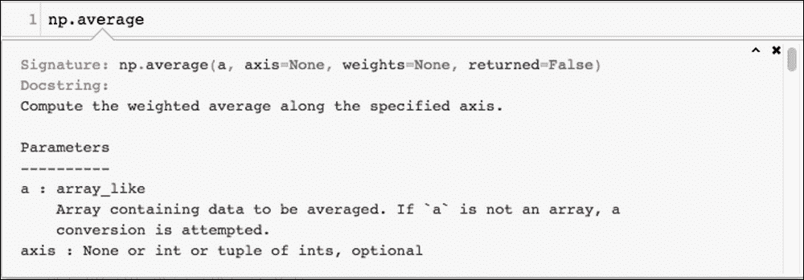

Jupyter Notebook 中的内联帮助。

使用这种方法，我可以快速迭代候选函数，直到找到适合我需求的函数为止。

重要的是要注意，`np.lookfor()`不限于查询 NumPy 模块； 您也可以在其他模块中搜索。 例如，以下代码在`statsmodels`程序包中搜索与[​​HTG1]（自相关函数）相关的方法：

```py
import statsmodels
np.lookfor("acf", module = statsmodels)
```

### 注意

[您可以在此处找到代码文件](https://github.com/DTAIEB/Thoughtful-Data-Science/blob/master/chapter%208/sampleCode1.py)。

这将产生以下结果：

```py
Search results for 'acf'
------------------------
statsmodels.tsa.vector_ar.var_model.var_acf
    Compute autocovariance function ACF_y(h) up to nlags of stable VAR(p)
statsmodels.tsa.vector_ar.var_model._var_acf
    Compute autocovariance function ACF_y(h) for h=1,...,p
statsmodels.tsa.tests.test_stattools.TestPACF
    Set up for ACF, PACF tests.
statsmodels.sandbox.tsa.fftarma.ArmaFft.acf2spdfreq
    not really a method
statsmodels.tsa.stattools.acf
    Autocorrelation function for 1d arrays.
statsmodels.tsa.tests.test_stattools.TestACF_FFT
    Set up for ACF, PACF tests.
...
```

## 创建一个 NumPy 数组

创建 NumPy 数组的方法有很多。 以下是最常用的方法：

*   从使用`np.array()`的 Python 列表或元组中，例如`np.array([1, 2, 3, 4])`。
*   从NumPy工厂功能之一：

    *   `np.random`: 提供大量用于随机生成值的功能的模块。 此模块由以下类别组成：

        简单随机数据：`rand`，`randn`，`randint`等

        排列：`shuffle`，`permutation`

        分布：`geometric`，`logistic`等

        ### 注意

    [    您可以在`np.random`模块上找到更多信息](https://docs.scipy.org/doc/numpy-1.14.0/reference/routines.random.html)。

    *   `np.arange`: 返回在给定间隔内具有均匀间隔值的`ndarray`。

        签名：`numpy.arange([start, ]stop, [step, ]dtype=None)`

        例如：`np.arange(1, 100, 10)`

        结果：`array([ 1, 11, 21, 31, 41, 51, 61, 71, 81, 91])`

    *   `np.linspace`: 与`np.arange`类似，它会返回一个`ndarray`，该·在给定的间隔内具有均匀间隔的值，不同之处在于，使用`linspace`可以指定所需的样本数，而不是步骤数。

        例如：`np.linspace(1,100,8, dtype=int)`

        结果：`array([ 1, 15, 29, 43, 57, 71, 85, 100])`

    *   `np.full`, `np.full_like`, `np.ones`, `np.ones_like`, `np.zeros`, `np.zeros_like`: 创建一个用常量值初始化的`ndarray`。

        例如：`np.ones( (2,2), dtype=int)`

        结果：`array([[1, 1], [1, 1]])`

    *   `np.eye`, `np.identity`, `np.diag`: 创建一个对角线常量值的`ndarray`：

        例如：`np.eye(3,3)`

        结果：`array([[1, 0, 0],[0, 1, 0],[0, 0, 1]])`

    ### 注意

    **注意**：未提供`dtype`参数时，NumPy 尝试从输入参数中推断出它。 但是，返回的类型可能不正确； 例如，浮点数应为整数时返回。 在这种情况下，您应该使用`dtype`参数来强制类型。 例如：

    ```py
    np.arange(1, 100, 10, dtype=np.integer)
    ```

    为什么 NumPy 数组比它们的 Python 列表和数组要快得多？

    如前所述，NumPy 数组上的操作比 Python 上的数组运行快得多。 这是因为 Python 是一种动态语言，它先验地不知道它要处理的类型，因此必须不断查询与其关联的元数据，才能将其分配给正确的方法。 另一方面，通过将 CPU 密集型例程的执行委派给已预先编译的外部高度优化的 C 库，NumPy 进行了高度优化以处理大型多维数据数组。

    为了做到这一点，NumPy 对 ndarray 设置了两个重要的约束：

*   `ndarray`是不可变的：因此，如果要更改`ndarray`的形状或大小，或者要添加/删除元素，则必须始终创建一个新数组。 例如，以下代码使用`arange()`函数创建一个`ndarray`，该`ndarray`返回一维数组，该数组具有均匀间隔的值，然后对其进行整形以适合4×5矩阵：

    ```py
    ar = np.arange(20)
    print(ar)
    print(ar.reshape(4,5))
    ```

    ### 注意

    [您可以在此处找到代码文件](https://github.com/DTAIEB/Thoughtful-Data-Science/blob/master/chapter%208/sampleCode2.py)。

    结果如下：

    ```py
    before:
       [ 0  1  2  3  4  5  6  7  8  9 10 11 12 13 14 15 16 17 18 19]
    after: 
       [[ 0  1  2  3  4]
       [ 5  6  7  8  9]
       [10 11 12 13 14]
       [15 16 17 18 19]]
    ```

*   `ndarray`中的元素必须是同一类型：`ndarray`在`dtype`成员中带有元素类型。 使用`nd.array()`函数创建新的`ndarray`时，NumPy将自动推断出适合所有元素的类型。

    例如：`np.array([1,2,3]).dtype`将是`dtype('int64')`。

    `np.array([1,2,'3']).dtype`将是`dtype('<U21')`，其中`<`表示小尾数（请参见[这个页面](https://en.wikipedia.org/wiki/Endianness)），而`U21`则是 21 个字符的 Unicode 字符串。

### 注意

[**注意**：您可以在此处找到有关所有受支持数据类型的详细信息](https://docs.scipy.org/doc/numpy/reference/arrays.dtypes.html)。

## 对 ndarray 的操作

大多数情况下，我们需要汇总 ndarray 上的数据。 幸运的是，NumPy 提供了非常丰富的函数集（也称为**归约函数**），可以在 ndarray 或 ndarray 的轴上提供框外汇总。

作为参考，NumPy 轴对应于数组的尺寸。 例如，一个二维 ndarray 有两个轴：一个跨行运行，称为轴 0，另一个跨列运行，称为轴 1。

下图说明了二维数组中的轴：

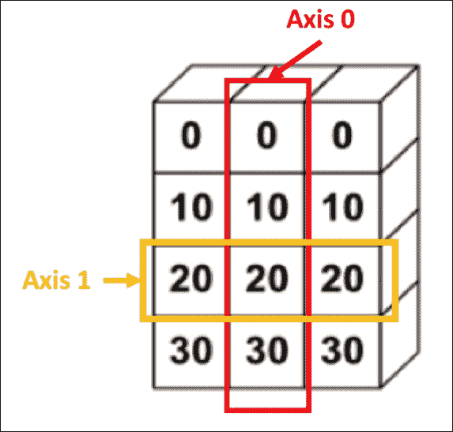

二维阵列中的轴

接下来我们将讨论的大多数归约函数都将轴作为参数。 它们分为以下几类：

*   **数学函数**：

    *   三角：`np.sin`，`np.cos`，以及其它
    *   双曲：`np.sinh`，`np.cosh`，以及其它
    *   取整：`np.around`，`np.floor`，以及其它
    *   求和，乘积，差异：`np.sum`，`np.prod`，`np.cumsum`，以及其它
    *   指数和对数：`np.exp`，`np.log`，以及其它
    *   算术：`np.add`，`np.multiply`，以及其它
    *   杂项：`np.sqrt`，`np.absolute`，以及其它

    ### 注意

    **注意**：所有这些一元函数（仅带有一个参数的函数）都直接在 ndarray 级别上工作。 例如，我们可以使用`np.square`立即对数组中的所有值求平方：

    代号： `np.square(np.arange(10))`

    结果： `array([ 0, 1, 4, 9, 16, 25, 36, 49, 64, 81])`

    [您可以在此处找到有关 NumPy 数学函数的更多信息](https://docs.scipy.org/doc/numpy/reference/routines.math.html)。

*   **统计函数**：

    *   订单统计：`np.amin`，`np.amax`，`np.percentile`等，
    *   平均值和方差：`np.median`，`np.var`，`np.std`等
    *   相关：`np.corrcoef`，`np.correlate`，`np.cov`等
    *   直方图：`np.histogram`，`np.bincount`，依此类推

### 注意

**注意**：pandas 与 NumPy 紧密集成，可让您将这些 NumPy 操作应用于 pandas DataFrames。 在本章其余部分中，当分析时间序列时，我们将大量使用此功能。

以下代码示例创建一个熊猫 DataFrame 并计算所有列的平方：


将 NumPy 操作应用于熊猫 DataFrames

## NumPy 数组上的选择

NumPy 数组支持与 Python 数组和列表类似的切片操作。 因此，使用通过`np.arrange()`方法创建的 ndarray，我们可以执行以下操作：

```py
sample = np.arange(10)
print("Sample:", sample)
print("Access by index: ", sample[2])
print("First 5 elements: ", sample[:5])
print("From 8 to the end: ", sample[8:])
print("Last 3 elements: ", sample[-3:])
print("Every 2 elements: ", sample[::2])
```

### 注意

[您可以在此处找到代码文件](https://github.com/DTAIEB/Thoughtful-Data-Science/blob/master/chapter%208/sampleCode3.py)。

产生以下结果：

```py
Sample: [0 1 2 3 4 5 6 7 8 9]
Access by index:  2
First 5 elements:  [0 1 2 3 4]
From index 8 to the end:  [8 9]
Last 3 elements:  [7 8 9]
Every 2 elements:  [0 2 4 6 8]
```

使用切片的选择也可用于具有多个维度的 NumPy 数组。 我们可以对数组中的每个维度使用切片。 对于仅允许使用切片整数进行索引的 Python 数组和列表，情况并非如此。

### 注意

**注意**：Python 中的切片具有以下语法供参考：

```py
start:end:step
```

例如，我们创建一个形状为`(3,4)`的 NumPy 数组，即 3 行* 4 列：

```py
my_nparray = np.arange(12).reshape(3,4)
print(my_nparray)
```

返回值：

```py
array([[ 0,  1,  2,  3],
       [ 4,  5,  6,  7],
       [ 8,  9, 10, 11]])
```

假设我只选择矩阵的中间，即[5，6]。 我可以简单地在行和列上应用切片，例如，`[1:2]`选择第二行，`[1:3]`选择第二行的第二和第三值：

```py
print(my_nparray[1:2, 1:3])
```

返回值：

```py
array([[5, 6]])
```

NumPy 的另一个有趣功能是，我们还可以使用谓词对具有布尔值的 ndarray 进行索引。

例如：

```py
print(sample > 5 )
```

返回值：

```py
[False False False False False False  True  True  True  True]
```

然后，我们可以使用布尔值 ndarray 通过简单而优雅的语法选择数据子集。

例如：

```py
print( sample[sample > 5] )
```

返回值：

```py
[6 7 8 9]
```

### 注意

[这只是 NumPy 所有选择功能的一小部分预览。 有关 NumPy 选择的更多信息，您可以访问](https://docs.scipy.org/doc/numpy-1.13.0/reference/arrays.indexing.html)。

## 广播

广播是 NumPy 的非常方便的功能。 它使您可以对具有不同形状的 ndarray 执行算术运算。 **广播**一词来自，事实是较小的阵列会自动复制以适合较大的阵列，因此它们具有兼容的形状。 但是，有一组规则可以控制广播的工作方式。

### 注意

[您可以在此处找到有关广播的更多信息](https://docs.scipy.org/doc/numpy/user/basics.broadcasting.html)。

NumPy 广播的最简单形式是**标量广播**，它使您可以在 ndarray 和标量（即数字）之间执行逐元素的算术运算。

例如：

```py
my_nparray * 2
```

返回值：

```py
array([[ 0,  2,  4,  6],
       [ 8, 10, 12, 14],
       [16, 18, 20, 22]])
```

### 注意

**注意**：在下面的讨论中，我们假设我们要对两个不具有相同维数的 ndarray 进行操作。

使用较小的数组进行广播仅需遵循一个规则：其中一个数组的尺寸至少必须等于 1。该想法是沿不匹配的尺寸复制较小的数组，直到它们匹配为止。

下图取自[这个页面](http://www.scipy-lectures.org/)网站，很好地说明了添加两个数组的不同情况：


广播流程说明

[来源](http://www.scipy-lectures.org/_images/numpy_broadcasting.png)

上图中演示的三个用例是：

*   **数组的尺寸匹配**：像往常一样对元素求和。
*   **较小的数组只有 1 行**：复制行，直到尺寸适合第一个数组。 如果较小的数组只有 1 列，则将使用相同的算法。
*   **第一个数组只有 1 列，第二个数组只有 1 行**：

    *   复制第一个数组中的列，直到我们拥有与 第二个数组
    *   复制第二个数组中的行，直到与第一个数组

    具有相同的行数

以下代码示例显示了正在运行的 NumPy 广播：

```py
my_nparray + np.array([1,2,3,4])
```

结果：

```py
array([[ 1,  3,  5,  7],
       [ 5,  7,  9, 11],
       [ 9, 11, 13, 15]])
```

在本节中，我们提供了对 NumPy 的基本介绍，至少足以使我们入门并遵循本章其余部分将介绍的代码示例。 在下一节中，我们将通过统计数据探索开始关于时间序列的讨论，以发现模式，这将有助于我们识别数据中的基础结构。

# 时间序列的统计探索

对于示例应用程序，我们将使用 [Quandl 数据平台金融 API](https://www.quandl.com/tools/api) 提供的股票历史财务数据。 [`quandl` Python 库](https://www.quandl.com/tools/python)。

首先，我们需要通过在其自己的单元中运行以下命令来安装`quandl`库：

```py
!pip install quandl

```

### 注意

**注意**：与往常一样，不要忘记在安装完成后重新启动内核。

免费访问 Quandl 数据，但每天最多可调用 50 次，但您可以通过创建免费帐户并获取 API 密钥来绕过此限制：

1.  转到[这个页面](https://www.quandl.com)并通过单击右上角的**注册**按钮创建一个新帐户。
2.  在注册向导的三个步骤中填写表格。 （我选择了**个人**，但是根据您的情况，您可能要选择**商业**或**学术**。）
3.  流程结束时，您应该会收到一封带有链接的电子邮件确认，以激活该帐户。
4.  激活帐户后，登录 Quandl 平台网站并单击右上方菜单中的**帐户设置**，然后转到 **API KEY** 选项卡。
5.  复制此页面中提供的 API 密钥。 该值将用于以编程方式在`quandl` Python 库中设置密钥，如以下代码所示：

    ```py
    import quandl
    quandl.ApiConfig.api_key = "YOUR_KEY_HERE"
    ```

`quandl`库主要由两个 API 组成：

*   `quandl.get(dataset, **kwargs)`: 这将为请求的数据集返回pandas DataFrame或NumPy数组。 `dataset`参数可以是字符串（单个数据集）或字符串列表（多个数据集）。 当`database_code`是数据发布者，而`dataset_code`与资源有关时，每个数据集都遵循语法`database_code/dataset_code`。 （请参阅下面的如何获取所有`database_code`和`dataset_code`的完整列表）。

    关键字参数使您能够优化查询。 [您可以在 GitHub 上的`quandl`代码中找到受支持参数的完整列表](https://github.com/quandl/quandl-python/blob/master/quandl/get.py)。

    一个有趣的关键字参数`returns`控制该方法返回的数据结构，并且可以采用以下两个值：

    *   `pandas`：返回熊猫 DataFrame
    *   `numpy`：返回一个 NumPy 数组

*   `quandl.get_table(datatable_code, **kwargs)`：返回有关资源的非时间序列数据集（称为`datatable`）。 我们不会在本章中使用此方法，[但是您可以通过查看以下代码找到更多有关此方法](https://github.com/quandl/quandl-python/blob/master/quandl/get_table.py)。

要获取`database_code`的列表，我们使用 Quandl REST API：`https://www.quandl.com/api/v3/databases?api_key=YOUR_API_KEY&page=n`，它使用分页。

### 注意

**注意**：在前面的 URL 中，将`YOUR_API_KEY`值替换为您的实际 API 密钥。

返回的有效负载采用以下 JSON 格式：

```py
{
  "databases": [{
         "id": 231,
         "name": "Deutsche Bundesbank Data Repository",
         "database_code": "BUNDESBANK",
         "description": "Data on the German economy, ...",
         "datasets_count": 49358,
         "downloads": 43209922,
         "premium": false,
         "image": "https://quandl--upload.s3.amazonaws/...thumb_bundesbank.png",
         "favorite": false,
         "url_name": "Deutsche-Bundesbank-Data-Repository"
       },...
],
  "meta": {
    "query": "",
    "per_page": 100,
    "current_page": 1,
    "prev_page": null,
    "total_pages": 3,
    "total_count": 274,
    "next_page": 2,
    "current_first_item": 1,
    "current_last_item": 100
  }
}
```

### 注意

[您可以在此处找到代码文件](https://github.com/DTAIEB/Thoughtful-Data-Science/blob/master/chapter%208/sampleCode4.json)。

我们使用`while`循环将依赖于`payload['meta']['next_page']`值的所有可用页面加载到，知道何时停止。 在每次迭代中，我们将`database_code`信息列表附加到称为`databases`的数组中，如以下代码所示：

```py
import requests
databases = []
page = 1
while(page is not None):
    payload = requests.get("https://www.quandl.com/api/v3/databases?api_key={}&page={}"\
                    .format(quandl.ApiConfig.api_key, page)).json()
 databases += payload['databases']
 page = payload['meta']['next_page']

```

### 注意

[您可以在此处找到代码文件](https://github.com/DTAIEB/Thoughtful-Data-Science/blob/master/chapter%208/sampleCode5.py)。

`databases`变量现在包含一个 JSON 对象数组，其中包含有关每个`database_code`的元数据。 我们使用 PixieDust `display()` API 在一个漂亮的可搜索表中查看数据：

```py
import pixiedust
display(databases)
```

在以下 PixieDust 表的屏幕截图中，我们使用第 2 章， *Data Science with Jupyter Notebook 和 PixieDust* 中描述的**过滤器**按钮来访问 每个数据库中可用的数据集计数的统计信息，例如，最小值，最大值和平均值：

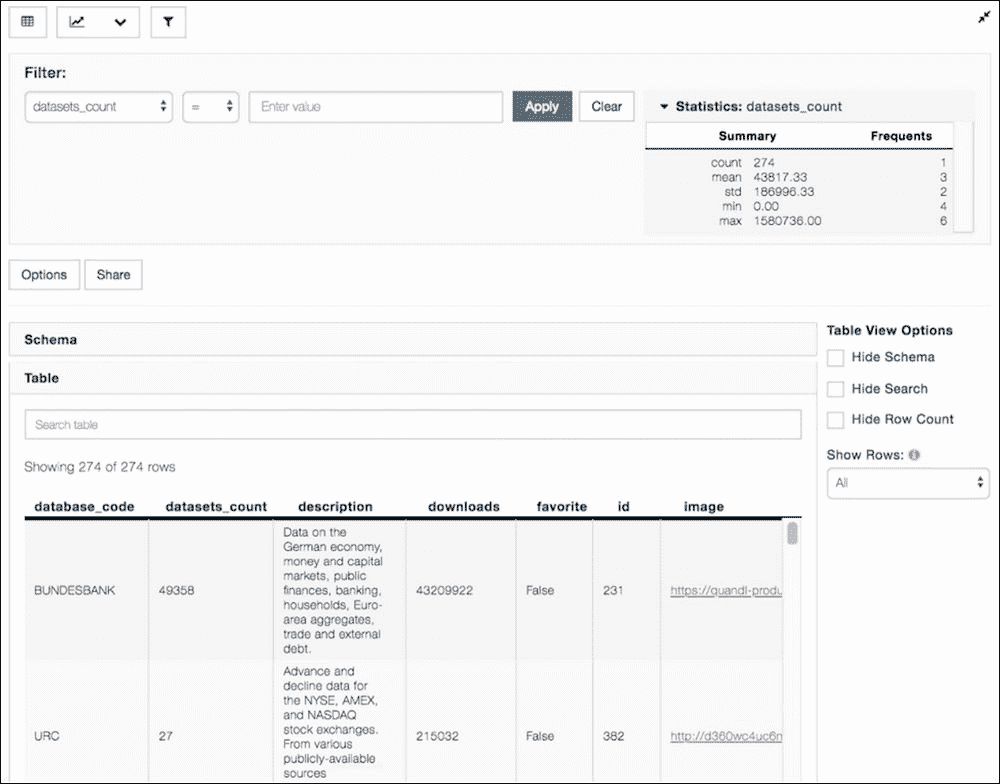

Quandl 数据库代码列表

在从**纽约证券交易所**（**NYSE**）搜索包含股票信息的数据库之后，我找到了`XNYS`数据库，如下所示：

### 注意

**注意**：确保将图表选项对话框中显示的值的数量增加到`300`，所以所有结果都显示在表中。


寻找包含纽约证券交易所股票数据的数据库

不幸的是，`XNYS`数据库不是公开的，需要付费订阅。 我最终使用了`WIKI`数据库代码，由于某种原因，它不是前面的 API 请求返回的列表的一部分，但我在某些代码示例中找到了。

然后，我使用`https://www.quandl.com/api/v3/databases/{database_code}/codes` REST API 来获取数据集列表。 幸运的是，此 API 返回压缩为 ZIP 文件的 CSV，PixieDust `sampleData()`方法可以轻松处理该 CSV 文件，如以下代码所示：

```py
codes = pixiedust.sampleData( "https://www.quandl.com/api/v3/databases/WIKI/codes?api_key=" + quandl.ApiConfig.api_key)
display(codes)
```

### 注意

[您可以在此处找到代码文件](https://github.com/DTAIEB/Thoughtful-Data-Science/blob/master/chapter%208/sampleCode6.py)。

在 PixieDust 表界面中，我们单击**选项**对话框以将显示的值数量增加到`4000`，以便我们可以拟合整个数据集（即 3,198），并使用搜索栏查找 下列屏幕快照中显示的特定股票：

### 注意

**注意**：搜索栏仅搜索浏览器中显示的行，当数据集太大时，该行可以较小。 由于在这种情况下，数据集太大，因此增加要显示的行数是不切实际的; 建议改用**过滤器**，这样可以保证查询整个数据集。

`quandl` API 返回的 CSV 文件没有标题，但是`PixieDust.sampleData()`希望有一个标题。 当前这是一个将来会解决的限制。


WIKI 数据库的数据集列表

在本节的其余部分中，我们将加载过去几年中的 Microsoft 股票（股票代码 MSFT）的历史时间序列数据，并开始探索其统计属性。 在下面的代码中，我们将`quandl.get()`与`WIKI/MSFT`数据集结合使用。 我们添加了一个称为`daily_spread`的列，该列通过调用熊猫`diff()`方法来计算每日收益/损失，该方法返回当前和先前调整后的收盘价之间的差额。 请注意，返回的熊猫 DataFrame 使用日期作为索引，但是 PixieDust 目前不支持通过索引绘制时间序列。 因此，在以下代码中，我们调用`reset_index()`将`DateTime`索引转换为名为`Date`的新列，其中包含日期信息：

```py
msft = quandl.get('WIKI/MSFT')
msft['daily_spread'] = msft['Adj. Close'].diff()
msft = msft.reset_index()
```

### 注意

[您可以在此处找到代码文件](https://github.com/DTAIEB/Thoughtful-Data-Science/blob/master/chapter%208/sampleCode7.py)。

对于我们的第一个数据探索，我们使用`display()`使用 Bokeh 渲染器创建股票经调整的收盘价随时间变化的折线图。

以下屏幕截图显示了**选项**配置以及生成的折线图：


MSFT 随时间变化的价格，根据股息分配，股票分割和其他公司行为进行了调整

我们还可以生成一个图表，该图表显示该期间每一天的每日点差，如以下屏幕截图所示：


MSFT 股票的每日价差

## 假设投资

作为练习，让我们尝试创建一个图表，该图表显示在选定股票（MSFT）中进行 10,000 美元的假设投资会如何随着时间变化。 为此，我们必须计算一个 DataFrame，其中包含该期间每一天的总投资价值，并考虑到我们在上一段中计算的每日价差，并使用 PixieDust `display()` API 可视化数据。

我们使用 pandas 功能使用基于日期的谓词来选择行，以首先过滤 DataFrame 以仅选择我们感兴趣的时间段内的数据点。然后，通过将 10,000 美元的初始投资除以交易结束时间来计算购买的股票数量 在该期间的第一天定价并加上初始投资价值。 多亏了熊猫的高效序列计算和底层的 NumPy 基础库，所有这些计算都变得非常容易。 我们使用[`np.cumsum()`方法](https://docs.scipy.org/doc/numpy-1.14.0/reference/generated/numpy.cumsum.html)计算所有 每日收益加上 10,000 美元的初始投资价值。

最后，我们使用`resample()`方法使图表更易于阅读，该方法将频率从每日转换为每月，并使用当月平均值计算新值。

以下代码使用从 2016 年 5 月开始的时间段来计算增长数据帧：

```py
import pandas as pd
tail = msft[msft['Date'] > '2016-05-16']
investment = np.cumsum((10000 / tail['Adj. Close'].values[0]) * tail['daily_spread']) + 10000
investment = investment.astype(int)
investment.index = tail['Date']
investment = investment.resample('M').mean()
investment = pd.DataFrame(investment).reset_index()
display(investment)
```

### 注意

[您可以在此处找到代码文件](https://github.com/DTAIEB/Thoughtful-Data-Science/blob/master/chapter%208/sampleCode8.py)。

以下屏幕截图显示了`display()` API 生成的图形，包括配置选项：


假设的投资组合增长

## 自相关函数（ACF）和部分自相关函数（PACF）

在尝试生成预测模型之前，必须了解时间序列是否具有可识别的模式，例如季节性或趋势。 一种流行的技术是根据指定的时滞来查看数据点与先前的数据点之间的关系。 直觉是自相关将揭示内部结构，例如，确定发生高相关（正或负）时的时间段。 您可以尝试不同的滞后值（即，对于每个数据点，要考虑多少个先前的点），以找到正确的周期。

计算 ACF 通常需要为[数据点集](https://en.wikipedia.org/wiki/Pearson_correlation_coefficient)计算 Pearson R 相关系数。 好消息是`statsmodels` Python 库具有`tsa`程序包（**tsa** 代表**时间序列分析**），该程序包提供了辅助方法来计算 ACF， 与熊猫系列紧密集成。

### 注意

**注意**：如果尚未完成，我们将使用以下命令安装`statsmodels`软件包，并在完成后重新启动内核：

```py
!pip install statsmodels
```

以下代码使用`tsa.api.graphics`包中的`plot_acf()`计算并可视化 MSFT 股票时间序列调整后的收盘价的 ACF：

```py
import statsmodels.tsa.api as smt
import matplotlib.pyplot as plt
smt.graphics.plot_acf(msft['Adj. Close'], lags=100)
plt.show()
```

结果如下：


滞后= 100 的 MSFT 的 ACF

上图显示了`x`横坐标给出的多个先前数据点（滞后）处数据的自相关。 因此，在滞后`0`处，您始终具有`1.0`的自相关（您始终与自己完美相关），滞后`1`显示与先前数据点的自相关，滞后`2`显示与以下数据的自相关 落后两个步骤的数据点。 我们可以清楚地看到，随着滞后的增加，自相关减小。 在上一张图表中，我们仅使用了 100 个滞后，并且我们看到自相关仍然在 0.9 左右具有统计显着性，这告诉我们长时间分隔的数据是不相关的。 这表明数据具有趋势，当浏览整体价格图表时，这一趋势非常明显。

为了确认这个假设，我们用更大的`lags`参数绘制 ACF 图表，例如`1000`（鉴于我们的系列有 10,000 个以上的数据点这一事实，这是不合理的），如以下屏幕快照所示：


滞后= 1000 的 MSFT 的 ACF

现在我们清楚地看到，自相关在`600`滞后附近降至显着性水平以下。

为了更好地说明 ACF 的工作原理，让我们生成一个不带趋势的周期性时间序列，并了解可以学习的内容。 例如，我们可以对`np.linspace()`生成的一系列均匀间隔的点使用`np.cos()`：

```py
smt.graphics.plot_acf(np.cos(np.linspace(0, 1000, 100)), lags=50)
plt.show()
```

### 注意

[您可以在此处找到代码文件](https://github.com/DTAIEB/Thoughtful-Data-Science/blob/master/chapter%208/sampleCode9.py)。

结果如下：


没有趋势的周期性序列的 ACF

在上一张图表中，我们可以看到自相关以固定间隔（每隔 5 个滞后）再次尖峰，清楚地显示了周期性（在处理实际数据时也称为季节性）。

使用 ACF 检测时间序列中的结构有时会导致问题，尤其是当具有很强的周期性时。 在这种情况下，无论您尝试自动关联数据的时间有多远，您总是会在一段时间内看到自相关峰值，这可能会导致错误的解释。 要解决此问题，我们使用的 PACF 使用的延迟更短，并且与 ACF 不同，它不重用以前在较短时间段内发现的相关性。 ACF 和 PACF 的数学相当复杂，但是读者只需要了解其背后的直觉，并乐于使用`statsmodels`之类的库来进行繁重的计算。 [我用来获取有关 ACF 和 PACF 的更多信息的一种资源可以在这里找到](https://www.mathworks.com/help/econ/autocorrelation-and-partial-autocorrelation.html)。

回到我们的 MSFT 股票时间序列，以下代码显示了如何使用`smt.graphics`包绘制其 PACF：

```py
import statsmodels.tsa.api as smt
smt.graphics.plot_pacf(msft['Adj. Close'], lags=50)
plt.show()
```

### 注意

[您可以在此处找到代码文件](https://github.com/DTAIEB/Thoughtful-Data-Science/blob/master/chapter%208/sampleCode10.py)。

结果显示在以下屏幕截图中：

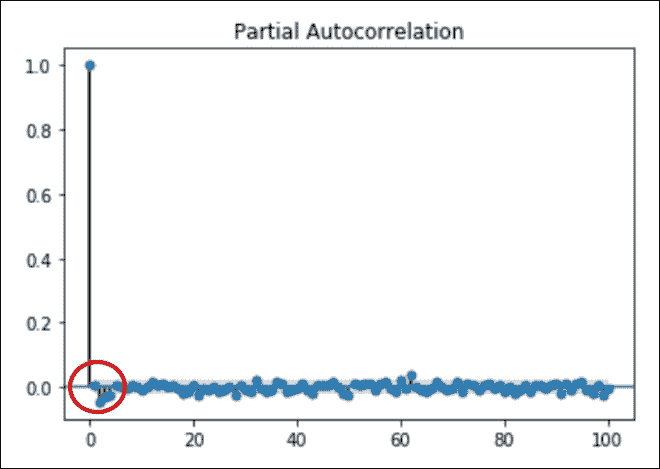

MSFT 股票时间序列的部分自相关

我们将在本章稍后讨论 ARIMA 模型的时间序列预测时，回到 ACF 和 PACF。

在本节中，我们讨论了探索数据的多种方法。 当然，这绝不是详尽无遗的，但是让我们想到了 Jupyter，Pandas，NumPy 和 PixieDust 等工具如何使实验更容易，并且在必要时会快速失败。 在下一节中，我们将构建一个 PixieApp，将所有这些图表组合在一起。

# 将其与 StockExplorer PixieApp 整合在一起

对于`StockExplorer` PixieApp 的第一个版本，我们希望对用户选择的股票数据时间序列进行数据探索。 与我们构建的其他 PixieApps 相似，第一个屏幕的布局简单，带有一个输入框，用户可以在其中输入以逗号分隔的股票代码列表，以及一个**浏览**按钮以启动 数据探索。 主屏幕由垂直导航栏组成，该导航栏带有每种数据浏览类型的菜单。 为了使 PixieApp 代码更具模块化并易于维护和扩展，我们在垂直导航栏触发的子 PixieApp 中实现每个数据浏览屏幕。 同样，每个子 PixieApp 都继承自称为`BaseSubApp`的基类，该基类提供了对所有子类有用的通用功能。 下图显示了所有子 PixieApps 的总体 UI 布局以及类图：

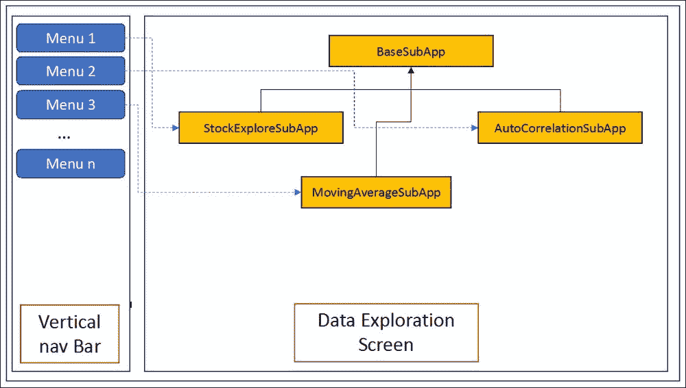

StockExplorer PixieApp 的 UI 布局

首先让我们看一下欢迎屏幕的实现。 它是`StockExplorer` PixieApp 类的默认路由中实现的。 以下代码显示`StockExplorer`类的部分实现，以仅包括默认路由。

### 注意

**注意**：在提供完整实现之前，请不要尝试运行此代码。

```py
@PixieApp
class StockExplorer():
    @route()
    def main_screen(self):
        return """
<style>
    div.outer-wrapper {
        display: table;width:100%;height:300px;
    }
    div.inner-wrapper {
        display: table-cell;vertical-align: middle;height: 100%;width: 100%;
    }
</style>
<div class="outer-wrapper">
    <div class="inner-wrapper">
        <div class="col-sm-3"></div>
        <div class="input-group col-sm-6">
          <input id="stocks{{prefix}}" type="text"
              class="form-control"
              value="MSFT,AMZN,IBM"
              placeholder="Enter a list of stocks separated by comma e.g MSFT,AMZN,IBM">
          <span class="input-group-btn">
 <button class="btn btn-default" type="button" pd_options="explore=true">
                <pd_script>
self.select_tickers('$val(stocks{{prefix}})'.split(','))
                </pd_script>
                Explore
            </button>
          </span>
        </div>
    </div>
</div>
"""
```

### 注意

[您可以在此处找到代码文件](https://github.com/DTAIEB/Thoughtful-Data-Science/blob/master/chapter%208/sampleCode11.py)。

前面的代码与到目前为止我们看到的其他示例 PixieApps 非常相似。 **浏览**按钮包含以下两个 PixieApp 属性：

*   `pd_script`子元素，该元素调用 Python 代码段来设置股票行情收录器。 我们还使用`$val`指令来检索用户输入的股票报价器的值：

    ```py
    <pd_script>
       self.select_tickers('$val(stocks{{prefix}})'.split(','))
    </pd_script>
    ```

*   `pd_options`属性，它指向`explore`路由：

    ```py
    pd_options="explore=true"
    ```

`select_tickers`帮助程序方法将代码行列表存储在字典成员变量中，并选择第一个作为活动代码行。 出于性能方面的考虑，我们仅在需要时加载数据，即，首次设置活动代码或用户在 UI 中单击特定代码时。

### 注意

**注意**：与前面的章节一样，`[[StockExplorer]]`表示该代码是`StockExplorer`类的一部分。

```py
[[StockExplorer]]
def select_tickers(self, tickers):
        self.tickers = {ticker.strip():{} for ticker in tickers}
        self.set_active_ticker(tickers[0].strip())

def set_active_ticker(self, ticker):
    self.active_ticker = ticker
 if 'df' not in self.tickers[ticker]:
        self.tickers[ticker]['df'] = quandl.get('WIKI/{}'.format(ticker))
        self.tickers[ticker]['df']['daily_spread'] = self.tickers[ticker]['df']['Adj. Close'] - self.tickers[ticker]['df']['Adj. Open']
        self.tickers[ticker]['df'] = self.tickers[ticker]['df'].reset_index()
```

### 注意

[您可以在此处找到代码文件](https://github.com/DTAIEB/Thoughtful-Data-Science/blob/master/chapter%208/sampleCode12.py)。

在`set_active_ticker()`中将特定股票代码的股票数据延迟加载到熊猫 DataFrame 中。 我们首先通过查看`df`键是否存在来检查是否已加载 DataFrame，如果不存在，我们用`dataset_code`：`'WIKI/{ticker}'`调用`quandl` API。 我们还添加了一个列，该列计算了将在基本探索屏幕中显示的股票的每日价差。 最后，我们需要在 DataFrame 上调用[`reset_index()`](https://pandas.pydata.org/pandas-docs/stable/generated/pandas.DataFrame.reset_index.html)以转换索引， 是`DateTimeIndex`进入其自己的列，称为`Date`。 原因是 PixieDust `display()`尚不支持使用`DateTimeIndex`可视化 DataFrame。

在`explore`路由中，我们返回一个 HTML 片段，该片段构建了整个屏幕的布局。 如前面的模型所示，我们使用`btn-group-vertical`和`btn-group-toggle`引导程序类创建垂直导航栏。 菜单列表和关联的子 PixieApp 在`tabs` Python 变量中定义，我们使用 Jinja2 ``构建内容。 我们还将在`id ="analytic_screen{{prefix}}"`中添加一个占位符`<div>`元素，该元素将成为子 PixieApp 屏幕的接收者。

`explore`路由实现如下所示：

```py
[[StockExplorer]] 
@route(explore="*")
 @templateArgs
    def stock_explore_screen(self):
 tabs = [("Explore","StockExploreSubApp"),
 ("Moving Average", "MovingAverageSubApp"),
 ("ACF and PACF", "AutoCorrelationSubApp")]
        return """
<style>
    .btn:active, .btn.active {
        background-color:aliceblue;
    }
</style>
<div class="page-header">
    <h1>Stock Explorer PixieApp</h1>
</div>
<div class="container-fluid">
    <div class="row">
        <div class="btn-group-vertical btn-group-toggle col-sm-2"
             data-toggle="buttons">
 
            <label class="btn btn-secondary active"
                pd_options="show_analytic={{subapp}}"
                pd_target="analytic_screen{{prefix}}">
                <input type="radio" checked>
                    {{title}}
            </label>
 
        </div>
        <div id="analytic_screen{{prefix}}" class="col-sm-10">
    </div>
</div>
"""
```

### 注意

[您可以在此处找到代码文件](https://github.com/DTAIEB/Thoughtful-Data-Science/blob/master/chapter%208/sampleCode13.py)。

在前面的代码中，请注意我们使用`@templateArgs`装饰器，因为我们要使用 Jinja2 模板中在方法实现本地创建的`tabs`变量。

垂直导航栏中的每个菜单都指向相同的`analytic_screen{{prefix}}`目标，并使用`{{subapp}}`引用的选定子 PixieApp 类名称调用`show_analytic`路由。

反过来，`show_anatytic`路由仅返回带有`<div>`元素的 HTML 片段，该元素具有`pd_app`属性，该属性引用子 PixieApp 类名称。 我们还使用`pd_render_onload`属性要求 PixieApp 将`<div>`元素的内容加载到浏览器 DOM 中后立即呈现。

以下代码用于`show_analytic`路由：

```py
    @route(show_analytic="*")
    def show_analytic_screen(self, show_analytic):
        return """
<div pd_app="{{show_analytic}}" pd_render_onload></div>
"""
```

### 注意

[您可以在此处找到代码文件](https://github.com/DTAIEB/Thoughtful-Data-Science/blob/master/chapter%208/sampleCode14.py)。

## BaseSubApp –所有子 PixieApps 的基类

现在让我们看一下每个子 PixieApps 的实现以及基类`BaseSubApp`用于如何提供常见的功能。 对于每个子 PixieApp，我们希望用户能够通过选项卡式界面选择股票行情收录器，如以下屏幕截图所示：


MSFT，IBM，AMZN 代码的选项卡小部件

我们没有为每个子 PixieApp 重复 HTML 片段，而是使用了我特别喜欢的技术，该技术包括创建一个称为`add_ticker_selection_markup`的 Python 装饰器，该装饰器可动态更改函数的行为（有关 Python 装饰器的更多信息，请参见[这个页面](https://wiki.python.org/moin/PythonDecorators)。 此修饰器在`BaseSubApp`类类中创建，并将自动为该路由添加选项卡选择小部件 HTML 标记，如以下代码所示：

```py
[[BaseSubApp]]
def add_ticker_selection_markup(refresh_ids):
    def deco(fn):
        def wrap(self, *args, **kwargs):
            return """
<div class="row" style="text-align:center">
 <div class="btn-group btn-group-toggle"
 style="border-bottom:2px solid #eeeeee"
 data-toggle="buttons">
 
 <label class="btn btn-secondary active"
 pd_refresh=\"""" + ",".join(refresh_ids) + """\" pd_script="self.parent_pixieapp.set_active_ticker('{{ticker}}')">
 <input type="radio" checked> 
 {{ticker}}
 </label>
 
 </div>
</div>
            """ + fn(self, *args, **kwargs)
        return wrap
    return deco
```

### 注意

[您可以在此处找到代码文件](https://github.com/DTAIEB/Thoughtful-Data-Science/blob/master/chapter%208/sampleCode15.py)。

乍一看，前面的代码可能很难阅读，因为`add_ticker_selection_markup`装饰器方法包含两个级匿名嵌套方法。 让我们尝试说明每种方法的目的，包括主要的`add_ticker_selection_markup`装饰器方法：

*   `add_ticker_selection_markup`：这是主要的装饰器方法，采用一个称为`refresh_ids`的参数，该参数将在生成的标记中使用。 此方法返回一个匿名函数`deco`，该函数带有一个函数参数。
*   `deco`：这是一个包装器方法，采用一个称为`fn`的参数，该参数是指向应用装饰器的原始函数的指针。 此方法返回一个名为`wrap`的匿名函数，当在用户代码中调用该函数时，该函数将在原始函数的环境中被调用。
*   `wrap`: 这是采用三个参数的最终包装方法：

    *   `self`：指向该函数的主机类的指针
    *   `*args`：原始方法定义的任何变量参数（可以为空）
    *   `**kwargs`：原始方法定义的任何关键字参数（可以为空）

    `wrap`方法可以通过 Python 闭包机制访问超出其范围的变量。 在这种情况下，它使用`refresh_ids`生成选项卡小部件标记，然后使用`self`，`args`和`kwargs`参数调用`fn`函数。

### 注意

**注意**：即使多次阅读后，上述解释仍然令人困惑，请不要担心。 您现在只能使用装饰器，它不会影响您理解本章其余部分的能力。

## StockExploreSubApp –第一个孩子 PixieApp

现在，我们可以实现名为`StockExploreSubApp`的第一个子 PixieApp。 在主屏幕中，我们创建两个`<div>`元素，每个元素均具有`pd_options`属性，该属性以`Adj. Close`和`daily_spread`作为值调用`show_chart`路由。 反过来，`show_chart`路由返回一个`<div>`元素，该元素的`pd_entity`属性指向`parent_pixieapp.get_active_df()`方法，该属性带有一个`<pd_options>`元素，该元素包含一个 JSON 有效载荷，用于显示带有`Date`的散景折线图 ]作为`x`横坐标，并且将任何值作为参数传递为`y`纵坐标的列。 我们还使用`BaseSubApp.add_ticker_selection_markup`装饰器装饰路线，并使用前两个`<div>`元素的 ID 作为`refresh_ids`参数。

以下代码显示了`StockExplorerSubApp`子 PixieApp 的实现：

```py
@PixieApp
class StockExploreSubApp(BaseSubApp):
    @route()
 @BaseSubApp.add_ticker_selection_markup(['chart{{prefix}}', 'daily_spread{{prefix}}'])
    def main_screen(self):
        return """
<div class="row" style="min-height:300px">
    <div class="col-xs-6" id="chart{{prefix}}" pd_render_onload pd_options="show_chart=Adj. Close">
    </div>
    <div class="col-xs-6" id="daily_spread{{prefix}}" pd_render_onload pd_options="show_chart=daily_spread">
    </div>
</div>
"""

    @route(show_chart="*")
    def show_chart_screen(self, show_chart):
        return """
<div pd_entity="parent_pixieapp.get_active_df()" pd_render_onload>
    <pd_options>
    {
      "handlerId": "lineChart",
      "valueFields": "{{show_chart}}",
      "rendererId": "bokeh",
      "keyFields": "Date",
      "noChartCache": "true",
      "rowCount": "10000"
    }
    </pd_options>
</div>
        """
```

### 注意

[您可以在此处找到代码文件](https://github.com/DTAIEB/Thoughtful-Data-Science/blob/master/chapter%208/sampleCode16.py)。

在`show_chart`路由之前的中，`pd_entity`使用来自`parent_pixieapp`的和`get_active_df()`方法，该方法在`StockExplorer`主类中定义如下：

```py
[[StockExplorer]]
def get_active_df(self):
    return self.tickers[self.active_ticker]['df']
```

### 注意

[您可以在此处找到代码文件](https://github.com/DTAIEB/Thoughtful-Data-Science/blob/master/chapter%208/sampleCode17.py)。

提醒一下，`StockExploreSubApp`通过菜单中的`StockExplorer`路由的`Explore`路由声明的`tabs`数组变量中的元组与菜单关联：

```py
tabs = [("Explore","StockExploreSubApp"), ("Moving Average", "MovingAverageSubApp"),("ACF and PACF", "AutoCorrelationSubApp")]
```

### 注意

[您可以在此处找到代码文件](https://github.com/DTAIEB/Thoughtful-Data-Science/blob/master/chapter%208/sampleCode18.py)。

以下屏幕截图显示了`StockExploreSubApp`：


StockExploreSubApp 主屏幕

## MovingAverageSubApp –第二个子 PixieApp

第二个子 PixieApp 是`MovingAverageSubApp`，它显示选定股票行情指示器的移动平均线的折线图，其滞后可通过滑块控件进行配置。 与代码选择器选项卡类似，另一个子 PixieApp 中将需要滞后滑块。 我们可以使用与股票行情选择标签控件相同的装饰器技术，但在这里我们希望能够将滞后滑块放置在页面上的任何位置。 因此，我们将使用在`BaseSubApp`类中定义的名为`lag_slider`的`pd_widget`控件，并为滑块控件返回 HTML 片段。 它还添加了`<script>`元素，该元素使用 jQuery UI 模块中可用的 jQuery `slider`方法（有关更多信息，请参见[这个页面](https://api.jqueryui.com/slider)）。 我们还添加了`change`处理函数，当用户选择新值时会调用该函数。 在此处理程序中，我们调用`pixiedust.sendEvent`函数来发布`lagSlider`类型的事件和包含滞后新值的有效负载。 调用者有责任添加`<pd_event_handler>`元素以侦听该事件并处理有效负载。

以下代码显示了`lag_slider` `pd_widget`的实现：

```py
[[BaseSubApp]]
@route(widget="lag_slider")
def slider_screen(self):
    return """
<div>
    <label class="field">Lag:<span id="slideval{{prefix}}">50</span></label>
    <i class="fa fa-info-circle" style="color:orange"
       data-toggle="pd-tooltip"
       title="Selected lag used to compute moving average, ACF or PACF"></i>
    <div id="slider{{prefix}}" name="slider" data-min=30 
         data-max=300
         data-default=50 style="margin: 0 0.6em;">
    </div>
</div>
<script>
$("[id^=slider][id$={{prefix}}]").each(function() {
    var sliderElt = $(this)
    var min = sliderElt.data("min")
    var max = sliderElt.data("max")
    var val = sliderElt.data("default")
 sliderElt.slider({
        min: isNaN(min) ? 0 : min,
        max: isNaN(max) ? 100 : max,
        value: isNaN(val) ? 50 : val,
        change: function(evt, ui) {
            $("[id=slideval{{prefix}}]").text(ui.value);
            pixiedust.sendEvent({type:'lagSlider',value:ui.value})
        },
        slide: function(evt, ui) {
            $("[id=slideval{{prefix}}]").text(ui.value);
        }
    });
})
</script>
        """
```

### 注意

[您可以在此处找到代码文件](https://github.com/DTAIEB/Thoughtful-Data-Science/blob/master/chapter%208/sampleCode19.py)。

在`MovingAverageSubApp`中，我们使用`add_ticker_selection_markup`装饰器并将`chart{{prefix}}`作为默认路由的参数，以添加股票选择器选项卡，并添加一个名为`lag_slider`的`<div>`元素，其中包含`<pd_event_handler>`设置`self.lag`变量并刷新`chart` div。 `chart` div 将`pd_entity`属性与调用`rolling`方法的[`get_moving_average_df()`方法](https://pandas.pydata.org/pandas-docs/stable/generated/pandas.Series.rolling.html)一起使用，从选定的熊猫 DataFrame 返回滚动均值，并在其上调用`mean()`方法。 由于 PixieDust `display()`尚不支持 pandas 系列，因此我们将系列索引用作名为`x`的列来构建 pandas DataFrame，并以`get_moving_average_df()`方法返回它。

以下代码显示了`MovingAverageSubApp`子 PixieApp 的实现

```py
@PixieApp
class MovingAverageSubApp(BaseSubApp):
    @route()
 @BaseSubApp.add_ticker_selection_markup(['chart{{prefix}}'])
    def main_screen(self):
        return """
<div class="row" style="min-height:300px">
    <div class="page-header text-center">
        <h1>Moving Average for {{this.parent_pixieapp.active_ticker}}</h1>
    </div>
    <div class="col-sm-12" id="chart{{prefix}}" pd_render_onload pd_entity="get_moving_average_df()">
        <pd_options>
        {
          "valueFields": "Adj. Close",
          "keyFields": "x",
          "rendererId": "bokeh",
          "handlerId": "lineChart",
          "rowCount": "10000"
        }
        </pd_options>
    </div>
</div>
<div class="row">
    <div pd_widget="lag_slider">
        <pd_event_handler 
            pd_source="lagSlider"
 pd_script="self.lag = eventInfo['value']"
 pd_refresh="chart{{prefix}}">
        </pd_event_handler>
    </div>
</div>
"""
    def get_moving_average_df(self):
        ma = self.parent_pixieapp.get_active_df()['Adj. Close'].rolling(window=self.lag).mean()
        ma_df = pd.DataFrame(ma)
        ma_df["x"] = ma_df.index
        return ma_df
```

### 注意

[您可以在此处找到代码文件](https://github.com/DTAIEB/Thoughtful-Data-Science/blob/master/chapter%208/sampleCode20.py)。

以下屏幕截图显示了`MovingAverageSubApp`显示的图表：


MovingAverageSubApp 屏幕截图

## AutoCorrelationSubApp –第三子 PixieApp

对于第三个孩子，PixieApp 调用了`AutoCorrelationSubApp`； 我们显示所选股票 DataFrame 的 ACF 和 PACF，这些数据是使用`statsmodels`包计算的。

以下代码显示了`AutoCorrelationSubApp`的实现，该实现也使用了`add_ticker_selection_markup`装饰器和名为`lag_slider`的`pd_widget`：

```py
import statsmodels.tsa.api as smt
@PixieApp
class AutoCorrelationSubApp(BaseSubApp):
    @route()
    @BaseSubApp.add_ticker_selection_markup(['chart_acf{{prefix}}', 'chart_pacf{{prefix}}'])
    def main_screen(self):
        return """
<div class="row" style="min-height:300px">
    <div class="col-sm-6">
        <div class="page-header text-center">
            <h1>Auto-correlation Function</h1>
        </div>
        <div id="chart_acf{{prefix}}" pd_render_onload pd_options="show_acf=true">
        </div>
    </div>
    <div class="col-sm-6">
        <div class="page-header text-center">
            <h1>Partial Auto-correlation Function</h1>
        </div>
        <div id="chart_pacf{{prefix}}" pd_render_onload pd_options="show_pacf=true">
        </div>
    </div>
</div> 

<div class="row">
    <div pd_widget="lag_slider">
        <pd_event_handler 
            pd_source="lagSlider"
            pd_script="self.lag = eventInfo['value']"
            pd_refresh="chart_acf{{prefix}},chart_pacf{{prefix}}">
        </pd_event_handler>
    </div>
</div>
"""
 @route(show_acf='*')
 @captureOutput
    def show_acf_screen(self):
        smt.graphics.plot_acf(self.parent_pixieapp.get_active_df()['Adj. Close'], lags=self.lag)

 @route(show_pacf='*')
 @captureOutput
    def show_pacf_screen(self):
        smt.graphics.plot_pacf(self.parent_pixieapp.get_active_df()['Adj. Close'], lags=self.lag)
```

### 注意

[您可以在此处找到代码文件](https://github.com/DTAIEB/Thoughtful-Data-Science/blob/master/chapter%208/sampleCode21.py)。

在前面的代码中，我们定义了两个路由：`show_acf`和`show_pacf`，它们分别调用`smt.graphics`包的`plot_acf`和`plot_pacf`方法。 我们还使用`@captureOutput`装饰器向 PixieApp 框架发出信号，以捕获`plot_acf`和`plot_pacf`生成的输出。

以下屏幕截图显示了`AutoCorrelationSubApp`显示的图表：

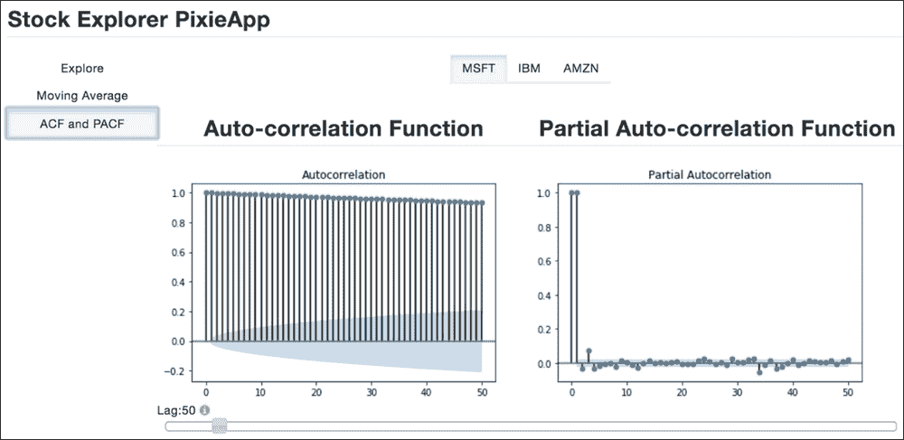

AutoCorrelationSubApp 屏幕截图

在本部分中，我们显示了如何将样本 PixieApp 放在一起，该样本对时间序列进行基本数据探索并显示各种统计图。 [完整的笔记本可以在这里找到](https://github.com/DTAIEB/Thoughtful-Data-Science/blob/master/chapter%208/StockExplorer%20-%20Part%201.ipynb)。

在下一节中，我们将尝试使用称为**自回归综合移动平均值**（**ARIMA**）的非常流行的模型来构建时间序列预测模型。

# 使用 ARIMA 模型的时间序列预测

ARIMA 是最受欢迎的时间系列预测模型之一，顾名思义，它由三个术语组成：

*   **AR**: 代表**自回归**，无非就是使用一种线性回归算法，该算法使用一个观测值和自己的滞后观测值作为训练数据。

    AR 模型使用以下公式：

    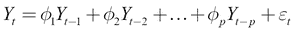

    其中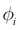是从先前观察值和中获知的模型的权重，是观察值`t`的残差。

    我们也将`p`称为自回归模型的阶，该阶数定义为上式中包含的滞后观测次数。

    例如：

    *AR（2）*定义为：

    

    *AR（1）*定义为：

    

*  `I`: Stands for **integrated**. For the ARIMA model to work, it is assumed that the time series is stationary or can be made stationary. A series is said to be stationary ([https://en.wikipedia.org/wiki/Stationary_process](https://en.wikipedia.org/wiki/Stationary_process)) if its mean and variance doesn't change over time.

    ### 注意

    **注意**：还有严格的平稳性的概念，它要求随时间推移时观察子集的联合概率分布不发生变化。

    使用数学符号，严格平稳性可以转换为：

    和对于任何`t`，`m`和 *k，*都是相同的，其中`F`是联合概率分布 。

    实际上，此条件太强了，最好使用前面提供的较弱的定义。

    我们可以通过使用观察值与之前的观察值之间的对数差的转换来使时间序列平稳，如以下等式所示：

    

    在系列实际变为固定时间之前，可能需要多次对数差分转换。 我们称`d`为使用对数差分对序列进行变换的次数。

    例如：

    *I（0）*被定义为不需要日志差异（该模型称为 ARMA）。

    *I（1）*定义为需要 1 个日志差异。

    *I（2）*定义为需要 2 个对数差。

    ### 注意

    **注意**：重要的是要记住在预测一个值之后对进行的所有积分进行反向转换。

*   **MA**: 代表“移动平均线”。 MA模型使用来自当前观测值均值的残差和滞后观测值的加权残差。 我们可以使用以下公式定义模型：

    

    在哪里

    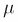

    是时间序列的平均值，是序列中的残差，是滞后残差的权重。

    我们将`q`称为移动平均窗口的大小。

    例如：

    *MA（0）*定义为不需要移动平均线（该模型称为 AR）。

    *MA（1）*被定义为使用 1 的移动平均窗口。公式变为：

    

根据先前的定义，我们使用符号 *ARIMA（p，d，q）*定义 ARIMA 模型，其阶数为`p`的自回归模型，阶为[`d`和大小为`q`的移动平均窗口。

实现所有代码以建立 ARIMA 模型可能非常耗时。 幸运的是，`statsmodels`库在`statsmodels.tsa.arima_model`包中实现了`ARIMA`类，该类提供了使用`fit()`方法训练模型并使用`predict()`方法预测值所需的所有计算。 它还照顾日志差异以使时间序列固定。 诀窍在于找到用于构建最佳 ARIMA 模型的参数`p`，`d`和`q`。 为此，我们使用 ACF 和 PACF 图表，如下所示：

*  `p`值对应于滞后数（在`x`横坐标上），ACF 图表首次超过统计显着性阈值。
*   类似地，`q`值对应于 PACF 图表首次超过统计显着性阈值的滞后次数（在`x`横坐标上）。

## 为 MSFT 库存时间序列建立 ARIMA 模型

提醒一下，MSFT 股票时间序列的价格图如下所示：


MSFT 股票系列图

在开始建立模型之前，让我们首先保留数据的最后 14 天以进行测试，然后将其余部分用于训练。

以下代码定义了两个新变量：`train_set`和`test_set`：

```py
train_set, test_set = msft[:-14], msft[-14:]
```

### 注意

**注意**：如果您仍然不熟悉前面的切片符号，请参阅本章开头有关 NumPy 的部分

从上图可以清楚地看到从 2012 年开始的增长趋势，但没有明显的季节性。 因此，我们可以放心地假设没有平稳性。 让我们首先尝试一次应用对数差分转换，并绘制相应的 ACF 和 PACF 图表。

在以下代码中，我们通过在`Adj. Close`列上使用`np.log()`来构建`logmsft`大熊猫系列，然后使用`logmsft`与 1 的滞后时间之间的差值来构建`logmsft_diff` pandas DataFrame。 `shift()`方法）。 像以前做过一样，我们也调用`reset_index()`将`Date`索引转换为一列，以便 PixieDust `display()`可以处理它：

```py
logmsft = np.log(train_set['Adj. Close'])
logmsft.index = train_set['Date']
logmsft_diff = pd.DataFrame(logmsft - logmsft.shift()).reset_index()
logmsft_diff.dropna(inplace=True)
display(logmsft_diff)
```

### 注意

[您可以在此处找到代码文件](https://github.com/DTAIEB/Thoughtful-Data-Science/blob/master/chapter%208/sampleCode22.py)。

结果显示在以下屏幕截图中：

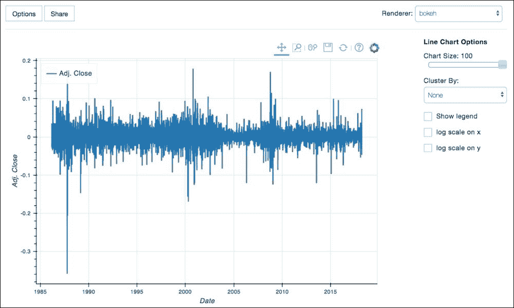

应用对数差异后的 MSFT 股票系列

通过查看前面的图，我们可以合理地认为我们已经成功地使时间序列固定为 0。 我们还可以使用更严格的方法通过使用 [Dickey-Fuller 测试](https://en.wikipedia.org/wiki/Dickey%E2%80%93Fuller_test)的测试平稳性 测试 *AR（1）*模型中存在单位根的原假设。

### 注意

**注意**：在统计中，统计假设检验包括通过抽取样本并确定主张是否成立来质疑所提出的假设是否成立。 我们看一下 [p 值](https://en.wikipedia.org/wiki/P-value)，它有助于确定结果的重要性。 有关统计假设检验的更多详细信息，[请参见此处](https://en.wikipedia.org/wiki/Statistical_hypothesis_testing)。

以下代码使用`statsmodels.tsa.stattools`程序包中的`adfuller`方法：

```py
from statsmodels.tsa.stattools import adfuller
import pprint

ad_fuller_results = adfuller(
logmsft_diff['Adj. Close'], autolag = 'AIC', regression = 'c'
)
labels = ['Test Statistic','p-value','#Lags Used','Number of Observations Used']
pp = pprint.PrettyPrinter(indent=4)
pp.pprint({labels[i]: ad_fuller_results[i] for i in range(4)})
```

### 注意

[您可以在此处找到代码文件](https://github.com/DTAIEB/Thoughtful-Data-Science/blob/master/chapter%208/sampleCode23.py)。

我们使用了`pprint`软件包，该软件包对于*漂亮- 打印*任何 Python 数据结构。 有关`pprint`的更多信息，请参见[这个页面](https://docs.python.org/3/library/pprint.html)。

结果（在[这个页面](http://www.statsmodels.org/devel/generated/statsmodels.tsa.stattools.adfuller.html)中进行了详细说明）显示在此处：

```py
{
    'Number of lags used': 3,
    'Number of Observations Used': 8057,
    'Test statistic': -48.071592138591136,
    'MacKinnon's approximate p-value': 0.0
}
```

### 注意

[您可以在此处找到代码文件](https://github.com/DTAIEB/Thoughtful-Data-Science/blob/master/chapter%208/sampleCode24.json)。

p 值低于显着性水平； 因此，我们可以否定 *AR（1）*模型中存在单位根的零假设，这使我们确信时间序列是固定的。

然后我们绘制 ACF 和 PACF 图表，这将为我们提供 ARIMA 模型的`p`和`q`参数：

以下代码构建了 ACF 图表：

```py
import statsmodels.tsa.api as smt
smt.graphics.plot_acf(logmsft_diff['Adj. Close'], lags=100)
plt.show()
```

### 注意

[您可以在此处找到代码文件](https://github.com/DTAIEB/Thoughtful-Data-Science/blob/master/chapter%208/sampleCode25.py)。

结果显示在以下屏幕截图中：

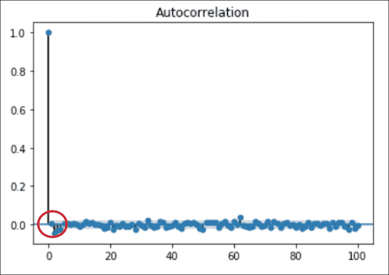

日志差异 MSFT DataFrame 的 ACF

从前面的[CFG0] ACF 图中，我们可以看到相关性在的第一时间越过统计显着性阈值，因此滞后 1。因此，我们将 *p = 1* 用作 我们 ARIMA 模型的 AR 顺序。

我们对 PACF 进行相同的操作：

```py
smt.graphics.plot_pacf(logmsft_diff['Adj. Close'], lags=100)
plt.show()
```

### 注意

[您可以在此处找到代码文件](https://github.com/DTAIEB/Thoughtful-Data-Science/blob/master/chapter%208/sampleCode26.py)。

结果显示在以下屏幕截图中：


PACF 用于日志差异 MSFT DataFrame

从前面的 PACF 图中，我们还可以看到相关性以 1 的滞后首次超过统计显着性阈值。因此，我们将 *q = 1* 作为 MA 阶 我们的 ARIMA 模型。

我们还只需要应用一次日志差分转换。 因此，我们将 *d = 1* 用于 ARIMA 模型的集成部分。

### 注意

**注意**：在调用`ARIMA`类时，如果您使用 *d = 0* ，则可能必须手动进行日志区分，在这种情况下，您需要 自己根据预测值还原转换。 如果不是，`statsmodels`包将负责在返回预测值之前恢复转换。

以下代码使用 *p = 1* ， *d = 1* 和 *q = 1* 作为阶次值，在`train_set`时间序列上训练 ARIMA 模型`ARIMA`构造函数的元组参数。 然后，我们调用`fit()`方法进行训练并获得模型：

```py
from statsmodels.tsa.arima_model import ARIMA

import warnings
with warnings.catch_warnings():
    warnings.simplefilter("ignore")
    arima_model_class = ARIMA(train_set['Adj. Close'], dates=train_set['Date'], order=(1,1,1))
    arima_model = arima_model_class.fit(disp=0)

    print(arima_model.resid.describe())
```

### 注意

[您可以在此处找到代码文件](https://github.com/DTAIEB/Thoughtful-Data-Science/blob/master/chapter%208/sampleCode27.py)。

**注意**：我们使用`warnings`包来避免在使用较旧版本的 NumPy 和 pandas 时可能发生的弃用警告。

在前面的代码中，我们将`train_set['Adj. Close']`用作`ARIMA`构造函数的参数。 由于我们对数据使用序列，因此我们还需要为`dates`参数传递`train_set['Date']`系列。 请注意，如果我们通过带有`DateIndex`索引的 pandas DataFrame 来传递，则不必使用`dates`参数。 `ARIMA`构造函数的最后一个参数是`order`参数，它是表示`p`，`d`和`q`顺序的三个值的元组， 如本节开头所讨论的。

然后，我们调用`fit()`方法，该方法返回将用于预测值的实际 ARIMA 模型。 出于信息目的，我们使用`arima_model.resid.describe()`打印有关模型剩余误差的统计信息。

结果显示在这里：

```py
count    8.061000e+03
mean    -5.785533e-07
std      4.198119e-01
min     -5.118915e+00
25%     -1.061133e-01
50%     -1.184452e-02
75%      9.848486e-02
max      5.023380e+00
dtype: float64
```

平均残留误差为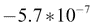，非常接近零，因此表明该模型可能过度拟合了训练数据。

现在我们有了一个模型，让我们尝试对其进行诊断。 我们定义了一种称为`plot_predict`的方法，该方法将用作模型，一系列日期和一个数字，这些数字指示我们要追溯的距离。 然后，我们调用 ARIMA `plot_predict()`方法来创建包含预测值和观察值的图表。

以下代码显示了`plot_predict()`方法的实现，包括使用`100`和`10`对其进行两次调用：

```py
def plot_predict(model, dates_series, num_observations):
    fig = plt.figure(figsize = (12,5))
    model.plot_predict(
        start = str(dates_series[len(dates_series)-num_observations]),
        end = str(dates_series[len(dates_series)-1])
    )
    plt.show()

plot_predict(arima_model, train_set['Date'], 100)
plot_predict(arima_model, train_set['Date'], 10)
```

### 注意

[您可以在此处找到代码文件](https://github.com/DTAIEB/Thoughtful-Data-Science/blob/master/chapter%208/sampleCode28.py)。

结果显示在这里：


观测值与预测图

前面的图表显示了预测与训练集中的实际观察值有多接近。 我们现在使用之前保留的测试集来进一步诊断模型。 对于这一部分，我们使用`forecast()`方法预测下一个数据点。 对于`test_set`的每个值，我们从称为历史的观察值数组中构建了新的 ARIMA 模型，其中包含包含每个预测值增加的训练数据。

以下代码显示了`compute_test_set_predictions()`方法的实现，该方法以`train_set`和`test_set`作为参数，并返回一个熊猫数据帧，其中的`forecast`列包含所有预测值，而`test`列包含相应的 实际观测值：

```py
def compute_test_set_predictions(train_set, test_set):
    with warnings.catch_warnings():
        warnings.simplefilter("ignore")
        history = train_set['Adj. Close'].values
        forecast = np.array([])
        for t in range(len(test_set)):
            prediction = ARIMA(history, order=(1,1,0)).fit(disp=0).forecast()
            history = np.append(history, test_set['Adj. Close'].iloc[t])
            forecast = np.append(forecast, prediction[0])
        return pd.DataFrame(
 {"forecast": forecast,
 "test": test_set['Adj. Close'],
 "Date": pd.date_range(start=test_set['Date'].iloc[len(test_set)-1], periods = len(test_set))
 }
 )

results = compute_test_set_predictions(train_set, test_set)
display(results)
```

### 注意

[您可以在此处找到代码文件](https://github.com/DTAIEB/Thoughtful-Data-Science/blob/master/chapter%208/sampleCode29.py)。

以下屏幕截图显示了结果图表：

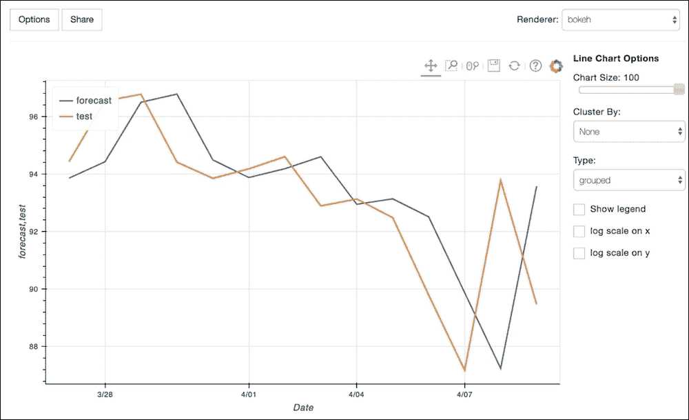

预测值与实际值的图表

我们可以使用 [scikit-learn 包](http://scikit-learn.org)的流行[`mean_squared_error`方法](https://en.wikipedia.org/wiki/Mean_squared_error)来测量错误，其定义如下：

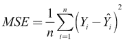

其中是实际值，是预测值。

以下代码定义了`compute_mean_squared_error`方法，该方法接受检验和预测序列，并返回均方误差值：

```py
from sklearn.metrics import mean_squared_error
def compute_mean_squared_error(test_series, forecast_series):
    return mean_squared_error(test_series, forecast_series)

print('Mean Squared Error: {}'.format(
compute_mean_squared_error( test_set['Adj. Close'], results.forecast))
)
```

### 注意

[您可以在此处找到代码文件](https://github.com/DTAIEB/Thoughtful-Data-Science/blob/master/chapter%208/sampleCode30.py)。

结果显示在这里：

```py
Mean Squared Error: 6.336538843075749
```

## StockExplorer PixieApp 第 2 部分–使用 ARIMA 模型添加时间序列预测

在本部分中，我们通过添加菜单来改进`StockExplorer` PixieApp，该菜单使用 ARIMA 模型为选定的股票行情提供时间序列预测。 我们创建一个名为`ForecastArimaSubApp`的新类并更新主要`StockExplorer`类中的`tabs`变量。

```py
[[StockExplorer]]
@route(explore="*")
@templateArgs
def stock_explore_screen(self):
   tabs = [("Explore","StockExploreSubApp"),
           ("Moving Average", "MovingAverageSubApp"),
           ("ACF and PACF", "AutoCorrelationSubApp"),
 ("Forecast with ARIMA", "ForecastArimaSubApp")]
   ...
```

### 注意

[您可以在此处找到代码文件](https://github.com/DTAIEB/Thoughtful-Data-Science/blob/master/chapter%208/sampleCode31.py)。

`ForecastArimaSubApp`子 PixieApp 由两个屏幕组成。 第一个屏幕显示时间序列图表以及 ACF 和 PACF 图表。 该屏幕的目的是为用户提供必要的数据探索，以找出`p`，`d`和`q`的值是什么。 ARIMA 模型的[]顺序，如上一节所述。 通过查看时间序列图，我们可以找出时间序列是否固定（提醒一下，这是构建 ARIMA 模型的必要条件）。 如果没有，用户可以单击**添加差异**按钮，尝试使用对数差异转换来制作 DataFrame 信纸。 然后，使用转换后的 DataFrame 更新这三个图表。

以下代码显示了`ForecastArimaSubApp`子 PixieApp 的默认路由：

```py
from statsmodels.tsa.arima_model import ARIMA

@PixieApp
class ForecastArimaSubApp(BaseSubApp):
    def setup(self):
        self.entity_dataframe = self.parent_pixieapp.get_active_df().copy()
        self.differencing = False

    def set_active_ticker(self, ticker):
 BaseSubApp.set_active_ticker(self, ticker)
        self.setup()

    @route()
 @BaseSubApp.add_ticker_selection_markup([])
    def main_screen(self):
        return """
<div class="page-header text-center">
    <h2>1\. Data Exploration to test for Stationarity
        <button class="btn btn-default"
                pd_script="self.toggle_differencing()" pd_refresh>
            Remove differencingAdd differencing
        </button>
        <button class="btn btn-default"
                pd_options="do_forecast=true">
            Continue to Forecast
        </button>
    </h2>
</div>

<div class="row" style="min-height:300px">
    <div class="col-sm-10" id="chart{{prefix}}" pd_render_onload pd_options="show_chart=Adj. Close">
    </div>
</div>

<div class="row" style="min-height:300px">
    <div class="col-sm-6">
        <div class="page-header text-center">
            <h3>Auto-correlation Function</h3>
        </div>
        <div id="chart_acf{{prefix}}" pd_render_onload pd_options="show_acf=true">
        </div>
    </div>
    <div class="col-sm-6">
        <div class="page-header text-center">
            <h3>Partial Auto-correlation Function</h3>
        </div>
        <div id="chart_pacf{{prefix}}" pd_render_onload pd_options="show_pacf=true">
        </div>
    </div>
</div>
        """
```

### 注意

[您可以在此处找到代码文件](https://github.com/DTAIEB/Thoughtful-Data-Science/blob/master/chapter%208/sampleCode32.py)。

前面的代码遵循我们现在应该熟悉的模式：

*   定义一个`setup`方法，该方法在 PixieApp 启动时一定会被调用。 在此方法中，我们将复制从父 PixieApp 获得的所选 DataFrame。 我们还维护一个名为`self.differencing`的变量，该变量跟踪用户是否单击了**添加差异**按钮。
*   我们创建一个默认的路线，该路线显示由以下组件组成的第一个屏幕：

    *   标头带有两个按钮：`Add differencing`用于使时间序列固定，而`Continue to forecast`显示第二个屏幕，我们将在后面讨论。 应用差分后，`Add differencing`按钮将切换为`Remove differencing`。
    *   一个`<div>`元素，它调用`show_chart`路线以显示时间序列图。
    *   一个`<div>`元素，它调用`show_acf`路由以显示 ACF 图。
    *   调用`show_pacf`路由以显示 PACF 图表的`<div>`元素。

*   我们使用一个空数组`[]`作为`@BaseSubApp.add_ticker_selection_markup`装饰器的参数，以确保当用户选择另一个股票报价器时刷新整个屏幕，并从第一个屏幕重新启动。 我们还需要重置内部变量。 为了实现这一目标，我们对`add_ticker_selection_markup`进行了更改，以在`BaseSubApp`中定义了一种称为`set_active_ticker`的新方法，该方法是父 PixieApp 对`set_active_ticker`的包装方法。 想法是让子类重写此方法，并在需要时注入额外的代码。 我们还更改了 tab 元素的`pd_script`属性，以在用户选择新的代码符号时调用此方法，如以下代码所示：

    ```py
    [[BaseSubApp]]
    def add_ticker_selection_markup(refresh_ids):
            def deco(fn):
                def wrap(self, *args, **kwargs):
                    return """
    <div class="row" style="text-align:center">
        <div class="btn-group btn-group-toggle"
             style="border-bottom:2px solid #eeeeee"
             data-toggle="buttons">
            
            <label class="btn btn-secondary active"
                pd_refresh=\"""" + ",".join(refresh_ids) + """\" pd_script="self.set_active_ticker('{{ticker}}')">
                <input type="radio" checked> 
                    {{ticker}}
            </label>
            
        </div>
    </div>
                    """ + fn(self, *args, **kwargs)
                return wrap
            return deco

     def set_active_ticker(self, ticker):
     self.parent_pixieapp.set_active_ticker(ticker)

    ```

### 注意

[您可以在此处找到代码文件](https://github.com/DTAIEB/Thoughtful-Data-Science/blob/master/chapter%208/sampleCode33.py)。

然后，在`ForecastArimaSubApp`子 PixieApp 中，重写`set_active_tracker`方法，首先调用父级，然后调用`self.setup()`重新初始化内部变量：

```py
[[ForecastArimaSubApp]]
def set_active_ticker(self, ticker):
        BaseSubApp.set_active_ticker(self, ticker)
        self.setup()
```

### 注意

[您可以在此处找到代码文件](https://github.com/DTAIEB/Thoughtful-Data-Science/blob/master/chapter%208/sampleCode34.py)。

第一个预测屏幕的路线实施非常简单。 `Add differencing` / `Remove differencing`按钮具有`pd_script`属性，该属性调用`self.toggle_differencing()`方法和`pd_refresh`属性以更新整个页面。 还定义了三个`<div>`元素，分别调用`show_chart`，`show_acf`和`show_pacf`路由，如以下代码所示：

```py
[[ForecastArimaSubApp]]
@route()
    @BaseSubApp.add_ticker_selection_markup([])
    def main_screen(self):
        return """
<div class="page-header text-center">
  <h2>1\. Data Exploration to test for Stationarity
    <button class="btn btn-default"
            pd_script="self.toggle_differencing()" pd_refresh>
    Remove differencingAdd differencing
    </button>
    <button class="btn btn-default" pd_options="do_forecast=true">
        Continue to Forecast
    </button>
  </h2>
</div>

<div class="row" style="min-height:300px">
  <div class="col-sm-10" id="chart{{prefix}}" pd_render_onload pd_options="show_chart=Adj. Close">
  </div>
</div>

<div class="row" style="min-height:300px">
    <div class="col-sm-6">
        <div class="page-header text-center">
            <h3>Auto-correlation Function</h3>
        </div>
        <div id="chart_acf{{prefix}}" pd_render_onload pd_options="show_acf=true">
        </div>
    </div>
    <div class="col-sm-6">
      <div class="page-header text-center">
         <h3>Partial Auto-correlation Function</h3>
      </div>
      <div id="chart_pacf{{prefix}}" pd_render_onload pd_options="show_pacf=true">
      </div>
    </div>
</div>
        """
```

### 注意

[您可以在此处找到代码文件](https://github.com/DTAIEB/Thoughtful-Data-Science/blob/master/chapter%208/sampleCode35.py)。

`toggle_differencing()`方法使用`self.differencing`变量跟踪当前差异状态，从`parent_pixieapp`复制活动的 DataFrame 或对`self.entity_dataframe`变量应用日志差异转换​​，如图所示 在以下代码中：

```py
def toggle_differencing(self):
   if self.differencing:
       self.entity_dataframe = self.parent_pixieapp.get_active_df().copy()
       self.differencing = False
   else:
       log_df = np.log(self.entity_dataframe['Adj. Close'])
       log_df.index = self.entity_dataframe['Date']
       self.entity_dataframe = pd.DataFrame(log_df - log_df.shift()).reset_index()
       self.entity_dataframe.dropna(inplace=True)
       self.differencing = True
```

### 注意

[您可以在此处找到代码文件](https://github.com/DTAIEB/Thoughtful-Data-Science/blob/master/chapter%208/sampleCode36.py)。

`show_acf`和`show_pacf`路线非常简单。 它们分别调用`smt.graphics.plot_acf`和`smt.graphics.plot_pacf`方法。 他们还使用`@captureOutput`装饰器将图表图像传递到目标小部件：

```py
@route(show_acf='*')
@captureOutput
def show_acf_screen(self):
    smt.graphics.plot_acf(self.entity_dataframe['Adj. Close'], lags=50)

@route(show_pacf='*')
@captureOutput
def show_pacf_screen(self):
    smt.graphics.plot_pacf(self.entity_dataframe['Adj. Close'], lags=50)
```

### 注意

[您可以在此处找到代码文件](https://github.com/DTAIEB/Thoughtful-Data-Science/blob/master/chapter%208/sampleCode37.py)。

以下屏幕快照显示了没有差异的预测子项 PixieApp 的数据浏览页面：


第一预测屏幕，不应用差异

正如预期的那样，这些图表与不稳定的时间序列一致。 当用户单击**添加差异**按钮时，将显示以下屏幕：


应用差异的第一个预测屏幕

下一步是实现由**继续预测**按钮调用的`do_forecast`路由。 这条路线负责建立 ARIMA 模型； 首先显示一个配置页面，其中包含三个输入文本，这些文本可让用户输入`p`，`d`和`q`订单，通过查看 数据浏览屏幕中的图表。 我们添加一个`Go`按钮以使用`build_arima_model`路线进行模型构建，我们将在本节稍后讨论。 标头上还有一个`Diagnose Model`按钮，该按钮调用另一个负责评估模型准确性的页面。

此处显示了`do_forecast`路由的实现。 请注意，当用户选择其他股票行情自动收录器时，我们将`add_ticker_selection_markup`与空数组一起使用以刷新整个页面：

```py
[[ForecastArimaSubApp]] 
@route(do_forecast="true")
 @BaseSubApp.add_ticker_selection_markup([])
    def do_forecast_screen(self):
        return """
<div class="page-header text-center">
    <h2>2\. Build Arima model
        <button class="btn btn-default"
                pd_options="do_diagnose=true">
            Diagnose Model
        </button>
    </h2>
</div>
<div class="row" id="forecast{{prefix}}">
    <div style="font-weight:bold">Enter the p,d,q order for the ARIMA model you want to build</div>

    <div class="form-group" style="margin-left: 20px">
        <label class="control-label">Enter the p order for the AR model:</label>
        <input type="text" class="form-control"
               id="p_order{{prefix}}"
               value="1" style="width: 100px;margin-left:10px">

        <label class="control-label">Enter the d order for the Integrated step:</label>
        <input type="text" class="form-control"
               id="d_order{{prefix}}" value="1"
               style="width: 100px;margin-left:10px">

        <label class="control-label">Enter the q order for the MA model:</label>
        <input type="text" class="form-control" 
               id="q_order{{prefix}}" value="1"
               style="width: 100px;margin-left:10px">
    </div>

    <center>
        <button class="btn btn-default"
               pd_target="forecast{{prefix}}"
            pd_options="p_order=$val(p_order{{prefix}});d_order=$val(p_order{{prefix}});q_order=$val(p_order{{prefix}})">
        Go
        </button>
    </center>
</div>
"""
```

### 注意

[您可以在此处找到代码文件](https://github.com/DTAIEB/Thoughtful-Data-Science/blob/master/chapter%208/sampleCode38.py)。

以下屏幕快照显示了**构建 ARIMA 模型**页面的配置页面：

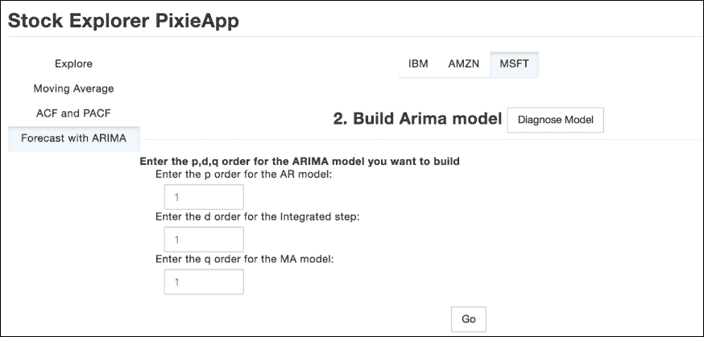

Build Arima 模型页面的配置页面

**转到**按钮具有`pd_options`属性，该属性调用具有三个状态的路由：`p_order`，`d_order`和`q_order`，其值取自与每个属性相关的三个输入框。

以下代码显示了构建 ARIMA 模型的路线。 首先将活动的 DataFrame 分成训练和测试集，并保留 14 个测试集的观察值。 然后，它构建模型并计算残留误差。 成功建立模型后，我们将返回一个 HTML 标记，其中包含图表，该图表显示了训练集的预测值与训练集中的实际值。 这是通过调用`plot_predict`路由来完成的。 最后，我们还通过创建带有`pd_entity`属性的`<div>`元素和指向带有`<pd_options>`子元素的残差变量的`<div>`元素，该子元素配置了所有统计信息的表格视图，从而显示了模型剩余误差的统计信息

显示预测与实际训练集的图表使用的是`plot_predict`路线，该路线调用了我们先前在笔记本电脑中创建的`plot_predict`方法。 我们还使用`@captureOutput`装饰器将图表图像发送到正确的小部件。

`plot_predict`路由的实现如下所示：

```py
    @route(plot_predict="true")
    @captureOutput
    def plot_predict(self):
        plot_predict(self.arima_model, self.train_set['Date'], 100)

```

### 注意

[您可以在此处找到代码文件](https://github.com/DTAIEB/Thoughtful-Data-Science/blob/master/chapter%208/sampleCode39.py)。

`build_arima_model`路由实现如下所示：

```py
@route(p_order="*",d_order="*",q_order="*")
def build_arima_model_screen(self, p_order, d_order, q_order):
    #Build the arima model
    self.train_set = self.parent_pixieapp.get_active_df()[:-14]
    self.test_set = self.parent_pixieapp.get_active_df()[-14:]
    self.arima_model = ARIMA(
        self.train_set['Adj. Close'], dates=self.train_set['Date'],
        order=(int(p_order),int(d_order),int(q_order))
    ).fit(disp=0)
    self.residuals = self.arima_model.resid.describe().to_frame().reset_index()
    return """
<div class="page-header text-center">
    <h3>ARIMA Model succesfully created</h3>
<div>
<div class="row">
    <div class="col-sm-10 col-sm-offset-3">
        <div pd_render_onload pd_options="plot_predict=true">
        </div>
        <h3>Predicted values against the train set</h3>
    </div>
</div>
<div class="row">
    <div pd_render_onload pd_entity="residuals">
        <pd_options>
 {
 "handlerId": "tableView",
 "table_noschema": "true",
 "table_nosearch": "true",
 "table_nocount": "true"
 }
 </pd_options>
    </div>
    <h3><center>Residual errors statistics</center></h3>
<div>
        """
```

### 注意

[您可以在此处找到代码文件](https://github.com/DTAIEB/Thoughtful-Data-Science/blob/master/chapter%208/sampleCode40.py)。

以下屏幕截图显示了 **Build Arima 模型**页面的结果：


模型制作页面

预测子应用程序的最终屏幕是`do_diagnose`路由调用的*诊断模型*屏幕。 在此屏幕中，我们仅显示由和`test_set`变量在笔记本中创建的`compute_test_set_predictions`方法返回的数据帧的折线图。 该图表的`<div>`元素使用`pd_entity`属性，该属性调用称为`compute_test_set_predictions`的中间类方法。 它还具有`<pd_options>`子元素，带有`display()`选项，用于显示折线图。

以下代码显示了`do_diagnose_screen`路由的实现：

```py
    def compute_test_set_predictions(self):
        return compute_test_set_predictions(self.train_set, self.test_set)

    @route(do_diagnose="true")
    @BaseSubApp.add_ticker_selection_markup([])
    def do_diagnose_screen(self):
        return """
<div class="page-header text-center"><h2>3\. Diagnose the model against the test set</h2></div>
<div class="row">
    <div class="col-sm-10 center" pd_render_onload pd_entity="compute_test_set_predictions()">
        <pd_options>
 {
 "keyFields": "Date",
 "valueFields": "forecast,test",
 "handlerId": "lineChart",
 "rendererId": "bokeh",
 "noChartCache": "true" 
 }
        </pd_options>
    </div>
</div>
"""
```

### 注意

[您可以在此处找到代码文件](https://github.com/DTAIEB/Thoughtful-Data-Science/blob/master/chapter%208/sampleCode41.py)。

以下屏幕截图显示了诊断页面的结果：

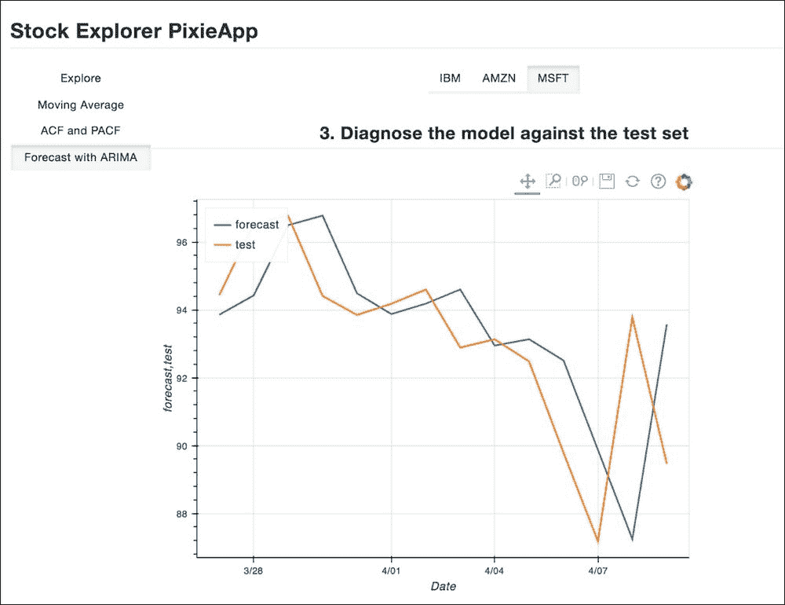

模型诊断画面

在本节中，我们展示了如何改进`StockExplorer`样本 PixieApp，以包括使用 ARIMA 模型预测功能。 顺便说一句，我们已经演示了如何使用 PixieApp 编程模型创建一个三步向导，该向导首先执行一些数据探索，然后配置模型的参数并构建它，最后根据测试集对模型进行诊断。

### 注意

[笔记本的完整实现可以在这里找到](https://github.com/DTAIEB/Thoughtful-Data-Science/blob/master/chapter%208/StockExplorer%20-%20Part%202.ipynb)。

# 摘要

在本章中，我们谈到了时间序列分析和预测的主题。 当然，我们只是从头开始，当然还有很多需要探索的地方。 通过非常积极的研究，它也是该行业的一个非常重要的领域，尤其是在金融领域。 例如，我们看到越来越多的数据科学家试图基于[递归神经网络](https://en.wikipedia.org/wiki/Recurrent_neural_network)算法建立时间序列预测模型，并取得了巨大的成功。 我们还演示了 Jupyter Notebook 与 PixieDust 和`pandas`，`numpy`和`statsmodels,`之类的库生态系统相结合如何帮助加速分析的开发以及将其投入生产线可使用的应用程序 业务用户。

在下一章中，我们将研究另一个重要的数据科学用例：图形。 我们将构建一个与飞行旅行相关的示例应用程序，并讨论如何以及何时应用图算法来解决数据问题。