# 1.4 可数集（消遣）

> 原文： [http://math.mit.edu/~djk/calculus_beginners/chapter01/section04.html](http://math.mit.edu/~djk/calculus_beginners/chapter01/section04.html)

**如果你可以列出其成员名单**，那么据说这是一个可数。通过**列表，我们的意思是你可以找到第一个成员，第二个成员，等等，并最终为每个成员分配一个自己的整数**，也许永远存在。

**自然数本身是可数的 - 您可以将每个整数分配给自身。** 整数的集合是可数的 - 使列表中的奇数项为正整数，其余为偶数项，偶数和奇数项从最小幅度向上排序。以下是这个特定数字序列的开始：

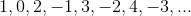

（如果一个集是可数的，你可以用很多方式列出它。）

**正的有理数，也是可数的**，这就是为什么。首先取所有分子和分母总和为，然后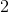然后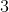，等等。当有几个这样做时，按尺寸排序。以下是此列表的开始方式。 \（\ frac {0} {1}，\ frac {1} {1}，\ frac {1} {2}，\ frac {2} {1}，\ frac {1} {3}，\ frac { 2} {2}，\ frac {3} {1}，\ frac {1} {4}，\ frac {2} {3}，\ frac {3} {2}，\ frac {4} {1} \）， 等等。每个正有理数都出现在这个列表的某个地方，实际上经常出现在它上面。 （这是因为显示为以及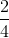和等等。）但所有分数最终都会出现，并且反复出现。

**正有理数和负有理数的数量也是可数的，**我们可以通过从上面对每个单独的列表中单独列出整数来列出所有数据。

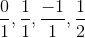

有理数由整数对描述，上面的参数概括为暗示可数集的任何成员对的任何集合都是可数的。这可以推广到可数集的可数集合是可数的声明。

**接着是代数数**，它们都是具有整数系数的有限度多项式方程的解是可数的。有一定数量的有限度数，每个度数的可计数系数系数和每个方程的可数数量的解，因此可数集的可数集的可数集的代数数仍然是可数的。

**另一方面，所有小数扩展的集合都是不可数的。**

**怎么样？**

好吧，如果我们有一个所有小数扩展的列表，我们可以轻松地构建一个不能在其上的数字。只是**使其条目超出小数点，与列表**中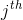的数字位置的条目不同。然后，我们创建的数字与列表中的每个数字不同，因此不能在其上。所有这些意味着我们无法列出所有实数或小数扩展！

你和我都不能真正做出构造这样一个数字所必需的无限数量的行为，但我们可以想象它已经完成了。

想象一下，想象一下你名单上的前三个数字是

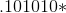

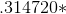

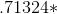

给定结构不在列表中的数字将由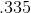开始，因为该序列首先与的第一个数字不同，第二个地方的第二个数字与不同，第二个数字与第三个数字不同成员由 2 位排在第 3 位。我们最终得到的数字肯定会与上面的三个数字不同。其余的数字类似地参考列表中的下一个数字来确定，我们可以推断出这个数字不能在列表中的任何地方，只要其数字的数量与列表的长度相同。

这意味着无法列出所有小数扩展的集合。小数扩展是不可数的。

**小数扩展是否与实数相同？**

实际上，0 到 1 之间的每个实数都有一个十进制扩展，但有些，即以所有结尾的有理数，出现两倍的十进制扩展。原因是与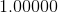真的相同。由于这些是有理数的一个子集，因此这种差异并不特别重要。

**练习：从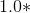中减去。你得到了什么**？如果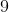在某个地方停了下来，你可以在下一个地方减去并获得而在其他地方减去。但是当从未停止时会发生什么？