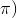

# 2.1 什么是电子表格？

> 原文： [http://math.mit.edu/~djk/calculus_beginners/chapter02/section01.html](http://math.mit.edu/~djk/calculus_beginners/chapter02/section01.html)

它是一个矩形排列的盒子，看起来像一个巨大的空填字游戏。

为什么要打扰一个？

你会发现你可以用很少的努力与他们做出惊人的事情。我们会做一些插图。你应该自己尝试一下。完成后，您将对电子表格有足够的了解，以便有效地使用它们来解决问题并检查工作。您可以在图形计算器上执行任何操作，但您可以随时查看所有结果和中间步骤并更正任何内容。

你是怎么做的？

你在盒子里输入东西。您可以将鼠标左键单击任何框，然后输入您的条目。 （在移动设备上有类似的方法。）顺便说一句，每个方框都有一个由列字母给出的名称（列从 A 到 Z，然后是 AA 到 AZ，然后是 BA 到 BZ 等;以及行号行数从 1 到数千。）

你能进入什么？

1.  **普通散文（或诗歌）：这样做只需输入。**

2.  **数字：输入。**

3.  **你听过的任何函数以及更多其他函数的内容：**

例如，在 B2 中键入= sin（A2）会将数字的正弦值放入 A2（以弧度表示）到框 B2 中。

您必须首先键入等号，然后输入您知道其名称的任何函数，或者可以从电子表格给出的函数列表中选择。在我的电子表格中，您可以点击页面顶部的“公式”，然后查看并选择所需的公式。有很多列出的内容，如果你试着查看列表，你可能会头晕，但你会恢复。

当然，您也可以使用括号和许多函数来使用许多不同的函数来创建自己的复杂公式。例如= sqrt（sin（A2）* exp（A3）/（1 + atan（A5））将给出 A2 中的正弦和（e 对 A3 中的幂）的乘积的平方根全部除以（1 加上其切线在 A5 中的角度，以和之间的弧度表示。

好的，但你可以在计算器上完成所有这些。

最好的函数来自于复制其他地方的一个框（或矩形框）中发生的事情。

**当您在方框 B2 中的内容指的是其他一些方框时，例如 A2，当您将 B2 复制到其他位置时，引用框会随之移动。** 因此，如果在 B2 中你有 put = sin（A2），你将 B2 复制到说，D2。

那么 D2 将包含= sin（C2）。将 B2 复制到 R7 会将= sin（Q7）放在那里。如果我正确地记住了我的字母，B 就在 A 之后，D 在 C 之后，R 在 J 之后。

好的，我该如何复制？

**单击要复制的框，同时按 Ctrl 和 c，输入将进入“剪贴板”。然后，您可以将光标移动到要复制的位置，然后同时按 Ctrl 和 v。** 试试看吧。 （顺便说一下，如果你做了一些你不想做的事情，那么**同时按下 Ctrl 和 z 会撤消它**。）

假设我在复制内容时不希望引用发生变化？

**你所要做的就是在你不想改变的索引（字母或数字或两者）前放一个美元符号（一个$）。** 因此，= sin（$ A2）不会改变将保留 A 的列索引。类似地= sin（A $ 2）任何地方都会将引用保留在第二行，并且将美元符号放在两者之前将保持参考框 A2 无论你在哪里复制它。

更好的是，您可以复制整个矩形，或在矩形中的任何位置复制单个框。

怎么样？

假设您要将框 B2 的内容复制到角 C5 和 E100 的矩形中。

**首先点击方框 B2，然后同时按下 Ctrl 和 c。**

下一步是选择目标块的框。 **为此，您将光标移动到 C5 左键单击，并在将光标移动到 E100 时按住 Shift 键。然后左键单击。** 矩形中的块应显示它们已被“选中”。最后你按 Ctrl 和 v。这应该这样做。

尝试这样做几次。

有没有更简单的方法来复制？

**是的。您可以向下或向右复制材料（并使用您可以向左或向上复制的菜单。）**

**要执行此操作，请选择要复制的材料（一行中的所有内容）以及要将其复制到下面的位置。** （如上所述选择。）**然后同时按下 Ctrl 和 d。 （您可以按住 Ctrl 键并在按下时按 d 键。）**

**要复制到右侧，您可以在一列中正确选择，然后同样按 Ctrl 和 r。**

要向上或向左移动，主菜单右上角附近有一个图标，可以选择您想要复制的方向。

今天的电子表格允许你做很多令他们害怕的事情。旧的 Excel（2007）有 7 列菜单页面，每个菜单页面允许在大约 20 个菜单中进行选择，您可以通过下拉菜单选择许多选项，但如果您知道如何输入函数并复制，则可以忽略它们。好吧，如果你想保存你在文件中所做的事情，你可以按 Ctrl 和 s 一起。然后，您必须说明要保存到的文件。

好的我能用这些东西做什么？

刚才讨论的复制属性允许快速生成函数的函数，导数，总和和积分，无论这些词是什么意思。