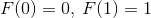
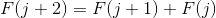
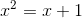
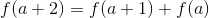
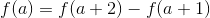
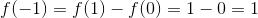
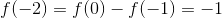
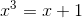

# 2.2 斐波纳契数

> 原文： [http://math.mit.edu/~djk/calculus_beginners/chapter02/section02.html](http://math.mit.edu/~djk/calculus_beginners/chapter02/section02.html)

举个例子，让我们看一下斐波那契数字。他们在中世纪时首先由斐波那契研究。它们由以下条件定义：

****

对于所有整数参数，我们有

****

用语言来说，每个 Fibonacci 数是前两个的总和。

这些数字有很多有趣的属性，我们将看看其中两个。

首先在方框 A1 中输入 Fibonacci 数字。 （如果你想稍后看看你现在正在做什么，有标签有帮助。）

添加以下标签：A9 中的 n，B9 中的 F（n），C9 中的黄金比例，D19 中的部分和，以及 E9 中的 F（-n）。

然后在 A10 中输入，在 A11 中输入= A10 + 1。

现在将此列 A 列复制到 A60。

你看到了什么？不多;你看到从到的整数。

好。现在在 B10 中输入，在 B11 中输入。然后在 B12 中输入= B10 + B11。

将 B12 向下复制到 B60。

您将在该列中看到 Fibonacci 数字，从参数到。

接下来让我们看一下斐波纳契数与其前辈的比率。

通过在 C12 中输入 **= B12 / B11** 并将其复制到 C60 来执行此操作。

你看到了什么？

让我们弄清楚你看到的数字是多少。假设 B41 中的内容是倍于 B40 中的内容，并且 B42 中的内容类似地大约是乘以 B41 中的大约 B40。

这意味着 B（40）= B（42）= F（42）= F（41）+ F（40）= xB（40）+ B（40）。除以 B（40），我们得到二次方程。因此，我们得到的比率是这个等式的解。你所看到的这个等式的更大解决方案被称为“黄金比率”。

现在尝试以下操作：在 D10 输入，在 D11 输入 **= B11 + D10** 。将列 D 向下复制到 D60。

您在 D 列中得到的是斐波那契数字与索引（在 A 列中）之间的总和。你对这笔钱怎么说？将 B 列中的条目与 D 列中的条目进行比较，并描述它们之间的关系。另请注意，D11 中的条目， **= B11 + D10** ，如此处所示复制到 D 列，产生 B 列中条目的部分和。这意味着 D50 中的条目，例如是总和第一个斐波纳契数。

这是你可以做的其他事情。 Fibonacci 数的定义属性是

。我们也可以把它写成。这允许我们用负参数定义斐波纳契数。因此，等。

因此将放入 E10，将放入 E11，然后输入 **= E10-E11。** 然后将 E12 从 E 列复制到 E60。

**E 栏中的条目将是负的 Fibonacci 数字，其中 A 列中有参数。**

关于负面论证斐波纳契数，你能说些什么？

顺便说一句，具有正参数的斐波那契数字计算网格中相同多米诺骨牌插入的不同方式的数量，因此每个多米诺骨牌覆盖两个相邻的盒子，并且没有盒子被覆盖两次。

&lt;button aria-controls="fibonacci-spreadsheet" aria-expanded="false" class="btn bg-light border-secondary" data-target="#fibonacci-spreadsheet" data-toggle="collapse" id="toggle-spreadsheet-table" type="button"&gt;显示表&lt;/button&gt;

Number of steps<button aria-expanded="false" aria-haspopup="true" class="btn btn-sm bg-light border-secondary dropdown-toggle" data-toggle="dropdown" id="nbr-steps-btn" type="button" value="10">10</button>[10](#) [25](#) [50](#)Number of digits after decimal point<button aria-expanded="false" aria-haspopup="true" class="btn btn-sm bg-light border-secondary dropdown-toggle" data-toggle="dropdown" id="nbr-digits-btn" type="button" value="10">10</button>[5](#) [10](#) [15](#)

**练习：**

**2.1 在您自己的机器上设置这一切。**

**2.2 证明 Fibonacci 数字计算网格将多米诺骨牌插入的不同方式的数量，以便每个多米诺骨牌覆盖两个相邻的方框。** 

**2.3 定义一个序列的收敛性，该序列反映斐波纳契数与其前辈的比率属性，你在[C]栏中看到**

**2.4 该程序产生上述二次方程的解。给定任何具有整数系数的二次方，我们可以产生如上所述的递归，并将其替换为 B4 并将其复制下来，看看它发生了什么。尝试用一些样方法来做这个，并找到另一个我们得到像斐波那契数字那样的解决方案，而另一个我们没有。立方会发生什么？**