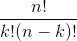

# 2.3 帕斯卡的三角形

> 原文： [http://math.mit.edu/~djk/calculus_beginners/chapter02/section03.html](http://math.mit.edu/~djk/calculus_beginners/chapter02/section03.html)

这次我们将整数放在左边，就像我们之前做的那样，但也是沿着顶部

因此，我们将 A3 设置为，将 A4 设置为= A3 + 1，将 A4 设置为 A13。我们将 C1 设置为，将 D1 设置为= C1 + 1，将 D1 设置为右侧的 M1。

现在，我们将 C3 设置为= B2 + C2。复制 C2（使用 Ctrl c）。从 C3 到 M13 中选择矩形。粘贴在矩形中（使用 Ctrl v）。 （顺便说一句，左上角附近有用于复制和粘贴的图标，您可以使用而不是使用 Ctrl c 或 Ctrl v。）

你看到了什么？你应该看到所有了。

现在将 C3 设置为。您现在应该看到在所选区域中以为边界的倾斜 Pascal 三角形。

任何所选框的内容是二项式系数或，其中是框中 A 列中的数字，是第一行中的数字。

&lt;button aria-controls="pascals-triangle-spreadsheet" aria-expanded="false" class="btn bg-light border-secondary" data-target="#pascals-triangle-spreadsheet" data-toggle="collapse" id="toggle-spreadsheet-table" type="button"&gt;显示表&lt;/button&gt;

接下来我们将看到如何使用电子表格来计算区域。