# 2.4 与电子表格集成

> 原文： [http://math.mit.edu/~djk/calculus_beginners/chapter02/section04.html](http://math.mit.edu/~djk/calculus_beginners/chapter02/section04.html)

**我们尚未定义函数，因此本节比我们先行一步。如果你在这里遇到困扰你的事情，请停下来，继续下一章，稍后再回到这里。如果您在下面看到的内容有意义，那就继续吧。**

**积分具有几何意义。给定正函数，和之间的的定积分表示函数与 x 轴的曲线图之间的区域，来自的固定起始值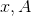，与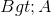的另一个值。**

如果函数是常数，那个区域只是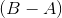（间隔的长度）和的常数值的乘积，因为我们计算的数字是一个矩形，边是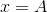和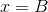，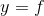顶部，底部。

**否则，我们可以将到的间隔划分为长度为的条子，并通过每个条子中的面积之和计算面积。 （当函数为负时，我们将 x 轴下面的区域计为负值，当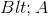正变为负时，反之亦然。）我们将选择所有长度的条子，并近似每条条子的面积。**

这里有一个有趣的问题：**你做了什么来近似条子的区域？**

**条子有宽度，我们选择了一个近似高度，所以这个问题应该成为我们应该分配到和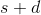之间区域的高度？**

有三种非常简单的方法可以做到这一点。一种方法是使用，另一种方法是使用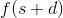，另一种方法是使用它们的平均值。

这些估算方式有名字！它们是**左手规则，右手规则和梯形规则。** 每个条子对面积的贡献将是这个估计乘以。

令人高兴的是，你在这个问题的答案中唯一的区别来自贡献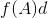和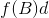。无论使用哪种“规则”，所有其他中间点贡献相同的量。

发生这种情况是因为一条棉条的末端是下一条棉线的开始，无论使用哪种方法，从点到总和的贡献都是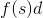。如果你在间隔的左侧使用的值，那么从开始的间隔得到;如果你使用的右侧值，你会从结束的区间得到同样的东西;如果你使用他们的平均值，你可以从任一间隔获得一半。

这意味着唯一的区别来自第一个和最后一个区间。使用“左规则”，你得到而不是反之为“正确规则”，而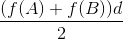来自平均值或“梯形规则”。换句话说，在梯形规则中，每个内部条子除了最终的条子外都会得到，而在端点和只有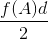和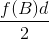。梯形规则证明是三者中最好的。

因此，我们将使用估算 A 和 B **（包括**之间的值 s）的总和，并从总数中减去，这将给出梯形规则提供的答案。稍后我们将看到这比其他任何一个好得多，因为它的误差与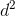成正比，而其他的每个都与实际面积的线性项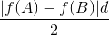不同。

计算列中连续框内容的总和是您在 D 列中使用 Fibonacci 数进行的。要在 C 列中输入 B 列中从 5 开始的总和，请输入= B5 + C4 到 C5 并将其复制到该列。

这将计算 C 列区域的左手规则估计。通过在 D5 中放置= C5-（B $ 5 + B5）/ 2，我们将左手规则转换为梯形规则，该规则将在每个中间点显示为什么在列 D 中。-B $ 5/2 消除了的一半贡献，另一个减法消除了另一端的贡献。

我们首先在 B2 中选择 d;将，的起始值设为 B3。

我们这样做，所以我们可以在需要时轻松更改这些内容。

A 列将包含 A 的值。

条目 Bk 将包含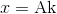的函数值。

作为说明，我们将估计函数的积分。

您可以通过在 A5 中输入= B3 从第五行开始设置。然后将 A6 设置为= A5 + B $ 2，并将 A6 复制到 A 列。这将是您的变量的值。

在 B5 put = B $ 2 * sin（A5）并将其复制到 B 列。

在 C5 中输入= B5 + C4 并将其复制到 C 列下方。

在 D5 put = C5-（B $ 5 + B5）/ 2 并复制 D 列。

**如果你这样做，你可以通过在 B2 中插入不同的值来改变 d。您可以通过在 B3 中输入新的起点来更改起点。您可以通过用新 f（A5）替换 sin（A5）并在 B 列中复制= B $ 2 * f（A5）来更改要集成的函数。**

使用左手规则从 A5 开始并在 x = A5 + kd 结束的区域的估计将出现在行 C 的行 C 中，其值为 **B5 +（k-1）d** 。 （此框将包含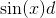形式的条款的总和。）

D 列中的条目将左手规则转换为 Trapezoid 规则。因此，在具有 A 值 B4 + kd 的行中出现的将是 x 轴，正弦曲线和线 x = B4 和 x = B4 + kd 之间的区域的梯形规则估计。

这是对该地区的估计;我们可以做得更好，以后会。

这是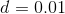和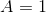电子表格的样子。

&lt;button aria-controls="integral-trapezoid-spreadsheet" aria-expanded="false" class="btn bg-light border-secondary" data-target="#integral-trapezoid-spreadsheet" data-toggle="collapse" id="toggle-spreadsheet-table" type="button"&gt;显示表&lt;/button&gt;

Number of increments<button aria-expanded="false" aria-haspopup="true" class="btn btn-sm bg-light border-secondary dropdown-toggle" data-toggle="dropdown" id="nbr-inc-btn" type="button" value="25">25</button>[5](#) [10](#) [25](#) [50](#) [100](#)Number of digits after decimal point<button aria-expanded="false" aria-haspopup="true" class="btn btn-sm bg-light border-secondary dropdown-toggle" data-toggle="dropdown" id="nbr-digits-btn" type="button" value="10">10</button>[5](#) [10](#) [15](#)

现在从 A5 到 B105 选择 A 列和 B 列，然后插入 xy 散点图。你看到了什么？

**我们怎样才能做得更好？**

如果添加一个类似于 C 的列 E，除了跳过，那么在 E5 中放置= 2 * B5 + E3 并向下复制，并通过输入 F5 = E5-将其更正为 F 列中的梯形规则（ B $ 5 + B5）并向下复制，最后在列 G 中放置=（4 * D5-F5）/ 3，您将在 G 列的奇数条目中得到 Simpson 对所讨论区域的规则估计（如行 ]，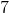，等）偶数条目将是无用的垃圾。

**这是什么恶魔？**

E 和 F 中的奇数条目重复先前的计算，替换为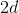。梯形规则中的误差表现为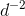;如果你将 **乘以计算并减去一个**，那个行为为的错误将被抵消。结果大致是乘以实际结果。因此**将 4D5-F5 除以 3** 给出了误差实际上为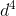的区域的规则。它被称为**辛普森的规则**。

这将在[第 14 章](../chapter14/contents.html)中详细讨论。