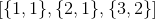
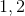
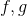
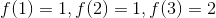
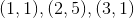
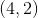
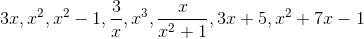
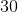
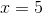
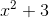

# 3.1 什么是函数？

> 原文： [http://math.mit.edu/~djk/calculus_beginners/chapter03/section01.html](http://math.mit.edu/~djk/calculus_beginners/chapter03/section01.html)

函数是我们用来描述我们想要在数学上讨论的事情的东西。但是，我发现，当我尝试定义它们时，我会有点舌头。

最简单的定义是：**一个函数是一堆有序的事物（在我们的例子中，事物将是数字，但它们可以是其他的），具有这样的属性：对的第一个成员都不同于一个另一个。**

因此，这是一个函数的例子：

该函数由三对组成，其第一个成员是和。
习惯上给出函数名称，如或，如果我们称这个函数，我们通常使用以下符号来描述它：

这对中的第一个成员称为**参数**，它们的整个集合称为函数的**域**。因此的论点是和，由这三个数字组成的集合是它的域。

对的第二个成员称为函数的**值**，这些集合称为函数的**范围**。

描述此函数 f 的标准术语是：

参数的值为，参数的值为，参数的值为，我们写为。

我们通常认为函数是一组值的赋值（我们对的第二个成员）到参数（它们的第一个成员）。

对的第一个成员都不同的条件是域中的每个参数在任何函数的范围内被赋予**唯一**值的条件。

**练习 3.1 考虑由和对定义的函数。它的域名是什么？参数中的价值是多少？什么是？**

如果您将温度计放在嘴里，可以在某个特定时间测量温度。您可以定义一个函数或温度，它将您测量的温度指定为从口中取出温度计的时间。这是一个典型的函数。它的论点是测量时间，其值是温度。

当然，即使你没有测量它，你的嘴也有温度，并且它在每个时刻都有一个，并且有无数个这样的瞬间。

这意味着如果你想描述一个函数，它的值在任何时候都是你当时口中的温度，你就不能真正列出它的所有对。有无数可能的参数，你需要永远列出它们。

相反，**我们使用技巧来描述函数：**我们通常提供一个规则，允许读者在的域中选择你喜欢的任何参数，并且，通过使用规则，计算函数在该参数的值。该规则通常被称为函数的**公式**。符号通常用于表示您将选择的参数，公式告诉您如何计算该参数的函数。

所有的最简单的函数，有时称为**身份函数，**是指定参数本身的值。如果我们将此函数表示为，则它遵循

对于我们选择的任何领域。换句话说，无论您选择哪个成员，它们的成员都是相同的。

我们可以通过提供更复杂的规则来获得更复杂的函数（这些规则通常被称为公式，正如我们已经注意到的那样）。因此，我们可以通过在无限可能性中给出以下任何公式来定义函数：

这些分别代表乘，平方，平方减去，除以，立方，除以总和和的平方，依此类推。

我们可以通过**构造函数，通过加法，减法，乘法和除法的运算，以我们认为适合的任何方式应用和数字的副本。**

我们以这种方式构造的函数有两个非常好的特性，第一个适用于所有函数。

我们可以在一张方格纸上，或在电子表格，图表或图形计算器上绘制一个函数的图片，称为**图，**。我们可以通过获取函数的参数 - 值对并通过平面中的点描述每个，_，参数给出的坐标和由其对的值给出的 y 坐标。_

当然，绘制具有无限域的函数的所有对是不可能的，但是我们可以通过在我们感兴趣的任何间隔中取得大约 100 个均匀间隔的点来很好地了解其图形的样子。这听起来像是一件不可思议的单调乏味的事情，而且过去常常如此，但现在却不是这样。在电子表格中，主要工作是输入函数**一次**（其参数由其他位置的地址给出）。这就是你需要做的一些复制，通过练习可以在秒内完成各种各样的函数。

第二个不错的函数是**我们可以在电子表格**上非常容易地输入通过对某个地址**的内容进行加，减，乘，除和执行其他操作而形成的任何函数**或图形计算器。不仅如此，这些设备还具有其他一些我们可以使用的内置函数。

这两个事实意味着我们实际上可以看到通过添加减去身份函数和其他内置函数的复制或分割副本以及我们想要的任何数字而形成的任何函数，并查看它们的行为方式，非常有限努力。

我们很快就会看到，我们可以使用与图形函数相同的程序来绘制它们的导数（我们还没有定义它们），但这已经超越了故事。你应该意识到，我们只需要少量努力就可以用数字计算大多数函数的导数。

**练习 3.2 的函数的值是多少？争论？**

**你能举个例子吗？**