# 3.2 线性函数

> 原文： [http://math.mit.edu/~djk/calculus_beginners/chapter03/section02.html](http://math.mit.edu/~djk/calculus_beginners/chapter03/section02.html)

基本的基本函数，即微积分所基于的函数，是**线性函数。** 线性函数是一个函数，其图形由整个域中的一条直线段组成。

你可能还记得，这条线是由任何两点决定的，比如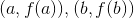。因此，您可以在其域中选择任何和任何，并从两个值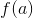和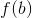中确定该行。

**这种函数的公式是什么？**

我们可以通过以下公式确定在和处取值的线性函数：

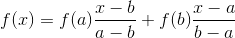

当为时，第一项是，当是时，第一项是，而当是并且是时，第二项是当是时。因此，当为时，两者的总和为，而为时为。它是一个线性函数。 **线性函数的项乘以某个常数，也可以有一个常数项。**

通过将 x 项放在一起，可以获得更方便和暗示的函数形式：

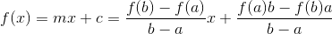

此处出现的数字 **** 称为该线的**斜率**。请注意，由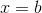和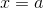之间的变化与这两个参数之间的变化之比给出：

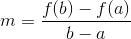

如果被绘制，与轴相交的地方就是我们所说的。它被称为该系的 **y-截距**，当为 时，**的值为。**

这里有一个 mathlet，它允许你改变斜率和 y-截距 c，看看它对一条线做了什么。你应该掌握这个数学小手册，然后从中了解斜率告诉你的关于这条线的信息。使用它，您可以构建自己的示例。

&lt;iframe frameborder="0" height="620" src="../mathlets/slope-of-line.html" width="100%"&gt;&lt;/iframe&gt;

您实际上可以构建一个可以与此 applet 执行相同操作的电子表格。你这样做是明智的。有关如何通过 [**点击此处确切了解的方向。**](complement01.html)

**我知道这些东西。你为什么要浪费我的时间** **？**

所有这些对你来说听起来都很简单，但是如果你理解了这一点，那么你就可以很好地理解微积分了。认识到微积分包括通过研究它们在任何给定参数附近的直线的斜率来研究函数。这里有一些练习可以帮助你适应这些事情。

**练习：**

**3.3 使用小程序进行游戏，直到您感觉到一条线的斜率的几何意义。然后拿一张纸，在上面画上 x 和 y 轴并在上面放上刻度，让朋友在纸上画一些直线。没有测量，猜测线的斜率。现在测量线条（y 改变的变化），看看你的猜测有多好。**

**3.4 线的斜率何为负？什么时候？什么时候？什么时候？如果你对和使用相同的比例，那么斜率 10 是什么样的？坡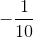怎么样？**

**3.5 按照上面的说明构建一个可以作为 applet 使用的电子表格。尝试使用上一个问题的各种斜率。**

**3.6 构造线性函数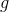，斜率 2 满足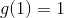;图吧。什么是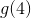？对于满足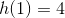，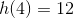的线性函数也一样。 的斜率是多少？**