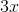
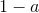
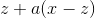
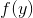
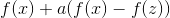

# 3.3 线性

> 原文： [http://math.mit.edu/~djk/calculus_beginners/chapter03/section03.html](http://math.mit.edu/~djk/calculus_beginners/chapter03/section03.html)

线性函数，我们已经看到一个函数，其图形位于一条直线上，可以通过给出该线的斜率和 y 截距来描述。

有一种特殊的线性函数，它具有通常有用的美妙而重要的特性。这些是**线性函数，其截距是** （例如或的函数）。这意味着它们的图形正好穿过原点（坐标为的点）。这些函数称为**齐次线性函数。** 他们的属性是 _ 他们在两个参数的任意组合中的值与这些参数的值相同。_ 在符号中，这句话是：

**普通线性函数有没有这样的属性？**

他们有点做。 **当为时，任何线性函数都具有相同的属性。** 因此对于任何线性函数我们都有

****

但要注意，不均匀的**线性函数不遵守上面几行所述的一般线性特性。**

**这些条件中的任何一个都允许您在和处计算任何的值。如果是那么是。**

这些属性意味着一旦您知道两个参数的线性函数的值，您就可以轻松地在其定义的任何位置找到它的值。

这里描述的属性通常被称为线性属性。这并不是一种明智的方式来描述它，因为具有截距而非的完美良好的线性函数不服从该属性的更一般版本（上面的第一个）。

无论如何，要意识到非线性函数 **DO** 具有这些属性中的任何一个。