# 4.1 更复杂的函数

> 原文： [http://math.mit.edu/~djk/calculus_beginners/chapter04/section01.html](http://math.mit.edu/~djk/calculus_beginners/chapter04/section01.html)

微分学是通过线性函数近似更复杂的函数。我们现在解决这个问题，我们想要处理哪些更复杂的函数？

我们将讨论的大多数函数都可以由**从三个基本函数开始形成，**和**应用加法，减法，乘法，除法，求逆的操作（比如从广场到平方根）并替换它们的副本。**

我们可以通过使用微积分来定义更多函数，但现在不需要对它们进行研究。

三个基本函数是**身份**函数，**正弦函数**和**指数**函数。目前我们将仅从第一个身份函数开始。

如果我们将身份函数的副本相乘，我们得到它的权力，如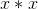（平方），或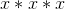，立方，依此类推。由正幂乘以常数组成的任何函数称为**单项式。** 如果我们加上或减去有限数量的这些，我们得到所谓的**多项式。**

最简单的多项式是我们已经提到的线性函数。接下来更复杂的是**二次函数;** 这些形式为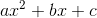，其中和为数字。立方函数在四次函数中有一个立方项，如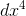，如此。

我们可以用比线性函数更多的努力来评估和绘制二次函数。唯一的区别是我们应该在 B6 中添加二次系数，并在 B10 中输入= B $ 6 * A10 * A10 + B $ 2 * A10 + B $ 3（然后将其复制到 B 列中）

例如，试试这个，将放入 B6。在 A10 中输入上述说明后，您必须将其复制到 B11 到 B500，现在您可以通过更改参数来绘制任何二次曲线。

当你这样做时，你会发现一些不错的东西，**所有的二次方看起来或多或少相似，只不过有些是颠倒的。**

也就是说，如果你绘制一个二次方并且不注意图形的比例或者哪个结束了，以及它的峰值或谷值在哪里，你就无法区分它们。除了高点和低点的比例和位置之外，具有给定二次系数符号的二次曲面都是相似的。
关于正方形的第二个好处是，当是二次方时，我们知道如何求解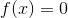形式的某些方程。

**那些方程式是什么？**

好吧，我们知道如何解决方程式

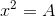意思相同：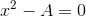

当 A 是正数时。我们可以解决它们，因为根据定义，解决方案是 **A** 的平方根。

实际上，当为正时，我们将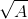（也写为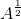）定义为正方数为的正数，该方程的两个解是和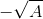。

通过算术运算，您可以将任何二次方法减少到这种可解决的形式，并解决它，您将获得着名的二次方程式解决方案。

**那是怎么回事？**

可以重写等式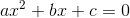（当不是时，除以）

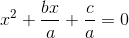

这是一样的

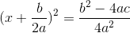

因此，左手边的平方根在这里是正或负右手边的平方根。

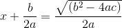

要么

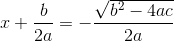

这是编写标准二次公式的一种特殊方法。

**练习 4.1 找到以下每个方程的两个解：**

**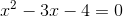**

**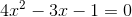**